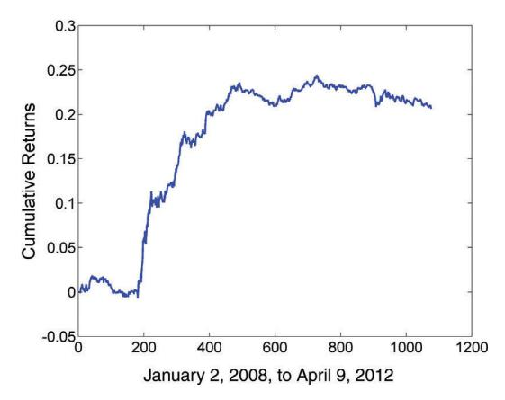

# Mean Reversion of Stocks and ETFs

The stock market is, in a sense, the most fertile ground for finding mean-reverting instruments and for the application of those basic mean reversion trading techniques described in the previous two chapters. In theory, we can form pairs of stocks belonging to any sector and expect them to cointegrate due to their exposure to many common economic factors. Their number is large, so diversification is easy. In practice, though, there are some serious difficulties with applying these generic techniques to trading stocks and ETFs. This chapter will examine issues specific to stocks and ETFs. I will also demonstrate that simple mean-reverting strategies actually work better for ETF pairs and triplets.

But we need not limit ourselves to those strategies described in Chapter 3 when looking for mean reversion in stocks or ETFs. We find that in the short term, most stocks exhibit mean-reverting properties under normal circumstances. (Normal circumstance means there isn't any news on the stock, a topic that is taken up in Chapter 7.) This is despite the fact that stock prices follow geometric random walks over the long term. We will build a strategy to exploit this short-term, or "seasonal," mean reversion.

Index arbitrage is another familiar mean reversion strategy. In this case, we are counting on the cointegration of stocks versus futures or

stocks versus ETFs. Because little profit is left using the traditional implementation of index arbitrage, we give an example of a modified strategy.

As mentioned before, in addition to the familiar time series mean reversion to which we have devoted all our attention so far, there is the phenomenon of cross-sectional mean reversion, which is prevalent in baskets of stocks. Recall that in time series mean reversion, the prices are reverting to a mean determined by their own historical prices, while cross-sectional mean reversion means that the cumulative returns of the instruments in a basket will revert to the cumulative return of the basket. The statistical tests for time series mean reversion are largely irrelevant for cross-sectional mean reversion. This additional type of mean reversion makes creating any sort of mean-reverting strategy for stocks even easier.

 Because of this ease of fi nding mean-reverting patterns, the stock market attracts a large number of traders, often called *statistical arbitrageurs,* to exploit such patterns. As a result, the returns in such strategies have generally decreased. We discuss a few simple tricks that can boost their otherwise declining performances.

Once again, we emphasize that the backtesting results in this book do not include transaction costs. One reason for this omission is that transaction costs can depend quite sensitively on the exact execution method used and the exact stock universe chosen for the stock models. A more specific pitfall included in the backtesting of the stock models is the use of data with survivorship bias, since survivorship bias-free data is more cumbersome and expensive to assemble. The hope is that the results are not too unrealistic, at least for results in the past year or two. If you intend to redo the backtests with survivorship bias–free databases, you should remember that the chosen stock index (typically Standard & Poor's [S&P] 500) has a changing composition throughout its history, too. To do this properly, you would need a database containing the historical daily index compositions. Remember also the issue of primary versus consolidated stock prices discussed in Chapter 1. The historical prices used here are all consolidated opens and closes. But if you implement some of these strategies using market-on-open (MOO) or limit-on-open (LOO) orders, or similarly market-on-close (MOC) or limit-on-close (LOC) orders, you will be filled at the primary exchange open or close. Usually, this means that the actual returns will be lower than those reported here.

# ■ **The Diffi culties of Trading Stock Pairs**

Pair trading of stocks is the fi rst type of algorithmic mean reversion strategy institutional traders invented, reportedly by Gerry Bamberger at Morgan Stanley (Patterson, 2010). Yet nowadays it can be surprisingly diffi cult to squeeze profi ts out of it.

If we test the daily price series of individual stocks, they almost never meet the defi nition of stationarity as defi ned in Chapter 2. The geometric random walk describes their behaviors fairly well: once they walked away, they seldom returned to their starting points. (Their intraday and seasonal mean-reverting properties are special cases to be discussed later on.)

Even if you pair them up in some sensible way (e.g., Exxon versus Chevron, or Citibank versus Bank of America), they are seldom cointegrating *out-ofsample*. I emphasize out-of-sample because it is quite easy to fi nd cointegrating stock pairs in any chosen period of time, but they can just as easily lose cointegration in the subsequent out-of-sample period. The reason for this diffi culty is that the fortunes of one company can change very quickly depending on management decisions and the competition. The fact that two companies are in the same industry sector does not guarantee that they will be subjected to the same fortune (think AAPL versus BBRY). The upshot is that it is diffi cult to be consistently profi table in trading a single pair of stocks using a mean-reverting strategy unless you have a fundamental understanding of each of the companies and can exit a position in time before bad news on one of them becomes public.

What if we trade a large number of pairs of stocks, so that occasional derailment of some pairs would not aff ect the profi tability of the entire portfolio? The law of large numbers will only work in our favor if the expected return of an individual pair in the out-of-sample period is positive, but I have not found this to be the case for stock pairs. Apparently, the small profi ts gained by the "good" pairs have been completely overwhelmed by the large losses of the pairs that have gone "bad."

Other than these fundamental problems with stock pairs trading, there are two additional technical diffi culties.

The fi rst diffi culty is short-sale constraint. It is particularly dangerous for a stock pair that involves shorting a hard-to-borrow stock, because even if your position is ultimately profi table, you may be forced to liquidate it at the most unprofi table and inopportune time. This may happen when you are short this stock and it suddenly jumps up in value due to some unexpected good news, and many lenders of this stock are eager to sell them. In this case, your borrowed stock may be recalled, and you will be forced to buy to cover this position at a big loss, while selling the long position on the other leg. This is called the *short squeeze.*

Under the same heading of short-sale constraint, the new alternative uptick rule in eff ect in the U.S. stock markets since 2010 also creates uncertainty in both backtesting and live executions of stock pairs strategy. Once the circuit breaker is triggered, we are essentially forbidden to send short market orders.

The second diffi culty arises in the intraday trading of stock pairs. Since the profi t margins in stock pairs trading have been decreasing through the years, it becomes imperative to enter and exit positions intraday to capture the best prices. Also, if traders refrain from taking overnight positions in stock pairs, they may be able to avoid the changes in fundamental corporate valuations that plague longer-term positions mentioned above. However, intraday pair trading of stocks runs into the problem that the national best bid and off er (NBBO) quote sizes for stocks (and for ETFs) have become very small. This may be due to the prevalence of using dark pools or undisplayed "iceberg" orders by institutional traders, the breaking up of large orders into very small child orders by smart execution algorithms, the advent of high-frequency traders submitting small orders that they can cancel and replace frequently, and, fi nally, the reluctance of market makers to display large order sizes to avoid being taken advantage of by high-frequency traders.

For example, it is not unusual for AAPL to have an NBBO size of just 100 shares! Therefore, backtesting a stock pair–trading strategy using either trade or quote prices is not very realistic unless you trade only 100 shares or if you include a substantial transaction cost. The same phenomenon leads to diffi culties in live execution also. If we were to submit market orders for both sides after a trading signal was triggered by the NBBO prices, we could have suff ered a substantial slippage. We are forced to send limit orders for one side (or for both sides with small fractions of an order and suff er temporary small unhedged positions) and actively manage the possible cancellations and resubmissions of this order in case they are not fully fi lled.

Why was pair trading stocks so profi table in the past? One general reason is that the market was much more ineffi cient back then, so the normal profi ts from the pairs that do mean-revert are large enough to cover those losses from pairs that don't. This is, of course, a common plague for any profi table strategies, but it is particularly acute for such well-known strategies as pair trading of stocks. One specifi c reason for the decline in profi ts of stock pairs trading is the decimalization of U.S. stock prices. Decimalization caused bid-ask spreads to dramatically narrow, so pair traders, who act as a type of market makers, fi nd that their market-making profi ts decrease also (Serge, 2008).

Of course, the fact that pair trading of stocks is not very profi table in the highly effi cient U.S. markets does not mean that they are not profi table in other countries. But for the U.S. market, we have the alternative of profi tably pair trading ETFs instead.

# ■ **Trading ETF Pairs (and Triplets)**

The one advantage of trading ETF pairs instead of stock pairs is that, once found to be cointegrating, ETF pairs are less likely to fall apart in outof-sample data. That is because the fundamental economics of a basket of stocks changes much more slowly than that of a single company. For example, since both Australia and Canada are commodity-based economies, EWA and EWC (their respective stock index ETFs) are good candidates for cointegration tests. And, indeed, we confi rmed their cointegration in Chapter 3. I mentioned this pair back in 2009 on my blog ([http://epchan](http://epchan.blogspot.com/2009/11/in-praise-of-etfs.html?showComment=1257434002472#c1235760260813269054) [.blogspot.com/2009/11/in-praise-of-etfs.html?showComment](http://epchan.blogspot.com/2009/11/in-praise-of-etfs.html?showComment=1257434002472#c1235760260813269054)=125743 [4002472#c1235760260813269054\), an](http://epchan.blogspot.com/2009/11/in-praise-of-etfs.html?showComment=1257434002472#c1235760260813269054)d their cointegration continues as of this writing (November 2012). The pair selection process for ETFs is quite easy: we need to fi nd ETFs that are exposed to common economic factors. Besides country ETFs, sector ETFs are another fertile ground for fi nding cointegrated instruments. For example, the retail fund RTH cointegrates with the consumer staples fund XLP. With the proliferation of ETFs tracking more or less the same sector, pair-trading opportunities are steadily increasing.

Another favorite ETF pairing of mine is between a commodity ETF and an ETF of companies that produce that commodity. The gold fund GLD versus the gold miners fund GDX is a good example. The rationale is that since the main asset of a gold-mining company is gold, their values should cointegrate with gold spot prices. And, indeed, they have done so—until July 14, 2008, or thereabout. If we test for cointegration of GLD versus GDX between May 23, 2006, and July 14, 2008, using the Johansen test, we fi nd that they cointegrate with 99 percent probability, but if we test over the period July 15, 2008, to April 9, 2012, they have lost the cointegration. What happened on July 14, 2008? That's when oil (the West Texas Intermediate fl avor) price peaked at around \$145 per barrel, an all-time high. What has oil price got to do with the cointegration between gold price and gold miners' share prices? A lot, apparently. It turns out that when oil prices are expensive, it costs a lot more to mine gold, and therefore the profi ts of gold miners are reduced, leading to the underperformance of their share prices relative to gold spot prices ("The Wacky World of Gold," 2011).

To gather empirical support for this explanation, we can introduce the oil fund USO into the portfolio and see if this triplet cointegrates over the entire period from 2006 to 2012. The Johansen test shows that they do, with a 99 percent probability that there exists one cointegrating relationship. Hence, instead of just trading GLD and GDX, we can trade this portfolio of triplets instead. Even if you fi nd trading a triplet too cumbersome, you should at least have a rule in place to cease trading GLD versus GDX whenever oil price exceeds a certain threshold.

This example has particular signifi cance. When scientists fi rst come upon an unexplained phenomenon, they form a hunch about its cause, and then they fi nd ways to test this hunch empirically. We should adopt the same scientifi c process in approaching trading. When a trading strategy stops working, we should form a hypothesis of the reason, and then test empirically whether that hypothesis is supported by data. The outcome of this process is often a modifi ed strategy that regains profi tability.

One might think that the oil fund USO versus the energy sector fund XLE is another example of a commodity versus commodity producer pair, but there is a problem with this pairing. While GLD owns gold, and thus refl ects the gold spot price, USO doesn't actually own oil. It invests in oil futures contracts. As we will discuss in Chapter 5, futures price of a commodity diff ers from its spot price. Even if XLE cointegrates with the spot price of oil, it may not necessarily cointegrate with USO. Of course, this problem plagues any commodity futures fund versus commodity producer fund. Mean reversion trading of such pairs would be much less risky if the commodity fund holds the actual commodity rather than the futures.

The mechanics of trading ETF pairs is the same as trading stock pairs. The old uptick rule exempted ETFs, but the new alternative uptick rule covers all securities traded on U.S. stock exchanges. However, the NBBO sizes for ETFs are certainly much larger than that for stocks. For example, on a typical day, the NBBO sizes for EWC can be around 5,000 shares.

# ■ **Intraday Mean Reversion: Buy-on-Gap Model**

Stock prices follow geometric random walks, as many fi nancial scholars have tirelessly reminded us (Malkiel, 2008). But this is true only if we test their price series for mean reversion strictly at regular intervals (such as using their daily closes). Our job as traders is to fi nd special conditions, or special periods, such that mean reversion occurs with regularity, while at the same time avoiding data-snooping bias. As the following strategy will show, there may indeed be seasonal mean reversion occurring at the intraday time frame even for stocks.

The rules for the strategy are:

- 1. Select all stocks near the market open whose returns from their previous day's lows to today's opens are lower than one standard deviation. The standard deviation is computed using the daily closeto-close returns of the last 90 days. These are the stocks that "gapped down."
- 2. Narrow down this list of stocks by requiring their open prices to be higher than the 20-day moving average of the closing prices.
- 3. Buy the 10 stocks within this list that have the lowest returns from their previous day's lows. If the list has fewer than 10 stocks, then buy the entire list.
- 4. Liquidate all positions at the market close.

The rationale for this strategy is that on days when the stock index futures are down before the open, certain stocks suff er disproportionately due to panic selling at the open. But once this panic selling is over, the stock will gradually appreciate over the course of the day.

Rule 2 is often very useful in mean-reverting strategies: it is basically a momentum fi lter superimposed on a mean-reverting strategy, a technique that we will reprise often. Usually, those stocks that dropped "just a little" have a better chance of reversal than those that dropped "a lot" because the latter are often the ones that have negative news such as poor earnings announcements. Drops caused by negative news are less likely to revert. We can actually develop momentum strategies based on such breaking news (more on this in Chapter 7). Furthermore, the fact that a stock is higher than a long-term moving average attracts selling pressure from larger players such as long-only funds, whose trading horizons tend to be longer. This demand for liquidity at the open may exaggerate the downward pressure on the price, but price moves due to liquidity demands are more likely to revert when such demands vanish than price moves due to a shift in the fundamental economics of the stock. Therefore, this strategy can succeed in a news-heavy environment where traditional interday stock pairs trading will likely fail.

The MATLAB code to backtest this strategy is displayed in Example 4.1.

### **Example 4.1: Buy-on-Gap Model on SPX Stocks**

This code, which backtests the Buy-on-Gap model, can be downloaded as *bog.m*. It requires as input three *T* × *N* arrays, *op*, *lo*, and *cl*, where *T* is the number of days, *N* is the number of stocks in the universe, and *op* contains the daily open prices, *lo* contains the daily lows, and *cl* the daily closes. The stock universe we used to backtest is the S&P 500, but one that has survivorship bias.

```
topN=10; % Max number of positions
entryZscore=1;
lookback=20; % for MA
stdretC2C90d=backshift(1, smartMovingStd(calculateReturns ...
 (cl, 1), 90));
buyPrice=backshift(1, lo).*(1-entryZscore*stdretC2C90d);
retGap=op-backshift(1, lo))./backshift(1, lo);
pnl=zeros(length(tday), 1);
positionTable=zeros(size(cl));
ma=backshift(1, smartMovingAvg(cl, lookback));
for t=2:size(cl, 1)
       hasData=find(isfinite(retGap(t, :)) & op(t, :) ...
        < buyPrice(t, :) & op(t, :) > ma(t, :));
       [foo idxSort]=sort(retGap(t, hasData), 'ascend');
       positionTable(t, hasData(idxSort(1:min(topN, ...
        length(idxSort)))))=1;
end
retO2C=(cl-op)./op;
pnl=smartsum(positionTable.*(retO2C), 2);
ret=pnl/topN; 
ret(isnan(ret))=0;
```

This strategy has an annual percentage rate (APR) of 8.7 percent and a Sharpe ratio of 1.5 from May 11, 2006, to April 24, 2012. The cumulative returns curve is depicted in Figure 4.1.

I have traded a version of it quite profi tably in my personal account as well as in a fund that I comanaged. Unfortunately, that version


**FIGURE 4.1** Cumulative Returns of Buy-on-Gap Model

does not include rule 2, and it suff ered from diminishing returns from 2009 onward. The long-only nature of the strategy also presents some risk management challenges. Finally, the number of stocks traded each day is quite small, which means that the strategy does not have a large capacity.

The astute reader may wonder how we can use open prices to determine the trading signals for entry at the open and be fi lled at the offi cial open prices. The short answer is, of course: We can't! We can, however, use the preopen prices (for example, at ARCA) to determine the trading signals. The signals thus determined will not exactly match the ones determined by the actual open prices, but the hope is that the diff erence will not be so large as to wipe out the returns. We can call this diff erence *signal noise*. Also, note the pitfall of backtesting this strategy using consolidated prices versus primary exchange prices, as explained in Chapter 1.

What about the mirror image of this strategy? Can we short stocks that gap up a standard deviation but are still lower than their 20-day moving average? Yes, we can. The APR is 46 percent and the Sharpe ratio is 1.27 over the same period. Despite the seemingly higher return than the long-only strategy, the short-only one does have steeper drawdown (see Figure 4.2), and it suff ered from the same short-sale constraint pitfall discussed before.

This strategy is actually quite well known among traders, and there are many variations on the same theme. For example, you can obviously trade both the long-only and short-only versions simultaneously. Or you can trade a hedged version that is long stocks but short stock index futures. You can


**FIGURE 4.2** Cumulative Returns of Short-on-Gap Model

buy a larger number of stocks, but restricting the number of stocks within the same sector. You can extend the buying period beyond the market open. You can impose intraday profi t caps. But the important message is: Price series that do not exhibit mean reversion when sampled with daily bars can exhibit strong mean reversion during specifi c periods. This is seasonality at work at a short time scale.

# ■ **Arbitrage between an ETF and Its Component Stocks**

Many readers would be familiar with the strategy of "index arbitrage," which trades on the difference in value between a portfolio of stocks constituting an index and the futures on that index. If the stocks are weighted in the same way used to construct the index, then the market value of the portfolio will cointegrate very tightly with the index futures. Maybe too tightly—unfortunately, this is such a well-known strategy that the difference in market values has become extremely small (Reverre, 2001). All but the most sophisticated traders can profit from this strategy, and it most certainly needs to be traded intraday, perhaps at high frequency (see Box 4.1). In order to increase this difference, we can select only a subset of the stocks in the index to form the portfolio. The same concept can be applied to the arbitrage between a portfolio

97

#### **High-Frequency Index Arbitrage**

High-frequency traders have been able to exploit two deficiencies in the intraday computations of the indices and arbitrage between the futures tracking these indices versus the component stocks. The first deficiency is that many major indices including Dow Jones, S&P, Nasdaq, and Russell are computed using only the primary exchange trades data (see Chapter 1 on primary versus consolidated stock prices), which represent less than 30 percent of all shares traded on those stocks (Arnuk and Saluzzi, 2012). The second deficiency is that the index is updated only once every few seconds. Both deficiencies lead to a discrepancy between the true, most up-to-date market value of a basket of component stocks and the index value itself. As a result, the index future value can be expected to lag the instantaneous market value of the stocks. If the index future value is higher than the instantaneous market value, we can simply short the future and vice versa. Where can we get this true, instantaneous market value of the stocks? We would, of course, need to subscribe to the direct data feed of every U.S. stock exchange and ECN (and not the SIAC feed) and monitor the trade prices for all the stocks in the index with millisecond latency in all these venues. Nobody said highfrequency trading is easy!

of stocks constituting an ETF and the ETF itself. In this case, we choose just a proper subset of the constituent stocks to form the portfolio. One selection method is to just pick all the stocks that cointegrate individually with the ETF. We will demonstrate the method by using the most famous ETF of all: SPY.

We will pick one year of data (in our example, January 1, 2007, to December 31, 2007) as a training set and look for all the stocks that cointegrate with SPY with at least 90 percent probability using the Johansen test. Then we form a portfolio of these stocks with equal capital on each stock, and confirm using the Johansen test again that this long-only portfolio still cointegrates with SPY. This step is necessary because an arbitrary assignment of equal capital weight to each stock does not necessarily produce a portfolio price series that cointegrates with that of SPY, even if each of the constituent stocks is cointegrating with SPY. We are using log price in this second test because we expect to rebalance this portfolio every day so that the capital on each stock is constant. (See the discussions in Chapter 3.) After confirming cointegration, we can then backtest the linear mean reversion strategy described in Chapter 2. The MATLAB source codes are displayed in Example 4.2.

## **Example 4.2: Arbitrage between SPY and Its Component Stocks**

This code can be downloaded as *indexArb.m*. It requires as input a TxN array *cl*, where *T* is the number of days, *N* is the number of stocks in the universe, and *cl* the daily closes. The stock universe we used to backtest is the same as that used in Example 4.1, and the symbols it contains are in a cell array *stocks*. All these arrays are packaged in a structure *stks*. In addition, we need a Tx1 array *cl* for the daily closes of SPY. These are packaged in a structure *etf*. Of course, we must ensure that dates for *stks* and *etf* match. The common trading dates are contained in a Tx1 array *tday*. We will run the Johansen test on only the fi rst part of this data: January 1, 2007, to December 31, 2007. This is designated as the training set.

```
trainDataIdx=find(tday>=20070101 & tday<=20071231);
testDataIdx=find(tday > 20071231);
isCoint=false(size(stks.stocks));
for s=1:length(stks.stocks)
       % Combine the two time series into a matrix y2 for 
        % input into Johansen test
       y2=[stks.cl(trainDataIdx, s), etf.cl(trainDataIdx)];
       badData=any(isnan(y2), 2);
       y2(badData, :)=[]; % remove any missing data
       if (size(y2, 1) > 250)
            results=johansen(y2, 0, 1); % johansen test 
             % with non-zero offset but zero drift, and with 
              % the lag k=1.
            if (results.lr1(1) > results.cvt(1, 1))
                 isCoint(s)=true;
            end
       end
end
length(find(isCoint))
```

Based on the Johansen test between each stock in SPX with SPY over the training set, we fi nd that there are 98 stocks that cointegrate (each separately) with SPY. Now we can form a long-only portfolio with all stocks that cointegrate with SPY, with equal capital allocation. We must then test the cointegration of this portfolio with SPY.

#### **Example 4.2 (***Continued***)**

```
yN=stks.cl(trainDataIdx, isCoint);
logMktVal_long=sum(log(yN), 2); % The net market value of 
 the long-only portfolio is same as the "spread"
% Confirm that the portfolio cointegrates with SPY
ytest=[logMktVal_long, log(etf.cl(trainDataIdx))]; 
results=johansen(ytest, 0, 1); % johansen test with non-zero 
 offset but zero drift, and with the lag k=1.
prt(results);
% Output:
% Johansen MLE estimates 
% NULL: Trace Statistic Crit 90% Crit 95% Crit 99%
% r <= 0 variable 1 15.869 13.429 15.494 19.935 
% r <= 1 variable 2 6.197 2.705 3.841 6.635
% 
% NULL: Eigen Statistic Crit 90% Crit 95% Crit 99% 
% r <= 0 variable 1 9.671 12.297 14.264 18.520 
% r <= 1 variable 2 6.197 2.705 3.841 6.635 
results.evec
%
```

% ans = % % 1.0939 -0.2799 % -105.5600 56.0933

The Johansen test indicates that the long-only portfolio does cointegrate with SPY with better than 95 percent probability. So we can form a long-short stationary portfolio comprising both the stocks and SPY, using the Johansen eigenvector to determine the weights of SPY versus that of the stock portfolio. (There are, in fact, two cointegrating relations, but we will pick the one with the largest eigenvalue—the fi rst column of the eigenmatrix—to form this stationary portfolio.) As the Johansen test was performed on the log prices, the hedge ratios (represented by the *weights* array) on the stocks or SPY represent dollar capital allocation, not number of shares, as explained in Chapter 3. (The weight on each individual stock is, of course, the same, due to our assumption of equal capital allocation, but it diff ers from the weight on SPY.)

(*Continued* )

## **Example 4.2 (***Continued***)**

We then apply the linear mean reversion strategy on this portfolio over the test period January 2, 2008, to April 9, 2012, much in the same way as Example 2.8, except that in the current program we have fi xed the look-back used for calculating the moving average and standard deviations of the portfolio market value to be 5, with the benefi t of hindsight.

```
% Apply linear mean-reversion model on test set
yNplus=[stks.cl(testDataIdx, isCoint), etf.cl(testDataIdx)]; ...
 % Array of stock and ETF prices
weights=[repmat(results.evec(1, 1), size(stks.cl(testDataIdx, 
 isCoint))), ...
    repmat(results.evec(2, 1), size(etf.cl(testDataIdx)))]; ...
     % capital allocation among the stocks and SPY.
logMktVal=smartsum(weights.*log(yNplus), 2); % Log market 
 % value of long-short portfolio
lookback=5;
numUnits=-(logMktVal-movingAvg(logMktVal, lookback)) ...
 ./movingStd(logMktVal, lookback); 
 positions=repmat(numUnits, [1 size(weights, 2)]).*weights; 
 % positions is the dollar capital in each stock or SPY.
pnl=smartsum(lag(positions, 1).*(log(yNplus)- ...
 lag(log(yNplus), 1)), 2); 
 ret=pnl./smartsum(abs(lag(positions, 1)), 2); 
 ret(isnan(ret))=0;
```

The APR of this strategy is 4.5 percent, and the Sharpe ratio is 1.3. As you can see from the cumulative returns chart (Figure 4.3), the performance decreases as time goes on, partly because we have not retrained the model periodically to select new constituent stocks with new hedge ratios. In a more complete backtest, we can add this dynamic updating of the hedge ratios.

The same methodology can, of course, be applied to any ETFs, indices, or subindices you like. Furthermore, we can use a future instead of an ETF if such a future exists that tracks that index or subindex, although in this case one has to be careful that the prices of the future used in backtest are contemporaneous with the closing prices for the stocks. (This was pointed out as a potential pitfall in Chapter 1.)

## **Example 4.2 (***Continued***)**



**FIGURE 4.3** Cumulative Returns of Arbitrage between SPY and Its Component Stocks

You may wonder why we didn't just directly run a Johansen cointegration test on all 500 stocks in SPX plus SPY, and let the algorithm automatically fi nd an eigenvector of cointegrating instruments that include the SPY. (Not all cointegrating relations from the stocks+SPY universe necessarily include SPY, but we need only pick one that does.) The problem with this approach is twofold:

- 1. The Johansen test implementation that I know of can accept a maximum of 12 symbols only (LeSage, 1998).
- 2. The eigenvectors will usually involve both long and short *stock* positions. This means that we can't have a long-only portfolio of stocks that is hedged with a short SPY position or vice versa. This is a problem because if we have short positions in the stock portfolio and a short SPY position simultaneously, we would be double short on some stocks even when we are long the stock portfolio, increasing our specifi c risks.

There is an alternative method of constructing a long-only portfolio of stocks. We can still use Johansen test to individually test each stock in SPX for cointegration with SPY. After this subset of stocks is found, we include them in a stock portfolio and then use a constrained optimization method (e.g., genetic algorithm or simulated annealing) to minimize the average absolute diff erence between this stock portfolio price series and the SPY price series. The variables that we want to optimize in this case are the hedge ratios of the stocks, and the constraints are that all hedge ratios must be positive. The MATLAB Global Optimization Toolbox provides functions for either genetic algorithm or simulated annealing for this constrained optimization task.

This strategy suff ers from the same short-sale constraint that plagued any strategies involving short stock positions. However, the problem is not too serious here because the stock portfolio is quite diversifi ed with about 98 stocks. If a few stocks have to be removed due to the short-sale constraint, the impact should be limited.

# ■ **Cross-Sectional Mean Reversion: A Linear Long-Short Model**

In mean reversion trading based on cointegration, we form a portfolio with a fi xed set of instruments and with either a fi xed number of shares or a fi xed dollar capital for each instrument. This fi xed number may be determined by fi at (as in Example 4.2), linear regression, the Johansen test, or constrained optimization. But there is no reason why the portfolio has to consist of the same fi xed set of instruments or the same weightings over this set of instruments every day. For many portfolio stock-trading strategies, the edge comes precisely from the intelligent daily selection or reweighting of stocks.

In this type of so-called "cross-sectional" mean reversion strategy, the individual stock (and this type of strategy most commonly involves stocks, not futures or currencies) price does not necessarily revert to its own historical mean. Rather, the focus is on their short-term relative returns, and we rely on the serial anti-correlation of these relative returns to generate profi ts. In most cases, the relative returns are computed as a stock's return minus the average returns of all the stocks in a particular universe. So we expect the underperformance of a stock to be followed by overperformance, and vice versa. Since we are measuring only relative return, it is quite possible that we will short a stock even though its previous (absolute) return is negative, as long as it is not as negative as the average return across all stocks in the universe.

One interesting feature of cross-sectional strategies is that, in contrast to "time series" strategies, we should not expect profi ts from every individual stock, as some of them may serve as "hedges" on some days. Rather, profi ts can be obtained only in the aggregate across all the stocks.

I described in my previous book just such a strategy proposed by Khandani and Lo (Example 3.7 of Chan, 2009; original paper is Khandani and Lo, 2007). With this strategy, we invest in every stock from some favorite index such as S&P 500, S&P 1500, or Russell 2000, but with diff erent capital allocation per stock. Near the market close of each day, we will determine the long or short capital *wi* allocated to the *i th* stock as

$$w_i = -\frac{r_i - \langle r_j \rangle}{\sum_k |r_k - \langle r_j \rangle|} \qquad (4.1)$$

where *ri* is the daily return of the *i th* stock, and 〈*rj* 〉 is the average daily return of all the stocks in the index. In other words, if a stock has a very positive return relative to its peers, we will short lots of it, and if it has a very negative return relative to its peers, we will buy lots of it. Note that we always invest the same total gross capital of \$1 to the portfolio every day because of the normalization factor in the denominator. The MATLAB code fragment for this is displayed in Example 4.3.

#### **Example 4.3: Linear Long-Short Model on Stocks**

The implementation of Equation 4.1 in MATLAB is very compact. We assume an input *T* × *N* array *cl* of daily closing prices, where as usual *T* is the number of trading days and *N* is the number of stocks in the SPX. This code can be downloaded as *andrewlo\_2007\_2012.m*.

```
ret=(cl-lag(cl, 1))./lag(cl, 1); % daily returns
marketRet=smartmean(ret, 2); % equal weighted market index 
 % return
weights=-(ret-repmat(marketRet, [1 size(ret, 2)]));
weights=weights./repmat(smartsum(abs(weights), 2), ...
 [1 size(weights, 2)]);
dailyret=smartsum(backshift(1, weights).*ret, 2); % Capital 
 % is always one
```

It has an APR of 13.7 percent and Sharpe ratio of 1.3 from January 2, 2007, to December 30, 2011, even if we backtest on the SPX. (Usually, backtesting on a smaller cap universe will generate even higher returns.) The cumulative returns are plotted in Figure 4.4.

(*Continued* )


**FIGURE 4.4** Cumulative Returns of Linear Long-Short Model

The notable feature of this strategy is that it is completely linear, has no parameters, and is almost perfectly dollar neutral. What strategy can be simpler than this? And remarkably, it achieved an APR of 30 percent in 2008, the year of Lehman Brothers' bankruptcy, and an APR of 11 percent in 2011, a year fi lled with high anxiety about the U.S. federal debt rating downgrade and the Greek default. (Its performance since the beginning of 2008 is a true out-of-sample test, as the strategy was published in 2007.)

In my previous book, I also suggested that we may enhance the returns of this strategy by using the return from the previous close to today's open to determine the weights for entry at the open. All the positions will be liquidated at the market close, thus turning it into an intraday strategy. The modifi ed MATLAB code fragment is displayed in Example 4.4.

There are possibly other variables (also called "factors") that are better at predicting cross-sectional mean reversion of stock prices than the relative returns that we have used in Examples 4.3 and 4.4. One popular variable that traders use to rank stocks is the price-earnings (P/E) ratio, where the earnings may be that of the last quarter, or they may be projected earnings estimated by the analysts or the companies themselves. The reasoning is that

## **Example 4.4: Intraday Linear Long-Short Model on Stocks**

In addition to the inputs required in Example 4.3, we need also the *T* × *N* array *op,* which contains the daily open prices of the stocks.

```
ret=(op-backshift(1, cl))./backshift(1, cl); % daily returns
marketRet=smartmean(ret, 2); % equal weighted market index 
 % return
weights=-(ret-repmat(marketRet, [1 size(ret, 2)])); 
weights=weights./repmat(smartsum(abs(weights), 2), ...
 [1 size(weights, 2)]);
dailyret=smartsum(weights.*(cl-op)./op, 2) ...
 ./smartsum(abs(weights), 2);
```

The APR and Sharpe ratio over the same period are 73 percent and 4.7, respectively. Despite such seemly stellar performance, the open-to-close version suff ers from a few drawbacks that the close-toclose version does not have.

First, the transaction costs (not included in our backtests) will be doubled, because we are trading twice a day instead of just once a day. Second, since this strategy also has to use "open" prices to determine the trading signals for entry at the open, it is subject to the same trading signal noise that I mentioned in the Buy-on-Gap Model in Example 4.1.

Actually, even for the close-to-close strategy, we also can't use the exact closing price to determine the weights and then enter at exactly those prices. But in that case, the prices just a few seconds before the close are typically much closer to the actual offi cial (primary exchange) closing prices because these preclose prices are printed when the primary market is open and has high liquidity.

stock prices will drift toward a new equilibrium value if there are earning announcements or estimates changes. So a stock that experiences a positive change in earnings estimates will likely enjoy a positive return, and we should not expect the price to mean-revert if this return is in line with the percent change in its earnings estimates. We can therefore avoid shorting such a stock if we use P/E ratio to rank the stocks.

## **KEY POINTS**

- Are you tempted to trade pairs of stocks because of the enormous number of choices? Beware of changes in companies' fundamentals that can render out-of-sample performance quite poor despite stellar backtest results.
- Trading a portfolio of cointegrating ETFs can be better than pair-trading stocks.
- Are you pair trading ETFs that hold futures? Beware of the role of roll returns in determining total returns of futures.
- Seasonal or intraday mean reversion is hard to detect with usual stationarity or cointegration tests, but can be very profi table.
- Imposing momentum fi lter on mean-reversal strategies typically improves their consistency.
- Do you think that index arbitrage between stocks and futures is no longer profi table? Try selecting only a subset of the stocks in the index.
- Cross-sectional mean reversion strategies can be implemented very easily with a linear long-short strategy.
- The variable used for ranking stocks in a cross-sectional mean reversion strategy is typically relative return, but it can be other fundamental factors such as P/E ratio.