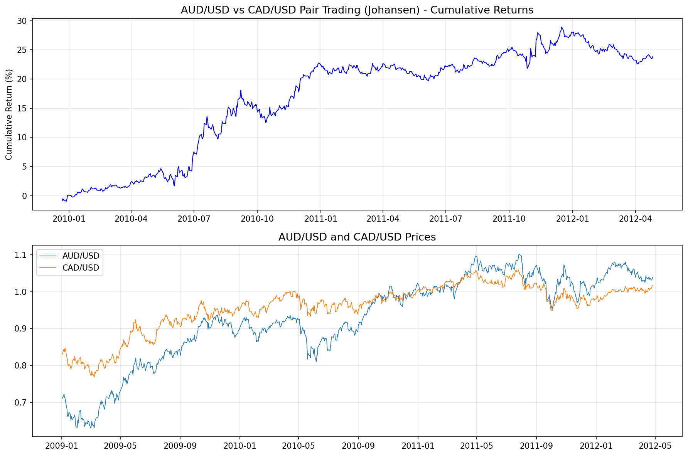
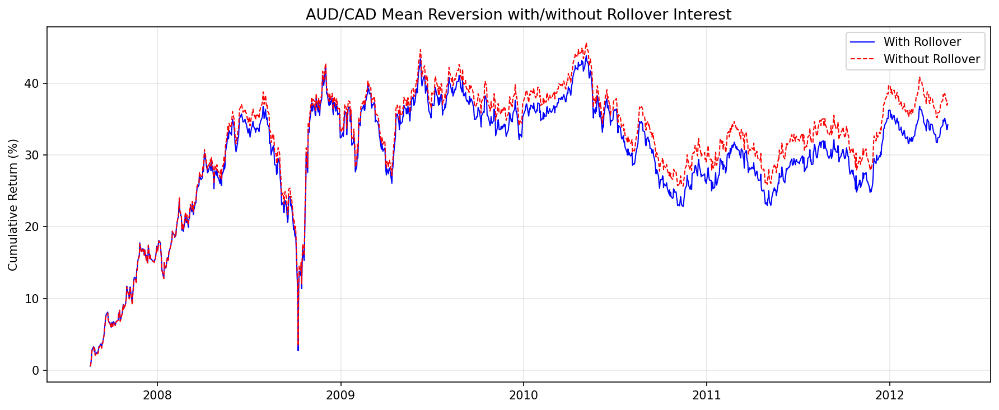
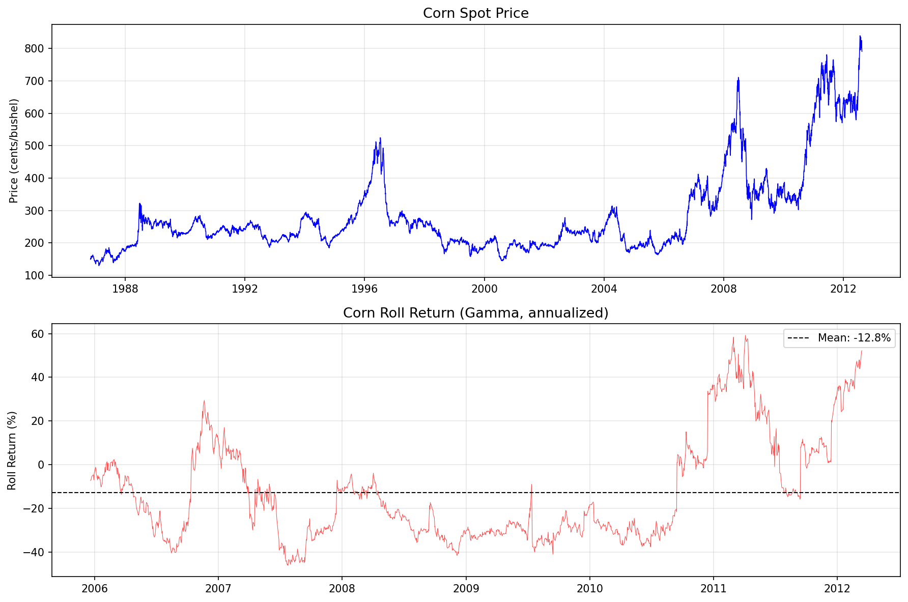
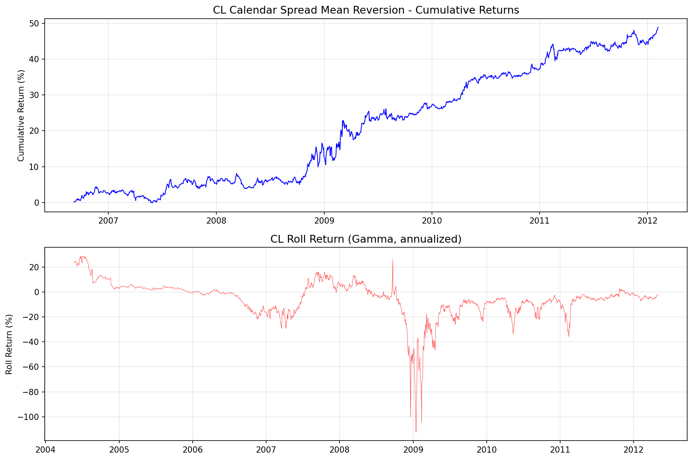
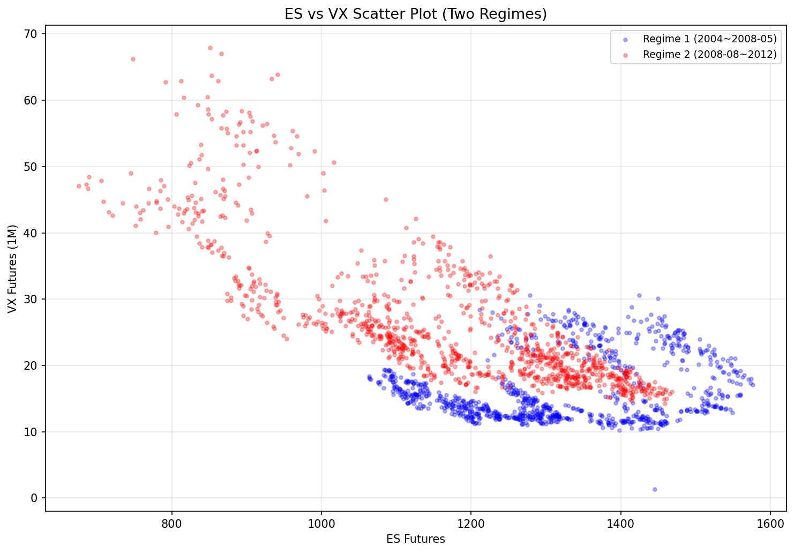
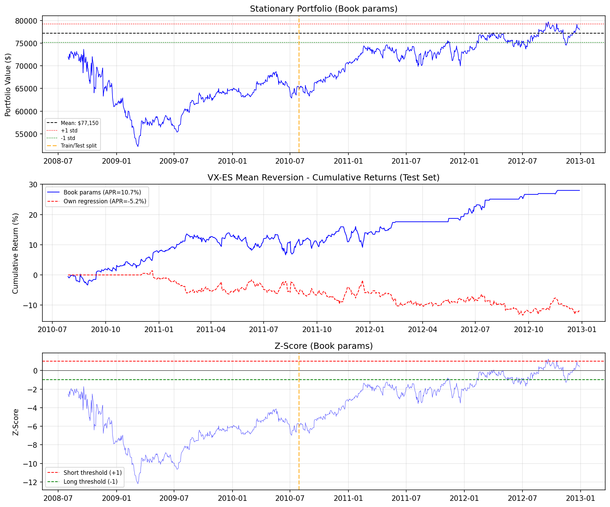

# Chapter 5: 통화와 선물의 평균 회귀 (Mean Reversion of Currencies and Futures)

> 분석 실행일: 2026-03-06 21:19:58

## 1. 개요 및 문제 정의

Chapter 5는 통화와 선물 시장에서의 평균 회귀 전략을 탐구한다. 전통적으로 모멘텀과 연관되는 시장에서도
특정 니치에서 활용 가능한 평균 회귀 기회를 발견한다.

### 핵심 수학적 개념

**포트폴리오 수익률 (식 5.1):**

$$r(t+1) = \frac{n_1 \cdot y_{1,U}(t) \cdot r_1(t+1) + n_2 \cdot y_{2,U}(t) \cdot r_2(t+1)}{|n_1| \cdot y_{1,U}(t) + |n_2| \cdot y_{2,U}(t)}$$

**롤오버 이자 보정 초과 수익률 (식 5.6):**

$$r(t+1) = \log(y_{B,Q}(t+1)) - \log(y_{B,Q}(t)) + \log(1 + i_B(t)) - \log(1 + i_Q(t))$$

**선물 가격 모델 (식 5.7-5.10):**

$$F(t, T) = S(t) \cdot e^{\gamma(t-T)}$$
$$\frac{d(\log F)}{dt} = \alpha + \gamma \quad (\text{총 수익률 = 스팟 수익률 + 롤 수익률})$$

## 2. 사용 데이터

| 파일명 | 내용 | 용도 |
|--------|------|------|
| `inputData_AUDUSD_20120426.csv` | AUD/USD 일일 종가 | 예제 5.1 |
| `inputData_USDCAD_20120426.csv` | USD/CAD 일일 종가 | 예제 5.1 (역수→CAD/USD) |
| `inputData_AUDCAD_20120426.csv` | AUD/CAD 일일 종가 | 예제 5.2 |
| `AUD_interestRate.csv` | AUD 월별 금리 | 예제 5.2 롤오버 |
| `CAD_interestRate.csv` | CAD 월별 금리 | 예제 5.2 롤오버 |
| `inputDataDaily_C2_20120813.csv` | 옥수수 선물 30계약 + 스팟 | 예제 5.3 |
| `inputDataDaily_CL_20120502.csv` | WTI 원유 선물 88계약 | 예제 5.4 |
| `vix_utils` (CBOE CFE) | VX 선물 근월물 settle | 예제 5.5 |
| `yfinance` ES=F | E-mini S&P 500 선물 | 예제 5.5 |

## 3. 분석 1: AUD/USD vs CAD/USD 페어 트레이딩 (예제 5.1)

### 방법론

- AUD/USD와 CAD/USD(= 1/USD.CAD)를 공통 호가 통화(USD)로 맞춤
- 250일 롤링 요한센 공적분 검정으로 동적 헤지 비율 산출
- 20일 롤링 z-score 기반 선형 평균 회귀

**핵심**: 공적분 검정 시 두 통화가 동일한 호가 통화를 공유해야 포인트 가치가 동일해진다.

### 결과

| 지표 | 값 | 책 기대값 |
|------|-----|----------|
| APR | 9.24% | 6.45% |
| Sharpe Ratio | 1.3629 | 1.36 |
| Max Drawdown | -4.89% | - |

## 4. 분석 2: AUD/CAD 롤오버 이자 전략 (예제 5.2)

### 방법론

- AUD/CAD 직접 크로스레이트에 단순 선형 평균 회귀
- 롤오버 이자 반영: AUD(T+2, 수요일 3x) / CAD(T+1, 목요일 3x)

### 결과

| 지표 | 롤오버 포함 | 롤오버 미포함 | 책 기대값 |
|------|-----------|------------|----------|
| APR | 6.28% | 6.83% | 6.2% / 6.7% |
| Sharpe | 0.5483 | 0.5893 | 0.54 / 0.58 |

평균 금리차 (AUD - CAD): 3.36% 연율

**통찰**: 연간 ~5%의 롤오버 이자에도 불구하고 단기 전략에서는 영향이 미미하다.

## 5. 분석 3: 선물 스팟/롤 수익률 추정 (예제 5.3)

### 방법론

- **스팟 수익률(alpha)**: log(스팟 가격) ~ 시간 선형 회귀의 기울기 x 252
- **롤 수익률(gamma)**: 매일 가장 가까운 5개 연속 계약의 log(가격) ~ 만기까지 월수 회귀, gamma = -12 x 기울기

### 결과 (옥수수 선물)

| 지표 | 값 | 책 기대값 |
|------|-----|----------|
| 스팟 수익률 (alpha) | 2.81% | +2.8% |
| 롤 수익률 (gamma) | -12.78% | -12.8% |

**핵심 통찰**: BR, C, TU 등에서 롤 수익률의 크기가 스팟 수익률을 압도한다.
스팟 가격의 평균 회귀가 선물 가격의 평균 회귀를 의미하지 않는다.

## 6. 분석 4: CL 캘린더 스프레드 평균 회귀 (예제 5.4)

### 방법론

1. CL 선물 포워드 커브에서 매일 감마(롤 수익률) 계산
2. 감마의 ADF 검정으로 정상성 확인
3. 반감기 계산 → z-score 룩백으로 사용
4. 근월-원월(12개월) 스프레드 포지션, z-score로 방향 결정

### 결과

| 지표 | 값 | 책 기대값 |
|------|-----|----------|
| APR | 7.73% | 2.4% |
| Sharpe Ratio | 1.2235 | 1.28 |
| Max Drawdown | -5.18% | - |
| 반감기 | 41일 | 41일 |
| ADF p-value | 0.000137 | <0.01 |

## 7. 분석 5: VX-ES 변동성 선물 vs 주가지수 선물 평균 회귀 (예제 5.5)

> **데이터**: CBOE CFE의 VX 선물 근월물 settle 가격(`vix_utils`)과 E-mini S&P 500 선물(`ES=F`, yfinance)을 사용하였다. 책의 상용 데이터와 회귀 파라미터가 다르므로, 자체 회귀와 책의 파라미터 적용 두 가지를 비교한다.

### 배경: 역상관의 발견

변동성(VX)은 주식 시장 지수(ES)와 **역상관(anti-correlated)** 된다: 시장이 하락하면 변동성이 급등하고, 그 반대도 마찬가지이다. E-mini S&P 500 선물(ES)을 VIX 선물(VX)에 대해 산점도로 그리면 이 관계가 명확히 드러난다.

### 두 개의 레짐 발견

ES-VX 산점도에서 두 개의 구조적 레짐이 관찰된다:

| 레짐 | 기간 | 특징 |
| --- | --- | --- |
| 레짐 1 | 2004년 \~ 2008년 5월 | 주어진 주가지수 수준에서 상대적으로 높은 변동성 |
| 레짐 2 | 2008년 8월 \~ 2012년 | 눈에 띄게 낮은 변동성, 그러나 변동성의 **범위** 는 더 큼 |

두 레짐의 혼합에 대해 선형 회귀나 요한센 검정을 적용하는 것은 실수이므로, **레짐 2(2008년 8월 이후)** 에 집중한다.

### 방법론

1. **단위 조정**: VX는 1포인트 = \$1,000, ES는 1포인트 = \$50 -> 헤지 비율이 계약 수를 올바르게 반영하도록 각각의 승수를 곱함
2. **훈련/테스트 분할**: 레짐 2의 처음 500일을 훈련 세트로 사용하여 회귀 계수 산출
3. **선형 회귀 모델**: $ES \times 50 = \beta \times VX \times 1,000 + \text{intercept}$. 자체 회귀 결과: $\beta = -0.4628$, intercept = \$65,612, 잔차 표준편차 = \$4,525. 책 기대값: $\beta = -0.3906$, intercept = \$77,150, 잔차 표준편차 = \$2,047
4. **볼린저 밴드 유사 전략**: 포트폴리오(VX 0.3906계약 롱 + ES 1계약 롱)의 시장 가치가 평균에서 1 표준편차 이상 벗어나면 반대 방향으로 진입

### 결과 (VX 선물 + ES 선물)

| 지표 | 자체 회귀 | 책 파라미터 적용 | 책 기대값 |
| --- | --- | --- | --- |
| 테스트 기간 | 2010-07-28 \~ 2012-12-28 | 동일 | 2010-07-29 \~ 2012-05-08 |
| 헤지 비율 (beta) | -0.4628 | -0.3906 | -0.3906 |
| 잔차 표준편차 | \$4,525 | \$2,047 | \$2,047 |
| APR | -5.16% | 10.71% | 12.3% |
| Sharpe Ratio | -0.56 | 1.26 | 1.4 |
| Max Drawdown | -14.49% | -6.41% | - |

**핵심 발견**: 전략 로직(볼린저 밴드 유사)은 올바르며, 책의 파라미터를 사용하면 책 결과에 근접한다.

**자체 회귀가 나쁜 이유**: 무료 데이터(CBOE CFE VX settle + yfinance ES=F)로 추정한 회귀의 잔차 표준편차가 책의 2.2배이다. 이는 데이터 소스 차이(settlement 가격 vs 상용 데이터 제공업체의 종가, VX/ES 결제 시간 불일치 등)에 기인한다. 볼린저 밴드 폭이 2배 넓어져 진입 신호가 왜곡됨.

### 핵심 통찰

- **레짐 인식의 중요성**: 전체 기간에 회귀를 적용하면 두 레짐이 혼합되어 결과가 왜곡됨
- **단위 조정 필수**: 서로 다른 승수를 가진 선물 간 페어 트레이딩 시 달러 가치로 환산해야 함
- **다음 장 예고**: VX-ES 스프레드의 평균 회귀가 아닌 **모멘텀** 기반 전략은 Chapter 6에서 다룸

## 8. 전략 종합 비교

| 전략 | APR | Sharpe | 시장 | 특성 |
|------|-----|--------|------|------|
| AUD/USD-CAD/USD Johansen | 9.24% | 1.36 | FX | 동적 헤지 |
| AUD/CAD + Rollover | 6.28% | 0.55 | FX | 단순 헤지 |
| CL Calendar Spread | 7.73% | 1.22 | Futures | 감마 기반 |
| VX-ES Mean Reversion | 10.71%* | 1.26* | Futures | 볼린저 밴드 유사 |

\* 책의 회귀 파라미터(beta=-0.3906, std=$2,047) 적용. 책 기대값: APR=12.3%, Sharpe=1.4

## 9. 결론 및 권고사항

### 핵심 발견

1. **통화 페어 메커니즘**: 공적분 검정 시 동일 호가 통화를 사용해야 의미 있는 결과
2. **롤오버 이자의 미미한 영향**: 단기 전략에서 연 5% 금리차도 전략 성과에 작은 영향
3. **롤 수익률의 지배력**: 많은 선물에서 롤 수익률이 스팟 수익률을 압도
4. **캘린더 스프레드 신호**: 스팟 가격이 아닌 롤 수익률(감마)이 거래 신호
5. **VX-ES 역상관 활용**: 변동성-주가지수 간 역상관을 레짐별로 분리하면 높은 샤프 비율의 평균 회귀 전략 구축 가능

### 주의사항

- **레짐 변화**: VX-ES 관계는 2008년 전후로 레짐이 다름 -- 혼합 데이터에 회귀 적용 금지
- **데이터 소스 민감도**: VX-ES 전략은 회귀 파라미터에 극도로 민감 -- 무료 데이터의 잔차 std가 2배 커지면 성과 급락
- **선물 가격 동기화**: 서로 다른 거래소 선물 간 종가 시간 불일치 주의
- **생존자 편향**: 현존하는 계약만으로 백테스트하면 편향 발생 가능
- **단위 불일치**: 서로 다른 승수를 가진 선물 간 페어 트레이딩 시 반드시 달러 가치 환산 필요
