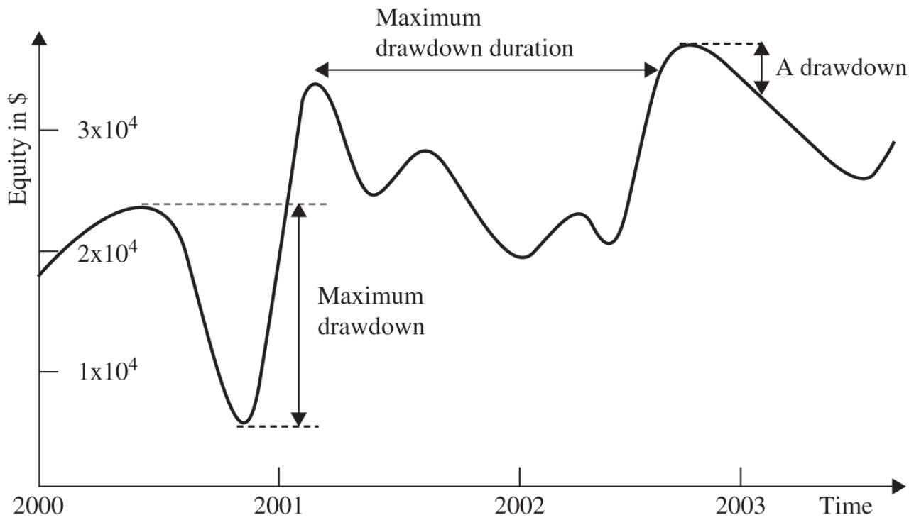

# 제2장. 아이디어 낚시 — 좋은 전략은 어디서 찾을까? 쉬운 해설판

> 이 글은 Ernest P. Chan의 *"Quantitative Trading"* (2판, 2021) 제2장의 전체 내용을 빠짐없이 담되, 전문 용어와 개념을 일상적인 비유와 풀어쓴 설명으로 재구성한 해설판입니다.

---

## 놀라운 사실: 전략 찾기는 어렵지 않다

여기서 놀라운 사실이 하나 있습니다. 좋은 트레이딩 아이디어를 찾는 것은 퀀트 트레이딩 사업에서 **가장 어려운 부분이 아닙니다.** 수백, 수천 개의 전략 아이디어가 이미 공개되어 있으며, 누구나 무료 또는 저렴한 비용으로 접근할 수 있습니다.

1장의 비유를 이어가면, 이 장은 **레시피북(전략 아이디어)을 찾는 단계** 에 해당합니다. 좋은 소식은, 요리 레시피처럼 거래 전략도 인터넷에 넘쳐난다는 것입니다!

### 전략 아이디어의 보고 (Table 2.1)

| 유형 | 출처 | URL |
|------|------|-----|
| **학술** | 경영대학원 교수 웹사이트 | hbs.edu/research |
| | SSRN (사회과학연구네트워크) | ssrn.com |
| | NBER (전미경제연구소) | nber.org |
| | 경영대학원 퀀트 세미나 | Columbia IEOR 등 |
| | **Quantpedia** (학술 논문 종합!) | quantpedia.com |
| **블로그/팟캐스트** | Flirting with Models | thinknewfound.com |
| | Mutiny Fund | mutinyfund.com/podcast |
| | Chat with Traders | chatwithtraders.com |
| | 저자 블로그 | epchan.blogspot.com |
| **트레이더 포럼** | Elite Trader | elitetrader.com |
| | Wealth-Lab | wealth-lab.com |
| **트위터** | @bennpeifert, @choffstein, @Quantocracy, @chanep 등 | |

### 학술 논문의 한계

저자는 처음에 학술 논문에서 전략을 찾았습니다. 독립 후 첫 전략도 PEAD(실적 발표 후 드리프트, 7장 참조)에 관한 학술 연구에 기반했습니다. 그러나 시간이 지나면서 학술 전략의 한계를 발견했습니다:

- **너무 복잡** 한 경우가 많음
- **이미 시효가 지난** 경우 (경쟁으로 수익성 소멸)
- **고가의 데이터** 가 필요 (역사적 기초 데이터 등)
- **소형주에서만 작동** 하는 경우가 많아, 유동성 부족으로 실전 수익이 백테스트에 미치지 못함

### 공개 전략의 진짜 가치: "변형"의 기술

트레이더 포럼이나 블로그에서 공개된 전략이 그대로 수익을 내는 경우는 드뭅니다. 대부분은 잠깐만 작동하거나, 특정 종목군에서만 작동하거나, 거래 비용을 고려하면 무너집니다.

**그러나 핵심은 이것입니다**: 기본 전략을 **변형(modify)하면 수익성을 만들 수 있습니다.** 저자의 실제 경험이 이를 잘 보여줍니다. Wealth-Lab에서 높은 샤프 비율을 주장하는 전략을 발견했으나, 백테스팅해보니 광고만큼 좋지 않았습니다. 그래서:

- 보유 기간을 줄이고
- 진입/청산 시점을 조정하는

몇 가지 간단한 변형을 시도했더니, 이 전략이 **주요 수익원 중 하나** 가 되었습니다.

### 트레이딩 블로그의 놀라운 효과

저자는 기관을 떠나면서 아이디어의 원천이 끊길까 걱정했지만, 의외의 해결책을 발견했습니다: **자신의 블로그를 시작하는 것** 입니다.

> "거래 '비밀'을 세상에 하나 공개할 때마다, 독자들로부터 여러 개의 비밀을 보상으로 받게 됩니다."

실제로 위의 Wealth-Lab 전략을 알려준 사람은 **12시간 시차가 나는 곳에 사는 블로그 독자** 였습니다. 블로그가 아니었다면 만날 기회가 없었을 것입니다.

또 다른 사례: 저자가 계절적 주식 거래 전략을 블로그에 소개했을 때, 한 독자가 즉시 백테스팅하여 **그 전략이 작동하지 않는다** 는 것을 보고해 주었습니다. 이렇게 나쁜 아이디어를 빠르게 걸러낼 수 있다는 것도 블로그의 큰 장점입니다.

저자가 40억 달러 규모의 헤지펀드 Millennium Partners에서 일할 때의 에피소드도 인상적입니다. 한 트레이더가 자기 책상 위의 논문을 프로그래머가 집은 것을 보고 **빼앗아갔습니다** — "비밀"이 유출될까 두려워서였죠. 독립 트레이더 세계에서는 $1억을 투입하여 경쟁할 위험이 없으므로, 오히려 사람들이 더 자유롭게 아이디어를 공유합니다.

**결론**: 어려운 것은 아이디어의 부족이 아닙니다. **어려운 것은 자신의 상황과 목표에 맞는 전략을 골라내는 안목** 을 기르는 것입니다.

---

## 나에게 맞는 전략 고르기

전략의 가치는 전략 자체가 아니라 **"당신"에게 맞느냐** 에 달려 있습니다. 네 가지 핵심 기준을 살펴봅시다.

### 1. 작업 시간 (Your Working Hours)

파트타임으로 거래하시나요? 그렇다면:

- **익일 보유 전략** 을 고려하세요 (일중 전략은 피해야 합니다)
- 또는 5장에서 다루는 **완전 자동화 시스템** 을 구축하여, 문제 발생 시에만 알림을 받는 방식으로 운영하세요

저자는 풀타임 직장 + 파트타임 트레이딩을 할 때, 하루 한 번 개장 전에 ETF 지정가 주문만 넣는 단순한 전략을 사용했습니다. 독립 후에도 처음에는 **개장 전 1회 + 마감 전 1회** 주문만 넣는 전략을 선택했고, 이후 자동화 수준을 높여 갔습니다.

### 2. 프로그래밍 실력 (Your Programming Skills)

| 프로그래밍 수준 | 적합한 전략 |
|---------------|-----------|
| Java/C#/C++ 가능 | 고빈도 전략, 대규모 종목 거래 |
| Visual Basic/Python/R 가능 | 중빈도 전략, 적당한 종목 수 |
| Excel만 가능 | 하루 1회 거래, 소수 종목/선물/통화 |

프로그래밍이 어려우면 **소프트웨어 컨설턴트를 고용** 하는 방법도 있습니다(5장 참조).

### 3. 거래 자본 (Your Trading Capital)

저자는 $50,000 미만의 계좌로는 퀀트 트레이딩을 권하지 않습니다. 고자본($100,000 이상)과 저자본의 선택지가 다릅니다:

| 항목 | 저자본 | 고자본 |
|------|-------|-------|
| **계좌 유형** | 프롭 회사 추천 | 리테일 브로커리지 가능 |
| **거래 상품** | 선물, 통화, 옵션 (높은 레버리지) | 주식 포함 모든 것 |
| **보유 기간** | 일중(인트라데이) 중심 | 일중 + 익일 모두 |
| **방향성** | 방향성(롱 또는 숏만) | 달러중립/시장중립 가능 |
| **데이터** | 일간 데이터, 생존편향 있을 수 있음 | 고빈도 데이터, 생존편향 없는 데이터 |
| **뉴스** | 저가/지연 뉴스 소스 | Bloomberg 등 실시간 뉴스 |

**달러중립 포트폴리오(dollar-neutral portfolio)** 란 롱 포지션의 시장 가치와 숏 포지션의 시장 가치가 동일한 포트폴리오입니다. **시장중립 포트폴리오(market-neutral portfolio)** 는 시장 지수에 대한 베타가 0에 가까운 포트폴리오입니다. 이 두 가지 모두 롱 전용 포트폴리오의 **2배 자본 또는 레버리지** 가 필요합니다.

**포트폴리오 마진(portfolio margin)** 을 사용하면 유리합니다. 예를 들어 Interactive Brokers에서 대형주 달러중립 포트폴리오를 보유하면 익일 증거금이 20% 이하로 설정될 수 있어, $100,000 현금으로 $250,000 롱 + $250,000 숏 = $500,000 규모의 포트폴리오를 운용할 수 있습니다.

**선물 거래 주의**: E-mini S&P 500(ES)의 증거금은 $12,000에 불과하지만 명목 가치는 약 $167,500입니다. 2020년 2\~4월처럼 10% 이상 일일 변동이 발생하면 최소 증거금만 있는 계좌는 전멸할 수 있습니다. 소액 계좌라면 **마이크로 E-mini(MES)** — ES의 1/10 규모 — 를 고려하세요.

**생존편향 있는 데이터로도 성공할 수 있을까?** 저자 자신도 처음 2년간 Yahoo! Finance의 생존편향 있는 데이터를 사용했고, 저자가 아는 백만 달러 계좌 트레이더도 마찬가지였지만 여전히 수익을 냈습니다. 비결은 **일중 전략** 을 사용했기 때문입니다. 도구와 데이터의 한계를 인식하고 있다면, 많은 부분을 생략하고도 성공할 수 있습니다. (현재는 Sharadar 같은 저렴한 생존편향 없는 데이터베이스가 있으므로 활용을 권합니다.)

### 4. 목표 (Your Goal)

대부분의 트레이더는 꾸준한 월별(또는 분기별) 수입을 원합니다. 하지만 장기 자본 이득만 중요한 경우도 있습니다.

**핵심 원리**: 수익을 더 규칙적으로 실현하고 싶을수록, **보유 기간은 짧아져야** 합니다.

흔한 오해가 하나 있습니다. 일부 투자 자문가는 "장기 자본 성장을 극대화하려면 매수-보유(buy-and-hold) 전략이 최선"이라고 합니다. 이는 **수학적으로 틀립니다.** 실제로 장기 성장을 극대화하려면 **최대 샤프 비율** 을 가진 전략을 찾고 충분한 레버리지를 적용하면 됩니다.

따라서 "보유 기간은 짧지만 연간 수익률은 낮고 샤프 비율이 매우 높은" 단기 전략이, "보유 기간은 길고 연간 수익률은 높지만 샤프 비율이 낮은" 장기 전략보다 — 세금과 마진 제약을 무시하면 — **장기 성장에도 더 유리합니다.** 이 놀라운 사실은 6장에서 상세히 다룹니다.

---

## 유망한 전략의 빠른 스크리닝 — 백테스팅 전 체크리스트

개인 요건에 맞는 전략 후보를 찾았다면, 시간을 들여 본격적으로 백테스팅하기 전에 **빠른 검증** 을 해야 합니다.

### 1. 벤치마크 대비 성과와 수익의 일관성

전략의 수익률 자체보다 **벤치마크 대비** 어떤가가 중요합니다:

- **롱 전용 주식 전략**: 연 10% 수익은 대단하지 않음 — 인덱스 펀드도 비슷한 수익을 냄
- **달러중립(롱-숏) 전략**: 연 10%는 매우 좋은 성과 — 벤치마크가 무위험 수익률(3개월 미국 국채 금리, 현재 거의 0%)이므로

수익의 **일관성** 도 중요합니다. 벤치마크와 평균 수익은 같더라도, 매달 양의 수익을 냈다면 벤치마크보다 우월합니다. 이를 측정하는 것이 **정보비율(Information Ratio)** 과 **샤프 비율(Sharpe Ratio)** 입니다.

**정보비율(Information Ratio)** = 초과 수익의 평균 / 초과 수익의 표준편차

여기서 초과 수익 = 포트폴리오 수익 - 벤치마크 수익

**샤프 비율(Sharpe Ratio)** 은 정보비율의 특수한 경우로, 달러중립 전략에서 벤치마크를 무위험 수익률로 설정한 것입니다. 실무에서는 방향성 전략에서도 비교의 편의를 위해 샤프 비율을 많이 사용합니다.

**비유로 설명하면 이렇습니다:**

**샤프 비율(Sharpe ratio)** 은 **맛집 평점** 과 같습니다. 높을수록 좋고, "맛(수익)"과 "일관성(리스크)"을 종합적으로 평가합니다. 맛은 좋지만 날마다 맛이 천차만별인 식당(높은 수익 + 높은 변동성)보다, 항상 안정적으로 맛있는 식당(적당한 수익 + 낮은 변동성)이 더 높은 평점을 받습니다.

저자의 에피소드: SAC Capital Advisors($140억 헤지펀드)에 전략을 피칭했을 때, 리스크 관리 책임자가 "높은 샤프 비율은 좋지만, 높은 수익률이면 더 큰 집을 살 수 있죠!"라고 했습니다. 이 논리는 **틀립니다** — 높은 샤프 비율은 더 높은 레버리지를 사용할 수 있게 하고, 결국 **레버리지 적용 수익률** 이 더 높아집니다(6장에서 상세 설명). (참고로, SAC는 이후 내부자 거래 혐의로 유죄를 인정하고 2013년에 헤지펀드 영업을 중단했습니다.)

### 샤프 비율의 실무 가이드라인

| 샤프 비율 | 의미 |
|----------|------|
| < 1 | 독립 전략으로 부적합 |
| > 2 | 거의 매달 수익을 내는 전략 |
| > 3 | 거의 매일 수익을 내는 전략 |

### 2. 드로다운의 깊이와 길이

FIGURE 2.1 드로다운, 최대 드로다운, 최대 드로다운 기간

**드로다운(drawdown)** 이란 포트폴리오가 최근에 돈을 잃은 상태입니다. 더 정확히는:

- **드로다운**: 현재 자산 가치와 과거 최고점(고수위선, high watermark)의 차이
- **최대 드로다운(maximum drawdown)**: 전체 기간에서 고점 대비 저점의 가장 큰 낙폭
- **최대 드로다운 기간**: 손실을 회복하는 데 걸린 가장 긴 기간

수학적으로 추상적으로 들리지만, 실전에서 드로다운은 **트레이더가 겪는 가장 고통스러운 경험** 입니다. 기관 트레이딩 그룹에서도 드로다운 중에는 모두가 삶의 의미를 잃은 듯 보내며, 전략이나 팀 전체의 폐쇄를 두려워합니다.

**스스로에게 물어보세요**: 얼마나 깊고 얼마나 긴 드로다운을 견딜 수 있습니까? 20%와 3개월? 10%와 1개월? 이 수치를 백테스트 결과와 비교하여 전략의 적합성을 판단하세요.

### 3. 거래 비용의 영향

전략이 매수/매도할 때마다 **거래 비용** 이 발생합니다. 거래 빈도가 높을수록 영향이 큽니다.

거래 비용의 구성요소:

| 비용 유형 | 설명 |
|----------|------|
| **수수료(commission)** | 브로커가 부과하는 거래 수수료 |
| **유동성 비용(liquidity cost)** | 시장가 주문 시 매수-매도 스프레드를 지불 |
| **기회 비용(opportunity cost)** | 지정가 주문이 체결되지 않아 수익 기회를 놓침 |
| **시장 충격(market impact)** | 대량 주문이 가격을 불리하게 움직임 |
| **슬리피지(slippage)** | 주문 전송과 체결 사이의 가격 차이 |

**거래 비용 추정법**: 평균 매수-매도 스프레드의 절반 + 수수료. S&P 500 주식의 경우 수수료 제외 약 **5 베이시스 포인트(bp)** (0.05%). E-mini S&P 500 선물은 약 **1bp.** 왕복 거래 시 2배가 됩니다.

**실제 사례**: E-mini S&P 500에 대한 단순한 볼린저 밴드 평균회귀 전략은 5분 간격으로 진입/청산할 때 거래 비용 없이 샤프 비율 약 3 — 매우 우수합니다. 그러나 **1bp 거래 비용을 차감하면 샤프 비율이 -3** 으로 전락합니다. 거래 비용의 파괴력을 보여주는 단적인 예입니다.

### 4. 생존편향(Survivorship Bias)

**생존편향(survivorship bias)** 이란 파산, 상장폐지, 합병, 인수로 사라진 주식이 데이터베이스에 포함되지 않아, "생존자"만 남은 상태를 말합니다.

왜 위험한가요? "가치주"(싼 주식을 사는) 전략을 백테스팅할 때, 매우 싸졌다가 **결국 파산한 주식** 은 데이터에 없고, 싸졌다가 **살아남아 번영한 주식** 만 남아 있다면, 백테스트 성과는 당연히 실제보다 **부풀려집니다.**

"가치 매수 전략이 놀라운 성과를 보인다"는 글을 읽으면, 반드시 **생존편향 없는(point-in-time) 데이터** 로 테스트했는지 확인하세요.

### 5. 성과의 시간적 변화

대부분의 전략은 **10년 전에 지금보다 훨씬 좋은 성과** 를 보였습니다. 이유:

- 당시에는 퀀트 전략을 운용하는 헤지펀드가 적었음
- 매수-매도 스프레드가 더 넓어서, 현재의 거래 비용을 적용하면 과거 수익이 비현실적으로 높아짐
- 생존편향이 과거 기간의 성과를 더 부풀림 (시간을 거슬러 갈수록 사라진 주식이 더 많으므로)
- 레짐 시프트(규제 변화, 거시경제 사건) 로 인해 과거 데이터가 현재 모델에 맞지 않을 수 있음

**핵심**: 전략을 판단할 때는 전체 성과가 아니라 **최근 몇 년간의 성과** 에 특히 주의를 기울여야 합니다.

통계적 마인드를 가진 분들은 "데이터가 많을수록 좋은 것 아닌가?"라고 생각할 수 있습니다. 이는 금융 시계열이 **정상 과정(stationary process)** 일 때만 사실입니다. 불행히도, 금융 시계열은 비정상성(nonstationarity)으로 유명합니다. 레짐 시프트를 모델에 통합하는 고급 방법은 예제 7.1에서 다루지만, 더 간단한 접근법은 **최근 데이터에서 좋은 성과를 요구하는 것** 입니다.

### 6. 데이터 스누핑 편향(Data-Snooping Bias)

100개의 파라미터를 가진 전략을 만들면, 과거 성과를 환상적으로 만드는 최적화가 거의 반드시 가능합니다. 하지만 미래 성과는 과거와 완전히 달라질 것입니다. 이것이 **데이터 스누핑 편향** 입니다 — 미래에 반복되지 않을 과거의 "우연"에 모델을 맞추는 것입니다.

**일반 원칙**: 규칙이 많을수록, 파라미터가 많을수록, 데이터 스누핑 편향에 빠질 가능성이 높습니다. **단순한 모델이 시간의 시험을 견디는 경우가 많습니다.** 이 편향을 최소화하는 방법은 3장에서 상세히 다룹니다.

### 인공지능과 주식 선택 — 저자의 견해

Ray Kurzweil이 AI로 주식을 선택하는 헤지펀드를 출시한다는 기사에 대한 저자의 의견입니다. AI(신경망, 의사결정 트리, 유전 알고리즘)는 본질적으로 **많은 파라미터를 가진 함수에 과거 데이터를 맞추는 것** 입니다.

소비자 마케팅이나 신용카드 사기 탐지에서 AI가 효과적인 이유는, 소비자와 사기의 패턴이 시간에 걸쳐 **상당히 일관적** 이기 때문입니다. 또한 수십억 건의 **독립적인** 거래 데이터가 있습니다.

그러나 금융 시장에서는:

- 통계적으로 독립적인 데이터가 **훨씬 제한적** (틱 데이터는 양은 많지만 직렬 상관되어 있어 독립적이지 않음)
- 과거 노이즈에 과적합(overfitting)하는 문제가 심각
- 저자가 구축한 AI 기반 모델은 백테스트에서는 경이적이었지만, **실전에서는 항상 비참한 성과**

### AI가 금융에서 작동하는 드문 경우

저자에 따르면 세 가지 조건을 충족할 때 AI가 작동합니다:

1. **비반사적(nonreflexive) 타겟**: 많은 사람이 성공적으로 예측해도 값이 변하지 않는 대상 (예: 날씨 예측은 날씨를 바꾸지 않음. 수익률 예측은 수익률을 바꿈). 실적 서프라이즈, 비농업 고용 서프라이즈가 이에 해당.

2. **의미 있고, 풍부하며, 정제된 특성(features)**: 예를 들어 많은 기초 데이터베이스가 "재작성된(restated)" 재무제표를 보고하여 선행편향이 포함되어 있음.

3. **공개 타겟이 아닌 사적 타겟에 대한 예측**: SPY 수익률 예측 대신, **자신의 독자적 거래 신호가 수익을 낼 확률** 을 예측 (이를 **메타라벨링(metalabeling)** 이라 함). 이렇게 하면 세계 최고의 금융 ML 연구자들과 동일한 타겟을 놓고 경쟁하는 것을 피할 수 있습니다.

### 7. "기관 레이더 아래로 비행" 하는 전략

이 책은 수백만 달러를 운용하는 헤지펀드가 아니라, **처음부터 퀀트 사업을 시작하는 것** 에 관한 것입니다. 따라서 기관이 관심을 갖지 않는 **틈새(niche) 전략** 을 찾아야 합니다:

- 용량이 너무 작아 기관이 무시하는 전략
- 거래 빈도가 너무 높은 전략
- 매일 거래하는 종목 수가 매우 적은 전략
- 매우 드물게 포지션을 취하는 전략 (7장의 계절적 선물 거래 등)

이런 틈새가 **거대 헤지펀드에 의해 차익이 완전히 소멸되지 않은** 수익 기회가 남아 있는 곳입니다.

---

## 요약 — 이 장의 핵심

### 전략 찾기 순서

1. **아이디어 수집**: 학술 논문, 블로그, 트레이더 포럼, 트위터
2. **개인 맞춤 필터링**:
   - 전략에 얼마나 시간을 투입할 수 있는가?
   - 프로그래밍 실력은 어느 정도인가?
   - 자본 규모는 얼마인가?
   - 목표는 꾸준한 월수입인가, 장기 자본 성장인가?
3. **빠른 스크리닝** (본격 백테스팅 전):
   - 벤치마크를 초과하는가?
   - 샤프 비율이 충분히 높은가?
   - 드로다운이 감내 가능한 수준인가?
   - 생존편향 있는 데이터로 테스트되지 않았는가?
   - 최근 몇 년간에도 성과가 유지되는가?
   - 기관의 경쟁으로부터 보호되는 틈새가 있는가?

이 모든 빠른 판단을 거친 후, 다음 장(3장)에서 직접 엄밀하게 백테스팅하는 단계로 넘어갑니다.

---

## 참고문헌 (References)

Duhigg, Charles. 2006. "Street Scene; A Smarter Computer to Pick Stock." New York Times, November 24.

Sharpe, William. 1994. "The Sharpe Ratio." The Journal of Portfolio Management, Fall. Available at: www.stanford.edu/\~wfsharpe/art/sr/sr.htm.

---

## 핵심 용어 해설

| 용어 | 쉬운 설명 |
|------|----------|
| **샤프 비율(Sharpe ratio)** | 수익률의 크기와 일관성을 종합 평가하는 지표. 높을수록 좋음 |
| **정보비율(Information ratio)** | 벤치마크 대비 초과 수익의 크기와 일관성을 평가. 샤프 비율의 일반화 |
| **드로다운(drawdown)** | 전고점 대비 자산이 줄어든 금액(또는 비율) |
| **최대 드로다운(maximum drawdown)** | 전체 기간에서 가장 큰 고점-저점 낙폭 |
| **고수위선(high watermark)** | 포트폴리오 자산 가치의 역대 최고점 |
| **생존편향(survivorship bias)** | 파산/상장폐지된 종목이 데이터에서 빠져 성과가 부풀려지는 편향 |
| **데이터 스누핑 편향(data-snooping bias)** | 과도한 파라미터 최적화로 과거 "우연"에 모델을 맞추는 편향 |
| **달러중립 포트폴리오(dollar-neutral)** | 롱과 숏 포지션의 시장 가치가 동일한 포트폴리오 |
| **시장중립 포트폴리오(market-neutral)** | 시장 지수 대비 베타가 0에 가까운 포트폴리오 |
| **포트폴리오 마진(portfolio margin)** | 포트폴리오의 추정 리스크에 따라 설정되는 유연한 증거금 제도 |
| **메타라벨링(metalabeling)** | 공개 타겟 대신, 자신의 거래 신호의 수익 확률을 AI로 예측하는 기법 |
| **베이시스 포인트(basis point, bp)** | 0.01%. 거래 비용 등을 표현하는 단위 |
| **PEAD(Post Earnings Announcement Drift)** | 실적 발표 후 주가가 실적 방향으로 계속 움직이는 현상 |
| **비반사적 타겟(nonreflexive target)** | 예측이 성공해도 타겟 값이 변하지 않는 대상 |
