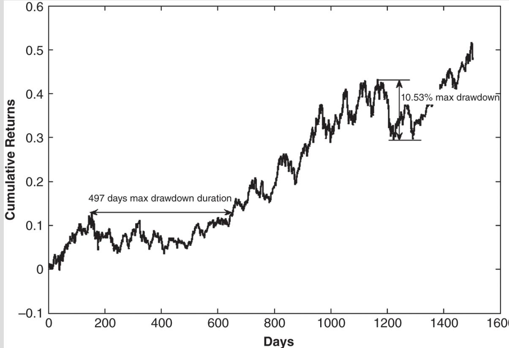

# 제3장 백테스팅

전통적인 투자운용 프로세스와 정량적 투자 프로세스 사이의 핵심적인 차이점은, 정량적 투자 전략을 백테스팅하여 과거에 어떠한 성과를 보였을지를 확인할 수 있다는 가능성입니다. 모든 과거 성과 데이터가 제공되면서 완전한 세부 사항까지 갖추어 설명된 전략을 발견했다 하더라도, 여러분은 여전히 그 전략을 직접 백테스팅해야 합니다. 이 작업은 여러 목적을 수행합니다. 다른 무엇보다도, 이러한 연구의 재현은 여러분이 그 전략을 완전히 이해했으며, 거래 시스템으로 구현하기 위해 그것을 정확히 재현했음을 보장해 줄 것입니다. 의학 또는 과학 연구에서와 마찬가지로, 다른 사람들의 결과를 재현하는 일은 또한 원래의 연구가 이 과정에 흔히 수반되는 일반적인 오류들 중 어떤 것도 저지르지 않았음을 보장해 줍니다. 그러나 단지 실사(due diligence)를 수행하는 것에 그치지 않고, 백테스트를 직접 수행하면 원래 전략의 변형들을 실험할 수 있어, 그 결과 전략을 정교화하고 개선할 수 있습니다.

이 장에서는 백테스팅에 사용할 수 있는 일반적인 플랫폼들, 백테스팅에 유용한 과거 데이터의 다양한 출처들, 백테스트가 제공해야 하는 표준 성과 측정치의 최소한의 집합, 피해야 할 흔한 함정들, 그리고 전략에 대한 간단한 정교화와 개선을 설명하겠습니다. 또한 설명된 원리와 기법을 예시하기 위해 몇 가지 완전하게 개발된 백테스팅 사례도 제시하겠습니다.

### 일반적인 백테스팅 플랫폼

수많은 상업용 플랫폼이 백테스팅을 위해 설계되어 있으며, 그중 일부는 비용이 수만 달러에 이릅니다. 이 책에서 스타트업에 초점을 맞추는 취지에 맞추어, 저는 제가 익숙하고 무료이거나 경제적으로 구매할 수 있으며 널리 사용되는 플랫폼들부터 시작합니다.

### Excel

Excel은 개인 투자자이든 기관 투자자이든 트레이더에게 가장 기본적이며 가장 흔히 사용되는 도구입니다. Visual Basic 매크로를 작성할 수 있다면 그 성능을 더욱 강화할 수 있습니다. Excel의 미덕은 “보이는 대로 얻는다(What you see is what you get)”라는 점이며, 컴퓨팅 용어로는 WYSIWYG(wi-zē-wig)라고 합니다. 데이터와 프로그램이 모두 한곳에 있어 숨겨진 것이 없습니다. 또한 나중에 설명할 일반적인 백테스팅의 함정인 선행편향 (look-ahead bias)은, 스프레드시트에서 날짜를 여러 데이터 열과 신호에 맞추어 쉽게 정렬할 수 있기 때문에 Excel에서는(매크로를 사용하는 경우는 예외인데, 이 경우 더 이상 WYSIWYG가 아니게 됩니다) 발생할 가능성이 낮습니다. Excel의 또 다른 장점은 백테스팅과 실시간 거래 생성이 종종 동일한 스프레드시트에서 수행될 수 있어, 프로그래밍 노력의 중복을 제거할 수 있다는 점입니다. Excel의 주요한 단점은 비교적 단순한 모델만 백테스팅하는 데 사용할 수 있다는 점입니다. 그러나 이전 장에서 설명했듯이, 단순한 모델이 종종 최선입니다!

### MATLAB

MATLAB(www.mathworks.com)은 과거 대형 기관의 정량 분석가와 트레이더들이 사용하던 가장 일반적인 백테스팅 플랫폼 중 하나였습니다. 현재는 Python(이는 다음에서 설명합니다)이 이를 대체하였지만, 저는 여전히 (전문 소프트웨어 개발자와는 달리) 퀀트에게 MATLAB이 가장 생산적인 언어라고 생각합니다. MATLAB은 Python보다 사용하기 쉽고, 더 빠르며, 공급업체로부터 완전한 고객 지원을 제공합니다. 이는 대규모 주식 포트폴리오를 수반하는 전략을 테스트하는 데 이상적입니다. (Excel에서 1,500개 심볼을 포함하는 전략을 백테스팅한다고 상상해 보십시오—가능은 하지만 상당히 고통스럽습니다.) MATLAB에는 수많은 고급 통계 및 수학 모듈이 내장되어 있으므로, 트레이딩 알고리즘이 정교하지만 흔히 쓰이는 수학적 개념을 포함하는 경우에도 트레이더가 동일한 기능을 처음부터 다시 구현할 필요가 없습니다. (좋은 예로 주성분 분석(principal component analysis)이 있습니다—이는 통계적 차익거래에서 요인 모델에 종종 사용되며, 다른 프로그래밍 언어에서 구현하는 것은 번거롭습니다. 예제 7.4를 참조하십시오.) Statistics and Machine Learning, Econometrics, Financial 툴박스와 같은 보조 툴박스(각각 약 $\$50$의 비용이 듭니다)는 특히 퀀트 트레이더에게 유용합니다.

또한 인터넷에서 다운로드할 수 있는 제3자 프리웨어가 매우 많이 있으며, 그중 다수는 정량 트레이딩 목적에 매우 유용합니다(예로는 예제 7.2에서 사용된 공적분(cointegration) 패키지가 있습니다). 마지막으로 MATLAB은 다양한 웹사이트로부터 금융 정보를 가져오는 데에도 매우 유용합니다. 예제 3.1은 이를 수행하는 방법을 보여줍니다.

이 플랫폼이 겉보기에는 정교해 보이지만, 실제로는(적어도 기본적인 사용을 위해서는) 배우기가 매우 쉽고, 이 언어를 사용하여 완전한 백테스팅 프로그램을 작성하는 데에도 매우 빠릅니다. 또한 비용이 저렴합니다. 가정용 버전은 Microsoft Office와 비용이 거의 비슷합니다.

MATLAB의 Trading Toolbox를 구매하거나, undocumentedmatlab.com의 툴킷과 같은 제3자 툴킷을 구매하면, 실거래에도 MATLAB을 사용할 수 있습니다.

저는 이 책의 모든 백테스팅 예제에 대해 MATLAB 코드를 포함할 뿐만 아니라, 부록에서 MATLAB 언어 자체에 대한 간략한 개관도 제공할 것입니다.

### 예제 3.1: MATLAB을 사용하여 Yahoo! Finance 데이터 가져오기

MATLAB은 수치 계산에만 유용한 것이 아니라 텍스트 파싱에도 유용합니다. 다음은 MATLAB을 사용하여 Yahoo! Finance에서 한 주식의 과거 가격 정보를 가져오는 예입니다. 먼저 github.com/Lenskiy/market-data-functions에서 파일 getMarketDataViaYahoo.m을 복사하여 로컬 폴더에 저장합니다. 그런 다음 다음 코드를 example3_1.m으로 저장하여 로컬 폴더에도 저장합니다:

% Example 3.1: Download data from Yahoo   
initDate $=$ '1-Sep-2020';   
symbol $=$ 'AAPL';   
aaplusd_yahoo_raw $=$ getMarketDataViaYahoo(symbol, initDate); aaplusd_yahoo $=$ timeseries([aaplusd_yahoo_raw.Close,   
aaplusd_yahoo_raw.High, aaplusd_yahoo_raw.Low],   
datestr(aaplusd_yahoo_raw(:,1).Date));   
aaplusd_yahoo.DataInfo.Units $=$ 'USD';   
aaplusd_yahoo.Name $=$ symbol;   
aaplusd_yahoo.TimeInfo.Format $=$ "dd-mm-yyyy"; figure,   
plot(aaplusd_yahoo);   
legend({'Close', 'High', 'Low'},'Location', 'northwest'); disp(aaplusd_yahoo_raw.Close)   

이 프로그램 파일 example3_1.m은 epchan.com/book에서 다운로드할 수 있으며, 사용자 이름과 비밀번호는 모두 “sharperatio”입니다. 이 코드는 원하는 만큼 많은 티커를 다운로드하도록 쉽게 수정할 수 있습니다. 이 프로그램이 작동하려면 getMarketDataViaYahoo 함수가 필요합니다. 해당 .m 파일은 www.mathworks.com/matlabcentral/fileexchange/68361-yahoo  
finance-and-quandl-data-downloader에서 다운로드할 수 있습니다. (example3_1.m과 같은 폴더에 저장해야 합니다.)

### Python

Python은 이제 MATLAB을 제치고 사실상의 백테스팅 (backtesting) 언어가 되었으며, 특히 numpy와 pandas 패키지가 사용 가능해진 이후 더욱 그러합니다. 이러한 패키지를 사용하면 MATLAB에서 하듯이 배열과 시계열 데이터를 조작할 수 있습니다. Python은 특정 응용을 위한 매우 많은 수의 제3자 패키지의 이점을 누립니다. 머신러닝을 위한 Scikit-learn, 대화형 데이터 시각화를 위한 plotly, 플로팅을 위한 seaborn 등이 있으며, 가장 흔히 사용되는 몇 가지만 예로 들자면 그렇습니다. Python에는 금융과 트레이딩에 필요한 거의 모든 패키지가 존재하지만, 결함이 없는 것은 아닙니다:

1. 버전 충돌이 만연합니다. 전문 소프트웨어 개발자로 구성된 우리 팀(그중 한 명은 자신의 소프트웨어 회사를 수백만 달러에 매각한 적이 있습니다)이 있음에도, 우리는 서로 다른 Python 패키지들을 프로덕션 시스템에 통합하는 데 끝없는 시간을 보냈습니다. 새로운 Python 패키지 하나를 추가하는 것만으로도 전체 구조물이 무너질 위험이 있습니다. 다음의 샘플 프로그램 example3_1.py조차도 동료의 컴퓨터와는 달리 제 컴퓨터에서 실행되도록 하는 데 한 시간이 넘게 걸렸습니다.

2. 느립니다—MATLAB과 비교하면 상당히 느립니다. 제 말만 믿지 마십시오. Aruoba et. al. (2018)의 다음 학술 연구를 읽어 보십시오: “Python is too slow… MATLAB and R have considerably improved their performance, in the case of MATLAB to make it competitive, for example, with Rcpp.”

3. 무료이기 때문에 고객 지원이 없습니다. 질문에 대한 답을 얻기 위해 stackoverflow.com에서 낯선 이들의 친절을 기다려야 합니다. 반면 MATLAB은 최일선 지원에 전문 프로그래머와 박사 학위 소지자들을 보유하고 있습니다.

4. Python의 통합 개발 환경 (Integrated Development Environments, IDEs)은 MATLAB의 것보다 열등합니다. Microsoft의 Visual Studio Code와 같은 무료 플랫폼이 확산되었음에도, 여전히 그렇습니다. 지불한 만큼 얻게 됩니다.

5. 무료 패키지의 수가 많음에도, R과는 달리 여전히 좋은 통계 및 계량경제학 패키지가 부족합니다. Python의 statmodels는 mnormt와 같은 R 패키지들에 비할 바가 아닙니다,

copula, fGarch, rugarch, 또는 MASS에도 마찬가지입니다. Python은 또한 MATLAB의 Statistics and Machine Learning 및 Econometrics Toolboxes에도 미치지 못합니다.

그러나 여러분이 Python의 팬이거나, 모두가 사용하고 있기 때문에 Python 유행에 올라타고 싶다면, 제가 여러분을 말리지는 않겠습니다. 금융에서 Python을 사용하는 방법을 더 배우려면 Wes McKinney의 *Python for Data Analysis* (McKinney, 2017)부터 시작하십시오. McKinney는 물론 퀀트 트레이더들에게 가장 유용한 패키지인 pandas의 발명가이며, 거대 퀀트 펀드 Two Sigma의 베테랑입니다.

다음은 Python으로 코딩한 예제 3.1입니다:

### 예제 3.1: Python을 사용하여 Yahoo! Finance 데이터 가져오기

다음은 Python을 사용하여 Yahoo! Finance로부터 주식의 과거 가격 정보를 가져오는 예제입니다. 먼저 아나콘다 프롬프트에서 pip install pandas_datareader를 실행하십시오. 그런 다음 다음 코드를 로컬 폴더에 example3_1.py로 저장하십시오:

% Example 3.1: Download data from Yahoo from pandas_datareader import data as pdr def test_yfinance():

for symbol in [‘AAPL’, 'MSFT', 'VFINX','BTC-USD']: print(">>", symbol, end $\underline{\underline{\mathbf{\Pi}}}=$ ' … ') data $=$ pdr.get_data_yahoo(symbol,start $=$ '2020-09-25',   
end='2020-10-02') print(data)   
if __name __ $= =$ "__main_ " . test_yfinance()

이 프로그램 파일 example3_1.py는 epchan.com/book에서 다운로드할 수 있으며, 사용자명과 비밀번호는 모두 “sharperatio”입니다. 이 코드는 원하는 만큼 많은 티커 (ticker)를 다운로드하도록 쉽게 수정할 수 있습니다.

### R

저는 노스웨스턴대학교(Northwestern University) 데이터과학 석사 프로그램의 금융 리스크 분석(Financial Risk Analytics) 과목을 가르칠 때, 시계열 분석부터 코퓰러 (copulas)까지 모든 내용을 다루면서 R을 교육 언어로 사용해 왔습니다. 트레이딩을 위해 고전적인 통계 및 계량경제학 분석을 사용하고자 한다면(그리고 그것은 전혀 문제가 없습니다!), R은 훌륭한 언어입니다. 그 이유는 많은 학계 통계학자와 계량경제학자들이 자신들의 알고리즘을 R로 구현해 두었기 때문입니다. 머신러닝 알고리즘의 구현은 Python이나 MATLAB만큼 많지 않습니다.

그러나 새로운 트레이딩 전략을 만들고 있다면 머신러닝을 사용하지 말고, 전략을 개선하기 위해서만 ML을 사용할 것을 저는 권합니다(그 이유는 2장에서 설명하며 predictnow.ai/finml에서 더 자세히 다룹니다). 따라서 R은 이러한 전략 탐색의 초기 단계에 적합한 언어이지만, IDE(RStudio) 역시 무료임에도 불구하고, 감히 말하자면, 원시적이므로 MATLAB만큼 좋지는 않습니다. 당연히 Python과 마찬가지로 지원도 전혀 제공되지 않습니다. R을 배우고 싶다면, Jonathan Regenstein(Regenstein, 2018)이 쓴 *Reproducible Finance with $R$*이라는 우아하고 매우 읽기 쉬운 작은 책이 있습니다.

### 예제 3.1: R을 사용하여 Yahoo! Finance 데이터 가져오기

다음은 R을 사용하여 Yahoo! Finance에서 한 주식의 과거 가격 정보를 가져오는 예입니다. 이 프로그램 파일 example3_1.R은 epchan.com/book에서 다운로드할 수 있으며, 사용자명과 비밀번호는 모두 “sharperatio”입니다. 이를 로컬 폴더에 저장한 다음 RStudio에서 실행하기만 하면 됩니다. (필요한 패키지의 설치도 포함되어 있습니다. 일단 설치가 완료되면 install.packages 줄은 주석 처리할 수 있습니다.)

### tidyverse에는 tidyr, ggplot 패키지가 포함되어 있습니다.

### readr, purrr 및 tibble   

install.packages("tidyverse")   
install.packages("lubridate")   
install.packages("readxl")   
install.packages("highcharter")   
install.packages("tidyquant")   
install.packages("timetk")   
install.packages("tibbletime")   
install.packages("quantmod")   
install.packages("PerformanceAnalytics")   
install.packages("scales")   
library(tidyverse)   
library(lubridate)   
library(readxl)   
library(highcharter)   
library(tidyquant)   
library(timetk)   
library(tibbletime)   
library(quantmod)   
library(PerformanceAnalytics)   
library(scales)   
symbols <- c("SPY","EFA", "IJS", "EEM","AGG")   
prices <- getSymbols(symbols, src $=$ 'yahoo', $\pounds \mathrm{rom} \ = \ " \ 2 0 1 2 - 1 2 - 3 1 " $ , to $=$ "2017-12-31", auto.assign $=$ TRUE, warnings $=$ FALSE)

원하는 만큼 많은 티커를 다운로드할 수 있도록 이 코드를 쉽게 수정할 수 있습니다.

### QuantConnect

QuantConnect는 웹 기반 알고리즘 트레이딩 플랫폼으로서, $\mathbf{C}\#$ 또는 Python으로 전략을 생성할 수 있도록 연구, 백테스트, 라이브 트레이딩 도구를 제공합니다. 또한 약 400TB의 금융 및 대체 데이터를 제공합니다. 오픈 소스 엔진(LEAN이라 불림)은 체결, 슬리피지, 증거금, 거래 비용, 그리고 매수–매도 스프레드를 고려하여 현실적인 백테스트 결과를 제공합니다. 본 원고 작성 시점에서 이 플랫폼은 7개의 자산군, 즉 주식, 주식옵션, 외환, CFD, 암호화폐, 선물, 선물옵션을 지원합니다. QuantConnect는 코드 변경 없이 백테스트에서 라이브 트레이딩으로 매끄럽게 전환할 수 있도록 합니다. 이는 백테스트한 내용이 실제로 거래하게 될 내용과 정확히 동일함을 보장하는 데 중요합니다.

### Blueshift

Blueshift는 QuantInsti가 제공하는 리서치, 백테스트, 트레이딩을 위한 통합 플랫폼입니다. 본 원고 작성 시점에서 Blueshift는 미국, 인도, 그리고 외환 시장에서 라이브 트레이딩을 제공하며, 이러한 시장 전반에 걸쳐 분 단위 데이터를 무료로 포함합니다. (여러분이 이 글을 읽을 즈음에는 훨씬 더 많은 시장을 제공하고 있을 것이라고 저는 확신합니다.) 여러분은 Python 프로그래밍 환경 또는 시각적(비프로그래밍 인터페이스) 빌더 중 하나에서 투자 또는 트레이딩 전략을 개발할 수 있습니다. 백테스트에서 라이브 트레이딩으로 전략을 옮기는 일은 턴키 작업으로 이루어지며, 여러분이 백테스트한 내용이 실제로 거래하게 될 내용과 정확히 동일함을 보장합니다.

### FINDING AND USING HISTORICAL DATABASES

특정한 유형의 과거 데이터가 필요한 전략을 염두에 두고 있다면, 가장 먼저 해야 할 일은 해당 유형의 데이터를 검색하는 일입니다.

여러 유형의 데이터에 대해 무료 또는 저비용으로 이용할 수 있는 과거 데이터베이스가 인터넷에 얼마나 많이 존재하는지에 놀라게 될 것입니다. (예를 들어 “free historical intraday futures data.”라는 검색어를 시도해 보십시오.) 표 3.1에는 제가 수년 동안 유용하다고 느꼈던 데이터베이스들을 다수 포함하였으며, 그 대부분은 무료이거나 비용이 매우 저렴합니다. 저는 Bloomberg, Dow Jones, FactSet, Thomson Reuters, 또는 Tick Data의 고가 데이터베이스는 의도적으로 제외하였습니다. 이들은 구매 가능한 거의 모든 유형의 데이터를 보유하고 있지만, 이러한 데이터 공급업체들은 주로 더 확립된 기관을 대상으로 하며, 개인이나 신생 기관이 감당할 수 있는 가격대에 대체로 속하지 않습니다.

TABLE 3.1 백테스트를 위한 과거 데이터베이스   

<table><tr><td rowspan=1 colspan=1>출처</td><td rowspan=1 colspan=1>장점</td><td rowspan=1 colspan=1>단점</td></tr><tr><td rowspan=1 colspan=3>일별 주식 데이터</td></tr><tr><td rowspan=1 colspan=1>finance.yahoo.com</td><td rowspan=2 colspan=1>무료. 분할/배당 조정.</td><td rowspan=2 colspan=1>생존자 편향(survivorship bias)이 있습니다. 한 번에 한 종목만 다운로드할 수 있습니다.</td></tr><tr><td rowspan=1 colspan=1></td></tr><tr><td rowspan=1 colspan=1>Sharadar.com</td><td rowspan=1 colspan=1>생존자 편향이 없습니다.</td><td rowspan=1 colspan=1></td></tr><tr><td rowspan=1 colspan=1>Algoseek.com</td><td rowspan=1 colspan=1>틱 데이터를 구매하지 말고 임대하십시오! 식별자와 태그로 보강되어 있습니다.</td><td rowspan=1 colspan=1>가격이 중간 수준입니다.</td></tr><tr><td rowspan=1 colspan=1>CSIdata.com</td><td rowspan=1 colspan=1>저비용. Yahoo!와 Google의 과거 데이터의 출처입니다. 소프트웨어를 통해 여러 종목을 다운로드할 수 있습니다.</td><td rowspan=1 colspan=1>생존자 편향이 있으나, 상장폐지 종목의 과거 데이터는 구매할 수 있습니다.</td></tr><tr><td rowspan=1 colspan=1>CRSP.com</td><td rowspan=1 colspan=1>생존자 편향이 없습니다.</td><td rowspan=1 colspan=1>고가입니다. 한 달에 한 번만 업데이트됩니다.</td></tr><tr><td rowspan=1 colspan=3>일별 선물 데이터</td></tr><tr><td rowspan=1 colspan=1>Algoseek.com</td><td rowspan=1 colspan=1>(위 참조.)</td><td rowspan=1 colspan=1></td></tr><tr><td rowspan=1 colspan=1>CSIdata.com</td><td rowspan=1 colspan=1>(위 참조.)</td><td rowspan=1 colspan=1></td></tr><tr><td rowspan=1 colspan=3>일중 주식/선물 데이터</td></tr><tr><td rowspan=1 colspan=1>Algoseek.com</td><td rowspan=1 colspan=1>(위 참조.)</td><td rowspan=1 colspan=1></td></tr><tr><td rowspan=1 colspan=1>Tickdata.com</td><td rowspan=1 colspan=1>기관급 품질입니다.</td><td rowspan=1 colspan=1>고가입니다.</td></tr><tr><td rowspan=1 colspan=3>일별/일중 외환 데이터</td></tr><tr><td rowspan=1 colspan=1>InteractiveBrokers</td><td rowspan=1 colspan=1>계정이 있으면 무료입니다.</td><td rowspan=1 colspan=1></td></tr></table>

인터넷에서 데이터 출처를 찾는 일은 유망한 전략을 찾는 일보다도 더 쉽지만, 이러한 데이터베이스들 중 다수에는 이후 이 절에서 논의할 여러 문제점과 함정이 존재합니다. 이러한 문제들은 주로 주식 및 상장지수펀드(ETF) 데이터에만 해당합니다. 다음은 그중 가장 중요한 사항들입니다.

### 데이터는 주식분할과 배당을 반영하여 조정되어 있습니까?

어떤 회사가 권리락일 (ex-date)이 $T$인 $N$ 대 1의 주식분할 (stock split)을 실시했을 때, $T$ 이전의 모든 가격은 $1/N$을 곱해 주어야 합니다. $N$은 보통 2이지만 0.5와 같은 분수일 수도 있습니다. $N$이 1보다 작을 때에는 이를 액면병합 (reverse split)이라고 합니다. 마찬가지로, 어떤 회사가 권리락일이 $T$인 주당 $\$2$의 배당을 지급했을 때에는 $T$ 이전의 모든 가격에 $(\mathrm{Close}(T-1)-d)/\mathrm{Close}(T-1)$라는 수를 곱해 주어야 하는데, 여기서 $\mathrm{Close}(T-1)$는 $T$ 직전 거래일의 종가입니다. 주목할 점은, 저는 과거 가격에서 $\$2$를 빼는 방식 대신 곱셈 계수를 사용하여 과거 가격을 조정한다는 것입니다. 이렇게 하면 조정 전후에 과거 일간 수익률이 동일하게 유지됩니다. 이것이 Yahoo! Finance가 과거 데이터를 조정하는 방식이며, 가장 일반적인 방법입니다. (만약 대신 $\$2$를 빼서 조정한다면, 과거의 일간 가격변화는 조정 전후에 동일하지만 일간 수익률은 그렇지 않습니다.) 과거 데이터가 조정되어 있지 않다면, 권리락일의 장 시작 시점에 전일 종가로부터 (정상적인 시장 변동과는 별개로) 가격이 하락하는 현상을 보게 될 것이며, 이는 잘못된 매매 신호를 촉발할 수 있습니다.

저는 이미 주식분할과 배당을 반영하여 조정된 과거 데이터를 확보할 것을 권합니다. 그렇지 않으면 주식분할과 배당의 별도 과거 데이터베이스를 찾아야 하고, 그 조정을 직접 적용해야 하는데, 이는 다소 번거롭고 오류가 발생하기 쉬운 작업이며, 다음 예에서 이를 설명하겠습니다.

### 예 3.2: 주식분할과 배당에 대한 조정

여기에서는 과거에 주식분할과 배당이 모두 있었던 ETF인 IGE를 살펴봅니다. IGE는 2005년 6월 9일(권리락일 (ex-date))에 2:1 주식분할을 실시했습니다. 해당 날짜 전후의 조정되지 않은 가격을 살펴보겠습니다(IGE의 과거 가격은 Yahoo! Finance에서 엑셀 스프레드시트로 다운로드할 수 있습니다):

<table><tr><td rowspan=1 colspan=1>날짜</td><td rowspan=1 colspan=1>시가</td><td rowspan=1 colspan=1>고가</td><td rowspan=1 colspan=1>저가</td><td rowspan=1 colspan=1>종가</td></tr><tr><td rowspan=1 colspan=1>6/10/2005 73.98</td><td rowspan=1 colspan=1>73.98</td><td rowspan=1 colspan=1>74.08</td><td rowspan=1 colspan=1>73.31</td><td rowspan=1 colspan=1>74</td></tr><tr><td rowspan=1 colspan=1>6/9/2005</td><td rowspan=1 colspan=1>72.45</td><td rowspan=1 colspan=1>73.74</td><td rowspan=1 colspan=1>72.23</td><td rowspan=1 colspan=1>73.74</td></tr><tr><td rowspan=1 colspan=1>6/8/2005</td><td rowspan=1 colspan=1>144.13</td><td rowspan=1 colspan=1>146.44</td><td rowspan=1 colspan=1>143.75</td><td rowspan=1 colspan=1>144.48</td></tr><tr><td rowspan=1 colspan=1>6/7/2005</td><td rowspan=1 colspan=1>145</td><td rowspan=1 colspan=1>146.07 144.11</td><td rowspan=1 colspan=1>146.07 144.11</td><td rowspan=1 colspan=1>144.11</td></tr></table>

이 주식분할로 인해 $6/9/2005$ 이전의 가격은 조정해야 합니다. 이는 간단합니다. 여기서 $N=2$이며, 우리가 해야 할 일은 해당 가격들에 $\frac{1}{2}$를 곱하는 것뿐입니다. 다음 표는 조정된 가격을 보여줍니다:

<table><tr><td rowspan=1 colspan=1>날짜</td><td rowspan=1 colspan=1>시가</td><td rowspan=1 colspan=1>고가</td><td rowspan=1 colspan=1>저가</td><td rowspan=1 colspan=1>종가</td></tr><tr><td rowspan=1 colspan=1>6/10/2005 73.98</td><td rowspan=1 colspan=1>73.98</td><td rowspan=1 colspan=1>74.08</td><td rowspan=1 colspan=1>73.31</td><td rowspan=1 colspan=1>74</td></tr><tr><td rowspan=1 colspan=1>6/9/2005</td><td rowspan=1 colspan=1>72.45</td><td rowspan=1 colspan=1>73.74</td><td rowspan=1 colspan=1>72.23</td><td rowspan=1 colspan=1>73.74</td></tr><tr><td rowspan=1 colspan=1>6/8/2005</td><td rowspan=1 colspan=1>72.065</td><td rowspan=1 colspan=1>73.22</td><td rowspan=1 colspan=1>71.875</td><td rowspan=1 colspan=1>72.24</td></tr><tr><td rowspan=1 colspan=1>6/7/2005</td><td rowspan=1 colspan=1>72.5</td><td rowspan=1 colspan=1>73.035</td><td rowspan=1 colspan=1>72.055</td><td rowspan=1 colspan=1>72.055</td></tr></table>

이제 눈썰미 있는 독자라면 여기의 조정 종가가 Yahoo! Finance 표에 표시된 조정 종가와 일치하지 않음을 알아차릴 것입니다. 그 이유는 2005년 6월 9일 이후에 배당이 분배된 적이 있으므로 Yahoo! 가격이 그 모든 배당에 대해서도 조정되어 있기 때문입니다. 각 조정은 승수이므로, 전체 조정은 모든 개별 승수의 곱에 불과합니다. 다음은 $6/9/2005$부터 2007년 11월까지의 배당과, 그에 대응하는 이전 거래일의 조정되지 않은 종가 및 그 결과로 얻어지는 개별 승수입니다:

<table><tr><td rowspan=1 colspan=1>배당락일</td><td rowspan=1 colspan=1>배당금</td><td rowspan=1 colspan=1>전일 종가</td><td rowspan=1 colspan=1>승수</td></tr><tr><td rowspan=1 colspan=1>9/26/2007</td><td rowspan=1 colspan=1>0.177</td><td rowspan=1 colspan=1>128.08</td><td rowspan=1 colspan=1>0.998618</td></tr><tr><td rowspan=1 colspan=1>6/29/2007</td><td rowspan=1 colspan=1>0.3</td><td rowspan=1 colspan=1>119.44</td><td rowspan=1 colspan=1>0.997488</td></tr><tr><td rowspan=1 colspan=1>12/21/2006</td><td rowspan=1 colspan=1>0.322</td><td rowspan=1 colspan=1>102.61</td><td rowspan=1 colspan=1>0.996862</td></tr><tr><td rowspan=1 colspan=1>9/27/2006</td><td rowspan=1 colspan=1>0.258</td><td rowspan=1 colspan=1>91.53</td><td rowspan=1 colspan=1>0.997181</td></tr><tr><td rowspan=1 colspan=1>6/23/2006</td><td rowspan=1 colspan=1>0.32</td><td rowspan=1 colspan=1>92.2</td><td rowspan=1 colspan=1>0.996529</td></tr><tr><td rowspan=1 colspan=1>3/27/2006</td><td rowspan=1 colspan=1>0.253</td><td rowspan=1 colspan=1>94.79</td><td rowspan=1 colspan=1>0.997331</td></tr><tr><td rowspan=1 colspan=1>12/23/2005</td><td rowspan=1 colspan=1>0.236</td><td rowspan=1 colspan=1>89.87</td><td rowspan=1 colspan=1>0.997374</td></tr><tr><td rowspan=1 colspan=1>9/26/2005</td><td rowspan=1 colspan=1>0.184</td><td rowspan=1 colspan=1>89</td><td rowspan=1 colspan=1>0.997933</td></tr><tr><td rowspan=1 colspan=1>6/21/2005</td><td rowspan=1 colspan=1>0.217</td><td rowspan=1 colspan=1>77.9</td><td rowspan=1 colspan=1>0.997214</td></tr></table>

(위에서 제가 제시한 공식을 사용하여 Excel에서 직접 승수를 계산해 보고, 여기 제 값들과 일치하는지 확인해 보시기 바랍니다.) 그러면 배당에 대한 총(집계) 승수는 단순히 $0.998618 \times 0.997488 \times \ldots \times 0.997214 = 0.976773$입니다. 이 승수는 $6/9/2005$ 당일 또는 그 이후의 모든 미조정 가격에 적용되어야 합니다. 배당과 주식분할에 대한 총(집계) 승수는 $0.976773 \times 0.5 = 0.488386$이며, 이는 6/9/2005 이전의 모든 미조정 가격에 적용되어야 합니다. 그러면 이제 이러한 승수들을 적용한 뒤 결과적으로 얻어지는 조정 가격을 살펴보겠습니다:

<table><tr><td rowspan=1 colspan=1>날짜</td><td rowspan=1 colspan=1>시가 고가 I</td><td rowspan=1 colspan=1>시가 고가 I</td><td rowspan=1 colspan=1>저가</td><td rowspan=1 colspan=1>종가</td></tr><tr><td rowspan=1 colspan=1>6/10/2005</td><td rowspan=1 colspan=1>72.26163</td><td rowspan=1 colspan=1>72.35931</td><td rowspan=1 colspan=1>71.6072</td><td rowspan=1 colspan=1>72.28117</td></tr><tr><td rowspan=1 colspan=1>6/9/2005</td><td rowspan=1 colspan=1>70.76717</td><td rowspan=1 colspan=1>72.02721</td><td rowspan=1 colspan=1>70.55228</td><td rowspan=1 colspan=1>72.02721</td></tr><tr><td rowspan=1 colspan=1>6/8/2005</td><td rowspan=1 colspan=1>70.39111</td><td rowspan=1 colspan=1>71.51929</td><td rowspan=1 colspan=1>70.20553</td><td rowspan=1 colspan=1>70.56205</td></tr><tr><td rowspan=1 colspan=1>6/7/2005</td><td rowspan=1 colspan=1>70.81601</td><td rowspan=1 colspan=1>71.33858</td><td rowspan=1 colspan=1>70.38135</td><td rowspan=1 colspan=1>70.38135</td></tr></table>

이제 2007년 11월 1일 전후의 Yahoo! 표와 비교해 보겠습니다.

<table><tr><td colspan="1" rowspan="1">날짜</td><td colspan="1" rowspan="1">시가 고가</td><td colspan="1" rowspan="1">시가 고가</td><td colspan="1" rowspan="1">저가</td><td colspan="1" rowspan="1">종가</td><td colspan="1" rowspan="1">거래량 조정 종가</td><td colspan="1" rowspan="1">거래량 조정 종가</td></tr><tr><td colspan="1" rowspan="1">6/10/2005 73.98</td><td colspan="1" rowspan="1">73.98</td><td colspan="1" rowspan="1">74.08</td><td colspan="1" rowspan="1">73.31</td><td colspan="1" rowspan="1">74</td><td colspan="1" rowspan="1">179300</td><td colspan="1" rowspan="1">72.28</td></tr><tr><td colspan="1" rowspan="1">6/9/2005</td><td colspan="1" rowspan="1">72.45</td><td colspan="1" rowspan="1">73.74</td><td colspan="1" rowspan="1">72.23</td><td colspan="1" rowspan="1">73.74</td><td colspan="1" rowspan="1">853200</td><td colspan="1" rowspan="1">72.03</td></tr><tr><td colspan="1" rowspan="1">6/8/2005</td><td colspan="1" rowspan="1">144.13</td><td colspan="1" rowspan="1">146.44</td><td colspan="1" rowspan="1">143.75</td><td colspan="1" rowspan="1">144.48</td><td colspan="1" rowspan="1">144.48 109600</td><td colspan="1" rowspan="1">70.56</td></tr><tr><td colspan="1" rowspan="1">날짜</td><td colspan="1" rowspan="1">시가</td><td colspan="1" rowspan="1">고가</td><td colspan="1" rowspan="1">저가</td><td colspan="1" rowspan="1">종가</td><td colspan="1" rowspan="1">거래량</td><td colspan="1" rowspan="1">조정 종가</td></tr><tr><td colspan="1" rowspan="1">6/7/2005</td><td colspan="1" rowspan="1">145</td><td colspan="1" rowspan="1">146.07</td><td colspan="1" rowspan="1">144.11</td><td colspan="1" rowspan="1">144.11</td><td colspan="1" rowspan="1">58000</td><td colspan="1" rowspan="1">70.38</td></tr></table>

우리의 계산 결과와 Yahoo!의 조정 종가 (adjusted closing price)가 동일함(소수점 둘째 자리까지 반올림한 이후)을 확인할 수 있습니다. 그러나 물론 여러분이 이것을 읽고 있는 시점에는 IGE가 더 많은 배당을 지급했을 가능성이 크며, 추가로 주식분할을 했을 수도 있으므로, 여러분의 Yahoo! 표는 위의 표와 같은 모습이 아닐 것입니다. 현재의 Yahoo! 표와 동일한 조정 가격이 나오도록, 그 배당과 주식분할에 근거하여 추가적인 조정을 할 수 있는지 점검해 보는 것은 좋은 연습입니다.

### 데이터가 생존자 편향에서 자유로운가?

우리는 이미 2장에서 이 문제를 다루었습니다. 불행히도, 생존자 편향이 없는 데이터베이스는 상당히 비싸며 스타트업 기업이 감당하기 어려울 수도 있습니다. 이 문제를 극복하는 한 가지 방법은, 향후의 백테스트를 위해 여러분이 직접 시점별 데이터 (point-in-time data)를 수집하기 시작하는 것입니다. 여러분의 유니버스에 포함된 모든 주식의 가격을 매일 파일로 저장한다면, 향후에 사용할 수 있는 시점별 또는 생존자 편향이 없는 데이터베이스를 갖게 될 것입니다. 생존자 편향의 영향을 줄이는 또 다른 방법은, 너무 많은 누락 종목으로 인해 결과가 왜곡되지 않도록 여러분의 전략을 더 최근의 데이터에서 백테스트하는 것입니다.

### 예제 3.3: 생존자 편향이 전략의 성과를 인위적으로 부풀릴 수 있는 방식의 예

다음은 장난감 수준의 “저가 주식 매수” 전략입니다. (경고: 이 장난감 전략은 여러분의 재무 건전성에 해로울 수 있습니다!) 시가총액 기준으로 가장 큰 1,000개 종목의 유니버스에서, 연초에 종가가 가장 낮은 10개를 골라(초기 자본을 동일하게 배분하여) 1년 동안 보유한다고 가정하겠습니다. 생존자 편향이 없는 양질의 데이터베이스가 있었다면 무엇을 골랐을지 살펴보겠습니다:

<table><tr><td rowspan=1 colspan=1>SYMBOL</td><td rowspan=1 colspan=1>SYMBOL Closing Price on11/2/2001</td><td rowspan=1 colspan=1>Closing Price on1/2/2002</td><td rowspan=1 colspan=1>TerminalPrice</td></tr><tr><td rowspan=1 colspan=1>ETYS</td><td rowspan=1 colspan=1>0.2188</td><td rowspan=1 colspan=1>NaN</td><td rowspan=1 colspan=1>0.125</td></tr><tr><td rowspan=1 colspan=1>MDM</td><td rowspan=1 colspan=1>0.3125</td><td rowspan=1 colspan=1>0.49</td><td rowspan=1 colspan=1>0.49</td></tr><tr><td rowspan=1 colspan=1>INTW</td><td rowspan=1 colspan=1>0.4063</td><td rowspan=1 colspan=1>NaN</td><td rowspan=1 colspan=1>0.11</td></tr><tr><td rowspan=1 colspan=1>FDHG</td><td rowspan=1 colspan=1>0.5</td><td rowspan=1 colspan=1>NaN</td><td rowspan=1 colspan=1>0.33</td></tr><tr><td rowspan=1 colspan=1>OGNC</td><td rowspan=1 colspan=1>0.6875</td><td rowspan=1 colspan=1>NaN</td><td rowspan=1 colspan=1>0.2</td></tr><tr><td rowspan=1 colspan=1>MPLX</td><td rowspan=1 colspan=1>0.7188</td><td rowspan=1 colspan=1>NaN</td><td rowspan=1 colspan=1>0.8</td></tr><tr><td rowspan=1 colspan=1>GTS</td><td rowspan=1 colspan=1>0.75</td><td rowspan=1 colspan=1>NaN</td><td rowspan=1 colspan=1>0.35</td></tr><tr><td rowspan=1 colspan=1>BUYX</td><td rowspan=1 colspan=1>0.75</td><td rowspan=1 colspan=1>NaN</td><td rowspan=1 colspan=1>0.17</td></tr><tr><td rowspan=1 colspan=1>PSIX</td><td rowspan=1 colspan=1>0.75</td><td rowspan=1 colspan=1>NaN</td><td rowspan=1 colspan=1>0.2188</td></tr><tr><td rowspan=1 colspan=1>RTHM</td><td rowspan=1 colspan=1>0.8125</td><td rowspan=1 colspan=1>NaN</td><td rowspan=1 colspan=1>0.3000</td></tr></table>

MDM을 제외한 모든 종목은 $\mathbf{1/2/2001}$과 $\mathbf{1/2/2002}$ 사이 어느 시점엔가 상장폐지되었습니다(어쨌든 당시에는 닷컴 버블이 심각하게 붕괴하고 있었습니다!). NaN은 1/2/2002에 종가가 존재하지 않는 종목들을 나타냅니다. Terminal Price 열은 $\mathbf{1/2/2002}$ 이전 또는 당일에 해당 주식이 거래된 마지막 가격을 나타냅니다. 그 해 이 포트폴리오의 총수익률은 $-42$퍼센트였습니다.

이제 데이터베이스에 생존자 편향이 있어, 그 해 상장폐지된 저 모든 종목이 실제로 누락되어 있었다면 무엇을 골랐을지 살펴보겠습니다. 그러면 대신 다음 목록을 골랐을 것입니다:

<table><tr><td rowspan=1 colspan=1>종목코드</td><td rowspan=1 colspan=1>2001년 1/2 종가의 종목코드</td><td rowspan=1 colspan=1>2002년 1/2 종가</td></tr><tr><td rowspan=1 colspan=1>MDM</td><td rowspan=1 colspan=1>0.3125</td><td rowspan=1 colspan=1>0.49</td></tr><tr><td rowspan=1 colspan=1>ENGA</td><td rowspan=1 colspan=1>0.8438</td><td rowspan=1 colspan=1>0.44</td></tr><tr><td rowspan=1 colspan=1>NEOF</td><td rowspan=1 colspan=1>0.875</td><td rowspan=1 colspan=1>27.9</td></tr><tr><td rowspan=1 colspan=1>ENP</td><td rowspan=1 colspan=1>0.875</td><td rowspan=1 colspan=1>0.05</td></tr><tr><td rowspan=1 colspan=1>MVL</td><td rowspan=1 colspan=1>0.9583</td><td rowspan=1 colspan=1>2.5</td></tr><tr><td rowspan=1 colspan=1>URBN</td><td rowspan=1 colspan=1>1.0156</td><td rowspan=1 colspan=1>3.0688</td></tr><tr><td rowspan=1 colspan=1>FNV</td><td rowspan=1 colspan=1>1.0625</td><td rowspan=1 colspan=1>0.81</td></tr><tr><td rowspan=1 colspan=1>APT</td><td rowspan=1 colspan=1>1.125</td><td rowspan=1 colspan=1>0.88</td></tr><tr><td rowspan=1 colspan=1>FLIR</td><td rowspan=1 colspan=1>1.2813</td><td rowspan=1 colspan=1>9.475</td></tr><tr><td rowspan=1 colspan=1>RAZF</td><td rowspan=1 colspan=1>1.3438</td><td rowspan=1 colspan=1>0.25</td></tr></table>

최소한 $1/2/2002$까지 “생존한” 주식만을 선택하였기 때문에, 이들 모두는 해당 일자의 종가를 가지고 있음을 알 수 있습니다. 이 포트폴리오의 총수익률은 388퍼센트였습니다!

이 예에서 $-42$퍼센트는 트레이더가 이 전략을 따를 때 실제로 경험하게 되는 수익률이었던 반면, 388퍼센트는 우리 데이터베이스의 생존자 편향(survivorship bias)으로 인해 발생한 허구적 수익률입니다.

### 전략에서 고가 및 저가 데이터를 사용합니까?

거의 모든 일별 주가 데이터에서 고가와 저가는 시가와 종가보다 훨씬 더 잡음이 많습니다. 이는 하루의 기록된 고가보다 낮은 가격에 매수 지정가 주문을 제출했더라도 체결되지 않았을 수 있으며, 매도 지정가 주문도 그 반대일 수 있음을 의미합니다. (이는 매우 소량의 주문만이 고가에서 거래되었기 때문일 수도 있고, 주문의 체결이 귀하의 주문이 라우팅되지 않은 시장에서 발생했기 때문일 수도 있습니다. 때로는 고가나 저가가 단지 걸러지지 않은 잘못 보고된 틱(tick) 때문에 발생하기도 합니다.) 따라서 고가 및 저가 데이터에 의존하는 백테스트는 시가 및 종가에 의존하는 백테스트보다 신뢰성이 낮습니다.

실제로, 때로는 시초가 시장가 주문(MOO)이나 종가 시장가 주문(MOC)조차도 귀하의 데이터에 표시된 과거 시가 및 종가에서 체결되지 않을 수 있습니다. 이는 표시된 과거 가격이 주요 거래소(예: 뉴욕증권거래소[NYSE])에서 형성된 가격일 수도 있고, 모든 지역 거래소를 포함한 합성(composite) 가격일 수도 있기 때문입니다. 귀하의 주문이 어디로 라우팅되었는지에 따라, 데이터셋에 표시된 과거 시가 또는 종가와는 다른 가격에 체결될 수 있습니다. 그럼에도 불구하고, 시가 및 종가의 불일치는 일반적으로 백테스트 성과에 미치는 영향이 고가 및 저가 가격의 오류보다 작습니다. 이는 후자가 거의 언제나 귀하의 백테스트 수익률을 부풀리기 때문입니다.

데이터베이스에서 데이터를 가져온 후에는, 빠르게 오류 점검을 수행하는 것이 종종 바람직합니다. 이를 위한 가장 간단한 방법은 해당 데이터를 기반으로 일별 수익률을 계산하는 것입니다. 시가, 고가, 저가, 종가가 있다면, 이전 고가에서 오늘 종가까지와 같은 다양한 조합의 일별 수익률도 계산할 수 있습니다. 그런 다음 평균으로부터 예컨대 표준편차 네 배만큼 떨어진 수익률을 보이는 날들을 면밀히 살펴볼 수 있습니다. 일반적으로 극단적인 수익률은 뉴스 발표를 동반해야 하거나, 시장지수 또한 극단적인 수익률을 경험한 날에 발생해야 합니다. 그렇지 않다면, 귀하의 데이터는 의심스럽습니다.

### 성과 측정

정량적 트레이더들은 다양한 성과 측정치를 활용합니다. 어떤 숫자 집합을 사용할지는 때로 개인적 선호의 문제이지만, 서로 다른 전략과 트레이더 간 비교의 용이성을 염두에 두면 샤프 비율 (Sharpe ratio), 최대 낙폭 (maximum drawdown), 그리고 MAR 비율 (MAR ratio)이 가장 중요하다고 저는 주장하고자 합니다. 투자자들이 가장 흔히 인용하는 측정치인 연복리성장률 (compound annualized growth rate, CAGR)을 제가 포함하지 않은 점에 유의하시기 바랍니다. 왜냐하면 이 측정치를 사용하려면 수익률을 계산할 때 어떤 분모를 사용했는지에 관해 여러 가지를 사람들에게 설명해야 하기 때문입니다. 예를 들어 롱–숏 전략에서 분모에 자본의 한쪽만 사용했습니까, 아니면 양쪽을 모두 사용했습니까? 수익률은 레버리지된 것입니까(분모가 계좌 자기자본에 기반함), 아니면 레버리지되지 않은 것입니까(분모가 포트폴리오의 시장가치에 기반함)? 자기자본 또는 시장가치가 일별로 변한다면, 분모로 이동평균을 사용합니까, 아니면 매일 혹은 매월 말의 값만 사용합니까? 수익률 비교와 관련된 이러한 문제들 대부분(그러나 전부는 아님)은 표준 성과 측정치로서 샤프 비율, 최대 낙폭, MAR 비율을 대신 제시함으로써 피할 수 있습니다. MAR 비율은 단지 CAGR과 최대 낙폭의 비율이며, 레버리지와는 어느 정도 독립적입니다. 완전히 독립적이지 않은 이유는 변동성이 존재할 때 레버리지를 두 배로 늘린다고 해서 CAGR이 정확히 두 배가 되지는 않기 때문입니다(Chan, 2017).

저는 2장에서 샤프 비율, 최대 낙폭, 그리고 최대 낙폭 지속기간 (maximum drawdown duration)의 개념을 소개했습니다. 여기에서는 샤프 비율을 계산할 때 수반되는 몇 가지 미묘한 점을 간단히 지적하고, Excel과 MATLAB 양쪽에서의 계산 예시를 제시하겠습니다.

샤프 비율을 계산할 때 노련한 포트폴리오 매니저들조차 종종 혼동하는 미묘한 쟁점이 하나 있습니다. 달러-중립 (dollar-neutral) 포트폴리오의 수익률에서 무위험이자율을 빼야 할까요, 아니면 빼지 말아야 할까요? 답은 ‘빼지 않는다’입니다. 달러-중립 포트폴리오는 자기금융 (self-financing)이며, 이는 공매도로 얻는 현금이 롱(매수) 증권의 매입대금을 지불한다는 의미이므로(대출이자율과 예금이자율 간 스프레드로 인한) 자금조달 비용이 작아 많은 백테스팅 목적에서는 무시할 수 있습니다. 한편, 유지해야 하는 마진 잔액은 무위험이자율에 가까운 크레딧 이자를 얻으며, 그 이자율은 $r_{F}$ 입니다. 따라서 전략 수익률(포트폴리오 수익률에서 크레딧 이자에 의한 기여분을 뺀 값)을 $R$이라 하고, 무위험이자율을 $r_{F}$라고 하면, 샤프 비율 계산에 사용되는 초과수익률은 $R + r_{F} - r_{F} = R$ 입니다. 그러므로 본질적으로 전체 계산에서 무위험이자율은 무시하고, 주식 포지션으로 인해 발생하는 수익률에만 집중하면 됩니다.

마찬가지로, 포지션을 익일로 이월하여 보유하지 않는 롱 전용 일중매매 전략을 가지고 있다면, 이 경우에도 금융비용이 발생하지 않으므로 초과수익률을 얻기 위해 전략 수익률에서 무위험이자율을 다시 뺄 필요가 없습니다. 일반적으로, 귀하의 전략이 조달비용(financing cost)을 수반하는 경우에만 샤프비율을 계산할 때 전략 수익률에서 무위험이자율을 차감할 필요가 있습니다.

전략 간 비교를 더욱 용이하게 하기 위해, 대부분의 트레이더는 샤프비율을 연율화합니다. 대부분의 사람들은 평균수익률을 연율화하는 방법을 알고 있습니다. 예를 들어 월별 수익률을 사용해 왔다면, 연평균 수익률은 월평균 수익률의 12배에 불과합니다.

그러나 수익률의 표준편차를 연율화하는 것은 다소 더 까다롭습니다. 여기서는 월별 수익률이 시계열적으로 상관이 없다(serially uncorrelated)는 가정(Sharpe, 1994)에 근거하여, 연간 수익률 표준편차는 월간 표준편차의 $\sqrt{12}$배입니다. 따라서 전체적으로 연율화된 샤프비율은 월간 샤프비율의 $\sqrt{12}$배가 됩니다.

일반적으로, 특정 거래 기간 $T$를 기준으로(즉 $T$가 한 달이든, 하루든, 한 시간이든) 평균수익률과 수익률 표준편차를 계산하고, 이 값들을 연율화하고자 한다면, 먼저 1년 동안 그러한 거래 기간이 몇 번 있는지(이를 $N_{T}$라고 부릅니다)를 알아내야 합니다. 그러면

$$
\mathrm{Annualized~Sharpe~Ratio}=\sqrt{N_{T}}\times\mathrm{Sharpe~Ratio~Based~on~T}
$$

예를 들어, 귀하의 전략이 NYSE 시장 시간(동부시간 9:30–16:00) 동안에만 포지션을 보유하고, 시간당 평균 수익률이 $R$이며 시간당 수익률의 표준편차가 $s_{:}$라면, 연율화된 샤프비율은 $\sqrt{1638}\times R/s$입니다. 이는 $N_{T}=(252\text{ trading days})\times(6.5\text{ trading hours per trading day})=1{,}638$이기 때문입니다. (흔한 실수는 $N_{T}$를 $252\times24=6{,}048$로 계산하는 것입니다.)

### 예제 3.4: 롱온리 전략과 시장중립 전략의 샤프비율 계산

IGE에 대한 단순한 롱온리 전략의 샤프비율을 계산해 보겠습니다. 즉, 2001년 11월 26일 종가에 주식 1주를 매수하여 보유한 뒤 2007년 11월 14일 종가에 매도하는 것입니다. 이 예에서는 해당 기간 동안의 평균 무위험이자율이 연 4%라고 가정합니다. 원하는 날짜 범위를 지정하여 Yahoo! Finance에서 일별 가격을 내려받은 다음, 이를 Excel 파일(또는 R 코드에서 사용하기 위한 쉼표로 구분된 파일)로 저장할 수 있으며, 파일 이름을 IGE.xls라고 할 수 있습니다. 다음 단계는 Excel 또는 MATLAB 중 어느 쪽에서든 수행할 수 있습니다:

### Excel 사용

1. 내려받은 파일에는 이미 다운로드로부터 A–G 열이 포함되어 있어야 합니다.

2. 모든 열을 날짜(Date)의 오름차순으로 정렬합니다(데이터-정렬(Data-Sort) 기능을 사용하고, “선택 영역 확장(Expand the selection)” 라디오 버튼을 선택한 다음, “오름차순(Ascending)” 및 “내 데이터에 머리글 행이 있음(My data has Header row)” 라디오 버튼을 선택합니다).

3. H3 셀에 $\scriptstyle \mathbf{\tilde{\Sigma}} = (\mathbf{G}_{3} - \mathbf{G}_{2}) / \mathbf{G}_{2} \mathbf{\Sigma}^{\prime\prime}$ 를 입력합니다. 이는 일별 수익률입니다.

4. H3 셀의 오른쪽 아래 모서리에 있는 작은 검은 점을 더블클릭하면, IGE의 일별 수익률로 H 열 전체가 채워집니다.

5. 명확성을 위해, 머리글 셀 H1에 “Dailyret”을 입력할 수 있습니다.

6. I3 셀에 $\overset{\scriptscriptstyle \infty}{=} \mathrm{H}_{3} - 0.04/252$ ,”를 입력하는데, 이는 연 4%의 무위험이자율과 연간 252 거래일을 가정할 때의 초과 일별 수익률입니다.

7. I3 셀의 오른쪽 아래 모서리에 있는 작은 검은 점을 더블클릭하면, 초과 일별 수익률로 I 열 전체가 채워집니다.

8. 명확성을 위해, 머리글 셀 I1에 “Excess Dailyret”을 입력합니다.

9. I1506 셀(다음 열의 마지막 행)에 “ $\stackrel{\cdot}{=}$ SQRT(252)\*AVERAGE(I3:I1506)/STDEV(I3:I1506)”을 입력합니다.

10. I1506 셀에 표시되는 숫자는 “0.789317538”이어야 하며, 이는 이 매수 후 보유(buy-and-hold) 전략의 샤프 비율(Sharpe ratio)입니다.

완성된 스프레드시트는 제 웹사이트 epchan.com/book/example3_4.xls에서 이용할 수 있습니다.

### MATLAB 사용

% 이전에 정의된 변수가 반드시 지워지도록 합니다. clear;   
% "IGE.xls"라는 이름의 스프레드시트를 MATLAB으로 읽어옵니다. [num, txt] $=$ xlsread(\`IGE');   
$\%$ 첫 번째 열(두 번째 행부터 시작)은 % mm/dd/yyyy 형식의 거래일을 포함합니다. tday $=$ txt(2:end, 1);   
% 형식을 yyyymmdd로 변환합니다.   
tday $=$ datestr(datenum(tday, \`mm/dd/yyyy'), \`yyyymmdd'); $\%$ 날짜 문자열을 먼저 셀 배열로 변환한 다음 % 수치 형식으로 변환합니다.   
tday $=$ str2double(cellstr(tday));   
% 마지막 열은 수정 종가(adjusted close) 가격을 포함합니다. cls $=$ num(:, end);   
% tday를 오름차순으로 정렬합니다.   
[tday sortIndex] $=$ sort(tday, \`ascend');   
% cls를 날짜의 오름차순에 맞추어 정렬합니다.   
cls $=$ cls(sortIndex);   
% 일간 수익률   
dailyret $=$ (cls(2:end)-cls(1:end-1))./cls(1:end-1); % 무위험 이자율이 연 4%이고 % 1년의 거래일 수가 252일이라고 가정할 때의 초과 일간 수익률   
excessRet $=$ dailyret - 0.04/252;   
% 출력은 0.7893이어야 합니다.   
sharpeRatio $=$ sqrt(252)\*mean(excessRet)/std(excessRet)

이 MATLAB 코드는 제 웹사이트(epchan.com/book/example3_4.m)에서도 다운로드할 수 있습니다.

### Python 사용

다음은 Jupyter 노트북에서 실행할 수 있는 코드입니다. 코드는 epchan.com/book/example3_4.ipynb에서 다운로드할 수 있습니다.

롱 온리(Long-Only) 대 시장 중립(Market Neutral) 전략의 샤프 비율(Sharpe Ratio) 계산   
Strategies   
import numpy as np   
import pandas as pd   
import matplotlib.pyplot as plt   
예제의 첫 번째 부분   
df=pd.read_excel('IGE.xls')   
df.sort_values(by $=$ 'Date', inplace $=$ True)   
dailyret $=$ df.loc[:, 'Adj Close'].pct_change() # 일간 수익률   
excessRet $=$ dailyret-0.04/252 # 초과 일간 수익률 $=$   
전략 수익률 - 조달 비용, 무위험 이자율을 가정함   
of   
sharpeRatio $=$ np.sqrt(252)\*np.mean(excessRet)/np.std(excessRet   
)   
sharpeRatio   
0.789580250130583

### Using R

코드는 epchan.com/book/example3_4.R에서 다운로드할 수 있습니다.

이제 롱–숏(long–short) 시장중립(market neutral) 전략의 샤프 비율(Sharpe ratio)을 계산해 보겠습니다. 사실 이는 앞서의 매수 후 보유(buy-and-hold) 전략을 매우 사소하게 변형한 것입니다. 즉, 우리가 IGE를 매수했을 때를 기준으로, 헤지(hedge)를 위해 스탠더드 앤드 푸어스(Standard & Poor's) 예탁증서(depositary receipts)인 SPY를 동일한 달러 금액만큼 공매도했다고 가정하고, 2007년 11월에 두 포지션을 동시에 청산한 것입니다. 또한 Yahoo! Finance에서 SPY를 다운로드하여 SPY.xls 파일에 저장할 수도 있습니다. Excel과 MATLAB에서 앞서 다룬 것과 매우 유사한 단계를 거칠 수 있으며, 정확한 단계를 수행하는 것은 독자의 연습문제로 남겨 두겠습니다:

### Using Excel

1. SPY.xls의 열을 날짜의 오름차순으로 정렬합니다.

2. SPY.xls의 G열(Adj Close)을 복사하여 IGE.xls의 J열에 붙여넣습니다.

3. J열이 A–I열과 동일한 행 수를 갖는지 확인합니다. 그렇지 않다면 서로 다른 날짜 집합을 가지고 있는 것이므로, Yahoo!에서 일치하는 날짜 범위를 다운로드했는지 확인합니다.

4. 앞서 다룬 것과 동일한 단계들을 수행하여 K열에서 일일 수익률을 계산합니다.

5. 명확성을 위해, K열의 헤더로 “dailyretSPY”를 입력합니다.

6. L열에서는, H열과 K열의 차이를 2로 나눈 값을 헤지된 전략의 순수익률로 계산합니다. (이제 자본이 두 배이므로 2로 나눕니다.)

7. L1506 셀에서 이 헤지된 전략의 샤프 비율(Sharpe ratio)을 계산합니다. “0.783681”을 얻게 될 것입니다.

### MATLAB 사용하기

% 위의 MATLAB %코드에 대한 연속이라고 가정합니다.

% 이전에 수행한 것과 동일하게 % SPY.xls에서 데이터를 가져오기 위한 코드를 여기에 직접 삽입하십시오.

% SPY의 일별 수익률을 포함하는 배열의 이름을 % "dailyretSPY"로 지정하십시오.

% 순 일별 수익률

(이제 자본이 두 배이므로 2로 나눕니다.) netRet $=$ (dailyret - dailyretSPY)/2;

% 출력은 0.7837이어야 합니다. sharpeRatio $=$ sqrt(252)\*mean(netRet)/std(netRet)

### PYTHON 사용하기

예제의 두 번째 부분  
df2=pd.read_excel('SPY.xls')  
df=pd.merge(df, df2, on = 'Date', suffixes = ('_IGE', '_SPY'))  
df['Date'] = pd.to_datetime(df['Date'])  
df.set_index('Date', inplace = True)  
df.sort_index(inplace = True)  
dailyret = df[['Adj Close_IGE', 'Adj Close_SPY']].pct_change()

### 일간 수익률   

dailyret.rename(columns $=$ {"Adj Close_IGE": "IGE", "Adj   
Close_SPY": "SPY"}, inplace $=$ True)   
netRet $=$ (dailyret['IGE']-dailyret['SPY'])/2   
sharpeRatio $=$ np.sqrt(252)\*np.mean(netRet)/np.std(netRet)   
sharpeRatio   
0.7839419359681374

### R 사용

이 코드는 example3_4.R로 예제로 다운로드할 수 있습니다:

### 예제 3.4의 두 번째 부분   

data2 <- read.delim("SPY.txt") # 탭으로 구분됨   
data_sort <- data2[order(as.Date(data2[,1], '%m/%d/%Y')),] #   
날짜(데이터 1열)를 기준으로 오름차순으로 정렬함   
adjcls <- data_sort[,ncol('Adj.Close')]   
adjcls[ is.nan(adjcls) ] <- NA   
mycls <- na.fill(adjcls, type $=$ "locf", nan $\Longrightarrow{\mathrm{N}}\mathbb{A}$ , $\mathtt{fill} = \mathtt{NA} )$ )   
dailyretSPY <- diff(mycls)/mycls[1:(length(mycls)-1)]   
excessRet <- (dailyret - dailyretSPY)/2   
informationRatio <- sqrt(252)\*mean(excessRet, na.rm $=$   
TRUE)/sd(excessRet, na.rm $=$ TRUE)   
informationRatio

### 예제 3.5: 최대 낙폭과 최대 낙폭 지속기간 계산

최대 낙폭과 최대 낙폭 지속기간의 계산을 설명하기 위해, 앞의 롱–숏 시장중립 예제를 계속하겠습니다. 이 계산의 첫 단계는 매일 종가 시점에서 “고점 기준선(high watermark)”을 계산하는 것인데, 이는 해당 시점까지 전략의 누적수익률이 달성한 최대값을 의미합니다. (누적수익률 곡선을 사용하여 고점 기준선과 낙폭을 계산하는 것은 자기자본 곡선(equity curve)을 사용하는 것과 동등한데, 자기자본은 초기투자금에 1에 누적수익률을 더한 값을 곱한 것에 지나지 않기 때문입니다.) 고점 기준선으로부터 우리는 낙폭, 최대 낙폭, 그리고 최대 낙폭 지속기간을 계산할 수 있습니다:

### Excel 사용

1. 셀 M3에 $\overline{{^{66}}}=\mathbf{L}3^{\prime3}$를 입력합니다.

2. 셀 M4에 $^{^{\alpha}}=\left(1+\mathrm{M}_{3}\right)^{*}\left(1+\mathrm{L}4\right)-1^{,,}$를 입력합니다. 이는 해당 일까지의 전략 누적 복리수익률 (cumulative compounded return)입니다. 열 M 전체를 전략의 누적 복리수익률로 채우고, 열의 마지막 셀은 지웁니다. 이 열의 이름을 Cumret로 지정합니다.

3. 셀 N3에 $\mathbf{\mu^{*}}\mathbf{=}\mathbf{M}3\mathbf{'}$를 입력합니다.

4. 셀 N4에 $\scriptstyle{\bf\Lambda^{\left.6\right.}=MAX(N3,M4)^{\prime3}}$를 입력합니다. 이는 해당 일까지의 고점 기준선입니다. 열 N 전체를 전략의 실행 고점 기준선으로 채우고, 열의 마지막 셀은 지웁니다. 이 열의 이름을 High watermark로 지정합니다.

5. 셀 O3에 $\bf\tilde{\Sigma}^{\epsilon}=(1+M_{3})/(1+N_{3})-1^{3}$를 입력합니다. 이는 해당 일 종가 기준 낙폭 (drawdown)입니다. 열 O 전체를 전략의 낙폭으로 채웁니다.

6. 셀 O1506에 $\scriptstyle\mathbf{\Lambda}^{\scriptscriptstyle(\mathfrak{c}}=\mathbf{M}\mathbf{A}\mathbf{X}(\mathbf{O}3{:}\mathbf{O}1505)^{\mathfrak{T}}$를 입력합니다. 이는 전략의 최대 낙폭입니다. 값은 대략 0.1053이어야 하며, 즉 최대 낙폭이 10.53%임을 의미합니다.

7. 셀 P3에 $\scriptstyle{\mathbf{\varepsilon}}^{\dag}=\operatorname{IF}(\mathbf{O3=0},0,\mathbf{P2+1})^{\mathfrak{s}}$를 입력합니다. 이는 현재 낙폭의 지속기간입니다. 열 R 전체를 전략의 낙폭 지속기간으로 채우고, 열의 마지막 셀은 지웁니다.

8. 셀 P1506에 $\scriptstyle\mathbf{\Lambda}^{\scriptscriptstyle(\iota^{\angle}}=\mathbf{MAX}(\mathbf{P}3{:}\mathbf{P}1505)^{\flat}$를 입력합니다. 이는 전략의 최대 낙폭 지속기간입니다. 값은 497이어야 하며, 즉 최대 낙폭 지속기간이 497 거래일임을 의미합니다.

### MATLAB 사용

% 위의 MATLAB 코드의 연속이라고 가정합니다.

% 누적 복리 수익률   
cumret = cumprod(1+netRet)-1;plot(cumret);   
[maxDrawdown maxDrawdownDuration] = ...   
calculateMaxDD(cumret);   
% 최대 낙폭입니다. 출력은 -0.0953이어야 합니다.   
maxDrawdown   
% 최대 낙폭 지속기간입니다. 출력은 497이어야 합니다. maxDrawdownDuration

### 위의 코드 조각은 “calculateMaxDrawdown”이라는 함수를 호출하는데, 이를 아래에 제시합니다.

function [maxDD maxDDD] $=$ calculateMaxDD(cumret)   
% [maxDD maxDDD] $=$ calculateMaxDD(cumret)   
% 누적 복리 수익률에 기반한 최대 낙폭 (maximum drawdown) 및 최대 낙폭 지속기간 (maximum drawdown duration)의 계산. % 고점 기준값(high watermark)을 0으로 초기화합니다.   
highwatermark $\underline{\underline{\mathbf{\Pi}}}=$ zeros(size(cumret));   
$\%$ 드로다운을 0으로 초기화합니다.   
drawdown $=$ zeros(size(cumret));   
$\%$ 드로다운 지속기간을 0으로 초기화합니다.   
drawdownduration $=$ zeros(size(cumret));   
for ${\tt =}2$ :length(cumret)   
highwatermark $(t)=\dots$   
max(highwatermark(t-1), cumret(t));   
$\%$ 각 일자의 드로다운   
drawdown $(t)=(1+$ cumret(t))/( $^{1+}$ highwatermark(t))-1; if (drawdown(t) $\scriptstyle==0$ ) drawdownduration $(t)=0$ ; else drawdownduration(t) $=$ drawdownduration(t-1) $^{+1}$ ; end   
end   
maxDD $=$ max(drawdown); % 최대 드로다운   
% 최대 드로다운 지속기간   
maxDDD $=$ max(drawdownduration);

이 함수를 포함하는 파일은 epchan.com/book/calculateMaxDD.m에서 이용할 수 있습니다. 누적 수익률 플롯에서 최대 낙폭과 최대 낙폭 지속기간이 발생한 지점은 그림 3.1에서 확인할 수 있습니다.

그림 3.1 예제 3.4의 최대 낙폭과 최대 낙폭 지속기간.

### Python 사용하기

### 먼저 다음 calculateMaxDD.py 코드를 다운로드하여 사용자의 폴더에 넣어야 합니다:

import numpy as np   
def calculateMaxDD(cumret):

### ====== === # 최대 낙폭 (maximum drawdown) 및 최대 낙폭 지속기간 (maximum drawdown duration) 계산

지속기간을 기준으로

### 누적 복리(compounded) 수익률입니다. cumret은 복리 누적 수익률이어야 합니다.

## i는 maxDD를 갖는 날짜의 인덱스입니다.

highwatermark $\underline{{\underline{{\mathbf{\Pi}}}}} =$ np.zeros(cumret.shape) drawdown $\underline{{\underline{{\mathbf{\Pi}}}}} =$ np.zeros(cumret.shape) drawdownduration $\underline{{\underline{{\mathbf{\Pi}}}}} =$ np.zeros(cumret.shape) for t in np.arange(1, cumret.shape[0]): highwatermark[t] $=$ np.maximum(highwatermark[t-1], cumret[t]) drawdown[t] $=$ (1+cumret[t])/( $^{1+}$ highwatermark[t])-1 if drawdown $[\ t ]==0$ : drawdownduration $[\ t ]=0$ else: drawdownduration[t] $=$ drawdownduration[t-1]+1

maxDD, $\mathtt{i} = \mathtt{np}$ .min(drawdown), np.argmin(drawdown) # drawdown은 항상 $<$ 0입니다 maxDDD $=$ np.max(drawdownduration) return maxDD, maxDDD, i

그다음에는 Jupyter 노트북의 나머지 부분을 실행할 수 있습니다.

cumret $=$ np.cumprod(1+netRet)-1   
plt.plot(cumret)   
from calculateMaxDD import calculateMaxDD   
maxDrawdown, maxDrawdownDuration,   
startDrawdownDay $=$ calculateMaxDD(cumret.values)   
maxDrawdown   
-0.09529268047208683   
maxDrawdownDuration   
497.0   
startDrawdownDay

### R 사용하기

먼저 calculateMaxDD.R 함수를 사용자의 폴더에 다운로드해야 합니다.

### calculateMaxDD.R   

calculateMaxDD <- function(cumret) { # 복리 누적수익률을 입력으로 가정합니다 highwatermark <- rep(0, length(cumret)) highwatermark drawdown <- rep(0, length(cumret)) drawdownduration $<-$ rep(0, length(cumret)) for (t in 2:length(cumret)) { highwatermark[t] $<-$ max(highwatermark[t-1], cumret[t]) drawdown[t] $<-$ ($^{1+}$ cumret[t])/(1+highwatermark[t])-1 if (drawdown[t] $\scriptstyle==0$ ) { drawdownduration $[t]=0$   
} else { drawdownduration[t] $=$ drawdownduration[t-1]+1   
}   
}   
maxDD <- min(drawdown)   
maxDDD $<-$ max(drawdownduration)   
return(c(maxDD, maxDDD))   
}

그다음 example3_4.R의 세 번째 부분인 다음 코드를 실행할 수 있습니다:

### example 3.4의 세 번째 부분   

source('calculateMaxDD.R')   
cumret <- cumprod( $^{1+}$ excessRet[!is.nan(excessRet)])-1   
plot(cumret)   
output <- calculateMaxDD(cumret)   
maxDD <- output[1]   
maxDD   
maxDDD <- output[2]   
maxDDD

### 피해야 할 일반적인 백테스팅 함정

백테스팅은 당시 이용 가능했던 과거 정보를 바탕으로 과거의 거래를 구성한 다음, 그 거래의 이후 성과가 어떠했는지를 확인하는 과정입니다. 우리 경우에는 컴퓨터 알고리즘을 사용하여 거래가 이루어졌기 때문에 이 과정이 쉬워 보이지만, 잘못될 수 있는 방식은 수없이 많습니다. 대체로 잘못된 백테스트는 실제 거래에서 우리가 얻었을 성과보다 더 나은 과거 성과를 산출합니다. 우리는 이미 백테스팅에 사용된 데이터의 생존편향 (survivorship bias)이 성과를 부풀린 결과로 이어질 수 있음을 살펴보았습니다. 그러나 백테스트 프로그램이 작성되는 방식과 관련되거나, 더 근본적으로는 거래 전략을 구성하는 방식과 관련된 다른 일반적인 함정들도 존재합니다. 저는 여기에서 그중 가장 흔한 두 가지를, 이를 피하는 방법에 대한 팁과 함께 설명하겠습니다.

### 룩어헤드 편향 (Look-Ahead Bias)

이 오류는 거래가 실행된 순간보다 앞선 시점에서만 이용 가능했던 정보를 사용하고 있는 상황을 가리킵니다. 예를 들어, 거래 진입 규칙이 “주가가 당일 저가의 1% 이내에 있으면 매수하라”라고 되어 있다면, 그날 장이 마감되기 전에는 당일 저가가 얼마였는지 도저히 알 수 없었기 때문에, 여러분의 전략에 룩어헤드 편향을 도입한 것입니다. 또 다른 예로, 어떤 모델이 두 가격 시계열에 대한 선형 회귀 적합을 포함한다고 가정하겠습니다. 전체 데이터셋으로부터 얻은 회귀 계수를 사용하여 일별 거래 신호를 결정한다면, 이 경우에도 다시 룩어헤드 편향을 도입한 것입니다.

그렇다면 룩어헤드 편향은 어떻게 피할 수 있습니까? 모든 기회에서 신호를 계산할 때 시차가 적용된 과거 데이터를 사용하십시오. 데이터 시계열에 시차를 적용한다는 것은 이동평균, 고가와 저가, 심지어 거래량과 같은 모든 수량을 오직 이전 거래 기간의 종가까지의 데이터에 근거하여 계산한다는 의미입니다. (물론 전략이 기간의 종가에서만 진입한다면, 데이터에 시차를 적용할 필요는 없습니다.)

룩어헤드 편향은 MATLAB, Python, R을 사용할 때보다 Excel이나 기타 WYSIWYG 프로그램을 사용할 때 더 쉽게 피할 수 있습니다. 이는 Excel에서는 서로 다른 데이터 열들을 정렬하고, 각 셀의 수식이 현재 행 위쪽의 행들을 기반으로 계산되도록 보장하기가 쉽기 때문입니다. Excel의 셀 강조 기능을 고려하면, 신호를 생성하는 데 당일 데이터를 사용하고 있는지 여부가 시각적으로 명백하게 드러납니다. (수식이 들어 있는 셀을 더블클릭하면, 해당 수식이 활용하는 데이터 셀들이 강조 표시됩니다.) 반면 MATLAB, Python, R에서는 더 주의해야 하며, 신호 생성에 사용되는 특정 시계열에 대해 시차 함수(lag function)를 실행하는 것을 기억해야 합니다.

미래정보 편향 (look-ahead bias) 없이 백테스트 프로그램을 만들기 위해 모든 주의를 기울이더라도, 때때로 그 일부가 여전히 스며들 수 있습니다. 일부 미래정보 편향은 본질적으로 매우 미묘하여 피하기가 쉽지 않으며, 특히 MATLAB, Python, 또는 R을 사용하는 경우에는 더욱 그렇습니다. 다음 방법을 사용하여 백테스트 프로그램에 대한 최종 점검을 수행하는 것이 가장 좋습니다. 즉, 모든 과거 데이터를 사용하여 프로그램을 실행하고, 그 결과로 생성된 포지션 파일을 파일 A에 생성하여 저장합니다(포지션 파일이란 프로그램이 매일 생성한 모든 추천 포지션을 포함하는 파일을 의미합니다). 이제 과거 데이터를 절단하여 가장 최근의 일부(예를 들어 $N$일)를 제거합니다. 따라서 원래 데이터의 마지막 날이 $T$라면, 절단된 데이터의 마지막 날은 $T - N$이어야 합니다. $N$은 10일에서 100일까지일 수 있습니다. 이제 절단된 데이터를 사용하여 백테스트 프로그램을 다시 실행하고, 그 결과 포지션을 새로운 파일 B에 저장합니다. 파일 A의 포지션 파일에서 가장 최근의 $N$개 행을 절단하여 A와 B가 동일한 행(일) 수를 갖도록 만들고, 파일 A와 파일 B 모두에서 마지막 날이 $T - N$이 되도록 합니다. 마지막으로, A와 B의 포지션이 동일한지 확인합니다. 동일하지 않다면, 백테스트 프로그램에 미래정보 편향이 존재하며 이를 찾아 수정해야 합니다. 왜냐하면 포지션의 불일치는 파일 A의 포지션을 결정하는 과정에서 절단된 과거 데이터의 일부(즉 $T - N$일 이후에 해당하는 부분)를 의도치 않게 사용하고 있음을 의미하기 때문입니다. 저는 다소 복잡해 보이는 이 절차를 예제 3.6의 마지막에서 설명하겠습니다.

### 데이터 스누핑 편향

2장에서 저는 데이터 스누핑 편향(data-snooping bias), 즉 과거 데이터에 존재하는 일시적 잡음을 바탕으로 모델의 파라미터를 과도하게 최적화했기 때문에 백테스트 성과가 해당 전략의 미래 성과에 비해 부풀려지는 위험을 언급하였습니다. 데이터 스누핑 편향은 과거 데이터에 대한 예측 통계 모델 비즈니스 전반에 만연해 있으나, 우리가 보유한 독립 데이터의 양이 제한되어 있기 때문에 금융에서는 특히 심각합니다. 고빈도 데이터는 공급이 풍부하지만, 고빈도 모델에만 유용합니다. 또한 20세기 초반까지 거슬러 올라가는 주식시장 데이터가 있기는 하지만, 예측 모델을 구축하는 데 실제로 적합한 것은 지난 10년 이내의 데이터뿐입니다. 더 나아가 2장에서 논의했듯이, 레짐 전환(regime shifts)으로 인해 불과 몇 년 전의 데이터조차도 백테스팅 목적에서는 쓸모없게 될 수 있습니다. 독립 데이터가 적을수록, 매매 모델에서 사용해야 하는 조정 가능한 파라미터의 수는 더 적어야 합니다.

경험칙으로, 저는 진입 및 청산 임계값, 보유 기간, 또는 이동평균을 계산할 때의 룩백 기간과 같은 수량을 포함하여, 다섯 개를 넘는 파라미터를 사용하지 않을 것입니다. 또한 모든 데이터 스누핑 편향이 파라미터 최적화 때문에 발생하는 것은 아닙니다. 매매 모델을 만들 때 내리는 수많은 선택은 동일한 데이터셋에 대해 반복적으로 백테스트를 수행하는 과정에서 영향을 받을 수 있는데, 예를 들어 시가에서 진입할지 종가에서 진입할지, 포지션을 익일로 이월하여 보유할지, 대형주를 거래할지 중형주를 거래할지와 같은 결정이 그러합니다. 흔히 이러한 정성적 결정은 백테스트 성과를 최적화하기 위해 내려지지만, 향후에도 최적이라고는 할 수 없습니다. Bailey et al.은 그 놀라운 샤프 비율(Sharpe ratio)을 얻기 위해 백테스트를 몇 번이나 손질했는지를 고려하기 위한 “디플레이티드 샤프 비율(Deflated Sharpe Ratio)”이라는 지표를 개발하였습니다. 손질을 더 많이 할수록, 여러분의 진정한(즉, 기대되는 실거래) 샤프 비율은 백테스트 샤프 비율에 비해 더 크게 낮아지게 됩니다. 그 공식은 여기에서 제시하기에는 다소 복잡하므로, Bailey (2014)를 참조하기 바랍니다.

데이터 기반 모델을 구축하는 한, 데이터 스누핑 편향을 완전히 제거하는 것은 거의 불가능합니다. 그러나 편향을 완화하는 방법은 존재합니다.

표본 크기 (sample size) 데이터 스누핑 편향 (data-snooping bias)에 대한 가장 기본적인 안전장치는, 최적화하려는 자유 파라미터 (free parameters)의 개수에 비해 충분한 양의 백테스트 (backtest) 데이터를 확보하는 것입니다. 이 최소 백테스트 길이에 관해서는 Bailey et al. (Bailey, 2012)이 제시한 엄밀한 수학적 결과가 일부 존재합니다. 핵심 아이디어는, 사용한 데이터의 양이 유한한 한 어떤 백테스트의 샤프 비율 (Sharpe ratio)은 전략의 “진정한”(즉, 실거래에서 기대되는) 샤프 비율에 대한 하나의 추정치에 불과하다는 점입니다. 통계적으로 말해, 전략의 “진정한” 샤프 비율이 어떤 원하는 수치와 같거나 그보다 크다고 확신하고자 한다면, 백테스트 길이가 어떤 최소값 이상이 되도록 보장해야 하며, 또한 백테스트 샤프 비율이 원하는 진정한 샤프 비율보다 더 높도록 보장해야 합니다. 다음은 몇 가지 유용한 추정치입니다:

1. 진정한 샤프 비율이 0과 같거나 그보다 크다고 95% 수준에서 통계적으로 확신하고자 한다면, 백테스트 샤프 비율이 1이어야 하며 표본 크기는 681개 데이터 포인트(예: 일별 데이터 2.71년)가 필요합니다.   
2. 백테스트 샤프 비율이 높을수록 필요한 표본 크기는 더 작습니다. 백테스트 샤프 비율이 2 이상이라면, 진정한 샤프 비율이 0과 같거나 그보다 크다고 확신하는 데 174개 데이터 포인트(일별 데이터 0.69년)만 필요합니다.   
3. 진정한 샤프 비율이 1과 같거나 그보다 크다고 확신하고자 한다면, 백테스트 샤프 비율이 최소 1.5 이상이어야 하며 표본 크기는 2,739(일별 데이터 10.87년)이 필요합니다.

이러한 결과는 백테스트에만 적용되는 것이 아니라, 표본외 (out-of-sample)(모의거래 (paper trading)) 기간의 길이에도 적용된다는 점에 유의하십시오. 다음으로 표본외 테스트를 논의하겠습니다.

표본외 테스트 (Out-of-Sample Testing) 과거 데이터를 두 부분으로 나누십시오. 두 번째(더 최근의) 데이터 부분은 표본외 테스트를 위해 남겨 두십시오. 모델을 구축할 때에는 첫 번째 부분(학습 세트 (training set)라고 불림)에서 파라미터 최적화는 물론 다른 정성적 의사결정도 수행하되, 그 결과로 나온 모델은 두 번째 부분(테스트 세트 (test set)라고 불림)에서 시험하십시오. 표본외 테스트 세트의 최소 크기는 앞 절에서의 동일한 수학적 결과에 의해 결정됩니다. 백테스트 샤프 비율이 높은 전략을 갖는 것이 분명히 유리한데, 이는 그 훌륭한 백테스트 결과가 실제인지 여부를 판단하기 위해 모의거래를 더 짧은 기간만 수행하면 되기 때문입니다!

이상적으로는 백테스트 기간의 첫 번째 구간에 대해 최적인 파라미터와 의사결정의 집합이 두 번째 구간에서도 최적의 집합이어야 하지만, 현실에서는 이렇게 완벽한 경우가 거의 없습니다. 두 번째 데이터 부분에서의 성과는 적어도 합리적이어야 합니다. 그렇지 않다면 그 모델에는 데이터 스누핑 편향이 내재되어 있으며, 이를 치료하는 한 가지 방법은 모델을 단순화하고 일부 파라미터를 제거하는 것입니다.

표본외 검정을 수행하는 보다 엄밀한(다만 계산 비용은 더 많이 드는) 방법은 매개변수에 대한 이동 최적화 (moving optimization)를 사용하는 것입니다. 이 경우 매개변수 자체가 변화하는 과거 데이터에 지속적으로 적응하게 되며, 매개변수와 관련된 데이터 스누핑 편향 (data-snooping bias)이 제거됩니다. (매개변수가 없는 거래 모델에 관한 사이드바를 참조하십시오.)

### 자유 매개변수가 없는 거래 모델 1

제가 예전에 함께 일하던 한 포트폴리오 매니저는 자신의 거래 모델에는 “자유 매개변수(free parameters)”가 없다고 자랑스럽게 선언하곤 했습니다. 우리 업계의 비밀주의 전통에 따라, 그는 자신의 기법을 더 이상 공개하지 않았습니다.

최근 들어 저는 자유 매개변수가 없는 거래 모델이 무엇을 의미하는지 이해하기 시작했습니다. 이는 예를 들어 추세를 계산하기 위한 어떤 룩백 기간(lookback period)이나 진입 또는 청산을 위한 임계값이 전혀 포함되어 있지 않다는 뜻이 아닙니다. 저는 그것은 불가능하다고 생각합니다. 이는 그러한 모든 매개변수가 이동 룩백 윈도우(moving lookback window)에서 동적으로 최적화된다는 뜻일 뿐입니다. 이렇게 하면 “모델에 고정된 이익 상한(profit cap)이 있습니까?”라고 물었을 때, 트레이더는 정직하게 이렇게 답할 수 있습니다. “아니요, 이익 상한은 입력 매개변수가 아닙니다. 모델 자체에 의해 결정됩니다.”

매개변수가 없는 거래 모델의 장점은 모델을 다수의 입력 매개변수에 과적합시키는 위험(소위 “데이터 스누핑 편향(data-snooping bias)”)을 최소화한다는 점입니다. 따라서 백테스트 성과는 실제 전진 성과에 훨씬 더 가깝게 나타나야 합니다.

(매개변수 최적화가 반드시 백테스트 성과가 가장 좋은 하나의 최적 매개변수 집합을 선택하는 것을 의미하지는 않는다는 점에 유의하십시오. 흔히는 서로 다른 매개변수 집합들에 대한 어떤 종류의 평균에 기반하여 거래 결정을 내리는 편이 더 낫습니다.)

단지 이동 룩백 기간을 사용한 매개변수 최적화나 서로 다른 매개변수 값들에 대한 평균화보다 훨씬 더 지능적인 매개변수 최적화 방법은, 우리가 개발한 조건부 매개변수 최적화 (Conditional Parameter Optimization) $(CPO)$ 라고 부르는 새로운 기법입니다. 이는 머신러닝을 활용하여 각 거래 또는 각 날짜에 사용할 최적의 매개변수를 결정합니다. 우리는 예제 7.1에서 이를 논의할 것입니다.

궁극적인 표본외(out-of-sample) 테스트는 많은 트레이더에게 익숙하며, 이를 페이퍼 트레이딩(paper trading)이라고 합니다. 실제로 보지 못한 데이터에 대해 모델을 실행하는 것은(실제로 거래하는 것을 제외하면) 이를 테스트하는 가장 신뢰할 수 있는 방법입니다. 페이퍼 트레이딩은 진정으로 정직한 표본외 테스트를 수행할 수 있게 해줄 뿐만 아니라, 종종 프로그램에서의 룩어헤드 오류(look-ahead errors)를 발견하게 해주고, 다양한 운영상 이슈를 인식하게 해주기도 합니다. 저는 5장에서 페이퍼 트레이딩을 논의할 것입니다.

당신이 테스트하고 있는 전략이 출판된 출처에서 온 것이고, 당신이 단지 결과가 정확한지 검증하기 위해 백테스트를 수행하고 있다면, 출판 시점과 당신이 그 전략을 테스트한 시점 사이의 전체 기간은 진정한 표본외 기간입니다. 표본외 기간에서 출판된 모델의 매개변수를 최적화하지 않기만 한다면, 이 기간은 그 전략을 페이퍼 트레이딩하는 것만큼이나 유효합니다.

### 예제 3.6: GLD와 GDX의 페어 트레이딩 (pair trading)

이 예제는 데이터를 학습 세트 (training set)와 테스트 세트 (test set)로 분리하는 방법을 보여줍니다. 우리는 페어 트레이딩 전략을 백테스트하고, 학습 세트에서 그 매개변수를 최적화한 다음, 테스트 세트에서의 효과를 살펴볼 것입니다.

GLD 대 GDX는 GLD가 금의 현물 가격을 반영하고 GDX가 금광 주식의 바스켓이기 때문에 페어 트레이딩의 좋은 후보입니다. 두 가격이 함께 움직여야 한다는 것은 직관적으로 타당합니다. 저는 공적분 분석 (cointegration analysis)과 관련하여 이 ETF 쌍을 제 블로그에서 광범위하게 논의한 바 있습니다(예를 들어 Chan, 2006b 참조). 그러나 여기에서는 학습 세트에 대한 공적분 분석을 7장으로 미루겠는데, 이는 GLD 롱과 GDX 숏으로 구성된 스프레드 (spread)가 평균회귀적 (mean reverting)임을 보여줍니다. 대신, 우리는 학습 세트에서 회귀분석 (regression analysis)을 수행하여 GLD와 GDX 사이의 헤지 비율 (hedge ratio)을 결정하고, 그다음 페어 트레이딩 전략을 위한 진입 및 청산 임계값을 정의할 것입니다. 우리는 학습 세트에서 이러한 임계값을 최적화하는 것이 테스트 세트에서의 성과를 어떻게 변화시키는지 확인할 것입니다. (이 프로그램은 epchan.com/book/example3_6.m에 있습니다. 데이터 파일은 GDX.xls 및 GLD.xls로 제공됩니다. 이 프로그램은 시계열을 한 기간만큼 지연시키는 lag1 함수를 사용합니다. 이 함수 역시 epchan.com/book에 포함되어 있습니다. 또한 공간계량경제학(spatial-econometrics.com)에서 다운로드할 수 있는 무료 패키지의 일부인 선형 회귀용 함수 “ols”도 사용합니다.

### MATLAB 사용

clear; % 이전에 정의된 변수가 삭제되도록 확인합니다.

[num, txt] $=$ xlsread('GLD'); % "GLD.xls"라는 이름의 스프레드시트를 MATLAB으로 읽어옵니다.

tday1 $=$ txt(2:end, 1); % 첫 번째 열(두 번째 행부터 시작)은 mm/dd/yyyy 형식의 거래일입니다.

tday1 $=$ datestr(datenum(tday1, 'mm/dd/yyyy'), 'yyyymmdd'); % 형식을 yyyymmdd 20041118-20071130으로 변환합니다.

tday1 $=$ str2double(cellstr(tday1)); % 먼저 날짜 문자열을 셀 배열로 변환한 다음 수치 형식으로 변환합니다.   
adjcls1 $=$ num(:, end); % 마지막 열에는 수정 종가(adjusted close) 가격이 포함되어 있습니다.   
[num, txt] $=$ xlsread('GDX'); % "GDX.xls"라는 이름의 스프레드시트를 MATLAB으로 읽어 들입니다.   
tday2 $=$ txt(2:end, 1); % 첫 번째 열(두 번째 행부터)은 mm/dd/yyyy 형식의 거래일입니다.   
tday2 $=$ datestr(datenum(tday2, 'mm/dd/yyyy'), 'yyyymmdd'); % 형식을 yyyymmdd(20060523-20071130)로 변환합니다.   
tday2 $=$ str2double(cellstr(tday2)); % 먼저 날짜 문자열을 셀 배열로 변환한 다음 수치 형식으로 변환합니다.   
adjcls2 $=$ num(:, end); % 마지막 열에는 수정 종가(adjusted close) 가격이 포함되어 있습니다.   
[tday, idx1, idx2] $=$ intersect(tday1, tday2); % 두 데이터셋의 교집합을 찾고 이를 오름차순으로 정렬합니다.   
cl1=adjcls1(idx1);   
cl2=adjcls2(idx2);   
trainset $= 1$:252; % 학습 세트에 대한 인덱스를 정의합니다.   
testset $=$ trainset(end) $^{+1}$ :length(tday); % 테스트 세트에 대한 인덱스를 정의합니다.   
% trainset에서 헤지 비율을 결정합니다.   
results $=$ ols(cl1(trainset), cl2(trainset)); % 회귀 함수를 사용합니다.   
hedgeRatio $=$ results.beta; % 1.6368   
spread $\mathbf{\Pi} =$ cl1-hedgeRatio\*cl2; % spread $=$ GLD - hedgeRatio\*GDX plot(spread(trainset));   
figure;   
plot(spread(testset)); figure;   
spreadMean $\mathbf{\Pi} =$ mean(spread(trainset)); % trainset에서의 스프레드 평균   
spreadStd $=$ std(spread(trainset)); % trainset에서의 스프레드 표준편차   
zscore $=$ (spread - spreadMean)./spreadStd; % 스프레드의 z-점수 longs $=$ zscore $\le -2$ ; % 값이 평균 대비 표준편차 2보다 낮아지면 스프레드를 매수합니다.   
shorts=zscore $\ge 2$ ; % 값이 평균 대비 표준편차 2보다 높아지면 스프레드를 매도합니다.   
exitLongs $=$ zscore> $-1$ ; % 값이 평균 대비 표준편차 1 이내에 들어오면 모든 스프레드 포지션을 청산합니다.   
exitShorts $=$ zscore $\le 1$ ; % 값이 평균 대비 표준편차 1 이내에 들어오면 모든 스프레드 포지션을 청산합니다.   
positionsL $=$ zeros(length(tday), 2); % 롱 포지션 배열을 초기화합니다.   
positionsS $=$ zeros(length(tday), 2); % 롱 포지션 배열을 초기화합니다.   
positionsS(shorts, :) $=$ repmat([-1 1], [length(find(shorts)) 1]); % 롱 진입   
positionsL(longs, :) $=$ repmat([1 -1], [length(find(longs)) 1]); % 숏 진입   
positionsL(exitLongs, :) $=$ zeros(length(find(exitLongs)), 2); % 포지션 청산   
positionsS(exitShorts, :) $=$ zeros(length(find(exitShorts)), 2); % 포지션 청산   
positions $=$ positionsL+positionsS;   
positions $=$ fillMissingData(positions); % 청산 신호가 없는 한 기존 포지션이 계속 유지되도록 합니다. cl=[cl1 cl2]; % 두 가격 시계열을 결합합니다.   
dailyret $=$ (cl - lag1(cl))./lag1(cl);   
pnl=sum(lag1(positions).\*dailyret, 2); sharpeTrainset $=$ sqrt(252)\*mean(pnl(trainset(2:end)))./std(pnl (trainset(2:end))) % 학습 세트에서의 샤프 비율(Sharpe ratio)은 약 2.3이어야 합니다.   
sharpeTestset $=$ sqrt(252)\*mean(pnl(testset))./std(pnl(testset) ) % 테스트 세트에서의 샤프 비율은 약 1.5이어야 합니다. % sharpeTrainset $=$   
%   
% 2.0822   
%   
%   
% sharpeTestset =   
%% 1.4887   
plot(cumsum(pnl(testset)));   
save example3_6_positions positions; % 미리보기 편향(look-ahead bias)을 점검하기 위해 positions 파일을 저장합니다.

### lag1.m 파일에서:

function y=lag1(x)   
% y=lag(x)   
if (isnumeric(x))   
$\%$ 첫 번째 항목을 NaN으로 채웁니다   
$y =$ [NaN(1,size(x,2));x(1:end-1, :)];elseif (ischar(x)) $\%$ 첫 번째 항목을 "로 채웁니다   
$y =$ [repmat(",[1 size(x,2)]);x(1:end-1, :)];else   
error(\`Can only be numeric or char array');   
end

따라서 이 페어 트레이딩(pair-trading) 전략은 훈련 세트(training set)와 테스트 세트(test set) 모두에서 매우 우수한 샤프 비율(Sharpe ratio)을 보입니다. 그러므로 이 전략은 데이터 스누핑 편향(data-snooping bias)이 없는 것으로 간주할 수 있습니다. 그러나 개선의 여지가 있을 수 있습니다. 진입 임계값(entry thresholds)을 1 표준편차로, 청산 임계값(exit threshold)을 0.5 표준편차로 변경하면 어떤 일이 일어나는지 살펴보겠습니다. 이 경우 훈련 세트에서의 샤프 비율은 2.9로 증가하고 테스트 세트에서의 샤프 비율은 3.0으로 증가합니다. 따라서 분명히 이 임계값 집합이 더 낫습니다.

그러나 종종 훈련 세트에서 파라미터를 최적화하면 테스트 세트에서의 성과가 감소할 수 있습니다. 이러한 상황에서는 훈련 세트와 테스트 세트 모두에서 좋은(최고는 아닐 수도 있는) 성과를 산출하는 파라미터 집합을 선택해야 합니다.

저는 이 분석에 거래 비용(transaction costs)(다음 절에서 논의합니다)을 반영하지 않았습니다. 연습 문제로 이를 추가해 볼 수 있습니다. 이 전략은 거래 빈도가 매우 높지 않으므로, 거래 비용은 결과적인 샤프 비율에 큰 영향을 미치지 않습니다.

이 전략이 작동하는 이유를 보려면 스프레드(spread)의 그림 7.4를 보기만 하면 되며, 이는 2장에서 정상성(stationarity)과 공적분(cointegration)과 관련하여 논의하겠습니다. 스프레드가 매우 평균회귀(mean-reverting)적인 방식으로 움직인다는 것을 확인할 수 있습니다. 따라서 저가에 매수하고 고가에 매도하는 일을 반복하는 것이 여기에서는 잘 작동합니다.

다만 이를 성공이라고 부르기 전에 우리가 수행해야 할 마지막 점검이 하나 있습니다. 백테스트 프로그램(backtest program)에 미리보기 편향이 존재하는지 확인해야 합니다. 이전 MATLAB 코드에서 “cl2 $=$ adjcls2(idx2);”라는 줄 다음에 다음 코드 조각을 추가하십시오.

% 잘라낼 최근 거래일 수 cutoff $= 60$ ;% 마지막 cutoff일을 제거합니다.   
tday(end-cutoff $^{+1}$ :end, :) $=[~]$ ;   
cl1(end-cutoff $^{+1}$ :end, :) $=[~]$ ;   
cl2(end-cutoff $^{+1}$ :end, :) $=[~]$ ;   

이전   
MATLAB 프로그램의 맨 마지막에 다음 코드 조각을 추가하되, “save   
example3_6_positions positions.”라는 줄을 대체하십시오.

% look-forward-bias 점검의 2단계 oldoutput $=$ load(\`example3_6_positions'); oldoutput.positions(end-cutoff+1:end, :) ${\mathfrak{s}}=[{\mathfrak{z}}]$ ; if (any(positions\~ $=$ oldoutput.positions)) fprintf(1, \`Program has look-forward-bias!\n'); end

이 새로운 프로그램을 “example3_6_1.m” 파일로 저장한 다음 실행하십시오. 그러면 “Program has look-forward-bias”라는 문장이 출력되지 않음을 확인할 수 있을 것인데, 이는 우리 알고리즘이 우리의 테스트를 통과했음을 의미합니다.

### Python 사용

Jupyter 노트북 `example3_6.ipynb`에서 Python 코드를 다운로드할 수 있습니다.

### GLD와 GDX의 페어 트레이딩 (pair trading)

import numpy as np   
import pandas as pd   
import matplotlib.pyplot as plt   
import statsmodels.api as sm   
df1 $=$ pd.read_excel('GLD.xls')   
df2 $=$ pd.read_excel('GDX. $XIS^{\prime}$ )   
df=pd.merge(df1, df2, on $=$ 'Date', suffixes $=$ ('_GLD', '_GDX'))   
df.set_index('Date', inplace $=$ True) df.sort_index(inplace $=$ True) trainset $=$ np.arange(0, 252)   
testset $=$ np.arange(trainset.shape[0], df.shape[0])

### 훈련셋 (trainset)에서 헤지 비율 결정

model $=$ sm.OLS(df.loc[:, 'Adj Close_GLD'].iloc[trainset],   
df.loc[:, 'Adj Close_GDX'].iloc[trainset])   
results $=$ model.fit()   
hedgeRatio $=$ results.params   
hedgeRatio   
Adj Close_GDX 1.631009   
dtype: float64   
spread $\underline{\underline{\mathbf{\Pi}}} =$ GLD - hedgeRatio\*GDX   
spread $\underline{\underline{\mathbf{\Pi}}} =$ df.loc[:, 'Adj Close_GLD']-hedgeRatio[0]\*df.loc[:,   
'Adj Close_GDX']   
plt.plot(spread.iloc[trainset])   
plt.plot(spread.iloc[testset])   
spreadMean $=$ np.mean(spread.iloc[trainset])   
spreadMean   
0.05219623850035999   
spreadStd $=$ np.std(spread.iloc[trainset])   
spreadStd   
1.944860873496509   
df['zscore'] $=$ (spread-spreadMean)/spreadStd   
df['positions_GLD_Long'] $= 0$   
df['positions_GDX_Long'] $= 0$   
df['positions_GLD_Short'] $] = 0$   
df['positions_GDX_Short'] $= 0$   
df.loc[df.zscore> $^{-2}$ , ('positions_GLD_Short',   
'positions_GDX_Short')]=[-1, 1] # 스프레드 매도   
df.loc[df.zscore $< = -2$ , ('positions_GLD_Long',   
'positions_GDX_Long')] $=$ [1, -1] # 스프레드 매수   
df.loc[df.zscore $< = 1$ , ('positions_GLD_Short',   
'positions_GDX_Short') $] = 0$ # 스프레드 매도 포지션 청산   
df.loc[df.zscore>=-1, ('positions_GLD_Long',   
'positions_GDX_Long')] $= 0$ # 스프레드 매수 포지션 청산   
df.fillna(method $\underline{\underline{\mathbf{\Pi}}} =$ 'ffill', inplace $=$ True) # 청산 신호가 없는 한 기존 포지션이 이월되도록, 기존 포지션이 반드시 앞으로 전달되도록 보장합니다.   
positions_Long $=$ df.loc[:, ('positions_GLD_Long',   
'positions_GDX_Long')]   
positions_Short $=$ df.loc[:, ('positions_GLD_Short',   
'positions_GDX_Short')]   
positions $=$ np.array(positions_Long)+np.array(positions_Short)   
positions $=$ pd.DataFrame(positions)   
dailyret $=$ df.loc[:, ('Adj Close_GLD', 'Adj   
Close_GDX')].pct_change()   
pnl $=$   
(np.array(positions.shift())\*np.array(dailyret)).sum(axi $\tt{3} = \tt{1}$ )   
sharpeTrainset $=$ np.sqrt(252)\*np.mean(pnl[trainset[1:]])/np.st   
d(pnl[trainset[1:]])   
sharpeTrainset 1.9182982282569077   
sharpeTestset $=$ np.sqrt(252)\*np.mean(pnl[testset])/np.std(pnl[   
testset])   
sharpeTestset 1.494313761833427   
plt.plot(np.cumsum(pnl[testset]))   
positions.to_pickle('example3_6_positions')

### Using R

example3_6.R로 R 코드를 다운로드할 수 있습니다.

library('zoo')   
source('calculateReturns.R')   
source('calculateMaxDD.R')   
source('backshift.R')   
data1 <- read.delim("GLD.txt") # 탭으로 구분됨   
data_sort1 <- data1[order(as.Date(data1[,1], '%m/%d/%Y')),] # 날짜(데이터의 첫 번째 열)를 오름차순으로 정렬함 tday1 <- as.integer(format(as.Date(data_sort1[,1],   
'%m/%d/%Y'), '%Y%m%d'))   
adjcls1 <- data_sort1[,ncol(data_sort1)]   
data2 <- read.delim("GDX.txt") # 탭으로 구분됨   
data_sort2 <- data2[order(as.Date(data2[,1], '%m/%d/%Y')),] # 날짜(데이터의 첫 번째 열)를 오름차순으로 정렬함 tday2 <- as.integer(format(as.Date(data_sort2[,1],   
'%m/%d/%Y'), '%Y%m%d'))   
adjcls2 <- data_sort2[,ncol(data_sort2)]

### 두 데이터셋의 교집합을 구합니다   

tday <- intersect(tday1, tday2)   
adjcls1 <- adjcls1[tday1 %in% tday]   
adjcls2 <- adjcls2[tday2 %in% tday]

### 학습 및 테스트 세트를 위한 인덱스를 정의합니다   

trainset <- 1:252   
testset <- length(trainset)$^{+1}$:length(tday)

### 학습 세트에서 헤지 비율을 결정합니다   

result <- lm(adjcls1 \~ 0 + adjcls2, subset $=$ trainset )   
hedgeRatio <- coef(result) # 1.631   
spread <- adjcls1-hedgeRatio\*adjcls2 # 스프레드 $=$ GLD - hedgeRatio\*GDX   
plot(spread)   
dev.new()   
plot(spread[trainset])   
dev.new()   
plot(spread[testset])

### 학습 세트에서 스프레드의 평균   

spreadMean <- mean(spread[trainset]) # 0.05219624

### 학습 세트에서 스프레드의 표준편차   

spreadStd <- sd(spread[trainset]) # 1.948731   
zscore <- (spread-spreadMean)/spreadStd   
longs <- zscore $<= ~ -2$ # 값이 2표준편차 아래로 하락할 때 스프레드를 매수합니다.   
shorts <- zscore> $=$ 2 # 값이 2표준편차 위로 상승할 때 스프레드를 공매도합니다.

### 스프레드 포지션의 값이 평균으로부터 1표준편차 이내에 있을 때 모든 스프레드 포지션을 청산합니다.   

longExits <- zscore>= $-1$   
shortExits <- zscore $<= ~ 1$   
posL <- matrix(NaN, length(tday), 2) # 롱 포지션 posS <- matrix(NaN, length(tday), 2) # 숏 포지션 # 0으로 초기화합니다.   
posL[1,] <- 0   
posS[1,] <- 0   
posL[longs, 1] <- 1   
posL[longs, 2] <- -1   
posS[shorts, 1] <- -1   
posS[shorts, 2] <- 1   
posL[longExits, 1] <- 0   
posL[longExits, 2] <- 0   
posS[shortExits, 1] <- 0   
posS[shortExits, 2] <- 0

### 청산 신호가 없는 한 기존 포지션이 계속 유지되도록 보장합니다   

posL <- zoo::na.locf(posL)   
posS <- zoo::na.locf(posS)   
positions <- posL + posS   
cl <- cbind(adjcls1, adjcls2) # 마지막 행은 [385,] 77.32 46.36입니다

### 가격 시계열의 일별 수익률   

dailyret <- calculateReturns(cl, 1) # 마지막 행은 [385,] -0.0122636689 -0.0140365802입니다   
pnl <- rowSums(backshift(1, positions)\*dailyret)   
sharpeRatioTrainset <- sqrt(252)\*mean(pnl[trainset], na.rm $=$ TRUE)/sd(pnl[trainset], na.rm $=$ TRUE)   
sharpeRatioTrainset # 2.327844   
sharpeRatioTestset <- sqrt(252)\*mean(pnl[testset], na.rm $=$ TRUE)/sd(pnl[testset], na.rm $=$ TRUE)   
sharpeRatioTestset # 1.508212   
이 코드는 backshift 함수를 사용하며, backshift.R로 다운로드할 수 있습니다.   
backshift $< -$ function(mylag, x) {   
rbind(matrix(NaN, mylag, ncol(x)), as.matrix(x[1:(nrow(x)- mylag),]))   
}

민감도 분석(Sensitivity Analysis) 파라미터와 모델의 다양한 특징을 최적화하고, 테스트 세트에서의 성능이 여전히 합리적임을 검증한 후에는, 이러한 파라미터를 변화시키거나 모델 특징에 작은 정성적 변화를 주고 학습 세트와 테스트 세트 모두에서 성능이 어떻게 변하는지 확인하십시오. 최적의 파라미터 설정 이외의 어떤 파라미터 집합도 받아들일 수 없을 정도로 성능 하락이 지나치게 급격하다면, 해당 모델은 데이터-스누핑 편향(data-snooping bias)을 겪고 있을 가능성이 큽니다.

모델에서 특히 시도해 보아야 할 변형들이 있는데, 그중 하나가 모델을 단순화하는 다양한 방법입니다. 예를 들어, 그 거래를 수행할지 여부를 결정하기 위해 정말로 다섯 가지 서로 다른 조건이 필요합니까? 조건을 하나씩 제거해 간다면, 어느 시점에서 학습 세트에서의 성능이 받아들일 수 없는 수준으로 악화됩니까? 그리고 더 중요한 점은, 조건을 제거해 갈 때 테스트 세트에서의 성능도 그에 상응하여 감소합니까? 일반적으로, 테스트 세트에서 성능의 유의미한 감소가 없는 한, 학습 세트에서의 성능이 감소할 수 있더라도 가능한 한 많은 조건, 제약, 그리고 파라미터를 제거해야 합니다. (그러나 테스트 세트에서의 성능을 개선하기 위해 조건과 파라미터를 추가하거나 파라미터 값을 조정해서는 안 됩니다. 그렇게 하면 사실상 테스트 세트를 학습 세트로 사용한 것이 되며, 모델에 데이터-스누핑 편향을 다시 도입했을 가능성이 있습니다.)

거래를 유발하는 파라미터와 조건의 집합을 최소한으로 줄였고, 또한 이러한 파라미터와 조건의 작은 변동이 표본외 성과(out-of-sample performance)를 급격하게 변화시키지 않음을 확인한 이후에는, 서로 다른 파라미터 값과 조건 집합들에 걸쳐 거래 자본을 분할하는 방안을 고려해야 합니다. 이러한 파라미터에 대한 평균화는 모델의 실제 거래 성과가 백테스트 결과로부터 과도하게 벗어나지 않도록 보장하는 데 추가로 도움이 됩니다.

### TRANSACTION COSTS

거래비용을 반영하지 않는 백테스트 성과는 현실적이라고 할 수 없습니다. 저는 7장에서 다양한 유형의 거래비용(수수료, 유동성 비용, 기회비용, 시장 충격, 슬리피지)을 논의하였고, 전략의 백테스트에 거래비용을 포함시키는 방법에 대한 예시도 제시하였습니다. 거래비용을 추가하기 전에는 샤프 비율이 높은 전략이, 그러한 비용을 추가한 후에는 매우 수익성이 낮은 전략으로 바뀔 수 있다는 사실은 여러분에게 놀라운 일이 아닐 것입니다. 저는 이를 예시 $3{:}7$에서 설명하겠습니다.

### Example 3.7: 거래비용 유무에 따른 단순 평균회귀 모델

다음은 MIT의 Amir Khandani와 Andrew Lo에 기인하는 단순 평균회귀 모델입니다(web.mit.edu/alo/www/Papers/august07.pdf에서 이용 가능). 이 전략은 매우 단순합니다. 전일 1일 수익률이 가장 나빴던 주식들을 매수하고, 전일 1일 수익률이 가장 좋았던 주식들을 공매도합니다. 그 단순함에도 불구하고, 거래비용을 무시하면 이 전략은 1995년 이후 매우 뛰어난 성과를 보여 왔습니다(2006년 샤프 비율은 4.47입니다). 여기서 우리의 목적은 표준적인 ‘거래당 5bp’ 거래비용을 가정할 때 2006년에 이 전략의 성과가 어떻게 되는지를 알아보는 것입니다. (여기서 거래는 왕복 거래가 아니라 매수 또는 공매도로 정의합니다.) 이 예시 전략은 거래비용의 영향을 설명할 수 있게 해줄 뿐만 아니라, 여러 종목을 거래하는 모델, 다시 말해 전형적인 통계적 차익거래 모델을 백테스트하는 데 있어서 MATLAB, Python, 또는 R의 강력함도 보여줍니다. 다년(多年)에 걸쳐 매우 많은 심볼에 대해 모델을 백테스트하는 작업은 Excel에서 수행하기에는 종종 지나치게 번거롭습니다. 그러나 MATLAB, Python, 또는 R을 마음대로 사용할 수 있다고 가정하더라도, 특히 생존편향이 제거된 데이터라는 점에서, 수백 개 심볼의 과거 데이터를 어떻게 가져올 것인지라는 문제가 여전히 남습니다. 여기서는 그러한 데이터가 비싸다는 점 때문에 생존편향 문제는 일단 제쳐 두고, 우리가 얻는 어떤 성과 추정치든 실제 전략 성과의 상한이라는 점만 염두에 두겠습니다.

주식 선별(stock selection) 전략을 백테스트하려 할 때마다, 첫 번째 질문은 항상 “어떤 주식 유니버스(universe)인가?”입니다. 일반적인 출발점은 이용 가능한 주식 집합 중 가장 유동성이 높은 S&P 500 주식 유니버스입니다. S&P 500의 현재 종목 목록은 Standard & Poor's 웹사이트(www.standardandpoors.com)에서 다운로드할 수 있습니다. 이 유니버스의 구성 종목은 지속적으로 변하기 때문에, 여러분이 다운로드하는 목록은 제 목록과 다를 것입니다. 비교를 쉽게 하기 위해, 제 목록은 epchan.com/book/SP500_20071121.xls로 저장해 두었습니다. 이들 모든 주식에 대한 과거 데이터를 다운로드하는 가장 쉬운 방법은 example3_1.m, example3_1.py, 또는 example3_1.R을 수정한 뒤, 각 주식 심볼에 대해 Date와 Close 필드만을 파일 SPX_20071123.txt로 저장하는 것입니다(epchan.com/book에서 다운로드 가능).

다음으로, 이 과거 데이터셋을 사용하여 거래비용이 없는 평균회귀 전략을 백테스트할 수 있습니다:

### MATLAB 사용

clear;   
startDate $=$ 20060101;   
endDate=20061231;   
$\mathrm{T}=$ readtable('SPX_20071123.txt');   
tday $=$ T{:, 1};   
cl $=$ T{:, 2:end};   
% 일별 수익률   
dailyret $=$ (cl-lag1(cl))./lag1(cl);   
% 동일가중 시장지수 수익률   
marketDailyret $=$ smartmean(dailyret, 2);   
% 종목의 가중치는 음의 값에 비례하며   
% 시장지수로부터의 거리와 비례합니다.   
weights $= . .$ …   
-(dailyret-repmat(marketDailyret,[1 size(dailyret,2)]))./ repmat(smartsum(isfinite(cl), 2), …   
[1 size(dailyret, 2)]);   
% 유효한 가격 또는   
% 일별 수익률이 없는 종목은 제외합니다.   
weights(\~isfinite(cl) | \~isfinite(lag1(cl))) $= 0$ ;   
dailypnl $=$ smartsum(lag1(weights).\*dailyret, 2);   
% 관심 구간의 날짜 밖에 있는 pnl은 제거합니다.   
dailypnl(tday < startDate | tday> endDate) $=$ [];   
% 샤프 비율은 약 0.25여야 합니다.   
sharpe=…   
sqrt(252)\*smartmean(dailypnl, 1)/smartstd(dailypnl, 1)

이 파일은 제 웹사이트의 epchan.com/book/example3_7.m으로 저장되어 있습니다. 2006년의 샤프 비율(Sharpe ratio)이 원저자들이 언급한 4.47이 아니라 0.25에 불과함에 유의하십시오. 이렇게 성과가 극적으로 낮아진 이유는 우리의 백테스트(backtest)에서 S&P 500의 대형 시가총액(market capitalization) 유니버스를 사용했기 때문입니다. 저자들의 원 논문을 읽어보면, 수익의 대부분이 소형주와 초소형주(microcap)에서 생성된다는 것을 확인할 수 있습니다.

이 MATLAB 프로그램에서는 “smartsum,” “smartmean,” “smartstd”라는 세 가지 새로운 함수를 사용하였습니다. 이들은 일반적인 “sum,” “mean,” “std” 함수와 매우 유사하지만, 데이터에서 모든 NaN 항목을 건너뛴다는 점이 다릅니다. 이러한 함수들은 주식의 가격 시계열이 종종 시작과 중단을 반복하기 때문에 백테스트에서 매우 유용합니다. 이 파일들은 모두 epchan.com/book에서 이용할 수 있습니다.

function $\begin{array}{rl}\mathrm{y} & =\end{array}$ smartsum(x, dim)  
$\begin{array}{ll}\mathsf{y} & =\end{array}$ smartsum(x, dim)  
% NaN을 무시하고 차원 dim을 따라 합을 계산합니다.  
hasData $=$ isfinite(x);  
x(\~hasData) $= 0$ ;  
y=sum(x,dim);  
y(all(\~hasData, dim)) $= \tt NaN$ ;  
"martmean.m"  
function $\begin{array}{rl}\mathrm{y} & =\end{array}$ smartmean(x, dim)  
$\%$ y = smartmean(x, dim)  
% NaN을 무시하고 차원 dim을 따라 평균값을 계산합니다.  
hasData $=$ isfinite(x);  
x(\~hasData) $= 0$ ;  
y=sum(x,dim)./sum(hasData, dim);  
y(all(\~hasData, dim)) $= \tt NaN$ ; % 모든 항목이 NaN이면 y를 NaN으로 설정합니다.  
"smartstd.m"  
function $\begin{array}{rl}\mathrm{y} & =\end{array}$ smartstd(x, dim)  
$\begin{array}{ll}\mathsf{y} & =\end{array}$ smartstd(x, dim)  
% NaN과 Inf를 무시하고 차원 dim을 따라 표준편차를 계산합니다.  
hasData $=$ isfinite(x);  
x(\~hasData) $= 0$ ;  
$y =$ std(x);  
y(all(\~hasData, dim)) $=$ NaN;

이제 백테스트를 계속하여, 각 거래마다 5bp(베이시스 포인트)의 거래비용을 공제하면 어떤 일이 일어나는지 살펴보겠습니다.

% 거래비용을 공제한 일별 pnl  
onewaytcost $= 0$ .0005; % 5bp를 가정합니다.  
% 관심 있는 날짜 범위 밖의 가중치를 제거합니다 weights(tday $<$ startDate | tday> endDate, :) $=$ []; % 거래비용은 오직  
% 가중치가 변할 때만 발생합니다.  
dailypnlminustcost $= .$ …  
dailypnl - smartsum(abs(weights-lag1(weights)), 2).\*

이 전략은 이제 매우 수익성이 나쁩니다!

### Using Python

이 파일은 epchan.com/book/example3_7.ipynb로 저장되었습니다.

거래비용 유무에 따른 단순 평균회귀 모형  
Costs   
import numpy as np   
import pandas as pd   
startDate $=$ 20060101   
endDate=20061231   
df=pd.read_table('SPX_20071123.txt')   
df['Date'] $=$ df['Date'].astype('int')   
df.set_index('Date', inplace $=$ True)   
df.sort_index(inplace $=$ True)   
dailyret $=$ df.pct_change()   
marketDailyret $=$ dailyret.mean(axis $: = 1$ )   
weights $= -$ (np.array(dailyret)-   
np.array(marketDailyret).reshape((dailyret.shape[0], 1)))   
wtsum $\underline{{\underline{{\mathbf{\Pi}}}}} =$ np.nansum(abs(weights), axi $\mathsf{S}\equiv\mathsf{1}$ )   
weights[wtsum $\scriptstyle{\underline{{=}}}=0$ , $] = 0$   
wtsum[wtsum $\scriptstyle 1 = = 0 ] = 1$   
weights $=$ weights/wtsum.reshape((dailyret.shape[0],1))   
dailypnl $=$ np.nansum(np.array(pd.DataFrame(weights).shift())\*n   
p.array(dailyret), axi $\mathord{\mathrm{:}} = 1$ )   
dailypnl $=$ dailypnl[np.logical_and(df.index> $=$ startDate,   
df.index $< =$ endDate)]   
sharpeRatio $=$ np.sqrt(252) $^ {\star} \mathrm{np}$ .mean(dailypnl)/np.std(dailypnl)   
sharpeRatio   
0.957785681010386   
거래비용을 포함할 때   
onewaytcost $= 0$ .0005   
weights $=$ weights[np.logical_and(df.index> $=$ startDate,   
df.index $< =$ endDate)]   
dailypnlminustcost $=$ dailypnl - (np.nansum(abs(weights  
np.array(pd.DataFrame(weights).shift())),   
axi $\mathtt{S} = \mathtt{1}$ )\*onewaytcost)   
sharpeRatioMinusTcost $=$ np.sqrt(252)\*np.mean(dailypnlminustcos

### R 사용

이 파일은 epchan.com/book/example3_7.R로 저장되었습니다.

library('zoo')   
source('calculateReturns.R')   
source('calculateMaxDD.R')   
source('backshift.R')   
startDate <- 20060101   
endDate <- 20061231   
data1 <- read.delim("SPX_20071123.txt") # 탭으로 구분됨   
cl <- data.matrix(data1[, 2:ncol(data1)])   
tday <- data.matrix(data1[, 1])   
dailyret <- calculateReturns(cl, 1)   
marketDailyret <- rowMeans(dailyret, na.rm $=$ TRUE) # 처음   
몇 개 항목은 c(NaN, -0.001131229, -0.010251817,   
-0.000813797, …)이어야 합니다.   
weights <- -(dailyret - marketDailyret)   
weights <- weights/rowSums(abs(weights), na.rm $=$ TRUE)   
pnl <- rowSums(backshift(1, weights)\*dailyret, na.rm $=$ TRUE)   
testset <- which(tday> $=$ startDate & tday $< =$ endDate)   
sharpeRatioTestset $< -$ sqrt(252)\*mean(pnl[testset], na.rm $=$   
TRUE)/sd(pnl[testset], na.rm $=$ TRUE)   
sharpeRatioTestset # 0.4170207

### 거래비용을 포함하는 경우   

onewaytcost <- 5/10000 # 5 bps   
pnl <- pnl - rowSums(abs(weights-backshift(1,   
weights))*onewaytcost, na.rm = TRUE)   
sharpeRatioTestset <- sqrt(252)*mean(pnl[testset], na.rm =   
TRUE)/sd(pnl[testset], na.rm = TRUE)   
sharpeRatioTestset # -3.378513

### 전략 개선

어떤 전략이 첫 번째 시도에서 뛰어난 백테스트 성과를 내지 못한다면, 이를 개선하는 몇 가지 일반적인 방법이 있습니다. 데이터 스누핑 편향 (data-snooping bias)을 도입하지 않으면서, 또한 매개변수가 적은 단순성을 유지한 채로 전략을 다듬는 방법은 과학이라기보다 예술에 가깝습니다. 지침이 되는 원칙은 매개변수 최적화의 원칙과 동일합니다. 즉, 학습 세트에서의 성과를 개선하기 위해 전략에 가한 어떤 변화든, 테스트 세트에서의 성과 또한 개선해야 합니다.

종종 트레이더들 사이에서 꽤 잘 알려져 있고 여전히 어느 정도 수익성이 있지만, 수익이 감소하는 듯 보이는 매우 단순한 전략들이 있습니다. 그 예로 주식 페어 트레이딩 (pair trading)이 있습니다. 수익이 감소하는 이유는 너무 많은 트레이더가 이 차익거래 기회를 이용하고 있어, 시간이 지남에 따라 수익 마진이 점차 사라지기 때문입니다. 그러나 기본 전략에 작은 변형을 도입함으로써 수익률을 끌어올리는 일이 가능한 경우가 많습니다.

이러한 작은 변형들은 종종 기본 전략보다 훨씬 덜 알려져 있으며, 따라서 트레이더들에 의해 활용되는 정도도 훨씬 낮습니다. 때로는 투자 유니버스에서 특정 주식 또는 주식 집단을 제외하는 것을 포함합니다. 예를 들어, 트레이더들은 뉴스가 가격에 미치는 극적인 영향 때문에 기술적 매매 프로그램에서 제약주를 제외하는 것을 종종 선호하며, 또는 합병이나 인수 거래가 진행 중인 주식을 제외하기도 합니다. 다른 트레이더들은 진입 및 청산의 타이밍이나 거래의 빈도를 변경합니다. 또 다른 변형은 주식 유니버스의 선택과 관련됩니다. 예제 3.7에서 우리는 소형주에 적용할 때 샤프 비율이 매우 좋은 전략이 대형주에 적용하면 매우 수익성이 나빠진다는 것을 보았습니다.

이러한 개선을 전략에 도입할 때에는, 시행착오에 근거한 임의의 규칙이라기보다 기본 경제학 또는 잘 연구된 시장 현상에 기반을 두고 있는 개선일수록 바람직합니다. 그렇지 않으면 데이터 스누핑 편향이 도사리게 됩니다.

### 예제 3.8: 기존 전략의 작은 변형

예제 3.7에서 설명한 평균회귀 전략(mean-reverting strategy)을 더 정교화해 보겠습니다. 해당 전략은 샤프 비율이 0.25로 그다지 좋지 않으며, 2006년에 거래비용을 반영한 이후에는 샤프 비율이 $-3.19$로 매우 비수익적이라는 점을 상기하십시오. 여기에서 우리가 가할 유일한 변경은, 포지션을 장 마감이 아니라 장 시작 시점에 갱신하도록 하는 것입니다. MATLAB 코드에서는 단지 모든 곳에서 “cl”을 “op”로 바꾸기만 하면 됩니다. R 코드는 example3_8.R로, Python 코드는 example3_8.ipynb로 다운로드할 수 있습니다.

놀랍게도, 비용 반영 전과 후의 샤프 비율이 모두 매우 양(+)의 값입니다! 독자가 S&P 400 미드캡과 S&P 600 스몰캡 유니버스에서 이 전략을 테스트함으로써 샤프 비율을 더 개선하는 것은 연습문제로 남겨 두겠습니다.

### SUMMARY

백테스팅은 전략의 성과를 현실적으로 과거에 대해 시뮬레이션하는 일입니다. 기대하는 바는 전략의 미래 성과가 과거 성과와 유사하리라는 것이지만, 여러분의 투자 운용사가 결코 지치지 않고 말하듯이, 이는 결코 보장되는 일이 아닙니다!

현실적인 과거 백테스트를 만들고 전략의 미래 성과가 백테스트 성과로부터 괴리되는 정도를 줄이기 위해서는 많은 세부 요소와 실무적 절차가 필요합니다. 여기서 논의하는 이슈는 다음을 포함합니다:

데이터: 분할/배당 조정, 일별 고가/저가의 노이즈, 그리고 생존자 편향.  
성과 측정: 연환산 샤프 비율과 최대 낙폭.

선견 편향: 과거의 매매 의사결정에 얻을 수 없는 미래 정보를 사용하는 것입니다. 데이터 스누핑 편향: 과거 데이터에 맞추기 위해 너무 많은 파라미터를 사용하고, 백테스트에서 전략을 너무 많이 미세 조정하는 것이며, 충분히 큰 표본, 표본외(out-of-sample) 테스트, 민감도 분석을 사용하여 이를 피하는 방법입니다. 거래비용: 거래비용이 성과에 미치는 영향입니다. 전략 정련: 성과를 최적화하기 위해 전략에 작은 변형을 가하는 일반적인 방법입니다.

이 장을 끝까지 읽고 몇 가지 예제와 연습문제를 수행하고 나면, Excel, MATLAB, Python, 또는 R로 과거 데이터를 가져오고 전략을 백테스트하는 방법에 관한 실습 경험을 어느 정도 얻게 되었어야 합니다.

전략 테스트를 시작할 때에는 시간과 기타 자원의 제약 때문에 이러한 함정을 모두 피하는 것이 불가능할 수도 있습니다. 이 경우, 그 전략에 잠재력이 있고 더 면밀히 검토할 가치가 있는지에 대한 빠른 감을 얻기 위해 몇 가지 주의사항을 건너뛰는 것도 괜찮습니다. 때로는 가장 철저하고 신중한 백테스트조차도, 몇 달간의 모의(paper) 또는 실제 거래 이후에는 명백해질 문제를 드러내지 못할 수 있습니다. 모델이 실거래에 투입된 이후에도 이러한 각 이슈를 언제든 다시 점검할 수 있습니다.

합리적인 성과를 보이는 전략을 백테스트했다면, 이제 거래 비즈니스를 구축하기 위한 다음 단계로 나아갈 준비가 된 것입니다.

## 참고문헌 (References)

Bailey, David, and Marcos López de Prado. 2012. “The Sharpe Ratio Efficient Frontier.” Journal of Risk 15 (2 Winter 2012/13). https://papers.ssrn.com/sol3/papers.cfm?abstract_id=1821643.

Bailey, David, J. Borwein, Marcos López de Prado, and J. Zhu. 2014. “Pseudo-Mathematics and Financial Charlatanism: The Effects of Backtest Overfitting on Out-of-Sample Performance.” Notices of

Chan, Ernest. 2006. “Reader Suggests a Possible Trading Strategy with the GLD–GDX Spread.” Quantitative Trading, November 17. http://epchan.blogspot.com/2006/11/reader-suggested-possibletrading.html.

Chan, Ernest. 2017. “Paradox Resolved: Why Risk Decreased Expected Log Return but Not Expected Wealth.” Quantitative Trading, May 4. http://epchan.blogspot.com/2017/05/paradoxresolved-why-risk-decreases.html.

Sharpe, William. 1994. “The Sharpe Ratio.” Journal of Portfolio Management, Fall. https://jpm.pmresearch.com/content/21/1/49.

### NOTE

1 이 절은 제 블로그 글 “Parameterless Trading Models”에서 각색한 것으로, epchan.blogspot.com/2008/05/parameterless-tradingmodels.html에서 찾을 수 있습니다.