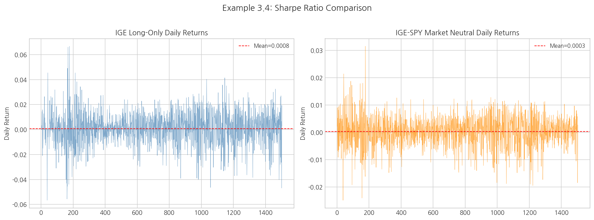
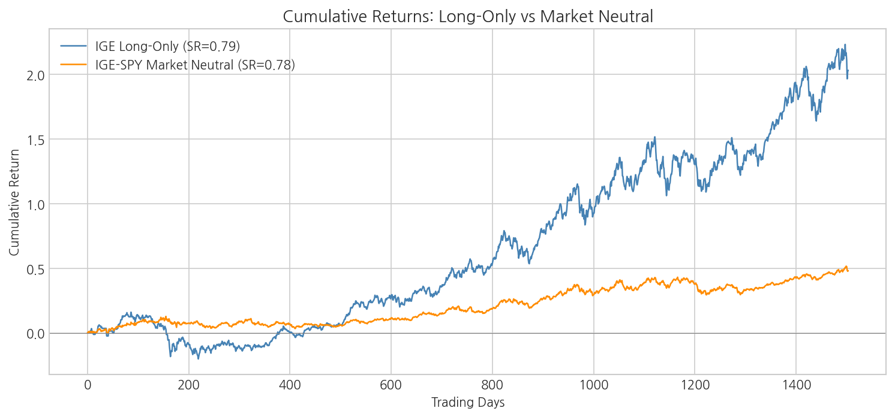
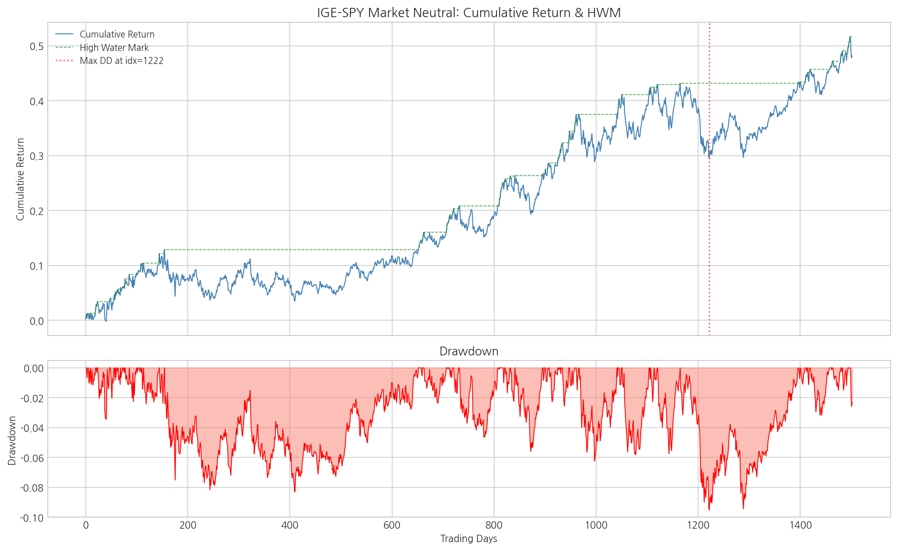
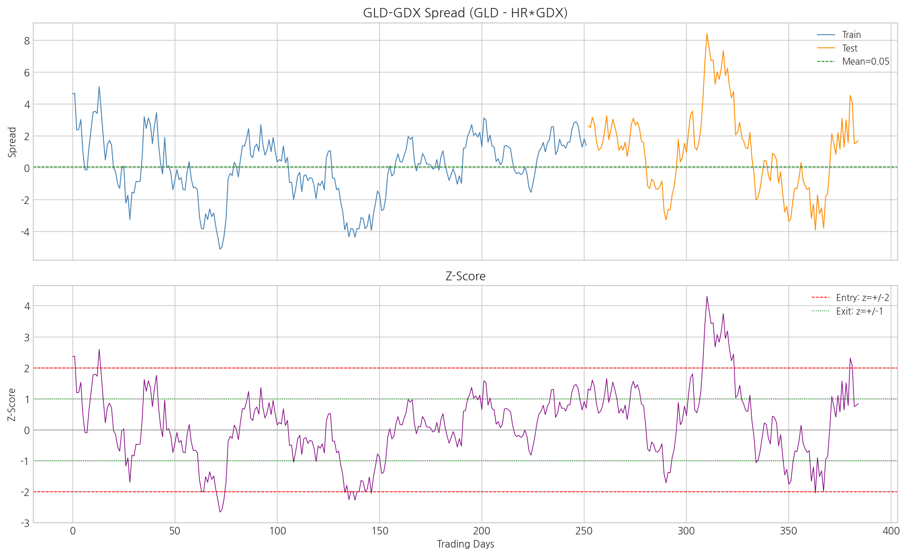
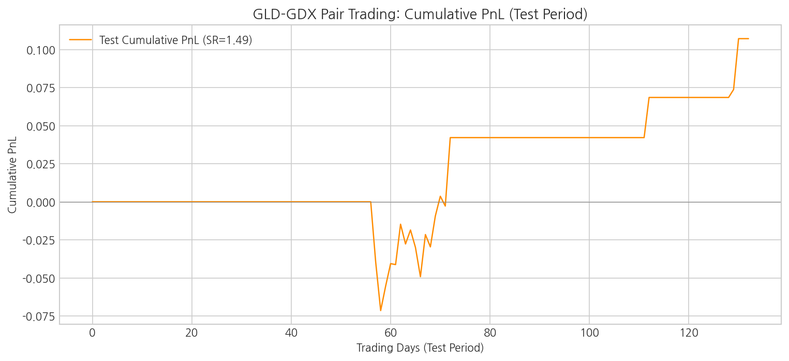
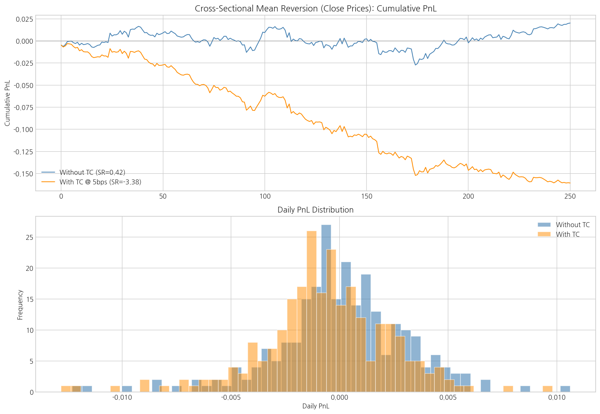
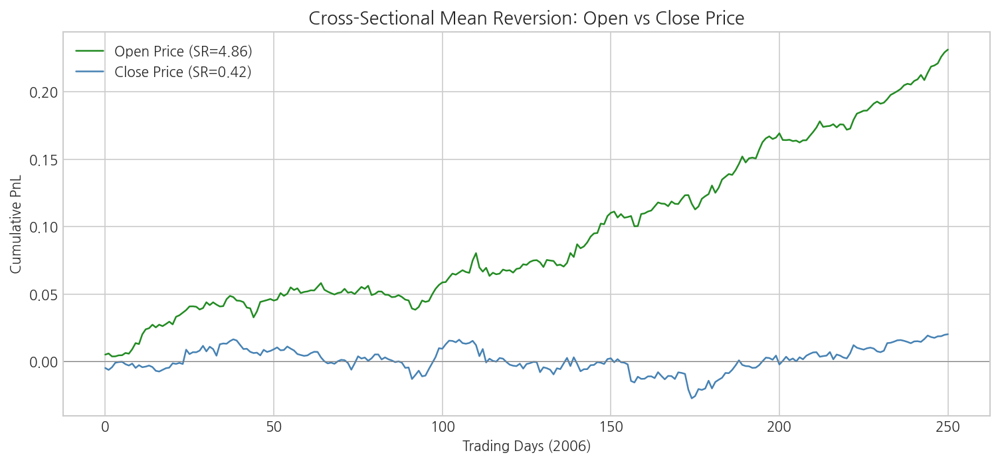

# 제3장 백테스팅 - 종합 분석 리포트

> **생성 일시:** 2026-04-12 16:46:42
> **출처:** Ernest Chan, *Quantitative Trading* (2nd Ed., 2021), Chapter 3

---

## 1. 개요 및 문제 정의

백테스팅(Backtesting)은 과거 데이터를 사용하여 트레이딩 전략의 성과를 검증하는 과정이다.
이 챕터에서는 다음 핵심 성과 지표와 전략을 다룬다:

### 핵심 수식

**샤프 비율(Sharpe Ratio)** 의 연율화:

$$
\text{Annualized Sharpe Ratio} = \sqrt{N_T} \times \frac{\bar{R} - r_f}{\sigma_R}
$$

여기서 $N_T$ 는 연간 거래 기간 수(일별이면 252), $\bar{R}$ 은 기간 평균 수익률, $r_f$ 는 무위험이자율, $\sigma_R$ 은 수익률 표준편차이다.

**최대 낙폭(Maximum Drawdown):**

$$
\text{MDD} = \min_t \left( \frac{1 + \text{CumRet}(t)}{1 + \text{HWM}(t)} - 1 \right)
$$

여기서 $\text{HWM}(t) = \max_{s \le t} \text{CumRet}(s)$ 는 고수위선(High Water Mark)이다.

**달러-중립 포트폴리오** 의 경우, 자기금융(self-financing) 특성상 무위험이자율 차감이 불필요하다.

### 예제 구성

| 예제 | 내용 | 핵심 개념 |
|------|------|-----------|
| 3.1 | Yahoo Finance 데이터 다운로드 | 데이터 수집 (MATLAB/Python/R) |
| 3.2 | 주식분할/배당 조정 | 데이터 전처리 (MATLAB/Excel) |
| 3.3 | 생존자 편향 영향 | 데이터 품질 (MATLAB/Excel) |
| 3.4 | 샤프 비율 계산 | 롱온리 vs 시장중립 |
| 3.5 | 최대 낙폭 계산 | MDD, MDD Duration |
| 3.6 | GLD-GDX 페어 트레이딩 | 공적분, z-score 진입/청산 |
| 3.7 | 횡단면 평균회귀 (종가) | 거래비용 영향 분석 |
| 3.8 | 횡단면 평균회귀 (시가) | 시가 vs 종가 비교 |

---

## 2. 사용 데이터

| 파일명 | 형식 | 설명 | 사용 예제 |
|--------|------|------|-----------|
| `IGE.xls` | XLS | iShares North American Natural Resources ETF | 3.4, 3.5 |
| `SPY.xls` | XLS | SPDR S&P 500 ETF Trust | 3.4 |
| `GLD.xls` | XLS | SPDR Gold Trust | 3.6 |
| `GDX.xls` | XLS | VanEck Gold Miners ETF | 3.6 |
| `SPX_20071123.txt` | TSV | S&P 500 구성 종목 종가 | 3.7 |
| `SPX_op_20071123.txt` | TSV | S&P 500 구성 종목 시가 | 3.8 |

---

## 3. 예제 3.4: 샤프 비율 계산

IGE 롱온리 전략과 IGE-SPY 시장중립 전략의 샤프 비율을 비교한다.

| 지표 | 롱온리 (IGE) | 시장중립 (IGE-SPY) |
|------|:------------:|:-----------------:|
| 일간 평균 수익률 | 0.000829 | 0.000278 |
| 일간 수익률 표준편차 | 0.013490 | 0.005622 |
| **연율화 샤프 비율** | **0.7896** | **0.7839** |

✅ IGE 롱온리 전략의 샤프 비율이 더 높다. 이 기간 동안 에너지 섹터의 강세장이 시장중립 전략보다 유리했다.

⚠️ **주의:** 시장중립 전략의 경우 달러-중립이므로 무위험이자율을 차감하지 않았다.

---

## 4. 예제 3.5: 최대 낙폭 분석

IGE-SPY 시장중립 전략의 누적 복리 수익률에서 최대 낙폭을 계산한다.

| 지표 | 값 |
|------|---:|
| 최대 낙폭 (MDD) | -9.53% |
| 최대 낙폭 지속기간 | 497 거래일 |
| MDD 발생 인덱스 | 1222 |

✅ 최대 낙폭 -9.5% 는 양호한 수준이다.

---

## 5. 예제 3.6: GLD-GDX 페어 트레이딩

GLD(금 ETF)와 GDX(금광 ETF) 간의 페어 트레이딩 전략이다.
학습 기간에서 OLS로 헤지 비율을 추정하고, z-score 기반으로 진입/청산한다.

### 전략 파라미터

| 파라미터 | 값 |
|----------|---:|
| 헤지 비율 | 1.6310 |
| OLS $R^2$ | 0.9990 |
| 스프레드 평균 | 0.0522 |
| 스프레드 표준편차 | 1.9449 |
| 진입 임계치 | $\|z\| \ge 2$ |
| 청산 임계치 | $\|z\| \le 1$ |
| 학습 기간 | 252 거래일 |
| 테스트 기간 | 133 거래일 |

### 성과 요약

| 지표 | 학습(In-Sample) | 테스트(Out-of-Sample) |
|------|:---------------:|:--------------------:|
| **샤프 비율** | **1.9183** | **1.4943** |
| MDD | - | -7.02% |
| MDD 지속기간 | - | 13 거래일 |

✅ 테스트 기간 샤프 비율이 양호하며, 전략의 유효성이 확인된다.

---

## 6. 예제 3.7: 횡단면 평균회귀 (종가)

S&P 500 구성 종목의 종가 기반 횡단면 평균회귀 전략이다.
전일 시장 대비 하락(상승)한 종목을 매수(매도)하여 다음 날 청산한다.

**가중치 산출:**

$$
w_i = -\left(r_i - \bar{r}_{\text{market}}\right)
$$

| 지표 | 거래비용 미포함 | 거래비용 포함 |
|------|:--------------:|:------------:|
| 일간 평균 PnL | 0.000081 | -0.000640 |
| **연율화 샤프 비율** | **0.4179** | **-3.3760** |
| MDD | -4.35% | -14.95% |
| MDD 지속기간 | 205 거래일 | 250 거래일 |
| 평균 일간 턴오버 | 1.4474 | - |

⚠️ 편도 5bps의 거래비용만으로 샤프 비율이 3.7939 하락했다. 고빈도 전략에서 거래비용의 영향이 매우 크다.

---

## 7. 예제 3.8: 횡단면 평균회귀 (시가)

동일한 횡단면 평균회귀 전략을 시가(Open Price) 기반으로 실행한 결과이다.
시가에서 포지션을 진입/청산하면 종가 대비 실행 가능성(executability) 이 높아지지만,
시가 데이터의 잡음(noise) 이 더 클 수 있다.

| 지표 | 거래비용 미포함 | 거래비용 포함 |
|------|:--------------:|:------------:|
| 일간 평균 PnL | 0.000921 | 0.000193 |
| **연율화 샤프 비율** | **4.8606** | **1.0335** |
| MDD | -1.96% | -4.95% |
| MDD 지속기간 | 35 거래일 | 171 거래일 |

### 종가 vs 시가 비교

| 가격 유형 | 샤프 (TC 미포함) | 샤프 (TC 포함) |
|----------|:---------------:|:------------:|
| 종가 (Close) | 0.4179 | -3.3760 |
| 시가 (Open) | 4.8606 | 1.0335 |

✅ 시가 기반 전략이 종가 기반보다 높은 샤프 비율을 보인다.

---

## 8. 전략 백테스트 종합 비교

| 전략 | 유형 | 샤프 비율 | MDD | 비고 |
|------|------|:---------:|:---:|------|
| IGE 롱온리 | 단일자산 롱 | 0.7896 | - | 무위험이자율 4% 차감 |
| IGE-SPY 시장중립 | 롱숏 페어 | 0.7839 | -9.5% | 달러 중립 |
| GLD-GDX 페어 (학습) | 통계 차익 | 1.9183 | - | z-score 기반 |
| GLD-GDX 페어 (테스트) | 통계 차익 | 1.4943 | -7.0% | Out-of-sample |
| 횡단면 평균회귀 (종가, TC 없음) | 크로스섹션 | 0.4179 | -4.4% | SPX 500 종목 |
| 횡단면 평균회귀 (종가, TC 포함) | 크로스섹션 | -3.3760 | -14.9% | 편도 5bps |
| 횡단면 평균회귀 (시가, TC 없음) | 크로스섹션 | 4.8606 | -2.0% | 시가 기반 |
| 횡단면 평균회귀 (시가, TC 포함) | 크로스섹션 | 1.0335 | -4.9% | 편도 5bps |

---

## 9. 결론 및 권고사항

### 핵심 발견

1. **샤프 비율의 중요성:** 단순 수익률이 아닌 위험 조정 성과(샤프 비율) 로 전략을 평가해야 한다.
   롱온리와 시장중립 전략의 절대 수익률은 크게 다르지만, 샤프 비율로 비교하면 보다 공정한 평가가 가능하다.

2. **최대 낙폭의 실무적 의미:** 샤프 비율이 양호하더라도 MDD가 크면 실전 운용이 어렵다.
   투자자의 심리적 한계와 마진콜 리스크를 고려하면, MDD는 20%를 넘지 않도록 관리하는 것이 바람직하다.

3. **거래비용의 파괴적 영향:** 횡단면 평균회귀 전략에서 편도 5bps의 거래비용만으로 샤프 비율이 크게 하락한다.
   고빈도/고회전 전략일수록 거래비용 모델링이 백테스트의 신뢰성을 좌우한다.

4. **학습/테스트 분할의 필요성:** GLD-GDX 페어 트레이딩에서 학습 기간과 테스트 기간의 샤프 비율 차이가 과적합의 정도를 나타낸다.

5. **시가 vs 종가:** 동일 전략이라도 어떤 가격을 사용하느냐에 따라 성과가 달라진다. 시가 기반 전략은 실행 가능성이 높으나, 데이터 잡음에 더 민감할 수 있다.

### 권고사항

- 백테스트 결과를 맹신하지 말고, 반드시 **표본 외(out-of-sample) 검증** 을 수행하라.
- 거래비용, 슬리피지, 시장 충격 등 **실행 비용** 을 현실적으로 모델링하라.
- 생존자 편향, 선행편향 등 **데이터 편향** 을 사전에 점검하라.
- 샤프 비율, MDD, MAR 비율 등 **복수의 성과 지표** 로 전략을 종합 평가하라.

---

*이 리포트는 `run_chapter3_analysis.py`에 의해 자동 생성되었습니다.*
