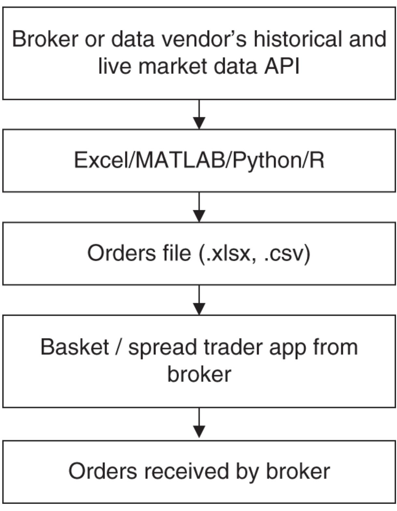
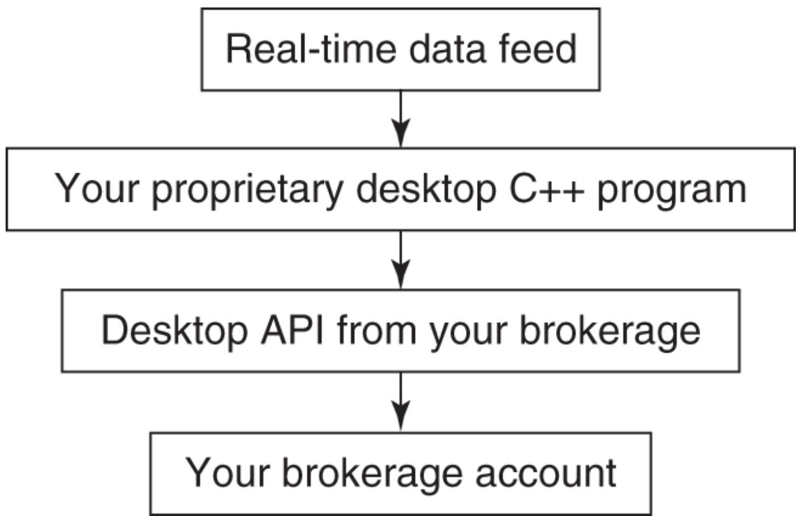

# CHAPTER 5 Execution Systems

At this point, you should have backtested a good strategy (maybe something like the pair-trading strategy in Example 3.6), picked a brokerage (e.g., Alpaca or Interactive Brokers), and have set up a good operating environment (at first, nothing more than a good computer and a high-speed internet connection). You are almost ready to execute your trading strategy—after you have implemented an automated trading system (ATS) to generate and transmit your orders to your brokerage for execution. This chapter is about building such an automated trading system and ways to minimize trading costs and divergence with your expected performance based on your backtests.

### WHAT AN AUTOMATED TRADING SYSTEMCAN DO FOR YOU

An automated trading system will retrieve up-to-date market data from your brokerage or other data vendors, run a trading algorithm to generate orders, and submit those orders to your brokerage for execution. Sometimes, all these steps are fully automated and implemented as one desktop application installed on your computer. Other times, only part of this process is automated, and you would have to take some manual steps to complete the whole procedure.

A fully automated system has the advantage that it minimizes human errors and delays. For certain high-frequency systems, a fully automated system is indispensable, because any human intervention will cause enough delay to seriously derail the performance. A fully automated system used to be complicated and costly to build, often requiring professional programmers with knowledge of highperformance programming languages such as Java, C#, or $\mathrm{C} { + } { + }$ in order to connect to your brokerage's application programming interface (API). But now, with the easy availability of platforms such as QuantConnect and Blueshift, or various automated trading

software such as MATLAB's Trading Toolbox, Python's Backtrader, or R's IBroker, you only need to be an amateur programmer (or not a programmer at all, in the case of Blueshift) to build a fully automated trading system.

For lower-frequency quantitative trading strategies, there is also a semiautomated alternative: One can generate the orders using programs such as Excel or MATLAB, then submit those orders using built-in tools such as a basket trader or spread trader offered by your brokerage. If your brokerage provides a dynamic data exchange (DDE) link to Excel (as follows), you can also write a macro attached to your Excel spreadsheet that allows you to submit orders to the brokerage simply by running the macro. This way, there is no need to build an application in a complicated programming language. However, it does mean that you would have to perform quite a few manual steps in order to submit your orders.

Whether you have built a semiautomated or a fully automated trading system, there is often a need for input data beyond the prices that your brokerage or data vendor can readily provide you. For example, earnings estimates or dividends data are often not provided as part of the real-time data stream. These nonprice data are typically available free of charge from a broker. For example, Interactive Brokers provides free dividends and earnings estimates data (via Zacks) to their customers. Expected earnings announcements dates and times are available too (via Wall Street Horizon), for a small fee.

I will discuss some details of the two kinds of systems in the following sections. I will also discuss how to hire a programming consultant in case you would like someone to help automate the execution of your trading strategy.

### Building a Semiautomated Trading System

In a semiautomated trading system (shown in Figure 5.1), a user typically generates a list of orders using familiar and easy-to-use software such as Excel, MATLAB, Python, or R. Often, the program that generates this order list is the same as the backtest program: After all, you are implementing the same quantitative strategy that you have backtested. Of course, you must remember to update the input data file to reflect the most recent data. This is usually done with either a program that can directly go to retrieve the appropriate data from a broker (such as Alpaca or Interactive Brokers), quantitative trading platform (such as QuantConnect or Blueshift), or data vendor's (such as Algoseek or Quandl) API.

Sometimes, the API is as simple as a DDE link that can update an Excel spreadsheet. Many brokerages that cater to semi-quantitative traders provide such DDE links. Interactive Brokers and Goldman Sachs's REDIPlus are examples. Many proprietary trading firms use one of these brokerages for execution; hence, you would have access to the full menu of these brokerages' real-time data and order entry technologies as well.

  
FIGURE 5.1 Semiautomated trading system.

A DDE link is just an expression to be inserted on an Excel spreadsheet that will automatically load the appropriate data into a cell. The expression is different for different brokerages, but they generally look like this:

$=$ accountid|LAST!IBM

where LAST indicates the last price is requested, and IBM is the symbol in question.

To generate the orders, you can run an Excel macro (a Visual Basic program attached to the spreadsheet) or a MATLAB program, which scans through the information and prices on the spreadsheet, runs the trading algorithm, and writes out the orders to another text file where each line contains the triplet (symbol, side, size). For example,

("IBM", "BUY", "100")

might be a line in the output order file. Sometimes, your brokerage requires other information for order submission, such as whether the order is Day Only, or Good Till Cancel. All this auxiliary information is written out to each line of the order file.

After the text file containing the order list is generated, you can then upload this order file to your brokerage's basket trader or spread trader for submission.

A basket trader is an application that allows you to upload multiple orders for multiple symbols and submit them to the brokerage in one keystroke. Spread trader is an application with which you can specify the symbols of multiple pairs of stocks or other securities, and the conditions when orders for each of these pairs should be entered. The spread trader can monitor real-time prices and check whether these conditions are satisfied throughout the trading day. If the DDE links of your brokerage allow you to submit orders, you can also run an Excel macro to sweep through the order file and submit all the orders to your account with one press of the button as well.

The brokerage that I use, Interactive Brokers, has a BasketTrader and three different spread traders, as well as DDE links for data update and order submission as part of their execution platform. Interactive Brokers' spread orders can be used for futures, options, stock, and stock-vs.-option spreads on the same or multiple

underlyings. Its ComboTrader can handle all these spreads, while its SpreadTrader is specifically for futures and options spreads, and its OptionTrader is specifically for options spreads. (Confusing? Yes, because functionalities proliferate over time and they must be backward compatible.)

Here is what I did with BasketTrader from Interactive Brokers. Every day before the market opened, I ran a MATLAB program (though you can just as well run a Python or R program) that retrieved market data, ran the trading algorithm, and wrote out a list of orders into an order file that can be over 1,000 lines (corresponding to over 1,000 symbols). I then brought up the basket trader from my trading screen, uploaded the order file to my account using the BasketTrader, and in one keystroke submitted them all to my account. Some of these orders might get executed at the open; others might get executed later or not at all. Before the market closed, I canceled all the unexecuted orders by pressing a button. Finally, if I wanted to exit all the existing positions, I simply pressed another button in the basket trader to generate the appropriate exit orders.

I used to use REDIPlus's spread trader for pair-trading strategies such as Example 3.6 because I could have the spread trader enter orders at all times of the day, not just at the market close. Again, before the market opened I used MATLAB (again, Python or R would do this just as well) to retrieve market data, ran the pair-trading algorithm, and wrote out limit prices for all the pairs in my universe. (Note that the limit prices are limits on the spread, not on the individual stocks. If they were on the individual stocks, ordinary limit orders would have done the trick and the spread trader would have been redundant.) I then went to the spread trader, which already contained all these pairs that I had previously specified, and manually adjusted the limit prices based on the MATLAB output. (Actually, this step could be automated, too—all the spread orders information could be written out to an Excel file by MATLAB and uploaded to the spread trader.) Pressing another button would initiate automatic monitoring of prices and entering of orders throughout the trading day.

I also used RediPlus's DDE link for submitting orders for another basket trading strategy. I used MATLAB to generate the appropriate

DDE link formula in each Excel cell so that it could automatically update the appropriate data for the particular symbol on that row. After the market opened, I ran a macro attached to that spreadsheet, which scanned through each symbol and submitted it (together with other order information contained in the spreadsheet) to my account at REDIPlus.

Typically, a semiautomated trading system is suitable if you need to run this step only a few times a day in order to generate one or a few waves of orders. Even if your brokerage's API provides an order submission function for your use in an Excel Visual Basic macro, its speed is usually too slow if you have to run this program frequently in order to capture the latest data and generate wave after wave of orders. In this case, one must build a fully automated trading system. But there is one reason why you may want a semi-automated instead of a fully automated system: the ability to sanity-check your orders before they went on their merry way to the broker. (Just do a search for Knight Capital Group, now part of the HFT firm Virtu Financial, about their $\$ 440$ million software error on August 1, 2012.)

### Building a Fully Automated Trading System

A fully automated trading system (see Figure 5.2) can run the trading algorithm in a loop again and again, constantly scanning the latest prices and generating new waves of orders throughout the trading day. The submission of orders through an API to your brokerage account is automatic, so you would not need to load the trades to a basket trader or spread trader, or even manually run a macro on your Excel spreadsheet. All you need to do is press a “start” button in the morning, and then a “close” button at the end of the day, and your program will do all the trading for you.

  
FIGURE 5.2 Fully automated trading system.

Implementing a fully automated system requires that your brokerage provides an API for data retrieval and order submission. Your   
brokerage will usually provide an API for some popular   
programming languages such as Visual Basic, Java, $\mathbf{C} \#$ , or $\mathrm{C} + + .$ , so your fully automated system must also be written in one of these languages. Alternatively, you can use a quant trading platform such as QuantConnect or Blueshift to execute your strategy with your favorite broker. (After all, you have already backtested your strategy on one of these platforms, so why not use them for execution too?) If you are a MATLAB fan like myself, you can use its Trading Toolbox for that (or get a third-party toolbox through   
undocumentedmatlab.com). For those brokers that provide a   
RESTful API (and that includes Alpaca, Interactive Brokers, or even Robinhood!), you can use any programming language you like, as any language can send HTTP Get and Post requests. However, making these HTTP requests are slower than using an API designed for a specific programming language like C# to get market data and submit orders, so that might not work well if your trading strategy is latency-sensitive.

Theoretically, a fully automated system can be constructed out of an Excel spreadsheet and an attached macro: All you have to do is to create a loop in your macro so that it updates the cells using the DDE links and submit orders when appropriate continuously throughout the day. Unfortunately, data updates through DDE links are slow, and generally your brokerage limits the number of symbols that you can update all at once. (Unless you have generated a large amount of commissions in the previous trading month, Interactive Brokers allows you to update only 100 symbols by default.) Similarly, order submissions through DDE links are also slow. Hence, for trading strategies that react to real-time market data changes intraday, this setup using a spreadsheet is not feasible.

Some brokerages, such as TradeStation, offer a complete backtesting and order submission platform. If you backtested on such a platform, then it is trivial to configure it so that the program will submit real orders to your account. This dispenses with the need to write your own software, whether for backtesting or for automated execution. However, as I mentioned in Chapter 3, the drawback of such proprietary systems is that they are seldom as flexible as a generalpurpose programming language like MATLAB, Python, or R for the construction of your strategy. For instance, if you want to pursue a rather mathematically complex strategy based on principal component analysis (such as the one in Example 7.4), it would be quite difficult to backtest in TradeStation.

### HIRING A PROGRAMMING CONSULTANT

Building an ATS generally requires more professional programming skills than backtesting a strategy. This is especially true for high-frequency strategies where the speed of execution is of the essence. Instead of implementing an execution system yourself, you may find that hiring a programming consultant will result in much less headache.

Hiring a programming consultant does not have to be expensive. For an experienced programmer, the hourly fees may range from $\$ 50$ to $\$ 100$ . Sometimes, you can negotiate a fixed fee for the entire project ahead of time, and I find that most projects for independent traders can be done with $\$ 1$ ,000 to $\$ 5$ ,000. If you have an account at one of the brokerages that supply you with an API, the brokerage can often refer you to some programmers who have experience with their API. (Interactive Brokers, for example, has a special web page that allows programming consultants to offer their services.) You can also look around (or post a request) on elitetrader.com for such programmers.

As a last resort, you can find hundreds if not thousands of freelance programmers advertising themselves on Upwork.com. However, the freelance programmers on Upwork may lack indepth knowledge of financial markets and trading technology, which can be crucial to successfully implementing an automated trading system.

There is one issue that may worry you as you consider hiring programmers: How do you keep your trading strategy confidential? Of course, you can have them sign nondisclosure agreements (NDAs, downloadable for free at many legal document websites), but it is almost impossible to find out if the programmers are in fact running your strategies in their personal accounts once the programs are implemented. There are several ways to address this concern.

First, as I mentioned before, most strategies that you may think are your unique creations are actually quite well known to

experienced traders. So, whether you like it or not, other people are already trading very similar strategies and impacting your returns. Adding an extra trader or two, unless the trader works for an institutional money manager, is not likely to cause much more impact.

Second, if you are trading a strategy that has a large capacity (e.g., most futures trading strategies), then the extra market impact from your rogue programmer consultant will be minimal.

Finally, you can choose to compartmentalize your information and implementation—that is, you can hire different programmers to build different parts of the automated trading strategy. Often, one programmer can build an automated trading infrastructure program that can be used for different strategies, and another one can implement the actual strategy, which will read in input parameters. So in this case, the first programmer does not know your strategy, and the second programmer does not have the infrastructure to execute the strategy. Furthermore, neither programmer knows the actual parameter values to use for your strategy.

### MINIMIZING TRANSACTION COSTS

We saw in Chapter 3 how transaction costs can impact a strategy's actual return. Besides changing your brokerage or proprietary trading firm to one that charges a lower commission, there are a few things you can do in your execution method to minimize the transaction costs.

To cut down on commissions, you can refrain from trading lowpriced stocks. Typically, institutional traders do not trade any stocks with prices lower than $\$ 5$ . Not only do low-price stocks increase your total commissions costs (since you need to buy or sell more shares for a fixed amount of capital), percentage-wise they also have a wider bid–ask spread and therefore increase your total liquidity costs.

In order to minimize market impact cost, you should limit the size (number of shares) of your orders based on the liquidity of the stock.

One common measure of liquidity is the average daily volume (it is your choice what lookback period you want to average over). As a rule of thumb, each order should not exceed 1 percent of the average daily volume. As an independent trader, you may think that it is not easy to reach this 1 percent threshold, and you would be right when the stock in question is a large-cap stock belonging to the S&P 500. However, you may be surprised by the low liquidity of some smallcap stocks out there.

For example, at the time of this writing, Bel Fuse Inc. is a stock in the S&P 600 SmallCap Index. It has a three-month average volume of about 30,000, and it closed recently at about $\$ 10$ . So 1 percent of this average volume is just 300 shares, which are worth only $\$ 3$ ,000. And this is a stock that is included in an index. Imagine those that aren't!

Another way to reduce market impact is to scale the size of your orders based on the market capitalization of a stock. The way to scale the size is not an exact science, but most practitioners would not recommend a linear scale because the market capitalization of companies varies over several orders of magnitude, from tens of millions to hundreds of billions. A linear scale (i.e., scaling the capital of a stock to be linearly proportional to its market capitalization) would result in practically zero weights for most small- and microcap stocks in your portfolio, and this will take away any benefits of diversification. If we were to use linear scale, the capital weight of the largest large-cap stock will be about 10,000 of the smallest small-cap stock. To reap the benefits of diversification, we should not allow that ratio to be more than 10 or so, provided that the liquidity (volume) constraint described previously is also satisfied. If the capital weight of a stock is proportional to the fourth root of its market cap, it would do the trick.

There is one other way to reduce market impact. Many institutional traders who desire to execute a large order will break it down into many smaller orders and execute them over time. This method of trading will certainly reduce market impact; however, it engenders another kind of transaction cost, namely, slippage. As discussed in Chapter 2, slippage is the difference between the price that triggers the trading signal and the average execution price of the entire order. Because the order is executed over a period of time, slippage can be quite large. Since reducing market impact in this way may increase slippage, it is not really suitable for retail traders whose order size is usually not big enough to require this remedy.

Sometimes, however, slippage is outside of your control: Perhaps your brokerage's execution speed is simply too slow, due to either software issues (their software processes your orders too slowly), risk-control issues (your order has to be checked against your account's buying power and pass various risk control criteria before it can be routed to the exchange), or pipeline issues (the brokerage's speed of access to the exchanges). Or perhaps your brokerage does not have access to deep enough “dark-pool” liquidity. These execution costs and issues should affect your choice of brokerages, as I pointed out in Chapter 4.

### TESTING YOUR SYSTEM BY PAPER TRADING

After you have built your automated trading system, it is a good idea to test it in a paper trading account, if your brokerage provides one. Paper trading has a number of benefits; chief among them is that this is practically the only way to see if your ATS software has bugs without losing a lot of real money.

Often, the moment you start paper trading, you will realize that there is a glaring look-ahead bias in your strategy—there may just be no way you could have obtained some crucial piece of data before you enter an order! If this happens, it is “back to the drawing board.”

You should be able run your ATS, execute paper trades, and then compare the paper trades and profit and loss (P&L) with the theoretical ones generated by your backtest program using the latest data. If the difference is not due to transaction costs (including an expected delay in execution for the paper trades), then your software likely has bugs. (I mentioned the names of some of the brokerages that offer paper trading accounts in Chapter 4.)

Another benefit of paper trading is that it gives you better intuitive understanding of your strategy, including the volatility of its P&L, the typical amount of capital utilized, the number of trades per day, and the various operational difficulties including data issues. Even though you can theoretically check out most of these features of your strategy in a backtest, one will usually gain intuition only if one faces them on a daily, ongoing basis. Backtesting also won't reveal the operational difficulties, such as how fast you can download all the needed data before the market opens each day and how you can optimize your operational procedures in actual execution. (Do not underestimate the time required for preparing your orders before the market opens. It took me some 20 minutes to download and parse all my historical data each morning, and it took another 15 minutes or so to transmit all the orders to my account. If your trading strategy depends on data or news prior to the market open that cannot be more than 35 minutes old, then you need to either figure out a different execution environment or modify your strategy. It is hard to figure out all these timing issues until paper trading is conducted.)

If you are able to run a paper trading system for a month or longer, you may even be able to discover data-snooping bias, since paper trading is a true out-of-sample test. However, traders usually pay less and less attention to the performance of a paper trading system as time goes on, since there are always more pressing issues (such as the real trading programs that are being run). This inattention causes the paper trading system to perform poorly because of neglect and errors in operation. So data-snooping bias can usually be discovered only when you have actually started trading the system with a small amount of capital.

### WHY DOES ACTUAL PERFORMANCE DIVERGE FROM EXPECTATIONS?

Finally, after much hard work testing and preparing, you have entered your first order and it got executed! Whether you win or lose, you understand that it will take a while to find out if its performance meets your expectations. But what if after one month, then two months, and then finally a quarter has passed, the strategy still delivers a meager or maybe even negative returns? This disappointing experience is common to freshly minted quantitative traders. This would be the time to review the list of what might have caused this divergence from expectation. Start with the simplest diagnosis:

Do you have bugs in your ATS software?   
Do the trades generated by your ATS match the ones generated by your backtest program?   
Are the execution costs much higher than what you expected?   
Are you trading illiquid stocks that caused a lot of market impact?

If the execution costs are much higher than what you expected, it may be worthwhile to reread the section on how to minimize transaction costs again.

After these easy diagnoses have been eliminated, one is then faced with the two most dreaded causes of divergence: data-snooping bias and regime shifts.

To see if data-snooping bias is causing the underperformance of your live trading, try to eliminate as many rules and as many parameters in your strategy as possible. If the backtest performance completely fell apart after this exercise, chances are you do have this bias and it is time to look for a new strategy. If the backtest performance is still reasonable, your poor live trading performance may just be due to bad luck.

Regime shifts refer to the situation when the financial market structure or the macroeconomic environment undergoes a drastic change so much so that trading strategies that were profitable before may not be profitable now.

There are two noteworthy regime shifts in recent years related to market (or regulatory) structure that may affect certain strategies.

The first one is the decimalization of stock prices. Prior to early 2001, stock prices in the United States were quoted in multiples of onesixteenth and one-eighteenth of a penny. Since April 9, 2001, all US stocks have been quoted in decimals. This seemingly innocuous change has had a dramatic impact on the market structure, which is particularly negative for the profitability of statistical arbitrage strategies.

The reason for this may be worthy of a book unto itself. In a nutshell, decimalization reduces frictions in the price discovery process, while statistical arbitrageurs mostly act as market makers and derive their profits from frictions and inefficiencies in this process. (This is the explanation given by Dr. Andrew Sterge in a Columbia University financial engineering seminar titled “Where Have All the Stat Arb Profits Gone?” in January 2008. Other industry practitioners have made the same point to me in private conversations.) Hence, we can expect backtest performance of statistical arbitrage strategies prior to 2001 to be far superior to their present-day performance.

The other regime shift is relevant if your strategy shorts stocks.

Prior to 2007, Securities and Exchange Commission (SEC) rules state that one cannot short a stock unless it is on a “plus tick” or “zero-plus tick.” Hence, if your backtest data include those earlier days, it is possible that a very profitable short position could not actually have been entered into due to a lack of plus ticks, or it could have been entered into only with a large slippage. This plus-tick rule was eliminated by the SEC in June 2007, and it was replaced by an alternative uptick rule (Rule 201) in February 2010. Therefore, your backtest results for a strategy that shorts stocks may show an artificially inflated performance prior to 2007 and after 2009 relative to their actual realizable performance. June 2007–February 2010 might provide the only realistic backtest period if you haven't incorporated this rule!

Actually, there is another problem with realizing the backtest performance of a strategy that shorts stocks apart from this regulatory regime shift. Even without the plus-tick rule, many stocks, especially the small-cap ones or the ones with low liquidity, are “hard to borrow.” For you to be able to short a stock, your broker has to be able to borrow it from someone else (usually a large mutual fund or other brokerage clients) and lend it to you for selling. If no one is able or willing to lend you their stock, it is deemed hard to borrow and you would not be able to short it. Hence, again, a very profitable historical short position may not actually have been possible due to the difficulty of borrowing the stock.

The two regime shifts described here are the obvious and wellpublicized ones. However, there may be other, more subtle regime shifts that apply to your category of stocks that few people know about, but are no less disruptive to the profitability of your strategy's performance. I will discuss how one might come up with a model that detects regime shifts automatically as one of the special topics of Chapter 7.

### SUMMARY

An automated trading system is a piece of software that automatically generates and transmits orders to your brokerage account based on your trading strategy. There are three advantages to having this software:

It ensures the faithful adherence to your backtested strategy. It eliminates manual operation so that you can simultaneously run multiple strategies. Most importantly, it allows speedy transmissions of orders, which is essential to high-frequency trading strategies.

Regarding the difference between a semiautomated trading system and a fully automated trading system:

In a semiautomated trading system, the trader still needs to manually upload a text file containing order details to a basket trader or spread trader, and manually press a button to transmit the orders at the appropriate time. However, the order text file can be automatically generated by a program such as MATLAB, Python, or R.   
In a fully automated trading system, the program will be able to automatically upload data and transmit orders throughout the trading day or even over many days.

After the creation of an ATS, you can then focus on the various issues that are important in execution: minimizing transaction costs and paper trading. Minimizing transaction costs is mainly a matter of not allowing your order size to be too big relative to its average trading volume and relative to its market capitalization. Paper trading allows you to:

Discover software bugs in your trading strategy and execution programs.   
Discover look-ahead or even data-snooping bias.   
Discover operating difficulties and plan for operating schedules.   
Estimate transaction costs more realistically.   
Gain important intuition about P&L volatility, capital usage, portfolio size, and trade frequency.

Finally, what do you do in the situation where your live trading underperforms your backtest? You can start by addressing the usual problems: Eliminate bugs in the strategy or execution software; reduce transaction costs; and simplify the strategy by eliminating parameters. But, fundamentally, your strategy still may have suffered from data-snooping bias or regime shift.

If you believe (and you can only believe, as you can never prove this) that your poor live-trading performance is due to bad luck and not to data-snooping bias in your backtest nor to a regime shift, how should you proceed when the competing demands of perseverance and capital preservation seem to suggest opposite actions? This critical issue will be addressed in the next chapter, which discusses systematic ways to preserve capital in the face of losses and yet still be in a position to recover once the tide turns.