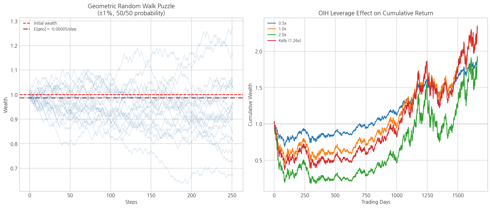
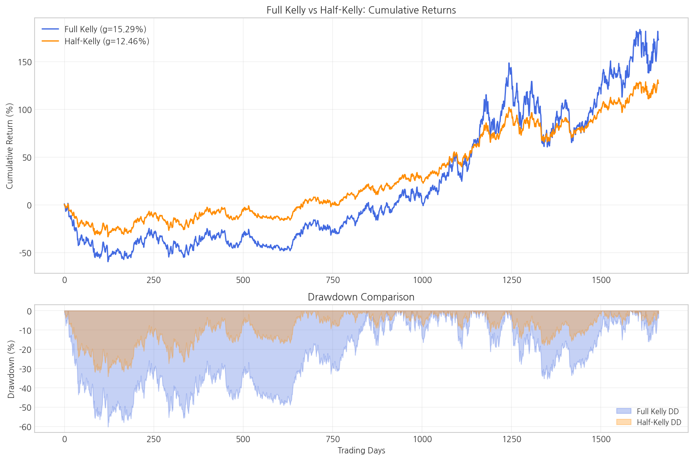
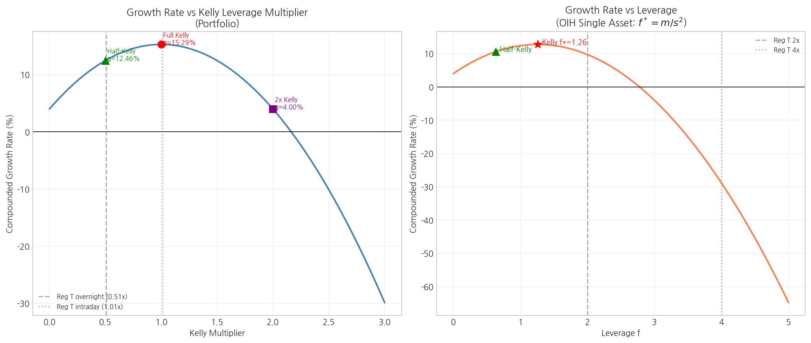

# Chapter 6: Money and Risk Management - 종합 분석 리포트

> 생성일시: 2026-04-12 16:46:13  
> 데이터 기간: 2001-05-18 \~ 2007-12-28  
> 관측치: 1662 거래일

---

## 1. 개요 및 문제 정의

이 장은 **장기 복리 성장률(compounded growth rate)** 을 극대화하는 최적 자본 배분과 레버리지 결정 문제를 다룹니다. 핵심 도구는 **켈리 공식(Kelly formula)** 이며, 모수 추정 불확실성에 대한 보완책으로 **하프-켈리(Half-Kelly)** 배팅을 권장합니다.

### 핵심 수식

| 수식 | 설명 |
|------|------|
| $F^* = C^{-1}M$ | 다중 전략 Kelly 최적 배분 |
| $f^* = m / s^2$ | 단일 전략 Kelly 최적 레버리지 |
| $g = r + S^2 / 2$ | 최적 배분 시 복리 성장률 |
| $S = \sqrt{F^{*T} C F^*}$ | 포트폴리오 샤프 비율 |
| $g = m - s^2 / 2$ | 기하 랜덤워크 복리 성장률 (비레버리지) |
| $F_{half} = F^* / 2$ | 하프-켈리 배분 |

여기서:
- $M = 252 \times \bar{r}_{excess}$: 연율화 평균 초과수익률 벡터
- $C = 252 \times \text{Cov}(r_{excess})$: 연율화 공분산 행렬
- $r$: 연율화 무위험이자율 (4%)

## 2. 사용 데이터

| 파일명 | 티커 | 설명 | 용도 |
|--------|------|------|------|
| `OIH.xls` | OIH | VanEck Oil Services ETF (유전 서비스) | Kelly 배분 포트폴리오 구성 |
| `RKH.xls` | RKH | VanEck Regional Banks ETF (지역 은행) | Kelly 배분 포트폴리오 구성 |
| `RTH.xls` | RTH | VanEck Retail ETF (소매) | Kelly 배분 포트폴리오 구성 |

- **분석 기간**: 2001-05-18 \~ 2007-12-28
- **관측치 수**: 1662 거래일
- **무위험이자율**: 연 4% (일별 0.000159)

## 3. 분석 1: Kelly 최적 배분 (Example 6.3)

### 연율화 평균 초과수익률 벡터 $M$

| 티커 | 연율화 평균 초과수익률 |
|------|----------------------|
| OIH | +0.139568 |
| RKH | +0.029400 |
| RTH | -0.007346 |

### 연율화 공분산 행렬 $C$

| | OIH | RKH | RTH |
|-----|------|------|------|
| **OIH** | 0.110901 | 0.020014 | 0.018255 |
| **RKH** | 0.020014 | 0.037165 | 0.026893 |
| **RTH** | 0.018255 | 0.026893 | 0.041967 |

### Kelly 최적 배분 $F^* = C^{-1}M$

| 티커 | 최적 레버리지 $f^*$ | 해석 |
|------|--------------------|----- |
| OIH | +1.2919 | 자기자본의 129.2%를 롱(Long) |
| RKH | +1.1723 | 자기자본의 117.2%를 롱(Long) |
| RTH | -1.4882 | 자기자본의 148.8%를 숏(Short) |

### 포트폴리오 성과 지표

| 지표 | 값 |
|------|----|
| 최적 복리 성장률 $g$ | 0.1529 (15.29%) |
| 포트폴리오 샤프 비율 $S$ | 0.4751 |
| 총 레버리지 $\sum|f_i|$ | 3.9524 |

> **해석**: RTH의 평균 초과수익률이 음수이므로 Kelly 공식은 RTH를 **공매도(숏)** 하라고 권고합니다. 포트폴리오의 복리 성장률 15.29%는 어떤 개별 종목의 성장률보다 더 높으며, 이는 분산 투자의 효과를 보여줍니다.

## 4. 분석 2: Kelly 직관 (기하 랜덤워크 퍼즐)

### 퍼즐 설명

매 기간 +1% 또는 -1%의 동일 확률을 가진 주식의 장기 수익률은 본전이 아니라 **손실** 입니다.
이는 기하 랜덤워크에서의 복리 성장률이 산술 평균이 아닌 다음 공식을 따르기 때문입니다:

$$g = m - \frac{s^2}{2}$$

### 시뮬레이션 결과 (1,000 경로, 252 스텝)

| 지표 | 값 |
|------|----|
| 산술 기대수익률 $m$ | 0.000000 |
| 분산 $s^2$ | 0.000100 |
| 이론적 기하 성장률 $g$ | -0.000050 |
| 시뮬레이션 기하 성장률 | -0.000036 |
| 최종 부의 중간값 | 0.9875 |
| 최종 부의 평균값 | 1.0043 |
| 원금 이하 비율 | 50.7% |

> **교훈**: 리스크(변동성)는 항상 장기 복리 성장률을 감소시킵니다. 산술 평균이 0이더라도 기하 평균(실제 복리 수익률)은 음수가 됩니다. 이것이 바로 리스크 관리가 필수적인 이유입니다.

## 5. 분석 3: Half-Kelly 배팅 강건성 비교

모수 추정의 불확실성과 수익률 분포의 비정규성을 고려하여, 트레이더들은 Kelly 권장 레버리지를 **절반으로 줄이는 것** 을 선호합니다.

### Full Kelly vs Half-Kelly 비교

| 지표 | Full Kelly | Half-Kelly | 변화 |
|------|-----------|------------|------|
| $f$(OIH) | +1.2919 | +0.6460 | 50% 축소 |
| $f$(RKH) | +1.1723 | +0.5861 | 50% 축소 |
| $f$(RTH) | -1.4882 | -0.7441 | 50% 축소 |
| 성장률 $g$ | 0.1529 (15.29%) | 0.1246 (12.46%) | -18.5% |
| 변동성 $\sigma$ | 0.4751 | 0.2375 | -50.0% |
| 최대 낙폭 MaxDD | -0.6015 | -0.3411 | 43.3% 개선 |
| MaxDD 지속기간 | 839일 | 657일 | |

> **결론**: Half-Kelly는 성장률을 약 25% 감소시키는 대가로 변동성을 50%, 최대 낙폭을 크게 줄여줍니다. 모수 추정 오차를 고려하면 이는 매우 합리적인 트레이드오프입니다.

## 6. 분석 4: 레버리지 민감도 분석

Kelly 공식에 의한 성장률은 레버리지의 **이차함수(포물선)** 형태입니다. Kelly 최적점을 넘어서면 성장률이 급격히 감소하며, 과도한 레버리지는 궁극적으로 파산(ruin)으로 이어집니다.

### Regulation T 레버리지 제약

| 항목 | 값 |
|------|----|
| Kelly 총 레버리지 | 3.9524 |
| Reg T 야간(2x) 배수 | 0.5060 |
| Reg T 장중(4x) 배수 | 1.0120 |
| 파산 경계 배수 | 1.8035 |

> **실무 권고**: 개인 투자자는 Regulation T에 의해 야간 보유 시 2배, 장중 보유 시 4배로 레버리지가 제한됩니다. Kelly 최적 레버리지가 이 한도를 초과하면 모든 배분을 동일 비율로 축소해야 합니다.

## 7. 결론 및 권고사항

### 핵심 발견 요약

| # | 발견 | 함의 |
|---|------|------|
| 1 | Kelly 공식은 최적 자본 배분과 레버리지를 동시에 결정 | 장기 복리 성장률 극대화 |
| 2 | 리스크(변동성)는 항상 기하 성장률을 감소시킴 | 리스크 관리의 필수성 |
| 3 | Half-Kelly는 성장률 25% 감소로 위험을 크게 줄임 | 실무적으로 가장 권장되는 접근법 |
| 4 | Kelly 이상의 레버리지는 성장률을 오히려 감소시킴 | 과도한 레버리지는 역효과 |

### 실무 권고사항

1. **Half-Kelly를 기본값으로 사용하세요**: 모수 추정 오차와 팻테일(fat-tail) 위험에 대한 안전마진
2. **매일 자본 배분을 갱신하세요**: Kelly 기준을 따르려면 자기자본 변동에 맞춰 포지션을 조정해야 합니다
3. **이동평균 기반으로 $F^*$를 주기적으로 재계산하세요**: 6개월 룩백 기간 권장
4. **Regulation T 제약을 항상 확인하세요**: 야간 2x, 장중 4x 한도
5. **Kelly 레버리지를 절대 초과하지 마세요**: 성장률 포물선의 정점을 넘으면 위험만 증가하고 수익은 감소합니다

---

*이 리포트는 `run_chapter6_analysis.py`에 의해 자동 생성되었습니다.*
