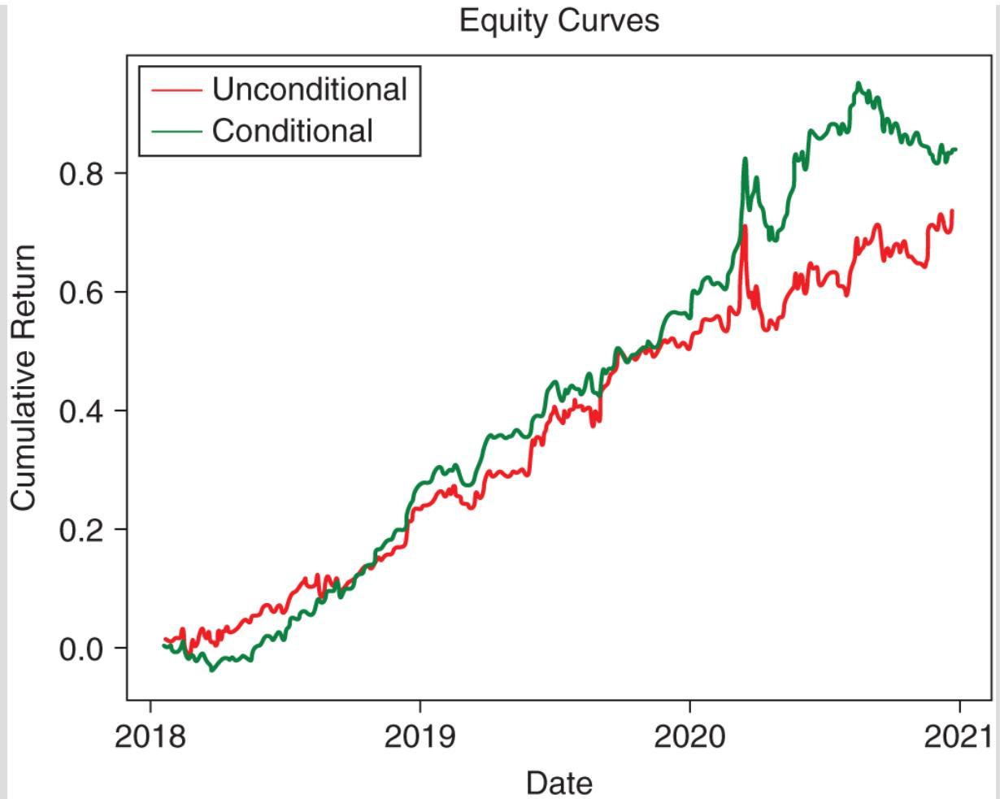
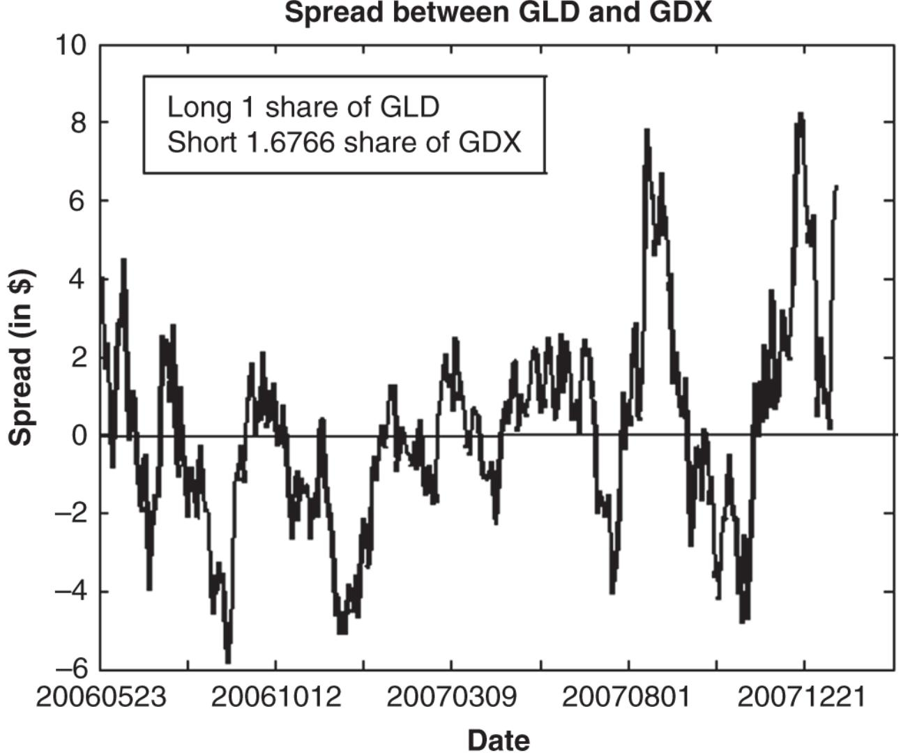
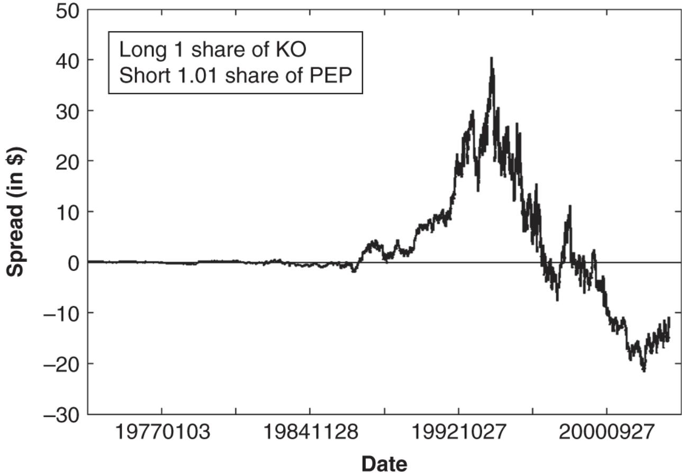
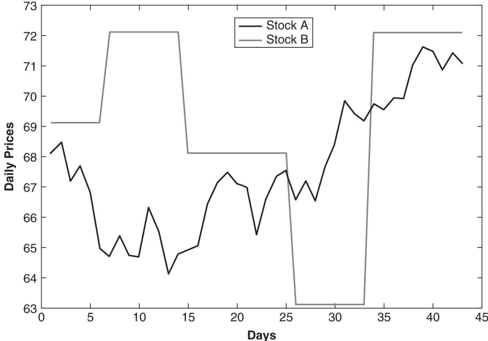
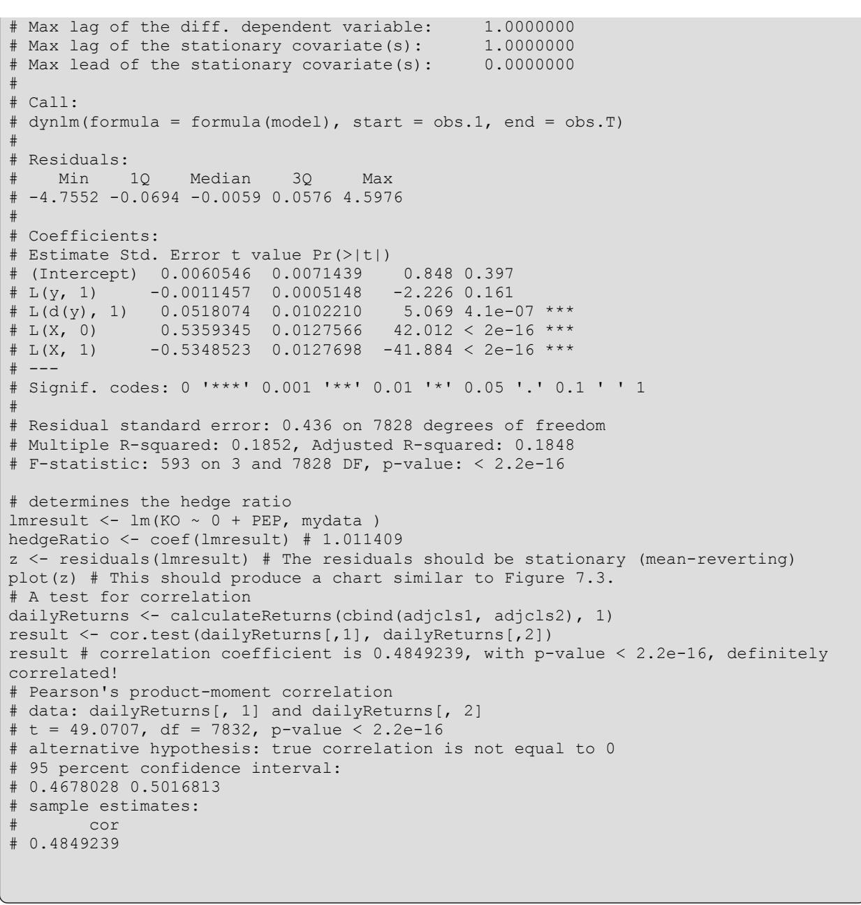
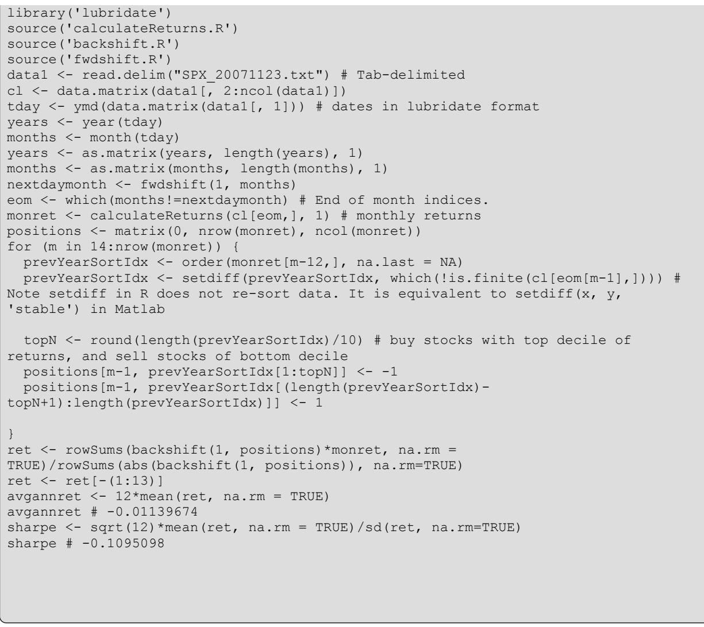

# CHAPTER 7 정량적 트레이딩의 특수 주제

이 책의 앞선 6개 장에서는 여러분이 자신의 정량 전략을 연구하고, 개발하고, 실행하는 데 필요한 대부분의 기초 지식을 다루었습니다. 본 장에서는 정량적 트레이딩에서 중요한 주제들을 보다 자세히 설명합니다. 이러한 주제들은 통계적 차익거래 (statistical arbitrage) 트레이딩의 토대를 이루며, 대부분의 정량 트레이더는 이들 주제 중 적어도 일부, 아니면 대부분에 대해 익숙합니다. 또한 이는 트레이딩에 대한 우리의 직관을 형성하는 데에도 매우 유용합니다.

저는 트레이딩 전략의 두 가지 기본 범주, 즉 평균회귀 (mean-reverting) 전략과 모멘텀 전략을 설명하겠습니다. 평균회귀적 행동과 추세적 행동이 나타나는 기간은 일부 트레이더들이 레짐 (regime)이라고 부르는 것의 예이며, 서로 다른 레짐은 서로 다른 전략을 요구하거나, 적어도 동일한 전략에서 서로 다른 파라미터를 요구합니다. 평균회귀 전략은 시계열의 정상성 (stationarity)과 공적분 (cointegration) 개념으로부터 수학적 정당화를 얻으며, 이는 다음에서 다룰 것입니다. 그 다음으로, 우리는 조건부 파라미터 최적화 (Conditional Parameter Optimization, CPO)라고 부르는, 서로 다른 레짐에 맞추어 트레이딩 전략의 파라미터를 적응시키기 위한 머신러닝의 새로운 적용을 논의하겠습니다. 이어서 저는 많은 헤지펀드가 대규모 포트폴리오를 관리하는 데 사용하는 이론이자, 그들의 성과에 큰 혼란을 야기해 온 이론, 즉 요인 모형 (factor models)을 설명하겠습니다. 트레이더들이 자주 논의하는 다른 전략 범주로는 계절성 거래 (seasonal trading)와 고빈도 전략 (high-frequency strategies)이 있습니다. 모든 트레이딩 전략에는 포지션을 청산하는 방법이 필요하며, 저는 이를 위한 서로 다른 논리적 방법들을 설명하겠습니다. 마지막으로, 저는 전략의 수익률을 최선으로 향상시키는 방법이 무엇인지, 즉 더 높은 레버리지를 사용하는 것인지 아니면 더 높은 베타(beta)를 가진 종목을 거래하는 것인지를 숙고합니다.

### 평균회귀 (mean-reverting) 대 모멘텀 (momentum) 전략

트레이딩 전략이 수익을 낼 수 있는 경우는 증권 가격이 평균회귀하거나 추세를 보이는 경우뿐입니다. 그렇지 않다면 가격은 무작위보행 (random walk)을 하게 되며, 트레이딩은 무의미해질 것입니다. 가격이 평균회귀하며 현재 어떤 기준 가격에 비해 낮다고 믿는다면, 지금 매수하고 나중에 더 높은 가격에 매도할 계획을 세워야 합니다. 그러나 가격이 추세를 보이며 현재 낮다고 믿는다면, 지금 (공)매도하고 나중에 더 낮은 가격에서 매수할 계획을 세워야 합니다. 가격이 높다고 믿는 경우에는 그 반대가 성립합니다.

학술 연구는 주가가 평균적으로 무작위보행에 매우 가깝다는 점을 시사해 왔습니다. 그러나 이는 특정한 특수 조건하에서 주가가 어느 정도의 평균회귀 또는 추세적 행태를 보일 수 없다는 뜻은 아닙니다. 더 나아가, 어느 한 시점에서라도 주가는 관심을 두는 시간 지평에 따라 평균회귀적이면서도 동시에 추세적일 수 있습니다. 트레이딩 전략을 구성하는 일은 본질적으로, 특정 조건하에서 그리고 특정 시간 지평에 대해 가격이 평균회귀할 것인지 추세를 보일 것인지를 결정하고, 또한 임의의 시점에서 초기 기준 가격이 무엇이어야 하는지를 정하는 문제입니다. (가격이 추세를 보일 때에는 “모멘텀”을 가진다고도 하며, 따라서 이에 대응하는 트레이딩 전략은 흔히 모멘텀 전략이라고 불립니다.)

단일 종목의 가격이 평균 가격 수준으로부터 일시적으로 이탈한 뒤 다시 그 평균으로 되돌아오는 현상은 시계열 평균회귀 (time-series mean reversion)라고 하며, 이는 자주 일어나지 않습니다. (다만 체제 변화와 파라미터 최적화 (regime change and parameter optimization)에 관한 다음 절의 전략 예시는, ETF에 대해 변화하는 일별 체제에 평균회귀 전략을 적응시키려는 겉보기에는 성공적인 시도를 설명합니다.) 한 쌍의 종목, 또는 여러 종목으로 구성된 포트폴리오의 스프레드 (spread)가 다시 그 평균 수준으로 되돌아오는 평균회귀는 횡단면 평균회귀 (cross-sectional mean reversion)라고 하며, 이는 훨씬 더 자주 발생합니다.

저는 예제 3.6에서 한 쌍의 종목(정확히는 ETF)의 평균회귀에 기반한 트레이딩 전략을 이미 설명한 바 있습니다. 종목들로 구성된 롱-숏 포트폴리오의 평균회귀에 관해서는, 금융 연구자들(Khandani and Lo, 2007)이 매우 단순한 단기 평균회귀 모델을 구성하였으며, 이는 여러 해에 걸쳐(거래비용 이전 기준으로) 수익성이 있습니다. 물론 거래비용을 고려한 뒤에도 수익성 있게 거래할 수 있을 정도로 평균회귀가 충분히 강하고 일관적인지 여부는 또 다른 문제이며, 평균회귀가 강하고 일관적인 그러한 특수한 상황을 찾아내는 일은 트레이더인 여러분의 몫입니다.

횡단면 평균회귀는 상당히 널리 관찰되지만, 수익성 있는 평균회귀 전략을 백테스트 (backtesting)하는 일은 매우 위험할 수 있습니다.

많은 역사적 금융 데이터베이스에는 가격 호가에 오류가 포함되어 있습니다. 이러한 오류는 평균회귀 전략 (mean-reverting strategy)의 성과를 인위적으로 부풀리는 경향이 있습니다. 그 이유는 쉽게 알 수 있습니다. 평균회귀 전략은 어떤 이동평균보다 훨씬 낮은 가공의 호가에서 매수한 뒤, 이동평균과 일치하는 다음의 정확한 호가에서 매도하여 이익을 내게 됩니다. 따라서 평균회귀 전략에 대한 백테스트 성과를 완전히 신뢰하기 전에, 데이터가 이러한 가공의 호가들로부터 철저히 정제되었는지 반드시 확인해야 합니다.

제3장에서 논의했듯이, 생존자 편향 (survivorship bias) 역시 평균회귀 전략의 백테스트에 불균형적으로 영향을 미칩니다. 극단적인 가격 움직임을 겪은 주식은 인수되었을 가능성이 높거나(가격이 매우 높아진 경우), 파산했을 가능성이 높습니다(가격이 0이 된 경우). 평균회귀 전략은 전자에 대해 공매도하고 후자에 대해 매수하게 되며, 두 경우 모두에서 손실을 보게 됩니다. 그러나 역사적 데이터베이스에 생존자 편향이 존재하면 이러한 주식들은 데이터베이스에 아예 나타나지 않을 수 있으며, 그 결과 백테스트 성과가 인위적으로 부풀려집니다. 어떤 데이터베이스에 생존자 편향이 있는지 알아보려면 표 3.1을 확인할 수 있습니다.

모멘텀 (momentum)은 정보의 느린 확산에 의해 생성될 수 있습니다. 즉, 더 많은 사람들이 특정 뉴스에 대해 알게 되면서 더 많은 사람들이 주식을 매수하거나 매도하기로 결정하고, 그에 따라 가격이 동일한 방향으로 움직이게 됩니다. 앞서 저는 기대이익이 변화했을 때 주가가 모멘텀을 보일 수 있다고 제안했습니다. 이는 어떤 회사가 분기 실적을 발표할 때 발생할 수 있는데, 투자자들이 이 발표를 점진적으로 인지하거나, 큰 주문을 점증적으로 집행함으로써(시장 충격을 최소화하기 위해) 이 변화에 반응하기 때문입니다. 그리고 실제로 이는 실적 발표 후 드리프트 (post earnings announcement drift, PEAD)라고 불리는 모멘텀 전략으로 이어집니다. (이 전략에 관한 특히 유용하고 참고문헌이 많은 글을 보려면   
quantlogic.blogspot.com/2006/03/pocket-phd-post-earning-announcment.html 을 찾아보십시오.) 본질적으로 이 전략은 실적이 기대치를 상회할 때 해당 주식을 매수하고, 기대치에 미달할 때 해당 주식을 공매도할 것을 권고합니다. 더 일반적으로는, 많은 뉴스 발표가 어떤 주식의 미래 기대이익에 대한 기대를 변화시킬 잠재력이 있으며, 따라서 추세 구간을 촉발할 잠재력도 있습니다. 어떤 종류의 뉴스가 이를 촉발하는지, 그리고 추세 구간이 얼마나 지속되는지는 다시 여러분이 직접 찾아내야 합니다.

정보의 느린 확산 외에도, 모멘텀은 대규모 투자자의 유동성 수요 또는 사적 투자 결정으로 인해 큰 주문이 점증적으로 집행되는 데서 비롯될 수 있습니다. 이러한 원인은 다른 어떤 원인보다도 단기 모멘텀의 사례를 더 많이 설명하는 것으로 보입니다. 그러나 대형 브로커리지들이 점점 더 정교한 집행 알고리즘 (execution algorithms)을 채택하게 되면서, 관측된 모멘텀의 배후에 큰 주문이 있는지 여부를 판별하기는 점점 더 어려워지고 있습니다.

모멘텀은 투자자들의 군집적 행동에 의해서도 생성될 수 있습니다. 즉, 투자자들은 다른 사람들의 (어쩌면 무작위적이고 의미가 없을 수도 있는) 매수 또는 매도 결정을 자신의 거래 결정을 정당화하는 유일한 근거로 해석합니다. 예일대 경제학자 로버트 실러가 뉴욕타임스에서 말했듯이(Schiller, 2008), 누구도 완전히 정보에 근거한 금융 의사결정을 내리는 데 필요한 모든 정보를 갖고 있지 않습니다. 사람은 다른 이들의 판단에 의존해야 합니다. 그러나 다른 이들의 판단의 질을 판별할 확실한 방법은 없습니다. 더 문제가 되는 점은, 사람들이 마을 회관에 모여 한 번에 합의를 도출하는 것이 아니라 서로 다른 시점에 금융 의사결정을 내린다는 사실입니다. 집을 높은 가격에 처음 산 사람은 주택이 좋은 투자라는 점을 다른 사람들에게 “알려” 주고, 그로 인해 또 다른 사람이 같은 결정을 내리며, 이런 일이 계속됩니다. 따라서 첫 구매자의 잠재적으로 오류가 있는 결정이 다른 사람들의 무리에게 “정보”로서 전파됩니다.

불행히도, 이 두 가지 원인(사적 유동성 필요와 군집적 행동)으로 생성되는 모멘텀 국면은 시간 지평이 매우 예측 불가능합니다. 기관이 분할하여 실행해야 하는 주문이 얼마나 큰지 어떻게 알 수 있겠습니까? “무리”가 언제 충분히 커져 질주(stampede)를 형성하는지 어떻게 예측할 수 있겠습니까? 악명 높은 임계점(tipping point)은 어디에 있습니까? 우리가 이러한 시간 지평을 신뢰할 만하게 추정하는 방법을 갖고 있지 않다면, 이러한 현상에 근거하여 모멘텀 거래를 수익성 있게 실행할 수 없습니다. 뒤의 체제 전환(regime switch) 절에서는 이러한 임계점 또는 “전환” 지점을 예측하려는 몇 가지 시도를 검토하겠습니다.

더 예측 가능한 다른 모멘텀의 원인들도 있습니다. 선물시장에서의 롤 수익(roll returns)의 지속성과, 리스크 관리 또는 포트폴리오 리밸런싱으로 인해 발생하는 증권의 강제 매도 및 매수입니다. 이 두 가지 원인은 제 두 번째 책(Chan, 2013)에서 자세히 다룹니다.

평균회귀 전략과 모멘텀 전략 사이에는 숙고해 볼 만한 마지막 대조점이 하나 있습니다. 동일한 전략을 사용하는 트레이더들의 경쟁이 증가하면 어떤 효과가 나타날까요? 평균회귀 전략의 경우, 그 효과는 대개 차익거래 기회의 점진적 소멸이며, 그 결과 수익률이 점차 감소하여 0에 가까워집니다. 차익거래 기회의 수가 거의 0으로 줄어들면, 평균회귀 전략은 거래 신호의 점점 더 큰 비율이 실제로는 주식 가치평가의 근본적 변화에 기인하여 평균으로 회귀하지 않을 위험에 노출됩니다. 모멘텀 전략의 경우, 경쟁의 효과는 종종 추세가 지속되는 시간 지평의 단축입니다. 뉴스가 더 빠른 속도로 확산되고 더 많은 트레이더들이 이 추세를 더 이른 시점에 활용할수록, 균형가격은 더 빨리 도달됩니다. 이 균형가격에 도달한 뒤에 진입한 모든 거래는 수익을 내지 못합니다.

### 레짐 변화와 조건부 파라미터 최적화

레짐(regime)의 개념은 금융시장에 가장 기초적입니다. 강세장과 약세장이 레짐이 아니라면 도대체 무엇이겠습니까? 레짐 변화(regime change)를 예측하고자 하는 바람 또한 금융시장 자체만큼이나 오래되었습니다.

만약 강세장에서 약세장으로의 전환을 예측하려는 우리의 시도가 조금이라도 성공적이었다면, 우리는 논의를 이 한 가지 유형의 전환에만 집중하고 그것으로 마무리할 수 있었을 것입니다. 그렇게만 된다면 얼마나 좋겠습니까. 이러한 유형의 전환을 예측하는 데 따르는 어려움은 연구자들로 하여금 금융시장에서의 다른 유형의 레짐 전환을 더 폭넓게 살펴보도록 부추기며, 기존 통계 도구로 더 잘 다룰 수 있는 어떤 전환을 찾을 수 있기를 기대하게 합니다.

저는 이미 시장 및 규제 구조의 변화에 기인하는 두 가지 레짐 변화를 설명한 바 있습니다. 즉, 2003년의 주가 소수점 호가제(decimalization)와 2007년의 공매도 플러스틱 규정(short-sale plus-tick rule) 폐지입니다. (자세한 내용은 5장을 참조하십시오.) 이러한 레짐 변화는 정부에 의해 사전에 공표되므로 전환 자체를 예측할 필요는 없지만, 규제 변화의 정확한 결과를 예측할 수 있는 사람은 거의 없습니다.

그 밖에 가장 흔히 연구되는 금융 또는 경제 레짐으로는 인플레이션 국면 대 경기침체 국면 레짐, 고변동성 대 저변동성 레짐, 평균회귀형(mean-reverting) 대 추세형(trending) 레짐이 있습니다. 보다 최근의 레짐 변화로는 Reddit.com의 r/WallStreetBets 포럼에서의 홍보로 인해 2020년부터 “밈(meme)” 주식의 가격을 성층권까지 끌어올린 개인 콜옵션 매수자들의 부상이 있을 수 있습니다(Kochkodin, 2021). (1999년의 닷컴 버블을 목격한 우리에게는 이미 본 적이 있는 이야기입니다.) 많은 저명한 헤지펀드(예: Melvin Capital)가 이러한 레짐 변화로 인해 무릎을 꿇었습니다.

레짐 변화는 때때로 거래 전략의 완전한 변경을 필요로 합니다(예: 모멘텀 전략 대신 평균회귀 전략을 거래하는 경우). 다른 경우에는 트레이더들이 기존 거래 전략의 파라미터만 변경하면 됩니다. 트레이더들은 일반적으로 이동(또는 지속적으로 확장되는) 룩백 기간에서 파라미터를 최적화함으로써 이를 조정하지만, 이러한 전통적 방법은 급변하는 시장 환경에 대응하기에는 대체로 너무 느립니다. 저는 기계학습에 기반하여 거래 전략의 파라미터를 적응시키는 새로운 방법을 고안했으며, 이를 조건부 파라미터 최적화(Conditional Parameter Optimization, CPO)라고 부릅니다. 이는 트레이더들이 원하는 만큼 자주, 어쩌면 모든 단일 거래마다 새로운 파라미터를 적응시킬 수 있게 해줍니다.

CPO는 어떤 시장에서든 변화하는 시장 상황에 기반하여 주문을 최적으로 집행하기 위해 머신러닝을 사용합니다. 이러한 시장의 트레이더들은 보통 해당 주문의 타이밍, 가격, 유형 및/또는 규모를 결정하는 기본적인 거래 전략을 이미 보유하고 있습니다. 이 거래 전략은 대개 소수의 조정 가능한 매개변수(거래 매개변수)를 가지며, 이들은 흔히 고정된 과거 데이터셋(학습 세트)에서 최적화됩니다. 또는 확장되거나 지속적으로 업데이트되는 학습 세트를 사용하여 주기적으로 재최적화될 수도 있습니다. (후자는 흔히 워크 포워드 최적화 (Walk Forward Optimization)라고 불립니다.) 어느 경우든, 이러한 전통적인 최적화 절차는 거래 매개변수가 빠르게 변화하는 시장 상황에 반응하지 않기 때문에 무조건적 매개변수 최적화 (Unconditional Parameter Optimization)라고 부를 수 있습니다. 과거 학습 세트에 대해 평균적으로(여기서 평균은 과거 학습 세트에 걸쳐 취해집니다) 최적일 수는 있지만, 모든 시장 상황에서 최적이라고 할 수는 없습니다. 학습 세트를 업데이트하여 매개변수를 갱신할 수는 있지만, 하루에서 다음 날로의 학습 세트 변화는 필연적으로 작기 때문에 매개변수 값의 변화도 일반적으로 작습니다. 이상적으로는 시장 상황에 훨씬 더 민감하면서도, 충분히 큰 규모의 데이터로 학습된 거래 매개변수를 원합니다.

이 적응성 문제를 해결하기 위해, 우리는 감독학습 (supervised machine learning) 알고리즘(구체적으로는 부스팅을 결합한 랜덤 포레스트)을 적용하여, 지배적인 시장 상황의 다양한 측면을 포착하는 대규모 예측변수(특징) 세트와 거래 매개변수의 특정 값들을 함께 사용해 거래 전략의 결과를 예측하도록 학습합니다. (결과의 한 예는 해당 전략의 미래 1일 수익률입니다.) 이러한 머신러닝 모델이 결과를 예측하도록 학습되면, 우리는 최신 시장 상황을 나타내는 특징들과 다양한 거래 매개변수 조합을 입력함으로써 이를 실거래에 적용할 수 있습니다. 최적의 예측 결과(예: 가장 높은 미래 1일 수익률)를 산출하는 매개변수 집합이 최적으로 선택되며, 다음 기간의 거래 전략에 채택됩니다. 트레이더는 급격히 변화하는 시장 상황에 대응하기 위해 필요할 때마다 이러한 예측을 수행하고 거래 전략을 조정할 수 있습니다. 이러한 조정의 빈도와 규모는, 전통적인 무조건적 최적화를 사용하여 강건한 최적화를 수행하는 데 필요한 방대한 과거 데이터에 의해 더 이상 제약되지 않습니다.

예제 7.1에서는 PredictNow.ai의 금융 머신러닝 API를 사용하여 GLD(금 ETF)에서 볼린저 밴드 기반 평균회귀 전략의 매개변수를 적응적으로 조정하고 더 우수한 결과를 얻기 위해 CPO를 어떻게 적용하는지를 제가 보여줍니다.

### 예제 7.1: ETF 거래 전략에 적용한 조건부 매개변수 최적화

(이 예제는 predictnow.ai/blog의 블로그 게시물에서 재수록한 것입니다.)

CPO 기법을 설명하기 위해, 아래에서는 ETF에 대한 예시 거래 전략을 기술합니다.

이 전략은 2006년 1월 1일부터 2020년 12월 31일까지의 1분 봉 데이터를 사용하여 GLD와 GDX ETF 간의 선행-후행 관계를 이용하며, 학습/테스트 기간을 $80\%/20\%$로 분할합니다. 이 거래 전략에는 3개의 거래 매개변수가 있습니다. 즉, 헤지 비율(GDX_weight), 진입 임계값(entry_threshold), 그리고 이동 관측 구간 창(lookback)입니다. 스프레드는 다음과 같이 정의합니다.

$$
\mathrm{Spread}(t)=\mathrm{GLD\_close}(t)-\mathrm{GDX\_close}(t)\times \mathrm{GDX\_weight}.
$$

우리는 시점 $t$에서 GLD에 대한 거래에 진입하고, $t+1$분 시점에 이를 청산하여 수익을 실현하기를 기대할 수 있습니다. 우리는 $5\times 10\times 8$ 격자에서 세 가지 거래 매개변수를 최적화하고자 합니다. 격자는 다음과 같이 정의됩니다.

$$
\begin{array}{rl}
& \mathrm{GDX\_weight=\{2,2.5,3,3.5,4\}} \\
& \mathrm{entry\_threshold=\{0.2,0.3,0.4,0.5,0.7,1,1.25,1.5,2,2.5\}} \\
& \mathrm{lookback=\{30,60,90,120,180,240,360,720\}}
\end{array}
$$

명확히 하기 위해, 우리는 GLD와 GDX의 가격 및 이들 가격의 함수들을 사용하여 거래 의사결정을 내리지만, 통상적인 롱-숏 페어 트레이딩 설정과 달리 GLD만 거래합니다.

매 분 우리는 식 $\mathbf{\Psi}(\underline{1})$에서의 Spread(t)를 계산하고, 관례적으로 다음과 같이 정의되는 “볼린저 밴드(Bollinger Bands)”를 계산합니다.

$$
Z\_score(t)=\frac{\mathrm{Spread}(t)-\mathrm{Spread\_EMA}(t)}{\sqrt{\mathrm{Spread\_VAR}(t)}}
$$

여기서 Spread_EMA는 Spread의 지수이동평균이며, Spread_VAR는 그 지수이동분산입니다(관례적 정의는 미주를 참조하십시오).

볼린저 밴드를 사용하는 전형적인 평균회귀 전략과 유사하게, 우리는 다음 규칙에 따라 새로운 GLD 포지션으로 거래합니다.

a. Z_score $<$ -entry_threshold이면 GLD를 매수합니다(롱 포지션이 됨).  
b. Z_score $>$ entry_threshold이면 GLD를 공매도합니다(숏 포지션이 됨).  
c. Z_score $>$ exit_threshold이면 롱 포지션을 청산합니다.  
d. Z_score $<$ -exit_threshold이면 숏 포지션을 청산합니다.

exit_threshold는 entry_threshold와 –entry_threhold 사이의 어느 값이든 될 수 있습니다. 학습 세트에서 최적화를 수행한 후, 우리는 exit_threshold를 $=-0.6^{*}$ entry_threshold로 설정하고, 향후(무조건적 또는 조건적) 매개변수 최적화에서 entry_threshold를 변화시킬 때에도 그 관계를 고정된 상태로 유지합니다. 우리는 ET 기준 9:30부터 15:59까지 1분 봉에서 해당 전략을 거래하고, 16:00에 모든 포지션을 청산합니다. 세 가지 거래 매개변수의 각 조합에 대해, 우리는 그 결과로 얻어진 일중 전략의 일일 수익률을 기록하고, 일일 전략 수익률의 시계열을 구성하여 CPO의 머신러닝 단계에서 레이블로 사용합니다. 거래 전략은 장 마감 시 강제 청산되기 전에 하루에 여러 차례의 왕복 거래(round trip)를 실행할 수 있으므로, 이 일일 전략 수익률은 그러한 왕복 거래 수익률의 합임에 유의하시기 바랍니다.

### 무조건적 대 조건부 파라미터 최적화 (Parameter Optimizations)

전통적인 무조건적 파라미터 최적화에서는, 전수 탐색(exhaustive search)을 사용하여 3차원 파라미터 그리드 전반에서 누적 인샘플(insample) 수익률을 최대화하는 세 가지 거래 파라미터(GDX_weight, entry threshold, lookback)를 선택합니다. (경사 기반 최적화는 다수의 국소 최대값(local maxima) 때문에 작동하지 않았습니다.) 우리는 이렇게 고정된 세 가지 최적 거래 파라미터 집합을 사용하여 테스트 세트에서 전략을 아웃오브샘플(out-of-sample)로 규정합니다.

조건부 파라미터 최적화에서는, 매일 사용되는 거래 파라미터의 집합이 학습 세트(train set)에서 학습된 예측 머신러닝 모델에 의존합니다. 이 모델은 거래 파라미터와 기타 시장 조건이 주어졌을 때, 우리 거래 전략의 미래 1일 수익률을 예측합니다. 거래 파라미터는 임의로 변화시킬 수 있으므로(즉, 제어 변수(control variables)이므로), 우리는 매일 여러 거래 파라미터 집합에 대해 서로 다른 미래 수익률을 예측할 수 있으며, 예측된 미래 수익률이 가장 높도록 하는 최적 집합을 선택할 수 있습니다. 그 최적 파라미터 집합은 다음 날의 거래 전략에 사용됩니다. 이 단계는 당일 장 마감 이후, 다음 날 장 시작 이전에 수행합니다.

세 가지 거래 파라미터에 더하여, 우리 머신러닝 모델의 입력으로 사용되는 예측변수(또는 “features”)는 Technical Analysis 파이썬 라이브러리에서 얻은 여덟 가지 기술적 지표입니다. 즉, Bollinger Bands Z-score, Money Flow, Force Index, Donchian Channel, Average True Range, Awesome Oscillator, Average Directional Index입니다. 우리는 이러한 지표들이 시장 조건을 대표하도록 선택합니다. 각 지표는 실제로 ${\bf 2}\times{\bf 7}$개의 특성을 생성하는데, 이는 각 지표를 ETF인 GLD와 GDX의 가격 시계열 각각에 적용하며, 또한 각 지표를 서로 다른 일곱 개의 룩백 윈도(lookback windows) 50, 100, 200, 400, 800, 1600, 3200분을 사용하여 계산하기 때문입니다. (주의: 이는 앞서 설명한 거래 파라미터 “lookback”과 동일하지 않습니다.) 따라서 전략의 미래 1일 수익률을 예측하는 데 사용되는 특성은 총 $3 + 8 \times 2 \times 7 = 115$개입니다. 그러나 세 가지 거래 파라미터의 조합이 $5 \times 10 \times 8 = 400$개이므로, 각 거래일은 아래 표와 유사한 400개의 학습 데이터 행을 갖습니다(레이블은 표시하지 않음):

<table><tr><td rowspan=1 colspan=1>GDX_ 가중치</td><td rowspan=1 colspan=1>진입_임계값</td><td rowspan=1 colspan=1>룩백 (lookback)</td><td rowspan=1 colspan=1>GLD(50)</td><td rowspan=1 colspan=1>Z-점수-GDX(50)</td><td rowspan=1 colspan=1>머니-플로 (Money-Flow)-GLD(50)</td><td rowspan=1 colspan=1>머니-플로-GDX(50)</td><td rowspan=1 colspan=1></td></tr><tr><td rowspan=1 colspan=1>2</td><td rowspan=1 colspan=1>0.2</td><td rowspan=1 colspan=1>30</td><td rowspan=1 colspan=1>0.123</td><td rowspan=1 colspan=1>0.456</td><td rowspan=1 colspan=1>1.23</td><td rowspan=1 colspan=1>4.56</td><td rowspan=1 colspan=1>…•</td></tr><tr><td rowspan=1 colspan=1>2</td><td rowspan=1 colspan=1>0.2</td><td rowspan=1 colspan=1>60</td><td rowspan=1 colspan=1>0.123</td><td rowspan=1 colspan=1>0.456</td><td rowspan=1 colspan=1>1.23</td><td rowspan=1 colspan=1>4.56</td><td rowspan=1 colspan=1>•</td></tr><tr><td rowspan=1 colspan=1>2</td><td rowspan=1 colspan=1>0.2</td><td rowspan=1 colspan=1>90</td><td rowspan=1 colspan=1>0.123</td><td rowspan=1 colspan=1>0.456</td><td rowspan=1 colspan=1>1.23</td><td rowspan=1 colspan=1>4.56</td><td rowspan=1 colspan=1>•….</td></tr><tr><td rowspan=1 colspan=1>…</td><td rowspan=1 colspan=1></td><td rowspan=1 colspan=1></td><td rowspan=1 colspan=1></td><td rowspan=1 colspan=1></td><td rowspan=1 colspan=1></td><td rowspan=1 colspan=1></td><td rowspan=1 colspan=1></td></tr><tr><td rowspan=1 colspan=1>4</td><td rowspan=1 colspan=1>5</td><td rowspan=1 colspan=1>240</td><td rowspan=1 colspan=1>0.123</td><td rowspan=1 colspan=1>0.456</td><td rowspan=1 colspan=1>1.23</td><td rowspan=1 colspan=1>4.56</td><td rowspan=1 colspan=1>……•</td></tr><tr><td rowspan=1 colspan=1>4</td><td rowspan=1 colspan=1>5</td><td rowspan=1 colspan=1>360</td><td rowspan=1 colspan=1>0.123</td><td rowspan=1 colspan=1>0.456</td><td rowspan=1 colspan=1>1.23</td><td rowspan=1 colspan=1>4.56</td><td rowspan=1 colspan=1>...</td></tr><tr><td rowspan=1 colspan=1>4</td><td rowspan=1 colspan=1>5</td><td rowspan=1 colspan=1>720</td><td rowspan=1 colspan=1>0.123</td><td rowspan=1 colspan=1>0.456</td><td rowspan=1 colspan=1>1.23</td><td rowspan=1 colspan=1>4.56</td><td rowspan=1 colspan=1></td></tr></table>

머신러닝 모델이 학습된 후에는 이를 실시간 예측과 거래에 사용할 수 있습니다. 매 거래일마다 장이 마감된 뒤, 우리는 위의 표에서 한 행과 같은 형태로 구성된 입력 벡터 (input vector)를 준비하는데, 여기에는 거래 파라미터의 특정한 한 세트와 기술적 지표의 현재 값들이 채워지며, 머신러닝 모델을 사용하여 다음 날 거래 전략의 수익률을 예측합니다. 우리는 거래 파라미터를 변화시키되 기술적 지표의 값은 당연히 변화시키지 않은 채로 이를 400회 수행하고, 어떤 거래 파라미터 세트가 가장 높은 수익률을 예측하는지를 확인합니다. 우리는 다음 날의 거래 전략에 그 최적의 세트를 채택합니다.

수학적으로는,

여기서 는 우리 머신러닝 웹사이트 predictnow.ai의 API에서 이용 가능한 예측 함수이며, 학습 알고리즘으로 부스팅 (boosting)을 적용한 랜덤 포레스트 (random forest)를 사용합니다. 모델을 학습하고 이를 예측에 사용하는 예시 파이썬 주피터 노트북 코드 조각을 여기에 제시합니다. (predictnow.ai에서 체험판에 가입하지 않으면 코드는 동작하지 않습니다.)

$\#$ PREDICTNOW.AI 클라이언트로 어떤 작업이든 시작하기 위해, 우리는 먼저 클래스를 임포트하고 클래스 인스턴스를 생성합니다.  
from predictnow.pdapi import PredictNowClient  
import pandas as pd  
api_key $=$ "%KeyProvidedToEachOfOurSubscriber"  
api_host $=$ "http://12.34.567.890:1000" # 우리의 SaaS 서버  
username $=$ "helloWorld"  
email $=$ "helloWorld@yourmail.com"  
client $=$ PredictNowClient(api_host,api_key)  
$\#$ 이 입력 데이터셋의 파일 경로와 레이블 이름은 수정해야 합니다!  
file_path $=$ 'my_amazing_features.xlsx'  
labelname $=$ 'Next_day_strategy_return'  
import os  
$\#$ 훌륭합니다! 이제 PREDICTNOW.AI 클라이언트 설정이 완료되었습니다.

### 분류 문제의 경우   

#params $=$ {'timeseries': 'yes', 'type': 'classification', 'feature_selection': 'shap', 'analysis': 'none', 'boost': 'gbdt', 'testsize': '0.2', 'weights': 'no', 'eda': 'yes', 'prob_calib': 'no', 'mode': 'train'}   
$\#$ 회귀 문제의 경우, CPO에 적합합니다.   
params $=$ {'timeseries': 'yes', 'type': 'regression', 'feature_selection': 'none', 'analysis': 'none', 'boost': 'gbdt', 'testsize': '0.2', 'weights': 'no', 'eda': 'yes', 'prob_calib': 'no', 'mode': 'train'}   
$\#$ PREDICTNOW.AI로 매개변수를 전송하여 모델을 생성해 봅시다.   
response $=$ client.create_model(   
username $=$ username, # 문자, 숫자 또는 밑줄만 허용됩니다.   
model_name $=$ "test1",   
params=params,   
)

### 로컬 환경에서 파일을 Pandas로 불러옵시다   

from pandas import read_csv # Excel 파일이 있는 경우 read_csv를 다음으로 바꾸십시오.   
read_excel   
from pandas import read_excel   
df $=$ read_excel(file_path, engine $=$ "openpyxl") # 여기에서도 동일합니다.   
df.name $=$ "testdataframe" # 선택 사항이지만 권장됩니다.   
response $=$ client.train( model_name $=$ "test1", input_df $\mathop{\bf{: \underline{{: \cdot}}}} =$ df, label $=$ labelname, username $=$ username, email $=$ email, return_output $=$ False,   
)   
print("훌륭합니다! PREDICTNOW.AI에서 여러분의 첫 모델 학습이   
완료되었습니다!")   
print(response)   
$\#$ 사용자는 이제 getresult 함수를 호출하여(그리고 Predictnow.ai 서버에 존재하는 모델의 이름을 제공하여) 모델의 학습/테스트 세트 결과를 확인할 수 있습니다.   
status $=$ client.getstatus(username $=$ username, train_id=response["train_id"])   
if status["state"] $==$ "COMPLETED": response $=$ client.getresult(   
model_name $=$ "test1", username $=$ username, ) import pandas as pd predicted_targets_cv $=$ pd.read_json(response. predicted_targets_cv) print("predicted_targets_cv") print(predicted_targets_cv) predicted_targets_test $=$ pd.read_json(response. predicted_targets_test) print("predicted_targets_test") print(predicted_targets_test) performance:metrics $=$ pd.read_json(response. performance:metrics) print("performance:metrics") print(performance:metrics)

### # 이제 우리는 다음을 통해 매개변수의 많은 조합에 대해 LIVE 예측을 수행할 수 있습니다   

example_input_live.csv 파일에 이러한 매개변수 조합을 포함하는 많은 행을 채워 넣음으로써   
if status["state"] $==$ "COMPLETED": df $=$ read_csv("example_input_live.csv") # 라이브 예측을 위한 입력 데이터 df.name $=$ "myfirstpredictname" # 선택 사항이지만, 권장됩니다 # 라이브 예측 수행 response $=$ client.predict( model_name $=$ "test1", input_df $\mathop{\bf{\bar{\mathbf{\Lambda}}}}$ df, username $=$ username, eda $=$ "yes", prob_calib=params["prob_calib"], ) # LIVE 예측의 경우: (라벨과 확률은 각각 매개변수의 많은 조합에 대응하는 많은 행을 가질 수 있음을 기억하십시오) y_pred $=$ pd.read_json(response.labels) print("THE LABELS") print(labels)

이 단계에서의 예시 출력 labels 파일은 다음과 같습니다:

<table><tr><td rowspan=1 colspan=1>Date</td><td rowspan=1 colspan=1>pred_target</td></tr><tr><td rowspan=1 colspan=1>2020-12-24 2.5_30_0.2 20218132334_ 0.011875</td><td rowspan=1 colspan=1>0.011875</td></tr><tr><td rowspan=1 colspan=1>2020-12-24 2.5_60_0.2 20218132344_ 0.012139</td><td rowspan=1 colspan=1>0.01213</td></tr><tr><td rowspan=1 colspan=1>2020-12-24 2.5_90_0.2 20218132354 0.012139</td><td rowspan=1 colspan=1>0.01213</td></tr><tr><td rowspan=1 colspan=1>2020-12-24 2.5_120_0.2 20218132364 0.012975</td><td rowspan=1 colspan=1>0.012975</td></tr><tr><td rowspan=1 colspan=1>2020-12-24 2.5_180_0.2 20218132374 0.012975</td><td rowspan=1 colspan=1>0.012975</td></tr><tr><td rowspan=1 colspan=1>2020-12-24 2.5_240_0.2 20218132384 0.012975</td><td rowspan=1 colspan=1>0.012975</td></tr><tr><td rowspan=1 colspan=1>2020-12-24 2.5_360_0.2 20218132394 0.012975</td><td rowspan=1 colspan=1>0.012975</td></tr><tr><td rowspan=1 colspan=1>2020-12-24 2.5_720_0.2 20218132404 0.012975</td><td rowspan=1 colspan=1>0.012975</td></tr></table>

여기서 2.5_30_0.2는 하나의 매개변수 조합이고, 2.5_60_0.2는 또 다른 조합입니다.

기술적 지표를 사용하여 GLD의 1일 수익률을 예측하는 기계학습의 순진한 적용과는 달리, 우리는 특정 거래 매개변수 집합이 주어졌을 때 GLD에 적용되는 거래 전략의 수익률을 예측하기 위해 기계학습을 사용하며, 그러한 예측을 이용하여 이러한 매개변수를 일 단위로 최적화하고 있음을 이해하는 것이 중요합니다. 순진한 접근법이 성공할 가능성이 더 낮은 이유는 모든 사람이 GLD(즉, 금)의 수익률을 예측하려고 하면서 차익거래 활동을 유발하기 때문이지만, 누구도(이 책을 읽기 전까지는!) 이 특정 GLD 거래 전략의 수익률을 예측하고 있지 않기 때문입니다. 더 나아가 많은 트레이더는 수익률을 예측하기 위해 기계학습을 블랙박스(black box)로 사용하는 것을 좋아하지 않습니다. CPO에서는 트레이더 자신의 전략이 실제 예측을 수행합니다. 기계학습은 단지 이 거래 전략의 매개변수를 최적화하는 데 사용될 뿐입니다. 이는 훨씬 더 높은 수준의 투명성과 해석 가능성을 제공합니다.

### 성과 비교

우리는 2020년 12월 31일에 종료되는 최근 3년간의 데이터에 대해 무조건적 매개변수 최적화와 조건부 매개변수 최적화의 표본외 테스트 세트 성과를 비교하였으며, 3년 누적 수익률이 각각 $73\%$ 및 $83\%$임을 확인하였습니다. 다른 모든 지표는 CPO를 사용함으로써 개선됩니다. 비교 가능한 주가곡선(equity curve)은 그림 7.1에서 확인할 수 있습니다.

<table><tr><td rowspan=1 colspan=1></td><td rowspan=1 colspan=1>무조건적 최적화 조건부 최적화</td><td rowspan=1 colspan=1>무조건적 최적화 조건부 최적화</td></tr><tr><td rowspan=1 colspan=1>연간 수익률 17.29%</td><td rowspan=1 colspan=1></td><td rowspan=1 colspan=1>19.77%</td></tr><tr><td rowspan=1 colspan=1>샤프 비율</td><td rowspan=1 colspan=1>1.947</td><td rowspan=1 colspan=1>2.325</td></tr><tr><td rowspan=1 colspan=1>칼마 비율</td><td rowspan=1 colspan=1>0.984</td><td rowspan=1 colspan=1>1.454</td></tr></table>

  
그림 7.1 조건부 매개변수 최적화와 무조건적 매개변수 최적화에 기반한 전략들의 누적 수익률.

### 미주: 및 의 정의

$$
\begin{array}{l}
\displaystyle Spread\_EMA(t+1)=\frac{2}{lookback\_period}Spread(t+1)+\\
\displaystyle \left(1-\frac{2}{lookback\_period}\right)Spread\_EMA(t),\\
\displaystyle Spread\_VAR(1)=\left(Spread(1)-Spread(0)\right)^{2},\\
\displaystyle Spread\_VAR(t+1)=\frac{2}{2}\left(Spread(t+1)-Spread\_EMA(t+1)\right)^{2}+
\end{array}
$$

### 정상성 및 공적분

시계열은 초기값으로부터 점점 더 멀리 멀어지는 방향으로 드리프트하지 않는다면 정상적(stationary)이라고 합니다. 기술적으로 말하면, 정상 시계열은 “0차 적분(integrated of order zero)”되어 있으며, 즉 I(0)입니다 (Alexander, 2001). 어떤 증권의 가격 시계열이 정상적이라면, 그것은 평균회귀 전략에 매우 적합한 후보가 될 것임은 자명합니다. 불행히도 대부분의 주가 시계열은 정상적이지 않으며, 시작(즉, 기업공개(initial public offering)) 값에서 점점 더 멀어지게 만드는 기하학적 랜덤 워크를 보입니다. 그러나 종종 한 종목을 매수(롱)하고 다른 종목을 매도(숏)하면 그 쌍의 시장가치가 정상적이 되는 주식 쌍을 찾을 수 있습니다. 이 경우 두 개의 개별 시계열은 공적분(cointegrated)되어 있다고 말합니다. 이는 두 시계열의 선형결합이 0차 적분되어 있기 때문에 그렇게 불립니다. 일반적으로 공적분 쌍을 이루는 두 주식은 동일한 산업군에 속합니다. 트레이더들은 오래전부터 이른바 페어트레이딩(pairtrading) 전략에 익숙해 왔습니다. 이들은 이러한 쌍으로부터 형성된 주가 스프레드가 낮을 때 페어 포트폴리오를 매수하고, 스프레드가 높을 때 이를 매도/공매도합니다—즉, 전형적인 평균회귀 전략입니다.

  
그림 7.2 GLD와 GDX 간 스프레드로 형성된 정상 시계열.

공적분 가격 시계열 쌍의 예로는, 제가 예제 $3 . 6$에서 논의한 금 ETF인 GLD와 금광업체 ETF인 GDX가 있습니다. GLD 1주를 매수하고 GDX 1.631주를 매도하는 포트폴리오를 구성하면, 그 포트폴리오의 가격은 정상 시계열을 형성합니다(그림 7.2 참조). GLD와 GDX의 정확한 주식 수는 두 구성요소 시계열에 대한 회귀 적합(regression fit)으로 결정할 수 있습니다(예제 7.2 참조). 예제 3.6과 마찬가지로, 저는 이 회귀를 위한 학습 데이터셋으로 처음 252개의 데이터 포인트만을 사용하였다는 점에 유의하십시오.

### 예제 7.2: 우수한 공적분(그리고 평균회귀) 주식 쌍을 형성하는 방법

본문에서 설명했듯이, 동일한 산업군에 속한 한 증권을 매수(long)하고 다른 하나를 매도(short)하되 적절한 비율로 구성하면, 때로는 그 조합(또는 “스프레드(spread)”)이 정상 시계열(stationary series)이 됩니다. 정상 시계열은 평균회귀 전략을 위한 훌륭한 후보입니다. 이 예제는 www.spatial-econometrics.com에서 다운로드할 수 있는 무료 MATLAB 패키지를 사용하여, 두 가격 시계열이 공적분되어 있는지 여부를 판단하고, 공적분되어 있다면 최적 헤지 비율(즉, 첫 번째 증권 1주에 대해 두 번째 증권이 몇 주에 해당하는지)을 찾는 방법을 설명합니다.

공적분을 검정하기 위해 사용되는 주요 방법은 공적분 확장 Dickey-Fuller 검정(cointegrating augmented Dickey-Fuller test)이며, 따라서 함수 이름이 cadf입니다. 이 방법에 대한 자세한 설명은 매뉴얼에서 확인할 수 있으며, 해당 매뉴얼 또한 앞서 언급한 동일한 웹사이트에서 제공됩니다.

### MATLAB 사용

다음 프로그램은 epchan.com/book/example7_2.m에서 온라인으로 이용할 수 있습니다:

$\%$ 이전에 정의된 변수가 삭제되었는지 확인합니다.   
clear;   
$\%$ "GLD.xls"라는 스프레드시트를 MATLAB으로 읽어옵니다.   
[num, txt] $\mathsf{\Omega}_{1} = \mathtt{x} \mathtt{\bot}$ sread('GLD');   
$\%$ 첫 번째 열(두 번째 행부터 시작)은 mm/dd/yyyy 형식의 거래일입니다.   
tday1 $=$ txt(2:end, 1);   
% 형식을 yyyymmdd로 변환합니다.   
tday1 $=$ ..   
datestr(datenum(tday1, 'mm/dd/yyyy'), 'yyyymmdd');   
$\%$ 날짜 문자열을 먼저 셀 배열로 변환한 다음 $\%$ 수치 형식으로 변환합니다.   
tday1 $=$ str2double(cellstr(tday1));   
$\%$ 마지막 열에는 조정 종가가 들어 있습니다.   
adjcls1 $=$ num(:, end);   
$\%$ "GDX.xls"라는 스프레드시트를 MATLAB으로 읽어옵니다.   
[num2, txt2] $=$ xlsread('GDX');   
$\%$ 첫 번째 열(두 번째 행부터 시작)은 $\%$ mm/dd/yyyy 형식의 거래일입니다.   
tday2 $: =$ txt2(2:end, 1);   
% 형식을 yyyymmdd로 변환합니다.   
tday2 $: =$ ..   
datestr(datenum(tday2, 'mm/dd/yyyy'), 'yyyymmdd');   
$\%$ 날짜 문자열을 먼저 셀 배열로 변환한 다음 $\%$ 수치 형식으로 변환합니다.   
tday2 $=$ str2double(cellstr(tday2));   
adjcls2 $=$ num2(:, end);   
$\%$ GLD 또는 GDX 중 어느 하나라도 데이터가 있는 모든 날짜를 찾습니다.   
tday $=$ union(tday1, tday2);   
[foo idx idx1] $=$ intersect(tday, tday1);   
$\%$ 두 가격 시계열을 결합합니다 adjcls $=$ NaN(length(tday), 2);   
adjcls(idx, 1) $= a$ djcls1(idx1);   
[foo idx idx2] $=$ intersect(tday, tday2);   
adjcls(idx, 2) $=$ adjcls2(idx2);   
$\%$ 어느 한 가격이라도 누락된 날짜 baddata $\equiv$ find(any(\~isfinite(adjcls), 2));   
tday(baddata) $=$ [];   
adjcls(baddata,:) $= [ ~ ]$ ;   
trainset $^ { = 1 }$ :252; % 학습 데이터셋에 대한 인덱스를 정의합니다 vnames $=$ strvcat('GLD', 'GDX'); adjcls ${ }_{,} = { }$ adjcls(trainset, :);   
tday $=$ tday(trainset, :);   
$\%$ 다음을 사용하여 공적분 점검을 수행합니다   
$\%$ 확장 Dickey-Fuller 검정   
res $=$ cadf(adjcls(:, 1), adjcls(:, 2), 0, 1);   
prt(res, vnames);   
% cadf 함수의 출력:   
% 공적분 변수에 대한 확장 DF 검정:   
GLD,GDX   
$\%$ CADF t-통계량 시차(lag) 수 AR(1) 추정치   
$\%$ -3.18156477 1 -0.070038   
$\%$   
$\%$ 1% 임계값 5% 임계값 10% 임계값   
$\%$ -3.924 -3.380 -3.082   
$\%$ -3.18의 t-통계량은 -3.38의 $5 \%$ 임계값 $\%$ 과 -3.08의 $10 \%$ 임계값 사이에 있으므로, 이 두 시계열이 공적분되어 있을 확률이 $90 \%$보다 더 큽니다. results $=$ ols(adjcls(:, 1), adjcls(:, 2));   
hedgeRatio $=$ results.beta   
$_ { z = }$ results.resid;   
$\%$ 1.6766의 hedgeRatio가 구해졌습니다.   
$\%$ 즉, $\mathtt{GLD = 1.6766^{\star}GDX + \mu_{\Sigma}}$ 이며, 여기서 z는   
$\%$ GLD-1. $6 7 6 6^{\star}\mathsf{GDX}$의   
$\%$ 스프레드로 해석할 수 있고 정상적이어야 합니다.   
$\%$ 이는 그림 7.2와 유사한 차트를 생성해야 합니다.   
plot(z);

### Using Python

다음 프로그램은 epchan.com/book/example7_2.ipynb에서 이용할 수 있습니다:

우수한 공적분 (cointegration) (및 평균회귀 (mean-reverting)) 주식 페어를 구성하는 방법  
import numpy as np   
import pandas as pd   
import matplotlib.pyplot as plt   
from statsmodels.tsa.stattools import coint   
from statsmodels.api import OLS   
df1=pd.read_excel('GLD.xls')   
df2=pd.read_excel('GDX.xls')   
df=pd.merge(df1, df2, on ${}={}$ 'Date', suffixes $=$ ('_GLD', '_GDX'))   
df.set_index('Date', inplace $=$ True)   
df.sort_index(inplace $=$ True)   
trainset ${}={}$ np.arange(0, 252)   
df=df.iloc[trainset,] 공적분 (cointegration) (엥글-그레인저 (Engle-Granger)) 검정을 실행합니다  
coint_t, pvalue, crit_value $=$ coint(df['Adj Close_GLD'], df['Adj Close_GDX'])   
(coint_t, pvalue, crit_value) # abs(t-stat) $>$ 95%에서의 임계값. pvalue는 다음을 의미합니다  
공적분이 없다는 귀무가설 (null hypothesis)의 확률이 1.8%에 불과합니다  
(-2.3591268376687244, 0.3444494880427884, array([-3.94060523, -3.36058133, -3.06139039]))   
헤지 비율 (hedge ratio)을 결정합니다  
model ${ \bf \Phi } . = { \bf { \Phi } }$ OLS(df['Adj Close_GLD'], df['Adj Close_GDX'])   
results $=$ model.fit()   
hedgeRatio $=$ results.params   
hedgeRatio   
Adj Close_GDX 1.631009 dtype: float64   
spread $=$ GLD - hedgeRatio\*GDX   
spread $\equiv$ df['Adj Close_GLD']-hedgeRatio[0]\*df['Adj Close_GDX']   
plt.plot(spread)

Python 코드의 엥글-그레인저 검정이 $-2.4$의 $t$-통계량 (t-statistic)을 생성하며, 그 절댓값이 $90\%$ 임계값보다 작아서 두 시계열이 공적분 관계가 아님을 시사한다는 점을 알아차릴 수 있습니다. 이는 MATLAB cadf 검정의 결과와 모순됩니다. 우리는 어느 쪽을 신뢰해야 할까요? 다만 Python의 라이브러리는 무료이며 정확성이나 정당성에 대한 어떠한 보장도 제공하지 않는 반면, MATLAB은 다수의 PhD 컴퓨터 과학자와 통계학자로 구성된 인력을 고용하고 있다는 점만 말씀드리겠습니다.

### R 사용

R 코드는 example7_2.R로 다운로드할 수 있습니다.

### na.locf 함수를 위해 zoo 패키지가 필요합니다.   

install.packages('zoo')

### CADFtest 함수를 위해 CADFtest 패키지가 필요합니다.   

install.packages('CADFtest')   
library('zoo')   
library('CADFtest')   
data1 <- read.delim("GLD.txt") # 탭으로 구분됨   
data_sort1 <- data1[order(as.Date(data1[,1], '%m/%d/%Y')),] # 날짜의 오름차순으로 정렬(데이터의 1열)   
tday1 <- as.integer(format(as.Date(data_sort1[,1], '%m/%d/%Y'), '%Y%m%d')) adjcls1 <- data_sort1[,ncol(data_sort1)]   
data2 <- read.delim("GDX.txt") # 탭으로 구분됨   
data_sort2 <- data2[order(as.Date(data2[,1], '%m/%d/%Y')),] # 날짜의 오름차순으로 정렬(데이터의 1열)   
tday2 <- as.integer(format(as.Date(data_sort2[,1], '%m/%d/%Y'), '%Y%m%d')) adjcls2 <- data_sort2[,ncol(data_sort2)]

### 두 데이터셋의 교집합을 찾습니다   

tday <- intersect(tday1, tday2)   
adjcls1 <- adjcls1[tday1 %in% tday]   
adjcls2 <- adjcls2[tday2 %in% tday]

### CADFtest는 입력값에 NaN 값을 포함할 수 없습니다   

adjcls1 <- zoo::na.locf(adjcls1)   
adjcls2 <- zoo::na.locf(adjcls2)   
mydata <- list(GLD $=$ adjcls1, GDX $\equiv$ adjcls2);   
trainset <- 1:252   
res <- CADFtest(model $=$ GLD\~GDX, data $=$ mydata, type $=$ "drift", max.lag. ${\tt X}{=}1$ ,   
subset ${}={}$ trainset)   
summary(res) # 다음 입력이 보여주듯이 p-value는 약 0.005이며, 따라서 99.5% 수준에서 공적분이 없다는 귀무가설을 기각할 수 있습니다.

### 공변량 보강 DF 검정 (Covariate Augmented DF test)

### 공변량 보강 DF 검정

### t-검정 통계량: -3.240868894

### 추정된 rho^2: 0.260414676

### p-값: 0.004975155

### 차분 종속변수의 최대 시차: 1.000000000

### 정상(정태) 공변량의 최대 시차: 1.000000000

### 정상(정태) 공변량의 최대 선행 시차: 0.000000000

### dynlm(formula $=$ formula(model), start $=$ obs.1, end $=$ obs.T)   

잔차:   
최소값 1사분위수 중앙값 3사분위수 최대값   
-2.70728 -0.26235 0.00595 0.29684 1.47164

### 계수:

### 추정치 표준오차 t 값 Pr(>|t|)

### (절편) -0.07570 0.29814 -0.254 0.79970

### L(y, 1) -0.03817 0.01178 -3.241 0.00498 \*\*   

L(d(y), 1) 0.08542 0.03077 2.776 0.00578 \*\*   
L(X, 0) 0.75428 0.02802 26.919 < 2e-16 \*\*\*   
L(X, 1) -0.68942 0.03161 -21.812 < 2e-16 \*\*\*

R 코드의 엥글-그레인저(Engle-Granger) 검정은 $t\cdot$-통계량이 $-3.2$임을 산출하며, 이는 해당 쌍이 공적분(cointegration) 관계가 아니라는 귀무가설을 기각합니다. 이는 MATLAB cadf 검정을 뒷받침하는 한편, Python의 결과는 반박합니다. 교훈은 다음과 같습니다. Python의 통계 및 계량경제학 패키지를 신뢰하지 마십시오.

같은 산업군에 속한 어떤 두 종목이든 공적분 관계일 것이라고 생각하신다면, 여기 반례가 있습니다. KO(코카콜라) 대 PEP(펩시)입니다. 예제 7.1에서 사용한 것과 동일한 공적분 검정은, 이들이 공적분되어 있을 확률이 90% 미만임을 알려줍니다. (직접 시도해 본 다음 제 프로그램인   
epchan.com/book/example7_3.m과 비교해 보시기 바랍니다.) 선형회귀를 사용하여 KO와 PEP 사이의 최적 적합을 구하면, 시계열의 도표는 그림 7.3과 유사해질 것입니다.

가격 시계열(단일 주식, 주식 쌍, 또는 일반적으로는 주식 포트폴리오의)이 정상성(stationarity)을 가진다면, 그 정상성이 미래에도 지속되는 한(이는 결코 보장되지 않습니다) 평균회귀(mean-reverting) 전략은 수익성이 보장됩니다. 그러나 그 역은 성립하지 않습니다. 성공적인 평균회귀 전략을 갖기 위해 반드시 정상적인 가격 시계열이 필요한 것은 아닙니다. 많은 트레이더들이 발견했듯이, 비정상적인 가격 시계열에서도 활용 가능한 단기적 되돌림 기회가 다수 존재할 수 있습니다.

  
그림 7.3 KO와 PEP 간 스프레드로 형성된 비정상적 시계열.

많은 페어 트레이더들은 정상성과 공적분의 개념에 익숙하지 않습니다. 그러나 그들 대부분은 상관관계에 익숙하며, 이는 겉보기에는 공적분과 같은 의미를 지니는 것처럼 보입니다. 실제로는 둘이 상당히 다릅니다. 두 가격 시계열 간 상관관계란 실제로는 어떤 시간 지평(구체적으로는 하루라고 합시다)에서의 수익률 간 상관관계를 의미합니다. 두 주식이 양(+)의 상관관계를 가진다면, 대부분의 날에 그 가격이 같은 방향으로 움직일 가능성이 큽니다. 그러나 양(+)의 상관관계를 가진다는 사실은 두 주식의 장기적 행태에 대해 아무것도 말해주지 않습니다. 특히, 대부분의 날 같은 방향으로 움직이더라도, 장기적으로 주가가 점점 더 벌어지지 않는다는 보장을 제공하지 않습니다. 반면 두 주식이 공적분되어 있고 미래에도 그 관계가 유지된다면, (적절히 가중한) 그들의 가격은 괴리될 가능성이 낮습니다. 그러나 그들의 일별(또는 주별, 혹은 다른 어떤 시간 지평에서든) 수익률은 서로 상당히 비상관적일 수 있습니다.

상관관계는 없지만 공적분 (cointegrated) 관계에 있는 두 주식 A와 B의 인공적 예로는 그림 7.4를 참조합니다. 주식 B는 주식 A와 어떤 상관된 방식으로도 명확히 움직이지 않습니다. 어떤 날에는 같은 방향으로 움직이고, 다른 날에는 반대 방향으로 움직입니다. 대부분의 날에는 주식 B가 전혀 움직이지 않습니다. 그러나 A와 B 사이의 주가 스프레드 (spread)는 시간이 지나면 항상 약 $\$ 1$로 되돌아온다는 점에 주목합니다.

  
그림 7.4 공적분은 상관관계가 아닙니다. 주식 A와 B는 공적분 관계에 있지만 상관관계는 없습니다.

이 현상에 대한 현실의 예를 찾을 수 있습니까? 그렇습니다. KO 대 PEP가 그중 하나입니다. 프로그램 example7_3.m에서 나는 이들이 공적분 관계가 아님을 보였습니다. 그러나 이들의 일별 수익률에 대해 상관관계를 검정하면, 0.4849라는 상관계수가 실제로 통계적으로 유의함을 발견할 것입니다. 상관관계 검정은 example7_3.m 프로그램의 끝부분에 제시되어 있으며, 여기에서는 예제 7.3에 제시합니다.

### 예제 7.3: KO와 PEP 사이의 공적분 대 상관관계 특성 검정

KO와 PEP에 대한 공적분 검정은 예제 7.2의 GDX와 GLD에 대한 검정과 동일하므로 여기에서는 반복하지 않습니다. (epchan.com/book/example7_3.m에서 확인할 수 있습니다.) 공적분 결과는 확장 Dickey-Fuller 검정의 $t\cdot$-통계량이 –2.14이며, 이는 10% 임계값 $-3.038$보다 크므로, 이 두 시계열이 공적분되어 있을 확률이 90% 미만임을 의미합니다.

그러나 다음 코드 조각은 두 시계열 간의 상관관계를 검정합니다:

### MATLAB 사용

MATLAB 코드는 example7_3.m으로 다운로드할 수 있습니다.

$\%$ 상관관계 검정. dailyReturns $=$ (adjcls-lag1(adjcls))./lag1(adjcls); [R,P] $=$ corrcoef(dailyReturns(2:end,:)); $\%$ R $=$ $\%$   
$\%$ 1.0000 0.4849   
$\%$ 0.4849 1.0000 $\%$ $\%$ P = $\%$   
$\%$ 1 0   
0 1 $\%$ P 값이 0이라는 것은 두 시계열이 유의하게 상관되어 있음을 나타냅니다.

### Using Python

Python Jupyter 노트북은 example7_3.ipynb로 다운로드할 수 있습니다.

좋은 공적분(cointegrating) (및 평균회귀(mean-reverting)) 주식 페어를 형성하는 방법  
import numpy as np   
import pandas as pd   
import matplotlib.pyplot as plt   
from statsmodels.tsa.stattools import coint   
from statsmodels.api import OLS   
from scipy.stats import pearsonr   
df1=pd.read_excel('KO.xls')   
df2=pd.read_excel('PEP.xls')   
df=pd.merge(df1, df2, on $=$ 'Date', suffixes $=$ ('_KO', '_PEP'))   
df.set_index('Date', inplace $=$ True)   
df.sort_index(inplace $=$ True)   
공적분(엥글-그레인저(Engle-Granger)) 검정을 실행합니다.  
coint_t, pvalue, crit_value $=$ coint(df['Adj Close_KO'], df['Adj Close_PEP'])   
(coint_t, pvalue, crit_value) # abs(t-stat) $<$ critical value at 90%. pvalue says   
공적분이 없다는 귀무가설(null hypothesis)의 확률이 73%임을 pvalue가 나타냅니다.  
(-1.5815517041517178,   
0.7286134576473527,   
array([-3.89783854, -3.33691006, -3.04499143])) 헤지 비율(hedge ratio)을 결정합니다.  
model $=$ OLS(df['Adj Close_KO'], df['Adj Close_PEP'])   
results=model.fit()   
hedgeRatio $=$ results.params hedgeRatio   
Adj Close_PEP 1.011409   
dtype: float64   
스프레드(spread) $=$ KO - hedgeRatio\*PEP   
spread $\equiv$ df['Adj Close_KO']-hedgeRatio[0]\*df['Adj Close_PEP']   
plt.plot(spread) # 그림 7.2   
[<matplotlib.lines.Line2D at 0x2728e431b00>]   
png   
png   
상관관계 검정  
dailyret $=$ df.loc[:, ('Adj Close_KO', 'Adj Close_PEP')].pct_change()   
dailyret.corr()   
Adj Close_KO   
Adj Close_PEP   
Adj Close_KO   
1.000000   
0.484924   
Adj Close_PEP   
0.484924   
1.000000   
dailyret_clean $=$ dailyret.dropna()   
pearsonr(dailyret_clean.iloc[:,0], dailyret_clean.iloc[:,1]) # 첫 번째 출력은 상관계수이며, 두 번째 출력은 pvalue입니다.  
(0.4849239439370571, 0.0)

### R 사용

R 코드는 example7_3.R로 다운로드할 수 있습니다.

### na.locf 함수 사용을 위해 zoo 패키지가 필요합니다# install.packages('zoo')

### install.packages('CADFtest')   

library('zoo')   
library('CADFtest')   
source('calculateReturns.R') data1 <- read.delim("KO.txt") # 탭으로 구분됨   
data_sort1 <- data1[order(as.Date(data1[,1], '%m/%d/%Y')),] # 날짜(데이터의 1열)를 오름차순으로 정렬함   
tday1 <- as.integer(format(as.Date(data_sort1[,1], '%m/%d/%Y'), '%Y%m%d'))   
adjcls1 <- data_sort1[,ncol(data_sort1)]   
data2 <- read.delim("PEP.txt") # 탭으로 구분됨   
data_sort2 <- data2[order(as.Date(data2[,1], '%m/%d/%Y')),] # 날짜(데이터의 1열)를 오름차순으로 정렬함   
tday2 <- as.integer(format(as.Date(data_sort2[,1], '%m/%d/%Y'), '%Y%m%d'))   
adjcls2 <- data_sort2[,ncol(data_sort2)]

### 두 데이터셋의 교집합을 찾습니다   

tday <- intersect(tday1, tday2)   
adjcls1 <- adjcls1[tday1 %in% tday]   
adjcls2 <- adjcls2[tday2 %in% tday]

### CADFtest는 입력값에 NaN 값을 포함할 수 없습니다   

adjcls1 <- zoo::na.locf(adjcls1)   
adjcls2 <- zoo::na.locf(adjcls2)   
mydata <- list($\operatorname{KO}=$ adjcls1, PEP$^{\circ}=$ adjcls2);   
res <- CADFtest(model $=$ KO\~PEP, data $=$ mydata, type $=$ "drift", max.lag. ${\tt X}{=}1$ )   
summary(res) # 다음 입력이 보여주듯이 p-value는 약 0.16이므로, 귀무가설을 기각할 수 없습니다.

### 공변량 보강 DF 검정

### CADF 검정

### t-검정 통계량: -2.2255225

### 추정된 rho^2: 0.8249085

### p-value: 0.1612782

정상성 (stationarity)은 주식 간 스프레드에만 국한되지 않습니다. 특정 환율에서도 정상성이 발견될 수 있습니다. 예를 들어, 캐나다 달러/호주 달러(CAD/AUD) 크로스 환율은 두 통화가 모두 원자재 통화이기 때문에 상당히 정상적입니다. 또한 수많은 선물 쌍과 고정수익 상품들에서도 공적분 (cointegrating) 관계가 성립하는 경우를 찾을 수 있습니다. (공적분 관계에 있는 선물 쌍의 가장 단순한 예는 캘린더 스프레드입니다. 즉, 기초 원자재는 동일하지만 만기 월이 다른 선물 계약을 매수와 매도로 각각 보유하는 것입니다. 고정수익 상품에서도 마찬가지로, 동일 발행자에 의해 발행되었으나 만기가 다른 채권을 매수와 매도로 각각 보유할 수 있습니다.)

### FACTOR MODELS

금융 평론가들은 흔히 다음과 같이 말하곤 합니다. “현재 시장은 가치주를 선호한다,” “시장은 이익 성장에 집중하고 있다,” 또는 “투자자들은 인플레이션 수치에 주목하고 있다.” 이러한 것들과 그 밖의 흔한 수익률 동인을 우리는 어떻게 정량화할 수 있습니까?

정량금융에는 요인 모형 (factor models)이라고 불리는 잘 알려진 프레임워크가 있으며(차익거래가격결정이론[APT]로도 알려져 있음), 이는 이익 성장률, 이자율, 또는 기업의 시가총액과 같은 서로 다른 수익률 동인들을 포착하려고 합니다. 이러한 동인들을 요인 (factors)이라고 합니다. 수학적으로, $N$개 주식의 초과수익 (excess returns)(수익률에서 무위험이자율을 뺀 값) $R$은 다음과 같이 쓸 수 있습니다.

$$
R = X b + u
$$

여기서 $X$는 요인 익스포저 (factor exposures)(요인 로딩(factor loadings)이라고도 함)의 $N \times F$ 행렬이고, $b$는 요인 수익률 (factor return)의 $F$차원 벡터이며, $u$는 특이 수익률 (specific return)의 $N$차원 벡터입니다. (이들 각각의 값은 모두 시간에 의존하지만, 단순화를 위해 이러한 명시적 의존성은 생략합니다.)

요인 익스포저, 요인 수익률, 그리고 특이 수익률이라는 용어는 정량금융에서 흔히 사용되며, 그 의미를 이해하는 데 우리 노력을 기울일 가치는 충분합니다.

시계열 요인 (time-series factors)이라고 불리는 특정 범주의 요인에 초점을 맞추겠습니다. 이는 헤지 포트폴리오라고 불리는 특별히 구성된 롱-숏 포트폴리오의 수익률이며, 다음과 같이 설명됩니다. 이러한 요인 수익률은 주식 수익률의 공통 동인이므로 특정 주식과는 독립적이지만, 시간에 따라 변합니다(따라서 시계열 요인이라고 불립니다).

요인 익스포저는 각 공통 동인에 대한 주식의 민감도입니다. 이러한 공통 요인 수익률로 설명될 수 없는 주식 수익률의 어떤 부분이든 특이 수익률로 간주됩니다(즉, 특정 주식에 고유하며 APT 프레임워크 내에서는 본질적으로 단지 무작위 잡음으로 취급됩니다). 각 주식의 특이 수익률은 다른 주식의 특이 수익률과 상관이 없다고 가정됩니다.

이를 파마-프렌치 3요인 모형(Fama-French Three-Factor model)이라는 간단한 시계열 요인 모형을 사용하여 설명하겠습니다(Fama and French, 1992). 이 모형은 주식의 초과수익이 오직 세 가지 요인에 선형적으로 의존한다고 가정합니다.

1. 시장의 수익률(시장 요인).   
2. 시가총액을 기준으로 소형주를 매수(롱)하고 대형주를 매도(숏)하는 헤지 포트폴리오의 수익률입니다. 이는 SMB, 즉 small-minus-big 요인입니다.   
3. 장부가치 대비 가격 비율(book-to-price ratio)이 높은(또는 “저렴한”) 주식을 매수(롱)하고 장부가치 대비 가격 비율이 낮은(또는 “비싼”) 주식을 매도(숏)하는 헤지 포트폴리오의 수익률입니다. 이는 HML, 즉 high-minus-low 요인입니다.

보다 직관적으로 말하면, SMB 요인은 시장이 소형주를 선호하는지를 측정합니다. 이는 대체로 그렇지만, 본문 작성 시점 기준으로 지난 3년은 예외입니다. HML 요인은 시장이 가치주를 선호하는지를 측정합니다. 이는 대체로 그렇지만, 본문 작성 시점 기준으로 지난 12년 중 8년은 예외입니다(Phillips, 2020)!

주식의 요인 익스포저는 요인 수익률에 대한 해당 주식 수익률의 민감도(회귀계수)입니다. 즉, 베타(곧 시장지수에 대한 민감도), SMB에 대한 민감도, HML에 대한 민감도입니다. 요인 익스포저는 주식마다 분명히 다릅니다. 소형주(small-cap stock)는 SMB에 대해 양(+)의 익스포저를 가지는 반면, 성장주(growth stock)는 HML에 대해 음(-)의 익스포저를 가집니다. (요인 익스포저는 흔히 주식 유니버스 내에서 요인 익스포저의 평균이 0이고 표준편차가 1이 되도록 정규화(normalize)됩니다.)

주식의 요인 익스포저를 구하려면, 식 7.1과 같이 해당 주식의 과거 수익률을 Fama–French 요인에 대해 선형회귀를 수행합니다. (과거 Fama–French 요인은 mba.tuck.dartmouth.edu/pages/faculty/ken.french/data_library.html 에서 다운로드할 수 있습니다.) 이 회귀는 예측적(predictive)인 것이 아니라 동시적(contemporaneous)이라는 점에 유의해야 합니다. 즉, 다음 날의 SMB와 HML을 예측할 수 있지 않은 한, 이러한 요인 수익률을 사용하여 어떤 주식의 다음 날 수익률을 예측할 수는 없습니다.

주식에는 그 밖의 요인들도 있는데, 예컨대 주가수익비율(price-to-earnings ratio)이나 배당수익률(dividend yield)과 같은 요인들이며, 이러한 경우에는 각 주식의 요인 익스포저를 직접 관측할 수 있습니다(예: AAPL의 $\mathrm{P/E}$ 요인 익스포저는 단지 AAPL의 $\mathrm{P/E}$ 비율입니다!). 이는 단일 기간의 요인 수익률을, 모든 주식의 수익률을 그들의 요인 익스포저에 대해 회귀하여 추정해야 하기 때문에, 횡단면 요인(cross-sectional factors)이라고 불려 왔습니다. 예를 들어 $\mathrm{P/E}$ 요인 수익률을 추정하고자 한다면, 이 회귀에서 $X$ 변수는 서로 다른 주식들의 $\mathrm{P/E}$ 비율로 이루어진 행렬이고, $Y$ 변수는 실적이 발표된 해당 달력 분기 동안 그 주식들의 대응 수익률로 이루어진 벡터입니다. 이 회귀 역시 예측적이 아니라 동시적이라는 점에 유의해야 합니다. 즉, 이들 주식의 다음 분기 $\mathrm{P/E}$를 예측할 수 있지 않은 한, 이러한 요인 수익률을 사용하여 어떤 주식의 다음 분기를 예측할 수는 없습니다.

Fama-French 모형은 시계열 요인의 선택에 대해 독점적 지위를 갖고 있지 않습니다. 사실, 창의성과 합리성이 허용하는 한 여러분은 얼마든지 많은 요인을 구성할 수 있습니다. 예를 들어, 어떤 사람들은 WML(winners-minus-losers) 요인을 구성해 왔는데, 이는 과거에 양(+)의 수익률을 보였던 주식을 매수하고 과거에 음(-)의 수익률을 보였던 주식을 매도하는 헤지 포트폴리오의 수익률을 측정하는 모멘텀 요인입니다. 횡단면 요인에 대해서는 선택지가 더욱 많습니다. 예컨대 자기자본이익률(return on equity)을 요인 익스포저 (factor exposure)로 선택할 수 있습니다. 이 밖에도 경제적, 펀더멘털, 또는 기술적 성격의 다양한 시계열 또는 횡단면 요인을 얼마든지 선택할 수 있습니다. 여러분이 선택한 요인 익스포저가 타당한지 여부가, 해당 요인 모형이 주식의 초과수익률을 충분히 설명하는지를 좌우합니다. 요인 익스포저(그리고 그에 따라 모형 전체)가 부적절하게 선택되면, 선형 회귀 적합은 상당한 크기의 특수수익률 (specific return)을 산출하게 되며, 적합의 $R^{2}$ 통계량은 작게 나타납니다. 전문가들(Grinold and Kahn, 1999)에 따르면, 1,000개 주식의 월간 수익률과 50개 요인을 사용하는 좋은 요인 모형의 $R^{2}$ 통계량은 통상 약 30~40% 정도입니다.

이러한 요인 모형은 동시적(contemporaneous)입니다. 즉, 과거 수익률과 요인 익스포저가 주어지면, 우리는 그와 동일한 과거 기간들의 요인 수익률을 계산할 수 있습니다. 그렇다면 이러한 모형이 거래에는 어떤 유용성이 있습니까? 많은 경우 요인 수익률은 개별 주식 수익률보다 더 안정적이며, 개별 주식의 수익률보다 더 강한 시차 자기상관(serial autocorrelations)을 보입니다. 다시 말해, 모멘텀을 갖습니다. 따라서 여러분은 (회귀 적합으로부터 알려진) 현 시점의 값이 다음 기간까지 변하지 않는다고 가정할 수 있습니다. 이 경우, 물론 요인 익스포저가 잘 선택되어 시간에 따라 변하는 특수수익률이 유의미하지 않다는 한, 초과수익률 역시 예측할 수 있습니다.

혼동의 소지가 있는 한 가지 점을 명확히 하겠습니다. 요인 수익률이 모멘텀을 가진다고 가정할 때에만 요인 모형이 예측 모형(따라서 거래에도)으로 유용할 수 있다고 제가 말했지만, 그렇다고 해서 요인 모형이 주식 수익률의 평균회귀 (mean reversion)를 포착할 수 없다는 뜻은 아닙니다. 사실, 직전 기간 수익률의 음수와 같이 평균회귀를 포착하는 요인 익스포저를 구성할 수 있습니다. 주식 수익률이 실제로 평균회귀적이라면, 이에 대응하는 요인 수익률은 양(+)이 될 것입니다.

펀더멘털 요인에 기반한 거래 모형을 구축하는 데 관심이 있다면, 다음과 같이 과거 요인 데이터를 얻을 수 있는 여러 벤더가 있습니다:

S&P Capital IQ: spgglobal.com/marketintelligence   
Compustat: www.compustat.com   
MSCI: www.msci.com   
Sharadar: sharadar.com (이는 가장 저렴한 출처입니다.)   

요인 모형에 대한 매우 포괄적이고 기술적인 입문서는 Ruppert (2015)에서 찾을 수 있습니다.

### 예제 7.4: 요인 모형의 한 예로서의 주성분분석

위에서 내가 설명한 요인 노출의 예는 대체로 경제적(예: 가치주 초과성과), 펀더멘털(예: 장부가치 대비 가격 비율), 또는 기술적(예: 이전 기간의 수익률)입니다. 그러나 과거 수익률만으로 구성하는 것 외에는 아무것도 필요로 하지 않는 한 종류의 요인 모형이 있습니다. 이는 주성분분석 (principal component analysis, PCA)과 같은 방법을 사용하여 얻는 이른바 통계적 요인입니다.

PCA를 사용하여 통계적 요인 노출과 요인 수익률을 구성한다면, 추정 기간 동안 요인 노출이 일정(시간 독립적)하다고 가정해야 합니다. (이는 평균회귀나 모멘텀을 나타내는 요인을 배제하는데, 이러한 요인 노출은 직전 기간 수익률에 의존하기 때문입니다.) 어떤 의미에서 이는 $\mathrm{P/E}$와 같은 횡단면 요인보다 SMB와 같은 시계열 요인에 더 유사한데, 시계열 요인의 요인 노출 또한 긴 룩백 기간 동안 일정하다고 가정되기 때문입니다. 그러나 시계열 요인과 달리 통계적 요인은 관측 불가능하며, 횡단면 요인 노출과 달리 통계적 요인 노출 역시 관측 불가능합니다. 더 중요한 것은, 우리는 요인 수익률이 비상관이라고, 즉 공분산 행렬 $\langle b b^{T} \rangle$이 대각행렬이라고 가정한다는 점입니다. APT 방정식 $R = X b +$ $u$에서 공분산 행렬 $\langle R R^{T} \rangle$의 고유벡터들을 행렬 X의 열로 사용한다면, 기초적인 선형대수를 통해 $\langle b b^{T} \rangle$이 실제로 대각행렬임을 발견하게 될 것이며, 나아가 $\langle R R^{T} \rangle$의 고유값은 다름 아닌 요인 수익률 $^{b}$의 분산입니다. 그러나 물론 요인의 개수가 주식의 개수와 동일하다면 요인분석을 사용할 이유가 없는데—일반적으로는 가장 큰 몇 개의 고유값에 대응하는 고유벡터들을 선택하여 행렬 $\mathbf{X}$를 구성할 수 있습니다. 선택할 고유벡터의 개수는 거래 모형을 최적화하기 위해 조정할 수 있는 매개변수입니다.

다음 프로그램들에서는 S&P 600 소형주에 PCA를 적용하는 가능한 거래 전략을 예시로 보입니다. 이는 요인 수익률에 모멘텀이 있다는 가정, 즉 현재 기간에서 다음 기간으로 요인 수익률이 일정하게 유지된다는 가정에 기반한 전략입니다. 따라서 우리는 이러한 요인을 바탕으로 기대수익률이 가장 높은 주식을 매수하고, 기대수익률이 가장 낮은 주식을 공매도할 수 있습니다. 이 전략의 평균 연환산 수익률은 $2\%$(MATLAB)에서 $4\%$(Python 및 R)에 불과하며, 또한 거래비용이 없다고 가정할 때에만 그러합니다. (프로그램들 간 수익률의 차이는 본질적으로 반올림 오차입니다.)

### MATLAB 사용

MATLAB 코드는 example7_4.m으로 다운로드할 수 있습니다.

clear;   
lookback $=252$ ; $\%$ 팩터 노출도를 결정하기 위한 추정(학습) 기간으로 lookback일을 사용합니다.   
numFactors $=5$ ;   
topN $=50$ ; % 거래 전략을 위해, 기대 1일 수익률이 상위 topN인 주식을 매수합니다.   
onewaytcost ${} =0$ /10000; load('IJR_20080114.mat');   
$\%$ SP600 스몰캡 주식으로 테스트합니다. (이 MATLAB 이진 입력 파일에는 tday, stocks, op, hi, lo, cl 배열이 포함되어 있습니다.

mycls $=$ fillMissingData(cl);

positionsTable $=$ zeros(size(cl));

dailyret ${} ={}$ (mycls-backshift(1, mycls))./backshift(1, mycls); % 다음에 유의합니다: dailyret의 행은   
서로 다른 기간에서의 관측치입니다.   
end_index $=$ length(tday);   
for t=lookback+2:end_index $\mathrm{R} =$ dailyret(t-lookback:t-1,:)'; % 여기서 R의 열은 서로 다른   
관측치입니다. hasData $=$ find(all(isfinite(R), 2)); $\%$ 수익률 결측이 있는 주식은 모두 제외합니다 $\mathrm{R}{=}\mathrm{R}$ (hasData, :); [PCALoadings,PCAScores,PCAVar] $=$ pca(R); $\begin{array}{rl}{\mathrm{~X~}}&{=}\end{array}$ PCAScores(:,1:numFactors); $\begin{array}{rl}{\boldsymbol{\nabla}}&{=}\end{array}$ dailyret(t, hasData)'; Xreg $=$ [ones(size(X, 1), 1) X]; [b,sigma] $=$ mvregress(Xreg,y); $\sf{pred}=\sf{Xreg}{\star}\mathrm{b}.$ ; Rexp $=$ sum(pred,2); % Rexp는 팩터 수익률이 일정하게 유지된다고 가정할 때 다음 기간의 기대수익률입니다. [foo idxSort] $=$ sort(Rexp, 'ascend'); positionsTable(t, hasData(idxSort(1:topN))) $=-1$ ; $\%$ 기대수익률이 가장 낮은 topN 종목을 공매도합니다.   
expected returns positionsTable(t, hasData(idxSort(end-topN $^{+1}$ :end))) $^{=1}$ ; $\%$ 기대수익률이 가장 높은 topN 종목을 매수합니다.   
highest expected returns   
end   
ret $=$ smartsum(backshift(1, positionsTable).\*dailyret-onewaytcost\*abs(positionsTable  
backshift(1, positionsTable)), 2)./smartsum(abs(backshift(1, positionsTable)), 2);   
% 거래 전략의 일별 수익률을 계산합니다.   
fprintf(1, 'AvgAnnRet $\begin{array}{r}{{\bf \Pi}=\frac{9}{9}}\end{array}$ f Sharpe $=\%$ f\n', smartmean(ret,1) $^{\star}252$ ,   
sqrt(252)\*smartmean(ret,1)/smartstd(ret,1));   
$\%$ AvgAnnRet ${} =0$.020205 Sharpe ${} =0$.211120

이 프로그램은 입력 행렬에 결측값 또는 NaN 값이 있을 수 있는 상황에서 다변량 선형회귀를 수행하기 위한 mvregress 함수를 사용하였습니다. 이 함수를 사용하면 계산 시간은 1분 이내입니다. 그렇지 않으면 몇 시간이 걸릴 수도 있습니다.

### Python 사용

Python 코드는 example7_4.py로 다운로드할 수 있습니다.

### 요인 모형의 예로서의 주성분 분석   

import math   
import numpy as np   
import pandas as pd   
from numpy.linalg import eig   
from numpy.linalg import eigh   
#from statsmodels.api import OLS   
import statsmodels.api as sm   
from sklearn.linear_model import LinearRegression   
from sklearn.multioutput import MultiOutputRegressor   
from sklearn.decomposition import PCA   
from sklearn.preprocessing import StandardScaler   
from sklearn import linear_model   
from sklearn.linear_model import Ridge   
import time   
lookback $=252$ # 요인 노출을 위한 학습 기간   
numFactors $=5$   
topN $=50$ # 매매 전략을 위해, 기대 1일 수익률이 상위 topN인 주식을 매수(long)함   
df=pd.read_table('IJR_20080114.txt')   
df['Date'] $=$ df['Date'].astype('int')   
df.set_index('Date', inplace $=$ True)   
df.sort_index(inplace $=$ True)   
df.fillna(method='ffill', inplace $=$ True)   
dailyret $=$ df.pct_change() # dailyret의 행은 서로 다른 기간에서의 관측치임에 유의함   
different time periods   
positionsTable $=$ np.zeros(df.shape)   
end_index $=$ df.shape[0]   
#end_index $=$ lookback $+$ 10   
for t in np.arange(lookback $+1$,end_index): R $=$ dailyret.iloc[t-lookback+1:t,].T # 여기서 R의 열은 서로 다른 관측치임.   
hasData $=$ np.where(R.notna().all(axis $=1$ ))[0]   
R.dropna(inplace $=$ True) # 결측 수익률이 있는 주식은 모두 제외함   
pca $=$ PCA()   
X $=$ pca.fit_transform(R.T)[:, :numFactors]   
X $=$ sm.add_constant(X)   
y1 $=$ R.T   
clf $=$ MultiOutputRegressor(LinearRegression(fit_intercept $=$ False),n_jobs $=4$ ).fit(X, y1)   
Rexp $=$ np.sum(clf.predict(X),axis $=0$ )   
R $=$ dailyret.iloc[t-lookback+1:t+1,].T # 여기서 R의 열은 서로 다른 관측치임.   

idxSort $=$ Rexp.argsort()   

positionsTable[t, hasData[idxSort[np.arange(0, topN)]]] $=$ -1

### positionsTable[t, hasData[idxSort[np.arange(-topN, 0)]]] = 1

positionsTable[t, hasData[idxSort[np.arange(-topN, 0)]]] = 1  
capital = np.nansum(np.array(abs(pd.DataFrame(positionsTable)).shift()), axis=1)  
positionsTable[capital == 0, ] = 0  
capital[capital == 0] = 1  
ret = np.nansum(np.array(pd.DataFrame(positionsTable).shift()) * np.array(dailyret), axis=1) / capital  
avgret = np.nanmean(ret) * 252  
avgstdev = np.nanstd(ret) * math.sqrt(252)  
Sharpe = avgret / avgstdev  
print(avgret)  
print(avgstdev)  
print(Sharpe)  
#0.04052422056844459  
#0.07002908500498846  
#0.5786769963588398

### R 사용하기

example7_4.R로서 R 코드를 다운로드할 수 있습니다.

rm(list=ls()) # clear workspace   
backshift <- function(mylag, x) {   
rbind(matrix(NaN, mylag, ncol(x)), as.matrix(x[1:(nrow(x)-mylag),]))   
}   
#install.packages('pls')   
library("pls")   
library('zoo')   
source('calculateReturns.R')   
#source('backshift.R')   
lookback <- 252 # use lookback days as estimation (training) period for determining factor exposures.   
numFactors <- 5   
topN <- 50 # for trading strategy, long stocks with topN expected 1-day returns.   
data1 <- read.csv("IJR_20080114.csv") # Tab-delimited   
cl <- data.matrix(data1[, 2:ncol(data1)])   
cl[ is.nan(cl) ] <- NA   
tday $< -$ data.matrix(data1[, 1])   
mycls <- na.fill(cl, type $=$ "locf", nan ${ = } \mathrm{N} \mathbf { \mathbb{A} }$ , fill $=$ NA)   
end_loop <- nrow(mycls)   
positionsTable $< -$ matrix(0, end_loop, ncol(mycls))   
dailyret <- calculateReturns(mycls, 1)   
dailyret[is.nan(dailyret)] <- 0   
dailyret <- dailyret[1:end_loop,]   
for (it in (lookback $^ { + 2 }$ ):end_loop) { R <- dailyret[(it-lookback+2):it,] hasData $< -$ which(complete.cases(t(R))) $\mathrm { ~ \mathsf ~ { ~ R ~ } ~ } < - \mathrm { ~ \mathsf ~ { ~ R ~ } ~ } [$ [, hasData ] PCA $< -$ prcomp(t(R)) X <- t(PCA\$x[1:numFactors,]) Rexp <- rep(0,ncol(R)) for (s in 1:ncol(R)){ reg_result <- lm(R[,s] \~ X ) pred <- predict(reg_result) pred[is.nan(pred)] <- 0 Rexp[s] <- sum(pred) } result <- sort(Rexp, index.return ${ } = { }$ TRUE) positionsTable[it, hasData[result\$ix[1:topN]] ] = -1   
positionsTable[it, hasData[result\$ix[(length(result\$ix)-topN-  
1):length(result\$ix)]] ] = 1   
}   
capital $< -$ rowSums(abs(backshift(1, positionsTable)), na.rm $=$ TRUE, dims $\ c = ~ 1$ )   
ret <- rowSums(backshift(1, positionsTable)\*dailyret, na.rm $=$ TRUE, dims $=$   
1)/capital   
avgret $< -$ $2 5 2^{\star}$ mean(ret, na.rm $=$ TRUE)   
avgstd $< -$ sqrt(252)\*sd(ret, na.rm $=$ TRUE)   
Sharpe $=$ avgret/avgstd   
print(avgret)   
print(avgstd)   
print(Sharpe)   
#0.04052422056844459   
#0.07002908500498846   
#0.5786769963588398

요인 모형의 성과는 실제 거래에서 얼마나 좋은가요? 자연스럽게도, 이는 우리가 어떤 요인 모형을 살펴보는지에 크게 좌우됩니다. 그러나 일반적으로, 펀더멘털 및 거시경제 요인이 지배적인 요인 모형은 한 가지 주요한 단점을 갖는다는 점을 관찰할 수 있는데, 이는 투자자들이 기업 가치를 평가하기 위해 동일한 지표를 지속적으로 사용한다는 사실에 의존한다는 점입니다. 이는 요인 모형이 작동하기 위해서는 요인 수익률에 모멘텀 (momentum)이 존재해야 한다는 말을 달리 표현한 것에 불과합니다.

예를 들어, 가치(high-minus-low, HML) 요인의 수익률은 대체로 양(+)의 값을 보이지만, 1990년대 후반의 인터넷 버블(internet bubble) 기간, 2007년, 그리고 비교적 최근인 2017년부터 2020년까지와 같이 투자자들이 성장주(growth stocks)를 선호하는 시기가 존재합니다. *The Economist*가 지적했듯이, 2007년에 성장주가 다시 선호를 받게 된 한 가지 이유는 가치주(value stocks)에 대한 성장주의 가격 프리미엄(price premium)이 크게 축소되었다는 단순한 사실입니다(Economist, 2007a). 또 다른 이유는 미국 경제가 둔화되면서, 투자자들이 경기침체 국면의 경제로 인해 타격을 받은 기업들보다는 여전히 이익 증가를 창출할 수 있었던 기업들을 점점 더 선택했기 때문입니다. 2020년에는 코로나19(Covid-19)로 인해 경제의 많은 부문이 침체에 빠졌지만, 소비자와 기업이 활동의 상당 부분을 온라인으로만 전환함에 따라 기술 기업의 경우에는 그렇지 않았습니다.

따라서, 비록 짧은 기간에 불과하더라도 투자자들의 가치평가 방법이 전환되는 시기에는 요인 모형(factor models)이 급격한 드로다운(drawdown)을 겪는 일이 드물지 않습니다. 그러나 결국 이  
문제는 주식을 익일로 넘겨 보유하는 사실상 모든 트레이딩 모형에 공통적으로 나타납니다.

### 당신의 청산 전략은 무엇입니까?

진입 신호는 각 트레이딩 전략마다 매우 구체적이지만, 청산 신호가 생성되는 방식에는 보통 큰 다양성이 없습니다. 청산 신호는 다음 중 하나에 기반합니다:

고정 보유 기간 목표 가격 또는 이익 상한 최신 진입 신호 손절 가격

고정 보유 기간은 모멘텀 모형 (momentum model)이든, 반전 모형 (reversal model)이든, 혹은 모멘텀 또는 반전 기반일 수 있는 어떤 종류의 계절성 트레이딩 전략 (seasonal trading strategy)이든(이에 대해서는 뒤에서 더 설명합니다) 모든 트레이딩 전략의 기본 청산 전략입니다. 앞서 저는 모멘텀이 생성되는 방식 중 하나가 정보의 느린 확산이라고 말했습니다. 이 경우 그 과정은 유한한 수명을 갖습니다. 이 유한 수명의 평균값이 최적 보유 기간을 결정하며, 이는 보통 백테스트에서 발견할 수 있습니다.

모멘텀 모형의 최적 보유 기간을 결정할 때 한 가지 주의할 점이 있습니다. 앞서 말했듯이, 이 최적 기간은 일반적으로 정보 확산 속도의 증가와 이 트레이딩 기회를 포착하는 트레이더 수의 증가로 인해 감소합니다. 따라서 백테스트 기간에는 보유 기간이 1주일인 경우 잘 작동했던 모멘텀 모형이, 현재에는 1일 보유 기간에서만 작동할 수 있습니다. 더 나쁜 경우, 전체 전략이 1년 뒤에는 수익성이 없어질 수도 있습니다. 또한 트레이딩 전략의 백테스트를 사용해 보유 기간을 결정하는 일은 데이터 스누핑 편향 (data-snooping bias)에 취약할 수 있는데, 이는 과거 거래 수가 제한적일 수 있기 때문입니다. 불행히도 뉴스나 이벤트에 의해 거래가 촉발되는 모멘텀 전략의 경우, 다른 대안이 없습니다. 그러나 평균회귀 (mean reversion) 전략의 경우에는 제한된 실제 거래 수에 의존하지 않으면서 최적 보유 기간을 결정할 수 있는, 통계적으로 더 견고한 방법이 있습니다.

시계열의 평균회귀는 오르네슈타인–울렌베크 (Ornstein–Uhlenbeck) 공식(Uhlenbeck and Ornstein, 1930)이라고 불리는 방정식으로 모형화할 수 있습니다. 한 쌍의 주식에 대한 평균회귀 스프레드(롱 시장가치 minus 숏 시장가치)를 $z(t)$로 표기한다고 합시다. 그러면 다음과 같이 쓸 수 있습니다.

$$
dz(t) = -\theta\bigl(z(t) - \mu\bigr)dt + dW
$$

여기서 $\mu$는 시간에 따른 가격의 평균값이며, $dW$는 단지 어떤 무작위 가우시안 잡음입니다. 일별 스프레드 값의 시계열이 주어지면, 스프레드 자체에 대해 스프레드의 일별 변화 $dz$를 선형회귀로 적합함으로써 $\theta$(및 $\mu$)를 쉽게 구할 수 있습니다. 수학자들에 따르면 $z(t)$의 평균값은 그 평균 $\mu$로의 지수적 감쇠를 따르며, 이 지수적 감쇠의 반감기는 $\ln(2)/\theta$와 같고, 이는 스프레드가 평균으로부터의 초기 편차의 절반으로 되돌아가는 데 걸리는 기대 시간을 의미합니다. 이 반감기는 평균회귀 포지션의 최적 보유 기간을 결정하는 데 사용할 수 있습니다. 거래가 촉발된 날들에서만이 아니라 전체 시계열을 활용하여 $\theta$의 최선의 추정치를 구할 수 있으므로, 반감기에 대한 추정치는 트레이딩 모형으로부터 직접 얻을 수 있는 것보다 훨씬 견고합니다. 예제 7.5에서는 GLD와 GDX 사이의 우리가 가장 선호하는 스프레드를 사용하여 평균회귀의 반감기를 추정하는 이 방법을 시연합니다.

### 예제 7.5: 평균회귀 시계열의 반감기 계산

예제 7.2에서 GLD와 GDX 사이의 평균회귀 스프레드를 사용하여, 그 평균회귀 반감기를 계산하는 방법을 설명할 수 있습니다.

### MATLAB 사용

MATLAB 코드는 example7_5.m으로 제공됩니다. (프로그램의 첫 부분은 example7_2.m과 동일합니다.)

$\begin{array}{rl}{\frac{\circ}{\circ}} & {{ }===}\end{array}$ 여기 시작 부분에 example7_2.m을 삽입합니다 $====$ prevz $=$ backshift(1, z); % 이전 시점의 z  
$\mathtt{d}z = z$ -prevz;   
d $\ z \ ( 1 ) = [ \ ]$ ;   
prevz $( \tilde{\bot} ) = [ \tilde{\Big]}$ ;   
$\%$ dz $=$ theta\*(z-mean(z))dt+w라고 가정합니다,   
$\%$ 여기서 w는 오차항 (error term)입니다   
results $=$ ols(dz, prevz-mean(prevz));theta ${ } = { }$ results.beta; halfli 7.8390 $_{--109}$ (2)/theta   
$\%$ $=$   
$\%$

이 프로그램은 GLD-GDX의 평균회귀 반감기 (half-life)가 약 10일임을 찾아내며, 이는 이 스프레드가 수익성을 갖게 되기 전에 보유해야 할 것으로 기대되는 기간이 대략 어느 정도인지를 보여줍니다.

### Python 사용

Python 코드는 example7_5.ipynb로 제공됩니다. (프로그램의 첫 부분은 example7_2.ipynb와 동일합니다.)

평균회귀 (mean-reverting) 시계열의 반감기 (half-life) 계산   
import numpy as np   
import pandas as pd   
import matplotlib.pyplot as plt   
from statsmodels.tsa.stattools import coint   
from statsmodels.api import OLS   
df1=pd.read_excel('GLD.xls')   
df2=pd.read_excel('GDX.xls')   
df=pd.merge(df1, df2, on ${}={}$ 'Date', suffixes $=$ ('_GLD', '_GDX'))   
df.set_index('Date', inplace $=$ True)   
df.sort_index(inplace $=$ True)   
공적분 (cointegration) (Engle-Granger) 검정을 실행합니다.   
coint_t, pvalue, crit_value $=$ coint(df['Adj Close_GLD'], df['Adj Close_GDX'])   
(coint_t, pvalue, crit_value) # |t-통계량| > 95%에서의 임계값. pvalue는 다음을 의미합니다.   
공적분이 없다는 귀무가설의 확률이 1.8%에 불과합니다.   
(-3.6981160763300593, 0.018427835409537425,   
array([-3.92518794, -3.35208799, -3.05551324]))   
헤지 비율 (hedge ratio)을 결정합니다.   
model ${\bf\Phi}.={\bf{\Phi}}$ OLS(df['Adj Close_GLD'], df['Adj Close_GDX'])   
results=model.fit()   
hedgeRatio $=$ results.params   
hedgeRatio   
Adj Close_GDX 1.639523   
dtype: float64   
$z =$ GLD - hedgeRatio\*GDX   
$_{z=}$ df['Adj Close_GLD']-hedgeRatio[0]\*df['Adj Close_GDX']   
plt.plot(z)   
prev $z = z$ .shift()   
$\mathtt{d}z = z$ -prevz   
$\mathtt{d}z = \mathtt{d}z \left[ 1 : , \ \right]$   
prevz $=$ prevz[1:,]   
model2 $=$ OLS(dz, prevz-np.mean(prevz))   
results $?=$ model2.fit()   
theta $.^{=}$ results2.params   
theta   
x1 -0.088423 dtype: float64   
halflife $=$ -np.log(2)/theta   
halflife   
x1 7.839031 dtype: float64

### Using R

R 코드는 example7_5.R로 제공됩니다. (프로그램의 첫 번째 부분은 example7_2.R과 동일합니다.)

source(backshift.R')   
data1 $< -$ read.delim("GLD.txt") # 탭으로 구분됨   
data_sort1 $< -$ data1[order(as.Date(data1[,1], '%m/%d/%Y')),] # 날짜(데이터의 1열)를 오름차순으로 정렬   
tday1 $< -$ as.integer(format(as.Date(data_sort1[,1], '%m/%d/%Y'), '%Y%m%d'))   
adjcls1 <- data_sort1[,ncol(data_sort1)]   
data2 <- read.delim("GDX.txt") # 탭으로 구분됨   
data_sort2 <- data2[order(as.Date(data2[,1], '%m/%d/%Y')),] # 날짜(데이터의 1열)를 오름차순으로 정렬   
tday2 <- as.integer(format(as.Date(data_sort2[,1], '%m/%d/%Y'), '%Y%m%d'))   
adjcls2 <- data_sort2[,ncol(data_sort2)]

### 두 데이터셋의 교집합 찾기   

tday <- intersect(tday1, tday2)   
adjcls1 <- adjcls1[tday1 %in% tday]   
adjcls2 <- adjcls2[tday2 %in% tday]

### 학습 세트에서 헤지 비율을 결정합니다   

result <- lm(adjcls1 \~ 0 + adjcls2 )   
hedgeRatio <- coef(result) # 1.64   
spread <- adjcls1-hedgeRatio\*adjcls2 # spread $=$ GLD - hedgeRatio\*GDX   
prevSpread <- backshift(1, as.matrix(spread))   
prevSpread <- prevSpread - mean(prevSpread, na.rm $=$ TRUE)   
deltaSpread <- c(NaN, diff(spread)) # Change in spread from t-1 to t   
result2 $< -$ lm(deltaSpread \~ 0 $^ +$ prevSpread )   
theta $< -$ coef(result2)   
halflife <- -log(2)/theta # 7.839031

가격 시계열이 평균회귀 (mean reverting)한다고 믿는다면, 즉시 사용할 수 있는 목표가격 (target price)도 함께 갖게 됩니다. 즉, 해당 증권의 과거 가격의 평균값, 또는 오르네슈타인–울렌벡 (Ornstein-Uhlenbeck) 공식에서의 $\mu$입니다. 이 목표가격은 반감기 (half-life)와 함께 청산 신호 (exit signals)로 사용할 수 있습니다(어느 기준이든 충족되면 청산합니다).

기업의 기초가치평가 (fundamental valuation) 모델을 가지고 있다면 모멘텀 모델 (momentum models)의 경우에도 목표가격을 사용할 수 있습니다. 그러나 기초가치평가는 잘해야 부정확한 과학에 불과하므로, 평균회귀 모델에서만큼 모멘텀 모델에서 목표가격을 쉽게 정당화할 수는 없습니다. 기초가치평가에 기반한 목표가격을 이용해 수익을 내는 것이 그렇게 쉬웠다면, 모든 투자자는 매일 주식 애널리스트 보고서를 확인하기만 하면 투자 결정을 내릴 수 있을 것입니다.

어떤 거래 모델을 운용하고 있으며, 그 신호에 기반해 포지션을 진입했다고 가정하겠습니다. 얼마 후 이 모델을 다시 실행합니다. 이때 최신 신호의 부호가 기존 포지션과 반대임을 발견한다면(예: 기존에 숏 포지션을 보유하고 있는데 최신 신호가 “매수”인 경우), 두 가지 선택지가 있습니다. 최신 신호를 단순히 사용하여 기존 포지션을 청산하고 포지션을 0(플랫)으로 만들거나, 기존 포지션을 청산한 뒤 반대 포지션으로 진입할 수 있습니다. 어느 경우든, 더 새롭고 최근의 진입 신호를 기존 포지션의 청산 신호로 사용한 것입니다. 이는 거래 모델을 최적 보유기간보다 더 짧은 간격으로 실행할 수 있을 때 청산 신호를 생성하는 일반적인 방식입니다.

진입 모델을 실행하는 것에 기반하여 포지션을 청산하는 이 전략은 손절매 전략 (stop-loss strategy)을 권장해야 하는지 여부도 알려준다는 점에 유의해야 합니다. 모멘텀 모델에서 더 최근의 진입 신호가 기존 포지션과 반대라면, 이는 모멘텀의 방향이 바뀌었음을 의미하며, 그 결과 포지션에서 손실(또는 더 정확히는 드로다운 (drawdown))이 발생했음을 뜻합니다. 지금 이 포지션을 청산하는 것은 거의 손절매와 유사합니다. 그러나 임의의 손절매 가격을 부과하여 추가적인 조정 가능한 파라미터를 도입하는 것은 데이터 스누핑 편향 (data-snooping bias)을 초래하므로, 가장 최근의 진입 신호에 기반해 청산하는 것은 모멘텀 모델의 근거에 비추어 명백히 정당화됩니다.

리버설 모델 (reversal model)을 실행하고 있는 병렬적인 상황을 고려해 보겠습니다. 기존 포지션에서 손실이 발생한 상태라면, 리버설 모델을 다시 실행하더라도 동일한 부호의 새로운 신호만 생성하게 됩니다. 따라서 진입 신호를 위한 리버설 모델은 손절매를 결코 권고하지 않습니다. (반대로, 리버설이 반대편 진입 임계값에 도달할 정도로 크게 진행된 경우에는 목표가 또는 이익 상한 (profit cap)을 권고할 수 있습니다.) 그리고 실제로 평균회귀 모델 (mean-reversal model)이 권고한 포지션을 청산하는 기준으로는 손절매보다 보유 기간이나 이익 상한을 사용하는 것이 훨씬 더 합리적입니다. 왜냐하면 이 경우 손절매는 종종 최악의 타이밍에 청산하고 있음을 의미하기 때문입니다. (유일한 예외는 최근 뉴스로 인해 갑자기 모멘텀 국면 (momentum regime)에 진입했다고 믿는 경우입니다.)

### 계절성 트레이딩 전략

이러한 유형의 트레이딩 전략은 캘린더 효과(calendar effect)라고도 불립니다. 일반적으로 이러한 전략은 매년 고정된 날짜에 특정 증권을 매수하거나 매도하고, 다른 고정된 날짜에 포지션을 청산할 것을 권고합니다. 이러한 전략은 주식과 상품 선물 시장 모두에 적용되어 왔습니다. 그러나 제 자신의 경험에 따르면, 주식 시장에서 관찰되던 계절성의 상당 부분은 최근 몇 년 사이 약화되었거나 심지어 사라졌는데, 이는 아마도 이 트레이딩 기회에 대한 지식이 널리 퍼진 결과일 수 있는 반면, 상품 선물에서의 일부 계절성 거래는 여전히 수익성이 있습니다.

주식에서 가장 유명한 계절성 거래는 1월 효과(January effect)라고 불립니다. 실제로 이 거래에는 많은 변형이 존재합니다. 한 가지 변형에 따르면, 직전 연도(달력연도)에서 가장 나쁜 수익률을 기록한 소형주가 가장 좋은 수익률을 기록한 소형주보다 1월에 더 높은 수익률을 보인다고 합니다(Singal, 2006). 이에 대한 근거는 투자자들이 세금상 손실을 활용하기 위해 12월에 손실 종목을 매도하는 것을 선호하며, 이것이 해당 종목들의 가격에 추가적인 하방 압력을 만들어내기 때문입니다. 이 압력이 1월에 사라지면 가격은 어느 정도 회복됩니다. 이 전략은 2006–2007년에는 작동하지 않았지만, 평균회귀 전략에 있어 눈부신 달이었던 2008년 1월에는 훌륭하게 작동했습니다. (그 1월은 소시에테 제네랄(Société Générale)에서 중대한 트레이딩 스캔들이 발생한 시기였는데, 이는 간접적으로 연방준비제도(Federal Reserve)가 시장 개장 전에 긴급 75bp 금리 인하를 단행하게 만들었을 수 있습니다. 그 혼란은 많은 모멘텀 전략을 참혹하게 무너뜨렸지만, 평균회귀 전략은 초기의 심각한 급락과 그 뒤 연준에 의한 극적인 구제 조치로부터 큰 혜택을 보았습니다.) 이 1월 효과 전략을 백테스트하기 위한 코드는 예제 7.6에 제시되어 있습니다.

### 예제 7.6: 1월 효과의 백테스트

다음은 1월 효과에 기반하여 S&P 600 소형주에 적용한 전략의 수익률을 계산하기 위한 코드입니다.

### MATLAB 사용

MATLAB 코드는 epchan.com/book/example7_6.m에서 찾을 수 있으며, 입력 데이터도 그곳에서 제공됩니다.

clear;   
load('IJR_20080131');   
onewaytcost ${ } = 0$ .0005; % 단방향 거래비용 5bp   
year $\tt S =$ year(datetime(tday, 'ConvertFrom', 'yyyymmdd'));   
months $=$ month(datetime(tday, 'ConvertFrom', 'yyyymmdd'));   
nextdayyear $=$ fwdshift(1, years);   
nextdaymonth ${ . } = { }$ fwdshift(1, months);   
lastdayofDec $=$ find(month $\mathtt{S} = = 1 2$ & nextdaymonth $\scriptstyle = = 1$ );   
lastdayofJan ${ } = { }$ find(month $\tt{3} = \tt { = } 1$ & nextdaymonth $\ c = = 2$ );   
% lastdayofDec는 2004년부터 시작하므로,   
$\%$ lastdayofJan에서 2004년을 제거합니다.   
lastdayofJan $( \tilde { \bot } ) = [ \tilde { \Big ] }$ ;% 각 lastdayofDec 날짜 이후에   
after each   
$\%$ lastdayofDec date   
대응하는 lastdayofJan 날짜가 오도록 보장합니다.   
assert(all(tday(lastdayofJan) $>$ tday(lastdayofDec)));   
eoy $\underline { { \underline { { \mathbf { \Pi } } } } } =$ find(years $\sim =$ nextdayyear); % 연말(End Of Year) 인덱스   
eoy(end) $= [ ~ ]$ ; % 마지막 인덱스는 연말이 아닙니다.   
$\%$ eoy 날짜가 lastdayofDec 날짜와 일치하는지 보장합니다.   
assert(all(tday(eoy) $= =$ tday(lastdayofDec)));   
annret $=$ ..   
(cl(eoy(2:end),:)-cl(eoy(1:end-1),:))./..   
cl(eoy(1:end-1),:); % 연간 수익률   
janret $=$ ..   
(cl(lastdayofJan(2:end),:)-   
cl(lastdayofDec(2:end),:))./cl(lastdayofDec(2:end),:);   
% 1월 수익률   
for $\scriptstyle \mathtt{Y} = 1$ :size(annret, 1) % 유효한 연간 수익률을 가진 종목을 선택합니다. hasData ${ } = { }$ .. find(isfinite(annret(y,:))); % 전년도 수익률을 기준으로 종목을 정렬합니다. [foo sortidx] $=$ sort(annret(y, hasData), 'ascend'); % 수익률 하위 10% 종목을 매수하고, % 상위 10% 종목에 대해서는 반대로 합니다.   
topN $=$ round(length(hasData)/10); % 포트폴리오 수익률 portRet ${ } = { }$ .. (smartmean(janret(y, hasData(sortidx(1:topN))))-.. smartmean(janret(y, hasData(.. sortidx(end-topN $^{+1}$ :end)))))/2-2\*onewaytcost; fprintf(1,'Last holding date %i: Portfolio return=%7.4f\n', tday(lastdayofJan $( \mathbb{Y}^{+ 1} )$ ), portRet);   
end   
$\%$ 다음이 출력되어야 합니다.   
$\%$ Last holding date 20060131: Portfolio return $=$ -0.0244   
% Last holding date 20070131: Portfolio return $=$ -0.0068   
$\%$ Last holding date 20080131: Portfolio return $=$ 0.0881

이 프로그램은 여러 유틸리티 프로그램을 사용합니다. 첫 번째는 assert 함수로, 프로그램이 기대한 대로 작동하고 있음을 보장하는 데 매우 유용합니다.

function assert(pred, str)   
$\%$ ASSERT: 술어(predicate)가 참이 아니면 오류를 발생시킵니다. $\%$ assert(pred, string)   
if nargin $< 2$ , str $=$ ''; end   
if \~pred   
$\begin{array}{r l} { \mathsf { s } } & { { } = } \end{array}$ sprintf('assertion violated: %s', str);   
error(s);   
end

두 번째는 fwdshift 함수로, lag1 함수와 반대 방식으로 작동합니다. 즉, 시계열을 한 단계 앞으로 이동시킵니다.

function $\mathrm{y}=$ fwdshift(day,x)  
assert($\mathtt{day>=0}$);  
y=[x(day$^{+1}$:end,:,:); ..  
NaN\*ones(day,size(x,2), size(x, 3))];

### Python 사용

Python 코드는 epchan.com/book/example7_ $\underline{{6.\mathrm{py}}}$ .에서 찾을 수 있으며, 입력 데이터도 그곳에서 이용할 수 있습니다.

### 1월 효과 백테스팅   

import numpy as np   
import pandas as pd   
onewaytcost ${}=0$ .0005   
df=pd.read_table('IJR_20080131.txt')   
df['Date'] $=$ df['Date'].round().astype('int')   
df['Date'] $=$ pd.to_datetime(df['Date'], format $=$ '%Y%m%d')   
df.set_index('Date', inplace $=$ True)   
eoyPrice $: =$ df.resample('Y').last()[0:-1] # 12월 말 가격입니다. 연말이 실제로 아니므로 마지막 날짜를 제거해야 합니다.   
annret ${}={}$ eoyPrice.pct_change().iloc[1:,:] # 첫 번째 행에는 NaN이 있습니다.   
eojPrice $=$ df.resample('BA-JAN').last()[1:-1] # 1월 말 가격입니다. lastdayofDec의 연도와 맞추기 위해 첫 번째 날짜를 제거해야 합니다. 1월 말이 실제로 아니므로 마지막 날짜도 제거해야 합니다.   
janret ${}={}$ (eojPrice.values-eoyPrice.values)/eoyPrice.values   
janret=janret[1:,] # annret의 행 수와 맞춥니다.   
for y in range(len(annret)):   
hasData $=$ np.where(np.isfinite(annret.iloc[y, :]))[0]   
sortidx $=$ np.argsort(annret.iloc[y, hasData])   
topN $\mathop{\bf{: \equiv}}$ np.round(len(hasData)/10)   
portRet $=$ (np.nanmean(janret[y, hasData[sortidx.iloc[np.arange(0, topN)]]])- np.nanmean(janret[y, hasData[sortidx.iloc[np.arange(-topN $^{+1}$ , -1)]]]))/2-   
$2^{\star}$ onewaytcost # 포트폴리오 수익률   
print("Last holding date %s: Portfolio return $= \%$ f" $\%$ (eojPrice.index $\mathbb{I} \mathbb{Y}^{+} \mathbb{1} .$ ], portRet))   
#마지막 보유일 2006-01-31 00:00:00: 포트폴리오 수익률 $=$ -0.023853   
#마지막 보유일 2007-01-31 00:00:00: 포트폴리오 수익률 $=$ -0.003641   
#마지막 보유일 2008-01-31 00:00:00: 포트폴리오 수익률 ${}=0$ .088486

### R 사용하기

R 코드는 epchan.com/book/example7_6.R에서 확인할 수 있으며, 입력 데이터도 그곳에서 이용 가능합니다.

### install.packages('lubridate')   

library('lubridate')   
source('calculateReturns.R')   
source('fwdshift.R')   
onewaytcost <- 5/10000 # 편도 거래비용 5bps   
data1 <- read.delim("IJR_20080131.txt") # 탭으로 구분됨   
cl <- data.matrix(data1[, 2:ncol(data1)])   
tday <- ymd(data.matrix(data1[, 1])) # lubridate 형식의 날짜   
years $< -$ year(tday)   
months <- month(tday)   
years <- as.matrix(years, length(years), 1)   
months <- as.matrix(months, length(months), 1)   
nextdayyear $< -$ fwdshift(1, years)   
nextdaymonth $< -$ fwdshift(1, months)   
eom $< -$ which(months! $=$ nextdaymonth) # 월말 인덱스.   
eoy $< -$ which(years! $=$ nextdayyear) # 연말 인덱스. R에서는 2008!=NaN이 FALSE를 반환하는 반면, Matlab에서는 $2008 \sim= \mathrm{NaN}$이 TRUE를 반환한다는 점에 유의하십시오.   
annret $< -$ calculateReturns(cl[eoy,], 1) # 연간 수익률   
annret $< -$ annret[-1,]   
monret <- calculateReturns(cl[eom,], 1) # 월간 수익률   
janret <- monret[months[eom] $= = 1$ ,] # 1월 수익률   
janret $< -$ janret[-(1:2),] # 첫 번째 1월은 이전 연도가 존재하지 않음   
exitDay $< -$ tday[months $= = 1$ & nextdaymonth $\Longrightarrow 2$ ] # 1월의 마지막 거래일   
exitDay $< -$ exitDay[-(c(1))] # 첫 번째 1월 제외   
for (y in 1:nrow(annret)) {   
hasData $< -$ which(is.finite(annret[y,])) # 유효한 연간 수익률이 있는 종목을 선택함   
sortidx <- order(annret[y, hasData]) # 전년 수익률을 기준으로 종목을 정렬함 topN $< -$ round(length(hasData)/10) # 수익률 하위 10분위 종목을 매수하며, 상위 10분위에 대해서는 그 반대로 함   
portRet <- (sum(janret[y, hasData[sortidx[1:topN]]], na. $\tt r m =$ TRUE)-sum(janret[y, hasData[sortidx[(length(sortidx)-topN $^ { + 1 }$ ):length(sortidx)]]], na.rm $\cdot^{=}$ TRUE))/2/topN-2\*onewaytcost # 포트폴리오 수익률   
msg $< -$ sprintf('Last holding date %s: Portfolio return $= \% 7$ .4f\n',   
as.character(exitDay $\cdot Y^{+ 1 ]}$ ), portRet)   
cat(msg)   
}

### 최종 보유일 2006-01-31: 포트폴리오 수익률 $=$ -0.0244

### 최종 보유일 2007-01-31: 포트폴리오 수익률 $=$ -0.0068

### 최종 보유일 2008-01-31: 포트폴리오 수익률 $=$ 0.0881

이 계절성 주식 전략은 여전히 유효합니까? 이는 독자를 위한 표본외(out-of-sample) 연습문제로 남겨 두겠습니다.

주식에서의 또 다른 계절성 전략은 비교적 최근에 제안되었습니다(Heston and Sadka, 2007; lcb1.uoregon.edu/rcg/seminars/seasonal072604.pdf에서 이용 가능). 이 전략은 매우 단순합니다. 매월, 1년 전 동일한 달에 성과가 가장 좋았던 주식들을 일정 수 매수하고, 1년 전 동일한 달에 성과가 가장 나빴던 주식들을 동일한 수만큼 공매도합니다. 2002년 이전의 거래비용 차감 전 평균 연간 수익률은 13%를 넘었습니다. 그러나 저는 그 이후로 이 효과가 사라졌음을 확인했으며, 여러분은 예제 7.7에서 직접 이를 확인할 수 있습니다. (제 블로그 글 epchan.blogspot.com/2007/11/seasonal-trades-in-stocks.html에 대한 독자들의 댓글을 참조하십시오.)

### 예제 7.7: 전년 대비 계절성 추세 전략의 백테스트

앞서 인용한 전년 대비 계절성 추세 전략의 코드가 다음과 같습니다. 데이터는 2007년 11월 23일의 S&P 500 지수를 기반으로 하므로 생존 편향 (survivorship bias)을 포함하고 있음을 유의하십시오.

### Using MATLAB

소스 코드는 epchan.com/book/example7_7.m에서 다운로드할 수 있습니다. 데이터도 해당 사이트에서 이용할 수 있습니다.

$\%$   
$\%$ 작성자:   
clear;   
load('SPX_20071123', 'tday', 'stocks', 'cl');   
monthEnds $=$ find(isLastTradingDayOfMonth(tday)); % 월말에 해당하는 날짜들의 인덱스를 찾습니다.   
are at month ends.   
tday $=$ tday(monthEnds);   
$_\mathrm{c1}{=}_{\mathrm{C}}1$ (monthEnds, :);   
monthlyRet ${}={}$ (cl-lag1(cl))./lag1(cl);   
positions $=$ zeros(size(monthlyRet));   
for $\mathtt{m} = \mathtt{l}\mathtt{4}$ :size(monthlyRet, 1) [monthlyRetSorted sortIndex] $=$ sort(monthlyRet(m-12, :)); badData ${}={}$ find(\~isfinite(monthlyRet $( \mathtt{m} - 1 2$ , :)) | \~isfinite(cl(monthEnds(m-1), :))); sortIndex ${.}={}$ setdiff(sortIndex, badData, 'stable'); topN $\mathop{\mathbf{\doteq}}$ floor(length(sortIndex)/10); $\%$ 상위 10분위 종목은 롱, 하위 10분위 종목은 숏으로 취합니다.   
decile as shorts positions $( \mathfrak{m} - 1$ , sortIndex(1:topN)) $= - 1$ ; positions $( \mathtt{m} - 1$ , sortIndex(end-topN $^{+1}$ :end)) $) = 1$ ;   
end   
ret $=$ smartsum(lag1(positions).\*monthlyRet, 2)./smartsum(abs(lag1(positions)), 2);   
ret $( 1 : 1 3 ) = [ ]$ ;   
avgannret $= 1 2^{\star}$ smartmean(ret);   
sharpe $=$ sqrt(12) $\star$ smartmean(ret)/smartstd(ret);   
fprintf(1, 'Avg ann return $1 = \% 7$ .4f Sharpe rati $) = \frac { 0 } { 0 } 7$ .4f\n', avgannret, sharpe);   
$\%$ 출력은 다음과 같아야 합니다.   
% Avg ann return $= - 0$ .0129 Sharpe ratio $\scriptstyle \longmapsto - 0$ .1243

이 프로그램에는 몇 가지 유틸리티 함수(utility function)가 포함되어 있습니다. 첫 번째는 LastTradingDayOfMonth로, 거래일 배열에서 어떤 날짜가 해당 월의 마지막 거래일인지 여부를 나타내는 1과 0의 논리 배열(logical array)을 반환합니다.

또 다른 함수는 backshift 함수로, 임의의 기간 수만큼 이동할 수 있다는 점을 제외하면 lag1 함수와 유사합니다(즉, 1만 이동하는 것이 아닙니다).

function y=backshift(day,x)   
$\%$ y=backshift(day,x)   
assert( $\mathtt{day>=0}$ );   
$\mathrm{_{y=}}$ [NaN(day,size $\left( \mathbf{x} , 2 \right)$ , size(x, 3));x(1:end-day,:,:)];

전체 데이터 기간 대신 가장 최근 5년을 사용해 볼 수 있으며, 그렇게 하면 평균 수익률이 더욱 나쁘다는 것을 알게 될 것입니다.

### Python 사용

### 전년 대비 계절적 추세 전략의 백테스팅   

import numpy as np   
import pandas as pd   
df=pd.read_table('SPX_20071123.txt')   
df['Date'] $=$ df['Date'].round().astype('int')   
df['Date'] $=$ pd.to_datetime(df['Date'], format $=$ '%Y%m%d')   
df.set_index('Date', inplace $=$ True)   
eomPrice $:=$ df.resample('M').last()[:-1] # 월말 가격입니다. 마지막 날짜는 실제로 1월 말이 아니므로 제거해야 합니다.   
monthlyRet ${ }={ }$ eomPrice.pct_change(1, fill_method $=$ None)   
positions $=$ np.zeros(monthlyRet.shape)   
for m in range(13, monthlyRet.shape[0]): hasData $=$ np.where(np.isfinite(monthlyRet.iloc[m-12, :]))[0] sortidx $=$ np.argsort(monthlyRet.iloc[m-12, hasData]) badData $=$ np.where(np.logical_not(np.isfinite(monthlyRet.iloc[m-1,   
hasData[sortidx]])))[0] # 이들은 인덱스입니다 sortidx.drop(sortidx.index[badData], inplace $=$ True) topN $\mathop { \bf { \ : \equiv } }$ np.floor(len(sortidx)/10).astype('int') positions $[ \mathfrak{m} - 1$ , hasData[sortidx.values[np.arange(0, topN) $] ] ] = - 1$ positions $[ \mathfrak{m} - 1$ , hasData[sortidx.values[np.arange(-topN,0)]]] $^{ = 1 }$   
capital ${ \bf \Phi } . = { \bf { \Phi } }$ np.nansum(np.array(pd.DataFrame(abs(positions)).shift()), axi $\mathsf{S} = 1$ )   
capital[capital $= = 0 1 = 1$   
ret $=$ np.nansum(np.array(pd.DataFrame(positions).shift()) $\star_{\Pi \mathbb{P}}$ .array(monthlyRet),   
axi $\gimel = 1$ )/capital   
ret $=$ np.delete(ret, np.arange(13))   
avgret $= \mathtt{np}$ .nanmean(ret) $\star 1 2$   
sharpe $=$ np.sqrt(12) $\star_{\Pi \mathbb{P}}$ .nanmean(ret)/np.nanstd(ret)   
print('평균 연간 수익률 $\ c = \%$ f 샤프 비율 $\begin{array}{r} { = \frac { 9 } { c } } \end{array}$ %f' % (avgret, sharpe))   
#평균 연간 수익률 $= - 0$ .012679 샤프 비율 $= - 0$ .122247

### R 사용

### 소스 코드는 example7_7.R로 다운로드할 수 있습니다.

### 날짜 처리를 위해 lubridate 패키지가 필요합니다 install.packages('lubridate')

주식 계절성 전략과는 대조적으로, 상품 선물의 계절성 전략은 여전히 활발하게 작동합니다. 이는 아마도 특정 상품에 대한 계절적 수요가 투기보다는 “실물” 경제적 필요에 의해 좌우되기 때문일 것입니다.

가장 직관적인 상품 계절성 거래 중 하나는 휘발유 선물 거래입니다. 즉, 4월 중순 무렵에 5월 만기 휘발유 선물 계약을 매수하고, 4월 말까지 이를 매도하면 됩니다. 이 거래는 2015년 기준(세부 사항은 사이드바 참조) 지난 21년 중 19년에서 수익을 냈으며, 그중 최근 9년은 표본 외(out-of-sample) 기간입니다. 북미에서 여름철 운전 시즌이 다가오면 봄에 휘발유 선물 가격이 상승한다는 점에 언제나 의존할 수 있는 것으로 보입니다.

### 휘발유 선물의 계절성 거래

여름철 운전 시즌이 다가올 때마다 휘발유 선물 가격이 계절적으로 상승하는 것은 우리에게 놀라운 일이 아니어야 합니다. 트레이더에게 남는 유일한 질문은 어느 월물 계약을 매수하고, 어떤 기간 동안 보유할 것인가 하는 점입니다. 문헌을 검토한 결과, 현재까지 제가 찾은 최선의 거래는 4월 13일 종가(해당일이 휴일이면 그다음 거래일 종가)에 RB(뉴욕상업거래소[NYMEX]에서 거래되는 무연 휘발유 선물) 5월물 계약 1개를 매수하고, 4월 25일 종가(해당일이 휴일이면 그 이전 거래일 종가)에 이를 매도하는 것입니다. 역사적으로는 1995년 이후 매년 수익을 실현했을 것입니다. 다음은 이 포지션이 경험한 연간 손익(P&L)과 최대 낙폭(진입 시점인 1일차부터 측정)이며(2007–2015년 수치는 표본 외(out-of-sample) 결과입니다):

<table><tr><td rowspan=1 colspan=1>연도</td><td rowspan=1 colspan=1>달러 기준 손익(P&L)</td><td rowspan=1 colspan=1>달러 기준 손익(P&L) 최대 낙폭(Maximum Drawdown) (달러)</td></tr><tr><td rowspan=1 colspan=1>1995</td><td rowspan=1 colspan=1>1,037</td><td rowspan=1 colspan=1>0</td></tr><tr><td rowspan=1 colspan=1>1996</td><td rowspan=1 colspan=1>1,638</td><td rowspan=1 colspan=1>-2,226</td></tr><tr><td rowspan=1 colspan=1>1997</td><td rowspan=1 colspan=1>227</td><td rowspan=1 colspan=1>-664</td></tr><tr><td rowspan=1 colspan=1>1998</td><td rowspan=1 colspan=1>118</td><td rowspan=1 colspan=1>0</td></tr><tr><td rowspan=1 colspan=1>1999</td><td rowspan=1 colspan=1>197</td><td rowspan=1 colspan=1>-588</td></tr><tr><td rowspan=1 colspan=1>2000</td><td rowspan=1 colspan=1>735</td><td rowspan=1 colspan=1>-1,198</td></tr><tr><td rowspan=1 colspan=1>2001</td><td rowspan=1 colspan=1>1,562</td><td rowspan=1 colspan=1>-304</td></tr><tr><td rowspan=1 colspan=1>2002</td><td rowspan=1 colspan=1>315</td><td rowspan=1 colspan=1>-935</td></tr><tr><td rowspan=1 colspan=1>2003</td><td rowspan=1 colspan=1>1,449</td><td rowspan=1 colspan=1>-2,300</td></tr><tr><td rowspan=1 colspan=1>2004</td><td rowspan=1 colspan=1>361</td><td rowspan=1 colspan=1>-1,819</td></tr><tr><td rowspan=1 colspan=1>2005</td><td rowspan=1 colspan=1>6,985</td><td rowspan=1 colspan=1>-830</td></tr><tr><td rowspan=1 colspan=1>2006</td><td rowspan=1 colspan=1>890</td><td rowspan=1 colspan=1>-4,150</td></tr><tr><td rowspan=1 colspan=1>2007*</td><td rowspan=1 colspan=1>4,322</td><td rowspan=1 colspan=1>-5,279</td></tr><tr><td rowspan=1 colspan=1>2008*</td><td rowspan=1 colspan=1>9,740</td><td rowspan=1 colspan=1>-1,156</td></tr><tr><td rowspan=1 colspan=1>2009*</td><td rowspan=1 colspan=1>-890</td><td rowspan=1 colspan=1>-4,167</td></tr><tr><td rowspan=1 colspan=1>2010*</td><td rowspan=1 colspan=1>1,840</td><td rowspan=1 colspan=1>-3,251</td></tr><tr><td rowspan=1 colspan=1>2011*</td><td rowspan=1 colspan=1>3,381</td><td rowspan=1 colspan=1>-2,298</td></tr><tr><td rowspan=1 colspan=1>2012*</td><td rowspan=1 colspan=1>-7,997</td><td rowspan=1 colspan=1>-8,742</td></tr><tr><td rowspan=1 colspan=1>2013*</td><td rowspan=1 colspan=1>2,276</td><td rowspan=1 colspan=1>-2,573</td></tr><tr><td rowspan=1 colspan=1>2014</td><td rowspan=1 colspan=1>1,541</td><td rowspan=1 colspan=1>-814</td></tr><tr><td rowspan=1 colspan=1>2015*</td><td rowspan=1 colspan=1>8,539</td><td rowspan=1 colspan=1>-1,753</td></tr></table>

\*  표본 외(out-of-sample) 결과입니다.

더 낮은 위험을 원하는 분들은 NYMEX에서 미니 휘발유 선물 QU를 매수할 수 있는데, 이는 RB의 절반 규모로 거래되지만 유동성이 낮습니다.

본 연구는 PFGBest에 게재했던 Paul Kavanaugh가 발표한 월간 계절성 거래에서 영감을 받았습니다. 해당 거래들이 수익성이 있었음에도 불구하고, 선물 브로커 PFGBest는 고객 자금을 횡령했기 때문에 2012년에 폐쇄되었습니다. 이에 관한 내용과 다른 계절성 선물 패턴은 Fielden (2006) 또는 Toepke (2004.)에서 확인할 수 있습니다.

휘발유에 대한 수요 외에도, 여름이 다가오면 에어컨 가동을 위한 전력 공급을 제공하려는 발전 사업자의 수요가 증가함에 따라 천연가스 수요도 상승합니다. 따라서, 이 글을 쓰는 시점 기준으로 13년 연속 수익을 내 온 또 다른 원자재 계절성 거래는 천연가스 거래입니다. 즉, 2월 말 무렵 6월 만기 천연가스 선물 계약을 매수하고, 4월 중순까지 이를 매도합니다. (다시 한 번, 세부 사항은 사이드바를 참조하십시오.)

### 천연가스 선물에서의 계절성 거래

여름철은 또한 에어컨을 위한 전력 공급을 제공하려는 발전 사업자의 수요가 증가함에 따라 천연가스 수요가 상승하는 시기이기도 합니다. 이는 천연가스에서의 계절성 거래를 시사하는데, 즉 2월 25일 종가에 NYMEX 천연가스 선물(심볼: NG)의 6월물 계약을 매수 포지션으로 보유하고(해당일이 공휴일인 경우 다음 거래일), 4월 15일에(해당일이 공휴일인 경우 이전 거래일) 이 포지션을 청산합니다. 이 거래는 이 글을 쓰는 시점 기준으로 14년 연속 수익을 내 왔습니다. 다음은 이 거래의 연간 손익(P&L)과 최대 낙폭(maximum drawdown)입니다. (2007–2015년 수치는 표본 외(out-of-sample) 결과입니다):

<table><tr><td rowspan=1 colspan=1>연도</td><td rowspan=1 colspan=1>손익($)</td><td rowspan=1 colspan=1> 최대 낙폭($)</td></tr><tr><td rowspan=1 colspan=1>1995</td><td rowspan=1 colspan=1>1,970</td><td rowspan=1 colspan=1>0</td></tr><tr><td rowspan=1 colspan=1>1996</td><td rowspan=1 colspan=1>3,090</td><td rowspan=1 colspan=1>-630</td></tr><tr><td rowspan=1 colspan=1>1997</td><td rowspan=1 colspan=1>450</td><td rowspan=1 colspan=1>-430</td></tr><tr><td rowspan=1 colspan=1>1998</td><td rowspan=1 colspan=1>2,150</td><td rowspan=1 colspan=1>-1,420</td></tr><tr><td rowspan=1 colspan=1>1999</td><td rowspan=1 colspan=1>4,340</td><td rowspan=1 colspan=1>-370</td></tr><tr><td rowspan=1 colspan=1>2000</td><td rowspan=1 colspan=1>4,360</td><td rowspan=1 colspan=1>0</td></tr><tr><td rowspan=1 colspan=1>2001</td><td rowspan=1 colspan=1>2,730</td><td rowspan=1 colspan=1>-1,650</td></tr><tr><td rowspan=1 colspan=1>2002</td><td rowspan=1 colspan=1>9,860</td><td rowspan=1 colspan=1>0</td></tr><tr><td rowspan=1 colspan=1>2003</td><td rowspan=1 colspan=1>2,000</td><td rowspan=1 colspan=1>-5,550</td></tr><tr><td rowspan=1 colspan=1>2004</td><td rowspan=1 colspan=1>5,430</td><td rowspan=1 colspan=1>0</td></tr><tr><td rowspan=1 colspan=1>2005</td><td rowspan=1 colspan=1>2,380</td><td rowspan=1 colspan=1>-230</td></tr><tr><td rowspan=1 colspan=1>2006</td><td rowspan=1 colspan=1>2,250</td><td rowspan=1 colspan=1>-1,750</td></tr><tr><td rowspan=1 colspan=1>2007</td><td rowspan=1 colspan=1>800</td><td rowspan=1 colspan=1>-7,470</td></tr><tr><td rowspan=1 colspan=1>2008</td><td rowspan=1 colspan=1>10,137</td><td rowspan=1 colspan=1>-1,604</td></tr><tr><td rowspan=1 colspan=1>2009*</td><td rowspan=1 colspan=1>-4,240</td><td rowspan=1 colspan=1>-8,013</td></tr><tr><td rowspan=1 colspan=1>2010*</td><td rowspan=1 colspan=1>-8,360</td><td rowspan=1 colspan=1>-10,657</td></tr><tr><td rowspan=1 colspan=1>2011*</td><td rowspan=1 colspan=1>1,310</td><td rowspan=1 colspan=1>-3,874</td></tr><tr><td rowspan=1 colspan=1>2012*</td><td rowspan=1 colspan=1>-7,180</td><td rowspan=1 colspan=1>-8,070</td></tr><tr><td rowspan=1 colspan=1>2013</td><td rowspan=1 colspan=1>5,950</td><td rowspan=1 colspan=1>-1,219</td></tr><tr><td rowspan=1 colspan=1>2014*</td><td rowspan=1 colspan=1>40</td><td rowspan=1 colspan=1>-3,168</td></tr><tr><td rowspan=1 colspan=1>2015*</td><td rowspan=1 colspan=1>-2,770</td><td rowspan=1 colspan=1>-4,325</td></tr><tr><td rowspan=1 colspan=1>2016*</td><td rowspan=1 colspan=1>530</td><td rowspan=1 colspan=1>-1,166</td></tr></table>

\*  표본 외 결과입니다.

휘발유 거래와 달리, 이 천연가스 거래는 표본외 (out-of-sample)에서 그다지 잘 유지되지 않았습니다. 천연가스 선물은 악명 높을 정도로 변동성이 크며, 우리는 헤지펀드(예: Amaranth Advisors, $\mathrm{loss}=\$6$ billion)와 주요 은행(예: Bank of Montreal, $\mathrm{loss}=\$450$ million)에서 큰 거래 손실이 발생한 사례를 보아 왔습니다. 따라서 이 거래를 시도하고자 한다면 주의해야 하며—아마도 전체 NG 계약의 절반 규모인 미니 QG 선물 (mini QG futures)을 사용하여 투입 자본을 줄이는 방식이 바람직합니다.

원자재 선물 계절성 거래는 일관된 수익성에도 불구하고 한 가지 단점을 지닙니다. 즉, 통상 1년에 한 번만 발생하므로, 백테스트 (backtest) 성과가 데이터 스누핑 편향 (data-snooping bias)의 결과인지 판단하기가 어렵습니다(이 때문에 저는 특히 최근 연도들을 표본외로 표시하였습니다). 통상적으로 이 문제를 완화하는 한 가지 방법은, 진입 및 청산 날짜를 다소 달리 설정해 보아 수익성이 유지되는지 확인하는 것입니다. 또한 계절성이 어느 정도 경제적 의미를 갖는 거래만을 고려해야 합니다. 휘발유 및 천연가스 거래는 이러한 기준을 충분히 만족합니다.

### 고빈도 거래 전략

일반적으로, 거래 전략의 목표가 높은 샤프 비율(Sharpe ratio)이라면(6장에서 제가 말한 바와 같이 그래야 합니다), 주식을 하룻밤 보유하기보다는 고빈도로 거래해야 합니다.

고빈도 거래 전략이란 무엇이며, 왜 더 우수한 샤프 비율을 갖는 것입니까? 고빈도 거래의 많은 전문가들은 몇 초보다 더 오래 포지션을 보유하는 어떤 전략도 고빈도라고 보지 않겠지만, 여기서는 보다 상식적인 접근을 취하여 포지션을 하룻밤 보유하지 않는 모든 전략을 포함하겠습니다. 초기의 고빈도 전략들 가운데 많은 것들은 유동성이 풍부하다는 이유로 외환 시장에 적용되었고, 이후에는 선물 시장에도 적용되었습니다. 그러나 지난 10년 동안 주식 시장의 유동성이 증가하고, 주식에 대한 과거 틱 데이터베이스(tick database)의 이용 가능성이 높아졌으며, 컴퓨팅 파워가 급증함에 따라, 이러한 유형의 전략은 주식 거래에서도 널리 보급되었습니다(Lewis, 2014).

이러한 전략들이 높은 샤프 비율을 갖는 이유는 간단합니다. “큰수의 법칙(law of large numbers)”에 따르면, 베팅을 더 많이 할수록 평균 수익률로부터 경험하게 되는 백분율 편차는 더 작아집니다. 고빈도 거래에서는 하루에 수백 번, 많게는 수천 번의 베팅을 잠재적으로 실행할 수 있습니다. 따라서 전략이 건전하고 양(+)의 평균 수익률을 창출한다는 전제하에서, 이 수익률로부터의 일별 편차는 최소 수준일 것으로 기대할 수 있습니다. 이러한 높은 샤프 비율을 바탕으로, 더 장기적인 전략들이 할 수 있는 수준보다 훨씬 더 높은 수준으로 레버리지를 늘릴 수 있으며, 이러한 높은 레버리지는 다시 전략의 자기자본수익률(return-on-equity)을 종종 매우 높은 수준까지 끌어올립니다.

물론 대수의 법칙 (law of large numbers)은 특정 고빈도 전략 (high-frequency strategy)이 애초에 왜 양(+)의 평균 수익률을 갖는지를 설명해 주지는 못합니다. 사실, 일반적으로 고빈도 전략이 왜 종종 수익성이 있는지를 설명하는 것은 불가능한데, 그러한 전략은 펀드 매니저의 수만큼이나 많기 때문입니다. 그중 일부는 평균회귀형 (mean reverting)인 반면, 다른 일부는 추세추종형 (trend following)입니다. 일부는 시장중립 페어 트레이더인 반면, 다른 일부는 롱 온리 방향성 트레이더입니다. 그러나 일반적으로 이러한 전략들은 시장의 미세한 비효율을 이용하거나, 소액의 수수료를 받고 일시적 유동성 수요를 제공하는 것을 목표로 합니다. 거래의 존속 기간 동안 시장 환경에 격변이 발생할 수 있는 거시경제 추세나 기업 펀더멘털에 대한 베팅과 달리, 이러한 비효율과 유동성에 대한 수요는 일상적으로 지속되므로, 일관된 일일 수익을 만들어낼 수 있습니다. 더 나아가 고빈도 전략은 일반적으로 적정한 규모로 증권을 거래합니다. 청산해야 할 대규모 포지션이 없으므로 고빈도 포트폴리오의 리스크 관리는 비교적 용이합니다. 즉, 손실이 발생할 때 “디레버리징 (deleveraging)”을 매우 빠르게 수행할 수 있으며, 상황이 정말로 악화될 경우 거래를 중단하고 완전히 현금으로만 보유한 상태가 될 수도 있습니다. 이러한 전략이 더 대중화될 때 발생할 수 있는 최악의 상황은, 수익률이 점진적으로 감소한 결과로서의 완만한 쇠퇴입니다. 갑작스럽고 급격한 손실이 발생할 가능성은 낮으며, 여러 계정에 걸친 전염성 손실이 발생할 가능성도 낮습니다.

성공적인 고빈도 전략에는 이처럼 수많은 장점이 있지만, 평균 보유 기간이 분 단위 또는 심지어 초 단위로 감소하면 그러한 전략을 백테스트 (backtest)하기가 쉽지 않습니다. 이러한 전략을 테스트할 때는 거래비용이 무엇보다 중요합니다. 거래를 반영하지 않으면, 가장 단순한 전략조차 고빈도에서 작동하는 것처럼 보일 수 있습니다. 그 결과, 최종 체결가만 있는 고빈도 데이터만으로는 충분하지 않으며—매수 호가, 매도 호가, 최종 호가를 포함한 데이터가 필요합니다. 이는 매수 호가에서 체결하는 것과 매도 호가에서 체결하는 것 중 어느 쪽이 수익성이 있는지 확인하기 위해서입니다. 때로는 백테스트를 위해 과거 호가창 (order book) 정보까지 필요할 수도 있습니다. 매우 정교한 시뮬레이터가 있지 않다면, 이러한 전략에 대한 유일한 진정한 테스트는 실시간으로 이를 실행해 보는 것인 경우가 매우 많습니다.

백테스트는 고빈도 거래 (high-frequency trading)에서 게임의 일부분에 불과합니다. 고속 집행은 실제 수익 또는 손실의 큰 부분을 차지할 수 있습니다. 전문 고빈도 거래 회사들은 다른 더 사용자 친화적인 언어 대신 C로 전략을 작성해 왔으며, 마이크로초 단위의 지연을 줄이기 위해 서버를 거래소 옆이나 주요 인터넷 백본 옆에 배치해 왔습니다. 따라서 샤프 비율이 매력적이고 수익률이 천문학적으로 보이더라도, 진정한 고빈도 거래는 초기 단계에서 개인 트레이더가 달성하기에 결코 쉽지 않습니다. 그러나 전문성과 자원이 축적됨에 따라 점진적으로 이 목표를 향해 나아가지 못할 이유는 없습니다.

### 고레버리지 포트폴리오가 고베타 포트폴리오보다 더 나은가?

6장에서 저는 켈리 공식 (Kelly formula)에 근거하여 포트폴리오에 적용할 최적 레버리지를 논의하였습니다. 이 장 앞부분의 요인 모형에 관한 절에서는 파마-프렌치 3요인 모형 (Fama-French Three-Factor model)을 논의하였는데, 이는 (주식들의 시가총액과 장부가치를 고정해 두면) 포트폴리오(또는 개별 주식)의 수익률이 그 베타에 비례한다는 점을 시사합니다. 다시 말해, 포트폴리오의 수익률은 레버리지를 높이거나(고베타 주식을 선택함으로써) 베타를 높이는 방식으로 증가시킬 수 있습니다. 두 방법 모두 상식적으로 보입니다. 실제로, 저베타 포트폴리오와 고베타 포트폴리오가 주어졌을 때, 저베타 포트폴리오에 더 높은 레버리지를 적용하여 그 베타를 고베타 포트폴리오의 베타와 일치시키는 일은 쉽다는 점이 분명합니다. 또한 두 포트폴리오의 주식들이 동일한 평균 시가총액과 장부가치를 가진다고 가정하면, 파마-프렌치 모형에 따르면 두 포트폴리오의 평균 수익률도 동일할 것입니다(개별 수익은 무시하되, 포트폴리오 내 주식 수를 늘릴수록 그 중요성은 감소합니다). 그렇다면 우리는 어느 포트폴리오를 보유하든 무차별해야 할까요?

답은 그렇지 않다는 것입니다. 6장에서, 켈리 레버리지를 사용할 경우 포트폴리오의 장기 복리 성장률은 평균 수익률에 비례하는 것이 아니라 샤프 비율의 제곱에 비례한다는 점을 상기하기 바랍니다. 따라서 가상의 두 포트폴리오가 동일한 평균 수익률을 가진다면, 우리는 위험, 즉 표준편차가 더 작은 포트폴리오를 선호할 것입니다. 실증 연구들은 저베타 주식으로 구성된 포트폴리오가 일반적으로 위험이 더 낮고, 따라서 샤프 비율이 더 높다는 사실을 발견하였습니다.

예를 들어, “Risk Parity Portfolios”라는 제목의 논문(공개적으로 배포되지 않음)에서 PanAgora Asset Management의 Edward Qian 박사는 주식과 채권 간 전형적인 60–40 자산배분이 최적이 아니라고 주장하였는데, 그 이유는 위험 자산(이 경우 주식)에 과도하게 비중이 실려 있기 때문입니다. 대신 Qian 박사는 60–40 포트폴리오와 동일한 위험 수준을 유지하면서 더 높은 샤프 비율을 달성하기 위해, 전체 포트폴리오에 1.8배 레버리지를 적용하는 동시에 23–77 배분을 권고하였습니다.

어떤 이유에서인지 시장은 만성적으로 고베타 주식을 저평가하고 있습니다. 따라서 고베타 주식 포트폴리오와 저베타 주식 포트폴리오 중에서 선택해야 한다면, 우리는 저베타 포트폴리오를 선호해야 하며, 이후 이를 레버리지로 확대하여 최대 복리 성장률을 달성할 수 있습니다.

다만, 흔히 지적되는 한 가지 단서가 있습니다. 이러한 논의는 모두 수익률 분포에 대한 가우시안 가정 (Gaussian assumption)에 기반하고 있습니다(이 문제에 관한 6장의 논의를 참조하기 바랍니다). 실제 수익률 분포는 팻 테일 (fat tails)을 가지므로, 통상적으로 저베타인 주식들에 과도한 레버리지를 사용하는 것에는 상당히 신중해야 합니다.

### 요약

이 책은 투자 산업에서 통계적 차익거래라고 불리는 특정 유형의 퀀트 트레이딩을 주로 다루어 왔습니다. 이 화려한 명칭에도 불구하고, 통계적 차익거래는 개념적으로나 수학적으로나 파생상품(예: 옵션)이나 채권 등 고정수익 상품을 거래하는 것보다 실제로 훨씬 더 단순합니다. 저는 통계적 차익거래자가 통상적으로 사용하는 표준 무기고의 상당 부분을 기술하였습니다. 즉, 평균회귀와 모멘텀, 체제 전환, 정상성과 공적분, 차익거래가격이론 또는 요인 모형, 계절성 트레이딩 모형, 그리고 마지막으로 고빈도 트레이딩입니다.

유의해야 할 중요한 사항들 가운데 일부는 다음과 같이 요약할 수 있습니다:

평균회귀 (mean reversion) 체제는 추세 (trend) 체제보다 더 널리 존재합니다.  
평균회귀 전략을 백테스트 (backtesting)할 때에는 다소 까다로운 데이터 이슈들이 개입되는데, 그중에는 이상치 호가 (outlier quotes)와 생존자 편향 (survivorship bias) 등이 포함됩니다.  
추세 체제는 보통 새로운 정보의 확산, 대규모 기관 주문의 집행, 또는 “군집” 행동에 의해 촉발됩니다.  
트레이더들 간의 경쟁은 평균회귀 매매 기회의 수를 줄이는 경향이 있습니다.  
트레이더들 간의 경쟁은 모멘텀 (momentum) 거래의 최적 보유 기간을 줄이는 경향이 있습니다.  
각 날짜별 또는 심지어 각 거래별 매매 파라미터는 우리가 CPO라고 부른 기계학습 (machine learning) 기반 방법을 사용하여 최적화할 수 있습니다.  
정상성 (stationary) 가격 시계열은 평균회귀 거래에 이상적입니다.  
둘 이상의 비정상성 (nonstationary) 가격 시계열은 “공적분 (cointegration)” 관계에 있다면 결합하여 정상적인 시계열 하나를 형성할 수 있습니다.  
공적분과 상관은 서로 다른 개념입니다. 공적분은 두 개 이상의 주식 가격의 장기적 거동에 관한 것이며, 상관은 수익률의 단기적 거동에 관한 것입니다.  
요인 모형 (factor model), 또는 재정거래 가격결정 이론 (arbitrage pricing theory)은 기초 요인들이 주식 수익률에 선형적으로 영향을 미치는 방식을 모형화하는 데 흔히 사용됩니다.  
가장 잘 알려진 요인 모형 중 하나는 파마-프렌치 3요인 모형 (Fama-French Three-Factor model)인데, 이는 주식 수익률이 베타와 장부가치 대비 가격 비율에 비례하고, 시가총액에는 음의 비례 관계를 갖는다고 가정합니다.  
요인 모형은 일반적으로 체제 전환으로 인해 비교적 긴 보유 기간과 긴 낙폭 (drawdown)을 갖습니다.  
청산 신호는 평균회귀 전략과 모멘텀 전략에 대해 서로 다르게 생성되어야 합니다.  
평균회귀 전략의 최적 보유 기간 추정은 오르네슈타인-울렌벡 (Ornstein-Uhlenbeck) 공식 덕분에 상당히 견고할 수 있습니다.  
모멘텀 전략의 최적 보유 기간 추정은 신호의 수가 적기 때문에 오류에 취약할 수 있습니다.  
손절매 (stop loss)는 모멘텀 전략에는 적합할 수 있으나, 반전 전략에는 적합하지 않을 수 있습니다.  
주식에 대한 계절성 (seasonal) 매매 전략(즉, 달력 효과 (calendar effect))은 최근 몇 년간 비수익적으로 변했습니다.  
상품 선물에 대한 계절성 매매 전략은 계속해서 수익성이 있습니다.  
고빈도 매매 (high-frequency trading) 전략은 높은 샤프 비율 (Sharpe ratio)을 위해 “대수의 법칙 (law of large numbers)”에 의존합니다.  
고빈도 매매 전략은 높은 샤프 비율로 인해 일반적으로 장기적으로 가장 높은 복리 성장률을 생성합니다.  
고빈도 매매 전략은 백테스트하기가 매우 어렵고, 실행에 있어 기술 의존도가 매우 높습니다.  
저베타 주식으로 구성된 고레버리지 포트폴리오를 보유하는 것은 고베타 주식으로 구성된 비레버리지 포트폴리오를 보유하는 것보다 장기적으로 더 높은 복리 성장을 생성해야 합니다.

대부분의 통계적 재정거래 (statistical arbitrage) 매매 전략은 이러한 효과 또는 모형들의 어떤 조합입니다. 수익성이 있는지 여부는 이론적으로 옳은지 여부라기보다, 어디에서 그리고 언제 이를 적용하느냐의 문제에 더 가깝습니다.

## 참고문헌 (References)

Alexander, Carol. 2001. Market Models: A Guide to Financial Data Analysis. West Sussex: John Wiley & Sons Ltd.   
Chan, Ernest. 2013. Algorithmic Trading: Winning Strategies and Their Rationale. Wiley.   
Economist . 2007a. “This Year's Model.” December 13. www.economist.com/finance/displaystory.cfm?story_id=10286619.   
Fama, Eugene, and Kenneth French. 1992. “The Cross-Section of Expected Stock Returns.” Journal of Finance XLVII (2): 427–465.   
Fielden, Sandy. 2006. “Seasonal Surprises.” Energy Risk, September. https://www.risk.net/infrastructure/1523742/seasonal-surprises.   
Grinold, Richard, and Ronald Kahn. 1999. Active Portfolio Management. New York: McGraw-Hill.   
Heston, Steven, and Ronnie Sadka. 2007. “Seasonality in the Cross-Section of Expected Stock Returns.” AFA 2006 Boston Meetings Paper, July. lcb1.uoregon.edu/rcg/seminars/seasonal072604.pdf.   
Khandani, Amir, and Andrew Lo. 2007. “What Happened to the Quants in August 2007?” Preprint. web.mit.edu/alo/www/Papers/august07.pdf.   
Kochkodin, Brandon. 2021. “How WallStreetBets Pushed GameStop Shares to the Moon.” www.bloomberg.com/news/articles/2021-01-25/how-wallstreetbets-pushed-gamestopshares-to-the-moon?sref=MqSE4VuP.   
Lewis, Michael. 2014. Flash Boys. W.W. Norton.   
Phillips, Daniel. 2020. “Investment Strategy Commentary: Value Stocks: Trapped or Spring-Loaded?” Northern Trust, September 24. https://www.northerntrust.com/canada/insightsresearch/2020/investment-management/value-stocks.   
Singal, Vijay. 2006. Beyond the Random Walk. Oxford University Press, USA.   
Schiller, Robert. 2008. “Economic View; How a Bubble Stayed under the Radar.” New York Times, March 2. www.nytimes.com/2008/03/02/business/02view.html? ex=1362286800&en=da9e48989b6f937a&ei=5124&partner=permalink&exprod=permalink.   
Toepke, Jerry. 2004. “Fill 'Er Up! Benefit from Seasonal Price Patterns in Energy Futures.” Stocks, Futures and Options Magazine (3) (March 3). www.sfomag.com/issuedetail.asp? MonthNameID $=$ March&yearID=2004.   
Uhlenbeck, George, and Leonard Ornstein. 1930. “On the Theory of Brownian Motion.” Physical Review 36: 823–841.