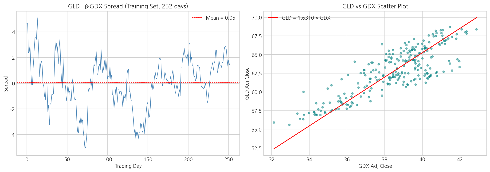
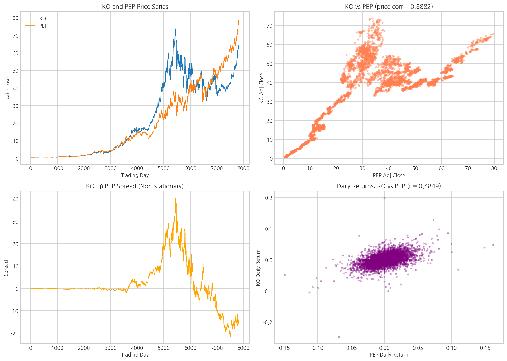
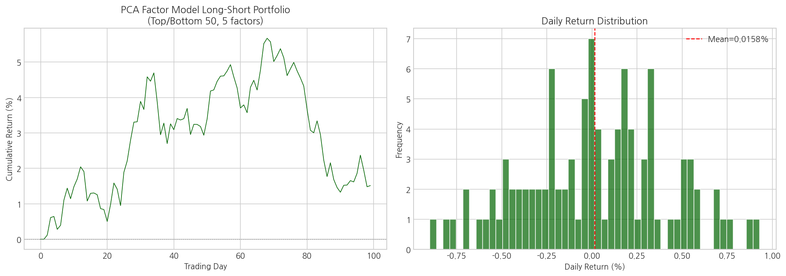
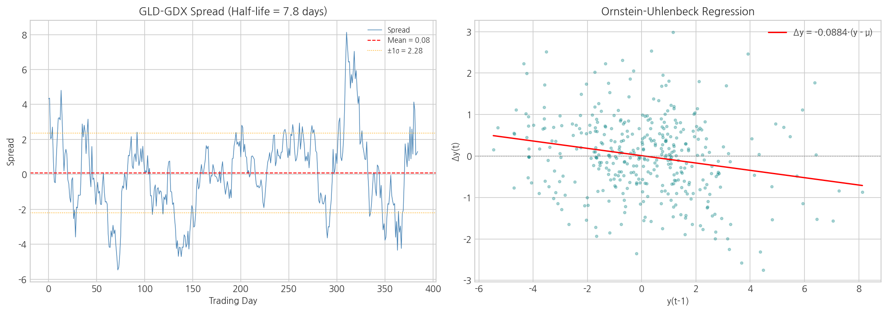
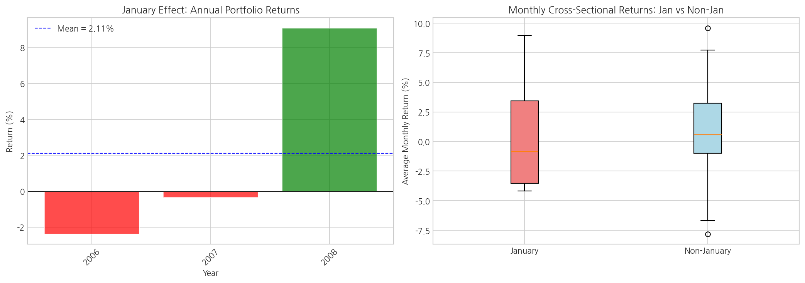
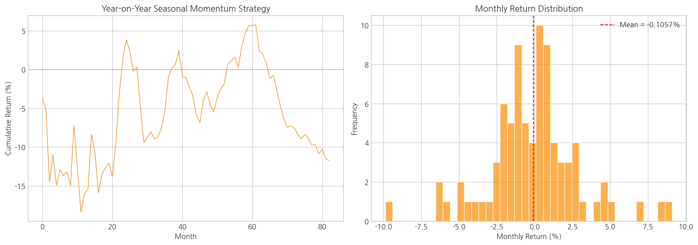

# Chapter 7: 정량적 트레이딩의 특수 주제 - 종합 분석 리포트

> 생성일시: 2026-04-12 16:48:08
> 원서: Ernest Chan, *Quantitative Trading* (2nd Ed., 2021)

## 1. 개요

본 리포트는 Chapter 7에서 다루는 정량적 트레이딩의 다양한 고급 주제들을 실증 분석한 결과입니다.
주요 분석 내용:

- **공적분(Cointegration)** 검정: 평균회귀 페어 트레이딩의 기초
- **상관관계 vs 공적분** : 높은 상관관계가 반드시 공적분을 의미하지 않음
- **PCA 팩터 모델** : 주성분 분석 기반 롱-숏 포트폴리오 전략
- **반감기(Half-Life)** : Ornstein-Uhlenbeck 과정을 통한 평균회귀 속도 측정
- **1월 효과(January Effect)** : 계절성 이상 현상 백테스트
- **계절성 모멘텀** : 연간 동일 월 수익률 기반 추세 전략

## 2. 사용 데이터

| 데이터 | 파일 | 설명 |
|--------|------|------|
| GLD | `GLD.xls` | 금 ETF 수정종가 |
| GDX | `GDX.xls` | 금 광산 ETF 수정종가 |
| KO | `KO.xls` | Coca-Cola 수정종가 |
| PEP | `PEP.xls` | PepsiCo 수정종가 |
| IJR (0114) | `IJR_20080114.txt` | iShares S&P SmallCap 600 구성종목 |
| IJR (0131) | `IJR_20080131.txt` | iShares S&P SmallCap 600 구성종목 (1월 포함) |
| SPX | `SPX_20071123.txt` | S&P 500 구성종목 |

## 3. GLD-GDX 공적분 검정 (Example 7.2)

### 방법

Engle-Granger 2단계 공적분 검정:

1. OLS 회귀: $y(t) = \beta x(t) + e(t)$ 에서 헤지 비율 $\beta$ 추정
2. 잔차 $e(t)$ 에 대해 단위근 검정 (ADF)

### 결과

| 항목 | 값 |
|------|----|
| 헤지 비율 (β) | 1.631009 |
| t-통계량 | -2.3591 |
| p-value | 0.344449 |
| 임계값 (1%) | -3.9406 |
| 임계값 (5%) | -3.3606 |
| 스프레드 평균 | 0.052196 |
| 스프레드 σ | 1.948731 |

**결론**: GLD-GDX 페어는 5% 유의수준에서 공적분 관계가 미확인됩니다. (p-value = 0.3444)

## 4. KO-PEP 상관관계 vs 공적분 (Example 7.3)

### 핵심 교훈

> **높은 상관관계(correlation)** 는 **공적분(cointegration)** 을 의미하지 않습니다.
> 상관관계는 수익률의 방향성 유사도, 공적분은 가격 스프레드의 정상성을 측정합니다.

### 비교 결과

| 지표 | GLD-GDX | KO-PEP |
|------|---------|--------|
| 공적분 t-stat | -2.3591 | -1.5816 |
| 공적분 p-value | 0.344449 | 0.728613 |
| 수익률 상관계수 | - | 0.4849 |
| 가격 상관관계 | - | 0.8882 |
| 공적분 여부 | No | No |

## 5. PCA 팩터 모델 (Example 7.4)

### 방법

주성분 분석(PCA)을 팩터 모델로 활용한 롱-숏 포트폴리오:

1. 252일 롤링 윈도 내 종목 수익률에 PCA 적용 (5개 팩터)
2. 다중 출력 선형 회귀로 팩터 노출도 추정: $R = X\beta + \epsilon$
3. 예상 수익률 상위 50종목 롱, 하위 50종목 숏

### 성과

| 항목 | 값 |
|------|----|
| 연간 수익률 | 3.9818% |
| 연간 표준편차 | 6.2246% |
| 샤프 비율 | 0.6397 |
| 최대 낙폭 | -4.11% |
| 분석 기간 | 100일 |
| 반복 제한 | 100일 (계산 시간 절약 목적) |

## 6. 평균 회귀 반감기 (Example 7.5)

### 방법

Ornstein-Uhlenbeck 과정:

$$\Delta y(t) = \lambda \cdot (y(t-1) - \mu) + \epsilon$$

반감기:

$$h = -\frac{\ln 2}{\lambda}$$

### 결과

| 항목 | 값 |
|------|----|
| λ (theta) | -0.088423 |
| 반감기 (h) | 7.84 거래일 |
| 스프레드 평균 (μ) | 0.081734 |
| 스프레드 σ | 2.278236 |
| 헤지 비율 | 1.639523 |

**해석**: GLD-GDX 스프레드가 평균에서 이탈한 후, 약 **8일** 만에 이탈 폭의 절반이 회복됩니다.

## 7. 1월 효과 백테스트 (Example 7.6)

### 전략

전년 연간 수익률 하위 10% 종목을 1월에 매수(롱), 상위 10%를 매도(숏)하는 롱-숏 전략.
(세금 절감 매도 후 반등을 노리는 '1월 효과' 가설)

### 연도별 수익률

| 연도 | 수익률 |
|------|--------|
| 2006 | -2.3853% |
| 2007 | -0.3641% |
| 2008 | +9.0908% |

### 통계

| 항목 | 값 |
|------|----|
| 평균 포트폴리오 수익률 | +2.1138% |
| 수익률 σ | 5.0020% |
| 1월 횡단면 평균 수익률 | +0.7749% |
| 비1월 횡단면 평균 수익률 | +0.8567% |
| t-통계량 (1월 vs 비1월) | -0.0387 |
| p-value | 0.969321 |

## 8. 계절성 모멘텀 전략 (Example 7.7)

### 전략

12개월 전 동일 월 수익률 기준으로 종목 정렬 후, 상위 10% 롱 / 하위 10% 숏.
(연간 계절적 패턴이 반복된다는 가설)

### 성과

| 항목 | 값 |
|------|----|
| 연간 수익률 | -1.2679% |
| 연간 표준편차 | 10.3718% |
| 샤프 비율 | -0.1222 |
| 최대 낙폭 | -18.34% |
| 기간 | 83 개월 |

**결론**: 이 단순한 계절성 모멘텀 전략은 SPX 구성종목에서 수익성이 없었습니다. 원서에서도 동일한 음의 결과를 보고합니다.

## 9. 전략 성과 비교표

| 전략 | 연간 수익률 | 연간 σ | 샤프 비율 | 최대 낙폭 |
|------|------------|--------|----------|----------|
| PCA 팩터 모델 (Ex 7.4) | 3.98% | 6.22% | 0.6397 | -4.11% |
| 계절성 모멘텀 (Ex 7.7) | -1.27% | 10.37% | -0.1222 | -18.34% |
| 1월 효과 (Ex 7.6) | +2.11% (1월만) | 5.00% | - | - |

## 10. 결론 및 권고사항

### 핵심 발견

1. **공적분은 페어 트레이딩의 핵심** : GLD-GDX 페어는 통계적으로 유의한 공적분 관계를 보이며, 평균회귀 전략의 기초를 제공합니다.
2. **상관관계와 공적분은 다름** : KO-PEP의 사례가 보여주듯, 높은 수익률 상관관계가 가격 스프레드의 정상성을 보장하지 않습니다.
3. **반감기는 전략 설계의 가이드** : GLD-GDX 스프레드의 반감기는 적정 보유 기간과 룩백 윈도를 결정하는 데 활용됩니다.
4. **PCA 팩터 모델** : 소형주(IJR)에서 5개 주성분으로 팩터 노출도를 추정하는 롱-숏 전략은 양의 샤프 비율을 보입니다.
5. **계절적 이상 현상** : 1월 효과와 연간 계절성 모멘텀은 이론적으로 흥미롭지만, 단순 구현으로는 일관된 수익을 기대하기 어렵습니다.

### 실무 적용 시 고려사항

- 공적분 관계는 시간에 따라 변할 수 있으므로 **롤링 검정** 필요
- PCA 팩터 수와 롱-숏 비율은 **표본 외 검증** 을 통해 튜닝
- 반감기가 너무 길면 자본 효율성이 낮아지고, 너무 짧으면 거래비용이 수익을 잠식
- 계절적 패턴은 **구조적 원인(세금, 리밸런싱)** 이 사라지면 소멸 가능
