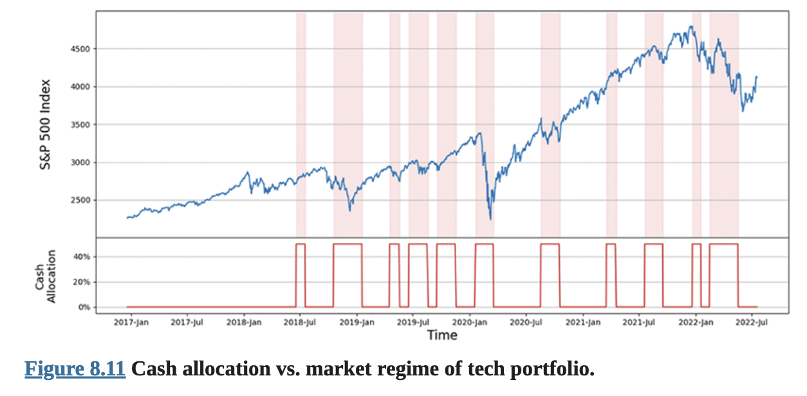

# 제8장 위험 관리와 최적화를 위한 AI

자산 관리에 대한 인공지능(AI)의 가장 성공적인 응용은 가장 명백한 것이 아닐 수도 있습니다. 때로는 AI가 터미네이터처럼 자율적으로 결정을 내리는 대신, 인간의 결정을 수정하는 데 사용되어야 합니다. AI는 또한 변화하는 환경에 적응하는 자원 할당을 최적화하는 데도 사용될 수 있습니다. 우리는 전자 기법을 교정 AI(Corrective AI)라고 부르고, 후자를 조건부 매개변수 최적화(CPO)라고 부릅니다. Predictnow.ai와 QTS Capital Management에서 우리는 두 기법 모두를 상당한 상업적 성공과 함께 실제 운영에 투입했습니다.

## 교정 AI와 조건부 매개변수 최적화란 무엇인가?

기계학습(ML)의 성배는 인공 일반 지능입니다: 본질적으로 모든 자율적 결정을 내릴 수 있는 인간의 실리콘 버전을 복제하는 것입니다. 불행히도 (또는 관점에 따라서는 다행히도) 그날은 아직 멀었습니다. 예를 들어, 완전 자율 주행 차량을 만드는 데 수십억 달러의 R&D 비용이 지출되었음에도 불구하고, 우리는 아직 우리 동네를 돌아다니는 그런 차량들을 그리 많이 찾을 수 없습니다. (Tesla 완전 자율 주행 능력에 대한 냉정한 평가는 qnt.co/book-tesla-autopilot을 확인하세요.) 반면에, 우리는 요즘 완전한 보조 운전 기술 세트 없이는 새 차를 사는 것이 어렵습니다.

자산 관리에서도 마찬가지입니다. 저는 IBM Watson Lab에서 시작하여, 나중에 Morgan Stanley의 AI 그룹 같은 다양한 금융 기관에서, 그리고 마지막으로 QTS Capital Management에서 수십 년을 보내며 기계학습을 연구하고 이를 완전 자율 거래 시스템에 적용해 왔습니다. 만약 그것이 대성공이었다면, 저는 슈퍼 요트에서 샴페인을 마시느라 너무 바빠서 이것에 대해 글을 쓸 수 없었을 것입니다. 현실은 이 노력에서 성공을 거둔 펀드가 거의 없다는 것입니다(López de Prado, 2017). 하지만 몇 년 전, 우리는 수십 년을 기다리는 것을 포함하지 않는 상업적 문제에 기계학습을 배치하는 훨씬 더 실용적인 방법이 있다는 것을 알게 되었습니다. 그것은 이미 여기에 있습니다.

우리는 AI가 처음부터 결정을 내리는 것보다 인간이나 다른 단순한 알고리즘이 내린 잘못된 결정을 수정하는 데 훨씬 더 효과적이라고 믿습니다. 그것이 우리가 "교정 AI"라고 부르는 것입니다.

금융 기계학습 전문가인 Dr. Marcos Lopez de Prado가 이를 "메타 라벨링"으로 설명한 이 개념을 알게 되었을 때(López de Prado, 2018), 우리는 즉시 2019년 말 우리 펀드의 위기 알파 전략에서 이를 테스트했습니다. 놀랍게도, 그것은 그 전략에 대해 세 번의 중요하고 정확한 예측을 했습니다. 2019년 11월부터 2020년 1월까지, 교정 AI는 우리에게 시장에서 어떤 위기도 기대하지 말아야 하며, 따라서 위기 알파 전략을 실행하지 말아야 한다고 말했습니다. 투자자들은 우리가 그 3개월 동안 잠들어 있다고 생각하며 우려했습니다. 2020년 2월 초부터, 갑자기 빨간불이 켜지며 위기를 예상하고 최대 레버리지로 거래하라고 권고했습니다. 이후의 COVID로 유발된 금융 위기는 다음 몇 달 동안 약 80%의 총 수익을 가져다주었습니다. 하지만 교정 AI는 여기서 끝나지 않았습니다. 2020년 11월 초, 다시 한 번 더 이상의 위기를 기대하지 말아야 한다고 말했습니다. 며칠 후인 11월 9일, Pfizer와 BioNTech가 백신을 발표했습니다.

이 접근법의 충격적인 효과와 일반적인 적용 가능성 때문에, 우리는 이 기법을 금융을 넘어서 상업화하기 위해 Predictnow.ai를 출시했습니다. 결국 자산 관리는 AI에 대한 가장 도전적인 사용 사례입니다(López de Prado, 2017). 만약 교정 AI가 초저 신호 대 잡음비와 초경쟁적 차익거래 환경을 가진 자산 관리에서 우리에게 효과가 있었다면, 분명히 다른 기업 응용에서도 매력적으로 작동할 것입니다.

결정을 수정하는 것 외에도, 우리는 AI가 전통적인 최적화 방법보다 더 효과적으로 모든 비즈니스 프로세스, 특히 자원 할당을 최적화하는 방법을 제공할 수 있다는 것을 발견했습니다. 전통적인 최적화 방법은 거래 전략이나 소매점 진열대 채우기와 같은 주어진 비즈니스 프로세스에 대해 과거 데이터를 기반으로 최상의 결과를 생성하는 매개변수를 찾는 것을 포함합니다. 그러나 목적 함수가 외부의 시간 변화하는 확률적 조건에 의존할 때, 전통적인 최적화 방법은 최적의 결과를 생성하지 못할 수 있습니다. 예를 들어, 거래 전략의 경우, 최적의 손절매는 명확하게 정의되지 않을 수 있는 시장 체제에 의존할 수 있습니다. 소매점 진열 공간 최적화의 경우, 최적의 선택은 개학 시즌인지 휴일 시즌인지에 따라 달라질 수 있습니다. 더 나아가, 정확한 조건 세트가 지정되더라도, 결과는 결정론적이지 않을 수 있습니다. 기계학습은 이 문제를 해결하는 더 나은 대안입니다. 기계학습을 사용하여, 우리는 역사적 데이터를 사용하여 많은 노드를 훈련시켜 이 목적 함수를 근사할 수 있습니다. 우리는 이 새로운 최적화 방법을 조건부 매개변수 최적화, 또는 목적이 포트폴리오의 자본 배분을 최적화하는 것일 때 더 구체적으로 조건부 포트폴리오 최적화(어느 쪽이든 CPO)라고 부릅니다.

고무적으로, 이러한 아이디어는 여러 산업에서 호평을 받았습니다. 우리는 석유 탐사 회사의 임원들과 이야기했습니다. 그들은 유정의 생산성을 예측하기 위해 소수의 변수만으로 간단한 공식을 사용했습니다. 우리는 기계학습이 어떻게 훨씬 더 큰 변수 세트를 활용하고, 그들의 비선형 종속성을 발견하며, 그들의 간단한 공식의 예측을 수정할 수 있는지 보여주었습니다. 우리는 석유 산업에서 잘 알려지고 신뢰받는 기존 공식을 교체하라고 요구하는 것이 아니라, 단지 그것을 수정하는 것뿐임을 주목하세요.

마찬가지로, 반도체 제조업체들은 종종 공정 엔지니어들이 만든 많은 규칙으로 수작업으로 제작된 전문가 시스템을 사용하여 제조 공정의 결과를 예측합니다. 우리는 주요 반도체 제조업체의 생산 제어 책임자와 AI 책임자와 이야기하며, 교정 AI가 어떻게 훨씬 더 큰 예측 변수 세트에서 학습하고 그들의 제조 공정에 실시간 조정을 할 수 있는지 논의했습니다.

실질적으로 모든 기업에서, 교정 AI와 CPO가 그들의 프로세스를 개선할 기회가 있을 것입니다. 우리는 공통 SaaS(Software-as-a-Service) 플랫폼을 통해 모든 업종에 이 서비스를 제공하지만, 각 업종에 특화된 맞춤형 입력 특성을 제공합니다.

당연히, 금융 분야에서의 우리의 도메인 전문성 때문에, 우리는 가장 빠른 제품을 만들었고 자산 관리 산업에서 가장 빠른 성공을 찾았습니다. 우리는 자산 관리자들이 투자 결정을 수정하고 자본 배분을 최적화할 수 있도록 SaaS 플랫폼을 출시했으며, 현재까지 우리의 많은 고객은 전문 트레이더에서 기관 펀드 매니저까지, 전통적 자산 클래스와 암호화폐 자산 클래스 모두에 걸쳐 있습니다.

우리 플랫폼의 새로운 사용자들은 우리가 항상 딥러닝 기법을 사용할 필요가 없다는 것을 발견하고 종종 놀랍니다. 연구자들은 딥러닝이 이미지 및 음성 인식과 기타 자연어 처리 작업에서 엄청나게 성공적이었지만, 대부분의 상업적 데이터셋(대부분의 금융 데이터셋 포함)에는 잘 맞지 않는다는 것을 발견했습니다. 그러한 데이터는 종종 "이질적"입니다(Shwartz-Ziv and Armon, 2021). 더 나아가, 딥러닝은 상업적 사용 사례에서 이용 가능한 것보다 훨씬 더 큰 데이터셋을 필요로 하는 경향이 있으며, 우리가 사용하는 기법보다 훨씬 더 긴 훈련 시간을 종종 필요로 합니다. 우리 기법의 또 다른 장점은 "설명 가능성"입니다: 우리는 어떤 입력 특성이 예측에 정말로 중요한지에 대해 인간 운영자에게 더 나은 직관을 제공할 수 있는 방법에 대한 여러 논문을 발표했습니다(Man and Chan, 2021a, 2021b). 우리는 궁극적으로 단순히 "결정을 수정하는 것"을 넘어서 "결정을 개선하는 것", 즉 CPO를 통해 상업적 프로세스의 매개변수를 최적화하는 것으로 나아갔습니다.

자산 관리자들에게 서비스를 제공하는 과정에서, 우리는 AI를 상업화하는 또 다른 핵심 성공 요소를 배웠습니다. 당신의 알고리즘이 아무리 좋아도, 우리가 각 응용 도메인에 맞춤화된 사전 설계된 입력 특성도 제공하지 않는다면 고객에게 무용지물입니다. 자산 관리자들을 위해, 우리는 전통적 시장에서 600개 이상의 그러한 특성(Nautiyal and Chan, 2021)과 암호화폐 시장에서 800개 이상의 그러한 특성(Viville, Sawal, and Chan, 2022)을 만들었습니다. 이러한 특성들을 만드는 것은 우리의 깊은 도메인 전문성을 필요로 하지만, 우리 고객 중 많은 사람들이 이것을 우리의 가장 매력적인 가치 제안으로 여기고 있습니다. 우리의 석유 탐사 파트너와의 개념 증명에서도 마찬가지였습니다. 그들은 유정 생산성을 예측하기 위해 소수의 입력 특성만 가지고 있다고 생각했습니다. 지질 공학 전문성을 가진 우리의 데이터 사이언티스트 중 한 명이 우리가 어떻게 수만 개를 만들 수 있는지 보여주었습니다. 다음 섹션에서는 자산 관리에서 사용되는 일부 특성들을 요약할 것입니다.

# 특성 공학

특성(Features)은 지도 기계학습 모델의 입력입니다(그림 8.1). 전통적인 금융에서는 일반적으로 "팩터(factors)"라고 불리며, 수익률을 설명하거나 예측하기 위해 선형 회귀 모델에서 사용됩니다. 전자의 용법에서는 팩터가 목표 수익률과 동시대적이며, 후자에서는 팩터가 이전 기간의 것이어야 합니다.

$$
\text{팩터} = \text{예측변수} = \text{특성} = \text{독립변수}
$$

그림 8.1 이 모든 이름들은 동의어입니다.


일반적으로 두 가지 유형의 팩터가 있습니다: 횡단면 대 시계열(Ruppert and Matteson, 2015). 주식 수익률을 모델링하는 경우, 횡단면 팩터는 개별 주식에 특화된 변수들로, 그 주식의 수익률 수익률, 배당 수익률 등입니다. 예를 들어, Predictnow.ai는 모든 QuantConnect 구독자에게 무료로 40개 주식의 기본 특성을 만들었습니다. 이러한 횡단면 특성들은 Sharadar 주식 기본 데이터셋에서 소싱됩니다. 이 데이터셋은 6,000개 이상의 미국 상장 기업과 거의 10,000개의 상장폐지 기업을 포함합니다. 우리는 이 목록이 생존편향이 없고 모든 데이터가 재작성 없이 특정 시점에서 포착되었음을 보장하기 위해 신중하게 검증했습니다. (잘 알려진 공급업체의 훨씬 더 비싼 상업적 데이터셋 중 일부가 특정 시점이 아니어서 기계학습이나 백테스팅에 사용할 수 없다는 것을 알면 놀랄 수도 있습니다.) 이 데이터는 분기별, 연도별, 그리고 후행 12개월로 이용 가능합니다(이것들을 Sharadar 용어로 세 가지 "차원"이라고 합니다). 원래 Sharadar 데이터셋에는 약 140개의 원시 데이터 필드가 있습니다. 우리는 원래 세트의 많은 특성들이 중복되거나 높은 상관관계를 가지고 있었기 때문에, 이를 사용자를 위한 40개의 필수 특성으로 축약하고 필터링했습니다.

이 데이터를 기계학습에 사용하기 위해, 시계열 데이터는 정상성을 갖도록 만들어졌습니다. 총 자산이나 자본 지출과 같이 달러로 표시되는 지표의 경우, 주어진 신고서와 다음 신고서 사이의 백분율 변화를 계산합니다. 총 마진이나 순 마진과 같이 이미 백분율로 되어 있는 지표의 경우, 연속된 신고서 값들 사이의 차이를 단순히 취합니다. 이러한 변환은 세 가지 차원 각각에 대해 수행됩니다: 분기별, 연도별, 후행 12개월.

우리는 또한 서로 다른 주식들 간의 쉬운 비교를 용이하게 하기 위해 이 데이터를 횡단면적으로 정규화했습니다. 이를 통해 사용자들이 서로 다른 주식의 데이터를 우리의 응용 프로그램 인터페이스(API)로의 쉬운 입력을 위해 단일 훈련 데이터셋으로 병합할 수 있습니다. 우리는 "주당 수익" 또는 "주당 부채"와 같은 비율에 발행 보통주 총수를 곱하고, 기업 가치로 나눈 다음, 마지막으로 연속된 신고서들 사이의 차이를 취합니다. 다시 말하지만, 이 정규화는 세 가지 차원 각각에 대해 수행됩니다.

Predictnow.ai는 또한 재사용된 티커 심볼이 그 티커를 이전에 가졌던 상장폐지 기업이 아닌, 그 티커를 사용하는 마지막 기업에 할당되도록 보장했습니다. 이는 어떤 종류의 생존편향도 피하기 위해서입니다. 모든 재사용된 티커 심볼은 끝에 접미사로 숫자 카운터와 함께 이용 가능합니다. 예를 들어, Australia Acquisition corporation과 Ares Acquisition corporation 모두 AAC라는 티커 심볼을 가지고 있습니다. Australia Acquisition corporation은 2012년에 상장폐지되었으므로, 우리 데이터베이스에서 AAC1로 이용 가능합니다. 반면, Ares Acquisition corporation은 여전히 AAC로 활발히 상장되어 있습니다. 반대로, 기업의 티커 심볼이 시간이 지나면서 변경된 경우, 모든 데이터는 마지막 유효한 티커에 연결됩니다.

증권거래위원회(SEC) 신고서는 일반적으로 주어진 날의 임의의 시간에 발생하므로, 백테스트 중 미래 정보 편향을 피하기 위해, 관련 데이터의 날짜는 시장이 열리기 훨씬 전에 그 가용성을 보장하기 위해 다음 거래일로 이동되었습니다.

Predictnow.ai는 이 기본 데이터를 당신의 기술적 또는 고빈도 데이터와 기계학습을 위한 하나의 단일 입력 데이터셋으로 자동 병합할 수 있게 합니다. Sharada 기본 특성을 고빈도 데이터와 병합할 때, 기본 특성들은 다음 유효한 신고 날짜까지 전진 채워집니다. 예를 들어, 분기별 신고의 총 마진은 다음 분기의 총 마진이 신고 날짜에 이용 가능할 때까지 모든 날짜에 대해 전진 채워집니다.

하지만 우리가 수익률 예측이 아닌 위험 관리와 자본 배분 목적(즉, 교정 AI와 CPO)을 위해 ML을 사용하는 것을 옹호하므로, 이러한 팩터들이 어떻게 당신의 거래 전략이나 포트폴리오의 수익률을 예측하는 데 도움이 될 수 있는지 궁금할 수 있습니다. 예를 들어, AAPL, GOOG, AMZN 등과 같은 기술주의 롱-숏 포트폴리오를 가지고 있고, 특정 시장 체제에서 포트폴리오 전체가 수익성이 있을지 예측하려고 한다면, AAPL, GOOG, AMZN의 수익률 수익률을 개별 특성으로 갖는 것이 정말 의미가 있을까요? 우리는 곧 그것들이 어떻게 사용될 수 있는지 논의할 것입니다.

한편, 시계열 팩터는 일반적으로 익숙한 Fama-French(1995) 세 팩터와 같은 시장 전체 또는 거시경제 변수들입니다: 시장(단순히, 시장 지수 수익률), SMB(소형주 대 대형주의 상대 수익률), HML(가치주 대 성장주의 상대 수익률). 이러한 시계열 팩터들은 당신의 포트폴리오나 전략의 수익률을 예측하는 데 사용될 수 있기 때문에 교정 AI와 CPO에 매우 적합합니다.

시계열 팩터보다 훨씬 더 많은 명백한 횡단면 팩터가 이용 가능하다는 점을 고려할 때(그림 8.2), 교정 AI와 CPO를 위한 특성으로 횡단면 팩터를 사용할 수 없다는 것은 아쉬운 일인 것 같습니다. 실제로는 할 수 있습니다; Eugene Fama와 Ken French 자신들이 우리에게 방법을 보여주었습니다. 주식에 대한 횡단면 팩터가 있다면, 우리가 해야 할 일은 그것을 사용하여 주식들을 순위를 매기고, 순위를 사용하여 롱-숏 포트폴리오를 형성하고, 이 포트폴리오의 수익률을 시계열 팩터로 사용하는 것입니다. 롱-숏 포트폴리오는 헤지 포트폴리오라고 불립니다.

그림 8.2


## 횡단면 대 시계열 특성.

횡단면 팩터
주식별 특성
예: P/E, B/M, DivYld, ...

주식 수익률을 설명/예측하는 데 사용
회귀 모델

## 시계열 팩터

시장 전반
예: HML, SMB, WML, ...

포트폴리오/전략의 수익률을 설명/예측하는 데 사용
분류 모델

우리는 Sharadar의 기본 횡단면 팩터(Nautiyal and Chan, 2021에서 보여준 대로 생성한)에서 시작하여 헤지 포트폴리오 생성 과정을 예시로 보여줍니다. 세 가지 다른 빈도로 업데이트되는 40개의 횡단면 팩터가 있습니다: 분기별, 연도별, 12개월 후행. 하지만 이 예시에서는 분기별 횡단면 팩터만 사용합니다. 자본 지출(capex)과 같은 팩터가 주어졌을 때, 우리는 2010년 1월 1일부터 현재 날짜까지 특정 날짜들에 약 8,500개 주식의 정규화된(정규화 절차는 앞서 논의됨) 자본 지출을 고려합니다. 매년 네 개의 특정 날짜가 관심 대상입니다: 1월 15일, 4월 15일, 7월 15일, 10월 15일. 우리는 이를 순위 날짜라고 부릅니다. 이러한 각 날짜에 정규화된 자본 지출을 기반으로 주식의 백분위 순위를 찾습니다. 날짜들은 분기별 신고서 이후 최대한 많은 주식의 횡단면 팩터 변화를 포착하도록 신중하게 선택됩니다.

매년 각 순위 날짜(4개 날짜)에서 주식들의 자본 지출이 순위가 매겨지면, 상위 사분위(즉, 75 백분위 이상 순위)에 있는 주식들과 하위 사분위(즉, 25 백분위 미만 순위)에 있는 주식들을 얻습니다. 가장 높은 정규화된 자본 지출을 보인 주식들에 대해서는 롱 포지션을 취하고, 가장 낮은 주식들에 대해서는 숏 포지션을 취합니다. 이 두 세트가 함께 우리의 롱-숏 헤지 포트폴리오를 구성합니다.

주어진 순위 날짜에 포트폴리오를 가지게 되면, 위험 패리티 할당(즉, 역변동성에 비례하여 할당)을 사용하여 포트폴리오의 일일 수익률을 생성합니다. 선택된 각 주식의 일일 수익률은 다음 순위 날짜까지 매일 계산됩니다. 각 날의 포트폴리오 가중치는 2개월 윈도우에 대한 수익률의 롤링 표준편차의 정규화된 역수입니다. 이러한 가중치는 매일 변하며, 개별 주식의 일일 수익률에 곱해져서 일일 포트폴리오 수익률을 얻습니다. 순위 날짜들 사이에 포트폴리오 주식이 상장폐지되면, 단순히 그 주식을 제외하고 포트폴리오 수익률 계산에 사용하지 않습니다. 이 과정에서 생성된 일일 수익률이 자본 지출 시계열 팩터입니다. 이 과정은 다른 모든 Sharadar 횡단면 팩터에 대해서도 반복됩니다.

따라서, 짜잔! 40개의 횡단면 팩터가 40개의 시계열 팩터가 되며, 주식, 선물, FX, 또는 무엇이든 거래하는 모든 포트폴리오나 거래 전략에 대한 교정 AI 또는 CPO 응용의 입력으로 사용될 수 있습니다.

다음은 우리가 만든 여러 다른 주목할 만한 특성들입니다:

NOPE(순옵션가격효과; Francus 2020)는 거래되는 상품의 전체 옵션 체인에 걸쳐 풋옵션과 콜옵션 간의 순델타 불균형의 정규화된 측정값으로, 모든 만기의 계약에 대해 시장 마감 시 계산됩니다. 이 지표는 Lily Francus가 발명했으며 기초 상품의 총 거래량으로 정규화됩니다. 불균형은 시장 메이커들이 그들의 포지션을 델타 중립으로 유지하기 위해 필요한 델타 헤징의 양을 추정합니다. 이 헤징은 기초 자산의 가격 움직임을 유발하며, NOPE는 이상적으로 이를 포착해야 합니다. 이에 대한 데이터는 deltaneutral.com에서 소싱되었으며, 이를 적용한 상품은 SPY ETF 옵션이었습니다. SPX 지수 옵션은 기초 SPX 지수 "주식"의 일일 거래량이 명확하게 정의되지 않았기 때문에 사용되지 않았습니다. 이는 지수 구성 종목들의 거래량으로 계산되었습니다.

카나리아는 탄광의 카나리아처럼 작동하는 지표로, 임박한 위험이 있을 때 경보를 울립니다. 이 지표는 Keller와 Keuning(2017)의 이중 모멘텀 전략에서 나옵니다. 카나리아 값은 0, 1, 또는 2가 될 수 있습니다. 이는 두 채권 또는 주식 ETF 중 어느 것이 음의 절대 모멘텀을 갖는지의 일일 측정값입니다: (1) BND, Vanguard Total Bond Market ETF, (2) VMO, Vanguard Emerging Markets Stock Index Fund ETF. 모멘텀은 13612W 방법을 사용하여 계산되며, 여기서 지난 1개월, 3개월, 6개월, 1년 동안의 채권/주식 ETF 수익률 백분율 변화의 비례 가중 평균을 취합니다. 논문에서 카나리아 포트폴리오의 "0", "1", 또는 "2" 값은 카나리아의 몇 퍼센트가 강세인지를 나타냅니다. 이는 자산 포트폴리오의 어떤 비율이 글로벌 위험 자산(주식, 채권, 원자재 ETF)에 할당되었고 어떤 비율이 현금에 할당되었는지를 나타냅니다. 예를 들어, "2"는 100% 현금 또는 현금 등가물을 의미하고, "0"은 글로벌 위험 자산에 100% 할당을 의미합니다. 또는 "1" 값은 글로벌 위험 자산에 50% 할당, 현금에 50% 할당을 의미합니다.

캐리(Koijen et al. 2016)는 캐리 특성을 "보유 기간 동안 가격이 일정하게 유지될 때 선물 포지션의 수익률"로 정의했습니다. (이는 "롤 수익률" 또는 "편의 수익률"이라고도 불립니다.) 우리는 (1) 글로벌 주식에 대해서는 예상 배당과 일일 종가의 비율로 계산하고, (2) SPX 선물에 대해서는 전월물 SPX 선물 계약 가격과 지수의 현물 가격으로부터 계산하고, (3) 통화에 대해서는 가장 가까운 두 달의 선물 데이터로부터 계산합니다.

주문 흐름. 자산 가격 움직임의 근본적인 이유는 매수자와 매도자의 불균형입니다. 시장 매도 주문의 공세는 가격 하락을 예고하며 그 반대도 마찬가지입니다. 주문 흐름은 더 견고한 측정값을 만들기 위해 기간에 걸쳐 그리고 그 기간의 많은 거래에 걸쳐 집계된 부호 있는 거래량입니다. 이는 또한 가격 움직임과 양의 상관관계를 갖습니다. 이 특성은 공격자 태그(거래를 매수 또는 매도 시장 주문으로 표시하는)와 함께 Algoseek의 틱 데이터를 사용하여 계산됩니다. 데이터는 밀리초로 타임스탬프가 찍힙니다. 우리는 틱 기반 주문 흐름을 집계하여 분당 주문 흐름을 형성합니다.

다음 예시를 고려해보세요.
오전 10:01 ET 타임스탬프의 주문 흐름 특성은 표 8.1에 보여진 것처럼 오전 10:00:00 ET부터 오전 10:00:59 ET까지의 거래를 고려할 것입니다.

| 표 8.1 |  |
| :-- | :-- |
| 거래 틱 예시 |  |
| 시간 거래 크기 공격자 태그 |  |
| 오전 10:00:01 1 | B |
| 오전 10:00:03 4 | S |
| 오전 10:00:09 2 | B |
| 오전 10:00:19 1 | S |
| 오전 10:00:37 5 | S |
| 오전 10:00:59 2 | S |

주문 흐름은 1-4+2-1-5-2=-9가 될 것입니다. 이는 우리 특성에서 시간:10:01, 주문 흐름: -9로 반영될 것입니다.

# 일일 계절적 외환 거래에 교정 AI 적용

이제 교정 AI가 일일 계절적 외환 거래 전략의 샤프 비율을 어떻게 개선할 수 있는지 설명하겠다. 이 거래 전략은 외환 수익률의 일중 계절성을 활용한다. Breedon과 Ranaldo(2012)는 외국 통화가 현지 근무 시간 동안 미국 달러 대비 하락하고 미국 달러의 현지 근무 시간 동안 상승한다고 관찰했다. 우리는 먼저 2021년 9월부터 2023년 1월까지의 최근 EUR/USD 데이터에서 Breedon과 Ranaldo의 결과를 백테스트했고, 그다음 이 거래 전략에 교정 AI를 적용하여 성과의 상당한 향상을 달성했다. (이 섹션의 일부는 Belov, Chan, Jetha, and Nautiyal, 2023에 발표되었다).

Breedon과 Ranaldo(2012)는 유럽 근무 시간(오전 3시 ET부터 오전 9시 ET까지, 여기서 ET는 서머타임을 고려한 뉴욕의 현지 시간을 나타냄) 동안 EUR/USD를 공매도하고 미국 근무 시간(오전 11시 ET부터 오후 3시 ET까지) 동안 EUR/USD를 매수하는 거래 전략을 설명했다. 그 근거는 유럽 근무 시간 동안 글로벌 송장 지불을 위해 대규모 기관의 미국 달러 매수가 일어나고 미국 근무 시간 동안에는 그 반대가 일어난다는 것이다. 따라서 이 효과는 "송장 효과"라고도 불린다.

변동성(Andersen and Bollerslev, 1998), 거래량(Hartmann, 1999), 수익률(Cornett, Schwarz, and Szakmary, 1995)과 같은 외환 시장의 다양한 측정치에서 시간대별 패턴에 대한 일부 뒷받침 증거가 있다. 본질적으로, 현지 통화는 이러한 각 측정치에 대해 현지 근무 시간 동안 하락하고 미국의 근무 시간 동안 상승한다.

그림 8.3은 2019-10-01 17:00 ET부터 2021-09-01 16:00 ET까지의 기간 동안 하루 중 각 시간의 평균 시간당 수익률을 보여준다. 이는 EUR/USD의 수익률 패턴을 나타낸다. 앞서 설명한 "근무 시간"의 수익률 패턴은 널리 퍼진 "송장 효과"의 가설과 대체로 일치한다. 수익률은 유럽 근무 시간 동안 하락하고 미국 근무 시간 동안 상승한다.

EUR.USD 시간대별 평균 수익률 (뉴욕 시간)


그림 8.3 시간대별 평균 EURSUD 수익률 (뉴욕 시간).

이 전략이 2012년에 발표되었기 때문에, 진정한 샘플 외 테스트를 위한 충분한 시간을 제공한다. 우리는 Electronic Broking Services(EBS)에서 EUR/USD의 1분 바 데이터를 수집하고 샘플 외 기간인 2021년 10월-2023년 1월에 걸쳐 백테스트를 수행했다. 이 기간 동안 전략의 샤프 비율은 0.88이며, 평균 연간 수익률은 3.5%, 최대 손실은 약 3.5%이다. 전략의 알파는 분명히 지속되었다. (이 기사의 목적상, 백테스트에는 거래 비용이 포함되지 않았는데, 우리의 유일한 목표가 교정 AI가 있을 때와 없을 때의 성과를 비교하는 것이지, 이 거래 전략이 실제 운용에서 실행 가능한지 판단하는 것이 아니기 때문이다.)

그림 8.4는 샘플 외 기간 동안 전략의 자기자본 곡선("$1의 성장")을 보여준다. 이 기간 동안의 누적 수익률은 8% 바로 아래이다. 우리는 이를 "기본" 거래 전략, 즉 교정 AI가 적용되기 전의 전략이라고 부른다.


그림 8.4 샘플 외 기간의 기본 거래 전략 자기자본 곡선.

이 기본 거래 전략의 샘플 백테스트 코드는 ant.co/bookcaibacktesting에 나와 있다. (코드는 입력 데이터 없이는 실제로 실행될 수 없으며, 라이선스 계약으로 인해 입력 데이터를 공유할 수 없다.)

# 기본 거래 전략 코드

교정 인공지능(CAI)을 사용한 외환 전략
```python
# 이 노트북은 PredictNow에 연결하여 모델을 훈련시키고 예측을 생성합니다.
# 모델 가설은 EUR 영업시간 동안 USD가 EUR 대비 상승하고
# USD 영업시간 동안 하락할 것이라는 것입니다.
# 이는 시간대 효과라고 불리며 HF OF와 수익률로 인해 발생합니다.
# PredictNow에 연결
from AlgorithmImports import *
from QuantConnect.PredictNowNET import PredictNowClient
from QuantConnect.PredictNowNET.Models import *
from datetime import datetime, time
from io import StringIO
import pandas as pd

qb = QuantBook()
client = PredictNowClient("account@email.com", "your_username")
client.connected
```

# 데이터 준비

```python
# 이 노트북에서는 유럽이 열려 있을 때 EURUSD를 공매도하고
# 유럽이 닫혀 있고 미국이 열려 있을 때 매수하는 전략을 만들 것입니다.
# 매일 활성화되는 이 정적 전략의 일일 수익률을 집계하고
# CAI를 사용하여 주어진 날짜에 전략이 수익성이 있는지 예측할 것입니다.
# 이 온/오프 신호를 따라 동적 전략을 만들고 성과를 벤치마크할 것입니다.
# EURUSD의 분 단위 바 데이터 로드
symbol = qb.add_forex("EURUSD").symbol
df_price = qb.History(symbol, datetime(2020,1,1), datetime(2021,1,1)).loc[symbol]

# 시간별 수익률로 리샘플링
minute_returns = df_price["close"].pct_change()
hourly_returns = (minute_returns + 1).resample('H').prod() - 1
df_hourly_returns = hourly_returns.to_frame()
df_hourly_returns['time'] = df_hourly_returns.index.time

# 매수 및 매도 신호 생성하고 전략 수익률 얻기
# 유럽이 열려 있을 때 EUR.USD 매도
sell_eur = ((df_hourly_returns['time'] > time(3)) & 
           (df_hourly_returns['time'] < time(9)))

# 유럽이 닫혀 있고 미국이 열려 있을 때 EUR.USD 매수
buy_eur = ((df_hourly_returns['time'] > time(11)) & 
          (df_hourly_returns['time'] < time(15)))

# 신호를 1과 -1로 설정
ones = pd.DataFrame(1, index=df_hourly_returns.index, columns=['signals'])
minus_ones = pd.DataFrame(-1, index=df_hourly_returns.index, columns=['signals'])
signals = minus_ones.where(sell_eur, ones.where(buy_eur, 0))

# 전략 수익률
strategy_returns = df_hourly_returns['close'] * signals['signals']
strategy_returns = (strategy_returns + 1).resample('D').prod() - 1
df_strategy_returns = strategy_returns.to_frame().ffill()

# 데이터 저장
# 데이터에 라벨을 붙이고 모델 이름으로 디스크(ObjectStore)에 저장합니다.
# 이 파일은 PredictNow에 업로드됩니다.
# 모델 이름과 데이터 라벨 정의
model_name = "fx-time-of-day"
label = "strategy_ret"

# 데이터에 라벨을 붙이고 객체 저장소에 저장
df_strategy_returns = df_strategy_returns.rename(columns={
    df_strategy_returns.columns.to_list()[0]: label})
parquet_path = qb.object_store.get_file_path(f'{model_name}.parquet')
df_strategy_returns.to_parquet(parquet_path)
```

(방금 설명한 기본 거래 전략과 같은) 베팅의 방향(롱 또는 숏)을 설정하는 거래 모델이 있다고 가정하자. 우리는 그 베팅의 크기만 학습하면 되는데, 여기에는 전혀 베팅하지 않을 가능성(크기 0)도 포함된다. 이는 실무자들이 정기적으로 직면하는 상황이다. 머신러닝 알고리즘이 이를 결정하도록 훈련될 수 있다. 강조하자면, 우리는 머신러닝 알고리즘이 방향을 학습하거나 예측하기를 원하지 않고, 적절한 크기가 무엇인지만 알려주기를 원한다. 이것이 교정 AI의 적용 사례인데, 기본 거래 모델을 사용하는 방법을 학습하는 보조 머신러닝 모델을 구축하고자 하기 때문이다.

우리는 다음 분 단위 바에 대한 "수익 확률"(PoP)을 계산하도록 머신러닝 알고리즘을 훈련시킨다. PoP가 0.5보다 크면 베팅 크기를 1로 설정하고, 그렇지 않으면 0으로 설정한다. 즉, 우리는 PoP를 입력으로 받고 베팅 크기를 출력으로 제공하는 베팅 크기 함수로 단계 함수를 채택하며, 임계값은 0.5로 설정한다. 이 베팅 크기 함수는 베팅을 할지 패스할지를 결정하는 순전히 이진 예측이다.

훈련 기간은 2019-01-01부터 2021-09-30까지였고, 샘플 외 테스트 기간은 2021-10-01부터 2023-01-15까지였으며, 이는 기본 거래 전략에 대해 보고한 샘플 외 기간과 일치한다. ML 알고리즘을 훈련시키는 데 사용된 모델은 백 개 이상의 사전 엔지니어링된 입력 특성(예측변수)과 함께 predictnow.ai 교정 AI API를 사용하여 수행되었다. 기본 학습 알고리즘은 그래디언트 부스티드 결정 트리이다.

교정 AI를 적용한 후, 이 기간 동안 전략의 샤프 비율은 1.29(0.41 증가)이며, 평균 연간 수익률은 4.1%(0.6% 증가), 최대 손실은 -1.9%(1.6% 감소)이다. 전략의 알파가 상당히 개선되었다.

교정 AI로 필터링된 보조 모델 신호의 자기자본 곡선은 그림 8.5에서 볼 수 있다.


그림 8.5 샘플 외 기간의 교정 AI 모델 자기자본 곡선.

이 교정 AI로 향상된 거래 전략의 샘플 훈련, 테스트, 백테스트 코드는 qnt.co/book-cai-research에 나와 있다. (코드는 Predictnow.ai의 API에 대한 프리미엄 구독 없이는 실제로 실행될 수 없다.)

교정 AI 모델을 훈련시키는 데 사용된 특성에는 지수, 주식, 선물, 옵션 시장에서 생성된 기술적 지표가 포함된다. 이러한 특성 중 많은 것들이 Algoseek의 고빈도 선물 및 주식 데이터를 사용하여 만들어졌다. 이러한 특성에 대한 더 많은 논의는 Nautiyal and Chan (2021)에서 찾을 수 있다.

# 교정 AI 코드

```python
# 모델 생성
# 매개변수를 PredictNow에 전송하여 모델 생성
model_parameters = ModelParameters(
    mode=Mode.TRAIN,
    type=ModelType.CLASSIFICATION,
    feature_selection=FeatureSelection.SHAP,
    analysis=Analysis.SMALL,
    boost=Boost.GBDT,
    testsize=42.0,
    timeseries=False,
    probability_calibration=False,  # 확률을 정제하려면 True
    exploratory_data_analysis=False,  # 탐색적 분석을 사용하려면 True
    weights="no")  # yes, no, custom

create_model_result = client.create_model(model_name, model_parameters)
str(create_model_result)

# 모델 훈련
# 데이터 경로와 라벨을 제공합니다. 이 작업은 몇 분이 걸릴 수 있습니다.
train_request_result = client.train(model_name, parquet_path, label)
str(train_request_result)

# 훈련 결과 얻기
# 훈련 결과에는 성능 메트릭과 예측 확률 및 라벨이 포함된 데이터프레임이 포함됩니다.
training_result = client.get_training_result(model_name)
str(training_result)

# 검증/훈련 데이터 세트에 대한 예측 확률 (0과 1 사이의 float)
# 마지막 열은 "1", 즉 양의 수익률일 확률을 나타냅니다
predicted_prob_cv = pd.read_json(StringIO(training_result.predicted_prob_cv))
print("predicted_prob_cv")
print(predicted_prob_cv)

# 테스트 데이터 세트에 대한 예측 확률 (0과 1 사이의 float)
predicted_prob_test = pd.read_json(StringIO(training_result.predicted_prob_test))
print("predicted_prob_test")
print(predicted_prob_test)

# 검증/훈련 데이터 세트에 대한 예측 라벨, 0 또는 1.
# 확률 > 0.5이면 클래스 1로 분류
predicted_targets_cv = pd.read_json(StringIO(training_result.predicted_targets_cv))
print("predicted_targets_cv")
print(predicted_targets_cv)

# 테스트 데이터 세트에 대한 예측 라벨, 0 또는 1.
# 확률 > 0.5이면 클래스 1로 분류
predicted_targets_test = pd.read_json(StringIO(training_result.predicted_targets_test))
print("predicted_targets_test")
print(predicted_targets_test)

# 특성 중요도 점수, 예측에 사용되는 특성을 보여줍니다.
# 자신의 특성을 포함할 때 더 도움이 되며
# feature_selection을 FeatureSelection.SHAP 또는 FeatureSelection.CMDA로 설정할 때만 작동합니다
if training_result.feature_importance:
    feature_importance = pd.read_json(StringIO(training_result.feature_importance))
    print("feature_importance")
    print(feature_importance)

# 정확도 측면에서의 성능 메트릭
performance_metrics = pd.read_json(StringIO(training_result.performance_metrics))
print("performance_metrics")
print(performance_metrics)

# 훈련된 모델로 예측 시작
predict_result = client.predict(model_name, parquet_path,
                               exploratory_data_analysis=False, 
                               probability_calibration=False)
str(predict_result)
```

시간대별 기본 전략에 교정 AI를 적용함으로써, 우리는 샘플 외 백테스트 기간 동안 샤프 비율을 개선하고 손실을 줄일 수 있었다. 이는 메타 라벨링에 관한 문헌의 관찰과 일치한다.

# 조건부 매개변수 최적화란 무엇인가?

모든 거래자는 자신의 전략에 유리한 시장 체제와 그렇지 않은 체제가 있다는 것을 안다. 일부 체제는 강세 대 약세 시장, 조용한 대 변동성 시장 등과 같이 명백하다. 이러한 체제는 많은 전략과 포트폴리오에 영향을 미치며(시장 중립적이거나 변동성 중립적인 포트폴리오가 아닌 한), 쉽게 관찰되고 식별될 수 있다(하지만 예측 가능하지는 않을 수 있다). 다른 체제들은 더 미묘하며 특정 전략에만 영향을 미칠 수 있다. 체제는 매일 변할 수 있으며, 관찰되지 않을 수도 있다. 시장이 두 개의 체제를 가지고 있고 현재 체제 1 대신 체제 2에 있다고 말하는 것처럼 간단하지 않은 경우가 많다. 예를 들어, 특정 전략의 수익성과 관련하여, 시장은 매우 유리한 것부터 매우 불리한 것까지 무한한 수의 체제를 가질 수 있다. 예를 들어, 모멘텀 거래 전략의 수익률은 시장 변동성과 양의 상관관계를 가질 수 있는데, 이는 명백히 이산적이 아닌 연속적인 변수이다.

체제 변화는 때때로 거래 전략의 완전한 변경을 필요로 한다(예: 모멘텀 전략 대신 평균 회귀 전략 거래). 다른 때는, 거래자들이 다른 체제에 적응하기 위해 기존 거래 전략의 매개변수만 변경하면 된다. 앞서 언급했듯이, PredictNow.ai는 CPO라고 불리는 거래 전략의 매개변수를 적응시키는 새로운 방법을 고안했다. 이 발명은 거래자들이 원하는 만큼 자주 - 아마도 매 거래일마다 또는 심지어 모든 단일 거래마다 - 거래 매개변수를 적응시킬 수 있게 해준다. (이 섹션은 Chan 2021의 7장과 실질적으로 동일하며 완전성과 참조의 용이성을 위해 여기에 재인쇄되었다.) CPO는 머신러닝을 사용하여 모든 시장에서 변화하는 시장 조건(체제)에 기반하여 주문을 최적으로 배치한다. 이러한 시장의 거래자들은 일반적으로 이미 그러한 주문의 타이밍, 가격 책정, 유형 및/또는 크기를 결정하는 기본 거래 전략을 보유하고 있다. 이 거래 전략은 보통 소수의 조정 가능한 거래 매개변수를 가진다. 관습적으로, 이들은 종종 고정된 과거 데이터 세트("훈련 세트")를 기반으로 최적화된다. 또는 확장되거나 롤링하는 훈련 세트를 사용하여 주기적으로 재최적화될 수 있다. (후자는 종종 "전진 보행 최적화"라고 불린다.) 고정된 훈련 세트로는 거래 매개변수가 명백히 변화하는 체제에 적응할 수 없다. 확장되는 훈련 세트로도 거래 매개변수는 빠르게 변화하는 시장 조건에 여전히 반응할 수 없는데, 추가 데이터가 기존 훈련 세트의 작은 부분에 불과하기 때문이다. 롤링 훈련 세트를 사용하더라도, 가장 최근의 과거 기간에서 최적화된 매개변수가 더 나은 샘플 외 성과를 생성한다는 증거는 없다. 너무 작은 롤링 훈련 세트는 통계적 유의성의 부족으로 인해 불안정하고 신뢰할 수 없는 예측 결과를 제공할 것이다. 이러한 모든 기존 최적화 절차는 거래 매개변수가 빠르게 변화하는 시장 조건에 지능적으로 반응하지 않기 때문에 무조건적 매개변수 최적화라고 불릴 수 있다. 이상적으로, 우리는 시장 조건에 훨씬 더 민감하면서도 충분히 많은 양의 데이터에서 훈련된 거래 매개변수를 원한다.

이 적응성 문제를 해결하기 위해, 우리는 지도 머신러닝 알고리즘(우리는 부스팅과 함께 랜덤 포레스트를 사용했지만, CPO 방법론은 특정 학습 알고리즘에 무관하다)을 적용하여 지배적인 시장 조건의 다양한 측면을 포착하는 대규모 특성 세트와 거래 매개변수의 특정 값을 함께 학습하여 거래 전략의 결과를 예측한다. (결과의 예는 전략의 미래 1일 수익률이다.) 그러한 머신러닝 모델이 결과를 예측하도록 훈련되면, 최신 시장 조건을 나타내는 동일한 특성과 거래 매개변수의 다양한 조합을 입력하여 실제 거래에 적용할 수 있다. 최적의 예측 결과(예: 가장 높은 미래 1일 수익률)를 가져오는 매개변수 세트가 최적으로 선택되고 다음 기간 동안 거래 전략에 채택될 것이다. 거래자는 빠르게 변화하는 시장 조건에 반응하기 위해 필요한 만큼 자주 그러한 예측을 하고 거래 전략을 조정할 수 있다.

다음 섹션의 예에서, 우리는 PredictNow.ai의 금융 머신러닝 API를 사용하여 CPO를 적용하여 GLD(금 ETF)에서 볼린저 밴드 기반 평균 회귀 전략의 매개변수를 적응시키고 우수한 결과를 얻는다.

CPO 기법은 금융 이외의 산업 분야에서도 유용하다. 결국, 시간에 따라 변하고 확률적인 조건 하에서의 최적화는 매우 일반적인 문제이다. 예를 들어, 병원 응급실의 대기 시간은 직원 수준, 장비 및 공급품 준비 상태, 퇴원율 등과 같은 다양한 매개변수를 최적화하여 최소화될 수 있다. 현재의 최첨단 방법들은 일반적으로 과거에 평균적으로 가장 잘 작동한 것을 보고 최적의 매개변수를 찾는다. 또한 이러한 매개변수에 기반하여 대기 시간을 정확히 결정하는 수학적 함수도 없다. CPO 기법은 하루 중 시간, 요일, 계절, 날씨, 최근 대규모 행사가 있었는지 여부 등과 같은 다른 변수들을 사용하여 다양한 매개변수 조합 하에서 대기 시간을 예측하고, 그에 따라 현재 조건 하에서 가장 짧은 대기 시간을 달성하기 위한 최적의 조합을 찾을 수 있다.

# ETF 전략에 조건부 매개변수 최적화 적용

CPO 기법을 설명하기 위해, 다음으로 ETF에 대한 예시 거래 전략을 설명한다.

이 전략은 2006년 1월 1일부터 2020년 12월 31일까지의 1분 봉을 사용하여 GLD와 GDX ETF 간의 선행-지연 관계를 사용하며, 이를 훈련/테스트 기간 사이에 80%/20%로 분할한다. 거래 전략은 세 개의 거래 매개변수를 가진다: 헤지 비율(GDX_weight), 진입 임계값(entry_threshold), 그리고 이동 후향 윈도우(lookback). 스프레드는 다음과 같이 정의된다:

$
\operatorname{Spread}(t)=GLD\_close(t)-GDX\_close(t) * GDX\_weight
$

우리는 시간 $t$에 GLD에 대한 거래를 시작하고, 시간 $t+1$ 분에 종료하여, 희망적으로 이익을 실현할 수 있다. 우리는 $5 \times 10 \times 8$ 그리드에서 세 개의 거래 매개변수를 최적화하고자 한다. 그리드는 다음과 같이 정의된다:

$
\begin{gathered}
\text{GDX_weight} = \{2, 2.5, 3, 3.5, 4\} \\
\text{entry_threshold} = \{0.2, 0.3, 0.4, 0.5, 0.7, 1, 1.25, 1.5, 2, 2.5\} \\
\text{lookback} = \{30, 60, 90, 120, 180, 240, 360, 720\}
\end{gathered}
$

명확히 하자면, 우리가 GLD와 GDX 가격과 이러한 가격의 함수들을 사용하여 거래 결정을 내리고 있지만, 설명의 단순함을 위해 일반적인 롱-숏 페어 트레이딩 설정과 달리 GLD만 거래한다.

매분마다 우리는 방정식 (1)에서 Spread(t)를 계산하고, 관습적으로 다음과 같이 정의되는 "볼린저 밴드"를 계산한다:

$
Z\_score(t) = \frac{Spread(t) - Spread\_EMA(t)}{\sqrt{Spread\_VAR(t)}}
$

여기서 Spread_EMA는 스프레드의 지수 이동 평균이고, Spread_VAR는 그것의 지수 이동 분산이다 (이 장의 끝에 있는 Spread_EMA & Spread_VAR의 정의에서 그들의 관습적인 정의를 참조).

볼린저 밴드를 사용하는 일반적인 평균 회귀 전략과 유사하게, 우리는 이러한 규칙에 기반하여 새로운 GLD 포지션으로 거래한다:
a. Z_score < -entry_threshold이면 GLD 매수 (롱 포지션 결과).
b. Z_score > entry_threshold이면 GLD 공매도 (숏 포지션 결과).
c. Z_score > exit_threshold이면 롱 포지션 청산.
d. Z_score < -exit_threshold이면 숏 포지션 청산.

exit_threshold는 entry_threshold와 -entry_threshold 사이 어디든 될 수 있다. 훈련 세트에서 최적화한 후, 우리는 exit_threshold = -0.6 * entry_threshold로 설정하고 향후 (무조건적 또는 조건적) 매개변수 최적화에서 entry_threshold를 변경할 때 그 관계를 고정으로 유지한다. 우리는 오전 9:30과 오후 3:59 ET 사이의 1분 봉에서 전략을 거래하고, 오후 4:00에 모든 포지션을 청산한다. 세 개의 거래 매개변수의 각 조합에 대해, 우리는 결과적인 일중 전략의 일일 수익률을 기록하고 일일 전략 수익률의 시계열을 형성하여, CPO에서 머신러닝 단계의 라벨로 사용한다. 거래 전략이 시장 마감 시 강제 청산 전에 하루에 여러 번의 왕복 거래를 실행할 수 있으므로, 이 일일 전략 수익률은 그러한 왕복 수익률의 합이라는 점에 주목하라.

# 무조건부 vs. 조건부 매개변수 최적화

기존의 무조건부 매개변수 최적화에서는 전수 탐색을 사용하여 3차원 매개변수 격자에서 표본 내 누적 수익률을 최대화하는 세 가지 거래 매개변수(GDX_weight, 진입 임계값, 룩백)를 선택합니다. (기울기 기반 최적화는 여러 국소 최댓값으로 인해 작동하지 않았습니다.) 해당 고정된 세 가지 최적 거래 매개변수 집합을 사용하여 테스트 세트에서 표본 외 전략을 지정합니다.

조건부 매개변수 최적화에서는 매일 사용되는 거래 매개변수 집합이 훈련 세트에서 훈련된 예측 머신러닝 모델에 따라 달라집니다. 이 모델은 거래 매개변수와 기타 시장 조건이 주어졌을 때 우리 거래 전략의 미래 1일 수익률을 예측합니다. 거래 매개변수는 임의로 변경할 수 있으므로(즉, 제어 변수이므로) 매일 여러 거래 매개변수 집합에 대해 서로 다른 미래 수익률을 예측하고, 가장 높은 미래 수익률을 예측하는 최적 집합을 선택할 수 있습니다. 해당 최적 매개변수 집합은 다음 날 거래 전략에 사용됩니다. 이 단계는 현재 날의 시장 마감 후 그리고 다음 날의 시장 개장 전에 수행됩니다.

세 가지 거래 매개변수 외에도, 우리 머신러닝 모델에 입력되는 예측 변수(또는 "특성")는 Technical Analysis Python 라이브러리에서 얻은 8가지 기술적 지표입니다: 볼린저 밴드 Z-점수, 자금 흐름, 힘 지수, 돈치안 채널, 평균 진정 범위, 어썸 오실레이터, 그리고 평균 방향성 지수입니다. 우리는 이러한 지표들을 시장 조건을 나타내기 위해 선택했습니다. 각 지표는 실제로 $2 \times 7$ 특성을 생성하는데, 이는 ETF GLD와 GDX 가격 시계열 각각에 적용되고, 각각은 50, 100, 200, 400, 800, 1600, 그리고 3200분의 서로 다른 7개의 룩백 윈도우를 사용하여 계산되기 때문입니다. (참고: 이것은 앞서 설명한 거래 매개변수 "룩백"과는 다릅니다.) 따라서 전략의 미래 1일 수익률을 예측하는 데 사용되는 총 특성은 $3+8 \times 2 \times 7=115$개입니다. 그러나 세 가지 거래 매개변수의 조합이 $5 \times 10 \times 8=400$개이므로, 각 거래일마다 표 8.2와 같은 400행의 훈련 데이터가 생성됩니다(레이블인 미래 수익률은 표시되지 않음):

표 8.2
머신러닝 모델에 입력되는 특성 테이블의 1일 슬라이스

| GDX_weight | entry_threshold | lookback | Z-score-GLD(50) | Z-score-GDX(50) | Money-Flow-GLD(50) | Money-Flow-GDX(50) | Money-GLD(50) | ... |
|:--|:--|:--|:--|:--|:--|:--|:--|:--|
| 2 | 0.2 | 30 | 0.123 | 0.456 | 1.23 | 4.56 | $\ldots$ |
| 2 | 0.2 | 60 | 0.123 | 0.456 | 1.23 | 4.56 | $\ldots$ |
| 2 | 0.2 | 90 | 0.123 | 0.456 | 1.23 | 4.56 | $\ldots$ |
| $\ldots$ |  |  |  |  |  |  |  |
| 4 | 5 | 240 | 0.123 | 0.456 | 1.23 | 4.56 | $\ldots$ |
| 4 | 5 | 360 | 0.123 | 0.456 | 1.23 | 4.56 | $\ldots$ |
| 4 | 5 | 720 | 0.123 | 0.456 | 1.23 | 4.56 |  |

머신러닝 모델이 훈련된 후, 실시간 예측 및 거래에 사용할 수 있습니다. 매 거래일 시장 마감 후, 표 8.2의 한 행과 같은 구조의 입력 벡터를 준비하고, 특정 거래 매개변수 집합과 기술적 지표의 현재 값으로 채운 다음, 머신러닝 모델을 사용하여 다음 날 거래 전략의 수익률을 예측합니다. 이 과정을 400번 반복하여 거래 매개변수는 변경하지만 기술적 지표 값은 변경하지 않고, 가장 높은 수익률을 예측하는 거래 매개변수 집합을 찾습니다. 다음 날 거래 전략에 해당 최적 집합을 채택합니다. 수학적으로 표현하면:

```
(GDX_weight_optimal, entry_threshold_optimal, lookback_optimal)
    = argmax(GDX_weight, entry_threshold, lookback) {
    predict(GDX_weight, entry_threshold, lookback, technical_indicators)
}
```

여기서 predict는 부스팅을 사용한 랜덤 포레스트를 머신러닝 모델로 사용하는 predictnow.ai의 API에서 제공되는 예측 함수입니다.

기술적 지표를 사용하여 GLD의 1일 수익률을 예측하는 단순한 머신러닝 적용과 달리, 우리는 주어진 거래 매개변수 집합에 대해 GLD에 적용된 거래 전략의 수익률을 예측하고 이러한 예측을 사용하여 매일 이러한 매개변수를 최적화하기 위해 머신러닝을 사용한다는 것을 이해하는 것이 중요합니다. 단순한 접근 방식은 성공할 가능성이 낮은데, 이는 모든 사람이 GLD의(즉, 금의) 수익률을 예측하려고 시도하여 차익거래 활동을 유도하지만, 아무도 이 특정 GLD 거래 전략의 수익률을 예측하지 않기 때문입니다(이 장난감 예제를 너무 진지하게 받아들이지 않는 한!). 또한 많은 거래자들은 수익률을 예측하기 위해 머신러닝을 블랙박스로 사용하는 것을 좋아하지 않습니다. CPO에서는 거래자 자신의 전략이 실제 예측을 만듭니다. 머신러닝은 단순히 이 거래 전략의 매개변수를 최적화하는 데 사용됩니다. 이는 훨씬 더 높은 수준의 투명성과 해석 가능성을 제공합니다.

# 성능 비교

2020년 12월 31일에 끝나는 마지막 3년간의 데이터에서 무조건부 vs. 조건부 매개변수 최적화의 표본 외 테스트 세트 성능을 비교하여, 누적 3년 수익률이 각각 $73\%$와 $83\%$임을 발견했습니다. 조건부 매개변수 최적화를 사용하여 다른 모든 지표가 개선되었습니다. 표 8.3과 그림 8.6을 참조하십시오.

표 8.3
무조건부 vs. 조건부 매개변수 최적화의 표본 외 성능

|  | 무조건부 최적화 | 조건부 최적화 |
|:--|:--:|:--:|
| 연간 수익률 | $17.29\%$ | $19.77\%$ |
| 샤프 비율 | 1.947 | 2.325 |
| 칼마 비율 | 0.984 | 1.454 |


그림 8.6 조건부 vs. 무조건부 매개변수 최적화 기반 전략의 누적 수익률

# 조건부 포트폴리오 최적화

## 체제 변화가 전통적인 포트폴리오 최적화 방법을 무력화시킨다

CPO가 거래 전략의 운영 매개변수 최적화에서 가능성을 보여준 반면, 그 가장 큰 잠재력은 포트폴리오 할당을 최적화하는 잠재력에 있습니다. 우리는 이 접근법을 조건부 포트폴리오 최적화(Conditional Portfolio Optimization)라고 부르며, 다행히도 같은 약어를 공유합니다.

요약하자면, 전통적인 최적화 방법은 거래 전략과 같은 주어진 비즈니스 프로세스에 대해 과거 데이터를 기반으로 최상의 결과를 생성하는 매개변수를 찾는 것입니다. 예를 들어, $1\%$의 손실 제한이 지난 10년간 테스트된 거래 전략에 대해 최고의 샤프 비율을 산출했거나, 소매 진열대에 과자를 진열하는 것이 지난 5년간 최고의 이익을 창출했을 수 있습니다. 매개변수의 수, 목적 함수의 비선형성, 또는 매개변수에 대한 제약 조건의 수와 같은 다양한 요인으로 인해 수치 최적화 과정이 복잡할 수 있지만, 그러한 어려움을 처리하는 표준 방법들이 이용 가능합니다. 그러나 목적 함수가 외부의 시간 변화하는 확률적 조건에 의존하는 경우, 전통적인 최적화 방법은 최적의 결과를 생성하지 못할 수 있습니다. 머신러닝이 이 문제를 해결하는 더 나은 대안입니다.

최적의 재무 성과 목표를 달성하기 위해 포트폴리오의 다양한 구성 요소에 대한 자본 할당을 최적화할 매개변수가 있는 금융 포트폴리오 최적화의 맥락에서, 여러 경쟁하는 머신러닝 접근법이 있습니다. 우리가 아는 한, 모든 접근법(예: Tomasz and Katarzyna, 2021; 또는 Cong et al., 2021)은 포트폴리오의 개별 구성 요소의 수익률을 예측하기 위해 횡단면 특성을 사용하는 것을 포함합니다. 이것은 불확실한 성공을 가진 매우 도전적인 과제입니다. 더 문제가 되는 것은, 그러한 횡단면 특성이 상업적 응용에서 정체성이 공개되지 않은 구성 요소를 가진 포트폴리오에 대해서는 종종 이용할 수 없어, 그러한 횡단면 수익률 예측을 더욱 어렵게 만든다는 것입니다. 우리는 다음 섹션에서 CPO의 이러한 장점을 자세히 설명할 것입니다. (이 섹션의 일부는 Chan, Fan, Sawal, and Ville, 2023에 발표되었습니다.)

# 최적화 학습

머신러닝(특히 신경망, Hornik, Stinchcombe, and White, 1989 참조)은 과거 데이터에 대한 훈련을 통해 포트폴리오 최적화를 위한 목적 함수를 포함한 모든 함수를 근사할 수 있습니다. (우리는 이후 이 머신러닝 모델을 ML 모델이라고 부르겠습니다. 우리는 주로 기울기 부스팅 트리를 사용하지만, 신경망이나 다른 알고리즘들도 동등하게 효과적일 수 있습니다.) 이 ML 모델의 입력에는 원래 최적화하려고 했던 매개변수뿐만 아니라 외부 조건을 측정하는 방대한 특성 집합도 포함됩니다. 예를 들어, 포트폴리오 최적화에 적합한 "시장 체제"를 나타내기 위해 시장 변동성, 다양한 시장 섹터의 행동, 거시경제 조건, 그리고 많은 다른 입력 특성들을 포함할 수 있습니다. 이 ML 모델의 출력은 최적화하고자 하는 결과가 됩니다. 예를 들어, 포트폴리오의 미래 1개월 샤프 비율을 최대화하는 것이 전형적인 결과입니다. 이 경우, 포트폴리오의 다양한 구성 요소의 자본 할당, 시장 특성, 그리고 결과적인 포트폴리오의 전진 1개월 샤프 비율을 "레이블"(즉, 목표 변수)로 포함하는 과거 훈련 샘플을 ML 모델에 제공합니다. 일단 훈련되면, 이 ML 모델은 가상의 자본 할당 집합과 현재 시장 특성을 기반으로 미래 1개월 샤프 비율을 예측할 수 있습니다. 포트폴리오의 구성 요소는 뮤추얼 펀드의 주식이나 헤지펀드의 거래 전략일 수 있습니다. 예를 들어, 표 8.4에서 포트폴리오 최적화 문제의 하루치 입력 특성을 표시합니다:

표 8.4
신경망에 입력되는 특성 테이블의 1일 슬라이스

| GOOG | MSF | AAPL | VIX | Oil 30d Return | GDP Growth | VIX | $\ldots$ |
|:--|:--|:--|:--|:--|:--|:--|:--|
| $20\%$ | $60\%$ | $20\%$ | 15.3 | $0.456\%$ | $1.23\%$ | $4.56\%$ | $\ldots$ |
| $25\%$ | $60\%$ | $15\%$ | 15.3 | $0.456\%$ | $1.23\%$ | $4.56\%$ | $\ldots$ |
| $30\%$ | $60\%$ | $10\%$ | 15.3 | $0.456\%$ | $1.23\%$ | $4.56\%$ | $\ldots$ |
| $\ldots$ |  |  |  |  |  |  |  |
| $40\%$ | $50\%$ | $10\%$ | 15.3 | $0.456\%$ | $1.23\%$ | $4.56\%$ | $\ldots$ |
| $45\%$ | $50\%$ | $5\%$ | 15.3 | $0.456\%$ | $1.23\%$ | $4.56\%$ | $\ldots$ |
| $50\%$ | $50\%$ | $0\%$ | 15.3 | $0.456\%$ | $1.23\%$ | $4.56\%$ |  |

시장 체제를 측정하는 특성들(표 8.4에서 "시장 특성"으로 표시)이 일일 빈도를 가진다고 가정하면, 특성 테이블의 1일 슬라이스는 그럼에도 불구하고 많은 행(샘플)을 포함합니다. 각 행은 고유한 자본 할당을 나타내며, 우리는 이를 "제어 특성"이라고 부릅니다. 예를 들어, S&P 500 주식을 보유하는 포트폴리오의 경우, 최대 500개의 매개변수가 있을 것입니다(현금이 포함된 경우). 이 경우, 우리는 이 500개 매개변수의 모든 가능한 조합과 시장 특성을 신경망에 입력하고, 결과적인 전진 1개월 샤프 비율(또는 최대화하고자 하는 성과 지표)이 무엇인지 알아내야 합니다. 모든 가능한 조합? 각 주식에 할당된 자본 가중치를 $w_{i} \in [0,1]$로 나타내고, 공매도 포지션을 허용하지 않는다고 가정하면, 탐색 공간은 $[0,1]^{500}$ 조합을 가집니다. 격자 탐색으로 이산화하더라도, 우리의 컴퓨터는 완료하기 위해 시간의 끝까지 실행해야 할 것입니다. 그리고 그것은 단지 하루치일 뿐입니다; 신경망 훈련에는 특성과 결과적인 레이블(전진 1개월 샤프 비율)을 포함하는 이러한 샘플의 많은 날이 필요할 것입니다. 지능적으로 격자를 샘플링하여 이러한 차원의 저주를 극복하는 것은 Predictnow.ai가 달성한 주요 돌파구 중 하나입니다. 지능적 샘플링은 예를 들어, 최적 포트폴리오를 생성할 가능성이 낮은 500차원 격자의 부분들을 샘플링하지 않거나, 기존 샘플과 너무 유사한 포트폴리오를 만드는 격자의 부분들을 샘플링하지 않는 것을 포함합니다.

아마도 다음 워크플로우 다이어그램들(그림 8.7, 8.8, 8.9)이 이 과정을 명확히 해줄 수 있을 것입니다:


그림 8.7 포트폴리오 성과 예측 머신 훈련


그림 8.8 포트폴리오 성과의 실시간 예측 (추론)


그림 8.9 최적화 단계

# 순위 매기기가 예측보다 쉽다

일부 독자들은 ML 모델이 매개변수와 시장 특성을 기반으로 포트폴리오의 샤프 비율을 예측할 수 있다면, 왜 모델을 사용하여 기초 자산의 수익률을 직접 예측하고 원래 포트폴리오를 완전히 대체하지 않느냐고 논할 수 있습니다. 그러나 우리의 CPO 방법에서는 포트폴리오의 샤프 비율을 정확하게 예측할 필요가 없습니다; 최고의 샤프 비율을 제공하는 매개변수 집합을 예측하기만 하면 됩니다. 샤프 비율 예측에 큰 오차 막대가 있더라도, 중요한 것은 예측된 샤프 비율의 순위입니다. 이 상황은 주식 선택을 위한 많은 알파 모델과 유사합니다: 수익성 있는 주식의 롱-숏 포트폴리오를 구성하기 위해, 알파 모델은 횡단면 수익률을 정확하게 예측할 필요가 없고, 단지 올바르게 순위를 매기기만 하면 됩니다. 우리는 그러한 횡단면 수익률을 예측하거나 순위를 매길 알파 모델을 가지고 있지 않습니다. (만약 가지고 있다면, 우리는 그것을 기술 제품으로 고객에게 제공하지 않을 것입니다; 성과 수수료 기반의 관리 계좌 서비스로 제공할 것입니다.) 우리의 고객은 이미 자신의 알파 모델을 사용하여 우리를 위해 포트폴리오 구성 요소를 선택했습니다. 우리가 해야 할 일은 예측된 샤프 비율을 기반으로 고객의 포트폴리오에 적용된 다양한 자본 할당의 순위를 매기는 것뿐입니다. 레이블의 순위를 올바르게 매기는 것만 중요하다면 훨씬 덜 까다로운 예측 모델입니다(Poh et al., 2020).

## 파마-프렌치 계보

CPO를 사용하면 횡단면 수익률을 예측할 필요가 없을 뿐만 아니라, 우리의 최적화기에 입력으로 횡단면 특성을 사용할 필요도 없습니다. 대신, 우리는 때때로 "시계열 요인"이라고 불리는 시장 특성만을 사용합니다(Ruppert and Matteson, 2015). ML 모델이 횡단면 특성 없이 정말로 포트폴리오 수익률을 예측할 수 있을까요? 파마-프렌치 3요인 모델과의 유추를 그려보겠습니다(Fama and French, 1995). 파마와 프렌치가 단지 세 가지 요인을 사용하여 포트폴리오의 수익률을 설명할(예측하지 않고) 수 있다고 제안했다는 것을 상기해 보십시오: 시장 지수 수익률, 소형주가 대형주를 초과하는 성과를 측정하는 SMB, 그리고 가치주가 성장주를 초과하는 성과를 측정하는 HML. (이러한 요인들은 음수일 수 있으며, 이때 "초과성과"는 "열등성과"가 됩니다.) 설명 모델은 이 세 요인을 독립 변수로 사용하여 현재 기간 포트폴리오 수익률에 대해 선형 회귀를 맞추는 것으로, 적절한 $R^{2}$를 가지기를 바랍니다. 하지만 이것들을 다음 기간 포트폴리오 수익률을 예측하는 예측 요인(또는 특성)으로 사용한다면, 그러한 회귀 맞춤의 $R^{2}$는 좋지 않을 것입니다. 이는 너무 적은 요인을 가지고 있기 때문일 수 있습니다. 우리는 모든 방식의 시장 체제와 위험을 포착하여 수백 개의 요인을 추가함으로써 이를 개선하려고 시도할 수 있습니다(예를 들어, 우리의 "요인 동물원" 사용; Nautiyal and Chan, 2021). 하지만 이러한 요인들 중 많은 것들이 공선형적이거나 유의하지 않을 것이며 계속해서 높은 편향과 분산을 야기할 것입니다(Murphy, 2012). 그래서 마침내, 우리는 특성 선택(Man and Chan, 2021a, 2021b)과 정규화와 같은 표준 기법을 통해 그러한 다중공선성과 무의미함을 다룰 수 있는 비선형 머신러닝 모델의 적용으로 이끌립니다. 만약 우리가 포트폴리오의 자본 할당에 대한 예측을 조건화하는 "제어 특성"을 입력에 추가한다면, 우리는 완전한 순환을 이루고 조건부 포트폴리오 최적화에 도달합니다.

# 기존 최적화 방법과의 비교

조건부 포트폴리오 최적화의 가치를 평가하기 위해서는 대안적인 포트폴리오 최적화 방법들과 비교해야 합니다. 기본 방법은 모든 포트폴리오 구성 요소에 동일한 자본을 할당하는 동등 가중(Equal Weights)입니다. 또 다른 간단한 방법은 위험 균등(Risk Parity)으로, 각 구성 요소에 대한 자본 할당이 그 수익률 변동성에 반비례하는 방법입니다. 각 구성 요소가 변동성으로 측정되는 전체 포트폴리오의 위험에 동일한 양의 위험을 기여한다고 가정하기 때문에 위험 균등이라고 불립니다. 이 방법은 구성 요소 수익률 간의 상관관계가 0이라고 가정하는데, 이는 물론 비현실적입니다. 그다음에는 평균-분산 최적화라고도 알려진 마코위츠 방법이 있습니다. 해리 마코위츠에게 노벨상을 안겨준 이 잘 알려진 방법은 이차 최적화기를 통해 구성 요소 수익률의 과거 평균과 공분산을 기반으로 포트폴리오의 샤프 비율을 최대화합니다. 과거 샤프 비율이 최대인 최적 포트폴리오는 접선 포트폴리오라고도 불립니다. 우리 중 한 명이 이전 블로그 포스트에서 이 방법과 켈리 공식과의 동등성에 대해 썼습니다(Chan, 2014). 이 방법은 확실히 시장 체제나 시장 특성을 고려하지 않습니다. 또한 "과거 성과는 미래 결과를 나타내지 않습니다"라는 친숙한 경고의 노골적인 위반이며, 입력의 작은 변화에 매우 민감하고 모든 종류의 불행한 불안정성을 야기하는 것으로 알려져 있습니다(Ang, 2014; López de Prado, 2020 참조). 그럼에도 불구하고 많은 자산 관리자들이 사용하는 표준 포트폴리오 최적화 방법입니다. 마지막으로, 샤프 비율을 최대화하는 것이 아니라 포트폴리오 수익률의 분산(따라서 변동성)을 최소화하기 위해 마코위츠의 방법을 사용하는 최소 분산 포트폴리오가 있습니다. 이 접근법이 포트폴리오의 과거 샤프 비율을 최대화하지는 않지만, 접선 포트폴리오보다 더 나은 전진 샤프 비율을 종종 달성합니다! "과거 성과는 미래 결과를 나타내지 않습니다"의 또 다른 사례입니다.

일부 연구자들은 알파 모델을 사용하여 예상 횡단면 수익률을 계산한 다음, 이러한 수익률을 입력하여 마코위츠의 최적화를 사용합니다(Tomasz and Katarzyna, 2021). 그러나 실제로 대부분의 알파 모델은 이차 최적화기의 입력으로 사용할 만큼 충분히 정확한 예상 횡단면 수익률을 생성하지 못합니다. 앞서 설명했듯이, 우리 방법의 아름다움은 ML 모델에 입력으로 횡단면 수익률이나 어떤 종류의 횡단면 특성도 필요하지 않다는 것입니다. 오직 "시계열" 시장 특성만 사용됩니다.

우리의 조건부 포트폴리오 최적화 방법이 이러한 기존 방법들과 어떻게 비교되는지 살펴보겠습니다.

고객의 요청에 따라, 우리는 어떤 주식도 공매도할 수 없고 가중치 $w_{s} \in [0.5\%, 10\%]$이지만 포트폴리오의 최대 $w_{c}=10\%$를 현금에 할당할 수 있으며 $\sum_{s} w_{s}+w_{c}=1$인 제약 조건 하에서 ETF(TSX: MESH)에 대해 우리의 CPO가 어떻게 수행되었는지 테스트했습니다. 표 8.5를 참조하십시오.

표 8.5
MESH ETF

| 기간 | 방법 | 샤프 비율 | CAGR |
|:--|:--|:--:|:--:|
| 2021-08-2022-07 | 동등 가중 | -0.76 | $-30.6\%$ |
| (표본 외) | 위험 균등 | -0.64 | $-22.2\%$ |
|  | 마코위츠 | -0.94 | $-30.8\%$ |
|  | 최소 분산 | -0.47 | $-14.5\%$ |
|  | CPO | -0.33 | $-13.7\%$ |

강세장에서 CPO는 마코위츠 방법과 유사하게 수행되었습니다. 그러나 CPO가 방어적 포지션으로 전환하여 2022년 약세장에서 마코위츠 방법을 능가한 것은 주목할 만했습니다. 전반적으로, 마코위츠 포트폴리오의 샤프 비율을 $60\%$ 이상 개선했습니다. 이것이 조건부 포트폴리오 최적화의 전체 논리입니다: 과거에 일어난 일을 맹목적으로 최적화하는 대신 예상되는 미래 외부 조건(시장 체제)에 적응하는 것입니다. 롱 온리 제약과 현금 할당에 대한 엄격한 제약 때문에 CPO 포트폴리오는 여전히 마이너스 수익률을 겪었습니다. 하지만 최적화기가 포트폴리오 NAV의 최대 $50\%$를 현금에 할당할 수 있었다면 양의 수익률을 달성했을 것입니다. 현금 할당의 극적인 효과는 다음 예제에서 명백해질 것입니다.

다음 예제에서는 미국 7개 주식과 캐나다 2개 주식으로 구성된 개인 투자자의 기술주 포트폴리오에 대해 CPO 방법론을 테스트했으며, 대부분 기술 섹터에 속합니다. 우리는 이를 기술 포트폴리오(Tech Portfolio)라고 부릅니다. 제약 조건은 어떤 주식도 공매도할 수 없고, 각 주식 s의 가중치 $w_{s}$는 $w_{s} \in [0\%, 25\%]$를 따르며, 포트폴리오의 최대 $w_{c}=50\%$를 현금에 할당할 수 있고, $\sum_{s} w_{s}+w_{c}=1$입니다. 표 8.6을 참조하십시오.

표 8.6
기술 포트폴리오

| 기간 | 방법 | 샤프 비율 | CAGR |
|:--|:--|:--:|:--:|
| 2021-08-2022-07 | 동등 가중 | 0.39 | $6.36\%$ |
| (표본 외) | 위험 균등 | 0.49 | $7.51\%$ |
|  | 마코위츠 | 0.40 | $6.37\%$ |
|  | 최소 분산 | 0.23 | $2.38\%$ |
|  | CPO | 0.70 | $11.0\%$ |

CPO는 모든 시장 조건에서 두 대안 방법보다 더 나은 성과를 보였습니다. 시장이 2022년 1월경 체제 변화를 경험하면서 마코위츠 포트폴리오 대비 샤프 비율을 $75\%$ 개선했습니다. 그림 8.10은 비교 수익률 곡선을 보여줍니다.


그림 8.10 기술 포트폴리오에 대한 다양한 포트폴리오 최적화 방법의 비교 성과. (표본 외 기간은 2021년 8월부터 시작.)

이 포트폴리오가 기술주 중심임에도 불구하고, 2021-08-2022-07의 어려운 표본 외 기간 동안 양의 수익률을 생성할 수 있었습니다. 그 이유는 그림 8.11에서 현금 구성 요소의 시간 변화를 보면 알 수 있듯이 NAV의 50%를 현금에 할당할 수 있기 때문입니다.



그림 8.11 기술 포트폴리오의 현금 할당 vs. 시장 체제

그림 8.11에서 강조된 시간 구간은 CPO가 현금에 최대로 할당한 때를 나타냅니다. S&P 500 지수의 오버레이는 이러한 기간들이 표본 외 기간 동안에도 시장 지수의 하락 기간과 높은 상관관계를 가진다는 것을 보여줍니다. 이는 CPO가 시장 체제 변화에 빠르게 적응할 수 있다는 우리의 가설을 뒷받침합니다.

우리는 또한 CPO가 일부 비전통적 자산들에 대해 어떻게 수행되는지 테스트했습니다: 8개 암호화폐의 포트폴리오로, 다시 공매도 포지션을 허용하고 7일 전진 샤프 비율 최대화를 목표로 했습니다. 표 8.7을 참조하십시오.

표 8.7
암호화폐 포트폴리오

| 방법 | 샤프 비율 |
|:--|:--:|
| 마코위츠 | 0.26 |
| CPO | 1.00 |

(이러한 결과는 2020년 1월부터 2021년 6월까지의 표본 외 기간에 대한 것이며, 포트폴리오의 암호화폐 유니버스는 BTCUSDT, ETHUSDT, XRPUSDT, ADAUSDT, EOSUSDT, LTCUSDT, ETCUSDT, XLMUSDT입니다.) CPO는 마코위츠 방법 대비 샤프 비율을 3.8배 개선했습니다.

마지막으로, CPO가 자산 포트폴리오뿐만 아니라 다른 것에도 작동한다는 것을 보여주기 위해, FX 헤지펀드 WSG가 관리하는 FX 거래 전략 포트폴리오에 적용했습니다; 표 8.8을 참조하십시오. (WSG는 우리의 고객이며, 그들의 허가를 받아 이러한 결과를 공개했습니다.) 이는 7개의 거래 전략 s의 포트폴리오이며, 할당 제약 조건은 $w_{s} \in [0\%, 40\%]$, $w_{c} \in [0\%, 100\%]$이고, $\sum_{s} w_{s}+w_{c}=1$입니다. 표 8.8을 참조하십시오.

표 8.8
WSG의 FX 전략 포트폴리오

| 방법 | 샤프 비율 |
|:--|:--:|
| 동등 가중 | 1.44 |
| 마코위츠 | 2.22 |
| CPO | 2.65 |

(이러한 결과는 2020년 1월부터 2022년 7월까지의 표본 외 기간에 대한 것입니다.) CPO는 마코위츠 방법 대비 샤프 비율을 19% 개선했습니다. WSG는 2022년 7월부터 CPO를 프로덕션에 배포하기로 결정했습니다. 그 이후로 CPO는 이전의 독점적 할당 방법 대비 포트폴리오에 월 약 60bps를 추가했습니다.

네 가지 경우 모두에서 CPO는 시장 하락 중에 단순한 동등 가중 포트폴리오와 마코위츠 포트폴리오 모두를 능가했으며, 강세장 동안에는 유사한 성과를 생성했습니다. 우리는 CPO가 모든 기간에 걸쳐 모든 포트폴리오에 대해 다른 모든 할당 방법을 능가할 수 있다고 주장하지 않는다는 점을 유념하는 것이 중요합니다. 일부 포트폴리오는 CPO가 어떤 기존 할당 방법도 개선할 수 없을 정도로 요인 중립적으로 구성될 수 있습니다. 다른 포트폴리오의 경우, CPO는 사후적으로(ex post) 보면 특정 기간에 기존 할당 방법보다 성과가 낮을 수 있지만, 그럼에도 불구하고 기간 시작 시 선택된 최고의 기존 할당 방법을 사전적으로(ex ante) 능가할 수 있습니다. 우리는 다음 모델 포트폴리오를 통해 이러한 효과의 예시를 제공합니다.

# 모델 전술적 자산 배분 포트폴리오

모델 전술적 자산 배분(TAA) 포트폴리오를 연구하는 목적은 CPO가 기존 할당 방법들을 능가할 수 있는지 조사할 뿐만 아니라, 진화하는 시장 체제에 걸쳐 CPO가 다양한 자산 클래스에 어떻게 할당하는지 관찰하는 것입니다. 우리가 선택한 모델 포트폴리오는 다양한 자산 클래스를 대표하는 5개의 ETF로 구성됩니다: GLD(금), IJS(소형주), SPY(대형주), SHY(1-3년 국채), 그리고 TLT(20년 이상 국채). 이 포트폴리오는 Tyler(2016)가 만든 골든 버터플라이 포트폴리오에서 영감을 받았습니다. ML 모델을 훈련하기 위해 2015년 1월부터 2018년 12월까지의 기간을 사용하고, 표본 외 테스트 기간은 2019년 1월부터 2022년 12월까지를 다룹니다. 포트폴리오는 2주마다 리밸런싱되며, CPO는 전진 2주 기간에 걸쳐 샤프 비율을 최대화하는 것을 목표로 합니다. 제약 조건은 $w_{s} \in [0\%, 100\%]$, $\sum_{s} w_{s}=1$이며, 현금 할당은 허용되지 않습니다(SHY가 실질적으로 현금이므로).

표 8.9는 표본 외 기간 동안 CPO가 두 번째로 높은 샤프 비율을 생성하여 동등 가중 방법만을 뒤따랐음을 보여줍니다. 그러나 동등 가중을 사전적으로 선택하는 것은 명백한 선택이 아니었을 것인데, 이는 표본 내 기간 동안 두 번째로 낮은 샤프 비율을 생성했기 때문입니다. 만약 기존 할당 방법을 사전적으로 선택해야 했다면, 위험 균등이 우리의 선택이었을 것이지만, 이는 샤프 비율과 CAGR 모두로 측정했을 때 표본 외에서 CPO보다 성과가 낮았으며, 후자는 3배 이상 차이가 났습니다.

표 8.9
TAA 포트폴리오의 표본 내 및 표본 외 성과

| 기간 | 방법 | 샤프 비율 | CAGR |
|:--|:--|:--:|:--:|
| 2015-01-2018-12 | 동등 가중 | 0.51 | $3.60\%$ |
| (표본 내) | 위험 균등 | 0.62 | $1.87\%$ |
|  | 마코위츠 | 0.59 | $5.26\%$ |
|  | 최소 분산 | 0.47 | $1.13\%$ |
|  | CPO | 0.63 | $3.93\%$ |

| 기간 | 방법 | 샤프 비율 | CAGR |
|:--|:--|:--:|:--:|
| 2019-01-2022-12 | 동등 가중 | 0.62 | $6.61\%$ |
| (표본 외) | 위험 균등 | 0.22 | $1.16\%$ |
|  | 마코위츠 | -0.13 | $-2.09\%$ |
|  | 최소 분산 | -0.05 | $0.39\%$ |
|  | CPO | 0.42 | $3.83\%$ |

CPO 방법에 대한 더 많은 투명성을 얻기 위해, 그림 8.12에서 다양한 시점에서의 할당을 살펴볼 수 있습니다.


그림 8.12 TAA 포트폴리오 할당의 시간 변화 (GLD는 진한 파란색.)

포트폴리오가 2019년 7월부터 대형주에 높은 할당을 가졌다는 것은 주목할 만한데, 이는 시장이 다음 6개월 동안 조용한 상승을 경험하기 직전이었습니다. 2020년 1월의 단기 국채에 대한 높은 할당은 그 후 따라온 코로나로 인한 금융 위기에 비추어 볼 때 선견지명이 있었다고 입증되었습니다. 포트폴리오는 또한 2022년 초에 금에 높은 할당을 가졌는데, 이는 우크라이나 전쟁으로 인한 원자재 가격 급등을 다행히 예상한 것이었습니다. 마지막으로, 소형주에 대한 할당이 2022년 중반에 증가했는데, 이는 그해 동안 대형주보다 더 나은 성과를 보였습니다.

# CPO 서비스형 소프트웨어

Predictnow.ai의 CPO 서비스형 소프트웨어(SaaS) 플랫폼의 고객들을 위해, 우리는 샤프 비율뿐만 아니라 모든 목적 함수를 최적화할 수 있습니다. 예를 들어, 우리는 예상 부족분(Expected Shortfall)과 UPI를 최소화하라는 요청을 받은 적이 있습니다. 우리는 또한 평균 ESG 등급, 다양한 섹터에 대한 최대 익스포저, 또는 포트폴리오 리밸런싱 동안의 최대 회전율과 같은 원하는 최적 포트폴리오에 특정 제약 조건을 추가할 수 있습니다. 우리가 요구하는 유일한 다른 입력은 포트폴리오 구성 요소의 과거 수익률입니다(이러한 구성 요소가 공개적으로 거래되는 자산이 아닌 경우, 이 경우 고객들은 단지 티커만 알려주면 됩니다). 이러한 구성 요소가 시간에 따라 변경된 경우, 우리는 과거 구성 요소도 필요할 것입니다.

우리는 시장 체제 정보를 포착하는 사전 엔지니어링된 시장 특성(Nautiyal and Chan, 2021)을 제공할 것입니다. 고객이 자신의 포트폴리오 수익률을 예측하는 데 도움이 될 수 있는 독점적인 시장 특성을 가지고 있다면, 그들은 이를 우리 것과 병합할 수도 있습니다. 고객의 특성은 익명화된 상태로 유지될 수 있습니다. 우리는 다양한 제약 조건과 하이퍼파라미터(포트폴리오 리밸런싱 빈도 등)와 그것들이 최적 포트폴리오에 미치는 효과를 실험하고자 하는 고객들을 위한 API를 제공할 것입니다.

아래 두 코드 예제에서, 우리는 샘플 클라이언트 측 Jupyter 노트북과 우리의 CPO API 호출을 보여줍니다. (코드는 입력 데이터 없이는 실제로 실행될 수 없으며, 라이선스 계약으로 인해 입력 데이터를 공유할 수 없습니다.) (gnt.co/book-cpo-research) (gnt.co/book-cpo-backtesting).

## CPO 코드

```python
# LEAN 백테스트를 실행하기 위한 포트폴리오 가중치 생성
# 이 노트북은 PredictNow에 연결하여 각 리밸런싱에 대한 포트폴리오
# 가중치를 최적화하고, 매월 리밸런싱 가중치를 Object Store에 저장합니다.
# 이 노트북의 셀을 실행한 후, main.py의 알고리즘을 실행할 수 있으며,
# 이는 LEAN 백테스트에서 PredictNow의 포트폴리오 가중치를 사용합니다.

# PredictNow에 연결
from QuantConnect.PredictNowNET import PredictNowClient
from QuantConnect.PredictNowNET.Models import *
from time import sleep
from datetime import datetime, timedelta
import json

algorithm_start_date = datetime(2020, 2, 1)
algorithm_end_date = datetime(2024, 4, 1)
qb = QuantBook()
client = PredictNowClient("test@quantconnect.com")
client.connected

# 자산 수익률 업로드
# 수익률 파일은 main.py의 알고리즘 백테스트 기간과
# algorithm_start_date 이전에 발생하는 표본 내 백테스트를 
# 커버할 수 있는 충분한 데이터를 가져야 합니다.

# 유니버스 구성 요소의 일일 수익률을 계산합니다.
tickers = [
    "TIP", "BWX", "EEM", "VGK", "IEF", "QQQ", "EWJ", "GLD",
    "VTI", "VNQ", "TLT", "RWX", "SPY", "DBC", "REM", "SCZ"
]
symbols = [qb.add_equity(ticker).symbol for ticker in tickers]
df = qb.history(
    symbols, datetime(2019, 1, 1), algorithm_end_date,
    Resolution.Daily
).close.unstack(0)

# 수익률 데이터를 Object Store에 저장합니다.
df.rename(lambda x: x.split(' ')[0], axis='columns', inplace=True)
returns_file_name = "ETF_return_Test.csv"
returns_file_path = qb.object_store.get_file_path(returns_file_name)
df.pct_change().dropna().to_csv(returns_file_path)

# 수익률 파일을 PredictNow에 업로드합니다.
message = client.upload_returns_file(returns_file_path)
print(message)

# 업로드한 수익률 파일을 나열합니다.
return_files = client.list_returns_files()
','.join(return_files)

# 제약 조건 업로드
# 제약 조건은 수익률 파일의 자산 하위 집합을 포함해야 합니다.
# CPO 시스템은 제약 조건이 있는 자산에 대해서만 포트폴리오 가중치를 제공합니다.

# 제약 조건을 정의합니다.
constraints_by_symbol = {
    Symbol.create(ticker, SecurityType.EQUITY, Market.USA).ID: constraint
    for ticker, constraint in {
        "SPY": (0, 0.5),
        "QQQ": (0, 0.5),
        "VNQ": (0, 0.5)
    }.items()
}

# 제약 조건 파일을 생성합니다.
content = "component,LB,UB"
for symbol, boundaries in constraints_by_symbol.items():
    content += f'\n{symbol},{boundaries[0]},{boundaries[1]}'

# 제약 조건 파일을 Object Store에 저장합니다.
constraints_file_name = "ETF_constraint_Test.csv"
qb.object_store.save(constraints_file_name, content)

# 제약 조건 파일을 PredictNow에 업로드합니다.
constraint_file_path = qb.object_store.get_file_path(constraints_file_name)
message = client.upload_constraint_file(constraint_file_path)
print(message)

# 업로드한 제약 조건 파일을 나열합니다.
constraint_files = client.list_constraint_files()
','.join(constraint_files)

# 포트폴리오 매개변수 정의
portfolio_parameters = PortfolioParameters(
    name=f"Demo_Project_{datetime.now().strftime('%Y%m%d')}",
    returns_file=returns_file_name,
    constraint_file=constraints_file_name,
    #feature_file=feature_file_name,
    max_cash=1.0,
    rebalancing_period_unit="month",
    rebalancing_period=1,
    rebalance_on="first",
    training_data_size=3,
    evaluation_metric="sharpe"
)

# 표본 내 백테스트 실행
# 표본 내 기간은 main.py의 set_start_date 이전에 끝나야 합니다.
# 우리 알고리즘이 매월 초에 월별 리밸런싱을 하므로,
# training_start_date 인수는 월의 시작과 일치해야 하고
# training_end_date는 main.py의 시작 날짜 하루 전이어야 합니다.
in_sample_result = client.run_in_sample_backtest(
    portfolio_parameters,
    training_start_date=datetime(2019, 1, 1),
    training_end_date=algorithm_start_date - timedelta(1),
    sampling_proportion=0.3,
    debug="debug"
)
print(in_sample_result)

def wait_for_backtest_to_finish(id_, sleep_seconds=60):
    job = client.get_job_for_id(id_)
    while job.status != "SUCCESS":
        job = client.get_job_for_id(id_)
        print(job.status)
        sleep(sleep_seconds)
    return job

job = wait_for_backtest_to_finish(in_sample_result.id)
print(job)

# 표본 외 백테스트 실행
# 표본 외 기간은 알고리즘 main.py의 시작 및 종료 날짜와 일치해야 합니다.
# training_start_date 매개변수가 표본 내 및 표본 외 테스트에서
# 동일한 형식을 유지하는 것이 중요합니다. 이 예시에서는
# 매월 첫 번째 거래일에 월별 리밸런싱을 하는 포트폴리오를 다루므로,
# 표본 외 테스트에서 training_start_date를 월의 1일로 유지합니다.
out_of_sample_result = client.run_out_of_sample_backtest(
    portfolio_parameters,
    training_start_date=algorithm_start_date,
    training_end_date=algorithm_end_date,
    debug="debug"
)
print(out_of_sample_result)

job = wait_for_backtest_to_finish(out_of_sample_result.id)
print(job)

# 백테스트 가중치 가져오기
# 앞의 표본 외 백테스트에서 포트폴리오 가중치를 가져옵니다.
# 이것들은 main.py에서 LEAN 알고리즘을 실행하는 데 사용할 가중치입니다.
# 포트폴리오 가중치를 Object Store에 저장하여 알고리즘에서 로드할 수 있도록 합니다.
weights_by_date = client.get_backtest_weights(
    portfolio_parameters,
    training_start_date=algorithm_start_date,
    training_end_date=algorithm_end_date,
    debug="debug"
)
print(weights_by_date)

# 가중치를 Object Store에 저장합니다.
qb.object_store.save("ETF_Weights_Test1.csv", json.dumps(weights_by_date))
```
# CPO 코드

```python
# region imports
from AlgorithmImports import *
from QuantConnect.PredictNowNET import PredictNowClient
from QuantConnect.PredictNowNET.Models import *
from time import sleep
from datetime import datetime, timedelta
import pandas as pd
# endregion

class PredictNowCPOAlgorithm(QCAlgorithm):
    """
    이 알고리즘은 PredictNow.ai를 사용하여 조건부 포트폴리오 최적화(CPO)를
    수행하는 방법을 보여줍니다. CPO는 후행 자산 수익률과 PredictNow의
    수백 가지 다른 시장 특성을 활용하여 포트폴리오의 미래 1개월 샤프 비율을
    최대화할 가중치를 결정합니다. 알고리즘은 매월 초에 리밸런싱합니다.
    이 알고리즘을 백테스트하려면 먼저 `research.ipynb` 노트북의 셀을 실행하세요.
    """
    
    def initialize(self):
        self.set_start_date(2020, 2, 1)
        self.set_end_date(2024, 4, 1)
        self.set_cash(100000)
        
        # 유니버스를 정의합니다.
        tickers = [
            "TIP", "BWX", "EEM", "VGK", "IEF", "QQQ", "EWJ", "GLD",
            "VTI", "VNQ", "TLT", "RWX", "SPY", "DBC", "REM", "SCZ"
        ]
        self._symbols = [self.add_equity(ticker).symbol for ticker in tickers]
        
        if self.live_mode:
            # PredictNow에 연결합니다.
            self._client = PredictNowClient("jared@quantconnect.com")
            if not self._client.connected:
                self.quit(f'PredictNow에 연결할 수 없습니다')
            
            # 일부 매개변수를 정의합니다.
            self._in_sample_backtest_duration = timedelta(
                days=self.get_parameter("in_sample_days", 365)
            )
            self._out_of_sample_backtest_duration = timedelta(
                days=self.get_parameter("out_of_sample_days", 365)
            )
        else:
            # Object Store에서 가중치 파일을 읽습니다.
            self._weights_by_date = pd.read_json(
                self.object_store.read("ETF_Weights_Test1.csv")
            )
        
        # 훈련 및 거래 세션을 예약합니다.
        self.train(
            self.date_rules.month_start(self._symbols[0]),
            self.time_rules.after_market_open(self._symbols[0], -10),
            self._rebalance
        )
        
        # 첫 번째 리밸런싱에서 오류를 방지하기 위해 워밍업 기간을 추가합니다.
        self.set_warm_up(timedelta(7))
    
    def _rebalance(self):
        # 워밍업 중에는 거래하지 않습니다.
        if self.is_warming_up:
            return
        
        # 라이브 모드에서는 PredictNow에서 가중치를 가져옵니다.
        date = self.time.date()
        if self.live_mode:
            self._get_live_weights(date)
        
        # 포트폴리오 타겟을 생성합니다.
        targets = []
        for symbol, weight in self._weights_by_date[str(date)].items():
            self.log(f"{symbol.value}의 가중치를 {weight}로 설정")
            targets.append(PortfolioTarget(symbol, weight))
        
        # 포트폴리오를 리밸런싱합니다.
        self.set_holdings(targets, True)
    
    def _get_live_weights(self, date):
        self.log(f"{date}에 대한 라이브 가중치 로딩")
        
        # PredictNow에 수익률 파일을 업로드합니다.
        # 참고: 히스토리 요청에는 표본 내 및 표본 외 백테스트의
        # 시작 및 종료 날짜를 각 월의 시작 및 종료와 일치하도록
        # 이동할 수 있도록 추가 2개월의 데이터가 포함됩니다.
        self.debug(f"수익률 파일 업로드 중")
        returns_file_name = f"ETF_return_{str(date)}.csv"
        file_path = self.object_store.get_file_path(returns_file_name)
        returns = self.history(
            self._symbols,
            (self._in_sample_backtest_duration
             + self._out_of_sample_backtest_duration
             + timedelta(60)),
            Resolution.DAILY
        ).close.unstack(0).pct_change().dropna()
        returns.to_csv(file_path)
        self._client.upload_returns_file(file_path)
        self.debug(f"업로드된 파일: {file_path}")
        
        # 자산 가중치 제약 조건을 생성합니다.
        content = "component,LB,UB"
        constraints_by_symbol = {
            Symbol.create(ticker, SecurityType.EQUITY, Market.USA).id: constraint
            for ticker, constraint in {
                "SPY": (0, 0.5),
                "QQQ": (0, 0.5),
                "VNQ": (0, 0.5),
                "REM": (0, 0.33),
                "IEF": (0, 0.5),
                "TLT": (0, 0.5)
            }.items()
        }
        
        # 제약 조건 파일을 PredictNow에 업로드합니다.
        self.debug(f"제약 조건 파일 업로드 중")
        for symbol, boundaries in constraints_by_symbol.items():
            content += f'\n{symbol},{boundaries[0]},{boundaries[1]}'
        constraints_file_name = f"ETF_constraint_{str(date)}.csv"
        self.object_store.save(constraints_file_name, content)
        file_path = self.object_store.get_file_path(constraints_file_name)
        self.debug(f"업로드된 파일: {file_path}")
        self._client.upload_constraint_file(file_path)
        
        # 포트폴리오 매개변수를 정의합니다.
        portfolio_parameters = PortfolioParameters(
            name=f"Demo_Project_{str(date)}",
            returns_file=returns_file_name,
            constraint_file=constraints_file_name,
            max_cash=1.0,
            rebalancing_period_unit="month",
            rebalancing_period=1,
            rebalance_on="first",
            training_data_size=3,
            evaluation_metric="sharpe"
        )
        
        # 표본 내 및 표본 외 백테스트의 날짜를 계산합니다.
        oos_start_date, oos_end_date = self._get_start_and_end_dates(
            date, self._out_of_sample_backtest_duration
        )
        is_start_date, is_end_date = self._get_start_and_end_dates(
            oos_start_date - timedelta(1),
            self._in_sample_backtest_duration
        )
        
        # 표본 내 백테스트를 실행합니다.
        self.debug("표본 내 백테스트 실행 중")
        in_sample_result = self._client.run_in_sample_backtest(
            portfolio_parameters,
            training_start_date=is_start_date,
            training_end_date=is_end_date,
            sampling_proportion=0.3,
            debug="debug"
        )
        in_sample_job = self._client.get_job_for_id(in_sample_result.id)
        
        # 표본 외 백테스트를 실행합니다.
        self.debug("표본 외 백테스트 실행 중")
        out_of_sample_result = self._client.run_out_of_sample_backtest(
            portfolio_parameters,
            training_start_date=oos_start_date,
            training_end_date=oos_end_date,
            debug="debug"
        )
        out_of_sample_job = self._client.get_job_for_id(out_of_sample_result.id)
        
        # 백테스트가 실행 완료될 때까지 기다립니다.
        self.debug("백테스트 완료 여부 확인 중")
        while (in_sample_job.status != "SUCCESS" or
               out_of_sample_job.status != "SUCCESS"):
            in_sample_job = self._client.get_job_for_id(in_sample_result.id)
            out_of_sample_job = self._client.get_job_for_id(out_of_sample_result.id)
            self.debug(f"표본 내 작업: {in_sample_job.status}")
            self.debug(f"표본 외 작업: {out_of_sample_job.status}")
            sleep(60)
        
        # 라이브 예측을 실행합니다.
        self.debug("라이브 예측 실행 중")
        exchange_hours = self.securities[self._symbols[0]].exchange.hours
        live_prediction_result = self._client.run_live_prediction(
            portfolio_parameters,
            rebalance_date=date,
            next_rebalance_date=exchange_hours.get_next_market_open(
                Expiry.end_of_month(self.time),
                extended_market_hours=False
            ).date(),
            debug="debug"
        )
        live_job = self._client.get_job_for_id(live_prediction_result.id)
        
        # 라이브 예측 작업이 완료될 때까지 기다립니다.
        self.debug("라이브 예측 작업 상태 확인 중")
        while live_job.status != "SUCCESS":
            live_job = self._client.get_job_for_id(live_prediction_result.id)
            self.debug(f"라이브 예측 상태: {live_job.status}")
            sleep(60)
        
        # 예측 가중치를 가져옵니다.
        self._weights_by_date = self._client.get_live_prediction_weights(
            portfolio_parameters,
            rebalance_date=date,
            debug="debug"
        )
    
    def _get_start_and_end_dates(self, end_date, duration):
        start_date = end_date - duration
        start_date = datetime(start_date.year, start_date.month, 1)
        return start_date, end_date
```

# 결론

이 장에서는 먼저 전문가 시스템이 내린 결정을 기계학습으로 수정하는 힘을 보여주었습니다. 이 경우에는 교정 AI(Corrective AI) 구현을 통해 알고리즘 외환 거래 전략을 다루었습니다. 교정 AI에서 성공의 핵심 요소는 기본 기계학습 알고리즘이라기보다는, 특정 비즈니스 프로세스에 맞게 설계해야 하는 독점적인 입력 특성들입니다. 둘째, 비즈니스 프로세스의 매개변수를 최적화하는 데 있어서 조건부 매개변수 최적화(CPO)의 성공을 보여주었습니다. 이 경우에는 알고리즘 ETF 거래 전략을 다루었습니다. 셋째, 자원 할당을 최적화하는 데 있어서 기존 방법들보다 조건부 포트폴리오 최적화(역시 CPO로 약칭)의 우수성을 보여주었습니다. 이 경우에는 금융 상품 포트폴리오에 대한 자본 할당을 다루었습니다.

문제에 대한 최적해가 그것이 발생하는 환경에 따라 달라진다는 것은 직관적으로 명백합니다. 문제가 소매점 진열대를 채우는 최적의 방법(개학 시즌이나 휴일 세일)이든 최적의 자산 배분(위험 선호 또는 위험 회피)이든 말입니다. 불행히도 대부분의 기존 최적화 방법들은 환경적 맥락을 고려할 수 없습니다. 왜냐하면 그것이 종종 명확하게 정의되지 않고 수백 개의 변수를 포함할 수 있기 때문입니다. 그러나 기계학습 알고리즘은 중복되고 중요하지 않은 변수들을 포함할 수 있는 빅데이터 입력을 다루는 데 뛰어납니다. 우리의 CPO 방법은 기계학습과 빅데이터를 활용하여 환경에 적응하는 포트폴리오 최적화와 같은 많은 상업적 문제들에 대한 최적해를 제공합니다. 우리는 여러 사용 사례에서 이것이 기존의 포트폴리오 최적화 방법들을 능가할 수 있음을 보여주었고, 역사적 할당이 시의적절했던 전술적 자산 배분의 예시를 보여주었습니다.

## Spread_EMA와 Spread_VAR의 정의

Spread_EMA(0) = Spread(0)

Spread_EMA(t+1) = (2/lookback_period) × Spread(t+1) + (1 - 2/lookback_period) × Spread_EMA(t)

Spread_VAR(1) = (Spread(1) - Spread(0))²

Spread_VAR(t+1) = (2/lookback_period) × (Spread(t+1) - Spread_EMA(t+1))² + (1 - 2/lookback_period) × Spread_VAR(t)