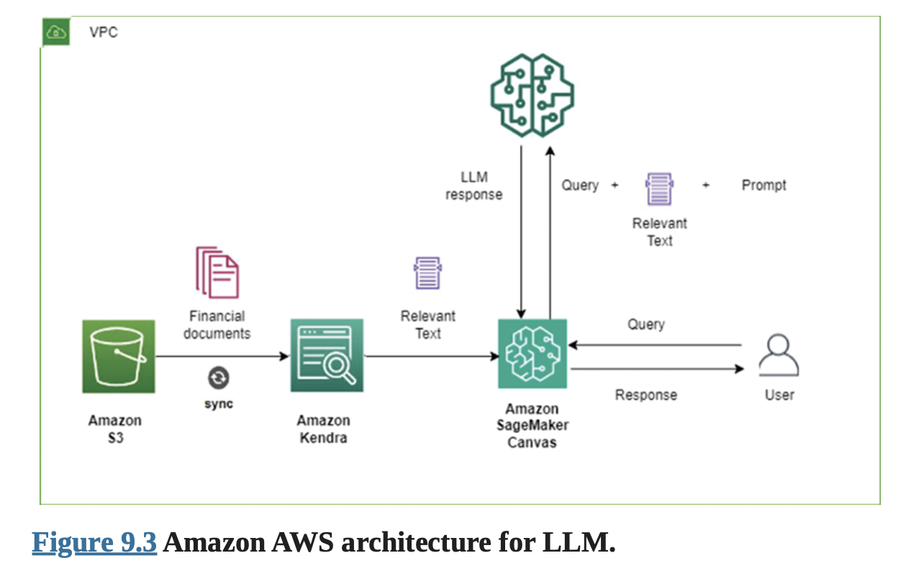
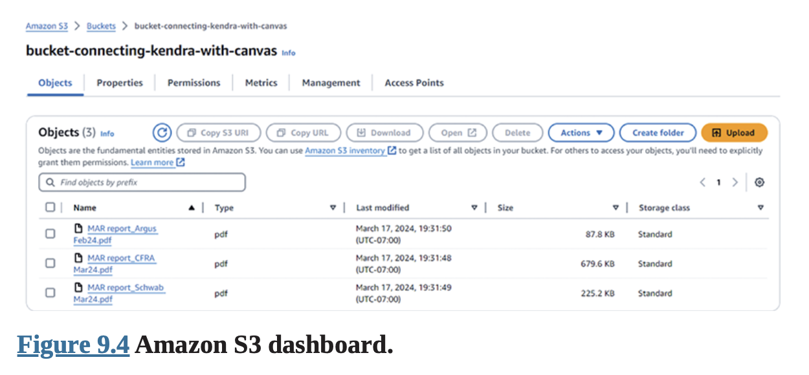

# Chapter 9: Application of Large Language Models and Generative AI in Trading

## Role of Generative AI in Creating Alpha

The most valuable resource in conducting equity research is time. Equity analysts must pick actionable investment insights from vast amounts of data from many sources: equity research reports, investor presentations, earnings reports, industry research, industry research, reports from industry competitors, and more. Thus, there is a need to be more efficient with time to be able cover more information and uncover greater insights efficiently. Generative artificial intelligence (AI) applications, powered by large language models (LLMs), have introduced a new paradigm in increasing human efficiency by lowering the effort required to accomplish many textbased generative tasks: summarization, question answering, classification, text generation, and many more. In this chapter, we will go over the concepts and a few real-world applications of generative AI in the field of investment analysis to help create an edge for the readers. With these applications, you can save weeks of investment research effort annually and expand the scope and depth of your coverage by across industries and companies, gleaning deeper insights from text information and spending more time analyzing information rather than finding the right information.

## Selecting an LLM for Building a Generative AI Application

There is no one size fits all kind of model that is ideally suited across all tasks, use cases, and data types. This is because the training data is not common across all models, which makes a model more or less performant than the others on a given domain or topic. Further, the internal weights or parameters for different models are designed differently impacting the way these models interpret data to uncover relationships to make predictions.

Generally, within a model family (e.g., GPT [ChatGPT], Gemini, Claude, Llama, and Mistral), a larger size model will be more performant, and hence also costlier to use than a smaller model. Similarly, a newer version of model family, say Llama 3 vs. Llama 2, will be more performant for the same size. Notably, these rules apply only to the base versions, with no fine-tuning, of the models under comparison. That is to say a pretrained or base version of Llama3 70B will generally perform better than a pretrained Llama3 8B, simply because the higher parameter size allows a larger model to understand more complex relationships and concepts within the data, and to make more nuanced predictions and generalizations using new, unseen data. However, with fine-tuning using proprietary data, a smaller model can also perform at par or even better a larger pretrained or base version of the model that has not been fine-tuned with the proprietary data. But this does not mean that using a smaller fine-tuned model is more cost effective than using a larger base version of a model. This is because model fine-tuning is typically extremely expensive. Instead, users should start with applying effective prompt engineering techniques (discussed later in this chapter) to improve model performance, followed by using retrieval-augmented generation techniques (for QnA and customer chatbot use cases) and only use model fine-tuning in exceptional cases when the data belongs to unique domains requiring expert knowledge of the concepts and terminology, such as biology, medicine, and legal domains.

Further, for question-answering and chat applications (the most common use of generative AI applications today), most LLM providers, such as Anthropic, Meta, and Mistral, also release "Instruct" versions of their pretrained or base models. These "Instruct" versions are trained by model providers to improve their instruction following abilities, improving their performance for multi-turn conversations by allowing them to retain prior context and follow the instructions through the conversation. So, for chat or questions answering use cases, these "Instruct" models are a good choice. With lots of comparable models, choosing a model can become a subjective exercise, so let us try to give it some shape to aid model selection.

Step 1: Use popular LLM leaderboards to pick a few of the top performing models as a starting point. Leaderboards have their different niches where they evaluate and rank models on different criteria, and hence their applicability to different use cases. Table 9.1 provides a few of the more popular leaderboards today with their respective niches.

## TABLE 9.1: Popular LLM Leaderboards by Use Case

| Use Case | Leaderboard |
| :-- | :-- |
| Chatbot/QnA/Multi-turn conversations | Chatbot Arena (gnt.co/book-chat-lmsys) |
|  | HELM Instruct (gnt.co/book-helm-instruct) |
| Generic/Multipurpose | MMLU (gnt.co/book-mmlu) |
|  | HELM Lite (gnt.co/book-helm-lite) |
|  | HuggingFace Open LLM (gnt.co/book-open-llm) |
|  | AlpacaEval (gnt.co/book-alpaca-eval) |
| Embeddings | Massive Text Embedding Benchmark (gnt.co/book-mteb) |
| Emotional Intelligence | EQ Bench (gnt.co/book-egbench) |

Step 2: Short-list the top model options by testing those using different prompt engineering techniques and your proprietary dataset to evaluate which models perform better for your use case.

Step 3: Evaluate performance vs. cost trade-off for selected models, to select the final model for building your application. For reference, the pricing information for some of the more popular models in Amazon Bedrock is given in Table 9.2.

## TABLE 9.2: On-Demand Pricing on AWS Bedrock (as of June 2024)

| Model | Price per 1,000 input tokens | Price per 1,000 output tokens |
| :-- | :--: | :--: |
| **Anthropic models** |  |  |
| Claude 3.5 Sonnet | $0.0030 | $0.0150 |
| Claude 3 Opus | $0.0150 | $0.0750 |
| Claude 3 Haiku | $0.0003 | $0.0013 |
| Claude 3 Sonnet | $0.0030 | $0.0150 |
| Claude 2.1 | $0.0080 | $0.0240 |
| Claude 2.0 | $0.0080 | $0.0240 |
| Claude Instant | $0.0008 | $0.0024 |
| **Meta models** |  |  |
| Llama 3 Instruct (8B) | $0.0003 | $0.0006 |
| Llama 3 Instruct (70B) | $0.0027 | $0.0035 |
| Llama 2 Chat (13B) | $0.0008 | $0.0010 |
| Llama 2 Chat (70B) | $0.0020 | $0.0026 |
| **Mistral models** |  |  |
| Mistral 7B | $0.0002 | $0.0002 |
| Mixtral 8-7B | $0.0005 | $0.0007 |
| Mistral Small | $0.0010 | $0.0030 |
| Mistral Large | $0.0040 | $0.0120 |
| **Cohere models** |  |  |
| Command | $0.0015 | $0.0020 |
| Command-Light | $0.0003 | $0.0006 |
| Command R+ | $0.0030 | $0.0150 |
| Command R | $0.0005 | $0.0015 |
| Embed - English | $0.0001 | N/A |
| Embed - Multilingual | $0.0001 | N/A |

*Token sizes differ by models, but for rough conversions 1 token ≈ 0.75-word size, and one page text is about 1,000 tokens.

## Prompt Engineering

Prompts, in reference to generative AI applications or LLMs, refer to specific inputs provided to a model with the intention to generate a desired response or output. These could be questions, instructions, guidance, or even hints or examples to help the model understand the task, format, and the intent of the input. There are prompting techniques, with various levels of complexity, that can be used to guide the model to produce a desired output. This is done by designing, adjusting, and iterating on the text prompts, from simple questions to elaborate scenarios including examples, format, and structure, to teach the model on how to think about and execute the task at hand.

Prompts play a crucial role in leveraging the full potential of a large language model (LLM). When sending inputs, users should think of LLMs as young children, who, even when they know the answer, must be guided with instructions or examples to answer the question correctly. Without these detailed instructions, the answers, just as from young children, could be too short, or too long and winding, irrelevant, and often include some element of fantasy or wild imagination not grounded in facts. This element of adding nonfactual information is referred to as "hallucination" and is a frequent problem with LLMs (more on this momentarily). As such, thinking of LLMs as young children, when trying to elicit a response, helps in getting the best out of them.

Just as with young children, two key prompting tenets to follow are providing clear and detailed instructions and being patient by allowing or even encouraging the model to take time to think and process the information and task at hand. Let's discuss a few of the popular prompting techniques considering the earlier statement. The most common approach is N-shot prompting (zero-shot prompting and few-shot prompting). Here, N refers to the number of examples given to the model to help understand the task and format of the output. For example, zero-shot prompting refers to a scenario where the model generates outputs without any explicit examples provided in the prompt, whereas few-shot prompting typically uses a set of two to eight examples to guide the model on the task. Zero-shot prompting is suitable for relatively simpler tasks such as classification (e.g., sentiment analysis), while few shot promptings should be employed for more complex tasks, where the output needs to adhere to a context or desired format. Advance levels of prompting techniques involve coaching the model to pause and take time to think and process the instructions to generate a better response. Three important techniques here are system prompting (highly suitable for Llama family models), chain-of-thought (CoT) prompting, and tree of thought prompting (Figure 9.1). System prompting acts as a framework, guiding the model's responses by setting the context, style, or tone and steering its thought process by trying to maintain a certain persona (e.g., teacher, judge, financial analyst, sports enthusiast, or assistant) while performing the task. CoT prompting asks the model to break down the task into intermediate steps, and then tackle then sequentially as a multistep process before arriving at the final output. For example, given a task to summarize an earnings report, the model would break it down into five sequential steps of summarizing the top line (revenue), expenses (gross, operational, one-time), bottom line (profit margins, cash flow, CapEx, working cap), and the balance sheet, before stitching these summaries together cohesively to generate the final summary. Tree of thought prompting guides the LLM to explore different ideas and reevaluate when needed to provide the optimal solution.

*Figure 9.1: Prompt engineering complexity*

## Prompt Engineering in Practice

The three key components of a prompt framework are instruction, context, and desired output format:

1. Instruction refers to the task to be performed such as summarization or question and answering (QnA) and also any specific character profile (system prompting) to be assumed to perform the task. Instructions should be followed with context where your model is provided with the information needed to perform the task (e.g., the passage to be summarized or the text to find the answer to the question posed).

2. Context includes style, tone, and specifics of the information needed and breaking down a complex task into smaller steps with stepwise guidance to be followed. Here, the model can also be encouraged to come up with its own steps using CoT technique. These steps also allow the model to take time to think and follow a logical line of reasoning to generate a better response.

3. Output format should indicate the format of response-list, sentence, or any other structure-as well examples of good outputs if available (N-shot prompting).

Prompt engineering is an iterative process to keep improving the model output (Figure 9.2). The model's response to the initial prompt should be evaluated to gauge the prompt's effectiveness and its capacity to understand and follow instructions. Users should iterate and refine the prompt using instructions and output examples to keep improving the output quality to acceptable levels.

*Figure 9.2: Intersection of the prompt components*

## Addressing Model "Hallucination"

LLM hallucination refers to model responses that are either factually incorrect, incoherent, or disconnected from the input context. While fictional creativity could be useful for certain tasks-writing poems or stories-it could have severe consequences in financial analysis and decision-making if the model response are not based on accurate and factual information.

There are two sets of methods that users can employ to reduce model hallucination. The first is using LLM settings to restrict randomness or creativity in responses. This can be done by lowering "temperature" and "Top_p" parameter values or model deployment configurations in SageMaker or Bedrock API or SDK. Lower values for these parameters make the responses more deterministic and fact-based. The second set of methods include providing the ground truth (i.e., reliable), and factual information to use for the task, adding clear instructions to stick to the context provided in input, and providing examples for both what can and cannot be inferred from the text provided in the context. The information can also be provided by pointing the model to the S3 location of the documents as in the case of RAG applications. Instructing the model to admit lack of sufficient information to generate response can also help reduce hallucination. Finally, continuous response monitoring and evaluation as a standard practice is key to ensuring factual accuracy.

We will now go through a few real-world applications of Generative AI, such as querying a proprietary database for specific information using a Retrieval Augmented Generation (RAG) application and summarizing a text passage to highlight the key takeaways. These applications can help reduce the time spent in finding the right information and gleaning the right insights, allowing analysts to spend more time in analyzing the data, thereby saving weeks of effort annually.

## Question Answering Using a Retrieval Augmented Application in SageMaker Canvas

A very important and certainly the most popular use of Generative AI is to search for the correct information from within a large database (e.g., question answering applications or customer service chatbots use cases). These applications can quickly sift through vast amounts of data and find the correct information. Imagine the power of finding any information, from within a large proprietary database, at your fingertips. Analysts can quickly search for information from old earning call transcripts, analyst reports, and industry research papers and glean insights, saving them hours if not days of effort each time.

When presented with a query and an accompanying piece of text that has the answer within it, an LLM can search for the right information from within the text and give it back to the user. The challenge with this contextbased approach is that LLMs typically come with a limited context size (i.e., there is a cap on the amount of information [words] you can provide as an input at a time). This limits our ability to include all relevant documents as context, as it might exceed the allowed context size for that model. Further, models that allow for larger context windows typically also cost more.

To overcome this challenge, we can use a RAG solution with LLMs. A RAG solution retrieves the relevant context from within the entire database and sends only the relevant part, along with the original prompt query to the LLM. This enables the solution to fit the prompt and the context within the allowed context window for the model, which can then easily reference the context to generate the answer. For example, given an earnings call transcript, if you ask the LLM to find the organic revenue growth rate and the impact of currency fluctuations on the earnings, the RAG solution will find only the relevant paragraphs referencing this information and send it to the LLM to generate the answer. Thus, by dynamically retrieving relevant information from your database, RAG solutions enable AI models to produce more accurate results.

Since having a functioning knowledge of underlying fundamentals is a key tenet of equity research, let us try and unpack, in brief, the components and architecture of a RAG solution. A RAG solution consists of a document database, an embedding model, a vector database, and an LLM. The embeddings model converts the document text into vector embeddings, which are numerical representations of the text. These vectors are then stored and maintained in a vector store in a manner where similar vectors are stored in proximity, meaning words with similar meanings are stored near each other, making it easier to search for words with similar meaning. When a user poses a question prompt to a RAG solution, the prompt is converted into embeddings and quickly matched with document embeddings stored in the vector store to find the most pertinent information to answer the question. The matched information is then retrieved from the vector store and sent to the LLM, along with the original prompt, to generate an answer using the prompt and the retrieved relevant context from the documents in the database.

Let's try to put this into practice by building our RAG solution in AWS (Figure 9.3). We will use AWS services for the different components of a RAG application and an LLM in SageMaker Canvas to generate to answer a query based on the information present in our database.

*Figure 9.3: Amazon AWS architecture for LLM*

For these examples, I have uploaded a few analyst reports on Marriott (ticker: MAR) and Hyatt (ticker: H) from March 2024. The reports have the usual sections on a summary, investment thesis, recent developments, earnings and growth analysis, financial strengths, and risks. The reports also carry infographics and tables apart from the passages in text form. We will now walk through the steps to set up a RAG application and ask the application specific questions based on the information in the report and evaluate the accuracy of the results.

Step 1: The first step is to store the data that we want to query. We will use Amazon S3 for storage (Figure 9.4), where we upload the analyst reports in pdf format into a S3 bucket.

*Figure 9.4: Amazon S3 dashboard*

Step 2: To create and store embeddings we will use Amazon Kendra, which is a machine-learning (ML)-powered enterprise search service from AWS. Kendra creates embeddings for the text in documents stores that in a vector index, which I named "rag-index" (Figure 9.5).

*Figure 9.5: Amazon Kendra wizard*

Step 3: Connect SageMaker Canvas with Kendra by "enabling document query using Amazon Kendra" for your domain in Canvas settings in SageMaker console (Figure 9.6).

### Canvas Ready-to-use models configuration

Enable Canvas Ready-to-use models
Enable Canvas Ready-to-use-models to allow users to generate predictions with pre-build models in Canvas.
The AmazonSageMakerCanvasAIServicesAccess policy will be attached to the default Sagemaker execution role that you specified in General settings.

Enable document query using Amazon Kendra
Enable end users to query enterprise data by selecting the indices you want to make available for this domain.

Choose one or more indexes: rag-index

1. The SageMaker execution role can be updated outside of the SageMaker console UI. For example, you can update this role outside of the SageMaker console or use it in other user profiles. Therefore, it can also have permissions on other Kendra indices, apart from the selected one.
2. If other users are also using the same SageMaker execution role, they will also be affected by any changes made here. If you want different users to have separate Kendra access, please use a different execution role.
3. The user may have access to other Kendra indices depending on the existing policies attached to the SageMaker execution role.

Amazon Bedrock role:
Amazon Bedrock will use this role to perform actions on your behalf when fine-tuning large language models in Canvas.
- Create and use a new execution role
- Use an existing execution role

Execution role name:
This role must have the AmazonSageMakerCanvasBedrockAccess policy attached and allow the Amazon Bedrock service principal to assume this role.

*Figure 9.6: Amazon SageMaker wizard*

## RAG Application Costs and Optimization Techniques

This solution incurs the expenses shown in Table 9.3 for using the previously described services. Note that these expenses will only apply if the application is kept running for an entire month. As a best practice, you should turn off any resources that you are not using actively to save costs from running idle resources.

## TABLE 9.3: RAG Application Monthly Cost

| Service | Service Tier | Resource | Price per month |
| :-- | :-- | :-- | :--: |
| S3 | Standard | Storage per GB | $0.02 |
| Kendra | Developer Edition | Index | $810 |
| SageMaker Canvas | Standard | Workplace instance | $1,368 |
| SageMaker Inference | Standard | ml.G5.12xl | $5,105 |

As a general best practice to save costs, it is important to delete any resources deployed as part of developing the application when not in use.

1. Canvas: Log out of the Amazon SageMaker Canvas application to stop the consumption of SageMaker Canvas workspace instance hours. This will release all resources used by the workspace instance.
2. Kendra: Delete the index if not needed further. If you intend to use the index in the future, make sure to turn off auto sync to crawl and index any new documents by itself. You can always run a manual sync to add any documents to the index.
3. SageMaker instances: Turn off any running instances hosting the model that was deployed through Canvas. This will prevent any usage charges from running any idle instances.

## Testing Our Infrastructure

Now, let us put the prompt engineering lessons from the previous section to effectively query our documents and see how the output varies, as we iterate on the prompts to guide the model to generate a desirable result. For model selection, I followed the same process described earlier in this chapter. Since this book describes examples using AWS services and platforms, I narrowed down the most popular LLMs in AWS to the Claude, Mistral, and Llama model families. But given that my workload is not too complex and the high cost of Claude models, I shortlisted Llama 2 and Mistral 7B models for further evaluation. The performance was comparable between Llama 2 and Mistral, but I finally selected Llama-2-7b-instruct model because of its large context window (allows larger input-output text length) and its "instruct" capability that makes it better at following instructions (good for multi-turn conversations).

## Example 1: Analysis on Marriot International Stock

We will ask the application to perform stock analysis on Marriott International stock (ticker: MAR) using the equity research reports that we have uploaded to our document repository in S3. We will iteratively increase prompt complexity (using prompt engineering concepts explained earlier) going from a simple question-answering prompt to asking the model to come up with its own steps to evaluate investment factors and provide an investment advice on the stock.

**Prompt 1:** What is the financial outlook for Marriott International in 2024?

**Model Response (Figure 9.7):**

Based on the provided documents, the financial outlook for Marriott International in 2024 is positive. The company expects to achieve RevPAR growth of 3%-5% and adjusted EPS of $9.15-$9.52 in 2024, which is higher than the previous guidance provided in February 2024. Additionally, the company has raised its 2024 EPS estimate to $9.72 from $9.61 and set a 2025 estimate of $10.90, both above consensus.

The documents also mention that Marriott's global operating model, which allows it to expand room capacity anywhere in the world, is a positive factor for earnings growth in 2024. Furthermore, the company's emphasis on corporate travel and profitable fee-based business is expected to continue driving growth.

However, it is important to note that there are some concerns around the outlook for travel in 2H 2023, which may impact Marriott's financial performance in the second half of the year. Additionally, the documents mention that the company's net new rooms growth guidance (ex-MGM & City Express deals) was trimmed, which may also affect the company's growth prospects.

Overall, while the financial outlook for Marriott International in 2024 is positive, there are some factors that may impact the company's performance in the second half of the year.

*Figure 9.7: Snapshot from SageMaker Canvas*

Here, we see that with a simple one-line prompt, the model provides us with only factual information from the documents, which is not very useful for us in evaluating the investment potential in the stock.

Let's now increase the prompt complexity to increase model response usefulness for us. We will do this by asking the model to assume the character profile of a financial analyst and asking for its investment advice on the stock by providing it with specific instructions on which factors to consider in forming its opinion.

**Prompt 2:** You are a financial analyst analyzing equity research reports on Marriott International, which is a lodging company. Based on the documents, outline the financial outlook for the company in 2024, highlighting the EBITDA and RevPAR growth. Also provide your expert investment advice on the stock considering the recent development, growth prospects, and risks.

**Model Response:**

Based on the equity research reports provided, here is the financial outlook for Marriott International in 2024:

EBITDA Growth: Marriott International expects RevPAR growth of 4%-5% in 2024, which translates to an EBITDA growth of 8%-10%.

RevPAR Growth: The company expects RevPAR growth of 4%-5% in 2024, driven by the expansion of room capacity, growth in the company's loyalty program, and the recovery of the lodging industry.

Stock Advice: After considering the recent developments, growth prospects, and risks, I would advise investors to BUY Marriott International stock with a target price of $270. Here are the reasons behind this recommendation:

1. Strong growth prospects: Marriott International has a proven track record of delivering strong earnings growth, and the company's focus on expanding its fee-based business, growing its loyalty program, and increasing its room capacity should continue to drive growth in 2024.
2. Cautious guidance: While Marriott International's guidance for 2024 may appear cautious, the company's expectations for RevPAR growth of 4%-5% are still above the peer average, indicating that the company has a positive outlook for the lodging industry.
3. Valuation: Marriott International's shares are trading at 24.0-times our revised EPS estimate for 2024, which is below the peer average of 31.

In the previous example, we see that by asking the model to think like a financial analyst (system prompting), we provided it with a framework to steer its thought process. This helped the model to identify the relevant pieces of information from the documents to create an investment thesis on the stock and provide us with an investment recommendation along with the rationale for the recommendation including growth factors, risks, and the valuation. But the model still doesn't cover a few quantitative and qualitative factors-balance sheet, competitive positioning, industry trends, market sentiments-and the response seems synthetic in presentation.

We will now try to improve the model response quality by encouraging the model to use its own reasoning to decide investment factors by first asking it to come up with the steps or factors to form an investment opinion. We will then ask the model to use the steps and the information in the documents to provide us with its investment advice along with the rationale or reasoning behind it.

**Prompt 3, Part 1:** You are a financial analyst analyzing equity research reports on Marriott. Outline the steps to form an investment opinion on the stock.

**Model Response:**

To form an investment opinion on Marriott International, Inc. (MAR), I would follow these steps:

1. Analyze the company's financial statements to evaluate its financial health, including revenue growth, profitability, and cash flow.
2. Review the company's valuation multiples, such as price-to-earnings ratio (P/E) and price-to-book ratio (P/B), to determine if the stock is overvalued or undervalued.
3. Assess the company's growth prospects by analyzing its historical growth rates, industry trends, and competitive position.
4. Evaluate the company's risk profile by analyzing factors such as its exposure to economic cycles, regulatory risks, and geopolitical risks.
5. Consider the overall market sentiment and investor expectations towards the company and its industry.

**Prompt 3, Part 2:** You are a financial analyst analyzing equity research reports on Marriott. Using the following steps and the information in the documents, provide your expert investment advice on the stock highlighting the financial and growth metrics used to form the advice.

1. Analyze the company's financial statements to evaluate its financial health, including revenue growth, profitability, and cash flow.
2. Review the company's valuation multiples, such as price-to-earnings ratio (P/E) and price-to-book ratio (P/B), to determine if the stock is overvalued or undervalued.
3. Assess the company's growth prospects by analyzing its historical growth rates, industry trends, and competitive position.
4. Evaluate the company's risk profile by analyzing factors such as its exposure to economic cycles, regulatory risks, and geopolitical risks.
5. Consider the overall market sentiment and investor expectations toward the company and its industry.

**Model Response:**

Based on the information provided in the equity research reports, I have analyzed Marriott International's (MAR) financial and growth metrics to provide an expert investment advice.

Financial Health: Marriott's financial statements indicate a strong financial position, with steady revenue growth, high profitability, and adequate cash flow. In 2024, the company expects RevPAR growth of 4%-5% and adjusted EPS of $9.15-$9.52, which is cautiously optimistic given the current economic uncertainty. Marriott's adjusted EBITDA margin rose to 19.6% in 4Q23 from 18.4% in 4Q22, indicating improved profitability. The company's total debt was $11.9 billion, and cash and cash equivalents totaled $300 million, which provides a reasonable balance between debt and cash.

Valuation Multiples: Marriott's valuation multiples, such as its price-to-earnings ratio (P/E) and price-to-book ratio (P/B), are reasonable compared to its peers and the broader market. As of March 16, 2024, Marriott's P/E ratio was 24.6x, which is slightly lower than the industry average of 26.1x. Its P/B ratio was 4.3x, which is in line with the industry average of 4.2x. These valuation multiples suggest that Marriott's stock is slightly undervalued compared to its peers and the broader market.

Here we see how CoT prompting helps improve the response quality by allowing the model to think first about the sequential order of tasks or factors to consider while forming an investment thesis on a stock, and then use those steps to guide its decision-making. This results in a more cohesive and organic response with stronger rationale for the recommendation covering both qualitative and quantitative aspects for stock analysis including comparison with peers and balance sheet metrics.

## Example 2: Expanded Competitive Analysis Between Companies

We will ask the model to do competitive analysis on Marriott (MAR) vs. Hyatt (H) and help make an investment choice between the two stocks. For this we will ask the application to form separate investment thesis on Hyatt and Marriott, using equity research reports uploaded in S3, and then use the theses and any other relevant factors to compare the two stocks and suggest the better investment along with the rationale for it.

**Prompt 1:** You are an experienced hedge fund manager. What is your investment thesis on Hyatt stock? Provide the rationale behind your opinion.

**Model Response:**

Based on the information available in the provided documents, Hyatt appears to be a company with a solid balance sheet, a strong brand portfolio, and a clear strategy to transition to an asset-light business model. This transition should help the company to reduce its debt levels and improve its profitability, as it will no longer be burdened by the heavy debt load associated with its asset-heavy exposure.

Furthermore, Hyatt's investment efforts, such as committing more of its own capital, culling unprofitable properties, investing in its digital platform, launching new brands, and maintaining recent cost savings extracted during the pandemic, are expected to support continued economic profits. The company's shareholder distribution is also considered appropriate, and its dividend as a percentage of net income is expected to expand from historical levels as it continues to shift to an asset-light business model.

**Prompt 2:** You are an experienced hedge fund manager. What is your investment thesis on Marriott stock? Provide the rationale behind your opinion.

**Model Response:**

Based on the provided documents, my analysis, and interpretation of the information, my investment thesis on Marriott stock is as follows:

1. Profitable Fee-Based Business: Marriott's fee-based business model is a significant positive factor, as it generates steady income and provides a hedge against economic downturns. The company's loyalty program and strong brand presence also contribute to its competitive advantage in the industry.
2. Strong Liquidity: Marriott has a solid balance sheet with low debt levels, which provides the company with the flexibility to invest in its business, pursue strategic opportunities, and return capital to shareholders through dividends and share repurchases.
3. Emphasis on Corporate Travel: Marriott's focus on corporate travel, which accounts for a significant portion of its revenue, positions the company well for earnings growth in 2024 and beyond. The company's global operating model allows it to expand room capacity anywhere in the world, further enhancing its competitive advantage.
4. Rising Expenses and Borrowing Costs: While Marriott's expenses and borrowing costs are expected to rise, the company's strong cash flow generation and liquidity position should help it navigate these increases. Management has guided for adjusted EPS growth of 3%-5% in 2024, which is cautious and may be surpassed.
5. Shareholder Distribution: Marriott has a history of supporting its solid balance sheet by keeping debt at conservative levels and distributing capital to shareholders through dividends and share repurchases. The company's shareholder distribution strategy is appropriate and aligned with its long-term growth strategy.

In the two examples just provided, we use system prompting, by asking the model to assume the role of a hedge fund, to help define a framework for its thinking. This allows the model to generate a response that is not merely a factual regurgitation of information in the documents but a well-reasoned answer that relies on the information to form its own opinion.

Now, let's leverage chain of though prompting to ask the model to retain context from its previous answers and combine with new information to provide an investment recommendation between the two stocks.

**Prompt 3:** How does Hyatt room growth compare to that of Marriott for the next decade?

**Model Response:**

According to the provided documents, Hyatt is expected to have a higher room growth rate than Marriott for the next decade.

The document titled "H report_MS May24.pdf" states that Hyatt's room growth is expected to average 4%-5% annually over the next decade, which is above the 1%-2% supply increase estimated for the US industry during the same period.

In contrast, the document titled "MAR report_MS May24.pdf" notes that Marriott's annual room growth is expected to be 4%, which is comfortably above the US industry forecast of 1%-2% growth.

**Prompt 4:** In light of the room growth estimates and based on your investment thesis for Hyatt and Marriott provided above, which one is a better stock?

**Model Response:**

Based on the information provided in the documents, both Hyatt and Marriott have strong growth potential, but Marriott appears to have a slight edge in terms of room growth estimates. Marriott expects to achieve revenue per available room (revPAR) growth at the high end of its 12% to 14% range for 2023, with an average lift of 3% to 6% in 2024-2025. This suggests that Marriott is expected to experience higher growth in the near term compared to Hyatt.

Additionally, Marriott's global operating model, which allows it to expand room capacity anywhere in the world, is a significant positive factor for the company's growth prospects. This, combined with its industry-leading 7% global room share and leadership in luxury hotels, positions Marriott well for earnings growth in 2024.

However, it's important to note that Hyatt also has a strong loyalty program and is well-positioned to post industry-leading room growth for the next decade, according to the documents. Hyatt's room pipeline represents 38% of its existing base, and its portfolio averages just 4 rooms per US market, which is lower than Marriott's 14 rooms per market. This suggests that Hyatt has a significant opportunity for growth, particularly in the US market.

So, we see here how the model used the retained context and incorporated additional factors to provide us with definitive answer on its pick between the two stocks and the rationale behind it. Importantly, the model evaluated both industry trends (macro) and company specific (micro) factors to formulate its opinion and provided us with metrics-based rationale for it. This kind of analysis would be really helpful in screening phases for an investment analyst with a fundamental approach to stock analysis.

## Summarization

Equity analysts today have access to vast amounts of information and data, and the challenge becomes how to cover everything with the limited time available, to make the best use of time, and find the right insights to create alpha.

Another important Generative AI use case is document summarization to help readers focus on key points of a document and transforming unstructured text into standardized formats to highlight important attributes.

Now let's try to put this into practice to see how we can use generative AI to summarize passages to help increase our efficiency by covering more information in a lesser amount of time. For the following examples, I've used text from one of the analyst reports we used in the earlier Question Answering example and leverage LLMs (Llama2-7b-chat) in SageMaker Canvas to summarize the reports. We will also see how prompt engineering plays a crucial role in guiding the model to generate the desired response.

## Example: Summarize Analyst Report for Insights

In this example, we will summarize an analyst report, gleaning insights that are more relevant and important for investment analysis.

**Prompt 1:** Summarize the following report on Marriott stock, highlighting the growth analysis and risks:
"INVESTMENT THESIS We are maintaining our BUY rating on Marriott International Inc. (NYSE: MAR) and raising our target price to $270 from $261. We believe that Marriott's profitable fee-based business, strong liquidity, and emphasis on corporate travel position it well for earnings growth in 2024. The company's global operating model, ------------------------------------------------Marriott's adjusted EBITDA margin rose to 19.6% in 4Q23 from 18.4% in 4Q22. The company pays a quarterly cash dividend. In May 2023, Marriott raised its quarterly dividend to $0.52 per share from $0.40. Our dividend estimates are $2.50 for 2024 and $2.64 for 2025. RISKS The company is at risk from weak economic conditions, rising operating expenses, and the threat of terrorism, which could hurt both business and leisure travel."

**Model Response:**

Thank you for sharing the report on Marriott International Inc. (NYSE: MAR). Based on the information provided, here are some key points and potential risks to consider:

Key Points:

1. Strong financial performance: Marriott International reported adjusted EPS of $3.57 in 4Q23, up from $1.96 in 4Q22, driven by strong growth in incentive management fees and higher franchise fees. Revenue rose 3% to $6.1 billion, driven by low-teens growth in base management fees and 7% higher franchise fees.
2. Robust growth prospects: The company issued first-quarter guidance for RevPAR growth of 4%-5%, indicating a continued recovery in the hospitality industry. Marriott expects adjusted EBITDA of $1.12-$1.15 billion in 1Q24, driven by increased credit card fees and higher base management and incentive management fees.
3. Shareholder-friendly policies: Marriott returned $4.5 billion to shareholders in 2023 through share buybacks and dividend payments, and the company has a history of paying a quarterly cash dividend.
4. International growth potential: The company's global operating model allows it to expand room capacity anywhere in the world, which could lead to growth opportunities in international markets.

Potential Risks:
5. Economic uncertainty: The company is at risk from weak economic conditions, which could impact both business and leisure travel. A decline in demand could lead to lower occupancy rates and revenue growth.
6. Rising operating expenses: Marriott's operating expenses have been increasing, which could neg (answer truncated since context length reached)

Let's now add a character profile, context scenario, and specific instructions on the task.

**Prompt 2:** You are an experienced hedge fund manager. Use the following analyst report to explain the investment thesis on Marriott stock to your clients. Make sure to highlights the superior financial performance of the company, it's market strength and growth prospects:
"INVESTMENT THESIS We are maintaining our BUY rating on Marriott International Inc. (NYSE: MAR) and raising our target price to $270 from $261. We believe that Marriott's profitable fee-based business, strong liquidity, and emphasis on corporate travel position it well for earnings growth in 2024. The company's global operating model, ------------------------------------------------Marriott's adjusted EBITDA margin rose to 19.6% in 4Q23 from 18.4% in 4Q22. The company pays a quarterly cash dividend. In May 2023, Marriott raised its quarterly dividend to $0.52 per share from $0.40. Our dividend estimates are $2.50 for 2024 and $2.64 for 2025. RISKS The company is at risk from weak economic conditions, rising operating expenses, and the threat of terrorism, which could hurt both business and leisure travel."

**Model Response:**

Thank you for providing the analyst report on Marriott International Inc. (MAR). Based on the information provided, here are some key points that I can highlight as an experienced hedge fund manager:

1. Strong Financial Performance: Marriott International has demonstrated strong financial performance in recent years, with adjusted EPS of $9.99 in 2023, representing a 36% increase from the previous year. The company's adjusted EBITDA margin also improved to 19.6% in 4Q23 from 18.4% in 4Q22.
2. Market Strength: Marriott's global operating model and strong loyalty program have positioned the company well for earnings growth in 2024. The company's international RevPAR rose 17% year-over-year, driven by recovery in all regions, including the Middle East/Africa and European markets.
3. Growth Prospects: Marriott expects RevPAR growth of 4%-5% in 1Q24, driven by increased credit card fees and higher base management and incentive management fees. The company's long-term earnings growth rate forecast is 12%, which is above the consensus estimate.
4. Financial Strength: Marriott's financial strength rating is Medium, with Standard & Poor's rating the company's debt as investment grade with a rating of BBB. The company's total debt was $11.9 billion at the end of 4Q23, and cash and cash equivalents totaled $300 million.

In these examples, we see how system prompting can also help with efficient text summarization by providing the model with a framework for guiding its actions. By assuming the role of a hedge fund manager and following the additional context provided in the prompt, the model generated a response going beyond just stating facts to using those facts to formulate a more contextual summary keeping in mind the relevant information to be highlighted for the intended audience.

## Useful AI Platforms and Services

Finally, let's go over a few GenAI services and platforms that can help you provide the right products to help get started and build scalable Generative AI applications.

### ChatGPT

ChatGPT gives developers innovative text capabilities with an easy-to-use UI (chatbot) as well as an API option GPT-3.5 Turbo API for developers to integrate the AI tool into their own applications, products, or services. It was developed by OpenAI, an AI research company, and released in November 2022. The LLMs powering ChatGPT, GPT 3.5, and GPT4 are some of the most performing models available today.

### Gemini

Google Gemini is a family of AI models developed by Google DeepMind, powering many of Google's products, including Gmail, Docs, Sheets, and its search engine. Also available through an API, Gemini models come in three sizes: ultra, pro, and nano. Gemini is multimodal, meaning it can understand and generate text, images, audio, videos, and code. Gemini as an AI tool can help with writing, planning, and learning.

### Bedrock

Amazon Bedrock is a fully managed service that offers a choice of high-performing foundation models from leading AI companies like AI21 Labs, Anthropic, Cohere, Meta, Mistral AI, Stability AI, and Amazon through a single API, along with a broad set of capabilities to build generative AI applications with security, privacy, and responsible AI. Since Amazon Bedrock is serverless, users don't have to manage any infrastructure and can securely integrate and deploy generative AI capabilities into applications using other AWS services.

### SageMaker

Amazon SageMaker allows users to build, train, and deploy machine-learning models for any use case with fully managed infrastructure, tools, and workflows. SageMaker JumpStart is the machine-learning (ML) hub, on SageMaker, offering state-of-the-art foundation models for generative AI use cases, where users can discover, explore, experiment, fine-tune, and deploy the models using the GUI Amazon SageMaker Studio or using the SageMaker Python SDK for JumpStart APIs. SageMaker Canvas offers users a no-code interface to create highly accurate machine-learning models without any machine-learning experience or writing a single line of code. Canvas also provides access to ready-to-use models, including foundation models from Amazon Bedrock or Amazon SageMaker JumpStart.

### Q Business

Amazon Q Business is a fully managed, generative-AI powered assistant that users can configure to answer questions, provide summaries, generate content, and complete tasks based on their enterprise data. It allows end users to receive immediate, permissions-aware responses from enterprise data sources with citations. Amazon Q generates code, tests, debugs, and has multistep planning and reasoning capabilities that can transform and implement new code generated from developer requests.