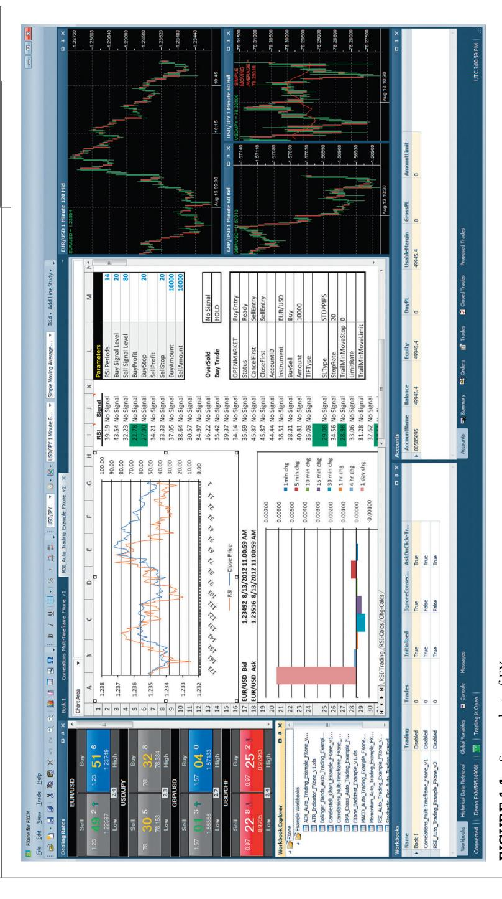

# Backtesting and Automated Execution

While the focus of this book is on specific categories of strategies and not on general techniques of backtesting, there are a number of important considerations and common pitfalls to all strategies that need to be addressed first. If one blithely goes ahead and backtests a strategy without taking care to avoid these pitfalls, the backtesting will be useless. Or worse—it will be misleading and may cause significant financial losses.

Since backtesting typically involves the computation of an expected return and other statistical measures of the performance of a strategy, it is reasonable to question the statistical significance of these numbers. We will discuss various ways of estimating statistical significance using the methodologies of hypothesis testing and Monte Carlo simulations. In general, the more round trip trades there are in the backtest, the higher will be the statistical significance. But even if a backtest is done correctly without pitfalls and with high statistical significance, it doesn't necessarily mean that it is predictive of future returns. Regime shifts can spoil everything, and a few important historical examples will be highlighted.

The choice of a software platform for backtesting is also an important consideration and needs to be tackled early on. A good choice not only will vastly increase your productivity, it will also allow you to backtest the broadest possible spectrum of strategies in the broadest variety of asset classes.

And it will reduce or eliminate the chances of committing the aforementioned pitfalls. We will also explain why the choice of a good backtesting platform is often tied to the choice of a good automated execution platform: often, the best platform combines both functions.

## ■ **The Importance of Backtesting**

Backtesting is the process of feeding historical data to your trading strategy to see how it would have performed. The hope is that its historical performance tells us what to expect for its future performance. The importance of this process is obvious if you have developed a strategy from scratch, since you would certainly want to know how it has performed. But even if you read about a strategy from a publication, and you trust that the author did not lie about its stated performance, it is still imperative that you independently backtest the strategy. There are several reasons for this.

Often, the profi tability of a strategy depends sensitively on the details of implementation. For example, are the stock orders supposed to be sent as market-on-open orders or as market orders just after the open? Are we supposed to send in an order for the E-mini Standard & Poor's (S&P) 500 future just before the 4:00 p.m. stock market closing time, or just before the 4:15 p.m. futures market closing time? Are we supposed to use the bid or ask price to trigger a trade, or are we supposed to use the last price? All these details tend to be glossed over in a published article, often justifi ably so lest they distract from the main idea, but they can aff ect the profi tability of a live-traded strategy signifi cantly. The only way to pin down these details exactly, so as to implement them in our own automated execution system, is to backtest the strategy ourselves. In fact, ideally, our backtesting program can be transformed into an automated execution program by the push of a button to ensure the exact implementation of details.

Once we have implemented every detail of a strategy as a backtest program, we can then put them under the microscope and look for pitfalls in the backtesting process or in the strategy itself. For example, in backtesting a stock portfolio strategy with both long and short positions, have we taken into account the fact that some stocks were hard to borrow and cannot easily be shorted at any reasonable size? In backtesting an intermarket pair-trading strategy in futures, have we made sure that the closing prices of the two markets occur at the same time? The full list of pitfalls is long and tedious, but I will highlight a few common ones in the section "Common Pitfalls of Backtesting." Often, each market and each strategy presents its own very specifi c set of pitfalls. Usually, a pitfall tends to infl ate the backtest performance of a strategy relative to its actual performance in the past, which is particularly dangerous.

Even if we have satisfi ed ourselves that we have understood and implemented every detail of a strategy in a backtesting program, and that there is no pitfall that we can discover, backtesting a published strategy can still yield important benefi ts.

Backtesting a published strategy allows you to conduct true out-of-sample testing in the period following publication. If that out-of-sample performance proves poor, then one has to be concerned that the strategy may have worked only on a limited data set. This is actually a more important point than people realize. Many authors will claim in their articles that the backtest results were "verifi ed with out-of-sample data." But, actually, if the out-of-sample testing results were poor, the authors could have just changed some parameters, or they could have tweaked the model substantially so that the results look good with the "out-of-sample" data. Hence, true out-of-sample testing cannot really begin until a strategy is published and cast in stone.

Finally, by backtesting a strategy ourselves, we often can fi nd ways to refi ne and improve the strategy to make it more profi table or less risky. The backtesting process in trading should follow the "scientifi c method." We should start with a hypothesis about an arbitrage opportunity, maybe based on our own intuition about the market or from some published research. We then confi rm or refute this hypothesis by a backtest. If the results of the backtest aren't good enough, we can modify our hypothesis and repeat the process.

As I emphasized earlier, performance of a strategy is often very sensitive to details, and small changes in these details can bring about substantial improvements. These changes can be as simple as changing the look-back time period for determining the moving average, or entering orders at the open rather than at the close. Backtesting a strategy allows us to experiment with every detail.

## ■ **Common Pitfalls of Backtesting**

Although almost every strategy allows for unique opportunities in committing errors in backtesting, there are a number of common themes, some generally applicable to all markets, others pertain to specifi c ones.

# **Look-ahead Bias**

As its name implies, look-ahead bias means that your backtest program is using tomorrow's prices to determine today's trading signals. Or, more generally, it is using future information to make a "prediction" at the current time. A common example of look-ahead bias is to use a day's high or low price to determine the entry signal during the same day during backtesting. (Before the close of a trading day, we can't know what the high and low price of the day are.) Look-ahead bias is essentially a programming error and can infect only a backtest program but not a live trading program because there is no way a live trading program can obtain future information. This diff erence between backtesting and a live trading program also points to an obvious way to avoid look-ahead bias. If your backtesting and live trading programs are one and the same, and the only diff erence between backtesting versus live trading is what kind of data you are feeding into the program (historical data in the former, and live market data in the latter), then there can be no look-ahead bias in the program. Later on in this chapter, we will see which platforms allow the same source code to be used for both backtest and live execution.

## **Data-Snooping Bias and the Beauty of Linearity**

Data-snooping bias is caused by having too many free parameters that are fi tted to random ethereal market patterns in the past to make historical performance look good. These random market patterns are unlikely to recur in the future, so a model fi tted to these patterns is unlikely to have much predictive power.

The way to detect data-snooping bias is well known: We should test the model on out-of-sample data and reject a model that doesn't pass the out-ofsample test. But this is easier said than done. Are we really willing to give up on possibly weeks of work and toss out the model completely? Few of us are blessed with such decisiveness. Many of us will instead tweak the model this way or that so that it fi nally performs reasonably well on both the in-sample and the out-of-sample result. But voilà! By doing this we have just turned the out-of-sample data into in-sample data.

If you are unwilling to toss out a model because of its performance on a fi xed out-of-sample data set (after all, poor performance on this out-ofsample data may just be due to bad luck), or if you have a small data set to start with and really need to tweak the model using most of this data, you should consider the idea of cross-validation. That is, you should select a number of diff erent subsets of the data for training and tweaking your model and, more important, making sure that the model performs well on these diff erent subsets. One reason why we prefer models with a high Sharpe ratio and short maximum drawdown duration is that this almost automatically ensures that the model will pass the cross-validation test: the only subsets where the model will fail the test are those rare drawdown periods.

There is a general approach to trading strategy construction that can minimize data-snooping bias: make the model as simple as possible, with as few parameters as possible. Many traders appreciate the second edict, but fail to realize that a model with few parameters but lots of complicated trading rules are just as susceptible to data-snooping bias. Both edicts lead to the conclusion that nonlinear models are more susceptible to data-snooping bias than linear models because nonlinear models not only are more complicated but they usually have more free parameters than linear models.

Suppose we attempt to predict price by simple extrapolation of the historical price series. A nonlinear model would certainly fi t the historical data better, but that's no guarantee that it can predict a future value better. But even if we fi x the number of parameters to be the same for a nonlinear model versus its linear contender, one has to remember that we can usually approximate a nonlinear model by Taylor-series expansion familiar from calculus. That means that there is usually a simpler, linear approximation corresponding to every nonlinear model, and a good reason has to be given why this linear model cannot be used. (The exceptions are those singular cases where the lower-order terms vanish. But such cases seldom describe realistic fi nancial time series.)

An equivalent reasoning can be made in the context of what probability distributions we should assume for returns. We have heard often that the Gaussian distribution fails to capture extreme events in the fi nancial market. But the problem with going beyond the Gaussian distribution is that we will be confronted with many choices of alternative distributions. Should it be a Student's *t*-distribution that allows us to capture the skew and kurtosis of the returns, or should it be a Pareto distribution that dispenses with a fi nite second moment completely? Any choice will have some element of arbitrariness, and the decision will be based on a fi nite number of observations. Hence, Occam's razor dictates that unless there are strong theoretical and empirical reasons to support a non-Gaussian distribution, a Gaussian form should be assumed.

Linear models imply not only a linear price prediction formula, but also a linear capital allocation formula. Let's say we are considering a meanreverting model for a price series such that the change in the price *dy* in the next time period *dt* is proportional to the diff erence between the mean price and the current price: *dy*(*t*) = (λ*y*(*t* − 1) + μ)*dt* + *d*ε, the so-called "Ornstein-Uhlenbeck" formula, which is explained and examined in greater detail in Chapter 2. Often, a trader will use a Bollinger band model to capture profi ts from this mean-reverting price series, so that we sell (or buy) whenever the price exceeds (or falls below) a certain threshold. However, if we are forced to stick to linear models, we would be forced to sell (or buy) at every price increment, so that the total market value is approximately proportional to the negative deviation from the mean. In common traders' parlance, this may be called "averaging-in," or "scaling-in," a technique that is discussed in Chapter 3.

You will fi nd several examples of linear trading models in this book because the simplicity of this technique lets us illustrate the point that profi ts are not derived from some subtle, complicated cleverness of the strategy but from an intrinsic ineffi ciency in the market that is hidden in plain sight. The impatient reader can look ahead to Example 4.2, which shows a linear mean-reverting strategy between an exchange-traded fund (ETF) and its component stocks, or Examples 4.3 and 4.4, showing two linear long-short statistical arbitrage strategies on stocks.

The most extreme form of linear predictive models is one in which all the coefficients are equal in magnitude (but not necessarily in sign). For example, suppose you have identified a number of factors ( *f* 's) that are useful in predicting whether tomorrow's return of a stock index is positive. One factor may be today's return, with a positive today's return predicting a positive future return. Another factor may be today's change in the volatility index (VIX), with a negative change predicting positive future return. You may have several such factors. If you normalize these factors by turning them first into Z-scores (using in-sample data!):

$$z(i) = (f(i) - mean(f)) / std(f), \tag{1.1}$$

where *f* (*i*) is the *i th* factor, you can then predict tomorrow's return *R* by

$$R = mean(R) + std(R) \sum_{i}^{n} sign(i)z(i) / n.$$
 (1.2)

The quantities *mean*( *f* ) and *std*( *f* ) are the historical average and standard deviation of the various *f*(*i*), *sign*(*i*) is the sign of the historical correlation between *f*(*i*) and *R*, and *mean*(*R*) and *std*(*R*) are the historical average and standard deviation of one-day returns, respectively. Daniel Kahneman, the Nobel Prize-winning economist, wrote in his bestseller *Thinking, Fast and Slow* that "formulas that assign equal weights to all the predictors are often superior, because they are not aff ected by accidents of sampling" (Kahneman, 2011). Equation 1.2 is a simplifi ed version of the usual factor model used in stock return prediction. While its prediction of the *absolute* returns may or may not be very accurate, its prediction of *relative* returns between stocks is often good enough. This means that if we use it to rank stocks, and then form a long-short portfolio by buying the stocks in the top decile and shorting those in the bottom decile, the average return of the portfolio is often positive.

Actually, if your goal is just to rank stocks instead of coming up with an expected return, there is an even simpler way to combine the factors *f* 's without using Equations 1.1 and 1.2. We can fi rst compute the *ranks* (*i*) of a stock *s* based on a factor *f*(*i*). Then we multiply these ranks by the sign of the correlation between *f*(*i*) and the expected return of the stock. Finally, we sum all these signed ranks to form the rank of a stock:

$$rank_s = \sum_{i}^{n} sign(i) rank_s(i).$$
 (1.3)

As an example, Joel Greenblatt has famously used a two-factor model as a "magic formula" to rank stocks: *f*(1) = return on capital and *f*(2) = earnings yield (Greenblatt, 2006). We are supposed to buy the top 30 ranked stocks and hold them for a year. The annual percentage rate (APR) for this strategy was 30.8 percent from 1988 to 2004, compared with 12.4 percent for the S&P 500. Quite a triumph of linearity!

In the end, though, no matter how carefully you have tried to prevent data-snooping bias in your testing process, it will somehow creep into your model. So we must perform a walk-forward test as a fi nal, true out-ofsample test. This walk-forward test can be conducted in the form of paper trading, but, even better, the model should be traded with real money (albeit with minimal leverage) so as to test those aspects of the strategy that eluded even paper trading. Most traders would be happy to fi nd that live trading generates a Sharpe ratio better than half of its backtest value.

# **Stock Splits and Dividend Adjustments**

Whenever a company's stock has an *N*-to-1 split, the stock price will be divided by *N* times. However, if you own a number of shares of that company's stock before the split, you will own *N* times as many shares after the split, so there is in fact no change in the total market value. But in a backtest, we typically are looking at just the price series to determine our trading signals, not the market-value series of some hypothetical account. So unless we back-adjust the prices before the ex-date of the split by dividing them by *N,* we will see a sudden drop in price on the ex-date, and that might trigger some erroneous trading signals. This is as true in live trading as in backtesting, so you would have to divide the historical prices by *N* just before the market opens on the ex-date during live trading, too. (If it is a reverse 1-to-*N* split, we would have to multiply the historical prices before the ex-date by *N.*)

Similarly, when a company pays a cash (or stock) dividend of \$*d* per share, the stock price will also go down by \$*d* (absent other market movements). That is because if you own that stock before the dividend ex-date, you will get cash (or stock) distributions in your brokerage account, so again there should be no change in the total market value. If you do not back-adjust the historical price series prior to the ex-date, the sudden drop in price may also trigger an erroneous trading signal. This adjustment, too, should be applied to any historical data used in the live trading model just before the market opens on an ex-date. (This discussion applies to ETFs as well. A slightly more complicated treatment needs to be applied to options prices.)

You can fi nd historical split and dividend information on many websites, but I fi nd that earnings.com is an excellent free resource. It not only records such historical numbers, but it shows the announced split and dividend amounts and ex-dates in the future as well, so we can anticipate such events in our automated trading software. If you are interested in historical stock data that are already adjusted for stock splits and dividends, and are easy to download, try csidata.com.

# **Survivorship Bias in Stock Database**

If you are backtesting a stock-trading model, you will suff er from survivorship bias if your historical data do not include delisted stocks. Imagine an extreme case: suppose your model asks you to just buy the one stock that dropped the most in the previous day and hold it forever. In actuality, this strategy will most certainly perform poorly because in many cases the company whose stock dropped the most in the previous day will go on to bankruptcy, resulting in 100 percent loss of the stock position. But if your historical data do not include delisted stocks—that is, they contain only stocks that survive until today—then the backtest result may look excellent. This is because you would have bought a stock when it was beaten down badly but subsequently survived, though you could not have predicted its eventual survival if you were live-trading the strategy.

Survivorship bias is more dangerous to mean-reverting long-only stock strategies than to mean-reverting long-short or short-only strategies. This is because, as we saw earlier, this bias tends to infl ate the backtest performance of a long-only strategy that fi rst buys low and then sells high, whereas it will defl ate the backtest performance of a short-only strategy that fi rst sells high and then buys low. Those stocks that went to zero would have done very well with a short-only strategy, but they would not be present in backtest data with survivorship bias. For mean-reverting long-short strategies, the two eff ects are of opposite signs, but infl ation of the long strategy return tends to outweigh the defl ation of the short portfolio return, so the danger is reduced but not eliminated. Survivorship bias is less dangerous to momentum models. The profi table short momentum trade will tend to be omitted in data with survivorship bias, and thus the backtest return will be defl ated.

You can buy reasonably priced historical data that are free of survivorship bias from csidata.com (which provides a list of delisted stocks). Other vendors include kibot.com, tickdata.com, and crsp.com. Or you can in fact collect your own survivorship bias–free data by saving the historical prices of all the stocks in an index every day. Finally, in the absence of such survivorship bias–free data, you can limit yourself to backtesting only the most recent, say, three years of historical data to reduce the damage.

## **Primary versus Consolidated Stock Prices**

Many U.S. stocks are traded on multiple exchanges, electronic communication networks (ECNs), and dark pools: The New York Stock Exchange (NYSE), NYSE Arca, Nasdaq, Island, BATS, Instinet, Liquidnet, Bloomberg Tradebook, Goldman Sachs' Sigma X, and Credit Suisse's CrossFinder are just some of the example markets. When you look up the historical daily closing price of a stock, it refl ects the last execution price on any one of these venues during regular trading hours. Similarly, a historical daily opening price refl ects the fi rst execution price on any one of these venues. But when you submit a market-on-close (MOC) or market-on-open (MOO) order, it will always be routed to the primary exchange only. For example, an MOC order on IBM will be routed to NYSE, an MOC order on SPY will be routed to NYSE Arca, and an MOC order on Microsoft (MSFT) will be routed to Nasdaq. Hence, if you have a strategy that relies on marketon-open or market-on-close orders, you need the historical prices from the primary exchange to accurately backtest your model. If you use the usual consolidated historical prices for backtesting, the results can be quite unrealistic. In particular, if you use consolidated historical prices to backtest a mean-reverting model, you are likely to generate infl ated backtest performance because a small number of shares can be executed away from the primary exchange at a price quite diff erent from the auction price on the primary exchange. The transaction prices on the next trading day will usually mean-revert from this hard-to-achieve outlier price. (The close and open prices on the U.S. primary exchanges are always determined by an auction, while a transaction at the close on a secondary exchange is not the result of an auction.)

A similar consideration applies to using high or low prices for your strategy. What were recorded in the historical data are usually the consolidated highs or lows, not that of the primary exchange. They are often unrepresentative, exaggerated numbers resulting from trades of small sizes on secondary exchanges. Backtest performance will also be infl ated if these historical prices are used.

Where can we fi nd historical prices from the primary exchanges? Bloomberg users have access to that as part of their subscription. Of course, just as in the case of storing and using survivorship bias–free data discussed earlier, we can also subscribe to direct live feeds from the (primary) exchanges and store those prices into our own databases in real time. We can then use these databases in the future as our source of primary exchange data. Subscribing to such feeds independently can be an expensive proposition, but if your broker has such subscriptions and it redistributes such data to its clients that colocate within its data center, the cost can be much lower. Unfortunately, most retail brokers do not redistribute direct feeds from the exchanges, but institutional brokers such as Lime Brokerage often do.

If we don't have access to such data, all we can do is to entertain a healthy skepticism of our backtest results.

# **Venue Dependence of Currency Quotes**

Compared to the stock market, the currency markets are even more fragmented and there is no rule that says a trade executed at one venue has to be at the best bid or ask across all the diff erent venues. Hence, a backtest will be realistic only if we use historical data extracted from the same venue(s) as the one(s) we expect to trade on.

There are quotes aggregators such as Streambase that consolidate data feeds from diff erent venues into one order book. In this case, you may use the consolidated historical data for backtesting, as long as you can execute on the venue that formed part of the consolidated order book.

Another feature of currency live quotes and historical data is that trade prices and sizes, as opposed to bid and ask quotes, are not generally available, at least not without a small delay. This is because there is no regulation that says the dealer or ECN must report the trade price to all market participants. Indeed, many dealers view transaction information as proprietary and valuable information. (They might be smart to do that because there are high-frequency strategies that depend on order fl ow information and that require trade prices, as mentioned in Chapter 7. The banks' forex proprietary trading desks no doubt prefer to keep this information to themselves.) But using bid-ask quotes for backtesting forex strategies is recommended anyway, since the bid-ask spreads for the same currency pair can vary signifi cantly between venues. As a result, the transaction costs are also highly venue dependent and need to be taken into account in a backtest.

## **Short-Sale Constraints**

A stock-trading model that involves shorting stocks assumes that those stocks can be shorted, but often there are diffi culties in shorting some stocks. To short a stock, your broker has to be able to "locate" a quantity of these stocks from other customers or other institutions (typically mutual funds or other asset managers that have large long positions in many stocks) and arrange a stock loan to you. If there is already a large short interest out there so that a lot of the shares of a company have already been borrowed, or if the fl oat of the stock is limited, then your stock can be "hard to borrow." Hard to borrow may mean that you, as the short seller, will have to pay interest to the stock lender, instead of the other way around in a normal situation. In more extreme cases, hard to borrow may mean that you cannot borrow the stock in the quantity you desire or at all. After Lehman Brothers collapsed during the fi nancial crisis of 2008–2009, the U.S. Securities and Exchange Commission (SEC) banned short sales in all the fi nancial industry stocks for several months. So if your backtesting model shorts stocks that were hard or impossible to borrow, it may show a wonderful return because no one else was able to short the stock and depress its price when your model shorted it. But this return is completely unrealistic. This renders short-sale constraints dangerous to backtesting. It is not easy, though, to fi nd a historically accurate list of hard-to-borrow stocks for your backtest, as this list depends on which broker you use. As a general rule, small-cap stocks are aff ected much more by short-sale constraint than are large-cap stocks, and so the returns of their short positions are much more suspect. Bear in mind also that sometimes ETFs are as hard to borrow as stocks. I have found, for example, that I could not even borrow SPY to short in the months after the Lehman Brothers' collapse!

An additional short-sale constraint is the so-called "uptick rule" imposed by the SEC. The original uptick rule was in eff ect from 1938 to 2007, where the short sale had to be executed at a price higher than the last traded price, or at the last traded price if that price was higher than the price of the trade prior to the last. (For Nasdaq stocks, the short sale price must be higher than the last bid rather than the last trade.) The Alternative Uptick Rule that took eff ect in 2010 also requires a short sale to have a trade price higher than the national best bid, but only when a circuit breaker has been triggered. A circuit breaker for a stock is triggered when that stock traded at 10 percent lower than its previous close. The circuit breaker is in eff ect for the following day after the initial trigger as well. This eff ectively prevents any short market orders from being fi lled. So, again, a really accurate backtest that involves short sales must take into account whether these constraints were in eff ect when the historical trade was supposed to occur. Otherwise, the backtest performance will be infl ated.

## **Futures Continuous Contracts**

Futures contracts have expiry dates, so a trading strategy on, say, crude oil futures, is really a trading strategy on many diff erent contracts. Usually, the strategy applies to front-month contracts. Which contract is the "front month" depends on exactly when you plan to "roll over" to the next month; that is, when you plan to sell the current front contract and buy the contract with the next nearest expiration date (assuming you are long a contract to begin with). Some people may decide to roll over 10 days before the current front contract expires; others may decide to roll over when there is an "open interest crossover"; that is, when the open interest of the next contract exceeds that of the current front contract. No matter how you decide your rollover date, it is quite an extra bother to have to incorporate that in your trading strategy, as this buying and selling is independent of the strategy and should result in minimal additional return or profi t and loss (P&L). (P&L, or return, is certainly aff ected by the so-called "roll return," but as we discuss extensively in Chapter 5, roll return is in eff ect every day on every contract and is not a consequence of rolling over.) Fortunately, most futures historical data vendors also recognize this, and they usually make available what is known as "continuous contract" data.

We won't discuss here how you can go about creating a continuous contract yourself because you can read about that on many futures historical data vendors' websites. But there is a nuance to this process that you need to be aware of. The fi rst step in creating a continuous contract is to concatenate the prices of the front-month contract together, given a certain set of rollover dates. But this results in a price series that may have signifi cant price gaps going from the last date before rollover to the rollover date, and it will create a false return or P&L on the rollover date in your backtest.

To see this, let's say the closing price of the front contract on date *T* is *p*(*T* ), and the closing price of this same contract on date *T* + 1 is *p*(*T* + 1). Also, let's say the closing price of the next nearby contract (also called the "back" contract) on date *T* + 1 is *q*(*T* + 1). Suppose *T* + 1 is the rollover date, so if we are long the front contract, we should sell this contract at the close at *p*(*T* + 1), and then buy the next contract at *q*(*T* + 1). What's the P&L (in points, not dollars) and return of this strategy on *T* + 1? The P&L is just *p*(*T* + 1) − *p*(*T* ), and the return is ( *p*(*T* + 1) − *p*(*T* ))/*p*(*T* ). But the unadjusted continuous price series will show a price of *p*(*T* ) at *T*, and *q*(*T* + 1) at *T* + 1. If you calculate P&L and return the usual way, you would have calculated the erroneous values of *q*(*T* + 1) − *p*(*T* ) and (*q*(*T* + 1) − *p*(*T* ))/*p*(*T* ), respectively. To prevent this error, the data vendor can typically back-adjust the data series to eliminate the price gap, so that the P&L on *T* + 1 is *p*(*T* + 1) − *p*(*T* ). This can be done by adding the number (*q*(*T* + 1) − *p*(*T* + 1)) to every price *p*(*t*) on every date *t* on or before *T*, so that the price change and P&L from *T* to *T* + 1 is correctly calculated as *q*(*T* + 1) − ( *p*(*T* ) + *q*(*T* + 1) − *p*(*T* + 1)) = *p*(*T* + 1) − *p*(*T* ). (Of course, to take care of every rollover, you would have to apply this back adjustment multiple times, as you go back further in the data series.)

Is our problem solved? Not quite. Check out what the return is at *T* + 1 given this adjusted price series: ( *p*(*T* + 1) − *p*(*T* ))/( *p*(*T* ) + *q*(*T* + 1) − *p*(*T* + 1)), not ( *p*(*T* + 1) − *p*(*T*))/*p*(*T* ). If you back-adjust to make the P&L calculation correct, you will leave the return calculation incorrect. Conversely, you can back-adjust the price series to make the return calculation correct (by multiplying every price *p*(*t*) on every date *t* on or before *T* by the number *q*(*T* + 1)/*p*(*T* + 1)), but then the P&L calculation will be incorrect. You really can't have both. As long as you want the convenience of using a continuous contract series, you have to choose one performance measurement only, P&L or return. (If you bother to backtest your strategy on the various individual contracts, taking care of the rollover buying and selling yourself, then both P&L and return can be correctly calculated simultaneously.)

An additional diffi culty occurs when we choose the price back-adjustment instead of the return back-adjustment method: the prices may turn negative in the distant past. This may create problems for your trading strategy, and it will certainly create problems in calculating returns. A common method to deal with this is to add a constant to all the prices so that none will be negative.

This subtlety in picking the right back-adjustment method is more important when we have a strategy that involves trading spreads between diff erent contracts. If your strategy generates trading signals based on the price diff erence between two contracts, then you must choose the price back-adjustment method; otherwise, the price diff erence may be wrong and generate a wrong trading signal. When a strategy involves calendar spreads (spreads on contracts with the same underlying but diff erent expiration dates), this back adjustment is even more important. This is because the calendar spread is a small number compared to the price of one leg of the spread, so any error due to rollover will be a signifi cant percentage of the spread and very likely to trigger a wrong signal both in backtest and in live trading. However, if your strategy generates trading signals based on the ratio of prices between two contracts, then you must choose the return back-adjustment method.

As you can see, when choosing a data vendor for historical futures prices, you must understand exactly how they have dealt with the back-adjustment issue, as it certainly impacts your backtest. For example, csidata.com uses only price back adjustment, but with an optional additive constant to prevent prices from going negative, while tickdata.com allows you the option of choosing price versus return back-adjustment, but there is no option for adding a constant to prevent negative prices.

# **Futures Close versus Settlement Prices**

The daily closing price of a futures contract provided by a data vendor is usually the settlement price, not the last traded price of the contract during that day. Note that a futures contract will have a settlement price each day (determined by the exchange), even if the contract has not traded at all that day. And if the contract has traded, the settlement price is in general diff erent from the last traded price. Most historical data vendors provide the settlement price as the daily closing price. But some, such as vendors that provide tick-by-tick data, may provide actual transaction price only, and therefore the close price will be the last traded price, if there has been a transaction on that day. Which price should we use to backtest our strategies?

In most cases, we should use the settlement price, because if you had traded live near the close, that would have been closest to the price of your transaction. The last recorded trade price might have occurred several hours earlier and bear little relation to your transaction price near the close. This is especially important if we are constructing a pairs-trading strategy on futures. If you use the settlement prices to determine the futures spreads, you are guaranteed to be using two contemporaneous prices. (This is true as long as the two futures contracts have the same underlying and therefore have the same closing time. If you are trading intermarket spreads, see the discussion at the end of this section.) However, if you use the last traded prices to determine the spread, you may be using prices generated at two very diff erent times and therefore incorrect. This incorrectness may mean that your backtest program will be generating erroneous trades due to an unrealistically large spread, and these trades may be unrealistically profi table in backtest when the spreads return to a correct, smaller value in the future, maybe when near-simultaneous transactions occur. As usual, an infl ated backtest result is dangerous.

If you have an intraday spread strategy or are otherwise using intraday futures prices for backtesting a spread strategy, you will need either historical data with bid and ask prices of both contracts or the intraday data on the spread itself when it is native to the exchange. This is necessary because many futures contracts are not very liquid. So if we use the last price of every bar to form the spread, we may fi nd that the last prices of contract A and contract B of the same bar may actually refer to transactions that are quite far apart in time. A spread formed by asynchronous last prices could not in reality be bought or sold at those prices. Backtests of intraday spread strategies using the last price of each leg of the spread instead of the last price of the spread itself will again infl ate the resulting returns. One vendor that sells intraday historical calendar spread data (both quote and trade prices) is cqgdatafactory.com.

There is one general detail in backtesting intermarket spreads that should not be overlooked. If the contracts are traded on diff erent exchanges, they are likely to have diff erent closing times. So it would be wrong to form an intermarket spread using their closing prices. This is true also if we try to form a spread between a future and an ETF. The obvious remedy of this is to obtain intraday bid-ask data so that synchronicity is assured. The other possibility is to trade an ETF that holds a future instead of the future itself. For example, instead of trading the gold future GC (settlement price set at 1:30 p.m. ET) against the gold-miners ETF GDX, we can trade the gold trust GLD against GDX instead. Because both trade on Arca, their closing prices are set at the same 4:00 p.m. ET.

## ■ **Statistical Signifi cance of Backtesting: Hypothesis Testing**

In any backtest, we face the problem of fi nite sample size: Whatever statistical measures we compute, such as average returns or maximum drawdowns, are subject to randomness. In other words, we may just be lucky that our strategy happened to be profi table in a small data sample. Statisticians have developed a general methodology called *hypothesis testing* to address this issue.

The general framework of hypothesis testing as applied to backtesting follows these steps:

- 1. Based on a backtest on some fi nite sample of data, we compute a certain statistical measure called the *test statistic.* For concreteness, let's say the test statistic is the average daily return of a trading strategy in that period.
- 2. We suppose that the true average daily return based on an infi nite data set is actually zero. This supposition is called the *null hypothesis.*
- 3. We suppose that the probability distribution of daily returns is known. This probability distribution has a zero mean, based on the null hypothesis. We describe later how we determine this probability distribution.
- 4. Based on this null hypothesis probability distribution, we compute the probability *p* that the average daily returns will be at least as large as the observed value in the backtest (or, for a general test statistic, as extreme, allowing for the possibility of a negative test statistic). This probability *p* is called the *p-value,* and if it is very small (let's say smaller

than 0.01), that means we can "reject the null hypothesis," and conclude that the backtested average daily return is statistically signifi cant.

The step in this procedure that requires most thought is step 3. How do we determine the probability distribution under the null hypothesis? Perhaps we can suppose that the daily returns follow a standard parametric probability distribution such as the Gaussian distribution, with a mean of zero and a standard deviation given by the sample standard deviation of the daily returns. If we do this, it is clear that if the backtest has a high Sharpe ratio, it would be very easy for us to reject the null hypothesis. This is because the standard test statistic for a Gaussian distribution is none other than the average divided by the standard deviation and multiplied by the square root of the number of data points (Berntson, 2002). The *p-*values for various critical values are listed in Table 1.1. For example, if the daily Sharpe ratio multiplied by the square root of the number days ( *n*) in the backtest is greater than or equal to the critical value 2.326, then the *p*-value is smaller than or equal to 0.01.

This method of hypothesis testing is consistent with our belief that high-Sharpe-ratio strategies are more statistically signifi cant.

Another way to estimate the probability distribution of the null hypothesis is to use Monte Carlo methods to generate simulated historical price data and feed these simulated data into our strategy to determine the empirical probability distribution of profits. Our belief is that the profitability of the trading strategy captured some subtle patterns or correlations of the price series, and not just because of the first few moments of the price distributions. So if we generate many simulated price series with the same first moments and the same length as the actual price data, and run the trading strategy over all these simulated price series, we can find out in what fraction *p* of these price series are the average returns greater than or equal to the backtest return.

| TABLE 1.1 | Critical Values for<br>n × Daily Sharpe Ratio |  |  |  |
|-----------|-----------------------------------------------|--|--|--|
| p-value   | Critical values                               |  |  |  |
| 0.10      | 1.282                                         |  |  |  |
| 0.05      | 1.645                                         |  |  |  |
| 0.01      | 2.326                                         |  |  |  |
| 0.001     | 3.091                                         |  |  |  |

*Source:* Berntson (2002).

Ideally, *p* will be small, which allows us to reject the null hypothesis. Otherwise, the average return of the strategy may just be due to the market returns.

A third way to estimate the probability distribution of the null hypothesis is suggested by Andrew Lo and his collaborators (Lo, Mamaysky, and Wang, 2000). In this method, instead of generating simulated price data, we generate sets of simulated trades, with the constraint that the number of long and short *entry* trades is the same as in the backtest, and with the same average holding period for the trades. These trades are distributed randomly over the actual historical price series. We then measure what fraction of such sets of trades has average return greater than or equal to the backtest average return.

In Example 1.1, I compare these three ways of testing the statistical signifi cance of a backtest on a strategy. We should not be surprised that they give us diff erent answers, since the probability distribution is diff erent in each case, and each assumed distribution compares our strategy against a diff erent benchmark of randomness.

### **Example 1.1: Hypothesis Testing on a Futures Momentum Strategy**

We apply the three versions of hypothesis testing, each with a diff erent probability distribution for the null hypothesis, on the backtest results of the TU momentum strategy described in Chapter 6. That strategy buys (sells) the TU future if it has a positive (negative) 12-month return, and holds the position for 1 month. We pick this strategy not only because of its simplicity, but because it has a fi xed holding period. So for version 3 of the hypothesis testing, we need to randomize only the starting days of the long and short trades, with no need to randomize the holding periods.

The fi rst hypothesis test is very easy. We assume the probability distribution of the daily returns is Gaussian, with mean zero as befi tting a null hypothesis, and with the standard deviation given by the standard deviation of the daily returns given by our backtest. So if *ret* is the Tx1 MATLAB© array containing the daily returns of the strategy, the test statistic is just

#### **Example 1.1 (***Continued***)**

which turns out to be 2.93 for our data set. Comparing this test statistic with the critical values in Table 1.1 tells us that we can reject the null hypothesis with better than 99 percent probability.

The second hypothesis test involves generating a set of random, simulated daily returns data for the TU future (not the daily returns of the *strategy*) for the same number of days as our backtest. These random daily returns data will have the same mean, standard deviation, skewness, and kurtosis as the observed futures returns, but, of course, they won't have the same correlations embedded in them. If we fi nd there is a good probability that the strategy can generate an as good as or better return on this random returns series as the observed returns series, it would mean that the momentum strategy is not really capturing any momentum or serial correlations in the returns at all and is profi table only because we were lucky that the observed returns' probability distribution has a certain mean and a certain shape. To generate these simulated random returns with the prescribed moments, we use the *pearsrnd* function from the MATLAB Statistics Toolbox. After the simulated returns *marketRet\_sim* are generated, we then go on to construct a simulated price series *cl\_sim* using those returns. Finally, we run the strategy on these simulated prices and calculate the average return of the strategy. We repeat this 10,000 times and count how many times the strategy produces an average return greater than or equal to that produced on the observed data set.

Assuming that *marketRet* is the Tx1 array containing the observed daily returns of TU, the program fragment is displayed below. (The source codes for these tests can be downloaded as *TU\_mom\_hypothesisTest.m* from [www.wiley.com/go/algotrading.\)](http://www.wiley.com/go/algotrading)

```
moments={mean(marketRet), std(marketRet), ...
 skewness(marketRet), kurtosis(marketRet)};
numSampleAvgretBetterOrEqualObserved=0;
for sample=1:10000
    marketRet_sim=pearsrnd(moments{:}, length(marketRet), 1);
    cl_sim=cumprod(1+marketRet_sim)-1;
    longs_sim=cl_sim > backshift(lookback, cl_sim) ;
    shorts_sim=cl_sim < backshift(lookback, cl_sim) ;
                                                       (Continued )
```

#### **Example 1.1 (***Continued***)**

```
pos_sim=zeros(length(cl_sim), 1);
       for h=0:holddays-1
           long_sim_lag=backshift(h, longs_sim);
           long_sim_lag(isnan(long_sim_lag))=false;
           long_sim_lag=logical(long_sim_lag);
           short_sim_lag=backshift(h, shorts_sim);
           short_sim_lag(isnan(short_sim_lag))=false;
           short_sim_lag=logical(short_sim_lag);
           pos_sim(long_sim_lag)=pos_sim(long_sim_lag)+1;
           pos_sim(short_sim_lag)=pos_sim(short_sim_lag)-1;
       end
       ret_sim=backshift(1, pos_sim).*marketRet_sim/holddays;
       ret_sim(~isfinite(ret_sim))=0;
  if (mean(ret_sim)>= mean(ret))
    numSampleAvgretBetterOrEqualObserved=numSampleAvgret
     BetterOrEqualObserved+1;
  end
end
```

We found that out of 10,000 random returns sets, 1,166 have average strategy return greater than or equal to the observed average return. So the null hypothesis can be rejected with only 88 percent probability. Clearly, the shape of the returns distribution curve has something to do with the success of the strategy. (It is less likely that the success is due to the mean of the distribution since the position can be long or short at diff erent times.)

The third hypothesis test involves randomizing the long and short entry dates, while keeping the same number of long trades and short trades as the ones in the backtest, respectively. We can accomplish this quite easily by the MATLAB function *randperm*:

```
numSampleAvgretBetterOrEqualObserved=0;
for sample=1:100000
    P=randperm(length(longs));
```

#### **Example 1.1 (***Continued***)**

```
longs_sim=longs(P);
       shorts_sim=shorts(P);
       pos_sim=zeros(length(cl), 1);
       for h=0:holddays-1
           long_sim_lag=backshift(h, longs_sim);
           long_sim_lag(isnan(long_sim_lag))=false;
           long_sim_lag=logical(long_sim_lag);
           short_sim_lag=backshift(h, shorts_sim);
           short_sim_lag(isnan(short_sim_lag))=false;
           short_sim_lag=logical(short_sim_lag);
           pos(long_sim_lag)=pos(long_sim_lag)+1;
           pos(short_sim_lag)=pos(short_sim_lag)-1;
       end
       ret_sim=backshift(1, pos_sim).*marketRet/holddays;
       ret_sim(isnan(ret_sim))=0;
       if (mean(ret_sim)>= mean(ret))
       numSampleAvgretBetterOrEqualObserved=...
        numSampleAvgretBetterOrEqualObserved+1;
       end
end
```

There is not a single sample out of 100,000 where the average strategy return is greater than or equal to the observed return. Clearly, the third test is much weaker for this strategy.

The fact that a null hypothesis is not unique and diff erent null hypotheses can give rise to diff erent estimates of statistical signifi cance is one reason why many critics believe that hypothesis testing is a fl awed methodology (Gill, 1999). The other reason is that we actually want to know the conditional probability that the null hypothesis is true given that we have observed the test statistic *R*: *P*(*H*0|R). But the procedure we outlined previously actually just computed the conditional probability of obtaining a test statistic *R* given that the null hypothesis is true: *P*(*R*|*H*0). Rarely is *P*(*R*|*H*0) = P(*H*0|*R*).

Even though hyp othesis testing and the rejection of a null hypothesis may not be a very satisfactory way to estimate statistical signifi cance, the *failure* to reject a null hypothesis can inspire very interesting insights. Our Example 1.1 shows that any random returns distribution with high kurtosis can be favorable to momentum strategies.

## ■ **When Not to Backtest a Strategy**

We have spent much eff ort earlier convincing you that you should backtest every strategy that comes your way before trading it. Why would we recommend against backtesting some strategies? The fact is that there are some published strategies that are so obviously fl awed it would be a waste of time to even consider them. Given what you know now about common pitfalls of backtesting, you are in a good position to judge whether you would want to backtest a strategy without even knowing the details. We will look at a few examples here.

**Example 1:** A strategy that has a backtest annualized return of 30 percent and a Sharpe ratio of 0.3, and a maximum drawdown duration of two years.

Very few traders (as opposed to "investors") have the stomach for a strategy that remains "under water" for two years. The low Sharpe ratio coupled with the long drawdown duration indicates that the strategy is not consistent. The high average return may be just a fl uke, and it is not likely to repeat itself when we start to trade the strategy live. Another way to say this is that the high return is likely the result of data-snooping bias, and the long drawdown duration will make it unlikely that the strategy will pass a crossvalidation test. Do not bother to backtest high return but low Sharpe ratio strategies. Also, do not bother to backtest strategies with a maximum drawdown duration longer than what you or your investors can possibly endure.

**Example 2:** A long-only crude oil futures strategy returned 20 percent in 2007, with a Sharpe ratio of 1.5.

A quick check of the total return of holding the front-month crude oil futures in 2007 reveals that it was 47 percent, with a Sharpe ratio of 1.7. Hence, this trading strategy is not in any way superior to a simple buy-and-hold strategy! Moral of the story: We must always choose the appropriate benchmark to measure a trading strategy against. The appropriate benchmark of a long-only strategy is the return of a buy-and-hold position—the information ratio rather than the Sharpe ratio.

**Example 3:** A simple "buy-low-sell-high" strategy picks the 10 lowestpriced stocks at the beginning of the year and holds them for a year. The backtest return in 2001 is 388 percent.

The fi rst question that should come to mind upon reading this strategy is: Was the strategy backtested using a survivorship-bias-free stock database? In other words, does the stock database include those stocks that have since been delisted? If the database includes only stocks that have survived until today, then the strategy will most likely pick those lucky survivors that happened to be very cheap at the beginning of 2001. With the benefi t of hindsight, the backtest can, of course, achieve a 388 percent return. In contrast, if the database includes delisted stocks, then the strategy will most likely pick those stocks to form the portfolio, resulting in almost 100 percent loss. This 100 percent loss would be the realized return if we had traded the strategy back in 2001, and the 388 percent return is an infl ated backtest return that can never be realized. If the author did not specifi cally mention that the data used include delisted stocks, then we can assume the backtest suff ers from survivorship bias and the return is likely to be infl ated.

**Example 4:** A neural net trading model that has about 100 nodes generates a backtest Sharpe ratio of 6.

My alarms always go off whenever I hear the term *neural net trading model,* not to mention one that has 100 nodes. All you need to know about the nodes in a neural net is that the number of parameters to be fitted with in-sample training data is proportional to the number of nodes. With at least 100 parameters, we can certainly fit the model to any time series we want and obtain a fantastic Sharpe ratio. Needless to say, it will have little or no predictive power going forward due to data-snooping bias.

**Example 5:** A high-frequency E-mini S&P 500 futures trading strategy has a backtest annual average return of 200 percent and a Sharpe ratio of 6. Its average holding period is 50 seconds.

Can we really backtest a high-frequency trading strategy? The performance of a high-frequency trading strategy depends on the order types used and the execution method in general. Furthermore, it depends crucially on the market microstructure. Even if we have historical data of the entire order book, the profi t from a high-frequency strategy is still very dependent on the reactions of other market participants. One has to question whether there is a "Heisenberg uncertainty principle" at work: The act of placing or executing an order might alter the behavior of the other market participants. So be very skeptical of a so-called backtest of a highfrequency strategy.

Life is too short to backtest every single strategy that we read about, so we hope awareness of the common pitfalls of backtesting will help you select what strategies to backtest.

## ■ **Will a Backtest Be Predictive of Future Returns?**

Even if we manage to avoid all the common pitfalls outlined earlier and there are enough trades to ensure statistical signifi cance of the backtest, the predictive power of any backtest rests on the central assumption that the statistical properties of the price series are unchanging, so that the trading rules that were profi table in the past will be profi table in the future. This assumption is, of course, invalidated often in varying degrees: A country's economic prospect changes, a company's management changes, and a fi nancial market's structure changes. In the past decade in the United States, we have witnessed numerous instances of the last category of changes. Among them:

- Decimalization of U.S. stock quotes on April 9, 2001. (Prior to this date, U.S. stocks were quoted in one-eighth or one-sixteenth of a penny.) This caused bid-ask spreads to decrease, but also caused the "displayed liquidity" at the best bid and ask prices to decrease (Arnuk and Saluzzi, 2012). This in turn caused profi tability of many statistical arbitrage strategies to decrease while increasing the profi tability of many high-frequency strategies.
- The 2008 fi nancial crisis that induced a subsequent 50 percent collapse of average daily trading volumes (Durden, 2012). Retail trading and ownership of common stock is particularly reduced. This has led to decreasing average volatility of the markets, but with increasing frequency of sudden outbursts such as that which occurred during the fl ash crash in May 2010 and the U.S. federal debt credit rating downgrade in August 2011. The overall eff ect has been a general decrease in profi ts for mean-reverting strategies, which thrive on a high but constant level of volatility.
- The same 2008 fi nancial crisis, which also initiated a multiyear bear market in momentum strategies, as discussed in Chapter 6.

- The SEC's Regulation NMS implemented in July 2007, which also contributed to the drastic decrease in the average trade sizes and the obsolescence of the NYSE block trade (Arnuk and Saluzzi, 2012).
- The removal of the old uptick rule for short sales in June 2007 and the reinstatement of the new Alternative Uptick Rule in 2010.

Strategies that performed superbly prior to each of these "regime shifts" may stop performing and vice versa. Backtests done using data prior to such regime shifts may be quite worthless, while backtests done using recent data may be no more indicative of future profi ts if and when a future regime shift is to occur. The general point of this is that algorithmic trading is not just about algorithms, programming, and mathematics: An awareness of such fundamental market and economic issues is also needed to inform us on whether a backtest is predictive and will continue to be predictive.

## ■ **Choosing a Backtesting and Automated Execution Platform**

Software companies have worked very hard to provide traders with a wide variety of backtesting and automated execution platforms that cater to every possible level of programming skills. We are faced with two basic choices when it comes to deciding on a trading platform:

- 1. Buying a special-purpose backtesting and execution platform, and implementing your strategy using that platform's special-purpose graphical user interface (GUI) or programming language.
- 2. Writing your own backtest and execution program in a generic programming language such as C++, either in a completely standalone manner with piecemeal purchases of software libraries to make the task easier or within an integrated development environment (IDE) that comes with a comprehensive library catering to algorithmic trading.

We consider some criteria for making this choice next.

# **How Good Is Your Programming Skill?**

If you have little skill in programming, then the only choice is to pick a special-purpose trading platform. These platforms unburden the user from

**BOX 1.1**

having to learn a programming language by presenting a graphical "dragand-drop" user interface for building a trading strategy. Examples of these products are Deltix and Progress Apama. However, I have found that these GUIs can be quite limiting in the variety of strategies that you can build, and in the long run, it is far more effi cient to become adept in a programming language in order to express your strategy. (Note that Deltix and Progress Apama also allow other ways to specify a strategy, as explained below.)

Traders possessing the next level of programming skill should consider implementing both backtesting and automated execution using one of the scripting languages. These languages do not require compilation, and you can instantly see the results the moment you fi nish typing in the mathematical or logical expressions. Many traders' favorite backtesting platform, Microsoft Excel, perhaps used in conjunction with Visual Basic (VB) macros, belongs to this category. But it is actually quite hard to build a reasonably complicated strategy in Excel, and even harder to debug it. Excel also is not a particularly high-performance language, so if your strategy is very computationally intensive, it is not going to work. If you use Excel for automated executions, you may fi nd that you have to use DDE links provided by your brokerage for market data updates, and you will likely need to add Visual Basic macros to handle more complicated trading logic, which is quite ineffi cient. (However, see Box 1.1 for an Excel-like trading platform that is supercharged for effi ciency.)

#### **Excel on Steroids—The FXone Automated Execution Platform**

There is a currency trading platform called FXone that looks like Excel, but the underlying computational engine is written in a high-performance language like C++ instead of relying on VB macros. It is a true tick-driven application: Every tick (in the FX case, a tick is a new quote) triggers a recalculation of all the values in all of the cells of the spreadsheet. Furthermore, it has an internal cache for real-time data so that different cells that require the same data to compute can simply retrieve it from the cache, instead of duplicating subscriptions of the same data. It is also a true multithreaded platform at two different levels. First, different strategies written on different Excel workbooks can get market data updates and submit orders simultaneously. Second, different cells within the same workbook can also get updates and act on new data simultaneously. That is to say, even if the calculation in one cell happens to take very long to complete, it will not prevent other cells from responding to a new tick by, say, submitting an order. A screenshot of FXone is shown in Figure 1.1.



**FIGURE 1.1** Screenshot of FXone.

Many special-purpose trading platforms, including QuantHouse and RTD Tango and the aforementioned Deltix and Progress Apama, also include ways for coding a strategy with their own proprietary programming languages, which are usually quite simple and easy to learn, maybe as easy as Visual Basic. Aside from the institutional platforms mentioned here, many retail traders are familiar with MetaTrader, NinjaTrader, Trading Blox, or TradeStation Easy Language. I have not tried all of these platforms personally, but I have a lingering suspicion that despite the apparent ease of use and other advantages I mention later, they all in some way place some limitations on the type of strategies that can be backtested and executed.

Requiring just slightly more skills than programming in VB, traders will fi nd the scripting languages of MATLAB, R, and Python off er vastly more ease of debugging, much greater fl exibility in the type of strategies that can be backtested, and higher effi ciency in backtesting large data sets. These are what we call "REPL" languages. REPL is programmer-speak for "Read-Eval-Print-Loop." That is, you can type in a mathematical expression, and the program will immediately evaluate it and print out the answer, and get ready for you to input the next expression. It works exactly like a handheld calculator, but better: You can also save all these expressions in a fi le, and have the program automatically execute them sequentially. The syntax of these languages is designed to be more intuitive and easier to understand than conventional programming languages such as C++ and much more fl exible in terms of the type of variables that can be used in a program. Scalars, arrays, and strings are all basically dealt with using a similar syntax and passed along to functions in the same way.

MATLAB can also utilize Java, C++, or C# libraries or application programming interfaces (APIs) and call functions implemented in those libraries or APIs. This allows MATLAB to take advantage of the more effi cient implementations in those conventional languages when a task is particularly computationally intensive. Also, there are far more libraries and APIs that are written in those conventional languages than those written in MATLAB, R, or Python, so this feature is often essential.

Many algorithmic traders are aware that MATLAB, R, and Python are excellent languages for backtesting. But less well known is the fact that they can be turned into execution platforms as well with the addition of some toolboxes. Most brokerages have APIs written in Java, C++, or C#; and, as I said earlier, MATLAB can call functions in APIs written in such languages, though it does take some familiarity with these languages to know how to call these functions. If you would prefer a solution that obviates making "foreign-language" API calls in MATLAB, there are a number of commercial products available. MATLAB's own Datafeed Toolbox can send orders to Trading Technologies' X\_TRADER. To connect MATLAB to Interactive Brokers, undocumentedmatlab.com has developed an API called IB-Matlab. Another vendor, [www.exchangeapi.com,](http://www.exchangeapi.com) has a similar API called quant2ib, as well as one called quant2tt for connecting MATLAB to Trading Technologies. For other brokerages, [www.](http://www.pracplay.com) [pracplay.com off](http://www.pracplay.com) ers a bridge from MATLAB or R to 15 or more brokers for a monthly fee. A free, open-source MATLAB API for connecting to Interactive Brokers was developed by Jev Kuznetsov and is available for download from MATLAB Central's File Exchange. Meanwhile, the MAT-FIX software from agoratron.com lets your MATLAB program send orders using the Financial Information eXchange (FIX) protocol to brokers or exchanges. You can also use MATLAB to call the Java or .NET functions in QuickFIX, an open source FIX engine (Kozola, 2012). For Python users, the free, open-source software IbPy will connect your Python trading program to Interactive Brokers. While these add-ons to MATLAB and Python make it possible to connect to a broker, they nevertheless do not shield you from all the complexity of such connections. And, more important, it is cumbersome to use the same program for both backtesting and execution.

If you are a hard-core programmer, you will, of course, have no problem backtesting and automating execution directly in the most fl exible, most effi cient, and most robust of programming languages, such as aforementioned trio of Java, C++, or C#. As I said earlier, all brokerages or exchanges that cater to algorithmic traders provide APIs in one or more of these languages, or they allow you to submit orders using the FIX messages, which in turn can be created and transmitted using a program written in one of these languages. (For example, QuickFIX, mentioned previously, is available in C++, C#, VB, Python, and Ruby.) But even here the software industry has come to make our strategy implementation easier and more robust by providing IDEs designed just for backtesting. In fact, many of the special-purpose trading platforms (Deltix, Progress Apama, QuantHouse, RTD Tango, etc.) include ways for coding strategies using general-purpose, advanced programming languages that make them resemble IDEs. There are also free, open-source class libraries or IDEs that I describe in the next section.

# **Can Backtesting and Execution Use the Same Program?**

Special-purpose *execution* platforms typically hide the complexity of connecting to a brokerage or exchange, receiving live market data, sending orders and receiving order confi rmations, updating portfolio positions etc. from the programmer. Meanwhile, special-purpose *backtesting* platforms typically come integrated with historical data. So for many special-purpose trading platforms, the backtest program can be made the same as the live execution program by factoring out the pure trading logic into a function, unencumbered with details of how to retrieve data or where to submit orders, and switching between backtesting mode and live execution mode can be done by pushing a button to switch between feeding in historical data versus live market data.

This ease of switching between backtesting and live execution is more than just convenience: It eliminates any possibility of discrepancies or errors in transcribing a backtest strategy into a live strategy, discrepancies that often plague strategies written in a general programming language whether it is C++ or MATLAB. Just as importantly, it eliminates the possibility of look-ahead bias. As explained before, look-ahead bias means mistakenly incorporating future, unknowable information as part of the historical data input to the backtest engine. Special-purpose platforms feed in historical market data into the trade generating engine one tick or one bar at a time, just as it would feeding in live market data. So there is no possibility that future information can be used as input. This is one major advantage of using a special-purpose trading platform.

There is one more advantage in using a platform where the backtesting and live execution programs are one and the same—it enables true tickbased high-frequency trading strategies backtesting. This is because most industrial-strength live execution programs are "event-driven"; that is, a trade is triggered by the arrival of a new tick, not the end of an arbitrary time bar. So if the input historical data is also tick-based, we can also backtest a high-frequency strategy that depends on the change of every tick or even every change in the order book. (I said "in theory" assuming that your hardware is powerful enough. Otherwise, see the discussion later in this chapter in the section "What Type of Asset Classes or Strategies Does the Platform Support?") Of course, we can backtest tick-based strategies in MATLAB by feeding every tick into the program as well, though that is quite a cumbersome procedure.

**TABLE 1.2 Comparisons of Open-Source Integrated Development Environments (IDEs) for Backtesting and Automated Execution**

| IDE          | Language(s)                                    | Asset<br>class(es) | Broker(s)                                              | Tick<br>based? | CEP<br>enabled? |
|--------------|------------------------------------------------|--------------------|--------------------------------------------------------|----------------|-----------------|
| ActiveQuant  | Java, MATLAB, R                                | Various            | CTS, FIX, Trading<br>Technologies<br>supported brokers | Yes            | No              |
| Algo-Trader  | Java                                           | Various            | Interactive Brokers,<br>FIX                            | Yes            | Yes             |
| Marketcetera | Java, Python, Ruby                             | Various            | Various, FIX                                           | Yes            | Yes             |
| OpenQuant    | .NET (C#, VB)                                  | Various            | Various, FIX                                           | ?              | No              |
| TradeLink    | .NET (C#, C++,<br>VB), Java, Pascal,<br>Python | Various            | Various, FIX                                           | Yes            | No              |

If you are a competent programmer who prefers the fl exibility of a general purpose programming language, yet you want to use the same program for both backtesting and live trading because of the preceding considerations, you can still use the institutional-grade special-purpose platforms as IDEs, or you can use the many open-source IDEs available: Marketcetera, Trade-Link, Algo-Trader, ActiveQuant. I call them IDEs, but they are more than just a trading strategy development environment: They come with libraries that deal with the nuts and bolts of connecting to and exchanging data with your broker, much like a special-purpose platform does. Many of them are also integrated with historical data, which is an important time saver. As an added bonus, these open-source IDEs are either free or quite low-cost compared to special-purpose platforms. I display in Table 1.2 the languages, markets, and brokers that they support. (FIX as a broker means that the system can directly access any execution venues via the FIX protocol, regardless of clearing broker.) I also indicate whether the IDE is tick based (sometimes called *event driven* or *stream based* ).

One should note that Table 1.2 only compares features of open-source IDEs. The institutional-grade special-purpose platforms typically have all of these features.

## **What Type of Asset Classes or Strategies Does the Platform Support?**

While using a special-purpose platform for trading strategies has several important advantages described earlier, few but the most high end of these platforms support all possible asset classes, including stocks, futures, currencies, and options. For example, the popular MetaTrader is for currencies trading only. It is especially diffi cult for these platforms to trade strategies that involve arbitrage between diff erent asset classes, such as between futures and stocks or currencies and futures. The open-source IDEs are better able to handle these situations. As Table 1.2 indicates, most IDEs can trade a variety of asset classes. But, as usual, the most fl exible solution in this respect is a stand-alone program written outside of any IDE.

Beyond asset classes, many special-purpose platforms also place restrictions on the type of strategies that they support even within one asset class. Often, simple pairs trading strategies require special modules to handle. Most lower-end platforms cannot handle common statistical arbitrage or portfolio trading strategies that involve many symbols. Open-source IDEs do not have such restrictions, and, of course, neither do stand-alone programs.

What about high(er)-frequency trading? What kind of platforms can support this demanding trading strategy? The surprising answer is that most platforms can handle the execution part of high-frequency trading without too much latency (as long as your strategy can tolerate latencies in the 1- to 10-millisecond range), and since special-purpose platforms as well as IDEs typically use the same program for both backtesting and execution, backtesting shouldn't in theory be a problem either.

To understand why most platforms have no trouble handling highfrequency executions, we have to realize that most of the latency that needs to be overcome in high-frequency trading is due to live market data latency, or brokerage order confi rmation latency.

## 1. Live market data latency:

For your program to receive a new quote or trade price within 1 to 10 milliseconds (ms), you have to colocate your program at the exchange or in your broker's data center (see Box 1.2); furthermore, you have to receive a direct data feed from the exchanges involved, not from a consolidated data feed such as SIAC's Consolidated Tape System (CTS). (For example, Interactive Brokers' data feed only off ers snapshots of market data every 250 ms.)

#### 2. Brokerage order confi rmation latency:

If a strategy submits limit orders, it will depend on a timely order status confi rmation before it can decide what to do next. For some retail brokerages, it can take up to six seconds between the execution of an order and your program receiving the execution confi rmation, virtually

#### **Colocation of Trading Programs**

The general term colocation can mean several ways of physically locating your trading program outside of your desktop computer. Stretching the defi nition a bit, it can mean installing your trading program in a cloud server or VPS (virtual private server) such as Amazon's EC2, slicehost.com, or gogrid. com. The advantage of doing so is to prevent power or Internet outages that are more likely to strike a private home or offi ce than a commercial data center, with its backup power supply and redundant network connectivity. Colocating in a cloud server does not necessarily shorten the time data take to travel between your brokerage or an exchange to your trading program, since many homes or offi ces are now equipped with a fi ber optics connection to their Internet service provider (e.g., Verizon's FiOS in the United States, and Bell's Fibe Internet in Canada). To verify whether colocating in a virtual private server (VPS) actually reduces this latency, you would need to conduct a test yourself by "pinging" your broker's server to see what the average round trip time is. Certainly, if your VPS happens to be located physically close to your broker or exchange, and if they are directly connected to an Internet backbone, this latency will be smaller. (For example, pinging the Interactive Brokers' quote server from my home desktop computer produces an average round trip time of about 55 ms, pinging the same server from Amazon's EC2 takes about 25 ms, and pinging it from various VPSs located near Interactive Brokers takes about 16 to 34 ms.)

I mention VPS only because many trading programs are not so computationally intensive as to require their own dedicated servers. But if they are, you can certainly upgrade to such services at many of the hosting companies familiar with the requirements of the fi nancial trading industry such as Equinix and Telx, both of whom operate data centers in close proximity to the various exchanges.

If your server is already in a secure location (whether that is your offi ce or a data center) and is immune to power outage, then all you need is a fast connection to your broker or the exchange. You can consider using an "extranet," which is like the Internet but operated by a private company, which will guarantee a minimum communication speed. BT Radianz, Savvis, and TNS are examples of such companies. If you have a large budget, you can also ask these companies to build a dedicated communication line from your server to your broker or exchange as well.

The next step up in the colocation hierarchy is colocating inside your brokerage's data center, so that quotes or orders confi rmation generated by your broker are transmitted to your program via an internal network, unmolested by the noise and vagaries of the public Internet. Various brokers that cater to professional traders have made available colocation service: examples are Lime Brokerage and FXCM. (Because of colocation, clients of Lime Brokerage can even receive direct data feeds from the NYSE at a (Continued )

relatively low rate, which, as I mentioned before, is faster than the consolidated SIAC CTS data feed.)

The ultimate colocation is, of course, situating your trading server at the exchange or ECN itself. This is likely to be an expensive proposition (except for forex ECNs), and useful only if you have a prime broker relationship, which allows you to have "sponsored access" to connect to the exchange without going through the broker's infrastructure (Johnson, 2010). Such prime broker relationships can typically be established only if you can generate institutionallevel commissions or have multimillion-dollar account. The requirements as well as expenses to establish colocation are lower for forex prime brokers and ECNs. Most forex ECNs including Currenex, EBS, FXall, and Hotspot operate within large commercial data centers such as Equinix's NY4 facility, and it is not too expensive to colocate at that facility or sign up with a VPS that does.

Some traders have expressed concern that colocating their trading programs on a remote server exposes them to possible theft of their intellectual property. The simplest way is eliminate this risk is to just store "executables" (binary computer codes that look like gibberish to humans) on these remote servers, and not the source code of your trading algorithm. (Even with a MATLAB program, you can convert all the .m fi les to .p fi les before loading them to the remote server.) Without source codes, no one can know the operating instructions of running the trading program, and no one will be foolish enough to risk capital on trading a black-box strategy of which they know little about. For the truly paranoid, you can also require an ever-changing password that depends on the current time to start a program.

ensuring that no high-frequency trading can be done. Even if your brokerage has order confi rmation latency below 10 ms, or if they allow you to have direct market access to the exchanges so you get your order status confi rmation directly from the exchanges, you would still need to colocate your program with either your broker in the former case, or with the exchange in the latter case.

 Practically any software program (other than Excel running with a VB macro) takes less than 10 ms to submit a new order after receiving the latest market data and order status updates, so software or hardware latency is usually not the bottleneck for high-frequency trading, unless you are using one program to monitor thousands of symbols. (Concerning this last point, see Box 1.3 for issues related to multithreading.) But backtesting a high-frequency strategy is entirely a diff erent matter. To do this, you will be required to input many months of tick data (trades and quotes), maybe on many symbols, into the backtesting platform. Worse, sometimes you have to input level 2 quotes, too. Just the quantity of

**35**

#### **Multithreading and High-Frequency Trading of Multiple Symbols**

Multithreading for a trading platform means that it can respond to multiple events (usually the arrival of a new tick) simultaneously. This is particularly important if the program trades multiple symbols simultaneously, which is often the case for a stock-trading program. You certainly don't want your buy order for AAPL to be delayed just because the program is deciding whether to sell BBRY! If you write your own stand-alone trading program using a modern programming language such as Java or Python, you won't have any problem with multithreading because this ability is native to such languages. However, if you use MATLAB, you will need to purchase the Parallel Computing Toolbox as well; otherwise, there is no multithreading. (Even if you purchase that Toolbox, you are limited to 12 independent threads, hardly enough to trade 500 stocks simultaneously!) But do not confuse the lack of multithreading in MATLAB with the "loss of ticks." If you write two "listeners," A and B, in MATLAB to receive tick data from two separate symbols, because the fact that listener A is busy processing a tick-triggered event doesn't mean that listener B is "deaf." Once listener A has fi nished processing, listener B will start to process those tick events that it has received while A was busy, with no lost ticks (Kuznetsov, 2010).

data will overwhelm the memory of most machines, if they are not handled in special ways (such as using parallel computing algorithms). Most special-purpose backtesting platforms are not designed to be especially intelligent when handling this quantity of data, and most of them are not equipped at all to backtest data with all of bid/ask/last tick prices (and sizes) nor level 2 quotes either. So backtesting a high-frequency strategy usually requires that you write your own stand-alone program with special customization. Actually, backtesting a high-frequency strategy may not tell you much about its real-life profi tability anyway because of the Heisenberg uncertainty principle that I mentioned before.

 Besides high-frequency trading, news-driven trading often causes all but the top-end special-purpose platforms to stumble. News-driven trading by defi nition requires as input a machine-readable news feed. Most special-purpose platforms do not have this capability, and neither do most open-source IDEs. Exceptions include Progress Apama, which incorporates both Dow Jones and Reuters machine-readable news feed, and Deltix, which integrates Ravenpack's News Sentiment data feed. Among IDE's, Marketcetera off ers a newsfeed from benzinga.com (which is unlikely to match the speed of delivery of Bloomberg, Dow Jones, and Reuters). If you are writing your own stand-alone trading program, you have the fl exibility of connecting to these news feed either using the news provider's API (e.g., both Dow Jones and Thomson Reuters have made available their machine-readable news through an API) or simply read a news XML fi le ftp'ed to your hard-drive periodically by the news provider. If you are news trading at high frequency, the former expensive solution is an absolute necessity. Otherwise, there are much more aff ordable solutions from vendors such as Newsware. I will discuss more on the topic of event-driven trading in Chapter 7.

## **Does the Platform Have Complex Event Processing?**

*Complex event processing* (CEP) is a fashionable term to describe a program responding to an event instantaneously and taking appropriate action. The events that concern us are usually the arrival of a new tick, or the delivery of a news item. For an algorithmic trader, one important point is that the program is event driven, and not bar driven. That is, the program does not go poll prices or news items at the end of each bar and then decide what to do. Because CEP is event driven, there is no delay between the occurrence of an event and the response to it.

If instantaneity is the only strength of CEP, then we can just use the socalled callback functions that almost every brokerage API provides. A callback function is also triggered whenever a new tick or news item arrives, and based on this new data we can perform all kinds of computations and determine whether to submit an order. This is easy when the rule required is simply "moving average of the price over the last hour."

But what if the rules are "complex," such as "sell when the order fl ow in the last half hour is positive, the price is above the moving average, the volatility is low, and an important news item just arrived"?

What if the rule involves many clauses like during, between, afterwards, in parallel when applied to the sequence of events? According to CEP afi cionados, it is much more succinct to express these complicated rules using a CEP language than a traditional programming language. But what about the argument that trading rules should be simple to avoid data-snooping bias? Their answer is that they are not data mining the data to fi nd arbitrary rules, but simply implementing rules that seasoned traders already know are profi table. I am not entirely convinced by their arguments, but if you are, you should know that Progress Apama mentioned above is distinguished by their CEP technology. Certain free, open-source IDEs have CEP, too, as you can see from Table 1.2.

#### **KEY POINTS**

- Backtesting is useless if it is not predictive of future performance of a strategy, but pitfalls in backtesting will decrease its predictive power.
- Eliminating pitfalls:
  - A platform that uses the same program for both backtesting and live executions can eliminate look-ahead bias.
  - Out-of-sample testing, cross-validation, and high Sharpe ratios are all good practices for reducing data-snooping bias, but none is more defi nitive than walk-forward testing.
  - Simple models are a simple cure for data-snooping bias.
  - "Why did my model generate a 'short' signal for THQI on 2012/7/9? Oh, that's because I forgot to adjust its historical prices for a 1:10 reverse stock split!"
  - "Did your model just buy the stock CMC? Are you sure it didn't forget to adjust its historical prices because today is its ex-date for dividends?"
  - "I see that your model is long only. Did you make sure your data don't have survivorship bias?"
  - "The backtest of your mean-reverting stock-trading model using closing prices is excellent, but expect a defl ation of the results if you test it again using primary exchange data."
  - "Your model performed brilliantly during November 2008. But did it short a lot of fi nancial stocks back then? Don't forget that short sales of those stocks were banned."
  - "This high-frequency stock-trading model looks good on backtest, but I wonder if it incorporated uptick rules for their short trades."
  - "Your futures calendar spread model uses the differences in price to form the spread. Why are you back-adjusting your prices using returns gap?"
  - "Why is it that my mean-reverting intraday futures spread performed so well in backtest but so poorly in live trading? Oh, I should have used tickbased instead of bar-based data for my backtest."
  - "Your backtest of this momentum strategy seems to be without any pitfalls. But just because it performed well before 2008 doesn't mean it will perform well afterward."
- Statistical signifi cance of backtests:
  - "What do you mean by saying that the expected APR of this strategy is 10 percent and is statistically signifi cant to within 1 percent?" Answer: "It means by running the strategy on 10,000 simulated price series with the same length and the same fi rst three moments as the historical price series, there are only 100 sample series where the APR is equal to or greater than 10 percent."

- "What do you mean by saying that the expected APR of this strategy is 10 percent and is statistically signifi cant to within 1 percent?" Alternative answer: "It means by randomizing the entry dates of my trades, there is only 1 in 100 random permutations where the APR is equal to or greater than 10 percent."
- Which backtest platform to pick?
  - "I am a brilliant mathematician starting a fund with \$50 million to invest, but I don't know how to program. What trading platform should I use?" Pick an institutional special-purpose platform like Deltix, QuantHouse, Progress Apama, or RTD Tango.
  - "I am an experienced, discretionary, independent trader, and I want to automate my strategies. What trading platform should I use?" Pick a retail special-purpose platform like MetaTrader, NinjaTrader, Trading Blox, or TradeStation.
  - "I am a quant who is great with strategy research using MATLAB. But how should I implement these strategies and go 'live'?" Try exchangeapi.com's quant2ib API for Interactive Brokers, quant2tt for Trading Technologies, [www.pracplay.com fo](http://www.pracplay.com)r other brokers, or MATFIX for FIX connections.
  - "I am a good C++, C#, and Java programmer, but I hate dealing with low-level connections to the brokerage, and I hate having to rewrite my connections every time I change brokers." Try one of the IDEs such as Marketcetera, TradeLink, AlgoTrader, or ActiveQuant.
- Automating executions:
  - "I want to colocate my trading program at a data center to reduce my order confi rmation latency below 10 ms." Are you sure your broker has an order confi rmation latency shorter than 10 ms?
  - "I am colocated at Amazon's EC2. Market data fed to my trading programs should be much more up-to-date than getting them at my desktop PC." Not necessarily: EC2's server may be farther away (in Internet distance) from your broker's data server than your desktop PC.
  - "I am using MATLAB's Parallel Computing Toolbox, and I run my program on a GPU. Therefore, I can trade all 500 stocks in the SPX simultaneously." Even with MATLAB's Parallel Computing Toolbox, you are limited to handling 12 stocks simultaneously. Writing your own Java or Python program will allow true multithreading on a graphics processing unit (GPU).
  - "My IDE isn't CEP enabled. I can't really run a tick-based trading strategy." Even platforms that are not CEP enabled often have callback functions that enable your program to be triggered by ticks.