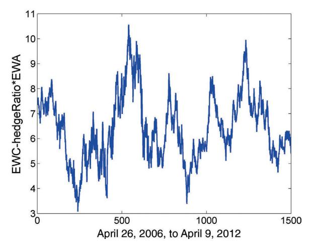

# 제2장: 평균 회귀의 기초 — 쉬운 해설판

> 이 글은 Ernest Chan의 "Algorithmic Trading" 제2장의 전체 내용을 빠짐없이 담되, 전문 용어와 개념을 일상적인 비유와 풀어쓴 설명으로 재구성한 해설판입니다.

---

## 들어가며 — 세상은 평균으로 돌아오려 한다

여러분, 한 가지 실험을 상상해 봅시다. **고무줄** 하나를 가져다가 양손으로 잡고, 한쪽을 쭉 잡아당겨 보세요. 손을 놓으면 어떻게 되나요? 당연히 원래 길이로 "탁" 하고 돌아옵니다. 이것이 바로 이 장의 핵심 주제인 **평균 회귀(mean reversion)**의 본질입니다. 가격이 평균에서 멀어지면, 마치 고무줄이 늘어났다가 돌아오듯, 다시 평균 쪽으로 되돌아오려는 힘이 작용한다는 것이죠.

우리가 인식하든 못하든, 자연은 평균 회귀의 예로 가득 차 있습니다. 그림 2.1은 서기 622년부터 1284년까지의 나일강 수위를 보여주는데, 이것은 명백히 평균 회귀하는 시계열입니다. 가뭄이 오면 수위가 떨어지지만 결국 다시 올라가고, 홍수가 나면 수위가 치솟지만 결국 다시 내려옵니다. **중심값 주위를 오르락내리락하는 줄넘기의 줄**처럼 말이죠.

평균 회귀는 사회과학에서도 마찬가지로 널리 퍼져 있습니다. 노벨 경제학상 수상자인 다니엘 카너먼(Daniel Kahneman)이 인용한 유명한 예가 있습니다. 바로 **"스포츠 일러스트레이티드 징크스(Sports Illustrated jinx)"**라는 것인데요, "잡지 표지에 사진이 실린 운동선수는 다음 시즌에 저조한 성적을 낼 운명"이라는 주장입니다(Kahneman, 2011).

왜 이런 일이 벌어질까요? 초자연적인 저주 같은 게 아닙니다. 과학적 이유는 간단합니다. 운동선수의 성적은 평균을 중심으로 무작위로 분포한다고 볼 수 있습니다. 어느 해에 *예외적으로* 좋은 성적을 거두면 — 그래서 잡지 표지에 실릴 정도가 되면 — 그 다음 해에는 평균에 더 가까운 성적을 낼 가능성이 매우 높습니다. 이건 저주가 아니라 **통계적 필연**인 셈이죠.


**그림 2.1** 나일강의 최저 수위, 서기 622-1284년

> 비유하자면: 나일강의 수위는 마치 **줄넘기의 줄** 같습니다. 위아래로 출렁이지만, 줄의 중심축은 항상 거의 같은 높이에 있죠. 이것이 바로 평균 회귀의 시각적 이미지입니다.

---

### 금융 시장에서도 평균 회귀가 있을까?

자, 그렇다면 여러분이 정말 궁금한 질문으로 가봅시다. **평균 회귀가 금융 가격 시계열에서도 널리 퍼져 있을까요?**

만약 그렇다면, 트레이더로서 우리의 삶은 매우 단순하고 수익성 있을 것입니다! 해야 할 일이라곤:

1. 가격이 평균보다 **낮을 때 매수**한다
2. 평균 가격으로 **회귀할 때까지 기다린다**
3. 이 더 높은 가격에 **매도**한다
4. 이것을 하루 종일 반복한다

꿈같은 이야기죠? 아쉽게도 현실은 그렇게 녹록하지 않습니다.

**대부분의 가격 시계열은 평균 회귀하지 않습니다.** 대부분은 **기하 랜덤 워크(geometric random walk)**를 따릅니다. 이게 뭐냐고요? 술 취한 사람이 길을 걷는 것을 상상해 보세요. 다음 발걸음이 오른쪽일지 왼쪽일지 전혀 예측할 수 없죠. 주가도 비슷합니다 — 다음에 오를지 내릴지 전혀 알 수 없는 경우가 대부분이란 뜻입니다.

좀 더 정확히 말하면, 가격이 아닌 *수익률*이 보통 0의 평균을 중심으로 무작위 분포합니다. 안타깝게도 수익률의 평균 회귀를 직접 거래할 수는 없습니다.

> 잠깐, 헷갈리기 쉬운 포인트! **수익률의 역직렬상관(anti-serial-correlation)**과 **수익률의 평균 회귀**를 혼동해서는 안 됩니다. 수익률의 역직렬상관은 확실히 거래할 수 있는데, 이것은 사실 **가격의 평균 회귀**와 같은 것입니다. 헷갈리시죠? 핵심은 이것입니다: 우리가 거래할 수 있는 것은 **가격**의 평균 회귀이지, 수익률 자체의 평균 회귀가 아니라는 점입니다.

평균 회귀하는 것으로 밝혀진 소수의 가격 시계열을 **정상성(stationary)**이 있다고 합니다. 이 장에서는 정상성에 대한 세 가지 통계적 검정 — **ADF 검정**, **허스트 지수**, **분산비 검정** — 을 설명합니다.

그런데 자연적으로 정상성을 가진 **미리 만들어진(prefabricated)** 가격 시계열은 그리 많지 않습니다. 여기서 *미리 만들어진*이란, 공개 거래소나 시장에서 거래되는 자산을 나타내는 가격 시계열을 의미합니다. 즉, 여러분이 주식 앱을 열어서 바로 살 수 있는 종목들의 가격 차트가 자연적으로 평균 회귀하는 경우는 드물다는 뜻이죠.

---

### 그럼 어떻게 해야 할까? — 포트폴리오를 "제조"하자!

다행히도, **우리가 직접 평균 회귀 가격 시계열을 만들 수 있습니다!**

어떻게요? 평균 회귀하지 않는 두 개 이상의 개별 가격 시계열을 적절히 결합하면, 순 시장 가치(즉, 가격)가 평균 회귀하는 포트폴리오를 만들 수 있기 때문입니다.

비유하자면, 소금과 식초는 각각 짠맛과 신맛이지만, 적절한 비율로 섞으면 맛있는 소스가 되는 것과 비슷합니다. 개별 자산은 평균 회귀하지 않지만, **적절한 비율로 결합하면** 전체 포트폴리오가 평균 회귀하게 되는 것이죠.

이렇게 결합될 수 있는 가격 시계열들을 **공적분(cointegrating)**이라고 합니다. 이 장에서는 공적분에 대한 통계적 검정(CADF 검정 및 요한센 검정)도 설명합니다. 특히 요한센 검정의 부산물로서, 평균 회귀 포트폴리오를 만들기 위한 각 자산의 **정확한 가중치**까지 결정할 수 있습니다.

이렇게 인위적으로 정상 포트폴리오를 만들 수 있는 가능성 덕분에, **평균 회귀 트레이더에게는 수많은 기회가 있습니다.**

평균 회귀 가격 시계열에서 수익을 내는 것이 얼마나 쉬운지 보여주기 위해, 진정으로 "매개변수가 없는" 간단한 선형 거래 전략도 소개합니다.

---

### 시계열 평균 회귀 vs. 횡단면 평균 회귀

한 가지 명확히 할 점이 있습니다. 이 장에서 살펴볼 평균 회귀 유형은 **시계열(time-series) 평균 회귀**입니다. 가격이 **자기 자신의 과거 가격**에 의해 결정된 평균으로 회귀한다고 가정하기 때문입니다.

쉽게 말하면: "삼성전자 주가가 과거 자기 평균으로 돌아오느냐?"를 보는 것이 시계열 평균 회귀입니다.

그런데 또 다른 종류가 있는데, **횡단면(cross-sectional) 평균 회귀**라고 합니다. 이것은 바스켓 내 상품들의 누적 수익률이 바스켓의 누적 수익률로 회귀한다는 것을 의미합니다. 다시 말해, 상품들의 단기 *상대* 수익률이 직렬 역상관되어 있다는 뜻이죠. (상품의 상대 수익률 = 해당 상품의 수익률 - 바스켓의 수익률)

쉽게 말하면: "삼성전자가 코스피 지수 대비 너무 많이 올랐으면, 다시 지수 수준으로 돌아오느냐?"를 보는 것이 횡단면 평균 회귀입니다. 이 현상은 주식 바스켓에서 가장 자주 발생하며, 제4장에서 주식과 ETF에 대한 평균 회귀 전략을 논의할 때 활용법을 다룹니다.

---

## 평균 회귀와 정상성 — 같은 동전의 양면

**왜 이 내용이 중요한가요?** 평균 회귀와 정상성은 사실 같은 현상을 바라보는 두 가지 렌즈입니다. 마치 같은 산을 남쪽에서 보면 다르게 보이고 북쪽에서 보면 또 다르게 보이는 것처럼, 두 관점은 각각 **다른 통계적 검정 도구**를 제공합니다.

### 관점 1: 평균 회귀 — "다음에 어디로 갈까?"

**평균 회귀(mean reversion)** 가격 시계열의 수학적 설명은 이렇습니다:

> 다음 기간의 가격 변화가 **평균 가격과 현재 가격의 차이**에 비례한다.

고무줄 비유로 돌아가면: 고무줄을 많이 늘릴수록(= 가격이 평균에서 많이 벗어날수록) 돌아오려는 힘이 세지는 것과 같습니다. 이것이 **ADF 검정**의 기초가 되며, "비례 상수가 0이다"라는 귀무가설을 기각할 수 있는지 테스트합니다. 비례 상수가 0이라는 것은 "돌아오려는 힘이 전혀 없다"는 뜻이니, 이를 기각해야 평균 회귀가 존재한다고 말할 수 있겠죠.

### 관점 2: 정상성 — "얼마나 빨리 퍼져나가나?"

**정상(stationary)** 가격 시계열의 수학적 설명은 이렇습니다:

> 가격의 로그의 **분산**이 기하 랜덤 워크보다 **느리게** 증가한다.

무슨 말인지 모르겠다고요? 잉크 한 방울을 물에 떨어뜨리는 것을 상상해 보세요.

- **랜덤 워크**: 잉크가 시간에 비례해서 퍼져나갑니다. 10분 지나면 10만큼, 20분 지나면 20만큼 퍼지죠.
- **정상 시계열**: 잉크가 퍼져나가긴 하지만, 점점 느려집니다. 마치 어떤 보이지 않는 벽이 있어서 너무 멀리 퍼지지 못하게 막는 것처럼요.

수학적으로, 분산은 기하 랜덤 워크의 경우처럼 시간의 선형 함수가 아니라 시간의 **부분선형(sublinear) 함수**입니다. 이 부분선형 함수는 일반적으로 다음과 같이 근사됩니다:

$$\tau^{2H}$$

여기서:
- $\tau$ = 두 가격 측정 사이의 시간 간격
- $H$ = **허스트 지수(Hurst exponent)**

핵심 규칙:
- 가격 시계열이 실제로 **정상**이면 $H < 0.5$
- 가격 시계열이 **기하 랜덤 워크**이면 $H = 0.5$
- 가격 시계열이 **추세**를 보이면 $H > 0.5$

**분산비 검정(Variance Ratio test)**은 허스트 지수가 실제로 0.5라는 귀무가설을 기각할 수 있는지 확인하는 데 사용합니다.

> 주의할 점! **정상성(stationarity)**이라는 이름은 약간 오해의 소지가 있습니다. 가격이 반드시 범위 제한되어 있고 분산이 시간에 독립적이라는 것을 의미하지 **않습니다**. 단지 분산이 정상 확산(랜덤 워크)보다 **느리게** 증가한다는 것을 의미할 뿐입니다. 줄넘기의 줄처럼 움직이되, 줄의 진폭이 시간이 지나면서 조금씩 커질 수는 있지만, "술 취한 사람의 걸음"만큼 빠르게 커지지는 않는다는 뜻입니다.

ADF 및 분산비 검정에 대한 명확한 수학적 설명은 월터 베케르트(Walter Beckert)의 강의 노트에서 찾을 수 있습니다(Beckert, 2011). 여기서는 실용적인 거래 전략에 대한 적용에만 집중합니다.

---

## 확장 디키-풀러 검정 (Augmented Dickey-Fuller Test) — "정말 평균으로 돌아오는 힘이 있는가?"

**왜 이 내용이 중요한가요?** ADF 검정은 여러분이 관심 있는 가격 시계열에 "고무줄 효과"가 진짜로 존재하는지를 통계적으로 검증하는 **첫 번째 관문**입니다.

가격 시계열이 평균 회귀하면, 현재 가격 수준이 다음 움직임에 대해 힌트를 줍니다:
- 가격이 평균보다 **높으면** -> 다음 움직임은 **하락**할 것이다
- 가격이 평균보다 **낮으면** -> 다음 움직임은 **상승**할 것이다

이것은 마치 **스프링**과 같습니다. 스프링을 누르면 다시 튀어오르고, 스프링을 늘이면 다시 줄어들죠. ADF 검정은 바로 이 "스프링 효과"가 통계적으로 유의미한지를 테스트합니다.

### ADF 검정의 수학적 기초

가격 변화를 다음과 같은 선형 모델로 설명할 수 있습니다:

$$\Delta y(t) = \lambda y(t-1) + \mu + \beta t + \alpha_1 \Delta y(t-1) + \dots + \alpha_k \Delta y(t-k) + \epsilon_t \qquad (2.1)$$

여기서 $\Delta y(t) \equiv y(t) - y(t - 1)$이고, $\Delta y(t - 1) \equiv y(t - 1) - y(t - 2)$ 등입니다.

이 공식이 복잡해 보이시죠? 한 조각씩 뜯어봅시다:

| 요소 | 의미 | 비유 |
|------|------|------|
| $\Delta y(t)$ | 오늘의 가격 변화 | "오늘 얼마나 움직였나?" |
| $\lambda y(t-1)$ | **핵심!** 어제 가격 수준이 오늘 변화에 미치는 영향 | 고무줄의 복원력 |
| $\mu$ | 상수 오프셋 | 평균 가격의 위치 |
| $\beta t$ | 시간 추세 | 장기적 상승/하락 경향 |
| $\alpha_k \Delta y(t-k)$ | 과거 가격 변화들의 영향 | 관성/모멘텀 효과 |
| $\epsilon_t$ | 랜덤 노이즈 | 예측 불가능한 충격 |

**ADF 검정의 핵심 질문**: $\lambda = 0$인가?

- 만약 $\lambda = 0$이라는 가설이 **기각**된다면 -> 다음 움직임 $\Delta y(t)$가 현재 수준 $y(t-1)$에 **의존**한다 -> 랜덤 워크가 아니다 -> **고무줄 효과가 있다!**
- 만약 기각할 수 **없다면** -> 현재 가격 수준이 다음 움직임에 대해 아무것도 알려주지 않는다 -> 랜덤 워크일 수 있다

검정 통계량은 회귀 계수 $\lambda$를 회귀 적합의 표준 오차로 나눈 것입니다: $\lambda/\text{SE}(\lambda)$.

통계학자 디키와 풀러(Dickey and Fuller)가 이 검정 통계량의 분포를 찾아 임계값을 표로 만들어 두었습니다. 덕분에 어떤 $\lambda/\text{SE}(\lambda)$ 값에 대해서도 가설이 예를 들어 90%, 95%, 99% 확률 수준에서 기각될 수 있는지 찾아볼 수 있습니다.

**중요 포인트:**
- 평균 회귀를 기대하므로 $\lambda/\text{SE}(\lambda)$는 **음수**여야 합니다 (가격이 평균에서 벗어나면 되돌아오는 방향으로 움직여야 하니까요)
- 가설이 기각되려면 이 값이 임계값보다 **더 음수**(더 왼쪽)여야 합니다
- 임계값은 표본 크기와 시계열의 특성(0이 아닌 평균 $-\mu/\lambda$을 가지는지, 일정한 추세 $-\beta t/\lambda$를 가지는지)에 따라 달라집니다

실제 거래에서 가격의 일정한 추세가 있더라도 일일 가격 변동보다 훨씬 작은 규모인 경향이 있으므로, 단순화를 위해 추세 항을 0으로 가정합니다($\beta = 0$).

---

### 예제 2.1: 평균 회귀에 ADF 검정 사용하기

**실습 대상**: USD.CAD 통화 환율 (1 미국 달러와 교환되는 캐나다 달러 수)

ADF 검정은 MATLAB Econometrics 함수 *adftest*로 사용 가능하거나, 오픈 소스 MATLAB 패키지 spatial-econometrics.com의 *adf* 함수로 사용 가능합니다. 아래에서는 *adf*를 사용하며, 코드는 [http://epchan.com/book2](http://epchan.com/book2)에서 *stationarityTests.m*으로 다운로드할 수 있습니다. (spatial-econometrics.com의 jplv7 폴더를 컴퓨터에 다운로드한 후, 모든 하위 폴더를 MATLAB 경로에 추가하는 것을 잊지 마세요.)

*adf* 함수의 세 가지 입력:

| 입력 | 설명 |
|------|------|
| **첫 번째** | 시간 오름차순으로 된 가격 시계열 (시간 순서가 중요!) |
| **두 번째** | 오프셋 $\mu$와 추세 $\beta$ 관련 설정 (여기서는 0으로 설정) |
| **세 번째** | 시차(lag) $k$ |

두 번째 매개변수를 0으로 설정하는 이유:
- 가격이 회귀하는 평균 가격이 0인 경우는 드물므로 오프셋 $\mu$는 0이 아니라고 가정
- 가격의 일정한 추세는 일일 변동보다 훨씬 작으므로 추세 $\beta$는 0이라고 가정

세 번째 입력인 시차 $k$는 0으로 시작해 볼 수 있지만, 종종 $k = 1$로 설정해야만 귀무가설을 기각할 수 있는데, 이는 **가격 변화가 종종 직렬 상관관계를 가지기 때문**입니다.

데이터 파일은 1분봉이지만, 17:00 ET의 장 마감 가격만 추출합니다. 일중 빈도로 데이터를 샘플링해도 ADF 검정의 통계적 유의성은 증가하지 않습니다.


**그림 2.2** USD.CAD 가격 시계열

그림 2.2를 보면, 이 시계열은 눈으로 봐도 그다지 정상적으로 보이지 않습니다. 줄넘기 줄이라기보다는 술 취한 사람의 걸음 같죠.

```matlab
results=adf(y, 0, 1);
prt(results);
% Augmented DF test for unit root variable: variable 1
% ADF t-statistic # of lags AR(1) estimate
% -1.840744 1 0.994120
%
% 1% Crit Value 5% Crit Value 10% Crit Value
% -3.458 -2.871 -2.594
```

**결과 해석:**

- ADF 검정 통계량 = **-1.84**
- 90% 수준의 임계값 = **-2.594**

$-1.84$는 $-2.594$보다 **덜 음수**입니다. 즉, 임계값을 넘지 못했습니다. 따라서 $\lambda$가 0이라는 가설을 **기각할 수 없습니다.**

쉽게 말하면: "USD.CAD에 고무줄 효과가 있다"고 통계적으로 확신할 수 없다는 뜻입니다.

이것은 놀라운 결과가 아닐 수 있습니다. 캐나다 달러는 원자재 통화로 알려져 있고 미국 달러는 그렇지 않기 때문에, 두 통화의 교환 비율이 어떤 고정된 평균으로 돌아올 이유가 딱히 없는 것이죠.

그러나 $\lambda$가 **음수**라는 점은 주목할 만합니다. 이는 가격 시계열이 적어도 추세를 보이지는 않는다(= 일방적으로 올라가거나 내려가지는 않는다)는 것을 나타냅니다.

---

## 허스트 지수와 분산비 검정 — "얼마나 빨리 퍼지는가?"

**왜 이 내용이 중요한가요?** ADF 검정이 "고무줄 효과가 있는가?"를 물었다면, 허스트 지수는 **"이 시계열이 랜덤 워크보다 느리게 퍼지는가?"**를 물어봅니다. 같은 질문을 다른 각도에서 하는 것이죠.

직관적으로 말하면, **정상(stationary)** 가격 시계열은 가격이 초기 값에서 기하 랜덤 워크보다 **더 느리게** 확산된다는 것을 의미합니다.

잉크 방울 비유를 다시 꺼내볼까요? 잉크가 물에서 퍼져나가는 속도, 즉 확산 속도를 **분산**으로 측정합니다:

$$\text{Var}(\tau) = \langle |z(t+\tau) - z(t)|^2 \rangle \qquad (2.2)$$

여기서:
- $z$ = 로그 가격 ($z = \log(y)$)
- $\tau$ = 임의의 시간 지연 (1일, 5일, 20일 등)
- $\langle \dots \rangle$ = 모든 시점 $t$에 대한 평균

### 세 가지 시나리오

**시나리오 1: 기하 랜덤 워크** (술 취한 사람의 걸음)

$$\langle |z(t+\tau) - z(t)|^2 \rangle \sim \tau \qquad (2.3)$$

분산이 시간에 **비례**합니다. 10일이 지나면 분산이 10배, 100일이 지나면 100배. $\sim$ 기호는 이 관계가 큰 $\tau$에 대해 비례 상수와 함께 등식이 되지만, 작은 $\tau$에서는 직선에서 벗어날 수 있음을 의미합니다.

**시나리오 2: 평균 회귀** 또는 **추세** (고무줄 효과 또는 관성 효과)

(로그) 가격 시계열이 평균 회귀하거나 추세를 보인다면, 식 2.3은 성립하지 않습니다. 대신:

$$\langle |z(t+\tau) - z(t)|^2 \rangle \sim \tau^{2H} \qquad (2.4)$$

여기서 $H$가 바로 **허스트 지수(Hurst exponent)**입니다!

### 허스트 지수의 해석 — 세 줄 요약

| $H$의 값 | 의미 | 비유 |
|----------|------|------|
| $H = 0.5$ | 기하 랜덤 워크 | 술 취한 사람 — 다음 방향 예측 불가 |
| $H < 0.5$ | **평균 회귀** | **고무줄** — 멀어지면 돌아오는 힘 |
| $H > 0.5$ | **추세** | **눈덩이** — 한 방향으로 계속 굴러감 |

$H$가 0에 가까울수록 평균 회귀가 강하고, 1에 가까울수록 추세가 강합니다. 따라서 $H$는 평균 회귀 또는 추세 **정도의 지표** 역할도 합니다.

---

### 예제 2.2: 허스트 지수 계산하기

이전 예제와 동일한 USD.CAD 가격 시계열을 사용합니다. MATLAB Central(www.mathworks.com/matlabcentral/fileexchange/30076-generalized-hurst-exponent)에서 다운로드할 수 있는 *genhurst* 함수를 사용해 허스트 지수를 계산합니다.

이 함수는 일반화된 버전의 허스트 지수를 계산합니다:

$$\langle |z(t+\tau)-z(t)|^{2q} \rangle \sim \tau^{2H(q)}$$

여기서 $q$는 임의의 숫자인데, 우리는 $q=2$에만 관심이 있으므로 이를 *genhurst*의 두 번째 입력 매개변수로 지정합니다.

```matlab
H=genhurst(log(y), 2);
```

**결과**: $H = 0.49$

이 결과를 어떻게 해석할까요? $H$가 0.5보다 살짝 작습니다. 이는 "약하게 평균 회귀할 수 있음"을 나타냅니다. 하지만 0.5에서 0.01밖에 차이 나지 않으니, **정말 의미가 있는 차이인지** 확인해야 합니다.

---

### 통계적 유의성 — 정말 의미 있는 차이인가?

유한한 표본 크기 때문에, $H$가 실제로 0.5라는 귀무가설을 기각할 수 있는지 확인하기 위해 추정된 $H$ 값의 **통계적 유의성**을 알아야 합니다.

동전 던지기를 생각해 보세요. 100번 던져서 앞면이 49번 나왔다고 해서 "이 동전은 뒷면이 더 잘 나온다"라고 결론 내릴 수 없겠죠? 1번의 차이는 그냥 우연일 수 있으니까요. 마찬가지로, $H = 0.49$도 단순히 표본 오차일 수 있습니다.

이 가설 검정은 **분산비 검정(Variance Ratio test)**에 의해 제공됩니다(Lo and MacKinlay, 2001).

분산비 검정은 단순히 다음이 **1과 같은지** 검정합니다:

$$\frac{\text{Var}(z(t)-z(t-\tau))}{\tau \text{Var}(z(t)-z(t-1))}$$

이 비율의 의미를 풀어보면:
- **분자**: $\tau$일 간격의 분산
- **분모**: 1일 간격의 분산 $\times$ $\tau$

만약 랜덤 워크라면, $\tau$일 간격의 분산은 정확히 1일 분산의 $\tau$배여야 합니다. 따라서 이 비율은 **정확히 1**이 됩니다. 평균 회귀라면 분산이 더 느리게 증가하므로 이 비율은 **1보다 작을** 것입니다.

---

### 예제 2.3: 정상성을 위한 분산비 검정 사용하기

MATLAB Econometric Toolbox의 *vratiotest*를 동일한 USD.CAD 가격 시계열 *y*에 적용합니다.

```matlab
[h,pValue]=vratiotest(log(y));
```

**출력 해석:**

| 출력 | 값 | 의미 |
|------|------|------|
| $h$ | 0 | 랜덤 워크 가설을 기각할 수 **없음** |
| *pValue* | 0.367281 | 랜덤 워크일 확률이 약 37% |

$h = 1$이면 90% 신뢰 수준에서 랜덤 워크 가설이 기각된다는 뜻이고, $h = 0$이면 기각할 수 없다는 뜻입니다. *pValue*는 귀무가설(랜덤 워크)이 참일 확률을 제공합니다.

USD.CAD의 경우 *pValue*가 0.37이므로, "이 시계열이 랜덤 워크가 아니다"라고 확신할 수 없습니다. 37%라는 확률은 "우연히 이런 결과가 나왔을 수 있다"는 뜻이니까요.

> 정리하면: ADF 검정, 허스트 지수, 분산비 검정 세 가지 모두 USD.CAD가 정상이라는 강한 증거를 제공하지 못했습니다. 하지만 포기하기엔 이릅니다! 다음 섹션에서 또 다른 유용한 도구를 소개합니다.

---

## 평균 회귀의 반감기 — "돌아오는 데 얼마나 걸리는가?"

**왜 이 내용이 중요한가요?** 실제 트레이딩에서는 "90% 확실성"이라는 엄격한 기준을 충족하지 못해도 돈을 벌 수 있습니다. 이 섹션은 "정상성 검정을 통과하지 못했더라도, 거래할 가치가 있는지 판단하는 실용적 기준"을 제공합니다.

정상성 검정(ADF, 분산비)은 최소 90%의 확실성을 요구하기 때문에 매우 까다롭습니다. 하지만 실제 거래에서는 **훨씬 낮은 확실성으로도 종종 수익**을 낼 수 있습니다.

핵심 아이디어: 식 2.1의 $\lambda$ 계수를 다른 방식으로 해석하면, ADF 검정에서 90% 확률로 귀무가설을 기각할 수 없더라도, **거래 전략을 실용적으로 만들기에 충분히 음수인지** 판단할 수 있습니다.

### 오른스타인-울렌벡 공식 — 고무줄의 수학

식 2.1에서 추세($\beta t$)와 지연 차분($\Delta y(t-1), \dots, \Delta y(t-k)$)을 무시하고, 이산 형태를 미분 형태로 변환하면 다음과 같은 공식을 얻습니다:

$$dy(t) = (\lambda y(t-1) + \mu)dt + d\varepsilon \qquad (2.5)$$

여기서 $d\varepsilon$는 **가우시안 노이즈**(랜덤한 충격)입니다. 이 공식은 확률 미적분학에서 평균 회귀 과정에 대한 **오른스타인-울렌벡(Ornstein-Uhlenbeck) 공식**으로 알려져 있습니다.

이산 형태(식 2.1)에서 $\Delta y(t)$를 $y(t-1)$에 대해 선형 회귀하면 $\lambda$를 구할 수 있습니다. 미분 형태로 쓰는 것의 장점은 $y(t)$의 기댓값에 대한 **해석적 해(닫힌 형태의 해)**를 구할 수 있다는 것입니다:

$$E(y(t)) = y_0 \exp(\lambda t) - \frac{\mu}{\lambda} (1 - \exp(\lambda t)) \qquad (2.6)$$

### 반감기의 의미 — 핵심 통찰

이 공식에서 핵심을 추출해 봅시다. 평균 회귀 과정에서 $\lambda$가 음수라는 것을 기억하면:

- 가격의 기댓값은 값 $-\mu/\lambda$로 **지수적으로 감쇠**합니다
- 이 감쇠의 **반감기**는 다음과 같습니다:

$$\text{반감기} = -\frac{\log(2)}{\lambda}$$

반감기가 무슨 뜻이냐고요? 방사성 물질의 반감기를 아시죠? 반감기가 10일이면, 가격이 평균에서 벗어난 거리의 **절반이 10일 만에 줄어든다**는 뜻입니다. 즉, "평균으로 돌아오는 속도"를 시간으로 표현한 것입니다.

### 왜 반감기가 트레이더에게 중요한가?

회귀 계수 $\lambda$와 반감기 사이의 연결은 트레이더에게 **세 가지 중요한 의미**를 가집니다:

1. **$\lambda$가 양수라면**: 가격이 전혀 평균 회귀하지 않습니다. 평균 회귀 전략으로 거래하려고 **시도조차 하지 마세요.**

2. **$\lambda$가 0에 매우 가까우면**: 반감기가 매우 길어서 평균 회귀 거래 전략이 그다지 수익성이 없습니다. 주어진 기간에 **많은 왕복 거래를 완료할 수 없기** 때문입니다. (1년에 2~3번밖에 거래 기회가 안 온다면 비효율적이겠죠?)

3. **$\lambda$가 충분히 음수이면**: 반감기가 전략의 많은 매개변수에 대한 **자연스러운 시간 척도**를 결정합니다. 예를 들어, 반감기가 20일이면 이동 평균이나 표준 편차를 계산할 때 **5일의 룩백(look-back)을 사용해서는 안 됩니다.** 종종 룩백을 반감기의 작은 배수로 설정하는 것이 최적에 가까우며, 이렇게 하면 자유 매개변수의 무차별 최적화를 피할 수 있습니다.

> 핵심 비유: 반감기는 **고무줄의 강도**를 시간으로 변환한 것입니다. 고무줄이 세면(반감기가 짧으면) 빨리 돌아오고, 고무줄이 약하면(반감기가 길면) 천천히 돌아옵니다.

---

### 예제 2.4: 평균 회귀의 반감기 계산하기

이전 예제에서 USD.CAD 가격 시계열이 최소 90% 확률로 정상이 **아니라고** 결론지었습니다. 하지만 이것이 반드시 평균 회귀 모델을 사용한 거래를 **포기해야 한다**는 것을 의미하지는 않습니다. 대부분의 수익성 있는 거래 전략은 그렇게 높은 수준의 확실성을 요구하지 않기 때문입니다.

USD.CAD가 평균 회귀 거래에 적합한 후보인지 결정하기 위해 반감기를 구해봅시다.

식 2.1과 2.5에서 $\lambda$를 결정하기 위해 $y(t) - y(t-1)$을 종속 변수로, $y(t-1)$을 독립 변수로 하여 회귀 적합을 실행합니다. 회귀 함수 *ols*와 함수 *lag*는 모두 jplv7 패키지의 일부입니다. (이를 위해 MATLAB Statistics Toolbox *regress* 함수도 사용할 수 있습니다.)

#### 예제 2.4 (계속)

이 코드 조각은 *stationaryTests.m*의 일부입니다.

```matlab
ylag=lag(y, 1); % lag is a function in the jplv7 (spatial-econometrics.com) package.
deltaY=y-ylag;
deltaY(1)=[]; % Regression functions cannot handle the NaN in the first bar of the time series.
ylag(1)=[];
regress_results=ols(deltaY, [ylag ones(size(ylag))]);
halflife=-log(2)/regress_results.beta(1);
```

**결과: 약 115일**

이것이 무엇을 의미할까요? USD.CAD 가격이 평균에서 벗어나면, 그 거리의 절반이 줄어드는 데 약 **115일**(약 4개월)이 걸린다는 뜻입니다.

거래 기간에 따라 이것이 너무 길 수도 있고 아닐 수도 있습니다. 단기 트레이더에게는 너무 길겠지만, 스윙 트레이더나 장기 투자자에게는 관리 가능할 수 있겠죠. 적어도 어떤 룩백을 사용해야 하고 어떤 보유 기간을 기대해야 하는지 **사전에 알게 됩니다.**

---

## 선형 평균 회귀 거래 전략 — "고무줄로 돈 벌기"

**왜 이 내용이 중요한가요?** 이 섹션은 평균 회귀를 실제 거래 전략으로 구현하는 가장 단순한 형태를 보여줍니다. 놀라울 정도로 간단하면서도, 평균 회귀의 힘을 증명합니다.

가격 시계열이 평균 회귀하고, 반감기가 충분히 짧다고 판단했다면, 다음과 같은 간단한 선형 전략으로 수익을 낼 수 있습니다:

1. 가격의 **이동 평균**에서 **정규화된 편차**(= Z-점수)를 계산한다
2. 이 Z-점수에 **음의 비례**로 자산 단위 수를 유지한다

Z-점수란 무엇일까요? 간단합니다:

$$Z = \frac{\text{현재 가격} - \text{이동 평균}}{\text{이동 표준편차}}$$

- Z-점수가 **+2**이면 -> 가격이 평균보다 표준편차의 2배만큼 **높다** -> **숏(매도)** 포지션을 잡는다
- Z-점수가 **-2**이면 -> 가격이 평균보다 표준편차의 2배만큼 **낮다** -> **롱(매수)** 포지션을 잡는다
- Z-점수가 **0**이면 -> 가격이 평균 근처에 있다 -> **포지션 없음**

이동 평균과 표준 편차의 **룩백은 반감기와 같게** 설정합니다. 이것이 아름다운 점입니다 — 최적화할 매개변수가 사실상 없습니다!

### 왜 이동 평균과 표준편차를 사용하는가?

여러분이 궁금할 수 있습니다: "가격 시계열이 정상이면 평균과 표준 편차가 영원히 고정되어야 하지 않나?"

좋은 질문입니다! 이론적으로는 그렇지만, 현실에서는:

- **평균**: 경제나 기업 경영의 변화로 인해 **천천히 변할 수** 있습니다
- **표준 편차**: 식 2.4에서 볼 수 있듯이, $0 < H < 0.5$인 "정상" 가격 시계열조차도 시간에 따라 증가하는 분산을 가집니다 (기하 랜덤 워크만큼 빠르지는 않지만)

따라서 항상 진화하는 평균과 표준 편차에 적응하고, 더 빠르게 수익을 포착하기 위해 **이동** 평균과 표준 편차를 사용하는 것이 적절합니다. 이 점은 제3장에서 특히 "스케일링 인(scaling-in)"의 맥락에서 더 깊이 탐구합니다.

---

### 예제 2.5: 선형 평균 회귀 거래 전략 백테스팅하기

이 전략에서 USD.CAD의 이동 평균에서 **음의 정규화된 편차**와 같은 수의 USD.CAD 단위를 보유합니다. 통화쌍 USD.X의 한 단위의 시장 가치(USD 기준)는 USD.X 시세에 불과하므로, 이 경우 선형 평균 회귀는 포트폴리오의 시장 가치를 USD.CAD의 Z-점수의 음수로 설정하는 것과 같습니다. *movingAvg* 및 *movingStd* 함수는 저자의 웹사이트에서 다운로드할 수 있습니다. (이 코드 조각은 *stationaryTests.m*의 일부입니다.)

```matlab
lookback=round(halflife); % setting lookback to the halflife found above
mktVal=-(y-movingAvg(y, lookback))./movingStd(y, lookback);
pnl=lag(mktVal, 1).*(y-lag(y, 1))./lag(y, 1); % daily P&L of the strategy
```

코드를 한 줄씩 풀어보면:
- **1줄**: 룩백을 위에서 구한 반감기(115일)로 설정
- **2줄**: Z-점수의 음수 = 시장 가치 (Z가 양수면 숏, Z가 음수면 롱)
- **3줄**: 어제의 포지션 x 오늘의 수익률 = 오늘의 손익

이 전략의 누적 손익(P&L)은 그림 2.3에 표시되어 있습니다.


**그림 2.3** AUDCAD에 대한 선형 거래 전략의 자산 곡선

**결과 해석:**

긴 반감기(115일)에도 불구하고, 총 손익은 **양수**를 유지합니다. 다만 큰 드로다운이 있습니다.

**중요한 주의사항들:**

- **거래 비용 미포함**: 이 책의 대부분의 예제처럼 거래 비용은 포함하지 않았습니다
- **미래 예측 편향(look-ahead bias)**: 인샘플 데이터를 사용하여 반감기와 룩백을 찾았으므로, 실제로는 이 성과를 재현하지 못할 수 있습니다
- **무제한 자본 가정**: 포트폴리오의 시장 가치에 최대치를 부과하지 않았으므로, 손익을 생성하기 위해 무제한의 자본이 필요할 수 있습니다

따라서 이것을 실용적인 거래 전략으로 **추천하지 않습니다.** (제5장에 더 실용적인 버전이 있습니다.)

하지만 이 예제가 보여주는 **두 가지 중요한 교훈**이 있습니다:
1. **비정상 가격 시계열**이라도 평균 회귀 전략을 포기할 필요가 없다
2. 평균 회귀 시계열에서 수익을 추출하기 위해 **복잡한 전략이나 기술적 지표가 필요하지 않다**

---

### 왜 정상성 검정을 먼저 하는가? — 백테스트만 하면 안 되나?

트레이더의 목표가 궁극적으로 평균 회귀 거래 전략의 기대 수익률이나 샤프 비율이 충분히 좋은지 결정하는 것이라면, 왜 정상성 검정(ADF 또는 분산비)과 반감기 계산을 거치는 수고를 해야 할까요? 거래 전략에 대해 직접 백테스트를 실행하고 끝내면 안 될까요?

이러한 예비 검정을 거치는 이유는 **통계적 유의성**의 차이에 있습니다:

| 비교 항목 | 예비 검정 (ADF, 분산비 등) | 직접 백테스트 |
|-----------|--------------------------|-------------|
| 사용하는 데이터 | 매일의(매 봉의) 가격 데이터 **전부** | 왕복 거래 횟수만큼의 데이터 포인트 |
| 데이터 포인트 수 | 매우 많음 | 상대적으로 적음 |
| 특정 전략에 의존? | **아니요** | 예 — 매개변수에 의존 |
| 통계적 유의성 | **높음** | 낮을 수 있음 |

또한, 백테스트의 결과는 특정 거래 매개변수 세트를 가진 거래 전략의 세부 사항에 의존합니다. 그러나 정상성 통계 검정을 통과한 가격 시계열, 또는 적어도 충분히 짧은 반감기를 가진 가격 시계열이 주어지면, 비록 백테스트한 것은 아니더라도 **결국 수익성 있는 거래 전략을 찾을 수 있다고 확신**할 수 있습니다.

---

## 공적분 — "따로 놀지만, 함께 움직이는 친구들"

**왜 이 내용이 중요한가요?** 대부분의 개별 가격 시계열은 정상이 아닙니다. 하지만 공적분을 이해하면, 비정상 시계열들을 결합하여 정상 포트폴리오를 "제조"할 수 있습니다. 이것이 **페어 트레이딩**과 **통계적 차익거래**의 이론적 기초입니다.

이 장의 서론에서 언급했듯이, 대부분의 금융 가격 시계열은 정상이거나 평균 회귀하지 않습니다. 하지만 다행히도 우리는 "미리 만들어진" 금융 가격 시계열만 거래하는 데 국한되지 않습니다. 포트폴리오의 시장 가치(또는 가격) 시계열이 정상이 되도록 개별 가격 시계열의 포트폴리오를 적극적으로 만들 수 있습니다!

**공적분(cointegration)**의 개념은 이것입니다: 여러 비정상 가격 시계열의 **정상 선형 결합**을 찾을 수 있다면, 이 가격 시계열들은 *공적분*이라고 합니다.

이해를 돕기 위해 **산책하는 커플** 비유를 들어봅시다:

> 남편과 아내가 각각 술에 취한 채로 집에 걸어갑니다. 각자의 걸음은 완전히 랜덤하지만(= 각각의 가격은 랜덤 워크), 이들은 **보이지 않는 끈**으로 연결되어 있어서 너무 멀어지면 다시 가까워집니다. 각자의 위치는 예측할 수 없지만, **두 사람 사이의 거리**는 항상 일정 범위 안에 머뭅니다.

가장 일반적인 결합은 **두 가격 시계열의 결합**입니다:
- 한 자산을 **매수**하면서 동시에 다른 자산을 **매도**
- 각 자산에 적절한 **자본 배분**

이것이 바로 익숙한 **페어 트레이딩(pairs trading)** 전략입니다! 그러나 공적분 개념은 **세 개 이상의 자산**으로도 쉽게 확장됩니다.

이 섹션에서는 두 가지 공적분 검정을 살펴봅니다:
- **CADF 검정**: 한 쌍의 가격 시계열에만 적합
- **요한센 검정**: 임의 개수의 시계열에 적용 가능

---

### 공적분 확장 디키-풀러 검정 (CADF) — "이 커플은 정말 같이 다니는가?"

호기심 많은 독자는 이렇게 물을 수 있습니다: "포트폴리오 가격 시계열의 정상성에 대해 ADF 검정과 분산비 검정이 이미 있는데, **왜 새로운 검정이 필요한가?**"

대답은 간단합니다: 여러 가격 시계열이 주어졌을 때, 정상 포트폴리오를 형성하기 위해 **어떤 헤지 비율을 사용해야 하는지 사전에 알지 못합니다.**

**헤지 비율(hedge ratio)**이란 무엇일까요?
- 포트폴리오에서 해당 자산을 **롱 또는 숏해야 하는 단위 수**입니다
- 자산이 주식이라면 단위 수는 **주식 수**에 해당합니다
- 음의 헤지 비율은 해당 자산을 **숏해야 함**을 나타냅니다

가격 시계열 세트가 공적분한다고 해서 *임의의* 무작위 선형 결합이 정상 포트폴리오를 형성한다는 것을 의미하지는 않습니다. 적절한 비율을 찾아야 합니다!

**CADF 검정의 접근법** (Engle and Granger, 1987):
1. 먼저 두 가격 시계열 사이에 **선형 회귀** 적합을 실행하여 **최적의 헤지 비율**을 결정
2. 이 헤지 비율을 사용하여 **포트폴리오를 형성**
3. 마지막으로 이 포트폴리오 가격 시계열에 **정상성 검정(ADF)**을 실행

편의를 위해 spatial-econometrics.com jplv7 패키지는 이 모든 단계를 한 번에 수행하는 *cadf* 함수를 제공합니다.

---

### 예제 2.6: 공적분에 CADF 검정 사용하기

**실습 대상**: ETF 쌍 — **EWA**(호주 ETF)와 **EWC**(캐나다 ETF)

ETF는 공적분 가격 시계열을 찾기 위한 **비옥한 토양**입니다. 왜일까요?

- 캐나다와 호주 경제는 모두 **원자재 기반**
- 원자재 가격이 오르면 두 나라 경제 모두 좋아지고, 내리면 모두 나빠짐
- 따라서 두 ETF의 가격은 함께 움직이는 경향이 있음 -> **공적분할 가능성이 높음!**

코드는 *cointegrationTest.m* 프로그램으로 저자의 웹사이트에서 다운로드할 수 있습니다. EWA의 가격 시계열은 배열 *x*에 포함되어 있고, EWC는 배열 *y*에 포함되어 있다고 가정합니다.


**그림 2.4** EWA 대 EWC 주가

그림 2.4를 보면, 두 시계열이 상당히 비슷한 패턴으로 움직이는 것을 볼 수 있습니다. "산책하는 커플"처럼요!


**그림 2.5** EWA 대 EWC 산점도

그림 2.5의 산점도는 더욱 설득력 있습니다 — 가격 쌍이 **거의 직선 위에** 떨어집니다. 이는 두 변수 사이에 강한 선형 관계가 있다는 증거입니다.

jplv7 패키지의 *ols* 함수를 사용하여 **최적의 헤지 비율**을 찾습니다:

```matlab
regression_result=ols(y, [x ones(size(x))]);
hedgeRatio=regression_result.beta(1);
```

예상대로, 그림 2.6의 잔차 (EWC - hedgeRatio x EWA) 플롯은 매우 정상적으로 보입니다. 마치 줄넘기 줄처럼 중심선 주위를 오르내리죠!



**그림 2.6** EWA 대 EWC 간 선형 회귀 잔차의 정상성

### CADF 검정 실행

검정을 위해 jplv7 패키지의 *cadf* 함수를 사용합니다. 두 번째 가격 시계열에 대한 추가 입력 외에 입력은 *adf* 함수와 동일합니다. 다시 페어 포트폴리오의 가격 시계열에 0이 아닌 오프셋이 있을 수 있지만 추세는 0이라고 가정합니다.

여기서 EWA를 독립 변수 *x*로, EWC를 종속 변수 *y*로 선택했습니다.

> **중요 주의사항**: EWA와 EWC의 역할을 바꾸면 CADF 검정 결과가 **달라질 수 있습니다!** EWC를 독립 변수로 선택하여 도출한 헤지 비율은 EWA를 독립 변수로 선택하여 도출한 것의 정확한 역수가 **아닐** 것입니다. 많은 경우(EWA-EWC의 경우는 아니지만, 나중에 요한센 검정으로 확인할 것입니다), 이러한 헤지 비율 중 **하나만이 "올바른" 것**인데, 하나의 헤지 비율만이 정상 포트폴리오로 이끈다는 의미입니다.

따라서 CADF 검정을 사용한다면, **각 변수를 독립 변수로 시도**하고 어떤 순서가 가장 좋은(가장 음수인) t-통계량을 제공하는지 확인한 다음, 그 순서를 사용하여 헤지 비율을 얻어야 합니다. 간결함을 위해 EWA가 독립 변수라고 가정하고 CADF 검정을 실행합니다.

```matlab
results=cadf(y, x, 0, 1);
% Print out results
prt(results);
% Output:
% Augmented DF test for co-integration variables:
  % variable 1,variable 2
% CADF t-statistic # of lags AR(1) estimate
% -3.64346635 1 -0.020411
%
% 1% Crit Value 5% Crit Value 10% Crit Value
% -3.880 -3.359 -3.038
% -3.880 -3.359 -3.038
```

**결과 해석:**

| 항목 | 값 |
|------|------|
| CADF 검정 통계량 | **-3.64** |
| 95% 임계값 | **-3.359** |

$-3.64$는 $-3.359$보다 **더 음수**입니다. 따라서 $\lambda$가 0이라는 귀무가설을 **기각할 수 있습니다!**

다시 말해: **EWA와 EWC는 95% 확실성으로 공적분합니다.** 이 커플은 정말로 보이지 않는 끈으로 연결되어 함께 다니고 있었던 것입니다!

---

### 요한센 검정 — "세 명 이상의 친구 그룹도 분석 가능!"

**왜 이 내용이 중요한가요?** CADF 검정은 두 개의 가격 시계열만 다룰 수 있습니다. 하지만 세 개, 네 개, 혹은 더 많은 자산으로 포트폴리오를 구성하고 싶다면? 요한센 검정이 바로 그 답입니다.

두 개 이상의 변수에 대한 공적분을 검정하려면 **요한센 검정(Johansen test)**을 사용해야 합니다.

이 검정을 이해하기 위해 식 2.1을 **벡터/행렬 형태**로 일반화합시다. 가격 변수 $y(t)$가 여러 가격 시계열을 나타내는 **벡터**이고, 계수 $\Lambda$와 $A$가 **행렬**인 경우입니다. (정상 포트폴리오 가격에 일정한 추세를 허용하는 것이 실용적이지 않다고 생각하므로, 단순화를 위해 $\beta t = 0$을 가정합니다.)

$$\Delta Y(t) = \Lambda Y(t-1) + M + A_1 \Delta Y(t-1) + \dots + A_k \Delta Y(t-k) + \epsilon_t \qquad (2.7)$$

단변량 경우와 마찬가지로:
- $\Lambda = 0$이면 -> 공적분이 없습니다 ($Y$의 다음 움직임이 현재 가격 수준에 의존하지 않으면 평균 회귀가 있을 수 없다는 것을 상기하세요.)

$\Lambda$의 **랭크(rank)**를 $r$로, 가격 시계열의 수를 $n$으로 표기합시다.

> **랭크**란? 선형대수에서 행렬의 "실질적인 차원 수"를 나타냅니다. 쉽게 말하면, "이 행렬 안에 진짜 독립적인 정보가 몇 개인가?"를 알려주는 숫자입니다.

공적분 가격 시계열의 다양한 선형 결합으로 형성될 수 있는 **독립 포트폴리오의 수**는 $r$과 같습니다.

요한센 검정은 $\Lambda$의 **고유벡터 분해**에 기반한 두 가지 방법으로 $r$을 계산합니다:
- **트레이스 통계량(trace statistic)**
- **아이겐 통계량(eigen statistic)**

(좋은 설명은 Sorensen, 2005에서 찾을 수 있습니다.)

정확히 무엇인지 걱정할 필요는 없습니다. jplv7 패키지가 각 통계량에 대한 임계값을 제공하여 다음 귀무가설들을 검정합니다:
- $r = 0$ (공적분 관계 없음)
- $r \le 1$
- ...
- $r \le n - 1$

이러한 가설이 모두 기각되면 분명히 $r = n$입니다.

**보너스**: 유용한 부산물로, 발견된 **고유벡터**를 정상 포트폴리오를 형성하기 위한 개별 가격 시계열의 **헤지 비율**로 사용할 수 있습니다!

---

### 예제 2.7: 공적분에 요한센 검정 사용하기

**1단계: EWA-EWC 쌍에 요한센 검정 적용**

예제 2.6에서 사용한 EWA 및 EWC 가격 시계열을 가져와 요한센 검정을 적용합니다.

*johansen* 함수의 세 가지 입력:

| 입력 | 설명 | 설정값 |
|------|------|--------|
| $y$ | 각 열이 하나의 가격 시계열인 입력 행렬 | [EWC, EWA] |
| $p$ | 오프셋/추세 설정 | 0 (상수 오프셋 허용, 추세는 0) |
| $k$ | 시차 수 | 1 |

(이 코드 조각은 *cointegrationTests.m*의 일부입니다.)

```matlab
% Combine the two time series into a matrix y2 for input
 % into Johansen test
y2=[y, x];
results=johansen(y2, 0, 1);
% Print out results
prt(results);
% Output: Johansen MLE estimates
% NULL: Trace Statistic Crit 90% Crit 95% Crit 99%
% r <= 0 variable 1 19.983 13.429 15.494 19.935
% r <= 1 variable 2 3.983 2.705 3.841 6.635
% NULL: Eigen Statistic Crit 90% Crit 95% Crit 99%
% r <= 0 variable 1 16.000 12.297 14.264 18.520
% r <= 1 variable 2 3.983 2.705 3.841 6.635
```

**결과 해석:**

| 검정 | $r = 0$ 기각? | $r \le 1$ 기각? | 결론 |
|------|-------------|---------------|------|
| **트레이스** | 99% 수준에서 기각 (19.983 > 19.935) | 95% 수준에서 기각 (3.983 > 3.841) | 공적분 관계 2개 |
| **아이겐** | 95% 수준에서 기각 (16.000 > 14.264) | 95% 수준에서 기각 (3.983 > 3.841) | 공적분 관계 2개 |

두 검정 모두에서 EWA와 EWC 사이에 **두 개의 공적분 관계**가 있다고 결론 내립니다.

### "잠깐, 두 가격 시계열인데 두 개의 공적분 관계가 있다고?"

좋은 질문입니다! EWA와 EWC 사이에 자본을 배분하여 정상 포트폴리오를 형성하는 헤지 비율이 하나뿐이지 않을까요?

실제로 그렇지 않습니다. CADF 검정을 논의할 때 **순서에 의존한다**고 지적한 것을 기억하시나요?

- EWA를 독립 변수로 사용할 때의 헤지 비율 -> 하나의 정상 포트폴리오
- EWC를 독립 변수로 사용할 때의 헤지 비율 -> 다른 정상 포트폴리오

이 두 가지 다른 헤지 비율(반드시 서로의 역수가 **아닌**)은 **두 개의 독립적인 정상 포트폴리오**를 형성할 수 있게 합니다.

**요한센 검정의 큰 장점**: 회귀를 두 번 실행할 필요 없이, **한 번 실행하면 존재하는 모든 독립적인 공적분 관계를 생성**합니다. 요한센 검정은, 다시 말해, 가격 시계열의 순서에 **독립적**입니다!

---

### 2단계: IGE를 추가하여 세 자산으로 확장

이제 포트폴리오에 또 다른 ETF를 도입합니다: 천연 자원 주식으로 구성된 **IGE**. 가격 시계열이 배열 *z*에 포함되어 있다고 가정하고, 세 가격 시계열 모두에 요한센 검정을 실행하여 이 트리오에서 얼마나 많은 공적분 관계를 찾을 수 있는지 살펴봅시다.

```matlab
y3=[y2, z];
results=johansen(y3, 0, 1);
% Print out results
prt(results);
% Output:
% Johansen MLE estimates
% NULL: Trace Statistic Crit 90% Crit 95% Crit 99%
% r <= 0 variable 1 34.429 27.067 29.796 35.463
% r <= 1 variable 2 17.532 13.429 15.494 19.935
% r <= 2 variable 3 4.471 2.705 3.841 6.635
%
% NULL: Eigen Statistic Crit 90% Crit 95% Crit 99%
% r <= 0 variable 1 16.897 18.893 21.131 25.865
% r <= 1 variable 2 13.061 12.297 14.264 18.520
% r <= 2 variable 3 4.471 2.705 3.841 6.635
```

**결과 해석**: 트레이스 통계량과 아이겐 통계량 검정 모두 95% 확실성으로 **세 개의 공적분 관계**가 있어야 한다고 결론짓습니다.

### 3단계: 고유벡터를 사용하여 정상 포트폴리오 형성

고유값과 고유벡터는 각각 배열 *results.eig*와 *results.evec*에 포함되어 있습니다.

```matlab
results.eig % Display the eigenvalues
% ans =
%
% 0.0112
% 0.0087
% 0.0030
results.evec % Display the eigenvectors
% ans =
%
% -1.0460 -0.5797 -0.2647
% 0.7600 -0.1120 -0.0790
% 0.2233 0.5316 0.0952
```

고유벡터(*results.evec*에서 열 벡터로 표현됨)가 해당 고유값의 **내림차순**으로 정렬되어 있음에 주목하세요. 따라서 **첫 번째 공적분 관계**가 "가장 강할" 것으로 예상해야 합니다 — 즉, 평균 회귀의 반감기가 가장 짧습니다.

이것이 무엇을 의미할까요? 고유벡터의 각 요소는 해당 ETF의 **주식 수**를 나타냅니다:

| ETF | 주식 수 (첫 번째 고유벡터) |
|-----|--------------------------|
| EWC | -1.0460 (숏) |
| EWA | 0.7600 (롱) |
| IGE | 0.2233 (롱) |

당연히 이 고유벡터를 선택하여 정상 포트폴리오를 형성하고(고유벡터가 각 ETF의 주식 수를 결정함), 이전에 정상 가격 시계열을 다룰 때와 동일한 방법으로 반감기를 찾을 수 있습니다.

### 4단계: 반감기 계산

유일한 차이점은 포트폴리오의 순 시장 가치(가격)를 나타내는 T x 1 배열 *yport*를 계산해야 한다는 것입니다. 이는 각 ETF의 주식 수에 각 ETF의 주가를 곱한 다음 모든 ETF에 대해 합산한 것과 같습니다. *yport*는 예제 2.4에서 *y*의 역할을 합니다.

```matlab
yport=smartsum(repmat(results.evec(:, 1)', [size(y3, 1) ...1]).*y3, 2);
% Find value of lambda and thus the half-life of mean reversion by linear regression fit
ylag=lag(yport, 1); % lag is a function in the jplv7
 % (spatial-econometrics.com) package.
deltaY=yport-ylag;
deltaY(1)=[]; % Regression functions cannot handle the NaN
 % in the first bar of the time series.
ylag(1)=[];
regress_results=ols(deltaY, [ylag ones(size(ylag))]);
halflife=-log(2)/regress_results.beta(1);
```

**결과: 반감기 = 약 23일**

이것을 USD.CAD의 115일과 비교해 보세요! **23일 vs 115일** — 약 5배 짧습니다! 이는 평균 회귀 거래 전략이 이 트리플렛(EWA-EWC-IGE)에 **훨씬 더 잘 작동할 것**으로 예상하게 합니다. 고무줄이 훨씬 강해서 빨리 돌아온다는 뜻이니까요.

---

## 포트폴리오에 대한 선형 평균 회귀 거래 — "여러 자산을 묶어서 거래하기"

**왜 이 내용이 중요한가요?** 이 섹션은 공적분 포트폴리오에 선형 평균 회귀 전략을 실제로 적용하는 방법을 보여줍니다. 이론에서 실전으로 넘어가는 순간입니다!

예제 2.7에서 요한센 검정의 "최상의" 고유벡터로 형성된 EWA-EWC-IGE 포트폴리오가 짧은 반감기(23일)를 가진다고 결정했습니다. 이제 이 포트폴리오에 대해 간단한 선형 평균 회귀 전략을 백테스트합니다.

아이디어는 이전 USD.CAD 전략과 동일합니다:
1. **"단위" 포트폴리오**의 가격에 대한 **Z-점수**를 계산
2. Z-점수의 **음수에 비례하여** 포트폴리오 단위를 누적

여기서 **"단위" 포트폴리오**란? 요한센 고유벡터에 의해 결정된 주식 수를 가진 포트폴리오입니다. 단위 포트폴리오의 주가는 뮤추얼 펀드나 ETF의 주가와 같이 시장 가치와 동일합니다.

> 참고: 단위 포트폴리오가 두 상품의 롱 및 숏 포지션만 있을 때, 일반적으로 **스프레드(spread)**라고 합니다. 제3장에서 이것을 더 수학적인 형태로 표현합니다.

**"선형" 전략**이란 투자 **단위 수**가 Z-점수에 비례한다는 것만 의미하고, 투자의 **시장 가치**가 비례한다는 것은 아닙니다. 이 구분이 중요합니다!

---

### 예제 2.8: 포트폴리오에 대한 선형 평균 회귀 전략 백테스팅하기

이 선형 평균 회귀 전략은 적어도 가장 단순한 버전에서는 분명히 실용적인 전략이 아닙니다. 처음에 필요한 최대 자본을 알 수 없기 때문입니다.

변수 설명:
- *yport*: "단위" 포트폴리오의 순 시장 가치를 나타내는 T x 1 배열
- *numUnits*: 구매하려는 이 단위 포트폴리오의 배수를 나타내는 T x 1 배열 (숏하려면 음수)
- *positions*: 투자한 포트폴리오에서 각 ETF의 포지션(시장 가치)을 나타내는 T x 3 배열
- 다른 모든 변수는 이전에 계산된 대로입니다

(이 코드 조각은 *cointegrationTests.m*의 일부입니다.)

```matlab
% EWA-EWC-IGE에 간단한 선형 평균 회귀 전략 적용
lookback=round(halflife); % 룩백(lookback) 기간을 위에서 구한 반감기로 설정
numUnits =-(yport-movingAvg(yport, lookback))..../movingStd(yport, lookback); % 단위 포트폴리오의 배수
 % movingAvg와 movingStd는 epchan.com/book2에서 제공하는 함수임
positions=repmat(numUnits, [1 size(y3, 2)]).*repmat(results. ... evec(:, 1)', [size(y3, 1) 1]).*y3;
 % results.evec(:, 1)'은 주식 수 할당량이며, positions는 각 ETF의 자본(달러) 할당량임
pnl=sum(lag(positions, 1).*(y3-lag(y3, 1))./lag(y3, 1), 2);
 % 전략의 일일 손익(P&L)
ret=pnl./sum(abs(lag(positions, 1)), 2); % 수익률은 손익을
 % 포트폴리오의 총 시장 가치로 나눈 값임
```

코드의 핵심 로직을 단계별로 풀어보면:

1. **lookback = 반감기(23일)**: 이전과 동일한 원칙
2. **numUnits = -(Z-점수)**: 가격이 평균 위에 있으면 숏, 아래에 있으면 롱
3. **positions = 배수 x 고유벡터 x 가격**: 각 ETF에 투자할 금액 결정
4. **pnl = 어제 포지션 x 오늘 수익률**: 일일 손익 계산
5. **ret = 손익 / 총 시장 가치**: 수익률로 변환

그림 2.7은 EWA, EWC, IGE의 정상 포트폴리오에 대한 이 선형 평균 회귀 전략의 누적 수익률 곡선을 표시합니다.


**그림 2.7** EWA-EWC-IGE 정상 포트폴리오에 대한 선형 거래 전략의 누적 수익률

**결과:**

| 지표 | 값 |
|------|------|
| **APR** (연평균 수익률) | **12.6%** |
| **샤프 비율** | **1.4** |

샤프 비율 1.4는 꽤 훌륭한 수치입니다! 일반적으로 샤프 비율이 1 이상이면 좋은 전략, 2 이상이면 매우 좋은 전략으로 간주됩니다.

### 이 전략의 한계점 — 하지만 그래도 가치 있는 이유

물론 이 전략에는 현실적 한계가 있습니다. 가격이 무한소량으로 움직일 때마다 실제로 무한소 수의 주식을 진입하고 청산할 수 없습니다.

이러한 비실용성에도 불구하고, 이 간단한 선형 전략으로 평균 회귀 가격 시계열을 백테스팅하는 것의 **중요한 의미**:

1. **데이터 스누핑 편향이 없다**: 전략에 최적화할 매개변수가 없습니다! (룩백조차도 우리의 특정 거래 전략이 아닌 가격 시계열 자체의 속성에 의존하는 수량인 반감기와 같게 설정됨을 기억하세요.)

2. **높은 통계적 유의성**: 전략이 지속적으로 포지션에 진입하고 청산하므로, 더 복잡하고 선택적인 진입 및 청산 규칙을 가진 다른 거래 전략보다 통계적 유의성이 더 높을 가능성이 있습니다.

---

## 평균 회귀 전략의 장단점 — "고무줄 전략의 매력과 위험"

**왜 이 내용이 중요한가요?** 어떤 전략이든 장단점이 있습니다. 평균 회귀 전략의 강점을 활용하고 약점을 방어하려면, 먼저 그것들을 정확히 알아야 합니다.

### 장점 1: 풍부한 선택지

평균 회귀 전략을 구축하는 것은 종종 상당히 쉽습니다. 본질적으로 정상인 상품만 거래하는 데 국한되지 않기 때문입니다. 다양한 공적분 주식과 ETF 중에서 선택하여 **자체 정상, 평균 회귀 포트폴리오를 만들 수 있습니다.** 매년 기존 것과 약간만 다를 수 있는 새로운 ETF가 생성된다는 사실도 분명히 우리의 목적에 도움이 됩니다.

### 장점 2: 펀더멘털 스토리가 있다

풍부한 선택지 외에도, 평균 회귀 페어 뒤에는 종종 **좋은 펀더멘털 스토리**가 있습니다:

| 페어 | 왜 공적분하는가? |
|------|----------------|
| EWA & EWC | 캐나다와 호주 경제 모두 **원자재가 지배** |
| GDX & GLD | 금광 회사의 가치가 **금의 가치에 크게 기반** |

공적분 페어가 무너질 때(공적분을 멈출 때)도 종종 **그 이유를 이해할 수** 있습니다. 예를 들어, 제4장에서 설명하듯이 GDX와 GLD가 2008년 초에 무너진 이유는 높은 에너지 가격이 금 채굴을 비정상적으로 비싸게 만들었기 때문입니다.

이해가 되면 **해결책도 나오기를 희망**할 수 있습니다!

이러한 펀더멘털 추론의 가용성은, 유일한 정당화가 "뉴스에 대해 우리보다 느리게 반응하는 투자자가 있다"는 것인 많은 **모멘텀 전략과 대조**됩니다. 더 노골적으로 말하면, 모멘텀 전략은 "저 밖에 **더 큰 바보들**이 있다"고 믿어야 합니다. 하지만 그 바보들도 결국 우리를 따라잡고, 해당 모멘텀 전략은 어느 날 설명 없이 그냥 **작동을 멈출 수 있습니다.**

### 장점 3: 다양한 시간 척도

평균 회귀 전략은 매우 **다양한 시간 척도**에 걸쳐 있습니다:

| 시간 척도 | 예시 |
|----------|------|
| **초 단위** (극단적 단기) | 마켓 메이킹 전략 — 몇 초 안에 평균 회귀하는 가격에 의존 |
| **일~주 단위** (중기) | 페어 트레이딩 — 수일~수주에 걸쳐 스프레드가 회귀 |
| **년 단위** (극단적 장기) | 펀더멘털 투자 — 저평가된 주식에 수년간 투자하고 "공정" 가치로 회귀할 때까지 인내심 있게 기다림 |

**시간 척도의 짧은 쪽**은 우리 같은 트레이더에게 특히 유리합니다. 짧은 시간 척도는 연간 더 많은 거래 횟수를 의미하고, 이는 백테스트와 라이브 거래에 대한 **더 높은 통계적 신뢰도**와 **더 높은 샤프 비율**, 그리고 궁극적으로 전략의 **더 높은 복리 수익률**로 이어지기 때문입니다.

### 단점: 과신의 함정과 꼬리 위험

불행히도, 평균 회귀 전략의 겉보기에 **높은 일관성** 때문에 결국 **몰락으로 이어질 수** 있습니다.

마이클 데버(Michael Dever)가 지적했듯이, 이 높은 일관성은 종종 트레이더들을 **과신과 그 결과로 과도한 레버리지**에 빠지게 합니다(Dever, 2011).

> **LTCM(Long Term Capital Management)의 교훈**: 노벨상 수상자들이 이끈 이 헤지펀드는 평균 회귀 전략으로 수년간 놀라운 수익을 올렸지만, 1998년 러시아 채무 위기 때 거의 파산했습니다. 왜? "항상 돌아왔으니까"라는 과신으로 **극도의 레버리지**를 사용했기 때문입니다.

평균 회귀 전략이 갑자기 무너질 때 — 아마도 사후에만 식별할 수 있는 펀더멘털 이유 때문에 — 이는 종종 끊기지 않은 성공의 연속 후에 **최대 레버리지로 거래하고 있을 때** 발생합니다.

따라서:
- 드문 손실은 종종 **매우 고통스럽고 때로는 치명적**입니다
- 평균 회귀에 대한 **리스크 관리가 특히 중요**합니다
- 일반적인 손절매를 **논리적으로 배치하기 어렵습니다** (가격이 평균에서 더 벗어나면 오히려 더 매수해야 하는 전략이니까요!)
- 제8장에서 이것이 왜 그런지, 그리고 평균 회귀 전략에 적합한 리스크 관리 기법을 논의합니다

---

## 핵심 포인트 정리

이 장의 내용을 한눈에 정리합니다:

- **평균 회귀**는 가격 변화가 평균 가격과 현재 가격의 차이에 비례함을 의미합니다. (고무줄 효과!)

- **정상성**은 가격이 기하 랜덤 워크보다 느리게 확산됨을 의미합니다. (잉크가 느리게 퍼지는 효과!)

- **ADF 검정**은 평균 회귀를 검정하도록 설계되었습니다. ("고무줄 복원력이 있는가?")

- **허스트 지수와 분산비 검정**은 정상성을 검정하도록 설계되었습니다. ("확산이 느린가?")

- **평균 회귀의 반감기**는 가격 시계열이 평균으로 얼마나 빨리 회귀하는지 측정하며, 이 가격 시계열에 적용할 때 평균 회귀 거래 전략의 수익성이나 샤프 비율의 좋은 예측자입니다.

- 여기서 **선형 거래 전략**이란 우리가 소유하는 단위 포트폴리오의 단위 수 또는 주식 수가 해당 포트폴리오 가격 시계열의 음의 Z-점수에 비례함을 의미합니다.

- 두 개 이상의 비정상 가격 시계열을 결합하여 정상 포트폴리오를 형성할 수 있다면, 이 가격 시계열은 **공적분**이라고 합니다. (산책하는 커플 효과!)

- 공적분은 **CADF 검정** 또는 **요한센 검정**으로 측정할 수 있습니다.

- 요한센 검정에서 생성된 **고유벡터**는 입력 가격 시계열에서 정상 포트폴리오를 형성하기 위한 헤지 비율로 사용할 수 있으며, **가장 큰 고유값을 가진 것이 가장 짧은 반감기**를 가진 것입니다.

---

## 핵심 용어 해설

| 용어 | 쉬운 설명 |
|------|----------|
| **평균 회귀(mean reversion)** | 가격이 평균으로 되돌아오는 경향. 고무줄이 원래 길이로 돌아오는 것과 같다 |
| **정상성(stationarity)** | 가격의 분산이 랜덤 워크보다 느리게 증가하는 성질. 잉크가 천천히 퍼지는 것과 같다 |
| **기하 랜덤 워크(geometric random walk)** | 수익률이 0을 중심으로 무작위 분포하여 가격의 다음 방향을 예측할 수 없는 상태 |
| **ADF 검정(Augmented Dickey-Fuller test)** | 가격 시계열에 평균 회귀 특성이 있는지 통계적으로 검정하는 방법 |
| **허스트 지수(Hurst exponent)** | 시계열의 확산 속도를 측정하는 지수. 0.5 미만이면 평균 회귀, 0.5 초과면 추세 |
| **분산비 검정(Variance Ratio test)** | 시계열의 분산이 랜덤 워크와 일치하는지 검정하는 방법 |
| **반감기(half-life)** | 가격이 평균에서 벗어난 거리의 절반이 줄어드는 데 걸리는 시간 |
| **공적분(cointegration)** | 개별적으로는 비정상인 시계열들이 적절한 비율로 결합되면 정상이 되는 관계 |
| **헤지 비율(hedge ratio)** | 포트폴리오에서 각 자산을 롱/숏해야 하는 단위 수 |
| **CADF 검정(Cointegrated ADF test)** | 두 가격 시계열 간의 공적분을 검정하는 방법 (Engle-Granger 방법) |
| **요한센 검정(Johansen test)** | 두 개 이상의 가격 시계열 간 공적분 관계의 수를 검정하는 방법 |
| **고유벡터(eigenvector)** | 요한센 검정에서 정상 포트폴리오를 형성하기 위한 각 자산의 가중치를 나타내는 벡터 |
| **Z-점수(Z-score)** | 현재 값이 이동 평균에서 이동 표준편차의 몇 배만큼 벗어났는지를 나타내는 정규화된 편차 |
| **페어 트레이딩(pairs trading)** | 공적분하는 두 자산을 동시에 롱/숏하여 스프레드의 평균 회귀에서 수익을 추구하는 전략 |
| **스프레드(spread)** | 두 자산의 롱/숏 포지션으로 이루어진 단위 포트폴리오의 가격 |
| **오른스타인-울렌벡 과정(Ornstein-Uhlenbeck process)** | 평균 회귀를 수학적으로 모델링하는 확률 미분 방정식 |
| **귀무가설(null hypothesis)** | 통계 검정에서 "효과가 없다"고 가정하는 기본 가설. 이를 기각해야 효과가 있다고 결론 내릴 수 있다 |
| **룩백(lookback)** | 이동 평균이나 표준편차를 계산할 때 참조하는 과거 기간의 길이 |
| **샤프 비율(Sharpe ratio)** | 위험 대비 수익을 측정하는 지표. 높을수록 위험 조정 수익이 좋음 |
