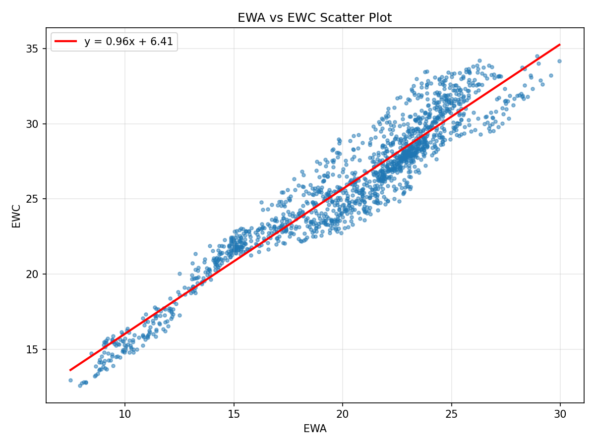
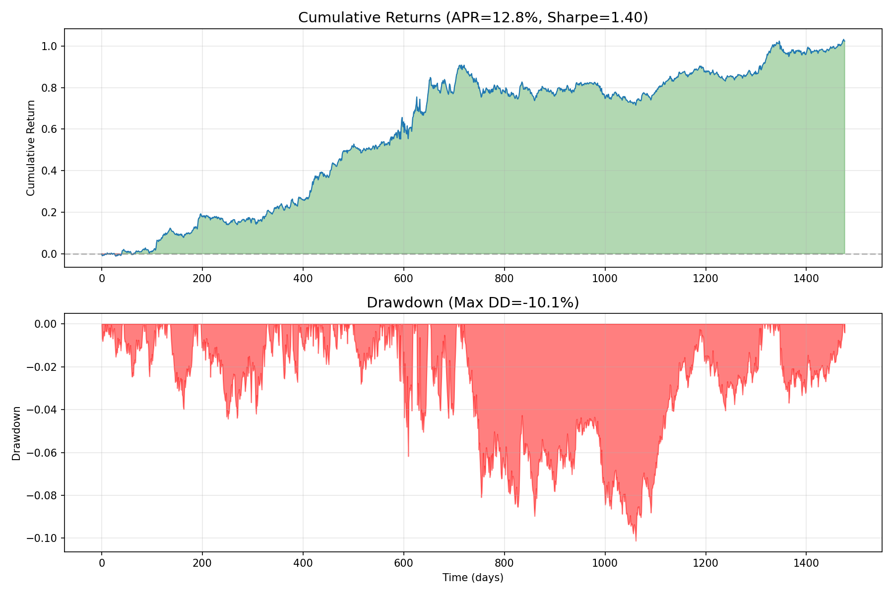

# Chapter 2: 평균 회귀 기초 (The Basics of Mean Reversion)
# 분석 리포트

> **생성 시간**: 2026-02-01 16:58:43
> **데이터 출처**: Ernest Chan's "Algorithmic Trading" (2013)

---

## 목차

1. [개요 및 문제 정의](#1-개요-및-문제-정의)
2. [사용 데이터](#2-사용-데이터)
3. [정상성 검정](#3-정상성-검정-stationarity-tests)
4. [공적분 검정](#4-공적분-검정-cointegration-tests)
5. [반감기 분석](#5-반감기-분석-half-life)
6. [전략 백테스트](#6-전략-백테스트)
7. [결론 및 권고사항](#7-결론-및-권고사항)

---

## 1. 개요 및 문제 정의

### 💡 해결하려는 문제

**"가격이 평균으로 되돌아오는 성질을 이용해 수익을 낼 수 있을까?"**

대부분의 금융 가격 시계열은 **기하 랜덤 워크(Geometric Random Walk)** 를 따르기 때문에 가격의 평균 회귀를 직접 거래할 수 없습니다. 그러나:

1. **정상성(Stationarity)을 가진 소수의 시계열**은 평균 회귀 거래가 가능
2. **공적분(Cointegration) 관계**를 이용하면 비정상 시계열들을 결합하여 정상 포트폴리오 생성 가능

### 📐 핵심 수학적 개념

| 개념 | 수식 | 의미 |
|------|------|------|
| **평균 회귀** | $\Delta y(t) = \lambda y(t-1) + \mu + \epsilon$ | 가격 변화가 현재 가격 수준에 의존 (λ < 0) |
| **허스트 지수** | $Var(\tau) \sim \tau^{2H}$ | H < 0.5: 평균회귀, H = 0.5: 랜덤워크, H > 0.5: 추세 |
| **반감기** | $t_{1/2} = -\log(2)/\lambda$ | 가격이 평균까지 절반 거리를 회복하는 시간 |
| **공적분** | $y_1 - \beta y_2 = \epsilon$ (정상) | 두 비정상 시계열의 선형 결합이 정상 |

---

## 2. 사용 데이터

### 📊 데이터셋 설명

| 파일명 | 내용 | 기간 | 용도 |
|--------|------|------|------|
| `inputData_USDCAD.csv` | USD/CAD 환율 (1분봉) | ~1216일 | 단일 시계열 정상성 검정 |
| `inputData_EWA_EWC.csv` | 호주(EWA)/캐나다(EWC) ETF | ~1500일 | 페어 공적분 검정 |
| `inputData_EWA_EWC_IGE.csv` | EWA/EWC + 천연자원(IGE) ETF | ~1500일 | 다중 자산 공적분 |

### 🎯 데이터 선정 이유

- **USD/CAD**: 캐나다 달러는 "원자재 통화"로 미국 달러와 다른 특성을 가짐
- **EWA-EWC**: 호주와 캐나다 경제 모두 **원자재 기반**이므로 공적분 가능성 높음
- **IGE**: 천연자원 ETF로 EWA/EWC와 경제적 연관성 존재

---

## 3. 정상성 검정 (Stationarity Tests)

### 🔬 검정 목적

가격 시계열이 **평균 회귀**하는지 확인합니다. 평균 회귀하는 시계열에서는:
- 가격이 평균보다 높으면 → 다음 움직임은 **하락** 예상
- 가격이 평균보다 낮으면 → 다음 움직임은 **상승** 예상

### 3.1 ADF 검정 (Augmented Dickey-Fuller Test)

**검정 원리**: 다음 모델에서 $\lambda = 0$인지 검정

$$\Delta y(t) = \lambda y(t-1) + \mu + \alpha_1 \Delta y(t-1) + \epsilon_t$$

- **귀무가설 (H₀)**: $\lambda = 0$ (랜덤 워크, 평균 회귀 아님)
- **대립가설 (H₁)**: $\lambda < 0$ (평균 회귀)

**USD/CAD 검정 결과:**

| 통계량 | 값 | 설명 |
|--------|------|------|
| t-통계량 | -1.8430 | 검정통계량 (더 음수일수록 좋음) |
| p-value | 0.3593 | 귀무가설이 참일 확률 |
| 임계값 (1%) | -3.4357 | 99% 신뢰수준 임계값 |
| 임계값 (5%) | -2.8639 | 95% 신뢰수준 임계값 |
| 임계값 (10%) | -2.5680 | 90% 신뢰수준 임계값 |

> ❌ **결론**: t-통계량이 임계값보다 덜 음수이므로 **귀무가설 기각 불가** → 랜덤 워크 가능성

> 💡 USD/CAD가 정상성 검정을 통과하지 못한 이유: 캐나다 달러는 **원자재 통화**이고 미국 달러는 그렇지 않아 장기적으로 다른 추세를 보일 수 있음

### 3.2 허스트 지수 (Hurst Exponent)

**검정 원리**: 시계열의 **확산 속도**를 측정

$$\langle |z(t+\tau) - z(t)|^2 \rangle \sim \tau^{2H}$$

| H 값 범위 | 시계열 특성 | 트레이딩 전략 |
|-----------|-------------|---------------|
| H < 0.5 | 평균 회귀 (Mean Reverting) | 평균회귀 매매 |
| H = 0.5 | 랜덤 워크 (Random Walk) | 예측 불가 |
| H > 0.5 | 추세 추종 (Trending) | 모멘텀 매매 |

**USD/CAD 허스트 지수 결과:**

| 지표 | 값 |
|------|------|
| H | **0.4758** |
| p-value | 0.000000 |

> ✅ **해석**: H = 0.4758 < 0.5 → **약한 평균 회귀 성향** 존재

### 3.3 USD/CAD 가격 차트


> 📈 위 차트에서 USD/CAD 환율이 일정 범위 내에서 움직이는 것처럼 보이지만, ADF 검정에서 통계적으로 유의한 정상성을 확인하지 못함

---

## 4. 공적분 검정 (Cointegration Tests)

### 🎯 검정 목적

개별적으로는 비정상인 시계열들을 **선형 결합**하여 **정상인 포트폴리오**를 만들 수 있는지 확인합니다.

**핵심 아이디어**: $y_{EWC} - \beta \cdot y_{EWA}$가 정상이면 EWA와 EWC는 **공적분** 관계

### 4.1 EWA-EWC 페어 분석 (CADF Test)

**왜 EWA와 EWC인가?**
- **EWA**: iShares MSCI Australia ETF (호주 주식시장)
- **EWC**: iShares MSCI Canada ETF (캐나다 주식시장)
- 두 경제 모두 **원자재 수출 기반**이므로 유사한 경제 사이클을 가짐

**Step 1: 헤지 비율(Hedge Ratio) 계산**

선형 회귀를 통해 최적 헤지 비율 결정:
```
EWC = β × EWA + α + ε
```

| 파라미터 | 값 | 의미 |
|----------|------|------|
| β (헤지 비율) | **0.9624** | EWA 1주당 EWC 매수량 |
| α (절편) | 6.4113 | 기본 스프레드 수준 |

**Step 2: 공적분 검정 결과**

| 통계량 | 값 |
|--------|------|
| CADF t-통계량 | -3.0635 |
| p-value | 0.0959 |

> ⚠️ **결론**: 0.05 < p-value < 0.10 → **약한 공적분 관계** (90% 신뢰수준)

### 4.2 EWA vs EWC 산점도



> 📊 두 ETF 가격이 **직선 관계**에 가깝게 분포 → 공적분 가능성 시각적 확인

### 4.3 스프레드 (잔차) 차트


> 📉 스프레드(EWC - β×EWA)가 **평균 주변에서 진동** → 평균 회귀 거래 가능성

### 4.4 EWA-EWC-IGE 포트폴리오 (Johansen Test)

**Johansen 검정의 장점**:
- 2개 이상의 자산에 대한 공적분 검정 가능
- 가격 시계열의 **순서에 독립적** (CADF와 달리)
- **고유벡터**를 헤지 비율로 사용 가능

**추가 자산: IGE (iShares North American Natural Resources ETF)**
- 천연자원 관련 주식으로 구성
- 호주/캐나다 경제와 밀접한 연관

**Trace 통계량 검정 결과:**

| 귀무가설 | 통계량 | 95% 임계값 | 결론 |
|----------|--------|------------|------|
| r ≤ 0 | 34.4286 | ~29.79 | ✅ 기각 |
| r ≤ 1 | 17.5317 | ~15.49 | ✅ 기각 |
| r ≤ 2 | 4.4710 | ~3.84 | ✅ 기각 |

**최적 헤지 비율 (첫 번째 고유벡터):**

포트폴리오 가치 = w₁×EWA + w₂×EWC + w₃×IGE

| ETF | 가중치 (wᵢ) | 해석 |
|-----|-------------|------|
| EWA | 0.7600 | Long |
| EWC | -1.0460 | Short |
| IGE | 0.2233 | Long |

> 💡 **해석**: EWA와 IGE를 롱, EWC를 숏하는 포트폴리오가 가장 빠르게 평균 회귀

---

## 5. 반감기 분석 (Half-life)

### 📐 반감기의 의미

**반감기(Half-life)**는 가격이 평균에서 벗어난 거리가 **절반으로 줄어드는 데 걸리는 시간**입니다.

$$t_{1/2} = -\frac{\log(2)}{\lambda}$$

**트레이딩 실용성:**
- 반감기가 **짧을수록** → 더 많은 왕복 거래 가능 → 높은 수익 기회
- 반감기를 **Lookback 기간**으로 사용하면 데이터 스누핑 없이 전략 설계 가능

### 5.1 EWA-EWC-IGE 포트폴리오 반감기

| 파라미터 | 값 | 의미 |
|----------|------|------|
| λ (회귀 계수) | -0.030586 | 음수 = 평균 회귀 |
| **반감기** | **22.7일** | 평균으로 50% 회복 시간 |

> ✅ **평가**: 반감기 < 30일 → **단기 트레이딩에 적합**

> 💡 비교: USD/CAD의 반감기는 약 115일로 실용적이지 않음

---

## 6. 전략 백테스트

### 📈 선형 평균 회귀 전략

**전략 원리**: 포트폴리오 가격의 **Z-Score**에 비례하여 반대 포지션

```python
# Z-Score 계산
z_score = (portfolio_price - moving_avg) / moving_std

# 포지션 결정 (Z-Score의 음수에 비례)
num_units = -z_score
```

| Z-Score | 포지션 | 이유 |
|---------|--------|------|
| Z > 0 (평균 위) | Short | 가격 하락 예상 |
| Z < 0 (평균 아래) | Long | 가격 상승 예상 |
| Z ≈ 0 (평균 근처) | 중립 | 방향성 불확실 |

### 6.1 EWA-EWC-IGE 백테스트 결과

**전략 파라미터:**

- **Lookback 기간**: 23일 (반감기 기반 자동 설정)
- **거래 비용**: 미포함 (실제 적용 시 조정 필요)

**성과 지표:**

| 지표 | 값 | 평가 |
|------|------|------|
| 총 수익률 | 102.38% | 테스트 기간 전체 |
| 연간 수익률 (APR) | 12.78% | ✅ 우수 |
| **샤프 비율** | **1.4027** | ✅ 우수 |
| 최대 낙폭 (MDD) | -10.12% | ✅ 양호 |
| 거래일 수 | 1477일 | 테스트 기간 |

### 6.2 누적 수익률 및 낙폭 차트



> 📊 **차트 해석**:
> - 상단: 누적 수익률 (녹색=수익, 빨간색=손실)
> - 하단: 드로다운 (최고점 대비 하락폭)

---

## 7. 결론 및 권고사항

### ✅ 핵심 발견

| 분석 대상 | 결과 | 트레이딩 가능성 |
|-----------|------|----------------|
| USD/CAD | ADF 통과 실패, H=0.48 | ⚠️ 단독 거래 어려움 |
| EWA-EWC | 공적분 p=0.10 | ✅ 페어 트레이딩 |
| EWA-EWC-IGE | 반감기=23일 | ✅ 단기 트레이딩 적합 |
| 선형 전략 | 샤프=1.40 | ✅ 양호한 위험조정수익 |

### 💡 트레이딩 권고사항

1. **포트폴리오 구성**:
   - EWA-EWC-IGE 3자산 포트폴리오에 평균회귀 전략 적용
   - Johansen 고유벡터 기반 헤지 비율 사용

2. **전략 고도화** (Chapter 3 참조):
   - 볼린저 밴드: 진입/청산 임계값 최적화
   - 칼만 필터: 시변(time-varying) 헤지 비율 적용

3. **리스크 관리** (Chapter 8 참조):
   - 평균회귀 전략은 **꼬리 리스크(Tail Risk)** 존재
   - 켈리 공식 기반 레버리지 관리 필수
   - 일반적인 손절매는 논리적이지 않음 (더 벌어질수록 더 매력적)

### ⚠️ 주의사항

- 본 백테스트는 **거래 비용 미포함**
- **Look-ahead bias**: 전체 데이터로 반감기 계산 후 동일 데이터로 테스트
- 실제 적용 시 **Walk-forward 테스트** 필요
- 시장 구조 변화(Regime Shift)에 취약할 수 있음

---

*이 리포트는 `run_chapter2_analysis.py`에 의해 자동 생성되었습니다.*
