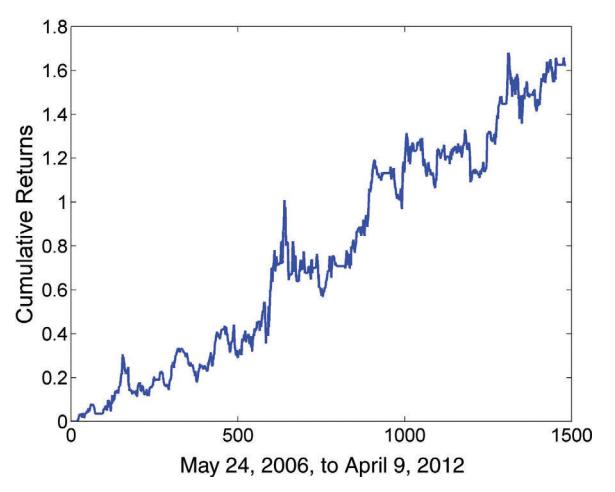
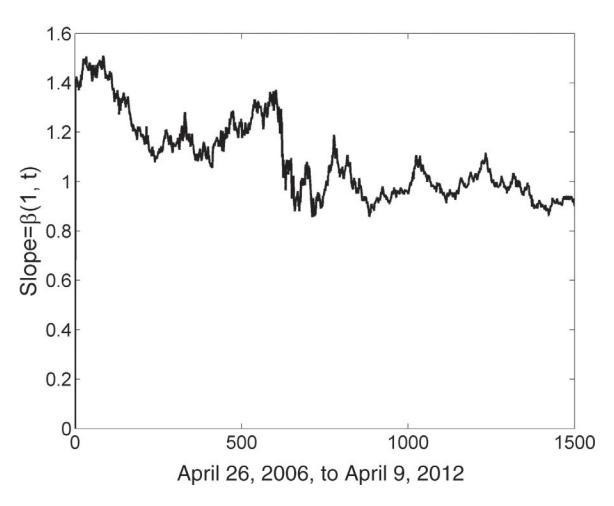
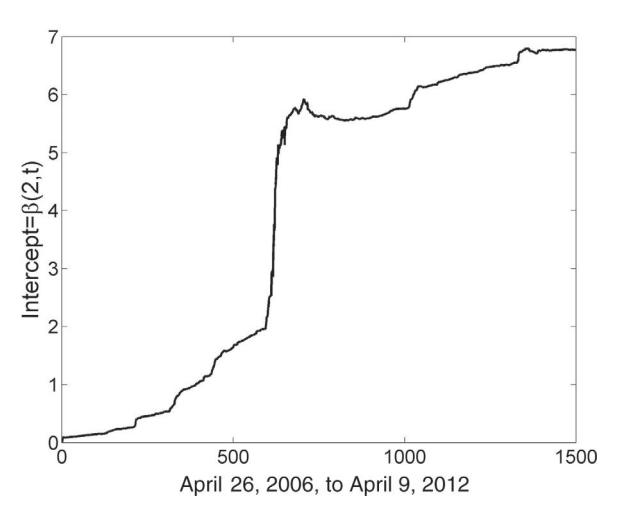

# 제3장: 평균 회귀 전략의 구현 — 쉬운 해설판

> 이 글은 Ernest Chan의 "Algorithmic Trading" 제3장의 전체 내용을 빠짐없이 담되, 전문 용어와 개념을 일상적인 비유와 풀어쓴 설명으로 재구성한 해설판입니다.

---

## 이 장에서 배울 핵심 내용 한눈에 보기

여러분, 2장에서 우리는 "이 가격 시계열이 정말 평균 회귀하는가?"를 판별하는 **통계적 검정** 방법을 배웠습니다. 마치 수영장 물의 온도를 재는 온도계를 얻은 셈이죠. 그런데 온도를 안다고 해서 수영을 잘하는 것은 아닙니다. 이제 3장에서는 **실제로 물에 뛰어들어 수영하는 방법** — 즉, 평균 회귀 전략을 실전에서 구현하는 기법들을 배웁니다.

이 장의 핵심 도구와 비유를 미리 소개하면 다음과 같습니다:

- **볼린저 밴드(Bollinger Bands)** = **도로의 가드레일**: 가격이 이 가드레일 밖으로 벗어나면 "어, 너무 멀리 갔다"는 신호입니다.
- **진입/청산 신호(Entry/Exit Signals)** = **교통 신호등**: 초록불이면 포지션에 진입하고, 빨간불이면 빠져나옵니다.
- **손절(Stop-loss)** = **안전벨트**: 사고가 나더라도 피해를 최소화합니다.
- **칼만 필터(Kalman Filter)** = **내비게이션의 GPS 보정**: 실시간으로 위치(= 헤지 비율, 평균 가격)를 계속 업데이트해줍니다.
- **스케일링 인(Scaling-in)** = **단계별 물 채우기**: 한 번에 수영장을 가득 채우는 대신, 조금씩 물을 추가하는 전략입니다.

이제 하나하나 깊이 파고들어 보겠습니다.

---

## 도입부: 완벽한 정상성은 필요 없다

이전 장에서 가격 시계열이 **정상적(stationary)**인지, 따라서 평균 회귀 거래에 적합한지 결정하기 위한 통계적 검정을 설명했습니다. 이 가격 시계열은 단일 자산의 시장 가치일 수도 있지만, 그러한 정상 자산이 존재하는 경우는 드뭅니다. 또는 익숙한 롱-숏 주식 페어와 같은 **공적분(cointegrated)** 자산 포트폴리오의 시장 가치일 수 있습니다.

여기서 중요한 점을 짚고 넘어가겠습니다. 여러분이 생각할 수 있는 것과 달리, 성공적인 평균 회귀 전략을 구현하기 위해 **반드시 진정한 정상성이나 공적분이 필요하지는 않습니다**. 마치 프로 수영 선수만 수영장에 들어갈 수 있는 게 아닌 것처럼요. 영리하게 접근하면, **단기 또는 계절적 평균 회귀**를 포착하고, 가격이 다음 균형 수준으로 이동하기 전에 포지션을 청산할 수 있습니다.

> **계절적 평균 회귀(seasonal mean reversion)**란 무엇일까요? 가격 시계열이 하루 중 특정 시간대나 특정 조건에서만 평균으로 돌아오는 현상을 말합니다. 예를 들어, 주식 시장이 개장 직후 30분 동안은 과잉 반응한 가격이 원래 수준으로 돌아오는 경향이 있다면, 그것이 바로 계절적 평균 회귀입니다.

반대로, **모든 정상 시계열이 큰 수익으로 이어지는 것은 아닙니다**. 평균 회귀의 **반감기(half-life)**가 10년이라면 어떨까요? 10년 동안 포지션을 잡고 기다릴 트레이더는 거의 없겠죠!

우리는 또한 앞 장에서 자산의 가격이 평균에서 벗어난 정도에 **비례하여** 단순히 자산에 **스케일 인(scale in)**하는 간단한 선형 평균 회귀 전략을 설명했습니다. 이건 마치 수영장 물이 빠질수록 더 많은 물을 붓는 것과 같은데, 문제는 지속적인 무한소 리밸런싱과 무제한 구매력이 필요하다는 점입니다. 현실에서는 돈이 무한하지 않으니까요!

이 장에서는 **더 실용적이지만 여전히 간단한** 평균 회귀 전략들을 다룹니다:

1. **볼린저 밴드(Bollinger Bands)** — 우리의 핵심 도구, 도로의 가드레일
2. **여러 진입 및 청산 수준 사용(스케일링 인)**의 장단점
3. **칼만 필터(Kalman Filter)** — GPS처럼 헤지 비율과 평균 가격을 실시간 업데이트
4. **데이터 오류**가 평균 회귀 전략에 미치는 위험

### 백테스트에 대한 솔직한 고백

이 책에서 어떤 전략의 백테스트를 제시할 때, **거래 비용은 포함하지 않습니다**. 또한 때때로 매개변수 최적화(예: 최적의 헤지 비율 찾기)와 백테스트에 **동일한 데이터**를 사용함으로써 **미래 예측 편향(look-ahead bias)**을 도입하는 더 큰 오류를 범하기도 합니다. 이것들은 모두 1장에서 경고한 함정입니다.

왜 그렇게 하느냐고요? 유일한 변명은 **프레젠테이션과 소스 코드를 이해하기 쉽게 만든다**는 것입니다. 마치 요리 교실에서 식재료 손질 과정을 생략하고 조리법만 보여주는 것과 같습니다. 독자 여러분이 이러한 프로토타입 전략의 자체 백테스트를 구현할 때는 **반드시** 이러한 함정을 정리하는 힘든 작업을 수행해야 합니다!

---

## 가격 스프레드, 로그 가격 스프레드 또는 비율을 사용한 페어 트레이딩

### 왜 이 내용이 중요한가?

페어 트레이딩에서 가장 기본적인 질문 중 하나는 "어떤 형태의 신호를 사용해야 하는가?"입니다. 마치 운전할 때 속도계를 볼지, RPM 게이지를 볼지, 아니면 연비 표시를 볼지 선택하는 것과 같습니다. 각각 장단점이 있고, 상황에 따라 더 적합한 것이 있습니다.

### 가격 스프레드: 가장 기본적인 방법

2장에서 평균 회귀 거래를 위한 포트폴리오를 구성할 때, 우리는 단순히 "단위" 포트폴리오의 시장 가치를 거래 신호로 사용했습니다. 이 시장 가치 또는 가격은 구성 가격 시계열의 **가중 합(weighted sum)**이며, 가중치는 선형 회귀 또는 요한센 검정의 고유벡터에서 찾은 **헤지 비율(hedge ratio)**입니다.

수식으로 표현하면:

$$y = h_1 y_1 + h_2 y_2 + \dots + h_n y_n \qquad (3.1)$$

여기서 각 변수의 의미를 풀어보겠습니다:

- **$y$**: 포트폴리오의 총 시장 가치 (우리가 관찰하는 "스프레드")
- **$y_1, y_2, \dots, y_n$**: 포트폴리오를 구성하는 각 자산의 가격
- **$h_1, h_2, \dots, h_n$**: 각 자산의 헤지 비율 (= 각 주식을 몇 주씩 보유하느냐)

이 $y$는 구조상 **정상 시계열(stationary time series)**이어야 합니다. 다시 말해, 시간이 지나도 평균으로 돌아오는 성질을 가져야 한다는 뜻이죠.

주식이 딱 두 개만 있는 특수한 경우, 이 공식은 많은 페어 트레이더에게 익숙한 **스프레드(spread)**로 축소됩니다:

$$y = y_1 - h y_2 \qquad (3.2)$$

> 여기서 마이너스 기호를 삽입한 이유가 있습니다. 보통 한 주식은 **롱(매수)**하고 다른 주식은 **숏(매도)**하므로, 이렇게 정의하면 $h$가 양수가 됩니다. 직관적으로 이해하기 쉬워지죠!

### 로그 가격 스프레드: 자본 배분의 관점

이번에는 가격 대신 **가격의 로그(logarithm)**가 공적분한다고 가정해봅시다:

$$\log(q) = h_1 \log(y_1) + h_2 \log(y_2) + \dots + h_n \log(y_n) \qquad (3.3)$$

여기서 $q$는 무엇일까요? 포트폴리오의 시장 가치일 수도 있고 아닐 수도 있는, 어떤 정상 시계열에 주어진 이름일 뿐입니다. 그 속성을 파악하기 위해 **시간에 대한 1차 차분(first difference)**을 취해봅시다:

$$\Delta \log(q) = h_1 \Delta \log(y_1) + h_2 \Delta \log(y_2) + \dots + h_n \Delta \log(y_n) \qquad (3.4)$$

여기서 핵심적인 수학적 사실을 기억해야 합니다. $x$의 작은 변화에 대해:

$$\Delta \log(x) \equiv \log(x(t)) - \log(x(t-1)) = \log\left(\frac{x(t)}{x(t-1)}\right) \approx \frac{\Delta x}{x}$$

이것이 의미하는 바는 무엇일까요? 식 3.4의 우변은 다음과 같이 변환됩니다:

$$h_1 \frac{\Delta y_1}{y_1} + h_2 \frac{\Delta y_2}{y_2} + \dots + h_n \frac{\Delta y_n}{y_n}$$

이것은 바로 가중치 $h$를 가진 $n$개 자산으로 구성된 **포트폴리오의 수익률**에 다름 아닙니다!

여기서 중요한 차이점이 있습니다:
- **식 3.1의 가격 스프레드**에서 헤지 비율 $h$는 각 자산의 **주식 수**를 나타냈습니다.
- **식 3.3의 로그 가격 스프레드**에서는 각 자산의 **시장 가치(달러 금액)**를 $h$로 설정할 수 있습니다.

비유로 설명하면, 가격 스프레드는 "삼성전자 10주, SK하이닉스 5주"처럼 **주식 수**로 포트폴리오를 정의하는 것이고, 로그 가격 스프레드는 "삼성전자에 100만 원, SK하이닉스에 50만 원"처럼 **금액**으로 포트폴리오를 정의하는 것입니다.

따라서 $q$를 가격이 $y_1, y_2, \dots, y_n$이고 **일정한 자본 가중치**가 $h_1, h_2, \dots, h_n$인 자산 포트폴리오의 시장 가치로 해석할 수 있습니다. 이때 암묵적으로 **현금 구성 요소**가 포함되어 있습니다.

왜 현금이 필요할까요? 자본 가중치 $h$가 일정하게 유지된다면, 자산 가격이 변할 때마다 포트폴리오를 **리밸런싱(rebalancing)**해야 합니다. 이 과정에서 일부 이익이나 손실을 실현하며 현금 잔고에 추가하거나 빼게 됩니다. 마치 여러분이 "삼성전자 60%, SK하이닉스 40%"라는 비율을 항상 유지하려면, 한쪽이 올라가면 일부를 팔고 다른 쪽을 사야 하는 것과 같습니다. 이 과정에서 현금이 오고 갑니다.

이 현금은 식 3.4에 나타나지 않습니다. 물론 시장 움직임의 결과로 $t - 1$에서 $t$로 시장 가치가 변하지 않기 때문입니다. 하지만 트레이더가 자본 가중치의 일정함을 유지하기 위해 포트폴리오를 리밸런싱하고 일부 이익이나 손실을 실현하며 현금 잔고에 추가하거나 빼면 $t$에서 그 값이 변할 것입니다. 따라서 이 포트폴리오의 시장 가치를 정상적(그러나 일정하지는 않음!)으로 유지하려면 트레이더에게 많은 작업이 필요합니다. 가격의 로그를 사용함으로써 필요해진 **포트폴리오를 지속적으로 리밸런싱**해야 하기 때문입니다.

### 결론: 가격 스프레드 vs 로그 가격 스프레드

**가격 스프레드를 사용한 평균 회귀 거래가 로그 가격 스프레드를 사용하는 것보다 간단합니다.** 하지만 가격과 로그 가격 시계열이 모두 공적분하면 둘 다 이론적으로 정당화될 수 있습니다.

### 가격 비율: 특수하지만 유용한 경우

그런데 많은 트레이더가 페어의 신호로 선호하는 **가격 비율 $y_1/y_2$**는 어떨까요?

두 가격 시계열만 있는 경우 식 3.1을 보면, **$h_1 = -h_2$이면** 실제로 $\log(y_1/y_2)$ 또는 $y_1/y_2$가 정상임을 알 수 있습니다. 그러나 이것은 **특수한 경우**입니다. 일반적으로 헤지 비율이 크기가 같거나, 정규화하면 정확히 $-1$과 같을 것으로 기대하지 않습니다. 따라서 비율 $y_1/y_2$가 **반드시 정상 시계열을 형성하는 것은 아닙니다**.

그러나 비율 사용이 이점을 가지는 흥미로운 경우가 있습니다. 한 독자가 다음과 같은 예를 들었습니다 ([http://epchan.blogspot.com/2012/02/ideas-from-psychologist.html?showComment=1329801874131#c3278677864367113894](http://epchan.blogspot.com/2012/02/ideas-from-psychologist.html?showComment=1329801874131#c3278677864367113894)):

> 가격 A = \$10이고 가격 B = \$5라고 합시다. 비율은 2입니다. 얼마 후 가격 A가 \$100으로, 가격 B가 \$50으로 증가합니다.
>
> - **스프레드**는 \$5에서 \$50으로 갔습니다. 아마 정상이 아닐 것입니다.
> - **비율**은 여전히 2입니다! 비율에 기반한 평균 회귀 전략은 가격이 \$10 대 \$5이든 \$100 대 \$50이든 **똑같이 효과적**일 수 있습니다.

비유로 설명하면, 스프레드는 두 사람의 **키 차이**와 같고, 비율은 **키의 비율**과 같습니다. 아이가 자라면서 키 차이는 계속 변하지만, 비율은 비교적 안정적일 수 있죠. 두 자산이 실제로 공적분하지 않지만 스프레드가 단기적으로 여전히 평균 회귀한다고 믿는다면, **비율을 지표로 사용하는 것이 더 잘 작동할 수 있습니다**. (이것은 선형 평균 회귀 전략에서 이동 평균과 표준 편차를 사용하는 것과 같은 아이디어입니다.)

비율을 사용해야 하는 **또 다른 좋은 이유**가 있습니다. 진정으로 공적분하지 않는 페어의 경우, 스프레드를 구성하기 위해 **동적으로 변하는 헤지 비율**을 사용해야 하는 경우가 많습니다. 그러나 비율을 신호로 사용하면 이 문제를 **완전히 생략**할 수 있습니다! 헤지 비율을 계속 재계산하는 수고를 덜 수 있다는 뜻이죠.

그러나 비율이 가격(또는 로그 가격) 스프레드와 적응적 헤지 비율보다 더 잘 작동할까요? 이에 대한 일반적인 답은 모르지만, 예제 3.1에서 확인해볼 수 있습니다.

### 특수 사례: 통화 거래

흥미로운 특수 사례는 **통화 거래**입니다. 통화 페어 EUR.GBP를 거래하면, EUR.USD/GBP.USD를 거래하는 것과 정확히 같습니다. 즉, 이미 **비율을 사용**하고 있는 셈이죠!

우리는 이미 예제 2.5에서 USD.CAD에 대해 비율을 신호로 사용하여 이러한 통화 페어를 거래하는 간단한 평균 회귀 전략을 시연했습니다.

그런데 많은 중개업체나 거래소에서 기성 교차 환율이 없는 페어, 예를 들어 MXN.NOK는 어떨까요? 비율 USD.NOK/USD.MXN을 신호로 사용해야 할까요, 아니면 스프레드 USD.NOK-USD.MXN을 대신 사용해야 할까요?

MXN.NOK가 진정으로 정상이 아니기 때문에 **비율 MXN.NOK를 사용하는 것이 더 효과적**일 수 있습니다. MXN.NOK를 직접 거래할 수 없고 대신 USD.NOK와 USD.MXN을 거래해야 하더라도 마찬가지입니다.

> **주의할 점**: USD.NOK와 USD.MXN을 거래하면 NOK와 MXN **모두**로 표시된 손익(P&L)이 발생합니다. MXN.NOK를 거래했다면 NOK**로만** 표시된 P&L이 발생했을 것입니다. 따라서 두 방법은 **동일하지 않습니다**.

---

## 예제 3.1: 가격 스프레드, 로그 가격 스프레드, 비율 거래하기

### 왜 이 예제가 중요한가?

이론을 배웠으니, 이제 **실전에서 세 가지 방법을 비교**해봅시다. 마치 같은 요리를 세 가지 다른 레시피로 만들어보고 어떤 것이 가장 맛있는지 비교하는 것과 같습니다.

### 배경: GLD와 USO

예제 2.5와 2.8의 선형 평균 회귀 전략을 ETF **GLD(금)**와 **USO(원유)**에 적용합니다. 세 가지 방법을 비교해봅니다.

일부 트레이더는 유가가 오르면 금 가격도 오른다고 믿습니다. 그 논리는 다음과 같습니다:

1. 높은 유가 → **인플레이션** 촉진
2. 금 가격은 인플레이션과 **양의 상관관계**

그러나 2장에서 배운 공적분 검정을 사용하면, 금(GLD)과 유가(USO)가 **실제로 공적분하지 않음**을 확인할 수 있습니다. (현물 유가 대 유선물의 차이는 일단 무시합니다. 이것은 5장에서 다시 다룹니다.) 그럼에도 불구하고, 평균 회귀 전략을 수익성 있게 만들기에 충분한 **단기 평균 회귀**가 있는지 살펴봅시다.

### 방법 1: 가격 스프레드 (동적 헤지 비율 사용)

먼저 **가격 스프레드를 신호**로 사용해볼 것입니다. 시간이 지남에 따라 ETF의 변화하는 수준에 적응하기 위해, **짧은 룩백 기간(사후에 근 최적인 20 거래일로 설정)**을 사용하여 매일 헤지 비율을 동적으로 재계산합니다. 헤지 비율 계산에는 jplv7 패키지의 *ols* 함수를 사용한 **선형 회귀**를 사용합니다. 물론 요한센 검정의 첫 번째 고유벡터를 대신 사용할 수도 있습니다.

MATLAB 소스 코드는 *PriceSpread.m*으로 다운로드할 수 있습니다. GLD의 가격 시계열이 Tx1 배열 *x*에, USO는 Tx1 배열 *y*에 포함되어 있다고 가정합니다. "스프레드" USO-hedgeRatio*GLD는 단위 포트폴리오의 가격과 같으며, 프로그램에서 *yport*로 표시합니다.

```
% lookback period for calculating the dynamically changing
 % hedge ratio
lookback=20;
hedgeRatio=NaN(size(x, 1), 1);
for t=lookback:size(hedgeRatio, 1)
    regression_result=ols(y(t-lookback+1:t), ...
     [x(t-lookback+1:t) ones(lookback, 1)]);
    hedgeRatio(t)=regression_result.beta(1);
                                                     (계속)
```

```
end
y2=[x y];
yport=sum([-hedgeRatio ones(size(hedgeRatio))].*y2, 2);
```

이 코드를 단계별로 풀어보겠습니다:

1. **룩백 기간 20일**: 최근 20일의 데이터만 사용해서 헤지 비율을 계산합니다. 왜 20일일까요? 사후적으로 봤을 때 거의 최적이기 때문입니다.
2. **매일 루프를 돌면서** `ols` 함수로 선형 회귀를 수행하여 해당 시점의 헤지 비율을 구합니다.
3. **yport**: USO와 GLD의 가격에 헤지 비율을 적용한 포트폴리오의 시장 가치입니다.

그림 3.1에서 이 스프레드를 플롯하면 **매우 정상적으로 보임**을 알 수 있습니다. 마치 평균 주위를 오르락내리락하는 고무줄처럼요!


**그림 3.1** 변화하는 헤지 비율을 사용한 USO와 GLD 사이의 스프레드

이제 수익성 있는 선형 평균 회귀 전략을 만들 수 있는지 살펴봅시다. 우리가 소유해야 하는 단위 포트폴리오의 단위(주식) 수는 **음의 Z-점수**로 설정됩니다. Tx2 *positions* 배열은 투자해야 하는 각 구성 ETF의 시장 가치(달러)를 나타냅니다.

```
numUnits=-(spread-movingAvg(spread, lookback)) ...
 ./movingStd(spread, lookback);
positions=repmat(numUnits, [1 size(y2, 2)]).*[hedgeRatio ...
 -ones(size(hedgeRatio))].*y2; pnl=sum(lag(positions, ...
 1).*(y2-lag(y2, 1))./lag(y2, 1), 2); % daily P&L of the
 % strategy
ret=pnl./sum(abs(lag(positions, 1)), 2); % return is P&L
 % divided by gross market value of portfolio
```

**결과**: GLD와 USO가 결코 공적분하지 않음에도 불구하고, 동적 헤지 비율이 있는 가격 스프레드를 사용하여 **약 10.9%의 연간 수익률(APR)**과 **약 0.59의 샤프 비율**을 얻습니다.

### 방법 2: 로그 가격 스프레드

다음으로 **로그 가격** 사용이 어떤 차이를 만드는지 살펴봅시다. 소스 코드는 *LogPriceSpread.m*에 있지만, *PriceSpread.m*과 다른 두 줄만 보겠습니다:

```
regression_result=ols(log(y(t-lookback+1:t)), ...
   [log(x(t-lookback+1:t)) ones(lookback, 1)]);
and
  yport=sum([-hedgeRatio ones(size(hedgeRatio))].*log(y2), ...
   2); % The net market value of the portfolio is same as
    % the "spread"
```

차이점이 보이시나요? `y`와 `x` 대신 `log(y)`와 `log(x)`를 사용합니다.

**결과**: **APR 9%**와 **샤프 비율 0.5**는 실제로 가격 스프레드 전략보다 **낮습니다**. 게다가 이것은 각 ETF에 대한 자본 배분을 유지하기 위해 **매일 포트폴리오를 리밸런싱하는 것과 관련된 추가 거래 비용**을 고려하기 **전**의 결과입니다!

### 방법 3: 비율

다음으로 **비율을 신호**로 사용해봅시다. 이 경우 롱 측과 숏 측이 동일한 달러 자본을 갖도록 요구합니다. 소스 코드는 *Ratio.m*에 있습니다.


**그림 3.2** 비율 = USO/GLD

가격 스프레드나 적응적 헤지 비율과 비교할 때 비율이 **실제로 그다지 정상적으로 보이지 않음**을 알 수 있습니다. 따라서 평균 회귀 전략이 **음의 APR로 저조하게 수행되더라도 놀라지 않을 것**입니다.

```
lookback=20; % Lookback is set arbitrarily
ratio=y./x;
ratio(1:lookback)=[]; % Removed to have same test set as
 % price spread and log price spread strategies
x(1:lookback)=[];
y(1:lookback)=[];
% Apply a simple linear mean reversion strategy to GLD-USO
numUnits=-(ratio-movingAvg(ratio, lookback))...
 ./movingStd(ratio, lookback); positions=repmat(numUnits, ...
 [1 2]).*[-ones(size(x, 1), 1) ones(size(x, 1), 1)];
 pnl=sum(lag(positions, 1).*([x y]-lag([x y], 1)). ...
 /lag([x y], 1), 2); ret=pnl./sum(abs(lag(positions, 1)), 2);
```

### 세 가지 방법 비교 요약

| 방법 | APR (연간 수익률) | 샤프 비율 | 특징 |
|------|-------------------|-----------|------|
| **가격 스프레드** (동적 헤지) | ~10.9% | ~0.59 | 가장 좋은 성과 |
| **로그 가격 스프레드** | ~9% | ~0.5 | 리밸런싱 비용 추가 |
| **비율** | 음수 | 저조 | 이 페어에는 부적합 |

**적어도 이 예제에서는** 적응적 헤지 비율이 있는 가격 스프레드가 비율보다 **훨씬 더 잘 작동한다**는 것을 알 수 있습니다.

---

## 볼린저 밴드: 도로의 가드레일

### 왜 이 내용이 중요한가?

지금까지 설명한 유일한 평균 회귀 전략은 **선형 전략**입니다. 가격이 평균에서 벗어난 만큼 비례하여 포지션 크기를 조절하는 방식이죠. 이 전략은 매개변수가 사실상 없어서 데이터 스누핑 편향에 가장 적게 영향을 받지만, **실용적이지 않습니다**. 가격이 평균에서 일시적으로 편차되는 데 제한이 없기 때문에 **사전에 배치될 최대 자본이 얼마인지 알 수 없습니다**.

비유로 설명하면, 선형 전략은 "비가 오는 양에 비례해서 우산을 산다"는 것과 같습니다. 폭우가 쏟아지면 우산을 100개 사야 할 수도 있는데, 그럴 돈이 있을까요?

### 볼린저 밴드의 작동 원리: 가드레일 비유

여기서 **볼린저 밴드(Bollinger Bands)**가 등장합니다. 볼린저 밴드는 도로의 **가드레일**과 같습니다.

- **중앙선(이동 평균)** = 도로의 **중앙 차선**
- **상단 밴드** = 오른쪽 **가드레일** (가격이 여기 닿으면 "너무 올랐다!" → 숏 진입 신호등이 초록불!)
- **하단 밴드** = 왼쪽 **가드레일** (가격이 여기 닿으면 "너무 내렸다!" → 롱 진입 신호등이 초록불!)

구체적으로:

- **진입(Entry)**: 가격이 평균에서 **entryZscore** 표준 편차 이상 벗어날 때 포지션에 진입합니다. *entryZscore*는 훈련 세트에서 최적화할 자유 매개변수입니다.
- **청산(Exit)**: 가격이 평균에서 **exitZscore** 표준 편차로 평균 회귀할 때 청산합니다. 여기서 *exitZscore* < *entryZscore*입니다.
- 표준 편차와 평균 모두 룩백 기간 내에서 계산되는데, 그 길이도 최적화할 자유 매개변수이거나 평균 회귀의 반감기와 같게 설정할 수 있습니다.

신호등 비유로 설명하면:
- **exitZscore = 0**: 가격이 현재 평균으로 돌아오면 **초록불** → 청산
- **exitZscore = -entryZscore**: 가격이 반대쪽 가드레일을 넘어가서 반대 부호의 거래 신호를 유발할 때 청산

### 볼린저 밴드의 장점

1. **자본 관리가 쉽다**: 언제든지 0 또는 1 단위(롱 또는 숏)만 투자되므로, 자본을 할당하거나 리스크를 관리하기가 매우 쉽습니다.
2. **매개변수 조절이 직관적**: 룩백을 짧은 기간으로, *entryZscore*와 *exitZscore* 크기를 작게 설정하면 → 보유 기간이 짧아지고 → 왕복 거래가 더 많아지며 → 일반적으로 수익이 더 높아집니다.

---

## 예제 3.2: 볼린저 밴드 평균 회귀 전략

### 왜 이 예제가 중요한가?

예제 3.1에서 선형 전략의 결과를 봤습니다. 이제 같은 GLD-USO 페어에 볼린저 밴드를 적용하면 **얼마나 개선되는지** 직접 확인해봅시다.

### 설정

예제 3.1에서 선형 평균 회귀 전략으로 가격 스프레드 USO-hedgeRatio*GLD를 신호로 사용하여 GLD-USO를 거래했습니다. 여기서는 *entryZscore* = 1과 *exitZscore* = 0을 사용하여 볼린저 밴드 전략으로 전환합니다. 프로그램의 첫 부분은 *PriceSpread.m*과 동일합니다. 소스 코드는 *bollinger.m*에 있습니다.

### 신호 생성 코드

진입 신호 *longsEntry*와 *shortsEntry*는 Tx1 논리 배열이며, 청산 신호 *longsExit*와 *shortsExit*도 마찬가지입니다.

```
% Bollinger band strategy
entryZscore=1;
exitZscore=0;
zScore=(yport-movingAvg(yport, lookback))./movingStd(yport, ...
 lookback);
longsEntry=zScore < -entryZscore; % a long position means we
 % should buy EWC
longsExit=zScore >= -exitZscore;
shortsEntry=zScore > entryZscore;
shortsExit=zScore <= exitZscore;
numUnitsLong=NaN(length(yport), 1);
                                                      (계속)
```

이 코드를 교통 신호등 비유로 풀어보겠습니다:

- **longsEntry** (Z-점수 < -1): 가격이 하단 가드레일 아래로 내려갔다! **초록불** → 매수 진입
- **longsExit** (Z-점수 >= 0): 가격이 중앙선으로 돌아왔다! **빨간불** → 매수 포지션 청산
- **shortsEntry** (Z-점수 > 1): 가격이 상단 가드레일 위로 올라갔다! **초록불** → 매도 진입
- **shortsExit** (Z-점수 <= 0): 가격이 중앙선으로 돌아왔다! **빨간불** → 매도 포지션 청산

### 포지션 관리 코드

롱 측의 단위 포트폴리오 단위 수인 *numUnitsLong*(Tx1 배열)을 초기화한 다음, 롱 진입 신호가 있으면 값 중 하나를 1로, 롱 청산 신호가 있으면 0으로 설정합니다. 숏 측의 단위 수도 마찬가지입니다.

```
numUnitsShort=NaN(length(yport), 1);
numUnitsLong(1)=0;
numUnitsLong(longsEntry)=1;
numUnitsLong(longsExit)=0;
numUnitsLong =fillMissingData(numUnitsLong);
numUnitsShort(1)=0;
numUnitsShort(shortsEntry)=-1;
numUnitsShort(shortsExit)=0;
numUnitsShort =fillMissingData(numUnitsShort);
numUnits= numUnitsLong + numUnitsShort;
```

이 코드의 핵심 논리를 단계별로 설명합니다:

1. **NaN으로 초기화**: 모든 날을 "아직 결정 안 됨"으로 설정
2. **진입 신호가 있으면 1(롱) 또는 -1(숏)**로 설정
3. **청산 신호가 있으면 0**으로 설정
4. **fillMissingData**: 진입이나 청산 신호가 없는 날에는 **전날의 포지션을 그대로 이월**합니다. (*fillMissingData*는 배열의 두 번째 행부터 시작하여 셀의 NaN 값을 이전 행의 해당 셀 값으로 덮어씁니다. 저자의 웹사이트에서 다운로드할 수 있습니다.)
5. **numUnits = 롱 + 숏**: *numUnitsLong*과 *numUnitsShort*가 계산되면, 이들을 결합하여 *numUnits*로 표시되는 순 단위 수를 찾을 수 있습니다. 프로그램의 나머지는 예제 3.1의 *PriceSpread.m*과 동일합니다.

### 결과

**볼린저 밴드 전략은 APR = 17.8%, 샤프 비율 0.96으로, 선형 평균 회귀 전략에서 상당한 개선입니다!**

선형 전략(APR 10.9%, 샤프 0.59)과 비교하면:
- 연간 수익률: **10.9% → 17.8%** (약 63% 개선!)
- 샤프 비율: **0.59 → 0.96** (약 63% 개선!)

누적 수익률 곡선은 그림 3.3에 표시되어 있습니다.



**그림 3.3** GLD-USO에 대한 볼린저 밴드 전략의 누적 수익률

가드레일(볼린저 밴드)을 설치하니 도로(전략)가 훨씬 안전하고 효율적이 되었습니다!

---

## 스케일링 인이 작동하는가? — 단계별 물 채우기의 딜레마

### 왜 이 내용이 중요한가?

많은 트레이더가 직관적으로 "가격이 더 내려가면 더 많이 사자"라고 생각합니다. 이것이 바로 **스케일링 인(scaling-in)**, 또는 **평균 매입(averaging-in)**입니다. 이 전략이 정말 좋을까요? 놀라운 연구 결과가 있습니다.

### 스케일링 인의 직관적 매력

자산, 스프레드 또는 포트폴리오의 가격이 평균에서 점점 더 벗어질수록, 최종 회귀에서 거둘 **잠재적 이익도 증가**합니다. 따라서 투자 자본을 늘리는 것이 합리적으로 보입니다. 이것이 바로 우리의 선형 평균 회귀 전략이 하는 것이죠.

스케일 인 전략의 장점들:

- **점진적으로 스케일 아웃도 가능**: 가격이 평균으로 완전히 돌아올 때까지 기다릴 필요 없이, 가격이 작은 증분만큼 회귀할 때마다 조금씩 청산할 수 있습니다. 가격 시계열이 실제로 정상이 아니어서 평균으로 결코 회귀하지 않더라도 지속적으로 작은 이익을 실현하여 여전히 수익성이 있을 수 있다는 장점이 있습니다.
- **시장 영향 감소**: 큰 규모로 거래하는 경우 스케일 인과 아웃이 진입/청산 거래의 시장 영향을 줄입니다.

볼린저 밴드로 스케일 인을 구현하려면 여러 진입과 청산 수준을 둡니다: 예를 들어, *entryZscore* = 1, 2, 3, ..., $N$ 및 *exitZscore* = 0, 1, 2, ..., $N - 1$. 물론 $N$은 훈련 데이터 세트를 사용하여 최적화할 또 다른 매개변수입니다.

### 쇤베르크와 코윈의 충격적 발견

이 모든 것이 매우 상식적으로 보였습니다. **쇤베르크와 코윈(Schoenberg and Corwin)의 연구**가 나오기 전까지는요. 그들은 **두 개 이상의 볼린저 밴드에서 진입하거나 청산하는 것이 결코 최적이 아니라는 것을 증명**했습니다 (Schoenberg and Corwin, 2010). 즉, 백테스트에서 **더 높은 평균 수익률을 생성하는 단일 진입/청산 수준을 항상 찾을 수 있다**는 것입니다. 그들은 이 최적의 단일 진입 방법을 **"올인(all-in)"**이라고 부릅니다.

### 수학적 증명: 세 가지 시나리오 비교

이해를 돕기 위해 구체적인 예를 들어봅시다.

선물 계약이 최근 가격 $L_1$으로 떨어졌고, $F > L_1$인 더 높은 최종 가격 $F$로 회귀할 것으로 예상합니다. 그러나 가격이 $F$로 반등하기 전에 $L_2 < L_1$로 더 낮아질 확률 $p$가 있습니다. 우리는 가격 $L_1$, $L_2$ 또는 $F$에서 총 두 개의 계약에 투자할 충분한 구매력만 가지고 있습니다.


**그림 3.4** 평균 회귀의 두 가지 가능한 경로. 경로 1(확률 *p*)은 가격이 $L_1$에서 $L_2$로 더 떨어진 후 $F$로 회귀한다. 경로 2(확률 1 − *p*)는 가격이 즉시 $F$로 회귀한다. (이 예에서는 어떤 식으로든 평균 회귀가 보장된다.)

세 가지 다른 진입 방법을 비교해봅시다:

**방법 I. $L_1$에서 올인**: 가격이 $L_1$에 도달하면 $L_2$로 더 낮아질지 신경 쓰지 않고 모든 자본(2 계약)을 투자합니다.

**방법 II. $L_2$에서 올인**: 가격이 $L_2$에 도달할 때까지 기다린 후 모든 자본을 투자합니다. (따라서 가격이 $L_2$에 도달하지 않으면 아무것도 투자하지 않고 수익률은 0입니다.)

**방법 III. 평균 매입**: 가격이 $L_1$에 도달하면 한 계약에 투자하고, 가격이 $L_2$에 도달하면 다른 계약에 투자합니다.

모든 경우에 가격이 $F$에 도달할 때만 모든 계약을 청산합니다 (평균 매입이 있더라도 평균 청산은 없습니다). 각 대안의 **기대 이익**(포인트 단위)은:

**I.**
$$2(F-L_1)$$

**II.** $2p(F-L_2)$

**III.** $p[(F-L_1) + (F-L_2)] + (1-p)(F-L_1) = (F-L_1) + p(F-L_2)$

이제 비교해봅시다:

- **$p = 0$이면**: 방법 I이 가장 수익성이 높습니다.
- **$p = 1$이면**: 방법 II가 가장 수익성이 높습니다.

실제로 **전환 확률** $\hat{p} = (F - L_1) / (F - L_2)$가 있어서:

- $p < \hat{p}$이면 → **방법 I이 II보다 수익성이 높고**, I이 III보다도 수익성이 높습니다
- $p > \hat{p}$이면 → **방법 II가 I보다 수익성이 높고**, II가 III보다도 수익성이 높습니다

핵심 결론: **평균 매입 전략(방법 III)이 가장 수익성이 높은 상황은 없습니다!** 항상 어떤 올인 방법이 더 낫습니다.

### 그래도 스케일링 인이 유용한 이유

그렇다면 스케일 인의 전체 아이디어가 무효화된 것일까요? **반드시 그렇지는 않습니다.** 핵심적인 가정에 주목해야 합니다.

위의 증명에서 암묵적인 가정은 $F$로 회귀하기 전에 $L_2$로 편차될 **확률이 시간 내내 일정**하다는 것입니다. 실제 생활에서 이 확률이 일정하다고 찾을 수도 있고 아닐 수도 있습니다. 사실, **변동성은 보통 일정하지 않으므로 $p$도 일정하지 않을 것**입니다.

이 상황에서 스케일 인은 이익이 아니더라도 **더 나은 실현 샤프 비율**을 초래할 가능성이 높습니다. 다른 방식으로 말하면, 스케일 인이 **인샘플에서 결코 최적이 아님**을 발견하더라도 **아웃오브샘플에서는 올인 방법을 능가할 수 있습니다**.

비유로 설명하면, 날씨 예보가 완벽하다면 우산 한 개만 가져가면 됩니다(올인). 하지만 예보가 자주 틀린다면 접이식 우산을 여러 개 챙기는 게(스케일 인) 실제로는 더 나을 수 있습니다!

---

## 동적 선형 회귀로서의 칼만 필터 — GPS 내비게이션의 지혜

### 왜 이 내용이 중요한가?

진정으로 공적분하는 한 쌍의 가격 시계열에 대해 헤지 비율을 결정하는 것은 꽤 쉽습니다. 과거 데이터를 전부 가져와서 OLS(최소자승법)를 사용하거나 요한센 검정을 하면 됩니다. 그러나 앞서 강조했듯이, **정상성과 공적분은 실제 가격 시계열이 거의 달성할 수 없는 이상**입니다.

그렇다면 **시간에 따라 변할 수 있는** 실제 가격 시계열 쌍에 대한 **현재** 헤지 비율을 어떻게 가장 잘 추정할 수 있을까요?

### 이동 룩백의 문제점

지금까지 논의한 모든 평균 회귀 전략에서 우리는 **이동 룩백 기간(moving lookback window)**을 사용했습니다. 이것은 룩백 기간이 짧으면 시간이 앞으로 이동함에 따라 가장 이른 봉의 삭제와 최신 봉의 포함이 헤지 비율에 **갑작스럽고 인위적인 영향**을 미칠 수 있다는 단점이 있습니다. 이동 평균이나 이동 표준 편차를 사용하여 가격 시계열의 현재 평균과 표준 편차를 계산할 때도 같은 문제에 직면합니다.

모든 경우에, **임의의 절단점 없이** 최신 데이터에 더 많은 가중치를 주고 이전 데이터에 더 적은 가중치를 주는 **가중 방식**을 사용하여 추정을 개선할 수 있습니다. 익숙한 **지수이동평균(EMA)**이 그러한 가중 방식 중 하나이지만, 가중치의 지수적 감소가 왜 최적인지도 명확하지 않습니다.

### 칼만 필터 등장: GPS처럼 실시간 보정

여기서 **칼만 필터(Kalman Filter)**가 등장합니다 (Montana, Triantafyllopoulos, and Tsagaris, 2009). 가중 방식을 임의로 선택하는 문제를 피합니다.

칼만 필터를 **GPS 내비게이션**에 비유해봅시다:

- **GPS 신호** = 관찰 가능한 변수 (노이즈가 있음)
- **실제 위치** = 숨겨진 변수 (정확히 알고 싶은 것)
- **칼만 필터** = GPS가 여러 위성 신호를 종합해서 **가장 가능성 높은 실제 위치**를 계산하는 알고리즘

### 칼만 필터의 핵심 특성

칼만 필터는 **관찰 가능한 변수의 최신 값에 기반하여 숨겨진 변수의 기대값을 업데이트하는 최적의 선형 알고리즘**입니다. (좋은 설명은 Kleeman, 2007을 참조하세요.)

칼만 필터의 가정들:

1. **선형성**: 관찰 가능한 변수가 노이즈가 있는 숨겨진 변수의 **선형 함수**
2. **시간 연속성**: 시간 $t$에서의 숨겨진 변수가 노이즈가 있는 시간 $t-1$에서의 자신의 **선형 함수**
3. **가우시안 노이즈**: 노이즈가 **정규 분포**를 따름 (평균 0, 진화하는 공분산 행렬)

이러한 모든 선형 관계 때문에, 시간 $t$에서 숨겨진 변수의 기대값은 $t$에서의 관찰 전의 기대값의 선형 함수일 뿐만 아니라 $t$에서의 관찰된 변수 값의 선형 함수이기도 합니다. 칼만 필터는 **노이즈가 가우시안이라고 가정하면 사용 가능한 최상의 추정치**이고, 추정된 변수의 **평균 제곱 오차를 최소화**한다는 점에서 최적입니다.

### 칼만 필터를 페어 트레이딩에 적용하기

칼만 필터링의 모든 응용에서 먼저 파악해야 하는 핵심 요소들:

- **관찰 가능한 변수**(벡터)
- **숨겨진 변수**(벡터)
- **상태 전이 모델**(행렬)
- **관측 모델**(행렬)

이것이 실제로 응용의 **유일한 창의적 부분**입니다. 이러한 양이 지정되면 나머지는 기존 알고리즘의 기계적 적용일 뿐이기 때문입니다. 트레이더로서 우리는 방정식들을 직접 도출할 필요는 없고 — **올바른 답을 제공하는 좋은 소프트웨어 패키지를 어디서 찾을 수 있는지**만 알면 됩니다.

우리 응용에서:
- **관찰 가능한 변수**: 가격 시계열 $y$ 중 하나
- **숨겨진 변수**: 헤지 비율 $\beta$

### 측정 방정식과 상태 전이 방정식

**측정 방정식** — $y$와 $\beta$를 관련시키는 선형 함수:

$$y(t) = x(t) \beta(t) + \epsilon(t) \qquad \text{("측정 방정식")} \qquad (3.5)$$

여기서:
- $x$: 다른 자산의 가격 시계열
- $\epsilon$: 분산 $V_\epsilon$를 가진 가우시안 노이즈 (측정 오차)
- $\beta$: **$2 \times 1$ 벡터** — 절편 $\mu$와 $x$와 $y$ 사이 선형 관계의 기울기 둘 다를 포함. $x(t)$에 1로 된 열 벡터를 추가하여 $N \times 2$ 배열을 만듭니다.

> $x(t)$가 아닌 $y(t)$만 "관찰 가능"으로 간주하는 것이 이상하게 보일 수 있지만, 이것은 **수학적 트릭**일 뿐입니다. $x$는 실제로 칼만 필터 용어로 *관측 모델* 역할을 합니다.

**상태 전이 방정식** — $\beta$가 시간에 따라 어떻게 변하는가:

$$\beta(t) = \beta(t-1) + \omega(t-1) \qquad \text{("상태 전이")} \qquad (3.6)$$

여기서 $\omega$는 공분산 $V_\omega$를 가진 가우시안 노이즈입니다. 다시 말해, **상태 전이 모델은 단위 행렬**일 뿐입니다.

### 칼만 필터의 세 가지 선물 — 동시에 세 마리 토끼를 잡다

$\beta$를 찾기 위해 칼만 필터를 사용하면 **세 가지**를 동시에 얻습니다:

1. **동적 헤지 비율**: $\beta$가 기울기와 $y$와 $x$ 사이의 절편 둘 다를 포함하기 때문입니다.
2. **스프레드의 "이동 평균"**: 절편의 최상의 현재 추정치는 스프레드의 이동 평균 대신 사용됩니다.
3. **예측 오차의 표준 편차**: 볼린저 밴드의 이동 표준 편차 **대신** 사용할 수 있습니다.

마치 GPS 내비게이션이 현재 위치뿐만 아니라 속도와 방향까지 동시에 알려주는 것과 같습니다!

칼만 필터링의 선형성에도 불구하고, 다양한 양을 관련시키는 행렬 관계는 꽤 복잡해 보일 수 있으므로, 인내심 있는 독자가 숙독할 수 있도록 박스 3.1에 설명을 남겨둡니다. 실제로 반복 방정식 외에도 측정 및 상태 전이 방정식의 (공)분산 $V_\epsilon$과 $V_\omega$도 지정해야 합니다.

---

### 박스 3.1: 칼만 필터의 반복 방정식

> 이 부분은 수학적으로 가장 밀도가 높은 부분입니다. 처음 읽을 때 건너뛰어도 괜찮지만, 칼만 필터를 직접 구현하려면 반드시 이해해야 합니다.

#### 표기법 정리

$t - 1$에서의 관찰이 주어졌을 때 $t$에서의 $\beta$의 기대값을 $\hat{\beta}(t | t - 1)$로, $t$에서의 관찰이 주어졌을 때 $\beta$의 기대값을 $\hat{\beta}(t | t)$로, $t - 1$에서의 관찰이 주어졌을 때 $y(t)$의 기대값을 $\hat{y}(t | t - 1)$로 표기합니다.

- $R(t | t - 1)$: $\text{cov}(\beta(t) - \hat{\beta}(t | t - 1))$ — 숨겨진 변수 추정치의 **오차 공분산**. ($\beta$가 두 개의 독립 구성 요소를 가지므로 분산이 아닌 공분산입니다.) $R$은 $2 \times 2$ 행렬입니다.
- $R(t | t)$: $\text{cov}(\beta(t) - \hat{\beta}(t | t))$
- $e(t) = y(t) - x(t)\hat{\beta}(t | t - 1)$: $t - 1$에서의 관찰이 주어졌을 때 $y(t)$의 **예측 오차**
- $Q(t) = \text{var}(e(t))$: 예측 오차의 **분산**

#### 1단계: 예측

시간 $t - 1$에서 양 $\hat{\beta}(t - 1 | t - 1)$과 $R(t - 1 | t - 1)$이 주어지면, 1단계 예측을 할 수 있습니다:

$$\hat{\beta}(t|t-1) = \hat{\beta}(t-1|t-1) \qquad \text{("상태 예측")} \qquad (3.7)$$

> "어제 추정한 헤지 비율이 오늘도 같을 것이다"

$$R(t|t-1) = R(t-1|t-1) + V_w \qquad \text{("상태 공분산 예측")} \qquad (3.8)$$

> "불확실성은 어제보다 약간 증가한다"

$$\hat{y}(t) = x(t)\hat{\beta}(t|t-1) \qquad \text{("측정 예측")} \qquad (3.9)$$

> "예측된 헤지 비율로 오늘의 가격을 예측한다"

$$Q(t) = x(t)'R(t|t-1)x(t) + V_e \qquad \text{("측정 분산 예측")} \qquad (3.10)$$

> "가격 예측의 불확실성을 계산한다"

#### 2단계: 업데이트

시간 $t$에서 측정을 관찰한 후, 유명한 칼만 필터 상태 추정 업데이트 및 공분산 업데이트 방정식은:

$$\hat{\beta}(t|t) = \hat{\beta}(t|t-1) + K(t) * e(t) \qquad \text{("상태 업데이트")} \qquad (3.11)$$

> "예측 오차를 보고 헤지 비율 추정치를 보정한다"

$$R(t| t) = R(t| t - 1) - K(t) * x(t) * R(t| t - 1) \qquad \text{("상태 공분산 업데이트")} \qquad (3.12)$$

> "새 관찰 덕분에 불확실성이 줄어든다"

여기서 $K(t)$는 **칼만 이득(Kalman gain)**이라고 하며:

$$K(t) = \frac{R(t \mid t - 1) * x(t)}{Q(t)} \qquad (3.13)$$

> 칼만 이득은 "새 관찰을 얼마나 신뢰할지"를 결정하는 가중치입니다.

#### 초기값과 분산 설정

이러한 재귀를 시작하기 위해 $\hat{\beta}(1 | 0) = 0, R(0 | 0) = 0$을 가정합니다.

$V_\omega$와 $V_e$는 어떻게 설정할까요? Rajamani와 Rawlings(2007, 2009)가 개발한 **자기공분산 최소자승법(autocovariance least squares)**이라는 데이터에서 이러한 분산을 추정하는 방법이 있습니다. 무료 Matlab/Octave 패키지도 있습니다 ([http://jbrwww.che.wisc.edu/software/als](http://jbrwww.che.wisc.edu/software/als)).

그러나 단순화를 위해 Montana를 따라 다음과 같이 가정합니다:

$$V_\omega = \frac{\delta}{1-\delta} V_\epsilon I$$

여기서 $\delta$는 0과 1 사이의 매개변수이고 $I$는 $2 \times 2$ 단위 행렬입니다.

$\delta$의 의미를 직관적으로 이해해봅시다:
- **$\delta = 0$**: $\beta(t) = \beta(t - 1)$ → 칼만 필터가 **고정된** OLS 회귀로 축소
- **$\delta = 1$**: 추정된 $\beta$가 최신 관찰에 기반하여 **크게 변동**

최적의 $\delta$는 이동 선형 회귀의 최적 룩백과 마찬가지로 훈련 데이터를 사용하여 얻을 수 있습니다. 사후에 $\delta = 0.0001$을 선택합니다. 같은 사후로 $V_e = 0.001$도 선택합니다.

---

## 예제 3.3: 칼만 필터 평균 회귀 전략

### 왜 이 예제가 중요한가?

이제 칼만 필터 방정식 3.5부터 3.13을 구현하고 예제 2.7에서 논의한 **EWA-EWC 쌍**에 적용할 것입니다. 코드는 *KF_beta_EWA_EWC.m*으로 다운로드할 수 있습니다. EWA의 가격 시계열이 Tx1 배열 *x*에, EWC는 Tx1 배열 *y*에 저장되어 있다고 가정합니다.

### 칼만 필터 구현 코드

```
% Augment x with ones to accommodate possible offset in the
   % regression
% between y vs x.
x=[x ones(size(x))];
delta=0.0001; % delta=0 allows no change (like traditional
 % linear regression).
yhat=NaN(size(y)); % measurement prediction
e=NaN(size(y)); % measurement prediction error
Q=NaN(size(y)); % measurement prediction error variance
% For clarity, we denote R(t|t) by P(t).
% initialize P and beta.
P=zeros(2);
beta=NaN(2, size(x, 1));
Vw=delta/(1-delta)*diag(ones(2, 1));
Ve=0.001;
% Initialize beta(:, 1) to zero
beta(:, 1)=0;
```

이 초기화 코드를 한 줄씩 풀어봅시다:

- `x=[x ones(size(x))]`: x에 1로 된 열을 추가하여 **절편(offset)**을 허용합니다.
- `delta=0.0001`: 헤지 비율이 **매우 천천히** 변한다고 가정합니다.
- `P=zeros(2)`: 초기 상태 공분산을 0으로 설정합니다.
- `Vw`와 `Ve`: 상태 전이 노이즈와 측정 노이즈의 분산입니다.

### 칼만 필터 메인 루프

```
for t=1:length(y)
    if (t > 1)
         beta(:, t)=beta(:, t-1); % state prediction.
          % Equation 3.7
         R=P+Vw; % state covariance prediction. Equation 3.8
    end
    yhat(t)=x(t, :)*beta(:, t); % measurement prediction.
     % Equation 3.9
    Q(t)=x(t, :)*R*x(t, :)'+Ve; % measurement variance
     % prediction. Equation 3.10
    % Observe y(t)
    e(t)=y(t)-yhat(t); % measurement prediction error
    K=R*x(t, :)'/Q(t); % Kalman gain
    beta(:, t)=beta(:, t)+K*e(t); % State update.
     % Equation 3.11
    P=R-K*x(t, :)*R; % State covariance update. Euqation 3.12
```

End

매일 벌어지는 일을 GPS 비유로 설명하면:

1. **예측** (식 3.7-3.10): "어제의 위치와 속도로 미루어 볼 때, 오늘 여기쯤에 있을 거야"
2. **관찰**: 실제 GPS 신호를 수신
3. **예측 오차 계산** (`e(t)`): "예상 위치와 실제 신호가 이만큼 차이나네"
4. **칼만 이득 계산** (`K`): "이 차이를 얼마나 반영할까?"
5. **상태 업데이트** (식 3.11): "예측을 보정하여 더 정확한 위치 추정"
6. **공분산 업데이트** (식 3.12): "새 관찰 덕분에 불확실성 감소"

### 칼만 필터로 추정한 기울기와 절편

그림 3.5에서 $\delta = 0.0001$일 때 EWC ($y$)와 EWA ($x$) 사이의 선형 적합의 칼만 업데이트된 **기울기 $\beta(1, t)$**가 **1 주위에서 진동**함을 볼 수 있습니다.



**그림 3.5** EWC (y)와 EWA (x) 사이 기울기의 칼만 필터 추정치



**그림 3.6** EWC (y)와 EWA (x) 사이 절편의 칼만 필터 추정치

그림 3.6에서 칼만 업데이트된 **절편 $\beta(2, t)$**가 시간에 따라 **단조롭게 증가**함을 볼 수 있습니다.

### 칼만 필터를 이용한 트레이딩 전략

칼만 필터에서 계산된 양들을 활용하여 평균 회귀 전략을 만들 수 있습니다. 측정 예측 오차 *e*(*t*)(이전에 $t - 1$에서의 관찰이 주어졌을 때 *y*(*t*)의 예측 오차라고 불렀던 것)는 스프레드 EWC-EWA가 예측된 평균값에서 벗어난 정도에 다름 아닙니다. 편차가 매우 음수일 때 이 스프레드를 매수하고, 매우 양수이면 그 반대로 합니다. 얼마나 음수이거나 양수여야 할까? 그것은 *e*(*t*)의 예측된 표준 편차에 달려 있는데, 이것은 *Q*(*t*)에 다름 아닙니다.

같은 차트에 *e*(*t*)와 $\sqrt{Q(t)}$를 플롯하면(그림 3.7) 작은 $\delta$가 주어졌을 때 $\sqrt{Q(t)}$가 **꽤 천천히 변함**을 볼 수 있습니다.

### 진입 및 청산 신호 코드

```
y2=[x(:, 1) y];
longsEntry=e < -sqrt(Q); % a long position means we should
 % buy EWC
longsExit=e > -sqrt(Q);
shortsEntry=e > sqrt(Q);
shortsExit=e < sqrt(Q);
```

진입 및 청산 신호가 결정되면 코드의 나머지는 *bollinger.m*과 동일합니다 — *hedgeRatio* 대신 *beta(1, :)*를 대체하면 됩니다.

### 결과

**APR 26.2%와 샤프 비율 2.4로 합리적입니다.** 누적 수익률은 그림 3.8에 플롯되어 있습니다.


**그림 3.7** 측정 예측 오차 *e*(*t*)와 *e*(*t*)의 표준 편차


**그림 3.8** EWA-EWC에 대한 칼만 필터 전략의 누적 수익률

볼린저 밴드(APR 17.8%, 샤프 0.96)와 비교하면, 칼만 필터 전략이 **압도적으로 우수**합니다! GPS 내비게이션의 실시간 보정이 고정된 가드레일보다 훨씬 효과적이라는 것을 보여주는 셈이죠.

> **참고**: 칼만 필터를 직접 코딩하는 대신, 사용 가능한 많은 무료 오픈 소스 MATLAB 코드를 사용할 수도 있습니다. 그러한 패키지 중 하나는 [www.cs.ubc.ca/~murphyk/Software/Kalman/kalman.html](http://www.cs.ubc.ca/~murphyk/Software/Kalman/kalman.html)에서 찾을 수 있습니다. 칼만 필터는 MATLAB의 Control System Toolbox에서도 사용할 수 있습니다.

---

## 마켓 메이킹 모델로서의 칼만 필터

### 왜 이 내용이 중요한가?

칼만 필터를 평균 회귀 전략에 적용하는 **또 다른 주목할 만한 응용**이 있습니다. 이 응용에서는 하나의 평균 회귀 가격 시계열에만 관심이 있습니다. 두 공적분 가격 시계열 사이의 헤지 비율을 찾는 것에는 관심이 없습니다. 그러나 이전과 마찬가지로 평균 회귀 거래를 위해 가격 시계열의 **평균 가격**과 **표준 편차**를 찾고 싶습니다.

### 단일 자산에 칼만 필터 적용하기

이 경우의 칼만 필터 설정:
- **숨겨진 변수**: 평균 가격 $m(t)$ — "이 자산의 진짜 가치는 얼마인가?"
- **관찰 가능한 변수**: 가격 $y(t)$ — "시장에서 현재 거래되는 가격"

**측정 방정식**은 간단합니다:

$$y(t) = m(t) + \epsilon(t) \qquad \text{("측정 방정식")} \qquad (3.14)$$

동일한 **상태 전이 방정식**과 함께:

$$m(t) = m(t-1) + \omega(t-1) \qquad \text{("상태 전이")} \qquad (3.15)$$

따라서 상태 업데이트 방정식 3.11은 단지:

$$m(t \mid t) = m(t \mid t-1) + K(t)(y(t) - m(t \mid t-1)) \qquad \text{("상태 업데이트")} \qquad (3.16)$$

(첫 번째 읽기에서 박스 3.1을 건너뛰었다면 지금 복습할 때일 수 있습니다.)

예측 오차의 분산은:

$$Q(t) = \text{Var}(m(t)) + V_e \qquad (3.17)$$

칼만 이득은:

$$K(t) = \frac{R(t \mid t - 1)}{R(t \mid t - 1) + V_e} \qquad (3.18)$$

그리고 상태 분산 업데이트는:

$$R(t \mid t) = (1 - K(t))R(t \mid t - 1) \qquad (3.19)$$

### 마켓 메이커의 관점

왜 이 방정식들을 강조할 가치가 있을까요? **유안 싱클레어(Euan Sinclair)**가 지적했듯이, 이것이 **마켓 메이커가 자산의 평균 가격 추정치를 업데이트하는 데 선호하는 모델**이기 때문입니다 (Sinclair, 2010).

마켓 메이커를 생각해봅시다. 그들은 항상 "이 자산의 진짜 가치는 얼마인가?"를 알아야 합니다. 왜냐하면 그 추정치를 기반으로 매수/매도 호가를 제시하기 때문입니다.

### 거래 규모를 반영한 측정 오차

이 방정식을 **더 실용적**으로 만들기 위해, 실무자들은 측정 오차 $V_e$에 대해 추가 가정을 합니다. 이것은 관찰된 거래 가격의 **불확실성**을 측정합니다. 관찰된 거래 가격에 어떻게 불확실성이 있을 수 있을까요?

- **거래 규모가 크면** (어떤 벤치마크에 비해) → 불확실성이 **작다**
- **거래 규모가 작으면** → 불확실성이 **크다** → 그 반대도 마찬가지

따라서 이 경우 $V_e$도 $t$의 함수가 됩니다. 거래 규모를 $T$로, 벤치마크 거래 규모를 $T_{max}$로 표기하면:

$$V_e = R(t \mid t - 1) \left(\frac{T}{T_{max}} - 1\right) \qquad (3.20)$$

이 공식의 의미:
- **$T = T_{max}$이면**: $V_e = 0$ → 관찰된 가격에 불확실성이 없음 → **칼만 이득 = 1** → 평균 가격 $m(t)$의 새 추정치는 **정확히 관찰된 가격**과 같습니다!
- **$T$이 작으면**: $V_e$가 큼 → 칼만 이득이 작음 → 이전 추정치를 더 신뢰

$T_{max}$는 무엇이어야 할까요? 예를 들어 **전날 총 거래량의 일부 비율**일 수 있으며, 정확한 비율은 훈련 데이터로 최적화해야 합니다.

### VWAP과의 비교

이 접근 방식이 자산의 평균 가격 또는 공정 가치를 결정하는 소위 **거래량가중평균가격(VWAP, volume-weighted average price)** 접근 방식과 유사하다는 점에 주목하세요. 칼만 필터 접근 방식에서는 거래 규모가 큰 거래에 더 많은 가중치를 줄 **뿐만 아니라** 더 최근 거래 가격에도 더 많은 가중치를 줍니다. 따라서 이것을 **거래량 및 시간 가중 평균 가격**과 비교할 수 있습니다.

---

## 데이터 오류의 위험 — 보이지 않는 지뢰밭

### 왜 이 내용이 중요한가?

지금까지 우리는 전략의 로직에 집중했습니다. 하지만 아무리 좋은 전략이라도 **데이터가 잘못되면** 무용지물입니다. 데이터 오류는 평균 회귀 전략의 백테스팅과 실행 모두에 **특히 교활한 영향**을 미칩니다. 마치 지뢰밭을 걷는 것과 같죠 — 보이지 않지만 밟으면 큰일납니다.

### 백테스팅에서의 데이터 오류: 거짓 이익의 함정

백테스팅에 사용되는 과거 데이터에 오류 또는 **이상치(outliers)**가 있으면, 이러한 오류는 일반적으로 평균 회귀 전략의 백테스트 성과를 **부풀립니다**.

구체적인 예를 들어봅시다:

> 11:00, 11:01, 11:02의 **실제** 주식 거래 가격이 \$100, \$100, \$100이었습니다. 하지만 과거 데이터가 이를 **\$100, \$110, \$100**으로 잘못 기록했습니다.
>
> 평균 회귀 전략의 백테스트는 11:01에 주식을 숏(\$110)하고, 11:02에 포지션을 커버(\$100)하여 **깔끔하지만 허구적인 \$10의 이익**을 낸 것으로 나올 가능성이 높습니다.

데이터 품질이 **일중 데이터**에 특히 중요한 이유를 알 수 있습니다. 그러한 오류의 기회가 훨씬 더 많기 때문입니다. 그래서 신뢰할 수 있는 데이터 공급업체는 거래소에서 제공하는 **취소 및 정정 코드**를 통합하여 "정상"에서 너무 먼 거래 가격으로 인해 취소되었을 수 있는 거래를 수정하는 데 큰 주의를 기울였습니다. ("정상" 가격을 구성하는 것은 관련 거래소에 의해 때로는 사례별로 결정됩니다.) 토마스 팔켄베리(Thomas Falkenberry)(2002)가 데이터 정리 문제에 대해 더 많이 썼습니다.

### 모멘텀 전략과의 대조적 차이

그러나 이러한 유형의 데이터 오류는 **모멘텀 전략의 백테스트 성과를 억제**하므로 그다지 위험하지 않습니다. 앞의 예에서 모멘텀 전략은 백테스트에서 11:01에 주식을 매수(\$110)하고 11:02에 손실로 손절될 가능성이 높습니다(\$100).

### 라이브 거래에서의 데이터 오류

같은 종류의 오류는 물론 라이브 거래에서도 **잘못된 거래를 유발**하며, 종종 **실제 손실**을 초래합니다. 앞의 예에서 가격이 매수호가(bid)였고 11:02에 \$110의 잘못된 매수호가가 있다면, 실행 프로그램이 그 시점에 숏 시장가 매도 주문을 보냈을 수 있는데, 불행히도 \$110의 매수호가는 실제로 없었으므로 \$100에 체결될 것입니다.

### 페어/차익거래 전략에서 특히 위험한 이유

잘못된 라이브 매수/매도 호가의 이 문제는 **페어나 다른 차익거래 전략**을 거래할 때 **특히 위험**합니다. 이러한 전략에서는 종종 거래 신호를 유발하기 위해 다양한 상품의 가격 호가 **차이**에 의존하기 때문입니다. 한 쌍의 호가 차이는 일반적으로 호가 자체보다 **훨씬 작은 규모**이므로 호가의 오류는 스프레드에서 **훨씬 더 큰 비율 오차**를 초래합니다.

구체적인 예:

> 주식 X와 Y의 페어를 거래하고 있고 X의 실제 매수호가가 \$100이고 Y의 실제 매도호가가 \$105라면 스프레드 Y-X는 \$5로, X를 매수하고 Y를 매도하라는 시장가 주문을 유발하기에는 너무 작을 수 있습니다. 그러나 데이터 오류로 인해 Y가 \$106의 매도호가를 표시하면 잘못된 스프레드는 \$6이 되어 실제 스프레드 \$5보다 **20% 증가**하며, 이것이 잘못된 주문을 유발하기에 충분할 수 있습니다.

### 저자의 실제 경험

저자는 주식 페어 트레이딩 전략을 구동하기 위해 **브로커의 데이터 피드**를 사용할 때 라이브 거래에서 이 문제를 경험했습니다. 그 데이터 피드는 데이터 피드를 제3자 제공업체(Yahoo! 실시간 시세보다 더 복잡한 것은 아님)로 전환하고 나쁜 거래가 멈출 때까지 설명할 수 없는 손실 거래를 상당히 정기적으로 유발했습니다. 나중에 **Bloomberg의 라이브 데이터 피드**에 접근할 수 있게 되었고, 이러한 나쁜 거래 중 어떤 것도 유발하지 않았습니다.

> **교훈**: 데이터 품질에 투자하는 것은 비용이 아니라 **안전벨트**입니다. 안전벨트 없이 운전하는 것처럼, 싼 데이터 피드로 라이브 트레이딩을 하는 것은 언젠가 사고가 날 수밖에 없습니다.

라이브 데이터의 나쁜 틱은 모멘텀 전략이 잘못된 주문을 보내게도 합니다. 따라서 그러한 전략의 실행에도 똑같이 손실을 유발합니다.

---

## 핵심 포인트 요약

이 장에서 배운 모든 것을 한눈에 정리해봅시다:

- **거래 기간 동안 고정된 주식 수**로 평균 회귀 포트폴리오를 구성하고 싶은가? → **가격 시계열**을 사용하여 헤지 비율을 결정하라.
- **거래 기간 동안 각 구성 요소에 대해 고정된 시장 가치**로 평균 회귀 포트폴리오를 구성하고 싶은가? → **로그 가격 시계열**을 사용하여 헤지 비율을 결정하라.
- **비율**은 스프레드 대신 **통화 페어 거래**에 좋은 지표인 경우가 많다.
- 스프레드의 헤지 비율, 평균, 표준 편차가 **미래에 변할 수 있다고 우려**하는가? → **이동 룩백 기간**이나 **칼만 필터**를 사용하라.
- **선형 거래 전략의 실용적인 구현**은 스케일링 인이 있는 **볼린저 밴드**이다.
- **스케일링 인**은 백테스트에서 최적이 아닐 수 있지만, **변동성과 확률이 변하는 라이브 거래**에서는 종종 유용하다.
- 최신 거래(가격과 규모)에 기반하여 상품의 예상 가격을 **동적으로 업데이트**하고 싶은가? → **칼만 필터**를 사용하라.
- **데이터 오류**는 평균 회귀 전략의 백테스트 결과를 **부풀릴 수 있지만**, 모멘텀 전략은 그렇지 않다.
- **스프레드에 기반한 전략**은 백테스트든 라이브 거래든 **작은 데이터 오류에 특히 민감**하다.

---

## 용어 사전 (Glossary)

| 번호 | 한국어 용어 | 영어 원어 | 설명 |
|:----:|-----------|----------|------|
| 1 | **평균 회귀** | Mean Reversion | 가격이 장기 평균으로 돌아오려는 경향. 고무줄이 늘어났다가 원래 길이로 돌아오는 것과 유사. |
| 2 | **볼린저 밴드** | Bollinger Bands | 이동 평균을 중심으로 상하 표준 편차 밴드를 그린 기술적 지표. 도로의 가드레일에 비유. |
| 3 | **칼만 필터** | Kalman Filter | 노이즈가 있는 관찰 데이터로부터 숨겨진 변수의 최적 추정치를 실시간으로 업데이트하는 선형 알고리즘. GPS 내비게이션의 위치 보정에 비유. |
| 4 | **헤지 비율** | Hedge Ratio | 페어 트레이딩에서 한 자산 대비 다른 자산의 보유 비율. 리스크를 상쇄하기 위한 최적의 배합 비율. |
| 5 | **스케일링 인** | Scaling-in / Averaging-in | 가격이 불리하게 움직일 때 포지션을 점진적으로 늘리는 전략. 단계별 물 채우기에 비유. |
| 6 | **공적분** | Cointegration | 두 개 이상의 비정상 시계열이 선형 결합을 통해 정상 시계열을 형성하는 통계적 관계. |
| 7 | **정상 시계열** | Stationary Time Series | 통계적 성질(평균, 분산 등)이 시간에 따라 변하지 않는 시계열. |
| 8 | **Z-점수** | Z-score | 관찰값이 평균으로부터 몇 표준 편차 떨어져 있는지를 나타내는 표준화된 점수. |
| 9 | **미래 예측 편향** | Look-ahead Bias | 백테스트 시점에서는 알 수 없었을 미래 정보를 사용하여 발생하는 편향. |
| 10 | **칼만 이득** | Kalman Gain | 새로운 관찰을 기존 추정치 대비 얼마나 신뢰할지를 결정하는 가중치. |
| 11 | **측정 방정식** | Measurement Equation | 칼만 필터에서 관찰 가능한 변수와 숨겨진 변수의 관계를 정의하는 방정식. |
| 12 | **상태 전이** | State Transition | 칼만 필터에서 숨겨진 변수가 시간에 따라 어떻게 변하는지를 정의하는 모델. |
| 13 | **샤프 비율** | Sharpe Ratio | 위험 대비 초과 수익률을 측정하는 지표. 높을수록 좋음. |
| 14 | **반감기** | Half-life | 평균 회귀에서 편차가 절반으로 줄어드는 데 걸리는 시간. |
| 15 | **이상치** | Outlier | 다른 데이터와 크게 다른 비정상적인 데이터 포인트. 데이터 오류의 원인이 될 수 있음. |
| 16 | **거래량가중평균가격** | VWAP (Volume-Weighted Average Price) | 거래량을 가중치로 사용하여 계산한 평균 가격. |
| 17 | **룩백 기간** | Lookback Period | 이동 평균이나 헤지 비율 등을 계산할 때 참조하는 과거 데이터의 기간. |
| 18 | **올인** | All-in | 한 번에 전체 포지션을 진입하는 방법. 스케일링 인의 반대 개념. |
| 19 | **지수이동평균** | EMA (Exponential Moving Average) | 최근 데이터에 더 큰 가중치를 부여하는 이동 평균. 가중치가 지수적으로 감소. |
| 20 | **스프레드** | Spread | 두 자산의 가격 차이. 페어 트레이딩의 핵심 지표. |
