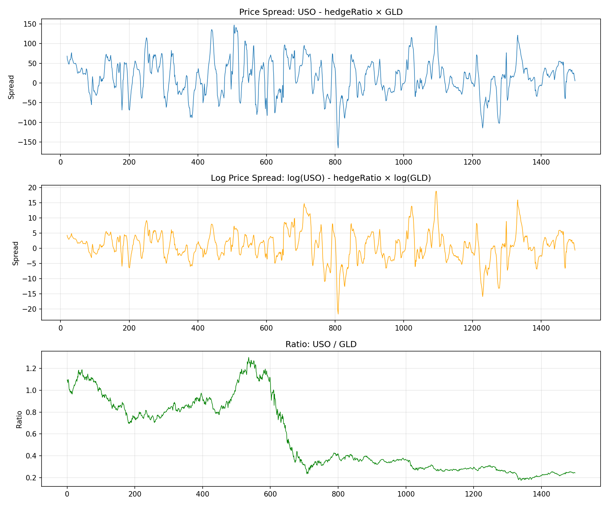
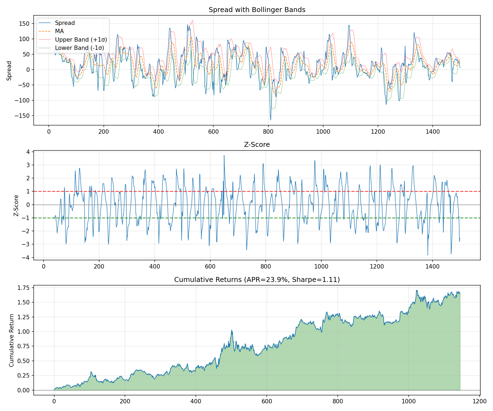

# Chapter 3: 평균 회귀 전략 구현 (Implementing Mean Reversion Strategies)
# 분석 리포트

> **생성 시간**: 2026-02-15 20:50:22
> **데이터 출처**: Ernest Chan's "Algorithmic Trading" (2013)

---

## 목차

1. [개요 및 문제 정의](#1-개요-및-문제-정의)
2. [사용 데이터](#2-사용-데이터)
3. [스프레드 유형 비교](#3-스프레드-유형-비교)
4. [볼린저 밴드 전략](#4-볼린저-밴드-전략)
5. [칼만 필터 전략](#5-칼만-필터-전략)
6. [전략 비교 및 결론](#6-전략-비교-및-결론)

---

## 1. 개요 및 문제 정의

### 💡 해결하려는 문제

**"정상성/공적분이 완벽하지 않은 시계열에서 어떻게 실용적인 평균 회귀 전략을 구현할 수 있을까?"**

Chapter 2에서 정상성과 공적분의 이론적 기초를 배웠지만, 실제 시장에서는:

1. **완벽한 정상성/공적분은 드물다** - 단기 또는 계절적 평균 회귀만 존재하는 경우가 많음
2. **헤지 비율이 변한다** - 시간에 따라 두 자산 간 관계가 변화
3. **무한한 자본이 없다** - 선형 전략의 스케일 인은 비현실적

### 📐 핵심 수학적 개념

| 개념 | 수식 | 의미 |
|------|------|------|
| **가격 스프레드** | $y = y_1 - h \cdot y_2$ | 고정 주식 수 포트폴리오 |
| **로그 가격 스프레드** | $\log(q) = h_1 \log(y_1) + h_2 \log(y_2)$ | 고정 자본 가중치 포트폴리오 |
| **볼린저 밴드** | 진입: $|Z| > Z_{entry}$, 청산: $|Z| < Z_{exit}$ | 이산적 진입/청산 |
| **칼만 필터** | $\hat{\beta}(t|t) = \hat{\beta}(t|t-1) + K(t) \cdot e(t)$ | 동적 헤지 비율 추정 |

---

## 2. 사용 데이터

### 📊 데이터셋 설명

| 파일명 | 내용 | 용도 |
|--------|------|------|
| `inputData_GLD_USO.csv` | GLD(금)/USO(원유) ETF | 스프레드 유형 비교, 볼린저 밴드 |
| `inputData_EWA_EWC.csv` | EWA(호주)/EWC(캐나다) ETF | 칼만 필터 전략 |

### 🎯 데이터 선정 이유

- **GLD-USO**: 금과 원유는 인플레이션과 연관되어 있다는 믿음이 있지만, **공적분하지 않음**
  - 완벽하지 않은 공적분에서 단기 평균 회귀를 포착하는 방법 시연
- **EWA-EWC**: 호주와 캐나다는 모두 원자재 경제, **공적분 관계** 존재
  - 칼만 필터로 동적 헤지 비율 추정 효과 시연

---

## 3. 스프레드 유형 비교

### 🔬 분석 목적

세 가지 스프레드 유형의 성과를 비교하여 어떤 방식이 가장 효과적인지 확인합니다.

### 3.1 스프레드 유형 설명

| 유형 | 수식 | 특징 |
|------|------|------|
| **가격 스프레드** | $y = USO - \beta \cdot GLD$ | 고정 주식 수, 동적 헤지 비율 적용 |
| **로그 가격 스프레드** | $y = \log(USO) - \beta \cdot \log(GLD)$ | 고정 자본 가중치, 리밸런싱 필요 |
| **비율** | $y = USO / GLD$ | 헤지 비율 불필요, 스케일 독립적 |

### 3.2 성과 비교 결과 (GLD-USO 선형 평균회귀 전략)

| 스프레드 유형 | APR | 샤프 비율 | 평가 |
|--------------|-----|-----------|------|
| 가격 스프레드 | 11.17% | 0.6013 | ✅ |
| 로그 가격 스프레드 | 9.19% | 0.5150 | ✅ |
| 비율 | -13.02% | -0.7844 | ❌ |

### 3.3 스프레드 유형별 차트



> 📊 **해석**: 가격 스프레드(동적 헤지 비율)가 가장 정상적으로 보이며, 비율은 평균 회귀하지 않는 경향

---

## 4. 볼린저 밴드 전략

### 📈 전략 원리

볼린저 밴드는 **이산적 진입/청산**을 사용하는 실용적인 평균 회귀 전략입니다.

```python
# Z-Score 계산
z_score = (spread - moving_avg) / moving_std

# 진입 조건
long_entry = z_score < -entry_zscore   # 저평가 → 매수
short_entry = z_score > entry_zscore   # 고평가 → 매도

# 청산 조건
long_exit = z_score >= -exit_zscore    # 평균 회복
short_exit = z_score <= exit_zscore
```

### 4.1 장점

- **자본 관리 용이**: 0 또는 1 단위만 투자
- **파라미터 최적화 가능**: `entry_zscore`, `exit_zscore`, `lookback`
- **선형 전략 대비 개선된 성과**

### 4.2 GLD-USO 볼린저 밴드 전략 결과

**파라미터:**

- Entry Z-Score: ±1
- Exit Z-Score: 0
- Lookback: 20일

**성과 지표:**

| 지표 | 값 | 평가 |
|------|------|------|
| 연간 수익률 (APR) | 23.86% | ✅ 우수 |
| **샤프 비율** | **1.1067** | ✅ 우수 |
| 최대 낙폭 (MDD) | -21.83% | ⚠️ 주의 |

### 4.3 볼린저 밴드 전략 차트



> 📊 **차트 해석**:
> - 상단: 스프레드와 볼린저 밴드 (빨강=상단 밴드, 초록=하단 밴드)
> - 중단: Z-Score와 진입/청산 임계값
> - 하단: 누적 수익률

---

## 4.5. 스케일링 인 vs 올인 비교

### 📐 이론적 배경

Schoenberg & Corwin (2010)은 **스케일링 인(평균 매입)이 백테스트에서 결코 최적이 아님**을 증명했습니다.

가격이 $L_1$으로 하락 후, 확률 $p$로 $L_2 < L_1$까지 추가 하락한 뒤 $F$로 회귀한다고 가정하면:

| 전략 | 기대 이익 |
|------|----------|
| $L_1$에서 올인 | $2(F - L_1)$ |
| $L_2$에서 올인 | $2p(F - L_2)$ |
| 평균 매입 ($L_1$, $L_2$) | $(F - L_1) + p(F - L_2)$ |

전환 확률 $\hat{p} = (F - L_1)/(F - L_2)$를 기준으로, $p < \hat{p}$이면 $L_1$ 올인이 최적, $p > \hat{p}$이면 $L_2$ 올인이 최적입니다. **평균 매입이 최적인 경우는 없습니다.**

단, 실시장에서는 변동성이 일정하지 않으므로 스케일링 인이 더 나은 **실현 샤프 비율**을 낼 수 있습니다.

### 4.6 GLD-USO 실증 비교

| 전략 | APR | 샤프 비율 | MDD | 평가 |
|------|-----|-----------|-----|------|
| 올인 (Z=1) | 23.86% | 1.1067 | -21.83% | ✅ |
| 스케일링 인 (Z=0.5,1.5) | 17.70% | 0.8633 | -27.64% | ✅ |
| 선형 (연속 스케일 인) | 11.17% | 0.6013 | -34.24% | ⚠️ |


> 📊 **해석**: 올인 전략이 가장 높은 수익률을 보이며, Schoenberg & Corwin의 이론과 일치합니다.
> 그러나 스케일링 인은 MDD를 줄여 실시장 적용에 유리할 수 있습니다.

---

## 5. 칼만 필터 전략

### 🔧 칼만 필터란?

칼만 필터는 **숨겨진 변수의 최적 추정**을 위한 선형 알고리즘입니다.

**핵심 방정식:**

$$y(t) = x(t) \beta(t) + \epsilon(t) \quad \text{(측정 방정식)}$$

$$\beta(t) = \beta(t-1) + \omega(t-1) \quad \text{(상태 전이)}$$

$$\hat{\beta}(t|t) = \hat{\beta}(t|t-1) + K(t) \cdot e(t) \quad \text{(상태 업데이트)}$$

### 5.1 칼만 필터의 장점

| 장점 | 설명 |
|------|------|
| **동적 헤지 비율** | 시간에 따라 변하는 헤지 비율 자동 추정 |
| **스프레드 평균** | 절편(β₀)이 스프레드의 이동 평균 역할 |
| **예측 오차 분산** | √Q(t)가 볼린저 밴드의 표준편차 역할 |
| **데이터 가중** | 최신 데이터에 더 많은 가중치, 임의 절단점 없음 |

### 5.2 EWA-EWC 칼만 필터 전략 결과

**파라미터:**

- δ (상태 변화율): 0.0001
- Vε (측정 오차 분산): 0.001
- 평균 헤지 비율: 1.0897 ± 0.1624

**성과 지표:**

| 지표 | 값 | 평가 |
|------|------|------|
| 연간 수익률 (APR) | 54.55% | ✅ 우수 |
| **샤프 비율** | **3.3130** | ✅ 우수 |
| 최대 낙폭 (MDD) | -8.94% | ✅ 양호 |

### 5.3 칼만 필터 전략 차트


> 📊 **차트 해석**:
> - 1행: 칼만 필터 추정 기울기 (헤지 비율) - 1 주위에서 진동
> - 2행: 칼만 필터 추정 절편 - 시간에 따라 변화
> - 3행: 예측 오차 e(t)와 표준편차 √Q(t)
> - 4행: 누적 수익률

---

## 6. 전략 비교 및 결론

### ✅ 핵심 발견

| 전략 | 데이터 | APR | 샤프 | 장점 |
|------|--------|-----|------|------|
| 선형 (가격 스프레드) | GLD-USO | 11.2% | 0.60 | 단순함 |
| 볼린저 밴드 | GLD-USO | 23.9% | 1.11 | 자본 관리 용이 |
| 올인 (Z=1) | GLD-USO | 23.9% | 1.11 | 이론적 최적 |
| 스케일링 인 | GLD-USO | 17.7% | 0.86 | 변동성 적응 |
| 칼만 필터 | EWA-EWC | 54.6% | 3.31 | 동적 헤지 비율 |

### 💡 트레이딩 권고사항

1. **스프레드 유형 선택**:
   - 공적분 페어: 가격 스프레드 또는 로그 가격 스프레드 사용
   - 비공적분 페어: 동적 헤지 비율 필수, 비율은 피하기

2. **볼린저 밴드 전략**:
   - 선형 전략의 실용적 대안
   - Entry/Exit Z-Score는 훈련 데이터로 최적화

3. **칼만 필터 전략**:
   - 공적분 페어에서 가장 우수한 성과
   - δ 파라미터로 헤지 비율 변화 속도 조절

### ⚠️ 주의사항

- **데이터 오류**: 평균 회귀 전략은 이상치에 특히 민감 (잘못된 수익 부풀리기 위험)
- **스케일 인**: 이론적으로 최적이 아닐 수 있으나, 실제로는 변동성 변화에 유용
- **거래 비용**: 본 백테스트에 미포함
- **Look-ahead bias**: 전체 데이터로 파라미터 계산 후 동일 데이터로 테스트

---

*이 리포트는 `run_chapter3_analysis.py`에 의해 자동 생성되었습니다.*
