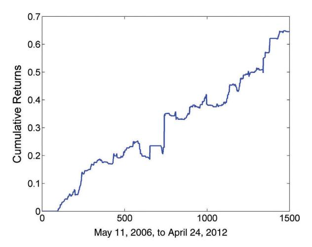
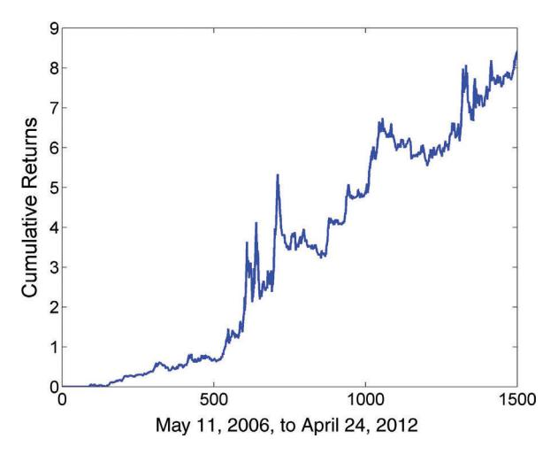
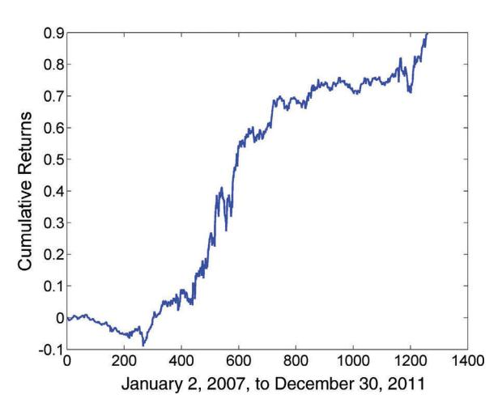

# 주식과 ETF의 평균 회귀 (Mean Reversion of Stocks and ETFs)

주식 시장은 어떤 의미에서 평균 회귀 상품을 찾고 이전 두 장에서 설명한 기본 평균 회귀 거래 기법을 적용하기에 가장 비옥한 토양이다. 이론적으로, 어떤 섹터에 속한 주식 페어를 형성하고 많은 공통 경제 요인에 대한 노출로 인해 공적분할 것으로 기대할 수 있다. 주식 수가 많으므로 분산이 쉽다. 그러나 실제로는 주식과 ETF 거래에 이러한 일반적인 기법을 적용하는 데 몇 가지 심각한 어려움이 있다. 이 장에서는 주식과 ETF에 특정한 문제를 검토할 것이다. 또한 간단한 평균 회귀 전략이 실제로 ETF 페어와 트리플렛에 더 잘 작동한다는 것을 시연할 것이다.

그러나 주식이나 ETF에서 평균 회귀를 찾을 때 3장에서 설명한 전략에만 국한할 필요는 없다. 단기적으로 대부분의 주식은 정상적인 상황에서 평균 회귀 속성을 보인다는 것을 알게 된다. (정상적인 상황이란 주식에 뉴스가 없다는 것을 의미하며, 이 주제는 7장에서 다룬다.) 이것은 주식 가격이 장기적으로 기하 랜덤 워크(geometric random walk)를 따른다는 사실에도 불구하고 그렇다. 우리는 이 단기적, 또는 "계절적" 평균 회귀를 활용하는 전략을 구축할 것이다.

지수 차익거래(index arbitrage)는 또 다른 익숙한 평균 회귀 전략이다. 이 경우, 우리는 주식 대 선물 또는 주식 대 ETF의 공적분에 의존한다. 지수 차익거래의 전통적인 구현으로는 이익이 거의 남지 않기 때문에, 수정된 전략의 예를 제시한다.

앞서 언급했듯이, 지금까지 모든 관심을 쏟은 익숙한 시계열 평균 회귀 외에도, 주식 바스켓에서 널리 퍼진 횡단면(cross-sectional) 평균 회귀 현상이 있다. 시계열 평균 회귀에서는 가격이 자체 과거 가격에 의해 결정된 평균으로 회귀하는 반면, 횡단면 평균 회귀는 바스켓 내 상품들의 누적 수익률이 바스켓의 누적 수익률로 회귀한다는 것을 의미한다. 시계열 평균 회귀에 대한 통계적 검정은 횡단면 평균 회귀에는 대체로 무관하다. 이 추가적인 유형의 평균 회귀는 주식에 대한 어떤 종류의 평균 회귀 전략을 만드는 것을 더욱 쉽게 만든다.

평균 회귀 패턴을 찾기 쉽기 때문에, 주식 시장은 그러한 패턴을 활용하려는 많은 트레이더, 종종 *통계적 차익거래자(statistical arbitrageurs)*라고 불리는 이들을 끌어들인다. 결과적으로, 그러한 전략의 수익률은 일반적으로 감소했다. 그들의 하락하는 성과를 높일 수 있는 몇 가지 간단한 트릭을 논의한다.

다시 한번 강조하지만, 이 책의 백테스팅 결과에는 거래 비용이 포함되어 있지 않다. 이 누락의 한 가지 이유는 거래 비용이 사용된 정확한 실행 방법과 주식 모델에 선택된 정확한 주식 유니버스에 상당히 민감하게 의존할 수 있기 때문이다. 주식 모델 백테스팅에 포함된 더 구체적인 함정은 생존자 편향(survivorship bias)이 있는 데이터의 사용인데, 생존자 편향이 없는 데이터는 구성하기 더 번거롭고 비싸기 때문이다. 희망은 결과가 적어도 지난 1~2년 동안의 결과에서는 그다지 비현실적이지 않다는 것이다. 생존자 편향이 없는 데이터베이스로 백테스트를 다시 하려면, 선택한 주식 지수(일반적으로 S&P 500)도 역사 전체에 걸쳐 구성이 변한다는 것을 기억해야 한다. 이것을 제대로 하려면 과거 일일 지수 구성을 포함하는 데이터베이스가 필요할 것이다. 1장에서 논의한 기본 거래소 대 통합 주식 가격 문제도 기억하라. 여기서 사용된 과거 가격은 모두 통합 시가와 종가이다. 그러나 이러한 전략 중 일부를 시장가시가주문(MOO, market-on-open)이나 지정가시가주문(LOO, limit-on-open), 또는 유사하게 시장가종가주문(MOC, market-on-close)이나 지정가종가주문(LOC, limit-on-close)을 사용하여 구현하면, 기본 거래소 시가나 종가에 체결될 것이다. 일반적으로, 이것은 실제 수익률이 여기 보고된 것보다 낮을 것임을 의미한다.

# ■ **주식 페어 거래의 어려움 (The Difficulties of Trading Stock Pairs)**

주식 페어 트레이딩은 기관 트레이더가 발명한 최초의 알고리즘 평균 회귀 전략 유형으로, 모건 스탠리의 제리 밤버거(Gerry Bamberger)가 시작한 것으로 알려져 있다(Patterson, 2010). 그러나 요즘에는 이 전략에서 수익을 짜내기가 놀라울 정도로 어려울 수 있다.

개별 주식의 일일 가격 시계열을 테스트하면, 2장에서 정의한 정상성의 정의를 거의 충족하지 않는다. 기하 랜덤 워크가 그들의 행동을 상당히 잘 설명한다: 일단 걸어 나가면, 시작점으로 돌아오는 경우가 드물다. (일중 및 계절적 평균 회귀 속성은 나중에 논의할 특수한 경우이다.)

어떤 합리적인 방식(예: 엑손 대 쉐브론, 또는 씨티뱅크 대 뱅크 오브 아메리카)으로 페어를 만들더라도, *아웃오브샘플*에서는 거의 공적분하지 않는다. 아웃오브샘플을 강조하는 이유는 선택한 기간에서 공적분하는 주식 페어를 찾는 것은 꽤 쉽지만, 이후 아웃오브샘플 기간에서 공적분을 쉽게 잃을 수 있기 때문이다. 이 어려움의 이유는 한 회사의 운명이 경영 결정과 경쟁에 따라 매우 빠르게 변할 수 있기 때문이다. 두 회사가 같은 산업 섹터에 있다는 사실이 같은 운명에 처할 것을 보장하지 않는다(AAPL 대 BBRY를 생각해 보라). 결론은 각 회사에 대한 펀더멘털 이해가 있고 그들 중 하나에 대한 나쁜 뉴스가 공개되기 전에 적시에 포지션을 청산할 수 없다면, 평균 회귀 전략을 사용하여 단일 주식 페어 거래에서 지속적으로 수익을 내기 어렵다는 것이다.

많은 수의 주식 페어를 거래해서 일부 페어의 간헐적인 탈선이 전체 포트폴리오의 수익성에 영향을 미치지 않게 하면 어떨까? 대수의 법칙(law of large numbers)은 아웃오브샘플 기간에서 개별 페어의 기대 수익률이 양수인 경우에만 우리에게 유리하게 작동하지만, 주식 페어에서 이것이 그렇다는 것을 발견하지 못했다. 분명히, "좋은" 페어에서 얻은 작은 이익은 "나빠진" 페어의 큰 손실에 완전히 압도되었다.

주식 페어 트레이딩의 이러한 근본적인 문제 외에도, 두 가지 추가적인 기술적 어려움이 있다.

첫 번째 어려움은 공매도 제약(short-sale constraint)이다. 빌리기 어려운 주식을 공매도하는 것을 포함하는 주식 페어에 특히 위험한데, 포지션이 궁극적으로 수익성이 있더라도 가장 수익성이 없고 부적절한 시점에 청산을 강요받을 수 있기 때문이다. 이것은 이 주식을 숏하고 있을 때 예상치 못한 호재로 갑자기 가치가 상승하고, 이 주식의 많은 대여자들이 그것을 팔려고 할 때 발생할 수 있다. 이 경우, 빌린 주식이 회수될 수 있고, 큰 손실에 이 포지션을 커버하기 위해 매수를 강요받으면서 다른 레그의 롱 포지션을 매도하게 된다. 이것을 *숏 스퀴즈(short squeeze)*라고 한다.

같은 공매도 제약 제목 하에, 2010년 이후 미국 주식 시장에서 시행 중인 새로운 대체 업틱 규칙(alternative uptick rule)도 주식 페어 전략의 백테스팅과 라이브 실행 모두에 불확실성을 만든다. 서킷 브레이커가 발동되면, 우리는 본질적으로 숏 시장가 주문을 보내는 것이 금지된다.

두 번째 어려움은 주식 페어의 일중 거래에서 발생한다. 주식 페어 트레이딩의 이익 마진이 수년에 걸쳐 감소함에 따라, 최적의 가격을 포착하기 위해 일중에 포지션을 진입하고 청산하는 것이 필수적이 되었다. 또한, 트레이더가 주식 페어에서 오버나이트 포지션을 갖지 않으면, 위에서 언급한 장기 포지션을 괴롭히는 기업 펀더멘털 가치 변화를 피할 수 있을 것이다. 그러나 주식의 일중 페어 트레이딩은 주식(및 ETF)에 대한 전국최우선호가(NBBO, national best bid and offer) 시세 규모가 매우 작아졌다는 문제에 부딪힌다. 이것은 기관 트레이더들의 다크풀(dark pool) 또는 표시되지 않는 "아이스버그" 주문 사용의 만연, 스마트 실행 알고리즘에 의한 대형 주문의 매우 작은 자녀 주문으로의 분할, 자주 취소하고 교체할 수 있는 소형 주문을 제출하는 고빈도 트레이더의 출현, 그리고 마지막으로 고빈도 트레이더에게 이용당하는 것을 피하기 위해 대형 주문 규모를 표시하기 꺼리는 마켓 메이커 때문일 수 있다.

예를 들어, AAPL이 100주의 NBBO 규모만 갖는 것은 드문 일이 아니다! 따라서 거래 또는 호가를 사용하여 주식 페어 트레이딩 전략을 백테스팅하는 것은 100주만 거래하거나 상당한 거래 비용을 포함하지 않는 한 그다지 현실적이지 않다. 같은 현상이 라이브 실행에서도 어려움을 초래한다. NBBO 가격에 의해 거래 신호가 발동된 후 양쪽에 시장가 주문을 제출한다면 상당한 슬리피지를 겪을 수 있다. 한쪽(또는 주문의 작은 비율로 양쪽에 보내고 일시적으로 작은 헤지되지 않은 포지션을 감수)에 지정가 주문을 보내고 완전히 체결되지 않은 경우 이 주문의 가능한 취소와 재제출을 적극적으로 관리해야 한다.

왜 주식 페어 트레이딩이 과거에 그렇게 수익성이 있었을까? 한 가지 일반적인 이유는 당시 시장이 훨씬 더 비효율적이어서, 평균 회귀하는 페어에서 얻는 정상적인 이익이 그렇지 않은 페어에서의 손실을 감당하기에 충분히 컸다는 것이다. 이것은 물론 수익성 있는 전략에 대한 일반적인 재앙이지만, 주식 페어 트레이딩과 같이 잘 알려진 전략에 특히 심각하다. 주식 페어 트레이딩의 이익 감소에 대한 한 가지 구체적인 이유는 미국 주식 가격의 소수점화(decimalization)이다. 소수점화로 인해 매수-매도 스프레드가 극적으로 좁아져서, 일종의 마켓 메이커 역할을 하는 페어 트레이더들은 그들의 마켓 메이킹 이익도 감소했다(Serge, 2008).

물론, 주식 페어 트레이딩이 매우 효율적인 미국 시장에서 수익성이 없다는 사실이 다른 나라에서 수익성이 없다는 것을 의미하지는 않는다. 그러나 미국 시장에서는 대신 ETF를 수익성 있게 페어 트레이딩할 수 있는 대안이 있다.

# ■ **ETF 페어(및 트리플렛) 트레이딩 (Trading ETF Pairs (and Triplets))**

주식 페어 대신 ETF 페어를 거래하는 것의 한 가지 장점은, 공적분하는 것으로 발견되면 ETF 페어가 아웃오브샘플 데이터에서 무너질 가능성이 적다는 것이다. 주식 바스켓의 펀더멘털 경제가 단일 회사의 것보다 훨씬 느리게 변하기 때문이다. 예를 들어, 호주와 캐나다 모두 원자재 기반 경제이므로, EWA와 EWC(각각의 주식 지수 ETF)는 공적분 검정에 좋은 후보이다. 그리고 실제로 3장에서 그들의 공적분을 확인했다. 2009년에 내 블로그에서 이 페어를 언급했고([http://epchan.blogspot.com/2009/11/in-praise-of-etfs.html?showComment=1257434002472#c1235760260813269054](http://epchan.blogspot.com/2009/11/in-praise-of-etfs.html?showComment=1257434002472#c1235760260813269054)), 이 글을 쓰는 시점(2012년 11월)까지 그들의 공적분은 계속된다. ETF의 페어 선택 과정은 꽤 쉽다: 공통 경제 요인에 노출된 ETF를 찾아야 한다. 국가 ETF 외에도, 섹터 ETF는 공적분 상품을 찾기 위한 또 다른 비옥한 토양이다. 예를 들어, 소매 펀드 RTH는 필수 소비재 펀드 XLP와 공적분한다. 다소 같은 섹터를 추적하는 ETF의 증가로, 페어 트레이딩 기회가 꾸준히 증가하고 있다.

나의 또 다른 선호하는 ETF 페어링은 원자재 ETF와 그 원자재를 생산하는 회사들의 ETF 사이이다. 금 펀드 GLD 대 금광 펀드 GDX가 좋은 예이다. 논리는 금광 회사의 주요 자산이 금이므로, 그들의 가치가 금 현물 가격과 공적분해야 한다는 것이다. 그리고 실제로 그랬다 - 2008년 7월 14일경까지. 2006년 5월 23일부터 2008년 7월 14일까지 요한센 검정을 사용하여 GLD 대 GDX의 공적분을 테스트하면, 99% 확률로 공적분하지만, 2008년 7월 15일부터 2012년 4월 9일까지의 기간을 테스트하면 공적분을 잃었다. 2008년 7월 14일에 무슨 일이 있었을까? 그때 유가(웨스트 텍사스 중질유 종류)가 배럴당 약 \$145로 정점을 찍었는데, 이것은 사상 최고치였다. 유가가 금 가격과 금광업자들의 주가 사이의 공적분과 무슨 관련이 있을까? 분명히 많은 관련이 있다. 유가가 비싸면 금을 채굴하는 데 훨씬 더 많은 비용이 들고, 따라서 금광업자들의 이익이 줄어들어 금 현물 가격에 비해 주가가 저조해진다("The Wacky World of Gold," 2011).

이 설명에 대한 경험적 지지를 수집하기 위해, 포트폴리오에 오일 펀드 USO를 도입하고 이 트리플렛이 2006년부터 2012년까지의 전체 기간에 걸쳐 공적분하는지 확인할 수 있다. 요한센 검정은 하나의 공적분 관계가 존재할 99% 확률로 공적분한다는 것을 보여준다. 따라서 GLD와 GDX만 거래하는 대신 이 트리플렛 포트폴리오를 거래할 수 있다. 트리플렛 거래가 너무 번거롭다고 생각하더라도, 적어도 유가가 특정 임계값을 초과할 때마다 GLD 대 GDX 거래를 중단하는 규칙을 갖추어야 한다.

이 예는 특별한 의미가 있다. 과학자들이 처음 설명되지 않은 현상을 접하면, 그 원인에 대한 직감을 형성한 다음, 이 직감을 경험적으로 테스트할 방법을 찾는다. 우리는 거래에 접근할 때 같은 과학적 과정을 채택해야 한다. 거래 전략이 작동을 멈추면, 그 이유에 대한 가설을 형성한 다음, 그 가설이 데이터로 지지되는지 경험적으로 테스트해야 한다. 이 과정의 결과는 종종 수익성을 회복하는 수정된 전략이다.

오일 펀드 USO 대 에너지 섹터 펀드 XLE가 원자재 대 원자재 생산자 페어의 또 다른 예라고 생각할 수 있지만, 이 페어링에는 문제가 있다. GLD가 금을 보유하고 있어 금 현물 가격을 반영하는 반면, USO는 실제로 오일을 보유하지 않는다. USO는 오일 선물 계약에 투자한다. 5장에서 논의하겠지만, 원자재의 선물 가격은 현물 가격과 다르다. XLE가 오일 현물 가격과 공적분하더라도, USO와 반드시 공적분하지 않을 수 있다. 물론, 이 문제는 원자재 선물 펀드 대 원자재 생산자 펀드 모두를 괴롭힌다. 원자재 펀드가 선물보다 실제 원자재를 보유한다면 그러한 페어의 평균 회귀 거래가 훨씬 덜 위험할 것이다.

ETF 페어 거래의 메커니즘은 주식 페어 거래와 동일하다. 구 업틱 규칙은 ETF를 면제했지만, 새로운 대체 업틱 규칙은 미국 주식 거래소에서 거래되는 모든 증권을 다룬다. 그러나 ETF의 NBBO 규모는 확실히 주식보다 훨씬 크다. 예를 들어, 일반적인 날에 EWC의 NBBO 규모는 약 5,000주일 수 있다.

# ■ **일중 평균 회귀: 갭매수 모델 (Intraday Mean Reversion: Buy-on-Gap Model)**

주식 가격은 많은 금융 학자들이 지칠 줄 모르고 상기시키듯이 기하 랜덤 워크를 따른다(Malkiel, 2008). 그러나 이것은 가격 시계열을 정기적인 간격(예: 일일 종가 사용)에서 엄격하게 평균 회귀에 대해 테스트할 때만 사실이다. 트레이더로서 우리의 임무는 데이터 스누핑 편향을 피하면서 평균 회귀가 규칙적으로 발생하는 특수한 조건이나 특수한 기간을 찾는 것이다. 다음 전략이 보여주듯이, 주식에 대해서도 일중 시간 프레임에서 계절적 평균 회귀가 발생할 수 있다.

전략의 규칙은 다음과 같다:

- 1. 전일 저가에서 당일 시가까지의 수익률이 1 표준편차보다 낮은 모든 주식을 시장 개장 근처에서 선택한다. 표준편차는 지난 90일의 일일 종가 대 종가 수익률을 사용하여 계산된다. 이것들은 "갭 다운"한 주식들이다.
- 2. 시가가 종가의 20일 이동평균보다 높도록 요구하여 이 주식 목록을 좁힌다.
- 3. 이 목록 내에서 전일 저가에서 가장 낮은 수익률을 가진 10개의 주식을 매수한다. 목록에 10개 미만의 주식이 있으면 전체 목록을 매수한다.
- 4. 시장 마감 시 모든 포지션을 청산한다.

이 전략의 논리는 주식 지수 선물이 개장 전에 하락하는 날에, 특정 주식들이 개장 시 패닉 셀링으로 인해 불균형하게 하락한다는 것이다. 그러나 일단 이 패닉 셀링이 끝나면, 주식은 하루 동안 점차 상승할 것이다.

규칙 2는 평균 회귀 전략에서 종종 매우 유용하다: 이것은 기본적으로 평균 회귀 전략에 중첩된 모멘텀 필터로, 자주 사용할 기법이다. 일반적으로 "약간만" 하락한 주식은 "많이" 하락한 주식보다 반전 가능성이 더 높다. 후자는 종종 부정적인 어닝 발표와 같은 부정적인 뉴스를 가진 것들이기 때문이다. 부정적인 뉴스로 인한 하락은 회귀할 가능성이 적다. 우리는 실제로 그러한 속보를 기반으로 모멘텀 전략을 개발할 수 있다(7장에서 더 자세히). 또한, 주식이 장기 이동평균보다 높다는 사실은 거래 기간이 더 긴 롱온리 펀드와 같은 더 큰 플레이어로부터 매도 압력을 끌어들인다. 개장 시 이 유동성 수요가 가격에 대한 하방 압력을 과장할 수 있지만, 유동성 수요로 인한 가격 움직임은 그러한 수요가 사라질 때 주식의 펀더멘털 경제 변화로 인한 가격 움직임보다 회귀할 가능성이 더 높다. 따라서 이 전략은 전통적인 일간 주식 페어 트레이딩이 실패할 가능성이 있는 뉴스가 많은 환경에서 성공할 수 있다.

이 전략을 백테스트하기 위한 MATLAB 코드가 예제 4.1에 표시되어 있다.

### **예제 4.1: SPX 주식에 대한 갭매수 모델 (Example 4.1: Buy-on-Gap Model on SPX Stocks)**

이 코드는 갭매수 모델을 백테스트하며 *bog.m*으로 다운로드할 수 있다. 세 개의 *T* × *N* 배열 *op*, *lo*, *cl*을 입력으로 필요로 하며, 여기서 *T*는 일수, *N*은 유니버스의 주식 수이고, *op*는 일일 시가, *lo*는 일일 저가, *cl*은 일일 종가를 포함한다. 백테스트에 사용한 주식 유니버스는 S&P 500이지만, 생존자 편향이 있는 것이다.

```
topN=10; % Max number of positions
entryZscore=1;
lookback=20; % for MA
stdretC2C90d=backshift(1, smartMovingStd(calculateReturns ...
 (cl, 1), 90));
buyPrice=backshift(1, lo).*(1-entryZscore*stdretC2C90d);
retGap=op-backshift(1, lo))./backshift(1, lo);
pnl=zeros(length(tday), 1);
positionTable=zeros(size(cl));
ma=backshift(1, smartMovingAvg(cl, lookback));
for t=2:size(cl, 1)
       hasData=find(isfinite(retGap(t, :)) & op(t, :) ...
        < buyPrice(t, :) & op(t, :) > ma(t, :));
       [foo idxSort]=sort(retGap(t, hasData), 'ascend');
       positionTable(t, hasData(idxSort(1:min(topN, ...
        length(idxSort)))))=1;
end
retO2C=(cl-op)./op;
pnl=smartsum(positionTable.*(retO2C), 2);
ret=pnl/topN;
ret(isnan(ret))=0;
```

이 전략은 2006년 5월 11일부터 2012년 4월 24일까지 연간 수익률(APR) 8.7%와 샤프 비율 1.5를 갖는다. 누적 수익률 곡선은 그림 4.1에 묘사되어 있다.

나는 내 개인 계좌와 공동 관리한 펀드에서 이 전략의 한 버전을 꽤 수익성 있게 거래했다. 불행히도, 그 버전은



**그림 4.1** 갭매수 모델의 누적 수익률

규칙 2를 포함하지 않았고, 2009년 이후로 수익률이 감소했다. 전략의 롱온리 특성도 일부 리스크 관리 과제를 제시한다. 마지막으로, 매일 거래되는 주식 수가 상당히 적어서 전략의 용량이 크지 않다는 것을 의미한다.

예리한 독자는 시가에 진입하기 위한 거래 신호를 결정하기 위해 시가를 사용하고 공식 시가에 체결되는 것이 어떻게 가능한지 궁금할 수 있다. 짧은 대답은 물론: 우리는 할 수 없다! 그러나, 거래 신호를 결정하기 위해 사전 개장 가격(예: ARCA에서)을 사용할 수 있다. 이렇게 결정된 신호는 실제 시가에 의해 결정된 것과 정확히 일치하지 않지만, 희망은 그 차이가 수익률을 소멸시킬 정도로 크지 않을 것이라는 것이다. 이 차이를 *신호 노이즈(signal noise)*라고 부를 수 있다. 또한, 1장에서 설명한 것처럼 통합 가격 대 기본 거래소 가격을 사용하여 이 전략을 백테스팅하는 함정에 유의하라.

이 전략의 거울 이미지는 어떨까? 1 표준편차 갭업했지만 여전히 20일 이동평균보다 낮은 주식을 숏할 수 있을까? 예, 할 수 있다. APR은 46%이고 샤프 비율은 같은 기간에 1.27이다. 롱온리 전략보다 겉보기에 더 높은 수익률에도 불구하고, 숏온리 전략은 더 가파른 드로다운이 있으며(그림 4.2 참조), 앞서 논의한 같은 공매도 제약 함정으로 어려움을 겪는다.

이 전략은 실제로 트레이더들 사이에서 꽤 잘 알려져 있으며, 같은 주제에 많은 변형이 있다. 예를 들어, 분명히 롱온리와 숏온리 버전을 동시에 거래할 수 있다. 또는 주식은 롱하고 주식 지수 선물은 숏하는 헤지 버전을 거래할 수 있다.



**그림 4.2** 갭공매도 모델의 누적 수익률

더 많은 수의 주식을 매수할 수 있지만, 같은 섹터 내의 주식 수를 제한한다. 매수 기간을 시장 개장 이후로 연장할 수 있다. 일중 이익 상한을 부과할 수 있다. 그러나 중요한 메시지는: 일일 봉으로 샘플링했을 때 평균 회귀를 보이지 않는 가격 시계열이 특정 기간 동안 강한 평균 회귀를 보일 수 있다는 것이다. 이것이 짧은 시간 척도에서 작동하는 계절성이다.

# ■ **ETF와 그 구성 주식 간의 차익거래 (Arbitrage between an ETF and Its Component Stocks)**

많은 독자들이 "지수 차익거래" 전략에 익숙할 것인데, 이는 지수를 구성하는 주식 포트폴리오와 그 지수의 선물 사이의 가치 차이를 거래한다. 주식이 지수를 구성하는 데 사용된 것과 같은 방식으로 가중치가 적용되면, 포트폴리오의 시장 가치는 지수 선물과 매우 밀접하게 공적분할 것이다. 아마도 너무 밀접하게 - 불행히도, 이것은 시장 가치의 차이가 극도로 작아진 매우 잘 알려진 전략이다(Reverre, 2001). 가장 정교한 트레이더만이 이 전략에서 이익을 얻을 수 있으며, 이것은 확실히 일중에, 아마도 고빈도로 거래해야 한다(박스 4.1 참조). 이 차이를 증가시키기 위해, 지수의 주식 중 일부만 선택하여 포트폴리오를 형성할 수 있다. 같은 개념은 ETF를 구성하는 포트폴리오와 ETF 자체 사이의 차익거래에도 적용될 수 있다.

#### **고빈도 지수 차익거래 (High-Frequency Index Arbitrage)**

**박스 4.1**

고빈도 트레이더들은 지수의 일중 계산에서 두 가지 결함을 악용하고 이러한 지수를 추적하는 선물과 구성 주식 사이를 차익거래할 수 있었다. 첫 번째 결함은 다우존스, S&P, 나스닥, 러셀을 포함한 많은 주요 지수가 기본 거래소 거래 데이터만 사용하여 계산된다는 것인데(기본 대 통합 주식 가격은 1장 참조), 이는 해당 주식에서 거래된 모든 주식의 30% 미만을 나타낸다(Arnuk and Saluzzi, 2012). 두 번째 결함은 지수가 몇 초에 한 번만 업데이트된다는 것이다. 두 결함 모두 구성 주식 바스켓의 진정한, 가장 최신 시장 가치와 지수 값 자체 사이의 불일치로 이어진다. 결과적으로, 지수 선물 가치는 주식의 순간 시장 가치에 뒤처질 것으로 예상할 수 있다. 지수 선물 가치가 순간 시장 가치보다 높으면, 단순히 선물을 숏하고 그 반대도 마찬가지이다. 이 진정한 순간 주식 시장 가치를 어디서 얻을 수 있을까? 물론, 모든 미국 주식 거래소와 ECN(SIAC 피드가 아닌)의 직접 데이터 피드를 구독하고 이러한 모든 장소에서 밀리초 지연으로 지수의 모든 주식에 대한 거래 가격을 모니터링해야 한다. 고빈도 거래가 쉽다고 누가 말했는가!

이 경우, 구성 주식의 적절한 부분 집합만 선택하여 포트폴리오를 형성한다. 한 가지 선택 방법은 ETF와 개별적으로 공적분하는 모든 주식을 선택하는 것이다. 가장 유명한 ETF인 SPY를 사용하여 이 방법을 시연할 것이다.

1년의 데이터(우리 예에서 2007년 1월 1일부터 2007년 12월 31일까지)를 훈련 세트로 선택하고 요한센 검정을 사용하여 적어도 90% 확률로 SPY와 공적분하는 모든 주식을 찾는다. 그런 다음 각 주식에 동일한 자본으로 이러한 주식의 포트폴리오를 형성하고, 요한센 검정을 다시 사용하여 이 롱온리 포트폴리오가 여전히 SPY와 공적분하는지 확인한다. 이 단계가 필요한 이유는 각 주식에 동일한 자본 가중치를 임의로 할당한다고 해서 반드시 각 구성 주식이 SPY와 공적분하더라도 SPY와 공적분하는 포트폴리오 가격 시계열을 생성하지 않기 때문이다. 이 두 번째 검정에서는 로그 가격을 사용하는데, 각 주식의 자본이 일정하도록 매일 이 포트폴리오를 리밸런싱할 것으로 예상하기 때문이다. (3장의 논의 참조.) 공적분을 확인한 후, 2장에서 설명한 선형 평균 회귀 전략을 백테스트할 수 있다. MATLAB 소스 코드는 예제 4.2에 표시되어 있다.

## **예제 4.2: SPY와 구성 주식 간의 차익거래 (Example 4.2: Arbitrage between SPY and Its Component Stocks)**

이 코드는 *indexArb.m*으로 다운로드할 수 있다. TxN 배열 *cl*을 입력으로 필요로 하며, 여기서 *T*는 일수, *N*은 유니버스의 주식 수이고, *cl*은 일일 종가이다. 백테스트에 사용한 주식 유니버스는 예제 4.1에서 사용한 것과 동일하며, 포함된 심볼은 셀 배열 *stocks*에 있다. 이러한 모든 배열은 구조체 *stks*에 패키징되어 있다. 또한, SPY의 일일 종가에 대한 Tx1 배열 *cl*이 필요하다. 이것들은 구조체 *etf*에 패키징되어 있다. 물론, *stks*와 *etf*의 날짜가 일치하는지 확인해야 한다. 공통 거래일은 Tx1 배열 *tday*에 포함되어 있다. 이 데이터의 첫 부분에서만 요한센 검정을 실행할 것이다: 2007년 1월 1일부터 2007년 12월 31일까지. 이것이 훈련 세트로 지정된다.

```
trainDataIdx=find(tday>=20070101 & tday<=20071231);
testDataIdx=find(tday > 20071231);
isCoint=false(size(stks.stocks));
for s=1:length(stks.stocks)
       % Combine the two time series into a matrix y2 for
        % input into Johansen test
       y2=[stks.cl(trainDataIdx, s), etf.cl(trainDataIdx)];
       badData=any(isnan(y2), 2);
       y2(badData, :)=[]; % remove any missing data
       if (size(y2, 1) > 250)
            results=johansen(y2, 0, 1); % johansen test
             % with non-zero offset but zero drift, and with
              % the lag k=1.
            if (results.lr1(1) > results.cvt(1, 1))
                 isCoint(s)=true;
            end
       end
end
length(find(isCoint))
```

훈련 세트에서 SPX의 각 주식과 SPY 사이의 요한센 검정에 기반하여, SPY와 (각각 개별적으로) 공적분하는 주식이 98개 있음을 발견한다. 이제 SPY와 공적분하는 모든 주식으로 동일한 자본 배분을 가진 롱온리 포트폴리오를 형성할 수 있다. 그런 다음 이 포트폴리오와 SPY의 공적분을 테스트해야 한다.

#### **예제 4.2 (***계속***)**

```
yN=stks.cl(trainDataIdx, isCoint);
logMktVal_long=sum(log(yN), 2); % The net market value of
 the long-only portfolio is same as the "spread"
% Confirm that the portfolio cointegrates with SPY
ytest=[logMktVal_long, log(etf.cl(trainDataIdx))];
results=johansen(ytest, 0, 1); % johansen test with non-zero
 offset but zero drift, and with the lag k=1.
prt(results);
% Output:
% Johansen MLE estimates
% NULL: Trace Statistic Crit 90% Crit 95% Crit 99%
% r <= 0 variable 1 15.869 13.429 15.494 19.935
% r <= 1 variable 2 6.197 2.705 3.841 6.635
%
% NULL: Eigen Statistic Crit 90% Crit 95% Crit 99%
% r <= 0 variable 1 9.671 12.297 14.264 18.520
% r <= 1 variable 2 6.197 2.705 3.841 6.635
results.evec
%
```

% ans = % % 1.0939 -0.2799 % -105.5600 56.0933

요한센 검정은 롱온리 포트폴리오가 95% 이상의 확률로 SPY와 공적분한다는 것을 나타낸다. 따라서 주식과 SPY를 모두 포함하는 롱-숏 정상 포트폴리오를 형성할 수 있으며, 요한센 고유벡터를 사용하여 SPY 대 주식 포트폴리오의 가중치를 결정한다. (실제로 두 개의 공적분 관계가 있지만, 가장 큰 고유값을 가진 것 - 고유행렬의 첫 번째 열 - 을 선택하여 이 정상 포트폴리오를 형성할 것이다.) 요한센 검정이 로그 가격에 대해 수행되었으므로, 주식 또는 SPY에 대한 헤지 비율(*weights* 배열로 표현됨)은 3장에서 설명한 것처럼 주식 수가 아닌 달러 자본 배분을 나타낸다. (각 개별 주식에 대한 가중치는 물론 동일한 자본 배분 가정으로 인해 같지만, SPY에 대한 가중치와는 다르다.)

(*계속*)

## **예제 4.2 (***계속***)**

그런 다음 예제 2.8과 거의 같은 방식으로 2008년 1월 2일부터 2012년 4월 9일까지의 테스트 기간에 걸쳐 이 포트폴리오에 선형 평균 회귀 전략을 적용한다. 다만 현재 프로그램에서는 포트폴리오 시장 가치의 이동 평균과 표준 편차를 계산하는 데 사용되는 룩백을 사후에 5로 고정했다.

```
% Apply linear mean-reversion model on test set
yNplus=[stks.cl(testDataIdx, isCoint), etf.cl(testDataIdx)]; ...
 % Array of stock and ETF prices
weights=[repmat(results.evec(1, 1), size(stks.cl(testDataIdx,
 isCoint))), ...
    repmat(results.evec(2, 1), size(etf.cl(testDataIdx)))]; ...
     % capital allocation among the stocks and SPY.
logMktVal=smartsum(weights.*log(yNplus), 2); % Log market
 % value of long-short portfolio
lookback=5;
numUnits=-(logMktVal-movingAvg(logMktVal, lookback)) ...
 ./movingStd(logMktVal, lookback);
 positions=repmat(numUnits, [1 size(weights, 2)]).*weights;
 % positions is the dollar capital in each stock or SPY.
pnl=smartsum(lag(positions, 1).*(log(yNplus)- ...
 lag(log(yNplus), 1)), 2);
 ret=pnl./smartsum(abs(lag(positions, 1)), 2);
 ret(isnan(ret))=0;
```

이 전략의 APR은 4.5%이고 샤프 비율은 1.3이다. 누적 수익률 차트(그림 4.3)에서 볼 수 있듯이, 시간이 지남에 따라 성과가 감소하는데, 부분적으로는 새로운 헤지 비율로 새로운 구성 주식을 선택하기 위해 모델을 주기적으로 재훈련하지 않았기 때문이다. 더 완전한 백테스트에서는 이 헤지 비율의 동적 업데이트를 추가할 수 있다.

같은 방법론은 물론 원하는 모든 ETF, 지수 또는 하위 지수에 적용할 수 있다. 또한, 해당 지수 또는 하위 지수를 추적하는 선물이 존재한다면 ETF 대신 선물을 사용할 수 있지만, 이 경우 백테스트에 사용된 선물 가격이 주식의 종가와 동시적인지 주의해야 한다. (이것은 1장에서 잠재적인 함정으로 지적되었다.)

## **예제 4.2 (***계속***)**


**그림 4.3** SPY와 구성 주식 간 차익거래의 누적 수익률

SPX의 모든 500개 주식과 SPY에 대해 직접 요한센 공적분 검정을 실행하고, 알고리즘이 SPY를 포함하는 공적분 상품의 고유벡터를 자동으로 찾게 하지 않은 이유가 궁금할 수 있다. (주식+SPY 유니버스의 모든 공적분 관계가 반드시 SPY를 포함하는 것은 아니지만, SPY를 포함하는 것 하나만 선택하면 된다.) 이 접근법의 문제는 두 가지이다:

- 1. 내가 알고 있는 요한센 검정 구현은 최대 12개의 심볼만 수용할 수 있다(LeSage, 1998).
- 2. 고유벡터는 일반적으로 롱과 숏 *주식* 포지션을 모두 포함한다. 이것은 숏 SPY 포지션으로 헤지된 주식의 롱온리 포트폴리오를 가질 수 없거나 그 반대도 마찬가지라는 것을 의미한다. 이것이 문제인 이유는 주식 포트폴리오에서 숏 포지션과 숏 SPY 포지션을 동시에 가지면, 주식 포트폴리오가 롱일 때도 일부 주식에서 더블 숏이 되어 특정 리스크가 증가하기 때문이다.

주식의 롱온리 포트폴리오를 구성하는 대안적인 방법이 있다. 여전히 요한센 검정을 사용하여 SPX의 각 주식을 SPY와 공적분에 대해 개별적으로 테스트할 수 있다. 이 주식 부분 집합을 찾은 후, 주식 포트폴리오에 포함시킨 다음 제약 최적화 방법(예: 유전 알고리즘 또는 시뮬레이티드 어닐링)을 사용하여 이 주식 포트폴리오 가격 시계열과 SPY 가격 시계열 사이의 평균 절대 차이를 최소화한다. 이 경우 최적화하려는 변수는 주식의 헤지 비율이고, 제약 조건은 모든 헤지 비율이 양수여야 한다는 것이다. MATLAB Global Optimization Toolbox는 이 제약 최적화 작업을 위한 유전 알고리즘 또는 시뮬레이티드 어닐링 함수를 제공한다.

이 전략은 숏 주식 포지션을 포함하는 모든 전략을 괴롭히는 같은 공매도 제약으로 어려움을 겪는다. 그러나 주식 포트폴리오가 약 98개의 주식으로 상당히 분산되어 있기 때문에 문제가 그다지 심각하지 않다. 공매도 제약으로 인해 몇 개의 주식을 제거해야 한다면, 영향은 제한적일 것이다.

# ■ **횡단면 평균 회귀: 선형 롱-숏 모델 (Cross-Sectional Mean Reversion: A Linear Long-Short Model)**

공적분에 기반한 평균 회귀 거래에서, 우리는 고정된 상품 세트와 각 상품에 대해 고정된 주식 수 또는 고정된 달러 자본으로 포트폴리오를 형성한다. 이 고정된 수는 명령(예제 4.2에서처럼), 선형 회귀, 요한센 검정 또는 제약 최적화에 의해 결정될 수 있다. 그러나 포트폴리오가 매일 같은 고정된 상품 세트 또는 이 상품 세트에 대해 같은 가중치로 구성되어야 할 이유는 없다. 많은 포트폴리오 주식 거래 전략의 경우, 에지는 정확히 주식의 지능적인 일일 선택 또는 재가중에서 나온다.

이러한 유형의 소위 "횡단면" 평균 회귀 전략에서, 개별 주식(그리고 이 유형의 전략은 가장 일반적으로 선물이나 통화가 아닌 주식을 포함한다) 가격은 반드시 자체 과거 평균으로 회귀하지 않는다. 오히려, 초점은 단기 상대 수익률에 있고, 이러한 상대 수익률의 직렬 역상관에 의존하여 수익을 창출한다. 대부분의 경우, 상대 수익률은 주식의 수익률에서 특정 유니버스의 모든 주식의 평균 수익률을 뺀 것으로 계산된다. 따라서 주식의 저성과가 과성과에 의해 뒤따르고 그 반대도 마찬가지일 것으로 예상한다. 우리는 상대 수익률만 측정하므로, 이전 (절대) 수익률이 음수이더라도 유니버스의 모든 주식의 평균 수익률만큼 음수가 아니면 주식을 숏할 수 있다.

횡단면 전략의 한 가지 흥미로운 특징은 "시계열" 전략과 대조적으로 모든 개별 주식에서 수익을 기대해서는 안 된다는 것이다. 일부는 어떤 날에는 "헤지" 역할을 할 수 있기 때문이다. 오히려, 수익은 모든 주식에 걸쳐 집계해서만 얻을 수 있다.

나는 이전 책에서 칸다니와 로(Khandani and Lo)가 제안한 그러한 전략을 설명했다(Chan, 2009의 예제 3.7; 원 논문은 Khandani and Lo, 2007). 이 전략으로, S&P 500, S&P 1500 또는 Russell 2000과 같은 선호하는 지수의 모든 주식에 투자하지만, 주식당 다른 자본 배분으로 투자한다. 매일 장 마감 가까이에, *i*번째 주식에 배분된 롱 또는 숏 자본 $w_i$를 다음과 같이 결정한다:

$$w_i = -\frac{r_i - \langle r_j \rangle}{\sum_k |r_k - \langle r_j \rangle|} \qquad (4.1)$$

여기서 $r_i$는 *i*번째 주식의 일일 수익률이고, $\langle r_j \rangle$는 지수에 있는 모든 주식의 평균 일일 수익률이다. 다시 말해, 주식이 동료에 비해 매우 양의 수익률을 가지면 많이 숏하고, 동료에 비해 매우 음의 수익률을 가지면 많이 매수한다. 분모의 정규화 계수 때문에 매일 같은 총 총자본 \$1을 포트폴리오에 투자한다는 점에 유의하라. 이에 대한 MATLAB 코드 조각은 예제 4.3에 표시되어 있다.

#### **예제 4.3: 주식에 대한 선형 롱-숏 모델 (Example 4.3: Linear Long-Short Model on Stocks)**

MATLAB에서 식 4.1의 구현은 매우 간결하다. 일일 종가의 *T* × *N* 배열 *cl*을 입력으로 가정하며, 여기서 평소와 같이 *T*는 거래일 수이고 *N*은 SPX의 주식 수이다. 이 코드는 *andrewlo_2007_2012.m*으로 다운로드할 수 있다.

```
ret=(cl-lag(cl, 1))./lag(cl, 1); % daily returns
marketRet=smartmean(ret, 2); % equal weighted market index
 % return
weights=-(ret-repmat(marketRet, [1 size(ret, 2)]));
weights=weights./repmat(smartsum(abs(weights), 2), ...
 [1 size(weights, 2)]);
dailyret=smartsum(backshift(1, weights).*ret, 2); % Capital
 % is always one
```

SPX에서 백테스트하더라도 2007년 1월 2일부터 2011년 12월 30일까지 APR 13.7%와 샤프 비율 1.3을 갖는다. (일반적으로 더 작은 시가총액 유니버스에서 백테스트하면 더 높은 수익률을 생성한다.) 누적 수익률은 그림 4.4에 플롯되어 있다.

(*계속*)



**그림 4.4** 선형 롱-숏 모델의 누적 수익률

이 전략의 주목할 만한 특징은 완전히 선형이고, 매개변수가 없으며, 거의 완벽하게 달러 중립이라는 것이다. 이보다 더 간단한 전략이 있을까? 그리고 놀랍게도, 리먼 브라더스 파산 연도인 2008년에 30%의 APR을, 미국 연방 부채 등급 하향과 그리스 디폴트에 대한 높은 불안으로 가득 찬 2011년에 11%의 APR을 달성했다. (2008년 초부터의 성과는 전략이 2007년에 발표되었으므로 진정한 아웃오브샘플 테스트이다.)

이전 책에서 나는 또한 전일 종가에서 당일 시가까지의 수익률을 사용하여 시가 진입을 위한 가중치를 결정함으로써 이 전략의 수익률을 향상시킬 수 있다고 제안했다. 모든 포지션은 장 마감 시 청산되므로 일중 전략으로 전환된다. 수정된 MATLAB 코드 조각은 예제 4.4에 표시되어 있다.

예제 4.3과 4.4에서 사용한 상대 수익률보다 주식 가격의 횡단면 평균 회귀를 더 잘 예측하는 다른 변수(또는 "팩터"라고도 함)가 있을 수 있다. 트레이더가 주식을 순위 매기는 데 사용하는 인기 있는 변수 중 하나는 주가수익비율(P/E ratio)인데, 여기서 수익은 지난 분기의 수익이거나 분석가나 회사 자체가 추정한 예상 수익일 수 있다. 논리는

## **예제 4.4: 주식에 대한 일중 선형 롱-숏 모델 (Example 4.4: Intraday Linear Long-Short Model on Stocks)**

예제 4.3에서 필요한 입력 외에도, 주식의 일일 시가를 포함하는 *T* × *N* 배열 *op*도 필요하다.

```
ret=(op-backshift(1, cl))./backshift(1, cl); % daily returns
marketRet=smartmean(ret, 2); % equal weighted market index
 % return
weights=-(ret-repmat(marketRet, [1 size(ret, 2)]));
weights=weights./repmat(smartsum(abs(weights), 2), ...
 [1 size(weights, 2)]);
dailyret=smartsum(weights.*(cl-op)./op, 2) ...
 ./smartsum(abs(weights), 2);
```

같은 기간에 걸쳐 APR과 샤프 비율은 각각 73%와 4.7이다. 겉보기에 뛰어난 성과에도 불구하고, 시가-종가 버전은 종가-종가 버전에는 없는 몇 가지 단점이 있다.

첫째, 거래 비용(백테스트에 포함되지 않음)이 두 배가 될 것인데, 하루에 한 번이 아닌 두 번 거래하기 때문이다. 둘째, 이 전략도 시가 진입을 위한 거래 신호를 결정하기 위해 "시가"를 사용해야 하므로, 예제 4.1의 갭매수 모델에서 언급한 것과 같은 거래 신호 노이즈에 영향을 받는다.

실제로, 종가-종가 전략의 경우에도 정확한 종가를 사용하여 가중치를 결정한 다음 정확히 그 가격에 진입할 수 없다. 그러나 그 경우, 종가 직전 몇 초의 가격은 일반적으로 실제 공식(기본 거래소) 종가에 훨씬 더 가깝다. 이러한 사전 종가 가격은 기본 시장이 열려 있고 유동성이 높을 때 인쇄되기 때문이다.

어닝 발표나 추정 변경이 있으면 주가가 새로운 균형 가치로 이동할 것이라는 것이다. 따라서 어닝 추정치에 긍정적인 변화를 경험한 주식은 양의 수익률을 누릴 가능성이 높으며, 이 수익률이 어닝 추정치의 변화율과 일치한다면 가격이 평균 회귀할 것으로 기대해서는 안 된다. 따라서 P/E 비율을 사용하여 주식을 순위 매기면 그러한 주식을 숏하는 것을 피할 수 있다.

## **핵심 포인트 (KEY POINTS)**

- 선택의 폭이 엄청나기 때문에 주식 페어를 거래하고 싶은 유혹이 있는가? 뛰어난 백테스트 결과에도 불구하고 아웃오브샘플 성과를 상당히 저조하게 만들 수 있는 회사 펀더멘털의 변화에 주의하라.
- 공적분 ETF 포트폴리오 거래가 주식 페어 트레이딩보다 나을 수 있다.
- 선물을 보유하는 ETF를 페어 트레이딩하고 있는가? 선물의 총 수익률을 결정하는 롤 수익률의 역할에 주의하라.
- 계절적 또는 일중 평균 회귀는 일반적인 정상성이나 공적분 검정으로 감지하기 어렵지만, 매우 수익성이 있을 수 있다.
- 평균 회귀 전략에 모멘텀 필터를 부과하면 일반적으로 일관성이 향상된다.
- 주식과 선물 사이의 지수 차익거래가 더 이상 수익성이 없다고 생각하는가? 지수의 주식 부분 집합만 선택해 보라.
- 횡단면 평균 회귀 전략은 선형 롱-숏 전략으로 매우 쉽게 구현할 수 있다.
- 횡단면 평균 회귀 전략에서 주식 순위 매기기에 사용되는 변수는 일반적으로 상대 수익률이지만, P/E 비율과 같은 다른 펀더멘털 팩터일 수 있다.
