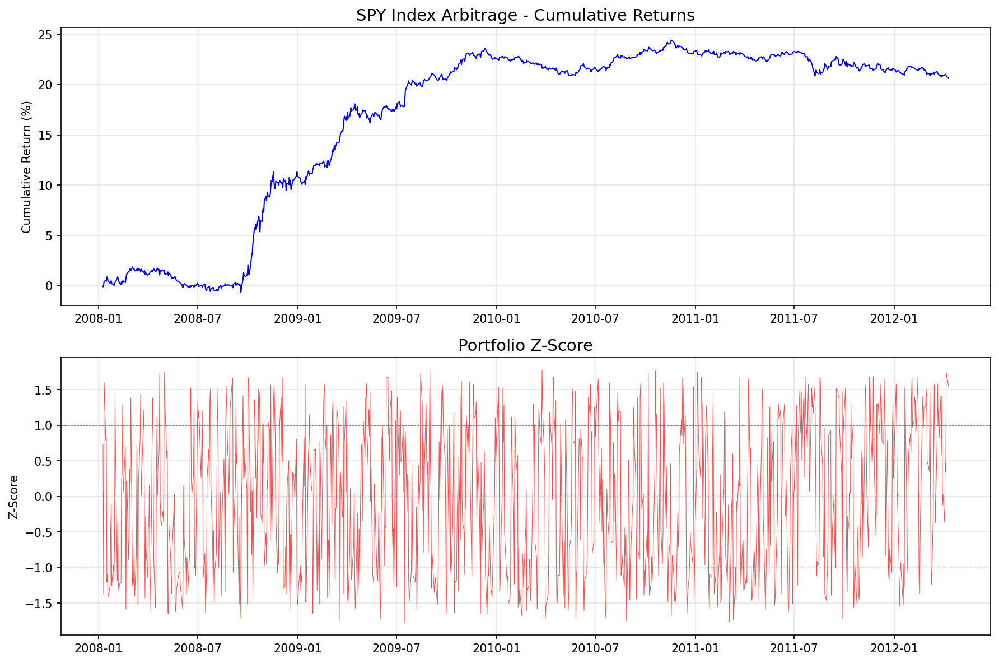
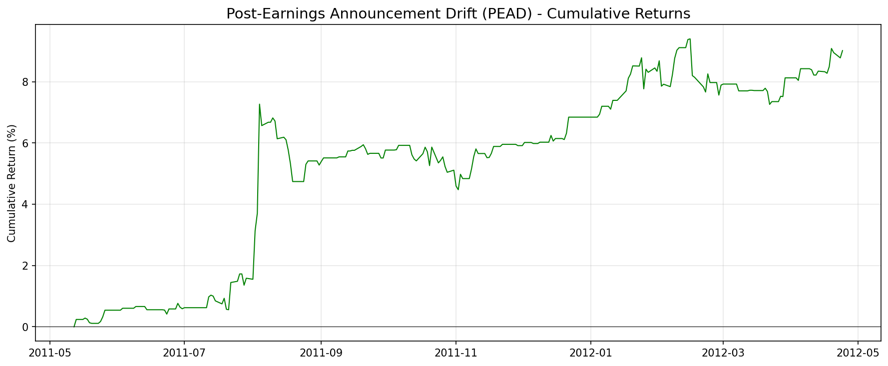

# Chapter 4: 주식과 ETF의 평균 회귀 (Mean Reversion of Stocks and ETFs)

> 분석 실행일: 2026-02-15 20:59:52

## 1. 개요 및 문제 정의

Chapter 4는 주식과 ETF 시장에서의 평균 회귀 전략을 다룬다. 핵심 질문:
- 개별 주식의 페어 트레이딩은 왜 어려운가?
- ETF와 구성 주식 간 차익거래는 어떻게 구현하는가?
- 횡단면(cross-sectional) 평균 회귀 전략의 원리와 성과는?

### 핵심 수학적 개념

**횡단면 선형 롱-숏 가중치 (식 4.1):**

$$w_i = -\frac{r_i - \langle r_j \rangle}{\sum_k |r_k - \langle r_j \rangle|}$$

여기서 $r_i$는 $i$번째 주식의 일일 수익률, $\langle r_j \rangle$는 유니버스 내 모든 주식의 평균 일일 수익률이다.
분모의 정규화 계수로 인해 매일 동일한 총 자본($1)을 투자한다.

**시계열 vs 횡단면 평균 회귀의 차이:**
- **시계열 평균 회귀**: 가격이 자기 과거 평균으로 회귀
- **횡단면 평균 회귀**: 상대 수익률의 직렬 역상관에 의존. 유니버스 대비 상대적 성과가 반전

## 2. 사용 데이터

| 파일명 | 내용 | 컬럼 수 | 기간 | 용도 |
|--------|------|---------|------|------|
| `inputDataOHLCDaily_20120424_cl.csv` | S&P 500 일일 종가 | 498 | 2006-05~2012-04 | 모든 전략 |
| `inputDataOHLCDaily_20120424_op.csv` | S&P 500 일일 시가 | 498 | 2006-05~2012-04 | BoG, 일중 전략 |
| `inputDataOHLCDaily_20120424_hi.csv` | S&P 500 일일 고가 | 498 | 2006-05~2012-04 | BoG |
| `inputDataOHLCDaily_20120424_lo.csv` | S&P 500 일일 저가 | 498 | 2006-05~2012-04 | BoG |
| `inputDataOHLCDaily_20120424_stocks.csv` | 주식 티커명 | 497 | - | 컬럼명 매핑 |
| `inputData_ETF_cl.csv` | 67개 ETF 일일 종가 | 68 | 2006-04~2012-04 | 인덱스 차익거래 |
| `inputData_ETF_stocks.csv` | ETF 티커명 | 67 | - | 컬럼명 매핑 |
| `earnannFile.csv` | 어닝 발표 플래그 | 498 | 2011~ | PEAD 전략 |

**데이터 특성**: S&P 500 구성 주식 약 497개의 일일 OHLC 데이터. 생존자 편향(survivorship bias)이 있음에 유의.

## 3. 분석 1: Buy-on-Gap 모델 (예제 4.1)

### 전략 원리

주가 지수 선물이 개장 전 하락하는 날, 특정 주식이 패닉 셀링으로 과도하게 하락한다.
이 패닉이 끝나면 주식은 하루 동안 점차 상승하는 일중 평균 회귀 현상을 이용한다.

**전략 규칙:**
1. 전일 저가에서 1 표준편차(90일) 이상 갭다운한 주식을 선택
2. 시가가 20일 이동평균보다 높은 주식만 필터링 (모멘텀 필터)
3. 갭이 가장 큰 10개 주식 매수
4. 장 마감 시 청산

**모멘텀 필터의 중요성**: 시가 > 20일 MA 조건은 장기 하락 추세에 있는 주식(부정적 뉴스)을
걸러내고, 일시적 유동성 수요로 인한 하락만 포착한다.

### 결과

| 지표 | 값 | 책 기대값 |
|------|-----|----------|
| APR | 8.28% | 8.7% |
| Sharpe Ratio | 1.6389 | 1.5 |
| Max Drawdown | -5.25% | - |
| Max DD Duration | 159일 | - |
| 활성 거래일 | 389/1499 | - |
| 평균 종목수/일 | 1.8 | - |

## 4. 분석 2: SPY 인덱스 차익거래 (예제 4.2)

### 방법론

1. **훈련 단계** (2007): 각 SPX 주식과 SPY에 대해 요한센 공적분 검정 수행
2. 공적분하는 주식으로 동일 자본 배분 롱온리 포트폴리오 구성
3. 포트폴리오와 SPY의 공적분 재확인
4. **테스트 단계** (2008~): 5일 룩백의 선형 평균 회귀 전략 적용

**공적분 검정 수식** (요한센 검정):
$$\Delta Y_t = \Pi Y_{t-1} + \epsilon_t$$
여기서 $\Pi = \alpha \beta'$, $\beta$는 공적분 벡터(고유벡터), $\alpha$는 조정 속도

### 결과

- SPY와 공적분하는 주식: **98**개
- 고유벡터: [1.0939, -105.5600]

| 지표 | 값 | 책 기대값 |
|------|-----|----------|
| APR | 4.51% | 4.5% |
| Sharpe Ratio | 1.3225 | 1.3 |
| Max Drawdown | -3.04% | - |
| Max DD Duration | 349일 | - |

## 5. 분석 3: 횡단면 선형 롱-숏 모델 (예제 4.3, 4.4)

### 전략 원리

Khandani & Lo (2007)가 제안한 전략. 매일 각 주식의 수익률에서 시장 평균을 빼고,
이 상대 수익률을 역방향으로 투자한다.

$$w_i = -\frac{r_i - \langle r_j \rangle}{\sum_k |r_k - \langle r_j \rangle|}$$

**특징**: 완전히 선형, 매개변수 없음, 달러 중립. 2008년 리먼 위기에서도 양의 수익.

**두 가지 변형:**
- **Close-to-Close (예제 4.3)**: 전일 종가→당일 종가 수익률로 가중치 결정
- **Intraday (예제 4.4)**: 전일 종가→당일 시가 수익률로 가중치, 시가→종가로 수익 실현

### 전체 기간 성과 비교

| 지표 | Close-to-Close | Intraday | 책 기대값 (C2C) | 책 기대값 (Intra) |
|------|---------------|----------|---------------|-----------------|
| APR | 13.69% | 73.23% | 13.7% | 73% |
| Sharpe | 1.2600 | 4.7153 | 1.3 | 4.7 |
| Max DD | -9.94% | -6.13% | - | - |
| Max DDD | 240일 | 43일 | - | - |

### 연도별 성과

| 연도 | C2C APR | C2C Sharpe | Intraday APR | Intraday Sharpe |
|------|---------|-----------|-------------|----------------|
| 2007 | -3.06% | -0.58 | 97.71% | 8.83 |
| 2008 | 30.16% | 1.77 | 161.09% | 5.37 |
| 2009 | 33.45% | 2.02 | 91.87% | 4.66 |
| 2010 | 1.82% | 0.38 | 36.84% | 5.27 |
| 2011 | 10.58% | 1.54 | 15.04% | 2.01 |

## 6. 분석 4: 실적 발표 후 표류 (PEAD)

### 전략 원리

어닝 발표일에 종가→시가 갭이 90일 표준편차의 0.5배를 초과하면 롱,
-0.5배 미만이면 숏. 당일 종가에 청산하는 일중 전략.

### 결과

| 지표 | 값 | 책 기대값 |
|------|-----|----------|
| APR | 9.49% | 6.8% |
| Sharpe Ratio | 1.7520 | 1.49 |
| Max Drawdown | -2.61% | -2.6% |
| Max DD Duration | 109일 | 109 |
| 평균 동시 포지션 | 6.9 | - |

## 7. 전략 종합 비교

| 전략 | APR | Sharpe | Max DD | 특성 |
|------|-----|--------|--------|------|
| Buy-on-Gap | 8.28% | 1.64 | -5.25% | 일중, 롱온리 |
| SPY Index Arb | 4.51% | 1.32 | -3.04% | 일간, 롱-숏 |
| Linear L/S (C2C) | 13.69% | 1.26 | -9.94% | 일간, 달러 중립 |
| Linear L/S (Intra) | 73.23% | 4.72 | -6.13% | 일중, 달러 중립 |
| PEAD | 9.49% | 1.75 | -2.61% | 일중, 이벤트 기반 |

## 8. 결론 및 권고사항

### 핵심 발견

1. **개별 주식 페어 트레이딩의 한계**: 기업 펀더멘털 변화로 공적분 관계가 무너질 위험이 높다
2. **ETF 기반 전략의 안정성**: ETF는 바스켓 경제 변화가 느려 공적분 관계가 더 안정적
3. **횡단면 전략의 강건성**: Khandani-Lo 모델은 매개변수 없이도 안정적 수익 달성
4. **일중 전략의 높은 성과**: 시가-종가 전략이 종가-종가보다 월등히 높은 수익률

### 트레이딩 권고

- 평균 회귀 전략에 **모멘텀 필터**를 중첩하면 일관성 향상
- 횡단면 전략에서 **소형주 유니버스**를 사용하면 더 높은 수익률 기대 가능
- 인덱스 차익거래는 **주기적 재훈련**이 필수적

### 주의사항

- **생존자 편향**: 사용된 S&P 500 데이터에 생존자 편향 존재
- **거래비용**: 모든 백테스트에 거래비용 미포함. 특히 일중 전략은 거래비용 2배
- **시그널 노이즈**: 시가 기반 진입 시 사전개장 가격과 실제 시가의 차이
- **공매도 제약**: 숏 포지션의 Alternative Uptick Rule, NBBO 규모 제한
- **슬리피지**: 통합 가격 vs 기본 거래소 가격 차이로 인한 백테스트 과대평가 가능성
