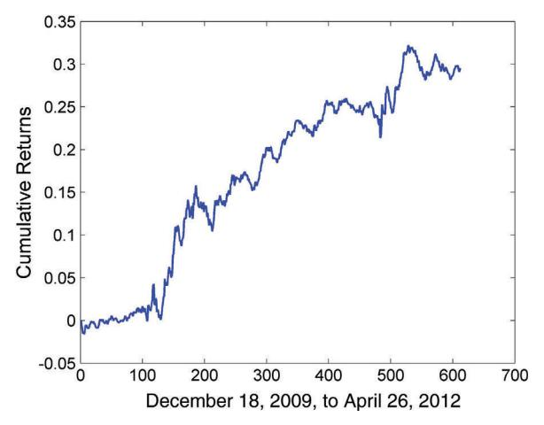
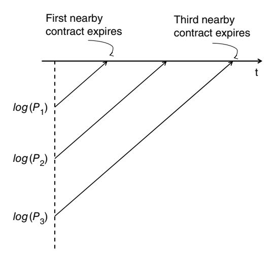
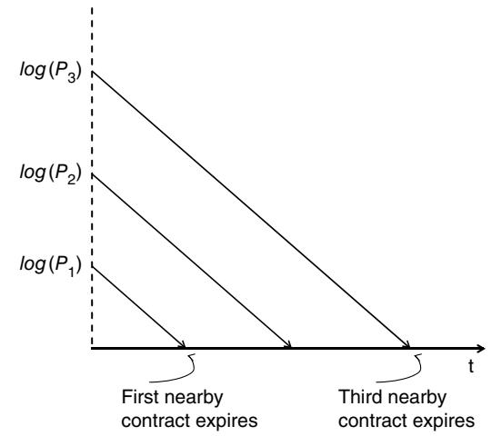
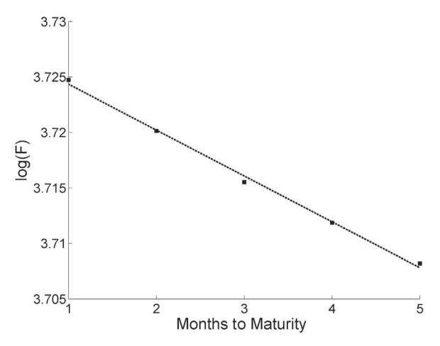
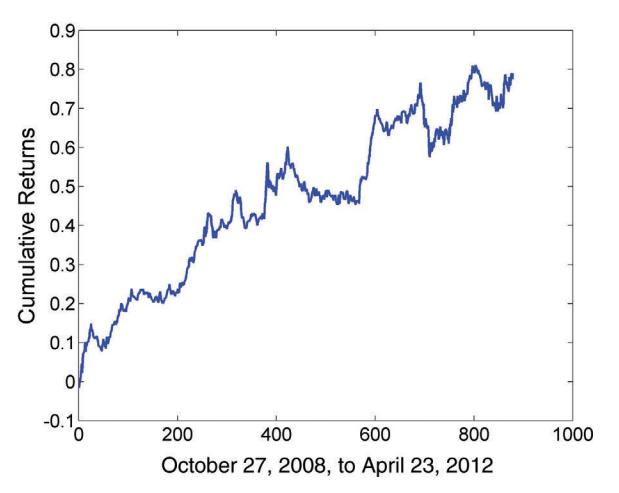
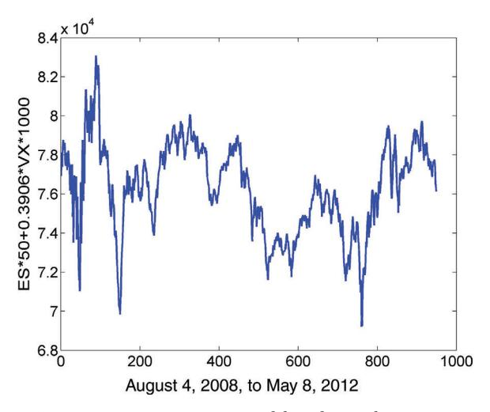

# Mean Reversion of Currencies and Futures

Conventional wisdom tells us that currencies and futures are the domain of momentum traders, and conventional wisdom is right about this. Indeed, most CTAs (Commodities Trading Advisors) are momentum based. It is also true that most currency or future pairs would not cointegrate, and most portfolios of currencies or futures do not exhibit cross-sectional mean reversion. So opportunities for mean reversion strategies in currencies and futures are limited, but not nonexistent. This chapter will guide the reader toward those situations where mean reversion is the exception rather than the rule, such as the trading of futures calendar spreads. In particular, we will discuss a trading strategy for one unique futures intermarket spread: the volatility future versus the stock index future.

In the course of exploring mean reversion in futures, we will also discuss a simple mathematical model of futures prices that will illuminate concepts such as spot versus roll returns and backwardation versus contango. Understanding this model will also help suggest new futures trading strategies without resorting to ad hoc technical indicators.

Trading currencies has certain nuances that are foreign to stock traders. Care must be taken when testing for cointegration of currencies or when computing the returns of a portfolio of currencies by making sure that a point move in one currency pair has the same dollar value as a

point move in another currency pair; otherwise, the results will not make sense. Furthermore, rollover interests might sometimes play an important role in determining total returns. These nuances will be covered in this chapter.

# ■ **Trading Currency Cross-Rates**

The basic idea in forming a stationary portfolio of foreign currencies is very similar to the trading of stock index ETF pairs from diff erent countries: we need to fi nd countries that have similar economic fundamentals. Since we found, for example, that EWA (Australian stock index ETF) and EWC (Canadian stock index ETF) cointegrate, we might expect to fi nd AUD (Australian dollar) to cointegrate with CAD (Canadian dollar) as well. In addition, because both Australia and South Africa have major mining revenues, we might expect AUD to cointegrate with ZAR (South African rand). In fact, traders have called these and other currencies such as the Norwegian krone *commodity currencies.*

Trading currency pairs has a number of advantages compared to trading their corresponding stock index ETF pairs. Usually, liquidity in currencies is higher (especially for best bid/ask sizes), thus lowering transaction costs. The leverage that can be employed for currencies is also much higher, though this can be a double-edged sword of course. There are no short-sale constraints for currencies. Finally, currency trading can be done around the clock, at least fi ve days a week from 5:00 p.m. ET on Sunday to 5:00 p.m. ET on Friday. (ET can be either EDT or EST; i.e., it is either GMT-4 or GMT-5.) This means that we have a lot more trading opportunities in currencies, and we can also employ stop losses in a meaningful way. (If a market is closed for a long period, stop losses are useless as the market can gap up or down when it reopens.)

Despite the conceptual similarity with trading ETF pairs, the mechanics of currency trading is quite diff erent. Let's start with some basic terminology. If we are trading the cross-rate AUD.ZAR, then AUD is called the *base* currency, and ZAR is the *quote* currency. (My personal mnemonic for this: B is ahead of Q alphabetically, so the order is B.Q.) If AUD.ZAR is quoted at 9.58, it takes 9.58 South African rand to buy 1 Australian dollar. Buying 100,000 AUD.ZAR means buying 100,000 Australian dollars, while selling the equivalent amount (100,000 × 9.58 = 958,000 at the preceding quote) of South African rand. However, few brokers actually off er AUD.

ZAR as a cross-rate. So usually we have to buy X units of B.ZAR and sell X units of B.AUD to effectively buy X Australian dollar worth of AUD.ZAR, where B is some other base currency. We usually choose a very liquid base currency such as USD or EUR for this operation. We can denote such a synthetic pair as USD.ZAR/USD.AUD, since the quote of AUD.ZAR will be exactly equal to this ratio of quotes. When we actually trade this synthetic pair live, the realized profit and loss (P&L) will be denominated in both ZAR and AUD. In general, when we compute the returns of a strategy trading B.Q, we are assuming that the profits are denominated in our local currency (USD for U.S. investors), which may be neither B nor Q. So in order for our actual realized P&L to conform to our backtest P&L, we need to regularly convert B and Q into our local currency. For example, if our local currency is USD, and we have realized profits of X units of AUD and Y units of ZAR after a round trip trade, we need to buy X units of ZAR. USD and Y units of ZAR. AUD. If we don't do this regularly, a large accumulated P&L in AUD and ZAR may cause significant deviation from our backtest results.

Even when a cross-rate such as AUD.CAD is ready-made for trading, we may sometimes find it advantageous to weigh the two currencies differently by trading AUD.USD versus USD.CAD separately. The code in Example 5.1 illustrates such a strategy. In this strategy we use the Johansen test to find out the best hedge ratio of capital, or capital weights, between AUD.USD versus CAD.USD. Why not use the conventional quote USD.CAD instead of CAD. USD? That's because in order to interpret the eigenvector from the Johansen test as capital weights, the two price series must have the same quote currency. Otherwise, the point moves of the two presumptive cointegrating instruments would not have the same value, rendering the Johansen test meaningless. Using CAD.USD in our backtest program doesn't make live trading any more difficult: Whenever the program sends an order to "Buy 1 unit of CAD.USD," we should just "Sell 1/y of USD.CAD," provided y is the current quote for USD.CAD.

In Example 5.1, we focus on trading two currencies that can ultimately be reduced to a pair with a common quote currency USD:  $B_1$ .USD —  $B_2$ .USD. So the returns of a portfolio with  $n_1$  units of  $B_1$ .USD and  $n_2$  units of  $B_2$ .USD is

$$r(t+1) = \frac{n_1 y_{1,U}(t) r_1(t+1) + n_2 y_{2,U}(t) r_2(t+1)}{|n_1| y_{1,U}(t) + |n_2| y_{2,U}(t)} \qquad (5.1)$$

as displayed in the last line of the MATLAB code in the example. Here  $r_i$  is the return of  $B_i$ . USD:

$$r_i(t+1) = \frac{y_{i,U}(t+1) - y_{i,U}(t)}{y_{i,U}(t)} \qquad (5.2)$$

where  $y_{i,U}(t)$  and  $y_{i,U}(t+1)$  are the quotes for  $B_i$ . USD at t and t+1 respectively. This is because one unit of  $B_i$ . USD is worth  $y_{i,U}$  in U.S. dollars.

However, if a portfolio has  $n'_1$  units of USD. $Q_1$  and  $n'_2$  units of USD. $Q_2$  instead, then the return can be written more simply as

$$r(t+1) = \frac{n_1' r_1(t+1) + n_2' r_2(t+1)}{|n_1'| + |n_2'|} \qquad (5.3)$$

where

$$r_i(t+1) = \frac{y_{Ui}(t+1) - y_{Ui}(t)}{y_{Ui}(t)} \qquad (5.4)$$

and  $y_{U,i}(t)$  and  $y_{U,i}(t+1)$  are the quotes for  $USD.Q_i$  at t and t+1, respectively. This is because one unit of  $USD.Q_i$  is worth exactly one U.S. dollar.

Let me immediately say that Equations 5.2 and 5.4 are not strictly correct, as we have ignored the *rollover interests*, which we will discuss in the next section. But the impact of rollover interests is usually not large for short-term strategies like the one I describe in Example 5.1, so we have omitted them here for simplicity.

# Example 5.1: Pair Trading USD.AUD versus USD.CAD Using the Johansen Eigenvector

This is a classic linear mean-reverting strategy similar to the one in Example 3.1 (*PriceSpread.m*). Previously, we used a look-back of 20 days to compute the hedge ratio, while here we use a fixed training set of 250 days (which gives better results in hindsight), though we are still using a look-back of 20 days for computing the moving average and standard deviation. However, our current strategy is very different from a typical forex strategy such as the one in Example 2.5. Here, the hedge ratio between the two currencies is not one, so we cannot trade it as one cross-rate AUD.CAD. Instead

#### **Example 5.1 (***Continued***)**

of running the Johansen test on USD.AUD versus USD.CAD, we actually should run it on AUD.USD and CAD.USD, so that the dollar value of a point move in each instrument is the same. Intuitively, this also makes sense, since in a mean-reverting strategy we want to buy CAD if CAD.USD is much lower than AUD.USD.

We assume the input to be two *T* × 1 arrays *usdcad* and *usdaud*, both daily price series. The *T* × 1 array *yport* is the market value of a unit portfolio of AUD.USD and CAD.USD expressed in USD, while *numUnits* is the number of units of this unit portfolio our strategy asks us to own. The *T* × 2 array *positions* denote the market values in USD of AUD.USD and CAD.USD that we should own. Naturally, the P&L (in USD again) is just the sum of the market value of each instrument times their returns, and the daily return of the portfolio is the P&L divided by the total gross market value of the portfolio at the end of the previous day.

The code can be downloaded as *AUDCAD\_unequal.m*.

```
cad=1./usdcad.cl;
aud=audusd.cl;
y=[ aud cad ];
trainlen=250;
lookback=20;
hedgeRatio=NaN(size(y));
numUnits=NaN(size(y, 1), 1); 
for t=trainlen+1:size(y, 1)
  res=johansen(log(y(t-trainlen:t-1, :)), 0, 1);
  hedgeRatio(t, :)=res.evec(:, 1)';
  yport=sum(y(t-lookback+1:t, :).* ...
   repmat(hedgeRatio(t, :), [lookback 1]), 2); 
  ma=mean(yport);
  mstd=std(yport);
  zScore=(yport(end)-ma)/mstd;
  numUnits(t)=-(yport(end)-ma)/mstd; 
end
positions=repmat(numUnits, [1 size(y, 2)]).*hedgeRatio.*y;
pnl=sum(lag(positions, 1).*(y-lag(y, 1))./lag(y, 1), 2); 
ret=pnl./sum(abs(lag(positions, 1)), 2);
```

(*Continued* )

#### Example 5.1 (Continued)

Taking care to exclude the first 250 days of rolling training data when computing the strategy performance, the APR is 11 percent and the Sharpe ratio is 1.6, for the period December 18, 2009, to April 26, 2012. The cumulative returns curve is plotted in Figure 5.1.



**FIGURE 5.1** Cumulative Returns of USD.AUD versus USD.CAD Strategy

You may sometimes find profitable opportunities trading two pairs of entirely different cross-rates against each other:  $B_1.Q_1$  versus  $B_2.Q_2$ . If the strategy calls for a portfolio of  $n_1$  units of  $B_1.Q_1$  and  $n_2$  units of  $B_2.Q_2$ , the daily return (in the presumed local currency of USD) of the portfolio is given by the same Equation 5.1. The  $r_i$  there will be the return of  $B_i.Q_i$ , so Equation 5.2 is replaced by

$$r_i(t+1) = \{ \log (y_{i,Q_i}(t+1)) - \log (y_{i,Q_i}(t)) \} \qquad (5.5)$$

where  $y_{i,Qi}(t)$  is the quote for  $B_i.Q_i$ . The same equations, 5.1 through 5.5, are valid if we had used EUR or any other currency instead of USD as the local currency for computing returns.

As you can see, the key difficulty in backtesting currency arbitrage strategies is not the complexity of the strategies, but the right way to prepare

the data series for cointegration tests, and the right formula to measure returns!

# ■ **Rollover Interests in Currency Trading**

A feature of trading currency cross-rate is the diff erential interest rate earned or paid if the cross-rate position is held overnight. Note that "overnight" in currency trading means holding a position untill or beyond 5:00 p.m. ET. If we are long a pair B.Q overnight, the interest diff erential is *iB* − *iQ*, where *iB* and *iQ* are the daily interest rates of currency B and Q, respectively. If *iQ* > *iB*, then this interest diff erential, also called a rollover interest, is actually a debit interest (i.e., your account will be debited). Actually, for reasons that have to do with the T + 2 day settlement system, if a position was held past the 5 p.m. ET close on day T, and day T + 3 is a weekend or holiday for either currency of the cross-rate, the rollover interest accrued on that position will be multiplied by one plus the number of days the market remains closed. So if a position was held past 5 p.m. ET on Wednesday, the rollover interest is three times the daily rate since the market is closed on Saturday and Sunday. A further exception to this rule applies when we are trading USD.CAD or USD.MXN, where the settlement occurs on day T + 1, so we only multiply the rollover interest by one plus the number of nontrading days if day T + 2 is a weekend or holiday. (Thus, only if a position was held past 5:00 p.m. ET on *Thursday* will the rollover interest be three times the daily rate.) All these considerations impinge on the accuracy of a backtest of strategies that hold overnight positions.

When we calculate the Sharpe ratio for any strategy, we need to calculate the excess return, because the Sharpe ratio is the ratio of the average excess return divided by the standard deviation of the excess returns, suitably annualized. The excess return is the return of the positions that the strategy holds minus the fi nancing cost of those positions. So if we have only intraday positions, the fi nancing cost is zero. If we are trading a long-short dollar neutral equity portfolio, we can assume the fi nancing cost is close to zero, even though the credit interest is usually slightly less than the absolute value of the debit interest. For futures positions, the fi nancing cost is also zero, because futures positions are just contracts, not assets that require cash to fi nance. (We do not count the margin cash requirement, since that cash generates interest in the account.) In the case of currency cross-rates, we can again set the fi nancing cost to be zero, as long as we are careful to add the rollover interest to the percent change of the cross-rate. That is, we need to modify Equation 5.5 so that the excess return *rt*+1 from holding a cross-rate position *POSB.Q* from day *t* to day *t* + 1 is

$$r(t+1) = \{ \log (y_{B,Q}(t+1)) - \log (y_{B,Q}(t)) + \log (1 + i_B(t)) - \log (1 + i_Q(t)) \} \qquad (5.6)$$

where *y*(*t*) and *y*(*t* + 1) are the quotes for BQ at *t* and *t* + 1, respectively (Dueker, 2006).

In Example 5.2, we see how we can take into account rollover interests in backtesting the linear mean-reverting strategy on AUD.CAD.

### **Example 5.2: Pair Trading AUD.CAD with Rollover Interests**

We continue to use the linear mean-reverting strategy in this example, but in contrast to Example 5.1 and in the interest of simplicity, we trade the ready-made pair AUD.CAD, not USD.CAD versus AUD. USD separately. We will take into account the overnight rollover interest rates because this strategy holds beyond 5 p.m. ET. We assume the daily closing prices of AUD.CAD are contained in a *T* × 1 array *dailyCl* and the corresponding trading dates in the *T* × 1 array *tday*. The historical interest rates are taken from the Reserve Bank of Australia website's money market rate, [www.rba.gov.au/statistics/](http://www.rba.gov.au/statistics/tables/#interest_rates) [tables/#interest\\_rates, and](http://www.rba.gov.au/statistics/tables/#interest_rates) the Bank of Canada web site's overnight money market fi nancing rates, [www.bankofcanada.ca/wp-content/](http://www.bankofcanada.ca/wp-content/uploads/2010/09/selected_historical_page33.pdf) [uploads/2010/09/selected\\_historical\\_page33.pdf. T](http://www.bankofcanada.ca/wp-content/uploads/2010/09/selected_historical_page33.pdf)he daily AUD and CAD interest rates are assumed to be two *T* × 1 arrays *aud\_ dailyRates* and *cad\_dailyRates* respectively, matching the dates in *tday*.

The source code can be downloaded as *AUDCAD\_daily.m* lookback=20;

```
% Triple rollover interest on Wednesdays for AUD
isWednesday=weekday(datenum(num2str(tday), 'yyyymmdd'))==4;
aud_dailyRates(isWednesday)=3*aud_dailyRates(isWednesday);
cad_dailyRates=zeros(size(tday));
% Triple rollover interest on Thursdays for CAD
```

#### **Example 5.2 (***Continued***)**

```
isThursday=weekday(datenum(num2str(tday), 'yyyymmdd'))==5;
cad_dailyRates(isThursday)=3*cad_dailyRates(isThursday);
ma=movingAvg(dailyCl, lookback);
z=(dailyCl-ma);
ret=lag(-sign(z), 1).*(log(dailyCl)- ...
 lag(log(dailyCl)+log(1+aud_dailyRates)- ...
 log(1+cad_dailyRates), 1));
```

This simple mean reversion strategy yields an APR of 6.2 percent, with a Sharpe ratio of 0.54, which are much weaker results than those in Example 5.1, which, as you may recall, use a nonunity hedge ratio. It is also worth noting that even if we had neglected to take into account the rollover interest in this case, the APR would increase just slightly to 6.7 percent and the Sharpe ratio to 0.58, even though the annualized average rollover interest would amount to almost 5 percent.

# ■ **Trading Futures Calendar Spread**

Futures contracts with diff erent expiration dates (or "maturities") have different prices, and they have slightly diff erent returns. Pairing up futures contracts with diff erent maturities creates what are known as *calendar spreads.* Since both legs of a calendar spread track the price of the underlying asset, one would think that calendar spreads potentially off er good opportunities for mean reversion trading. But in reality they do not generally mean-revert. To understand why, we need to understand more about what drives the returns of futures in general.

# **Roll Returns, Backwardation, and Contango**

The fact that futures contracts with diff erent maturities have diff erent prices implies that a futures position will have nonzero return even if the underlying spot price remains unchanged, since eventually all their prices have to converge toward that constant spot price. This return is called the *roll return* or *roll yield.* Despite its name, a futures position suff ers this return whether we actually "roll forward" to the next contract. It is an intrinsic



**FIGURE 5.2** Log Prices of Futures with Diff erent Maturities in Backwardation as a Function of Time

part of its total return, which can be decomposed into a spot return and a roll return.

If the contracts are in backwardation, meaning the near (close to expiring) contracts have higher prices than the far contracts, then the roll returns will be positive; otherwise if the contracts are in contango, then the roll returns will be negative. To see this, imagine that the spot price is unchanged throughout time, represented by the horizontal line in Figure 5.2.

We can also pretend that the log futures prices with diff erent maturities conform to the same linear function of time with the same slope but with diff erent off sets, intersecting the spot price at expirations. The question is: Should the slope be positive or negative? Graphically, if the nearer futures have a higher price than the farther futures and have to intersect the horizontal line earlier, they must be upward sloping and have positive roll return, as shown in Figure 5.2. At any given time, the price of the fi rst nearby contract *P*1 is higher than that of the second nearby contract *P*2, and so on. The opposite is true if they are in contango, as illustrated in Figure 5.3. (We display log prices instead of raw prices so that a contract with a constant compounded total return will appear as a straight line.)

Note that this graphical argument merely serves as a mnemonic, not a proof, as, of course, real log futures prices are not linear functions of time, they may even intersect (two contracts of diff erent maturities having the



**FIGURE 5.3** Log Prices of Futures with Diff erent Maturities in Contango as a Function of Time

same price) before they expire, and fi nally the spot price at expiration is unlikely to be constant throughout time. Nevertheless, Figures 5.2 and 5.3 illustrate the typical situation. A mnemonic to help us remember whether backwardation means near contracts have higher prices than far contracts is presented in Box 5.1.

#### **Mnemonic for Backwardation versus Contango**

**BOX 5.1**

I can never remember whether backwardation means near contracts have higher or lower price. If you are like me, you can employ the mnemonic below.

 This mnemonic originated with John Maynard Keynes (Hull, 1997). He and John Hicks argued that for normal commodities, those who actually own the physical commodities (the "hedgers," such as farmers or oil producers) tend to hedge their positions by shorting futures, expecting to lose money on their hedges. Meanwhile, the speculators are the ones who have a net long position, and need to be compensated for taking this risk. So they will buy only futures with positive roll return, or equivalently futures that have lower prices than the expected future spot price; that is, the ones in "normal backwardation." So we should remember that "backwardation" is always associated with "normal," and "normal" means the futures price is always lower than the spot price.

 Of course, this argument is not completely correct, since we will see that crude oil, a perfectly "normal" commodity, is in contango over various periods. But this story gives us a good mnemonic.

To calculate the spot and roll returns for a set of futures contracts, it is helpful to have a simple model of futures prices. For many commodities, we can write

$$F(t, T) = S(t)\exp(\gamma(t - T)) \qquad (5.7)$$

where *t* is the current time, *T* is the expiration time, and *S*(*t*) is the spot price (Hull, 1997). This model implies that the (compounded) roll return γ is constant over time. But we can take a step further, and assume that the (compounded) spot return α is also constant:

$$S(t) = c e^{\alpha t} \qquad (5.8)$$

Essentially, we want to mathematically describe those lines in Figures 5.2 and 5.3, with the slight modifi cation that they terminate not on a horizontal line, but one that has a nonzero slope. So the model we adopt for the price of a future that matures at time *T* is

$$F(t, T) = c e^{\alpha t} \exp(\gamma(t - T)) \qquad (5.9)$$

where *c*, α, and γ are constants. The total return of a contract is given by

$$\frac{\partial(\log F(t, T))}{\partial t} = \alpha + \gamma \qquad (5.10)$$

since *T* is fi xed for a specifi c contract. Finally, the roll return of the futures is given by

$$-\frac{\partial(\log F(t, T))}{\partial T} = \gamma \qquad (5.11)$$

Hence, we have mathematically captured the notion that *total return* = *spot return* + *roll return*.

Based on this model, we can use linear regression to estimate the spot and roll returns of a futures series, as is demonstrated in Example 5.3.

Roll returns can be a curse on many seemingly attractive strategies based on knowledge or intuition informed by the underlying spot price. For example, an ETF of commodity producers (such as XLE) usually cointegrates with the spot price of that commodity. But because of the presence of roll return, this ETF may not cointegrate with the futures price of that commodity. Not understanding this subtlety cost me more than \$100,000 in trading loss, and ruined my fi rst year (2006) as an independent trader.

#### **Example 5.3: Estimating Spot and Roll Returns Using the Constant Returns Model**

If we assume that spot and roll returns are truly constant throughout time, as we did in Equation 5.9, we can use linear regression to estimate their values. It is easy to fi nd the spot return this way, as we just need to regress the log of the spot prices against time. But to fi nd the roll return requires us to pick a fi xed point in time, and regress the prices of the various contracts against their time to maturity. In practice, the regression coeffi cient will depend on that fi xed time, and also on the exact set of contracts available at that time. So despite the assumption of constant roll returns, we will still end up with a slowly varying estimated γ.

We will apply this procedure to a few diff erent futures in diff erent categories: the Brazilian Real future BR, the corn future C, the WTI crude oil future CL, the copper future HG, and the two-year U.S. Treasury Note future TU.

In the following program, we assume that the spot price is contained in an *τ* × 1 array *spot*, and the futures closing price data are stored in a *τ* × *M* array *cl*, where *τ* is the number of trading days, and *M* is the number of contracts. Certainly not all contracts exist at all times, so we will denote the prices for those days when some contracts are nonexistent as NaN.

We will fi rst fi nd the average annualized (compounded) spot return with a simple regression below. (The program can be downloaded as *estimateFuturesReturns.m.*)

```
T=[1:length(spot)]';
T(isBadData)=[];
res=ols(log(spot), [T ones(size(T, 1), 1)]);
fprintf(1, 'Average annualized spot return=%f\n', ...
 252*smartmean(res.beta(1)));
```

Next, we will fi t the forward curve (the future price as a function of maturity date) in order to obtain the values for the roll return γ; that is, we will pick one day at a time and fi t the prices of futures of fi ve nearest maturities to their time-to-maturity *T* (measured in months), as long as there are fi ve consecutive contracts for the fi tting. (The forward curve might well change from contango to

(*Continued* )

#### **Example 5.3 (***Continued***)**

backwardation or vice versa beyond the nearest fi ve contracts.) We store the values of γ in a *τ* × 1 array *gamma*.

```
Gamma=NaN(size(tday));
for t=1:length(tday)
  FT=cl(t, :)';
  idx=find(isfinite(FT));
  idxDiff=fwdshift(1, idx)-idx; % ensure consecutive months 
   % futures
  if (length(idx) >= 5 && all(idxDiff(1:4)==1))
    FT=FT(idx(1:5));
    T=[1:length(FT)]';
    res=ols(log(FT), [T ones(size(T, 1), 1)]);
    gamma(t)=-12*res.beta(1);
  end
end
```

To verify that Equation 5.7 is sensible, we scatter-plot the log futures values of CL against the time to maturity at one fi xed point in time in Figure 5.4 and check that they do fall on a straight line quite neatly. (We restrict ourselves to only fi ve nearest contracts in this scatter plot. Prices of contracts farther out in maturities may not fall onto the same straight line so neatly, indicating a breakdown in Equation 5.7)



**FIGURE 5.4** Scatter Plot of Log Futures Values against Time-to-Maturity for CL 2007 January to May Contracts. The log prices fall neatly on a straight line.

#### **Example 5.3 (***Continued***)**

The annualized values for γ over the period November 22, 2004, to August 13, 2012, for CL are plotted in Figure 5.5.


**FIGURE 5.5** Values of the Roll Return γ for CL. Positive values indicate backwardation and negative values indicate contango.

I listed the average annualized values for the spot returns α and the roll returns γ for the fi ve futures in Table 5.1. You can see that for BR, C, and TU, the magnitude of the roll returns is much larger than that of the spot returns!

| TABLE 5.1  | Annualized Average Spot and Roll Returns for Various Futures |        |  |  |  |
|------------|--------------------------------------------------------------|--------|--|--|--|
| Symbol     | α                                                            | γ      |  |  |  |
| BR (CME)   | –2.7%                                                        | 10.8%  |  |  |  |
| C (CBOT)   | 2.8%                                                         | –12.8% |  |  |  |
| CL (NYMEX) | 7.3%                                                         | –7.1%  |  |  |  |
| HG (CME)   | 5.0%                                                         | 7.7%   |  |  |  |
| TU (CBOT)  | –0.0%                                                        | 3.2%   |  |  |  |

Another example: Every student of fi nance knows that volatility is mean reverting; more precisely, we know that the VIX index is mean reverting. In fact, an augmented Dickey-Fuller (ADF) test will show that it is stationary with 99 percent certainty. You might think, then, that trading VX futures would be a great mean-reverting strategy. (VX is the future that tracks the VIX volatility index trading on the CBOE's Futures Exchange [CFE].) However, a look at the back-adjusted front-month futures prices over time indicates that the mean reversion in VX only happens after volatility peaked around November 20, 2008 (the credit crisis), May 20, 2010 (aftermath of fl ash crash), and then again on October 3, 2011. At other times, it just inexorably declines. Indeed, the ADF test shows that the back-adjusted front contract prices defi nitively do not mean-revert. You can see the diff erence between VIX and the front-month VX in Figure 5.6, a diff erence that is entirely due to roll return. The VX future has been in contango around three fourths of the time, and the average roll return is a very negative annualized –50 percent (Simon and Campasano, 2012). This persistent contango is why we fi nd in Chapter 6 that a momentum strategy works pretty well with VX.

Average roll returns can be quite large compared to their average spot returns for other futures besides VX as well. Table 5.1 shows that the annualized roll return for corn is –12.8 percent compared to a spot return of 2.8 percent, and Erb and Harvey calculated that the annualized roll return for heating oil is 4.6 percent, compared to a spot return of 0.93 percent, over the period December 1982 to May 2004 (Erb and Harvey, 2006).


**FIGURE 5.6** VIX Index versus Back-Adjusted VX Front Contract Prices

# **Do Calendar Spreads Mean-Revert?**

A calendar spread is a portfolio that consists of a long position in one futures contract, and a short position in another futures contract with the same underlying but a diff erent expiration month. Based on our previous experience with spreads in general, calendar spreads would seem to be great candidates for mean reversion: Aren't both legs tracking the exact same underlying asset? But here again, roll returns derail our intuition. The futures price model expressed in Equation 5.7 will make this clear.

As with any spread trading, we can choose to defi ne the spread as the diff erences of log prices of the two legs in order to generate trading signals (see Chapter 3), assuming that we maintain the market value of the two legs to be the same at every period. The log market value of a spread portfolio with a long far contract and a short near contract is simply γ(*T*<sup>1</sup> − *T*2) with *T*<sup>2</sup> > *T*1, according to Equation 5.7. (Again, this simple formula may not hold if *T*<sup>2</sup> − *T*1 is large.) The important point is that the calendar spread trading signal does not depend at all on the spot price, only on the roll return!

As we learned in Chapter 2, return series (as opposed to price series) almost always mean-revert. Here we are considering not the total return of a future, but the roll return component only, so things may be diff erent. (Though the model expressed in Equation 5.7 presupposes that the spot and roll returns are both constant, we may nevertheless attempt to apply it to situations where the roll return varies slowly.) We run the ADF test for 12-month log calendar spread of CL, and discovered that it is indeed stationary with 99 percent probability, and a half-life of 36 days. Furthermore, if we apply our usual linear mean-reverting strategy to the log calendar spread for CL, we do get an APR of 8.3 percent and a Sharpe ratio of 1.3 from January 2, 2008, to August 13, 2012. The details of the backtest are described in Example 5.4.

#### **Example 5.4: Mean Reversion Trading of Calendar Spreads**

As we discussed in the main text, the log market value of a calendar spread portfolio with a long far contract and a short near contract is simply γ(*T*<sup>1</sup> − *T*2), with *T*<sup>2</sup> > *T*1. Since *T*1 and *T*2 are fi xed for a particular calendar spread, we can use the (hopefully) mean- reverting γ to generate trading signals. In the program

(*Continued* )

#### **Example 5.4 (***Continued***)**

*calendarSpdsMeanReversion.m* below, we assume that the price of the CL contracts is stored in a *τ* × *M* array *cl*, where *τ* is the number of trading days, and *M* is the number of contracts. We compute γ in the same way as in Example 5.3, and store the resulting values γ in a *τ* × 1 array *gamma*. As a fi rst step, we fi nd the half-life of γ.

```
isGoodData=find(isfinite(gamma));
gammalag=lag(gamma(isGoodData), 1); 
deltaGamma=gamma(isGoodData)-gammalag;
deltaGamma(1)=[]; 
gammalag(1)=[];
regress_results=ols(deltaGamma, [gammalag ...
 ones(size(gammalag))]);
halflife=-log(2)/regress_results.beta(1);
```

The half-life is found to be about 36 days. To apply our linear mean reversion strategy, we need to compute the Z-Score, with the lookback set equal to the half-life, as demonstrated in Example 2.5.

```
lookback=round(halflife);
ma=movingAvg(gamma, lookback);
mstd=movingStd(gamma, lookback);
zScore=(gamma-ma)./mstd;
```

Here comes the most diffi cult part. We need to pick a pair of contracts, far and near, on each historical day, based on three criteria:

- 1. The holding period for a pair of contracts is 3 months (61 trading days).
- 2. We roll forward to the next pair of contracts 10 days before the current near contract's expiration.
- 3. The expiration dates of the near and far contracts are 1 year apart.

Once we have picked those contracts, we assume initially that we will hold a long position in the far contract, and a short position in the near one, subject to revisions later.

```
isExpireDate=false(size(cl));
positions=zeros(size(cl));
```

#### **Example 5.4 (***Continued***)**

```
isExpireDate=isfinite(cl) & ~isfinite(fwdshift(1, cl));
holddays=3*21;
numDaysStart=holddays+10;
numDaysEnd=10;
spreadMonth=12; % No. months between far and near contracts.
for c=1:length(contracts)-spreadMonth
  expireIdx=find(isExpireDate(:, c));
  expireIdx=expireIdx(end); % There may be some missing 
   % data earlier on
  if (c==1)
    startIdx=max(1, expireIdx-numDaysStart);
    endIdx=expireIdx-numDaysEnd;
  else % ensure next front month contract doesn't start 
   until current one ends
    myStartIdx=endIdx+1;
    myEndIdx=expireIdx-numDaysEnd;
    if (myEndIdx-myStartIdx >= holddays)
       startIdx=myStartIdx;
       endIdx=myEndIdx;
    else
       startIdx=NaN;
    end
end
if (~isempty(expireIdx) & endIdx > startIdx)
    positions(startIdx:endIdx, c)=-1;
    positions(startIdx:endIdx, c+spreadMonth)=1;
  end
end
```

Finally, we apply the linear mean reversion strategy to determine the true positions and calculate the unlevered daily returns of the portfolio. (The daily return is the daily P&L divided by 2 because we have two contracts.)

```
positions(isnan(zScore), :)=0;
positions(zScore > 0, :)=-positions(zScore > 0, :);
ret=smartsum(lag(positions).*(cl-lag(cl, 1))./lag(cl, 1), ...
 2)/2;
ret(isnan(ret))=0;
```

(*Continued* )

#### **Example 5.4 (***Continued***)**

This results in an attractive unlevered APR of 8.3 percent and a Sharpe ratio of 1.3 from January 2, 2008, to August 13, 2012. The cumulative returns curve is shown in Figure 5.7.


**FIGURE 5.7** Cumulative Returns of the Linear Mean Reversion Strategy Applied on CL 12-Month Calendar Spread

Students of commodities markets know that seasonality is often a prominent feature. So you may fi nd that for a particular market, only calendar spreads of certain months (and certain months *apart*) mean-revert. However, we won't pursue these market-dependent details here.

We can try this same linear mean reversion strategy on the VX calendar spreads. It turns out that Equation 5.7 works only for a future whose underlying is a *traded* asset, and VIX is not one. (If you scatter-plot the log VX futures prices as a function of time-to-maturity as we did in Figure 5.4 for CL, you will fi nd that they do not fall on a straight line.) Various researchers have suggested alternative formulae suitable for the VX future (see, for example, Dupoyet, Daigler, and Chen, 2011), but I have found that none can explain the mean-reverting property of VX calendar spreads in the face



**FIGURE 5.8** Cumulative Returns of Linear Mean Reversion Strategy on VX Calendar Spread

of the non-mean reversion of the VX future itself. So we can rely on only our empirical observation that an ADF test on the ratio *back*/*front* of VX also shows that it is stationary with a 99 percent probability. If we apply our usual linear mean-reverting strategy using ratio as the signal (and with a 15-day look-back for the moving average and standard deviations), VX yields an APR of 17.7 percent and a Sharpe ratio of 1.5 from October 27, 2008, to April 23, 2012 (see Figure 5.8 for a plot of its cumulative returns), though it performed much more poorly prior to October 2008. In the next section, I will present graphic evidence that there is a regime change in the behavior of VIX and its futures around the time of the fi nancial crisis of 2008, so perhaps this abrupt change in the strategy performance is related to that as well.

# ■ **Futures Intermarket Spreads**

As I stated in the introduction of this chapter, it is not easy to fi nd futures intermarket spreads (i.e., pairs of futures from diff erent underlyings) that are mean reverting. Nevertheless, let's systematically round up some of the usual suspects.

The most obvious candidate for pair trading futures is intermarket spreads between markets that are closely related. For example, the energy complexes (WTI crude oil CL, Brent crude oil BZ, unleaded gasoline RB, and heating oil HO, all traded on the New York Mercantile Exchange [NYMEX]) should off er rich potential opportunities.

Before we run a Johansen test on these four contracts, we can fi rst examine a well-known portfolio called the *crack spread* consisting of long three contracts of CL, short two contracts of RB, and short one contract of HO. This is called the crack spread because we can obtain gasoline and heating oil by cracking the long hydrocarbon chains of crude oil molecules, and the 3:2:1 hedge ratios come about because three barrels of CL produces approximately two barrels of RB and one barrel of heating oil, though this is not universally true for all refi ners. One advantage of trading the crack spread is that NYMEX off ers a ready-made basket for it, with a much lower margin requirement than if we trade them separately.

However, running an ADF test on the crack spread from May 20, 2002, to May 4, 2012, shows that this spread is not mean reverting. The chart of this spread (Figure 5.9) reveals a dramatic increase in value around March 9, 2007, to July 3, 2008, and then a sharp drop after that, and running the linear mean reversion strategy on it shows negative returns for that period. (Note that we must back-adjust the continuous contracts using prices rather than returns in this test; otherwise, this price spread will show a discontinuous jump at rollovers, as explained in Chapter 1.)

Another spread that would seem to be a good candidate is CL and BZ in a 1:1 ratio. After all, their underlyings are both crude oils. But another quick ADF test will show that it is far from stationary. BZ has relentlessly outperformed CL due to a variety of factors. The likely culprits include the increasing oil production in the United States (Friedman, 2012), the pipeline bottleneck at Cushing, Oklahoma (Philips, 2012), and geopolitical concerns


**FIGURE 5.9** The Crack Spread

such as the embargo against Iranian oil in 2012, which aff ected Europe and therefore BZ more than the United States.

If you want to backtest intermarket spreads yourself, don't forget to make sure that their prices are synchronous, as I cautioned in Chapter 1. In particular, before BZ started trading at the NYMEX on September 5, 2001, it was traded at the Intercontinental Petroleum Exchange in London, which obviously has a diff erent closing time than NYMEX on which CL has always been traded. So backtesting the BZ-CL spread before September 5, 2001, using closing prices would be wrong. Also, we often need to multiply the futures prices by a factor to convert points into USD.

Our search for mean-reverting intermarket futures spreads has not been fruitful so far. But I will now discuss one unusual spread that will change that.

# **Volatility Futures versus Equity Index Futures**

Many traders have observed that volatility is anti-correlated with the stock equity market index: When the market goes down, volatility shoots up, and to a lesser extent, vice versa. One way to visualize this inverse relationship is to plot ES, the E-mini S&P 500 futures front-month prices, against VX, the VIX futures front-month prices. This can be accomplished by the "scatter" function in MATLAB, and the result is displayed in Figure 5.10.

The fi rst obvious feature of this plot is that, indeed, the stock index has an inverse relationship with volatility. But, more interestingly, there appeared to be two main regimes, 2004 to May 2008 and August 2008 to 2012. The second regime has a notably lower volatility for a given stock index level. In plain


**FIGURE 5.10** A Study of Volatility Regimes: ES versus VX

English, the market is less volatile nowadays. However, the range of volatilities is greater now, meaning that we have days with more extreme volatilities than before. (There are other, shorter periods that may represent transitional states, but we will ignore them in our analysis.) It would be a mistake to run a linear regression or apply the Johansen test to a mixture of both regimes, so we focus on the second one, which extends to the time of this writing.

We choose to compute the regression coeffi cients only for the fi rst 500 days of the post–August 2008 data as the training set because later we would like to use the various statistics from this regression to build our trading model. Before we actually run the prices through the linear regression program, we have to remember that the futures prices of VX and ES are in different units: one point move in VX is \$1,000, while one point move in ES is \$50. So we need to multiply the prices of VX by 1,000 and the prices of ES by 50 in order for the hedge ratio to properly refl ect the ratio in the number of contracts.

The linear relationship is shown in Equation 5.11.

$$ES \times 50 = -0.3906 \times VX \times 1,000 + 77,150 \qquad (5.11)$$

where ES and VX are their re spective futures (settlement) prices. The standard deviation of the residues is \$2,047. This means that a portfolio that is long 0.3906 contracts of VX and long one contract of ES should be stationary, as a plot (Figure 5.11) of this portfolio's market value would convince us.

We can construct a Bollinger band–like mean-reverting strategy by shorting this portfolio whenever its value deviates from one standard deviation



**FIGURE 5.11** Stationary Portfolio of ES and VX


**FIGURE 5.12** Cumulative Returns of VX-ES Mean Reversion Strategy

of the residuals determined in the training set. The APR on the test set July 29, 2010, to May 8, 2012, is 12.3 percent, with a Sharpe ratio of 1.4. It was particularly profi table starting around the time of the Standard and Poor's downgrade of the U.S. credit rating. The cumulative returns curve is shown in Figure 5.12.

There is a diff erent VX versus ES strategy that we can employ, which does not rely on the mean-reverting properties of the spread VX-ES. Because that is a momentum strategy, I will discuss it in the next chapter.

#### **KEY POINTS**

- "Commodity" currencies as a group offer many opportunities for cointegration.
- In computing the returns of a portfolio with two currency cross-rates, did you pay attention to whether they have the same quote currency, the same base currency, or neither? The formulae for computing returns are not the same for all cases.
- Futures returns consist of two components: spot returns and roll returns.
- Backwardation means roll returns are positive, and far contracts are cheaper than near contracts. Contango means roll returns are negative, and far contracts are more expensive than near contracts.
- Because of roll returns, mean reversion of the spot price may not induce mean reversion of the futures price.
- Mean reversion of futures calendar spreads of traded assets depends on mean reversion of roll returns.