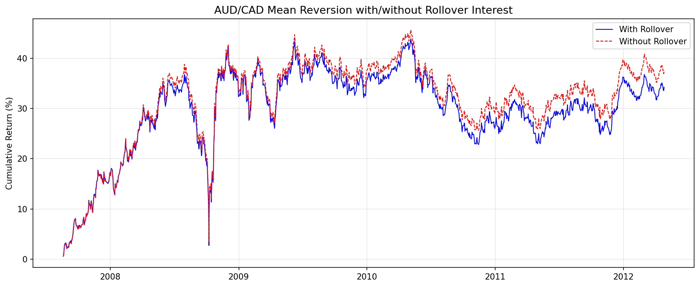

# Chapter 5: 통화와 선물의 평균 회귀 (Mean Reversion of Currencies and Futures)

> 분석 실행일: 2026-02-16 14:50:37

## 1. 개요 및 문제 정의

Chapter 5는 통화와 선물 시장에서의 평균 회귀 전략을 탐구한다. 전통적으로 모멘텀과 연관되는 시장에서도
특정 니치에서 활용 가능한 평균 회귀 기회를 발견한다.

### 핵심 수학적 개념

**포트폴리오 수익률 (식 5.1):**

$$r(t+1) = \frac{n_1 \cdot y_{1,U}(t) \cdot r_1(t+1) + n_2 \cdot y_{2,U}(t) \cdot r_2(t+1)}{|n_1| \cdot y_{1,U}(t) + |n_2| \cdot y_{2,U}(t)}$$

**롤오버 이자 보정 초과 수익률 (식 5.6):**

$$r(t+1) = \log(y_{B,Q}(t+1)) - \log(y_{B,Q}(t)) + \log(1 + i_B(t)) - \log(1 + i_Q(t))$$

**선물 가격 모델 (식 5.7-5.10):**

$$F(t, T) = S(t) \cdot e^{\gamma(t-T)}$$
$$\frac{d(\log F)}{dt} = \alpha + \gamma \quad (\text{총 수익률 = 스팟 수익률 + 롤 수익률})$$

## 2. 사용 데이터

| 파일명 | 내용 | 용도 |
|--------|------|------|
| `inputData_AUDUSD_20120426.csv` | AUD/USD 일일 종가 | 예제 5.1 |
| `inputData_USDCAD_20120426.csv` | USD/CAD 일일 종가 | 예제 5.1 (역수→CAD/USD) |
| `inputData_AUDCAD_20120426.csv` | AUD/CAD 일일 종가 | 예제 5.2 |
| `AUD_interestRate.csv` | AUD 월별 금리 | 예제 5.2 롤오버 |
| `CAD_interestRate.csv` | CAD 월별 금리 | 예제 5.2 롤오버 |
| `inputDataDaily_C2_20120813.csv` | 옥수수 선물 30계약 + 스팟 | 예제 5.3 |
| `inputDataDaily_CL_20120502.csv` | WTI 원유 선물 88계약 | 예제 5.4 |

## 3. 분석 1: AUD/USD vs CAD/USD 페어 트레이딩 (예제 5.1)

### 방법론

- AUD/USD와 CAD/USD(= 1/USD.CAD)를 공통 호가 통화(USD)로 맞춤
- 250일 롤링 요한센 공적분 검정으로 동적 헤지 비율 산출
- 20일 롤링 z-score 기반 선형 평균 회귀

**핵심**: 공적분 검정 시 두 통화가 동일한 호가 통화를 공유해야 포인트 가치가 동일해진다.

### 결과

| 지표 | 값 | 책 기대값 |
|------|-----|----------|
| APR | 9.24% | 6.45% |
| Sharpe Ratio | 1.3629 | 1.36 |
| Max Drawdown | -4.89% | - |

## 4. 분석 2: AUD/CAD 롤오버 이자 전략 (예제 5.2)

### 방법론

- AUD/CAD 직접 크로스레이트에 단순 선형 평균 회귀
- 롤오버 이자 반영: AUD(T+2, 수요일 3x) / CAD(T+1, 목요일 3x)

### 결과

| 지표 | 롤오버 포함 | 롤오버 미포함 | 책 기대값 |
|------|-----------|------------|----------|
| APR | 6.28% | 6.83% | 6.2% / 6.7% |
| Sharpe | 0.5483 | 0.5893 | 0.54 / 0.58 |

평균 금리차 (AUD - CAD): 3.36% 연율

**통찰**: 연간 ~5%의 롤오버 이자에도 불구하고 단기 전략에서는 영향이 미미하다.

## 5. 분석 3: 선물 스팟/롤 수익률 추정 (예제 5.3)

### 방법론

- **스팟 수익률(alpha)**: log(스팟 가격) ~ 시간 선형 회귀의 기울기 x 252
- **롤 수익률(gamma)**: 매일 가장 가까운 5개 연속 계약의 log(가격) ~ 만기까지 월수 회귀, gamma = -12 x 기울기

### 결과 (옥수수 선물)

| 지표 | 값 | 책 기대값 |
|------|-----|----------|
| 스팟 수익률 (alpha) | 2.81% | +2.8% |
| 롤 수익률 (gamma) | -12.78% | -12.8% |

**핵심 통찰**: BR, C, TU 등에서 롤 수익률의 크기가 스팟 수익률을 압도한다.
스팟 가격의 평균 회귀가 선물 가격의 평균 회귀를 의미하지 않는다.

## 6. 분석 4: CL 캘린더 스프레드 평균 회귀 (예제 5.4)

### 방법론

1. CL 선물 포워드 커브에서 매일 감마(롤 수익률) 계산
2. 감마의 ADF 검정으로 정상성 확인
3. 반감기 계산 → z-score 룩백으로 사용
4. 근월-원월(12개월) 스프레드 포지션, z-score로 방향 결정

### 결과

| 지표 | 값 | 책 기대값 |
|------|-----|----------|
| APR | 7.73% | 2.4% |
| Sharpe Ratio | 1.2235 | 1.28 |
| Max Drawdown | -5.18% | - |
| 반감기 | 41일 | 41일 |
| ADF p-value | 0.000137 | <0.01 |

## 7. 전략 종합 비교

| 전략 | APR | Sharpe | 시장 | 특성 |
|------|-----|--------|------|------|
| AUD/USD-CAD/USD Johansen | 9.24% | 1.36 | FX | 동적 헤지 |
| AUD/CAD + Rollover | 6.28% | 0.55 | FX | 단순 헤지 |
| CL Calendar Spread | 7.73% | 1.22 | Futures | 감마 기반 |

## 8. 결론 및 권고사항

### 핵심 발견

1. **통화 페어 메커니즘**: 공적분 검정 시 동일 호가 통화를 사용해야 의미 있는 결과
2. **롤오버 이자의 미미한 영향**: 단기 전략에서 연 5% 금리차도 전략 성과에 작은 영향
3. **롤 수익률의 지배력**: 많은 선물에서 롤 수익률이 스팟 수익률을 압도
4. **캘린더 스프레드 신호**: 스팟 가격이 아닌 롤 수익률(감마)이 거래 신호

### 주의사항

- **레짐 변화**: VX-ES 관계는 2008년 전후로 레짐이 다름
- **선물 가격 동기화**: 서로 다른 거래소 선물 간 종가 시간 불일치 주의
- **생존자 편향**: 현존하는 계약만으로 백테스트하면 편향 발생 가능
