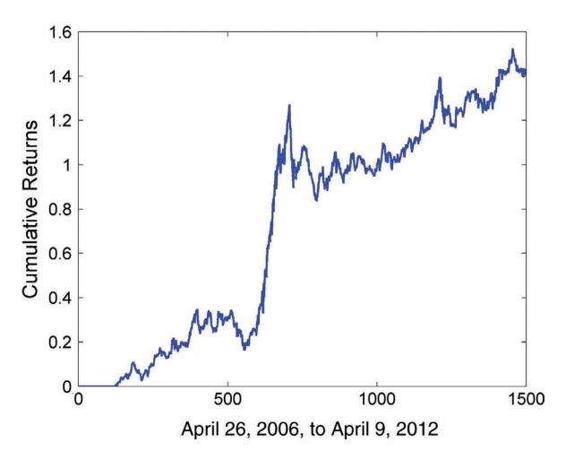
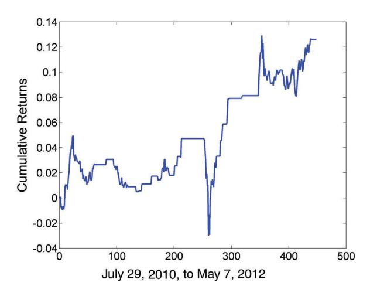

# 제6장: 일간 모멘텀 전략 — 쉬운 해설판

> 이 글은 Ernest Chan의 "Algorithmic Trading" 제6장의 전체 내용을 빠짐없이 담되, 전문 용어와 개념을 일상적인 비유와 풀어쓴 설명으로 재구성한 해설판입니다.

---

## 도입: 모멘텀이란 무엇이고, 왜 중요한가?

여러분, 달리는 기차를 상상해 보세요. 한번 속도가 붙은 기차는 브레이크를 밟아도 곧바로 멈추지 않습니다. 관성이 있기 때문이죠. 금융 시장에서도 비슷한 현상이 있습니다. 한번 오르기 시작한 가격은 계속 오르는 경향이 있고, 한번 내리기 시작한 가격은 계속 내리는 경향이 있습니다. 이것이 바로 **모멘텀(momentum)** — "가격의 관성"입니다.

이전 장에서 다뤘던 평균 회귀 전략이 "가격은 결국 평균으로 돌아온다"는 논리에 기반했다면, 모멘텀 전략은 정반대의 논리입니다. "한번 달리기 시작한 기차의 방향을 따라가자!" 이것이 핵심 아이디어입니다.

### 모멘텀의 네 가지 원인

그렇다면 왜 이런 관성이 생기는 걸까요? 모멘텀에는 네 가지 주요 원인이 있습니다:

1. **선물의 롤 수익률(roll returns) 지속성** — 특히 그 부호(양수/음수)가 오래 유지되는 경향이 있습니다. 마치 강물의 흐름 방향이 쉽게 바뀌지 않는 것과 같습니다.
2. **새로운 정보의 느린 확산, 분석 및 수용** — 좋은 뉴스가 나와도 모든 투자자가 동시에 그 뉴스를 알고 반응하지는 않습니다. 마치 돌을 연못에 던지면 파문이 천천히 퍼져나가듯이, 정보도 시장에 서서히 반영됩니다.
3. **다양한 유형의 펀드에 의한 자산의 강제 매도 또는 매수** — 뮤추얼 펀드가 환매 요청을 받으면 원치 않아도 주식을 팔아야 합니다. 이런 강제 매도가 추가적인 가격 하락을 만들죠.
4. **고빈도 트레이더에 의한 시장 조작** — 초단타 매매자들이 의도적으로 가격 방향을 만들어내기도 합니다.

이번 장과 다음 장에서 각 모멘텀 원인을 활용하는 트레이딩 전략에 대해 하나씩 논의할 것입니다. 특히, 지난 장(제5장)에서 두드러지게 다루었던 선물의 롤 수익률이 다시 중심 주제가 됩니다. 롤 수익률 부호의 지속성을 활용하여 무수히 많은 선물 전략을 구축할 수 있기 때문이죠.

### 시계열 모멘텀 vs 횡단면 모멘텀: 두 가지 맛의 모멘텀

연구자들은 모멘텀을 두 가지 유형으로 분류합니다 (Moskowitz, Yao, and Pedersen, 2010). 이 구분은 제2장에서 평균 회귀를 두 가지로 나눈 것과 정확히 대응합니다.

- **시계열 모멘텀(time series momentum)** — 서핑에 비유할 수 있습니다. 파도(가격 추세)의 방향을 보고, 그 방향을 따라 타는 것입니다. 과거에 올랐던 자산이 미래에도 오를 가능성이 높다는 것이죠. 한 자산의 과거와 미래를 비교하는 것이므로 "시계열"이라고 부릅니다.
- **횡단면 모멘텀(cross-sectional momentum)** — 경마에 비유할 수 있습니다. 여러 말(자산) 중에서 앞서가는 말에 베팅하고, 뒤처지는 말에는 반대로 베팅하는 것입니다. 다른 자산들과의 상대적 성과를 비교하므로 "횡단면"이라고 부릅니다.

시계열 모멘텀은 매우 직관적입니다. "과거에 잘 나간 놈은 앞으로도 잘 나갈 거야!" 횡단면 모멘텀은 "경주마들 중에서 1등 하고 있는 말은 계속 1등 할 가능성이 높아!" 선물과 주식 모두에서 이 두 가지 유형의 모멘텀 예시를 살펴볼 것입니다.

### 왜 "일간(interday)" 모멘텀인가?

이 장에서 설명하는 전략들은 여러 날(며칠~수개월) 동안 포지션을 유지하는 경향이 있어서 **"일간(interday)" 모멘텀 전략**이라고 부릅니다. 다음 장에서는 하루 안에 매매를 완료하는 **일중(intraday) 고빈도 모멘텀 전략**을 다룹니다.

이렇게 구분하는 이유가 있습니다. 많은 일간 모멘텀 전략이 최근 발견된 약점(2008-2009 금융위기 이후의 성과 붕괴)을 겪는 반면, 일중 모멘텀 전략은 그 영향을 덜 받기 때문입니다. 이 장에서 이 약점을 강조하고, 모멘텀 전략과 평균 회귀 전략의 매우 다른 특성, 그리고 각각의 장단점에 대해서도 솔직하게 논의할 것입니다.

---

## 시계열 모멘텀 검정 (Tests for Time Series Momentum) — 파도의 방향을 측정하기

### 왜 이 검정이 중요한가?

서핑을 하려면 먼저 파도가 정말로 한 방향으로 흐르고 있는지 확인해야 합니다. 마찬가지로, 모멘텀 전략을 만들기 전에 먼저 "이 자산에 정말 모멘텀이 있는가?"를 통계적으로 확인해야 합니다.

가격 시계열의 시계열 모멘텀은 과거 수익률이 미래 수익률과 **양의 상관관계(positive correlation)**를 가진다는 것을 의미합니다. 즉, 과거에 올랐으면 미래에도 오르고, 과거에 떨어졌으면 미래에도 떨어지는 패턴이 통계적으로 유의미하게 존재하는가를 확인하는 것이죠.

### 측정 방법: 상관계수와 p-값

가장 기본적인 방법은 **상관계수(correlation coefficient)**와 ***p*-값(*p*-value)**을 계산하는 것입니다.

- **상관계수**: 과거 수익률과 미래 수익률이 얼마나 같은 방향으로 움직이는지를 -1에서 1 사이의 숫자로 나타낸 것입니다. 1에 가까우면 강한 모멘텀, 0이면 관계 없음, -1에 가까우면 강한 평균 회귀입니다.
- ***p*-값**: "사실은 상관관계가 없는데 우연히 이런 결과가 나왔을 확률"입니다. 이 값이 작을수록(보통 0.05 이하) 결과가 통계적으로 유의미합니다.

여기서 한 가지 까다로운 점이 있습니다. 상관관계를 계산할 때 수익률에 대한 특정 **시간 지연(time lag)**을 선택해야 합니다. 어떤 시간 프레임에서 모멘텀이 나타나는가가 자산마다 다르기 때문입니다. 예를 들어 생각해 봅시다:

- 1일 수익률끼리 비교하면 오히려 음의 상관관계(평균 회귀!)가 나올 수 있지만
- 과거 20일 수익률과 미래 40일 수익률 사이의 상관관계는 매우 양수일 수 있습니다

이것은 마치 파도의 주기가 다양한 것과 같습니다. 짧은 파도는 왔다 갔다 하지만(평균 회귀), 긴 파도는 한 방향으로 꾸준히 밀려옵니다(모멘텀). 가장 높은 양의 상관관계를 제공하는 과거와 미래 기간의 최적 쌍을 찾아 모멘텀 전략의 **회고 기간(look-back period, 과거를 얼마나 뒤돌아볼 것인가)**과 **보유 기간(holding period, 포지션을 얼마나 오래 들고 있을 것인가)**으로 사용해야 합니다.

### 대안적 검정 방법들

**부호(signs) 간 상관관계 테스트**: 수익률의 크기는 무시하고, "올랐는가/내렸는가"의 방향만 가지고 상관관계를 계산할 수도 있습니다. "상승 뒤에 또 상승이 따르는가?"만 알고 싶을 때 유용합니다. 움직임의 크기가 비슷한지는 신경 쓰지 않는 거죠.

**허스트 지수(Hurst exponent)와 분산비 검정(Variance Ratio test)**: 특정 시간 프레임에 관계없이 시계열에 장기적인 추세 행동이 있는지 알고 싶다면 이 방법들을 사용합니다. 이 검정들은 제2장에서 평균 회귀 탐지를 위해 설명했는데, 모멘텀 검정으로도 동일하게 사용할 수 있습니다. 허스트 지수가 0.5보다 크면 추세(모멘텀) 성격, 0.5보다 작으면 평균 회귀 성격입니다.

### Figure 6.1 — 중복 없는 데이터 구간 설정


**FIGURE 6.1** 상관관계 계산을 위한 비중복 기간 (Nonoverlapping Periods for Correlation Calculations)

이 그림은 상관관계를 정확하게 계산하기 위해 데이터 구간을 어떻게 나누는지 보여줍니다. 왜 이것이 중요할까요? 중복되는 데이터를 사용하면 "같은 정보를 두 번 세는" 셈이 되어 통계적 결과가 왜곡됩니다.

### 실전 예시: TU(2년 만기 국채 선물) 분석

시카고 상업거래소(CME)에서 거래되는 **TU(2년 만기 국채 선물)**를 예로 들어 검정 방법을 설명합니다. 상관계수와 *p*-값은 MATLAB 함수 `corrcoef`를 사용하여 계산할 수 있으며, 허스트 지수와 분산비 검정은 이전과 같이 `genhurst`와 `vratiotest`로 구할 수 있습니다.

**중복 데이터를 피하는 핵심 규칙**: 서로 다른 회고 기간과 보유 기간에서 발생하는 수익률 쌍의 상관관계를 계산할 때, 중복 데이터를 사용하지 않도록 주의해야 합니다.

- **회고 기간이 보유 기간보다 크면**: 보유 기간만큼 앞으로 이동하여 새로운 수익률 쌍을 생성합니다.
- **보유 기간이 회고 기간보다 크면**: 회고 기간만큼 앞으로 이동합니다.

이것은 Figure 6.1에 시각적으로 잘 설명되어 있습니다:
- 상단 두 막대: 회고 기간 > 보유 기간인 경우. 맨 위 막대가 첫 번째 수익률 쌍, 두 번째 막대가 두 번째 독립 수익률 쌍입니다.
- 하단 두 막대: 회고 기간 < 보유 기간인 경우.

### BOX 6.1: 다른 시간 프레임 수익률 간 상관관계 찾기

이 코드(*TU_mom.m*으로 다운로드 가능)는 다양한 회고 기간과 보유 기간 조합에 대해 상관관계를 체계적으로 계산합니다. 코드를 한 줄씩 이해해 봅시다.

```matlab
% Correlation tests
for lookback=[1 5 10 25 60 120 250]
 for holddays=[1 5 10 25 60 120 250]
 ret_lag=(cl-backshift(lookback, cl)) ...
 ./backshift(lookback, cl);
 ret_fut=(fwdshift(holddays, cl)-cl)./cl;
 badDates=any([isnan(ret_lag) isnan(ret_fut)], 2);
```

(계속)

```matlab
ret_lag(badDates) = [];
ret_fut(badDates) = [];

if (lookback >= holddays)
        indepSet = [1:lookback:length(ret_lag)];
else
        indepSet = [1:holddays:length(ret_lag)];
end

ret_lag=ret_lag(indepSet);
ret_fut=ret_fut(indepSet);

[cc, pval] = corrcoef(ret_lag, ret_fut);
fprintf(1, 'lookback=%3i holddays=%3i cc=%7.4f ...
        pval=%6.4f\n', lookback, holddays, cc(1, 2), ...
        pval(1, 2));
end
end
```

**코드 해설:**

1. **이중 루프**: 7가지 회고 기간(1, 5, 10, 25, 60, 120, 250일)과 7가지 보유 기간의 모든 조합(총 49가지!)을 시험합니다.
2. **`ret_lag`**: 과거 수익률을 계산합니다. 현재 종가에서 `lookback`일 전 종가를 빼고, `lookback`일 전 종가로 나눈 것입니다.
3. **`ret_fut`**: 미래 수익률을 계산합니다. `holddays`일 후 종가에서 현재 종가를 빼고, 현재 종가로 나눈 것입니다.
4. **`indepSet`**: 중복을 피하기 위해 독립적인 데이터 포인트만 골라냅니다. 이것이 앞서 설명한 "비중복 기간" 규칙을 코드로 구현한 것입니다.
5. **`corrcoef`**: 최종적으로 상관계수와 p-값을 계산합니다.

데이터를 하루씩 앞으로 이동하면, 상관관계를 계산하기 위한 약간 다른 수익률 세트를 얻게 됩니다. 간단함을 위해 가능한 많은 수익률 세트 중 하나의 상관관계만 테스트했지만, 두 개의 서로 다른 수익률 세트 간 데이터의 큰 중복으로 인해 결과가 크게 다르지 않을 것입니다.

### Table 6.1: TU 수익률의 시간 프레임별 상관관계

더 유의미한 결과 일부가 아래 표에 정리되어 있습니다:

| TABLE 6.1 | 서로 다른 시간 프레임의 TU 수익률 간 상관관계 (Correlations between TU Returns of Different Time Frames) |         |         |  |  |  |
|-----------|----------------------------------------------------------|---------|---------|--|--|--|
| Look-back | Holding days<br>Correlation coefficient                  |         | p-value |  |  |  |
| 25        | 1                                                        | –0.0140 | 0.5353  |  |  |  |
| 25        | 5                                                        | 0.0319  | 0.5276  |  |  |  |
| 25        | 10                                                       | 0.1219  | 0.0880  |  |  |  |
| 25        | 25                                                       | 0.1955  | 0.0863  |  |  |  |
| 25        | 60                                                       | 0.2333  | 0.0411  |  |  |  |
| 25        | 120                                                      | 0.1482  | 0.2045  |  |  |  |
| 25        | 250                                                      | 0.2620  | 0.0297  |  |  |  |
| 60        | 1                                                        | 0.0313  | 0.1686  |  |  |  |
| 60        | 5                                                        | 0.0799  | 0.1168  |  |  |  |
| 60        | 10                                                       | 0.1718  | 0.0169  |  |  |  |
| 60        | 25                                                       | 0.2592  | 0.0228  |  |  |  |
| 60        | 60                                                       | 0.2162  | 0.2346  |  |  |  |
| 60        | 120                                                      | –0.0331 | 0.8598  |  |  |  |
| 60        | 250                                                      | 0.3137  | 0.0974  |  |  |  |
| 120       | 1                                                        | 0.0222  | 0.3355  |  |  |  |
| 120       | 5                                                        | 0.0565  | 0.2750  |  |  |  |
| 120       | 10                                                       | 0.0955  | 0.1934  |  |  |  |
| 120       | 25                                                       | 0.1456  | 0.2126  |  |  |  |
| 120       | 60                                                       | –0.0192 | 0.9182  |  |  |  |
| 120       | 120                                                      | 0.2081  | 0.4567  |  |  |  |
| 120       | 250                                                      | 0.4072  | 0.1484  |  |  |  |
| 250       | 1                                                        | 0.0411  | 0.0857  |  |  |  |
| 250       | 5                                                        | 0.1068  | 0.0462  |  |  |  |
| 250       | 10                                                       | 0.1784  | 0.0185  |  |  |  |
| 250       | 25                                                       | 0.2719  | 0.0238  |  |  |  |
| 250       | 60                                                       | 0.4245  | 0.0217  |  |  |  |
| 250       | 120                                                      | 0.5112  | 0.0617  |  |  |  |
| 250       | 250                                                      | 0.4873  | 0.3269  |  |  |  |

### 표 읽는 법과 핵심 인사이트

이 표를 어떻게 읽어야 할까요? **상관계수는 높으면서 p-값은 낮은** 조합이 가장 좋습니다. 마치 "실력이 좋으면서(높은 상관계수) 운이 아닌 진짜 실력이라고 확신할 수 있는(낮은 p-값)" 선수를 고르는 것과 같습니다.

상관계수와 p-값 사이에는 **절충(trade-off)**이 있습니다. 상관계수가 매우 높지만 p-값도 높으면, "통계적으로 확신할 수 없다"는 뜻이고, 상관계수가 적당하지만 p-값이 낮으면, "약하지만 확실한 관계"라는 뜻입니다.

**최선의 절충안을 제공하는 (회고 기간, 보유일) 쌍들:**
- (60, 10), (60, 25)
- (250, 10), (250, 25), (250, 60), (250, 120)

트레이딩 관점에서는 가능한 **짧은 보유 기간을 선호**하는데, 그것이 최고의 **샤프 비율(Sharpe ratio, 위험 대비 수익률)**을 생성하는 경향이 있기 때문입니다. 보유 기간이 짧으면 같은 기간에 더 많은 거래를 할 수 있고, 이는 더 많은 독립적 "샘플"을 확보하는 것과 같습니다.

과거와 미래 수익률의 **부호 간 상관관계**도 테스트해 보았는데, 결과는 Table 6.1과 크게 다르지 않았습니다. 그 경우 최선의 후보 쌍은 (60, 10), (250, 10), (250, 25)였습니다.

### 상충되는 결과: 모멘텀인가, 평균 회귀인가?

흥미로운 점이 있습니다. 허스트 지수는 0.44(0.5보다 작으므로 평균 회귀를 시사!)였으며, 분산비 검정은 "이것이 랜덤 워크다"라는 가설을 기각하지 못했습니다.

이것은 상관관계 검정 결과와 모순되는 것 아닐까요? 상관관계 검정에서는 분명히 모멘텀이 보이는데 말이죠. 어떻게 조화될 수 있을까요?

해답은 이렇습니다: **이 시계열(다른 많은 금융 시계열과 마찬가지로)은 서로 다른 시간 프레임에서 모멘텀과 평균 회귀를 모두 나타냅니다.** 마치 바다에서 짧은 파도는 왔다 갔다(평균 회귀) 하지만, 조류의 큰 흐름은 한 방향으로 꾸준히 흐르는(모멘텀) 것과 같습니다. 분산비 검정은 이처럼 상관관계가 평균보다 강할 수 있는 특정 시간 프레임을 정밀하게 테스트할 수 없기 때문에 모멘텀을 잡아내지 못한 것입니다.

이 발견은 매우 중요합니다. **하나의 자산에서도 시간 척도에 따라 전혀 다른 전략이 유효할 수 있다**는 것을 보여주기 때문입니다!

---

## 시계열 전략 (Time Series Strategies) — 서핑 보드 위에서 파도 타기

### 핵심 아이디어: 과거 방향을 따라가기

자, 이제 검정을 통해 모멘텀이 존재한다는 것을 확인했으니, 실제로 돈을 벌 수 있는 전략을 만들어 봅시다. 서핑의 비유로 돌아가면, 파도가 오른쪽으로 흘러가고 있다면 오른쪽으로 타고, 왼쪽으로 흘러가고 있다면 왼쪽으로 타는 것입니다.

Table 6.1에서 TU의 경우 **250-25일 쌍**의 수익률이 p-값 0.02로 0.27의 상관계수를 가지므로, 이 회고 기간(250일)과 보유 기간(25일)을 선택합니다. Moskowitz, Yao, Pedersen의 논문에서 영감을 얻은 단순한 전략은 이렇습니다 (Moskowitz, Yao, and Pedersen, 2012):

**전략 로직:**
- 선물이 양의 12개월(약 250거래일) 수익률을 가지면 → **매수(롱)**
- 선물이 음의 12개월 수익률을 가지면 → **매도(숏)**
- 포지션을 1개월(약 25거래일) 동안 유지

원래 전략에서 한 가지 세부 사항을 수정합니다. 매월 한 번에 트레이딩 결정을 내리는 대신, **매일** 결정을 내리되 매일 총 자본의 **25분의 1만** 투자합니다. 이렇게 하면 매일 포트폴리오의 일부만 교체하면서 매끄러운 포지션 전환이 가능합니다.

### 예제 6.1: TU 모멘텀 전략

이 코드는 종가가 *T* x 1 배열 `cl`에 포함되어 있다고 가정합니다. 이 코드는 *TU_mom.m*에 포함되어 있습니다.

```matlab
lookback=250;
holddays=25;
longs=cl > backshift(lookback, cl) ;
shorts=cl < backshift(lookback, cl) ;
pos=zeros(length(cl), 1);
for h=0:holddays-1
 long_lag=backshift(h, longs);
 long_lag(isnan(long_lag))=false;
 long_lag=logical(long_lag);
 short_lag=backshift(h, shorts);
 short_lag(isnan(short_lag))=false;
 short_lag=logical(short_lag);
 pos(long_lag)=pos(long_lag)+1;
 pos(short_lag)=pos(short_lag)-1;
end
ret=(backshift(1, pos).*(cl-lag(cl))./lag(cl))/holddays;
```

**코드의 핵심을 이해해 봅시다:**

1. **`longs = cl > backshift(lookback, cl)`**: 현재 가격이 250일 전 가격보다 높으면 "매수 신호"가 켜집니다. 서핑에서 "파도가 위로 올라가고 있다!"를 감지하는 것과 같습니다.
2. **`shorts = cl < backshift(lookback, cl)`**: 반대로 현재 가격이 250일 전보다 낮으면 "매도 신호"입니다.
3. **`for h=0:holddays-1` 루프**: 지난 25일 동안의 모든 매수/매도 신호를 누적합니다. 매일 자본의 1/25만 투자하므로, 오늘의 포지션은 지난 25일간의 신호들이 합쳐진 것입니다.
4. **최종 수익률 계산**: 전날의 포지션(내일의 수익률은 오늘의 포지션으로 결정되므로)에 일일 수익률을 곱하고, `holddays`로 나누어 정규화합니다.

### TU 모멘텀 전략의 성과

2004년 6월 1일부터 2012년 5월 11일까지의 결과:
- **샤프 비율**: 적절한 수준인 **1**
- **연간 수익률(APR, annual percentage rate)**: **1.7%**


**FIGURE 6.2** TU 모멘텀 전략의 자산곡선 (Equity Curve of TU Momentum Strategy)

"1.7%라고? 은행 이자보다 낮잖아!" 이렇게 생각하실 수 있습니다. 하지만 잠깐, 여기에는 트릭이 있습니다. 수익률은 계약의 **명목 가치(약 $200,000)**를 기준으로 계산되었는데, 이 계약의 **증거금 요구액은 약 $400**에 불과합니다! 즉, 실제로 투자한 돈($400) 대비 수익률은 훨씬 높습니다. 합리적인 수준의 **레버리지(leverage)**를 사용할 수 있다는 뜻이죠. 물론 2.5%의 **최대 낙폭(maximum drawdown)**도 레버리지와 함께 커진다는 점을 잊지 마세요. 자산곡선(Figure 6.2)도 상당히 매력적으로, 비교적 매끄러운 우상향을 보입니다.

### Table 6.2: 다양한 선물에서의 시계열 모멘텀

이 간단한 전략은 다양한 최적 회고 기간과 보유일을 가진 모든 종류의 선물 계약에 적용될 수 있습니다. 세 가지 선물에 대한 결과가 아래에 나열되어 있습니다:

| TABLE 6.2 | 다양한 선물에 대한 시계열 모멘텀 전략 (Time Series Momentum Strategies for Various Futures) |              |       |              |              |  |
|-----------|-----------------------------------------------------|--------------|-------|--------------|--------------|--|
| Symbol    | Look-back                                           | Holding days | APR   | Sharpe ratio | Max drawdown |  |
| BR (CME)  | 100                                                 | 10           | 17.7% | 1.09         | –14.8%       |  |
| HG (CME)  | 40                                                  | 40           | 18.0% | 1.05         | –24.0%       |  |
| TU (CBOT) | 250                                                 | 25           | 1.7%  | 1.04         | –2.5%        |  |

BR(브렌트 원유)과 HG(구리)는 APR이 17-18%로 훨씬 높습니다! 각 선물마다 최적의 회고/보유 기간이 다르다는 점도 주목하세요.

### 왜 선물에서 모멘텀이 나타나는가? — 롤 수익률의 비밀

왜 많은 선물 수익률이 이런 **자기상관(serial correlations)**을 보일까요? 그리고 왜 상당히 **긴 시간 척도에서만** 발생할까요?

그 설명은 제5장에서 논의한 **선물 총 수익률의 롤 수익률 구성요소**에 있습니다. 비유를 들어 설명하면:

- **롤 수익률**은 강물의 기본 흐름 방향과 같습니다. 한번 정해지면 잘 바뀌지 않습니다.
- **현물 수익률**은 강물 위의 물결과 같습니다. 이리저리 출렁이며 빠르게 변합니다.

일반적으로 롤 수익률의 부호는 그리 자주 변하지 않습니다. 선물은 오랜 기간 동안 **콘탱고(contango, 선물 가격 > 현물 가격)** 또는 **백워데이션(backwardation, 선물 가격 < 현물 가격)** 상태를 유지합니다. 그러나 현물 수익률은 부호와 크기 모두에서 매우 빠르게 변할 수 있습니다. 따라서 선물을 장기간 보유하면, 노이즈가 많은 현물 수익률은 상쇄되고 일정한 방향의 롤 수익률이 지배하게 되면서, 총 수익률에서 자기상관이 나타나는 것입니다.

이 설명은 BR, HG, TU에 대해 확실히 맞습니다. Table 5.1에서 볼 수 있듯이 이들 모두 현물 수익률보다 크기가 큰 롤 수익률을 가지고 있습니다. (C(옥수수)의 경우 평균 현물 수익률 대비 가장 큰 롤 수익률 크기를 가지고 있음에도 불구하고 왜 작동하지 않는지에 대한 이유를 저자가 찾지 못했다고 합니다. 여러분이 찾아보실 수 있을까요?)

### 롤 수익률을 직접 신호로 사용하기

선물의 시계열 모멘텀이 롤 수익률 부호의 지속성 때문이라면, 총 수익률 대신 **롤 수익률 자체**를 더 깔끔한 모멘텀 신호로 사용할 수 있지 않을까요? 강물의 기본 흐름 방향을 직접 측정하는 것이 물결까지 포함한 전체 움직임을 보는 것보다 더 정확할 테니까요.

구체적으로:
- 지연된 롤 수익률이 특정 **양의 임계값**보다 높으면 → **매수**
- 그 임계값의 음수보다 낮으면 → **매도**
- 그 사이이면 → 기존 포지션 **청산**

연간 롤 수익률 3%의 임계값으로 TU에 이 수정된 전략을 적용하면, 2009년 1월 2일부터 2012년 8월 13일까지 더 높은 **APR 2.5%**, **샤프 비율 2.1**, **최대 낙폭 1.1%**로 줄어듭니다. 원래 전략보다 모든 지표가 개선되었습니다!

### 다양한 진입 신호들

단순한 "수익률의 부호" 지표 외에도 서핑에서 파도를 읽는 다양한 방법이 있듯이, 모멘텀을 감지하는 다양한 진입 신호가 있습니다:

- **새로운 N일 고점**: 가격이 최근 N일 중 최고치에 도달하면 매수
- **이동평균(moving average) 돌파**: 가격이 N일 이동평균 또는 **지수 이동평균(exponential moving average)**을 상향 돌파하면 매수
- **볼린저 밴드(Bollinger band) 돌파**: 가격이 상단 볼린저 밴드를 초과하면 매수
- **상승일 우세**: 이동 기간 내 상승일 수가 하락일 수를 초과하면 매수

고전적인 모멘텀 전략인 **알렉산더 필터(Alexander Filter)**도 있습니다 (Fama and Blume, 1966). 이 전략은 간단합니다:
- 일간 수익률이 최소 x% **상승하면 매수**
- 이후 고점에서 최소 x% **하락하면 매도하고 공매도**

### 평균 회귀와 모멘텀의 조합: 더 나은 전략?

흥미롭게도, 때때로 **평균 회귀와 모멘텀 규칙의 조합**이 각 전략 단독보다 더 잘 작동할 수 있습니다. 이것은 마치 서핑에서 큰 파도의 방향(모멘텀)을 따라가되, 작은 파도의 되돌림(평균 회귀)을 이용해 최적의 진입 시점을 잡는 것과 같습니다.

CL(원유 선물)에 대한 예시:
- 가격이 **30일 전보다 낮고 40일 전보다 높으면** → 장 마감 시 **매수**
- 공매도는 그 반대 (30일 전보다 높고 40일 전보다 낮으면)
- 매수나 매도 조건이 충족되지 않으면 기존 포지션을 **청산**

이 전략의 APR은 12%, 샤프 비율은 1.1입니다. 예제 6.1의 모멘텀 전략에 평균 회귀 필터를 추가하면 IBX(MEFF), KT(NYMEX), SXF(DE), US(CBOT), CD(CME), NG(NYMEX), W(CME)가 Table 6.2에 추가되고, 기존 계약들의 수익률과 샤프 비율도 개선됩니다.

### 기성 모멘텀 지수: S&P DTI

자신만의 시계열 모멘텀 전략을 구축하고 싶지 않다면, 이미 만들어진 것도 있습니다! 24개의 선물로 구성된 **S&P 다각화 추세 지표(S&P Diversified Trends Indicator, DTI)**가 그것입니다.

이 지수의 핵심 전략:
- 선물이 **지수 이동평균 위에 있으면 매수**, 아래에 있으면 매도
- 월간 리밸런싱

(자세한 내용은 [www.standardandpoors.com](http://www.standardandpoors.com)을 방문하세요.) 이 지수를 추적하는 뮤추얼 펀드(RYMFX)와 상장지수펀드(WDTI)가 있습니다.

Michael Dever는 1988년 1월부터 2010년 12월까지 이 지수의 성과를 분석했습니다 (Dever, 2011):
- **S&P DTI**: 샤프 비율 **1.3**, 최대 낙폭 **-16.6%**
- **S&P 500 (SPX)**: 같은 기간 샤프 비율 **0.61**, 최대 낙폭 **-50.96%**

S&P DTI가 S&P 500보다 두 배 이상 좋은 위험 대비 수익률을 보여주고, 낙폭도 3분의 1 수준입니다! 하지만 경고가 있습니다: 다른 많은 모멘텀 전략과 마찬가지로, **2008년 금융위기 이후 성과가 좋지 않습니다**. 이 점은 뒤에서 더 자세히 다룹니다.

### 데이터 스누핑 편향 주의

상당한 보유 기간으로 인해 비교적 제한된 테스트 데이터에서 거래가 많지 않기 때문에, 이러한 결과에는 **데이터 스누핑 편향(data-snooping bias)**의 위험이 있습니다. 데이터 스누핑이란 "과거 데이터에서 패턴을 찾다 보면 우연의 일치를 진짜 패턴으로 착각할 수 있다"는 것입니다. 전략에 대한 진정한 테스트는 항상 그렇듯이 **진정한 표본 외 테스트(out-of-sample testing)**에 있습니다. 실제 돈으로 미래에 거래해 봐야 진짜인지 알 수 있다는 뜻이죠.

---

## 선물 대 ETF 차익거래를 통한 롤 수익률 추출 — 강물의 흐름만 뽑아내기

### 핵심 아이디어

선물의 총 수익률 = 현물 수익률 + 롤 수익률이라는 공식을 기억하시나요? 롤 수익률만 깔끔하게 추출할 수 있다면 더 안정적인 수익을 얻을 수 있지 않을까요?

명백한 방법은 이렇습니다:
- 롤 수익률이 **음수일 때(콘탱고 상태)**: 기초 자산을 **매수**하고 선물을 **공매도** → 음의 롤 수익률이 선물 가격을 떨어뜨리므로, 선물 숏에서 이익
- 롤 수익률이 **양수일 때(백워데이션 상태)**: 그 반대

이 전략은 롤 수익률의 부호가 빠르게 변하지 않는 한 작동하며, 일반적으로 그렇지 않습니다. 또한 이 차익거래 전략은 이전의 단순 매수 후 보유 전략보다 **더 짧은 보유 기간과 더 낮은 위험**을 가질 가능성이 높습니다. 단순 매수 후 보유에서는 노이즈가 있는 현물 수익률이 평균화될 때까지 오래 보유해야 했기 때문입니다.

### 실물을 보유하는 ETF: GLD와 금 선물

기초 자산을 직접 매수하고 특히 공매도하는 물류는 간단하지 않습니다. 금괴를 직접 사고팔기는 어렵잖아요? 하지만 해당 자산을 보유하는 **상장지수펀드(ETF)**가 존재하는 경우는 이야기가 다릅니다.

**GLD**는 실제로 실물 금을 보유하므로 금 현물 가격을 매우 밀접하게 추적합니다. 금 선물은 1982년 12월부터 2004년 5월까지 연간 **-4.9%의 음의 롤 수익률**을 가집니다. 그래서 GLD 롱 + GC(금 선물) 숏 전략을 백테스트하면, 2007년 8월 3일부터 2010년 8월 2일까지 연간 **1.9%의 수익률**과 **0.8%의 최대 낙폭**을 얻을 수 있습니다.

5-6배의 레버리지를 적용하면 괜찮은 수익을 얻을 수 있어 보이지만, 실제로는 함정이 있습니다! 선물 보유와 달리 **GLD 보유는 금융 비용(financing cost)**을 발생시키며, 이 비용이 백테스트 기간 동안 1.9%와 크게 다르지 않습니다. 따라서 이 전략의 **초과 수익률은 거의 0에 가깝습니다**. 종이 위에서는 좋아 보이지만 실전에서는 남는 것이 없다는 뜻입니다.

**(추가 주의사항)**: 통찰력 있는 독자라면 GC 대 GLD 백테스트의 또 다른 함정을 알아차릴 수 있습니다. GC의 정산/종가는 동부 시간 오후 1:30에 기록되는 반면, GLD의 종가는 오후 4:00에 기록됩니다. 이 **비동시성**은 제1장에서 언급한 함정입니다. 그러나 이 경우에는 트레이딩 신호가 GC 종가만을 기반으로 생성되기 때문에 문제가 되지 않습니다.

### 현물 가격의 대리(proxy)를 찾기: XLE-USO 차익거래

귀금속 ETF 외부에서는 어떨까요? 상당한 저장 비용 때문에 상품 선물이 아닌 다른 실물 상품을 보유하는 ETF는 없습니다. 원유를 직접 창고에 쌓아두는 ETF는 비현실적이니까요!

하지만 **덜 정확한 형태의 차익거래**가 있습니다. 상품 생산 회사를 포함하는 ETF는 종종 해당 상품의 현물 가격과 **공적분(cointegrate)**됩니다. 이러한 상품이 기업 자산의 상당 부분을 형성하기 때문입니다. 따라서 이러한 ETF를 현물 가격의 **대리(proxy)**로 사용할 수 있습니다.

좋은 예시: **에너지 섹터 ETF XLE**와 **WTI 원유 선물 CL** 간의 차익거래입니다. XLE와 CL은 종가 시간이 다르므로, CL의 근월물 계약만 포함하는 ETF **USO**와 XLE 간의 차익거래를 연구하는 것이 더 쉽습니다.

**전략:**
- CL이 **콘탱고 상태**일 때마다 → **USO 공매도** + **XLE 매수**
- CL이 **백워데이션 상태**일 때마다 → **USO 매수** + **XLE 공매도**

콘탱고에서 USO를 공매도하는 이유가 뭘까요? USO는 근월물 선물을 보유하므로, 콘탱고 상태에서 선물을 다음 월물로 롤오버할 때마다 비싼 가격에 사야 합니다. 이 "롤 비용"이 USO의 수익률을 갉아먹는 반면, XLE(에너지 회사들의 주식)는 이런 비용이 없습니다.

**성과 (2006년 4월 26일 ~ 2012년 4월 9일)**:
- APR: 매우 존경할 만한 **16%**
- 샤프 비율: 약 **1**



**FIGURE 6.3** XLE-USO 차익거래의 누적 수익률 (Cumulative Returns of XLE-USO Arbitrage)

---

## 변동성 선물 대 주가지수 선물: 재방문 — VX와 ES의 결혼

### VX: 롤 수익률의 황금광산

기초 자산이 거래되는 상품이 아닌 선물은 어떨까요? **VX(VIX 변동성 지수 선물)**가 대표적인 예입니다. 기초 VIX 지수를 복제하는 옵션 바스켓을 유지하는 것은 매우 비싸서, 어떤 ETF 스폰서도 그렇게 하지 않았습니다.

그러나 현물 가격을 정확히 추적하는 상품을 꼭 찾을 필요는 없습니다. 현물 수익률과 **높은 상관관계(또는 역상관관계)**를 가진 것만 찾으면 됩니다! VIX의 경우, 익숙한 ETF **SPY**(S&P 500 추적 ETF)가 그 역할을 합니다. VIX는 시장이 떨어질 때 올라가고, 시장이 올라갈 때 떨어지기 때문입니다(역상관관계).

**S&P E-mini 선물 ES**는 무시할 수 있는 롤 수익률(연간 약 1%)을 가지므로, 기초 자산(S&P 500 지수)과 거의 같은 수익률을 가집니다. ETF보다 선물을 거래하는 것이 더 쉬우므로, ES를 사용합니다.

롤 수익률을 추출하고 싶다면 VX는 자연스러운 선택입니다. **롤 수익률이 연간 -50%까지** 낮아질 수 있기 때문입니다! 이것은 롤 수익률의 "금광"과 같습니다. 동시에 ES와 높은 역상관관계를 가지며, 일간 수익률의 상관계수가 **-75%**에 달합니다.

제5장에서 VX와 ES 간의 공적분을 사용하여 수익성 있는 **평균 회귀 전략**을 개발했습니다. 여기서는 다른 접근법으로, VX의 큰 롤 수익률 크기, ES의 작은 롤 수익률 크기, VX와 ES의 역상관관계를 활용하여 **모멘텀 전략**을 개발합니다. 이 전략은 Simon과 Campasano(2012)에 의해 제안되었습니다.

### 전략 규칙

1. **콘탱고 감지 → 숏**: VX 근월물 계약 가격이 VIX보다 **결제일까지의 거래일 수 x 0.1포인트**만큼 높으면 → VX 근월물 0.3906계약을 **공매도** + ES 근월물 1계약을 **공매도**. 하루 동안 보유.
2. **백워데이션 감지 → 롱**: VX 근월물 계약 가격이 VIX보다 같은 기준만큼 낮으면 → VX 근월물 0.3906계약을 **매수** + ES 근월물 1계약을 **매수**. 하루 동안 보유.

왜 이렇게 하는 걸까요? 핵심 로직을 풀어봅시다:

- **근월물 가격이 현물보다 높으면(콘탱고) → 롤 수익률이 음수입니다.** 선물을 보유하면 시간이 지남에 따라 가격이 현물 쪽으로 수렴하면서 손해를 보죠. 그래서 선물을 공매도합니다.
- **VX를 숏할 때 ES도 숏하는 이유**: VX와 ES는 역상관관계이므로, VX가 떨어지면 ES는 올라가는 경향이 있습니다. ES 숏은 VX 숏의 위험을 헤지하는 역할을 합니다.

왜 예제 5.3에서처럼 선물 로그 선도 곡선의 기울기를 사용하지 않았을까요? 방정식 5.7이 VX에 대해 작동하지 않기 때문입니다. VX 선도 가격이 직선 위에 떨어지지 않는, 비선형적 특성을 가지기 때문입니다.

### 성과



**FIGURE 6.4** VX-ES 롤 수익률 전략의 누적 수익률 (Cumulative Returns of VX-ES Roll Returns Strategy)

이 전략의 **헤지 비율(hedge ratio)**은 Simon과 Campasano가 보고한 것과 약간 다릅니다. 원래 논문에서처럼 수익률 간이 아닌, 방정식 5.11에서 VX 대 ES **가격 간의 회귀 적합**에 기반합니다. 결제일은 계약이 만료된 다음 날입니다.

**2010년 7월 29일 ~ 2012년 5월 7일** (이 기간은 헤지 비율 결정에 사용되지 않은 표본 외 기간):
- **APR**: 6.9%
- **샤프 비율**: 1

누적 수익률 차트는 Figure 6.4에 표시되어 있습니다. 이 전략의 MATLAB 코드는 *VX_ES_rollreturn.m*에서 찾을 수 있습니다.

---

## 횡단면 전략 (Cross-Sectional Strategies) — 경마장에서의 베팅

### 핵심 아이디어: 앞서가는 말에 베팅하기

지금까지는 서핑(시계열 모멘텀) 이야기를 했습니다. 이제 경마(횡단면 모멘텀)로 넘어갑시다.

선물에서 롤 수익률을 추출하는 세 번째 방법이 있습니다. 이것이 **횡단면 전략(cross-sectional strategy)**입니다:
- **백워데이션 상태의 선물** 포트폴리오를 **매수** (양의 롤 수익률을 가진 것들)
- **콘탱고 상태의 선물** 포트폴리오를 동시에 **공매도** (음의 롤 수익률을 가진 것들)

이 전략의 기대는 현물 가격의 수익률이 서로 상쇄되기를 바라는 것입니다. 상품의 현물 가격이 경제 성장이나 다른 거시경제 지표와 양의 상관관계가 있다면, 매수 포트폴리오와 매도 포트폴리오의 현물 수익률이 대체로 비슷해서 서로 상쇄되고, **유리한 롤 수익률만 남게 됩니다**.

Daniel과 Moskowitz는 이러한 단순한 횡단면 모멘텀 전략을 설명했습니다 (Daniel and Moskowitz, 2011). 이것은 제3장에서 설명한 Khandani와 Lo가 제안한 선형 롱숏 평균 회귀 주식 모델의 거의 **거울 이미지**입니다. 방향만 반대이고 훨씬 더 긴 회고 기간과 보유 기간을 가집니다.

### 선물에 적용한 횡단면 전략

전략의 단순화된 버전:
1. 52개 실물 상품 그룹의 **12개월 수익률**(252거래일)을 **매일** 순위 매깁니다
2. 가장 높은 수익률을 가진 선물을 **1개월(25거래일) 동안 매수** 후 보유
3. 동시에 가장 낮은 수익률을 가진 선물을 같은 기간 동안 **공매도**

경마로 비유하면, 52마리의 말이 달리고 있는데, 지난 1년간 가장 빠르게 달린 말에 "이길 것이다"라고 베팅하고, 가장 느리게 달린 말에 "질 것이다"라고 베팅하는 셈입니다.


**FIGURE 6.5** 횡단면 선물 모멘텀 전략의 누적 수익률 (Cumulative Returns of Cross-Sectional Futures Momentum Strategy)

**성과 (2005년 6월 1일 ~ 2007년 12월 31일):**
- APR: 훌륭한 **18%**
- 샤프 비율: **1.37**

누적 수익률은 Figure 6.5에 그려져 있습니다. 하지만 여기서 폭탄이 터집니다.

**2008년 1월 2일 ~ 2009년 12월 31일:**
- APR: **-33%** (비참한 손실!)

2008-2009년 금융위기는 이 모멘텀 전략을 완전히 망쳤습니다. 앞서 언급한 S&P DTI 지표를 포함한 다른 많은 모멘텀 전략도 마찬가지였습니다. 다행히 그 이후 성과는 회복되었습니다.

### 주식에 적용한 횡단면 모멘텀

Daniel과 Moskowitz는 이 동일한 전략이 세계 주가지수, 통화, 국제 주식, 미국 주식 등 **실질적으로 모든 것에서** 작동한다는 것을 발견했습니다.

통화와 주식의 횡단면 모멘텀은 더 이상 롤 수익률로 설명할 수 없습니다. 그 원인은:
- **통화**: 세계 경제 또는 금리 성장의 자기상관
- **주식**: 새로운 정보의 느린 확산, 분석 및 수용 (파문이 천천히 퍼지는 효과)

미국 주식에 적용하면: 12개월 지연 수익률의 **상위 십분위수** 내 주식을 한 달 동안 매수 후 보유하고, **하위 십분위수**는 그 반대로 합니다. 경마에서 상위 10% 말에 베팅하고 하위 10% 말에 반대로 베팅하는 것이죠.

### 예제 6.2: 주식에 대한 횡단면 모멘텀 전략

이 코드는 종가가 *T* x *N* 배열 *cl*에 포함되어 있다고 가정합니다. *T*는 거래일 수, *N*은 S&P 500의 주식 수입니다. 코드는 `smartsum`과 `backshift` 유틸리티 함수를 사용하며([http://epchan.com/book2](http://epchan.com/book2)에서 제공), *kentdaniel.m*으로 다운로드할 수 있습니다.

```matlab
lookback=252;
holddays=25;
topN=50;
ret=(cl- backshift(lookback,cl))./backshift(lookback,cl);
 % daily returns
longs=false(size(ret));
shorts=false(size(ret));
positions=zeros(size(ret));
for t=lookback+1:length(tday)
 [foo idx]=sort(ret(t, :), 'ascend');
 nodata=find(isnan(ret(t, :)));
 idx=setdiff(idx, nodata, 'stable');
 longs(t, idx(end-topN+1:end))=true;
 shorts(t, idx(1:topN))=true;
end
for h=0:holddays-1
 long_lag=backshift(h, longs);
 long_lag(isnan(long_lag))=false;
 long_lag=logical(long_lag);
 short_lag=backshift(h, shorts);
 short_lag(isnan(short_lag))=false;
 short_lag=logical(short_lag);
 positions(long_lag)=positions(long_lag)+1;
 positions(short_lag)=positions(short_lag)-1;
end
dailyret=smartsum(backshift(1, positions).*(cl-lag(cl)) ...
 ./ lag(cl), 2)/(2*topN)/holddays;
dailyret(isnan(dailyret))=0;
```

**코드 해설:**

1. **`ret` 계산**: 각 주식의 252거래일(약 1년) 수익률을 계산합니다.
2. **순위 매기기 (`sort`)**: 매일 모든 주식을 수익률 순으로 정렬합니다. 경마에서 말들의 순위를 매기는 것과 같습니다.
3. **`topN=50`**: 상위 50개 주식을 매수(longs), 하위 50개 주식을 공매도(shorts)합니다.
4. **`for h=0:holddays-1`**: 지난 25일간의 신호를 누적합니다. 예제 6.1과 같은 "매일 1/25씩 투자" 방식입니다.
5. **수익률 정규화**: `(2*topN)*holddays`로 나누어, 롱 50개 + 숏 50개의 100개 포지션과 25일 보유 기간을 반영합니다.

### 예제 6.2의 성과

**2007년 5월 15일 ~ 2007년 12월 31일:**
- APR: **37%**
- 샤프 비율: **4.1** (놀라운 수치!)

누적 수익률은 Figure 6.6에 나와 있습니다.


**FIGURE 6.6** 횡단면 주식 모멘텀 전략의 누적 수익률 (Cumulative Returns of Cross-Sectional Stock Momentum Strategy)

(참고: Daniel과 Moskowitz는 더 긴 기간인 1947년부터 2007년까지 연간 평균 수익률 16.7%와 샤프 비율 0.83을 발견했습니다.)

**그러나 2008년 1월 2일 ~ 2009년 12월 31일:**
- APR: 비참한 **-30%**

선물 모멘텀과 마찬가지로, 2008-2009년 금융위기는 주식 모멘텀 전략도 망쳤습니다. 2009년 이후 수익률은 안정되었지만, 아직 이전의 높은 수준으로 돌아가지 않았습니다.

### 팩터(factors)를 활용한 순위 매기기

제4장에서 논의한 횡단면 평균 회귀 전략처럼, 지연 수익률로 주식을 순위 매기는 대신 다른 많은 변수, 즉 **"팩터(factors)"**로 순위를 매길 수 있습니다.

선물에 대해 *총 수익률 = 현물 수익률 + 롤 수익률*이라고 썼듯이, 주식에 대해서는:

> ***총 수익률 = 시장 수익률 + 팩터 수익률***

평균 회귀든 모멘텀이든, 횡단면 주식 포트폴리오는 시장 수익률 구성요소를 제거하고, 수익률은 **오직 팩터에 의해서만** 결정됩니다. 이러한 팩터에는 다양한 종류가 있습니다:

- **기본적 팩터**: 이익 성장률, **장부가 대 시가 비율(book-to-price ratio)** 등
- **선형 조합 팩터**: 여러 기본적 팩터를 결합한 것
- **통계적 팩터**: *Quantitative Trading* (Chan, 2009)에서 설명한 **주성분 분석(PCA, Principal Component Analysis)**에서 도출

PCA를 제외한 이 모든 팩터는 천천히 변하는 경향이 있으므로, 이를 사용하여 주식을 순위 매기면 긴 보유 기간이 필요합니다.

팩터 모델은 선물의 횡단면 포트폴리오에도 적용될 수 있습니다. 이 경우 **국내총생산(GDP, Gross Domestic Product)** 성장률이나 **인플레이션율(inflation rate)**과 같은 거시경제 팩터를 찾아 각 선물 상품의 수익률과 상관시키거나, PCA를 사용할 수 있습니다.

---

## 기본적 팩터로서의 뉴스 감성 — 뉴스의 파문이 주가를 움직인다

### 왜 이것이 중요한가?

모멘텀의 두 번째 원인인 "새로운 정보의 느린 확산"을 기억하시나요? 돌을 연못에 던지면 파문이 천천히 퍼지듯, 뉴스도 시장에 서서히 반영됩니다. 최근 컴퓨터 자연어 처리 능력의 발전으로, 이 "뉴스 파문"을 정량화하여 직접 팩터로 사용할 수 있게 되었습니다.

### 기계 판독 뉴스와 감성 점수

**기계 판독 가능한, 또는 "요소화된(elementized)" 뉴스피드**의 출현으로, 이제 회사에 대한 모든 뉴스 항목을 프로그래밍 방식으로 캡처할 수 있게 되었습니다. 수익 발표나 인수합병(M&A)과 같은 좁은 범주뿐만 아니라 모든 종류의 뉴스를 말이죠.

자연어 처리 알고리즘은 이러한 뉴스 항목의 텍스트를 분석하고, 주식에 대한 가격 영향을 나타내는 **"뉴스 감성 점수(news sentiment score)"**를 할당할 수 있을 만큼 발전했습니다. 특정 기간의 여러 뉴스 기사에서 집계된 감성 점수는 **미래 수익률을 예측하는 것**으로 밝혀졌습니다.

### 실증 결과: RavenPack 감성 지수

Hafez와 Xie는 RavenPack의 감성 지수를 사용하여 (Hafez and Xie, 2012):
- 양의 감성 변화를 가진 주식 포트폴리오를 **매수**
- 음의 감성 변화를 가진 포트폴리오를 **공매도**

결과 (거래 비용 전):
- **APR**: 52%에서 156% (포트폴리오에 포함된 주식 수에 따라)
- **샤프 비율**: 3.9에서 5.3

이 성과는 놀랍습니다! 그리고 이러한 횡단면 전략의 성공은 **뉴스의 느린 확산이 주식 모멘텀의 원인**임을 매우 깔끔하게 보여줍니다. 파문이 퍼지는 동안 그 방향을 따라가면 수익을 얻을 수 있다는 것이죠.

### 뉴스 감성 데이터 제공 업체들

RavenPack 외에도 주식 뉴스 감성을 제공하는 벤더가 있습니다:
- **Recorded Future**
- **thestocksonar.com**
- **Thomson Reuters News Analytics**

이들은 뉴스 커버리지 범위와 감성 점수 생성 알고리즘이 다릅니다.

자신의 감성 알고리즘이 더 낫다고 믿는다면, 요소화된 뉴스 피드에 직접 구독하여 알고리즘을 적용할 수도 있습니다. 저비용 버전으로는 **Newsware**가 있고, 더 낮은 지연 시간과 더 나은 커버리지를 제공하는 것으로는 **Bloomberg Event-Driven Trading**, **Dow Jones Elementized News Feeds**, **Thomson Reuters Machine Readable News**가 있습니다.

### 트위터와 시장 예측: 기이한 아이디어?

횡단면 모멘텀 팩터로서 뉴스 감성의 합리적 사용을 넘어, 더 특이한 연구도 있습니다. 트위터 피드의 내용에서 드러나는 사회의 일반적인 "분위기"가 **시장 지수 자체를 예측한다**고 제안하는 연구입니다 (Bollen, Mao, and Zeng, 2010).

이 아이디어를 구현하기 위해 수백만 달러 규모의 헤지펀드가 실제로 출범했지만 (Bryant, 2010), 연구 자체의 타당성은 공격을 받았습니다 (*Buy the Hype*, 2012). 흥미롭지만 아직 검증이 필요한 영역이라 할 수 있습니다.

---

## 뮤추얼 펀드 자산 투매와 강제 매수 — 도미노 효과

### 왜 이것이 중요한가?

모멘텀의 세 번째 원인인 "강제 매도/매수"를 자세히 살펴봅시다. 마치 도미노가 연쇄적으로 쓰러지듯, 한 펀드의 강제 매도가 다른 펀드의 강제 매도를 유발하는 전염 효과가 있습니다.

### Coval과 Stafford의 발견

연구자 Coval과 Stafford (2007)는 중요한 사실을 발견했습니다:

1. **대규모 환매를 경험하는 뮤추얼 펀드**는 기존 주식 포지션을 줄이거나 청산할 가능성이 높습니다. 뮤추얼 펀드는 현금 준비금이 거의 없이 거의 완전히 투자되어 있으므로 이는 당연합니다. 투자자들이 돈을 돌려달라고 하면, 보유 주식을 팔아서 마련해야 하니까요.

2. **대규모 자본 유입을 경험하는 펀드**는 추가 자본을 새로운 주식에 투자하기보다는 **기존 주식 포지션을 늘리는 경향**이 있습니다. 새로운 투자 아이디어가 쉽게 나오지 않기 때문입니다. "이미 잘 아는 주식을 더 사자!"라는 심리죠.

### 전염 효과: 도미노의 연쇄 반응

핵심적인 인사이트는 **전염성**입니다:

- **하락 스파이럴**: 성과가 나쁜 펀드A의 자산 투매 → 보유 주식 가격 하락 → 같은 주식을 보유한 펀드B의 성과도 하락 → 펀드B에서도 환매 발생 → 추가 매도 → 가격 더 하락... 이것이 도미노 효과입니다.
- **상승 스파이럴**: 성과가 좋은 펀드의 자본 유입 → 기존 보유 주식 추가 매수 → 가격 상승 → 같은 주식을 보유한 다른 펀드 성과도 향상 → 추가 유입...

따라서 공통으로 보유된 주식에서 **양방향으로 모멘텀이 점화**될 수 있습니다.

(주문 흐름으로 인한 가격 모멘텀의 이런 점화는 실제로 상당히 일반적인 현상이며, 가장 짧은 시간 척도에서도 발생합니다. 제7장의 고빈도 트레이딩 맥락에서 더 자세히 다룹니다.)

### PRESSURE 팩터: 매도/매수 압력 측정

환매(유입)를 경험한 펀드가 보유한 순 비율을 기반으로 주식에 대한 매도(매수) 압력을 측정하는 팩터를 구성할 수 있습니다:

$$\text{PRESSURE}(i, t) = \frac{\sum_{j} (\text{Buy}(j,i,t) | \text{flow}(j,t) > 5\%) - \sum_{j} (\text{Sell}(j,i,t) | \text{flow}(j,t) < -5\%)}{\sum_{j} \text{Own}(j,i,t-1)} \qquad (6.1)$$

이 수식을 하나씩 분해해 봅시다:

- **PRESSURE(i, t)**: 분기 *t* 말의 주식 *i*에 대한 매수/매도 압력 점수
- **분자의 첫 번째 항** $\sum_{j}(\text{Buy}(j,i,t) | \text{flow}(j,t) > 5\%)$: 순자산가치(NAV)의 5%를 초과하는 유입을 경험한 펀드 *j* 중에서, 분기 *t* 동안 주식 *i*의 보유량을 늘린 펀드의 수. Buy(j,i,t)는 이진 변수(0 또는 1)입니다.
- **분자의 두 번째 항** $\sum_{j}(\text{Sell}(j,i,t) | \text{flow}(j,t) < -5\%)$: NAV의 5% 이상 환매를 경험한 펀드 중에서 보유량을 줄인 펀드의 수
- **분모** $\sum_{j} \text{Own}(j,i,t-1)$: 분기 *t* 시작 시 주식 *i*를 보유한 뮤추얼 펀드의 총 수

즉, **PRESSURE가 양수이면 매수 압력이 우세**, **음수이면 매도 압력이 우세**합니다.

한 가지 흥미로운 점: PRESSURE 변수는 펀드의 규모(NAV)를 고려하지 않습니다. Buy가 이진 변수이기 때문입니다. Buy를 NAV로 가중치를 주면 더 나은 결과를 줄지 궁금하지 않나요?

### 세 가지 전략과 그 수익률

Coval과 Stafford는 세 가지 전략을 제안했습니다:

**1. 모멘텀 전략 (거래 비용 전 약 17% 연간 수익률)**
- 가장 높은 매도 압력(PRESSURE 순위의 하위 십분위수)을 가진 주식을 **공매도**
- 가장 높은 매수 압력(상위 십분위수)을 가진 주식을 **매수**
- 시장 중립 포트폴리오 형성

**2. 선행매매 전략 (또 다른 17% 연간 수익률)**
- 뮤추얼 펀드로의 자본 유입/유출은 과거 성과와 자본 흐름을 기반으로 예측 가능 (개인 투자자의 군중 행동 반영)
- 이 예측으로 압력 팩터의 **미래 값도 예측** 가능
- 뮤추얼 펀드가 주식을 매도/매수하기 **전에** 먼저 움직입니다!

**3. 평균 회귀 전략 (7% 연간 수익률)**
- 유동성 주도 이유로 가격 억제/상승을 겪은 주식은, 압력이 끝난 후 원래 가치로 돌아오는 경향
- *t-4*에서 *t-1* 분기까지 가장 많은 매도 압력을 경험한 주식을 **매수**, 그 반대로 하면 수익

**세 가지 전략 합산**: 거래 비용 전 약 **41%**의 총 수익률

그러나 주의할 점:
- 거래 비용, 특히 **슬리피지**가 상당할 가능성이 있습니다. 분기 말에 뮤추얼 펀드 보유 정보를 얻는 데 지연이 발생할 수 있기 때문입니다.
- 구현이 쉽지 않습니다. 깨끗하고 정확한 뮤추얼 펀드 보유 및 수익률 데이터는 **증권가격연구센터(CRSP)**에서 **연간 데이터당 약 $10,000**에 구매해야 합니다.
- (주식 보유 데이터는 일반적으로 분기별로만 이용 가능하므로, 포트폴리오도 분기별로 업데이트됩니다.)

### 다른 펀드도 같은 효과를 만든다

뮤추얼 펀드만이 이런 효과를 만드는 것이 아닙니다:
- 제7장: **인덱스 펀드**와 **레버리지 ETF**가 유사한 모멘텀을 점화
- 제8장: **헤지펀드**에 의한 강제 자산 매도/매수도 주식 모멘텀을 유발 — 2007년 8월 퀀트 펀드 붕괴의 원인

---

## 모멘텀 전략의 장단점 — 양날의 검

### 왜 이 비교가 중요한가?

모멘텀 전략과 평균 회귀 전략은 마치 동전의 양면과 같습니다. 하나가 잘 될 때 다른 하나는 고전하고, 하나의 장점이 다른 하나의 단점이 됩니다. 이 섹션에서 솔직하게 비교해 봅시다.

### 단점: 세 가지 약점

#### 약점 1: 낮은 샤프 비율

저자 Chan의 트레이딩 경험에서, 수익성 있는 모멘텀 전략을 만드는 것이 평균 회귀보다 **더 어렵고**, 수익성이 있는 것들도 **더 낮은 샤프 비율**을 가지는 경향이 있습니다.

이유는 명확합니다. 많은 모멘텀 전략은 **긴 회고 기간과 보유 기간**을 가집니다. 따라서 독립적인 트레이딩 신호의 수가 드물고 간격이 멉니다. 매일 포트폴리오를 리밸런싱할 수 있지만, 그것이 신호를 더 독립적으로 만들지는 않습니다. **더 적은 독립 거래 = 더 낮은 샤프 비율**이라는 공식이 성립합니다.

**구체적 비교:**
- 제4장의 S&P 500 주식 선형 평균 회귀 모델: 보유 기간 **하루 미만**, 샤프 비율 **4.7**
- 이 장의 횡단면 모멘텀 전략: 보유 기간 **25일**, 2008년 이전에는 유사하게 좋았지만 금융위기 시 **붕괴**

같은 주식 유니버스에서 방향만 반대인 두 전략이 이렇게 다른 특성을 보입니다!

#### 약점 2: 모멘텀 붕괴(Momentum Crashes)

Daniel과 Moskowitz의 연구는 선물이나 주식에 대한 모멘텀 전략이 **금융위기 이후 몇 년간 비참한 성과**를 보이는 경향을 밝혔습니다 (Daniel and Moskowitz, 2011).


**FIGURE 6.7** S&P DTI 지수 (The S&P DTI Index)

S&P DTI 지수의 차트(Figure 6.7)에서 이를 명확히 볼 수 있습니다. 이 글을 쓰는 시점에서 2008년 12월 5일 이후 **-25.9%의 낙폭**을 겪었습니다.

마찬가지로, 주식의 횡단면 모멘텀도 2008-2009년 주식 시장 붕괴의 여파 동안 사라지고, 강한 **평균 회귀로 대체**되었습니다. 이 평균 회귀 체제가 얼마나 오래 지속될지 아직 모릅니다. 역사적으로, **1929년 주식 시장 붕괴 후 대표적인 모멘텀 전략은 30년 이상** 고점으로 돌아가지 못했습니다!

붕괴의 원인은 주로 **시장 위기 후 숏 포지션의 강한 반등** 때문입니다. 모멘텀 전략은 하락하던 주식을 공매도하는데, 위기가 지나면 이 주식들이 급반등하면서 숏 포지션에 큰 손실을 입히는 것이죠.

#### 약점 3: 모멘텀의 유효 기간 단축

주로 다음 장에서 다룰 단기 뉴스 주도 모멘텀과 관련된 문제입니다. **더 많은 트레이더가 모멘텀을 인지함에 따라 유효 기간이 점진적으로 짧아집니다.**

예를 들어, 수익 발표에 의해 주도되는 가격 모멘텀은:
- **과거**: 며칠 동안 지속
- **현재**: 시장이 마감될 때까지 **겨우** 지속

정보의 느린 확산이 모멘텀을 만든다면, 더 많은 트레이더가 정보를 더 빨리 알게 됨에 따라 확산도 빨라지고 모멘텀도 빨리 사라집니다. 이는 모멘텀 트레이더에게 보유 기간을 지속적으로 단축해야 하는 문제를 만들지만, 언제 얼마나 단축해야 하는지에 대한 예측 가능한 일정이 없습니다.

### 장점: 세 가지 강점

모멘텀 전략을 포기하고 싶어지시나요? 잠깐, 장점도 상당합니다!

#### 강점 1: 위험 관리의 용이성

모멘텀 전략에는 두 가지 청산 전략이 있습니다:
- **시간 기반 청산**: 보유 기간이 끝나면 포지션을 닫음
- **손절(stop loss) 청산**: 손실이 일정 수준에 도달하면 포지션을 닫음

핵심 포인트: **손절은 모멘텀 전략과 완벽하게 일관됩니다!** 모멘텀이 방향을 바꾸면 반대 포지션에 진입해야 하니까요. 원래 포지션이 손실이었을 것이고, 이제 청산했으므로, 이 새로운 진입 신호는 사실상 손절 역할을 합니다.

반면, **손절은 평균 회귀 전략과 모순됩니다!** 평균 회귀 전략에서는 가격이 더 떨어지면 "더 싸졌으니 더 사야지!"라는 진입 신호가 발생하는데, 손절은 "더 떨어졌으니 팔자!"이므로 정반대입니다. (이 점은 제8장에서 다시 다룹니다.)

결과적으로 시간 기반이든 손절이든, **모멘텀 포지션의 손실은 항상 제한**됩니다. 반면, 평균 회귀 전략은 단일 포지션으로 엄청난 낙폭을 입을 수 있습니다. (다만, 모멘텀 전략에서 연속적인 손실 포지션의 누적 손실이 파산을 만들 수 있다는 점은 주의해야 합니다.)

#### 강점 2: 위기에서 번성하는 능력

이것이 가장 매력적인 장점입니다.

- **평균 회귀 전략**: 상승 여력은 자연적인 이익 상한(가격이 회귀하는 "평균")에 의해 **제한**되지만, 하락 위험은 **무제한**
- **모멘텀 전략**: 상승 여력은 **무제한**(임의로 이익 상한을 부과하지 않는 한, 이는 권장되지 않음), 하락 위험은 **제한**

**"블랙 스완(black swan)"** 사건(예상치 못한 극단적 시장 변동)이 발생할수록 모멘텀 전략이 그로부터 이익을 얻을 가능성이 높습니다. 수익률 분포 곡선의 꼬리가 두꺼울수록, 즉 **첨도(kurtosis, 극단값이 나타나는 빈도)**가 높을수록, 그 시장은 모멘텀 전략에 더 적합합니다.

(예제 1.1의 시뮬레이션을 기억하시나요? TU의 선물 시리즈와 같은 첨도를 가지지만 자기상관이 없는 수익률 시리즈를 시뮬레이션했습니다. 무작위 실현의 12%에서 여전히 TU 모멘텀 전략과 같은 수익률을 생성할 수 있음을 발견했습니다! 이것은 첨도 자체가 모멘텀 전략에 유리한 환경을 만든다는 것을 보여줍니다.)

참고로, 모멘텀 전략이 위기 **도중**에는 번성하지만, 위기의 **여파**에서는 앞서 본 것처럼 저조한 성과를 보인다는 점을 구분해야 합니다.

#### 강점 3: 진정한 분산 투자

대부분의 선물과 통화가 모멘텀을 나타내므로, 모멘텀 전략을 통해 **다양한 자산 클래스와 국가에 걸쳐 진정으로 위험을 분산**시킬 수 있습니다.

그리고 여기가 핵심입니다: **평균 회귀 전략 포트폴리오에 모멘텀 전략을 추가**하면, 어느 한 유형의 전략만으로는 달성할 수 없는 **더 높은 샤프 비율과 더 작은 낙폭**을 달성할 수 있습니다. 두 전략의 약점이 서로 다른 시기에 나타나므로, 결합하면 서로를 보완하는 것이죠.

---

## 핵심 요점 (KEY POINTS)

이 장에서 배운 핵심 내용을 정리합니다:

- **시계열 모멘텀(Time-series momentum)**은 가격 시계열의 과거와 미래 수익률 간의 양의 상관관계를 나타냅니다. 서핑처럼 파도의 방향을 따라 타는 전략입니다.

- **횡단면 모멘텀(Cross-sectional momentum)**은 포트폴리오 내 다른 가격 시계열과의 관계에서 가격 시계열의 과거와 미래 상대 수익률 간의 양의 상관관계를 나타냅니다. 경마에서 앞서가는 말에 베팅하는 전략입니다.

- 선물은 주로 **롤 수익률 부호의 지속성** 때문에 시계열 모멘텀을 나타냅니다. 강물의 기본 흐름 방향이 쉽게 바뀌지 않는 것과 같습니다.

- 상품의 현물 가격 또는 수익률과 공적분되거나 상관관계가 있는 상품(예: ETF 또는 다른 선물)을 찾을 수 있다면, 백워데이션 동안 해당 상품을 공매도하거나 콘탱고 동안 해당 상품을 매수하여 상품 선물의 **롤 수익률을 추출**할 수 있습니다.

- 선물이나 주식의 포트폴리오는 종종 **횡단면 모멘텀**을 나타냅니다: 수익률에 기반한 간단한 순위 알고리즘이 작동합니다.

- **뉴스 감성** 모멘텀에 대한 수익성 있는 전략은 뉴스의 느린 확산이 주가 모멘텀의 원인임을 보여줍니다.

- **뮤추얼 펀드** 간의 강제 자산 매도와 매수의 전염은 주가 모멘텀에 기여합니다. 도미노 효과와 같습니다.

- 모멘텀 모델은 **"블랙 스완" 사건**과 수익률 분포 곡선의 양의 첨도에서 번성합니다. 위기 도중에 이익을 얻을 수 있지만, 위기 직후에는 고전할 수 있습니다.

---

## 용어 사전 (Glossary)

| 용어 (한국어) | 영어 | 정의 |
|---|---|---|
| **모멘텀** | Momentum | 가격이 한 방향으로 계속 움직이려는 경향. 달리는 기차의 관성과 같다. |
| **시계열 모멘텀** | Time Series Momentum | 한 자산의 과거 수익률과 미래 수익률 간의 양의 상관관계. 서핑에서 파도의 방향을 따라 타는 것에 비유. |
| **횡단면 모멘텀** | Cross-Sectional Momentum | 여러 자산 중 상대적 우위/열위가 지속되는 경향. 경마에서 앞서가는 말에 베팅하는 것에 비유. |
| **회고 기간** | Look-back Period | 모멘텀을 판단하기 위해 과거를 뒤돌아보는 기간. |
| **보유 기간** | Holding Period | 포지션을 유지하는 기간. |
| **상관계수** | Correlation Coefficient | 두 변수 간 선형 관계의 강도와 방향을 -1에서 1 사이로 나타낸 값. |
| **p-값** | p-value | 귀무가설이 참일 때 관측된 결과가 우연히 나올 확률. 작을수록 결과가 통계적으로 유의미. |
| **허스트 지수** | Hurst Exponent | 시계열의 장기 기억 특성을 나타내는 지표. 0.5 초과면 추세(모멘텀), 0.5 미만이면 평균 회귀. |
| **콘탱고** | Contango | 선물 가격이 현물 가격보다 높은 상태. 롤 수익률이 음수가 된다. |
| **백워데이션** | Backwardation | 선물 가격이 현물 가격보다 낮은 상태. 롤 수익률이 양수가 된다. |
| **롤 수익률** | Roll Returns | 선물을 보유할 때 선물 가격이 현물 가격으로 수렴하면서 발생하는 수익(또는 비용). |
| **샤프 비율** | Sharpe Ratio | 위험(표준편차) 대비 초과수익률. 높을수록 위험 조정 수익이 좋다. |
| **최대 낙폭** | Maximum Drawdown | 고점에서 저점까지의 최대 하락 폭. 투자자가 겪을 수 있는 최악의 손실. |
| **뉴스 감성 점수** | News Sentiment Score | 자연어 처리 알고리즘이 뉴스 텍스트를 분석하여 산출한 가격 영향 예측 점수. |
| **데이터 스누핑 편향** | Data-Snooping Bias | 과거 데이터에서 패턴을 과도하게 탐색하여 우연의 일치를 진짜 패턴으로 착각하는 편향. |
| **블랙 스완** | Black Swan | 극히 드물지만 발생 시 극단적 영향을 미치는 예상치 못한 사건. |
| **첨도** | Kurtosis | 수익률 분포의 꼬리 두께를 나타내는 통계량. 높을수록 극단값이 자주 발생. |
| **공적분** | Cointegration | 두 시계열이 개별적으로는 비정상(non-stationary)이지만, 선형 결합이 정상(stationary)인 관계. |
| **알렉산더 필터** | Alexander Filter | 가격이 일정 비율 상승하면 매수, 고점에서 일정 비율 하락하면 매도하는 고전적 모멘텀 전략. |
