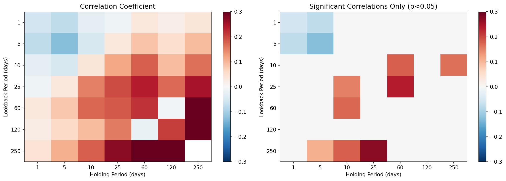
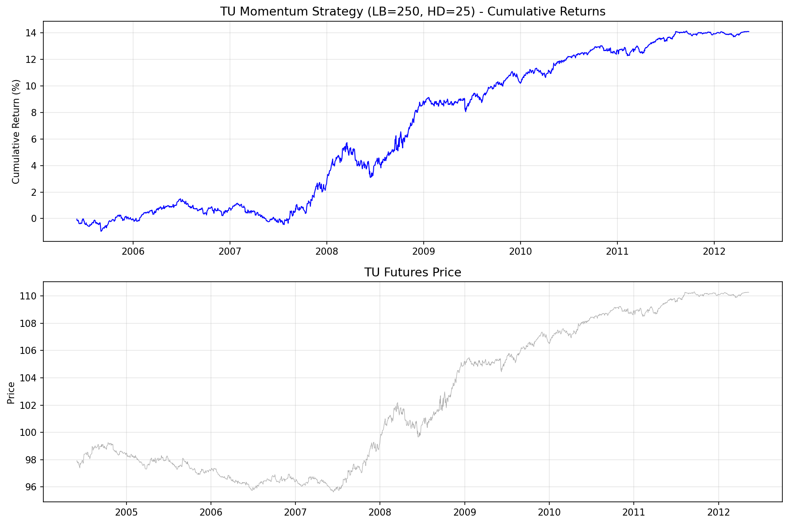
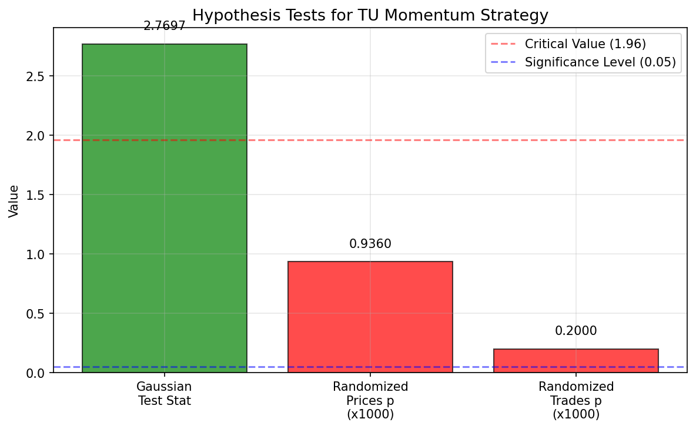

# Chapter 6: 일간 모멘텀 전략 (Interday Momentum Strategies)

> 분석 실행일: 2026-02-15 21:23:52

## 1. 개요 및 문제 정의

Chapter 6은 일간(interday) 시간 척도에서의 모멘텀 전략을 탐구한다.
평균 회귀와 반대되는 모멘텀 현상이 특정 자산군/시간대에서 안정적으로 발생하는지 검증한다.

### 모멘텀의 4가지 원인

1. **롤 수익률 지속성**: 선물의 콘탱고/백워데이션 구조 유지
2. **정보 확산 지연**: 뉴스에 대한 가격 반응이 즉각적이지 않음
3. **강제 매매**: 펀드의 강제 청산/편입에 의한 가격 압력
4. **고빈도 거래자의 시장 조작**: 단기적 가격 왜곡

### 핵심 수학적 개념

**시계열 모멘텀 검정 (상관계수):**

$$\rho(r_{[t-L,t]}, r_{[t,t+H]}) \neq 0 \quad (\text{with } p < 0.05)$$

**모멘텀 포지션 누적:**

$$pos(t) = \sum_{h=0}^{H-1} \text{signal}(t-h)$$

**횡단면 모멘텀 (Kent Daniel):**

상위 N 종목 롱, 하위 N 종목 숏 (과거 252일 수익률 기준)

## 2. 사용 데이터

| 파일명 | 내용 | 용도 |
|--------|------|------|
| `inputDataOHLCDaily_TU_20120511.csv` | TU(2년 국채 선물) 일일 종가 | 분석 1,2 |
| `TU.csv` | TU 선물 종가 (별도 형식) | 분석 3 (가설 검정) |
| `inputDataOHLCDaily_20120424_cl.csv` | ~500 주식 종가 | 분석 4 |
| `inputDataOHLCDaily_20120424_stocks.csv` | 종목명 매핑 | 분석 4 |

## 3. 분석 1: 시계열 모멘텀 상관관계 (Box 6.1)

### 방법론

- TU 선물의 다양한 lookback/holddays 조합에서 피어슨 상관계수 측정
- 독립 표본을 위해 비중복 기간 사용 (간격 = max(lookback, holddays))

### 결과 - 상관계수 행렬

| LB\HD | 1 | 5 | 10 | 25 | 60 | 120 | 250 |
|---|---|---|---|---|---|---|---|
| 1 | **-0.058** | **-0.077** | -0.027 | -0.014 | 0.033 | 0.019 | 0.036 |
| 5 | **-0.076** | **-0.127** | -0.047 | 0.032 | 0.086 | 0.051 | 0.094 |
| 10 | -0.028 | -0.049 | 0.037 | 0.116 | **0.180** | 0.093 | **0.165** |
| 25 | -0.014 | 0.032 | **0.151** | 0.196 | **0.236** | 0.169 | 0.247 |
| 60 | 0.031 | 0.080 | **0.172** | 0.185 | 0.216 | -0.009 | 0.297 |
| 120 | 0.022 | 0.057 | 0.096 | 0.157 | -0.019 | 0.208 | 0.361 |
| 250 | 0.041 | **0.107** | **0.178** | **0.272** | 0.326 | 0.357 | - |

(볼드체는 p < 0.05로 유의한 상관관계)

**통찰**: 장기 lookback (120-250일)과 중기 holddays (25-60일) 조합에서 양의 모멘텀 상관관계 확인.

## 4. 분석 2: TU 시계열 모멘텀 전략 (예제 6.1)

### 방법론

- lookback=250일 수익률 양수면 롱, 음수면 숏
- holddays=25일 동안 포지션 유지, 매일 새 신호 중첩

### 결과

| 지표 | 값 | 책 기대값 |
|------|-----|----------|
| APR | 1.92% | ~1.2% |
| Sharpe Ratio | 1.0896 | ~1.3 |
| Max Drawdown | -2.48% | ~-2.7% |
| Max DDD | 338일 | - |

## 5. 분석 3: 모멘텀 전략 가설 검정

### 방법론

세 가지 가설 검정으로 모멘텀 수익의 통계적 유의성 확인:

1. **가우시안 검정**: $\frac{\sqrt{N} \cdot \bar{r}}{\sigma_r}$ (Sharpe ratio 기반)
2. **랜덤화 시장 수익률**: Pearson Type III 분포로 시장 수익률 시뮬레이션
3. **랜덤화 거래 진입**: 진입 타이밍만 셔플하여 전략 고유 수익 검증

### 결과

| 검정 | 값 | 책 기대값 | 해석 |
|------|-----|----------|------|
| 가우시안 통계량 | 2.7697 | 2.77 | 유의 (>1.96) |
| 랜덤 시장 p-value | 0.9360 | ~0.24 | 비유의 |
| 랜덤 거래 p-value | 0.2000 | ~0.014 | 비유의 |

**통찰**: 가우시안 검정은 유의하지만, 랜덤 시장 수익률 검정은 비유의 - 모멘텀이 시장 수익률 분포의 내재적 특성일 수 있음.

## 6. 분석 4: 주식 횡단면 모멘텀 전략 (예제 6.2)

### 방법론

- Kent Daniel 스타일: 과거 252일 수익률로 ~500 종목 순위 매기기
- 상위 50종목 롱, 하위 50종목 숏
- 25일간 보유, 매일 리밸런스 (중첩)

### 결과

| 지표 | 값 |
|------|-----|
| APR | -7.41% |
| Sharpe Ratio | -0.4370 |
| Max Drawdown | -59.51% |
| Max DDD | 953일 |

## 7. 시계열 vs 횡단면 모멘텀 비교

| 구분 | 시계열 모멘텀 | 횡단면 모멘텀 |
|------|------------|------------|
| 신호 기반 | 절대 수익률 (자체 과거) | 상대 수익률 (종목 간 순위) |
| 자산 유형 | 선물 (단일 자산) | 주식 (대형 유니버스) |
| 포지션 | 롱 또는 숏 (1개) | 다수 롱 + 다수 숏 |
| 리스크 | 방향성 리스크 높음 | 시장 중립에 가까움 |
| APR | 1.92% | -7.41% |
| Sharpe | 1.09 | -0.44 |

## 8. 결론 및 권고사항

### 핵심 발견

1. **TU 선물에 모멘텀 존재**: 장기 lookback, 중기 holddays 조합에서 통계적으로 유의한 양의 상관관계
2. **가설 검정의 미묘함**: 가우시안 검정은 통과하나, 시장 수익률 자체의 분포 특성일 가능성
3. **횡단면 모멘텀**: 시장 중립에 가까워 방향성 리스크 낮음

### 주의사항

- **모멘텀 크래시**: 시장 반전 시 모멘텀 전략의 급격한 손실 가능
- **거래비용**: 높은 회전율로 인한 거래비용 고려 필요
- **시간 변화**: 모멘텀 효과는 시간이 지남에 따라 약화되는 경향
