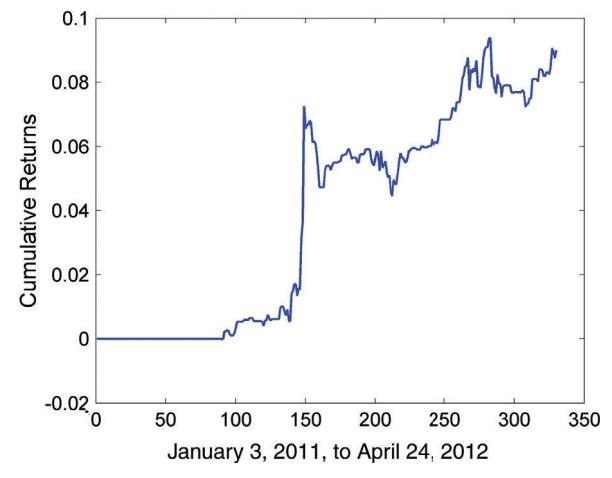

# 일중 모멘텀 전략 (Intraday Momentum Strategies)

앞 장에서 우리는 주식이든 선물이든 대부분의 금융상품이 횡단면 모멘텀(cross-sectional momentum)을 나타내며, 종종 시계열 모멘텀(time-series momentum)도 함께 나타낸다는 것을 살펴보았다. 불행히도 이러한 모멘텀 행동의 시간 지평은 일반적으로 한 달 이상으로 길게 나타나는 경향이 있다. 긴 보유 기간은 두 가지 문제를 야기한다: 독립적인 거래 신호가 드물기 때문에 샤프 비율(Sharpe ratio)과 백테스트 통계적 유의성이 낮아지며, 금융 위기 이후에는 성과가 저조해진다. 이 장에서는 이러한 단점이 없는 단기 일중 모멘텀 전략(intraday momentum strategies)을 설명한다.

앞서 우리는 모멘텀의 네 가지 주요 원인을 열거했다. 이 중 하나를 제외한 모두가 일중 시간대에서도 작용한다는 것을 알 수 있다. (유일한 예외는 롤 수익률(roll return)의 지속성인데, 그 크기와 변동성이 일중에서는 너무 작아 관련성이 없기 때문이다.)

단기 시간대에 주로 적용되는 추가적인 모멘텀 원인이 있다: 손절매 주문(stop orders)의 발동이다. 이러한 발동은 종종 소위 돌파 전략(breakout strategies)으로 이어진다. 우리는 시장 개장 시 진입하는 예시와 다양한 지지선(support) 또는 저항선(resistance) 수준에서 일중 진입하는 또 다른 예시를 살펴볼 것이다.

일중 모멘텀은 단순한 가격 움직임을 넘어 특정 이벤트에 의해 촉발될 수 있다. 이러한 이벤트에는 실적 발표나 애널리스트 추천 변경과 같은 기업 뉴스뿐만 아니라 거시경제 뉴스도 포함된다. 이러한 이벤트가 시계열 모멘텀을 생성한다는 것은 오래전부터 알려져 왔지만, 나는 각 특정 이벤트 범주의 효과에 대한 새로운 연구를 제시한다.

일중 모멘텀은 대형 펀드의 행동에 의해서도 촉발될 수 있다. 나는 레버리지 ETF(leveraged ETFs)의 일일 리밸런싱이 어떻게 단기 모멘텀으로 이어지는지 살펴본다.

마지막으로, 가장 짧은 시간 척도에서 매수 호가와 매도 호가 수량의 불균형, 주문 흐름(order flow)의 변화, 또는 앞서 언급한 손절매 주문의 비균일 분포 모두가 가격에 모멘텀을 유발할 수 있다. 이러한 모멘텀을 활용하는 일반적인 고빈도 거래(high-frequency trading) 전술 중 일부가 이 장에서 제시될 것이다.

## 시가 갭 전략 (Opening Gap Strategy)

4장에서 우리는 주식에 대한 평균 회귀형 갭 매수 전략(mean-reverting buy-on-gap strategy)을 논의했다. 반대되는 모멘텀 전략은 때때로 선물과 통화에서 작동한다: 상품이 갭 상승할 때 매수하고, 갭 하락할 때 공매도하는 것이다.

여러 선물에서 테스트한 후, 이 전략은 Eurex에서 거래되는 Dow Jones STOXX 50 지수 선물(FSTX)에서 가장 잘 작동하는 것으로 입증되었으며, 2004년 7월 16일부터 2012년 5월 17일까지 연간 수익률(APR) 13%와 샤프 비율 1.4를 기록했다. 예제 7.1은 갭 모멘텀 코드를 보여준다(*gapFutures\_FSTX.m*으로 다운로드 가능).

#### 예제 7.1: FSTX 시가 갭 전략

이 코드는 시가, 고가, 저가, 종가가 *T* × 1 배열 *op, hi, lo, cl*에 포함되어 있다고 가정한다. epchan.com/book2에서 다운로드할 수 있는 유틸리티 함수 *smartMovingStd*와 *backshift*를 사용한다.

```matlab
entryZscore=0.1;
stdretC2C90d=backshift(1, smartMovingStd(calculateReturns ...
 (cl, 1), 90));
longs=op > backshift(1, hi).*(1+entryZscore*stdretC2C90d);
shorts=op < backshift(1, lo).*(1-entryZscore*stdretC2C90d);
positions=zeros(size(cl));
positions(longs)=1;
positions(shorts)=-1;
ret=positions.*(op-cl)./op;
```


**그림 7.1** FSTX 시가 갭 전략의 자산 곡선 (Equity Curve of FSTX Opening Gap Strategy)

동일한 전략이 일부 통화에서도 작동한다. 그러나 일일 "시가"와 "종가"는 다르게 정의해야 한다. 종가를 동부 표준시(ET) 오후 5시로, 시가를 동부 표준시 오전 5시(런던 개장에 해당)로 정의하면, 이 전략을 GBPUSD에 적용했을 때 2007년 7월 23일부터 2012년 2월 20일까지 연간 수익률 7.2%와 샤프 비율 1.3을 기록한다. 당연히 다양한 통화에 대해 시가와 종가 시간의 다른 정의를 실험해볼 수 있다. 대부분의 통화 시장은 금요일 오후 5시부터 일요일 오후 5시까지 휴장하므로, 이는 이러한 전략에 자연스러운 "갭"이 된다.

때때로 모멘텀을 촉발하는 야간 또는 주말 갭의 특별한 점은 무엇인가? 거래가 없는 연장된 기간은 시가가 종가와 상당히 다른 경우가 많다는 것을 의미한다. 따라서 다른 가격에 설정된 손절매 주문들이 개장 시 한꺼번에 발동될 수 있다. 이러한 손절매 주문의 실행은 연쇄 효과(cascading effect)가 시가에서 더 멀리 설정된 손절매 주문도 발동시킬 수 있기 때문에 종종 모멘텀으로 이어진다. 또는 야간에 중요한 이벤트가 발생했을 수 있다. 다음 섹션에서 논의하듯이, 많은 유형의 뉴스 이벤트가 모멘텀을 생성한다.

## 뉴스 기반 모멘텀 전략 (News-Driven Momentum Strategy)

많은 사람들이 믿듯이 모멘텀이 뉴스의 느린 확산에 의해 주도된다면, 분명히 우리는 뉴스 가치가 있는 이벤트 후 처음 며칠, 몇 시간, 심지어 몇 초 동안 이익을 얻을 수 있다. 이것이 전통적인 실적 발표 후 표류(Post-Earnings Announcement Drift, PEAD) 모델과 다양한 기업 또는 거시경제 뉴스에 기반한 다른 모델의 근거이다.

### 실적 발표 후 표류 (Post-Earnings Announcement Drift)

실적 발표가 주가를 움직일 것이라는 점은 놀랍지 않다. 그러나 놀라운 것은 이 움직임이 발표 후 얼마 동안 같은 방향으로 지속되어 모멘텀 트레이더들이 이익을 얻을 수 있다는 것이다. 더욱 놀라운 것은 이 사실이 1968년부터 알려지고 연구되어 왔지만(Bernard and Thomas, 1989), 그 효과가 아직 차익거래로 사라지지 않았다는 것이다. 다만 표류의 지속 기간은 단축되었을 수 있다. 이 섹션에서 내가 보여줄 것은 2011년만큼 최근에도 이 전략이 여전히 수익성이 있다는 것이다. 전날 장 마감 후 실적이 발표된 경우 다음 날 시장 개장 시 진입하여, 수익률이 매우 긍정적이면 주식을 매수하고 매우 부정적이면 공매도한 다음, 같은 날 장 마감 시 포지션을 청산한다. 이 전략은 트레이더가 실적 발표가 "좋은지" "나쁜지" 해석할 필요가 없다는 점에 주목하라. 실적이 애널리스트 기대치보다 높은지 낮은지 알 필요조차 없다. 시장이 실적이 좋은지 나쁜지 알려주도록 한다.

이 전략을 백테스트하기 전에 실적 발표 시간에 대한 과거 데이터가 필요하다. 박스에 표시된 *parseEarningsCalendarFromEarningsDotcom.m* 함수를 사용하여 주식 심볼 배열 *allsyms*로 지정된 특정 주식 유니버스에 대해 earnings.com에서 약 1년 정도의 데이터를 검색할 수 있다. 이 프로그램의 중요한 특징은 전 거래일 장 마감 후와 오늘 장 개장 전에 발생하는 실적 발표만 신중하게 선택한다는 것이다. 다른 시간에 발생하는 실적 발표는 오늘 장 개장 시 진입 거래의 트리거가 되어서는 안 된다.

### earnings.com에서 실적 캘린더를 검색하는 함수

이 함수는 1xN 주식 심볼 셀 배열 allsyms를 입력으로 받아 1 × N 논리 배열 earnann을 생성하는데, 이는 해당 주식이 전날 오후 4시(미국 시장 마감 시간) 이후와 오늘 오전 9시 30분(미국 시장 개장 시간) 이전에 실적 발표가 있는지 여부를 알려준다(true 또는 false 값으로). prevDate와 todayDate 입력은 yyyymmdd 형식이어야 한다.

```matlab
function [earnann]= ...
 parseEarningsCalendarFromEarningsDotCom(prevDate, ...
 todayDate, allsyms)
```

**BOX 7.1**

```matlab
% [earnann]==parseEaringsCalendarFromEarningsDotCom
 % (prevDate,todayDate, allsyms)
earnann=zeros(size(allsyms));
prevEarningsFile=urlread(['http://www.earnings.com/earning ...
 .asp?date=', num2str(prevDate), '&client=cb']);
todayEarningsFile=urlread(['http://www.earnings.com ...
 /earning.asp?date=', num2str(todayDate), '&client=cb']);
prevd=day(datenum(num2str(prevDate), 'yyyymmdd'));
todayd=day(datenum(num2str(todayDate), 'yyyymmdd'));
prevmmm=datestr(datenum(num2str(prevDate), 'yyyymmdd'), ...
 'mmm');
todaymmm=datestr(datenum(num2str(todayDate), 'yyyymmdd'), ...
 'mmm');
patternSym='<a\s+href="company.asp\?ticker=([%\*\w\._ ...
 /-]+)&coid';
% prevDate
patternPrevDateTime=['<td align="center"><nobr>', ...
 num2str(prevd), '-', num2str(prevmmm), '([ :\dABPMCO]*) ...
 </nobr>'];
symA=regexp(prevEarningsFile, patternSym , 'tokens');
timeA=regexp(prevEarningsFile, patternPrevDateTime, ...
 'tokens');
symsA=[symA{:}];
timeA=[timeA{:}];
assert(length(symsA)==length(timeA));
isAMC=~cellfun('isempty', regexp(timeA, 'AMC'));
patternPM='[ ]+\d:\d\d[ ]+PM'; % e.g. ' 6:00 PM'
isAMC2=~cellfun('isempty', regexp(timeA, patternPM));
symsA=symsA(isAMC | isAMC2);
[foo, idxA, idxALL]=intersect(symsA, allsyms);
earnann(idxALL)=1;
% today
patternTodayDateTime=['<td align="center"><nobr>', ...
 num2str(todayd), '-', num2str(todaymmm), ...
 '([ :\dABPMCO]*)</nobr>'];
```

(계속)

```matlab
symA=regexp(todayEarningsFile, patternSym , 'tokens');
timeA=regexp(todayEarningsFile, patternTodayDateTime, ...
 'tokens');
symsA=[symA{:}];
timeA=[timeA{:}];
symsA=symsA(1:length(timeA));
assert(length(symsA)==length(timeA));
isBMO=~cellfun('isempty', regexp(timeA, 'BMO'));
patternAM='[ ]+\d:\d\d[ ]+AM'; % e.g. ' 8:00 AM'
isBMO2=~cellfun('isempty', regexp(timeA, patternAM));
symsA=symsA(isBMO | isBMO2);
[foo, idxA, idxALL]=intersect(symsA, allsyms);
earnann(idxALL)=1;
end
```

PEAD 전략의 백테스트에서 각 날에 대해 이 프로그램을 호출해야 한다. 그런 다음 결과로 나온 1 × *N* earnann 배열들을 백테스트의 *T*일에 대한 하나의 큰 과거 *T* × *N* earnann 배열로 연결할 수 있다.

위의 함수를 사용하든 다른 방법을 사용하든 과거 실적 발표 논리 배열을 컴파일했다고 가정하면, PEAD 전략의 실제 백테스트 프로그램은 예제 7.2에서 보여주듯이 매우 간단하다. 발표가 발표 후 표류를 생성할 만큼 "놀라운지" 결정하기 위한 벤치마크로서 전일 종가에서 다음 날 시가까지의 수익률의 90일 이동 표준편차만 계산하면 된다.

#### 예제 7.2: 실적 발표 후 표류 전략의 백테스트

과거 시가와 종가가 *T* × *N* 배열 *op*와 *cl*에 저장되어 있다고 가정한다. 입력 *T* × *N* 논리 배열 *earnann*은 주어진 날 장 개장 전이지만 전 거래일 장 마감 후에 주식에 대한 실적 발표가 있는지 여부를 나타낸다. 유틸리티 함수 backshift, smartMovingStd와

#### 예제 7.2 (*계속*)

smartsum은 epchan.com/book2에서 다운로드할 수 있다. 백테스트 프로그램 자체의 이름은 *pead.m*이다.

```matlab
lookback=90;
retC2O=(op-backshift(1, cl))./backshift(1, cl);
stdC2O=smartMovingStd(retC2O, lookback);
positions=zeros(size(cl));
longs=retC2O >= 0.5*stdC2O & earnann;
shorts=retC2O <= -0.5*stdC2O & earnann;
positions(longs)=1;
positions(shorts)=-1;
ret=smartsum(positions.*(cl-op)./op, 2)/30;
```

S&P 500 주식 유니버스에 대해 2011년 1월 3일부터 2012년 4월 24일까지의 연간 수익률은 6.7%이며, 샤프 비율은 매우 훌륭한 1.5이다. 누적 수익률 곡선은 그림 7.2에 표시되어 있다. 해당 백테스트 기간 동안 하루 최대 포지션 수가 30개이므로 수익률 계산에서 30을 분모로 사용했다는 점에 유의하라. 물론 최대값이 정확히 얼마가 될지 모르기 때문에 이 숫자를 사용하면 어느 정도의 미래 참조 편향(look-ahead bias)이 있다. 그러나 일일 최대 발표 수가 상당히 예측 가능하다는 점을 감안하면, 이것은 그리 심각한 편향이 아니다. 이것이 일중 전략이므로 최소 4배의 레버리지를 적용할 수 있어 연간 평균 수익률을 약 27%에 가깝게 할 수 있다.



**그림 7.2** PEAD 전략의 누적 수익률 곡선 (Cumulative Returns Curve of PEAD Strategy)

이 포지션을 야간에 보유하면 추가 수익이 발생하는지 궁금할 수 있다. 답은 아니오이다: 야간 수익률은 평균적으로 음수이다. 반대로, 10년 또는 20년 전의 많은 발표된 결과는 PEAD가 하루 이상 지속되었음을 보여주었다. 이는 그러한 모멘텀의 존재에 대한 인식 증가로 인해 모멘텀 지속 기간이 단축된 예일 수 있다. 더 짧은 보유 기간이 더 나은 수익을 창출할 수 있는지는 여전히 테스트가 필요하다.

### 기타 이벤트로 인한 표류 (Drift Due to Other Events)

실적 발표 외에도 발표 후 표류를 나타낼 수 있는 다른 기업 이벤트가 있다: 불완전한 목록에는 실적 가이던스, 애널리스트 등급 및 추천 변경, 동일 매장 매출, 항공사 탑승률이 포함된다. (이러한 데이터의 합리적인 일일 제공자는 Newsware가 전달하는 Dow Jones 뉴스와이어인데, 각 기사에 이벤트 유형에 특정한 코드가 첨부되어 있고 기계 판독이 가능하기 때문이다.) 이론적으로, 기업의 공정 시장 가치 재평가를 촉발하는 모든 발표는 새로운 균형 가격을 향해 주가 변화를 유도해야 한다. (이러한 모든 이벤트와 주식의 이벤트 후 수익률에 대한 영향에 대한 최근의 포괄적인 연구는 Hafez, 2011을 참조하라.) 이러한 이벤트 중에서 인수합병(M&A)은 물론 인수자와 피인수자 기업에 대한 심층적인 펀더멘털 지식을 보유한 전문 헤지펀드의 관심을 끈다. 그러나 앞서 PEAD에 대해 설명한 것과 같은 순수하게 기술적인 모델도 인수합병에 대해 약 3%의 연간 수익률을 추출할 수 있다. (흥미롭게도, 일반적인 믿음과 달리 Hafez는 인수 발표 후 피인수자의 주가가 인수자보다 더 많이 하락한다는 것을 발견했다.)

6장에서 우리는 대형 펀드의 강제 매수 또는 매도에 의해 주가의 모멘텀이 어떻게 생성되는지 설명했다. 인덱스 펀드(뮤추얼이든 상장지수이든)의 경우, 잘 알려진 한 가지 유형의 강제 매수와 매도가 있다: 지수 구성 변경이다. 주식이 지수에 추가되면 매수 압력을 예상하고, 반대로 주식이 지수에서 삭제되면 그 반대를 예상한다. 이러한 지수 리밸런싱 거래도 발표된 변경 직후 모멘텀을 생성한다. 일부 연구자들은 그러한 모멘텀이 과거에는 여러 날 지속되었다고 보고했지만, 더 최근 데이터를 사용한 나의 테스트에 따르면 표류 기간이 일중으로 단축되었다(Shankar and Miller, 2006).

예정된 발표로 인한 모멘텀에 관해 말하자면, 연방공개시장위원회(FOMC)의 금리 결정이나 최신 소비자물가지수 발표와 같은 거시경제 이벤트의 영향은 어떨까? 나는 EURUSD에 대한 그들의 효과를 테스트했지만, 불행히도 유의미한 모멘텀을 발견하지 못했다. 그러나 Clare와 Courtenay는 영국 거시경제 데이터 발표와 영란은행 금리 발표가 발표 후 최소 10분까지 GBPUSD에 모멘텀을 유발했다고 보고했다(Clare and Courtenay, 2001). 이 결과는 1999년까지의 데이터를 기반으로 했으므로, 모멘텀이 계속 존재한다면 최근 몇 년 동안 이 모멘텀의 지속 기간이 더 짧아졌을 것으로 예상해야 한다.

## 레버리지 ETF 전략 (Leveraged ETF Strategy)

MSCI US REIT 지수(RMZ)를 추종해야 하는 주식 포트폴리오를 가지고 있다고 상상해보라. 다만 특히 장 마감 시 포트폴리오의 레버리지를 3으로 유지하고자 한다. 예제 8.1에서 보여주듯이, 이 일정한 레버리지 요구 사항은 직관에 반하는 중요한 결과를 가져온다. RMZ가 어느 날 급락했다고 가정하자. 이는 레버리지를 일정하게 유지하기 위해 전반적으로 주식을 매도하여 포트폴리오의 포지션을 상당히 줄여야 함을 의미한다. 반대로, 그날 RMZ가 상승했다면 주식을 매수하여 포지션을 늘려야 한다.

이제 당신이 실제로 ETF 스폰서이고, 그 포트폴리오가 DRN(부동산 ETF)과 같은 3배 레버리지 ETF이며, 그 자본이 1억 달러 이상이라고 가정하자. 장 마감 근처에서 이 리밸런싱 절차(포트폴리오 수익률이 음수일 때 구성 주식을 매도하고 그 반대의 경우도 마찬가지)가 포트폴리오의 시장 가치에 모멘텀을 생성할 것이라고 생각한다면, 당신이 옳다.

(시장 지수의 큰 변화는 레버리지 롱 또는 숏 ETF 모두에서 같은 방향으로 모멘텀을 생성한다. 변화가 양수이면 숏 ETF는 자본 감소를 경험하고, 스폰서는 숏 포지션을 줄여야 한다. 따라서 롱 ETF와 마찬가지로 주식을 매수해야 한다.)

우리는 매우 간단한 모멘텀 전략을 구성하여 이 가설을 테스트할 수 있다: 전일 종가에서 장 마감 15분 전까지의 수익률이 2%보다 크면 DRN을 매수하고, 수익률이 -2%보다 작으면 매도한다. 장 마감 시 포지션을 청산한다. 이 모멘텀 전략은 기초 주식의 모멘텀에 기반하므로 SPY와 같은 비레버리지 ETF의 장 마감 근처 수익률에도 영향을 미쳐야 한다는 점에 유의하라. 우리는 단순히 효과를 확대하기 위해 레버리지 ETF를 거래 수단으로 사용한다. DRN 거래의 연간 수익률은 2011년 10월 12일부터 2012년 10월 25일까지 샤프 비율 1.8과 함께 15%이다.

당연히 이 전략의 수익률은 모든 레버리지 ETF의 총 자산이 증가함에 따라 증가해야 한다. 2009년 1월 말 레버리지 ETF(롱 및 숏 펀드 모두 포함)의 총 운용자산(AUM)이 190억 달러라고 보고되었다(Cheng and Madhavan, 2009). 이 저자들은 또한 SPX의 1% 움직임이 장 마감 거래량의 약 17%를 구성하는 주식의 매수 또는 매도를 필요로 할 것으로 추정했다. 이것은 명백히 상당한 시장 충격(market impact)을 가질 것이며, 이는 모멘텀을 유발한다. (더 최신의 분석은 Rodier, Haryanto, Shum, and Hejazi, 2012에 의해 발표되었다.)

물론 레버리지 여부와 관계없이 ETF의 자본에 영향을 미치는 또 다른 이벤트가 있다: 투자자 자금의 흐름이다. 롱 레버리지 ETF로의 대규모 유입은 기초 주식 가격에 양의 모멘텀을 유발하고, 숏 레버리지("인버스") ETF로의 대규모 유입은 음의 모멘텀을 유발한다. 따라서 이론적으로 시장 지수가 큰 양의 수익률을 기록한 같은 날 많은 투자자들이 롱 레버리지 ETF를 매도할 수 있다(아마도 평균 회귀 전략의 일부로). 이것은 모멘텀을 중화시켰을 것이다. 그러나 우리의 백테스트는 이것이 자주 발생하지 않았음을 보여준다.

## 고빈도 전략 (High-Frequency Strategies)

대부분의 고빈도 모멘텀 전략은 주문서(order book)에서 정보를 추출하는 것을 포함하며, 기본 아이디어는 간단하다: 매수 호가 수량이 매도 호가 수량보다 훨씬 크면 가격이 상승할 것으로 예상하고, 그 반대의 경우도 마찬가지이다. 이 아이디어는 학술 연구로 뒷받침된다. 예를 들어, 나스닥 시장에서 매수 대 매도 호가 수량의 불균형과 단기 가격 변화 사이에 대략적인 선형 관계가 발견되었다(Maslov and Mills, 2001). 예상대로 이 효과는 거래량이 적은 주식에서 더 강하다. 이 효과는 전국 최우선 매수매도호가(National Best Bid Offer, NBBO) 가격에만 국한되지 않는다: 전체 주문서의 불균형도 스톡홀름 주식 시장의 주식에 대해 가격 변화를 유발한다(Hellstrom and Simonsen, 2006).

이 현상에 기반한 여러 고빈도 모멘텀 전략이 있다. 이들 중 다수는 시장 미시구조(market microstructure) 또는 고빈도 거래에 관한 책에서 설명되었다(Arnuk and Saluzzi, 2012; Durbin, 2010; Harris, 2003; Sinclair, 2010). (이어지는 설명에서 나는 초기 롱 거래에 초점을 맞추지만, 물론 숏 측에서 대칭적인 기회가 있다.)

CME에서 거래되는 유로달러 선물과 같이 비례 배분(pro-rata) 방식으로 주문을 체결하는 시장에서, 이 예상으로부터 이익을 얻는 가장 간단한 방법은 즉시 "매수 호가에 참여"하여 매수 측에서 체결이 있을 때마다 그 체결의 일부를 배정받는 것이다. 체결 후 매수 및 매도 호가가 하락보다 상승할 가능성이 더 높도록 하기 위해, 원래 매수 호가 수량이 매도 호가 수량보다 훨씬 클 때만 매수 호가에 참여한다. 이것을 *비율 거래(ratio trade)*라고 하는데, 원래 주문의 체결 비율이 우리 자신의 주문 크기와 매수 호가의 총 주문 크기 사이의 비율과 같을 것으로 예상하기 때문이다. 매수 압력이 매수 호가를 한 틱 이상 올리면, 우리는 수익을 내며 매도할 수 있거나, 단순히 최우선 매도 호가에 매도 주문을 넣을 수 있다(매수-매도 스프레드가 주당 왕복 수수료보다 큰 경우). 매수 호가가 상승하지 않거나 매도 지정가 주문이 체결되지 않으면, 큰 매수 호가 수량 때문에 아마도 원래 최우선 매수 호가에서 매도할 수 있으며, 수수료 손실만 발생한다.

매수-매도 스프레드가 2틱보다 큰 시장에서는 상승을 예상하여 이익을 얻는 또 다른 간단한 거래가 있다. 단순히 최우선 매수 호가에 1틱을 더한 가격에 매수 주문을 넣는다. 이것이 체결되면 최우선 매도 호가에서 1틱을 뺀 가격에 매도 주문을 넣고 체결되기를 바란다. 그러나 체결되지 않으면, 아마도 원래 최우선 매수 호가에서 매도할 수 있으며, 수수료에 1틱을 더한 손실이 발생한다. 이것을 *틱킹(ticking)* 또는 *호가 매칭(quote matching)*이라고 한다. 이 거래가 수익성이 있으려면 주당 왕복 수수료가 매수-매도 스프레드에서 2틱을 뺀 것보다 작아야 한다. 이 전략은 그림 7.3에 설명되어 있다.


**그림 7.3** 틱킹 전략. 원래 스프레드는 2틱보다 커야 한다. 매수 주문이 B에서 체결된 후, 우리는 최소 1틱의 수익을 위해 S에서 매도하려고 시도할 것이다. 그러나 매도 주문이 체결되지 않으면 S'에서 1틱 손실로 매도할 것이다. (Ticking Strategy. The original spread must be greater than two ticks. After the buy order is filled at B, we will try to sell it at S for a profit of at least one tick. But if the sell order cannot be filled, then we will sell it at S' at a loss of one tick.)

(틱킹은 물론 완벽한 전략이 아니다. 선행 매매(front-run)되기 전의 원래 최우선 매수 호가는 트레이더가 선행 매매당했다는 것을 알면 취소될 수 있어, 우리가 재고를 처분할 더 낮은 매수 호가만 남게 된다. 또는 전체 상황이 우리를 위한 함정으로 설정되었을 수 있다: 원래 최우선 매수 호가를 넣은 트레이더가 실제로 자신의 매수 호가보다 더 좋은 가격에 우리에게 주식을 팔고 싶어했을 수 있다. 그래서 우리가 1틱을 더해 그녀의 주식을 산 후, 그녀는 즉시 매수 호가를 취소할 것이다.)

기존의 매수 압력이나 매수-매도 호가 수량 불균형이 없더라도, 우리는 그러한 것의 환상을 만들 수 있다(종종 *모멘텀 점화(momentum ignition)*라고 불림). 이것은 비례 배분 체결 대신 시간 우선순위를 사용하는 시장에서 작동한다. 최우선 매수 및 매도 호가 수량이 매우 유사하다고 가정하자. 우리는 매수 압력의 인상을 주기 위해 최우선 매수 호가에 대량 매수 지정가 주문을 넣고, 동시에 최우선 매도 호가에 소량 매도 지정가 주문을 넣을 것이다. 이것은 트레이더들이 상승을 예상하여 매도 호가에서 매수하도록 속여 우리의 소량 매도 주문을 체결시킨다. 이 시점에서 우리는 즉시 대량 매수 주문을 취소한다. 최우선 매수 및 매도 호가 수량은 이제 다시 거의 같아진다. 큰 매수 압력을 기대하며 일찍 매수한 트레이더들 중 많은 이가 이제 손실을 보고 자신의 보유 주식을 다시 매도할 수 있으며, 우리는 그것을 원래 최우선 매수 호가에서 살 수 있다. 이것을 *플리핑(flipping)*이라고 한다.

매수 압력의 환상을 만드는 것에는 위험이 있다—누군가가 우리의 허풍을 불러 실제로 우리의 대량 매수 주문을 체결시킬 수 있다. 이 경우, 우리는 손실을 보고 매도해야 할 수 있다. 반대로, 대량 매수 주문이 플리퍼 때문이라고 의심되면, 우리는 플리퍼에게 매도하고 매수 호가를 낮출 수 있다. 우리는 플리퍼들이 항복하고 새로운 재고를 매도하여 매도 호가도 낮추기를 바라며, 그래서 우리가 원래 매수 호가 아래에서 숏 포지션을 청산할 수 있다. 처음부터 대량 매수 주문이 플리퍼 때문이라는 것을 어떻게 알 수 있을까? 대량 매수 호가가 체결되는 대신 취소되는 빈도를 기록해야 할 수 있다. 나스닥의 ITCH, Direct Edge의 EDGX Book Feed, 또는 BATS의 PITCH 피드와 같은 거래소의 비공개 데이터 피드에 가입하면, 수정이나 부분 체결을 포함한 주문의 상세한 이력을 받을 수 있다(Arnuk and Saluzzi, 2012). 이러한 정보는 플리퍼를 탐지하는 데도 도움이 될 수 있다.

이러한 모든 전략과 그 방어, 허풍, 역허풍은 고빈도 트레이더가 더 느린 트레이더에게서만 수익을 낼 수 있다는 일반적인 요점을 보여준다. 시장에 고빈도 트레이더만 남으면 모든 사람의 순 평균 수익은 0이 될 것이다. 실제로, 대량 매수 또는 매도 주문을 "선행 매매"하는 이러한 유형의 고빈도 전략의 확산으로 인해, 많은 전통적인 시장조성자들은 더 이상 대량 호가를 제시하지 않는다. 이로 인해 많은 시장에서 NBBO 수량이 전반적으로 감소했다. 예를 들어, AAPL과 같이 유동성이 높은 주식에서도 NBBO 수량은 종종 몇 백 주에 불과하다. 그리고 ARCA의 SPY와 같이 가장 유동성이 높은 ETF에서도 NBBO 수량은 종종 10,000주 미만이다. 이 작은 주문들이 체결된 후에야 시장조성자는 고빈도 트레이더에게 이용당하는 것을 피하기 위해 같은 가격에 다시 호가를 제시할 것이다. (물론 대량 호가 표시를 피하는 다른 이유도 있다: 시장조성자들은 대량 호가가 체결되어 발생할 수 있는 대량 재고를 유지하고 싶어하지 않는다.) 마찬가지로, 이전에는 대량 거래(block trades)로 실행되었던 대형 기관 주문은 이제 작은 자식 주문(child orders)으로 쪼개져 다양한 시장 거래소에 분산되어 하루 종일 실행된다.

*스탑 헌팅(Stop hunting)*은 또 다른 인기 있는 고빈도 모멘텀 전략이다. 통화 시장에 대한 연구는 지지선(저항선)이 돌파되면 가격이 한동안 더 하락(상승)한다는 것을 나타냈다(Osler, 2000, 2001). 이러한 지지선과 저항선은 은행이나 증권사가 매일 보고하는 것일 수도 있고, 현재 가격 수준 근처의 라운드 넘버일 수도 있다. 이 단기 가격 모멘텀은 지지선과 저항선 수준 또는 그 근처에 배치된 다수의 손절매 주문 때문에 발생한다.

이것을 더 이해하기 위해 지지선만 살펴보자. 저항선의 상황은 대칭적이기 때문이다. 가격이 지지선을 돌파할 만큼 충분히 하락하면, 해당 매도 손절매 주문이 발동되어 가격을 더 하락시킨다. 이 지식을 바탕으로, 고빈도 트레이더는 물론 가격이 지지선에 충분히 가까울 때 대량 매도 주문을 제출하여 인위적인 매도 압력을 만들어 다음 틱을 하락시키려고 할 수 있다. 손절매 주문이 발동되고 하락 모멘텀이 진행되면, 이 고빈도 트레이더들은 빠른 수익을 위해 숏 포지션을 청산할 수 있다.

시장의 *주문 흐름(order flow)* 정보에 접근할 수 있다면, 일반적인 매수/매도/최종 가격 스트림을 넘어서는 매우 가치 있는 정보 스트림을 갖게 된다. Lyons가 통화 거래의 맥락에서 논의했듯이, "주문 흐름"은 부호가 있는 거래량이다(Lyons, 2001). 트레이더가 딜러/시장조성자/주문서에서 100단위를 매수하면 주문 흐름은 100이고, 트레이더가 대신 100단위를 매도하면 -100이다. 주문서에서 "매수"한다는 것은 트레이더가 매도 호가에서 매수하거나, 동등하게 트레이더가 매수를 위한 시장가 주문을 제출한다는 것을 의미한다. 실증 연구는 주문 흐름 정보가 가격 움직임의 좋은 예측 변수임을 나타낸다. 이는 시장조성자가 주문 흐름 정보에서 중요한 펀더멘털 정보를 추출하고 그에 따라 매수-매도 가격을 설정할 수 있기 때문이다. 예를 들어, 주요 헤지펀드가 중요한 속보에 대해 방금 알게 되면, 그들의 알고리즘은 순식간에 같은 부호의 대량 시장가 주문을 제출할 것이다. 주문 흐름을 모니터링하는 시장조성자는 그러한 대규모 일방향 수요가 정보를 가진 트레이더의 존재를 나타낸다고 매우 정확하게 추론하고, 자신을 보호하기 위해 즉시 매수-매도 가격을 조정할 것이다. 시장가 주문 사용의 긴급성은 정보가 새롭고 널리 알려지지 않았음을 나타낸다.

우리 대부분은 대형 시장조성자나 거래소 운영자가 아니므로, 어떻게 그러한 주문 흐름 정보에 접근할 수 있을까? 주식과 선물 시장의 경우, 모든 틱(즉, 최우선 매수, 매도 및 거래 가격과 수량의 변화)을 모니터링하고 기록하여 거래가 매수 호가(음의 주문 흐름)에서 발생했는지 매도 호가(양의 주문 흐름)에서 발생했는지 결정할 수 있다. 통화 시장의 경우, 대부분의 딜러가 거래 가격을 보고하지 않기 때문에 어렵다. 이 전략을 위해 통화 선물 거래에 의존해야 할 수 있다. 거래당 주문 흐름이 계산되면, 일정 룩백 기간 동안의 누적 또는 평균 주문 흐름을 쉽게 계산하여 가격이 상승할지 하락할지 예측하는 데 사용할 수 있다.

#### 핵심 요점 (KEY POINTS)

- 일중 모멘텀 전략은 일간 모멘텀 전략의 많은 단점을 겪지 않으면서 몇 가지 주요 장점을 유지한다.
- "돌파(breakout)" 모멘텀 전략은 가격이 거래 범위를 초과하는 것을 포함한다.
- 시가 갭 전략은 일부 선물과 통화에서 작동하는 돌파 전략이다.
- 돌파 모멘텀은 손절매 주문의 발동에 의해 야기될 수 있다.
- 많은 종류의 기업 및 거시경제 뉴스가 단기 가격 모멘텀을 유발한다.
- 지수 구성 변경은 지수에 추가되거나 삭제되는 주식에 모멘텀을 유발한다.
- 장 마감 근처의 레버리지 ETF 리밸런싱은 전일 종가로부터의 시장 수익률과 같은 방향으로 기초 지수에 모멘텀을 유발한다.
- 많은 고빈도 모멘텀 전략은 매수 및 매도 호가 수량 간의 불균형을 포함하며, 이 불균형은 때때로 고빈도 트레이더 자신에 의해 인위적으로 만들어진다.
- 스탑 헌팅은 일반적으로 현재 시장 가격 근처의 라운드 넘버에 집중된 손절매 주문을 발동시키는 것에 의존하는 고빈도 거래 전략이다.
- 주문 흐름은 같은 방향으로의 단기 가격 움직임을 예측할 수 있다.
