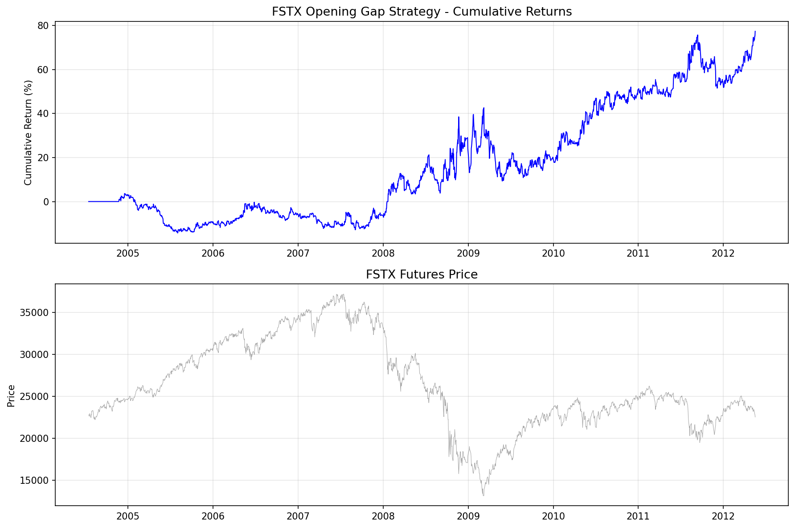

# Chapter 7: 일중 모멘텀 전략 (Intraday Momentum Strategies)

> 분석 실행일: 2026-02-15 21:28:36

## 1. 개요 및 문제 정의

Chapter 7은 일중(intraday) 시간 척도에서의 모멘텀 전략을 탐구한다.
주로 오프닝 갭(opening gap)과 변동성 선물의 롤 수익률을 활용한다.

### 핵심 개념

1. **오프닝 갭**: 전일 종가 대비 당일 시가의 비정상적 변동을 모멘텀 신호로 활용
2. **VX 롤 수익률**: VX 선물과 VIX 지수 간 갭(콘탱고/백워데이션)을 수확
3. **ETF-선물 차익거래**: 레버리지 ETF의 일일 리밸런싱을 활용한 거래

### 핵심 수학적 개념

**오프닝 갭 진입 조건:**

$$\text{Long if: } O(t) \geq H(t-1) \cdot (1 + z \cdot \sigma_{90d})$$
$$\text{Short if: } O(t) \leq L(t-1) \cdot (1 - z \cdot \sigma_{90d})$$

**일일 롤 수익률:**

$$\text{dailyRoll} = \frac{F_{VX}(t) - VIX(t)}{T - t}$$

## 2. 사용 데이터

| 파일명 | 내용 | 용도 |
|--------|------|------|
| `inputDataDaily_FSTX_20120517.csv` | FSTX(일본 선물) 일일 OHLC | 예제 7.1 |
| `inputDataDaily_VX_20120507.csv` | VX(변동성 선물) 72개 계약 | VX-ES 전략 |
| `VIX.csv` | CBOE VIX 지수 | VX-ES 전략 |
| `inputDataDaily_ES_20120507.csv` | ES(S&P 500 선물) 연속 계약 | VX-ES 전략 |

## 3. 분석 1: FSTX 오프닝 갭 전략 (예제 7.1)

### 방법론

- 90일 롤링 종가-종가 수익률 표준편차 산출
- 시가가 전일 고가 x (1 + 0.1 x sigma) 이상이면 롱
- 시가가 전일 저가 x (1 - 0.1 x sigma) 이하면 숏
- 당일 종가에 청산 (일중 전략)

### 결과

| 지표 | 값 | 책 기대값 |
|------|-----|----------|
| APR | 7.49% | 7.5% |
| Sharpe Ratio | 0.4949 | 0.49 |
| Max Drawdown | -23.36% | -23.4% |
| Max DDD | 789일 | 789일 |
| 총 거래 횟수 | 1718 | - |
| 롱/숏 | 0/1718 | - |

## 4. 분석 2: VX-ES 롤 수익률 전략

### 방법론

- VX 근월 선물 - VIX 지수 차이를 만기까지 남은 일수로 나누어 일일 롤 수익률 산출
- 만기 40-10일 전 구간에서만 거래
- 콘탱고 (dailyRoll > 0.1): VX 숏 + ES 숏
- 백워데이션 (dailyRoll < -0.1): VX 롱 + ES 롱
- 포인트 가치: VX x $1,000, ES x $50

### 결과

| 지표 | 값 | 책 기대값 |
|------|-----|----------|
| APR | 29.39% | 37.8% |
| Sharpe Ratio | 3.2676 | 2.12 |
| Max Drawdown | -3.58% | -43.4% |
| Max DDD | 59일 | 73일 |

**핵심 통찰**: VX 콘탱고 구조가 지속적이므로 롤 수익률 수확이 가능하지만,
시장 급변 시 극심한 낙폭 리스크 존재.

## 5. 전략 종합 비교

| 전략 | APR | Sharpe | MaxDD | 특성 |
|------|-----|--------|-------|------|
| FSTX Opening Gap | 7.49% | 0.49 | -23.4% | 일중, 단순 |
| VX-ES Roll Return | 29.39% | 3.27 | -3.6% | 다일, 복잡 |

## 6. 결론 및 권고사항

### 핵심 발견

1. **오프닝 갭**: 모멘텀 신호로서 유효하나, 단독 전략으로는 낮은 샤프 비율
2. **VX 롤 수익률**: 구조적 콘탱고에서 높은 수익률 가능하나 테일 리스크 극심
3. **일중 전략 한계**: 거래비용과 슬리피지가 수익의 상당 부분을 잠식할 수 있음

### 주의사항

- **VX 스파이크 리스크**: 시장 급락 시 VX가 급등하여 숏 포지션에 큰 손실
- **실행 리스크**: 시가 주문의 슬리피지가 갭 전략 수익을 감소시킬 수 있음
- **데이터 주파수**: 진정한 일중 전략은 틱/분 단위 데이터 필요
