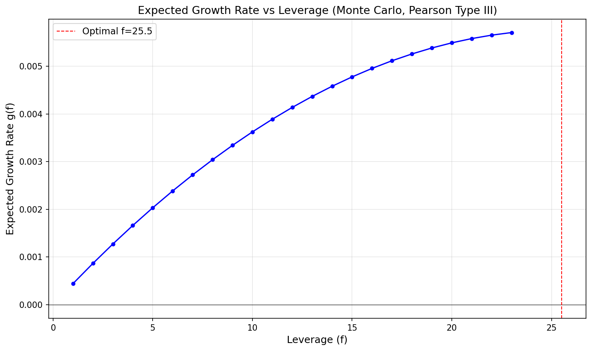
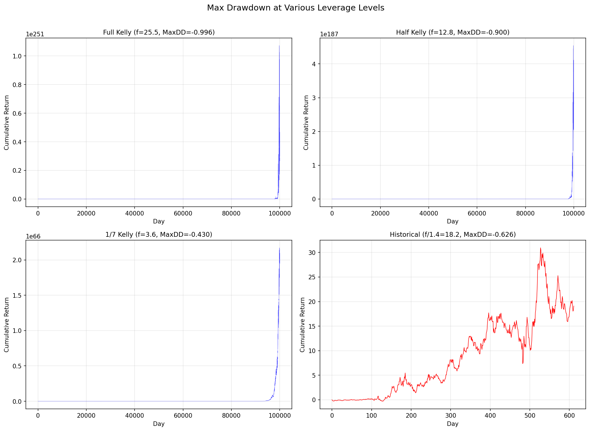
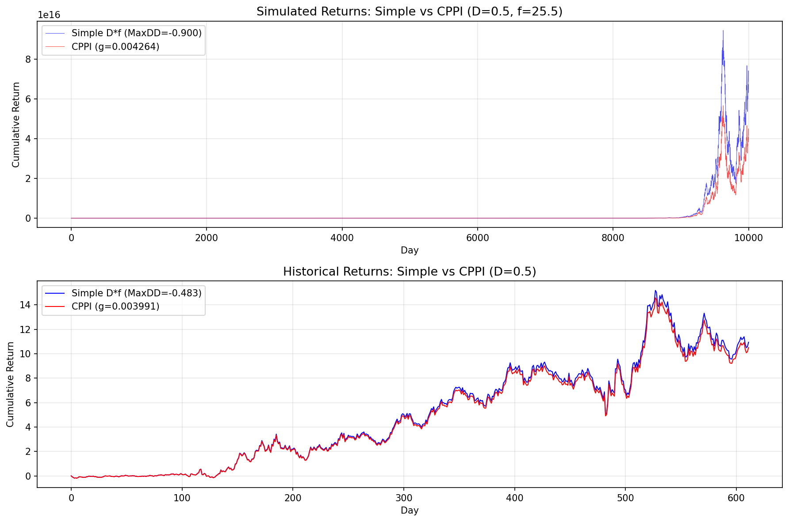
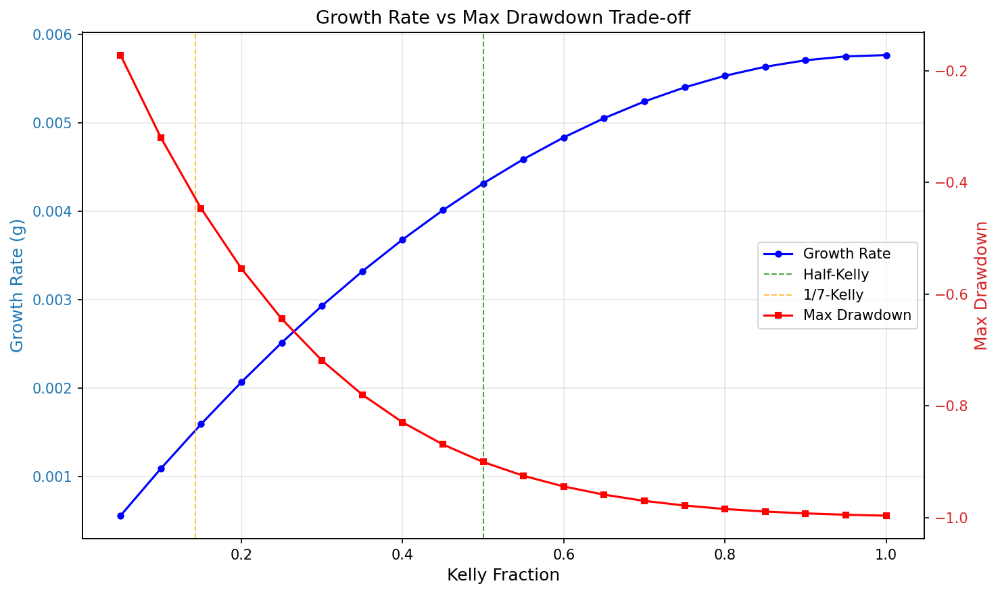

# Chapter 8: Risk Management (리스크 관리) - 분석 리포트

생성일: 2026-02-15 21:39:15

## 1. 개요 및 문제 정의

### 핵심 질문

- 전략의 장기 복리 성장률을 극대화하는 **최적 레버리지**는 얼마인가?
- 과도한 레버리지로 인한 **파산 위험**을 어떻게 관리하는가?
- **최대 낙폭(Maximum Drawdown)** 제약 하에서 성장률을 어떻게 최적화하는가?
- **CPPI**는 낙폭 제한과 성장률 극대화를 동시에 달성할 수 있는가?

### 핵심 수식

**켈리 공식 (가우시안 가정):**
$$f^* = \frac{m}{s^2}$$
- $m$: 평균 초과 수익률, $s^2$: 초과 수익률의 분산

**복리 성장률 (일반):**
$$g(f) = \langle \log(1 + f \cdot R) \rangle$$
- $f$: 레버리지, $R$: 전략의 비레버리지 바당 수익률

**CPPI 성장률:**
$$g_{CPPI} = \frac{1}{T} \sum_{t=1}^{T} \log(1 + R_t \cdot D \cdot f^* \cdot (1 + d_t))$$
- $D$: 허용 최대 낙폭, $d_t$: 현재 낙폭 (항상 $\leq 0$)

## 2. 사용 데이터

| 파일명 | 내용 | 데이터 수 | 용도 |
|--------|------|-----------|------|
| `AUDCAD_unequal_ret.csv` | AUD/CAD 페어 트레이딩 일일 수익률 | 612개 | 레버리지 최적화 입력 |
| `calculateMaxDD.py` | 최대 낙폭 계산 유틸리티 | - | 낙폭 분석 |

이 데이터는 Chapter 5 예제 5.1의 AUD/USD vs CAD/USD 요한센 공적분 페어 트레이딩 전략에서 생성된 일일 수익률이다.
평균 일일 수익률: 0.000432, 표준편차: 0.004256

## 3. 분석 1: 켈리 공식 (가우시안 가정)

### 방법론

수익률이 정규분포를 따른다고 가정하면, 복리 성장률을 최대화하는 최적 레버리지는 $f^* = m/s^2$로 주어진다.
하프-켈리($f^*/2$)는 추정 오류에 대한 안전 마진을 제공한다.

### 결과

| 지표 | 값 |
|------|-----|
| 평균 일일 수익률 (m) | 0.000432 |
| 표준편차 (s) | 0.004256 |
| 분산 (s^2) | 0.00001811 |
| 켈리 최적 레버리지 (f*) | 23.85 |
| 켈리 최적 성장률 | 0.005149 |
| 하프-켈리 레버리지 | 11.92 |
| 하프-켈리 성장률 | 0.003862 |

## 4. 분석 2: 몬테카를로 최적 레버리지

### 방법론

1. 역사적 수익률에 피어슨 Type III 분포를 피팅
2. 100,000개의 무작위 수익률을 시뮬레이션
3. $g(f) = \langle \log(1 + fR) \rangle$를 수치 최적화하여 최적 레버리지 탐색
4. 비가우시안 팻 테일을 고려한 보다 현실적인 레버리지 결정

### 피어슨 Type III 분포 파라미터

| 파라미터 | 값 |
|----------|-----|
| skew | 0.122820 |
| loc | 0.000432 |
| scale | 0.004231 |
| 분포 mean | 0.000432 |
| 분포 variance | 0.00001790 |
| 분포 skewness | 0.1228 |
| 분포 kurtosis | 0.0226 |

### 최적화 결과

| 방법 | 최적 레버리지 | 최적 성장률 | 책 기대값 |
|------|-------------|-----------|----------|
| 시뮬레이션 수익률 | 25.5126 | 0.005767 | f=25.51, g=0.005767 |
| 역사적 수익률 | 23.7218 | 0.005198 | f=18.4 (켈리와 동일) |

파산 한계: 최소 시뮬레이션 수익률 = -0.018201, 파산 레버리지 = 54.94

## 5. 분석 3: 다양한 레버리지에서의 최대 낙폭

### 방법론

최적 레버리지의 다양한 비율에서 시뮬레이션/역사적 수익률로 최대 낙폭을 계산.
낙폭을 허용 수준 이하로 줄이려면 켈리의 1/7 수준으로 레버리지를 낮춰야 한다.

### 결과

| 레버리지 비율 | 실제 레버리지 | MaxDD | 수익률 소스 | 책 기대값 |
|-------------|------------|-------|-----------|----------|
| Full (f) | 25.5126 | -0.996312 | simulated | -0.996312 |
| Half (f/2) | 12.7563 | -0.900276 | simulated | -0.900276 |
| 1/7 (f/7) | 3.6447 | -0.429629 | simulated | -0.429629 |
| 1/1.4 (f/1.4, hist) | 18.2233 | -0.625894 | historical | -0.625894 |

## 6. 분석 4: CPPI (Constant Proportion Portfolio Insurance)

### 방법론

1. 총 계좌 자본의 D만큼을 거래용 하위 계좌에 배분
2. 하위 계좌에 최적 켈리 레버리지 적용
3. 낙폭 발생 시 자동으로 주문 규모 축소: $f_{effective} = f^* \cdot D \cdot (1 + d_t)$
4. 총 계좌의 최대 낙폭이 -D를 초과하지 않도록 보장

CPPI의 핵심 장점: 단순히 $f \cdot D$ 레버리지를 사용하는 것과 유사한 성장률을 제공하면서,
최대 낙폭을 D 이내로 **보장**한다.

### 결과

**D = 0.5** (허용 최대 낙폭 = -50%)

| 방법 | 수익률 소스 | 성장률 | MaxDD | 책 기대값 |
|------|-----------|--------|-------|----------|
| Simple D*f | Simulated | 0.004317 | -0.900276 | g=0.004317, MaxDD=-0.900276 |
| CPPI | Simulated | 0.004264 | < -0.5 (보장) | g=0.004264 |
| Simple D*f | Historical | 0.004053 | -0.482626 | g=0.004053, MaxDD=-0.303448 |
| CPPI | Historical | 0.003991 | < -0.5 (보장) | - |

## 7. 분석 5: 레버리지 민감도 분석

켈리 비율(0.05~1.0)에 따른 성장률과 최대 낙폭의 트레이드오프를 시각화한다.

## 8. 결론 및 권고사항

### 핵심 발견 요약

| 항목 | 결과 |
|------|------|
| 켈리 최적 레버리지 (가우시안) | 23.85 |
| 몬테카를로 최적 레버리지 | 25.51 |
| 파산 레버리지 한계 | 54.94 |
| 1/7 켈리 MaxDD | -0.4296 |
| CPPI 성장률 (D=0.5) | 0.004264 |

### 트레이딩 권고사항

1. **하프-켈리 이하 사용**: 켈리 최적 레버리지는 상한선으로만 사용. 추정 오류 시 과도한 레버리지 → 파산 위험.
2. **몬테카를로 검증**: 가우시안 가정의 한계를 극복하기 위해 팻 테일 분포(피어슨 시스템)로 시뮬레이션 검증.
3. **CPPI 활용**: 최대 낙폭 제약이 있는 경우 CPPI가 최선의 선택. 성장률 손실 미미하면서 낙폭 보장.
4. **손절매**: 평균 회귀 전략에는 백테스트 최대 낙폭 이상으로 설정. 모멘텀 전략에는 자연스러운 일부.
5. **리스크 지표**: VIX, TED 스프레드 등 선행 지표로 위험 기간 회피 가능.

### 주의사항

- 모든 최적화는 **미래 수익률 분포가 과거와 동일하다**는 가정에 의존
- 시뮬레이션 기반 MaxDD는 백만 년에 한 번 발생하는 극단적 시나리오일 수 있음
- 역사적 수익률 기반 분석은 최악의 시나리오를 포착하기에 데이터가 제한적
- 야간 갭이나 유동성 철회 시 손절매/CPPI도 보호 불가 → 옵션 매수 고려
- 일정 레버리지 유지 요구는 '손실 시 매도' → 금융 위기 시 전염 가능성
