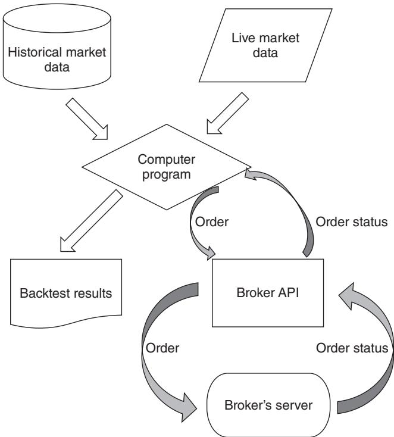
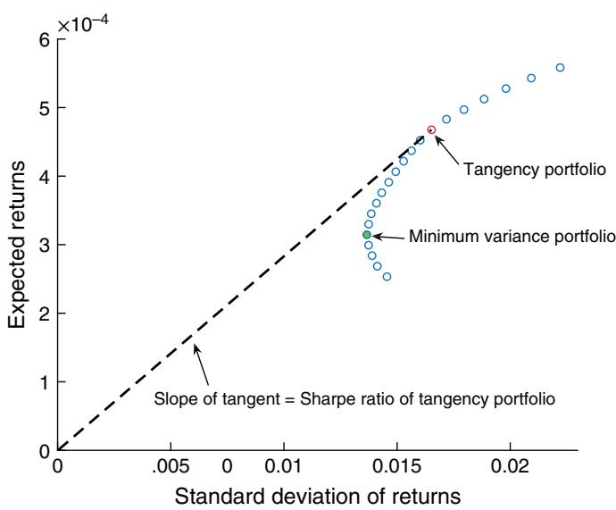

# 알고리즘 트레이딩의 기초


알고리즘 트레이딩 전략은 시장 데이터(과거 데이터 또는 실시간 데이터)를 입력으로 받아 API를 통해 브로커에게 주문을 제출하고, 브로커로부터 주문 상태 알림을 다시 받습니다. 그림 1.1의 순서도는 이 과정을 보여 줍니다.

제가 백테스트 결과와 실시간 주문을 생성하는 컴퓨터 프로그램을 나타내기 위해 의도적으로 동일한 상자를 사용했다는 점에 주목하십시오. 이는 우리가 백테스트한 것과 정확히 동일한 모델로 거래하고 있음을 보장하는 가장 좋은 방법입니다.

이 장에서는 그림 1.1의 각 블록에 적용할 수 있는 최신 서비스, 제품 및 그 공급업체에 대해 논의합니다. 또한 제가 선호하는 성과 지표, 최적 레버리지를 결정하는 방법, 그리고 가장 단순한 자산 배분 방법을 설명합니다. 이전 저서들에서 이러한 쟁점 중 많은 부분(전부는 아니지만)을 다룬 바 있지만, 여기서는 최신 기술 수준에 기반하여 이를 갱신했습니다. 핀테크 산업은 정체되어 있지 않았으며, 브로커의 안전성부터 포트폴리오 최적화의 미묘한 문제에 이르기까지 다양한 쟁점에 대한 제 이해 역시 정체되어 있지 않았습니다.

  
그림 1.1 알고리즘 트레이딩 개요

### 과거 시장 데이터


주식과 선물의 일별 과거 데이터에 대해서는 오랫동안 CSI (csidata.com)를 사용해 왔습니다. CSI는 매우 유연하고 견고한 데스크톱 애플리케이션을 제공합니다. 이 애플리케이션의 장점은 저녁에 특정 시간을 설정해 두면 CSI 서버와의 인터넷 연결을 통해 데이터가 자동으로 업데이트되도록 할 수 있다는 점입니다. 또한 데이터는 .txt, .csv, .xlsx와 같은 여러 편리한 형식으로 저장할 수 있습니다. 과거 주식(및 ETF) 가격을 주식분할과 배당에 대해 자동으로 조정하도록 요청할 수도 있습니다. 약간의 추가 비용을 지불하면 CSI는 상장폐지된 주식의 과거 데이터도 제공하므로, 생존 편향 (survivorship bias)이 없는 데이터셋을 확보할 수 있습니다.1 (참고로, CSI 데이터는 Yahoo! Finance의 과거 주식 데이터를 구동합니다.) 선물의 경우 연속계약을 만들기 위해 다양한 롤오버 (rollover) 방법을 선택할 수 있습니다. 또는 선택하지 않을 수도 있는데, 원래의 계약 가격도 제공되며 많은 전문 트레이더는 백어저스트된 연속계약 가격 대신 원래의 계약 가격을 사용해 선물을 백테스트하는 것을 선호하기 때문입니다. 이는 후자가 특정 롤 방법에 의존하며, 미래 정보 편향 (look-ahead bias)이 내재되어 있을 수 있기 때문입니다(이 문제에 대한 자세한 검토는 Chan, 2013 참조). 마지막으로, CSI는 이메일과 전화를 통한 훌륭한 고객 지원을 제공합니다.

CSI의 대안은 Quandl.com으로, 여러 공급업체의 다양한 종류의 데이터를 통합해 제공하는 업체입니다. 또한 데이터 선택과 다운로드에 사용할 수 있는 여러 언어의 API도 제공합니다(이 책에서 제가 사용하는 MATLAB이나, 다른 많은 트레이더가 사용하는 Python을 포함합니다). Quandl의 데이터 중 일부는 무료이며(주식 일별 데이터가 한 예입니다), 다른 데이터는 유료입니다. 예를 들어 저는 그들로부터 주식 펀더멘털 (fundamental) 데이터를 구매한 적이 있으며(제2장, 요인 모형 참조), 이는 Compustat과 같은 기존 공급업체보다 훨씬 경제적입니다.

진지한 트레이더나 학술 금융 연구자는 CRSP(www.crsp.com)의 주식, ETF 및 뮤추얼 펀드 데이터를 선호할 수 있습니다. 이들의 과거 데이터는 생존편향 (survivorship bias)이 없도록 신중하게 구축되어 있으며, 배당과 분할은 별도로 제공되므로 백테스트에서 이를 어떻게 활용할지 결정할 수 있습니다. 그러나 무엇보다 중요한 점은 이들이 종가 시점의 최우선 매수·매도 호가 (best bid and offer, BBO) 가격을 제공한다는 것입니다. 이는 6장 Box 6.2에서 설명하듯이, CSI나 Quandl의 일반적인 통합 종가를 사용하면 특정 전략의 백테스트 성과가 부풀려질 수 있기 때문에 중요합니다. 통합 시가를 사용할 때도 유사한 문제가 발생합니다. 사용하기에 가장 좋은 시가와 종가는 주 거래소의 경매 가격입니다. (틱 데이터에서 이러한 경매 가격을 추출하는 방법에 대한 설명은 Box 6.2도 참조하십시오.) 그다음으로 좋은 시가와 종가는 시가와 종가 시점의 중간가격을 계산하는 데 사용할 수 있는 BBO 가격입니다. 안타깝게도 CRSP는 시가 시점의 BBO 가격을 제공하지 않으므로, 이를 위해서는 일중 데이터를 사용해야 합니다. 학술 연구자의 경우, CRSP 데이터는 학술 연구를 위한 다수의 고품질 과거 데이터베이스를 통합 제공하는 WRDS(wrds-web.wharton.upenn.edu)를 통해 더 낮은 비용으로 얻을 수 있습니다.

물론 CRSP에서 데이터를 구매할 여력이 있는 진지한 트레이더라면 Bloomberg 터미널 구독료도 감당할 수 있을 것입니다. Bloomberg 터미널의 한 가지 장점은 미국 주식의 “주 거래소 종가”를 다운로드할 수 있다는 점입니다. 물론 Bloomberg 구독에는 다양한 상품에 걸친 많은 과거 및 실시간 데이터에 대한 접근도 포함되며, 특히 모든 주식에 대한 속보도 포함됩니다. 저는 Bloomberg의 뉴스 서비스가 다른 많은 공급업체의 서비스보다 우수하다고 보았습니다. 종종 어떤 주식이 갑자기 움직이는 것을 보게 되지만, 그 이유를 Bloomberg 뉴스 피드 외의 다른 곳에서는 찾지 못하는 경우가 있습니다. 이들은 가장 잘 알려지지 않은 주식에 관한 가장 사소한 뉴스까지도 가장 짧은 시간 안에 포착하며, 이는 이벤트 기반 전략을 운용할 때 중요합니다. Bloomberg의 미국 주식 과거 데이터 역시 생존편향이 없습니다. (Bloomberg의 치열한 경쟁자인 Thomson Reuters의 Eikon 플랫폼에 공정하게 말하자면, 저는 그 뉴스 피드를 시험해 보지는 않았습니다. 따라서 Eikon 역시 그만큼 폭넓고 시의성 있는 보도를 제공할 가능성이 있습니다. 데모에서 저에게 인상적이었던 Eikon의 한 기능이 있습니다. 개별 유조선의 지리적 위치와 이들이 향하는 곳을 볼 수 있었습니다. 분명히 이는 석유 트레이더가 단기 석유 재고, 공급, 수요를 예측하는 데 유용합니다.)

선물 트레이더에게 일별 데이터는 그리 큰 문제가 되지 않습니다. CSI와 Quandl의 무료 데이터는 다른 어떤 데이터만큼이나 좋습니다.

일별 옵션 데이터는 ORATS.com뿐만 아니라 ivolatility.com에서도 얻을 수 있습니다. 두 제공 데이터 모두 생존 편향 (survivorship bias)이 없습니다. 기관 트레이더나 학술 연구자는 Option Metrics에서도 구매할 수 있으며, 이는 종종 WRDS 패키지의 일부입니다(위 참조). 이러한 모든 데이터베이스의 좋은 특징 하나는 옵션 종가뿐만 아니라 종가 시점의 매수-매도 호가도 포함한다는 점입니다. 이는 일부 옵션, 특히 외가격 (out-of-the-money)이거나 만기가 긴 옵션은 거래가 드물 수 있기 때문에 중요합니다. 따라서 그날의 마지막 거래 가격은 종가 시점의 매수-매도 호가와 매우 다를 수 있으며, 우리가 실제로 종가 또는 종가 부근에서 거래할 수 있는 가격을 나타내지 않습니다. 이러한 데이터베이스에는 그릭스 (Greeks)와 내재 변동성 (implied volatility) 같은 보조적이지만 중요한 정보도 포함되어 있습니다. 더 나아가 내재 변동성 표면 (implied volatility surface)을 포함할 수도 있습니다. 이는 실제 옵션에서 계산된 내재 변동성을 사용하고 이를 보간하여 실제로 존재하지 않았던 행사가와 만기에 대한 내재 변동성을 산출합니다.

옵션 과거 데이터는 방대한 규모 때문에 주식이나 선물 데이터보다 더 비싼 경향이 있습니다. 그러나 다른 벤더로부터 일별 옵션 가격을 구매하는 것보다 QuantGo.com에서 장중 옵션 가격을 임대하는 것이 더 저렴할 수 있습니다. 장중 데이터 전반을 논의할 때 QuantGo에 대해 더 자세히 이야기하겠습니다. 일별 마감 시각 또는 그 직전의 타임스탬프가 있는 호가를 찾음으로써 장중 데이터에서 장마감 호가를 추출하는 것은 사소한 프로그래밍 연습에 불과합니다.

일별 가격 데이터를 넘어, 물론 기업에 대한 펀더멘털 금융 데이터도 있습니다. 앞서 Quandl이 그러한 데이터를 제공한다고 언급했습니다. 기관 트레이더는 이러한 데이터를 위해 대체로 Compustat을 찾을 것입니다. 애널리스트의 기업 이익 추정치에 대해서는 Thomson Reuters의 IBES 데이터베이스가 표준입니다. Compustat과 IBES는 모두 WRDS에서 이용할 수 있습니다. 한편, 크라우드소싱된 이익 추정치는 Estimize에서 이용할 수 있습니다. Estimize의 기여자들이 전통적인 매도 측 애널리스트보다 실제 이익을 더 정확히 예측할 수 있음을 시사하는 연구가 있습니다(Wang et al., 2014). Estimize의 데이터를 사용하는 예시 전략은 Deltix (2014)에서 논의됩니다. 공매도 잔고 데이터는 Compustat 및

SunGard의 Astec 데이터베이스에서 이용할 수 있습니다. SunGard의 데이터는 단순한 공매도 잔고 수치보다 월가 전반의 주식 대여자와 프라임 브로커로부터 수집한 훨씬 더 많은 세부 정보를 포함합니다. 또한 그들의 데이터는 실시간 피드로 장중 기준 이용이 가능하지만, 과거 데이터에는 과거 타임스탬프가 없습니다.

뉴스 데이터는 유행하고 있는 또 다른 유형의 데이터입니다. Bloomberg, Dow Jones, Thomson Reuters를 비롯한 많은 공급업체가 요소화된 뉴스 피드 (elementized news feeds), 즉 기계가 읽을 수 있어 키워드, 범주 등을 포착하기가 더 쉬운 뉴스를 판매합니다. 원시 뉴스 데이터에서 매매 신호를 생성하는 것이 전략에 너무 번거롭다면, Ravenpack, Thomson Reuters News Analytics, MarketPsych, Accern에서 뉴스 감성 데이터 (news sentiment data)를 구매할 수도 있습니다. (AcquireMedia의 NewsEdge 데이터베이스도 유사하지만, 이들은 영향 점수만 제공합니다. 이는 주가가 어느 방향으로 움직일지는 알려주지 않고 움직일 것이라는 사실만 알려주는 일종의 부호 없는 감성 점수이며, 옵션 트레이더에게 적합할 수 있습니다.) 그러나 감성 데이터에는 한 가지 문제가 있습니다. 공급업체마다 원시 뉴스에서 감성 점수를 계산하는 방식이 다르다는 점입니다. 따라서 매매 모델은 어느 정도 어떤 공급업체의 감성 점수가 가장 예측력이 높은지에 의존합니다.

장중 (intraday) 데이터의 매입 또는 임대라는 주제는 장중 데이터와 관련된 특성이 시장 미시구조 (market microstructure)와 밀접하게 연결되어 있기 때문에, 장중 트레이딩을 다루는 6장으로 미루겠습니다. 여기서는 과거 장중 데이터 공급업체로 tickdata.com, nanex.net, CQG, QuantGo.com, kibot, 그리고 물론 여러 거래소 자체가 포함된다는 점만 언급하겠습니다.

데이터를 찾고, 구매하거나 임대하는 일은 비용과 시간이 많이 들지만, Quandl과 QuantGo 같은 통합 제공업체 덕분에 그 부담은 훨씬 줄어들었습니다. 데이터를 직접 확보하는 일을 피하는 또 다른 방법은 데이터가 통합된 트레이딩 플랫폼을 채택하는 것입니다(다만 데이터 비용은 별도로 지불해야 할 수 있습니다). 좋은 예는 Quantopian.com으로, 1분봉 단위의 무료 미국 주식 거래 데이터를 제공하며, 이와 함께 더 낮은 빈도의 다양한 형태의 펀더멘털 및 뉴스 데이터도 제공합니다. (선물 데이터도 곧 제공될 것이라고 들었습니다.) 이러한 플랫폼에 대해서는 ‘‘백테스팅 및 트레이딩 플랫폼’’ 절에서 더 자세히 논의하겠습니다.

### 실시간 시장 데이터


대부분, 아니면 모든 증권사는 고객에게 실시간 시장 데이터를 제공하며, 일간 전략(즉, 시장 개장 시 또는 마감 시에만 거래하는 전략)을 거래한다면 이러한 데이터는 대체로 충분합니다. 그러나 장중 거래를 한다면 데이터의 품질이 더 중요한 문제가 됩니다. 6장에서 더 자세히 논의하겠지만, 저지연 (low latency) 시장 데이터는 입수하는 데 상당히 비쌀 수 있습니다. 25 ms(ms = 밀리초) 이상의 지연시간을 허용할 수 있는 장중 거래에 적합한 데이터를 제공하는 벤더로는 eSignal, IQFeed, CQG, Interactive Data, Bloomberg 등 다수가 있습니다. 그러나 10 ms 미만의 지연시간을 가진 데이터 피드를 제공하는 벤더는 훨씬 적습니다. 여기에는 S&P Capital IQ(이전의 QuantHouse), SR Labs, Thomson Reuters가 포함됩니다. 물론 거래소의 직접 피드 (direct feed)를 구독할 수도 있지만, 이는 높은 비용이 높은 수익으로 정당화된다고 보는 고빈도 트레이더에게만 해당됩니다. (통화 데이터를 원한다면 이는 예외입니다. 대부분의 FX 거래소는 고객에게 무료 직접 피드를 제공하기 때문입니다.)

과거 시장 데이터와 마찬가지로, 많은 트레이딩 플랫폼도 실시간 시장 데이터 피드를 포함합니다. 이에 대해서는 다음 절에서 논의하겠습니다.

### ■ 백테스팅과 트레이딩 플랫폼


전통적으로 우리는 하나의 플랫폼(예: R)에서 트레이딩 전략을 백테스팅 (backtesting)하고, 성공하면 브로커의 API를 활용하여 해당 전략의 실행을 자동화하는 별도의 프로그램을 작성했습니다. 그러나 이는 버그가 발생하기 매우 쉽습니다. 백테스트와 실거래 프로그램이 정확히 동일한 트레이딩 로직을 담고 있음을 보장할 방법이 없기 때문입니다. 다행히 오늘날 대부분의 백테스트 플랫폼은 실거래 실행 능력까지 확장했으므로, 여기에서는 백테스팅과 트레이딩 플랫폼에 대한 논의를 함께 다루겠습니다.

서문에서 언급했듯이, MATLAB은 제가 가장 선호해 온 백테스팅 플랫폼입니다. MATLAB은 프로그램 개발과 디버깅을 위한 매우 포괄적이고 사용자 친화적인 인터페이스를 갖추고 있으며, 트레이딩 전략 개발에서 접하게 될 가능성이 있는 거의 모든 난해한 수학적 또는 계산적 기법을 포괄하는 폭넓은 툴박스를 제공합니다. 이러한 툴박스 중 하나인 Trading Toolbox는 MATLAB 프로그램이 여러 브로커리지의 API에 연결되어 시장 데이터를 수신하고, 주문을 제출하며, 주문 상태 알림을 받을 수 있게 해 줍니다. Trading Toolbox를 구매하고 싶지 않다면, 동일한 기능을 가능하게 해 주는 제3자 공급업체 개발 어댑터가 적어도 세 가지 있습니다. exchangeapi.com의 quant2ib, undocumentedmatlab.com의 IB-Matlab, 그리고 MATLAB의 File Exchange에서 제공되는 Jev Kuznetsov의 무료 MATLAB-to-IB API입니다. 저는 Chan (2013)에서 이러한 선택지들을 어느 정도 깊이 있게 논의한 바 있습니다. 마지막으로, MATLAB은 빠릅니다. (MATLAB, R, Python 간 성능 속도 비교는 6장을 참조하십시오.) 이 플랫폼의 유일한 단점은 무료가 아니라는 점이지만, “Home” 라이선스는 \$150에 불과하며, 추가 툴박스마다 \$45가 더 듭니다. MATLAB의 툴박스를 구매할 계획이라면, 제가 추천하는 세 가지는 다음과 같습니다(중요도가 높은 순서대로): Statistics and Machine Learning, Econometrics, Financial Instruments(옵션 트레이더용).

무료 오픈소스 플랫폼을 선호하는 사람들에게는 언제나 R과 Python이 있습니다.

R은 MATLAB과 매우 유사합니다. R은 배열 처리 언어 (array-processing language)이며, MATLAB의 툴박스에 해당하는 다양한 전문 “패키지”를 갖추고 있는데, 그중 상당수는 R을 사용하는 학계 연구자 수가 많기 때문에 MATLAB의 것보다 더 정교할 수도 있습니다. RStudio라는 GUI 개발 플랫폼이 있지만, 저는 그 사용자 인터페이스가 MATLAB에 비해 상당히 투박하다고 느끼며, 따라서 디버깅 생산성이 더 낮습니다. R은 또한 세 언어 중 가장 느리며, MATLAB이나 Python과 달리 속도 향상을 위해 C 또는 C++ 코드로 컴파일할 수 없기 때문에 그 느림은 더욱 문제가 됩니다. (다만 Rcpp 패키지를 사용하면 R 내부에서 컴파일된 C++ 코드에 접근할 수 있습니다.) 실행 자동화와 관련해서는, “IBroker”라는 패키지를 통해 R 프로그램을 Interactive Brokers에 연결할 수 있습니다.

Python은 부상하고 있는 언어이지만, 제가 아는 퀀트 중에는 이미 1998년에 백테스팅에 Python을 사용한 사람들도 있습니다. 많은 퀀트 트레이더가 선호하는 독립형 언어일 뿐 아니라, Quantopian과 같은 플랫폼도 Python을 전략 명세 언어로 사용합니다. 기본 Python은 배열 처리 언어가 아닙니다(이 기능을 갖춘 SciPy 패키지를 사용할 수는 있습니다). 배열 처리는 많은 수의 상품(예: 주식 포트폴리오)을 동시에 백테스팅하는 데 편리하지만, 자동 실행 프로그램을 작성하는 데에는 유용하지 않습니다. 따라서 백테스팅과 실거래 실행 모두에 동일한 프로그램을 사용하겠다고 고집한다면, 이 기능은 아예 무시해도 됩니다. Python의 주요 장점 중 하나는 Microsoft의 Visual Studio를 사용하여 코드를 개발하고 디버깅할 수 있다는 점이며, 따라서 잘 다듬어진 이 개발 환경의 모든 역량을 활용할 수 있습니다. 좋은 평가를 받은 또 다른 Python용 통합 개발 환경2(IDE)은 PyCharm입니다. Python의 pandas 라이브러리는 R과 유사한 데이터 분석 패키지이며, rpy2 패키지는 모든 R 패키지에 접근할 수 있는 인터페이스를 제공합니다. Python은 MATLAB만큼 빠르지는 않지만 R보다는 빠르며, C 또는 C++로 컴파일할 수 있습니다. 3 실행을 위해 IBPy 또는 여러 다른 패키지를 통해 Python 트레이딩 프로그램을 Interactive Brokers에 연결할 수 있습니다.

표 1.1 퀀트 트레이딩을 위한 세 가지 프로그래밍 언어의 순위(1부터 3까지의 순위로, 1 = 최고 순위, 3 = 최저 순위.)
<table><tr><td>특징</td><td>MATLAB</td><td>R</td><td>Python</td></tr><tr><td>사용 용이성</td><td>1</td><td>2</td><td>2</td></tr><tr><td>IDE 완성도</td><td>1</td><td>3</td><td>1</td></tr><tr><td>속도</td><td>1</td><td>3</td><td>2</td></tr><tr><td>툴박스</td><td>2</td><td>1</td><td>1</td></tr><tr><td>C/C++로의 컴파일</td><td>1</td><td>N/A</td><td>1</td></tr><tr><td>브로커와의 연결성</td><td>1</td><td>2</td><td>2</td></tr><tr><td>고객 지원</td><td>1</td><td>N/A</td><td>N/A</td></tr><tr><td>가격</td><td>2</td><td>1</td><td>1</td></tr></table>

표 1.1에서는 트레이딩 전략 개발에 가장 널리 사용되는 세 가지 스크립팅 언어의 다양한 기능과 측면에 대해, 논란의 여지는 있지만 주관적인 제 개인 순위를 제시합니다.

제가 C/C++, Java, 또는 C#과 같은 가장 일반적인 프로그래밍 언어 일부를 왜 제외했는지 궁금할 수 있습니다. 사실 트레이딩 전략을 개발하는 가장 생산적인 방법은 다수의 전략을 테스트하기 위해 프로토타입 프로그램을 빠르게 만들고, 그 전략들이 기대에 부응하지 못하면 신속히 폐기하는 것입니다. MATLAB, R, 또는 Python과 같은 스크립팅 언어(REPL4 언어라고도 함)는 우리가 이러한 연구 주기를 단축할 수 있게 해 줍니다. 그러나 연구에서의 생산성은 자동화된 트레이딩 시스템을 구축하는 데서의 생산성과 같지 않습니다. 후자는 일반적으로 객체 지향 설계, 예외 처리, 버전 관리, 메모리 및 속도 최적화 등과 같은 소프트웨어 개발의 통상적인 부가 기능을 포함합니다. 이러한 부가 기능은 실제로 스크립팅 언어에서 구현하기가 상당히 번거로우며, 더 나아가 견고하고 확장 가능한 소프트웨어 아키텍처가 없으면 버그를 유입하기가 매우 쉽습니다. 일반적으로 객체 지향 설계가 스크립팅 언어에 적용되면, 실행 시스템으로 유용하게 쓰기에는 너무 느리게 작동합니다.

양쪽 장점을 모두 취하기 위해, 우리 회사에서는 초기 연구를 대부분 MATLAB이나 Python으로 수행합니다(다만 저는 종종 우리 연구원들에게 먼저 Quantopian에서 전략을 테스트해 보라고 요청하는데, 이는 코드에 선견 편향이 없는지 확인하기 위해서입니다). 우리가 전략을 확정한 뒤에는, 우리의 CTO인 Roger가 초기 백테스트의 정확성을 확인하는 방법으로 동일한 전략을 백테스트하고 실시간으로 실행할 수 있는 시스템을 C#으로 독립적으로 구축합니다. 확인이 끝나면, 비유적으로 열쇠를 돌리는 것만으로 실거래를 수행할 수 있으며, 이는 스크립팅 언어를 사용해 실행하는 경우보다 훨씬 낮은 지연시간을 제공합니다. 실행 시스템을 구축할 때, 우리는 다른 전략을 위해 작성해 둔 기존 클래스를 종종 재사용할 수 있습니다. 이러한 방식으로 우리는 소프트웨어의 정확성, 컴포넌트 재사용, 또는 실행 효율성을 희생하지 않으면서 연구 생애주기를 단축했습니다.

이제는 앞 문단에서 설명한 것처럼 자동화 트레이딩 전략을 신속하고도 견고하게 개발하고 배포하기 쉽게 해 준다고 표방하는 백테스팅 (backtesting) 및 자동 실행 플랫폼이 많이 나와 있으며, 두 가지 서로 다른 언어를 사용할 필요도 없습니다. 이에 대해서는 Chan (2013)에서 자세히 쓴 바 있으므로, 여기서는 다음 기준에 부합하는 플랫폼으로 논의를 한정하겠습니다.

1. 과거 및 실시간 시장 데이터가 통합되어 있거나, 널리 쓰이는 데이터 공급업체를 위한 어댑터를 제공합니다.

2. Python이나 Java와 같은 범용 프로그래밍 언어에 의존함으로써 전략 설계에서 최대한의 유연성을 허용합니다.

3. 널리 쓰이는 브로커 API에 연결할 수 있습니다.

4. 다른 금융상품과 더불어 미국 주식에 대한 백테스팅과 실거래를 허용합니다.

이러한 기준을 충족하는 플랫폼으로는 Quantopian, QuantConnect, Ninjatrader, Marketcetera, AlgoTrader, OpenQuant, Deltix, Quant-House가 있습니다. (물론 이것이 완전한 목록은 아닙니다.) Quantopian과 같은 일부 플랫폼은 무료인 반면, QuantHouse와 같은 다른 플랫폼은 기관 트레이더에게 적합한 가격표를 달고 있습니다.

고빈도 전략을 거래하고 있다면, 이러한 플랫폼 중 다수는 충분하지 않을 수 있습니다. 너무 느릴 수 있거나, 2단계 호가 (level 2 quotes)가 없기 때문입니다. 그러나 Lime Brokerage의 Strategy Studio와 같이 이러한 까다로운 작업을 위해 특별히 설계된 플랫폼도 있습니다. 이에 대해서는 6장에서 더 논의하겠습니다.

이러한 플랫폼들이 트레이딩 전략을 백테스팅하고 자동화하는 일을 확실히 더 쉽게 만들어 주기는 했지만, 일반적으로 우리가 테스트할 수 있는 전략, 데이터 또는 금융상품의 정확한 유형에는 몇 가지 제약이 따릅니다. 놀랍지 않게도, 플랫폼이 더 비쌀수록 더 유연합니다. 그러나 낮은 개발 비용과 결합된 절대적인 유연성이 필요하다면, 아마도 우리 회사에서 하는 방식대로 해야 할 것입니다.

### 브로커


오늘날에는 사실상 모든 브로커가 고객에게 시장 데이터를 구독하고, 주문을 제출하며, 주문 상태 알림을 받을 수 있는 API를 제공합니다. 그림 1.1의 오른쪽에 있는 마지막 두 블록을 참조하십시오. 물론 이들의 API가 사용하기 쉬운 정도와 포괄성은 매우 다양합니다. 각 브로커 API의 변덕스러움과 저수준 세부 사항을 직접 다루고 싶지 않다면, 앞 절에서 설명한 자동화 실행 플랫폼 중 하나를 사용할 수 있습니다.

한편 수수료는 일반적으로 매우 낮아서, 누구와 거래할지를 결정하는 데 있어 핵심적인 요소도 아닙니다. 브로커는 수수료 외에도 고객으로부터 돈을 벌 수 있는 다른 방법을 가지고 있습니다. 일부 주식 브로커에게 널리 쓰이는 한 가지 방법은 “주문 흐름 대가 (payment for order flow)”입니다. 본질적으로, 이 브로커에게 주문을 보내면 브로커는 리베이트(예: 주당 1센트)를 받기 위해 해당 주문을 특정 시장조성자 (market maker) 또는 특정 거래소로 전달하고, 그들이 이 주문을 실행하게 합니다. 이러한 방식을 사용하는 브로커는 고객이 계좌를 개설할 때 이 관행을 고객에게 알려야 합니다. 브로커가 이 리베이트를 벌게 하고 싶지 않고, 대신 자신이 직접 받기를 원한다면 직접 시장 접근 (Direct Market Access)을 제공하는 브로커(예: Interactive Brokers 또는 Lime Brokerage)를 이용할 수 있습니다. 일부 FX 브로커에게 돈을 버는 널리 쓰이는 방법은 통화쌍의 매수-매도 스프레드 (bid-offer spread)를 확대하는 것입니다. 이 방식으로 그들은 고객에게 제시하는 스프레드와 고객의 거래를 실행하는 은행 간 시장에서 자신들이 지불해야 하는 스프레드 간의 차이를 벌어들입니다. 이러한 추가 스프레드는 시간이 지남에 따라 변할 수 있으므로 서로 다른 FX 브로커 간 비용을 비교하기 어렵게 만들 수 있지만, 물론 이것이 바로 일부 브로커가 이 관행을 채택하는 이유입니다. 투명성을 선호한다면 스프레드가 아니라 수수료만 부과하는 FX 브로커로 검색 범위를 제한할 수 있습니다.

선물 또는 통화 트레이더라면, 브로커와 관련하여 추가로 걱정해야 할 항목이 하나 더 있습니다. 바로 재무 안정성입니다. 미국 증권(즉, 주식 거래) 계좌의 경우, 많은 트레이더는 자신의 현금5이 증권투자자보호공사(Securities Investor Protection Corporation, SIPC)에 의해 최대 \$250,000까지 보장된다는 사실을 알고 있습니다. 또한 많은 브로커는 Lloyd’s of London과 같은 민간 보험회사를 통해 추가 보험도 제공합니다. 그러나 이 중 어느 것도 상품 선물 거래 계좌에는 적용되지 않습니다. 따라서 MF Global과 PFGBest의 파산 이후 큰 소동이 일어난 것입니다(MarketWatch, 2012). 계좌를 개설하기 전에 상품 브로커의 재무 건전성을 확인하라고 조언하는 것은 무의미할 것입니다. 전미선물협회(National Futures Association, NFA)조차 이러한 대형 브로커들(선물중개업자(Futures Commission Merchants, FCM)라고 불립니다) 중 일부가 자본 요건을 충족하지 못하거나 사기를 저지르고 있다는 사실을 감지하지 못했다면, 우리가 무슨 가능성이 있겠습니까? 그러나 이 난제에서 벗어날 방법이 하나 있습니다. 증권 브로커가 동시에 FCM이기도 하다면, 보험이 적용되지 않는 상품 계좌의 초과 현금6을 보험이 적용되는 증권 계좌로 자동 이체하는 방법을 제공할 수 있습니다. (예를 들어, Interactive Brokers는 이러한 현금 자동 이체 서비스를 제공합니다.)

통화 트레이더들은 Herstatt 위험, 즉 결제 위험(settlement risk)에 대해 들어본 적이 있을 수 있습니다(Galati, 2002). 예를 들어, 우리가 은행에 100만 EURUSD를 매도하고 그 은행에 100만 EUR를 인도했다고 합시다. 그런데 이 은행이 그에 상응하는 USD 금액을 우리에게 보내기 전에 파산합니다(1974년 독일의 Bankhaus Herstatt 사례가 그러했습니다). 우리는 당분간 USD를 받지 못할 것이며, 100만 EUR를 잃게 됩니다. 이는 평판 좋은 FX 브로커에 계좌를 보유한다고 해서 해결되는 위험이 아닙니다. 우리의 거래상대방이 먼 나라의 어떤 은행일 수 있으며, 브로커는 우리의 손실에 대해 책임을 지지 않기 때문입니다. 이 시나리오는 정보가 부족한 일부 재무 자문가들이 고객이 외화 전략이나 펀드에 투자하지 못하도록 겁을 주는 데 자주 사용됩니다. 그러나 2002년에 세계 최대 은행들 중 일부가 소유한 기관인 CLS 은행이 설립된 이후, 이 위험은 대체로 제거되었습니다. CLS 은행은 미국 연방준비제도의 규제를 받는 미국 금융기관이며, 통화 거래의 양쪽 결제를 동시에 수행하도록 지원합니다. 전 세계 18개 중앙은행에 계좌를 유지하고 있기 때문에 그렇게 할 수 있습니다. 위의 예에서, 우리의 거래상대방이 우리의 EUR 지급을 받는 것과 동시에 우리는 USD 지급을 받게 되며, 이 모든 과정은 CLS 은행을 통해 이루어집니다. 이는 마치 주식거래소에서 거래하는 것과 거의 비슷합니다. 우리가 어떤 주식을 매도했다면, 그 주식을 산 트레이더가 파산하더라도 그 주식에 대한 대금 지급이 이루어질 것이 보장되는 것과 같습니다. CLS에서 통화가 결제되는 18개 중앙은행은 www.cls-group.com/About/Pages/Currencies.aspx 에 열거되어 있으며, 이 통화들은 결제 위험이 거의 없거나 전혀 없는 통화들입니다.

우리는 거래에서 다른 당사자들(브로커 또는 거래상대방)이 우리에게 지급하지 못할 위험에 대해 논의해 왔습니다. 그렇다면 실패하는 쪽이 우리라면 어떻습니까? 더 구체적으로, 레버리지 거래에서 중개 계좌의 손실이 계좌 자기자본보다 더 커진다면 어떻습니까? 우리는 음의 자기자본에 대해 책임을 져야 합니까? 계좌에 투자한 금액보다 더 많이 잃을 수 있습니까? 개인으로 투자했다면 답은 그렇다, 그리고 그렇다입니다. 특히 뼈아픈 사례로, 2015년 1월 15일 스위스 국립은행(스위스 중앙은행)은 스위스 프랑을 더 이상 유로에 고정하지 않겠다고 갑자기 발표했습니다(Economist, 2015). EURCHF는 몇 초 만에 약 10퍼센트 폭락했고, 결국 하루 동안 29퍼센트를 잃었습니다. 많은 외환(FX) 트레이더들의 계좌 자기자본이 음수가 되었습니다. 일부 소규모 FX 브로커들은 고객들이 손실금을 갚지 않았기 때문에 파산했습니다. 이와 같은 상황에서 우리는 어떻게 책임을 지지 않도록 보장할 수 있습니까? 우리 자신을 보호하는 방법은 개인 명의나 가족 명의로 투자하는 것이 아니라, 법인(또는 미국의 S-법인), 유한책임회사(미국), 또는 합자회사와 같이 우리가 완전히 소유한 유한책임 기구(limited liability vehicle)를 통해 투자하는 것입니다. 헤지펀드와 같은 타인의 합자회사에 투자하는 것도 효과가 있습니다. 음의 자기자본이 발생할 경우, 유한책임 기구는 파산을 선언해야 합니다. 이는 좋지는 않지만, 파국적이지는 않습니다.

### ■ 성과 지표


백테스트 (backtest) 프로그램은 어떤 성과 지표 (performance metrics)를 생성해야 합니까? 저는 보통 그중 다섯 가지, 즉 CAGR(연평균 복합 성장률, compound annual growth rate), 샤프 비율, 칼마 비율 (Calmar ratio), 최대 낙폭 (maximum drawdown), 최대 낙폭 지속 기간에만 관심을 둡니다. 저는 이전 저서들에서 칼마 비율을 제외한 대부분을 자세히 논의했으므로, 여기서는 그 사용법 중 일부만 간략히 강조하겠습니다.

CAGR은 평균 연율 수익률과는 약간 다릅니다. 이는 같은 레버리지를 계속 유지하면서, 각 기간마다 계좌에 현금을 넣거나 계좌에서 현금을 빼지 않는다고 가정합니다. 극단적인 예를 들면, 어떤 전략이 거래일마다 1퍼센트의 수익을 낸다면 CAGR은 $1.01^{252} - 1 = 1127$퍼센트가 됩니다. 이것이 복리의 작용입니다. 반면 평균 연율 수익률은 단지 $252 \times 0.01 = 252$퍼센트일 뿐이며, 이는 각 기간마다 이익을 인출하거나 손실을 보전하기 위해 현금을 추가할 경우 얻게 되는 수익률입니다. 그러나 저는 이러한 복합 성장을 달성하려면 레버리지를 일정하게 유지해야 한다는 점을 강조합니다. 다시 말해, 계좌 자기자본과 레버리지에 따라 매일 포지션이나 주문 규모를 다시 조정해야 하며, 이는 자동매매 프로그램이라면 상당히 쉽게 수행할 수 있어야 하는 일입니다.

백테스트에서는 레버리지를 1로 설정할 것을 권합니다. 그렇지 않으면 아래의 켈리 공식이 정하는 어느 지점까지는 우리가 사용하는 레버리지가 높을수록 CAGR도 높아집니다. 따라서 백테스트를 위해 임의의 레버리지를 선택하는 것은 상당히 무의미합니다. 그러나 레버리지가 1임을 보장하려면, 손익(P&L)을 포지션들의 총 총시장가치로 나누어 수익률을 측정해야 합니다. 예를 들어, 우리가 주식 A를 \$100 매수하고 동시에 주식 B를 \$100 매도했으며 P&L이 \$1이라면, 무레버리지 수익률은 단지 0.5퍼센트입니다.

저는 이전에 켈리 공식의 사용에 대해 많이 쓴 바 있습니다(Chan, 2009).

$$
\mathrm{Optimal~leverage} = \frac{\mathrm{Mean~of~Excess~Returns}}{\mathrm{Variance~of~Excess~Returns}}
$$

우리 전략이나 포트폴리오의 레버리지를 이 최적 레버리지보다 높이면, 레버리지가 증가함에 따라 CAGR이 하락하기 시작할 수 있으며, 레버리지가 충분히 높아지면 거의 확실히 −100퍼센트가 됩니다. 그러나 레버리지가 켈리 최적값과 같더라도 안전하지 않은 경우가 많습니다. 저는 켈리 레버리지가 실제로 사용하기에는 보통 너무 높다는 것을 발견했습니다. 위에 제시한 켈리 공식은 수익률의 가우스 분포를 가정합니다. 즉, 위험은 수익률의 2차 모멘트로만 측정됩니다. 따라서 평균이 약 0.05퍼센트이고 표준편차가 약 1퍼센트인 모의 초과수익률 시계열을 생각해 봅시다. 이는 SPY의 실제 일일 수익률에서 무위험 이자율을 뺀 통계와 크게 다르지 않습니다. 따라서 켈리 공식은 레버리지 5를 권할 것입니다. 그러나 어느 하루의 수익률이 −20퍼센트였다고 가정해 봅시다. 이는 1987년 10월 19일 블랙 먼데이에 SPY가 실제로 기록한 수익률과도 가깝습니다. 우리가 레버리지 5로 SPY를 매수하고 있었다면, 그날 우리의 자기자본은 전부 사라졌을 것이며, 켈리 공식이 도움이 되었다고 할 수는 없습니다. 실무적으로는 여러 차례의 금융위기를 포함하는 기간에 대해 백테스트를 수행했을 때의 최대 낙폭을 감당할 수 있다고 느낄 때까지 레버리지를 낮출 것을 권합니다.

샤프 비율(Sharpe ratio)은 모두가 사용하는 위험조정 수익률 척도이지만, 수익률 분포가 가우스 분포(Gaussian distribution)라고 암묵적으로 가정하기 때문에 그 효용은 제한적입니다. 위험은 다시 수익률의 표준편차, 즉 변동성만으로 측정됩니다. 그러나 모두가 알다시피 수익률 분포에는 ‘두꺼운 꼬리(fat tails)’가 있습니다. 즉, 어느 방향이든 비정상적으로 큰 수익률이 가우스 분포가 예측하는 것보다 훨씬 더 자주 발생합니다. 최대 낙폭(maximum drawdown)은 수익률 분포의 2차 모멘트만 측정하는 데 의존하지 않기 때문에 꼬리 위험을 훨씬 더 잘 나타내는 척도입니다. (최대 낙폭은 또한 비대칭적입니다. 우리는 극도로 양의 수익률이 나타나는 기간에 대해서는 걱정하지 않습니다.) 따라서 저는 대신 칼마 비율(Calmar ratio)을 사용하는 것을 선호해 왔습니다. 이는 CAGR을 최근 3년 동안의 최대 낙폭 절댓값으로 나눈 값으로 정의됩니다. 어떤 사람들은 대신 MAR 비율(MAR ratio)을 사용하는 것을 선호하는데, 이는 최대 낙폭을 백테스트(또는 실제 운용 실적)의 전체 기간에 대해 계산한다는 점을 제외하면 칼마 비율과 동일합니다. 칼마 비율이 MAR 비율보다 더 잘 정의되어 있음을 알 수 있습니다. 백테스트가 길수록 최대 낙폭의 절댓값은 더 커집니다. 따라서 백테스트나 운용 실적의 길이에 민감하게 의존하는 척도를 사용하는 것은 그다지 타당하지 않습니다. 3년은 이 척도를 정규화하는 한 방법입니다. 저는 백테스트 칼마 비율이 적어도 1인 전략을 거래하는 것을 선호합니다.

### ■ 포트폴리오 최적화 (Portfolio Optimization)

여러 전략을 거래하거나 포트폴리오에서 여러 금융상품의 포지션을 보유할 때, 이들 사이에 자본을 어떻게 배분하는지는 각 전략이 개별적으로 얼마나 성과를 내는지만큼이나 총수익에 중요할 수 있습니다. 이러한 포트폴리오 최적화 문제는 학술 금융 연구에서 잘 연구되어 왔지만, 강조할 만한 몇 가지 미묘한 점이 있습니다.

세부 사항으로 들어가기 전에, 한 기간(예: 하루, 한 달 또는 1년)에 걸친 포트폴리오 수익을 극대화하는 것과 무한한 기간에 걸친 포트폴리오의 복리 수익률(CAGR)을 극대화하는 것을 구분해야 합니다. 전자는 잘 알려진 마코위츠 포트폴리오 최적화 방법으로 다룹니다. 그 목적은 일정한 수익률 분산 제약하에서 기대수익률을 극대화하는 것이며, 또는 동등하고 더 관례적으로는 일정한 기대수익률 제약하에서 수익률 분산을 최소화하는 것입니다.

한 기간 동안의 기대수익률과 수익률 분산을 계산하기 위해, 우리의 포트폴리오가 N개의 금융상품(주식, 채권, 선물 등) 또는 전략(평균회귀, 모멘텀, 이벤트 기반, 옵션 등)을 가지고 있다고 가정하겠습니다. 여기서부터는 포트폴리오의 이러한 구성요소를 지칭하기 위해 일반적인 용어인 금융상품을 사용하겠습니다. 각 금융상품 i는 기대수익률 $m_{i}$를 가집니다. 우리는 이러한 수익률이 공분산 $C_{i,j}$를 가진다고 가정합니다. 여기서 수익률이란 로그 수익률이 아니라 순수익률을 의미한다는 점에 유의하십시오. 이 구분은 나중에 중요해질 것입니다. 명확히 하자면, 이 맥락에서 순수익률은 다음과 같이 계산됩니다.

$$
\mathit{Net}\ return(t) = \frac{\mathit{Price}(t)}{\mathit{Price}(t-1)} - 1,
$$

반면 로그 수익률은 다음과 같이 계산됩니다.

$$
\mathit{Log}\ return(t) = \log(Price(t)) - \log(Price(t-1)).
$$

순수익률은 원칙적으로 결코 가우스 분포 (Gaussian distributions)를 가질 수 없지만(그 ‘이유’는 연습문제로 남겨 둡니다), 로그 수익률은 가질 수 있습니다. 로그 수익률이 정규분포를 따른다면 가격 시계열의 평균 로그 수익률 $\mu$와 평균 순수익률 m 사이에는 흥미로운 관계가 있습니다.

$$
\mu \approx m - \frac{s^{2}}{2}\tag{1.1}
$$

여기서 s는 순수익률의 표준편차입니다. 이는 또한 로그 수익률의 표준편차와도 대략 같으므로, 두 가지를 나타내는 데 같은 기호를 사용할 수 있습니다. 식 1.1의 근사적 등식은 기간을 점점 더 작은 하위 기간으로 세분하여 연속시간에 접근할수록 정확한 등식이 됩니다(Box 1.1 참조). 이는 연속시간 금융에서 블랙-숄즈 옵션 가격결정 공식의 기초 공식으로 유명한 이토 보조정리 (Ito’s Lemma)로부터 도출될 수 있습니다. 이 등식은 나중에 기대 복리 성장률을 극대화하려고 할 때 유용할 것입니다.

### Box 1.1: 순수익률과 로그수익률의 평균


이 예에서는 로그수익률 (log return)이 가우스 분포 (Gaussian distribution)를 따를 때 식 1.1이 근사적으로 성립하며, 한 기간을 점점 더 많은 하위 기간으로 세분할수록 이 근사가 정확해진다는 점을 수치적으로 보일 것입니다.

어떤 기간의 로그수익률 평균이 100퍼센트이고 표준편차가 200퍼센트라고 해 보겠습니다. 우리는 randn 함수를 사용하여 평균이 $\mu = 100\% / N$이고 표준편차가 $\dot{\mathbf{\zeta}}_{s} = 200\% / \sqrt{N}$인 $N$개의 하위 기간 로그수익률 $r_{i}$를 시뮬레이션할 것입니다. $N = 100$, 10,000, 1,000,000을 시도할 것입니다.

```javascript
r=1/N+2/sqrt(N)*randn(N, 1);
```

이에 대응하는 순수익률 (net return) R은 단순히 $e^{r_i} - 1$입니다.

```javascript
R=exp(r)-1;
```

로그수익률의 표본평균과 표본표준편차를 계산할 수 있습니다.

```javascript
mu=mean(r);
sigma=std(r);
```

```javascript
m=mean(R);
s=std(R);
```

표 1.2 순수익률과 로그수익률의 평균
<table><tr><td>N</td><td>m</td><td>μ</td><td>S</td><td> $\mathbf{m} - s^{2} / 2$ </td></tr><tr><td>100</td><td>2.00e-2</td><td>2.99e-4</td><td>2.00e-1</td><td>-6.41e-04</td></tr><tr><td>10,000</td><td>2.24e-4</td><td>2.30e-5</td><td>2.00e-2</td><td>2.28e-05</td></tr><tr><td>1,000,000</td><td>4.66e-6</td><td>2.65e-6</td><td>2.00e-3</td><td>2.65e-06</td></tr></table>

그리고 이를 순수익률의 표본평균 및 표본표준편차와 비교할 수 있습니다.

그러면 $N \to \infty$일 때 $m - s^{2} / 2 \to \mu$임을 알게 될 것입니다. 이는 표 1.2에 나타나 있으며, 여기서 수렴한 두 수량을 굵게 표시했습니다.

전체 코드는 epchan.com/book3에서 netVsLogRet.m으로 다운로드할 수 있습니다. 사용자 ID와 비밀번호는 모두 calmar입니다.

도구 i에 배분된 자본(또는 레버리지)을 $F_i$로 표시하면, 한 기간 동안 포트폴리오의 기대수익률은 행렬 표기법으로 단순히 $F^{T}M$입니다. 여기서 F는 $F_i$의 열행렬이고 M은 $m_i$의 열행렬입니다. 마찬가지로 포트폴리오 수익률의 기대분산은 $F^{T}CF$이며, 여기서 C는 공분산 행렬 $C_{i,j}$입니다. 포트폴리오의 기대수익률을 각 고정 수준으로 두고, Box 1.2에 예시된 것처럼 수치적 이차계획법 (quadratic programming)을 사용하여 F를 변화시킴으로써 수익률의 기대분산을 최소화할 수 있습니다. 이 제약 최적화의 결과는 포트폴리오의 기대수익률을 그 기대 최소분산과 대비하여 보여 주는 차트(그림 1.2)에 표시할 수 있습니다. 이 곡선에는 유명한 이름이 있습니다. 바로 효율적 프런티어 (efficient frontier)입니다. 그렇다면 기대수익률과 분산 사이의 최적 절충은 무엇입니까? 마코위츠는 샤프 비율 (Sharpe ratio)을 극대화하는 접점 포트폴리오를 선택해야 한다고 말했습니다. 즉, 기대수익률7과 수익률 분산 사이의 비율입니다. 접점 포트폴리오는 그림 1.2에 표시되어 있으며, 이렇게 불리는 이유는 무위험 포트폴리오(여기서는 무위험 이자율이 0이라고 가정하므로 기대수익률이 0이고 분산도 0인 포트폴리오)를 나타내는 원점에서 효율적 프런티어까지 선을 그으면, 이 선이 바로 접점 포트폴리오에서 효율적 프런티어와 접선으로 만나는 지점에서 교차하기 때문입니다. 이 선의 기울기가 접점 포트폴리오의 샤프 비율입니다.

  
그림 1.2 효율적 프런티어

### 상자 1.2: 이차계획법을 이용한 효율적 프런티어 계산


이 예에서 우리는 숏 포지션이 허용되지 않고 모든 ETF의 가중치 합이 1이어야 한다는 제약, 즉 포트폴리오에 레버리지가 허용되지 않는다는 제약하에서 ETF 포트폴리오의 효율적 프런티어를 수치적으로 결정합니다. 우리가 사용하는 ETF 집합은 EWC, EWG, EWJ, EWQ, EWU, EWY입니다. 효율적 프런티어는 고정된 기대수익률 집합이 주어졌을 때의 최소 분산들의 집합입니다. 효율적 프런티어를 구성하는 첫 번째 작업은 가능한 최대 및 최소 기대수익률을 찾는 것입니다. 레버리지 금지 제약이 주어졌을 때, 최대(최소) 기대수익률은 기대수익률이 가장 높은(낮은) ETF에 가중치 1을 두고 다른 모든 ETF에는 가중치 0을 둘 때 얻어진다는 것을 알 수 있습니다. R이 여러 날에 걸친 각 ETF의 일별 수익률을 각 열로 나타내는 배열이라면, 수익률의 평균과 공분산은 다음과 같이 계산할 수 있습니다.

그리고 우리가 효율적 프런티어에 대해 고려하고자 하는 기대수익률 집합은 다음과 같습니다.

```javascript
m=[min(mi):(max(mi)-min(mi))/20:max(mi)];
```

이러한 기대수익률은 우리의 분산 최소화 함수에 대한 제약입니다. 이 작업에는 MATLAB Optimization Toolbox의 이차계획법 (quadratic programming) 함수인 quadprog를 사용합니다. 최소화할 목적함수는 자본 배분 벡터 F의 이차함수입니다. MATLAB 도움말 매뉴얼에 따르면, X = quadprog(H,f,A,b,Aeq,beq)는 다음 이차계획 문제를 풀려고 시도합니다.

min 0.5 x′ H x + f′ x subject to: Ax ≤ b and Aeqx = beq.

우리 문제에서 풀고자 하는 이차계획 문제는 다음과 같습니다.

min Fᵀ C F subject to: F ≥ 0 and Fᵀ M = m,

여기서 F, C, M은 본문에서 각각 자본 배분 벡터, 공분산 행렬, 각 ETF의 기대수익률로 이루어진 열 행렬로 정의되며, m은 포트폴리오의 기대수익률입니다. 따라서 다음과 같은 대응 관계가 있습니다.

x = F, H = 2 C, f = 0, A = −I(항등행렬의 음수),   
b = 0, Aeq = M, beq = m입니다. MATLAB에서는 다음과 같습니다.

```prolog
H=2*C;
f=zeros(1, length(mi));
A=-eye(length(mi));
b=zeros(length(mi), 1);
Aeq=[mi; ones(1, length(mi))];
beq=[m(i); 1];
```

각 m(i)에 대해 이를 반복문에 넣으면 다음과 같습니다.

```matlab
for i=1:length(m)
beq=[m(i); 1];
[F, v(i)]=quadprog(H, f, A, b, Aeq, beq);
```

여기서 출력 F는 우리가 원하는 최적 배분이며, v(i)는 그에 대응하는 최소 분산입니다. 우리는 F와 v 결과의 집합을 그림 1.2에 표시했습니다.

접점 포트폴리오는 샤프 비율을 최대화함으로써 찾습니다.

sd=sqrt(v);   
sharpeRatio=m./sd;   
[∼, idx]=max(sharpeRatio);   
beq=[m(idx); 1];   
[F]=quadprog(H, f, A, b, Aeq, beq)

그 결과 가중치는 F = (0.45, 0.26, 0.00, 0.00, 0.00, 0.29)입니다. 본문에서 논의할 최소 분산 포트폴리오는 분산 또는 표준편차를 최소화함으로써, 달리 무엇이겠습니까, 찾을 수 있습니다.

```matlab
[∼, idxMin]=min(sd);
scatter(sd(idxMin), m(idxMin), 'green', 'filled');
beq=[m(idxMin); 1];
[F]=quadprog(H, f, A, b, Aeq, beq)
```

그 결과 배분은 $F = (0.38, 0.00, 0.60, 0.00, 0.01, 0.00)$입니다.

두 F 모두 그 구성요소가 모두 음수가 아니며 합이 1이라는 제약을 만족함을 알 수 있습니다. 전체 코드는 ef.m으로 다운로드할 수 있습니다.

샤프 비율을 최대화하는 것은 직관적으로 좋은 일처럼 보일 수 있지만, 실제로 많은 투자자들(저 자신을 포함하여)이 원하는 것은 무한한(또는 정해지지 않은) 시간 지평에서 포트폴리오의 기대 복리 성장률을 최대화하는 것입니다. 다행히도 기대 복리 성장률을 최대화하는 것은 샤프 비율을 최대화하는 것과 동등하다는 사실이 밝혀집니다. 이를 증명하기 위해 먼저 기대 복리 성장률이 단지 기대 로그 수익률인 $\mu,$ 임을 인식합니다(증명은 연습문제 1.21 참조). 식 1.1에 따르면, 이는 포트폴리오에 대해 $F^{T}M - {\textstyle \frac{1}{2}}F^{T}CF$ 와 같습니다. 이를 최대화하기 위해 각 $F_i$ 에 대해 편미분을 취하고 이를 0으로 둡니다. 해는 $F^{*}=C^{-1}M$ 이며, 여기서 $F^{*}$ 는 최적 배분을 나타냅니다. 그러나 이는 바로 제가 Chan (2009)에서 쓴 켈리 최적 배분 (Kelly optimal allocation)입니다. 이 배분이 유한하고 고정된 레버리지 제약하에서도 샤프 비율을 최대화한다는 것을 보이기 위해, 포트폴리오의 샤프 비율이 $F^{T}M/(F^{T}CF)^{1/2}$ 임에 주목하십시오. 우리는 $F_i$ 의 합이 1이라는 제약, 즉 $F^{T}1=1$ 이라는 제약하에서 이를 최대화하고자 합니다(여기서 1은 1들로 이루어진 열벡터이며, 우리가 적용하는 레버리지를 나타내는 다른 임의의 상수로 $F^{T}1$ 을 설정하더라도 상관없습니다). 라그랑주 승수 (Lagrange multipliers)를 사용하면, 박스 1.3에서 $C^{-1}M/1^{T}C^{-1}M$ 도 하나의 해임이 보입니다.

다시 말해, 이는 켈리 최적 배분 $F^{*}$ 와 동일하지만, 총 레버리지가 1이 되도록 정규화된 형태입니다. 따라서 $F^{*}$ 는 복리 성장률을 최대화할 뿐만 아니라 샤프 비율도 최대화하며 접점 포트폴리오를 지정합니다(상수배까지). 분산 제약하에서 1기간 수익률을 최대화하는 것이 무한한 지평에서 복리 성장을 최대화하는 것과 동일한 해를 갖는다는 사실이 밝혀집니다. 이 최대 복리 성장률은 최대 샤프 비율의 관점에서 표현될 수 있습니다. 그것은 단지 $\frac{S^{*2}}{2}$ 입니다.

### Box 1.3: 포트폴리오의 샤프 비율 최대화


(이 설명은 제 블로그 글 ‘‘Kelly vs. Markowitz Portfolio Optimization’’: epchan.blogspot.com/2014/08/kelly-vs-markowitzportfolio.html에 기반한 것이며, 이는 다시 faculty.washington.edu/ ezivot/econ424/portfolioTheoryMatrix.pdf에서 가져온 것입니다.)

Box 1.2에서 우리는 주어진 기대수익률 수준에 대해 포트폴리오의 분산을 최소화했습니다. 우리는 이를 이차 계획법 (quadratic programming) 기법을 사용하여 수치적으로 수행했습니다. 그러나 단순히 접점 포트폴리오에 해당하는 자본 배분을 찾고자 한다면, 일정한 레버리지 제약하에서 포트폴리오의 샤프 비율을 최대화함으로써 이를 해석적으로 수행할 수 있습니다. (일정한 레버리지는 일반성을 잃지 않고 1로 설정할 수 있습니다.) 다시 말해, 우리는 다음 샤프 비율을 최대화하고자 합니다.

$$
\boldsymbol{F}^{T} \boldsymbol{M} / ( \boldsymbol{F}^{T} \boldsymbol{C} \boldsymbol{F} )^{1/2} \mathrm{subject~to:~} \boldsymbol{F}^{T} \mathbf{1} = 1
$$

여기서 ??는 1들로 이루어진 열벡터입니다.

라그랑주 승수 (Lagrange multiplier) 방법을 사용하면, 이는 다음의 무제약 최대화와 동일합니다.

$$
\frac{\mathbf{\nabla}_{F}^{T} \boldsymbol{M}}{\left( F^{T} C F \right)^{\frac{1}{2}}} - \lambda ( \mathbf{\nabla}_{F}^{T} \mathbf{1} - \mathbf{\nabla}_{1} ) ,\tag{1.2}
$$

여기서 $\lambda$는 라그랑주 승수입니다.

일반적으로 다음 단계는 식 1.2를 각 $F_{i}$에 대해 미분하는 것입니다. 그러나 분모에 제곱근이 있는 이 분수의 편미분을 구하는 것은 다루기 번거롭습니다. 이를 더 쉽게 하기 위해, 동일한 제약하에서 샤프 비율의 로그를 최대화하는 것과 동등하게 처리할 수 있으며, 그 결과는 다음과 같습니다.

$$
\log ( F^{T} M ) - \frac{1}{2} \log ( F^{T} C F ) - \lambda ( F^{T} \mathbf{1} - 1 ) .\tag{1.3}
$$

식 1.3을 $F_{i}$에 대해 편미분하고, 각 편미분을 0으로 두면 다음을 얻습니다.

$$
\frac{1}{\left( F^{T} M \right)} M - \frac{1}{F^{T} C F} C F = \lambda {\bf 1} .\tag{1.4}
$$

이 전체 방정식의 오른쪽에 $F^{T}$를 곱하면 다음을 얻습니다.

$$
\frac{1}{( F^{T} M )} F^{T} M - \frac{1}{F^{T} C F} F^{T} C F = \lambda F^{T} 1 .\tag{1.5}
$$

좌변은 정확히 0이 되며, 우변은 우리의 제약으로 인해 $F^{T} \mathbf{1} = 1$이므로 단지 ??입니다. 따라서 ??는 0이어야 합니다. 0으로 판명되는 라그랑주 승수는 그 제약이 비례 상수까지는 최적화 문제의 해에 영향을 미치지 않는다는 뜻입니다. 이는 모든 자산에 동일한 레버리지를 적용하더라도 최대 샤프 비율은 영향을 받지 않아야 한다는 사실을 알고 있기 때문에 타당합니다. 따라서 식 1.4는 다음과 같이 됩니다.

$$
C F = \frac{( F^{T} C F )}{( F^{T} M )} M .\tag{1.6}
$$

$F = C^{-1} M$이 이 방정식의 해임을 쉽게 알 수 있으며, 이는 제가 Chan (2009)에서 설명한 켈리 최적 배분 공식이고, 금융상품 포트폴리오의 샤프 비율을 최대화합니다.

이 모든 고전적 금융수학은 우아하고 만족스럽지만, 현실은 종종 끼어듭니다. 주요 문제는 이해하기 쉽습니다. 과거 수익률은 미래 수익률의 좋은 예측 변수가 아닙니다. 따라서 과거에 최적이었던 배분이 반드시 미래에 최적인 배분은 아닙니다. 반면 공분산은 수익률보다 예측하기가 더 쉽습니다. 또한 기대수익률 추정치는 표본 크기가 커져도 개선되지 않는 반면, 공분산 추정치는 개선됩니다(Ang, 2014). 수익률 추정치는 없지만 공분산 추정치는 있다면, 우리는 최소분산 포트폴리오 (minimum variance portfolio), 즉 포트폴리오 수익률의 분산을 최소화하는 배분을 구성할 수 있습니다. 이것도 그림 1.2에 표시되어 있습니다. 최소분산 포트폴리오의 부수적 이점은 연구에서 저변동성 주식이 고변동성 주식보다 지속적으로 우수한 성과를 낸다는 점이 밝혀졌다는 것입니다(Baker et al., 2011). 지난 20년 동안 투자자들은 접점 포트폴리오보다 최소분산을 점점 더 선호해 왔으며, 그 결과 SPLV, ACWV, EEMV, USMV와 같은 ETF가 등장했습니다.

일부 투자자들은 한 걸음 더 나아갔습니다. 그들은 수익률의 공분산조차 신뢰하지 않고, 자본 배분을 할 때 개별 주식의 변동성에만 의존합니다. 이른바 위험균형 포트폴리오 (risk parity portfolio)가 그러한 경우로, 각 자산에 배분되는 자본은 해당 자산의 변동성에 반비례합니다(Asness, 2012). 본질적으로 이는 포트폴리오 내 각 자산에 대해 동일한 위험을 목표로 하는 것이므로 위험균형이라는 이름이 붙었습니다. ETF SPLV는 이 원칙을 사용하여 구성되며, 유명한 700억 달러 규모의 Bridgewater Associates All Weather 펀드도 마찬가지입니다. 그러나 많은 위험관리 전략은 전염 (contagion)을 만들어내는 성향 때문에 역효과를 냈습니다. 다시 말해, 모두가 동일한 위험관리 전략을 채택하면 모두의 위험은 오히려 증가합니다. 예를 들어 모두가 Kelly 공식의 조언을 따라 포트폴리오의 레버리지를 일정하게 유지하고, 모두의 포트폴리오가 유사한 주식들로 구성되어 있다고 해봅시다. 그러면 이 포트폴리오의 가치 하락은 모두가 보유 자산을 청산하게 만들고, 이 포트폴리오의 (순자산) 가치를 더욱 낮추며, 추가 청산을 강제할 것입니다. 위험균형 포트폴리오에도 동일한 문제가 존재합니다. 시장이 붕괴를 겪으면 변동성이 증가하는 경향이 있으며, 이는 위험균형 펀드가 청산하도록 강제합니다. 그다음 이야기는 잘 아실 것입니다. 이는 2015년 가을에 발생했는데, 중국 경제의 어려움과 유가 폭락이 결합되어 시장 공황을 일으켰습니다. All Weather 펀드는 2015년에 7퍼센트 손실을 보았고, 바로 그러한 전염을 촉발했다는 비난을 받았습니다(Copeland and Martin, 2015).

위에서 논의한 전염성 청산 문제에 더해, 포트폴리오의 각 구성요소에 대해 동일한 변동성을 목표로 하는 것 역시 변동성이 나쁘다는 암묵적인 가우스 가정에 의존합니다. 그러나 우리가 두려워해야 할 것은 변동성이 아니라 꼬리위험 (tail risk)입니다. ‘‘성과 지표’’ 절에서 논의했듯이, 최대 낙폭은 꼬리위험을 측정하는 좋은 지표입니다. 따라서 위험 균형 배분 방법에 관심이 있다면, 포트폴리오의 각 구성요소에 대해 동일한 최대 낙폭을 목표로 해야 한다고 제안합니다.8

### 요약


이 장은 데이터부터 소프트웨어, 브로커, 성과 지표, 그리고 마지막으로 자산 또는 전략 포트폴리오를 구축하고 최적화하는 방법에 이르기까지 알고리즘 트레이딩 전략을 구축하는 데 필요한 모든 기본 구성요소를 다룹니다. 이러한 쟁점들은 다음 장들에서 논의할 모든 전략과 관련이 있습니다.

### 연습문제


1.1. API란 무엇입니까?

1.2. Python에 적합한 IDE는 무엇입니까?

1.3. 알고리즘 트레이더에게 가장 유용한 MATLAB 툴박스는 무엇입니까?

1.4. Python은 R의 모든 패키지에 접근할 수 있습니까? 그렇다면 어떻게 가능합니까?

1.5. MATLAB, R, Python 중 어느 것이 가장 느립니까?

1.6. 계산 집약적인 MATLAB 또는 Python 프로그램의 속도를 어떻게 높일 수 있습니까? R에서도 동일한 작업을 할 수 있습니까?

1.7. 브로커 API의 세부 사항을 배우고 싶지 않은 경우, 실거래 전략을 백테스트하고 자동화하는 데 사용할 수 있는 가능한 플랫폼은 무엇입니까?

1.8. 전략을 백테스트하고 실거래하는 데 동일한 프로그램을 사용하는 이점은 무엇입니까?

1.9. SPX 주식에 대한 주식 선택 전략이 있다고 가정합니다. 백테스트에 생존 편향이 없도록 보장하려면 어떤 데이터가 필요합니까? 미국 거래소에 상장된 적이 있는 모든 주식의 가격을 보유하는 것으로 충분합니까?

1.10. 일일 전략을 테스트하는 데 사용하기에 가장 좋은 종가의 종류는 무엇입니까? 두 번째로 좋은 종류는 무엇입니까? 이들은 일반적인 통합 종가와 어떻게 다릅니까?

1.11. 옵션 데이터 공급업체가 흔히 제공하는 내재 변동성 곡면은 무엇입니까? 그것들은 어떻게 계산됩니까?

1.12. REPL 언어란 무엇이며, 백테스트나 일반적인 연구에 왜 편리합니까?

1.13. MATLAB 가정용 라이선스의 가격은 얼마입니까? 이 라이선스에서 각 툴박스의 가격은 얼마입니까?

1.14. 칼마 비율 (Calmar ratio)과 MAR의 차이는 무엇입니까?

1.15. 2002년 이후 FX 거래는 결제 위험을 겪습니까?

1.16. CLS 은행이란 무엇입니까?

1.17. 상품 선물 거래 계좌는 SIPC 보험으로 보호됩니까?

1.18. LLC 또는 LP 명의로 중개 계좌를 개설하는 이점은 무엇입니까?

1.19. 원칙적으로 순수익률이 결코 가우스 분포를 가질 수 없는 이유는 무엇입니까?

1.20. 초기 가치가 \$1인 상태에서 기하 랜덤 워크를 따르는 증권의 시간 t에서의 기대 시장가치가 $e^{mt}$임을 증명하십시오. 여기서 m은 단위 시간 구간 동안의 기대 순수익률입니다. (힌트: 한 시간 구간을 n개의 구간으로 나누고, 시장가치를 로그수익률의 합의 지수로 표현하십시오. 또한 Z가 평균 $\mu$와 표준편차 s를 갖는 가우스 확률변수이면, $e^{Z}$의 평균은 $e^{\mu + s^{2}/2}$이고 표준편차는 $e^{s}$임을 기억하십시오. 마지막으로 식 1.1을 활용하십시오.)

1.21. 기하 랜덤 워크를 따르는 증권의 기대 복합 성장률이 단위 시간 구간 동안의 기대 로그수익률인 $\mu$임을 증명하십시오. (힌트: 기대 복합 성장률은 $\operatorname{E}[\log(V(t)/V(0))]/t$로 정의되며, 여기서 $V(t)$는 시간 t에서의 시장가치입니다. 한 시간 구간을 n개의 구간으로 나누어 이 기대값을 로그수익률의 합으로 표현하고, $n \to \infty$일 때의 극한을 취하십시오.)

1.22. 켈리 최적 배분 (Kelly optimal allocation)의 공식은 무엇입니까? 이 배분은 무엇을 최대화합니까? 켈리 최적 배분을 사용하는 포트폴리오의 이름은 무엇입니까?

1.23. 최소분산 포트폴리오가 접점 포트폴리오보다 선호되는 경우가 많은 이유는 무엇입니까?

1.24. 최소분산 포트폴리오와 위험균형 포트폴리오 (risk parity portfolio)의 차이는 무엇입니까?

1.25. 모든 사람이 위험 8 포트폴리오를 보유하고 있다면 금융위기에서 전염 (contagion)이 발생할 수 있는 이유는 무엇입니까?

1.26. 수익률의 변동성을 계산하여 위험을 측정하는 방식의 단점은 무엇입니까? 대안은 무엇입니까?

### ■ 주석


1. 주가지수에 포함된 주식에 대한 포트폴리오 전략을 백테스트하는 경우, 해당 주식이 언제 그 지수에 추가되었고/또는 제거되었는지도 알아야 합니다. 상장폐지된 주식의 과거 가격만 가지고는 충분하지 않습니다. 과거 지수 구성에 대해서는 www.masteretfdata.com을 확인하십시오.

2. 통합 개발 환경 (Integrated Development Environment, IDE)은 본질적으로 프로그래머를 위한 편집기이자 디버거입니다. 이는 소프트웨어 개발 생산성에 매우 중요합니다.

3. Numba는 C/C++로의 컴파일을 용이하게 하는 Python 패키지 중 하나이며, NumbaPro는 GPU (graphics processing unit)를 사용한 병렬 처리를 가능하게 하는 상용 버전입니다.

4. REPL (Read-Eval-Print-Loop) 언어는 컴파일을 필요로 하지 않으므로, 디버깅과 수정이 훨씬 더 빠르게 이루어질 수 있습니다.

5. 증권과 현금을 합산한 최대 보장 한도는 \$500,000입니다.

6. 초과 현금은 기존 선물 포지션에 대한 증거금 요건을 초과하는 현금 잔고를 의미합니다.

7. 엄밀히 말하면, 평균과 분산을 계산하기 전에 수익률에서 무위험 이자율 (risk-free rate)을 빼야 합니다. 그러나 2008년 이후로는 무위험 이자율을 0이라고 가정해도 됩니다.

8. 금융 지식이 깊은 독자라면 변동성의 대용 지표로 사용할 수 있는 가치위험 (value-at-risk, VaR)과 기대손실 (expected shortfall, ES)도 있습니다. 이들 역시 가우스 가정 (Gaussian assumption)에 의존하지 않습니다. (Ruppert, 2015 참조.)