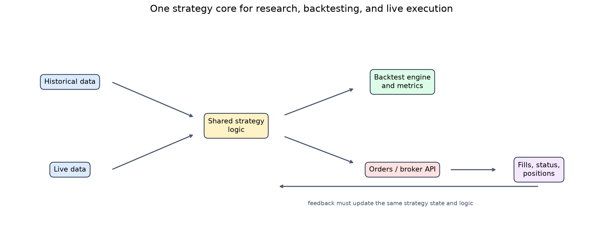
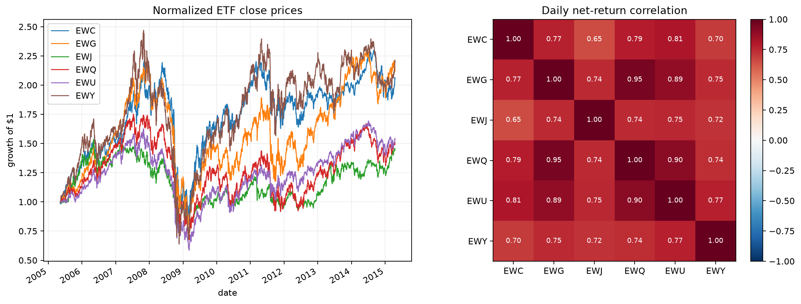
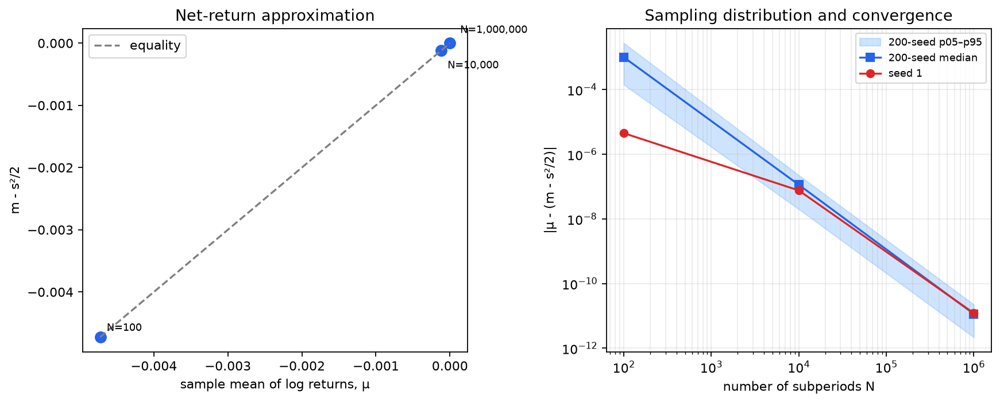
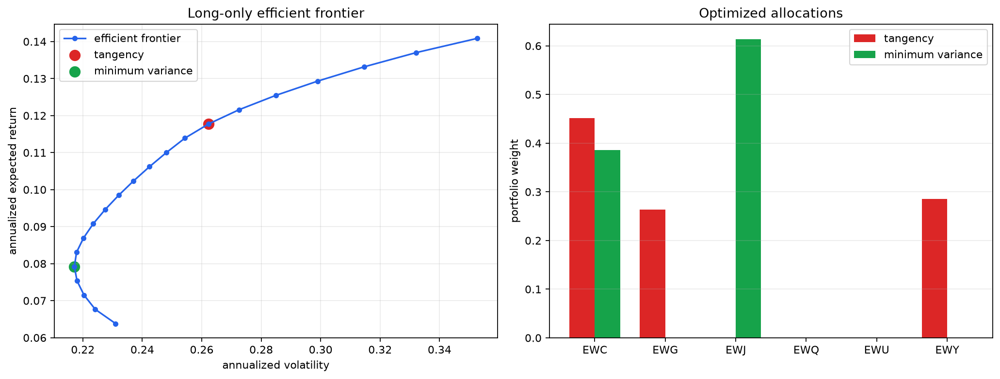
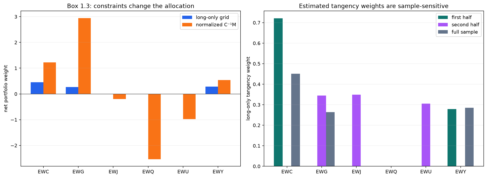

# Chapter 1 Python 종합 분석 리포트

## 1. 장의 목표와 구현 범위

이 장의 핵심은 특정 전략 하나가 아니라 알고리즘 트레이딩의 전체 흐름이다.
시장 데이터가 같은 전략 로직으로 들어가 백테스트 또는 주문을 만들고, 브로커
API의 체결·상태가 다시 포지션 상태로 돌아와야 한다. 수치 부분에서는 순수익률과
로그수익률, 성과지표, 효율적 투자선, Sharpe/Kelly 최적화를 연결한다.

### Chapter coverage / 재현 상태

| Chapter topic | Reproduction status | Evidence |
|---|---|---|
| Algorithmic trading loop | conceptual explanation | system workflow figure |
| Historical market data | historical context | data-quality checklist |
| Live data, platforms, brokers | historical context | operational checklist |
| Performance metrics | executed formula illustration + concept | CAGR, Sharpe, MDD/duration, Calmar/MAR, scalar Kelly |
| Box 1.1 net vs log returns | executed and compared | official MATLAB output |
| Box 1.2 efficient frontier | executed and compared | official data and weights |
| Box 1.3 Sharpe/Kelly | executed formula diagnostic | analytical vs long-only |
| Estimation risk and risk parity | executed diagnostic + concept | split samples |
| Exercises and endnotes | out of scope | questions retained in chapter source |

공식 코드가 있는 Box 1.1과 1.2는 계산·책 비교까지 수행한다. Box 1.3은 책의
`C⁻¹M` 해를 공식 ETF 데이터에 적용한다. 데이터·플랫폼·브로커 목록은 2016년
책의 역사적 맥락이므로 현재 제품 추천으로 해석하지 않는다.



## 2. 데이터, 플랫폼, 브로커의 실무 원칙

### 과거·실시간 데이터

| 영역 | 장에서 강조하는 검증 질문 |
|---|---|
| 주식/ETF | 분할·배당 조정, 상장폐지 종목, 당시 지수 구성종목이 포함되는가? |
| 시가/종가 | 합성 종가 대신 주 거래소 경매가 또는 BBO 중간값을 쓸 수 있는가? |
| 선물 | 연속선물 롤 규칙이 신호에 미래 정보를 넣지 않는가? |
| 옵션 | 마지막 체결가보다 종가 bid/ask, Greeks, 변동성 표면이 필요한가? |
| 실시간 피드 | 타임스탬프, 지연, 누락·중복, 거래소 직접/통합 피드 차이를 통제하는가? |

책은 CSI, Quandl, CRSP, Bloomberg 등 당시 서비스를 예로 들지만, 재사용할
원칙은 데이터 출처와 조정 규칙을 고정하고 survivorship/look-ahead bias를
검사하는 것이다.

### 백테스트·실거래·브로커

백테스트와 실거래가 서로 다른 전략 구현을 쓰면 연구 결과를 배포하는 순간
논리가 달라질 수 있다. 신호와 포지션 상태 전이는 공유하고, 데이터 어댑터,
시뮬레이션 체결기, 실제 broker API만 교체하는 구조가 핵심이다. 주문 거부,
부분 체결, 재접속, 중복 주문, 마진과 계좌 보호 범위도 전략 수익률과 별개의
운영 리스크다.

## 3. 성과지표와 포트폴리오 수식

가격 `P_t`의 순수익률과 로그수익률은

$$R_t=\frac{P_t}{P_{t-1}}-1, \qquad r_t=\log\left(\frac{P_t}{P_{t-1}}\right)$$

이고, 로그수익률이 정규분포라는 가정 아래

$$\mu \approx m-\frac{s^2}{2}.$$

초기 자산 $V_0$, 마지막 자산 $V_T$, 연수 $Y$일 때 CAGR은

$$\mathrm{CAGR}=\left(\frac{V_T}{V_0}\right)^{1/Y}-1$$

이다. 일 1%를 252일 복리화하면 CAGR은
`1127.4%`지만 단순 연환산은
`252.0%`에 불과하다. 책이 백테스트의
레버리지를 1로 두라고 한 이유도 이 비교 가능성 때문이다. 일별 P&L을 전일
포지션의 총 gross market value로 나눠야 이 계약을 지킬 수 있다.

연환산 Sharpe는 대략 `sqrt(252) × mean(excess return) / std(return)`이다.
MDD는 누적자산이 직전 고점에서 얼마나 하락했는지, drawdown duration은 고점을
회복하지 못한 기간을 측정한다. 책의 정의에서 Calmar는 CAGR을 최근 36개월
MDD로 나누고, MAR은 inception 이후 CAGR을 inception 이후 MDD로 나눈다.
긴 백테스트일수록 MDD가 커지기 쉬워 MAR가 표본 길이에 민감하다는 점이 책이
Calmar를 선호한 이유다. 변동성만으로 tail risk를 다 설명할 수 없으므로
Sharpe와 MDD를 함께 봐야 한다.

초과수익률의 평균과 분산으로 계산하는 스칼라 Kelly 레버리지는

$$f^*=\frac{\operatorname{E}[R-R_f]}{\operatorname{Var}(R-R_f)}$$

이다. 추정오차와 fat tail을 무시하면 레버리지를 과대평가한다. 예를 들어
20% 급락에 5배 노출이면 비용 전 자산이 초기 1.0배에서
`0.0`배가 되어 청산된다. 따라서
Kelly 비중은 상한, stress test, margin 규칙과 함께 써야 한다.

포트폴리오 분산 최소화 문제는

$$\min_F F^TCF,\quad F^TM=m_p,\quad F^T\mathbf{1}=1,\quad F\geq0$$

이며 Box 1.3의 공매도 허용 분석해는 `F ∝ C⁻¹M`이다.

## 4. 공식 데이터와 provenance

| 항목 | 값 |
|---|---|
| 공식 배포 페이지 | [https://epchan.com/book3](https://epchan.com/book3) |
| 공식 ZIP | `https://epchan.com/img/book3/Chap1%20Basics.zip` |
| 입력 파일 | `data/raw/book3/chapter_1/inputDataOHLCDaily_ETF_20150417.mat` |
| 기간 | 2005-05-12 ~ 2015-04-17 |
| 가격/수익률 관측치 | 2,500 / 2,499 |
| 사용 ETF | EWC, EWG, EWJ, EWQ, EWU, EWY |
| 제외 ETF | EWZ (결측 2,253), FXI (결측 0) |
| 결측/비양수 가격 | 0 / 0 |

공식 `ef.m`은 `stocks`를 먼저 축소한 뒤 이미 축소된 배열로 `cl`의 열 마스크를
다시 만드는 순서 문제가 있다. Python은 원래 8개 심볼에서 마스크를 한 번
계산하여 책의 주석과 6개 ETF 출력이 의도한 동작을 구현한다. 다만 공식 MAT의
심볼 순서가 `EWC, EWG, EWJ, EWQ, EWU, EWY, EWZ, FXI`여서 원본의 잘못된
`cl(:, 1:6)`도 우연히 같은 여섯 열을 고른다. 즉 이 데이터에서는 버그가
책 수치에 영향을 주지 않는다. EWZ 제외는 2,500행 중
2,253개 결측이라는 데이터 가용성 근거가 있지만,
FXI 제외는 결측이 없는 사후 선택이므로 selection bias 가능성을 별도로 남긴다.



## 5. Box 1.1 — 순수익률과 로그수익률

### 목적·방법·Python 결과

`N=100, 10,000, 1,000,000`으로 기간을 나누고 각 `N`에서 평균 `1/N`,
표준편차 `2/sqrt(N)`인 로그수익률을 만든다. `R=exp(r)-1`로 변환한 뒤 표본
`μ`와 `m-s²/2`의 차이를 계산한다. NumPy `PCG64`, seed 1을 명시했다.

| N | μ | m | s | m - s²/2 | absolute error |
|---:|---:|---:|---:|---:|---:|
| 100 | -4.72242425e-03 | 9.51231304e-03 | 1.68755690e-01 | -4.72692833e-03 | 4.504e-06 |
| 10,000 | -1.18258022e-04 | 8.11369849e-05 | 1.99735378e-02 | -1.18334121e-04 | 7.610e-08 |
| 1,000,000 | 5.82003657e-07 | 2.57587451e-06 | 1.99693917e-03 | 5.81991499e-07 | 1.216e-11 |

### 책과 비교·해석

| N | Python μ | Book μ | Python m-s²/2 | Book m-s²/2 | Python identity error | Book identity error |
|---:|---:|---:|---:|---:|---:|---:|
| 100 | -4.72242425e-03 | 2.99008364e-04 | -4.72692833e-03 | -6.41385656e-04 | 4.504e-06 | 9.404e-04 |
| 10,000 | -1.18258022e-04 | 2.29889189e-05 | -1.18334121e-04 | 2.28319815e-05 | 7.610e-08 | 1.569e-07 |
| 1,000,000 | 5.82003657e-07 | 2.65113037e-06 | 5.81991499e-07 | 2.65111194e-06 | 1.216e-11 | 1.843e-11 |

### 난수 표본운 공개

| N | seeds | median error | p05 | p95 | seed 1 | seed 1 percentile |
|---:|---:|---:|---:|---:|---:|---:|
| 100 | 200 | 1.006e-03 | 1.426e-04 | 2.762e-03 | 4.504e-06 | 0.0% |
| 10,000 | 200 | 1.140e-07 | 2.004e-08 | 2.245e-07 | 7.610e-08 | 27.5% |
| 1,000,000 | 200 | 1.149e-11 | 2.186e-12 | 2.241e-11 | 1.216e-11 | 54.0% |

seed 1의 `N=100` 오차는 200개 시드 중
`0.0` 퍼센타일로, 중앙값보다 약
`223`배 작게 나온
비대표적 표본이다. 책의 같은 오차는
`9.404e-04`로
200시드 중앙값과 비슷하다. 그림은 seed 1만 잇지 않고 200시드 중앙값과
p05–p95 범위를 함께 그린다. 책의 MATLAB `rng(1)`과 NumPy PCG64는 난수열이
다르므로 이 실험은 **근사 재현**이며, 검증 대상은 개별 표본의 우열이 아니라
다중 시드에서 `N` 증가에 따라 항등식 오차가 수렴하는 성질이다. 세 `N`은 각
시드에서 같은 난수열의 prefix를 써 책의 재시드 동작을 재현하므로 서로 독립인
표본은 아니다.



## 6. Box 1.2 — 롱온리 효율적 투자선

공식 종가의 평균 순수익률과 공분산으로 21개 목표수익률을 만든다. 가능한
63개 활성 자산 집합을 열거하고 KKT 선형식을 풀어, 최적화기 버전에 따른 경계
허용오차를 피한다.

- Tangency 일수익률: 0.00046729
- Tangency 일변동성: 0.01652502
- 무위험수익률 0 가정 일별 Sharpe: 0.028277
- 최소분산 지점 일변동성: 0.01367944

### Tangency 비중 — 책과 수치 비교

| ETF | Python | Book | Difference |
|---|---:|---:|---:|
| EWC | 0.451382 | 0.451338 | +0.000044 |
| EWG | 0.263470 | 0.263445 | +0.000026 |
| EWJ | 0.000000 | 0.000019 | -0.000019 |
| EWQ | 0.000000 | 0.000005 | -0.000005 |
| EWU | 0.000000 | 0.000007 | -0.000007 |
| EWY | 0.285147 | 0.285186 | -0.000038 |

최대 절대 차이는
`4.438e-05`로
허용오차 `2e-4` 안이다. 이는 **수치 재현**이다.

### 최소분산 격자점 — 책과 수치 비교

| ETF | Python | Book | Difference |
|---|---:|---:|---:|
| EWC | 0.385948 | 0.381518 | +0.004430 |
| EWG | 0.000000 | 0.000033 | -0.000033 |
| EWJ | 0.614052 | 0.604011 | +0.010041 |
| EWQ | 0.000000 | 0.000134 | -0.000134 |
| EWU | 0.000000 | 0.014300 | -0.014300 |
| EWY | 0.000000 | 0.000004 | -0.000004 |

Python 분산은 `1.871269447727e-04`, 책 비중을 같은 데이터에
적용한 분산은 `1.871667018727e-04`이다.
Python 해가 낮고 두 해의 목표수익률은 같다. 역사적 MATLAB `quadprog`가 0
근처 비중을 남긴 허용오차 차이이며, 결과를 억지로 책 숫자에 맞추지 않았다.
여기서 “최소분산”은 21개 목표수익률 격자 중 최소다. 목표수익률 제약을 없앤
진짜 롱온리 global minimum variance는
`1.871193108528e-04`이고 격자점과의 분산 차이는
`7.634e-09`다.



## 7. Box 1.3 — Sharpe/Kelly와 추정 불안정성

공매도 제약이 없을 때 기대 로그성장률을 최대화하는 Kelly 해와 고정 순노출의
Sharpe 최대화 해는 비례하며, 완전투자 정규화는

$$F_{analytic}=\frac{C^{-1}M}{\mathbf{1}^TC^{-1}M}$$

이다. 이 해는 Box 1.2의 롱온리 제약을 포함하지 않는다.

| ETF | Long-only tangency | Normalized C⁻¹M | First half | Second half |
|---|---:|---:|---:|---:|
| EWC | 0.451382 | 1.225891 | 0.721119 | 0.000000 |
| EWG | 0.263470 | 2.947697 | 0.000000 | 0.345084 |
| EWJ | 0.000000 | -0.199561 | 0.000000 | 0.349289 |
| EWQ | 0.000000 | -2.534770 | 0.000000 | 0.000000 |
| EWU | 0.000000 | -0.976882 | 0.000000 | 0.305627 |
| EWY | 0.285147 | 0.537626 | 0.278881 | 0.000000 |

- 분석해 일별 Sharpe: `0.038460`
- 롱온리 격자 tangency 일별 Sharpe: `0.028277`
- 분석해 gross exposure: `8.422` (net exposure 1)
- 전·후반 롱온리 비중 L1 거리: `2.000`

분석해는 공매도로 더 높은 표본 Sharpe를 얻지만 gross exposure가 크다. 더
중요하게, `2010-04-30` 전후로 추정한 롱온리 tangency 비중은
서로 거의 겹치지 않는다. 이는 과거 평균수익률의 작은 변화가 최적 비중을 크게
바꾼다는 책의 경고를 실제 데이터로 보여준다. 최소분산이나 수축 추정, 위험예산
방식이 실무에서 선호되는 이유다. Risk parity는 공분산 최적화와 같지 않으며,
단순 역변동성 방식은 상관관계와 tail risk를 놓칠 수 있다. 책은 등레버리지·
risk parity에서 위기 손실과 청산이 다른 구성요소로 전염될 수 있다고 경고하고,
그 대안으로 각 구성요소의 MDD를 같은 목표로 두는 접근을 제시한다. 이 노트북의
추가 경고는 MDD 타깃도 추정오차와 상관관계 급변에서 자유롭지 않다는 점이다.
All Weather의 2015년 약 7% 손실은 risk parity가 tail-risk 면역 전략이 아님을
보여주는 역사적 예시다.



## 8. 포트폴리오 수치 실험 — 백테스트가 아님

이 결과는 전체 또는 두 하위 표본의 평균·공분산으로 같은 표본의 비중을 구한
정적 진단이다. 시간 순서대로 학습하고 다음 기간에 적용하지 않았으므로 성과
백테스트나 표본 외 검증이 아니다. 실제 전략에는 rolling/expanding window,
다음 기간 체결, turnover, 거래비용, bid-ask spread, slippage가 필요하다.

### 한계와 편향

- 전체 기간 최적 비중을 미래 성과로 읽으면 look-ahead bias다.
- 사후 ETF 선택과 EWZ·FXI 제외에는 selection/survivorship bias 가능성이 있다.
- 공식 파일의 가격 조정 여부를 외부 공급자 데이터로 독립 검증하지 않았다.
- 무위험수익률을 0으로 두었고 세금·시장 충격·마진·차입비용을 계산하지 않았다.
- 표본 평균과 공분산을 점추정치로 사용해 통계적 불확실성을 직접 모델링하지 않았다.

## 9. 결론과 재현성

Box 1.1의 수렴, Box 1.2의 책 비중, Box 1.3의 일차조건을 재현했다. 동시에
Box 1.3 분석해의 큰 gross exposure와 반기별 tangency 비중의 급변은 “표본 내
최적화”가 곧 실전 최적화가 아니라는 반례다. 따라서 이 장의 실전 결론은 가장
높은 표본 Sharpe를 택하는 것이 아니라 데이터 계보, 동일한 연구/실거래 로직,
다중 위험지표, 견고한 비중, 표본 외 검증을 함께 관리하는 것이다.

```bash
uv sync --locked
uv run python chapter_1_the_basics_of_algorithmic_trading/src/run_chapter1_analysis.py --offline
```

| 재현 정보 | 값 |
|---|---|
| 공식 ZIP SHA-256 | `b868d52328a85df8e31aad900a6c3e5669fc226f39fbb003c6123e8c6de0a239` |
| 입력 MAT SHA-256 | `3d24e65d340774ad7088ee7019582fb6dd945f78de08d96c7bbe43f9de44ab11` |
| `uv.lock` SHA-256 | `34057457773a614f058648f3ba9ba2f02f02354f64214ec14891fbb212c5ebaf` |
| Python | 3.12.3 |
| NumPy / pandas / SciPy | 2.5.1 / 3.0.3 / 1.18.0 |

총 15개 검증이 모두 통과했다. 이 중 책 수치·공식 해시·
경험적 성질을 독립 대조하는 검증은 8개,
계산 함수가 자신의 계약을 다시 확인하는 invariant는
7개다. invariant를 외부 증거로 과장하지 않는다.
상세 분류와 수치는 [`metrics.json`](metrics.json)에 저장된다.
