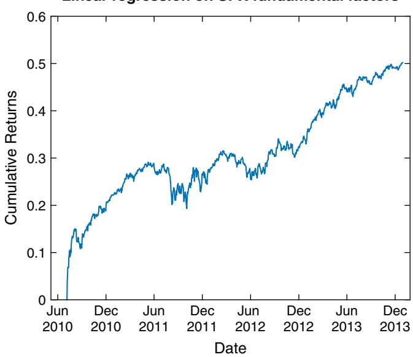
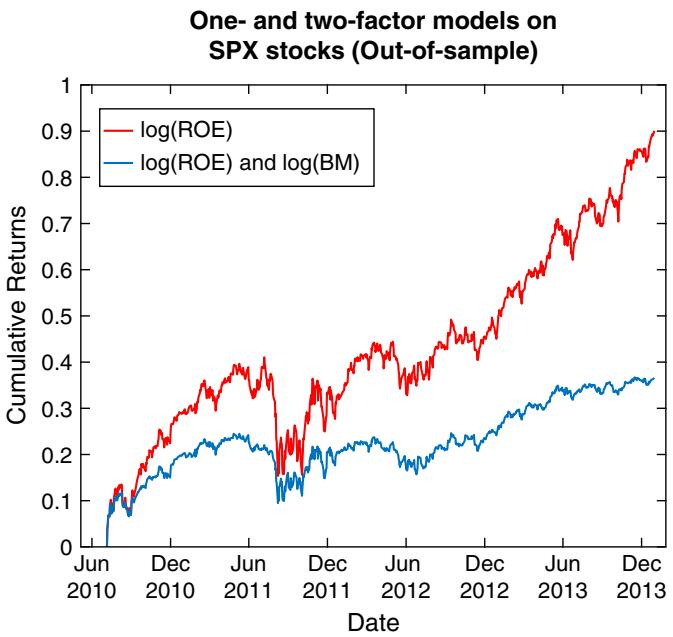
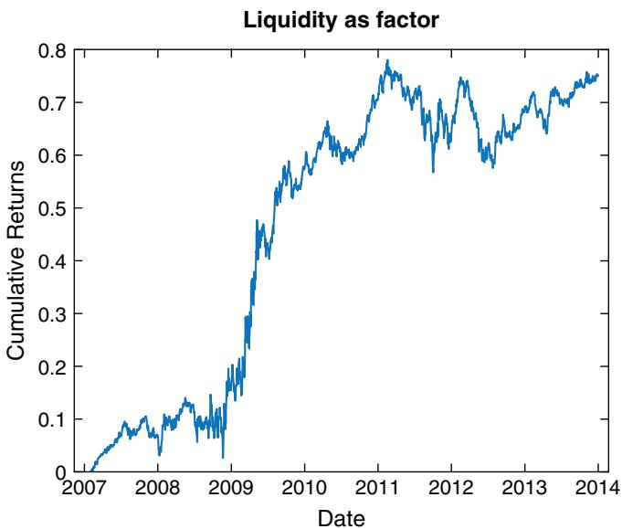
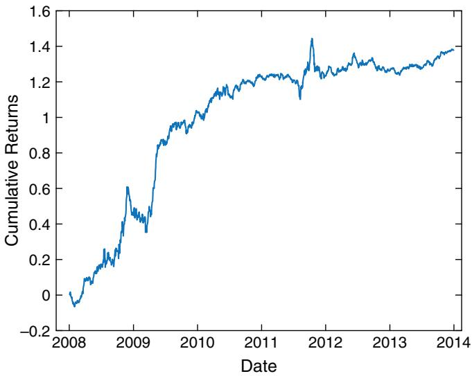

# Factor Models

If all we want is profit, we would not need to study quantitative finance or to trade at all. We just need to go and buy SPY and hold it for 30 to 40 years,1 preferably longer. The reason some of us are reluctant to do so (at least, not for 100 percent of our net worth) is market risk: buying-and-holding the stock index has long periods of drawdowns. We may be forced to liquidate some of that holding to raise cash at a most inopportune time. What if we instead hold a long-short market-neutral portfolio? For example, we may hear that value stocks offer better long-term returns than growth stocks (after all, the value investor Warren Buffett is very rich). So why not just long value stocks and short growth stocks? That actually works quite well,2 except during the dotcom bubble in the late 1990s, when this portfolio, too, came to grief. Just because this portfolio doesn’t have market risk doesn’t mean it doesn’t have some other risk associated with long value and short growth. In fact, many of the strategies we will discuss in this book, whether they trade stocks or options, have such so-called factor risks. For example, many of the strategies in the options chapter are exposed to the volatility risk factor—they do poorly when volatility increases. They are by no means riskless arbitrage. In fact, their risks are unlike the random fluctuations of white noise—the factor risk of each stock is both serially and cross-sectionally correlated over a period of time. For our long-value short-growth portfolio, we are almost sure that it will lose money for long periods when we have ‘‘irrational exuberance.’’ For our (short) options strategies, we are almost sure that they will lose in those periods when volatility increases, and that is true for practically any options you trade.

Traders and investors justifiably like to chase after ‘‘alphas’’—returns that are not known to be associated with factor risks. Earning alpha is almost riskless arbitrage, because their risks can be reduced to zero by increasing diversification. The more stocks one includes in a portfolio with positive alpha, the smaller the (white noise) risk compared to its return. On the other hand, factor risk cannot be diversified away. No matter how many value stocks you add to the long side of a portfolio, and how many growth stocks you add to the short side, the factor risk remains unchanged. But because everybody loves alpha, it is especially hard to find. Every time someone finds alpha, they have to keep it a secret. And still, more and more people will discover it eventually, and the alpha diminishes. Even if nobody else finds it, alpha has limited capacity, so eventually it diminishes if too much capital has been applied to it. Factor risk is different. It is hardly a secret that investing in the market index will generate positive return in the long term, yet many people still shy away from the stock market because of the undiversifiable risk. It is hardly a secret that selling options will generate positive return in the long term (as the longevity of the insurance industry testifies), yet many people are still afraid of doing so because of the likely sharp drawdown in times of financial crises. Because of these risks, most factor returns remain alive and well, year after year. This is the reason why we will study factor models in this chapter, despite their relative lack of sex appeal compared to alpha generation. Also, trading factor models makes you a more sociable person, since you don’t need to hide what you do for a living from your colleagues lest they steal your alphas.3

(It is true that some factor returns do decrease over time, such as the SMB factor we will discuss in the time-series factors section, or the put-call implied volatilities factor in the Using Option Prices section. Their returns decrease likely because investors perceive that the associated factor risks have decreased as well. In the SMB case, investors may believe that small-cap stocks are no more risky than large-cap stocks, as long as we are sufficiently diversified. After all, Enron and Lehman Brothers were both large-cap stocks.)

As I wrote above, many of the strategies I describe later in the book have implicit factor exposures, though one cannot call them factor models. This term is confined to simple linear models, where the predictors in the linear regression are our factors. This is also the reason why the regression coefficients for factors are sometimes called smart betas, a ‘‘dumb’’ beta being the regression coefficient between the return of a stock versus the return of the market index. I will describe the difference between time-series and cross-sectional factors, some of the new and interesting factors that researchers have discovered ranging from fundamental to option-implied, how surprisingly well you can do when all you have is price data, and the different ways to implement a factor model.

### ■ Time-series Factors

The two factors mentioned earlier in this chapter, the market return and the value-minus-growth return, are examples of time-series factors (Ruppert and Matteson, 2015). They are so-called because they vary from time to time, but they do not vary across different stocks or financial assets. The value-minus-growth factor is often called HML, because it is the returns of a basket of high book-to-market stocks minus that of a basket of low book-to-market stocks. Such a long-short portfolio whose returns represent a time-series factor is called a ‘‘hedge’’ portfolio.4 What do vary across different stocks are their returns in response to this factor. This response is called the factor loading (or factor exposure), which is just a regression coefficient. Time-series factors usually (but not always) have dimensions of returns (i.e., dollar divided by time), but factor loadings are dimensionless. If we think that a stock’s return is driven by multiple factors, we can write

$$
\begin{array}{l} { { R e t u r n ( t , s ) - r_{F} = \alpha ( t , s ) + \beta_{1} ( s ) * F a c t o r_{1} ( t ) + \beta_{2} ( s ) * F a c t o r_{2} ( t ) } } \\ { { \qquad + \cdot \cdot \cdot + \varepsilon ( \mathrm { t , s } ) } } \end{array}\tag{2.1}
$$

where each $R e t u r n ( t , s )$ represents the return of a stock s over a period from t − 1 to $t , \ r_{F}$ is the risk free rate over the same period, and the $\beta_{\mathrm{i} } ( s )$ are the factor loadings of that stock. The alpha α of a stock is included, in case we have some special arbitrage model that tells us why this stock will have a time-varying return not driven by common factors. In our modeling in this chapter, we won’t have any such alpha models, hence α will be set as a constant in time: $\mathbf { \boldsymbol { \mathsf { \alpha } } } ( t , s ) = \mathbf { \boldsymbol { \mathsf { \alpha } } } \alpha ( s )$ .5 Finally, a noise term ε is included to represent ‘‘white noise.’’ This noisy return is a catchall term that captures anything that our factor or alpha models are unable to explain, and is supposed to be uncorrelated both serially (in time) and cross-sectionally (across stocks). These are the risks that can be diversified away by adding more stocks to our portfolio.

Since the time-series factors are observable (e.g., we can easily measure the market return) and known historically, all we need to do is use the usual least square fit to find the $\beta_{\mathrm{i} } ( s ) \mathrm { { ^ { \circ } s } }$ . But how do we use equation 2.1 for our investment decisions? Notice that the time index t is the same on both sides of the equation. This means that this factor model, as with most factor models you will read about in standard finance textbooks, are descriptive and explanatory, but not predictive. They explain the return of a stock that is contemporaneous with the returns of the market index, HML, SMB, and perhaps other factors. As such, this equation is not immediately useful for generating trading profits. All we could do is to assume that these factor returns will remain the same forever, with their future values equal to their past values, and buy the stocks that have the largest Return(t, s) and short the stocks that have the smallest (perhaps negative) returns, according to equation 2.1. Apart from the effect of random noise, this is essentially buying the past winners, and shorting the past losers.

Alternatively, we can make things a little more interesting by turning equation 2.1 into a predictive equation. Just write

$$
\begin{array}{c} { { R e t u r n ( t + 1 , s ) - r_{F} = \alpha ( s ) + \beta_{1} ( s ) * F a c t o r_{1} ( t ) + \beta_{2} ( s ) * F a c t o r_{2} ( t ) } } \\ { { + \cdot \cdot \cdot + \varepsilon ( \mathrm { t , s } ) } } \end{array} \nonumber\tag{2.2}
$$

and run a similar least square fit. Once we have obtained estimates of the α and $\beta_{\mathrm{i} }$ for each stock, we can use equation 2.2 for predicting the next period’s return.

By replacing equation 2.1 with 2.2, I did not mean to imply that a descriptive factor model is useless for traders. Its use, however, is not in predicting returns—it is in risk management. If, for example, we know that a strategy or portfolio loads (regresses) positively to volatility change, we might want to trade another strategy or own another portfolio that loads negatively to volatility change as a hedge. This does not require us to predict whether volatility is going up or down, nor does it require us to predict the next day’s return given today’s volatility change. The two strategies or portfolios together will have minimum exposure to volatility risk, no matter which way volatility goes. Much of factor modeling practiced by large funds is not concerned with predicting returns, but with understanding and managing the factor risks, and for attributing returns of a strategy to different factors. Performance attribution is also important because some investors do not wish to pay incentive (performance-based) fees to the fund managers on returns that can be attributed to factor returns, since these returns can be easily obtained by buying smart-beta ETFs or other index funds. However, the use of factor models for risk management or performance attribution is not our focus in this chapter.

Besides the market return and HML, other popular time-series factors are SMB—the returns of a basket of small-market-capitalization stocks minus that of a basket of big-market-capitalization stocks, and UMD—the returns of a basket of stocks whose prices went up minus that of a basket of stocks that went down. (People also call this the WML factor: ‘‘Winners minus Losers.’’) The latter is, of course, a momentum factor. Interestingly, both the HML value factor and the UMD momentum factor have positive returns. As footnoted earlier, HML returned about 900 percent between 1965 and 2011, but UMD returned about 3000 percent over the same period (Ang, 2014)! There is no reason we have to choose one over the other: We can buy both hedge portfolios simultaneously. Other macroeconomic factors include economic growth (specifically, real quarterly GDP growth and quarterly real personal consumption expenditures growth), quarterly Consumer Price Index change, and volatility (VIX) change.

We show in Example 2.1 how the market return, HML, and SMB factors do in predicting daily returns of stocks.

### Example 2.1: Using Fama-French factors to predict the next-day return

The three time-series factors we discussed in the main text, the excess market return (i.e., market return minus the risk free rate), the HML portfolio return, and the SMB portfolio return, are called the Fama–French factors (Fama and French, 1993). They are usually used as contemporaneous factors to account for the current returns of a stock. However, here we will see whether they can be used as predictor factors to predict the next day’s returns of stocks in the S&P 500 Index.

For our backtest, we use mid-quotes at market close provided by the Center for Research of Security Prices (CRSP.com) survivorship-bias-free database from January 3, 2007, to December 31, 2013. We choose the midprice (half of the bid and ask prices) at the market close to represent the closing price in order to avoid effects of the widened bid-ask spread at the close. The daily market, HML, and SMB factors are from Professor French’s website mba.tuck.dartmouth.edu/ pages/faculty/ken.french/data\_library.html#Research over the same period as the price data. We divide this data into two halves, and use the first half as a trainset to estimate the factor loadings for each stock separately (i.e., in a multivariate, multiple regression).6 Using

MATLAB’s Statistics and Machine Learning Toolbox (you can also use R’s lm function), we can write

```matlab
for s=1:length(syms)
model=fitlm([mktRF(trainset) smb(trainset) hml(trainset)],
retFut1(trainset, s), 'linear');
retPred1(:, s)=predict(model, [mktRF smb hml]);
end
```

where retFut1 is the excess return (return minus risk free rate) for the next trading day and retPred1 is the predicted return for the next trading day. Note that fitlm will automatically supply a constant offset by default, so one does not need to augment the input variables with a column of ones as would be the case if we were to use the regress function in the same toolbox.

We then buy the top 50 stocks with the largest predicted returns and short the bottom 50 with the smallest.

```matlab
positions=zeros(size(mid));
topN=50;
for t=1:length(tday)
isGoodData=find(isfinite(retPred1(t, :)));
[∼, I]=sort(retPred1(t, isGoodData)); % ascending sort
positions(t, isGoodData(I(1:topN)))=-1;
positions(t, isGoodData(I(end-topN+1)))=1;
end
```

Since our data set is a survivorship-bias-free one, there are symbols that stopped trading as well as symbols that just started trading in the middle of the time period. Hence we can only make predictions for the subset of data isGoodData that has daily returns on a certain day.

Naturally, the model works very well in-sample: it has a CAGR of 242 percent and a Sharpe ratio of 3.7. However, it generated negative returns out-of-sample. Clearly, the Fama-French factors are not terribly useful for short-term predictions!

The complete code can be downloaded as FamaFrenchFactors\_ predict.m.

### Cross-sectional Factors

Most of us are familiar with the notion that stock-specific factors such as price-to-earnings (P/E) ratio or gross margin would affect a stock’s return. These are called cross-sectional factors, because they vary across different stocks. Actually, it is more accurate to call them factor loadings, in keeping with our convention that factors usually have dimension of returns and have the same value across different stocks but varying in time, while factor loadings are usually dimensionless and have the same value throughout time but vary across different stocks.

Time-series factors such as HML and SMB are directly observable as the returns of a well-defined hedge portfolio, while we have to run a regression fit to find out the value of the factor loading of each stock. In contrast, cross-sectional factor loadings such as P/E are obviously observable, and it is the time-series factors that have to be computed by regressing stock returns against these factor loadings.

Since practically every item in the financial statement of a company can be turned into a cross-sectional factor loading for its stock’s return, it is hard to know what to include. As a start, you may try including everything you can easily get data on. In Example 2.2, we included 27 fundamental factor loadings in order to predict the quarterly returns of stocks, and the out-of-sample performance is quite respectable: the CAGR is 12 percent.

Despite the reasonable performance of applying factor model blindly to all the fundamental factors available, it is still useful to examine which individual factor loadings are particularly predictive and perhaps understand why they are so predictive. This has the benefit of avoiding overfitting to too many factor loadings, some of which may be just along for the ride. Also, we should look into innovative factor loadings that are not included in the financial statements of companies. We will explore these in the following sections.

### Example 2.2: Fitting a cross-sectional factor model to predict the next-quarter return

We will attempt to use fundamental factor loadings extracted from the quarterly financial statements of companies to predict their nextquarter returns. The price data are midprice at market close provided by CRSP as in Example 2.1. The fundamental data are obtained from

Sharadar’s Core U.S. Fundamentals database and delivered through Quandl.com. However, we avoid factor loadings that scale with the size of the company, such as total revenue or market capitalization. Any dependence of returns on size can be better captured by the time-series SMB factor instead. There are a total of 27 cross-sectional factor loadings that are company-size independent. These are listed as in Table 2.1.

TABLE 2.1 Input Factor Loadings that Are Size-Independent
<table><tr><td>Variable name</td><td>Explanation</td><td>Period</td></tr><tr><td>CURRENTRATIO</td><td></td><td>Quarterly</td></tr><tr><td>DE</td><td>Debt to Equity Ratio</td><td>Quarterly</td></tr><tr><td>DILUTIONRATIO</td><td>Share Dilution Ratio</td><td>Quarterly</td></tr><tr><td>PB</td><td>Price to Book Value</td><td>Quarterly</td></tr><tr><td>TBVPS</td><td>Tangible Asset Book Value per Share</td><td>Quarterly</td></tr><tr><td>ASSETTURNOVER</td><td></td><td>Trailing 1 year</td></tr><tr><td>EBITDAMARGIN</td><td></td><td>Trailing 1 year</td></tr><tr><td>EPSGROWTH1YR</td><td></td><td>Trailing 1 year</td></tr><tr><td>EQUITYAVG</td><td>Average Equity</td><td>Trailing 1 year</td></tr><tr><td>EVEBIT</td><td>Enterprise Value over EBIT</td><td>Trailing 1 year</td></tr><tr><td>EVEBITDA</td><td>Enterprise Value over EBITDA</td><td>Trailing 1 year</td></tr><tr><td>GROSSMARGIN</td><td></td><td>Trailing 1 year</td></tr><tr><td>INTERESTBURDEN</td><td>Financial Leverage</td><td>Trailing 1 year</td></tr><tr><td>LEVERAGERATIO</td><td></td><td>Trailing 1 year</td></tr><tr><td>NCFOGROWTH1YR</td><td></td><td>Trailing 1 year</td></tr><tr><td>NETINCGROWTH1YR</td><td>Net Income Growth</td><td>Trailing 1 year</td></tr><tr><td>NETMARGIN</td><td>Profit Margin</td><td>Trailing 1 year</td></tr><tr><td>PAYOUTRATIO</td><td></td><td>Trailing 1 year</td></tr><tr><td>PE</td><td>Price Earnings Damodaran Method</td><td>Trailing 1 year</td></tr><tr><td>PE1</td><td></td><td>Trailing 1 year</td></tr><tr><td>PS</td><td></td><td>Trailing 1 year</td></tr><tr><td>PS1</td><td>Price Sales Damodaran Method</td><td>Trailing 1 year</td></tr><tr><td>REVENUEGROWTH1YR</td><td></td><td>Trailing 1 year</td></tr><tr><td>ROA</td><td></td><td>Trailing 1 year</td></tr><tr><td>ROE</td><td></td><td>Trailing 1 year</td></tr><tr><td>ROS</td><td></td><td>Trailing 1 year</td></tr><tr><td>TAXEFFICIENCY</td><td></td><td>Trailing 1 year</td></tr></table>

These variables are stored as T × S matrices, where T is the number of historical days in the data, and S is the number of stocks (actually greater than 500, since we need to include stocks that were historically in the SPX index but were delisted on or before the last day in the dataset). We want to predict the returns of these stocks using a factor model similar to equation 2.2, with α(s) replaced by α(t) since this is now a cross-sectional model. In principle, fitting such a cross-sectional model means that at every time (calendar quarter) t, we will have a different set of regression coefficients Factor (t). But due to the limited number of data points (about 500 for SPX stocks) at any one time, this regression won’t be very robust. Furthermore, there is no reason to believe that the factors should change from quarter to quarter (though of course the factor loadings such as PE ratio do change). To increase robustness, we will combine all the data throughout the trainset for many quarters. In programming terms, we combine all the columns of data belonging to different stocks into one single vector with T × S rows, using the reshape function. Below, we show how to reshape the dependent variable (quarterly returns from the next day’s close, which is the first closing price with which we could enter into positions):

```matlab
retQ=calculateReturns(mid, holdingDays); % quarterly return
retFut=fwdshift(holdingDays+1, retQ);
trainset=1:floor(length(tday)/2);
Y=reshape(retFut(trainset, :), [length(trainset)*length(syms) 1]);
% dependent variable
```

We can apply the same reshape function to the input factor loadings (the independent variables) as well. Notice we use only the first half of the data as train data to fit the regression model. Once the data are laid out in the proper dimension, we can use the fitlm function as in Example 2.1 for the regression fit:

```python
model=fitlm(X, Y, 'linear')
```

The beauty of the fitlm function is that it will automatically ignore any rows (days) that contain a NaN value. In our case, this means that it will only regress on those days for a stock with an earnings announcement that makes available all the financial variables. So for each stock, only one day per quarter will actually be used as input data. This fit produces a very weak model: the $R^{2}$ is only 0.015. Nevertheless, predictive models in finance often are very weak, but that doesn’t mean we cannot generate profits. To make predictions, we need to use the predict function and then unpack the vector containing the predicted returns back to a T × S matrix before we can compute our usual performance measures:

```javascript
retPred=reshape(predict(model, X), [length(trainset)
length(syms)]);
```

Our trading strategy uses these predicted quarterly returns by entering into a long position in a stock on the following trading day’s market close whenever its predicted return is positive, and holding for a quarter (or more precisely, 63 trading days), and similarly for the short positions.

```matlab
longs=backshift(1, retPred>0); %1 day later
shorts=backshift(1, retPred<0);
longs(1, :)=false;
shorts(1, :)=false;
positions=zeros(size(retPred));
for h=0:holdingDays-1
long_lag=backshift(h, longs);
long_lag(isnan(long_lag))=false;
long_lag=logical(long_lag);
short_lag=backshift(h, shorts);
short_lag(isnan(short_lag))=false;
short_lag=logical(short_lag);
positions(long_lag)=positions(long_lag)+1;
positions(short_lag)=positions(short_lag)-1;
end
```

Despite the weak regression fit, this strategy generates a CAGR of 12.3 percent out-of-sample, with a Sharpe ratio of 1.7, and a maximum drawdown of 7.6 percent. The equity curve is shown on Figure 2.1.

Linear regression on SPX fundamental factors  
  
FIGURE 2.1 Fundamental cross-sectional factor model on SPX component stocks

The complete code can be downloaded as crossSectional\_SPX.m.

You may be curious whether just throwing in the whole lot of fundamental factors, including those that scale with company size, will generate comparable returns. There are 112 such factors in total, and the $R^{2}$ on the trainset is greatly improved to 0.961 (even the adjusted $R^{2}$ , which supposedly adjusts for the larger number of factors, is a very respectable 0.671.) Indeed, the CAGR of the training set is very high: 48 percent. However, this model fell apart completely on the test set, generating a negative CAGR. Clearly, the larger number of factors result in severe overfitting.

### ■ A Two-Factor Model

A paper by Chattopadhyay, Lyle, and Wang (2015) presented an exceedingly simple cross-sectional two-factor model that is derived from fundamental financial principles. The two-factor loadings are the log of return-on-equity (ROE) and the log of book-to-market ratio (BM). ROE is defined as

$$
R O E ( i , s ) = 1 + X ( i , s ) \big / B o o k ( i - 1 , s )
$$

where $X ( i , s )$ is the net income before extraordinary items from the most recent financial quarter i that has been reported, and $B o o k ( i - 1 , s )$ is the book value from the quarter prior to the $\boldsymbol { i }^{t h}$

We can use these two-factor loadings in the same way as we did in Example 2.2: Estimate the factors (regression coefficients) on a trainset, and apply the model to predict the monthly returns of each stock in the test set. If the predicted return is positive, we buy \$1 of the stock and hold for a month, and vice versa for shorts. We will discuss some of the coding details in Example 2.3, but the result of this simple strategy on the test set is seemingly very good: the CAGR is 9.3 percent with a Sharpe ratio of 1 from July 2010 to the end of 2013. In fact, as Chattopadhyay, Lyle, and Wang (2015) asserted, ROE is a more reliable predictor of future returns than BM. If we use just a one-factor model with ROE, the out-of-sample CAGR is actually increased to 20.2 percent and the Sharpe ratio to 1.3. The equity curves of both the one-factor and two-factor models are shown in Figure 2.2.

There is, however, one fly in the ointment: the portfolios generated by these trading strategies are usually net long. That is, they have more long than short positions. Since we enjoyed a fabulous bull market from 2010 to 2013, it is no surprise that these strategies produced a good return. If we use SPY to hedge the net exposure of the portfolio (whether long or the rare short net exposure), then the out-of-sample CAGR for either one or two factors is about zero.

  
FIGURE 2.2 One- and two-factor models on SPX component stocks

There is another way to produce a market neutral portfolio other than hedging with SPY. On any given day, we can rank the predicted returns, and long the stocks in the top quintile of predicted returns, and short those in the bottom quintile (provided that there are five or more stocks that have earnings announcements in the previous day). Unfortunately, this technique generates negative returns on the test set for either one or two factors.

There is one reason why our market-neutral results here seem to pale beside that of Chattopadhyay, Lyle, and Wang (2015), who obtained out-of-sample CAGR of 4.3 percent for a market-neutral portfolio of US stocks. They included all stocks in the United States that are in the top 98th-percentile in market capitalization and liquidity,7 while we included only large-cap (SPX) stocks. If we apply the ROE one-factor model to small-cap (SML) stocks only, we generate a CAGR of over 5 percent, which is a lot closer to the published results. This difference of factor model performance between large- and small-cap stocks is corroborated by the research of Kaplan (2014), who found that value factors are useless for predicting returns of SPX stocks.

Aside from its rigorous theoretical derivation from first principles, the ROE factor is actually quite similar to the return-on-capital and the earnings yield factors made popular by the author Joel Greenblatt in his The Little Book That Still Beats the Market (Greenblatt, 2010).

### Example 2.3: Fitting the ROE and BM factor model to predict the next-month return

To validate the results of Chattopadhyay, Lyle, and Wang (2015), we use the same price and fundamental data set described in Example 2.2. For the variable X (Net Income before Extraordinary Items), we use the variable ARQ\_EPS (Earnings per Basic Share) from Sharadar, whereas for the variable book (book value per share), we use ARQ\_BVPS. To compute ROE, we divide ARQ\_EPS of the most recent quarter by the book value per share of the prior quarter.

earningsInc=ARQ\_EPS; % Earnings (net income) per Basic Share

```javascript
bvpershr=ARQ_BVPS;
bvpershr_lag=backshift(1, fillMissingData(bvpershr));
```

```javascript
ROE=1+earningsInc./bvpershr_lag;
```

To compute BM, we take the reciprocal of ARQ\_PB (price-to-book ratio):

```javascript
BM=1./ARQ_PB;
```

There are stocks with negative earnings (net income), and there are even stocks with negative book value. We effectively remove8 such data from the input by setting them to NaN:

ROE(ROE <= 0)=NaN;   
BM(BM <= 0)=NaN;

As in Example 2.2, we need to aggregate data from different stocks before running our regression fit:

```matlab
X(:, 1)=reshape(log(BM(trainset, :)), [length(trainset)*
length(syms) 1]);
X(:, 2)=reshape(log(ROE(trainset, :)), [length(trainset)*
length(syms) 1]);
```

The rest of the code is identical to that in Example 2.2, and it can be downloaded as twoFundamentalFactors.m. This produces an out-of-sample CAGR of 9.3 percent.

If we want to test the market-neutral strategy mentioned in the main text, where we rank the predicted returns, long the stocks in the top quintile of predicted returns, and short those in the bottom quintile when there are five or more stocks that have earnings announcements in the previous day, we can write

```javascript
[retPredSorted, idx]=sort(retPred, 2);
```

```matlab
for t=2:size(longs, 1)
idxFinite=find(isfinite(retPredSorted(t-1, :))); %1 day later
if (length(idxFinite) >= 5)
longs(t, idx(t-1, idxFinite(end-floor(length(idxFinite)/5)
+1:end)))=true;
shorts(t, idx(t-1, idxFinite(1:floor(length
(idxFinite)/5))))=true;
end
end
```

Once the longs and shorts arrays are thus determined, the rest of the code is again the same as in Example 2.2. This produces a CAGR of −9.2 percent.

### ■ Using Option Prices to Predict Stock Returns

Market folklore has it that options traders are smarter and better informed than mere stock traders. (One can frequently observe option traders with lifted chins looking down their noses at stock traders.) Therefore, one would think that we could predict stock returns using options price information. This intuition is borne out by a shocking number of academic studies. We can summarize the predictive options information in the form of factors. For those readers who may be unfamiliar with options terminology, you can first read Chapter 5 on options before reading this section.

### 1) Implied Moments

In a paper by Bali, Hu, and Murray (2015), implied volatility is defined as the average of the at-the-money (ATM) call and put options implied volatilities, while the implied skewness is measured by the difference between the out-of-the-money (OTM) calls and puts implied volatilities. Here, a call or put option is regarded as ATM if it has a delta of about 0.5 or −0.5, respectively, and OTM if it has a delta of about 0.25 or −0.25, respectively. Finally, implied kurtosis is measured by the difference between the sum of the implied volatilities of OTM calls and puts versus the sum of the implied volatilities of ATM calls and puts. We also specify that all these options should have a ‘‘tenor’’ of 30 days. That is, they all have 30 days until expiration. (We shall see how we can enforce this requirement in practice.) In summary,

$$
\begin{array}{l} { { \displaystyle { V o I = \frac { C I V ( 0 . 5 ) + P I V ( - 0 . 5 ) } { 2 } } } } \\ { { \displaystyle { S k e w = C I V ( 0 . 2 5 ) - P I V ( - 0 . 2 5 ) } } } \\ { { \displaystyle { K u r t = C I V ( 0 . 2 5 ) + P I V ( - 0 . 2 5 ) - C I V ( 0 . 5 ) - P I V ( - 0 . 5 ) } } } \end{array}
$$

where CIV and PIV indicate call and put implied volatility respectively, and the number in the parentheses indicates the delta of the option. Why all these definitions? The researchers found that the underlying stock’s expected return is strongly positively related to each of these implied moments.

We can construct a long-short portfolio that has a high expected return by following this recipe. First, sort the stocks by their implied skewness, take the top 30 percent, then sort this subset by their implied kurtosis, take the top 30 percent, then finally sort this sub-subset by their implied volatility, and again take the top 30 percent. This constitutes the long side of the portfolio. The short side is similarly constructed, except that we take the bottom 30 percent at each sorting step. We will perform the sorting every month and hold such a portfolio for a month. This long-short strategy returns an unlevered 9.68 percent per annum (i.e., if one is long \$0.5 million and short \$0.5 million of stocks, one should expect an annual profit of \$96,800).

The reason why stocks with high implied volatilities have higher expected returns basically follows from the well-known dictum: Higher risks have to be compensated by higher returns. This is just the capital asset pricing model (CAPM) fondly studied by generations of finance students (Sharpe, 1964). Similarly, investors are averse to kurtosis, which is another word for tail risks, and thus they also need to be compensated by higher future returns if such risks are high. When expected risks are high, investors would pay more to buy options. In particular, they pay relatively more for OTM options than ATM options when expected tail risks are high. Bali, Hu, and Murray (2015), explain that stocks with high implied skewness have higher expected returns because investors with positive expectations about future returns buy OTM calls and/or sell OTM puts, thereby increasing the implied skewness.

This research was performed on all US stocks that have listed options from 1999 to 2012. The researchers used numerical techniques to construct a volatility surface and to back out the implied volatilities of call and put options that have the required deltas and tenor of 30 days. In Example 2.4, we will try this strategy on SPX stocks from 2007 to 2013.

One side note: Is it important that the authors chose tenor of 30 days? The answer seems to be no. The ratio of implied volatilities as a function of delta is independent of tenor, according to Sinclair (2016).

Example 2.4: Long (short) stocks with high (low)   
implied moments

Instead of applying the strategy described in Bali, Hu, and Murray (2015) to all US stocks with listed options, we apply it only to SPX stocks with listed options. As in the original paper, our stock price data come from CRSP, while options data come from OptionMetrics’ implied volatility surface. Following the paper, we also picked the implied volatilities of those options that have a tenor of 30 days, and with a delta of ±0.5 for ATM options and ±0.25 for OTM options. These implied volatilities are stored in the arrays impVolC\_ATM (for calls), impVolP\_ATM (for puts), impVolC\_OTM, and impVolP\_OTM, which have the same T × S dimension as the closing price array cl, where T is the number of days in the data set, and S is the number of stocks. Our data runs from January 3, 2007, to December 31, 2013, and there are 743 stock symbols in our survivorship-bias-free database. To compute the variables Vol, Skew, and Kurt as described in the main text, we go through each day in a for loop, and

```matlab
impVol=(impVolC_ATM(t, :)+impVolP_ATM(t, :))/2;
impSkew=impVolC_OTM(t, :)-impVolP_OTM(t, :);
impKurtosis=impVolC_OTM(t, :)+impVolP_OTM(t, :)-impVolC_ATM(t, :)
-impVolP_ATM(t, :);
```

Next, we first sort by Skew, taking care to ensure that we choose only those stocks with finite implied skewness, and take the top 30 percent as long candidates, and the bottom 30 percent as short candidates:

```matlab
goodData=find(isfinite(impSkew));
[∼, idx1]=sort(impSkew(goodData), 'ascend');
topPct=0.3;
topN1=round(length(goodData)*topPct);
shortCandidates=goodData(idx1(1:topN1)); % Short low Skew
longCandidates=goodData(idx1(end-topN1+1:end)); % Buy high Skew
```

Then we sort the long candidates by Kurt, again taking the top 30 percent as the new long candidates:

```matlab
[∼, idx2L]=sort(impKurtosis(longCandidates), 'descend');
topN2L=round(length(longCandidates)*topPct);
longCandidates2=longCandidates(idx2L(1:topN2L)); % Buy high
kurtosis
```

Similarly, we sort the short candidates by Kurt, taking the bottom 30 percent as the new short candidates:

```matlab
[∼, idx2S]=sort(impKurtosis(shortCandidates), 'ascend');
topN2S=round(length(shortCandidates)*topPct);
shortCandidates2=shortCandidates(idx2S(1:topN2S)); % Short low
kurtosis
```

Finally, we sort the new long candidates by Vol, taking the top 30 percent as the final long candidates:

```matlab
[∼, idx3L]=sort(impVol(longCandidates2), 'descend');
topN3L=round(length(longCandidates2)*topPct);
longCandidates3=longCandidates2(idx3L(1:topN3L)); % Buy high IV
```

We similarly sort the new short candidates by Vol, taking the bottom 30 percent as the final short candidates:

```matlab
[∼, idx3S]=sort(impVol(shortCandidates2), 'ascend');
topN3S=round(length(shortCandidates2)*topPct);
shortCandidates3=shortCandidates2(idx3S(1:topN3S)); % Short low IV
```

Naturally, we will buy the long candidates, short the short candidates, and hold the portfolio for 21 days (1 month).

```matlab
pos0(t, shortCandidates3)=-1;
pos0(t, longCandidates3)=1;
pos=zeros(size(pos0));
for h=0:holddays-1
pos_lag=backshift(h, pos0);
pos_lag(isnan(pos_lag))=0;
pos=pos+pos_lag;
end
```

Note that instead of only entering into new positions at the beginning of the month, we do this sorting every day, and enter into a new portfolio every day. So there are a total of 21 portfolios that we hold simultaneously on each day, and we have to divide the P&L by the total gross market value of these portfolios to generate the unlevered return each day.

In contrast to Bali (2015), who obtained a CAGR of 9.68 percent, we obtain almost exactly zero return. Just like the model discussed in the section on ‘‘A Two-Factor Model,’’ these factors have no predictive power on large-cap stocks at all! If you want to implement this trading strategy, I recommend trying it on all optionable stocks instead.

### 2) Monthly Change in Implied Volatilities

‘‘Stocks with large increases in call (put) implied volatilities over the previous month tend to have high (low) future returns. Sorting stocks ranked into decile portfolios by past call implied volatilities produces spreads in average returns of approximately 1 percent per month …,’’ so wrote An et al. (2013). This means we can expect an unlevered CAGR of over 6 percent from buying those stocks in the top decile of predicted returns and shorting those in the bottom decile, and hold these for a month before rebalancing.

This may be the most intuitive of all the results in this section: when option traders expect a stock’s price to increase, they will pay more for a call option which gives them the right to buy it at a pre-specified price. So this result just tells us that these option traders are correct in their expectation. The opposite result, of course, applies to put options.

This research was performed on about 1,000 to 2,300 US stocks from 1996 to 2011. The researchers used numerical techniques to construct a volatility surface as in Example 2.4 and to back out the implied volatilities of call and put options that have a delta of 0.5 (i.e., at-the-money, or ATM, options) with tenor of 30 days.

### 3) Put-call Implied Volatilities

Put-call parity (Sinclair, 2010) is only exactly true for European options, and small deviation from it is permitted for American options. Cremers and Weinbaum (2010), found that deviation from put-call parity is useful for predicting future stock returns. The deviation from put-call parity is simply the difference between the weighted implied volatilities from calls and puts:

$$
\mathit { V S } ( t , s ) = \sum_{j} w_{j} ( t , s ) \left[ \mathit { I V }_{j} ^ { c a l l } ( t , s ) - \mathit { I V }_{j} ^ { p u t } ( t , s ) \right]
$$

where t is a trading day, s is a stock in the universe, j runs over all strike prices and expirations, and $w_{j} \big ( t , s \big )$ are the weights measured as the average open interest of the $j^{t h}$ option pair. We can use the same long-short technique we applied above to capture this outperformance: if we buy stocks in the top quintile of VS and short those in the bottom quintile at the market close on day t, and hold these for a week before rebalancing, we can expect an unlevered CAGR of about 12.4 percent.

Why can the difference of call and put prices foretell a stock’s return? The intuition is simple: if option traders believe stock price will increase, they would buy calls or short puts. Both actions increase call prices and decrease put prices, thus increasing VS, and vice versa if they believe stock price would decrease. Since option traders are on average correct in their predictions, we can use VS as a factor to predict stock returns.

The research was performed on 1,500 to 2,300 US stocks from 1996 to 2005, and a numerical (binomial tree) technique was again used to back out the implied volatilities of the options with various strikes and expirations. However, as with many informative factors, the power of this factor to predict expected returns has gradually diminished over time. Indeed, the CAGR in the last three years of this data set became 3.7 percent.

### 4) OTM Put–ATM Call Implied Volatilities

The difference between OTM put and ATM call implied volatilities is called the volatility smirk, or the skew, by Zhang, Zhao, and Xing (2008), who found that stocks in the top quintile of skew underperform those in the bottom quintile by 16 basis points per week (i.e., the factor is negative for this skew factor loading). So the unlevered CAGR would be 4.2 percent if we form a short-long portfolio weekly based on sorting on their skew.

The justification of this phenomenon is that informed traders who predict that a stock will suffer a price drop tend to purchase OTM puts to express their views, causing these puts to increase in implied volatility, and their predictions are correct on average. The ATM calls are just used as a benchmark for implied volatility because they are the most liquid.

Just like all the other options factors, this research was performed on all listed US stock options from 1996 to 2005, with implied volatilities backed out by binomial trees as above. A put option with ratio of strike price to the stock price (this ratio is called ‘‘moneyness’’) lower than 0.95 but higher than 0.8 is selected as OTM, while a call option is defined as ATM when the ratio of strike price to the stock price is between 0.95 and 1.05. Only options with tenor between 10 to 60 days are included, and a weekly skew is computed by averaging daily skew over a week (from Tuesday close to Tuesday close). When there are multiple ATM and OTM options for one stock on one particular day, the researchers further select options by choosing the call option with moneyness closest to 1, and the put option with moneyness closest to 0.95.

### 5) Daily Change in Implied Market Volatility

Instead of using the change in stock return implied volatility as cross-sectional factors as in (2), Chang (2009), used the daily change in SPX market index option implied volatility as a time-series factor to predict stock returns. They found that stocks with high sensitivities (factor loadings) to daily change in implied market volatility exhibit low returns on average. At the end of each month, if we buy stocks that are in the lowest quintile of the factor loading and short those that are in the highest quintile, weighing each stock by its market value within that quintile and holding the long-short portfolio for a month, we obtain an unlevered CAGR of 3.6 percent.

The reason stocks that react positively to increase in market volatilities tend to have lower returns is because they are a good hedge against market risk. Investors like such hedges and are willing to pay dearly for them, causing them to be overpriced and resulting in lower expected return.

The researchers tested this strategy on all listed US stocks from 1996 to 2007, using the VIX index as a proxy for implied volatility of the market index. The expected returns, as usual, are lower for the second half of the data. They have also used daily change in implied market skewness as another time-series factor, and the analogous strategy is found to have a higher return. But there are quite a few technical complications in implementing this, so we won’t discuss that here.

### Short Interest

The number of shares of a stock that have been borrowed for shorting is called the short interest. One may think that short sellers should be better informed than the average investor, since short sellers are exposed to theoretically unlimited risk. Therefore, short interest as a cross-sectional factor loading should have a negative factor with respect to future return.

To test this hypothesis, let’s define short interest ratio (SIR) as the number of shares borrowed for shorting divided by the total shares outstanding.9 If we sort SPX stocks from January 12, 2007, to December 31, 2013, based on their daily SIR, and buy the bottom decile (with the lowest SIR) while short the top decile, and rebalance daily, we actually find that the return is negative. (If we do the opposite and short the bottom decile and long the top decile instead, the CAGR is 2.2 percent.) So based on this measure of short interest, short sellers are actually wrong: The most shorted stocks actually have positive future returns.

However, SIR is not the only way to capture short interest. We can also compute a quantity often called days to cover, or DTC, which is the number of shares borrowed for shorting divided by the average daily trading volume.10 In our backtest, we use the 20-day moving average as a proxy for the average daily trading volume. Constructing the long-short portfolio exactly the same way as above except now using DTC to sort stocks, we find that the unlevered CAGR over the same period is 5.8 percent, with the Sharpe ratio a respectable 1.1. So apparently DTC is a better short interest factor than SIR, and its factor with respect to future returns is indeed negative (i.e., short sellers are right after all!) Unfortunately, just as for many of the factors we have discussed so far, the predictive power of this factor is growing weaker in recent years. In fact, since 2012, the sign of its factor loading seems to have reversed (Zerohedge, 2014).

### ■ Liquidity

In a famous paper by Ibbotson (2014), it was found that the less liquid a stock, the higher its future return. The researchers measured liquidity of a stock as the sum of the 12 monthly trading volumes divided by each month’s total shares outstanding. They then sorted the top 3,500 largest (by market cap) stocks by their liquidity and bought the first quartile (the least liquid) and shorted the fourth quartile. Each stock is allocated equal dollar weight. This long-short portfolio was rebalanced only once a year to minimize the potential transactions costs of trading illiquid stocks. This strategy generated a CAGR of 7.27 percent from 1972 to 2013.

This strategy may be suitable for long-term investors, but for traders with shorter horizon and who desire higher Sharpe ratio, I investigated a variation that would rebalance daily. In other words, I computed liquidity daily using the average of the last 21 days’ trading volume divided by the most recently reported total shares outstanding. I also limited myself to SPX stocks in order to minimize the transaction costs that may be incurred by trading smaller market cap stocks. Finally, instead of buying and shorting the first and fourth quintile of the liquidity-sorted stocks respectively, we buy and short the 50 least and most liquid stocks. When we ran this backtest from February 1, 2007, to December 31, 2013, we found negative return. Conversely, if we short the 50 least and buy the 50 most liquid stocks instead, we generated a CAGR of 8.4 percent. (See Figure 2.3 for the equity curve.) Our result on SPX stocks is thus completely opposite to that of Ibbotson and Kim (2014)!

  
FIGURE 2.3 Liquidity factor on SPX component stocks

### ■ Statistical Factors

Statistical factors are so-called because they are derived purely from the statistical properties of the stock returns—more specifically, their covariance matrix. Let’s suppose we want to write a decomposition of a stock’s return as a time-series factor model as shown in equation 2.1:

$$
\begin{array}{c} { { R e t u r n ( t , s ) - r_{F} = \alpha ( t , s ) + \beta_{1} ( s ) * F a c t o r_{1} ( t ) + \beta_{2} ( s ) * F a c t o r_{2} ( t ) + \cdot \cdot \cdot } } \\ { { + \ \alpha ( \mu , \nu ) . } } \end{array}
$$

But unlike a fundamental time-series model such as the Fama-French three-factor model discussed in Example 2.1, we have no idea what $F a c t o r_{1}$ $F a c t o r_{2} , \ldots$ are. These statistical factors are not directly observable. At the same time, unlike a fundamental cross-sectional model such as the Chattopadhyay two-factor model discussed in Example 2.3, we also don’t know what the factor loadings $\beta_{1} ( s ) , \beta_{2} ( s )$ , etc. are. Our statistical factor loadings are also not directly observable. All we know is that we want to construct these (time-series) factors such that

1. The component of a stock’s returns captured by the $\boldsymbol { i }^{t h}$ factor, $\beta_{\mathrm{i} } ( s )$ ∗ $F a c t o r_{\mathrm{i} } ( t )$ , is uncorrelated with that captured by the $j^{t h}$ factor; and

2. The first $( i = 1 )$ component of a stock’s returns has the largest variance, with successively smaller variances as i increases.

It turns out that if we diagonalize the covariance matrix of the returns, sort the eigenvectors in descending magnitude of their eigenvalues (which must be non-negative since any covariance matrix is positive semi-definite), and use the $\boldsymbol { i }^{t h}$ eigenvector as the factor loadings $\beta_{\mathrm{i} } ( s )$ , then the properties (1) and (2) are both satisfied. This is just the well-known principal component analysis, or PCA (Ruppert and Matteson, 2015). Since the factor loadings are now known, all we have to do is to use linear regression to find the Factor . Hence this statistical factor model can be considered a cross-sectional factor model, which means that actually $\mathbf { \boldsymbol { \mathsf { \alpha } } } ( t , s ) = \mathbf { \boldsymbol { \mathsf { \alpha } } } \mathbf { \boldsymbol { \mathsf { \alpha } } } ( t )$ , as in Example 2.2.

As we discussed before, equation 2.1 (more precisely, its cross-sectional version reproduced above) is descriptive, not predictive. We need to make it predictive as in equation 2.2. In order to do that with statistical factors, we need to first find out what each Factor is. Fortunately, MATLAB’s Statistics and Machine Learning Toolbox’s pca function provides us not only with the eigenvectors, but also these factors themselves (plus the variances of each component, which we don’t actually need for predicting returns). Once the factors are found, we can go back and find out what the ${ \widehat { \beta } }_{i} ( s )$ are in equation 2.2 through linear regression. Note that these ${ \widehat { \beta } }_{i} ( s )$ won’t be the eigenvectors $\beta_{\mathrm{i} } ( s )$ of the original covariance matrix anymore!

In Example 2.5, I demonstrate how to apply this to SPX stocks, generating a CAGR of 15.6 percent with a Sharpe ratio of 1.4 from January 3, 2007, to December 31, 2013. The equity curve is shown in Figure 2.4. In contrast to many of the fundamental factor models we described so far, the statistical factor model actually produced positive returns even for large-cap stocks!

Statistical factors are often more useful than fundamental factors for short-term, or even intraday, trading. In a short time frame, fundamental factors do not change at all. Also, statistical factors can be more useful for trading in markets where fundamental factors are less important for predictive purposes. An example would be foreign currencies trading.

Statistical factor prediction: Out-of-sample  
  
FIGURE 2.4 Statistical factor on SPX component stocks

### Example 2.5: Using PCA to find predictive statistical factors

As discussed in the main text, finding statistical factors that we can use for predicting the next day’s return is a two-step process. The first step is the usual Principal Component Analysis, where the most important output to us is not the eigenvectors (i.e., the factor loadings), but the time-series factors themselves. Assume that we want the top five factors (the five factors that generate the largest variances), and that we use one year (252 days) of SPX stocks’ daily returns data to construct the covariance matrix. These parameters, numFactors = 5, and lookback = 252, can, of course, be optimized in-sample, though we picked them arbitrarily. In order to apply the MATLAB Statistical and Machine Learning Toolbox’s pca function to these returns, we need to eliminate any stocks that have NaN returns in the lookback period (i.e., stocks that have been listed or delisted in the middle of this period). This is similar to the data cleansing procedure used in Example 2.1, as we are using the same price database from CRSP. Assuming the daily returns were stored in a T × S matrix ret1, and trainset is the index array of the data in the lookback period that ends with day t, the following code fragment will take care of this cleansing:

```javascript
trainset=t-lookback+1:t;
R=ret1(trainset, :);
hasData=find(all(isfinite(R), 1));
R=R(:, hasData);
```

Typically, we will have more than 300 stocks left at any time during the period of the data (which runs from January 3, 2007, to December 31, 2013).

Once eliminated, we can write

[factorLoadings, factors, factorVariances] = pca(R, 'Algorithm', 'eig', 'NumComponents', numFactors);

If you are curious, you can examine the first column of the factorLoadings matrix, which corresponds to the eigenvector of the largest eigenvalue. You will see that all the values of this eigenvector are positive. The reason is that the first statistical (time-series) factor we have found is essentially the market return as in the Fama-French three-factor model, and there is no SPX stock that has a propensity to move in the opposite direction to the market (i.e., no stock has negative beta).

Though it is instructive to look at the factor loadings of this descriptive (contemporaneous) factor model, we don’t actually have any use for them. We need to find the factor loadings for a predictive factor model. To do this, we regress the next day’s returns against the factors that we have computed. To ensure that we only use data on or before day t within the lookback period in order to avoid look-ahead bias, we will only regress the future returns up to the second last day of the trainset. Just as in Example 2.1, we have to do this for each stock separately, in a multivariate, multiple linear regression:

```matlab
for s=1:length(hasData)
model=fitlm(factors(1:end-1, :), retFut1(trainset(1:end-1),
hasData(s)), 'linear');
retPred1(1, hasData(s))=predict(model, factors(end, :));
end
```

In the second line of the for-loop, we have also applied the fitted linear model to the factor of the last day of the trainset to predict the return for the following day. It is important to note that this last day wasn’t used in the regression fit.

Finally, we will sort the predicted returns in ascending order, and buy \$1 of each stock within the 50 highest predicted returns, and short \$1 of each stock in the 50 lowest predicted returns.

```matlab
isGoodData=find(isfinite(retPred1));
[∼, I]=sort(retPred1(isGoodData)); % ascending sort
positions(t, isGoodData(I(1:topN)))=-1;
positions(t, isGoodData(I(end-topN+1:end)))=1;
```

Of course, topN = 50 is another parameter that can be optimized in-sample. This strategy generates a CAGR of 15.6 percent. The complete code can be downloaded as StatisticalFactors\_predictive.m.

### ■ Putting Them All Together

One of the nice features of factor models is that we are not limited to this or that factor—we can put all the factors mentioned in this chapter together and use them in one predictive regression model. Of course, this is subject to the condition that none of these factors are collinear, and I am sure some of our factors are. But this is a minor technical snafu: a standard cure to collinearity is to systematically reduce the factors one by one based on the AIC or BIC criteria (Ruppert and Matteson, 2015). We will talk about that in the context of stepwise regression in Chapter 5.

While a regression model is often necessary to find out the factor loading(s) applicable to a specific stock, it is not necessary for predicting future returns. For example, as long as we are certain that stocks with higher ROE will have higher future return (see the section on ‘‘A Two-Factor Model’’), we don’t necessarily need to know the regression coefficient at a particular time (a time-series factor in this case) in order to construct a trading model. We merely need to rank the stocks based on their ROE and buy the top quantile while short the bottom one. This ranking methodology is simple and powerful: It often gives us a better trading model than using the precise predicted return of a regression model. The reason is that an outlier data point can easily bias the regression coefficients and thus the predicted returns. (These outliers are called ‘‘high-leverage points’’ in regression literature.) However, the ranking methodology is immune to such outliers. This is reminiscent of the situation with computing correlation coefficients. When two time series contain outlier data points, the estimate of correlation coefficient can be distorted. There, the usual remedy is to compute Spearman rank correlation instead of the usual Pearson correlation, analogous to ranking the factor loadings to determine trading signals.

When there are more than one-factor loadings, simple ranking or sorting becomes multisorting, just as univariate regression becomes multiple regression. We have seen this in action already with the implied volatility/ skewness/kurtosis factor in the section ‘‘Using Option Prices to Predict Stock Returns.’’ We just pick one-factor loading at a time to sort the stocks, pick the top and bottom quantiles, and sort those stocks within each of those quantiles with the next factor loading, and so on. Ultimately, we will only long the stocks in the top quantile of the last factor within the top quantile of the second last factor within the top quantile of the third last factor and so on, while we will short the opposite. Typically, we start sorting with the factor loading with the strongest predictive power, and then go down the list. The trading strategy does depend on the order of factor loadings we pick, and often, we may not know which factor loading has the strongest predictive power until we try them in a backtest. Of course, all these experiments and optimizations should be done in the trainset!

There is one other nuance when implementing a predictive factor model using the multi-sort method. The sign of the factor may very well depend on what universe of stocks we are applying the model to. For example, the liquidity factor we discussed earlier was found to have a negative factor for the top 3,500 stocks by Ibbotson (2014), but we found that the factor is positive for SPX stocks. The sign of a factor may also depend on the industry group to which a stock belongs. Hence, a more sophisticated version of the multisort algorithm might perform the sort only within a group (based on market cap, or industry group, or whether they are growth or value stocks, …). This method is essentially sorting the stocks based on a time-series factor first (e.g., HML, industry group, SMB), before applying the cross-sectional factors (e.g., ROE, BM, liquidity) to each sorted quantile. This will result in a portfolio that is not only market neutral, but neutral to each of the time series factors we used for the groupings. (By being neutral to some factor, we ensure that the portfolio is unaffected by its associated risks.)

You might also wonder why we restrict ourselves to linear regression models when combining the factor loadings. In fact, we don’t have to. But applying a nonlinear model to factor loadings is best left to Chapter 5 on

Artificial Intelligence techniques, where nonlinearity is the rule rather than the exception.

If you find it tiring to research and combine all these factors in an optimal way in order to predict stock returns, there are websites that will do it for you. For example, www.magicformulainvesting.com implements the simple two-factor model of Joel Greenblatt (Greenblatt, 2010), and www.Factorwave.com implements factor models created by options guru Euan Sinclair. Not surprisingly, the latter includes many factors derived from options prices.

### Summary

Factor model is a central concept in modern investment finance. It is important for understanding what kind of systematic (as opposed to diversifiable idiosyncratic) risks a portfolio is subject to. Some of us are willing to take such risks (for example, the long-only investor is willing to take market risk), while others want to avoid them. However, our focus here is not risk management, but to predict returns based on specific factors. These factors may be time-series factors such as the market excess return, HML, SMB, UMD, the Daily Change in Implied Market Volatility, or even the unobservable statistical factors. Or they may be cross-sectional factor loadings such as log(ROE), log(BM), Implied Moments, Change in Implied Volatility, Call Minus Put Implied Volatility, Volatility Smirk/Skew, Short Interest, or Liquidity of a stock. Of course, we haven’t cataloged all possible predictive factors in this chapter, and in fact we left out some factors that we discussed in Chan (2013), such as the mutual-funds-induced pressure, and news sentiment.11

Investors like factors because, unlike pure arbitrage, factor returns are not easily arbitraged away because they come with well-defined undiversifiable risks. Factor models also typically have much larger capacity than arbitrage models, since many factors do not change rapidly, making them suitable for longer holding periods. Nevertheless, some factor returns do diminish over time, mainly because their associated risks diminish over time. Examples of such factors would include SMB, Call Minus Put Implied Volatility, Daily Change in Implied Market Volatility, and the DTC Short Interest. Another limitation of some factors is that they do not work well on large cap stocks. For example, applying the log(ROE) and log(BM) two-factor model on large cap stocks result in returns indistinguishable from zero. The same holds for the Implied Moments factor. The problem with applying factor models to stocks outside of the large cap universe is of course that transaction costs are likely to be higher, so we must greet those reports of high returns with some skepticism. We are pleased to find, however, that some factor returns, such as that of liquidity, remain significant in recent times and are applicable to large-cap stocks. This last happy category includes the statistical factors, which, after all, are recomputed anew in a rolling window and never gets old.

### Exercises

2.1. In Example 2.1, use a moving lookback window of 252 days instead of the static first half of the data as trainset for the regression estimate of the factor loadings. Does this improve the out-of-sample return of the model?

2.2. Compute the UMD factor yourself by creating a long-short hedge portfolio of SPX stocks that went up versus those that went down in the last 252 days. Add this as the fourth factor in Example 2.1. Does this improve the out-of-sample return?

2.3. In Example 2.1, use the factors to regress against monthly or quarterly instead of daily returns, and use the predictive factor loadings for a trading model that holds each position for a month (21 days) or a quarter (63 days). Do these changes improve the out-of-sample return? Also try this with the UMD factor you constructed in Exercise 2.2.

2.4. In Example 2.2, let the factor for each stock take different value every quarter. Does this improve the out-of-sample return of the model? Also, try to aggregate the returns of stocks within the same industry group, enforcing the same value for factors only within the same group.

2.5. In Example 2.2, what is the net exposure (net long-short market value divided by the gross long+short market value) of the strategy? If this net exposure is significant, adopt the two methods suggested in the Two-Factor Model section to turn the portfolio into a market-neutral one, and see how that affects the returns.

2.6. Modify twoFundamentalFactors.m to use only the ROE factor. Check that you get out-of-sample CAGR of 20 percent.

2.7. Modify twoFundamentalFactors.m so that the net exposure is hedged with SPY. Check that you get out-of-sample CAGR of 0 percent.

2.8. Referring to Chattopadhyay (2015), find the table and the entry that support our assertion that their out-of-sample CAGR is 4.3 percent for US stocks.

2.9. Using the data file inputData\_SPX\_200401\_201312.mat from epchan.com/book3, and any one of the free databases from Quandl.com that contains total shares outstanding of each stock (just search for ‘‘total shares outstanding’’), backtest the liquidity factor from 2007 to the end of 2013, and verify that you obtain a CAGR of about 8.4 percent.

2.10. Statistical factors are often more useful for intraday trading in markets that have few fundamental predictive factors. FX trading is one such example. Apply the code in Example 2.5 to intraday FX trading and see if you obtain good returns. Free intraday FX historical data are available from ratedata.gaincapital.com.

2.11. Try different numbers of statistical factors and different lookbacks in Example 2.5. Are five factors the optimal? Is a lookback of 252 days optimal?

2.12. In many of the example strategies discussed, we assume that we will invest an equal dollar amount to every stock that has a long or short signal. But we can instead invest a dollar amount proportional to the predicted return. Try this methodology to some of the examples and see if this improves returns and/or Sharpe ratio.

### Endnotes

1. The real CAGR of SPX index was about 5.58 percent above inflation from 1987 to 2013, assuming a constant annual inflation rate of 2.3 percent.

2. Ang (2014), Figure 7.6 shows that such a market-neutral value portfolio returned about 900 percent between 1965 and 2011.

3. Many large pension funds such as the C\$265 billion Canada Pension Plan proudly discuss what they use as factors. See, again, Ang (2014).

4. The daily returns of various time-series factors, or equivalently, the daily returns of such hedge portfolios, are listed on Prof. French’s website at mba.tuck.dartmouth.edu/pages/faculty/ken.french/data\_ library.html.

5. If this were a cross-sectional factor model, α would have been set as a constant across all stocks instead; i.e., α(t, s) = α(t).

6. A multiple regression involves multiple predictors but one dependent, or target, variable. A multivariate regression involves one or many predictors, but many dependent variables. A multivariate regression is essentially many independent multiple regressions run separately.

7. The authors applied two additional constraints: the stocks’ prices must not be in the bottom 5th-percentile, and the prices must be greater than \$1.

8. This is a common practice among financial researchers. See Brown, Lajbcygier, and Li (2007).

9. We obtained the historical data for short interest from Computat. Sungard also offers a more sophisticated data product called Astec Short Side with similar information.

10. Historical daily volume was obtained from CRSP database.

11. The mutual funds pressure factor return has become weaker in recent years, just like the other weakening factors discussed below.
