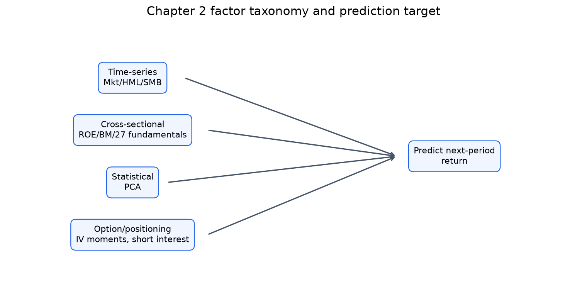
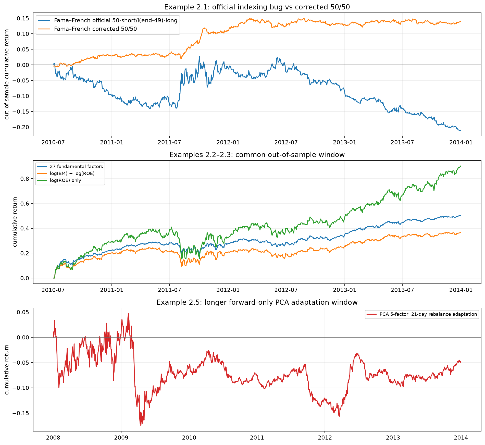
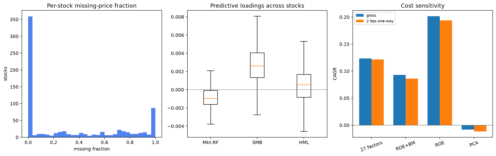

# Chapter 2 Factor Models — Python 재현 리포트

## 1. 문제와 재현 범위

요인 모델은 고유 잡음이 아니라 여러 자산에 함께 남는 체계적 위험과 예측 신호를
분리한다. 이 장의 핵심 질문은 과거에 관측한 요인 적재량이 **다음 기간** 수익률을
예측하는가이다. 동시 회귀의 설명력과 예측 백테스트를 혼동하지 않는다.

| Topic | Status | Evidence |
|---|---|---|
| Factor risk, alpha, and predictive regression | conceptual explanation | Sections 1–2 |
| Example 2.1 Fama–French next-day model | executed + approximate book comparison | faithful I(end-49) bug and corrected 50/50 |
| Example 2.2 27 cross-sectional fundamentals | executed + book comparison | quarter holding |
| Example 2.3 ROE/BM and ROE-only | executed + book comparison | month holding |
| Option-implied moments | formula illustration; backtest unavailable | archive has source but no option panel |
| Monthly implied-volatility change | conceptual explanation | licensed option panel absent |
| Put–call IV spread | conceptual explanation | licensed option panel absent |
| OTM put–ATM call smirk | conceptual explanation | licensed option panel absent |
| Market-implied-volatility change | conceptual explanation | licensed option panel absent |
| Short interest | conceptual explanation | short-interest panel absent |
| Liquidity | conceptual explanation | volume and shares-outstanding inputs absent |
| Example 2.5 statistical PCA factors | lower-frequency executed adaptation | 21-day rebalance vs book daily |
| Combining factors and rank robustness | conceptual explanation | collinearity and train-only selection |
| Exercises and endnotes | out of scope | questions retained in chapter source |

옵션·공매도·유동성 절은 공식 ZIP에 MATLAB 소스는 있지만 필요한 OptionMetrics,
Compustat short-interest/volume·shares 패널이 없다. 편리한 현대 데이터로 바꿔
수치 재현이라고 부르지 않고, 공식과 데이터 요건만 설명한다.

## 2. 공식 데이터와 진단

- 공식 페이지: https://epchan.com/book3
- 공식 ZIP: `https://epchan.com/img/book3/Chap2%20Factor%20Models.zip`
- ZIP SHA-256: `9a8f4c1620a80c1f6f031703ef5e0bc3f75cccf6cda1a85fd29f3cc8f956c046`
- 기간: 2007-01-03 ~ 2013-12-31
- 가격 shape: (1762, 743); 종목 743개
- 결측 가격: 430,075; 유한 비양수 가격: 0
- 27개 요인: 분기 ARQ 5개 + trailing ART 22개

결측은 상장·상장폐지와 펀더멘털 발표 주기에서 온다. 회귀는 각 학습 구간에서
응답과 모든 설명변수가 유한한 행만 사용하며, 미래 값으로 결측을 채우지 않는다.

## 3. 수식에서 코드로

시계열 예측 모델은

$$R_{t+1,s}-r_F=\alpha_s+\beta_{s}^T f_t+\epsilon_{t+1,s}$$

이고 `fit_fama_french`가 종목별 OLS를 수행한다. 횡단면 모델은 같은 시점의 여러
종목을 쌓아

$$R_{t+h,s}=\alpha+\gamma^T x_{t,s}+\epsilon_{t+h,s}$$

를 한 번 학습하며 `fit_cross_sectional_model`이 구현한다. 신호는 하루 늦춰
포지션으로 바꾸고 21일 또는 63일 겹침 보유를 구성한다. PCA 적응은 과거 252일만
사용해 5개 성분을 만들고 21일마다 재학습한다.

## 4. Example 2.1 — Fama–French와 원본 인덱싱 버그

공식 `FamaFrenchFactors_predictive.m`은 숏에 `I(1:topN)`을 쓰지만 롱에는
`I(end-topN+1)`만 써 콜론이 빠졌다. `topN=50`이므로 이는 최상위가 아니라
**위에서 50번째 종목 하나**를 롱한다. 따라서 책 출력은 50개 숏과 이 1개 롱의
순숏 포트폴리오다. Python의 MATLAB 충실 경로도 같은 순위를 선택한다.

학습 CAGR/Sharpe는 `1.049994` / `2.470537`, OOS는
`-0.065504` / `-0.597906`다. 책 비교 허용오차는 각각
CAGR `0.03`/`0.02`, Sharpe `0.08`/`0.08`이며 이는 **근사 재현**이다. 잔여 격차는
MATLAB과 NumPy 회귀·연산 순서 및 `smartsum` 의미 차이가 후보지만 원인을 입증하지
못했다. 이 일치는 전략 타당성의 증거가 아니라 버그 진단의 증거다.

콜론을 고쳐 50/50으로 만들면 OOS CAGR/Sharpe는
`0.038030` / `1.185178`다. 편도 2bps를
차감하면 CAGR은 `-0.027778`다. 원본과 수정본을 섞어
책 비교를 하지 않는다.

## 5. Examples 2.2–2.3 — 횡단면 펀더멘털

| Experiment | 등급 | 허용오차 | Python OOS CAGR | Book OOS CAGR | Python OOS Sharpe | Book OOS Sharpe |
|---|---|---:|---:|---:|---:|---:|
| Fama–French official 50-short/I(end-49)-long | 근사 재현 | CAGR 0.02 / Sharpe 0.08 | -0.065504 | -0.070378 | -0.597906 | -0.643982 |
| 27 fundamental factors | 수치 재현 | 1e-5 | 0.123549 | 0.123549 | 1.675774 | 1.675774 |
| log(BM) + log(ROE) | 수치 재현 | 1e-5 | 0.093199 | 0.093199 | 1.010660 | 1.010660 |
| log(ROE) only | 수치 재현 | 1e-5 | 0.201661 | 0.201661 | 1.305036 | 1.305036 |

27요인과 ROE/BM 모델은 전반부에서만 계수를 추정하고 후반부에 고정 적용한다.
`log(ROE)` 단일요인이 2요인보다 강한 책의 결과도 재현된다. 다만 이 데이터는
과거 SPX 구성종목을 포함한다고 설명되어 있어도, 공급자 point-in-time 지연과
회계 정정 이력을 별도로 검증하지 못했다. 발표일이 아닌 보고값의 가용일을 잘못
쓰면 look-ahead bias가 생긴다.

## 6. Example 2.5 — 통계적 PCA 요인

책은 매일 252일 창을 다시 적합해 CAGR `15.6%`,
Sharpe `1.38`를 보고한다. 이 구현은 계산량과
회전율을 명시하기 위해 21일마다만 재적합한 **방법론적 적응**이며 직접 수치 재현이
아니다. 72회 재학습, 평균 상위 5성분 설명분산
`54.3%`, 비용 전/후 CAGR은
`-0.008212` / `-0.011683`다.
초기 252일은 포지션 없는 lookback이므로 `metrics.json`의 PCA train은 측정치가
아닌 `null`이며, 더 긴 forward-only 기간은 펀더멘털 OOS와 별도 패널에 그린다.

## 7. 옵션·공매도·유동성 요인의 구현 경계

30일 ATM/OTM 변동성으로 정의한 예시에서 IV, skew proxy, kurtosis proxy는 각각
`0.230`,
`-0.120`,
`0.040`다. 이는 수식 점검이지 옵션 전략
백테스트가 아니다. 만기 보간·델타 보간·bid/ask와 생존한 옵션만 쓰는 선택을
처리할 원시 패널이 없기 때문이다. short interest와 liquidity도 보고 지연,
shares-outstanding 단위, 거래량 조정이 필요하다.

## 8. 비용·편향·표본 외 한계

- **Look-ahead:** 학습/테스트는 시간 순서로 나눴지만 회계 정보의 실제 공개시각은 검증하지 못했다.
- **Survivorship/selection:** 역사적 CRSP 유니버스라는 책의 설명에 의존하며 독립 구성종목 파일이 없다.
- **거래비용:** 편도 2bps 민감도만 계산했고 borrow fee, locate, market impact, bid-ask spread는 없다.
- **다중검정:** 27개 요인·여러 보유기간·정렬순서를 시도하면 data snooping이 커진다.
- **노출:** 50/50 종목 수가 beta·산업·시가총액 중립을 보장하지 않는다.
- **PCA:** 부호와 성분은 창마다 회전하며 경제적 의미가 고정되지 않는다.

## 9. 검증과 결론

총 15개 검증 통과: 책·공식 해시의 독립/경험 검증
8개, 계산 계약 invariant
7개다. `metrics.json`에 분류를 보존한다.

결론은 “요인이 수익을 보장한다”가 아니다. 원본 버그 하나가 시장중립 모델을
순숏 모델로 바꾸고, 비용·가용시점·중립화 선택이 성과를 바꾼다. 재사용할 원칙은
요인 수식, 정보 가용시점, 포지션 구성, 비용, 표본 외 적용을 따로 검증하는 것이다.
