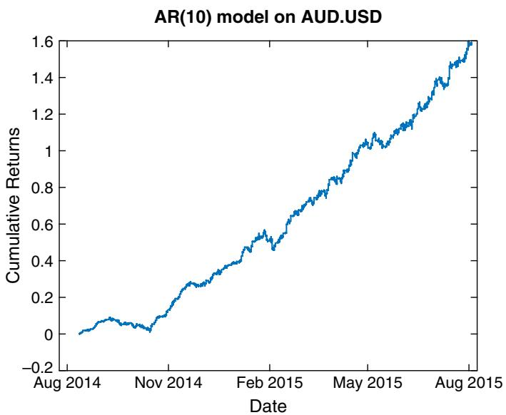
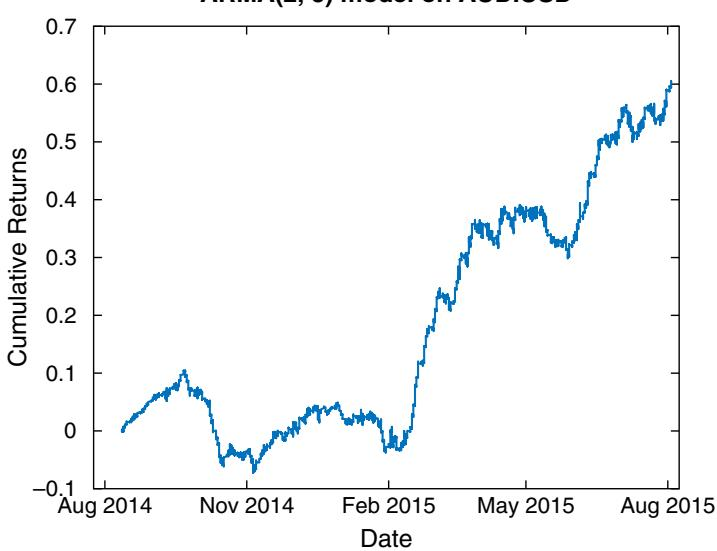
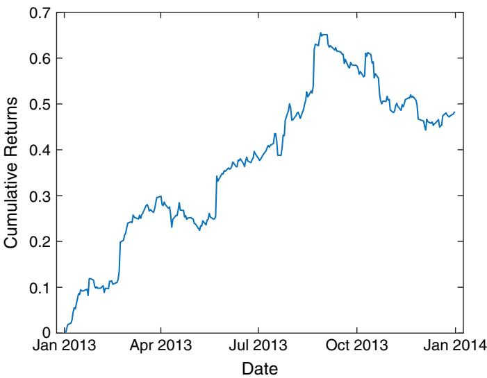
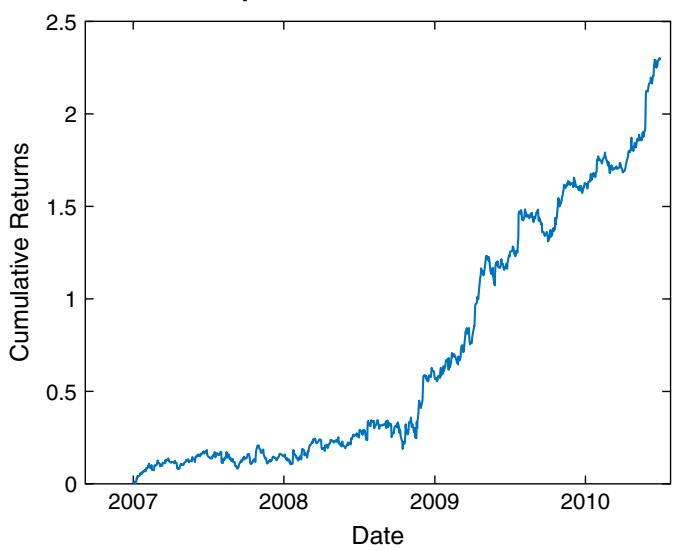
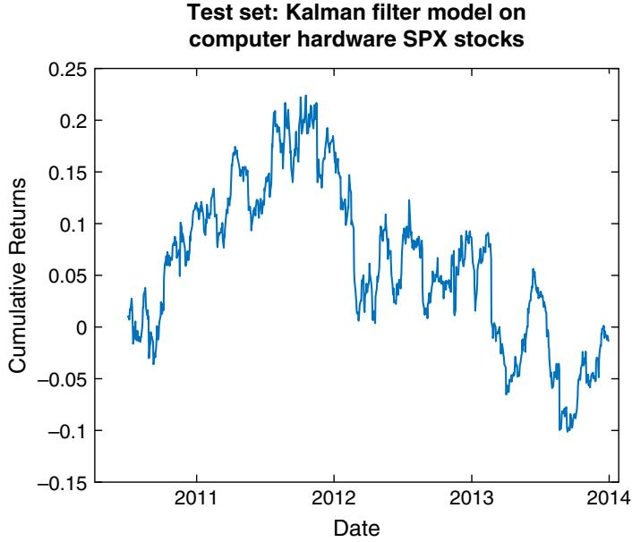
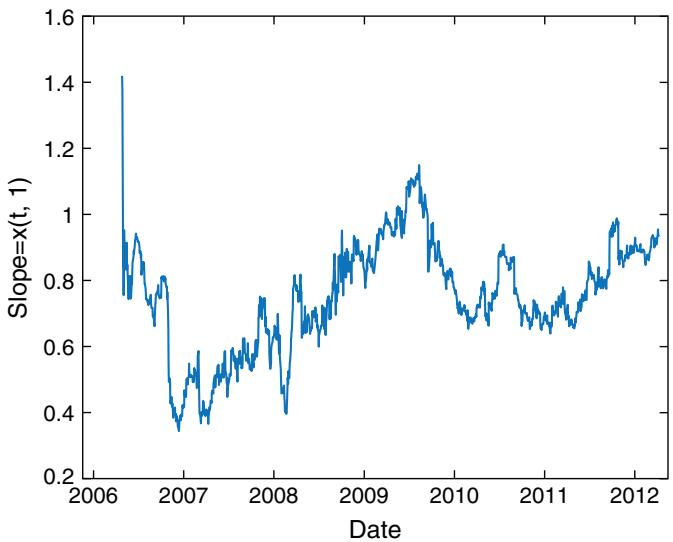
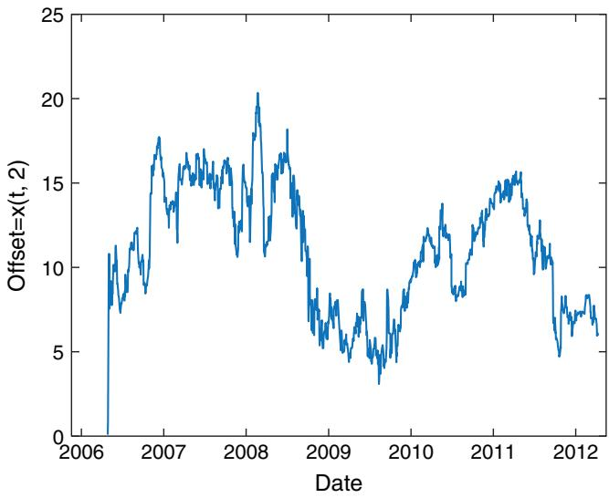
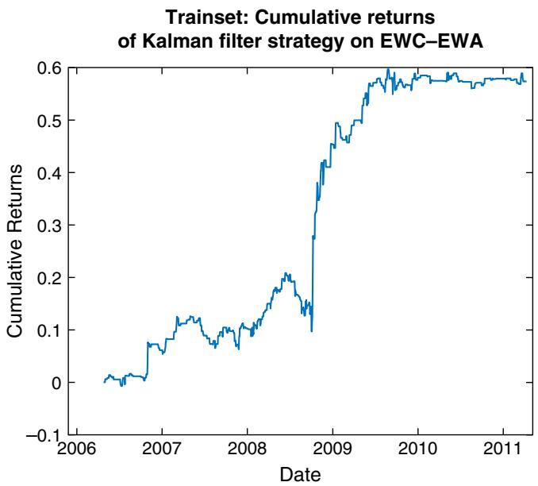
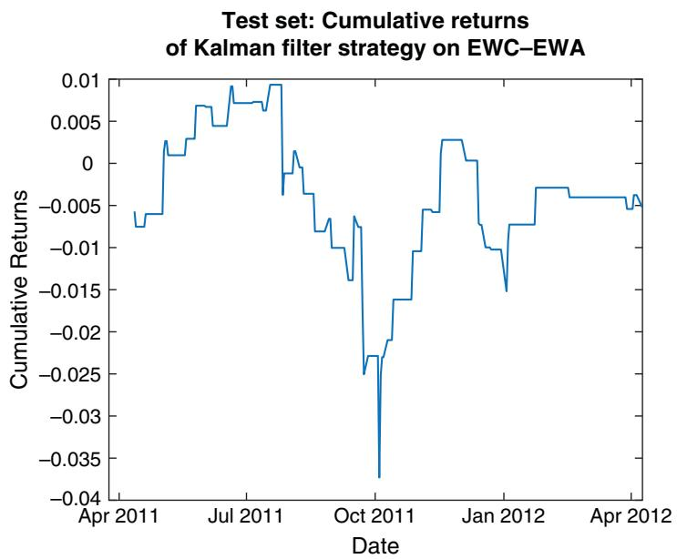

# Time-Series Analysis

Economists and electrical engineers have long been trying to predict the next signal in a time series, which is exactly what traders try to do as well. This chapter is an introduction to the tools well known in econometrics and signal processing, and which have found wide acceptance in the quantitative investment community.

You may already have seen some time-series analysis techniques in action in my previous books (Chan, 2009 and 2013), as a way to test for stationarity or cointegration of price series. But these are just parts of a general package of linear modeling techniques with acronyms like ARIMA, VAR, or VEC. Likewise, almost every technical trader has tried moving averages as a way to filter out the noise in price series. But have they tried many of the advanced signal processing filters such as the Kalman filter?

Time-series techniques are most useful in markets where fundamental information and intuition are either lacking or not particularly useful for short-term predictions. Currencies and bitcoins fit this bill. Professor Lyons (2001) wrote that ‘‘ … the proportion of monthly exchange rate changes our textbook models can explain is essentially zero.’’ We will mention a few examples of using time-series techniques to predict currency returns in this chapter, and leave the bitcoin examples to Chapter 7. But just as technical analysis can be useful for stock trading despite the abundance of fundamental information there, we will describe examples where time-series analysis can be applied to stocks.

Unlike other books on time-series analysis, we will not be discussing the inner workings of these techniques, but focus solely on how we can use ready-made software packages to make predictions. Most of the examples are implemented using the MATLAB Econometrics Toolbox, but R users can find similar functions in the forecast, vars, and dlm packages.

$$
\operatorname { A R } ( { \mathfrak{p} } )
$$

The simplest model in time-series analysis is $\mathrm{AR} ( 1 )$ . It is just a linear regression model that relates the price in one bar to the next:

$$
Y ( t ) - \mu = \phi ( Y ( t - 1 ) - \mu ) + \varepsilon ( t )\tag{3.1}
$$

where $Y ( t )$ is the price at time $t , \Phi$ is the (auto)regression coefficient, and ε is Gaussian noise with zero mean, sometimes called innovation. Hence, the name auto-regressive process. A time series is called $\mathrm{weakly}^{1}$ stationary if its mean and variance are constant in time, and $\operatorname { A R } ( 1 )$ is weakly stationary if $| \Phi | < 1$ (the proof is left as an exercise). A weakly stationary time series is also mean reverting (Chan, 2013). If $| \Phi | > 1$ , the time series will trend. If $\Phi = 1$ , we have a random walk. To estimate $\Phi ,$ , we use the arima and estimate functions in the Econometrics Toolbox.

model\_ar1=arima(1, 0, 0) % assumes an AR(1) with unknown parameters   
model\_ar1\_estimates=estimate(model\_ar1, cl);

The function arima $( p , d , q )$ reduces to an AR(1) model if we set $p = 1$ and $d = 0$ (We will discuss the more general version in the next section.) The estimate function just applies maximum likelihood estimation to find the parameters for the AR(1) model based on the input price series. Applying it to the one-minute midprice bars of AUD.USD from July 24, 2007 to August 3 2015 returns an estimate of $\Phi = 0 . 9 9 9 9 7$ , with a standard error of 0.00001.2 We conclude that though AUD.USD is very weakly stationary, it is very close to a random walk. Note that we tested on midprices instead of trade prices to reduce bid–ask bounce, which tends to produce phantom mean-reversion that cannot really be traded on.

Generalizing slightly from AR(1), we can consider $\operatorname { A R } ( p )$ , represented by

$$
Y ( t ) = \mu + \phi_{1} Y ( t - 1 ) + \phi_{2} Y ( t - 2 ) + \cdot \cdot \cdot + \phi_{p} Y ( t - p ) + \varepsilon ( t ) .\tag{3.2}
$$

You can see that this is just a multiple regression model with the price at time t as the dependent (response) variable and past prices up to a lag of $P$ bars as independent (predictor) variables. But introducing p as an additional parameter means that we can find the optimal $P$ that gives the best fit of the $\operatorname { A R } ( p )$ model to our data. As in many statistical models, we will use the

```matlab
model=arima(pMin, 0, 0) % assumes an AR(pMin) with unknown
parameters
```

Bayesian information criterion (BIC) that is proportional to the negative log likelihood of the model but with an additional term that is proportional to p, which penalizes complexity. Our objective is to minimize BIC, and we do this by a brute-force exhaustive search:3

```matlab
LOGL=zeros(60, 1); % log likelihood for up to 60 lags (1 hour)
P=zeros(size(LOGL)); % p values
for p=1:length(P)
model=arima(p, 0, 0);
[∼,∼,logL] = estimate(model, mid(trainset),'print',false);
LOGL(p) = logL;
P(p) = p;
end
```

In the above code fragment, mid is the array that contains the midprices. Once we have decided on the best estimate of p, we can apply the estimate function to it to find the coefficients μ, ϕ1,ϕ2, … ,ϕp:

```javascript
fit=estimate(model, mid);
```

Applying these functions to AUD.USD on one-minute midprice bars from July 24, 2007, to August 12, 2014, yields p = 10 as the optimal value, with the coefficients noted in Table 3.1.

We can now use this AR(10) model for prediction on the out-of-sample data set from August 12, 2014, to August 3, 2015.

```matlab
yF=NaN(size(mid));
for t=testset(1):size(mid, 1)
[y, ∼]=forecast(fit, 1, 'Y0', mid(t-pMin+1:t)); % Need only
most recent pMin data points for prediction
yF(t)=y(end);
end
```

Note that yF(t) is the forecast made with data up to time t; hence, it is actually the predicted price for time t + 1. Once the next bar prediction has been made, we can use it to generate trading signals: Simply buy when the predicted price is higher than the current price, and sell when it is lower:

TABLE 3.1 Coefficients of an AR(10) Model Applied to AUD.USD
<table><tr><td>Coefficient</td><td>Value</td><td>Standard Error</td></tr><tr><td> $\mu$ </td><td>1.37196e-06</td><td>8.65314e-07</td></tr><tr><td> $\Phi_{1}$ </td><td>0.993434</td><td>0.000187164</td></tr><tr><td> $\Phi_{2}$ </td><td>-0.00121205</td><td>0.000293356</td></tr><tr><td> $\Phi_{3}$ </td><td>-0.000352717</td><td>0.000305831</td></tr><tr><td> $\Phi_{4}$ </td><td>0.000753222</td><td>0.000354121</td></tr><tr><td> $\Phi_{5}$ </td><td>0.00662641</td><td>0.000358673</td></tr><tr><td> $\Phi_{6}$ </td><td>-0.00224118</td><td>0.000330092</td></tr><tr><td> $\Phi_{7}$ </td><td>-0.00305157</td><td>0.000365348</td></tr><tr><td> $\Phi_{8}$ </td><td>0.00351317</td><td>0.000394538</td></tr><tr><td> $\Phi_{9}$ </td><td>-0.00154844</td><td>0.000398956</td></tr><tr><td> $\Phi_{1 0}$ </td><td>0.00407798</td><td>0.000281821</td></tr></table>

```javascript
deltaYF=yF-mid;
```

```javascript
pos=zeros(size(mid));
pos(deltaYF > 0)=1;
pos(deltaYF < 0)=-1;
```

This strategy yields an annualized return of 158 percent on the out-ofsample set. See Figure 3.1 for its equity curve. To realize such amazing returns, one has to be able to execute at midprice; hence, a low latency execution program that manages limit orders is necessary.

  
FIGURE 3.1 AR(10) trading strategy applied to AUD.USD

### ARMA(p, q)

From our application of $\operatorname { A R } ( p )$ to AUD.USD, we see that the best fit requires 10 lags. This high number of lags is quite common for $\operatorname { A R } ( p )$ models: They are trying to compensate for the simplicity of the model structure with a larger number of terms. A small extension of the AR model to include $q$ lagged noise terms will often reduce the number of lags necessary. This is called the $\mathrm{ARMA} ( p , q )$ model, or an auto-regressive moving average process, where the $q$ lagged noise terms are described as a moving average:

$$
\begin{array}{c} { { Y ( t ) = \mu + \phi_{1} Y ( t - 1 ) + \phi_{2} Y ( t - 2 ) + \cdot \cdot \cdot + \phi_{\mathrm{p} } Y ( t - p ) + \varepsilon ( t ) } } \\ { { \nonumber } } \\ { { + ~ \theta_{1} \varepsilon ( t - 1 ) + \cdot \cdot \cdot + \theta_{\mathrm{q} } \varepsilon ( t - q ) } } \end{array} { } { } \nonumber\tag{3.3}
$$

Finding the best values of the p and q and the coefficient of each term in $P$ $q$ equation 3.3 is similar to the procedure we took for $\operatorname { A R } ( p )$ , but because we are now doing exhaustive search over two variables, we need nested for-loops:

```matlab
LOGL=-Inf(10, 9); % log likelihood for up to 10 p and 9 q
(10 minutes)
PQ=zeros(size(LOGL)); % p and q values
for p=1:size(PQ, 1)
for q=1:size(PQ, 2)
model=arima(p, 0, q);
[∼,∼,logL] = estimate(model, mid(trainset),'print',false);
LOGL(p, q) = logL;
PQ(p, q) = p+q;
end
end
```

For each $P$ and q, we save the log likelihood in $q ,$ $L O G L ( p , q )$ , and $P^{+} \boldsymbol { q }$ in $P Q \ ( p , q )$ , the latter because it is used as a penalty term when minimizing BIC. How do we identify the optimal $P$ and $q$ that minimizes BIC from the LOGL and PQ matrices? We have to turn them into one-dimensional vectors, apply the aicbic function, and then use the min function:

```matlab
% Has p+q+1 parameters, including constant
LOGL_vector = reshape(LOGL, size(LOGL, 1)*size(LOGL, 2), 1);
PQ_vector = reshape(PQ, size(LOGL, 1)*size(LOGL, 2), 1);
```

[∼, bic]=aicbic(LOGL\_vector, PQ\_vector+1, length(mid(trainset)));   
[bicMin, pMin]=min(bic)

Finally, we have to turn the one-dimensional BIC vector back into a two-dimensional array, but with only the cell corresponding to the minimum value populated, in order to facilitate easy visual identification of the row (corresponding to p) and column (corresponding to q) numbers of that cell:

```matlab
bic(:)=NaN;
bic(pMin)=bicMin;
bic=reshape(bic,size(LOGL))
```

All these procedures are contained in the program buildARMA\_findPQ\_ AUDUSD.m. The output for AUD.USD looks like the following:

Columns 1 through 4

where we easily determine that the cell with the minimum BIC corresponds to $p = 2$ and $q = 5$ These are indeed shorter lags than the $p = 1 0$ we used in the $\operatorname { A R } ( p )$ model. Plugging in these values to the arima function and then applying the estimate function on the ARMA(2, 5) model as we did in the section on $\operatorname { A R } ( p )$ yields the coefficients shown in Table 3.2.

One should note that $| \Phi_{1} |$ is now definitely smaller than 1, indicating strong mean reversion. However, using the forecast functions to generate trading signals as before actually decreases the out-of-sample annualized return from 158 percent to 60 percent. The added complexity of using moving average has not paid off in this case. The equity curve is shown in Figure 3.2. The backtest program is available as buildARMA\_AUDUSD.m.

You may wonder why the function we used for the $\operatorname { A R } ( { p } )$ and ARMA $( p , q )$ models are called arima. You may also wonder why we focus on predicting prices rather than returns. The answer to both questions can be understood by studying the $\mathrm{ARIMA} ( p , d , q )$ model.

TABLE 3.2 Coefficients of an ARMA(2, 5) Model Applied to AUD.USD
<table><tr><td>Coefficient</td><td>Value</td><td>Standard Error</td></tr><tr><td> $\mu$ </td><td>2.80383e-06</td><td>4.58975e-06</td></tr><tr><td> $\Phi_{1}$ </td><td>0.649011</td><td>0.000249771</td></tr><tr><td> $\Phi_{2}$ </td><td>0.350986</td><td>0.000249775</td></tr><tr><td> $\theta_{1}$ </td><td>0.345806</td><td>0.000499929</td></tr><tr><td> $\theta_{2}$ </td><td>−0.00906282</td><td>0.000874713</td></tr><tr><td> $\boldsymbol { \theta }_{3}$ </td><td>-0.0106082</td><td>0.000896239</td></tr><tr><td> $\theta_{4}$ </td><td>-0.0102606</td><td>0.0010664</td></tr><tr><td> $\theta_{5}$ </td><td>-0.00251154</td><td>0.000910359</td></tr></table>

ARMA(2, 5) model on AUD.USD  
  
FIGURE 3.2 ARMA(2, 5) trading strategy applied to AUD.USD

$\mathrm{ARIMA} ( p , d , q )$ stands for autoregressive integrated moving average. Let’s just concern ourselves with $d = 1$ , the simplest and the most common case in finance. If $Y ( t )$ is an $\mathrm{ARIMA} ( p , \ 1 , \ q )$ model, it implies that $\Delta Y ( t )$ is an $\mathrm{ARMA} ( p , q )$ , where $\Delta Y ( \boldsymbol { t } ) = Y ( \boldsymbol { t } ) - Y ( \boldsymbol { t } - 1 )$ . We can understand this even better if $Y ( t )$ represents log price instead of price. If this is the case, then using $\mathrm{ARMA} ( p , q )$ to model the log returns is equivalent to using ARIMA $( p , 1 , q )$ to model the log prices.

Would it be advantageous to model log returns $\Delta Y$ instead of Y using $\operatorname { A R M A } ( p , q ) !$ It would be, if we can further reduce the lags $P$ and $q$ from the ones obtained when modeling prices (or log prices) using $\mathrm{ARMA} ( p , q )$ Unfortunately, I have never found that to be true. For example, modeling the log of AUD.USD time series using $\mathrm{ARIMA} ( p , 1 , q )$ gives $p = 1$ , and $q = 9$

The equivalence of an $\mathrm{ARIMA} ( p , \ 1 , \ q )$ model on log prices to an $\mathrm{ARIMA} ( p , \ 0 , \ q )$ model on log returns should not be confused with the statement that an $\mathrm{ARMA} ( p , \ q ) = \mathrm{ARIMA} ( p , \ 0 , \ q )$ model on log prices is equivalent to some $\mathrm{ARMA} ( p^{\prime} , q^{\prime} )$ model on log returns. The latter statement is false. An ARMA model in $\Delta Y_{\mathrm { { S} } }^{\prime}$ can always be transformed into an ARMA model in $Y_{\mathrm { ~ S ~} }^{\prime}$ . But an ARMA model for $Y$ cannot always be transformed into an ARMA model for $\Delta Y$ . This is because an ARMA model for $\Delta Y$ can only have $\Delta Y$ as independent variables, whereas an ARMA model for Y can have both $\Delta Y$ (which is just the difference of two $Y_{\mathrm{S} } )$ and

Y as independent variables. Hence, a model for Y is more flexible and gives better results. If we want to have a model for $\Delta Y$ that has both $\Delta Y \mathrm{s}$ and Ys as independent variables, we have to use a ${ \mathrm{VEC} } ( p )$ model, to be discussed at the end of the next section on $\operatorname { V A R } ( p )$

### VAR(p)

The simple autoregressive model $\operatorname { A R } ( p )$ in equation 3.2 can be easily generalized to m multivariate time series. This generalized model is called a vector autoregressive model, or VAR(p). All we need to do is to interpret the autoregressive coefficients $\boldsymbol { \Phi }$ as m × m matrices, and allow the noises $\mathbf { \boldsymbol { \varepsilon } } ( { \boldsymbol { \varepsilon } } )$ , which are m-vectors to have nonzero cross-sectional correlations but zero serial correlations. This means that $\varepsilon_{i} ( t )$ is not correlated with $\varepsilon_{j} ( s )$ , for any $t \neq s ,$ but $\varepsilon_{i} ( t )$ could be correlated with $\varepsilon_{j} ( t )$ . Since the autogressive coefficient matrices relate the current price of every time series to the lagged prices of all time series, VAR model is particularly suitable for modeling financial instruments that have correlated returns, such as a portfolio of stocks within the same industry group. We will focus on the computer hardware group within the S&P 500 Index on January 3, 2007, which consists of the tickers AAPL, EMC, HPQ, NTAP, and SNDK. To eliminate spurious mean-reversion effects due to bid-ask bounce, we will use midprices at market close provided by the Center for Research of Security Prices (CRSP) from January 3, 2007, to December 31, 2013.

As in the section on $\operatorname { A R } ( p )$ , we first need to determine the optimal lag p. We will use the first six years of data as training set for this determination. There are only minor differences in the codes required:4

```matlab
for p=1:length(P)
model=vgxset('n', size(mid, 2), 'nAR', p, 'Constant', true);
% with additive offset
[model,EstStdErrors,logL,W] = vgxvarx(model,mid(trainset, :));
[NumParam,∼] = vgxcount(model);
LOGL(p) = logL;
P(p) = NumParam;
end
```

It is gratifying that we find $P = 1$ minimizes BIC (simpler models are usually better), and this is a typical result for most industry groups. Once this is decided, the other parameters of the model can be determined by the function vgxvarx, which is the equivalent of the estimate function for ARIMA models. Using the same training set, the constant offsets, autoregressive coefficients, and the covariance of the noise terms are noted in Table 3.3. (In this table, in contrast to Table 3.1 or 3.2, the subscripts refer to the stocks instead of number of time lags.)

To make predictions using this model on the out-of-sample data in 2013, use the vgxpred function, which is similar to the forecast function for ARIMA.

```matlab
pMin=1;
yF=NaN(size(mid));
for t=testset(1):size(mid, 1)
FY = vgxpred(model,1, [], mid(t-pMin+1:t, :));
yF(t, :)=FY;
end
```

In keeping with the linearity of the VAR models, we can construct a linear trading model as well. Furthermore, we can choose to make it sector-neutral. We compute the mean predicted return $\left. r \right.$ of all the stocks in the industry group every day, and set the target dollar allocation of a stock to be proportional to the difference between its predicted return and the industry group mean,

TABLE 3.3 Constant Offsets, Autoregressive Coefficients, and Covariance of a VAR(1) Model Applied to Computer Hardware Stocks
<table><tr><td colspan="2">Constant Offsets</td><td colspan="2">Value</td><td colspan="2">Standard Error</td></tr><tr><td colspan="2"> $\mu_{1}$ </td><td colspan="2">3.88363</td><td></td><td>1.15299</td></tr><tr><td colspan="2"> $\mu_{2}$ </td><td colspan="2">0.669367</td><td></td><td>0.0970334</td></tr><tr><td colspan="2"> $\mu_{3}$ </td><td colspan="2">1.75474</td><td></td><td>0.227636</td></tr><tr><td colspan="2"> $\mu_{4}$ </td><td colspan="2">1.701</td><td></td><td>0.249767</td></tr><tr><td colspan="2">μ5</td><td colspan="2">1.8752</td><td></td><td>0.282581</td></tr><tr><td> $\Phi_{\mathrm { i , j} }$ </td><td>AAPL</td><td>EMC</td><td>HPQ</td><td>NTAP</td><td>SNDK</td></tr><tr><td>AAPL</td><td>0.991815</td><td>0.0735881</td><td>-0.105676</td><td>0.0359698</td><td>-0.00619303</td></tr><tr><td>EMC</td><td>-7.15594e-05</td><td>0.970934</td><td>-0.0103416</td><td>0.00524778</td><td>0.00354032</td></tr><tr><td>HPQ</td><td>-0.00158962</td><td>-0.024093</td><td>0.965626</td><td>0.00898799</td><td>0.00190162</td></tr><tr><td>NTAP</td><td>-0.000771673</td><td>-0.0409408</td><td>-0.0284176</td><td>1.00662</td><td>0.00308001</td></tr><tr><td>SNDK</td><td>-0.000526824</td><td>-0.0579403</td><td>-0.0309631</td><td>0.01704</td><td>0.998657</td></tr><tr><td> $\langle \varepsilon_{i} \varepsilon_{j} \rangle$ </td><td>AAPL</td><td>EMC</td><td>HPQ</td><td>NTAP</td><td>SNDK</td></tr><tr><td>AAPL</td><td>36.2559</td><td></td><td></td><td></td><td></td></tr><tr><td>EMC</td><td>1.67571</td><td>0.256786</td><td></td><td></td><td></td></tr><tr><td>HPQ</td><td>3.37592</td><td>0.449846</td><td>1.41323</td><td></td><td></td></tr><tr><td>NTAP</td><td>3.78265</td><td>0.513747</td><td>1.20474</td><td>1.70138</td><td></td></tr><tr><td>SNDK</td><td>4.39542</td><td>0.522437</td><td>1.26443</td><td>1.41357</td><td>2.17779</td></tr></table>

$$
\mathrm { \Sigma }_{w _ { i} } = ( r_{i} - \langle { r } \rangle ) / \sum_{j} | \mathrm{r}_{j} - \langle { r } \rangle | .\tag{3.4}
$$

We have made sure that the initial gross market value of the portfolio is always \$1. You may notice that this formula looks similar to equation 4.1 in Chan (2013), but it is different. In the formula in my previous book, the returns used are the previous day’s returns, and more importantly, we set the proportionality constant to −1 since we assumed mean reversion. The MATLAB code fragment5 for computing the position (equivalently, dollar allocation) of each stock is

```matlab
retF=(yF-mid)./mid;
sectorRetF=mean(retF, 2);
pos=zeros(size(retF));
pos=(retF-repmat(sectorRetF, [1 size(retF, 2)]))./repmat
(smartsum(abs(retF-repmat(sectorRetF, [1 size(retF, 2)])), 2),
[1, size(retF, 2)]);
```

This trading model yields an annualized return of 48 percent, with a Sharpe ratio of 0.9. See Figure 3.3 for its equity curve.

We often want to predict changes in price $\Delta Y$ instead of price Y itself. So it is a bit awkward to use the VAR models, and the resulting AR coefficients do not make too much intuitive sense. Fortunately, $\operatorname { V A R } ( p )$ can be transformed to a model with $\Delta Y$ as the dependent variable, and various lagged $\Delta Y_{\mathrm { { S} } }^{\prime}$ and $Y_{\mathrm { ~ S ~} }^{\prime}$ as the independent variables. This is called the ${ \mathrm{VEC} } ( q )$ (vector error correction) model, and is written as

$$
\Delta Y ( t ) = M + C Y ( t - 1 ) + A_{1} \Delta Y ( t - 1 ) + \cdot \cdot \cdot + A_{k} \Delta Y ( t - k ) + \mathfrak{e} ( t ) .\tag{3.5}
$$

The $m \times m$ matrix C in equation 3.5 is called the error correction matrix. To transform the coefficients of $\operatorname { V A R } ( p )$ to ${ \mathrm{VEC} } ( q )$ , first note that $q = p - 1$ and we can use the function vartovec. Applying this to the VAR model built above for computer hardware stocks:

[model\_vec, C]=vartovec(model);

VAR(1) model on computer hardware SPX stocks  
  
FIGURE 3.3 VAR(1) trading strategy applied to computer hardware stocks

we get Table 3.4, which displays the values of C:

TABLE 3.4 Error Correction Matrix of a VEC(0) Model Applied to Computer Hardware Stocks
<table><tr><td> $c_{i , j}$ </td><td>AAPL</td><td>EMC</td><td>HPQ</td><td>NTAP</td><td>SNDK</td></tr><tr><td>AAPL</td><td>-0.0082</td><td>0.0736</td><td>-0.1057</td><td>0.0360</td><td>-0.0062</td></tr><tr><td>EMC</td><td>-0.0001</td><td>-0.0291</td><td>-0.0103</td><td>0.0052</td><td>0.0035</td></tr><tr><td>HPQ</td><td>-0.0016</td><td>-0.0241</td><td>-0.0344</td><td>0.0090</td><td>0.0019</td></tr><tr><td>NTAP</td><td>-0.0008</td><td>-0.0409</td><td>-0.0284</td><td>0.0066</td><td>0.0031</td></tr><tr><td>SNDK</td><td>-0.0005</td><td>-0.0579</td><td>-0.0310</td><td>0.0170</td><td>-0.0013</td></tr></table>

The values of C give us a more intuitive understanding of the relationships between the movements of the different stocks. You may notice that except for NTAP, all diagonal elements have negative values. This means that all but NTAP are serially mean reverting, albeit some very weakly.

Equation 3.5 is the same as equation 2.7 in Chan (2013), where it was discussed in connection with the Johansen test for cointegration. Indeed, if the portfolio of computer hardware stocks were cointegrating, C would give rise to a significantly negative eigenvalue in the Johansen test. But we do not need a cointegrating portfolio to use VEC(q) for prediction. Some of the stocks could be trending while others are mean reverting, as we saw in Table 3.4.

By the way, if you want to try VAR models on the entire SPX universe instead of just the computer hardware stocks, make sure your computer has an unusually large memory! Also, as mentioned before, these models may behave better if we use log prices instead of prices. (In any case, a log price representation will allow a better connection to the continuous version of VAR and VEC. See Cartea, Jaimungal, and Penalva, 2015, p. 285.)

### State Space Models

The AR, ARMA, VAR, and VEC models we have considered so far all use observable variables (prices of various lags) to predict their future values. However, econometricians have also concocted a class of models with hidden variables, called states, which can determine the values of observed variables (though subject to observation noise). These models are called state space models (SSM), a linear example of which is the Kalman filter, discussed in Chapter 3 of Chan (2013) and used in Chapter 5 in this book. Though there can be nonlinear state space models, we will discuss only the linear version in this section.

A state space model starts with a linear relationship that specifies the time-evolution of the hidden state variable, usually denoted by x:

$$
x ( t ) = A ( t ) * x ( t - 1 ) + B ( t ) * u ( t )\tag{3.6}
$$

where x is an m-dimensional vector, A(t) and B(t) are possibly timedependent but observable matrices (A is m × m, while B is m × k), and u(t) is k-dimensional Gaussian white noise with zero mean, unit variances, and zero serial and cross correlations. Equation 3.6 is often called the state transition equation. The observable variables (also called measurements) are related to the hidden variables by another linear equation

$$
y ( t ) = C ( t ) * x ( t ) + D ( t ) * \mathfrak{E} ( \mathfrak{t} )\tag{3.7}
$$

where y is an n-vector, C(t) and D(t) are possibly time-dependent but observable matrices (C is $n \times m$ , while D is $n \times h )$ , and ε(t) is h-dimensional Gaussian white noise, also with zero mean, unit variances, and zero serial and cross correlations. Equation 3.7 is often called the measurement equation.

What are these hidden variables, and why do we want to hypothesize their existence? An example of a hidden variable is the familiar moving average. Though we usually compute a moving average of prices using a fixed number of lagged prices and thus making it apparently an observable variable, we can argue that this fixed number of lags is an artificial construction. Also, why not use exponential moving average instead of moving average? The fact that no one can agree on a standard, unique moving average variable suggests that it may be treated as a hidden variable. We can give some structure to this hidden variable x by requiring that it evolves in a particularly simple way:

$$
x ( t ) = x ( t - 1 ) + B * u ( t )\tag{3.8}
$$

We have assumed A(t) is the identity matrix, which is of course invariant in time, and B is an unknown but also time-invariant matrix that determines the covariance of the estimation errors for the moving average x. (Remember that u itself has a covariance matrix that is the identity matrix.) Though we had said that B is supposed to be observable, it can be treated as an unknown parameter(s) to be estimated by applying maximum likelihood estimation on training data. (In other words, B is ‘‘observable’’ only to the extent that its values are not updated at each time step during Kalman filter updates.)

Given the moving average (plural if the time series is multivariate) of a time series, a trader may hypothesize that the prices are trending, and thus the best guess for the observed price at time t is just the estimated moving average at time t as well:

$$
y ( t ) = x ( t ) + D * \varepsilon ( \mathrm{t} )\tag{3.9}
$$

where D is another unknown and time-invariant matrix to be estimated by MLE.

Let’s see this ‘‘moving average’’ model of equations 3.8 and 3.9 in action by applying it to the same computer hardware stocks’ price series we studied in the section on VAR(p). We will assume that there are as many hidden state variables (five in total) as there are stocks in the computer hardware industry group. This is what a typical moving average model assumes as well—each price series has its own independent moving average. Furthermore, we assume also that the state noise of one moving average is uncorrelated with any other but each may have a different variance. Hence, B is a $5 \times 5$ diagonal matrix with unknown parameters. (Unknown parameters are denoted as NaN as an input to the MATLAB estimate function.) Similarly, we will assume the measurement noise of one stock’s price is uncorrelated with another, but each may also have a different variance. Hence, D is also a 5 × 5 diagonal matrix with unkown parameters. We could have relaxed this zero-correlation constraint for the state and measurement noises, but this will mean many more variables to estimate, vastly increasing the time it takes for optimization and the danger of overfitting.

The code fragment for using the estimate function6 to generate an estimate of the unknown variances of the state and measurement noises (the parameters in B and D) are as follows:

```matlab
A=eye(size(y, 2)); % State transition matrix
B=diag(NaN(size(y, 2), 1))
C=eye(size(y, 2)); % Time-invariant measurement matrix
D=diag(NaN(size(y, 2), 1))
model=ssm(A, B, C, D);
param0=randn(2*size(B, 1)̂2, 1); % 50 unknown parameters per bar.
model=estimate(model, y(trainset, :), param0);
```

which generates the values shown in Table 3.5.

In this case, the signs of the diagonal elements of the B and D matrices are immaterial, given that the noises u(t) and ε(t) are distributed symmetrically around a zero mean with no cross-correlations. One may also consider applying SSM on log prices instead, so that the Gaussian noise assumption is more reasonable.

TABLE 3.5 Estimated Values for B and D Matrices (Off-Diagonal Elements Are 0)
<table><tr><td>Bi,j</td><td>u1</td><td>u2</td><td>u3</td><td>u4</td><td></td><td>u5</td></tr><tr><td>X1</td><td>-3.74</td><td></td><td></td><td></td><td></td><td></td></tr><tr><td>X2</td><td></td><td>0.34</td><td></td><td></td><td></td><td></td></tr><tr><td>X3</td><td></td><td></td><td>-0.73</td><td></td><td></td><td></td></tr><tr><td>X4</td><td></td><td></td><td></td><td></td><td>-0.67</td><td></td></tr><tr><td>X5</td><td></td><td></td><td></td><td></td><td></td><td>-1.00</td></tr><tr><td>i,</td><td>x1</td><td></td><td>X2</td><td>x3</td><td>X4</td><td>X5</td></tr><tr><td>AAPL</td><td>-0.0000454</td><td></td><td></td><td></td><td></td><td></td></tr><tr><td>EMC</td><td></td><td></td><td>-0.08</td><td></td><td></td><td></td></tr><tr><td>HPQ</td><td></td><td></td><td></td><td>0.22</td><td></td><td></td></tr><tr><td>NTAP</td><td></td><td></td><td></td><td></td><td>0.19</td><td></td></tr><tr><td>SNDK</td><td></td><td></td><td></td><td></td><td></td><td>-0.15</td></tr></table>

Once the state transition and measurement equations are fixed, we can use the filter function to generate predictions of both the state and observation values.

```javascript
[x, logL, output]=filter(model, y);
```

The x(t) variable in the output of the filter function is the filtered price (moving average) at time t given observed prices up to time t. This model generates filtered prices that resemble the observed prices very closely, usually with less than 0.1 percent difference. Given equations (3.8) and (3.9), this also means that our prediction for next day’s prices will also closely resemble today’s prices. These predicted prices at t given observed prices can be extracted from output(t).ForecastedObs:

```matlab
for t=1:length(output)
yF(t, :)=output(t).ForecastedObs';
end
```

where we assign the predicted price for time t to yF(t − 1), using the same convention as we did previously. From these predicted prices, we can calculate the predicted returns

retF=(yF-y)./y;

Note that retF(t) is the predicted return from t − 1 to t, given the observed price y at time t − 1. These predicted returns can be used in the same way as we did in the VAR model to create a sector-neutral trading strategy. We display in Figure 3.4 the cumulative returns of the model on the trainset, and Figure 3.5 displays the cumulative returns on the test set. The degree of overfitting is surprising, given that we merely use the training data to estimate the variances of the state and measurement noises.

Finding the moving average is not the only way the Kalman filter can be used to predict prices. If we assume trending behavior, we can also use it to find the slope of the recent trend in prices, leading to a prediction of the next price assuming the slope persists. This is left as an exercise for the reader.

Using the Kalman filter to make predictions on observations is not the only way to apply it to trading. Estimates of the hidden state itself may be useful—after all, it is supposed to be a moving average. Finding estimates of a hidden variable in the presence of noise is the original meaning of filtering and is a well-known concept in signal processing. Besides the Kalman filter, other well-known filters in finance and economics include the Hodrick-Prescott filter and the wavelet filter.

Trainset: Kalman filter model on computer hardware SPX stocks  
  
FIGURE 3.4 Kalman filter trading strategy applied to computer hardware stocks (in-sample)

  
FIGURE 3.5 Kalman filter trading strategy applied to computer hardware stocks (out-of-sample)

Another application of Kalman filtering has been discussed in Chan (2013), where it was used to find the best estimates of the hedge ratio between two cointegrated price series. The example given there is the price series of the ETFs EWA (a T × 1 vector) and EWC (also a T × 1 vector), which are supposed to be related as

$$
[ E W C ] = [ E W A , 1 ] * \left[ \begin{array}{c} { { h e d g e r a t i o } } \\ { { o f f s e t } } \end{array} \right] + n o i s e
$$

But instead of treating the two price series as measurements, we treat EWC as the measurements y, and EWA augmented with 1s as the $J { : }$ time-varying matrix C(t) in equation 3.7. (The 1s are necessary to allow for the constant offset in the linear regression relationship between EWA and EWC.) We treat the hedge ratio and the constant offset between them as the hidden state x. Hence, we have

$$
x ( t ) = x ( t - 1 ) + B * u ( t )\tag{3.10}
$$

$$
y ( t ) = C ( t ) * x ( t ) + D * \varepsilon ( \mathrm{t} )\tag{3.11}
$$

where x is a 2 × 1 time-varying vector [hedge ratio, offset] ′ , y is a scalar [EWC(t)], and C(t) is a time-varying 1 × 2 matrix [EWA(t), 1]. The MATLAB code fragments for these specifications are

```prolog
load('inputData_ETF', 'tday', 'syms', 'cl');
idxA=find(strcmp('EWA', syms));
idxC=find(strcmp('EWC', syms));
y=cl(:, idxC);
C=[cl(:, idxA) ones(size(cl, 1), 1)];
A=eye(2);
B=NaN(2);
C=mat2cell(C, ones(size(cl, 1), 1));
D=NaN;
```

where the NaNs indicate unknown parameters. As before, these unknown parameters are estimated by applying the estimate function7 on the trainset from April 26, 2006, to April 9, 2012:

trainset=1:1250;   
model=ssm(A, B, C(trainset, :), D);

and the B matrix is displayed in Table 3.6, and the scalar D is estimated as −0.08. Unlike Table 3.5, we do not impose the constraint that the state noise has zero cross-correlations.

<table><tr><td>TABLE 3.6</td><td>Estimated Values for B</td></tr><tr><td> $\mathbf { B_{i , j} }$ </td><td> $\mathbf { }_{u _ { 1} }$   $\mathbf { } u_{2}$ </td></tr><tr><td> $x_{1}$ </td><td>-0.01 0.02</td></tr><tr><td> $\mathbf { } x_{2}$ </td><td>0.41 -0.32</td></tr></table>

Note that these noise terms are markedly different than the ones we assumed in Box 3.1 of Chan (2013). There, we assumed that the state innovation noises $\omega_{1} ( t )$ for the hedge ratio and $\omega_{2} ( t )$ for the offset are uncorrelated, and each has a variance equal to about 0.0001. But here, we have estimated that $\omega_{1} ( t ) = - 0 . 0 1 * u_{1} ( t ) + 0 . 0 2 * u_{2} ( t )$ and $\omega_{2} ( t ) = 0 . 4 1 * u_{1} ( t ) - 0 . 3 2 * u_{2} ( t )$ , and given that $u_{1} ( t )$ and $u_{2} ( t )$ are assumed to be uncorrelated, the $\omega \mathrm { { s } }$ have a covariance matrix

$$
\left[ { \begin{array}{r r} { 0 . 0 0 0 5 5 } & { - 0 . 0 1 1 } \\ { - 0 . 0 1 1 } & { 0 . 2 7 } \end{array} \right] .
$$

Similarly, instead of arbitrarily setting the variance of the measurement noise $\varepsilon ( t )$ to 0.001, we have now estimated that it is $D^{2} = 0 . 0 0 5 9$ . Using these estimates and applying the function filter to the data generates estimates of the slope (Figure 3.6) and offset (Figure 3.7) that initially look quite different from Figures 3.5 and 3.6 in Chan (2013), but eventually settle into similar values. We can now apply the same trading strategy that we described in my previous treatment: buy EWC(y) if we find that the observed value of y is smaller than the forecasted value by more than the forecasted standard deviation of the observations, while simultaneously shorting EWA, and vice versa.

  
FIGURE 3.6 Kalman filter estimate of the slope between EWC and EWA

  
FIGURE 3.7 Kalman filter estimate of the offset between EWC and EWA

```matlab
yF=NaN(size(y));
ymse=NaN(size(y));
for t=1:length(output)
yF(t, :)=output(t).ForecastedObs';
ymse(t, :)=output(t).ForecastedObsCov';
end
e=y-yF; % forecast error
longsEntry=e < -sqrt(ymse); % a long position means
we should buy EWC
longsExit=e > -sqrt(ymse);
shortsEntry=e > sqrt(ymse);
shortsExit=e < sqrt(ymse);
```

The determination of the actual positions of EWC and EWA are the same as in Chan (2013), and the MATLAB codes can be downloaded as SSM\_beta\_EWA\_EWC.m. The cumulative returns of this strategy on the trainset and the test set are depicted in Figures 3.8 and 3.9, respectively.

  
FIGURE 3.8 Kalman filter trading strategy applied to EWC–EWA (in-sample)

  
FIGURE 3.9 Kalman filter trading strategy applied to EWC–EWA (out-of-sample)

We can see that the equity curve has started to flatten even during the latter part of the trainset. This could have been a result of regime change, where EWA and EWC have fallen out of cointegration, or more likely, a result of overfitting the noise covariance matrix B.

### ■ Summary

Time-series analysis is the first technique one should try when confronted with a brand-new financial instrument or market, and we have not yet developed any intuition about it. We have surveyed some of the most popular linear models of time series that have found their way into many quantitative traders’ strategies. Despite their linearity, there are often many parameters that need to be estimated, and so overfitting is a constant danger. This is especially true for state space models, where there is an extra hidden variable with its own dynamics that need to be estimated. A successful application of these methods to strategy building will involve imposing judicious constraints to reduce the number of unknown parameters. A popular constraint in the case of the ARMA or VAR models would be to limit the number of lags to 1, and in the case of the SSM, the assumption of zero cross correlations for the noises. Beyond imposing constraints, training the models on a large amount of data is the ultimate cure, pointing to their promise in intraday trading.

### Exercises

3.1. Show that if $Y ( t )$ in the $\mathrm{AR} ( 1 )$ process in equation 3.1 is weakly stationary, then $| \Phi | < 1$ . Hint: Consider the variance of $Y ( t )$

3.2. In the section on $\operatorname { A R } ( p )$ , we described a backtest on AUD.USD using an $\operatorname { A R } ( 1 )$ that achieved a CAGR of 158 percent using midprices. The same .mat data set also contains bid and ask quotes separately. Backtest the same strategy assuming we use market orders only. What is the resulting CAGR?

3.3. Using MATLAB’s arima and estimate functions, verify that using $\mathrm{ARIMA} ( p , 0 , q )$ to model log returns of AUD.USD gives the same autoregressive coefficients as using $\mathrm{ARIMA} ( p , \ 1 , \ q )$ to model log prices. Show also that the best estimates for $P$ and $q$ are 1 and 9, respectively.

3.4. Apply the VAR model to EWA and EWC, and generate daily buy/sell trading signals when the predicted daily return is positive/negative. Assuming we always trade \$1 per ETF, what is the CAGR and Sharpe ratio? Are there times when the trading signals for both ETFs have the same sign?

3.5. Comparing the moving average generated by equations (3.8) and (3.9) with an N-day exponential moving average (e.g., see en.wikipedia.org/wiki/Moving\_average), what is the N that best fits our estimated state variable? What constraint(s) would you need to apply to the B or D matrices in equations 3.8 and 3.9 in order to enforce a larger N?

3.6. If you assume that B is diagonal in equation 3.9, are you able to backtest the Kalman filter trading strategy for EWC vs. EWA with a CAGR of 26.2 percent and a Sharpe ratio of 2.4 using data from April 26, 2006, to April 9, 2012? (These are the results we obtained in Chan, 2013.)

3.7. Apply VAR and VEC on computer hardware stocks as shown in the section on VAR(p) using log prices instead of prices. Do the out-of-sample returns and Sharpe ratio improve?

3.8. Instead of using the Kalman filter to find the moving average of prices, use it to find the slope of the recent price trend. Assuming that this slope persists into the future, backtest a trending strategy on, for example, the computer hardware stocks.

### ■ Endnotes

1. A time series is strictly stationary if all aspects of its behavior are unchanged by shifts in time (Ruppert and Matteson, 2015). A weakly stationary time series only requires that the mean and variance are unchanged. If this is a multivariate time series, the covariance also needs to be unchanged.

2. This complete program can be downloaded as buildAR1.m.

3. The complete code can be downloaded as buildARp\_AUDUSD.m.

4. The complete code can be downloaded as buildVAR\_findP\_stocks.m.

5. The complete code can be downloaded as buildVAR1\_sectorNeutral\_ computerHardware.m.

6. The complete code can be downloaded as SSM\_MA\_computer Hardware\_diag.m.

7. The complete code can be downloaded as SSM\_beta\_EWA\_EWC.m.
