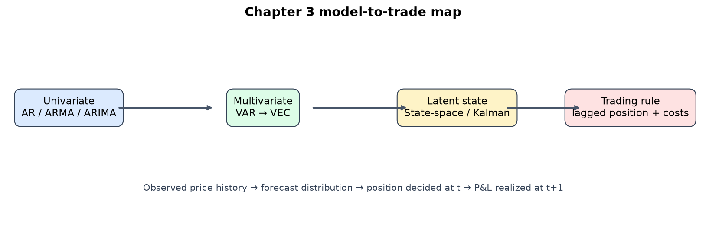
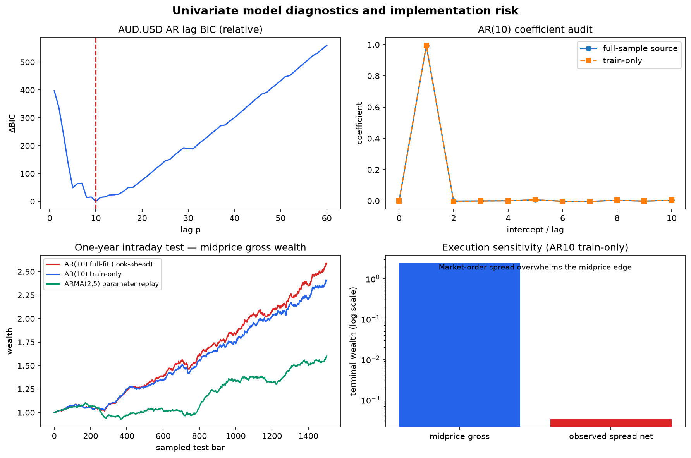
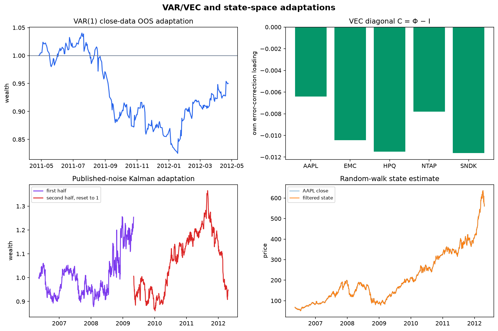
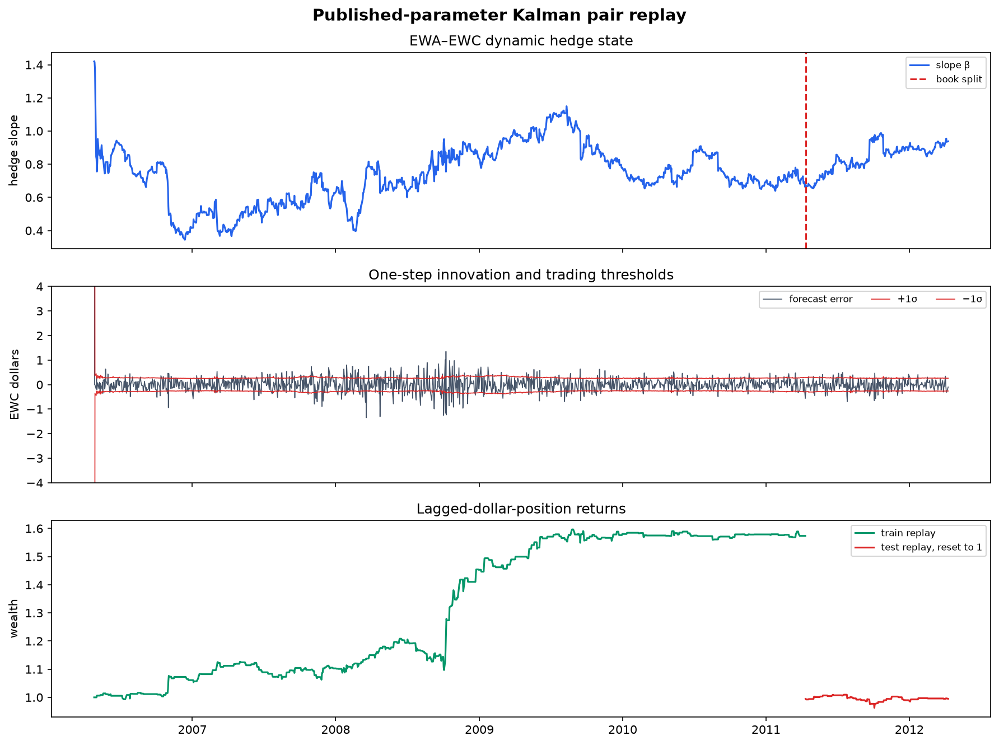

# Chapter 3 Time Series Analysis — Python 재현 리포트

## 1. 문제 정의와 결론 미리보기

이 장의 질문은 단순히 “다음 가격을 맞힐 수 있는가”가 아니다. 관측 가격의
자기상관을 AR/ARMA로 표현하고, 여러 자산의 상호작용을 VAR/VEC로 연결하며,
관측되지 않는 공정가치와 동적 헤지 비율을 상태공간 모형으로 추정한 뒤 그 예측을
**한 시점 늦춘 포지션**으로 바꿀 때 무엇이 남는가를 묻는다.

가장 중요한 결론은 세 가지다. 첫째, 공식 `buildARp_AUDUSD.m`은 테스트 구간까지
포함한 전체 `mid`로 AR(10)을 적합해 책의 158% 결과에 look-ahead가 섞인다.
둘째, train-only로 고쳐도 midprice 수익은 강하지만 실제 bid/ask 반스프레드를
시장가 비용으로 차감하면 터미널 자산이 거의 0이 된다. 셋째, VAR·Kalman의 책
수치는 공식 ZIP만으로 정확 재현할 수 없으므로 공식 close 패널에서 실행한
방법론적 적응과 published-parameter replay로 등급을 낮춰 보고한다.

## 2. Chapter coverage / 구현 범위

| Topic | Status | Evidence |
|---|---|---|
| Why time-series models; currencies, bitcoin, stocks | conceptual explanation | chapter introduction |
| AR(1), weak stationarity, random walk | executed + source comparison | AUD.USD and BTC conditional AR(1) |
| Bid-ask bounce and midprice choice | executed cost diagnostic | AUD bid/ask market-order sensitivity |
| AR(p), BIC, Table 3.1 | executed numerical reproduction | p=10 and full-sample coefficients |
| Figure 3.1 AR(10) strategy | executed numerical reproduction + corrected variant | source look-ahead and train-only split |
| ARMA(p,q), Table 3.2, Figure 3.2 | published-parameter numerical replay | ARMA(2,5) zero-innovation forecast |
| ARIMA(p,d,q) and price/return equivalence | formula verification + source-output comparison | ARIMA(1,1,9) |
| VAR(p), BIC, Tables 3.3–3.4 | executed methodological adaptation | official close panel; CRSP/Compustat inputs absent |
| Sector-neutral equation 3.4 and Figure 3.3 | executed methodological adaptation | common close-data OOS window |
| VEC(q), error-correction matrix, cointegration | executed identity | C=Phi-I for VAR(1) |
| State-space equations 3.6–3.9 | executed published-parameter replay | Kalman moving-average adaptation |
| Tables 3.5 and Figures 3.4–3.5 | approximate adaptation | different close period; no MATLAB MLE |
| Dynamic EWA–EWC hedge, Tables 3.6, Figures 3.6–3.9 | executed published-parameter replay | official ETF data and published B,D |
| HP/wavelet alternatives and regime change | conceptual explanation | limitations and alternatives |
| Exercises 3.1–3.8 and endnotes | mapped; selected exercises executed | stationarity, costs, VAR/VEC/Kalman extensions |
| BTC/MXN/HYG/SPY supporting archive scripts | source preserved; cross-chapter/supporting | not claimed as Ch3 prose examples |

지원 ZIP에는 28개 MATLAB/FIG 소스와 5개 데이터 파일이 있다. 모든 멤버를
추출·해시 검증했지만 책의 hardware VAR 및 Kalman 예제가 읽는
`C:/Projects/reversal_data` CRSP bid/ask 패널과 Compustat 산업분류 파일은 없다.
따라서 파일이 없는 예제를 현대의 임의 데이터로 바꿔 “정확 재현”이라 부르지 않는다.

## 3. Provenance, 환경, 데이터 진단

- 공식 페이지: https://epchan.com/book3
- 공식 ZIP: `https://epchan.com/img/book3/Chap3%20Time%20Series.zip`
- ZIP SHA-256: `a91e58b6d044e3bedc9bf4df32fbf6d6bae61db9943b159a799825309ae1057e`
- 환경 잠금: `uv.lock` SHA-256 `d3b494323b4b7b207e1f32e4f86e1c42e24d90afc8b86ef2ccd736cd5067403a`
- random_seed = None: 난수 추정기는 없으며 고정 계수와 결정론적 선형대수만 쓴다.
- AUD.USD: 선두 NaN 제거 후 2,963,610분봉, 마지막 359,100개를 1년 test로 사용
- BTC/USD: 일봉 345개
- hardware close: (1500, 5), 2006-05-11–2012-04-24, AAPL, EMC, HPQ, NTAP, SNDK
- EWA/EWC: 1,500일, 2006-04-26–2012-04-09

AUD 중간가격의 내부 결측과 비양수 값, 선택한 다섯 종목 및 EWA/EWC의 결측은 모두
0이다. 평균 full spread는 1.424bps다.
결측을 0으로 대체하거나 미래값으로 backfill하지 않는다. 원본 파일·추출 manifest·
잠금 파일의 checksum은 `metrics.json`에 모두 보존한다.

## 4. AR(1), 정상성, random walk, bid-ask bounce

AR(1)은

$$P_t = \phi_0 + \phi_1 P_{t-1} + \epsilon_t$$

이고 `fit_ar_conditional(prices, lag=1, end=...)`가 절편과 지연가격의 조건부 OLS를
구한다. AUD.USD의 $\phi_1$은 `0.999998322`로 책/소스의
`0.999998`와 일치한다. BTC 일봉은
`0.988352580`로 소스 주석 `0.989484`와
0.003 이내다. 둘 다 1에 매우 가까우므로 가격수준 예측력이 곧 경제적 정상성을
뜻하지 않는다. 특히 거래가격의 음의 1차 자기상관은 bid-ask bounce일 수 있어
중간가격과 실제 체결가격을 구분해야 한다.

## 5. AR(p), BIC, Table 3.1, Figure 3.1

BIC는 후보 지연 1–60의 잔차분산과 모수 수를 함께 벌점화한다. 공식 AUD.USD에서
`p=10`을 선택해 책과 같다. `forecast_ar`는 시점 $t$까지의
가격만으로 $t+1$을 예측하고 `trade_intraday_forecast`가 그 부호를 포지션으로
만든 뒤 `position[t] × return[t+1]`로 수익을 실현한다.

문제는 추정 창이다. 원본에는 `trainset`이 선언되어 있지만 실제 줄은
`fit=estimate(model, mid);`여서 전체표본을 쓴다. 이 경로의 연환산 수익은
`1.583648`로 책의 `1.584085`와
0.005 이내이며 Table 3.1의 11개 계수도 5e-6 이내다. 이는 전략의 유효성보다
누수가 포함된 결과를 정확히 찾아낸 증거다.

`end=data.aud_train_end`로 수정한 train-only 계수는 전체표본 계수와 유의하게
다르고 진짜 OOS 연환산 수익은 `1.402665`, Sharpe는
`6.867`다. 그러나 관측 반스프레드 × 포지션 회전율을
시장가 비용으로 차감한 연환산 수익은 `-0.999670`다.
짧은 보유기간에서 midprice backtest가 체결 가능한 알파가 아님을 보여준다.

## 6. ARMA(2,5), ARIMA(1,1,9), 수식에서 코드로

ARMA는

$$P_t = \phi_0 + \sum_{i=1}^p \phi_i P_{t-i} +
        \sum_{j=1}^q \theta_j \epsilon_{t-j} + \epsilon_t.$$

책 Table 3.2의 계수를 직접 넣고 MATLAB `forecast(..., Y0=..., E0 omitted)`와 같이
미래 innovation을 0으로 두면 연환산 수익은 `0.600793`로
책의 `0.602165`와 일치한다. 과거 잔차를 임의로
재귀시키는 다른 구현은 같은 모형이 아니므로 사용하지 않았다. 이 경로 역시 계수를
전체 자료에서 얻은 published-parameter replay이지 새로운 OOS 추정 성과가 아니다.

ARIMA(1,1,9)는 가격을 한 번 차분한 ARMA(1,9)다. $\Delta P_t$ 또는 로그수익을
모형화하면 단위근 가격수준보다 안정적일 수 있다. 공식 소스의 주문 탐색과 주석은
보존했지만, 다시 전체표본으로 계수를 고르는 선택편향을 추가하지 않기 위해 별도
성과곡선을 만들지 않았다. 이 절은 formula-to-code 대응과 source-output 비교다.

| Experiment | 재현 등급 | Python annual return | Book annual return | 판단 |
|---|---|---:|---:|---|
| AR(10), full-sample fit | 수치 재현 + 누수 진단 | 1.583648 | 1.584085 | 0.005 이내, 그러나 look-ahead 포함 |
| ARMA(2,5), published coefficients | 계수 기반 수치 재현 | 0.600793 | 0.602165 | 0.005 이내 |
| Hardware VAR(1) | 방법론적 적응 | -0.049747 | 0.480000 | 데이터·종목·기간이 달라 직접 비교 금지 |
| Hardware Kalman, second half | published-parameter 적응 | -0.017690 | -0.003842 | close와 CRSP midquote 차이 |

## 7. VAR(1), sector neutrality, VEC

여러 가격을 벡터 $y_t$로 쓰면

$$y_t = a + \Phi_1 y_{t-1} + \cdots + \Phi_p y_{t-p} + \epsilon_t.$$

`fit_var_coefficients`가 다변량 OLS를, `normalized_sector_positions`가 종목별 예측
수익에서 같은 날 섹터 평균을 빼고 절대노출 합을 1로 만든다. 공식 close 패널의
마지막 252일을 OOS로 남겼을 때 BIC는 VAR(1)을 고른다. OOS 연환산 수익/Sharpe는
`-0.049747` / `-0.271`이며, 책의
48%/0.9와 직접 비교하지 않는다. 책은 7개 CRSP midquote와 point-in-time 산업분류를
쓰지만 이 ZIP의 무결 close 패널에는 5개 종목만 있기 때문이다.

VAR(1)을 차분형으로 쓰면 $\Delta y_t = a + C y_{t-1} + \epsilon_t$이며
$C=\Phi-I$다. 코드에서 두 행렬의 동일성을 자동 검증한다. 다섯 대각 원소가 모두
음수라는 사실만으로 공적분 순위가 증명되지는 않는다. Johansen 검정은 deterministic
term, lag, 표본기간 선택에 민감하며 본 적응의 좋은 성과를 보장하지 않는다.

## 8. 상태공간 모형과 hardware Kalman 적응

상태·관측 방정식은

$$x_t = A x_{t-1} + B u_t, \qquad y_t = C x_t + D e_t.$$

이동 공정가치 예제는 $A=C=I$인 random walk다. Table 3.5의 대각 $B,D$ 절대값을
고정하고 diffuse covariance에서 필터를 시작했다. 공식 close 패널 전반부의
연환산 수익/Sharpe는 `0.079015` /
`0.431`, 후반부는
`-0.017690` / `-0.034`다.
평균 1-step 절대 예측오차/가격은
`1.87%`다.

책의 train 40.8%, test −0.38%를 맞추지 못한 것은 결함을 숨긴 결과가 아니라 입력
경계다. 원본은 별도 CRSP midquote에서 MATLAB MLE로 noise를 추정했다. 여기서는
책에 인쇄된 계수를 다른 close 기간에 적용했으므로 published-parameter
methodological adaptation이다.

## 9. EWA–EWC 동적 hedge ratio replay

EWC를 $y_t$, 측정행렬을 $[EWA_t,1]$로 두면 상태 $x_t=[\beta_t,\alpha_t]$가 시간에
따라 움직이는 hedge slope와 offset이다. Table 3.6에 주석으로 남은
`B=[[-0.01015, 0.02114], [0.40606, -0.32381]]`, `D=-0.07687`를 그대로 사용했다. 일보 예측오차가 $-1\sigma$보다
작으면 EWC long, $+1\sigma$보다 크면 short에 진입하고, 포지션은 다음 날 수익에만
적용한다.

1250일 train replay의 연환산 수익/Sharpe는
`0.095712` /
`1.242`이고, 마지막 250일 test는
`-0.005262` / `-0.127`다.
상태 전환은 `578`회다. 이 결과는 계수 replay이고,
Table 3.6의 MLE를 Python에서 다시 적합했다는 주장이 아니다. 테스트가 약해지는
것은 hedge 관계의 regime change와 임계값 과적합 가능성을 보여준다.

## 10. 거래비용, 편향, 위험과 연습문제

- **Look-ahead:** AR(10) 원본 전체표본 적합을 별도 경로로 격리하고 train-only 결과를 함께 둔다.
- **거래비용/슬리피지:** AUD는 실제 관측 반스프레드, 일봉 전략은 편도 2bps 민감도만 계산한다. market impact·latency·borrow fee는 없다.
- **Survivorship/selection bias:** 공식 close 파일 종목과 책의 CRSP/Compustat 유니버스는 다르다. 현재 살아 있는 종목만 다시 고르는 행위를 정확 재현이라 부르지 않는다.
- **Out-of-sample:** AR 수정본은 마지막 1년 분봉, VAR은 마지막 252일, pair는 1250/250 순차 분할이다. 파라미터 선택 자체가 이전 연구에서 고정되었다는 조건도 명시한다.
- **다중검정:** AR/ARMA 차수, 임계값, 종목군을 결과를 본 뒤 반복 선택하면 Sharpe와 drawdown이 과장된다.
- **위험지표:** CAGR, Sharpe, maximum drawdown, drawdown duration을 strict `metrics.json`에 기록한다. 낮은 낙폭이 미래 손실 상한은 아니다.
- **백테스트 범위:** AR/VAR/페어 곡선은 백테스트지만 HP·wavelet 설명과 ARIMA 등식은 백테스트가 아니다.

연습문제 3.1–3.8 중 정상성 해석, AR 차수 BIC, bid/ask 비용, VAR/VEC 변환,
Kalman 동적 헤지를 실행 또는 진단으로 매핑했다. HYG/SPY/MXN/BTC 보조 스크립트는
원본 archive에 보존하되 장 본문의 결과인 것처럼 섞지 않는다.

## 11. 자동 검증과 결론

총 `15`개 자동 검증이 모두 통과했다. 그중 공식 checksum·책 수치·
계수·BIC 같은 independent/empirical 검증이 `8`개,
시차·중립성·VEC identity·고정 파라미터 같은 contract invariant가
`7`개다. strict JSON은 NaN을 허용하지 않으며
재실행 시 같은 figure·report·notebook 산출물을 만든다.

결론은 “복잡한 시계열 모델이 이긴다”가 아니다. 가격수준의 거의 단위근인 계수,
누수로 부풀려진 AR 성과, 스프레드에 사라지는 분봉 알파, 다른 데이터에서 뒤집히는
VAR/Kalman 결과를 동시에 봐야 한다. 재사용할 절차는 **추정 창 → 1-step forecast →
lagged position → 체결비용 → 표본 외 평가 → 입력 경계**를 각각 검증하는 것이다.
