# 인공지능 기법 — 해설판

> **이 문서는 Ernest P. Chan의 _Machine Trading_ (2016) 제4장 「Artificial Intelligence Techniques」 전체를 담은 한국어 해설판입니다.** 원문을 요약하거나 건너뛰지 않고, 모든 문단·수식·코드·표·연습문제·주석을 그대로 살리되, 어려운 대목은 "왜 그런가"를 곁들여 쉬운 한국어로 풀어 설명합니다. 이 장은 단계적 회귀부터 회귀·분류 트리, 배깅·랜덤 포레스트·부스팅, 서포트 벡터 머신, 은닉 마르코프 모델, 신경망까지 — 실무 트레이더가 곧바로 써 볼 수 있는 머신러닝 기법의 도구 상자를 하나씩 열어 보이는 자리입니다. 저자는 이 기법들을 SPY라는 하나의 친숙한 예제에 반복 적용하여, 서로 다른 기법이 같은 문제에서 어떻게 다르게 작동하는지를 나란히 비교합니다.

---

## 들어가며 — 이론물리학자에서 실험물리학자로

이 책에 실린 대부분의 거래 전략은 **이론물리학자(theoretical physicist)** 가 일하는 방식을 따라 만들어집니다. 이론물리학자는 가설을 세우고, 그 가설을 검증할 실험을 설계하고, 실험 결과로 가설을 확인합니다. 우리 정량 거래자도 똑같습니다. 시장에 존재할 법한 어떤 비효율성에 대한 직감을 품고(예컨대 개인투자자들의 군집 행동이 주가 모멘텀을 낳는다는 식으로), 그 비효율을 파고들 전략을 궁리한 뒤, 데이터로 그 전략이 실제로 통하는지를 확인합니다.

그런데 **인공지능(AI, artificial intelligence)**, 즉 머신러닝 기법을 쓰는 방식은 이보다는 **실험물리학자(experimental physicist)** 의 태도에 더 가깝습니다. 실험물리학자는 "무엇이 가장 중요한 요인인가"에 대한 선입견을 갖지 않은 채, 되도록 많은 것을 훑어보며 규칙을 발견해 냅니다. 우리도 시장을 움직이는 가장 중요한 요인이 무엇인지 미리 알지 못하므로, 효율적인 알고리즘의 힘을 빌려 가능한 한 많은 요인과 거래 규칙을 탐색해야 합니다.

금융 실무자들은 이런 방법론을 흔히 **데이터 마이닝(data mining)** 이라 부르며 다소 경멸조로 취급합니다. 그 경멸에는 나름의 근거가 있습니다. 금융 데이터는 (틱 데이터를 쓰지 않는 한) 양이 상당히 제한적일 뿐 아니라, 통계적 의미에서 **정상성(stationarity)** 이 부족합니다. 즉 수익률의 확률분포가 영원히 일정하게 유지되지 않습니다. 이런 데이터에 머신러닝 알고리즘을 그냥 풀어놓으면, 과거 어느 구간에서는 기막히게 잘 맞았지만 앞으로는 처참하게 실패하는 규칙을 찾아내기가 너무나 쉽습니다.

물론 사람의 지능으로 손수 빚은 거래 모델도 똑같이 미래에 무너질 수 있습니다. 다만 사람이 만든 모델은 "왜 이제 안 통하는가"를 이따금 이해하고 손을 쓸 수 있는 반면, 머신러닝이 학습한 규칙에는 그런 행운이 없습니다. 왜 망가졌는지조차 알기 어렵다는 것, 이것이 AI 기법을 향한 저자의 첫 번째 경계심입니다.

이 대목은 이 장 전체를 관통하는 긴장을 미리 요약합니다. AI는 사람이 미처 떠올리지 못한 패턴을 발견해 줄 수 있다는 매력과, 그 패턴이 진짜인지 우연인지 사람이 판별하기 어렵다는 위험을 동시에 안고 있습니다. 그래서 이 장의 실전 기법 대부분은 "표본 외 성능을 지키는 장치" — 학습셋과 테스트셋 분리, 교차 검증, 배깅 — 를 어떻게 끼워 넣느냐에 초점을 맞춥니다. 화려한 알고리즘 자체보다, 그것이 미래에도 통하도록 붙들어 매는 안전장치가 실전에서는 더 중요하기 때문입니다.

### 그럼에도 AI를 버리지 않는 이유

이렇게 신중한 태도를 견지하면서도, 저자는 이 분야가 무섭게 빠르게 발전하고 있음을 잊지 말라고 당부합니다. 실무자들은 앞서 말한 **과적합 편향(overfitting bias)**, 곧 과거에만 잘 맞고 미래엔 어긋나는 성향을 피하도록 특별히 설계된 기법들을 계속 내놓고 있습니다. **신경망(neural networks)** 만 해도 불과 몇 년 전까지는 비실용적이라며 외면받았지만, 2006년의 한 돌파구(Allen, 2015)가 이 분야에 다시 불을 지폈고, 지금은 신경망 전문가가 Google과 Facebook 같은 곳에서 앞다투어 모셔 가는 인재가 되었습니다.

트레이딩에 더 와닿는 일화도 있습니다. 전설적인 퀀트 펀드 Renaissance Technologies의 한 고위 관리자가 언론에 이렇게 털어놓은 적이 있습니다 — 자신들의 가장 수익성 높은 전략 중 하나는 합리적인 금융적 정당성이 전혀 없는 전략이었다고. 바로 그 "설명 불가능함" 덕분에 그 전략은 다른 트레이더들에게 차익거래로 갉아먹히지 않고 오래 살아남을 수 있었습니다. 이것이야말로 AI 기법이 우리에게 건네줄 수 있는 종류의 규칙입니다.

AI가 유용한 또 다른 상황이 있습니다. 누군가 기본적 지표든 기술적 지표든 한 뭉치를 건넸는데, 그걸 어떻게 써야 할지 감도 직관도 없을 때입니다. 그럴 땐 그냥 AI에게 던져 주는 것이 가장 손쉬운 길이고, 그 결과가 도리어 그 지표들에 대한 인간의 이해를 넓혀 줄 수도 있습니다. 그러니 트레이딩 아이디어를 우리의 머리와 직관만이 독점한다고 넘겨짚지 말고, AI가 우리를 놀라게 하도록 내버려 둡시다.

### 이 장에서 쓰는 도구와 모델의 지형도

이 장에서 다루는 머신러닝 기법들은 상당히 기본적이고 널리 알려진 것들입니다. 그래서 이미 상용 소프트웨어 패키지 안에 잘 포장되어 있어, 바퀴를 다시 발명하거나 전업 AI 연구자가 될 생각이 없는 트레이더도 손쉽게 꺼내 쓸 수 있습니다. 저자가 시연에 쓰는 도구는 MATLAB의 Statistics and Machine Learning Toolbox와 Neural Network Toolbox이며, 한 대목에서는 Google의 Kevin Murphy 박사가 만든 Bayes Net Toolbox를 씁니다. 다만 R 프로그래머라도 비슷한 패키지를 어렵지 않게 찾을 수 있습니다(Hothorn, 2014).

서로 무관해 보이는 모델들을 잡다하게 늘어놓는 듯 보일 수 있지만, 이들은 여러 기준으로 분류할 수 있습니다.

- **선형 대 비선형** — 단계적 회귀, 회귀 트리, 분류 트리, 서포트 벡터 머신, 은닉 마르코프 모델은 선형 모델(적어도 구간별 선형 모델)로 볼 수 있는 반면, 신경망은 명시적으로 비선형 모델입니다.
- **연속 대 이산** — 단계적 회귀·회귀 트리·신경망은 대체로 연속적인 **반응 변수(response variable)** 를 예측하려 하고, 분류 트리와 서포트 벡터 머신은 이산적인 반응을 예측합니다. (은닉 마르코프 모델은 연속·이산 둘 다 다룰 수 있으나, 이 장의 예제는 이산입니다.)
- **지도 대 비지도** — 은닉 마르코프 모델을 뺀 나머지는 모두 데이터에 관측 가능한 클래스를 붙이는 **지도 학습(supervised training)** 을 쓰고, 은닉 마르코프 모델만 관측되지 않는 클래스를 붙이는 **비지도 학습(unsupervised training)** 을 씁니다.

이 모든 모델은 몇 가지 공통 기법으로 개선할 수 있습니다. 이 다섯 가지는 이 장의 뼈대이니 미리 이름만 익혀 두면 좋습니다.

1. **교차 검증(cross validation)** — 하나의 학습 데이터셋을 여러 부분집합으로 쪼개 많은 모델을 학습시킨 뒤, **표본 외(out-of-sample)** 성능이 가장 좋은 하나만 고릅니다.
2. **배깅(bagging)** — 원래 학습셋을 복원추출로 재표본추출해 인위적으로 여러 학습셋을 만들고, 각각에서 학습한 모델의 예측을 평균합니다.
3. **무작위 부분공간(random subspace)** — 배깅처럼 데이터를 표본추출하는 대신, 각 모델마다 **예측 변수(predictor)** 를 표본추출합니다.
4. **랜덤 포레스트(random forest)** — 배깅과 무작위 부분공간의 잡종으로, 특히 회귀·분류 트리를 위해 설계되었습니다.
5. **부스팅(boosting)** — 앞의 넷이 과적합을 줄이려는 것과 달리, 학습 알고리즘이 과거의 예측 오류에 집중해 그것을 개선하도록 밀어붙입니다.

앞의 네 기법은 모두 학습셋 과적합을 줄이는 것이 목표이고, 다섯 번째 부스팅은 결이 조금 다릅니다.

### 하나의 예제로 모든 기법을 겨루게 하다

이 모델들과 기법들을 설명하기 위해, 저자는 주로 단 하나의 단순한 예제에 집중합니다. 바로 ETF **SPY** 의 다음 날 수익률을, 다양한 룩백(과거 조회 기간)의 과거 수익률로 예측하는 문제입니다. 매번 새 데이터셋을 이해하느라 힘 빼지 않고도, 서로 다른 모델과 기법의 효과와 미묘한 차이를 나란히 견줄 수 있기 때문입니다. 물론 SPY가 AI 기법에 가장 유리한 상품이라는 뜻은 아닙니다. 여러분이 아끼는 시장에 직접 시도해 보길 권합니다. 실제로 이 기법들 대부분은 예측 변수가 많을수록 더 잘 작동하는데, (서로 상관이 낮은) 기술적 변수보다 기본적 변수를 더 쉽게 많이 구할 수 있습니다. 그래서 이 장 끝에는 수익률 예측에 유용한 **기본적 주식 요인(fundamental factor)** 을 골라내는 중요한 예제 하나를 덧붙입니다.

이 책은 금융 이론서도, 머신러닝 이론서도 아니라 실전 트레이딩 책이므로, 여기 소개하는 알고리즘의 복잡한 세부에는 오래 머물지 않습니다. AI 기반 전략이 **블랙박스(black-box)** 라는 평판을 얻은 데는 그럴 만한 이유가 있습니다.<sup>1</sup> 설령 모든 AI 학습 알고리즘의 수학적 정당성을 완벽히 이해한들, 그 알고리즘이 어떤 특정 순간에 왜 그 신호를 냈는지를 직관적으로 이해하는 데는 한 발짝도 더 가까워지지 않기 때문입니다.

---

## 단계적 회귀 (Stepwise Regression) — 알고리즘이 스스로 변수를 고르게 하다

AI의 핵심 효용 중 하나는, 알고리즘이 **종속변수(반응변수)** 를 예측하는 데 가장 중요한 **독립변수(예측변수)** 를 스스로 골라낸다는 점입니다. 이때 예측변수와 반응변수 사이의 함수 관계를 규정하는 모델이 바탕에 깔립니다. 예를 들어 SPY의 미래 1일 수익률을 예측하려는데, 후보 예측변수로 직전 1일 수익률, 그 종목의 스토캐스틱 오실레이터(기술적 분석가라면), P/E 비율(기본적 분석가라면) 등을 떠올릴 수 있습니다. 어느 것이 중요한지 대개 모르니, 부엌 싱크대만 빼고 다 던져 넣는 심정으로 알고리즘에 몽땅 넣고 최선을 기대합니다. 알고리즘은 이 중 쓸 만한 것을 골라내는 **특성 선택(feature selection)** 을 수행합니다.

예측변수와 반응변수를 잇는 모델이 꼭 복잡할 필요는 없습니다. 실제로 우리는 가장 단순한 모델 중 하나인 **선형 회귀(linear regression)** 로 AI의 작동 방식을 설명하겠습니다. 특성 선택과 선형 회귀를 결혼시킨 결과물이 바로 단계적 회귀입니다.

### 먼저 평범한 다중 회귀부터 — 벤치마크 만들기

SPY 수익률 예측 예제를 봅시다. 기술적·기본적 예측변수를 섞는 대신, 다양한 룩백(1일·2일·5일·20일)의 과거 수익률만 예측변수로 씁니다. 평범한 **다중 회귀(multiple regression)** 라면 미래 1일 수익률을 이 모든 예측변수에 동시에 적합시켜, 모든 예측변수의 회귀계수(그리고 y절편)를 한꺼번에 구합니다. MATLAB에서는 `fitlm` 함수로 이렇게 합니다.

```matlab
model_train = fitlm([ret1(trainset) ret2(trainset) ret5(trainset) ...
                     ret20(trainset)], retFut1(trainset), 'linear')
```

여기서 `ret1, ret2, …, ret20`은 각 룩백의 과거 수익률을 담은 T × 1 배열이고, `retFut1`은 미래 1일 수익률을 담은 T × 1 배열입니다. `fitlm`은 기본적으로 상수항이 있다고 가정하므로, 예측변수에 1로 채운 열을 따로 넣을 필요가 없습니다. 매개변수 `'linear'`는 독립변수들의 곱을 예측변수로 쓰지 않겠다는 뜻입니다.

이 회귀 모델을 적합하는 데 전체 데이터를 다 써서는 안 됩니다. 데이터의 후반부는 **테스트셋(test set)** 으로 남겨 둡니다. 여기서 `trainset`은 데이터 전반부의 인덱스를 담은 배열입니다. **학습셋(training set)** 과 테스트셋을 이렇게 나누는 것은 어떤 거래 모델을 만들 때든 늘 지키는 절차이지만, 머신러닝 모델은 과적합 성향이 유독 강하기 때문에 특히 중요합니다. 학습셋에서 이 모델이 어떻게 도는지 건전성 확인 삼아 보려면, 모델과 학습 데이터에 `predict` 함수를 적용합니다.

```matlab
retPred1 = predict(model, [ret1(trainset) ret2(trainset) ...
                           ret5(trainset) ret20(trainset)]);
```

`retPred1`은 `retFut1`과 비슷하되, 실제 미래 1일 수익률 대신 예측된 미래 1일 수익률을 담습니다. 이제 `retPred1`이 양수면 SPY를 \$1어치 매수하고, 음수면 \$1어치 공매도한 뒤 딱 하루만 보유하는 단순 전략을 만들어 봅니다.

```matlab
positions(retPred1 > 0) = 1;
positions(retPred1 < 0) = -1;
```

이렇게 하면 **연평균 성장률(CAGR, compound annual growth rate)** 은 34.3퍼센트, **샤프 비율(Sharpe ratio)** 은 1.4가 나옵니다. 즉 이 모델은 2004년 12월 22일부터 2009년 9월 15일까지의 학습 데이터에 꽤 잘 맞습니다. 여기까지는 좋습니다. 그런데 2009년 9월 16일부터 2014년 6월 2일까지의 테스트 데이터에 같은 절차를 반복하면,

```matlab
retPred1 = predict(model, [ret1(testset) ret2(testset) ret5(testset) ...
                           ret20(testset)]);
```

같은 단순 전략을 테스트셋에 적용했을 때 CAGR은 0.4퍼센트, 샤프 비율은 0.1로 곤두박질칩니다. 이 모델<sup>2</sup>은 테스트셋에서 무작위와 다를 바 없습니다. 바로 이 초라한 성적이, 단계적 회귀가 넘어서야 할 손쉬운 벤치마크가 됩니다.

### 단계적 회귀는 무엇이 다른가

단계적 회귀가 다중 회귀와 다른 점은, 처음부터 모든 변수를 쓰지 않고 단 하나의 "최선" 예측변수에서 출발한다는 것입니다. 이 최선을 고르는 기준으로는 제곱오차합(MATLAB `stepwiselm`의 기본값), **아카이케 정보 기준(AIC)**, 또는 **베이지안 정보 기준(BIC)** 같은 흔한 적합도 척도를 씁니다. 그다음 알고리즘은 적합도가 더 좋아지는 한 예측변수를 한 번에 하나씩 **추가**합니다. 그러다 개선이 멈추면 이번엔 방향을 뒤집어, 예측변수를 한 번에 하나씩 **제거**하며 역시 개선이 멈출 때까지 진행합니다. 넣었다 뺐다 하며 정말 필요한 변수만 추리는 셈입니다.

여기서 AIC와 BIC라는 기준이 왜 중요한지 잠깐 짚고 갑시다. 단순히 오차를 줄이는 것만 목표로 삼으면, 변수를 많이 넣을수록 표본 내 오차는 무조건 줄어듭니다. 문제는 그렇게 늘어난 변수 상당수가 그저 학습셋의 잡음을 외운 것에 불과하다는 점입니다. AIC와 BIC는 오차를 줄이는 보상과 변수를 늘리는 벌점을 저울질하여, "변수 하나를 더 넣어 얻는 이득이 그 복잡함의 대가를 넘어설 때만" 그 변수를 받아들이도록 만듭니다. 단계적 회귀가 변수를 무작정 늘리지 않고 절제하는 힘이 바로 여기서 나옵니다. 실제로 MATLAB에서 다중 회귀를 단계적 회귀로 바꾸는 일은 함수 이름을 `lmfit`에서 `stepwiselm`으로 바꾸는 것만큼 간단합니다.

```matlab
model = stepwiselm([ret1(trainset) ret2(trainset) ret5(trainset) ...
                    ret20(trainset)], retFut1(trainset), 'Upper', 'linear')
```

입력 이름/값 쌍인 `'Upper'`와 그 값 `'linear'`는, 예측변수로 독립변수들의 곱이 아니라 그 선형 함수만 쓰겠다는 뜻입니다.

### 단 하나의 변수가 만든 반전

알고리즘은 단 하나의 예측변수, `ret2`(직전 2일 수익률)만 골랐습니다.<sup>3</sup> 그런데 이 하나가 표본 내 CAGR을 34.3퍼센트에서 43.5퍼센트로, 샤프 비율을 1.4에서 1.6으로 끌어올립니다. 이것은 자못 이례적입니다. 보통은 변수가 더 적은 단순한 모델이 표본 내에서 복잡한 모델보다 못한 성적을 내기 마련이니까요. 그러나 더 중요한 것은 표본 외 성적입니다. 단계적 회귀는 표본 외 CAGR을 0.4퍼센트에서 10.6퍼센트로, 샤프 비율을 0.1에서 0.7로 올려, 모델이 통계적 유의성(그 기준은 샤프 비율 1입니다)에 바짝 다가섰음을 보여 줍니다.

그림 4.1의 **자산 곡선(equity curve)** 을 보면 성과 대부분이 2009\~2011년의 이른 구간에서 나왔음을 알 수 있는데, 이것이 알고리즘의 잘못은 아닙니다. 개선하려면 매 단계마다 최신 데이터를 학습셋에 더해 프로그램을 재학습하면 됩니다. 또 모델은 수익률의 크기까지 예측하지만 우리는 부호만 신호로 썼습니다. 크기를 활용하는 한 방법은 크기가 어떤 임계값을 넘을 때만 사고파는 것이고, 또 하나는 예측 크기에 비례하는 금액만큼 사고파는 것입니다. 이런 변형들은 모두 연습문제로 남깁니다.

마지막으로 한 가지 세부를 놓치지 맙시다. `ret2`의 회귀계수는 **음수**입니다. 이는 이 모델이 미래 1일 수익률이 과거 2일 수익률로부터 **되돌림(reversion)**, 즉 평균회귀를 보일 것으로 예측한다는 뜻입니다. 모델이 AI로 만들어졌다고 해서, 그것으로 시장에 대한 우리 자신의 이해를 넓히지 못할 이유는 없습니다.

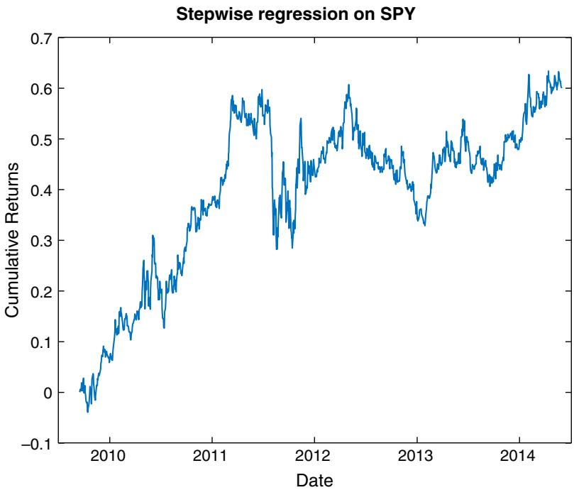
그림 4.1 SPY에 대한 단계적 회귀의 표본 외 성과

---

## 회귀 트리 (Regression Tree) — 데이터를 스무고개처럼 쪼개다

**회귀 트리(regression tree)** — 그리고 "내일은 상승일일까 하락일일까?" 같은 이산 종속변수를 다루는 형제 격인 **분류 트리(classification tree)** — 도 중요한 예측변수를 골라내는 또 하나의 방법입니다. 다만 단계적 회귀와는 결정적으로 다릅니다. 단계적 회귀는 뽑아낸 예측변수들을 다중 회귀처럼 모든 데이터에 한꺼번에 적용하지만, 회귀 트리는 **계층적(hierarchical)** 으로 접근합니다. 사실 회귀 트리 알고리즘은 선형 회귀와는 거의 관계가 없습니다.

작동 방식은 이렇습니다. 알고리즘이 어떤 기준으로 "최선"의 예측변수를 고르면, 그 변수에 부등식 조건(예: "직전 2일 수익률 < 1.5%")을 걸어 데이터를 두 덩어리로 나눕니다. 원래 데이터가 **부모 노드(parent node)**, 갈라진 두 덩어리가 각각 **자식 노드(child node)** 입니다. 그다음 알고리즘은 중지 조건이 충족될 때까지 각 자식 노드에 똑같은 일을 반복합니다. 마치 스무고개에서 "예/아니오" 질문으로 후보를 좁혀 가는 것과 같습니다.

단계적 회귀와의 근본적 차이를 여기서 잡아 두면 좋습니다. 단계적 회귀는 고른 변수들을 모든 데이터에 **똑같이** 적용합니다 — "ret2의 계수는 어디서나 −0.3" 하는 식으로 하나의 규칙이 전체를 지배합니다. 반면 회귀 트리는 데이터를 잘게 나눈 뒤 **구역마다 다른 규칙**을 세웁니다. 어떤 구역에서는 ret1이 중요하고 다른 구역에서는 ret2가 중요할 수 있습니다. 이 유연함 덕분에 트리는 시장이 국면마다 다르게 움직이는 비선형 현상을 담아낼 수 있지만, 동시에 데이터를 잘게 쪼갤수록 각 잎에 남는 관측치가 적어져 과적합에 빠지기도 쉽습니다.

각 노드에서 최선의 예측변수를 고르는 기준은 보통 자식 노드 안에서 반응변수의 **분산(variance)** 을 최소화하는 것입니다(Breiman et al., 1984). 한 노드의 분산을 최소화한다는 말은, 실제 반응과 비교한 예측 반응의 **평균제곱오차(MSE, mean squared error)** 를 최소화한다는 말과 같습니다. 왜냐하면 한 노드의 예측 반응이란 다름 아닌 그 노드에 든 반응변수들의 평균이기 때문입니다. 중지 조건은 다음 중 하나라도 벌어지면 충족됩니다.

1. 부모 노드의 분산과 비교해 분산이 더 줄지 않거나,
2. 부모 노드의 관측치 수가 너무 적거나(`MinParentSize`가 입력 매개변수입니다),
3. 어떤 예측변수로 나누어도 관측치가 너무 적은 자식 노드가 생기거나(`MinLeafSize`가 또 다른 입력 매개변수입니다),
4. 최대 노드 수에 도달한 경우입니다(`MaxNumSplits`라는 세 번째 입력 매개변수가 전체 분할 수를 제한합니다).

이 알고리즘은 반복적이라, 같은 예측변수가 여러 자식 노드에서 몇 번이고 다시 쓰일 수 있다는 점에 유의하세요. 트리의 각 **잎(leaf)** — 자식이 없는 자식 노드 — 은 예측변수들에 대한 부등식의 집합으로 요약됩니다(예: "직전 2일 수익률 $< 1.5\%$" 그리고 "직전 1일 수익률 $< -1.4\%$"). 따라서 우리가 원하는 평균 반응(예: 높은 평균 미래 1일 수익률)을 가진 잎들을 골라내면 됩니다. 테스트셋의 어떤 새 데이터가 "높은 미래 수익률 잎"으로 이어지는 부등식을 전부 만족한다면, 우리는 그 데이터도 높은 미래 수익률을 낼 것이라 예측합니다.

### SPY에 회귀 트리 적용하기

단계적 회귀 예제와 똑같은 데이터·예측변수·반응변수(SPY의 미래 1일 수익률)에 회귀 트리를 시도해 봅니다. 프로그램 `rTree.m`은 사실상 `stepwiseLR.m`과 같습니다. `stepwiselm`을 `fitrtree`로 바꾸기만 하면 됩니다.

```matlab
model = fitrtree([ret1(trainset) ret2(trainset) ret5(trainset) ...
                  ret20(trainset)], retFut1(trainset), 'MinLeafSize', 100);
```

여기서 `MinLeafSize`를 100으로 정했지만, 다른 값을 실험해 학습셋에서 무엇이 최적인지 확인해도 됩니다. 다만 일반적으로 과적합을 피하려면 잎 크기가 너무 작아지는 것은 피해야 합니다. 각 자식 노드의 부등식까지 포함해 트리가 어떻게 생겼는지 보려면 모델에 `view` 함수를 적용합니다.

```matlab
view(model, 'mode', 'graph'); % 트리를 시각적으로 보기
```

이렇게 하면 그림 4.2가 나옵니다.

리프 노드 아래의 숫자들을 살펴볼 수 있는데, 이 숫자는 그 잎에 이르는 일련의 부등식 아래에서 반응변수의 **기댓값(expected value)** 을 나타냅니다.

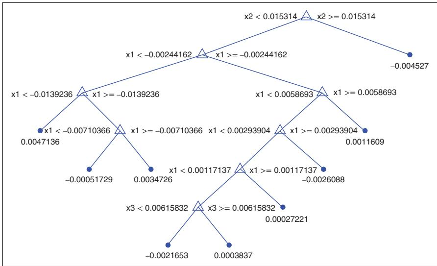
그림 4.2 SPY에 대한 회귀 트리

예를 들어 가장 높은 기댓값(가장 왼쪽 노드의 0.0047136)을 가진 리프 노드를 원한다면, 그에 이르는 조건은 $x2 < 0.015314,\ x1 < -0.00244162,\ x1 < -0.0139236$이며, 이는 곧 ret2 < 1.53% 그리고 ret1 < −1.39%로 풀어 쓸 수 있습니다. 이것 자체가 SPY 매수를 위한 기성품 거래 규칙이 됩니다. 마찬가지로 가장 음의 기댓값(가장 오른쪽 노드의 $-0.004527$)을 가진 리프 노드도 찾을 수 있고, 그에 이르는 단일 부등식은 $\mathrm{ret}2 \ge 1.53\%$로 풀 수 있습니다. 이것은 SPY 공매도 규칙이 됩니다. 두 규칙 모두 단계적 회귀가 낳은 모델과 마찬가지로 **평균회귀적(mean-reverting)** 입니다. 롱 규칙에 따라 종가에 SPY를 사서 하루 보유하고, 숏 규칙에 따라 공매도해 하루 보유하면, 학습셋에서는 CAGR 28.8퍼센트에 샤프 비율 1.5, 테스트셋에서는 CAGR 3.9퍼센트에 샤프 비율 0.5가 나옵니다. 단계적 회귀만큼 좋지는 않고, 그림 4.3의 자산 곡선도 이 평균회귀 모델들이 테스트셋의 전반부에만 통했음을 보여 줍니다.

### 왜 극단의 잎 두 개만 쓰는가 — 과적합의 함정

두 극단의 잎(기대 반응이 가장 큰 것과 가장 작은 것)에만 매달리지 말고, 모든 잎의 기대 반응으로 거래 규칙을 만들면 안 되냐고 물을 수 있습니다. 실제로 해 보면(앞서 `stepwiseLR.m`에서 쓴 `predict` 함수를 그대로 쓰면 됩니다), 표본 내 CAGR은 73퍼센트까지 치솟지만 표본 외 CAGR은 −7.2퍼센트로 추락합니다. 과적합의 전형적인 증상입니다. 하지만 케이크를 먹으면서 동시에 남겨 두는 방법도 있습니다. 이어지는 세 절에서, 실제로 모든 잎을 예측에 쓸 수 있게 해 주는 과적합 억제 기법들을 살펴보겠습니다.

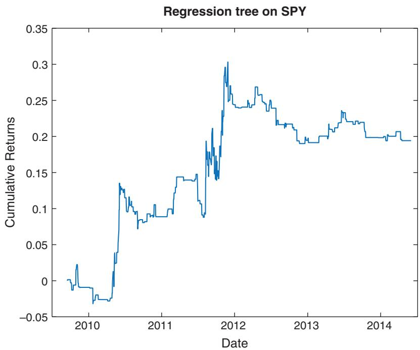
그림 4.3 회귀 트리에 기반한 거래 모델

---

## 교차 검증 (Cross Validation) — 모델을 만들면서 미리 표본 외로 검증하다

**교차 검증(cross validation)** 은 모델 구축 과정 자체에 표본 외 성능 검사를 끼워 넣어 과적합을 줄이는 기법입니다. 방법은 이렇습니다. 학습셋을 대략 같은 크기의 K개 부분집합으로 무작위로 나눕니다. 모델 $i$는 $i$번째 부분집합만 빼고 나머지 전부의 합집합으로 만듭니다. 그런 다음 빼 두었던 $i$번째 부분집합에서 모델 $i$의 예측 정확도를 검사합니다(그림 4.4 참조). 이것을 **교차 검증 정확도(cross-validation accuracy)** 라 하고, 마지막에 이 정확도가 가장 높은 모델을 고릅니다. 시험 범위를 조각조각 나눠, 매번 한 조각을 안 보고 남겨 뒀다가 그 조각으로 실력을 재는 셈입니다.

핵심은, 각 조각을 채점할 때 그 조각은 해당 모델의 학습에 한 번도 쓰이지 않았다는 점입니다. 그래서 이 점수는 진짜 표본 외 성적에 가깝고, 학습셋에 얼마나 잘 외웠는지가 아니라 처음 보는 데이터에 얼마나 잘 일반화하는지를 잽니다. 과적합된 모델은 학습셋에서는 만점을 받아도 이 교차 검증 점수에서는 밑천이 드러나므로, 이 점수로 모델을 고르면 자연스럽게 과적합이 덜한 쪽을 선택하게 됩니다.

앞 절에서 모든 잎을 신호 생성에 쓰던 회귀 트리 모델에 이를 적용해 봅시다. `fitrtree`로 모델을 만들 때 이름/값 쌍 `'CrossVal', 'On'`과 `'KFold', 5`만 더하면 됩니다. 그러면 아래 `model_cv`에 K = 5개의 트리가 담깁니다.

```matlab
model_cv = fitrtree([ret1(trainset) ret2(trainset) ret5(trainset) ...
                     ret20(trainset)], retFut1(trainset), 'MinLeafSize', 100, ...
                     'CrossVal', 'On', 'KFold', 5);
```

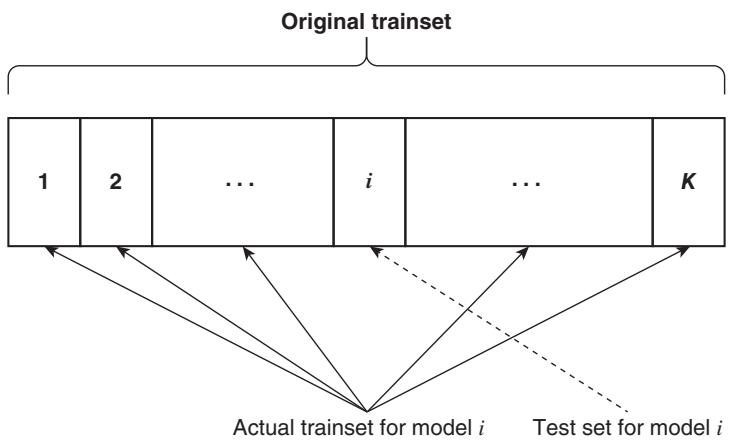
그림 4.4 교차 검증 테스트를 위해 학습셋의 한 부분집합을 남겨 두기

각 트리의 교차 검증 정확도(또는 그 반대 척도인 **손실(loss)**, 곧 예측 반응과 실제 반응 사이의 평균제곱오차)를 구하려면, 이 트리들에 `kfoldLoss` 함수를 적용해 손실이 가장 작은 트리를 고릅니다.

```matlab
L = kfoldLoss(model_cv, 'mode', 'individual'); % 각 폴드에서, 폴드 밖(out-of-fold)
% 데이터로 학습한 트리의 예측 반응에 대한 손실(평균제곱오차)을 구한다.
[~, minLidx] = min(L); % 손실이 최소인, 즉 과적합 오차가 가장 작은 트리를 고른다.
bestTree = model_cv.Trained{minLidx};
```

`bestTree`를 모델 삼아 테스트셋에서 `predict`를 실행하면 CAGR 0.6퍼센트, 샤프 비율 0.11이 나옵니다. 교차 검증을 쓰지 않았던 이전 결과보다는 분명히 낫지만, 극단의 잎 두 개만 골랐을 때만큼은 아닙니다. (이 프로그램을 다른 난수 시드로 돌리면 다른 트리와 다른 CAGR이 나옵니다. 교차 검증이 각 트리에 쓸 학습 데이터 부분집합을 무작위로 고르기 때문입니다.) 이 코드는 `rTree.m`의 일부입니다.

### 왜 K = 10이 아니라 K = 5인가

일부 독자는 MATLAB 기본값인 10 대신 왜 K = 5를 골랐는지 궁금할 것입니다. 이유는 이렇습니다. 2004년 12월 22일부터 2009년 9월 15일까지의 학습셋은 트레이딩 연구로는 그럭저럭 쓸 만한 크기이지만, 머신러닝 기준으로는 상당히 작습니다. 이 학습셋을 10개로 쪼개면 남겨 두는 표본 외 조각이 너무 작아져, 교차 검증 정확도가 큰 통계적 오차에 휘둘립니다. 그러면 뽑힌 "최선"의 트리가 테스트셋에서 딱히 좋으리란 보장이 없습니다. 반대로 K를 2처럼 너무 작게 잡으면, 그중에서 최선을 고를 만큼 학습된 모델이 충분치 않게 됩니다. 5는 이 둘 사이의 타협점입니다.

---

## 배깅 (Bagging) — 데이터를 복제해 여러 모델을 평균 내다

교차 검증에서 우리는 하나의 학습셋에만 있는 통계적 요동 — 테스트셋에서는 되풀이되지 않을 우연한 잡음 — 에 알고리즘이 과적합하지 않도록, 조금씩 다른 학습셋을 제시하는 것이 종종 유익하다는 아이디어를 얻었습니다. **배깅(bagging)** 은 이 주제의 또 다른 변주입니다.

교차 검증처럼 크기 N의 원래 학습셋을 부분집합으로 나누는 대신, 배깅은 원래 학습셋에서 N개의 관측치를 **복원추출(sampling with replacement)** 로 뽑아 원래 학습셋의 복제본(하나의 **백(bag)**)을 만듭니다. 복원추출이므로 어떤 관측치는 복제본에 여러 번 들어가고, 어떤 관측치는 아예 빠집니다(빠진 것들을 **배깅 외 관측치(out-of-bag observations)** 라 부릅니다). 이 과정을 K번 반복해, 각각 원래 크기 N을 갖는 복제본 K개의 **앙상블(ensemble)** 을 만듭니다. 이 과정은 사실상 학습 표본을 불려 주므로 **부트스트래핑(bootstrapping)** 이라고도 부릅니다.

교차 검증과 마찬가지로, 각 복제본에서 모델(우리 예에서는 회귀 트리)을 학습하고, 그에 대응하는 배깅 외 관측치(따라서 표본 외 관측치)에서 예측 정확도를 검사합니다(그림 4.5 참조). 그러나 교차 검증과 결정적으로 다른 점이 있습니다. 배깅 외 예측이 가장 정확한 트리 하나만 고르는 것이 아니라, 모든 복제본에서 만든 모든 트리의 예측 반응을 **평균**한다는 것입니다. 여러 사람에게 같은 문제를 조금씩 다른 자료로 풀게 한 뒤, 그 답들을 평균 내어 개인의 편향을 상쇄하는 것과 같습니다.

회귀 트리 학습기에 배깅을 적용하려면 MATLAB에서 `fitrtree` 대신 `TreeBagger`를 씁니다.

```matlab
model = TreeBagger(5, [ret1(trainset) ret2(trainset) ret5(trainset) ...
                       ret20(trainset)], retFut1(trainset), 'Method', 'regression', ...
                       'MinLeaf', 100);
```

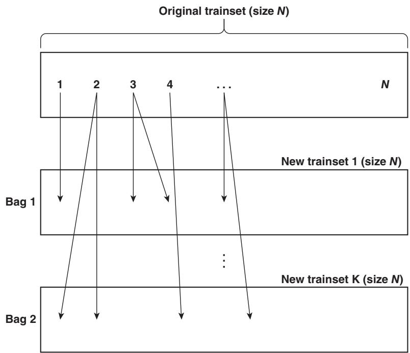
그림 4.5 K개의 백을 사용한 배깅(백 1에서는 데이터 표본 2와 4가 테스트셋 1의 일부가 되고, 백 K에서는 데이터 표본 1과 3이 테스트셋 K의 일부가 됩니다.)

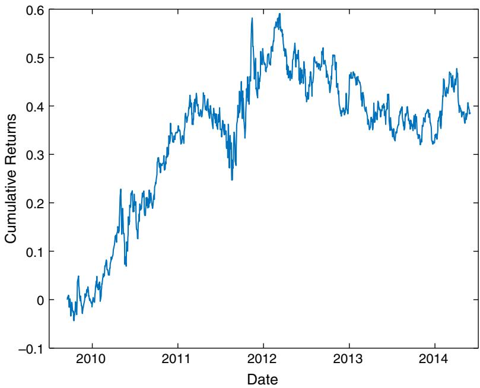
그림 4.6 배깅을 적용한 회귀 트리 기반 거래 모델(K = 5)

교차 검증에서 만든 트리 수와 맞추려고 K = 5(`TreeBagger` 함수<sup>4</sup>의 첫 번째 매개변수)를 골랐습니다. 이것은 교차 검증 모델보다 훨씬 나은 예측 성능을 냈습니다. CAGR 7.2퍼센트, 샤프 비율 0.5입니다. 자산 곡선은 그림 4.6에 있습니다.

여기서 재미있는 반직관이 있습니다. K를 키우면 오히려 표본 외 성능이 나빠집니다. 복제본을 아주 많이 만들어 평균 내면, 그 평균 결과가 결국 원래 학습셋 하나를 쓴 것과 거의 같아지기 때문입니다. 무작위성으로 얻는 이득이 사라지는 것입니다.

배깅이 왜 통하는지 한 문장으로 정리하면 이렇습니다. 트리 하나는 학습 데이터의 우연한 요동에 민감해 예측이 들쭉날쭉합니다(높은 분산). 그런데 조금씩 다른 데이터로 기른 트리 여러 개의 예측을 평균하면, 각 트리의 우연한 오차가 서로 상쇄되어 예측이 안정됩니다. 손 떨리는 사격수 여럿의 탄착점을 평균하면 과녁 중앙에 가까워지는 것과 같은 이치입니다. 배깅은 편향은 그대로 두고 분산만 낮춰 주기에, 과적합에 시달리는 트리 같은 모델에 특히 잘 듣습니다.

---

## 무작위 부분공간과 랜덤 포레스트 — 데이터가 아니라 변수를 뽑다

배깅에서는 여러 모델을 학습시키려고 **데이터**를 복원추출로 무작위 표본추출했습니다. **무작위 부분공간(random subspace)** 에서는 여러 모델을 학습시키려고 **예측변수**를 복원추출로 무작위 표본추출합니다(단, 앞서 뽑힌 변수는 다음에 뽑힐 확률을 낮춥니다). 두 경우 모두 이 모델들, 곧 **약한 학습기(weak learner)** 들의 예측을 평균해 앙상블 예측을 더 강하게 만듭니다. 많은 약한 학습기를 학습시켜 하나의 강한 학습기를 만드는 모든 방법을 통틀어 **앙상블(ensemble)** 방법이라 합니다.

MATLAB에서 무작위 부분공간을 구현하는 함수는 `fitensemble`이며, `'Method'` 변수를 `'Subspace'`로 설정하면 됩니다. 그러나 이 함수는 분류 문제(즉 연속형이 아니라 이산형 반응변수)에서만 작동합니다. 이에 대해서는 "분류 트리" 절에서 다루겠습니다. 또한 무작위 부분공간은 예측변수가 아주 많을 때에만 진가를 발휘하므로, 반응변수를 이산화하더라도 겨우 예측변수 4개짜리 SPY 예제로는 여기서 시연할 수 없습니다. 대신 "주식 선택에의 적용" 절에서 제안하는 기본적 데이터셋으로 연습문제 삼아 시도해 보길 권합니다.

배깅과 무작위 부분공간을 한데 버무린 또 다른 앙상블이 **랜덤 포레스트(random forest)** 입니다. 더 구체적으로, 랜덤 포레스트는 무작위로 (복원추출로) 뽑은 학습 데이터 부분집합에서 출발하고, 노드를 나눌 때마다 사용 가능한 전체 예측변수 중 무작위로 (복원추출로) 뽑은 부분집합에서 최선의 변수를 고르는 회귀 또는 분류 트리입니다. 역시 약한 학습기들의 예측을 평균합니다. MATLAB에서는 `TreeBagger` 함수에 `'NumPredictorsToSample'` 매개변수를 전체 예측변수 수보다 작은 값으로 설정해 구현합니다. 사실 MATLAB 기본값은 이 값을 전체 예측변수의 3분의 1로 두는데, 이것이 앞 절 배깅 예제와 `rTreeBagger.m`에서 우리가 쓴 값입니다. 만약 모든 노드에서 모든 예측변수를 다 쓰고 싶다면 `'NumPredictorsToSample'`을 `'all'`로 설정하면 됩니다. 그렇게 하면 앞 예제의 표본 외 CAGR이 7.2퍼센트에서 1.5퍼센트로, 샤프 비율이 0.5에서 0.2로 떨어집니다. 즉 변수까지 무작위로 흔들어 주는 것이 성능에 도움이 됩니다.

이 결과가 처음엔 뜻밖으로 들릴 수 있습니다. 매번 최선의 변수를 자유롭게 고르게 두는 편이 더 나아 보이니까요. 그러나 모든 트리가 늘 같은 "강한" 변수를 최상단에서 고르면, 트리들이 서로 너무 닮아 버려 평균을 내도 다양성이 없습니다. 노드마다 후보 변수를 무작위로 제한하면 트리들이 서로 달라지고, 이 다양성이 평균의 상쇄 효과를 키워 표본 외 일반화를 돕습니다. 랜덤 포레스트가 데이터(배깅)와 변수(무작위 부분공간) 양쪽에 무작위성을 심는 이유가 바로 이 다양성 확보에 있습니다.

---

## 부스팅 (Boosting) — 과거의 실수에 집중해 배우다

인간은 과거의 실수에서 배우는 능력을 자랑스러워합니다. 뛰어난 사람들은 지난 성공을 곱씹느라 시간을 낭비하지 않습니다. AI 알고리즘에도 똑같은 태도를 가르칠 수 있는데, 이 방법이 **부스팅(boosting)** 입니다.

부스팅은 직전 반복에서 만든 모델의 **예측 오차**에 학습 알고리즘을 거듭 적용하는 것입니다. 첫 단계로, 이전처럼 회귀 트리 같은 학습 알고리즘을 학습 데이터에 적용합니다. 트리가 세워지고 학습셋에 대한 예측이 나오면 첫 단계가 끝납니다. 두 번째 단계는 새로운 학습셋을 만드는 것으로 시작하는데, 이때 반응값은 **실제 반응과 첫 모델의 예측 반응 사이의 차이(잔차)** 입니다. 이 두 번째 트리의 목표는 그 차이의 제곱을 최소화하는 것입니다. 이 과정을 반복해 총 M개의 트리를 만들고, M번째 트리의 예측을 최종 예측으로 삼습니다. 앞 사람이 남긴 오차를 뒷사람이 이어받아 메우는 릴레이인 셈이며, 여기서도 약한 예측기를 더 강한 것으로 바꾸는 것이 목표입니다.

배깅과 부스팅의 결이 어떻게 다른지 눈여겨보세요. 배깅은 여러 트리를 **서로 독립적으로** 길러 나란히 평균하여 분산을 낮춥니다. 반면 부스팅은 트리들을 **순차적으로** 이어 붙이되, 각 트리가 앞 트리의 잔차에 집중하게 하여 편향을 줄여 갑니다. 그래서 부스팅은 분산을 낮추는 장치가 아니라 예측력을 짜내는 장치에 가깝고, 바로 그 점 때문에 자칫 학습셋에 지나치게 밀착할 위험도 함께 커집니다.

이 절차를 앞서 만든 회귀 트리 모델에 적용해 봅니다. 무작위 부분공간 때와 마찬가지로, 코드(`rTreeLSBoost.m`)에서 `fitrtree`를 `fitensemble`로 바꾸기만 하면 됩니다. 부스팅 알고리즘으로는 회귀 또는 회귀 트리 모델을 부스팅하는 **경사 하강법(gradient descent method)**(Friedman, 1999)인 `'LSBoost'`를 지정하고, M을 부스팅 반복 횟수로, `'Tree'`를 학습 알고리즘으로 지정합니다.

```matlab
model = fitensemble([ret1(trainset) ret2(trainset) ret5(trainset) ...
                     ret20(trainset)], retFut1(trainset), 'LSBoost', M, 'Tree');
```

교차 검증이나 배깅과 달리, 부스팅은 과적합을 완화해 주지 못하는 것으로 보입니다(왜 과적합되지 않는지에 대한 이론적 논거가 있기는 합니다. Kun, 2015 참조). 그림 4.7은 앞서 만든 회귀 트리를 부스팅했을 때 학습셋과 테스트셋에 미치는 효과를 보여 줍니다. 반복 횟수를 늘리면 학습셋 샤프 비율은 빠르게 올라가지만, 테스트셋 샤프 비율은 훨씬 더디게 올라갑니다. 실제로 테스트셋 샤프 비율은 어떤 합리적인 반복 횟수에서도 유의하지 않은 채로 남습니다. 게다가 각 반복의 최선 트리에 교차 검증을 적용하면 오히려 성과가 나빠집니다.

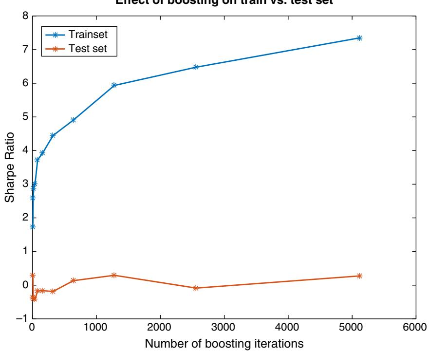
그림 4.7 학습셋 대 테스트셋 샤프 비율에 대한 회귀 트리 부스팅의 효과

---

## 분류 트리 (Classification Tree) — 상승/하락이라는 범주를 예측하다

지금까지 다룬 핵심 학습 알고리즘은 반응변수가 연속형이라고 가정했습니다. 트레이딩에서는 대체로 기대수익률에 관심이 있으니 자연스러운 일입니다. 그러나 이산형(범주형이라고도 부릅니다) 반응변수를 위해 특별히 설계된 알고리즘도 있고, 이를 마다할 이유는 없습니다. 수익률을 이를테면 양(+)과 음(−)으로 이산화하기만 하면 됩니다. 이 절에서는 SPY 예측 과제에 **분류 트리(classification tree)** 를 적용합니다.

분류 트리는 회귀 트리와 아주 가까운 형제입니다. 회귀 트리에서 노드를 나누는 최선의 변수는 자식 노드에서 반응값의 분산을 최소화하는 변수였습니다. 분류 트리에서는 이 분산이 그에 대응하는 **지니 다양성 지수(Gini's Diversity Index, GDI)** 로 바뀝니다. 양(+) 또는 음(−) 두 클래스로 나누는 이진 분류에서, 한 노드의 GDI는 다음과 같습니다.

한 노드가 얼마나 "뒤섞여" 있는지를 재는 값으로, 두 클래스의 비율이 반반일 때 가장 크고 한 클래스로만 채워질 때 0이 됩니다.

$$
1 - p_{+}^{2} - p_{-}^{2}
$$

- $p_{+}$: 그 노드에서 양의 수익률을 가진 관측치의 비율
- $p_{-}$: 그 노드에서 음의 수익률을 가진 관측치의 비율

GDI의 최솟값은 0이며, 이는 노드가 오직 한 클래스의 관측치로만 이루어질 때, 즉 완벽하게 분류될 때 얻어집니다. 반대로 양·음이 정확히 반반이면 GDI는 최대(0.5)가 됩니다. 그러니 GDI를 "순도(purity)의 반대", 곧 불순도라고 생각하면 편합니다. 노드가 한 클래스로 깔끔하게 쏠릴수록 불순도가 0에 가까워지는 것입니다. 노드를 나누는 최선의 변수는 두 자식 노드의 GDI 합을 최소화하는 변수, 즉 나눈 결과 양쪽이 최대한 한 클래스로 쏠리게 만드는 변수입니다. 회귀 트리가 분산을 줄이려 했다면, 분류 트리는 이 불순도를 줄이려 한다는 점만 다를 뿐 나머지 뼈대는 똑같습니다. 자연스럽게, 한 노드의 예측 반응은 그 안에서 가장 높은 비율을 차지하는 관측 클래스가 됩니다(다수결인 셈입니다).

MATLAB에서 분류 트리를 구현하려면, 반응변수를 이산화하는 데만 주의하면서 프로그램 `rTree.m`의 `fitrtree`를 `fitctree`로 바꾸면 됩니다.<sup>5</sup> 전체 트리를 예측에 쓰면 심각한 **데이터 스누핑 편향(data snooping bias)** 이 생긴다는 것을 알고 있으므로, 회귀 트리 때처럼 5겹 교차 검증도 함께 적용합니다.

```matlab
model = fitctree([ret1(trainset) ret2(trainset) ret5(trainset) ...
                  ret20(trainset)], retFut1(trainset) >= 0, 'MinLeafSize', 100, ...
                  'CrossVal', 'On', 'KFold', 5); % 반응: >=0 이면 참, <0 이면 거짓.
```

이 모델로는 명백한 방식으로 신호를 냅니다. 예측 반응이 양이면 매수, 음이면 공매도합니다. 전체 프로그램은 `cTree.m`에 있습니다. 테스트셋에서 CAGR은 4.8퍼센트, 샤프 비율은 0.4로, 교차 검증한 회귀 트리보다는 낫지만 랜덤 포레스트를 적용한 회귀 트리만큼은 아닙니다. (물론 랜덤 포레스트를 분류 트리에도 적용할 수 있으며, 이는 연습문제로 남깁니다.)

반응을 꼭 양/음 수익률로만 나눌 필요는 없습니다. 높은 양의 수익률(어떤 임계값보다 높은 수익률)을 한 클래스로, 그 여집합을 다른 클래스로 만든 뒤, 이 고수익 클래스가 예측될 때만 매수 신호를 낼 수도 있습니다. 마찬가지로 낮은 음의 수익률을 한 클래스로 만들어 그 클래스가 예측될 때 공매도 신호를 낼 수도 있습니다. 다만 이렇게 해도 전략 성과가 나아지지는 않는 듯합니다.

---

## 서포트 벡터 머신 (Support Vector Machine) — 가장 넓은 간격으로 두 무리를 가르다

**서포트 벡터 머신(support vector machine, SVM)** 은 이산 반응에 작동하는 또 다른 인기 분류 기법입니다. 그 밑바탕의 직관은 시각적으로 무척 매력적입니다. 각 표본 데이터가 m차원 공간의 한 점으로 놓여 있다고 상상해 봅시다(m은 예측변수의 수이고, 예측변수 자체는 여전히 연속 변수입니다). 이 점들 중 일부에는 "플러스", 나머지에는 "마이너스" 라벨이 붙어 있다고 합시다(그림 4.8 참조). 이 플러스와 마이너스가 우리의 이산 반응입니다. SVM은 이 m차원 공간에서 플러스와 마이너스를 갈라 주는 **초평면(hyperplane)** 을 찾으려 합니다. 게다가 가능한 한 가장 넓은 **마진(margin)**, 곧 여백으로 갈라 놓으려 합니다.

이것이 가능하다면 분류 과제는 끝난 것입니다. 어떤 데이터가 이 초평면의 어느 쪽에 있는지만 보면, 그 반응 범주를 정확히 알 수 있으니까요. 그림 4.8의 2차원 예시에서 가운데 검은 선이 바로 이 깔끔한 분리를 이룹니다. 모든 마이너스는 선의 오른쪽, 모든 플러스는 왼쪽에 있습니다. 분리 초평면(선)에 가장 가까이 붙은 플러스들이 한 무리의 **서포트 벡터(support vector)** 를 이루고, 가장 가까이 붙은 마이너스들도 마찬가지입니다. 이 두 서포트 벡터 무리 사이의 간격이 바로 우리가 SVM으로 최대화한 마진입니다. 이 이름이 여기서 나옵니다 — 경계를 떠받치는(support) 벡터들 말입니다.

왜 하필 "가장 넓은" 마진을 고집할까요? 두 무리를 가르는 선은 사실 무수히 많이 그을 수 있습니다. 그중 한쪽 무리에 아슬아슬하게 붙은 선을 고르면, 새 데이터가 조금만 달라져도 반대편으로 넘어가 오분류되기 쉽습니다. 반대로 양쪽에서 최대한 멀찍이 떨어진 선을 고르면, 데이터가 다소 흔들려도 여전히 올바른 쪽에 머뭅니다. 즉 마진을 넓게 잡는 것은 표본 외 데이터에 대한 안전 여유를 확보하는 일이며, 이것이 SVM이 과적합에 강한 근본 이유입니다.

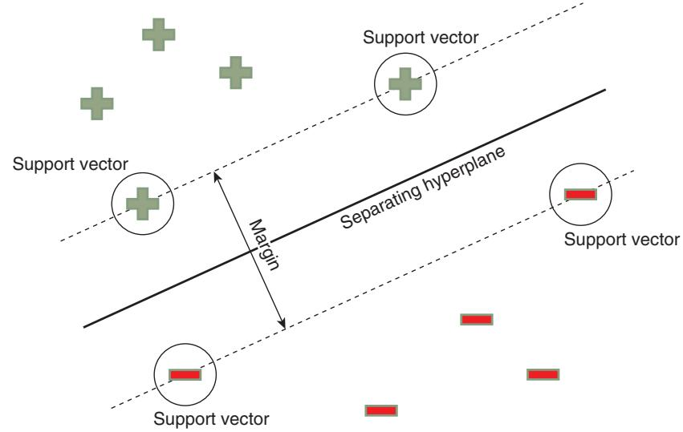
그림 4.8 서포트 벡터 머신 예시

물론 실제 데이터가 이런 상상 속 데이터처럼 순순히 갈라지는 경우는 드뭅니다. "최선"의 초평면을 써도 오른쪽에 플러스가, 왼쪽에 마이너스가 섞여 있기 마련입니다. 그래서 분리 마진을 최대화하는 동시에 오분류된 점에 벌점을 매기는 벌점 항을 최소화함으로써 최선의 초평면을 찾습니다(수학적 세부는 Anonymous, 2015 참조). MATLAB에서 SVM을 쓰려면 `fitctree`를 `fitcsvm`으로 바꾸고 다시 5겹 교차 검증을 적용하면 됩니다.<sup>6</sup>

```matlab
model = fitcsvm([ret1(trainset) ret2(trainset) ret5(trainset) ...
                 ret20(trainset)], retFut1(trainset) >= 0, 'CrossVal', 'On', ...
                 'KFold', 5); % 반응: >=0 이면 참, <0 이면 거짓.
```

테스트셋에서 CAGR 13.3퍼센트, 샤프 비율 0.8이라는 결과는 분류 트리보다 훨씬 우수합니다. 그림 4.9의 자산 곡선도 최근 기간에 성과가 꺾이지 않았음을 보여 줍니다. 이 초과 성과는 아마 이 기본 버전의 SVM이 만드는 모델이 진짜로 선형이기 때문일 것입니다. 결국 그것은 하나의 초평면일 뿐이니까요(분류 트리는 기껏해야 구간별 선형으로만 볼 수 있습니다). 선형 모델은 과적합을 피하고 표본 외 데이터에서 더 나은 결과를 냅니다. 흥미롭게도 이 선형 모델은 학습셋에서는 오히려 더 나쁜 성적을 내는데, 아마 같은 이유 때문일 것입니다.

### 커널 — 곡면으로 데이터를 가르기

그러나 때로는 SVM이 데이터를 분류하려면 예측변수를 비선형으로 변환해야 합니다. 이 변환을 맡는 것이 **커널(Kernel) 함수** 입니다. 선형 커널 대신 다항 함수를 지정할 수 있고, 커널 스케일을 1로 고정하는 대신 `'auto'`로 두어 알고리즘이 최적 스케일을 고르게 할 수도 있습니다. 저자는 이 새 설정을 시도해 봤지만 결과는 나아지지 않았고, **방사 기저(Gaussian) 함수** 를 쓰면 결과가 약간 개선되었습니다. **다층 퍼셉트론(sigmoidal) 함수** 도 있지만 이는 Statistics and Machine Learning Toolbox에 없어 직접 구성해야 합니다(관심 있는 독자는 Neural Network Toolbox에서 이 함수를 뽑아 SVM에 적용할 수 있는지 탐구해 보십시오).

예측변수에 비선형 커널을 적용하는 것은, 평평한 판 대신 굽은 막으로 데이터를 가르는 것과 같습니다. 커널 변환을 이해하는 또 다른 방식은, 데이터를 더 높은 차원의 공간으로 옮겨 그곳에서는 초평면이 깔끔하게 가를 수 있도록 만드는 것이라는 관점입니다. 그 초평면을 원래 공간으로 되돌리면 직선이 아니라 곡선으로 나타납니다. 이것은 훨씬 큰 유연성을 주지만(그만큼 과적합의 여지도 커집니다).

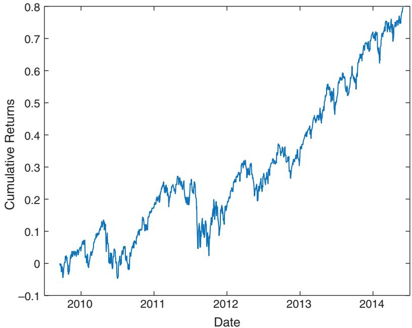
그림 4.9 교차 검증을 사용한 서포트 벡터 머신(SPY 테스트셋)

---

## 은닉 마르코프 모델 (Hidden Markov Model) — 눈에 보이지 않는 시장 국면을 추정하다

트레이더들은 어떤 시장 국면을 "강세장" 또는 "약세장"이라 부르곤 합니다. 그런데 강세장에도 하락일이 있고 약세장에도 상승일이 있으니, 무엇이 강세장이고 약세장인지는 사실 명확하지 않습니다. 케이블 TV 해설자 둘도 강세장·약세장의 정확한 정의에 합의하지 못합니다. "평균회귀" 시장 대 "추세" 시장, 또는 "위험선호(risk-on)" 국면 대 "위험회피(risk-off)" 국면도 마찬가지입니다.

그러나 머신러닝 연구자들은 이런 모호함에 꽤 익숙합니다. 더 정확히 말하면, 그들은 클래스 자체가 관측되지 않는 분류 문제에 익숙합니다. 앞 절에서 SVM에게 분류시킨 "상승/하락"일은 눈으로 볼 수 있었지만, 지금은 그렇지 않습니다. 이렇게 관측할 수 없는(**은닉된**) 상태를 분류하는 일은 **비지도 학습(unsupervised learning)** 의 영역입니다.

지도 학습과 비지도 학습의 차이를 여기서 분명히 해 둡시다. 앞 절들에서는 "상승일/하락일"이라는 정답 라벨을 눈으로 확인할 수 있었고, 알고리즘은 그 정답을 보며 배웠습니다(지도 학습). 그러나 "강세장/약세장"은 누구도 그날의 정답을 딱 잘라 말해 줄 수 없습니다. 정답표 없이, 오직 관측된 상승·하락일의 나열만 보고 그 뒤에 숨은 상태를 스스로 추론해야 합니다(비지도 학습). HMM은 바로 이 "정답 없이 숨은 구조를 추론하는" 과제를 푸는 도구입니다.

은닉 상태를 다루는 가장 유명한 모델 중 하나가 **은닉 마르코프 모델(Hidden Markov Model, HMM)** 입니다. HMM을 이해하는 가장 쉬운 길은, 강세장과 약세장을 두 개의 은닉 상태로 상상하고, **전이 확률 행렬(transition probability matrix)** 이 하루에서 다음 날로 넘어갈 때 한 상태에서 다른 상태로 옮겨갈 확률을 기술한다고 보는 것입니다. 예를 들어 강세장을 첫 번째 상태, 약세장을 두 번째 상태로 두면, 다음과 같은 전이 행렬 T는

이 행렬의 $(i, j)$ 성분은 "오늘 상태 $i$에서 내일 상태 $j$로 갈 확률"입니다.

$$
T = {\left[\begin{array}{ll} {0.60} & {0.40} \\ {0.75} & {0.25} \end{array}\right]}
$$

강세장이 다음 날에도 강세장으로 남을 확률이 0.6임을 나타냅니다. 물론 이는 약세장으로 전이할 확률이 0.4라는 뜻이기도 합니다. 이 행렬은 또한 약세장이 다음 날에도 약세장으로 남을 확률이 0.25, 강세장으로 전이할 확률이 0.75임을 말합니다. 당연히 각 행의 확률은 합이 1이어야 합니다.

전이 확률 외에도, 약세 상태가 하락일과 상승일을 각각 "방출"할 확률을 알아야 합니다. 이 하락일·상승일을 **방출(emission)**, 또는 **관측값(observable)** 이라 부릅니다. 강세 상태에 대해서도 같은 확률이 필요합니다. 이 "방출" 확률은 다음과 같은 **방출 확률 행렬(emission probability matrix)** E에 정리됩니다.

이 행렬의 $(i, j)$ 성분은 "상태 $i$가 방출 기호 $j$를 낼 확률"입니다.

$$
E = {\left[\begin{array}{ll} {0.19} & {0.81} \\ {0.97} & {0.03} \end{array}\right]}
$$

여기서 하락일을 첫 번째 방출 기호, 상승일을 두 번째 방출 기호로 둡니다. 따라서 이 방출 행렬은 강세 상태가 하락일을 낼 확률이 19퍼센트, 상승일을 낼 확률이 81퍼센트임을 말해 줍니다. 약세 상태가 하락일을 낼 확률은 97퍼센트, 상승일을 낼 확률은 3퍼센트입니다. 역시 각 행의 확률 합은 1이어야 합니다. 그림 4.10이 전이 행렬을 그림으로 보여 줍니다.

이 두 행렬을 함께 읽으면 HMM이 어떻게 "숨은 상태"를 쓸모 있게 만드는지 보입니다. 우리 눈에는 상승일과 하락일만 보이지만, 그 뒤에 강세·약세라는 보이지 않는 스위치가 있다고 가정하는 것입니다. 강세 상태는 상승일을 81퍼센트로 쏟아내고 약세 상태는 하락일을 97퍼센트로 쏟아내니, 두 상태는 서로 뚜렷이 다른 "성격"을 가집니다. 여기에 전이 행렬이 상태가 얼마나 끈질기게 이어지는지를 더해 줍니다. 이렇게 하면 "어제 하락했으니 오늘도 하락할 확률이 조금 더 높다" 같은, 하나의 고정된 확률로는 담기 어려운 시간적 쏠림을 모델이 표현할 수 있게 됩니다.

강세와 약세는 관측할 수 없으므로, 이는 우리가 상태에 붙인 이름일 뿐입니다. "평균회귀"와 "추세추종", "위험선호"와 "위험회피", 심지어 "탐욕"과 "공포"라 불러도 무방하며, 학습 알고리즘은 이를 전혀 알아차리지 못합니다. 우리가 세운 유일한 가정은, 상승일과 하락일이 관측 불가능한 두 상태에서 생성된다는 것뿐입니다. 이 가정은 상승·하락일을 관측할 확률이 하나의 정상 확률분포로는 만족스럽게 설명되지 않아 보인다는 사실을 담아내기 위한 것입니다. 다시 말해, HMM은 3장에서 다룬 것들보다 더 복잡한 시계열 모델일 뿐이며, 추정할 매개변수가 더 많고 — 말할 것도 없이 — 데이터 스누핑 편향의 여지도 더 큽니다.

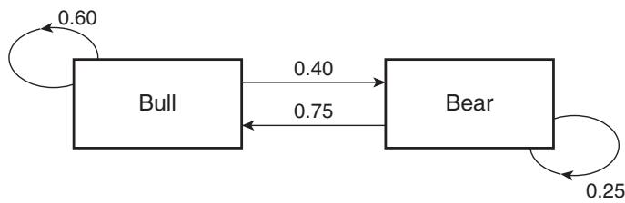
그림 4.10 HMM의 은닉 상태 전이 확률

### 매개변수 학습 — EM 알고리즘

다른 학습 알고리즘과 마찬가지로, 매개변수(전이 행렬 T, 방출 행렬 E, 그리고 경우에 따라 방출에 대한 사전 확률분포)는 학습셋으로 추정해야 합니다. HMM을 비롯해 은닉 상태를 가진 모든 모델에서 가장 유명한 비지도 학습 알고리즘 중 하나가 **EM 알고리즘(EM algorithm)** 입니다(Murphy, 2012). Mathworks의 Statistics and Machine Learning Toolbox에도 EM의 한 버전을 구현한 `hmmtrain` 함수가 있지만, 안타깝게도 알 수 없는 이유로 종종 특이해(singular solution)를 반환합니다. 그래서 저자는 학습에는 오픈소스 소프트웨어인 Bayes Net Toolbox for MATLAB(https://code.google.com/p/bnt/)을 썼습니다. 이는 복잡하고 다루기도 꽤 까다로운 소프트웨어입니다. 프로그램 `hmm_train.m`에서 보이듯 학습에는 이 툴박스의 `learn_params_dbn_em` 함수를 사용했습니다. 학습의 목표는 늘 그렇듯 방출의 로그 가능도를 최대로 만드는 매개변수를 찾는 것입니다. 여러 개의 국소 최댓값이 있을 것으로 예상되므로, 저자는 이 학습을 10번 돌려 각 최댓값에서의 가능도를 기록한 뒤 가장 높은 것을 골랐습니다. (여러분의 컴퓨터가 더 빠르거나 인내심이 더 강하다면 10번보다 훨씬 많이 돌려도 됩니다.) 이를 SPY 일별 수익률에 돌리면 앞서 쓴 T와 E 행렬이 나옵니다.

### 예측 — 다음 날의 방출 확률 구하기

예측에는 다시 Mathworks의 Statistics Toolbox로 돌아갑니다. 필요한 함수는 `hmmdecode`이며, 이는 초기 시점부터 시점 $t$까지의 은닉 상태 확률을 계산해 `pstates(1:t)`에 담습니다. 이 확률은 알려진 전이·방출 행렬이 주어지고, $t \times 1$ 벡터에 담긴 관측 방출 데이터를 조건으로 하여 계산됩니다. 시점 $t + 1$의 방출을 예측하려면 `pstates(t + 1)`이 필요한데, 이는 $\boldsymbol{T}^{\prime} \times pstates(t)$로 주어집니다($T^{\prime}$는 T의 전치). 그러면 방출 확률은 $Pemis(t + 1) = E^{\prime} \times pstates(t + 1) = E^{\prime} \times T^{\prime} \times pstates(t)$입니다. 이에 대한 MATLAB 코드 조각은 다음과 같습니다.

```matlab
pemis = NaN(2, size(data, 1));
for t = 1:size(data, 1)-1
    [pstates] = hmmdecode(data(1:t)', T, E);
    pemis(:, t+1) = E'*T'*pstates(:, end);
end
```

이 알고리즘은 이전에 관측한 **모든** 데이터를 입력으로 넣어 `hmmdecode`를 실행해야 한다는 점에 유의하세요. 즉 시점 $t$에서 최신 데이터 하나만 추가하면 `pstates(t)`가 갱신되는 "온라인(online)" 알고리즘이 아닙니다. 대조적으로 HMM의 연속형 사촌인 **칼만 필터(Kalman filter)** 는 온라인 알고리즘으로, Chan(2013)의 논의와 이 책 3장에서 다뤘듯이 은닉 상태 변수와 여타 매개변수의 추정치를 그때그때 갱신할 수 있었습니다. HMM용 온라인 디코딩 함수를 찾거나 직접 구현하는 일은 연습문제로 남깁니다.

다음 날 방출 확률이 있으면, "상승" 확률이 "하락" 확률보다 높으면 SPY를 사고 그 반대면 파는 단순 전략을 만들 수 있습니다. 저자는 바로 이를 위해 `hmm_test.m` 프로그램을 만들었습니다. 학습셋에서는 CAGR 8.7퍼센트로 제법 괜찮았지만, 테스트셋에서는 CAGR이 1퍼센트에 그쳤습니다.

다음 날 수익률을 예측하는 HMM에는 많은 변형이 있습니다. 데이터 전반부를 학습셋으로 삼아 매개변수를 추정하는 대신, 새로 관측되는 방출마다 다시 추정할 수 있습니다. 이산 방출(상승/하락일) 대신, 이를 Gaussian이나 Student-t 같은 모수적 분포를 따르는 연속 변수로 모델링할 수도 있습니다(Dueker, 2006). 방출이 은닉 상태 변수에만 의존하도록 두는 대신, 이 장의 지도 학습 모델들이 쓴 예측변수 같은 관측 입력 변수에도 의존하게 할 수 있습니다.

### 덤 — 가장 그럴듯한 상태 시퀀스 (Viterbi)

HMM에는 다음 방출을 예측하는 것 말고도 부수적인 이점이 있습니다. 관측된 방출이 주어지면, HMM은 가장 그럴듯한 은닉 상태 시퀀스가 무엇인지 알려 줄 수 있습니다. 이를 위해 `hmmviterbi` 함수를 씁니다(디코딩 알고리즘을 발명했고, 여러분 스마트폰 속 칩을 만들었을 Qualcomm의 공동 창업자인 Andrew Viterbi 교수를 기려 붙인 이름입니다).

```matlab
states = hmmviterbi(data, T, E);
```

가장 그럴듯한 상태 시퀀스를 아는 것이 무슨 이득일까요? 다음번에 누군가 지금이 강세장인지 약세장인지 묻거든, HMM에 물어보고 명확히 정의된 답을 줄 수 있습니다.<sup>7</sup>

---

## 신경망 (Neural Network) — 시그모이드를 겹쳐 임의의 함수를 근사하다

**신경망(neural network)** 은 머신러닝 알고리즘 중 가장 잘 알려진 것일지 모릅니다. 오랜 역사만큼 수많은 하위 유형·아키텍처·학습 알고리즘으로 갈라져 왔습니다. 얼마나 방대한지 Mathworks는 아예 모든 신경망 알고리즘을 별도의 Neural Network Toolbox로 모아 두었을 정도입니다. 몇 문단으로 그 모든 갈래를 제대로 다룰 수는 없으니, 여기서는 SPY 수익률 예측에 알맞은 가장 기본적인 아키텍처만 짚겠습니다.

신경망은 이렇게 단순하게 이해할 수 있습니다. 임의 개수의 예측변수에 대한 어떤 함수든, **시그모이드 함수(sigmoid function)** $S(x) = 1/(1 + e^{-x})$ 의 선형 함수로, 또는 시그모이드 함수들의 선형 함수에 다시 시그모이드를 씌운 것의 선형 함수로, 그런 식으로 겹겹이 반복해 근사하는 방법입니다.

시그모이드가 왜 핵심일까요? 시그모이드는 입력을 0과 1 사이로 부드럽게 눌러 주는 S자 곡선인데, 이 완만한 굴곡이 바로 "휘어짐"을 만들어 냅니다. 직선(선형 함수)만 아무리 더하고 곱해 봐야 결과는 여전히 직선입니다. 그런데 그 사이사이에 시그모이드라는 휘어짐을 끼워 넣으면, 이들을 충분히 겹쳤을 때 어떤 복잡한 곡선이든 원하는 만큼 가깝게 흉내 낼 수 있습니다. 신경망이 "임의의 함수를 근사한다"고 말할 수 있는 힘이 여기서 나옵니다. 다만 그 유연함은 양날의 검이어서, 표현력이 커진 만큼 잡음까지 외워 버리는 과적합 위험도 커집니다. 시그모이드를 몇 겹으로 쌓을지, 각각에 얼마나 가중치를 줄지, 한 함수의 출력을 다른 함수의 입력에 어떻게 이을지는 오직 학습셋에 대한 실험과 최적화로만 정할 수 있습니다. 학습 데이터로 각 함수의 가중치를 정하는 것이 학습 알고리즘의 몫이며, 이 역시 학습셋에 대한 최적화 문제입니다.

### 순방향 네트워크의 구조

가장 기본적인 아키텍처는 **순방향 네트워크(feed forward network)** 입니다. 순방향 네트워크는 여러 개의 **은닉층(hidden layer)** 으로 이루어지고, 각 은닉층은 시그모이드 함수(저마다 다른 가중치를 가짐)를 나타내는 여러 개의 **뉴런(neuron)** 을 담으며, 마지막 **출력층(output layer)** 은 선형 함수를 나타냅니다. Neural Network Toolbox에서는 각 층의 뉴런 수를 `feedforwardnet` 함수의 입력 매개변수 `hiddenSizes`(행 벡터)로 지정합니다. 예를 들어 다음과 같이 지정할 수 있습니다.

```matlab
net = feedforwardnet([2 4 3]);
```

> **원문 코드 복원 안내**: 원문(및 _ko 번역)은 스캔·OCR 과정에서 이 예시 코드 한 줄이 통째로 빠져 있고, 곧바로 "이는 첫 번째 층에 2개의 뉴런…"이라는 설명으로 넘어갑니다. 위 코드는 그 설명(2·4·3개 뉴런)에 맞춰 뜻을 복원한 것입니다.

이는 첫 번째 층에 뉴런 2개, 두 번째 층에 4개, 세 번째 층에 3개가 있음을 뜻합니다. 즉 SPY 예제에서 차원이 4인 입력 벡터 $X_{i:}$ 는, 선형 회귀의 상수 오프셋과 마찬가지로 상수 1과 함께, 먼저 서로 다른 가중치로 하나의 스칼라로 합산됩니다.

각 뉴런은 입력 벡터의 성분들을 저마다의 가중치로 가중합한 값 하나를 받습니다.

$$
I_{j} = \sum_{i=1}^{4}(\boldsymbol{w}_{j,i}\boldsymbol{x}_{i} + \boldsymbol{w}_{j,0})
$$

- $I_{j}$: $j$번째 뉴런에 들어가는 입력(스칼라)
- $w_{j,i}$: $j$번째 뉴런에서 입력 벡터의 $i$번째 성분에 곱해지는 가중치(학습 단계에서 결정됨)
- $x_{i}$: 입력 벡터의 $i$번째 성분
- $w_{j,0}$: 그 뉴런의 상수 오프셋(y절편에 해당)

이렇게 만든 각 선형 함수의 출력은 그에 대응하는 시그모이드 함수로 전달됩니다.

만약 시그모이드 함수가 그냥 항등 함수 $S(I_{j}) = I_{j}$ 였다면, 이 뉴런은 단계적 회귀 절 앞부분에서 다룬 평범한 다중 선형 회귀와 다를 바 없습니다. 그러나 우리는 비선형 함수가 더 잘 맞으리라 믿고, 그래서 신경망은 앞서 보인 시그모이드 형태를 씁니다. 첫 번째 층 두 뉴런의 출력은 차원 2인 벡터 $S(I_{j})$ 이고, 이것이 두 번째 층 네 뉴런 각각의 입력으로 들어가는 식으로 계속됩니다. 마지막으로 세 번째 층 세 뉴런의 출력은 3-벡터로서 출력층에 들어가고, 출력층에는 이번엔 단순 선형 함수인 노드 하나만 있습니다(우리 예처럼 출력이 스칼라 y라고 가정할 때입니다. 출력이 벡터라면 그 차원만큼 출력층 노드가 있게 됩니다). 입력 벡터에 대한 이 반복 연산 — 가중치(w)로 곱하고, 성분들을 합산 $(\Sigma)$ 하고, 시그모이드(S)로 변환하는 — 의 순서를 그림 4.11의 네트워크 도식이 보여 줍니다.

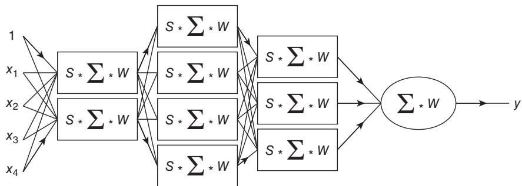
그림 4.11 우리 예제를 위한 순방향 신경망

### 가장 단순한 네트워크부터 — 그리고 과적합과의 싸움

SPY 예측 문제에서 이 모든 은닉층과 여러 뉴런으로 시작하는 대신, 은닉층 하나에 뉴런 하나(`hiddenSizes = 1`)로 시작해 봅시다. 언제나처럼 과적합이 가장 큰 걱정거리이고, 은닉층과 뉴런이 많아질수록 상황은 나빠집니다. 가중치(w)를 정하는 학습 알고리즘 자체는 다루지 않되, 한 가지만 짚겠습니다. 가중치의 초기 추정값에는 무작위성이 있어, 그 초기값이 어떠했느냐에 따라 최종 네트워크가 학습셋 예측 오차의 서로 다른 국소 최솟값에 수렴합니다. 과적합을 줄이기 위해 학습 알고리즘은 **교차 검증 데이터셋(cross validation data set)** 을 활용하며, 그 크기는 사용자가 지정합니다.

```matlab
net.divideParam.trainRatio = 0.6; % 0.6 (기본값 0.7) 학습셋의 4/5를 무작위로 골라
% 학습 데이터로 삼음
net.divideParam.valRatio = 0.4;   % 0.4 (기본값 0.15) 남은 학습셋의 1/5를
% 조기 종료용 검증 데이터로 삼음
net.divideParam.testRatio = 0;
```

여기서 `trainRatio`는 예측 오차 최소화에 무작위로 쓸 학습 데이터의 비율, `valRatio`는 검증셋의 비율, `testRatio`는 테스트셋의 비율입니다. 네트워크 학습 중 검증셋의 오차가 늘기 시작하면 학습은 즉시 멈춥니다(이를 **조기 종료(early stopping)** 라 합니다). 우리는 테스트셋을 0으로 두는데, 학습 중에는 쓰이지 않을뿐더러 백테스트용 자체 테스트셋(전체 데이터의 절반)이 따로 있기 때문입니다. (같은 난수 시드를 쓰면) 표본 내 CAGR은 19퍼센트지만 표본 외 CAGR은 −4퍼센트임을 확인할 수 있습니다.<sup>8</sup> 아직 과적합 문제를 풀지 못한 것입니다.

`hiddenSizes = [1, 1]`로 은닉층을 늘려 봐도 표본 내도 표본 외도 나아지지 않습니다. 반대로 `hiddenSizes = [2, 2]`로 층당 노드를 늘리면 표본 내 CAGR 20퍼센트, 표본 외 CAGR 5퍼센트를 얻습니다. 큰 개선처럼 보이지만, 결과가 난수 시드에 무척 민감합니다. 이 민감한 의존성을 줄이고 네트워크를 더 강건하게 만들 방법이 필요합니다.

### 강건성을 높이는 두 가지 길 — 재학습과 평균화

초기 추정값 의존성을 줄이는 방법은 두 가지입니다.

첫째는 **재학습(retraining)** 으로, 교차 검증과 매우 닮았습니다. 가중치 초기값을 다르게, 그리고 데이터를 학습셋(이전처럼 원래 학습셋의 60퍼센트)과 검증셋(나머지 40퍼센트)으로 다르게 골라, 이를테면 100개의 서로 다른 네트워크를 학습시킵니다. 각 네트워크의 검증셋 예측 오차를 기록하고, 그 오차가 가장 낮은 네트워크를 테스트용으로 고릅니다(이제 별도 검증셋이 있으므로 각 네트워크의 `valRatio`는 0으로 둡니다). 저자는 층당 다양한 뉴런 수의 은닉층들을 시도해 그 결과를 표 4.1에 기록했습니다.<sup>9</sup>

표 4.1 재학습을 적용한 다양한 네트워크 아키텍처의 성능 비교
<table><tr><td rowspan="2">CAGR (100</td><td colspan="2">은닉층 1개</td><td colspan="2">은닉층 2개</td><td colspan="2">은닉층 3개</td></tr><tr><td>표본 내</td><td>표본 외</td><td>표본 내</td><td>표본 외</td><td>표본 내</td><td>표본 외</td></tr><tr><td>뉴런 1개</td><td>29%</td><td>3.2%</td><td>28%</td><td>-2.0%</td><td>31%</td><td>-3.9%</td></tr><tr><td>뉴런 2개</td><td>40%</td><td>-3.3%</td><td>27%</td><td>-3.4%</td><td>33%</td><td>-5.4%</td></tr><tr><td>뉴런 3개</td><td>28%</td><td>-10.0%</td><td>47%</td><td>1.4%</td><td>24%</td><td>-12.0%</td></tr></table>

은닉층 수나 층당 뉴런 수를 늘리면 표본 내 성능은 종종 좋아지지만 표본 외 성능은 오히려 나빠짐을 볼 수 있습니다. 이 실험의 결론은, 과적합을 피하려면 이 문제에서는 층 하나에 뉴런 하나만 써야 한다는 것입니다.

둘째 방법은 역시 100개의 네트워크를 학습시키되, 최선 하나를 고르는 대신 100개 모두의 예측 수익률을 **평균**하는 것입니다. 배깅과 매우 닮았습니다. 이 실험<sup>10</sup>의 결과가 표 4.2에 있습니다.

표 4.2 평균화를 적용한 다양한 네트워크 아키텍처의 성능 비교
<table><tr><td rowspan="2">CAGR (100</td><td colspan="2">은닉층 1개</td><td colspan="2">은닉층 2개</td><td colspan="2">은닉층 3개</td></tr><tr><td>표본 내</td><td>표본 외</td><td>표본 내</td><td>표본 외</td><td>표본 내</td><td>표본 외</td></tr><tr><td>네트워크) 뉴런 1개</td><td>26%</td><td>1.9%</td><td>28%</td><td>-0.57%</td><td>23%</td><td>-2.8%</td></tr><tr><td>뉴런 2개</td><td>52%</td><td>-6.2%</td><td>54%</td><td>-0.5%</td><td>62%</td><td>-2.5%</td></tr><tr><td>뉴런 3개</td><td>43%</td><td>-0.62%</td><td>55%</td><td>0.7%</td><td>79%</td><td>5.5%</td></tr></table>

신경망 앙상블을 학습시키는 이 두 방법을 살펴본 결론은, 노드 하나짜리 가장 단순한 네트워크만이 가장 좋고 일관된 결과를 낸다는 것입니다. 그런데 그 결과조차 앞서 다룬 방법들에 비하면 꽤 약한 편입니다.

### 딥러닝과의 인지 부조화

이 결론은 **인지 부조화(cognitive dissonance)** 를 일으킬 수 있습니다. 최근 **딥러닝(deep learning)** 이 놀라운 패턴 인식 능력을 가진 기법으로 대대적으로 선전되어 왔으니까요. 딥러닝은 층은 많고 층당 노드는 적은 신경망입니다. 딥러닝 연구자들은 이런 구성이 층은 적고 노드는 많은 네트워크보다 학습이 더 쉽고 예측력도 더 낫다고 주장합니다. 그러나 그런 관찰은 아마 입력 벡터의 차원이 더 높고(즉 예측변수가 더 많고) 데이터 표본도 더 많은 문제에서만 참일 것입니다. 이렇게 특징이 풍부한 데이터셋은, 호가창(order book)이나 뉴스 같은 비정형(unstructured) 데이터에 접근하지 않는 한 금융에서는 흔치 않습니다.

---

## 데이터 집계 및 정규화 — 500종목의 데이터를 하나로 합치기

머신러닝 알고리즘은 학습 데이터가 많을수록 덕을 봅니다. 이 장에서 지금까지처럼 단 하나의 상품 수익률만 예측하려 들면, 만들어진 모델은 과적합되기 십상입니다. 그렇다면 SPY 하나 대신 SPX 지수의 모든 구성 종목 수익률을 예측하면 어떨까요? 그러면 데이터가 500배 많아지는 셈 아닐까요? 어떤 의미에서는 그렇지만, 각 종목마다 별도 모델을 순진하게 학습시켜 결국 500개의 모델을 만들면 이야기가 다릅니다. 늘어난 데이터의 이점을 누리려면, 이 모든 데이터를 하나의 벡터로 **집계(aggregate)** 해 단 하나의 모델만 학습시켜야 합니다. 그러려면 먼저 데이터를 **정규화(normalize)** 해야 합니다.

### 왜 정규화가 필요한가

서로 다른 종목의 데이터를 합칠 때 정규화가 필요한 이유는, 종목마다 수익률의 변동성이 크게 다르기 때문입니다. 예를 들어 "직전 수익률이 100퍼센트를 넘으면 그 종목을 공매도하라"라는 규칙은 합리적이지 않습니다. 오프라 윈프리가 WTW에 지분 투자를 결정한 날 WTW는 하루에 100퍼센트 넘게 뛰었지만, 시가총액 1,880억 달러가 넘는 WMT는 세상 끝날까지도 그런 날을 보지 못할 수 있기 때문입니다. 그러니 어떤 머신러닝 알고리즘에 넣기 전에, 종목의 예측변수를 그 종목의 변동성으로 정규화해야 합니다. (물론 이미 정규화된 예측변수에는 해당하지 않습니다. **상대강도지수(Relative Strength Index)** 같은 기술적 지표는 이미 정규화되어 있어 추가 처리가 필요 없습니다.) 예측변수와 마찬가지로 반응변수도 같은 방식으로 정규화해야 합니다. 어떤 종목이든 다음 날 수익률이 10퍼센트일 것이라 예측하는 것은 합리적이지 않습니다. WMT에게는 WTW보다 훨씬 버거운 수익률이니까요.

`rTree_SPX.m` 예제에서는 이전 절들과 똑같은 예측변수로 SPX 지수 한 종목의 미래 1일 수익률을 예측하되, 이 예측변수들을 모두 과거 일별 수익률 변동성으로 정규화합니다.

```matlab
ret1N = ret1./vol1;
ret2N = ret2./vol1;
ret5N = ret5./vol1;
ret20N = ret20./vol1;
```

반응변수에도 같은 처리를 합니다.

```matlab
retFut1N = retFut1./vol1;
```

수익률을 2일 변동성이나 3일 변동성 등으로 나눠도 무방했습니다. 정확한 정규화 계수는 중요하지 않습니다. 중요한 것은 정규화된 수익률 변수들이 모두 비슷한 크기를 갖도록 하는 것입니다. 2007년 1월 3일부터 2013년 12월 31일까지의 이 데이터는 CRSP에서 얻었으며 **생존편향(survivorship bias)** 이 없습니다.<sup>11</sup> 또한 통합 종가와 관련된 문제를 피하려고(6장의 논의 참조), 가격으로는 장 마감 시점의 **중간가격(midprice)** 을 씁니다.

### reshape로 행렬을 하나의 벡터로 펴기

그런데 이전 절의 변수들과 달리 이 변수들은 T × S 행렬입니다(T는 데이터의 과거 일수, S는 종목 수). 실제 S는 500보다 큰데, 과거에 SPX에 있었지만 지금은 빠진 종목들도 넣어야 하기 때문입니다. 서로 다른 종목의 데이터 열들을 하나의 (T × S) × 1 벡터로 합치기 위해 `reshape` 함수를 씁니다(비슷한 절차는 예제 2.2 참조).

```matlab
X = NaN(length(trainset)*length(syms), 4);
X(:, 1) = reshape(ret1N(trainset, :), [length(trainset)*length(syms) 1]);
X(:, 2) = reshape(ret2N(trainset, :), [length(trainset)*length(syms) 1]);
X(:, 3) = reshape(ret5N(trainset, :), [length(trainset)*length(syms) 1]);
X(:, 4) = reshape(ret20N(trainset, :), [length(trainset)*length(syms) 1]);
Y = reshape(retFut1N(trainset, :), [length(trainset)*length(syms) 1]);
% 종속변수
```

이렇게 데이터가 집계되면 학습과 예측은 이전과 똑같이 진행됩니다. 학습 알고리즘으로는 교차 검증한 회귀 트리를 씁니다. 다만 최선의 트리가 뽑히고 나면, 성능 지표를 계산하기 전에 예측 수익률을 담은 벡터를 다시 T × S 행렬로 풀어야 합니다.

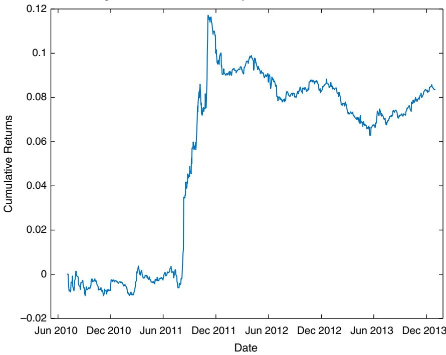
그림 4.12 SPX 구성 종목에 대한 교차 검증된 회귀 트리(K = 5)

```matlab
retPred1 = reshape(predict(bestTree, X), [length(trainset) length(syms)]);
```

이 전략의 표본 외 CAGR은 2.3퍼센트, 샤프 비율은 0.9입니다. 그림 4.12의 누적 수익률 곡선에서 보듯, 이 전략은 2011년 8월 미국 재무부 채무등급 강등 직후의 금융 혼란기에 가장 좋은 성과를 냈습니다.

혹시 변수를 정규화하지 않았다면 어땠을지 궁금하다면, CAGR은 −0.7퍼센트, 샤프 비율은 −0.4가 되었을 것입니다. 정규화 한 단계가 성패를 갈랐습니다.

왜 이렇게까지 차이가 날까요? 정규화하지 않으면 변동성이 큰 소수의 종목이 모델을 좌지우지합니다. 알고리즘은 "수익률 −5%면 매수" 같은 규칙을 세우겠지만, 이 −5%는 어떤 저변동성 종목에게는 대사건이고 어떤 고변동성 종목에게는 흔한 일입니다. 같은 숫자가 종목마다 전혀 다른 의미를 갖는 채로 뒤섞이니, 모델이 배우는 규칙은 뒤죽박죽이 됩니다. 각 수익률을 그 종목의 변동성으로 나눠 주면 비로소 모든 종목의 값이 "몇 표준편차만큼 움직였는가"라는 공통 언어로 번역되어, 500개 종목의 데이터를 한 모델이 일관되게 학습할 수 있게 됩니다.

---

## 주식 선택에의 적용 — 예측력 있는 펀더멘털 요인 찾기

이 장 내내 우리는 몇 가지 단순한 수익률 변수만 예측변수로 써 왔습니다. 그러나 금융에 대한 머신러닝의 더 흥미로운 응용은 예측력 있는 **기본적 요인(fundamental factor)** 을 발견하는 일일지 모릅니다. 2장에서 요인 모형을 다룰 때는 모든 요인이 유용하다고 전제하고 다중 회귀의 입력으로 넣었음을 떠올려 보세요. 여기서는 어떤 요인이 정말 중요한지를 알아내기 위해 단계적 회귀를 시도할 수 있습니다.

앞 절의 기술적 변수와 마찬가지로, 주당순이익처럼 분명히 정규화가 필요한 펀더멘털 변수가 있습니다. 다만 이번 정규화는 변동성이 아니라 총매출이나 시가총액을 기준으로 삼아, 서로 다른 종목의 데이터를 합칠 수 있게 합니다. 이 복잡함을 피하려고, 저자는 기업 규모와 무관한 변수만 입력으로 골랐으며 이는 표 4.3에 있습니다. (이 펀더멘털 데이터는 Quandl.com을 통해 제공되는 Sharadar의 Core US Fundamentals 데이터베이스에서 얻었습니다.)

표 4.3 규모와 무관한 입력 요인
<table><tr><td>변수명</td><td>설명</td><td>기간</td></tr><tr><td>CURRENTRATIO</td><td>유동비율</td><td>분기별</td></tr><tr><td>DE</td><td>부채자본비율</td><td>분기별</td></tr><tr><td>DILUTIONRATIO</td><td>주식 희석 비율</td><td>분기별</td></tr><tr><td>PB</td><td>주가순자산비율</td><td>분기별</td></tr><tr><td>TBVPS</td><td>주당 유형자산 장부가치</td><td>분기별</td></tr><tr><td>ASSETTURNOVER</td><td>자산회전율</td><td>최근 1년</td></tr><tr><td>EBITDAMARGIN</td><td>EBITDA 마진</td><td>최근 1년</td></tr><tr><td>EPSGROWTH1YR</td><td>주당순이익 성장률</td><td>최근 1년</td></tr><tr><td>EQUITYAVG</td><td>평균 자기자본</td><td>최근 1년</td></tr><tr><td>EVEBIT</td><td>EBIT 대비 기업가치</td><td>최근 1년</td></tr><tr><td>EVEBITDA</td><td>EBITDA 대비 기업가치</td><td>최근 1년</td></tr><tr><td>GROSSMARGIN</td><td>매출총이익률</td><td>최근 1년</td></tr><tr><td>INTERESTBURDEN</td><td>재무 레버리지</td><td>최근 1년</td></tr><tr><td>LEVERAGERATIO</td><td>레버리지 비율</td><td>최근 1년</td></tr><tr><td>NCFOGROWTH1YR</td><td>영업현금흐름 성장률</td><td>최근 1년</td></tr><tr><td>NETINCGROWTH1YR</td><td>순이익 성장률</td><td>최근 1년</td></tr><tr><td>NETMARGIN</td><td>이익률</td><td>최근 1년</td></tr><tr><td>PAYOUTRATIO</td><td>배당성향</td><td>최근 1년</td></tr><tr><td>PE</td><td>다모다란 방식 주가수익비율</td><td>최근 1년</td></tr><tr><td>PE1</td><td>주가수익비율</td><td>최근 1년</td></tr><tr><td>PS</td><td>주가매출비율</td><td>최근 1년</td></tr><tr><td>PS1</td><td>다모다란 방식 주가매출비율</td><td>최근 1년</td></tr><tr><td>REVENUEGROWTH1YR</td><td>매출 성장률</td><td>최근 1년</td></tr><tr><td>ROA</td><td>총자산이익률</td><td>최근 1년</td></tr><tr><td>ROE</td><td>자기자본이익률</td><td>최근 1년</td></tr><tr><td>ROS</td><td>매출액이익률</td><td>최근 1년</td></tr><tr><td>TAXEFFICIENCY</td><td>세금 효율성</td><td>최근 1년</td></tr></table>

표 4.4 단계적 회귀로 선택된 요인
<table><tr><td>변수명</td><td>기간</td></tr><tr><td>CURRENTRATIO</td><td>분기별</td></tr><tr><td>TBVPS</td><td>분기별</td></tr><tr><td>EBITDAMARGIN</td><td>최근 1년</td></tr><tr><td>GROSSMARGIN</td><td>최근 1년</td></tr><tr><td>NCFOGROWTH1YR</td><td>최근 1년</td></tr><tr><td>PS</td><td>최근 1년</td></tr><tr><td>ROA</td><td>최근 1년</td></tr></table>

이 입력 변수들을 앞 절과 같은 방식으로 집계하고, "단계적 회귀" 절에서 쓴 함수를 그대로 써서, 알고리즘<sup>12</sup>이 다음 분기(더 정확히는 63거래일)의 수익률에 대한 유의한 예측변수로 표 4.4의 변수들을 골랐습니다. 이 선택은 2007년 1월 3일부터 2013년 12월 31일까지의 데이터에 기반합니다. T × S 예측변수 행렬 X의 대부분 행은 값이 NaN임에 유의하세요. 대부분의 종목이 대부분의 날짜에는 이 펀더멘털 요인을 결정할 분기 실적 발표를 하지 않기 때문입니다. 그런데 `fitlm`이나 Statistics Toolbox의 다른 함수들처럼 `stepwiselm` 함수도, 예측변수 행렬에서 NaN이 든 행을 자동으로 무시해 주는 반가운 특징이 있습니다.

### 예측을 거래 전략으로 — 63일 보유

이 예측을 거래 전략으로 바꾸려면, 예측 수익률이 양수일 때마다 매수해 63일 보유하고, 음수일 때는 반대로 하면 됩니다. 이를 수행하는 코드 조각은 아래와 같습니다.

```matlab
longs = backshift(1, retPred1>0); % 1일 뒤
shorts = backshift(1, retPred1<0);
longs(1, :) = false;
shorts(1, :) = false;
positions = zeros(size(retPred1));
for h = 0:holdingDays-1
    long_lag = backshift(h, longs);
    long_lag(isnan(long_lag)) = false;
    long_lag = logical(long_lag);
    short_lag = backshift(h, shorts);
    short_lag(isnan(short_lag)) = false;
    short_lag = logical(short_lag);
    positions(long_lag) = positions(long_lag)+1;
    positions(short_lag) = positions(short_lag)-1;
end
```

물론 이는 63일 연속으로 매일 자본 한 단위씩 매수하게 될 수도 있음을 뜻합니다. 그래서 63배로 레버리지되지 않은 일별 수익률을 구하려면, 이 모든 자본 단위에서 발생한 총 손익(P&L)을 63으로 나눠야 합니다.

```matlab
dailyRet = smartsum(backshift(1, positions).*ret1(testset, :), 2)./ ...
           smartsum(abs(backshift(1, positions)), 2);
```

표본 외 CAGR은 4퍼센트, 샤프 비율은 1.1입니다. 누적 수익률 곡선은 그림 4.13에 있습니다. 앞선 SPY 기반 실험들과 달리 샤프 비율이 1을 넘어 통계적으로 유의한데, 이는 여러 종목을 집계해 데이터를 크게 늘린 효과로 볼 수 있습니다.

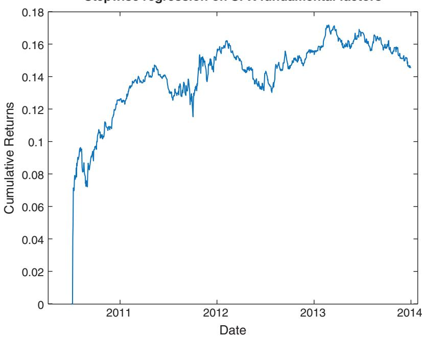
그림 4.13 펀더멘털 요인을 사용한 SPX 구성 종목에 대한 단계적 회귀

---

## 요약 — 약한 학습기를 다듬는 법이 곧 실력이다

이토록 많은 AI 기법에서 두드러지는 한 가지 교훈은, 어떤 **약한 학습기(weak learner)** 로 시작하느냐 못지않게, 그 약한 학습기를 개선하고 과적합을 줄이는 방법이 중요하다는 것입니다. 그 방법에는 교차 검증, 배깅, 무작위 부분공간, 랜덤 포레스트, 그리고 재학습과 평균화가 있습니다. 이들은 모두 데이터나 예측변수 선택에 인위적인 무작위성을 심고, 그 무작위성을 바탕으로 되도록 많은 학습기를 길러 냅니다. 그 많은 약한 학습기를 평균하거나 그중 최선을 고르면 표본 외 데이터에 더 잘 일반화되는 모델을 얻으리라는 기대에서이며, 실제로 우리는 종종 그렇게 성공합니다.

더 많은 학습 데이터(입력 배열의 행 수)와 더 많은 예측변수(열 수)는 머신러닝 알고리즘에 언제나 이롭습니다. 그러니 행이 약 1,000개, 열이 고작 4개뿐인 SPY 학습셋에서 이 기법들 상당수가 평범한 성적을 낸 것은 조금도 놀랍지 않습니다. SPX 구성 종목 학습셋도 크게 낫지 않아, 행이 약 10,000개<sup>13</sup>, 열이 27개에 불과합니다. 전형적인 머신러닝 문제는 흔히 수백만 개의 행과 수백 개의 예측변수를 가집니다. 적어도 SPY 문제라면 지금까지 발명된 모든 기술적 지표를 시도해 봐야 하고, SPX 구성 종목 문제라면 시가총액으로 정규화해야 하는 요인들까지 넣어야 합니다.

금융시장에서 이보다 몇 자릿수 더 많은 데이터를 어디서 찾을 수 있을까요? 한 가지 유망한 방향은 **고빈도 데이터(high-frequency data)** 연구이며(Rechenthin, 2014), 특히 1밀리초 이상의 빈도로 표본추출한 레벨 2 호가입니다. 또 하나는 뉴스와 소셜 미디어 같은 **비정형 데이터(unstructured data)** 를 연구해(Kazemian, 2014) 그것이 시장 움직임을 예고하는지 살피는 것입니다. Domingos(2012)는 이렇게 썼습니다. "… 머신러닝 알고리즘의 효능은 입력 특성에 크게 의존한다."

새로운 예측 문제에 부딪혔을 때 어떤 기법부터 써야 할까요? 답은 간단합니다. 가장 단순한 기법(예: 단계적 회귀)에서 시작해, 그것이 좋은 성능을 못 내면 점점 더 복잡한 기법(예: 신경망)으로 나아가면 됩니다. 트레이딩에서는 복잡함이 보상받지 못합니다.

---

## 연습문제

**4.1.** 단계적 회귀로 SPY의 익일 수익률을 예측할 때, 최신 데이터를 학습셋에 더해 매일 모델을 재학습하십시오. 단계적 회귀 절에서 제안한 거래 모델에 대해, 2009년 9월 16일부터 2014년 6월 2일까지의 기간 동안 이것이 CAGR을 10.6퍼센트 이상, 샤프 비율을 0.7 이상으로 높입니까?

**4.2.** 연습문제 4.1과 유사하게, 수익률의 크기가 어떤 임계값을 넘을 때만 매수·매도 신호를 내도록 전략을 수정하십시오. 표본 내에서 어떤 임계값이 가장 잘 작동합니까? 그것이 원래 전략보다 더 높은 표본 외 CAGR과 샤프 비율도 냅니까?

**4.3.** 연습문제 4.2와 유사하게, 매수·공매도하는 달러 금액이 예측 수익률의 크기에 비례하도록 전략을 수정하십시오. 학습셋에서 평균 절대 시장가치가 \$1이 되도록 비례상수를 조정하십시오. 그런 다음 레버리지 수익률로 CAGR을 계산하십시오. 표본 외 CAGR이 원래 전략보다 높습니까?

**4.4.** "주식 선택에의 적용" 절의 펀더멘털 데이터셋을 쓰고, 반응변수를 이산화해 상승 분기인지 하락 분기인지 예측하십시오. 무작위 부분공간 방법을 적용해 표본 외 예측 정확도가 나아지는지 확인하십시오. 또 비교를 위해 분류 트리를 쓰는 랜덤 포레스트 방법도 시도하십시오. 반응이 이산형(범주형) 변수일 때 "예측된 반응을 평균화한다"는 것은 무엇을 뜻합니까?

**4.5.** 다양한 커널 함수와 커널 스케일을 시도해 기본 SVM의 성능을 개선하십시오. 어떤 설정이 가장 좋습니까?

**4.6.** HMM의 온라인 디코딩을 구현한 소프트웨어를 찾아, for-loop 없이 SPY 모델의 은닉 상태를 디코딩하는 데 쓰십시오.

**4.7.** 예측에 앞서 매 시점마다 SPY의 HMM 모델을 다시 추정하십시오. 이것이 전략의 표본 외 CAGR을 개선합니까?

**4.8.** SPY의 HMM 모델을 써서 오늘이 강세장인지 약세장인지 판단하십시오.

**4.9.** 이 장에서 가장 마음에 드는 AI 기법을 고르고, SPY와 SPX 주식 구성종목 문제의 예측변수로 쓸 수 있도록 찾을 수 있는 한 많은 기술적 지표의 데이터를 모으십시오.

**4.10.** SPY 수익률 예측용 분류 트리 모델에 랜덤 포레스트를 적용해, 회귀 트리 모델의 해당 결과보다 나아지는지 확인하십시오.

---

## 주석

1. 이는 인간이 이해할 수 있는 간단한 언어나 규칙으로 설명될 수 없습니다.
2. 전체 코드는 `lr.m`으로 다운로드할 수 있습니다.
3. 전체 코드는 `stepwiseLR.m`으로 다운로드할 수 있습니다.
4. 전체 코드는 `rTreeBagger.m`으로 다운로드할 수 있습니다.
5. 전체 코드는 `cTree.m`으로 다운로드할 수 있습니다.
6. 전체 코드는 `svm.m`으로 다운로드할 수 있습니다.
7. 우리가 어떤 "국면(regime)"에 있는지 알아내는 일이 CNBC의 질문에 답하는 것 이상의 쓸모가 있어야 한다고 여길 수 있지만, 궁극적으로 우리는 기대수익률에만 관심이 있습니다. 국면은 이론적 구성물일 뿐이며, 국면 전환도 마찬가지입니다.
8. 전체 코드는 `nn_feedfwd.m`으로 다운로드할 수 있습니다.
9. 전체 코드는 `nn_feedfwd_retrain.m`으로 다운로드할 수 있습니다.
10. 전체 코드는 `nn_feedfwd_avg.m`으로 다운로드할 수 있습니다.
11. 구체적으로는 미국 주식 데이터베이스입니다. CRSP에 대한 더 자세한 논의는 1장을 참조하십시오.
12. 전체 코드는 `stepwiseLR_SPX.m`으로 다운로드할 수 있습니다.
13. SPX의 모든 종목을 집계하면 학습셋에는 약 654,583개의 행이 있습니다. 그러나 펀더멘털 요인은 분기별로만 갱신되므로, 이는 실제로 NaN으로 채워지지 않은 약 10,000개의 데이터 행만을 나타냅니다.

---

## 핵심 용어 정리

| 용어 | 쉬운 설명 |
| --- | --- |
| 과적합 (overfitting) | 과거 데이터에만 잘 맞고 미래(표본 외)엔 어긋나는 현상, 이 장 전체의 적 |
| 특성 선택 (feature selection) | 많은 후보 변수 중 예측에 정말 중요한 변수만 골라내는 것 |
| 단계적 회귀 (stepwise regression) | 변수를 하나씩 넣었다 뺐다 하며 최적 변수 조합을 찾는 선형 회귀 |
| 회귀 트리 (regression tree) | 부등식으로 데이터를 계층적으로 쪼개 연속 반응을 예측하는 모델 |
| 분류 트리 (classification tree) | 상승/하락 같은 이산 클래스를 예측하는 트리, 분할 기준은 GDI |
| 지니 다양성 지수 (GDI) | 한 노드가 얼마나 뒤섞였는지(불순도) 재는 값, 한 클래스만 있으면 0 |
| 교차 검증 (cross validation) | 학습셋을 K조각으로 나눠 한 조각씩 빼고 검증해 최선 모델을 고름 |
| 배깅 (bagging) | 복원추출로 데이터를 복제해 여러 모델을 학습시켜 예측을 평균(분산 감소) |
| 무작위 부분공간 (random subspace) | 데이터가 아니라 예측변수를 무작위로 뽑아 여러 모델을 만듦 |
| 랜덤 포레스트 (random forest) | 배깅과 무작위 부분공간을 결합한 트리 앙상블 |
| 부스팅 (boosting) | 앞 모델의 예측 오차(잔차)에 다음 모델을 집중시켜 순차적으로 개선 |
| 앙상블·약한 학습기 (ensemble / weak learner) | 홀로 약한 학습기들을 많이 모아 하나의 강한 학습기를 만드는 방법 |
| 서포트 벡터 머신 (SVM) | 두 무리를 가장 넓은 마진의 초평면으로 갈라 분류하는 기법 |
| 커널 함수 (Kernel function) | 예측변수를 비선형 변환해 곡면으로 데이터를 가르게 하는 함수 |
| 은닉 마르코프 모델 (HMM) | 관측 안 되는 상태(강세/약세)로 관측값(상승/하락)을 설명하는 모델 |
| 전이·방출 행렬 (transition / emission matrix) | 상태 간 이동 확률과, 각 상태가 관측값을 낼 확률을 담은 두 표 |
| EM 알고리즘 (EM algorithm) | 은닉 상태 모델의 매개변수를 가능도 최대화로 추정하는 비지도 학습법 |
| 신경망·시그모이드 (neural network / sigmoid) | S자 곡선 $S(x)=1/(1+e^{-x})$ 을 겹쳐 임의의 비선형 함수를 근사 |
| 딥러닝 (deep learning) | 층은 많고 층당 노드는 적은 신경망, 특징 풍부한 데이터에 강함 |
| 데이터 정규화 (normalization) | 종목마다 다른 변동성을 맞춰 여러 종목 데이터를 하나로 합치게 함 |

