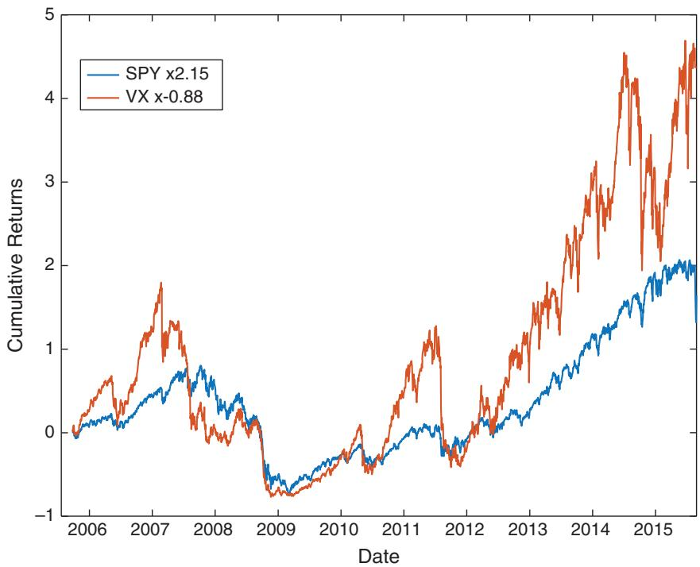
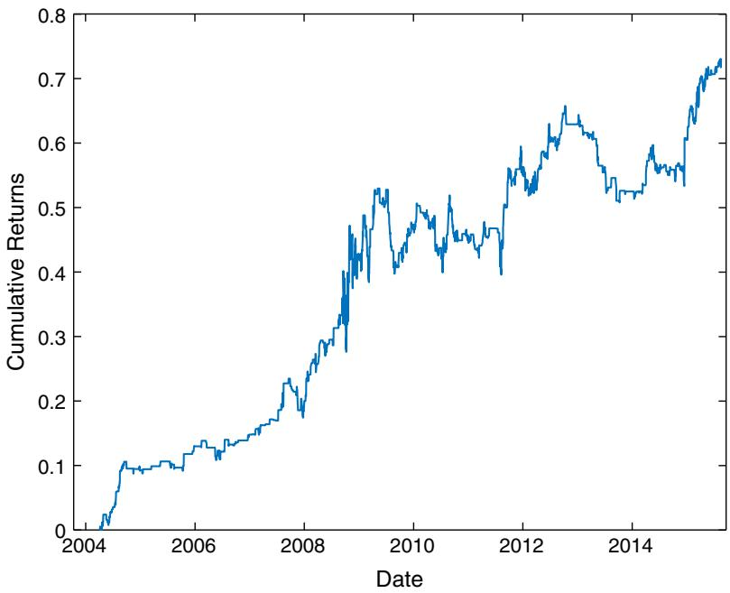
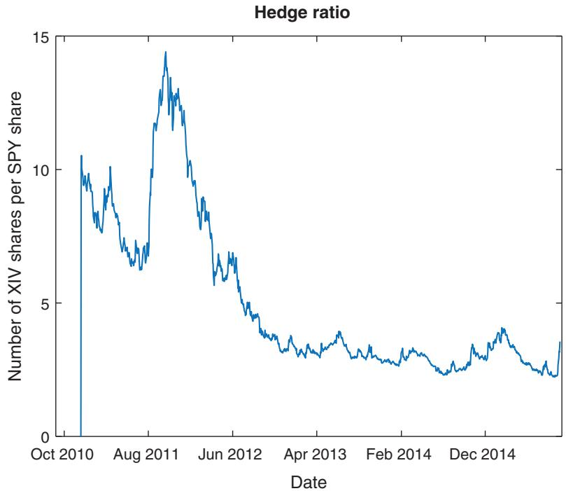
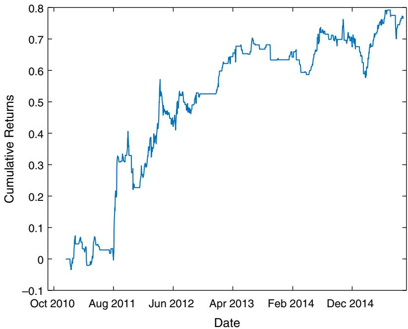
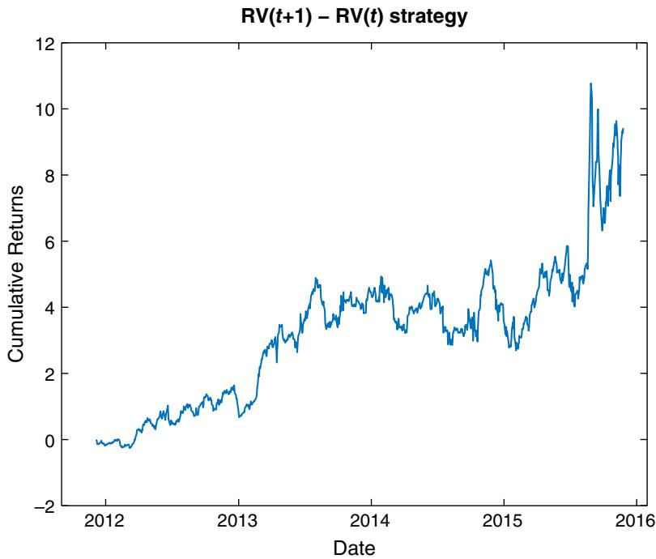
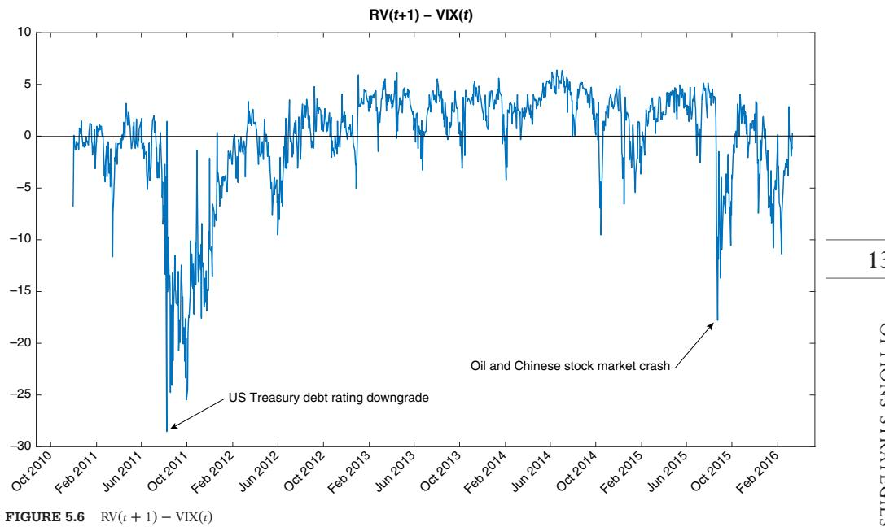
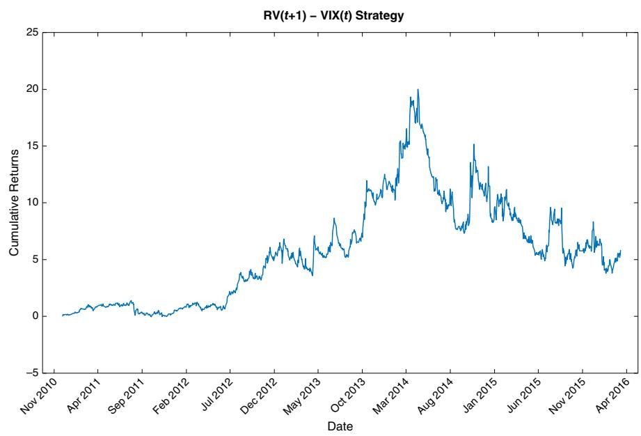
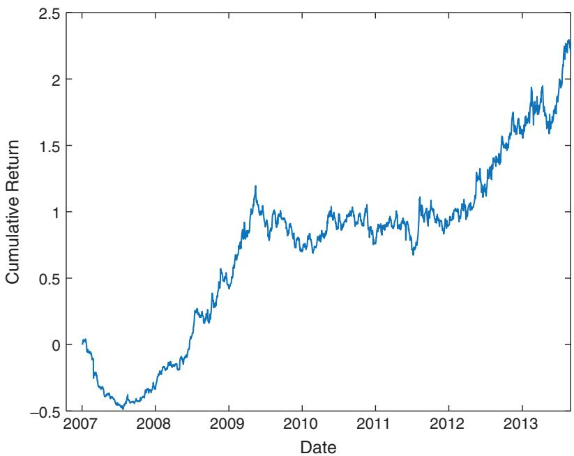
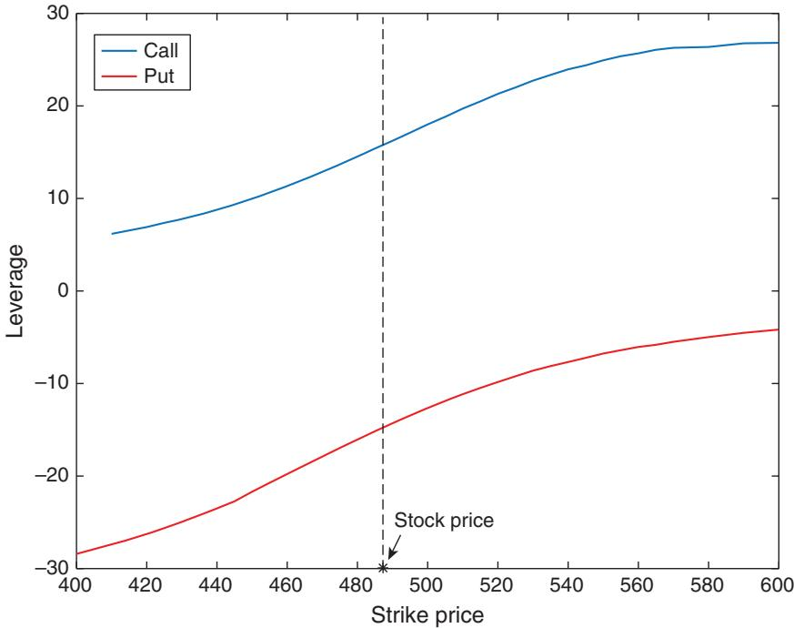

# Options Strategies

It is hard to trade options algorithmically. This is not because the theories are mathematically advanced (although they are). We don’t need to completely understand the derivation of the Black-Scholes equation or use stochastic calculus in order to backtest and execute options strategies profitably. You may be surprised to find that there are very few equations in this chapter, as there are many good books out there for those who want to learn about the theoretical derivations (Hull, 2014; Oksendal, 2013). There are also many well-known options trading strategies that have been explained in careful detail previously (McMillan, 2002; Augen, 2008; Augen, 2009; Sinclair, 2010; Sinclair 2013; James, 2015). But not many of these books actually describe backtests of intraday strategies or strategies that are applied to a large number of options on a portfolio of stocks, which is our main focus in this chapter. Since each stock (or any other type of underlying, such as stock index, future, bond, or currency) can have many options with different tenors (time-to-expiration) and different strikes, it can be quite a complicated task to backtest the selection of some of these options to form a portfolio.

The options strategies described here are mostly delta-neutral strategies. Delta is the rate of change of the option value with respect to the change in the underlying stock price. Delta-neutral means that the delta of our portfolio is zero, or nearly so. The reason we focus on such strategies is that, if you are interested in being exposed to delta, you might as well just buy (or short) stocks instead. You would incur far lower transaction costs trading stocks due to their much higher liquidity. Trading delta-neutral strategies means you are trading the other determinants of option prices: notably volatility and time-to-maturity. Many people think of trading options as trading volatilities. If we think volatility will be lower, we may collect the options premium by shorting them (covered in the section ‘‘Trading Volatility without Options’’). If we think volatility may spike up due to some events or because it is otherwise underpriced currently, we may buy them (see the section ‘‘Event-Driven Strategies’’). But it is important to note that we seldom can make a pure bet on volatility: if you are net short options because you want to short volatility, you will be long theta (the change of option value due to the passage of time, other factors being unchanged), and vice versa.

Sometimes when we think that volatility is high, but instead of shorting options, we trade the underlying using a mean reversion strategy, which is effectively shorting volatility (Ang, 2014). At the same time, we want to protect against tail events. For this, the section on ‘‘Gamma Scalping’’ fits our needs. Sometimes we are not even betting on the direction of the volatility, but on the mean reversion of the implied volatilities between different instruments (discussed in ‘‘Cross-sectional Mean Reversion of Implied Volatility’’). Other times, we may not even bet on volatilities at all, but on correlations (see the section on ‘‘Dispersion Trading’’). In all these cases, we will not be buying a single option, since that won’t have zero delta, but two or more of them, often in packages with names like straddles or strangles. We will give examples of the concrete implementation for each of the strategies in this chapter. Finally, we will explain why these backtest results are quite tenuous guides to whether the strategies will be profitable in live trading.

While no mathematical sophistication is required to understand these strategies, we assume the reader has some basic familiarity with options, so that concepts such as moneyness (e.g., OTM, ATM, ITM), tenor, implied volatility, and the Greeks (e.g., delta, gamma, theta, vega) won’t be foreign concepts.

### Trading Volatility without Options

A large and profitable industry has existed for centuries shorting volatility— the insurance industry. Similarly, hedge funds in aggregate make their money from shorting options (Ang, 2014, p. 219). The reason selling insurance (or equivalently, selling options) is profitable is that insurance has a decaying time value: as time goes on, if nothing bad happens, the value of the insurance contract continues to drop. Of course, the key condition is that ‘‘nothing bad happens.’’ But that’s the same risk we are taking by being long in equities. Assuming that we are comfortable with taking this risk, we only need to figure out how to extract the most return from it as consistently and efficiently as possible, and without bankrupting ourselves during financial crises.

The simplest strategy for an equity investor to profit from the equity risk premium is to buy-and-hold a stock index. This beats many sophisticated strategies in unlevered returns, though perhaps not in Sharpe ratio, over the long term. Similarly, the simplest strategy for an option investor is to short the futures or ETNs that track stock index volatility. For example, we can compare buy-and-hold SPY versus short-and-hold the front contract of the VX future. Of course, options and futures do expire, so it is not possible to really ‘‘hold’’ a constant short position in them. We need to continuously roll them to the next nearby contract. (We can short-and-hold the ETN VXX, but it has a relatively short history, which inconveniently misses the 2008 financial crisis for our comparison. In any case, holding VXX just means someone else is doing the rolling forward of the underlying VX futures on your behalf.) Also, the volatility of SPY is much smaller than the volatility of VX, so just comparing their returns is not very fair. One can manufacture a high positive return from practically any instrument or strategy as long as it has a positive return and we crank up the leverage. One fair way of comparison is to leverage each instrument by their Kelly-optimal leverage (see the section ‘‘Portfolio Optimization’’ in Chapter 1), and compare their compounded returns. This of course differs slightly from buying-and-holding, since maintaining a constant leverage requires daily rebalancing of our levered position in SPY or VX. Figure 5.1 shows a comparison of the optimally levered compound returns of SPY versus that of VX from April 5, 2004, to August 19, 2015.

  
FIGURE 5.1 Long SPY vs. Short VX

Table 5.1 includes some performance numbers for the two instruments:

TABLE 5.1 Performance Comparison between Long SPY vs. Short VX
<table><tr><td></td><td>2.15 × SPY</td><td>-0.88 X VX</td></tr><tr><td>CAGR</td><td>7.2%</td><td>17.8%</td></tr><tr><td>Maximum drawdown</td><td>-86.3%</td><td>-91.8%</td></tr><tr><td>Calmar ratio (since inception)</td><td>0.084</td><td>0.19</td></tr></table>

Both ‘‘strategies’’ have dizzying drawdowns, but shorting volatility has much higher returns and Calmar ratio than buying the equity index. See Example 5.1 for the implementation details of this comparison.

### Example 5.1: Comparing the levered, compounded returns of SPY and VX

Before we compute the levered, compounded returns of anything, we should first compute its unlevered, simple daily returns. This is quite trivial for SPY, but not so for the VX future. Since the VX future expires monthly, computing the daily returns of VX really means computing the daily returns of the front contract. We roll to the next nearby contract seven trading days before expiration. Since we are going to be short VX, we actually want the negative daily return of VX. Assuming that the daily returns of all the contracts are contained in a T × M array ret, where T is the number of trading days and M is the number of contracts, the code fragment to piece together the daily returns of the front contract into a T × 1 array ret\_VX is shown below:1

```matlab
expireIdx=find(isExpireDate(:, c));
if (c==1)
startIdx=expireIdx-numDaysStart;
endIdx=expireIdx-numDaysEnd;
else % ensure next front month contract doesn't start until
current one ends
```

```matlab
startIdx=max(endIdx+1, expireIdx-numDaysStart);
endIdx=expireIdx-numDaysEnd;
end
if (∼isempty(expireIdx))
idx=startIdx:endIdx;
ret_VX(idx)=-ret(idx, c); % assume short position
end
end
To find the optimal Kelly leverage for SPY and VX, respectively,
these codes will do:
kelly_vx=mean(ret_VX)/var(ret_VX)
kelly_spy=mean(ret_SPY)/var(ret_SPY)
Then finally, the levered, compounded cumulative returns are:
vx_kelly_cumret=cumprod(1+kelly_vx*ret_VX)-1; % 0.868334700884036
spy_kelly_cumret=cumprod(1+kelly_spy*ret_SPY)-1;
% 2.152202064271893
```

Can we modify the VX strategy to reduce drawdown and improve the pitiable Calmar ratio? Since the ES future’s returns anticorrelate very well with that of the VX future (Chan, 2013): We can buy VX and ES (with number of contracts in the ratio 0.3906:1) whenever VX is in backwardation with a roll return of −10 percent or less, and vice versa when it is in contango with a roll return of 10 percent or more. The Calmar ratio over the same period as Table 5.1 is 0.55—an improvement over the short-and-hold VX strategy, but not by much. See Figure 5.2 for the equity curve.

There is one detail worth noting in backtesting the VX-ES strategy: The daily settlement (closing) price of VX is obtained at 16:15 ET, while that of ES is obtained at 16:00 ET. Since we need the roll return of VX at its close to determine the trade signal, we cannot use the current day’s roll return as a trading signal—we must use the lagged value. (See VX\_ES\_rollreturn\_lagged.m from epchan.com/book3.)

VX vs. ES  
  
FIGURE 5.2 Cumulative returns of VX-ES roll returns strategy

(To complicate matters further, CME, the exchange where ES is traded, changed its settlement time for Globex equity index futures from 16:15 ET to 16:00 ET starting November 18, 2012. See Chicago Mercantile Exchange, 2012. I avoided any problem associated with this switchover in the VX-ES strategy above by using the previous day’s VX price as signal. The actual entry times of VX and ES futures may differ by 15 minutes, but this poses no error or problem to our backtest. This fortunate situation, however, may not extend to other strategies or other backtests that involve arbitrage between the CME equity index futures and futures trading on other exchanges.)

Another issue with the strategy and its backtest methodology above is that the hedge ratio of 0.3906 between VX and ES is fixed (it was determined based on a linear regression of their values prior to June 2010). This single hedge ratio tends to overestimate the number of VX contracts per ES contract when the volatility is high and likely to increase further (typically when VX is in backwardation) and underestimate the number when the volatility is low and likely to decrease further (typically when VX is in contango). Hence, we can try the Kalman filter (see Chapter 3) as a dynamic update method for the hedge ratio to see if this will improve results. To simplify the program KF\_beta\_XIV\_SPY.m, instead of trading VX vs. ES futures, we trade the XIV (the ETF that tracks the inverse of the VIX) and SPY, but otherwise the signals are the same as the VX vs. ES strategy. Of course, in this case, we will buy XIV and short SPY when the roll return of VX is negative, and vice versa. The hedge ratio is displayed on Figure 5.3.

Notice that since 2011 there is a general decline in volatility, which inversely increases the value of XIV. Hence, the number of XIV shares needed per SPY share is declining. We use the hedge ratio generated as the output of KF\_beta\_XIV\_SPY.m as input into the program XIV\_SPY\_ rollreturn\_lagged.m that actually backtests the XIV vs. SPY trading strategy.

The Calmar ratio of 0.97 from November 30, 2010, to August 19, 2015, is an improvement from 0.41 using the fixed hedge ratio to trade VX vs. ES above over the same period. See Figure 5.4 for the equity curve.

  
FIGURE 5.3 Hedge ratio between XIV and SPY determined by Kalman filter

XIV vs. SPY using Kalman filter  
  
FIGURE 5.4 Cumulative returns of XIV-SPY roll returns strategy

### Predicting Volatility

If our goal is to trade volatility as in the previous section, it would be sensible to ask how we can predict volatility. Quoting Ahmad (2005), ‘‘There are many thousands of papers on forecasting volatility using a host of increasingly sophisticated, even Nobel-Prize-winning, statistical techniques.’’ But for practical traders, let’s focus on the tried and true GARCH model. (GARCH is an acronym, but the full name doesn’t illuminate the method any better.) The model is fairly simple to describe (see Ruppert, 2015): Predicted variance of returns is assumed to be a linear function of past predicted variances of returns and past actual squared returns. Suppose $\boldsymbol { r }_{t}$ is the log return of an underlying price series from time t − 1 to t, a GARCH(p, q) model states that

$$
\begin{array}{r l} & { r_{t} = \sigma_{t} \epsilon_{t ,} } \\ & { \sigma_{t} ^ { 2 } = \omega + \displaystyle \sum_{i = 1} ^ { P } \alpha_{i} \sigma_{t - i} ^ { 2 } + \displaystyle \sum_{i = 1} ^ { q } \beta_{i} r_{t - i} ^ { 2 } } \end{array}\tag{5.1}
$$

where $\epsilon$ is a random variable with zero mean, unit variance, and zero serial autocorrelation (i.e., it is white noise), and the parameters $P , q , \omega , \alpha_{i} , \beta_{i}$ will be optimized by maximum likelihood estimation on in-sample data. (Note that the definition of p and q in Ruppert, 2015, are opposite to equation 5.1. We adopt the convention that MATLAB uses.) Example 5.2 shows how we can apply this method quite painlessly to predicting the volatility of SPY. To be precise: We only want to predict whether the magnitude of the one-day return tomorrow will be higher or lower than today’s. The resulting accuracy is quite high: We predicted the sign correctly better than 66 percent of the time, out-of-sample. We can, of course, apply the same technique to many other instruments. Here is a list, together with the out-of-sample accuracy, based on data from November 30, 2010, to March 11, 2016:

SPY: 66%

USO: 67%

GLD: 59%

■ AAPL: 60%

EURUSD: 62%

Why it is so easy to predict the sign of the change in volatility, but typically so hard to predict the sign of the change in price? The answer is that it is easy to trade on price prediction, but hard to trade on volatility prediction. Hence, any accurate price prediction method will get arbitraged away pretty quickly. But why is it hard to trade on volatility prediction? Didn’t we just suggest a VX future or VXX/XIV strategy in the previous section? If we predict that volatility will increase, why not just buy VXX, and vice versa? Actually, if we do that, we will lose money, as Example 5.2 shows. In fact, it is shown there that the opposite trading strategy works. The sign of change in VXX has negative correlation with the sign of change in realized volatility!

Predicting the sign of change in realized volatility isn’t the same as predicting the sign of change in VXX because a change in VXX does not represent purely a change in implied volatility. The price of VXX reflects the value of a portfolio of options, and option price is a function of a number of variables, not just implied volatility. One of the most important variables is time-to-expiration, which cannot be constant. Even if implied volatility and all other variables are unchanged, the value of VXX or VX is still going to decline due to negative theta. In fact, a negative theta is what’s behind the often negative roll returns of the VX future.

(As a side note, the VIX index itself does not have theta, because the index represents the value of a portfolio of options whose composition changes frequently, sometimes minute to minute. As CBOE explains,2 VIX is the weighted average price of a portfolio of OTM SPX options with tenor of

[∼, bic]=aicbic(LOGL\_vector, PQ\_vector+1, length(ret(trainset)));

23 to 37 days. There is no time decay in the collective option premium if you can always replace an aging option with a younger one!)

### Example 5.2: Predicting volatility of SPY

Since there are many numerical packages that we can use for parameter optimization and prediction based on GARCH, we need not trouble ourselves with the technical details. What we do need to understand is the intuitive meaning of this equation. It allows us to predict the magnitude of the next-period return, and it can be shown that $\sigma_{{} _ { t } }^{2}$ is the conditional variance of $\dot { \mathbf { \zeta } }_{r _ { t} }$ (‘‘conditional’’ because we know the previous values of $\sigma_{{} _ { t } }^{2}$ and $r_{t} ^ { 2 } )$ . Thus, $\sigma_{t}$ is none other than the predicted volatility that we want.

To see whether this volatility prediction method is any good, let us use the GARCH function in MATLAB’s Econometrics toolbox3 to train a model and then use it to predict the magnitude of next day’s SPY return.4 Notice that we first estimate $\boldsymbol { p } \times \boldsymbol { q } = 1 0 \times 9$ different GARCH models on the trainset from December 21, 2005, to December 5, 2011, each with a fixed value of $( p , q )$ and a log-likelihood as an output.

```matlab
for p=1:size(PQ, 1)
for q=1:size(PQ, 2)
model=garch(p, q);
try
[∼,∼,logL] = estimate(model, ret(trainset),'print',
false);
LOGL(p, q) = logL;
PQ(p, q) = p+q;
catch
end
end
end
```

We then use the BIC criterion to pick the best model (i.e., the best $P$ and $q$ values), which is the best compromise between maximizing likelihood and preferring models with fewer parameters.

It turns out that the best model is GARCH(1, 2). Hence, we use this model to forecast the next day’s variance, or equivalently, the magnitude of the next day’s return. We cannot, of course, expect this forecast to be exactly the same as the next day’s return magnitude. But from a practical viewpoint, what is important is whether the sign of the change in magnitude of the return from one day to the next agrees with the forecast. Hence, we compute the percent agreement on the trainset and the test set from December 6, 2011, to November, 25, 2015. These turn out to be 72 percent and 69 percent, respectively, which are very respectable numbers. Unfortunately, a straightforward application of this to buy (sell) VXX and hold for one day when we expect positive (negative) change in variance fails miserably. How can our volatility prediction achieve good accuracy yet generate such poor returns when applied to VXX?

The reason is, of course, that we succeeded only in predicting realized volatility (as measured by the magnitude of one-day return), but we used that to trade VXX, which is a proxy for implied volatility. Change in realized volatility does not coincide with the change in implied volatility, not even in the direction of the change. To see this, let’s compute the percentage of the days where the magnitude of the one-day returns move in the same direction as VXX, on the complete data set from December 21, 2005, to November 25, 2015 (using compareVolWithVXX.m). This turns out to be only 35 percent—far less likely than random! Now, you may think this is because many of these one-day returns may be positive, and we know that a big upward move in the equity index is correlated with a big downward move in implied volatility, and you would be partially right. But even if we restrict ourselves to those days with negative equity index returns, VXX and the return magnitude only move in the same direction 43 percent of the time. So all in all, we can conclude that realized volatility actually moves in the opposite direction to VXX on a daily basis!

Based on the above observation, we should be able to exploit this fact in a trading strategy that is opposite to the one suggested before. Whenever GARCH predicts an increase in realized volatility, we should short VXX at the close, and vice versa. Hold only one day. On the test set used in the GARCH model above, this strategy has a CAGR of 81 percent, with a Calmar ratio of 1.9. The equity curve is shown in Figure 5.5. I call it the RV(t + 1) − RV(t) strategy because the change in realized volatility (RV) is the trading signal. The backtest code is included as part of SPY\_garch.m.

  
FIGURE 5.5 Cumulative returns of RV(t + 1) − RV(t) Strategy

If we are able to predict volatility using GARCH reasonably well, there is an alternative trading strategy we can try. This strategy is inspired by Ahmad (2005), who suggested that if the predicted volatility is higher than the current implied volatility, we should buy an option and delta-hedge until expiration. So analogously, we will buy the front month VX future when the predicted volatility is higher than the current VIX value, and short when the opposite occurs (even though Ahmad, 2005, did not recommend the short trade). We call this the RV(t + 1) − VIX(t) strategy. We have shown on Figure 5.6 the value of RV(t + 1) and VIX(t) over time. We can see that GARCH predicts a much lower volatility than VIX does during the two financial crises in this period.

The trading strategy has a CAGR of 41.7 percent from November 30, 2010, to March 11, 2016, but with a Calmar ratio of only 0.5. The performance has deteriorated sharply since March 2014. The equity curve is displayed in Figure 5.7. (The backtest code can be downloaded as VX\_GARCH\_VIX.m.)





### Event-Driven Strategies

Regularly scheduled market events are good candidates for volatility trading strategies. After all, it is not easy to predict whether the Fed will increase or decrease interest rates, or whether the unemployment numbers will be good or bad, but it is a safe bet that there will be a larger-than-average movement in prices after the announcement. The only question is: Has the option market already priced in the expectation of volatility increase, or is there still profit to be made? (As we learned from Example 5.2, an increase in implied volatility does not usually accompany an increase in realized volatility.) We will look at the evidence from one market event and see if we can build a successful strategy around it: the ‘‘Weekly Petroleum Status Report’’ released by the US Energy Information Administration.

The ‘‘Weekly Petroleum Status Report’’ contains supply-side statistics on crude oil in the United States, and it often has major impact on crude oil futures prices. This report is typically released on Wednesday mornings at 10:30 a.m. ET (for weeks that include holidays the release date is delayed by one day and the time changed to 11:00 a.m.) The exact schedule can be found on www.eia.gov. If one believes that the release will increase volatility in crude oil futures, we can try buying a straddle (a call and a put at the same strike price with the same expiration date) on them in the morning of the release at 9:00 a.m., and sell the straddle one minute after the schedule is released. Shockingly, this long volatility strategy loses about \$27,110 per straddle per year! Perhaps the spike of volatility is too well-anticipated by traders, which inflates the entry price, or perhaps implied volatility once again goes in the opposite direction from realized volatility. Since buying implied volatility before the event isn’t successful, we may try the opposite. But that loses even more: \$36,060 per straddle per year. The reason that both the long and short trade lost money is due to the wide bid-ask spread. We have assumed we enter into the position using a limit order at midprice (the average of bid and ask prices), but exit the position using a market order. Options bid-ask spreads are notoriously wide (even for crude oil futures ATM options with a two-week tenor, it can be as high as 1.2 percent). Hence, the method of execution has an enormous effect on profitability. If we always assume executions with market orders, most options strategies won’t be profitable. But options traders do not always use market orders for position entry. (There is no difficulty ensuring that both legs of the straddle are filled at the same time using limit orders at entry, since CME allows traders to submit a limit order on a straddle as a single unit. In fact, we can submit any order type to trade the straddle as a single unit.)

We can also try selling volatility during uneventful periods: We can short a straddle at 9:00 a.m. on the day after the release and buy cover it at 10:29 a.m. on the following Wednesday (just before the next release). Hopefully, this would capture the period in the week that has the least volatility and risk. The backtest detailed in Example 5.3 shows that this strategy does have promise: It generates a profit of \$13,270 per straddle per year, excluding commissions, with a maximum drawdown of about \$4,050. Granted, we only backtested this on one year of data, so this is very flimsy evidence.

We can also short a strangle instead of a straddle, where the strangle can consist of a call and a put that has a strike price, say, 5 percent out-ofthe-money (but with the same expiration date). Assuming midprice entry and market exit, we obtain a profit of \$10,640, which is comparable to the straddle trade, but the maximum drawdown is \$3,410, which is smaller than that of the straddle.

Besides the ‘‘Weekly Petroleum Status Report,’’ there is a report published by the American Petroleum Institute (API) that often moves the crude oil market. This is the ‘‘API Weekly Statistical Bulletin’’ published on Tuesdays at 4:30 p.m. ET (or Wednesdays at 4:30 p.m. if the preceding Monday is a holiday). We can adapt the short strangle strategy to exit just one minute before this release, and the profit is \$9,750, similar to the other variations above, but the maximum drawdown is further reduced to \$2,950.

There are other regularly scheduled events in the futures markets that may be exploited. One is the National Oilseed Processors Association (NOPA) monthly crush report for soybeans that takes place at 12:00 noon ET on the 15th of each month (or the next business day, if that is a holiday). We can potentially trade the option OZS on the future ZS around that event. Another is the US employment report issued by the Bureau of Labor Statistics (BLS) every Thursday at 8:30 a.m. ET (or the previous business day, if that is a holiday). We can trade the ES option on the ES future for that. For stock options, earnings announcements are good (and popular) candidates for event-driven strategies.

Our trading rule is a very simplistic seasonal strategy. Interested readers may explore refinement of this. For example, would the Calmar ratio be higher if we short the straddle/strangle when the ratio of implied volatility over historical volatility is higher than some threshold? Should we short it when theta is lower than some threshold so that the straddle loses value quicker? Should we impose a stop loss or profit cap? These are variations we are leaving as exercises.

### Example 5.3: Shorting Crude Oil Futures Options Straddles

The short crude oil futures options straddle strategy seems simple: Just short a straddle on the day after the release date of a ‘‘US Weekly Petroleum Status Report,’’ and buy a cover just before the next release. But as with any options strategy, especially strategies that trade intraday, the implementation details can be staggering. This will be a good example of some of the issues we face.

Crude oil futures (symbol CL) on CME Globex expire around the 22th of every month ahead of the delivery month. For example, the February 2015 contract (denoted as CLG15 in our data and our program) will cease trading on or around January 22, 2015. However, its options (symbol LO) expire three (3) business days ahead. Table 5.2 offers a summary of the first and last dates that each contract will be a candidate for trading by our strategy. Note that we trade only options on the front (nearest to expiration) futures contract, but at the same time we require the option to have a tenor (time-to-maturity) of about two weeks. The option expiration date is approximate only, and the first trading date of J12 and the last trading date of J13 are irregular due to the limitation of our data. Furthermore, there is no guarantee that this choice of tenor produces the optimal returns: It should be treated as a parameter to be optimized. (Similarly, the exact entry and exit dates and times are free parameters to be optimized, too.) The data are from Nanex.net, which are time-stamped to the nearest 25 milliseconds.

The information in Table 5.2 corresponds to the values used in the contracts, firstDateTimes, and lastDateTimes arrays in the program. (The dateRanges array refers to the range of dates in the data files we happen to have acquired, and have no direct correspondence to the range of dates for each contract to be traded.)

As a straddle consists of one pair of an ATM put and call, we need to find out what strike price is ATM at the moment of the trade entry. Hence, we need to first retrieve the quotes data for the underlying CL futures contracts and determine the midprice at 9:00 a.m. Eastern

TABLE 5.2 Contracts Trading Dates
<table><tr><td colspan="4">O</td></tr><tr><td>Contract</td><td>Options Expires (approx.)</td><td>First Trading Date</td><td>Last Trading Dae</td></tr><tr><td>J12</td><td>20120319</td><td>20120301</td><td>20120305</td></tr><tr><td>K12</td><td>20120419</td><td>20120306</td><td>20120405</td></tr><tr><td>M12</td><td>20120519</td><td>20120406</td><td>20120505</td></tr><tr><td>N12</td><td>20120619</td><td>20120506</td><td>20120605</td></tr><tr><td>Q12</td><td>20120719</td><td>20120606</td><td>20120705</td></tr><tr><td>U12</td><td>20120819</td><td>20120706</td><td>20120805</td></tr><tr><td>V12</td><td>20120919</td><td>20120806</td><td>20120905</td></tr><tr><td>X12</td><td>20121019</td><td>20120906</td><td>20121005</td></tr><tr><td>Z12</td><td>20121119</td><td>20121006</td><td></td></tr><tr><td>F13</td><td>20121219</td><td>20121106</td><td>20121105</td></tr><tr><td>G13</td><td>20130119</td><td>20121206</td><td>20121205</td></tr><tr><td>H13</td><td>20130219</td><td></td><td>20130105</td></tr><tr><td>J13</td><td>20130319</td><td>20130106 20130206</td><td>20130205 20130227</td></tr></table>

Source: Nanex.net

Time on Thursdays. Notice that this is already a simplification: We have treated those holiday weeks when the releases were on Thursdays at 11:00 a.m. in the same way as the regular weeks. But if anything, this will only deflate our backtest performance, which gives us a more conservative estimate of the strategy profitability. In case either a Thursday and the following Wednesday is not a trading day, our code will take care not to enter into a position. After finding the underlying future’s midprice and thus the desired options strike price, we go on to retrieve the BBO (best bid offer) quotes data for the call and put with this strike price. This is quite a slow and tedious step, as every entry date requires us to download two options data files.

Retrieving historical data from a data file with regularly spaced time bars is easy, but what we have is a tick data file with quotes that may arrive within the same 25 milliseconds, which is the time resolution of our data. We will assume that quotes with the same time stamp are arranged in chronological order in the file; thus, we take only the last quote. Also, we cannot expect there is a new quote update at exactly the entry or exit time—we will take the quotes with the most recent time stamp just before entry or exit time as our execution prices.

We have a choice of whether to enter into the short straddle position at the bid (using market orders), at the ask (using a limit order), or at midprice (also using a limit order). We can backtest all three alternatives. As for the buy cover exit, we use a market order to buy at the ask prices. While the P&L in points is computed here just by taking the differences between entry and exit prices (and multiplying that by −1 since this is a short position), we should remember that P&L in dollars is one thousand (1,000) times the points difference.

The code can be found in shortStraddle\_LO.m. However, data files are not available for download due to their sizes and licensing restrictions.

### ■ Gamma Scalping

In the previous section, we weren’t able to profit from a long option position even when there is predictably a big price move. There are at least two reasons why it is hard to be profitable with a long option position:

1. Options can become very valuable during extreme market events (black swans), but these events rarely happen. So most of the time we are paying insurance premiums for nothing (as we do for, say, life insurance).

2. Option premiums decay with time. The rate of change of the value of an option with respect to time is called theta, and theta is usually negative.

However, a short option position carries the risk that when a black swan event does occur, we will suffer a catastrophic loss. Is there a way to benefit from being short volatility and yet be protected against extreme loss? This motivates a gamma scalping strategy.

In a gamma scalping strategy, we will run a mean-reversion strategy on an underlying, taking a long position in the underlying when its price moves lower or a short position when it moves higher. At the same time, we will long a straddle or strangle as a hedge. As is explained in Ang (2014), Chapter 4, a mean reversion strategy (or equivalently, a portfolio rebalancing strategy) is short volatility, while the long straddle is, of course, long volatility. The profit of this strategy is usually from the short-volatility, mean-reverting strategy, while the long straddle merely provides a hedge against extreme movements and is typically a drag on profits. (Though the mean reversion part of the strategy is short volatility, at any moment the static portfolio has positive vega and negative theta.)

At first glance, a long straddle combined with a long (or short) position in the underlying would seem to result in a portfolio that would have a delta of one (or minus one), thus fully exposed to the underlying’s movement. (The straddle would be delta neutral, while the underlying of course has a delta of one or minus one.) But actually, we will put on the underlying’s position only when there is a significant movement from the strike price of the options in the straddle. For example, if the underlying’s price suddenly increases significantly, the put’s delta will be almost zero (very much OTM), while the call’s delta will be almost one (very much ITM), and entering into a short position in the underlying will render the portfolio almost delta-neutral again. The change of the delta of the straddle per unit change in the underlying’s price is its gamma; hence, this strategy is called gamma scalping, as we try to profit from the changing delta by entering and exiting the underlying’s position as its price moves up and down. (Scalping is traders’ parlance for market making or mean reversion trading.) The more positive the gamma of the straddle, the faster the delta changes, and the more scalping profit opportunities. Note that unlike the strategies already described, the profit of a gamma scalping strategy is path-dependent. It depends not only on the initial and ending values of the underlying or the options, but on the exact path that the underlying took from the inception time to the liquidation time of the portfolio. The more often the underlying price oscillates around some mean value, the more profit we will generate. At the same time, unlike a typical mean reversion strategy as described in Chan (2013), the gamma scalping strategy does not have unlimited risk. For example, if we enter into a long position in the underlying, then if the price goes down further, the loss of the underlying will be offset by the gain in the put position almost exactly. Of course, if the price suddenly reverses and goes up, the gain of underlying will more than offset the loss due to the straddle as its delta returns to zero. This, of course, does not guarantee that a gamma scalping strategy will be profitable: If the underlying’s price changes little, the mean reversion strategy will have nearly zero profit, while the time-decay of the straddle’s premium, together with the probable decrease in realized volatility (and positive vega), will generate negative P&L.

In Example 5.4, we describe the codes for the backtest of a gamma scalping strategy on crude oil futures. This strategy establishes a long straddle position at 9:00 a.m. ET on Thursday, and liquidates everything at 2:30 p.m. ET on Friday. The reason we pick the weekly trading period to be Thursday morning to Friday afternoon is that the main profit driver of this strategy is due to the mean reversion of the underlying future contract, not the long straddle or strangle. Hence, we want to pick a period that is most favorable to mean-reversion—that is, it is devoid of expected announcements that might affect crude oil price. Also, we do not wish to hold positions over the weekend, which will incur negative theta without the compensating profits from mean reversion trading. The CL price at the inception of the straddle is used both as the strike price of the options, as well as the mean price level for the mean reversion strategy on the CL future. As CL goes up every 1 percent beyond this mean price, we will short one contract, up to a maximum of N contracts at a maximum deviation of N% from the mean. We will buy contracts in the same way if CL goes down every 1 percent instead of up, down to a maximum of −N contracts at −N% from the mean. When we enter into a new position in CL, we assume we are using a limit order to enter at the midprice, but if we exit an existing position, we will use a market order to exit at the market price (as we did in the short straddle strategy before). N is a parameter to be optimized, as is the width of 1 percent between the levels. To hedge a maximum of N futures contracts, we will buy N straddles at inception time.

With an arbitrarily chosen N = 1, the total annual P&L of this strategy is negative: The straddle lost a lot more than the mean reversion strategy was able to make. If we gamma-scalp an LO strangle instead at 5 percent OTM, the annual P&L is \$6,370, while the maximum drawdown is at \$9,400. An improvement, though still not a great Calmar ratio. The 5 percent OTM strangle is chosen so that any loss in the underlying for a price deviation beyond 5 percent will be neutralized by one of the option positions. In other words, the maximum loss of the CL position is limited to 4 percent, or about \$4,000 (assuming crude oil is worth \$100 per barrel). The loss of the strangle will, of course, be limited to the initial premium. So we are assured that there cannot be extreme losses under any circumstances.

A less arbitrary way to fix the separation between the limit price levels is to set it equal to the historical volatility of CL, as in the usual Bollinger band approach. Alternatively, these price levels can be spaced based on the delta of OTM options. For example, each leg of the strangle can be chosen to have a delta of $\pm 0 . 2 5$ . Then each price level can be set equal to the strike price of an option with delta at ±0.45, ±0.40, ±0.35, ±0.30, and $\pm 0 . 2 5$

We can also try to impose a rule that the ratio of implied volatility to historical realized volatility must be below some threshold before we would enter into a position. This is naturally opposite to the rule proposed for improving the short LO straddle strategy discussed in the section ‘‘Event-Driven Strategies.’

You may wonder if this strategy will work on stocks as well, especially after an earnings announcement when the price has settled down to a new level. But there is an advantage of running a gamma scalping strategy on futures instead of stocks: Futures and their options are traded throughout the evening (in ET) during the trading week, whereas we cannot do any scalping on stocks or their options during those times.

### Example 5.4: Gamma scalping crude oil futures with a straddle

The code for gamma scalping CL and LO is very similar to that of shorting an LO straddle. Instead of entering into a short straddle position, we enter into a long straddle position just before 9:00 a.m. ET on Thursdays, assuming midprice execution, and we exit that using market orders just before 2:30 p.m. ET on Fridays. The major difference with shortStraddle\_LO.m5 is the section that deals with the mean reversion strategy on CL. My code deals with each level (1 percent, 2 percent, … , up to 5 percent away from the initial value of CL) separately.

```matlab
for entryThreshold=levelWidth:levelWidth:numLevels*levelWidth
exitThreshold=entryThreshold-levelWidth;
end
```

For each level, we determine when we enter a long or short position, and when we exit those positions, based on whether the price exceeds the entry threshold for that level and when it reverts toward the initial value of CL by 1 percent. For example, for level 3, we will buy a CL contract if the return of CL is lower than −3 percent from the initial value, and we will hold this long position until the return of CL increases to higher than −2 percent. At the exit time on Fridays, we will liquidate all futures and options with market orders.

```c
pos_Fut=NaN(length(idx), 1);
pos_Fut(1)=0;
pos_Fut_L=pos_Fut;
pos_Fut_S=pos_Fut;
```

```c
pos_Fut_S(retFut_bid > entryThreshold)=-1;
pos_Fut_S(retFut_ask <= exitThreshold)=0;
pos_Fut_S=fillMissingData(pos_Fut_S);
pos_Fut_L(retFut_ask < -entryThreshold)=1;
pos_Fut_L(retFut_bid >= -exitThreshold)=0;
pos_Fut_L=fillMissingData(pos_Fut_L);
pos_Fut=pos_Fut_L+pos_Fut_S;
pos_Fut(end)=0;
```

After the desired future position pos\_Fut(t) at time t is determined, we still need to figure out the entryPrice (at mid-quote), and the exit-Price (at market).

```matlab
for i=2:length(idx)
myidx=idx(i);
if (pos_Fut(i-1)==0 && pos_Fut(i) > pos_Fut(i-1))
% Buy entry
entryPrice=(bidFut(myidx)+askFut(myidx))/2;
% Enter at mid-quote
elseif (pos_Fut(i-1)==0 && pos_Fut(i) < pos_Fut(i-1))
% Short entry
entryPrice=(bidFut(myidx)+askFut(myidx))/2;
elseif (pos_Fut(i-1) > 0 && pos_Fut(i) < pos_Fut(i-1))
% Sell long
exitPrice=bidFut(myidx); % Exit at MKT
PL_Fut=PL_Fut+(exitPrice-entryPrice);
if (pos_Fut(i) < 0) % Short entry
entryPrice=(bidFut(myidx)+askFut(myidx))/2;
end
elseif (pos_Fut(i-1) < 0 && pos_Fut(i) > pos_Fut(i-1))
% Buy cover
exitPrice=askFut(myidx);
PL_Fut=PL_Fut-(exitPrice-entryPrice);
if (pos_Fut(i) > 0) % Buy entry
entryPrice=(bidFut(myidx)+askFut(myidx))/2;
end
end
end
```

### Dispersion Trading

Dispersion trading is an arbitrage between options on stocks that are components of an index, and the option on the index itself. It can be understood in analogy with index arbitrage. In index arbitrage (Chan, 2013), we buy the stocks that are components of an index such as the S&P 500, and we simultaneously short the index future, or vice versa. We hope to benefit from temporary discrepancies between market value of the stocks and the index future. Similarly, in dispersion trading, we buy the stock options and simultaneously short the index option—but there is no vice versa. We usually want to short index options and seldom want to buy them because index options are typically overpriced due to the need of portfolio managers to protect their long index portfolios. The sale of structured products linked to indices also increases demand for them (Bennett, 2014).

Dispersion trading is also called correlation trading, since by buying the stock component options and shorting the index option we are in effect shorting the implied correlation of the stocks, hoping that it will converge to the lower value of the realized correlation. (The mathematical demonstration of this can be found in the Bennett article as well.) When there is a financial crisis, stocks of all stripes tend to suffer big drops at the same time. Conversely, sometimes major macroeconomic announcements may prompt a huge rise in market sentiment and all stocks surge. In both extremes, stock returns experience tail-dependence (Ruppert, 2015), as normally uncorrelated stocks suddenly move in the same direction. These are times where implied correlation will spike up. Naturally, if one was short implied correlation (i.e., long stock options and short index options), one will suffer a big loss when tail dependence hits. However, if one shorts implied correlation after extreme events occur, one may well profit from a decrease in correlation in the aftermath. Hence, the return-risk profile of a dispersion or correlation trade is quite similar to that of a short VXX position that was discussed in the section ‘‘Trading Volatility without Options.

A dispersion trade can be implemented by buying stock option straddles or strangles, and shorting index option straddles or strangles. This way, the portfolio starts off being delta-neutral. We can impose additional constraints on the portfolio to minimize exposure to other risks. For example, if we want to have a pure exposure to correlation decrease, and not to volatility changes, we can make the portfolio vega-neutral by weighing the short index option position so that its vega is equal to that of the long stock option positions. Alternatively, if we want to minimize the change of the portfolio value due to the passage of time alone, we can make it theta-neutral also by adjusting the weight of the short index option position. Our example strategy in Example 5.5 adopts the vega-neutral weighting scheme.

Just as for index arbitrage, we often find it more profitable not to include all the component stocks or stock options in the portfolio. Instead, we can select a particularly favorable subset of the index components. In our example strategy, we decide to pick the 50 stocks whose straddles have the highest (i.e., least negative) theta in order to minimize time decay of their premiums. Assuming that we are able to trade options at midprice, and ignoring commissions, we find that our example strategy has a CAGR of 19 percent (the percentage is based on the daily P&L divided by the total gross market value of the options), a Calmar ratio of 0.4, and a maximum drawdown of 51 percent from 2007 to the end of 2013. Another way to measure the profit versus risk is to note the average annualized profit is about 86 percent of the maximum drawdown in NAV (which is different from Calmar ratio based on gross market value of the portfolio). Surprisingly, neither the financial crisis of 2008 nor the market turmoil in August 2011 caused much of a drawdown, despite the inevitable increase in realized correlations. (See the equity curve in Figure 5.8.)

  
FIGURE 5.8 Dispersion trading of SPX

Our dispersion strategy rebalances the options positions at the market close every day to ensure that the portfolio remains delta-neutral, vega-neutral, and has maximal theta. The main challenge of generating profits from this strategy is to avoid incurring exorbitant transaction costs in trading options during this daily rebalance. A more cost-effective implementation would be to delta-hedge using stocks and SPY, in the same manner as in the gamma scalping strategy, instead of liquidating options that are no longer ATM. Since this needs to be done for every stock in the portfolio, it would, of course, make our already complicated backtest code more complicated. Even with that, we won’t be able to avoid updating option positions regularly in order to look for the maximal theta set, or adjusting the weight of the index option to achieve vega-neutrality.

### Example 5.5: Dispersion trading of SPX component straddles vs. index straddle

Our example strategy for dispersion is to select 50 stocks within SPX with straddles that have the highest theta at the end of each day and buy these straddles, while shorting an SPX index straddle such that the portfolio has zero vega. We choose only straddles closest to expiration but with a tenor of at least 28 calendar days, and with the smallest absolute value of delta. The maximum absolute delta allowed is 0.25 (we can’t always find a straddle with a delta of exactly zero). In case we cannot find 50 stock straddles that fit these criteria, we may hold positions in as few as 1 stock straddle. The index straddle must satisfy these criteria; otherwise, no position in either stock or index option will be held at the end of day. (Note that the previous day’s positions are not carried over unless they are selected anew.)

We pick these stocks and options from the survivorship-bias-free CRSP and OptionMetrics’ Ivy DB databases, respectively. The Ivy DB database not only provides historical option prices for all the stocks and index options, but also their Greeks. Here these data are parsed into MATLAB binary files as they are easier to manipulate than the original text files, since data can be stored as arrays in a MATLAB file. Each stock symbol (more precisely, each CUSIP) has a separate file (e.g., cusip\_89235610.mat) that continues its options data for the entire period. On the other hand, the index option data has a separate file for each trading day (e.g., 20040102.mat) due to the more voluminous data. A few of these files are available for download as illustrations.6 (For other options historical data sources, see Chapter 1.)

Backtesting a stock options portfolio is much more complicated than backtesting a stock portfolio due to the extra dimensions (strike prices, expiration dates, and whether an option is a call or put) involved. There is not sufficient memory in MATLAB to store an array containing all the options prices of all the stocks with each dimension corresponding to one attribute of an option. Hence, we have to read in the data for one stock at a time and selectively store only those data we need for the strategy. So we store only the option prices and Greeks for various strikes for a given tenor in a T × M array, where T is the total number of days and M is the total number of strike prices. In contrast, the prices and Greeks of the index options data are stored in 1 × M arrays since we read in their data one day at a time.

After loading these T × M arrays with option prices and Greeks into memory, the dispersion program goes through each day in a loop and finds all strike prices of the calls and puts of a symbol (either stock or index) which satisfy the tenor and net delta constraints, and determines their indices in the price array. This way, we can collapse the expiration date and strike price dimensions and achieve our needed data compression. The index that points to the location of the option data in the T × M arrays with the chosen expiration and strike price is then stored in the array ATMidx(t, c, [1, 2]), where t is time index, c is the symbol index, and [1, 2] points to a call or put, respectively. At this point, we have determined and stored what the eligible straddle is for one symbol. For example, ATMidx(10, 2, 1) has a value of 101. This means that on the $1 0^{\mathrm{th} }$ date (20080117) and the second stock $( \mathrm{CUSIP} = 4 3 8 5 1 6 1 0 6 )$ , the bid (ask) for the call is located in row 10 and column 101 of the T × M array ‘‘bid’’ (‘‘ask’’). The Greeks of these straddles are simultaneously stored in arrays such as totTheta or totVega. ATMidx, totTheta, and totVega all have dimension T × N where N is the number of stocks in the index (in contrast to the T × M array for each stock). What we have done so far is to compress N data files, each with several T × M arrays, into four T × N arrays, which can easily fit into memory. The following is the code fragment that does that:

```matlab
if (∼isempty(optExpireDate_uniq))
time2Expire=datenum(cellstr(num2str(optExpireDate_uniq')),
'yyyymmdd')-datenum(cellstr(num2str(stk.tday(tt))),
'yyyymmdd'); % in calendar days
optExpireDate1month=optExpireDate_uniq(time2Expire >=
minTime2Expire); % Choose contract with at least 1 month
to expiration
if (∼isempty(optExpireDate1month))
optExpireDate1month=optExpireDate1month(1); % Choose the
nearest expiration
minAbsDelta=Inf;
minAbsDeltaIdx=NaN;
strikes_uniq=unique(opt.strikes(t, :));
strikes_uniq(∼isfinite(strikes_uniq))=[];
for s=1:length(strikes_uniq) % Go through each strike
if (c<=length(cusip8))
idxC=find(opt.strikes(t, :)==strikes_uniq(s) &
opt.optExpireDate(t, :)==optExpireDate1month
& isfinite(opt.delta(t, :)) & .
opt.bid(t, :)>0 & opt.ask(t, :)>0 & strcmp
('C', opt.cpflag(t, :)) & opt.bid(t+1, :)>
0 & opt.ask(t+1, :)>0); % Ensure
we can exit position day after
entry!
else
idxC=find(opt.strikes(t, :)==strikes_uniq(s) &
opt.optExpireDate(t, :)==optExpireDate1month
& isfinite(opt.delta(t, :)) & ..
opt.bid(t, :)>0 & opt.ask(t, :)>0 &
strcmp('C', opt.cpflag(t, :)));
end
if (length(idxC) > 1)
if (t > 1) % if duplicate, use old option data
assert(c∼=length(cusip8)+1, 'We cannot deal
with SPX for duplicates yet!');
```

```matlab
idx2=find(∼isfinite(opt.strikes(t-1, idxC)));
idxC(idx2)=[];
if (length(idxC) > 1)
idxC=[];
end
else
idxC=[];
end
end
if (c<=length(cusip8)) % stock options
idxP=find(opt.strikes(t, :)==strikes_uniq(s) &
opt.optExpireDate(t, :)==optExpireDate1month &
isfinite(opt.delta(t, :)) & ..
opt.bid(t, :)>0 & opt.ask(t, :)>0 & strcmp
('P', opt.cpflag(t, :)) & opt.bid(t+1, :)>0
& opt.ask(t+1, :)>0); % Ensure we can
exit position day after entry!
else % index options
idxP=find(opt.strikes(t, :)==strikes_uniq(s) &
opt.optExpireDate(t, :)==optExpireDate1month
& isfinite(opt.delta(t, :)) & ...
opt.bid(t, :)>0 & opt.ask(t, :)>0 & strcmp
('P', opt.cpflag(t, :)));
end
if (length(idxP) > 1)
if (t > 1) % if duplicate, use old option data
assert(c∼=length(cusip8)+1, 'We cannot deal
with SPX for duplicates yet!');
idx2=find(∼isfinite(opt.strikes(t-1, idxP)));
idxP(idx2)=[];
if (length(idxP) > 1)
idxP=[];
end
else
idxP=[];
end
end
if (∼isempty(idxC) && ∼isempty(idxP))
assert(length(idxC)==1 && length(idxP)==1);
```

```matlab
totAbsDelta=abs(opt.delta(t, idxC)+opt.delta
(t, idxP));
if (totAbsDelta < minAbsDelta)
minAbsDelta=totAbsDelta;
minAbsDeltaIdx=[idxC idxP];
end
end
end
% finding the straddle with the smallest absolute delta
if (minAbsDelta <= maxNetDelta)
totTheta(tt, c)=sum(opt.theta(t, minAbsDeltaIdx));
totVega(tt, c) =sum(opt.vega(t, minAbsDeltaIdx));
ATMidx(tt, c, :)=minAbsDeltaIdx; % Pick the strike
prices for call and put to use
end
end
end
```

After locating a straddle for each stock, we then go through each day again to find the 50 of them that have the highest theta, using the array totTheta. Next, we weigh these options by the number of shares of underlying stocks required to contribute a market value of \$1. (To put it another way: The market value of the stocks each option position has the right to buy or sell has a market value of \$1.) We then compute the total vega of these stock options, using the array totVega (which, despite its name, gives the total vega for just one stock straddle, not the total vega of all the stock straddles). The number of options required for each stock is stored in a position array pos which also has dimension T × N. All the stock options have positive positions. But the index option will have a negative position with a vega equal to the negative of the total vega of the stock positions. Here is the code fragment for that:

```matlab
for t=1:lastDayIdx-1
candidatesIdx=find(isfinite(totTheta(t, 1:end-1)) &
isfinite(stk.cl_unadj(t, :)) & isfinite(totVega(t, 1:
end-1))); % consider all stock straddles
if (length(candidatesIdx) >= 2 && all(isfinite(ATMidx
(t, end, :))) && all(isfinite(ATMidx(t+1, end, :))) &&
```

```matlab
isfinite(totVega(t, end))) % Can have positions
only if enough stock candidates AND SPX index
options are available both on t and t+1.
[foo, maxIdx]=sort(totTheta(t, candidatesIdx),
'descend');
assert(all(isfinite(stk.cl_unadj(t, candidatesIdx
(maxIdx(1:topN))))), 'Some candidates have no
stock price!');
pos(t, candidatesIdx(maxIdx(1:topN)))=1./stk.cl_unadj
(t, candidatesIdx(maxIdx(1:topN)))/100; % Number of
straddles set equal to $1 of underlying. Recall
each option has rights to 100 shares.
assert(all(isfinite(totVega(t, candidatesIdx(maxIdx
(1:topN))))), 'Some candidates have no vega!');
totVega_stk=sum( pos(t, candidatesIdx(maxIdx
(1:topN))).*totVega(t, candidatesIdx(maxIdx
(1:topN))));
% assert(isfinite(totVega(t, end)),
'Index option has no vega!');
totVega_spx=totVega(t, end);
pos(t, end)=-totVega_stk/totVega_spx; % Set number of
index straddles such that their total vega is
negative that of total stock straddles' vega
d
```

(An alternative capital allocation among the stock options is to weigh them by the number of shares of underlying stocks required to contribute to their index weight. For example, if AAPL contributes 3.8 percent to the SPX, and we assume the stock portfolio is worth \$500, we need to compute the number of shares of AAPL that have the market value \$3.80, and divide this by 100 as the number of AAPL straddles to buy.)

After computing the number of straddles we need on each side, we can proceed to compute the P&L of holding these positions.

Finally, we can also compute the gross market value of these positions by multiplying the number of straddles by their call and put prices and summing across all stocks and index straddles. This way, we can compute the daily returns of the portfolio.7

```matlab
pnl=zeros(size(pos, 1), 1);
mktVal=zeros(size(pos, 1), 1); % gross market value of all stock
and index options
for c=1:size(pos, 2)-1
load(['C:/Projects/Ivy/SPX_200701_201308/cusip_', cusip8{c}],
'bid', 'ask');
mid=(bid+ask)/2;
for t=2:lastDayIdx-1
if (pos(t-1, c) ∼= 0)
assert(all(isfinite(mid(t-1, ATMidx(t-1, c, :)))));
pnl(t)=pnl(t)+100*sum(pos(t-1,c)*(mid(t,ATMidx
(t-1,c,:))-mid(t-1,ATMidx(t-1,c,:));
mktVal(t-1)=mktVal(t-1)+100*sum(abs(pos(t-1, c)*mid
(t-1, ATMidx(t-1, c, :))));
end
end
end
% SPX index
for t=2:lastDayIdx-1
if (pos(t-1, end) ∼= 0)
opt1=load(['C:/Projects/Ivy/SPX_index_200701_201308/',
num2str(stk.tday(t-1))], 'strikes', 'optExpireDate',
'bid', 'ask', 'cpflag');
opt2=load(['C:/Projects/Ivy/SPX_index_200701_201308/',
num2str(stk.tday(t))], 'strikes', 'optExpireDate',
'bid', 'ask', 'cpflag');
% prices at t-1
bid1=opt1.bid(1, ATMidx(t-1, end, :)); % 1x2 array,
[idxC idxP]
ask1=opt1.ask(1, ATMidx(t-1, end, :));
```

```matlab
% We need price at t corresponding to strikes and
% optExpireDate at t-1
idxC=find(opt2.strikes==opt1.strikes(ATMidx(t-1, end, 1))
& opt2.optExpireDate==opt1.optExpireDate(ATMidx(t-1,
end, 1)) & strcmp('C', opt2.cpflag) );
idxP=find(opt2.strikes==opt1.strikes(ATMidx(t-1, end, 2))
& opt2.optExpireDate==opt1.optExpireDate(ATMidx(t-1,
end, 2)) & strcmp('P', opt2.cpflag) );
assert(length(idxC)==1 && length(idxP)==1);
bid2=opt2.bid(1, [idxC idxP]); % 1x2 array, [idxC idxP]
ask2=opt2.ask(1, [idxC idxP]); % 1x2 array, [idxC idxP]
mid1=(bid1+ask1)/2;
mid2=(bid2+ask2)/2;
% We need price at t+1 corresponding to strikes and
% optExpireDate at t-1
pnl(t)=pnl(t)+100*pos(t-1, end)*smartsum(mid2-mid1)
mktVal(t-1)=mktVal(t-1)+100*sum(abs(pos(t-1, end)*mid1));
end
end
pnl(lastDayIdx+1:end)=[];
mktVal(lastDayIdx+1:end)=[];
cumPL=smartcumsum(pnl);
dailyret=pnl./backshift(1, mktVal);
dailyret(∼isfinite(dailyret))=0;
cumret=cumprod(1+dailyret)-1;
```

Some readers may be concerned about whether we have adjusted for dividends and splits for the options when computing P&L. Even though a call option price will drop on the dividend ex-date, unlike stock, there will be no compensating dividend payout so this is a real loss, and thus no historical adjustment is needed. Owners of a call would typically sell it before ex-date. We, however, do not take into account the need to sell a call before dividend ex-date in this strategy. (The same argument applies to puts.) On the ex-date for a split, option price do not change, but each option will be the right to buy or sell a different number of shares based on the split factor. For example, if it is a two-for-one split, a call option that was issued prior to the ex-date would allow you to buy 200 shares instead of 100 on or after the ex-date. Since the option price doesn’t change, there is no need for historical adjustment, either.

### ■ Cross-Sectional Mean Reversion of Implied Volatility

One of the advantages of being an algorithmic options trader is the ability to choose among a large portfolio of stock options to find the ones that have the ‘‘best’’ prices. But what does the best price mean for options? Clearly, it doesn’t just mean that an option is cheap: OTM options are always cheaper than ATM or ITM options, and options with shorter tenors are always cheaper than those with longer tenors, but that doesn’t mean they have better value. Instead, we may measure the ‘‘cheapness’’ of an option by its implied volatility. If it has the lowest implied volatility of all the options for the same underlying, we may consider it the ‘‘cheapest.’’ But even if an option is cheap, it doesn’t necessarily mean that we should buy it: We would only do so if we think its price is going to mean-revert.

Notice I didn’t say that we should only buy an option if its price is going to ‘‘increase.’’ There are two types of mean reversion: time-series and cross-sectional. Time-series mean reversion in this context means that we expect a cheap option will indeed increase in price later on. This has to be an unusual occurrence, though: As we know, option prices tend to decrease due to the decay of time value. A cheap option will increase in price only in the unusual situation that expectation of future realized volatility increases significantly. Another way to look at this is that a low implied volatility may indeed increase later on, but this doesn’t mean that the option’s price will increase. However, in cross-sectional mean reversion, we do not require that an option will increase in price in the absolute sense. We only require that it will increase in price in a relative sense: that it will become more expensive relative to other options of the same underlying and perhaps the same tenor. In other words, we expect that the price difference between an option with the lowest implied volatility and its peers with higher implied volatility will narrow over time, and might even change sign.

Of course, the earlier discussion concerning the cheapest option applies in an opposite way to an ‘‘expensive’’ option, too. In cross-sectional mean reversion of option prices, we would expect a relatively expensive option to become relatively cheaper.

Do cross-sectional mean reversions actually occur regularly? We can easily find out by constructing a trading strategy that should be profitable (at least in a backtest) if this is true. We start with the S&P 500 universe. Every day and for every stock in the universe, just as in the dispersion strategy, we select a slice of options that have the nearest expiration date but that have a tenor of at least 28 calendar days. We select the call option with the lowest implied volatility among them and add it to a candidate list of call options. Similarly, we select the put option with the highest implied volatility and add it to a candidate list of put options. After going through all the stocks in the universe, we form a long portfolio of 50 call options by choosing the ones with the lowest implied volatilities from the call option candidate list. Similarly, we form a short portfolio of 50 put options by choosing the ones with the highest implied volatilities from the put option candidate list. We will hold all these options positions for just one day, and rebalance the portfolio as necessary on the following day’s market close.

Naturally, due to put-call parity, we can just as well implement this strategy by shorting calls and buying puts instead. (Put-call parity is only exactly true for European options. But with the risk-free rate so low, it is almost true for American options, too, especially for the short-tenor ones we choose.)

The implementation of this backtest is structurally similar to that of the dispersion strategy, and the program is available for download as impVolCrossSectionalMeanReversion.m. The backtest of this strategy achieved an astounding daily return of 1.1 percent from 2007 to the end of 2013, without subtracting commissions, and assuming midprice executions. There are several reasons why the return is so high, and may be unrealistic. Unlike the dispersion trading strategy before, we don’t insist on using ATM options in this strategy. OTM options tend to have higher embedded leverage, and since the return we quote is the P&L of an option position divided by its market value, it is essentially a levered return that will go up with leverage.

(Leverage is calculated as delta times the price of the underlying divided by the price of its option. Figure 5.9 shows the leverages of puts and calls of AAPL as a function of strike price. Either leverage is evidently a monotonically increasing function of strike price, but the absolute values of the leverages are increasing as a function of the options’ out-of-moneyness. Since delta for puts is negative, their leverage is also negative. The code to generate this curve can be downloaded from computeLeverage.m.)

Leverage of put and call AAPL options on 2013-08-30 that expire on 2013-09-27  
  
FIGURE 5.9 Leverage of AAPL options

OTM options also tend to be less liquid and have wider bid-ask spread. Our backtest assumes midprice executions, which may be unrealistic when the bid-ask spread is wide. Strategies often have high returns on paper when those returns cannot actually be captured in live trading due to high transaction costs, which may be the case here. Nevertheless, the highly positive theoretical return illustrates that cross-sectional mean reversion of implied volatility does occur regularly.

What about the risk of this mean reversion strategy? Since we are long calls and short puts, we are certainly not market or delta neutral. This can easily be remedied by delta hedging the portfolio with a short SPY position. We will leave that as an exercise to see if it reduces the maximum drawdown. But even after delta-hedging this portfolio, it is still short vega, since we are short options with high implied volatility and long options with low implied volatility. Might this strategy work with just the long side, thus eliminating vega risk? Or can we weigh the long and short options positions to enforce vega-neutrality, just as in dispersion trading? We will leave all that to you to explore.

### Summary

It isn’t easy to profit from buying options unless one is Nassim Nicholas Taleb (Chung, 2015). Even when we think realized volatility will go up due to expected events (‘‘Event-Driven Strategies’’ section), we end up extracting returns only in the aftermath by shorting volatility. Even though we bought straddles in the ‘‘Gamma Scalping’’ section, we were only able to profit from the mean reversion trading of the underlying, which is short volatility. At best, we were able to be vega-neutral in the ‘‘Dispersion Trading’’ section. But by shorting correlation there, we were exposed to the same tail risks as shorting volatility. In the section on ‘‘Cross-Sectional Mean Reversion of Implied Volatility,’’ we actively sought options with high implied volatilities and short them, though we hedged by buying those options with low implied volatilities. We were still net short implied volatility as a result. We were acting like an insurance company in these trades. Even though Taleb is celebrated for his ability to earn 20 percent in one day during market crashes, one should note that his year-to-date return was also 20 percent, since the long volatility makes practically nothing until that day. A short volatility strategy (like the FX mean reversion strategy we run in our fund) is able to earn more than 20 percent in a year, though one will have to suffer steep drawdown during risk-off periods. It is therefore not surprising to hear expert options traders saying that they spend most of their time shorting options (Chan, 2015).

If we are to sell volatility, we might as well find the most efficient and least risky way to do it. That is why various different short volatility strategies are explored. With the aid of a computer, even independent traders are not limited to just trading a few familiar options. They can choose among a portfolio of hundreds of different options, with different underlyings, tenors, and strike prices and select the most advantageous ones to hold positions. Of course, it is quite complicated to backtest such high-dimensional strategies. The main problem is that storing high dimensional arrays in memory is not feasible in most common programming languages. We demonstrated how to get around this problem using special programming structures in the ‘‘Dispersion Trading’’ and ‘‘Cross-Sectional Mean Reversion of Implied Volatility’’ sections.

But these backtests are only suggestive—they can’t really tell us whether the strategies will be profitable in live trading. The reason for such tentativeness is the especially large bid-ask spreads of options compared to their underlyings. (We saw that even an option on a very liquid future like CL can have a bid-ask spread that is over 1.2 percent wide.) The strategies were mostly backtested by assuming that we can enter a position at midprice. In a few cases, we even assume that we can exit a position with midprice. This is not an impossible pipe dream, as options traders do manually and expertly adjust their limit prices so that they get filled without paying the full-spread, taking into account the instantaneous condition of the order book and order flow. But this is often an art rather than science. The science of balancing the opportunity cost (for not getting filled) and bid-ask cost can be explored only if one has an options trading simulator, or of course in live trading. Hence, a sophisticated automated market-making program is necessary to execute many of these strategies.

I did describe in the sections on ‘‘Trading Volatility without Options’’ and ‘‘Predicting Volatility’’ some pseudo-options strategies that can both long and short the ETF VXX or the future VX at different times. They are far easier to backtest and execute than the strategies that really trade stock or even index options themselves.

You are no doubt aware that there are many more options strategies out there than the ones covered in this chapter, involving structures such as butterflies, condors, ladders, and so on. Hopefully, the techniques introduced here will allow you to automatically search for the best structure among the hundreds or thousands of choices every day, or every millisecond.

### Exercises

5.1. What is the sign of the vega for SPX options? How do you reconcile this sign with the fact described in Exercise 5.2 that implied volatility seems to anticorrelate with realized volatility on a daily basis?

5.2. Backtest various refinements of the trading rules suggested at the end of ‘‘Event-Driven Strategies.

5.3. Assuming a CL contract is initially quoted at 100, demonstrate that the maximum loss of the mean reversion strategy on CL described in ‘‘Gamma Scalping’’ is \$4,000 for holding one contract. (The maximum loss here does not include the options premium.)

5.4. Add a delta hedging strategy to the strategy described in the section on ‘‘Cross-Sectional Mean Reversion of Implied Volatility’’ by trading SPY, and show how it affects the daily returns and maximum drawdown.

5.5. Backtest trading only the long side of the strategy described in the section on ‘‘Cross-Sectional Mean Reversion of Implied Volatility.’

5.6. Backtest weighing the options positions so that the portfolio is vega-neutral on the same strategy in Exercise 5.5.

5.7. In Example 5.2, we found that the one-day change in daily SPY returns volatility is usually opposite in sign to that of the one-day change in VXX. Check if this is true also for hourly bars. (If you program in Python, you can try this on Quantopian.com, which provides free one-minute-bar data for US stocks and ETFs.)

5.8. Instead of trading the VX future, can we implement the RV(t + 1) − VIX(t) strategy in Example 5.2 by trading the ETF VXX instead? (Hint: Study in detail the VX-ES Roll Returns Strategy in the same section.)

5.9. If an ATM call option has gamma = Γ, by how much would the delta of this option decrease if the underlying price changes by ??S?

### ■ Endnotes

1. The complete code can be downloaded as VX\_SPY\_returns.m, with complete definitions of parameters such as numDaysStart, and arrays such as isExpireDate.

2. See www.cboe.com/micro/vix/vixwhite.pdf.

3. R users can use the ugarchfit function in the rugarch package for estimating the GARCH model.

4. The complete code can be downloaded as SPY\_garch.m.

5. The codes are available for download as gammaScalp\_straddle\_LO.m. The corresponding code for buying a strangle instead of straddle can be downloaded as gammaScalp\_strangle\_LO.m.

6. The programs for converting the text files into .mat files are also available for download as parseIvyOptions.m and parseIvyOptions\_ index.m.

7. The complete program can be downloaded as dispersion.m. However, data are not available for download due to licensing restrictions.
