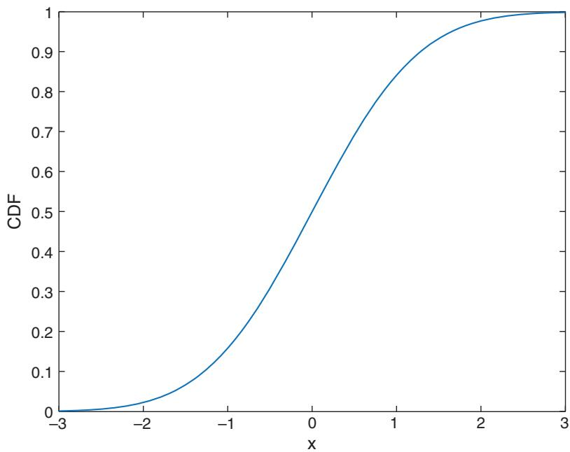

# Intraday Trading and Market Microstructure

uppose you are given a choice of two investment strategies. Both have Sthe same unlevered average annualized returns net of all costs, but one has an average holding period of one hour and the other has a holding period of one month. Which strategy would you prefer?

Most investors would prefer the first, intraday strategy. The reason is obvious: intraday strategies typically have higher Sharpe ratio than longer-term ones, given the same average returns. This is because intraday strategies can make more independent bets in one day. By the law of large numbers, the difference between an intraday strategy’s realized mean return and expected return will be smaller than that of a strategy that makes only monthly bets. Because of the higher Sharpe ratio, we can also apply a higher leverage to the strategy as per Kelly’s formula. So even if the unlevered average returns of the two strategies are the same, the levered compound return of the intraday strategy will be higher.1 Quite apart from earning higher returns, it is also obvious that the longer one holds a position, the more vulnerable we are to black swan risks.

So why don’t we all become day traders, or taking this to the extreme, high frequency traders? First, there is the issue of capacity. If you are a billionaire (or manager of a billion-dollar fund), it is almost impossible to find a day trading strategy that can generate significant returns on your asset. For example, even AAPL has an average daily trading volume of only about \$4 billion. Worse, the average top-of-book quote size for AAPL at Nasdaq is only 189 shares (Cartea, Jaimungal, and Penalva, 2015, Table 4.7). A day trading strategy cannot have orders that are much bigger than the quote size ‘‘at-the-touch’’2 without having major market impact that destroys any theoretical profit (though using dark pools can alleviate part of this problem, as we shall see.) Of course, you might consider trading stock index futures instead, which is even more liquid than AAPL. But even the ES future for the S&P 500 stock index has an at-the-touch quote size of about \$30 million only. If we submit a market order that approaches \$1 billion, we will instantly ‘‘walk the book’’ (take out multiple layers of the order book).

But even if one does not have a billion dollars to deploy, intraday traders still need to worry a lot about transaction costs that may comprise of bid-offer spread, slippage, market impact, adverse selection, opportunity cost, and so on. To understand transaction costs and how best to minimize them, we need to understand better what is generally called market microstructure in the academic literature. Part of this chapter is intended to be a primer on this topic, which includes the study of latency reduction, smart routing, market fragmentation, optimal order types, and dark pools. But beyond such execution issues, just backtesting intraday strategies involves some subtle issues that can significantly affect their accuracy. We will discuss various problems with supposedly high frequency data for such backtests. Fortunately, not everything is toil and trouble in intraday trading. We will discuss some research that uses order flow and order book information for high frequency trading.

Most of the discussion in this chapter focuses on the US stock market, since microstructure issues are most complex there. However, we will comment on relevant issues in the US futures and spot currency markets as well.

### Latency Reduction

There are three types of latencies we have to contend with in trading:

1. Order submission: The time between our submitting an order, and the order’s arrival at the market venue.

2. Order status: The time between the execution (full or partial) or cancellation/rejection/modification of our order and our receipt of the order status notification.

3. Market data: The time between the occurrence of a tick on a market venue and our reception of that tick. (A tick can be an execution or a change of a quote on that market.)

Whatever latency is, common sense tells us that it can’t be good for trading. For example, if having your order execute just a few milliseconds later will be beneficial, we could have just submitted it a few milliseconds later. Reducing latency is an important part of reducing execution costs. We will discuss how to minimize each type of latency in this section.

In this era of low-cost colocation, even retail traders can easily reduce the order submission latency to below 5 milliseconds (ms) in some circumstances. For example, you can rent a virtual private server at Equinix’s NY4 data center in Secaucus, New Jersey, through Fluid Hosting for hundreds of dollars a month, and cross-connect (for some extra hundreds of dollars) to Interactive Brokers’ (IB) Point of Presence (POP) there. Alternatively, you can rent a virtual private server at DuPont Fabros’s NJ1 data center in Piscataway, New Jersey, through Speedy Trading Servers (www.speedytradingservers.com) for a much lower price, which has an extranet connection with IB’s Stamford, Connecticut, trading servers. Either option will get your order to IB below 5 ms. Of course, IB will then reroute your order to various exchanges such as the NYSE, Nasdaq, or Globex, unless you are trading currencies in which case your order is immediately routed to IB’s FX liquidity partners that include various global banks. The rerouting time from IB to an exchange is, however, quite fast. You can beat IB’s time-to-market only if you pay huge sums of money to invest in microwave or laser transmissions, and if you meet the necessary capital requirement for your brokerage account (which can be as low as several hundred thousand dollars for currency trading) to opt for direct ‘‘sponsored’’ access to the various market centers. In this scenario, you will be collocated at the market center itself, and your order goes directly from your program to the market without going through your broker’s server. You will need a prime broker to provide you with credit for such sponsored access.

If you have minimized the latency of submitting an order, then you have also minimized the latency of receiving an order status confirmation, whether your order has been filled, cancelled, or otherwise modified. Just as in the case of order submission, we are also at the mercy of the broker, unless we have direct sponsored access to the market venue. The time it takes for your order to be transmitted to the market is usually similar to the time it takes for the order status to be transmitted back to you.

Market data latency, however, is a whole different matter. Most brokers (except FX brokers, since they often run their own FX market) do not bother to provide you with low-latency market data. This is not their core competency. For example, IB provides snapshots of stock prices at 250 ms intervals only. (The IB latency for futures, and option-on-futures, data is the same as for stocks. But for stock options it is 10 ms, and for FX, just 5 ms). In fact, there are very few market data providers that can offer stocks and futures data with lower than 10 ms latency—among them, S&P Capital IQ (previously QuantHouse), SR Labs, and Thomson Reuters are some examples. However, one should prepare to pay dearly (i.e., a few thousand dollars per month) for such data feeds. Of course, one can also subscribe to the market venues’ data feed directly. Nasdaq, for example, offers the ITCH feed which has a lot more information beyond price and size (more on this later) besides being low latency. Such an enriched, direct data feed from the market venues is generally much more expensive than the consolidated data feeds distributed by SIP,3 unless one is subscribing to a ‘‘Managed’’ version that a broker may provide to its clients.4

All the latencies we have described so far concerned the time of travel of data. But of course, there is also the issue of computational latency—the time it takes your trading program to turn market data into trading decisions. As we saw in Chapter 1, many programming languages can turn a trading strategy into an automated execution platform that can receive market data and submit an order through a broker or an exchange API, but they differ greatly in speed. In a nutshell, complied languages such as C++, C#, or Java generally run at least 10 times faster than scripting languages such as MATLAB, R, or Python (Aruoba, Boragan, and Fernández-Villaverde, ˘ 2014), and so we should use only compiled languages for intraday trading. However, there are ways to replace computationally intensive functions in a scripting language with compiled codes. If we use Mex files written in C++ for such functions in MATLAB, or if we use Numba or Cython compilers for Python, then their speed comes within a factor of 2 of that of C++. The speed of R, however, cannot yet be increased to match these.

If one doesn’t want to write automated execution platforms using universal languages such as C++ or MATLAB, one can use the special-purpose trading platforms such as Deltix, Progress Apama, and S&P Capital IQ’s Quanthouse. Though their speed may not be as fast as custom-built C++ codes, their performance won’t be too different from compiled scripting languages.

Latency affects transaction costs in two distinct ways, depending on whether one is running a mean-reversion or a momentum strategy.

We usually execute a mean-reversion strategy by placing limit orders on the order book. If our placement is a few milliseconds later than our competitors’ (other mean reversion traders or market makers), the opportunity for our order to get filled may be lost. That is because most order books use time priority5 to decide which order will get filled first, for orders at the same prices. In other words, we may suffer opportunity cost due to latency. For high-frequency traders who provide liquidity in order to earn rebates provided by some exchanges, this opportunity cost can be measured quite precisely. In addition to opportunity cost, latency also induces adverse selection. That is to say, one’s limit orders only get filled when the market goes against us immediately after execution. For example, if we place a buy limit order, we may only get filled when the price drops after the execution. This is often because the counterparties who sent market-sell orders to execute against our limit-buy orders are more informed traders, who only send out these market orders when they can accurately predict that prices will soon drop. If we have lower latency than other traders (including both market makers and informed traders), and if we are also good at predicting the short-term price movement, we may be able to cancel or modify our limit orders before they get adversely executed against. Even if we do not possess this predictive ability but enjoy the lowest latency, we can at least hope that the profits we earn from frequently providing liquidity due to our head-of-queue status will offset the losses when there are adverse executions.

If we are momentum traders, we are the informed party in such transactions. In order to immediately benefit from our information, we have to use market orders. Latency in our market orders getting executed will result in slippage—other informed traders may have already taken the quotes with better prices a few milliseconds before us. Note that here we use ‘‘information’’ in the broadest possible sense. Naturally, we include information such as news and fundamental analysis. But we also include predictions that come from quantitative or technical analysis.

### ■ Order Type and Routing Optimization

Now that we have configured our trading infrastructure with the lowest physical latency, we need to consider what sort of order types best achieve our goals within the shortest time and the lowest cost. Once again, we have to distinguish between mean-reversion (liquidity-providing, marketmaking) strategies, and momentum (liquidity/market-taking) strategies. Note that this section pertains only to US stocks trading, and the special order types discussed are mainly of interest to traders with institutional prime broker accounts (though retail traders may be able to access these through a membership in a proprietary trading firm).

### Adding Liquidity

The prototypical order type for a mean-reverting strategy is the limit order. But the problem with a plain-vanilla limit order is that it is difficult to compete in priority with the limit orders with special modifiers that many high-frequency traders use for US stocks. These special modifiers can push a limit order to the head of the queue in execution priority, so they have the best chance of getting filled ahead of everybody else and enjoy the exchange’s rebate of about 1 to 3 mils6 per share (as well as possibly earning the bid-ask spread as all market-making strategies are supposed to). One of these modifiers is generically called hide-and-light. Examples of the hide-and-light order are Hide Not Slide Order on BATS, and Post No Preference Blind Order on NYSE ARCA (see Mackintosh, 2014; Nasdaq, 2014; and DirectEdge, 2015). To understand how a hide-and-light limit order works, one has to understand a bit about the US stock market structure.

There isn’t one US stock market—there are more than 50 of them. Eleven or so of these market centers are exchanges, and the rest are dark pools. As a result, the US stock market is very fragmented, and when you submit a limit order to your broker, it is quite difficult to figure out to which market center it will be routed (unless your broker allows you to directly route to a specific market center: the so-called Direct Market Access, or DMA). Each market center maintains its own order book. But these order books are not totally independent—they are governed by a rule established by the SEC around 2007, called the Order Protection Rule (Rule 611) of the Regulation National Market System (Reg NMS). The gist of this rule is that any arriving market order (or marketable limit order) must be routed to the exchange with the best displayed quote where the order can be filled. (Only exchanges but not dark pools will have displayed quote.) The best displayed quotes across all the exchanges are called the NBBO (National Best Bid Offer), and the best displayed quotes (BBO) on each of these exchanges are ‘‘protected’’ by the Order Protection Rule, in the sense that their prices must be checked by all the exchanges to determine where an order should be routed.

Suppose a stock has best bid offer of \$10-10.02 at exchange L (some ‘‘local’’ exchange) and best bid offer of \$10-10.01 at exchange N (the exchange that has the National best offer). Assume the quote sizes are all for 100 shares (see Table 6.1). Now if a trader sends a limit buy order for 100 shares at \$10.01 to exchange L, it will not stay there. It has to be routed

Offers are in gray boxes; bids are in white boxes. Quote sizes are indicated in each column under L and N, and NBBOs have boldface quote sizes.

<table><tr><td colspan="3">Prior to Hide-and-Light Order Placement</td></tr><tr><td>Bids/Offers L</td><td></td><td>N</td></tr><tr><td>$10.02</td><td>100</td><td></td></tr><tr><td>$10.01</td><td></td><td>100</td></tr><tr><td>$10.00</td><td>100</td><td></td></tr><tr><td>After Hide-and-Light Order Placement</td><td></td><td></td></tr><tr><td>Bids/Offers</td><td>L</td><td>N</td></tr><tr><td>$10.02</td><td>100</td><td></td></tr><tr><td>$10.01</td><td></td><td>100</td></tr><tr><td>$10.00</td><td>200</td><td></td></tr><tr><td>After N Raised the Offer to $10.02</td><td></td><td></td></tr><tr><td>Bids/Offers</td><td>L</td><td>N</td></tr><tr><td>$10.02</td><td>100</td><td>100</td></tr><tr><td>$10.01</td><td>100</td><td></td></tr><tr><td>$10.00</td><td>100</td><td></td></tr></table>

to N and will be immediately executed there as a market order against the National Best Offer (NBO), which is noted in boldface. If the intention of the trader is to earn a rebate from the exchange L, this execution as market order is bad because the trader will instead be charged a liquidity taking fee by N. However, if we specify this limit buy order as a hide-and-light order, then the exchange will automatically lower its display limit price to \$10 so that it can stay on its order book, while remembering that it has a hidden working price of \$10.01. If and when the national best offer is raised to \$10.02, then the display price of this order will also be automatically lifted to \$10.01, which is now the national best bid. This change of limit price is managed by the exchange itself, requiring no further instruction from the trader—hence, it has practically zero latency. More importantly, it was time-stamped at the original time that the order was received by the exchange, not at the time that the order was repriced at \$10.01, and hence it has higher priority over all other orders (except an ISO order, which we will discuss later). Therefore it is very likely that this order will be executed and the trader will earn the liquidity rebate.

Now you may wonder how one can be so sure that the national best offer would be lifted from \$10.01 to \$10.02 shortly after the trader placed the hide-and-light order. There is one way to be sure: See into the future. What I mean is that the trader can use the fast direct data feed from the exchanges mentioned in the section on ‘‘Latency Reduction’’ to see whether the offer has been raised to \$10.02 before placing the hide-and-light order. Note that the NBBO is based on the slower SIP data feed, which is about 0.5 ms slower than the direct feed. (Ding, 2014. See also Hunsader, 2016(1) and (2).) So even if the offer has actually been raised at exchange N to \$10.02, anyone placing a limit buy order at \$10.01 will still be routed to exchange N, only to find that it will be sitting at the top of the order book at N some time (0.5 ms?) after the hide-and-light order has already been placed at the top of book at exchange L at the same price. Therefore, placing a hide-and-light order is one way to increase the chance that the order will be at the head of the queue.

The exchange L benefits from providing such exotic order types to high-frequency traders because they will get to keep the limit orders local (instead of routing them to N) and earn exchange fees when market orders get routed to its NBBO for executions. Higher volume at an exchange will also attract more orders, begetting higher volume, and so on. Finally, more volume at an exchange means that more traders will pay them high market data fees for their direct feeds. To an exchange, this is one big profitable virtuous circle.

Unfortunately, retail brokerages do not make available the hide-and-light order to their customers, since retail brokerages do not allow their customers to have direct sponsored access to the market centers. The hide-and-light order is only useful if you can submit it to the exchange faster than the latency of the SIP feed as explained above, which is just 0.5 ms or so. Even if by some good luck, your limit order did end up getting filled, some retail brokerages still would not pass on the exchange rebates to you. Instead, they simply pocket them. Only select retail brokers such as Interactive Brokers, and institutional brokers such as Lime Brokerage, will pass on the rebates. So the hide-and-light order type is really useful only if you are trading for an account large enough that can be served by a prime broker or if you are trading your membership account of a proprietary trading firm.

If getting head-of-queue priority for our limit order is the goal, and we have information from our fast direct market data feed that tells us where the NBO will be in the next millisecond, then there is another order type that is useful—the intermarket sweep order (ISO). Thankfully, this order type is sometimes available7 to retail investors.

The ISO is also a type of limit order. But unlike an ordinary limit order, a buy ISO need not be routed to the market center that has the National Best Offer (we called it market N), even if its limit price is equal to the NBO. The sender of this order is supposed to separately send another buy ISO to execute against the NBO and remove that quote. This is easy enough to accomplish, because, as we mentioned in this chapter’s introduction, the NBBO quote size is often quite small. The original ISO will be allowed to sit at the top of the order book of the local market center L as the best bid (see an illustration of this in Table 6.2). As in the case of the hide-and-light order, we may choose to do this only when we know via the fast direct data feed that the actual best offer at N is higher than the NBO. So when the SIP feed finally broadcasts the new, higher NBO to everybody, our bid at L will be the National Best Bid (NBB) and is at head-of-queue. In fact, because no repricing of the order is needed here, our bid has even higher priority than the hide-and-light order in the queue.

There are reasons other than earning rebates that make it advantageous to use the hide-and-light or the ISO orders. As already mentioned, getting our limit orders filled more frequently reduces adverse selection. (Otherwise, we may only get filled in a trending market.) Also, in this era of high-frequency trading, prices change very quickly but order routing takes time. So by the time an order is routed to the exchange with the NBBO, it might no longer be the best price. (Some exchanges actually charge a fee to liquidity providers, and pay a rebate to liquidity takers. See Box 6.1 for an example.)

### TABLE 6.2 Order Book for Exchanges L and N

Offers are in gray boxes; bids are in white boxes. Quote sizes are indicated in each column under L and N and NBBOs have boldface quote sizes.
<table><tr><td colspan="3"></td></tr><tr><td colspan="3">Prior to ISO Placement</td></tr><tr><td>Bids/Offers $10.02</td><td>L</td><td>N</td></tr><tr><td></td><td>100</td><td></td></tr><tr><td>$10.01</td><td></td><td>100</td></tr><tr><td>$10.00</td><td>100</td><td>100</td></tr><tr><td colspan="3">After Sending Buy 100 @ $10.01 ISO to Both L and N</td></tr><tr><td>Bids/Offers</td><td>L</td><td>N</td></tr><tr><td>$10.02</td><td>100</td><td></td></tr><tr><td>$10.01</td><td>100</td><td></td></tr><tr><td>$10.00</td><td>100</td><td>100</td></tr></table>

### Box 6.1: Why does BATS’ BZX exchange charge fees for adding liquidity?

The concept that a trader will earn a rebate for adding (making) liquidity, and will be charged a fee for taking liquidity (the ‘‘maker/taker’’ model), is familiar. For example, BATS’ BYX exchange pays a rebate of 0.18 cents per share (also called 1.8 mils) for adding liquidity (placing a limit order on its order book that is not immediately executable and is executed later against an incoming marketable order), and charges 0.15 cents per share for taking liquidity (sending an order to it that is immediately executed against a resting order). However, BATS’ BZX exchange does the opposite: It charges a fee of 0.20 cents for adding liquidity, and pays a rebate of 0.30 cents for taking liquidity (see www.batstrading.com/support/fee\_schedule). This seems bizarre at first sight, but the reason for sending a limit order to BZX is to gain head-of-queue priority for execution, though obviously not for rebate-earning purpose. It is for those mean-reversion traders that are able to earn liquidity-providing profits through other means (such as the many mean-reversion trading models I described in this and my previous books). By charging a fee, this exchange essentially discourages those HFT rebate-seekers from getting in front of us old-fashioned statistical arbitrageurs. It relieves us from engaging in such high-tech weaponry as using hide-not-slide orders or ISO, which are typically not available to traders without prime broker sponsored direct access to trade on exchanges. For another explanation, see Hasbrouck (2014).

### Taking Liquidity

When we are the informed traders, we want our orders to execute quickly, lest other informed traders executed ahead of us and drive prices away. A good old-fashioned market order would seem to fit our need here. However, the market order has one problem—it will have to be routed to the exchange with the NBBO. As we saw above, an uncertain fate meets our order once it arrives there: The NBBO might not actually be the best price available in the market. If we have a direct market data feed, we may know better where to send our order. But we still need to ensure that the exchange to which we send our order will not be obligated (as a result of the Order

Protection Rule) to reroute it to the exchange with the official, though not actual, NBBO. The best way to do this is to use the Intermarket Sweep Order we just discussed. There is one difference from our previous usage of the ISO—our limit price for a buy ISO order will be set higher than the best offer at the local exchange L, so that execution is immediate. ISOs are executed faster than non-ISOs even without routing, because the exchange to which the ISO is sent does not need to spend time checking the protected quotes of other exchanges before executing it.

Another circumstance where an ISO is warranted is when our order size is bigger than the NBBO size. If we didn’t apply the ISO modifier, part of the order not filled by the top-of-book quote may be rerouted to another exchange that has the best price after the original NBBO quote is filled by our order. But again, any rerouting causes latency, and when the market is moving fast due to breaking news, prices may have changed adversely after our partial order arrives at the new exchange. Adding the ISO modifier will allow the order sent to the local exchange L to ‘‘walk’’ the book—that is, fill the entire order against quotes on L by sweeping several layers of the order book, without routing any part to the exchange with the official NBBO. In fact, if we have a large market order, and if we know the order books of several exchanges, we might send multiple ISOs to the individual exchanges simultaneously to take advantage of their instantaneous liquidity. In other words, ISO allows parallel processing instead of sequential processing of our large order, reducing the chance that HFT can sniff out our order trail and front-run us (see Example 6.1).

### Example 6.1: How ISOs walk a book

Suppose we have only three exchanges, with their order books for a stock shown below (only bids are relevant for this example):

Order book for exchanges L, N1, and N2
<table><tr><td>Bids</td><td>L</td><td>N1</td><td>N2</td></tr><tr><td>$10.03</td><td></td><td>100</td><td></td></tr><tr><td>$10.02</td><td>100</td><td></td><td></td></tr><tr><td>$10.01</td><td></td><td>300</td><td></td></tr><tr><td>$10.00</td><td>200</td><td></td><td>100</td></tr></table>

The ‘‘protected’’ quote sizes are in boldface. Note that N1 has the NBB. A trader sends ‘‘sell 300 limit \$10.00 ISO’’ to L. In order to satisfy the Order Protection Rule, the trader needs to send separately to N1 a ‘‘sell 100 limit \$10.00 ISO’’ to N1. The first ISO sent to L will then walk the book and sell 100 shares at \$10.02 and 200 shares at \$10.00. But this last trade could have been done at a better price of \$10.01 on N1.

Does the Order Protection Rule require the exchange L to route a sell order of 200 shares to N1 after it executes the first 100 shares at \$10.02? The answer is no: The 300 shares at \$10.01 on N1 is not a protected quote, since it is not at the top of book on N1.

Does the Order Protection Rule require the trader to send an ISO to N2? The answer is also no: The protected quote at N2 does not have a superior price to the limit price of the first ISO, so no routing would be needed. As SEC Rule 300(30)(ii) says, ‘‘Simultaneously with the routing of the limit order identified as an intermarket sweep order, one or more additional limit orders, as necessary, are routed to execute against the full displayed size of any protected bid, in the case of a limit order to sell, … , for the NMS stock with a price that is superior [emphasis added] to the limit price of the limit order identified as an intermarket sweep order. These additional routed orders also must be marked as intermarket sweep orders.’’ (See Hasbrouck, 2014, p. 24.)

Suppose that after the ISO was sent, but before it was executed, N2’s NBB was increased to \$10.03. The trader still would not need to send an order to N2 immediately to satisfy the Order Protection Rule. As Wood, Upson, and McInish (2013), explained, ‘‘Execution of ISOs are based on the state of the market at order submission and are [sic] not impacted by changes in the market state during processing.’

To ensure that our limit ISO will behave like a market order, and not end up as a resting limit order on the book if there is not enough liquidity on the book to execute against it, we can add the immediate-or-cancel (IOC) modifier to it. This way, the unexecuted part of the limit IOC will simply be canceled. As we will discuss in the section on ‘‘Adverse Selection,’’ adding the an IOC modifier is generally a good way to prevent adverse selection against a limit order.

(An IOC modifier can be applied to a market order, too. In this case, the market order will similarly not be routed to the exchange with a protected quote that has a better price than the quotes at the local exchange. But it also won’t be allowed to execute against quotes that are not NBBO at L. Instead, it will be cancelled after executing the portion that matches with an NBBO quote. See Exercise 6.2.)

Simply put, latency is bad for informed traders, rerouting causes latency, and using ISO can avoid rerouting. And apparently, because only professional traders use ISO, order flow (a concept to be discussed later in a separate section) generated by an ISO has more information content than order flow from ordinary market order (Chakravarty, Jain, Wood, and Upson, 2009).

While ISO sounds like a very useful way to get our order to the head-of-queue as described in the subsection ‘‘Adding Liquidity,’’ or to quickly capture liquidity as described in this subsection, it may have some unpleasant side effects. It has been blamed as a cause of ‘‘flash crashes’’ or ‘‘mini flash crashes’’ (Golub, Keane, and Poon, 2012). The most famous flash crash occurred on May 6, 2010, but there have been many mini flash crashes in individual stocks both before and after that. One definition of a flash crash (assuming a downward crash in prices) is that the stock ticks down at least 10 times, and this ticking down happens within 1.5 seconds, and the price change exceeds −0.8 percent. (A symmetrical definition applies to an up crash.) One can see that an ISO can cause such crashes, since it is allowed to walk the book at an exchange despite the possible existence of better quotes elsewhere. Those better quotes are not ‘‘protected’’ by the Order Protection Rule, since they are not the BBO at that exchange, and there is no need for any order to be routed to them. But a large but ordinary market order can also walk the book, except that a small portion of it will be routed by the local exchange to the exchange with the NBBO. So it is not clear a priori whether ISOs or market orders are the cause of flash crashes. Only after a careful examination by Golub, Keane, and Poon (2012), have they determined that fully 71.49 percent of them are caused by ISO.

### Routing to Dark Pools

Dark pools are market centers that do not display any of their quotes— traders can submit hidden orders to them. But just like any market center, they do have to report their trades after execution.8 There are over 40 dark pools for stocks in the United States. Examples of dark pools are Goldman Sachs’s Sigma X, ITG’s POSIT, and formerly IEX.9 Not all hidden orders reside on dark pools—they can reside on any of the 11 or so exchanges discussed above. But an order sent to a dark pool is unique in that it will usually be executed at the midprice within the NBBO, and thus only the side (buy or sell) and size but not limit price are attached to such an order. On some dark pools, traders can agree to pay a premium above/below midprice for priority executions (see Nimalendran and Ray, 2011), and on others, traders can specify ‘‘price protection.’’ Price protection specifies the worst price at which an order can get executed. When an order arrives at a dark pool, and there is no unexecuted (resting) order on the opposite side, the order will rest in the pool, undisplayed. (Similarly, if the aggregate resting order is smaller in size than the incoming order, the unexecuted part of the incoming order will rest in the pool.) Whenever an opposite order arrives, part or all of the unexecuted resting orders will get filled at the NBBO midprice. A typical dark pool will allocate these fills on a pro rata basis, not on a time priority basis (Hasbrouck, 2015). For example, if trader A has a buy order for 1,000 shares resting on the dark pool, and trader B has a buy order for 2,000 shares resting, and there is an incoming sell order of 1,500 shares, then 500 shares of A’s order and 1,000 shares of B’s order will be filled.

If we are an informed trader (in the special sense that we have been using), there is a big advantage in sending an order to a dark pool instead of sending a market order, or a limit IOC order, to a lit market. The first reason is obvious: The execution at a dark pool will save us half the NBBO spread compared to a market order. The second reason is also easy to understand. If we send a large market order to an exchange, it is likely to walk the book and the average execution price won’t be the NBBO. But if we send it to the dark pool, we may just need to wait for a short time before our order is completely filled, and there is a chance that the NBBO midprice won’t move adversely against us over that short period. The third and most important reason for sending our order to the dark pool is that, as we shall see below, market orders carry information, and this information is captured by the ‘‘order flow’’ measure that we will discuss in the section on ‘‘Order Flow.’’ If we plan to send more orders on the same side, this order flow information will cause other traders to front-run our subsequent orders. If our order is executed in a dark pool, no order flow is generated because there is no ‘‘aggressor’’ side to the trade.

However, there are reasons to avoid dark pools, too. The most prob lematic is that the NBBO midprice can be front-run or manipulated so that executions in the dark pool are disadvantaged.

Front-running the NBBO midprice is a form of latency arbitrage. Recall that NBBO is determined by the slow SIP market feed. Hence, a trader subscribing to fast direct feeds from the exchanges knows where the NBBO midprice will be in the next millisecond or two. If that midprice will go higher, the trader just needs to send a buy order to the dark pool now and then send a sell order later once the new official NBBO is established. It is true that many dark pools no longer use the official NBBO midprice as their matching price. Instead, they also subscribe to the direct feeds of various exchanges to determine the actual NBBO. However, they are apparently still some microseconds behind some high-frequency traders. This is the reason why the former dark pool IEX was established to much fanfare (Lewis, 2014). It has introduced a 350-microsecond delay between order submission and execution, so that it has the time to update to the latest actual NBBO before allowing an order to match at that midprice (Aisen, 2015).

Manipulating the midprice is an altogether more nefarious activity. A trader S sends a small buy limit order to an exchange to increase the NBB, and thus, the midprice. S then sends a large sell order to the dark pool for execution at this raised midprice. S next cancels the buy limit order at the exchange, and sends a small sell limit order to that exchange to decrease the NBO. S sends a buy order to the dark pool to cover its short position. Finally, S cancels its sell limit order at the exchange. Note that even if the small limit orders that S placed on the exchanges were filled before S got the chance to cancel them, no big harm was done, since they were small, and in that case S does not need to follow up with the large order to the dark pool. We call this trader ‘‘S’’ because this is considered spoofing, an illegal activity. But just because it is illegal doesn’t mean it is not happening, and that other dark pool users won’t be disadvantaged by it.

The two ways to game the dark pool midprice described are all done by third-party traders, through little or no fault of the dark pool itself. But some dark pools are actually complicit in taking advantage of the slower traders. They would, for example, reveal information on resting orders to their affiliated proprietary trading group (e.g., Pipeline, ITG; see Hasbrouck, 2015), or they would let high-frequency trading partners get access to such information (e.g., Barclays, Hasbrouck, 2015.) Such dark pools are only dark to the general public—they are brightly lit for insiders and partners! Some dark pools also allow their partners to submit a special order type which price-improves the NBBO midprice by less than a penny (e.g., UBS, Hasbrouck, 2015.) These partners who submit subpenny orders are likely to get filled first when they detect that the order flow is not informed (and where the order flow information comes from inside information on the dark pool order book). Naturally, all these gaming and information leaks introduce a high degree of market impact and adverse selection to large orders sent to these dark pools.

So in conclusion, is it recommended to route market orders to dark pools? The short answer is: You can always route them to dark pools that do not have such problems, which formerly would include IEX. Beyond IEX, you can quantitatively measure the degree of adverse selection (as will be discussed in the next section) for the dark pools that you are considering routing to, and route orders to dark pools with lowest adverse selection first (Saraiya and Mittal, 2009).10 You can also add the IOC modifier to your order, so that it won’t be subject to adverse selection. This means that if there is not enough liquidity resting on the opposite side of the order book on the dark pool, the unexecuted part of your order will be cancelled. Finally, if your order isn’t that large, my personal experience is that routing to any dark pool often beats sending a market order and letting your broker route it to the NBBO.

### Adverse Selection Reduction

Sometimes we have a buy limit order on the book, but we never manage to get it filled because no one hits our bid. A little later, the best bid goes above ours, making our purchase further out of reach. We incur opportunity cost. Other times, our buy limit order does get filled quickly, but right after our purchase, the BBO goes lower, generating (unrealized) loss for us. If these two situations happen often, then we are suffering from adverse selection in that market.

Adverse selection happens when prices on average go down after we buy something, and go up when we sell something. This happens because the traders on the other side of our trade (the ‘‘aggressors’’) are informed ones—they possess information or models that are good at shortterm prediction of prices.

Who, then, would be the uninformed traders? There is a saying: ‘‘If you can’t spot the sucker at the poker table, it’s probably you.’’ If we are running a rebate-earning or market-making strategy, we would be the uninformed traders, since our only model is to buy when prices are cheap, no matter why they are cheap. If we are running a large mutual fund, and suffer some redemption requests from our retail customers, we may need to sell some holdings to raise cash. In that case, we would also be the uninformed traders—we are selling because of our immediate liquidity need, not because we know where the prices will go. (See the section on ‘‘Mutual Funds Asset Fire Sale and Forced Purchases’’ in Chan, 2013, and also Harris, 2003, for a general discussion of informed versus liquidity traders.) Adverse selection can be measured quite accurately by computing the difference between the P&L of unfilled orders and the P&L of filled orders over a short time frame from 1 second to 30 minutes (Saraiya and Mittal, 2009). As we will discuss in the section on ‘‘Order Flow,’’ market orders generate order flow, and market orders from highly informed traders generate ‘‘toxic’’ order flow (Easley, Lopez de Prado, and O’Hara, 2012). It is toxic to market makers and mean-reversion traders because of adverse selection.

Adverse selection only affects orders that are resting on the order book— in other words, it only affects the passive orders that provide liquidity. Such passive orders include limit orders and market orders sent to dark pools that are not immediately executable. If we are the informed traders, we would be sending market orders to the lit exchanges so that our information does not get stale, and of course such market orders always get filled immediately. Whether the trade turns out to be profitable or not, it is not the fault of the counterparty—it is the fault of our own price prediction model. The counterparty is not selectively filling our unprofitable market orders. Sending limit IOC orders to the lit exchanges, or market IOC orders to the dark pools will also protect us from adverse selection. Either way, the order will not rest on the order book and cannot be adversely selected against. Limit and market IOC orders take, not make, liquidity.

As we mentioned in the section on ‘‘Latency Reduction’’ and that on ‘‘Adding Liquidity,’’ if our strategy does involve providing liquidity, then we should at least make sure that our orders are at the head of the queue in execution priority. This way, we will hopefully benefit from exchange rebates or other forms of market-making profits more often in order to offset the losses inflicted by toxic flow. Lower-order submission and confirmation latency, and using special order types such as hide-and-light and ISO, also help.

Most of what we have discussed applies generally to US stock and futures markets. (Some of them may apply to the US stock options markets, too.) It also applies to currency markets, with one notable exception.

Currency markets are even more fragmented than the US stock market. There is no consolidated order book, no routing, and no Reg NMS to encourage best executions. Anybody (at least anybody outside of CFTC and other national regulators’ jurisdiction) can start an FX brokerage and run their own currency market. Liquidity (i.e., orders that sit on the book) is often provided not by other buy-side traders, but by large banks or hedge funds, and all manner of mark-ups can be applied as the brokerage see fit. In other words, the spot currency market is an over-the-counter market, not an exchange-based market. Despite all this opaqueness, the spot currency market is still the most liquid market, and often has narrower bid-ask spreads in percentage terms than even currency futures which are traded on exchanges.

There is one feature in the spot currency market, however, that is particularly troublesome to traders. This is the ‘‘last look’’ feature. Last look means that some of the quotes we see on the order book are not firm: Market makers (often called ‘‘LP’’ for liquidity provider, or liquidity partner, in the industry) can simply not honor the quotes after they have received our marketable orders. They have many milliseconds to check whether the quotes they pose on different market centers are all being hit in the same direction simultaneously, and decide what, if any, fraction of these quotes to honor. This may sound reasonable: Because the currency market is not consolidated, not even virtually as for the US stock market, the LP has no choice but to post quotes on many different market centers. But if all these quotes were filled, the LP will end up with a large unbalanced position, and such positions pose significant risks.

In addition to avoiding getting hit on multiple markets simultaneously, LPs can also use the last look period to check if the BBO changes significantly across all these markets. If so, this would indicate a large informed trader is on the other side of the trade, and they would decline to fill this order to avoid adverse selection. Unfortunately, this act of avoiding adverse selection on the part of the LP induces adverse selection for the buy-side traders. If market makers can pick and choose when to fill our market orders or marketable limit IOC orders, then there is no doubt that our orders will suffer from adverse selection.

I was a victim of last look on one occasion. Our team backtested a fairly high-frequency strategy based on order flow (similar to the one discussed in the section on ‘‘Order Flow’’). It was very profitable not only in backtest, but also in live walk-forward test using HotspotFX’s UAT (user acceptance testing) account. This account uses real-time quotes from the real HotspotFX order book for simulation. However, when we started trading in a production account, our strategy was devastated. Why? Our market orders that got filled were unprofitable, and the ones that got rejected due to last look were the ones that turned out to be profitable—a classic symptom of adverse selection. It is true that we can request last look to be turned off for the quotes presented to us. But once we did that, the BBO spread widened considerably, and the strategy was still unprofitable despite the absence of last look.

It is important to note that last look induces adverse selection on market or limit IOC orders, but has no effect on limit orders that we place on the order book. This is quite in contrast to adverse selection in the stock or futures markets, which affects limit orders on the book but not market or limit IOC orders. Hence, last look only adversely affects FX momentum strategies, but not mean-reverting or market-making strategies.

As my experience above shows, the presence of last look also presents a problem for backtesting or even walk-forward-testing FX momentum strategies: One can never be sure which one of our orders will actually get filled. So accuracy of such backtests or forward tests is questionable.

Fortunately, not every FX market center has the last look feature (e.g., LMAX does not have last look), and even for those market centers that do have this feature (e.g., HotspotFX and FXall), there is an effort underway to tighten constraints on its use (Albanese, 2015). They may shorten the period where last look can take place, and they can set minimum acceptance rates for liquidity partners (i.e., they cannot reject too many orders based on last look).

### ■ Backtesting Intraday Strategies

To properly backtest intraday strategies that use market orders, we have to at least use NBBO (or BBO, in the case of instruments such as futures that trade on a single market center) data sampled at whatever frequency is appropriate to our strategies. This is because liquidity can vary greatly intraday,11 and so can execution cost. It is quite inaccurate to backtest an intraday strategy by assuming half an average bid-ask spread as execution cost.

When backtesting US stocks strategies, even such top-of-book data are not sufficient for reasons that we have touched on before: thin NBBO liquidity means that our order size can easily be bigger than the NBBO size, so it will have to walk the book at the local exchange, or parts of it will have to be rerouted to another exchange. This means a true backtest requires at least level 2 quotes. But even level 2 quotes won’t be able to accurately reflect the actual route that our order, or pieces of it, will take across the 60+ market centers, and what prices it will execute against during its excellent adventure.

(Why does even a stock like AAPL have a typical NBBO size of 189 shares, as mentioned in the introduction? Those may be ‘‘sniffer’’ orders placed by high-frequency traders to gauge market demand, or to gauge the quantity of hidden orders inside the NBBO, or to earn liquidity rebates by always standing at the head-of-queue using hide-and-light orders or ISOs. In any case, due to the fear of adverse selection by large informed traders, nobody wants to post a large order at the NBBO. In fact, these small orders may be a way to detect the toxic flow that induces adverse selection, so that the high-frequency traders can trade in the same direction!)

Even more difficult is to backtest a mean-reverting or market-making strategy that uses limit orders. A static snapshot of the order book(s) will not tell us whether our limit order will be filled, because we don’t know what priority we have in the queue. One has to use the stream of historical order book messages such as the aforementioned Nasdaq ITCH data12 that allows us to reconstruct the history of the order book. HotspotFX also provides an ITCH feed for its currency market. These messages include events such as a limit order addition (only for displayed orders), execution13 (in full or in part, for displayed or hidden orders), cancellation, and the associated ticker, price, size, side, the unique market participant ID, the unique order ID (only for displayed orders), and, of course, the time stamp in millisecond or higher frequencies.14 Incoming market orders are not recorded by these messages, but their interactions with the order book can be inferred from the executions of the limit orders. These ITCH messages are available to subscribers during live trading. But missing from them are the modifiers, so we still won’t know if an order will get ahead of us in queue priority because it is a hide-and-light order, or an ISO. Naturally, backtesting a strategy using these messages is not a simple task, but there are platforms such as Lime Brokerage’s Strategy Studio that incorporate a fill simulator for limit orders, and many high-frequency trading firms as well as brokers have built advanced simulators for their internal or customers’ use.15 (Sometimes an exchange or a data vendor will only provide us with historical ITCH messages but not the BBO quotes for our backtest. In this case, we will have to construct the BBO ourselves using these messages. Example 6.2 shows you how.)

### Example 6.2: Constructing the BBO using ITCH messages

This coding example shows how one can find out the BBO of an order book at every instant by processing a time series of messages similar to the ITCH messages from Nasdaq or HotspotFX. However, I do not have samples of Nasdaq or HotspotFX ITCH messages—I only have samples of bitcoin (see Chapter 7) messages from the Coinsetter exchange. But the algorithm for constructing the order book is, of course, the same no matter what the actual traded instrument is.

The Coinsetter messages have five important fields that describe an event: ExchangeTime (in nanoseconds based on UTC time), Side (BUY or SELL), Level (i.e., order price), EventAmount (i.e., order size), InformationType (one of ‘‘WORKING\_CONFIRMED,’’ which means order addition, ‘‘CANCELED\_CONFIRMED,’’ ‘‘FILL\_ CONFIRMED,’’ ‘‘PARTIAL\_FILL\_CONFIRMED’’). One way to simulate an order book is to use the binary search tree data structure, implemented in MATLAB as part of a free Data Structures package by Brian Moore (www.mathworks.com/matlabcentral/fileexchange/ 45123-data-structures). One binary search tree will keep us updated as to which bid (active, not filled, or cancelled) has the highest price (best bid), and another tree will similarly handle the offers, amidst all the additions, cancellations, fills, and partial fills events. So actually, the order book is split into two independent halves: the buyOrderBook and the sellOrderBook.

To initialize the binary search trees, a.k.a. order book, we add the first orders:

```matlab
assert(strcmp(action(1), 'WORKING_CONFIRMED'));
if (strcmp(side(1), 'BUY'))
bid(1)=price(1);
bidSize(1)=orderSize(1);
buyOrderBook.Insert(price(1), bidSize(1));
elseif (strcmp(side(1), 'SELL'))
ask(1)=price(1);
askSize(1)=orderSize(1);
sellOrderBook.Insert(price(1), askSize(1));
end
```

The bid(1) (ask(1)) represents the best bid (offer) at the time of the first event. Note that the arrays bid and ask are indexed by events, not by regular time intervals. These are truly ‘‘tick’’ data.

Then we need to process the subsequent events sequentially in a for-loop, assuming they appear in chronological order. For example, if we add a buy order, we need to find out if its price is better than the current best bid. If so, we reset the best bid, and its size, and insert that bid into the buyOrderBook. If its price is the same as the current best bid, we merely increase the best bid size, and update the bid size in the buyOrderBook (a delete followed by an insert). If its price is inferior to the current best bid, then we will just insert it into the buyOrderBook, and copy forward the current best bid. The following code fragment illustrates this:

```matlab
if (strcmp(action(t), 'WORKING_CONFIRMED'))
if (strcmp(side(t), 'BUY'))
if (price(t) > bid(t-1) || isnan(bid(t-1)))
bid(t)=price(t);
bidSize(t)=orderSize(t);
buyOrderBook.Insert(price(t), bidSize(t));
elseif (price(t) == bid(t-1))
bid(t)=bid(t-1);
bidSize(t)=bidSize(t-1)+orderSize(t);
buyOrderBook.Delete(buyOrderBook.Search(price(t)));
buyOrderBook.Insert(price(t), bidSize(t));
else
bid(t)=bid(t-1);
bidSize(t)=bidSize(t-1);
buyOrderBook.Insert(price(t), orderSize(t));
end
ask(t)=ask(t-1);
askSize(t)=askSize(t-1);
end
end
```

If there is a buy order cancellation or a fill (full or partial), we need to see if that order is the best bid. If so, we need to find out what the next best bid is from the buyOrderBook and update the best bid. Otherwise, we just copy forward the current best bid, and delete that order from the order book or update its size.

```matlab
if (strcmp(action(t), 'CANCEL_CONFIRMED') || strcmp(action(t),
'FILL_CONFIRMED') || strcmp(action(t), 'PARTIAL_FILL
CONFIRMED') )
if (strcmp(side(t), 'BUY'))
if (price(t) == bid(t-1))
if (orderSize(t) < bidSize(t-1))
bid(t)=bid(t-1);
bidSize(t)=bidSize(t-1)-orderSize(t);
buyOrderBook.Delete(buyOrderBook.Search
(price(t)));
buyOrderBook.Insert(price(t), bidSize(t));
```

```matlab
else
assert(orderSize(t)==bidSize(t-1));
buyOrderBook.Delete(buyOrderBook.Search
(price(t)));
if (∼buyOrderBook.IsEmpty)
T=buyOrderBook.Maximum();
bid(t)=T.key;
bidSize(t)=T.value;
end
end
elseif (price(t) < bid(t-1))
bid(t)=bid(t-1);
bidSize(t)=bidSize(t-1);
T=buyOrderBook.Search(price(t));
if (∼isnan(T)) % Some trades are wrong
if (orderSize(t) == T.value)
buyOrderBook.Delete(T);
else
% assert(orderSize(t)
< T.value);
if (orderSize(t) > T.value)
fprintf(1, 'Trade size %i > bid size
%i!\n', orderSize(t), T.value);
end
buyOrderBook.Delete(T);
buyOrderBook.Insert(price(t), T.value
orderSize(t));
end
end
end
end
end
Naturally, a symmetrical process occurs for sell orders events. The
complete code can be downloaded as buildOrderBook.m.
```

For those of us who may not have the time to build such sophisticated backtesting platforms for ourselves or the resources to rent them, we can at least backtest strategies that can be executed with market orders and still remain profitable. (See Chapter 1 for commercially available backtesting platforms.) We will demonstrate in Example 6.3 how we can backtest an intraday futures strategy using MATLAB with BBO data sampled at 25 ms. But the essential difference between backtesting using BBO bar data (whether it is daily, minute, 25 ms, or 1 ms bars) and tick data is that bar data have prices for every bar while tick data, even if they are sampled at regular intervals, may show prices at irregular intervals in the historical file. If the instruments’ quote price changes more frequently than the frequency of the time stamps, we may also find multiple ticks to have the same time stamp. One can, of course, create bars from tick data, but if quotes change infrequently, we would be utilizing both CPU and memory very inefficiently when backtesting. Hence, backtesting algorithms (such as that in Example 6.3) that are designed specifically to handle prices with irregular time stamps are needed.

Where can we find intraday data that are suitable for backtesting intraday strategies? We already mentioned the ITCH data, but that captures only stock tick data from Nasdaq and is quite expensive to obtain unless you are an academic researcher. NYSE will also sell you the consolidated trades and quotes (TAQ) data16 reported to the SIP. There are also many third-party vendors that will sell you high frequency data for stocks, futures, and options. However, not all high frequency data are of equal quality. For example, CQG Data Factory’s TAQ data are time-stamped only at one minute, and we have no idea whether the ticks in a block of quotes with the same time stamp are in chronological order. Furthermore, I have verified that they miss a number of trade ticks in their ES futures data files. Similarly, Algoseek’s 1-millisecond TAQ data available for rent through QuantGo.com misses many end-of-day auction prices even for AAPL. (They are also missing data on some days for some important futures contracts such as CL, even for front months.) Importantly, one may need such high-frequency data even if one wants to backtest interday strategies accurately, and such missing ticks cause inaccuracies for such interday backtests as well (see Box 6.2).

### Box 6.2: Beware of Low Frequency Data

(Part of this section is taken from a talk I gave at QuantCon 2015 and published on my blog as epchan.blogspot.com/2015/04/beware-oflow-frequency-data.html.)

One may think that the TAQ tick data I mentioned in this chapter is important only for backtesting intraday strategies. But even when we are backtesting stock strategies that only trade at the market open or close, the usual consolidated daily historical data that most data vendors (e.g., csidata.com, Quandl.com) provide will induce substantial noise, and may dangerously inflate backtest performance, especially for mean-reverting strategies.

Consolidated daily data come from the trades recorded on the SIP feed. Since the SIP feed captures trades from more than 60 stock market centers in the United States, the ‘‘opening’’ or the ‘‘closing’’ trade can come from any of these places quite by chance. (For example, the open price may come from whichever market center happens to have the first trade at or just after 9:30 a.m. ET, and the close price may come from whichever market center that has the last trade at or just before 4:00 p.m. ET.) These trades may be the result of an execution of a mere hundred shares, and their prices can be quite different from the prices based on the open or close auctions at the primary exchange for these stocks. A primary exchange of a stock is the exchange where the stock is listed. For example, AAPL is listed on the Nasdaq, and IBM is listed on the NYSE. What’s special about the primary exchange of a stock is that whenever we send a Market-on-Open (MOO), Limit-on-Open (LOO), Market-on-Close (MOC), or Limit-on-Close (LOC) order to our broker, it will be routed to the primary exchange to participate in the auction there. Every exchange runs an auction on every stock, but only the auction at the primary exchange of a stock has significant volume due to all these routings. So the price we will get for our MOO/LOO/MOC/LOC orders is the primary exchange auction price, not the consolidated open or close price that we see from the typical data vendor. The consolidated open or close prices are not the most accurate for backtesting purposes.

How big are their differences? On April 27, 2010, for example, AAPL’s primary exchange auction closing price is \$262.26, while the consolidated closing price is \$262.04, an 8 bps difference. This may seem small, but remember that this difference is essentially uncorrelated white noise—its sign fluctuates from day to day randomly. Hence, if we invent a mean-reverting strategy that buys whenever the consolidated close is lower than the primary exchange close, and short when it is the opposite, then we will be picking up these 8 bps differences regularly, generating a significant but fictitious excess return in backtest. This excess return is fictitious because we can’t really guarantee execution at the consolidated price.

Where can we find the historical primary exchange open/close prices? Bloomberg provides that, but is expensive. Here is where the TAQ data come in handy. We can rent such tick data quite cheaply (certainly cheaper than a Bloomberg subscription) from Algoseek through QuantGo.com. These TAQ data time-stamped at 1 ms come with a special flag (‘‘Cross’’) that indicates a trade participated in the opening/closing auction, and if we select only those Cross trades that took place on the primary exchange, we will theoretically know the primary exchange open/close prices for our backtest. However, as mentioned in the main text, Algoseek sometimes misses many ticks in their data. For example, on October 28, 2014, they are missing all the AAPL trades that occurred on Nasdaq at the close, and thus we can’t figure out what the primary exchange close price was!

Another data provider, Nanex, provides only the top 10 layers of the order book (which isn’t too much of a problem), and with only 25 ms time stamps, which isn’t a problem here because the ticks are in chronological order as they are stored in a tape format. But the main problem is that because their data are stored in a tape format, it takes quite a bit of programming to extract them. Tickdata.com (now part of onemarketdata.com) sells only BBO quotes (and trades), so we can’t really backtest orders larger than the BBO quote size (though they do have 1 ms time stamps). Kibot.com also sell tick data at a reasonable price, but they do not report quote sizes, nor do they provide the aggressor tags for futures trades. As we shall see in the section on ‘‘Order Flow,’’ such tags are very handy for determining order flow. (When backtesting futures strategies you may find that some quotes are marked ‘‘implied’’. These are legitimate quotes that can be traded on. See Box 6.3 for a detailed explanation.)

### Box 6.3: Calendar spread quotes data

When backtesting futures strategies using BBO data, one often see quotes that are marked ‘‘implied.’’ These are quotes are that are ‘‘implied-out’’ by limit orders on calendar spreads, and they can be executed against any market orders. To understand how a calendar spread limit order can imply a quote on the outright contract, we use an example taken from Aikin (2012).

Let’s say we have the following state (Table 6.3) of the BBO for the outright market for the Eurodollar futures ED, for the contract months March 2002 (H2) and June 2002 (M2). The numbers in parentheses are the quote sizes (number of contracts).

TABLE 6.3 BBO for Outright Market for ED
<table><tr><td></td><td>H2</td><td>M2</td><td>H2M2</td></tr><tr><td>Offer</td><td>98.79 (100)</td><td>98.56 (100)</td><td>0.24 (100)</td></tr><tr><td>Bid</td><td>98.78 (100)</td><td>98.55 (100)</td><td>0.22 (100)</td></tr></table>

Note that we have included the ‘‘implied-in’’ prices of the calendar spread H2M2 (meaning long 1 H2 contract and short 1 M2 contract, or H2-M2) in the last column. These are the limit prices for the calendar spread implied by the outright limit prices. Hence, the best offer for H2M2 is $9 8 . 7 9 - 9 8 . 5 5 = 0 . 2 4$ , and the best bid is $9 8 . 7 8 - 9 8 . 5 6 =$ 0.22. The sizes of the implied-in quotes are 100 by 100. Now, suppose a trader places a limit order to buy 50 contracts of H2M2 at 0.23, which is the midprice between the H2M2 BBO shown in Table 6.3. This will update the outright BBO, as shown in Table 6.4.

TABLE 6.4 BBO for Outright Market after Adding New Calendar Spread Limit Order
<table><tr><td colspan="2">H2</td><td rowspan="2">M2</td><td rowspan="2">H2M2</td></tr><tr><td>Offer</td><td>98.79 (100)</td></tr><tr><td></td><td></td><td>98.56 (150)</td><td>0.24 (100)</td></tr><tr><td>Bid</td><td>98.78 (150)</td><td>98.55 (100)</td><td>0.23 (50)</td></tr></table>

Note that the implied-out BBO prices have not changed, but the sizes (in bold) have (Aikin, 2015). If there is an incoming market order to sell 50 contracts of H2, the buy calendar spread order will be filled—it has higher priority in the queue than outrights. This outright market order will let the original calendar spread order buy 50 H2 contracts at 98.78, and it will trigger an execution of the outright buy limit order for M2 at 98.55 so that the calendar spread order can sell 50 contracts. Similarly, if there is an incoming market order to buy 50 contracts of M2, the buy calendar spread order will also be filled. This implied-in and implied-out pricing is highly advantageous for both market taker and maker, since it improves the quote size for the market taker, and it allows the market maker’s calendar spread order to get filled with a market order on just one leg. So if you are backtesting futures strategies, make sure the data vendor has included implied-out quotes. For further information, see Aikin (2012) or www.cmegroup.com/ confluence/display/EPICSANDBOX/Implied+Orders.

### Order Flow

Order flow is signed transaction volume: If a transaction of size s is the result of a buy market order,17 the order flow is +s; if it is the result of a sell market order, the order flow is −s. Order flow is typically aggregated over a period of time and over many transactions in that period to create a more robust measure. Researchers have long known that order flow is positively correlated with future price change (see Lyons, 2001, or Cartea, Jaimungal, and Penalva, 2015). This makes intuitive sense: On average, traders using market orders are more likely to possess superior information since they are apparently so sure of the future price change that they are willing to pay the bid-ask spread to get into position quickly. In contrast, market makers do not usually know which way the market will move, and they are content to place a limit order passively on the order book, hoping to profit from the bid-ask spread. If we can determine the order flow at the moment, we can join the bandwagon of the aggressive, informed traders and enter trades in the same direction as well.

The only hitch in this beautiful strategy is that most data feeds don’t tell you whether a trade is due to a buy or sell market order. Only data feeds such as the Nasdaq or HotspotFX’s ITCH feeds contain all the limit order messages (as discussed in the previous section) necessary to compute order flow. (In the case of HotspotFX, order flow lags by a second or so.) These low-latency direct feeds enable us to determine whether the disappearance of a buy (sell) limit order was due to cancellation or execution. If it was an execution, we can infer that it was hit with a sell (buy) market order, which contributed to the negative (positive) order flow. Another example of a direct data feed from an exchange that contains such detailed information is CME’s MDP Market Data, which contains a tag for each trade that is called the ‘‘aggressor’’ tag. For example, Tag 5797-AggressorSide indicates a buy when its value is 1, and a sell when its value is 2 (CME, 2015). As we shall see in Chapter 7, some bitcoin exchanges also provide either the ITCH messages or aggressor flags.

For those of us who do not have subscriptions to such potentially pricey direct feeds, researchers have developed methods to estimate order flow using only price and volume. There is the tick rule, where a trade that transacts at a price higher than the previous trade generates a ‘‘buy’ (positive order flow), and vice versa for a ‘‘sell’’ (if the trade price is the same as the previous one, the order flow is assigned the same sign as that of the previous trade). There is the quote rule, where a trade that transacts at a price higher than the midprice is considered a buy, and vice versa for a sell (it generates zero order flow if the trade occurs at the midprice). There is also the Lee-Ready algorithm that uses the quote rule for trades away from midprice, and the tick rule for trades at the midprice. More recently, there is a technique called bulk volume classification (Easley, Lopez de Prado, and O’Hara, 2015) that demonstrates how one can use price change and volume per bar instead of per trade to determine order flow. (See Box 6.4 for an explanation.) Using bulk volume classification (BVC) obviates the need for a tick data feed, and is therefore much less data intensive to either backtest or live-trade a strategy that uses order flow.

All these methods involve a certain amount of guess work and statistics, and are therefore not as accurate as having direct data feeds. Applying the tick rule or Lee-Ready algorithm to the US stock markets is especially inaccurate because of the presence of nondisplayed orders both on exchanges and dark pools, which together account for more than one-third of all executions. As you may recall, most dark pool executions happen at midprices and generate no order flow. For executions on lit exchanges against hidden orders, we would not know whether the hidden orders were buy or sell orders, so order flow cannot be computed, either. The CME is a bit more transparent in this regard: An order must display at least part of its total quantity (the so-called iceberg order). Despite such inaccuracies, we will demonstrate a trading strategy in Example 6.3 based on estimated order flow on the E-mini S&P 500 index futures on CME Globex. We will compare the performance of the strategy using order flow computed exactly from the exchange-provided aggressor tags and order flow estimated using BVC with volume bars.

### Box 6.4: Determining order flow using bulk volume classification (BVC)

Bulk volume classification is a method of estimating order flow using only bar data with volume and trade prices, instead of tick data for every trade. This makes order flow computation much less computationally intensive, with the added advantage that executions due to hidden orders will be included in the calculation.

The bar data used in BVC can be the usual fixed-time bars, or fixed-volume bars. Volume bars have variable time durations, but each has the same volume (number of shares or contracts executed). Log returns on volume bars are found to have a more Gaussian distribution, and as the BVC formula assumes Gaussian distribution of log returns, volume bars instead of time bars are the preferred input.

It is quite easy to turn trade tick data (or time bars) into volume bars, so we will assume that our input is volume bars.

If the fixed volume of a bar is V, $\Delta P$ is the price change from one bar to the next, and $\sigma_{\Delta P}$ is the standard deviation of $\Delta P_{;}$ then the ‘‘buy’ order flow is just

$$
V \cdot Z \left( \frac { \Delta P } { \sigma_{\Delta P} } \right) ,\tag{6.1}
$$

where Z is the cumulative distribution function (CDF) of the Gaussian distribution with zero mean and unit variance. (See Figure 6.1 for a plot of Z.) As you can tell from Figure 6.1, the buy order flow will be equal to V if price change is very large and positive (compared to its standard deviation), and it will be equal to 0 if it is very negative. The ‘‘sell’’ order flow is just $\begin{array}{r} { - V \cdot \left[ 1 - \dot { Z } \left( \frac { \Delta P } { \sigma_{\Delta P} } \right) \right] } \end{array}$ , and the net order flow is thus $\begin{array}{r} { V \cdot \left[ 2 Z \left( \frac { \Delta P } { \sigma_{\Delta P} } \right) - 1 \right] } \end{array}$ . The net order flow will be equal to V if price change is very large and positive, and it will be equal to −V if it is very negative.

  
FIGURE 6.1 Z (CDF of a Gaussian with zero mean and unit variance)

The trading strategy is in principle very simple. If we are using aggressor tags for order flow, then we can compute exactly the order flow due to every trade tick within the past minute. If we are using the BVC method, then we will use a fixed number of past volume bars to compute the order flow in that period. This means we will only trade when a volume bar completes, unlike the aggressor tag method, where we may trade whenever a new trade tick arrives. Either way, if this order flow is greater (smaller) than some threshold, we send out a buy (sell) market order. We will exit the resulting position, again using market orders, whenever the order flow is zero or has the opposite sign from the one triggering the entry. Naturally, both the entry threshold and the implicit exit threshold of zero, as well as the lookback period of one minute, should be optimized in-sample and tested out-of-sample.

### Example 6.3: Order flow strategy

We use two different methods, aggressor tag and BVC, to compute order flow, and compare how well a trading strategy based on each fares.

The instrument we trade is the front contract of the E-mini S&P 500 futures (symbol: ES) on the CME Globex. Each point move in this contract is worth \$50, with the minimum tick equal to 0.25 points (\$12.50). It is traded from Sunday to Friday around the clock from 6 p.m. to 4:15 p.m. ET on the next day, and from 4:30 p.m. to 5 p.m. ET. In this example, we will just pick one day (October 1, 2012) of data for the contract ES.Z12 to illustrate the method.

For the aggressor tag method, data are from Algoseek, provided through QuantGo.com’s platform,18 and it is time-stamped at 1 ms. It consists of BBO quotes, as well as trades. The quote sizes are typically in the hundreds during the ‘‘regular’’ trading hours of 9:30 a.m. to 4:15 p.m. ET. The trade sizes, however, are typically far smaller—in the double or even single digits. Some days, the average trade size is under three contracts (Hunsader, 2015). There can, however, be many quote updates and trades within 1 ms. (One-third of ES’s volume is due to high-frequency trading. See Clark-Joseph, 2013.) With the aggressor tag method, it is important to determine the BBO whenever a trade occurs. We have preprocessed the data and align the BBO and trades to appear in MATLAB arrays with the same number of rows. Schematically, they can be represented in tabular form, as shown in Table 6.5.

TABLE 6.5 Data Structure for Aggressor Tag Method
<table><tr><td>Datenum</td><td>Best Bid</td><td>Best Offer</td><td>Trade</td><td>Trade Size</td></tr><tr><td>735143.0000072338</td><td>1428.5</td><td>1428.75</td><td>1428.75</td><td>1</td></tr><tr><td>735143.0001270254</td><td>1428.5</td><td>1428.75</td><td>1428.75</td><td>25</td></tr><tr><td>735143.0002248264</td><td>1428.5</td><td>1428.75</td><td>1429</td><td>17</td></tr><tr><td>735143.0002251157</td><td>1428.5</td><td>1428.75</td><td>1429</td><td>11</td></tr><tr><td>735143.0002256945</td><td>1428.75</td><td>1429</td><td>1429</td><td>28</td></tr><tr><td>735143.0002271412</td><td>1428.75</td><td>1429</td><td>1429</td><td>3</td></tr></table>

The first column is the MATLAB serial date number of a tick, where the integer part represents the number of days since some arbitrary reference time.

Now that the data are properly aligned, we can use the aggressor tag to determine the order flow for each trade tick:

```matlab
ordflow=zeros(size(price));
ordflow(strcmp(event, 'T') & strcmp(aggressor, 'B'))= quantity
(strcmp(event, 'T') & strcmp(aggressor, 'B'));
ordflow(strcmp(event, 'T') & strcmp(aggressor, 'S'))=-quantity
(strcmp(event, 'T') & strcmp(aggressor, 'S'));
```

As in all backtests using tick data, we need a for-loop that advances one trade at a time in this program in order to find out exactly which ticks are within one minute of the current trade tick. To do this, it is easiest to compute the cumulative sum of the order flow since the first tick, and then take the difference between the value one minute ago and now:

```matlab
lookback=60; % 1 min
cumOrdflow=cumsum(ordflow);
for t=1:length(cumOrdflow)
idx=find( dn <= dn(t)-lookback/60/60/24);
if (∼isempty(idx))
ordflow_lookback=cumOrdflow(t)-cumOrdflow(idx(end));
end
end
```

Now we are ready to apply the trading rule: buy if aggregate order flow is greater than a threshold, exit a long position if it is not positive, and vice versa for shorts. We also need to update the existing position (denoted pos), update the latest entry price (entryP) for P&L computation, and the daily P&L (dailyPL) itself. If the aggregate order flow is not positive enough to trigger a buy, and not negative enough to trigger a sell, we just need to update the daily P&L based on the midprice.

```matlab
if (ordflow_lookback > entryThreshold)
if ( pos <= 0)
if (pos < 0)
dailyPL=dailyPL+(entryP-ask(t)); % Aggressive
entryP=ask(t); % Aggressive
else
entryP=ask(t); % Aggressive
end
pos=1;
end
elseif (ordflow_lookback < -entryThreshold)
if (pos >= 0)
if (pos > 0)
dailyPL=dailyPL+(bid(t)-entryP);
entryP=bid(t);
else
entryP=bid(t);
end
pos=-1;
end
else
if (ordflow_lookback <= exitThreshold && pos > 0)
dailyPL=dailyPL+(bid(t)-entryP);
pos=0;
elseif (ordflow_lookback >= -exitThreshold && pos < 0)
dailyPL=dailyPL+(entryP-ask(t));
pos=0;
end
end
```

If we choose the entryThreshold to be 66 (which is roughly the 95th percentile of order flow for that day), we find that the daily P&L is \$300 (\$4 per trade). This assumes we are using market orders that cross the bid-ask spread. If we assume midprice executions instead, the daily P&L is \$762.50 (\$10.17 per trade). But this is an unrealistic assumption. We have not included the minimum exchange and clearing fee of \$0.095 per contract. (If you are not a high frequency trader generating tremendous volume, this total fee is more typically \$0.16 per contract. Interactive Brokers charges \$2.47 per contract.) The complete code can be downloaded as aggressorTag\_algoseek.m.

Note one defect in our aggressor tag trading algorithm: We make a trading decision only when we encounter a trade tick. What if the aggregate order flow in the past minute needs an update because some old trades fall out this lookback, but there is no new trade? In a proper backtest (just as in live trading), we need to update the order flow at the same frequency as our data, which is 1 ms.

For our volume bar tests, we use data from Nanex.net that are time-stamped at 25 ms. To generate the volume bars suitable for the BVC method, we first aggregate those trade ticks in Table 6.5 so that we have 500 contracts per bar. This number means that each volume bar will typically span a few 25 ms bars. (It is OK to have fewer than 500 contracts so that each 25 ms bar will span a few volume bars, but we then must be careful in aligning with the BBO quotes, which will all have the same time stamps but may, in fact, be ahead or behind the end of a volume bar. To ensure proper alignment, we would need to assume that the trades and quotes are sorted chronologically in the ticker stream.) After aligning with the BBO quotes, a few sample volume bars are shown in Table 6.6.

TABLE 6.6 Data Structure for Volume Bars
<table><tr><td>Datenum</td><td>Best Bid</td><td>Best Offer</td><td>Last Price</td></tr><tr><td>735143.0080653935</td><td>1428.25</td><td>1428.50</td><td>1428.50</td></tr><tr><td>735143.0162265626</td><td>1428</td><td>1428.25</td><td>1428</td></tr><tr><td>735143.0215283565</td><td>1428</td><td>1428.25</td><td>1428.25</td></tr><tr><td>735143.0384505208</td><td>1427.75</td><td>1428</td><td>1427.75</td></tr><tr><td>735143.0452291666</td><td>1428</td><td>1428.25</td><td>1428.25</td></tr><tr><td>735143.0512219329</td><td>1427.75</td><td>1429</td><td>1428.75</td></tr></table>

To determine the order flow, we need to compute the change in price ΔP in equation 6.1, denoted deltaPrice in the code below:

Then we use a 100 volume-bar lookback to determine the Gaussian CDF function Z. This lookback is a parameter that can be optimized in-sample. (Instead of normalizing ΔP by $\sigma_{\Delta P}$ as in equation 6.1, we can enter standard deviation as an additional parameter in the MATLAB cdf function.)

```matlab
lookback=100; % Num bars used for stddev of volume-weighted
price changes
buyVol=NaN(size(lastPrice)); % Buy volume as fraction of
total volume
for t=lookback+1:length(buyVol)
myDeltaPrice=deltaPrice(t-lookback:t-1);
myDeltaPrice(∼isfinite(myDeltaPrice))=[];
buyVol(t)=cdf('Normal', deltaPrice(t), 0, std(myDeltaPrice));
end
```

We have computed buyVol(t) as the fraction of order flow due to buy orders. The fraction for sell orders is just 1 − buyVol(t). Our trading rule is to buy whenever the fraction for buys is greater than 0.95, and we will exit a long position if the fraction falls below 0.5. The exact opposite holds for sells. Otherwise, the code is very similar to the one for the aggressor tag method:

```matlab
entryThreshold=0.95;
exitThreshold =0.5;
for t=lookback+1:length(buyVol)
if (buyVol(t) > entryThreshold)
if ( pos <= 0)
if (pos < 0)
dailyPL=dailyPL+(entryP-ask(t));
% Aggressive
entryP=ask(t);
else
entryP=ask(t);
end
pos=1;
end
elseif (1-buyVol(t) > entryThreshold)
if (pos >= 0)
```

```matlab
if (pos > 0)
dailyPL=dailyPL+(bid(t)-entryP);
entryP=bid(t);
else
entryP=bid(t);
end
pos=-1;
end
else
if ( buyVol(t) <= exitThreshold && pos > 0)
dailyPL=dailyPL+(bid(t)-entryP);
pos=0;
elseif ( 1-buyVol(t) <= exitThreshold && pos < 0)
dailyPL=dailyPL+(entryP-ask(t));
pos=0;
end
end
C
```

end

The daily P&L using BVC is −\$3,975 (−\$5.8 per trade), which is much worse than the aggressor tag strategy on a per trade basis. If we assume the unrealistic midprice executions, the daily P&L is \$400 (\$0.58 per trade), again worse than the aggressor tag strategy. The complete code can be downloaded as volumeBar.m.

Note a defect in our BVC trading algorithm (similar to the one for using the aggressor tag): We make a trading decision only when a volume bar ends. We should actually compute the past volume bars every 25 ms, and use those to make trading decisions.

The problem with the aggressor tag-based strategy is that even when there is no trade tick, we are still supposed to update our aggregated order flow calculation, because some older trades would have rolled out of our one-minute lookback window. Unfortunately, this update would make the code quite a bit more complicated as we have to record the ‘‘expiration time’’ of each trade and insert into our chronological trade sequence these expiration events. We omit this detail in Example 6.3. There is a similar problem with the BVC version of the strategy: we can only trade at the end of a volume bar, which creates unnecessary delays. In theory, if our tick data has 1 ms time stamps, we need to check for the one-minute order flow every 1 ms, even if this means creating a whole new series of volume bars. This of course is very computationally demanding.

Our example applied this strategy to only one day of ES data for illustration purpose. But even with this limited amount of data, some pertinent issues emerge. The strategy is not very profitable if we assume our orders have to cross the bid-ask spread to be filled, and highly profitable if we assume they can be filled at midprice. Since the strategy is trend-following (with the trend set by the sign of the order flow), there is an urgency in getting our orders filled, and therefore we must use market orders. So the not very profitable scenario is probably more realistic. However, hypothetically profitable executions at midprice tell us that changes in midprices do go in the same direction as past order flow, so the premise of the strategy is sound.

Comparing the returns of the strategy using aggressor tag vs. using BVC volume bars, we see that the BVC method generates much worse results. This is consistent with some research indicating that order flow based on this method may not be very accurate (Andersen, 2013).

Are there ways to improve on the profitability of this order flow strategy? Naturally, we should eliminate delays for trades due to the absence of triggering ticks for the aggressor tag method or due to predefined finite volume bars for the BVC method. But more interestingly, we may notice that the sensitivity (regression coefficient) of the price change in response to past order flow may not be constant. We can choose to send a market order only when we believe that the price change as a function of both order flow and sensitivity is large. This sensitivity may depend on the state of the order book (less liquidity probably means higher sensitivity), and some high frequency traders may actually be probing this sensitivity continuously using small orders (Clark-Joseph, 2013). Alternatively, we can use linear regression over some moving lookback period or the Kalman filter to continuously compute the sensitivity of midprice change relative to order flow.

Given the evidence that order flow can predict returns, it is no surprise that institutional traders prefer to trade in dark pools (where trades generate no order flow) and with hidden orders (where order flow can only be estimated quite roughly using the BVC method). This is perhaps also why currency exchanges do not typically publish trades information in a timely manner—why do that when one’s proprietary trading desk can make better use of the information!

### Order Book Imbalance

We see from above that order flow, which is a function of signed trades and not quotes, is predictive of midprice movement. In this section, we will discuss research that uses quotes, or more specifically, order book imbalance to predict midprice movement.

Order book imbalance is simply defined as the total bid size minus the total offer size, normalized by their totals:

$$
\rho = \frac { V_{B} - V_{S} } { V_{B} + V_{S} } ,\tag{6.2}
$$

where $V_{B}$ is the total bid size on the order book, and $V_{S}$ is the total offer size on the book. Some researchers have found that it is often sufficient to capture the BBO size in equation 6.2, ignoring the rest of the book. Cartea, Jaimungal, and Penalva (2015) found that there is a significant correlation between order book imbalance of a stock (ORCL) and future price change that persists up to 200 seconds. Over a period of one second, the correlation can be as high as 0.5. Naturally, the correlation may vary over time, and over various stocks in question. Hence, a continuous adaption of a linear predictive model just as we described at the end of the last section may be applied here, too.

Also noted by Cartea, Jaimungal, and Penalva (2015) is another curious phenomenon associated with order book balance: a buy imbalance attracts buy market orders, and vice versa. If one is a market maker posting sell limit orders, this is yet another reason to adjust the quote price upward when $\rho$ is large and positive.

### Summary

Intraday trading is an attractive trading style, due to its typically shorter drawdown and therefore a shorter time frame for validating or rejecting a strategy. However, transaction cost has a larger impact on intraday strategies’ profitability than on longer-term trades, since the profit on each trade is lower. In an extreme case, if one is running a liquidity-rebate-earning strategy, the profit of each trade will be measured in mils, not cents, per share. We discussed many techniques in this chapter to reduce transaction cost. They include reducing physical latency of signal generation and order submission/confirmation and market data. They involve reducing the time needed for order routing and gaining priority in the order queue on an exchange’s order book by using special order types. They involve trading in dark pools to avoid the bid-offer spread and hiding information. (Remember, order flow and order book imbalance is predictive of midprice change!) And they involve avoiding adverse selection by choosing order types and dark pools carefully. But even before we get to execute these strategies, just backtesting them involves data and techniques that are much more onerous than required for interday strategies. To make things worse, while interday strategies may rely on ‘‘factors’’ that can last for years if not decades (see Chapter 2, ‘‘Factor Models’’), intraday strategies often depend sensitively on market microstructure that may change rapidly in response to regulatory changes, the rise of high-frequency trading, and the introduction of new technologies, exchanges, and algorithms. Alpha, after all, is ethereal.

### Exercises

6.1. Refer to the (bid-side only) order book displayed in Example 6.1. A trader sends a market order to sell 600 shares to L.

a) What orders do L have to reroute, and to which exchanges?

b) Suppose that after the order was sent, but before it was executed, N2’s NBB was increased to \$10.03. Does L need to reroute part of the order to N2?

6.2. Suppose we have only two exchanges, with their order books for a stock shown below (only bids are relevant for this exercise):

Order Book for Exchanges L and N
<table><tr><td>Bids</td><td>L N</td></tr><tr><td>$10.03</td><td>100</td></tr><tr><td>$10.02</td><td>100</td></tr><tr><td>$10.01</td><td>300</td></tr><tr><td>$10.00</td><td>200</td></tr></table>

The ‘‘protected’’ quote sizes are in bold. Note that L has the NBB. A trader sends ‘‘sell 300 MKT IOC’’ to L. How many shares of this order will be executed in total?

a) Would the trader’s limit order to buy 50 contracts of H2M2 at 0.23 still result in a best bid size of 150 for H2, and a best offer size of 150 for M2?

b) If a buy market order for 100 contracts of M2 arrives, would the calendar spread limit order in (a) be filled?

c) If the trader sends a limit order to buy 50 contracts of H2M2 at 0.24, how would this affect the outright order book?

d) If the trader sends a limit order to buy 50 contracts of H2M2 at 0.21, would that add an implied-out quote to the outright order book?

6.4. Modify code in Example 6.3 so that a trade tick that falls out of the one-minute lookback window will update the aggregate order flow value immediately, instead of waiting for the next trade tick for the update. Similarly, update the past volume bars every 25 ms for trading decisions. How do these modifications change the returns?

6.5. Find out the meanings of the following terms and write them down here for your own future reference. (Their explanations are throughout this chapter.) Adverse selection Aggressor At the touch BBO DMA Hide-and-light Hidden orders Implied-in quotes Implied-out quotes Informed traders IOC ISO ITCH LOC LOO Midprice Mil MOC MOO NBB NBBO

Order Protection Rule   
Primary exchange   
Pro-rata priority   
Protected quotes   
Reg NMS   
SIP   
TAQ   
Toxic flow   
Walk the book

### Endnotes

1. In Chapter 1, we noted that the levered compound return of a strategy that adopts the optimal Kelly leverage is $S^{2} / 2$ , where S is the Sharpe ratio, assuming that the risk-free rate is zero.

2. At-the-touch means the top-of-book best bid/offer quote.

3. SIP stands for securities information processor.

4. For example, Lime Brokerage provides such a ‘‘managed’’ data feed to its clients who are collocated in its data center, allowing them to significantly reduce the cost of subscribing to the ‘‘raw’’ direct feed from the exchange. Managed data feed means that the broker has user authentication and audit capabilities to prevent unauthorized usage of the data.

5. The exceptions to time-prioritized queuing are the many dark pools for US stocks, and the CME order book for the Eurodollar futures. They prioritize order fills on a pro-rata basis. See the later subsection on ‘‘Routing to Dark Pools’’ for details.

6. One mil is 0.1 cent.

7. At Interactive Brokers, the Sweep-to-Fill Order is a form of ISO. In fact, by default, IB sends all orders as ISO. See www.interactivebrokers .com/Universal/servlet/Registration\_v2.formSampleView?ad=order \_routing\_disclosure.html.

8. Trades from dark pools are reported through FINRA’s ADF (alternative display facility).

9. On June 17, 2016, SEC approved IEX to become an exchange. So they now have displayed quotes.

10. Ironically, this white paper on avoiding adverse selection was published by ITG, a few years before SEC fined them \$20 million for gaming their dark pool customers.

11. For example, Cartea, Jaimungal, and Penalva (2015) found that the spread of AAPL can change by a factor of 6 over the course of a trading day.

12. Historical Nasdaq ITCH data are available to academic researchers for a low fee through lobsterdata.com.

13. Execution messages in HotspotFX’s ITCH may be delayed by one second when offered as a live feed.

14. Time stamps of one nanosecond are available nowadays (Cartea, Jaimungal, and Penalva, 2015).

15. For example, Quantitative Brokers (Almgren, 2014) offers a market simulator for fixed income and futures.

16. NYSE TAQ microsecond data can be purchased from www.nyxdata .com/Data-Products/Daily-TAQ. It is also available at lower cost to academic researchers through Wharton Research Data Services at wrds-web.wharton.upenn.edu.

17. A buy market order also includes a limit order with price higher than the best ask price, and a sell market order also includes a limit order with price lower than the best bid price.

18. As mentioned in Chapter 1, QuantGo.com’s data cannot be downloaded. Readers interested in trying this algorithm out can rent their data at a low monthly cost.