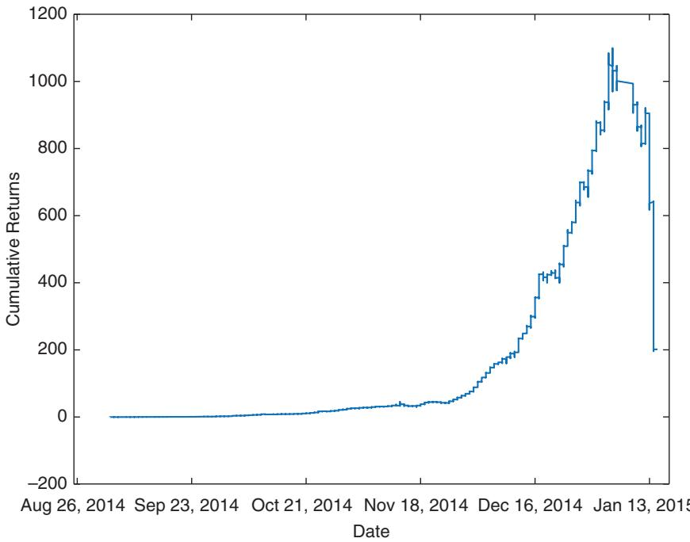
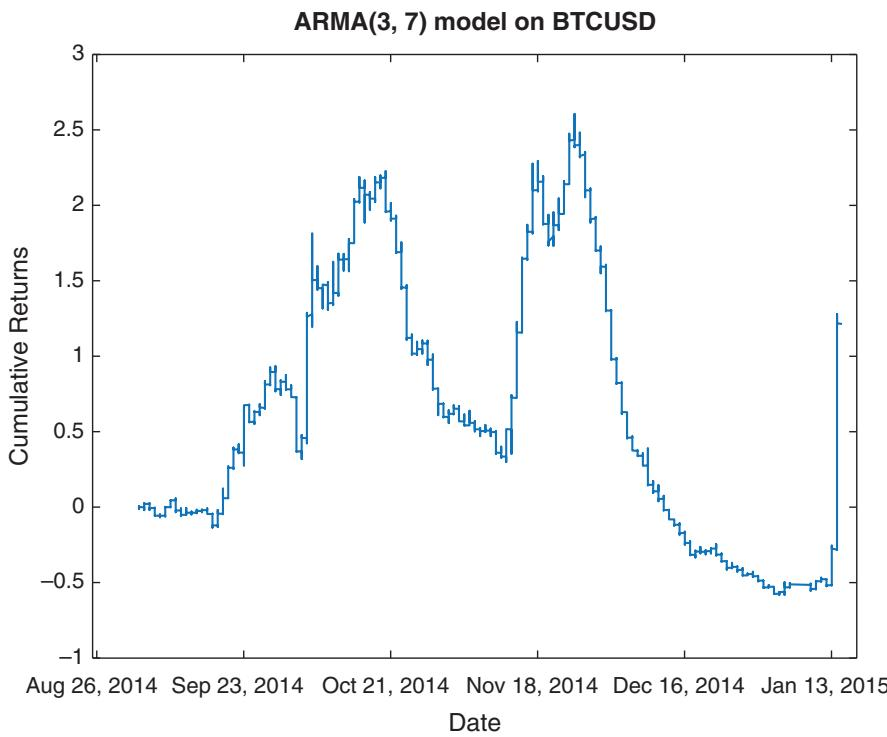
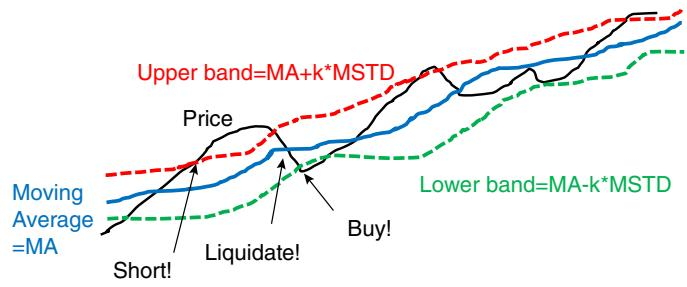
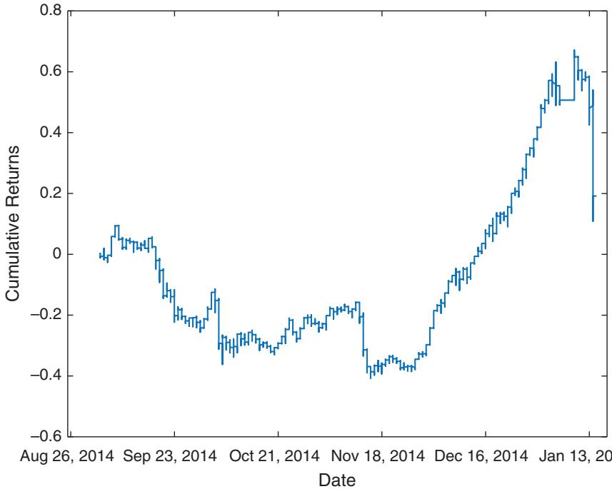

# 비트코인 — 해설판

> **이 문서는 Ernest P. Chan의 _Machine Trading_ (2016) 제7장 「Bitcoins」 전체를 담은 한국어 해설판입니다.** 원문을 요약하거나 건너뛰지 않고, 모든 문단·수식·코드·표·연습문제·주석을 그대로 살리되, 어려운 대목은 "왜 그런가"를 곁들여 쉬운 한국어로 풀어 설명합니다. 이 장은 앞선 장들(특히 3·4·6장)에서 갈고닦은 도구들 — 시계열 분석, 머신러닝, 주문 흐름 — 을 비트코인이라는 **새롭고 미성숙한 시장**에 실제로 적용해 보는 실습장입니다. 비트코인 자체가 목적이라기보다, 낯선 시장을 만났을 때 트레이더가 어떤 순서로 무기를 꺼내 드는지를 보여 주는 살아 있는 사례 연구라고 보시면 됩니다.

---

## 들어가며 — 왜 비트코인에서 기술적 분석인가

이 장은 문장 중간에서 시작합니다. 원문 스캔본이 앞 문장의 일부가 잘린 채 남아 있기 때문인데, 맥락을 복원하면 이렇습니다. 환율(그리고 비트코인 가격)은 **적어도 이 장에서 우리가 다룰 더 짧은 시간 척도에서는 기본적 요인(fundamental factors)에 영향을 받지 않습니다** (Lyons, 2001). 여기서 오해하면 안 되는 지점이 하나 있습니다. 이는 예컨대 연준(미국 중앙은행)의 금리 결정이 환율에 영향을 미치지 않는다는 뜻이 결코 아닙니다. 물론 영향을 미칩니다! 다만 그러한 기본적 사건들을 **예측 요인** 으로는 쓸 수 없다는 뜻입니다.

왜 그럴까요? 금리 결정 같은 사건은 사후적으로 "그래서 환율이 이렇게 움직였구나" 하고 **설명하는 데에만** 쓸 수 있는 동시적 요인(contemporaneous factor)이기 때문입니다. 사건이 벌어지는 바로 그 순간에 가격도 함께 반응해 버리니, 그 사건을 미리 알아 앞질러 매매할 수는 없습니다. 트레이더로서 우리는 오로지 **예측** 에만 관심이 있으므로, 차라리 가장 우수한 **기술적 분석(technical analysis)** 기법을 찾는 편이 낫습니다. 기술적 분석이란 가격과 거래량 같은 시장 데이터 자체에서 미래를 읽어 내려는 접근입니다.

제가 기술적 분석을 언급하면, 여러분은 즉시 볼린저 밴드, RSI, 스토캐스틱 지표 같은 것들을 떠올릴지 모릅니다. 그러나 저는 이 용어를 훨씬 넓은 의미로 씁니다. 제가 뜻하는 것은 단지 **가격과 거래량만을 입력으로 요구하는 예측 기법** 전부입니다. 여기에는 3장과 4장에서 논의한 많은 도구가 포함됩니다. 따라서 이 장은 그 기법들을 다시 시험해 보는 또 하나의 검증 무대이며, 지나치게 많은 방법론적 세부 사항의 부담 없이 그것들을 새로운 눈으로 보고 싶은 분들에게 흥미로울 것입니다. 여기에 더해 이 장에서 처음 본격적으로 다루는 기법이 둘 있습니다. 바로 **주문 흐름 분석(order flow analysis)** 과 **거래소 간 차익거래(cross-exchange arbitrage)** 입니다. 이 두 기법은 비트코인 바깥에서도 폭넓게 쓰이지만, 비트코인은 유독 단순한 무대라서 그 위력을 특히 선명하게 드러내 줍니다.

---

## 비트코인 사실 — 트레이더의 눈으로 본 새 통화

비트코인은 비교적 새로운 금융상품이므로, 먼저 그 몇 가지 속성을 짚고 넘어가겠습니다. 트레이더의 관점에서 비트코인은 EUR나 AUD와 다를 바 없는 **또 하나의 외국 통화** 일 뿐입니다. 비트코인을 다른 통화와 거래하는 것은 EUR.USD, AUD.USD, 더 일반적으로 B.Q를 거래하는 것과 똑같습니다. 여기서 B는 **기준 통화(base currency)**, Q는 **호가 통화(quote currency)** 라고 부릅니다. 유용한 기억법이 하나 있습니다. 알파벳순으로 B가 Q보다 앞서므로, 기준 통화는 언제나 앞쪽 기호라고 외우면 됩니다. 편의상 우리는 비트코인도 항상 기준 통화 자리에 둘 것입니다.

예를 들어 **BTC.USD는 비트코인 1개를 사는 데 필요한 USD의 수** 이고, BTC.CNY는 비트코인 1개를 사는 데 필요한 CNY의 수입니다. 그러니 비트코인의 가치가 어떤 통화 Q에 대해 오르면 BTC.Q라는 숫자도 함께 커집니다(같은 비트코인을 사는 데 그 통화가 더 많이 필요해지니까요). BTC.USD를 제외하면 BTC.CNY가 가장 활발히 거래되는 통화쌍입니다.

한 가지 각주 같은 설명을 원문이 괄호로 덧붙입니다. **CNY** 는 중국 통화의 **온쇼어(onshore)** 버전, 즉 중국 본토 안에서 쓰이는 위안화입니다. 이 통화는 자유롭게 환전할 수 없고, 그 환율은 좁은 범위 안에서만 움직이도록 정부가 규제합니다. 반면 중국 통화의 **오프쇼어(offshore)** 버전인 **CNH** 는 거의 모든 FX 브로커에서 자유롭게 환전할 수 있습니다. 안타깝게도 저자가 아는 한 BTC.CNH를 거래할 수 있는 비트코인 거래소는 없습니다. 그래서 홍콩을 포함해 중국에 거주하지 않는 한, BTC.CNY 거래는 그다지 실용적이지 못합니다.

비트코인 거래소는 40곳이 넘습니다. 이 글을 쓰는 시점에서 거래량(비트코인 기준)이 가장 많은 상위 다섯 거래소는 BTC China, BitStamp, Bitfinex, itBit, btc-e입니다. 첫 번째 거래소는 BTC.CNY용이고 나머지 네 곳은 BTC.USD용입니다. 이들의 최신 환율과 거래량은 bitcoincharts.com에서 볼 수 있습니다. 여기에 비트코인만의 독특한 성질이 하나 있습니다. 보통 통화는 미국 동부시간 금요일 오후 5시부터 일요일 오후 5시까지, 그리고 특정 공휴일에는 거래되지 않지만, **비트코인은 연중무휴 24시간 쉬지 않고 거래됩니다.**

### 얼마나 위험한 자산인가 — 변동성과 첨도

다른 위험자산과 견주어 보면, 비트코인 수익률의 **변동성(volatility)** 과 **첨도(kurtosis)** 는 둘 다 높습니다. 여기서 첨도란 분포의 꼬리가 얼마나 두꺼운지를 재는 값으로, 값이 클수록 아주 드물지만 아주 큰 폭의 움직임(**꼬리위험, tail risk**)이 자주 나온다는 뜻입니다. 표 7.1은 비트코인의 위험도를 다른 위험자산들과 나란히 놓고 비교한 것입니다.

비교 대상으로 **MXN.USD**(멕시코 페소 대 달러)를 고른 데는 이유가 있습니다. MXN은 모든 신흥시장 통화 가운데 유동성이 가장 높아서, 트레이더가 신흥시장 통화 전체에 대한 견해를 표현하고 싶을 때 흔히 그 대용치로 삼기 때문입니다. (ETF 데이터는 csidata.com, FX 데이터는 Interactive Brokers, BTC.USD 데이터는 BitStamp에서 얻어 Jonathan Shore가 취합했습니다. 과거 데이터는 api.bitcoincharts.com/v1/csv/에서 직접 내려받을 수 있습니다.)

표 7.1 위험자산의 위험도 비교
<table><tr><td></td><td>BTC.USD</td><td>MXN.USD</td><td>SPY</td><td>HYG</td></tr><tr><td>변동성 (연율화)</td><td>67%</td><td>16%</td><td>20%</td><td>13%</td></tr><tr><td>최고 일일 변동</td><td>20%</td><td>18%</td><td>15%</td><td>12%</td></tr><tr><td rowspan="3">최악 일일 변동</td><td>(20140303)</td><td>(20081104)</td><td>(20081013)</td><td>(20081013)</td></tr><tr><td>−24%</td><td>−13%</td><td>-10%</td><td>-8%</td></tr><tr><td>(20150114)</td><td>(20081103)</td><td>(20081015)</td><td>(20080929)</td></tr><tr><td>최대 낙폭</td><td>-79%</td><td>-49%</td><td>-55%</td><td>-34%</td></tr><tr><td>첨도1 (연율화)</td><td>7</td><td>8</td><td>1</td><td>4</td></tr><tr><td>분석 기간</td><td>20140120</td><td>20080102</td><td>20020627</td><td>20070411</td></tr><tr><td></td><td>-20150114</td><td>-20160225</td><td>−20160520</td><td>−20160520</td></tr></table>

표를 잠깐 음미해 봅시다. 비트코인의 연율화 변동성 67%는 SPY(미국 대형주 ETF)의 20%나 페소의 16%를 크게 웃돕니다. 최대 낙폭도 –79%로, 고점 대비 자산 가치가 5분의 1 수준까지 무너진 적이 있다는 뜻입니다. 첨도는 7로, 정규분포의 첨도 3보다 훨씬 두꺼운 꼬리를 가집니다(첨도 연율화 방식은 주석 1 참조). 요컨대 비트코인은 수익 기회가 큰 만큼 자산 자체가 격렬하게 요동치는, 전형적인 고위험 자산입니다.

그런데 비트코인을 거래할 때 걱정해야 할 위험은 이런 **시장 위험(market risk)** — 가격이 불리하게 움직여 손실을 보는 위험 — 만이 아닙니다. **신용 위험(credit risk)** 도 있습니다. Johansson and Tjernstrom (2014)에 따르면, 비트코인 거래소의 45%가 절도와 해킹으로 무너지며 투자자들의 예치금까지 함께 삼켜 버립니다. 다시 말해, 전략이 아무리 좋아도 내 돈을 맡긴 거래소 자체가 사라질 수 있다는 것 — 이것이 비트코인 트레이딩의 숨은 복병입니다.

---

## ■ 시계열 기법 — 낯선 시장에 던지는 첫 질문

3장에서 논의했듯이, 어떤 상품에 대해 아는 바가 별로 없을 때 첫 번째 단계는 **ARIMA** 를 써서 시계열 분석을 해 보는 것입니다. ARIMA는 과거 가격들이 미래 가격을 얼마나 설명하는지를 통계적으로 뜯어보는 표준 도구입니다. 자, BTC.USD의 1분 봉 데이터 중간가격을 2014년 1월 20일부터 9월 3일까지 뽑아 **AR(p) 모델** 에 적합시켜 보겠습니다(식 3.2와 3장의 방법론 참조, 전체 코드는 주석 2 참조).

그 결과 최적 차수는 $P = 16$, 첫 계수는 $\phi_{1} = 0.685$ 로 나오며 표준오차는 0.0001에 불과합니다. 이 수식을 조금 풀어 보겠습니다. AR(p) 모델은 "지금 가격 변화가 과거 p개 시점의 값들의 가중합으로 예측된다"고 보는 모형입니다.

- $P = 16$ — 예측에 쓰이는 과거 시점의 개수, 즉 직전 16분의 값을 되돌아본다는 뜻입니다.
- $\phi_{1} = 0.685$ — 바로 직전 시점 값에 붙는 계수입니다. 이 값이 양수라 얼핏 추세를 따라가는 듯 보이지만, 여기서는 가격 **수준** 자체를 회귀시키는 설정이라 강한 되돌림(평균회귀)을 가리킵니다.
- 표준오차 0.0001 — 계수 추정이 통계적으로 대단히 정밀하다는 신호입니다.

따라서 이 시계열은 강한 **평균회귀성(mean reversion)** 을 보이는 것으로 보입니다. 평균회귀란 가격이 평균에서 멀어지면 다시 평균 쪽으로 되돌아오려는 성질을 말합니다. 이를 한 번 더 확인하기 위해, Chan (2013)의 예제 2.1에서 설명한 **정상성(stationarity)** 검정, 곧 **ADF 검정** 을 이 시계열에 적용해 볼 수 있습니다(adf 함수 출처는 주석 3 참조).

```matlab
results=adf(mid(trainset), 0, 1);
prt(results);
```

그 결과 ADF 검정 통계량은 –3으로 나왔는데, 95% 신뢰수준에서의 임계값은 –2.9입니다. 검정 통계량이 임계값보다 더 음수 쪽에 있으므로(–3 < –2.9), "이 시계열은 비정상적이다(랜덤워크다)"라는 귀무가설이 기각됩니다. 즉 ADF 검정 역시 BTC.USD 가격 시계열이 **평균회귀적이고 정상적** 임을 확인해 줍니다. 그렇다면 평균회귀 트레이딩 전략이 성공할 가능성이 있어 보입니다.

하지만 본격적인 평균회귀 전략에 앞서, 그냥 AR(16)으로 다음 가격을 예측하고 그 예측 방향대로 매수·매도해 보겠습니다. 테스트 세트는 2014년 9월 3일부터 2015년 1월 15일까지입니다. (이는 3장 AR(p) 절에서 AUD.USD에 적용했던 것과 동일한 전략입니다.) 결과는 **CAGR(연평균 복합 성장률)이 40,000** 입니다. 테스트 세트의 자산 곡선은 그림 7.1에 있습니다.

이 수익률이 현실적일까요? 물론 전혀 아닙니다. 4만 배(4,000,000%)라는 값을 얻으려면 중간가격에 낸 지정가 주문이 **언제나 즉시 체결된다** 고 가정해야 하는데, 실제로 중간가격에 걸어 둔 주문이 그렇게 다 채워질 리 없습니다. 그럼에도 이 비현실적 숫자는 하나의 사실을 또렷이 보여 줍니다. 단순한 AR(p) 모델조차 여기서는 상당한 예측력을 지닌다는 것입니다.

BTC.USD에는 $\mathrm{ARMA}(p, q)$ 도 시도해 볼 만합니다. ARMA는 AR(자기회귀) 항에 더해 MA(이동평균, 과거 예측 오차를 반영하는 항)까지 함께 쓰는 모형입니다. 3장 ARMA(p, q) 절에서 AUD.USD에 했던 절차를 그대로 따르면, 최적 차수는 $p = 3$, $q = 7$ 로 나옵니다. 이 ARMA(3, 7)의 자기회귀 계수와 이동평균 계수를 추정한 뒤, AR(16)과 마찬가지로 한 단계 앞을 예측해 매매합니다. 같은 테스트 세트에서 CAGR은 3.9입니다. 여전히 환상적인 숫자지만 AR(16)보다는 훨씬 낮고, 자산 곡선(그림 7.2)의 생김새도 사뭇 다릅니다.

BTCUSD에 대한 AR(16) 모델  
  
그림 7.1 BTC.USD에 적용한 AR(16) 트레이딩 전략

---

## ■ 평균회귀 전략 — 볼린저 밴드로 되돌림을 노린다

앞 절에서 AR(16) 모델과 ADF 검정을 통해 확인했듯이, BTC.USD 중간가격은 평균회귀적이고 정상적인 시계열입니다. 이는 곧 Chan (2013)에 나오는 여러 단순한 평균회귀 전략을 여기에 그대로 옮겨 쓸 수 있다는 뜻입니다.

그중 가장 잘 알려진 것이 **볼린저 밴드(Bollinger band)** 전략입니다. 방식은 이렇습니다. 중간가격이 이동평균보다 $k$ 개의 이동 표준편차만큼 **아래로** 내려가면 BTC.USD 한 단위를 매수하고, 반대로 그만큼 **위로** 올라가면 매도합니다. 그리고 가격이 다시 현재 이동평균으로 되돌아오면 포지션을 청산합니다. 이 흐름이 그림 7.3에 그려져 있습니다. 한 가지 유의할 점은, 이동 표준편차와 이동평균을 **수익률이 아니라 가격에 대해** 계산한다는 것입니다. 매수·매도 신호를 만드는 코드 조각은 다음과 같습니다(전체 코드는 주석 4 참조).

  
그림 7.2 BTC.USD에 적용한 ARMA(3, 7) 트레이딩 전략

  
그림 7.3 볼린저 밴드 트레이딩 전략

```matlab
buyEntry=cl <= movingAvg(cl, lookback)-entryZscore*movingStd(cl, lookback);
sellEntry=cl >= movingAvg(cl, lookback)+entryZscore*movingStd(cl, lookback);
```

이 두 줄을 읽어 보면 직관이 바로 잡힙니다. `movingAvg(cl, lookback)` 은 최근 `lookback` 개 봉의 이동평균이고, `movingStd` 는 그 이동 표준편차입니다. 종가 `cl` 이 "이동평균 – (entryZscore × 이동 표준편차)"보다 낮으면 `buyEntry` 신호가, 그 반대쪽으로 벗어나면 `sellEntry` 신호가 켜집니다. 즉 밴드 하단을 뚫으면 사고, 상단을 뚫으면 파는 전형적인 되돌림 매매입니다.

BTC.USD에 대한 볼린저 밴드 모델  
  
그림 7.4 BTC.USD에 대한 볼린저 밴드 트레이딩 전략 자산 곡선

물론 원칙대로라면 관측 기간 `lookback` 과 배수 `entryZscore` 를 최적화해야 합니다. 그러나 여기서는 아무 최적화 없이 그냥 임의로 `lookback` 을 1시간(분봉 데이터에서 60개 봉)으로, `entryZscore` 를 2로 정해 버립니다. 이것을 앞 절과 동일한 테스트 세트에 돌리면(학습 세트를 어떤 학습에도 쓰지 않았는데도) **CAGR 42%** 가 나옵니다. 자산 곡선은 그림 7.4에 있습니다. 앞의 AR(16)이 뿜어낸 4만이라는 비현실적 숫자와 달리, 42%는 지정가 체결 가정이 훨씬 온건해 실전에서도 기대해 볼 만한 값입니다.

---

## 인공지능 기법 — 직관이 없을 때 기계에게 묻는다

시계열 분석과 마찬가지로, 머신러닝 알고리즘 또한 우리가 처음 보는 시장, 즉 가격 패턴이나 차익거래 기회에 대한 직관이 아직 서지 않은 시장을 만났을 때 유용한 또 다른 무기입니다. 그러니 4장에서 배운 알고리즘 몇 가지를 1분 봉 BTC.USD 데이터에 적용해 보겠습니다. 이 절 전체에서 우리는 다시 **중간가격(midprices)** 을 씁니다. 매수호가와 매도호가 사이를 가격이 왔다 갔다 하며 만들어 내는 가짜 신호, 곧 **매수-매도 호가 바운스(bid-ask bounce)** 같은 허위 효과를 학습하지 않기 위해서입니다.

첫 번째로 시도할 기법은 **배깅(bagging)** 을 적용한 회귀 알고리즘입니다. 배깅은 데이터를 여러 번 재추출해 만든 다수의 모델을 평균 내어 예측을 안정시키는 기법입니다. 여기서는 4장의 `rTreeBagger.m` 프로그램을 그대로 복사해 쓰되(수정 코드는 주석 5 참조), 예측 변수만 바꿉니다. 원래 쓰던 ret1, ret2, …, ret20 대신 **1분, 5분, 10분, 30분, 60분 봉 수익률** 을 예측 변수(predictors)로 씁니다. 테스트 세트(2014년 1월 20일부터 2015년 1월 15일까지 데이터의 후반부)에 대한 CAGR이나 자산 곡선은 아예 보여 드리지 않겠습니다. 값이 현실적이라 하기엔 너무 터무니없이 높기 때문입니다. 이 전략은 분명히 매수-매도 호가를 반영한 훨씬 신중한 백테스트가 필요합니다.

두 번째 기법은 **서포트 벡터 머신(support vector machine)** 입니다. 4장의 코드 `svm.m` 을 그대로 복사하고 위의 새 예측 변수를 넣으면 됩니다(수정 코드는 주석 6 참조). 그런데 SPY에서 잘 통한 것이 BTC.USD에서는 더 잘 통하리라 지레짐작하면 곤란합니다. 여기서는 학습 세트와 테스트 세트 **양쪽 모두에서 뚜렷한 음(–)의 수익률** 이 나옵니다. 같은 기법이라도 시장이 다르면 결과가 정반대일 수 있다는 좋은 경고입니다.

마지막으로 4장에서 다룬 **순전파 신경망(feedforward neural network)** 도 적용해 봅니다(수정 코드는 주석 7 참조). 은닉층이 하나뿐이고 그 층에 뉴런도 하나뿐인 아주 단출한 네트워크를 씁니다. 다만 네트워크 파라미터의 초기 추정값을 서로 다르게 준 그런 네트워크를 **100개** 학습시킨 뒤, 이 모든 네트워크의 예측 수익률을 평균 냅니다. 그 결과 얻는 **표본외(out-of-sample)** 수익률은 앞의 회귀 트리(regression tree) 기법만큼이나 놀랍습니다 — 물론 "지정가가 즉시 체결된다고 가정했다"는 동일한 단서가 그대로 붙습니다.

---

## ■ 주문 흐름 — 매수·매도의 힘겨루기를 읽는다

6장에서 우리는 단기 예측 지표로 **주문 흐름(order flow)** 을 쓰는 법을 논의했습니다. 다시 떠올리면, 주문 흐름은 **부호가 붙은 거래량** 입니다. 규모가 $s$ 인 거래가 매수 시장가 주문으로 체결된 것이면 주문 흐름은 $+s$, 매도 시장가 주문으로 체결된 것이면 $-s$ 입니다. 요컨대 능동적으로 시장을 때린 쪽이 매수자냐 매도자냐를 부호로 기록하는 것이죠.

일부 비트코인 거래소는 각 거래가 매수 시장가 주문 때문인지 매도 시장가 주문 때문인지를 알려 주는 **공격자 태그(aggressor tag)** 를 데이터 피드에 함께 실어 줍니다. BTC China의 BTC.CNY 피드와 BitStamp의 BTC.USD 피드가 그렇습니다. 우리는 BitStamp의 BTC.USD 거래 틱 데이터 한 달치 표본을 써서, 주문 흐름을 예측 변수로 삼는 거래 전략을 설명하겠습니다. 이 데이터에는 **마이크로초(100만분의 1초)** 단위의 타임스탬프가 찍혀 있습니다.

전략의 뼈대는 원칙적으로 아주 단순합니다. 매 마이크로초 봉이 끝날 때마다 지난 1분 안에 발생한 모든 거래 틱을 찾아 그 기간의 주문 흐름을 합산합니다. 이 값이 어떤 임계값보다 크면(매수세가 압도적이면) BTC.USD 한 단위를 사는 매수 시장가 주문을 내고, 반대로 임계값보다 작으면(매도세가 압도적이면) 매도 시장가 주문을 냅니다. 그렇게 생긴 포지션은, 1분 주문 흐름이 0이 되거나 진입을 유발했던 부호와 반대 부호가 되면 다시 시장가로 청산합니다.

문제는 여기에 있습니다. 훑어야 할 마이크로초 봉이 너무 많아서, 이대로 모든 봉을 돌리면 프로그램이 영원히 끝나지 않을 수도 있습니다. 그래서 우리는 대신 조금 단순화한 버전을 백테스트합니다. **거래 틱이 실제로 발생한 순간에만** 주문 흐름을 계산하고 매매 여부를 판단하는 **이벤트 기반(event-driven)** 알고리즘입니다. 또한 현재의 최우선 매수호가·매도호가가 아니라, 그 거래를 유발한 체결 가격 그대로에 우리 주문이 채워진다고 가정합니다. 이는 예제 6.3에서 했던 것과 똑같은 단순화입니다. 자세한 코드는 예제 7.1에서 다룹니다. 당연히 진입 임계값, 0이라는 암묵적 청산 임계값, 그리고 1분이라는 **관측 기간(lookback period)** 은 모두 표본내(in-sample)에서 최적화하고 표본외에서 검증해야 합니다.

백테스트 결과, **편도 거래 한 건당 US\$0.097의 이익** 이 났습니다. 2014년 12월에 이런 거래가 336건 있었으니, 이를 합치면 코인당 US\$32.54, 연율로 환산하면 약 **100%의 수익률** 입니다. 물론 이 고빈도 전략은 원래 매수-매도 호가로 백테스트하는 것이 맞습니다. 실전에서는 매도호가에 사서 매수호가에 팔아야 하기 때문입니다. 매수-매도 스프레드가 약 US\$0.12라면 거래당 거래 비용은 약 US\$0.06인데, 이는 우리가 계산한 총이익 US\$0.097보다 여전히 낮습니다. 그러니 지불해야 할 수수료 수준에 따라 이 전략이 순이익을 낼 수 있다는 희망은 남아 있습니다. 적어도 이 결과는, 이 시간 프레임에서 **주문 흐름이 비트코인의 합리적인 예측 변수** 라는 점을 보여 줍니다.

---

## 예제 7.1: 주문 흐름 전략 — 코드로 들여다보기

이 예제는 예제 6.3과 닮았습니다. 우리에게 BitStamp의 과거 거래 데이터가 있다는 것은 매우 다행스러운 일입니다. 이 데이터는 마이크로초 단위 타임스탬프를 담을 뿐 아니라, 더 중요하게는 **공격자 태그(aggressor tag)** 를 포함하기 때문입니다. 이 태그 덕분에 전략에 필요한 주문 흐름을 정확히 계산할 수 있습니다.

우리는 공격자 태그를 `side` 라는 배열에 저장합니다. `side = 1` 은 매수 시장가 주문 때문임을, `side = −1` 은 매도 시장가 주문 때문임을 나타냅니다. 거래 규모와 가격은 각각 `tradeSize`, `tradePrice` 배열에 담고, 주문 흐름은 다음과 같이 계산합니다.

```matlab
ordflow=zeros(size(tradePrice));
ordflow(buy)=tradeSize(buy);
ordflow(sell)=-tradeSize(sell);
```

읽어 보면 단순합니다. 먼저 `ordflow` 를 0으로 채워 두고, 매수(`buy`)에 해당하는 자리에는 거래 규모를 양수로, 매도(`sell`)에 해당하는 자리에는 거래 규모를 음수로 넣습니다. 그리고 이를 시간 순서대로 누적한 **누적 주문 흐름(cumulative order flow)** 을 다음과 같이 만듭니다.

```matlab
cumOrdflow=smartcumsum(ordflow);
```

또한 각 거래의 MATLAB `datenum`(날짜·시각을 숫자 하나로 표현한 값)을 `dn` 이라는 배열에 담아 시각을 추적합니다. 이 모든 배열은 거래 틱의 개수와 같은 길이를 가집니다. 여기서 반드시 기억할 점이 있습니다. **거래 틱은 시간상 균등한 간격으로 오지 않습니다.** 틱이 전혀 없어 아예 나타나지 않는 마이크로초 봉이 연달아 많이 있고, 이론적으로는 같은 마이크로초에 여러 거래가 몰릴 수도 있습니다(가능성은 훨씬 낮지만요). 이 거래들을 하나씩 순회하면, 직전 1분 동안의 순 주문 흐름을 쉽게 계산할 수 있습니다.

```matlab
for t=1:length(cumOrdflow)
idx=find( dn <= dn(t)-lookback/60/60/24);
if (∼isempty(idx))
ordflow_lookback=cumOrdflow(t)-cumOrdflow(idx(end));
end
end
```

코드를 한 줄씩 풀어 봅시다. `dn(t)-lookback/60/60/24` 는 현재 시점에서 `lookback` 초만큼 과거로 되돌아간 시각입니다(MATLAB의 `datenum` 은 하루를 1로 세므로 초를 하루 단위로 바꾸려 60·60·24로 나눕니다). `find(...)` 로 그 시각보다 앞선 거래들의 색인을 모으고, 그중 가장 최근 것(`idx(end)`)의 누적 주문 흐름을 현재 누적값에서 빼면, **딱 지난 1분 동안 쌓인 순 주문 흐름** `ordflow_lookback` 이 나옵니다. 누적값의 차이로 구간 합을 구하는 깔끔한 방법입니다.

위에서 구한 `ordflow_lookback` 은 진입이든 청산이든 매매를 유발하는 데 바로 쓸 수 있습니다. 그런데 주의할 점이 하나 있습니다. 거래 없이 시간만 흘러도 "직전 1분 주문 흐름"은 원래 계속 갱신되어야 합니다. 그러나 우리는 실제로 그렇게 하지 않습니다. 즉 **거래가 있는 시간 봉에 대해서만** 루프를 돕니다. 그렇지 않으면 프로그램이 훨씬 오래 걸리기 때문입니다. 그러므로 우리가 백테스트하는 것은 본문에서 설명한 전략과 살짝 다른, **백테스트하기 더 쉬운 버전** 입니다. 이 버전에서는 거래가 발생할 때만 진입·청산하므로, 그 순간의 직전 1분 주문 흐름만 계산하면 됩니다. 원래 버전을 제대로 백테스트하려면 **거래 및 호가(trades and quotes, TAQ)** 데이터가 필요하고, 거래 틱이 없을 때 시간을 똑똑하게 "빨리 감기"하는 방법도 있어야 합니다. (이 원래 버전의 백테스트는 연습문제로 남겨 둡니다.)

단순화된 전략을 계속 이어 가면, `ordflow_lookback` 을 계산한 직후의 if 블록 안에 다음 거래 신호 생성기를 끼워 넣을 수 있습니다.

```matlab
if (ordflow_lookback > entryThreshold)
if ( pos <= 0)
if (pos < 0)
dailyPL=dailyPL+(entryP-tradePrice(t));
dailyNumTrade=dailyNumTrade+2;
entryP=tradePrice(t);
else
entryP=tradePrice(t);
dailyNumTrade=dailyNumTrade+1;
end
pos=1;
end
elseif (ordflow_lookback < -entryThreshold)
if (pos >= 0)
if (pos > 0)
dailyPL=dailyPL+(tradePrice(t)-entryP);
dailyNumTrade=dailyNumTrade+2;
entryP=tradePrice(t);
else
entryP=tradePrice(t);
dailyNumTrade=dailyNumTrade+1;
end
pos=-1;
end
else
if (ordflow_lookback <= exitThreshold && pos > 0)
dailyPL=dailyPL+(tradePrice(t)-entryP);
dailyNumTrade=dailyNumTrade+1;
pos=0;
elseif (ordflow_lookback >= -exitThreshold && pos < 0)
dailyPL=dailyPL+(entryP-tradePrice(t));
dailyNumTrade=dailyNumTrade+1;
pos=0;
end
end
```

이 블록의 논리를 큰 그림으로 잡아 봅시다. `pos` 는 현재 포지션(+1은 롱, –1은 숏, 0은 무포지션)입니다.

- **주문 흐름이 진입 임계값보다 크면** (강한 매수세): 아직 롱이 아니면 롱(`pos=1`)으로 들어갑니다. 이때 기존에 숏(`pos<0`)이었다면 그 숏을 먼저 청산하며 손익 `dailyPL` 에 (진입가 – 현재가)를 더하고 거래 횟수를 2 늘립니다(청산 1 + 신규 진입 1). 무포지션이었다면 그냥 신규 진입 1건입니다.
- **주문 흐름이 진입 임계값의 음수보다 작으면** (강한 매도세): 대칭적으로 숏(`pos=-1`)으로 들어갑니다. 기존 롱이 있었으면 (현재가 – 진입가)로 손익을 정산하며 뒤집습니다.
- **그 밖의 경우** (주문 흐름이 청산 임계값 안쪽으로 잦아들면): 롱이었으면 이익을 실현하며 청산하고, 숏이었으면 마찬가지로 청산해 `pos=0` 으로 돌아갑니다.

핵심은 `entryP`(진입 가격)를 기준으로 청산 시점에 손익을 정산하고, 포지션을 뒤집을 때는 청산과 신규 진입을 한꺼번에 처리한다는 점입니다.

for 루프에 들어가기 전에는 먼저 포지션과 집계 변수를 0으로 초기화해야 합니다.

```matlab
pos=0;
dailyPL=0;
dailyNumTrade=0;
```

`entryThreshold` 를 90으로, `exitThreshold` 를 0으로 설정하면, 이 단순화된 전략은 2014년 12월 BTC.USD 1단위에 대해 **총손익(gross P&L) \$32.54**, 즉 우리가 매매를 유발한 것과 동일한 거래 가격에 체결된다고 가정할 때 **편도 거래당 \$0.097** 을 냅니다. 전체 코드는 `orderFlow2.m` 으로 내려받을 수 있습니다.

---

## 거래소 간 차익거래 — 공짜 점심은 정말 있는가

**거래소 간 차익거래(cross-exchange arbitrage)** 는 딱 한 가지 조건에서만 가능합니다. 한 거래소의 최우선 매수호가가 다른 거래소의 최우선 매도호가보다 **높을** 때입니다. 그러면 두 번째 거래소에서 시장가로 싸게 사자마자 첫 번째 거래소에서 시장가로 비싸게 팔아 **무위험 이익(riskless profit)** 을 챙길 수 있습니다.

그런데 성숙한 금융시장에서는 이런 기회가 거의 없습니다. 미국 주식시장을 예로 들어 보죠. 6장에서 봤듯이 AAPL을 거래할 수 있는 거래소나 **다크풀(dark pool)** — 호가를 공개하지 않는 사설 거래 장소 — 이 60곳이 넘지만, 위에서 말한 **교차 시장(crossed market)** 상황은 좀처럼 생기지 않습니다. 2005년 SEC가 시행한 **Regulation NMS**("National Market System") **Rule 610** 때문입니다. Rule 610은 어떤 거래소가 다른 거래소의 BBO(최우선 매수·매도 호가)와 교차하는 호가를 표시하지 못하도록 막습니다("Rule 610," 2005). 규제 한 방에 차익거래 기회가 사라지는 셈입니다!

그래도 주식에서 **국경 간(cross-border)** 거래소 간 차익거래를 노릴 여지는 남아 있습니다. 예컨대 IBM은 NYSE와 LSE(런던증권거래소, London Stock Exchange) 양쪽에서 거래되므로, GBP.USD 환율을 감안하면 이따금 교차 시장 상황을 포착할 수 있습니다. 그러나 이 거래를 정말로 무위험으로 만들려면 **통화 위험을 헤지** 해야 합니다. 가령 LSE에서 IBM을 사고 NYSE에서 같은 수량을 팔면, 본질적으로 GBP를 숏 하고 USD를 롱 한 셈이 됩니다. 이 통화 익스포저를 상쇄하려면 동시에 GBP.USD를 얼마간 매수해야 합니다. 그런데 이 헤지 자체가 거래 비용을 더해, 애써 잡은 차익거래 이익을 깎아먹거나 아예 지워 버립니다.

반면 비트코인 시장에서는 거래소 간 차익거래 기회가 겉보기에는 넘쳐납니다. 한 예를 봅시다. 2015년 2월 2일 미국 동부표준시 오후 7시, BTC.USD는 두 거래소에서 다음 호가를 보였습니다.

Bitfinex: 239.19–239.48

btc-e: 233.232–233.546.

Bitfinex에서 코인 1개를 \$239.19에 팔고, 곧바로 btc-e에서 코인 1개를 \$233.546에 사서 US\$5.644의 총이익을 챙기면 되지 않을까요? 실제로 이 시장은 여러 날, 심지어 여러 달 동안 이렇게 교차되어 있었습니다. 그렇다면 이걸 무한 반복해서 하룻밤 새 백만장자가 되면 되지 않을까요? 정말 공짜 점심이 있는지 알려면 거래 **비용** 을 하나하나 뜯어봐야 합니다.

첫째, 한쪽당 약 20 bps(bps = 0.01%)의 수수료가 있어 전체 거래에 약 \$1이 듭니다. 둘째, 이걸 계속 반복하려면 btc-e에서 정기적으로 코인 1개를 인출해 Bitfinex로 옮겨 그쪽 숏 포지션을 메워야 합니다. 이 인출에 약 1%, 즉 \$2가 듭니다. 그래도 코인당 약 \$2.6의 순이익이 남습니다. 여전히 훌륭하죠! 하지만 마지막 함정이 있습니다. **왜 btc-e의 호가가 더 낮은지** 를 생각해야 합니다. 그 이유는 시장이 btc-e의 신용등급을 더 낮게 보기 때문입니다. 우리는 그곳에서 코인을 사서(롱 포지션) 보유하므로, 그 거래소가 무너지면 코인을 잃는 **신용 위험(credit risk)** 에 그대로 노출됩니다. 이 신용 위험이 코인당 \$2.6의 이익보다 큰지 작은지를 딱 잘라 계산할 쉬운 방법은 없습니다. 바로 이 지점에서 "공짜 점심"이 실은 위험의 대가일 수 있음이 드러납니다.

---

## ■ 요약 — 미성숙한 시장이 주는 기회와 함정

저는 비트코인 시장에 존재하는 몇몇 거래 기회를 빠르게 훑어보았습니다. 비트코인 시장은 주식이나 외환 시장에 비하면 아직 미성숙하고, 그래서 여전히 많은 비효율이 남아 있으며, 결과적으로 잠재적으로 수익성 있는 차익거래 기회도 존재합니다. 이 수익들 중 일부는 터무니없이 높아 보입니다. 그런데 그것들이 정말 실재하는 수익일까요? 그 답은 부분적으로 여러분의 **실행 소프트웨어의 정교함**, 거래소 **API의 효율성**, 그리고 **수수료를 비롯한 각종 비용**, 마지막으로 **거래소의 신용도** 에 달려 있습니다.

그러나 비트코인 자체를 넘어서, 이 장은 더 큰 교훈을 줍니다. 앞선 장들에서 벼려 온 도구들 — 시계열 분석과 인공지능 — 을 **처음 보는 낯선 시장에도 그대로 겨눌 수 있음** 을 보였습니다. 또한 어떤 시장에서나 통하는 보편적 단기 지표인 주문 흐름의 힘을 확인했고, 훨씬 성숙한 여러 시장에도 응용할 수 있는 국경 간·거래소 간 차익거래의 작동 원리를 짚었습니다. 비트코인은 이 모든 기법을 가장 단순한 무대 위에서 시연해 보인 셈입니다.

---

## 연습문제

**7.1.** BTC.USD에 대해 5분, 15분, 일간 봉과 같은 더 낮은 빈도의 시계열에서 AR(p) 및 ARMA(p, q) 모델을 시도해 보십시오. 일간 데이터는 api.bitcoincharts.com/v1/csv/에서 내려받을 수 있습니다.

**7.2.** 마이크로초 시간 봉에 과거 거래가 전혀 없었던 경우에도 거래에 진입할 수 있는, 예제 7.1의 전략을 백테스트하십시오. 최우선 매수·매도 호가(best bid offer, BBO) 데이터는 2014-12\_bbo.csv로 내려받을 수 있습니다. 이 경우 왜 BBO 데이터로 백테스트해야 합니까? 예제 7.1의 단순화된 버전으로는 진입하지 않았을 새 포지션에, 이 버전으로는 진입하게 되는 경우가 있습니까? 이 버전은 단순화된 버전보다 수익성이 더 높습니까, 아니면 더 낮습니까?

---

## 주석

1. 정규분포의 첨도는 3입니다. 우리는 첨도가 시간에 따라 선형적으로 스케일링된다고 가정하여 이를 연율화합니다(Manokhin, 2015; Carr, 2016).

2. 전체 코드는 buildARp\_BTCUSD.m으로 내려받을 수 있습니다.

3. adf 함수는 무료인 spatial-econometrics.com의 jplv7 패키지에 포함되어 있습니다. MATLAB의 Econometrics Toolbox에는 이에 상응하는 adftest 함수가 있습니다.

4. 전체 코드는 movingAvg.m 및 movingStd.m과 함께 bollinger.m으로 내려받을 수 있습니다.

5. 수정된 코드는 rTreeBagger\_BTCUSD.m으로 내려받을 수 있습니다.

6. 수정된 코드는 svm\_BTCUSD.m으로 내려받을 수 있습니다.

7. 수정된 코드는 nn\_feedfwd\_avg\_BTCUSD.m으로 내려받을 수 있습니다.

8. 아이러니하게도 Bitfinex는 2016년 8월 2일 해킹을 당해 비트코인 가치를 한때 20% 떨어뜨린 바로 그 거래소입니다(Tsang, 2016).

---

## 핵심 용어 정리

| 용어 | 쉬운 설명 |
| --- | --- |
| 기준 통화 (base currency) | 통화쌍 B.Q에서 앞에 오는 통화. BTC.USD의 BTC |
| 호가 통화 (quote currency) | 통화쌍에서 뒤에 오는 통화. 기준 통화 1개의 값을 이 통화로 표시 |
| 중간가격 (midprice) | 최우선 매수호가와 매도호가의 한가운데 값. 호가 바운스 제거용 |
| 변동성 (volatility) | 가격 움직임의 크기. 클수록 위험한 자산 |
| 첨도 (kurtosis) | 분포 꼬리의 두께. 클수록 드물지만 큰 폭의 움직임이 잦음 |
| 시장 위험 (market risk) | 가격이 불리하게 움직여 손실을 보는 위험 |
| 신용 위험 (credit risk) | 거래소·상대방이 파산해 맡긴 자산을 못 받는 위험 |
| 평균회귀 (mean reversion) | 가격이 평균에서 벗어나면 다시 평균으로 되돌아오려는 성질 |
| AR(p) 모델 | 현재 값을 과거 p개 시점의 가중합으로 예측하는 자기회귀 모형 |
| ARMA(p, q) 모델 | 자기회귀(AR) 항에 과거 오차를 반영하는 이동평균(MA) 항을 더한 모형 |
| ADF 검정 | 시계열이 정상적(평균회귀적)인지 판별하는 통계 검정 |
| 정상성 (stationarity) | 시계열의 통계적 성질이 시간에 따라 변하지 않는 성질 |
| CAGR | 연평균 복합 성장률. 복리로 굴렸을 때의 연 성장률 |
| 볼린저 밴드 (Bollinger band) | 이동평균 ± k×이동표준편차 밴드를 이탈하면 되돌림을 노리는 전략 |
| 배깅 (bagging) | 재추출한 다수 모델을 평균 내어 예측을 안정시키는 기법 |
| 서포트 벡터 머신 (SVM) | 데이터를 최대 여백으로 가르는 경계를 찾는 머신러닝 기법 |
| 순전파 신경망 (feedforward NN) | 입력에서 출력으로 한 방향으로만 신호가 흐르는 신경망 |
| 주문 흐름 (order flow) | 부호가 붙은 거래량. 매수 체결은 +, 매도 체결은 – |
| 공격자 태그 (aggressor tag) | 거래가 매수·매도 중 어느 시장가 주문 때문인지 표시하는 표식 |
| 관측 기간 (lookback period) | 지표를 계산할 때 되돌아보는 과거 구간의 길이 |
| 거래소 간 차익거래 (cross-exchange arbitrage) | 한 거래소 매수호가 > 다른 거래소 매도호가일 때 무위험 이익을 취함 |
| 교차 시장 (crossed market) | 한 거래소 매수호가가 다른 거래소 매도호가보다 높은 상황 |
| 다크풀 (dark pool) | 호가를 공개하지 않고 거래를 체결하는 사설 거래 장소 |
| Regulation NMS Rule 610 | 거래소 간 호가 교차를 금지하는 미국 SEC 규정(2005년) |
