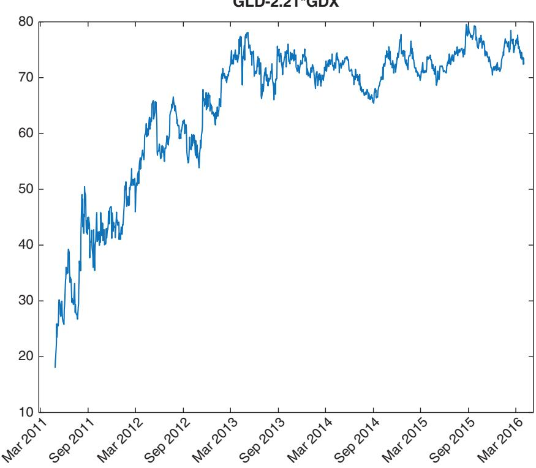

# Algorithmic Trading Is Good for Body and Soul

Before we start engaging in a complex, time-consuming, and possiblyrisky venture, it is often a good idea to pause and ask why we should do it. Even if we have already been doing it for years, and have invested countless hours and dollars, it is still worthwhile to ask if we should continue doing it. (Sunk cost is not a rational justification.) Now that we have surveyed the highly technical side of algorithmic trading, perhaps it is time to ask these high-level questions.

### ■ Your Mind and Your Health

If you tell an acquaintance that you work as an algorithmic trader, it will likely be assumed that your motivation is primarily financial. However, statistics show that the majority of traders are unprofitable.1 There are much easier ways to earn a good living that do not involve bankruptcy risks. Of course, the few especially smart and lucky quants will find lucrative jobs at one of the big hedge funds where there is only upside and the downside is limited to getting fired. But then, these elites can also find very lucrative jobs at Silicon Valley, where a newly minted PhD graduate in artificial intelligence was offered more than \$1 million annual compensation (Markoff and Lohr, 2016). So there must be more than financial consideration when it comes to deciding to become an algorithmic trader.

From my years of interacting with algorithmic traders, an important motivation for them is intellectual challenge. This is where mathematics, computer science, and economics intersect. Just like science, algorithmic trading offers a lifetime of opportunity for creative research. But unlike most sciences, one can pursue this research with minimal infrastructure, unencumbered by bureaucracy and the need to impress or convince others. One can pursue this research until the last day of one’s life (which is my present plan), without needing to ask the government or large corporations for research grants. In short, one does not need permission to conduct this research anywhere and at any time. I find this very appealing.

(Of course, this freedom is predicated on the assumption that one’s trading strategies are at least moderately successful. But to increase the likelihood of this success is the chief goal of this book.)

You may think that such a lofty goal as the freedom to pursue creative research is not that important to you. You may think that all you want is a stable income and a long and happy life. But how about this: Algorithmic trading is also a good way to improve your health. Research has found that having a bad boss is harmful to one’s health and longevity (Porath, 2015), and furthermore, time spent with any boss (not just bad bosses) is the top-most reason for unhappiness (Kahneman, 2011). As an independent algorithmic trader, you can escape from boss-related unhappiness. True, one can be an entrepreneur in any field, but few other fields offer the opportunity to extract financial value so directly from one’s intellect, and in a very scalable manner, as algorithmic trading. Often, such personal attributes as managerial acumen and marketing skills are equally important to entrepreneurial success. Not so with algorithmic trading.

While we are on the theme of health and the avoidance of (constant) stress, I should note that one of the main benefits of setting up your own algorithmic trading operation at home is that you will save time from commuting to the office. Unless you commute to work by walking or biking, that hour or more each day is neither healthy nor stress-free. There are other health benefits to working at home: the ability to get up and walk around regularly. The Mayo Clinic website states, ‘‘Too much sitting also seems to increase the risk of death from cardiovascular disease and cancer’’ (Levine, 2015). It felt strange when I worked at an institutional trading desk to stand up and walk around every half-hour or so, but you can do that at home without embarrassment. Finally, it is common knowledge that owning a pet decreases stress (Doheny, 2012). Our cat, a Ragdoll, not only offers me her support during periods of drawdowns, but also insists that I chase her around the house every half-hour in the morning, compounding the health benefit. You can hardly bring your cat to work on the trading floor of Goldman Sachs. In addition to the presence of a pet, I have also found a continuous streaming of music in my office to be soothing, but wearing a headset at an institutional trading desk is bad optics (and so is wearing pajamas at work).

It may seem counter intuitive, but working at home also enhances my productivity. Many readers or colleagues have asked me how I can manage a hedge fund and separate accounts, write books and blog posts, and teach graduate finance classes, all at the same time. The answer is that working around the clock and on weekends doesn’t feel like work in the comforts of home. (Of course, working from home is becoming less possible for me as our team expands to include new members who need to be physically close by to maximize efficiency, learning opportunities, and most importantly, serendipitous idea generation.)

You may like this lifestyle, but you may still hesitate because of the risks of failure. The usual argument of signing up for a steady job is that, well, it is steady. But is it? It didn’t work out that way for me,2 and often not for anyone in a position with P&L responsibility in any institution. Two of the institutions that I worked for have either shut down, or are on the verge of it. The banks that I have worked for have drastically scaled down proprietary trading activities due to the Dodd-Frank Act, and some of my colleagues who worked hard to become managing directors have either been laid off or quit of their own volition. Even if your firm is alive and well, your job typically lasts as long as your cumulative profit is sitting at its high watermark. But if your strategy is profitable, why do you need to work for anyone? Furthermore, by starting up your own algorithmic trading outfit, you can diversify your career risks away from sole dependence on P&L. Nobody can stop you from teaching, consulting, and writing books while building a robust portfolio of strategies. As Nassim Taleb said (Taleb, 2014), running your own business increases normal (read ‘‘Gaussian’’) fluctuations in your income, but reduces tail risks, and is thus antifragile. Having a diversified income stream greatly reduces the stress of a drawdown, and in fact, makes you a better algorithmic trader because you can become more emotionally stable. An additional virtue of such diversification is that teaching, consulting, and trading are synergistic. I learn quantitative techniques better by teaching them, and as a result, teaching sometimes inspires new strategies. I also learned much from the investment professionals that I taught and consulted for. That’s why some prominent physicists (Richard Feynman comes to mind) prefer to work in universities rather than pure research institutes where they are free from teaching and supervising duties. They have found that teaching and supervising smart students stimulates new ideas and avenues of research. From a business relationships viewpoint, both of my partners in the hedge funds that I founded or co-founded used to be my consulting clients, and some of our largest investors have been readers of my books.

### ■ Trading as a Service

Now that we have taken care of the personal benefits of algorithmic trading, are there any societal benefits? Is this all just a selfish but amusing game? If you think the currency conversion counters or ATMs in foreign airports are useless, then you are entitled to think that trading is useless. As a foreign currency trader, I stand as the wholesale counterparty behind these retail counters and machines. Without us, consumers will likely have to pay more for such conversions.

Some people despise trading and finance in general. They think the only honest living is to manufacture physical products. However, our advanced economy today is increasingly dependent on production of ideas and services. If that’s the case, why celebrate video-game makers or movie directors but not algorithmic traders? Some argue that trading is a zero-sum game, producing no net benefit to society. But as I have shown above, a zero-sum game is still useful to the society if it provides temporary liquidity to those who invest for the long term.3

Another oft-overlooked societal benefit of algorithmic trading is that it is a business, and businesses provide for wages and incomes to their employees and suppliers. In addition to tangible income, we mentor interns who have STEM or business degrees, most of whom find productive jobs in finance or other industries. Sometimes, they even help us create new, profitable strategies.

One reason I offer my investment management service to others is to further enhance the social utility of our trading. I believe I am a competent and ethical investment manager. By offering my service, I hope to displace from the marketplace incompetent or unethical investment managers. Contrary to popular misconceptions, investment management is not just for the wealthy. We are more than happy to manage investments from university endowments or pension funds for teachers, healthcare workers, or other public employees. I feel greatly honored to be entrusted with the task of safeguarding the retirement assets and income of my clients. I will talk more about managing other people’s money in the last section in this chapter.

### ■ Does This Stuff Really Work?

Readers often ask me: ‘‘Are these strategies still profitable?’’ and my answer is, inevitably, ‘‘Some are, some aren’t,’’ and that’s the truth. Strategies have finite shelf lives, and more importantly, strategies that have been backtested but not traded live (like most of the ones I described in this and my previous books) may not even work at all out-of-sample.

There are two main reasons profitable strategies may stop being so: macroeconomic or market structure changes, and competition from other traders. In response, we can sometimes modify the strategies to adapt to such changes or competition (e.g., entering or exiting a momentum trade earlier). As for strategies that have only been backtested, I have discussed at length in my previous books on how to spot flawed backtests (e.g., avoid survivorship and data-snooping biases), and how to ensure that backtests are more predictive of future returns. A major part of the skillset of a trader is to decide when to start trading a strategy that only has backtest evidence for profitability, and stop trading a strategy that is suffering a drawdown. Often, the decision is partly based on statistical evidence (e.g., we are more likely to start trading strategies with higher Sharpe ratio), and partly based on understanding whether the fundamental economics of the trading strategy still holds for the current market condition (e.g., we may postpone trading a short volatility strategy until the market is calm). This is also the only occasion when discretion meets algorithmic trading. But as with any investment, the key is diversification. The more independent strategies we have in a portfolio, the less chance that they will all stop working or have a drawdown at the same time. I would strive for at least 10 strategies trading live at any moment, with continuous births and deaths. As for the best way to allocate capital among them, I discuss that in Chapter 2.

To illustrate, let’s examine two strategies I discussed in my previous books.

One of the first strategies I introduced in Chan (2009) was the pair trading of GLD vs. GDX. In that book, I use the spread between GLD and GDX

GLD-2.21\*GDX

as the input, and buy the spread whenever it falls below some threshold, and sell it whenever it rises above another threshold. The threshold is determined based on the mean and standard deviation of the spread in a trainset. If we run this strategy again using the first half of the data from May 24, 2006, to May 1, 2013, as a trainset, we will find that the cumulative return is negative on the test set (the second half of the data). This is no surprise if we look at a plot of the spread in Figure 8.1—it has kept increasing from 2011 until 2013 when it stabilized. It would, however, have been a great time to start trading this pair again in 2013!

On the other hand, a similar pair, GLD vs. USO, backtested in Chan (2013) using a Bollinger band strategy (i.e., where we continuously update the mean and standard deviation of the spread in a 20-day lookback period) continues to have positive returns.

If we are running just these two strategies in our portfolio, does it mean that in practice we would have zero or even negative net returns over the out-of-sample period? Hardly: We would have continuously lowered the leverage of the GLD-GDX strategy as it lost money, until it was zero. Meanwhile, we would have kept that of GLD-USO fairly constant. (This is the Constant Proportion Portfolio Insurance, or CPPI, scheme mentioned in Chan, 2013.) This, and the fact that new strategies are continuously being created and added to the pool, is how we survive the death of a strategy and maintain net positive return. As Brett Steenbarger wrote in Dahl (2015), ‘‘ … traders … find their ultimate edge in perpetual creativity.’

  
FIGURE 8.1 Spread of GLD and GDX: Out-of-sample

### ■ Keeping Up with the Latest Trends

As with any other technology-intensive business, algorithmic trading evolves rapidly. The frequency of trading is increasing, the number of asset classes traded algorithmically is increasing, the variety of available data is increasing, and the variety of algorithms invented is increasing. I discussed in Chapter 6 some of the issues related to the increasing frequency and decreasing latency of trading. In terms of data, the race is on to extract information from unconventional sources. Elementized newsfeeds and sentiment scores are no longer new to traders, and I discussed some vendors who provide that in Chapter 1. But I have heard of more outlandish data that involve satellites and drone images of oil tankers, parking lots of retail stores, infrared heat map of factories and industrial districts, and so forth, all to gain a leg up on official crude oil, retail, and industrial production data releases (Kamel, 2016). A colleague told me about a firm that is even analyzing the voice of company executives during conference calls to detect whether they are lying, hiding something, or just plain gloomy despite the outwardly cheerful projections. Some of these data must be analyzed using machine learning algorithms due to their voluminous nature. Machine learning is used directly in creating trading rules as well, a topic explored in Chapter 4.

Where can we keep track of all these new developments and knowledge? The most efficient way for me is to follow the Twitter feeds of quant news consolidators such as @quantocracy, @quantivity, and @carlcarrie. These consolidators regularly tweet about publications of new papers or blog posts. (I occasionally retweet their posts @chanep.) We can also visit the blogs of jonathankinlay.com, tr8dr.wordpress.com, eranraviv.com, godotfinance.com, quanstart.com, quantnews.com, factorwave.com, or my own epchan.blogspot.com. But the virtue of Twitter is that someone will notify you of new content on any of these and other websites. There are also numerous forums and podcasts, online and off, that have active discussions of trading in general: BetterSystemTrader.com, Futures.io, ChatWithTraders.com, TradersLog.com, London Systematic Traders club, Market Technician Association, Quantlabs.net, and so on.

### ■ Managing Other People’s Money

Suppose you have decided that, like me, you would enjoy using your trading skills to serve others. How would you go about it?

If you work as a trader in an investment bank, hedge fund, or a high-profile proprietary trading firm, the fund-raising process won’t be too hard. A typical way to raise money in this case is to pitch your business plan to a prime broker who has a capital introduction service. Many such brokers may not advertise that they have such a service, but they do informally. So there is no harm in asking. Kroijer (2012) detailed the travails of such a route.

But what if you have been an independent trader all along, albeit one with a stellar track record? In recent years, a coterie of services have sprung up to facilitate fundraising just for this type of trader. Most of them take the form of an investment competition over varying periods and will introduce the top performers to various capital providers. Many of them host physical capital introduction events. In alphabetical order, these include BattleFin.com, Battleofthequants.com, Fundseeders.com, Quantiacs.com, Quantmasscapital.com, and Quantopian.com. The last site, of course, offers much more than just capital introduction. It is a full-blown backtesting and live trading portal, as discussed in Chapter 1. In addition, it is backed by \$250 million from Steve Cohen (Hall, 2016). There are also sites such as iasg.com, managedfuturesinvesting.com, and rcmalternatives.com that list the track records of futures traders (CTAs and CPOs). Naturally, if you have to go through a capital introduction service to find clients, your take of the fees will be reduced by the amount you have to share with them.

When I started as a fund manager in 2008, most of these services did not exist. So how did I raise funds? It all started with my blog, epchan.blogspot.com. Because of my blog, I got an offer to write my first book. Because of my blog and books, I got offers to consult for other traders or financial firms. Because of such consulting gigs, I got partners who not only introduce capital (their own, and their family and friends’) to me to manage, but actively contribute to building up our strategies portfolio and technology infrastructure. Also because of my blog and books, there have been media interviews, invitations to speak at conferences, teach courses, and so on, which naturally generate more publicity for my money management service. Of course, none of this publicity would mean much if I had not treated our investors, consulting clients, and students decently.

Curiously, I have not found that going around town personally meeting with prospective investors yields much benefits. Most of my investors have never met me in person, and some have not even spoken to me on the phone. As I mentioned above, my investors learned about me by first reading my blog and books, taking my courses, or hiring me as a consultant. Many of them did not think that they could tell whether I am a crook or a charlatan from a one-hour meeting. This also relieves me of any pressure of trying to impress people all within an hour. In particular, it is easy to be fooled by charismatic people in physical meetings. I slowly built my reputation on and offline as a decent person to work with over many years. This way of building a business is also recommended by Grant (2014). I am mindful, however, that this way of marketing a money management business may not work well on large institutional investors, and may be too passive as we try to accelerate asset growth. Some people do advise me to ‘‘get out there’’ more.

The relative unimportance of face-to-face meetings in investment decisions does not, however, extend to research and ideas generation. I find it crucial to discuss with people face-to-face in order to brainstorm and have open-ended exchanges of ideas. People seem more spontaneous and uninhibited in sharing ideas in a physical social setting as opposed to an online setting, which perhaps is counter intuitive in this age of social media. We need in-person interactions for serendipitous discoveries. As they say, you don’t know what you don’t know. Hence, I find my workshops in London highly valuable. I also make sure my partner Roger and I (plus our quant researcher Ray) attend conferences together, as we normally work out of our respective homes at opposite corners of the continent (see a Bloomberg profile of our business in Burger, 2016). If physical meeting of the team is impractical, the new online collaborative platform slack.com is another way to promote such informal communication among colleagues: People are far more chatty with instant messages than with emails.

What is the exact business structure you should set up to serve the investors you have attracted? Despite the common notion that ‘‘hedge fund’’ is the investment vehicle of choice, it is actually far less hassle to first start a service to manage separate accounts. It is far less of a hassle to attract investors, because their money is sitting in their own brokerage accounts under their control at all times. You are only given trading authority over their accounts, but not authority to withdraw money. Many investors also like managed accounts because of their transparency—they can watch every day what is being traded in their accounts, what sort of risks are being taken, and what the daily returns look like. It is also far less hassle to manage separate accounts from a regulatory point of view. In the United States, you do not even have to register as an Investment Advisor with the SEC or a Commodity Trading Advisor with the NFA/CFTC if you advise fewer than a certain number of accounts and meet certain other criteria. Even if you do have to register, there is no required annual audit, no need to hire a third-party administrator to perform treasury functions and to send out monthly financial statements, and so on. You might think that it is complicated to trade in multiple brokerage accounts simultaneously, but many brokers have made it possible for you to just send one large order, and they will allocate the resulting positions and P&L to various accounts under your management according to some formula (usually proportional to the NAV’s of the accounts). You may also think that it is complicated to collect fees from multiple brokerage accounts, but again, some brokers (such as Interactive Brokers) have automated this process (as long as you are a Registered Investment Advisor or a Commodity Trading Advisor).

Some clients also prefer managed accounts because of the potentially smaller margin requirement (i.e., they can employ higher leverage). In a fund or pool, the manager decides the optimal leverage. For managed accounts, clients can deposit a relatively small portion of their total investment capital into their accounts, and request that the manager trade that at high leverage. However, ‘‘can’’ doesn’t mean ‘‘should’’: it is often not optimal to trade an account at a leverage higher than what Kelly formula recommends (see Chapter 1). We constantly adjust the order size for each account based on the account equity and the desired leverage. Readers of this and my previous books will understand that if this leverage is higher than the Kelly optimal, the long-term compound growth rate under this constant rebalancing scheme will suffer.

There are, however, some significant downsides to managing or investing in separate accounts instead of a fund or pool. From the investment manager’s point of view, it is never ideal to disclose the timing of every trade of every instrument to your investors, as will be the case with managed accounts. These leak your trade secrets. It is also difficult to execute multiple futures strategies across multiple small accounts: the broker won’t be able to allocate the futures contracts strictly according to the accounts’ NAVs.

Some small accounts may be allocated zero contracts randomly, and others may be allocated one contract whose market value may already be bigger than what is warranted.

Diversification is also a problem for managed accounts. In our fund, we have many strategies that are allocated small amounts of capital. This may be because a strategy has a short track record or may be because it delivers good returns but not consistently. The sum total of these strategies may have an attractive and stable returns profile, but they are difficult to replicate in a managed account because many of these strategies will result in zero allocation in a smaller account. Hence, true diversification is very difficult for managed accounts, and this structure is best for investors who have investments in multiple managed accounts with different managers, and who can achieve diversification on their own. But even if an investor can invest with multiple managers, it is a big burden to manage the allocation of money to them actively. In a fund or pool structure, we will manage such allocation on behalf of the investor and will update such allocations regularly based on our continuous analysis. Indeed, capital allocation (as discussed in Chapter 1) is a big part of investment management. This is especially true with the constant creation and destruction of strategies in a fund.

Finally, a major drawback of the managed account structure is the principal-agent problem: The managers do not have skin in the managed account. So it is all upside and no downside for them, and this encourages the managers to take higher risks than may be optimal for the owner of the account. On the other hand, you can choose to invest in a fund or pool4 in which the managers have substantial personal investment themselves and who will suffer losses in the same percentage as outside investors.

### ■ Conclusion

Nobel physicist Hans Bethe, a key figure in the Manhattan Project during World War II and a beloved figure at my alma mater’s physics department, was still conducting theoretical astrophysics research and giving public lectures in his late eighties. Though algorithmic trading involves research that is far more mundane, it still offers a lifetime of intellectual challenge and financial reward. This book is just a snapshot of my ideas and thinking at a moment in time during the endless cycles of creation and destruction of trading strategies.

### Endnotes

1. An example of such statistics can be found at www.financemagnates .com/forex/brokers/exclusive-us-q1–2015-forex-profitability-reportmore-accounts-and-profits/ where it is shown that in a typical quarter, the vast majority of Forex customer accounts across all brokers are unprofitable. A more comprehensive survey that goes beyond Forex trading is available at www.tradeciety.com/24-statistics-why-mosttraders-lose-money/, where it is quoted that active traders underperform the market index by 6.5 percent annually.

2. See Chan (2009) for my sorry history working in institutions.

3. I won’t join the debate about whether high-frequency traders actually provide short-term liquidity here.

4. In the United States, a hedge fund is typically regulated by the SEC, and a commodity pool regulated by the NFA/CFTC.