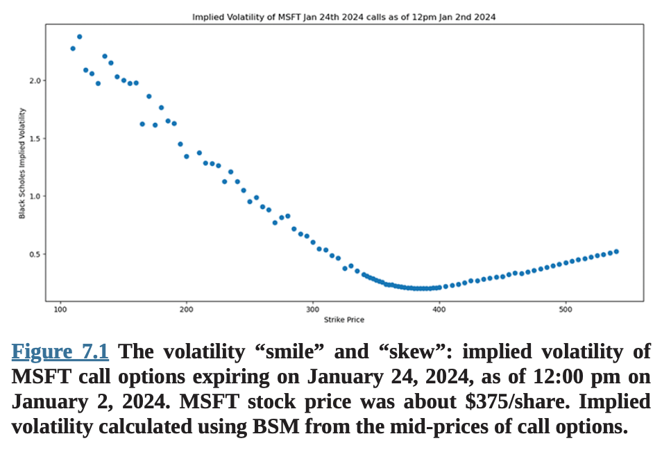
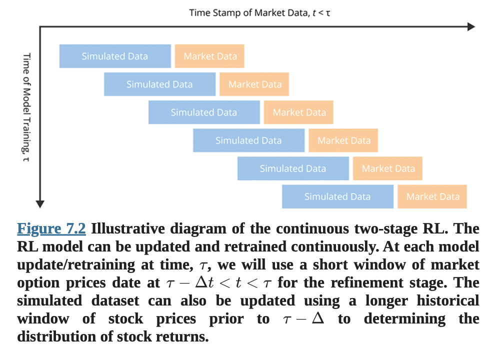
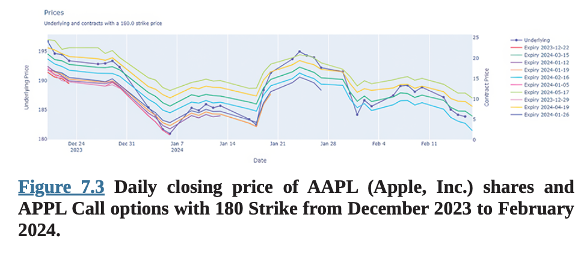
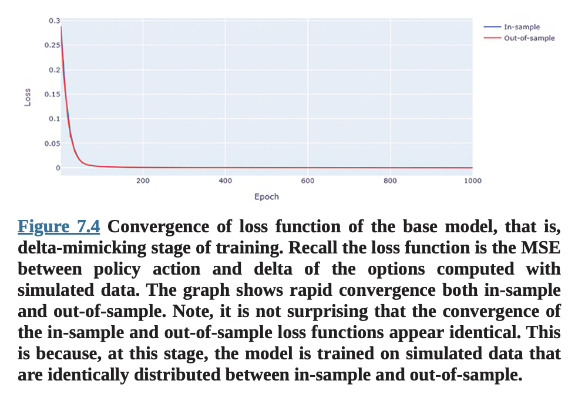
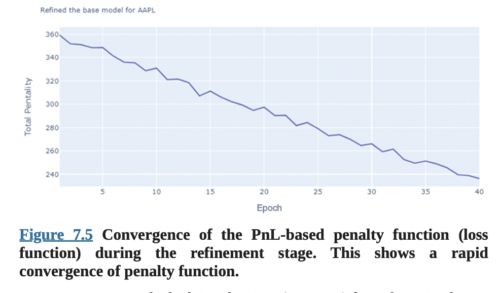
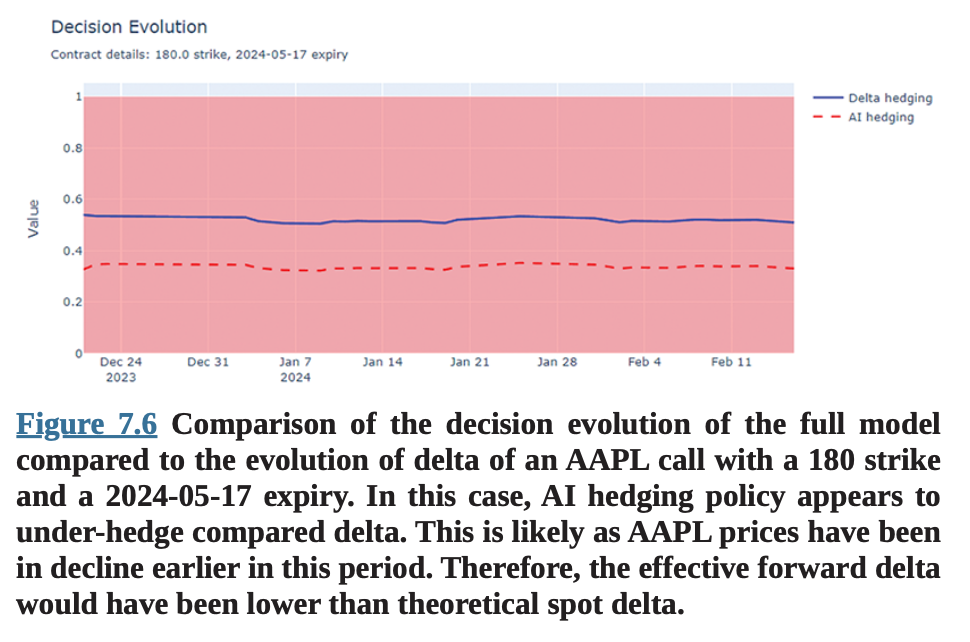
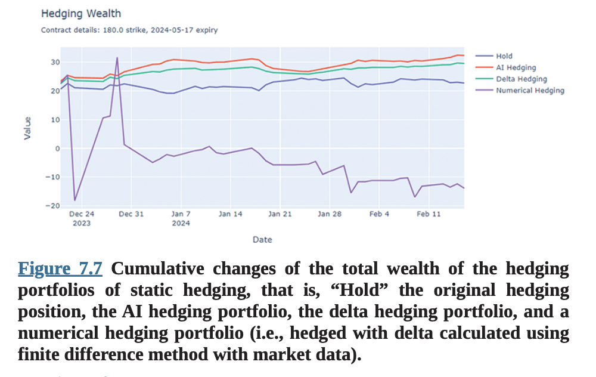
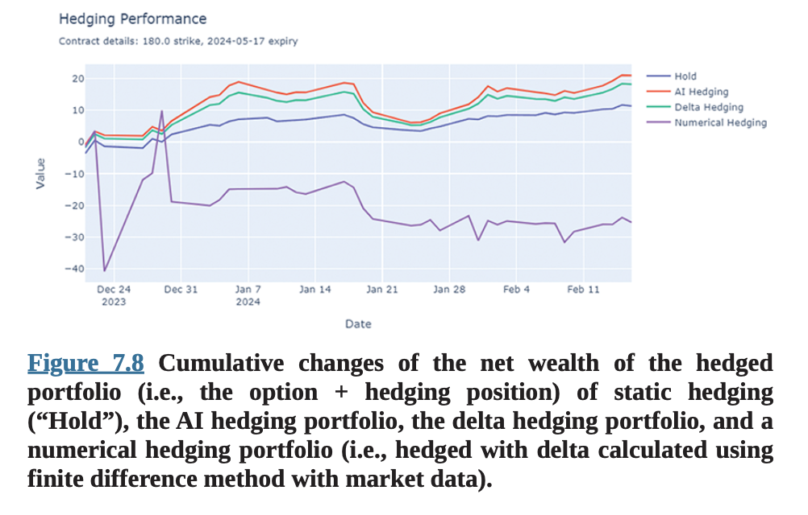

# 7장 강화학습을 통한 더 나은 헤징 

## 서론

## 새로운 AI 트레이딩 어시스턴트

우리가 2023년에 이 책을 쓰기 시작했을 때, 이는 Black과 Scholes(1973) 그리고 Merton(1973)의 옵션 가격 결정에 관한 기념비적 연구가 발표된 지 50주년이 되는 해였다. Black-Scholes Merton(BSM) 가격 결정 모델은 계량 금융과 자본 시장에 새로운 시대를 열었다. 그들의 논문의 영향은 학술 연구와 옵션의 시장 가격 모두에서 즉시 느껴졌다. 실제로 1970년대와 1980년대에 옵션 거래소의 트레이더들은 새로운 무기를 얻었다 - 나중에 데스크톱 컴퓨터나 개인용 컴퓨팅 기기의 롤로덱스인 HP 금융 계산기에 프로그래밍된 Black-Scholes(줄여서 BS, 이는 다재다능한 약어임이 증명될 것이다) 옵션 가격 결정 모델이었다. HP 계산기용 최초의 문서화된 Black-Scholes 프로그램은 당시 UCLA 박사과정 학생이었던 Peter Carr가 HP-12C용으로 작성하여 1988년에 발표했다(Carr, 1988). 몇 가지 입력값 - 주가, 만료일, 국채 금리, 그리고 추정 변동성 - 을 입력하면, 믿음직한 HP는 즉시 가격을 내놓았다. 새로운 "AI" 트레이딩 어시스턴트가 막 도착한 것이었다! 트레이더들의 놀라움에, 또는 일부에게는 큰 기쁨에, 그들이 서로 거래하고 있던 옵션의 가격들이...

## 틀렸다!?

시장 가격이 BS 가격과 크게 다르다는 사실은 횡재 수익의 기회였지만, 오직 트레이더들이 자신의 포지션을 헤지하는 방법을 알고 가격이 "무차익" BS 가격으로 수렴할 때까지 기다릴 수 있는 경우에만 가능했다. 이것이 문제였던 이유는 BSM 모델이 분할 주식이 가능한 무마찰(즉, 거래 비용이 0인) 시장에서의 연속적 헤징을 가정하기 때문이었다. 이러한 시장은 당시에 존재하지 않았고, 그 이후로도 실현되지 않았으며, 우리는 높은 확신을 가지고 가까운 미래에도 존재하지 않을 것이라고 말할 수 있다 - 수수료 없는 거래, 극소한 매수-매도 스프레드, 분할 주식, 그리고 고빈도 거래 기술이 있음에도 불구하고, 우리는 여전히 이상적인 상황과는 질적으로 거리가 멀다. 하지만 상관없었다. 평소라면 학자들을 무시하거나, 한 전직 거래소 트레이더의 표현을 빌리면 "올려다보며 코웃음을 치고" 그들의 환상적인 모델들을 일축했을 거래소 트레이더들이 BS에 매료되었다(앞서 말했듯이, 이 약어는 다재다능하다). 결과적으로 BS 가격은 자기실현적 예언이 되었다. 나머지는 역사다. BSM은 이제 직원 스톡옵션 가격 결정부터 인수합병 거래 평가, 유니콘 스타트업 벤처의 성층권 수준 밸류에이션 정당화에 이르기까지 금융경제학, 회계학, 기업금융의 예상치 못한 구석구석에 스며들어 있다.

# 연속적 헤징은 필수가 아니다

공정하게 말하면, BSM은 반드시 연속적이고 무마찰적인 헤징을 수행할 것을 요구하지는 않는다. 사실, 전혀 헤징할 필요가 없다. 시장이 합리적으로 효율적이고, 모든 사람이 옵션 계약 만료 시 결과의 확률 분포에 동의하며, 계약 기간 동안 "내재" 변동성이 일정하다면, 시장 가격은 BS 가격으로 수렴해야 한다. 주목할 점은 이러한 수렴은 무작위 분포를 가지며 무차익이 아니라는 것이다. 이는 금융에서 우리가 그러한 예상 현금흐름의 불확실성과 위험에 기반하여 미래 현금흐름을 할인하기 때문이다. BSM은 할인 현금흐름 분석과 일치한다. 그리고 단일가격 이론은 완전경쟁시장에서 트레이더들이 가격, 변동성, 위험 프리미엄에 대한 동일한 "균형" 기대치 집합으로 수렴할 것이라고 예측한다. 여전히 여기에는 BSM의 가정과 근본적으로 동일한 많은 가정들이 있다.

이미 실무자들은 BSM 가정의 불일치를 발견했다. 예를 들어, BSM을 사용하여 옵션의 시장 가격으로부터 특정 주식의 "내재 변동성(vol)"을 계산할 때, 내재 변동성이 서로 다른 행사가격에서 다르다는 것을 알 수 있다. 실제로 내재 변동성이 더 깊은 내가격(또는 외가격)에서 증가하는 것처럼 보이는 "변동성 스마일"이 나타난다(그림 7.1). 변동성 스마일은 "일정한 변동성" 가정과 일치하지 않는다. 또한 일반적으로 음의 변동성 스큐가 있는데, 즉 외가격 풋의 내재 변동성이 동일한 "머니니스"(즉, 행사가격과 기초 가격의 차이)를 가진 외가격 콜의 내재 변동성보다 높고, 마찬가지로 외가격 콜의 내재 변동성이 동일한 절대 머니니스를 가진 내가격 콜의 내재 변동성보다 높다는 것이다(그림 7.1). 이러한 스큐는 기초 가격의 수익률 분포의 스큐로는 설명되지 않으며, 위험 프리미엄 스큐 또는 더 유행하는 표현으로는 행동적 편향을 암시하는데, 이는 차익거래로 제거될 수 없는 경우에만 지속될 수 있다.



그림 7.1 변동성 "스마일"과 "스큐": 2024년 1월 2일 오후 12시 기준, 2024년 1월 24일 만료되는 MSFT 콜 옵션의 내재 변동성. MSFT 주가는 약 $375/주였다. 내재 변동성은 콜 옵션의 중간가격으로부터 BSM을 사용하여 계산되었다.

연속적 헤징은 이론적으로 자산 수익률 분포의 가정을 불필요하게 만든다. (여전히 유사한 가정 집합에 의존하는 자산 가격 경로의 분포를 다뤄야 하지만.) 따라서 Black-Scholes와 Merton의 접근법 지지자들은 기본 가정을 조정하려 할 것이다. 예를 들어, Heston(1993)은 기초 자산의 변동성에 대한 확률적 과정과 관찰된 옵션의 시장 가격에 모델 매개변수를 보정하는 수치 알고리즘을 제안했다. 경험적으로 Heston 모델은 관찰된 시장 데이터에 꽤 잘 맞는다. 하지만 이러한 개선은 모델 복잡성 증가라는 대가를 치르는데, 수치 보정이 많은 계산 자원을 소모하는 경향이 있어 작업하기가 더 어렵고 비용이 많이 든다. 그리고 이러한 보정된 모델들에는 큰 문제가 있다: 더 복잡하고 더 많은 매개변수를 가지는 경향이 있다는 것이다. Heston의 경우, 서로 다른 주식에 대한 매개변수 값이 다르게 나타났으므로 과적합의 위험이 있다!

그다음에는 수수료, 거래소 수수료, 매수-매도 스프레드, 거래가 시장 가격에 미치는 영향, 그리고 주식 수 반올림으로 인한 과도 및 과소 헤징을 포함한 헤징 거래와 관련된 비용들이 있다. 이러한 비용을 적절히 고려하려면 잠재적 거래 비용을 현실적으로 시뮬레이션해야 한다. 서로 다른 트레이더들이 서로 다른 거래 비용에 직면하므로, 거래 비용 분포의 견고한 추정도 필요하다.

# 앨리스는 토끼굴 속으로 점점 더 깊이 들어간다! 

## 머신러닝이 구원에 나서다

머신러닝(ML), 특히 강화학습(RL)의 등장으로 이제 BSM이나 Heston과 같은 구조적 모델 없이도 옵션 가격을 예측하는 것이 가능해졌다. 이제 우리는 거래 비용, 유동성, 시장 심리 등과 같이 이러한 모델에서 이전에 무시되었던 기본적이고 경험적인 특성들을 심층 신경망(DNN)에 통합할 수 있다. DNN이 시장 데이터로부터 학습하도록 하고, 그 다음 보간과 외삽을 통해 임의의 옵션 가격을 결정한다.
인공지능(AI) "에이전트"가 현실적인 가격 결정 모델을 학습할 수 있을 뿐만 아니라(정확히 어떻게 하는지는 모를 수도 있지만), 우리는 또한 강화학습을 사용하여 AI 에이전트가 앞서 언급한 거래 비용과 시장 마찰의 실용적 고려사항을 통합하여 사전에 최적의 헤징 정책을 구성하도록 훈련시킬 수 있다. 그 결과는 마켓 메이커와 옵션 딜러들이 재고 보유의 위험을 헤지하기 위해 프로그래밍 방식으로 배포할 수 있는 훨씬 더 견고한 헤징 정책이며, 이를 통해 옵션 시장의 전반적인 유동성과 효율성을 증가시킨다.

더욱이, 여기서 설명하는 방법은 옵션의 조합(즉, 콤보) 또는 구조화 상품으로 일반화할 수 있다. 구조화 상품은 복잡한 증권으로, 보통 3-5년 만기이며, 개별 주가나 시장 지수에 연동된 쿠폰과 원금 지급을 제공하고, 이러한 쿠폰과 원금 지급은 보통 기준 주식이나 지수의 미래 가격이 특정 임계값에 도달하는 조건에 따라 달라진다. 이러한 조건부 지급 구조는 내재 옵션이다. 예를들어, Barclays가 S&P 500 지수를 참조하여 발행한 구조화 상품은 다음과 같은 조건부 원금 가치 매트릭스를 가진다:

$$
V = \left\{
\begin{array}{ll}
V_0 + (x - V_0) \times 1.105 & \text{if } x > V_0 \\
\min\left(0,\ x - 0.8 \times V_0\right) & \text{if } x \leq V_0
\end{array}
\right.
$$

여기서 $V_{0}$와 $x$는 각각 기준 지수의 초기값과 최종값이다. 이 상품은 기준 지수 수익률의 레버리지(1.105)와 20%의 보호 버퍼를 제공하는데, 이는 효과적으로 풋 옵션의 롱과 숏 페어이다: 동가격 풋 옵션의 롱 포지션과 기준 지수 초기값 $V_{0}$의 80%에 해당하는 행사가격을 가진 외가격 풋 옵션의 숏 포지션. 옵션 마켓 메이커와 마찬가지로, 이러한 상품의 발행자들도 헤징의 필요성이 있다.

이 장에서는 옵션 거래 실무자들을 위해 $\underline{\text { QuantConnect.com }}$에서 구현되고 제공되는 "단순화된" 강화학습 알고리즘을 설명할 것이다. 우리는 기본 알고리즘 프레임워크를 논의하고, 예제 코드를 제시하며, 델타 매칭 또는 델타 헤징에 기반한 보다 전통적인 헤징과 비교하여 강화학습 헤징 알고리즘의 성능을 조사할 것이다. 이 장의 나머지 부분을 진행하기 전에, 독자들이 BSM과 같은 기본 옵션 가격 결정 이론과 신경망(NN) 및 강화학습(RL)의 머신러닝 개념에 익숙해지기를 권한다.

# 단순하지만 효과적인 강화학습 접근법

우선, 산업 수준의 AI 헤징 알고리즘을 훈련하는 데 필요한 대규모 RL 모델의 복잡성과 비용으로 인해, 최첨단 AI 헤징에 대한 포괄적인 다루기는 이 책의 범위를 벗어나며, 개인 퀀트 트레이더의 능력과 자원을 넘어선다. 대신, 저자와 그의 연구팀은 축소된 NN 아키텍처와 훨씬 작은 데이터셋에 의존하여 독자가 효과적으로 구현할 수 있는 RL을 단순화하는 접근법을 개발했다.

여기서 제시된 모델과 알고리즘은 $\underline{\text { QuantConnect.com }}$ 플랫폼의 온라인 알고리즘 거래 라이브러리에 통합되었으며, 이는 플랫폼의 광범위한 옵션 및 주식 시장 데이터와 원활하게 통합된다. 다음에서는 $\underline{\text { QuantConnect.com }}$에서 구현된 소스 코드를 예제로 사용할 것이다. 그러나 독자가 원한다면, GPU와 최소 16GB RAM을 갖춘 로컬 컴퓨터의 Python 환경에서 코드를 구현할 수 있다. 독자들은 또한 선택한 개별 티커에 대한 일일 옵션 및 주식 데이터에 접근할 수 있어야 한다. 이 예제와 관련된 전체 Python 파일들은 qnt.co/book-repo에 있는 책의 GitHub 저장소에서 이용할 수 있다. 저장소를 복제하는 방법에 대한 지침은 "Part III Part Overview"를 참조하라.

# 강화학습 개요

일반적으로, 전형적인 RL AI 헤징 프로그램은 다음 단계들을 포함한다:

1. 식별
2. 시뮬레이션 데이터를 이용한 훈련
3. "실제" 시장 데이터를 이용한 훈련 또는 개선
4. 테스트 및 구현

이 섹션에서는 이러한 단계들을 개념적으로 설명하고 다음 섹션에서 코드 예제로 설명할 것이다.

## 식별

이 단계는 기초 주식의 가격 과정을 식별하고 명시한다. 간결성과 가독성을 위해, 우리는 옵션의 모든 기준 자산이나 지수를 설명하기 위해 "주식"이라는 용어를 사용할 것이다. 기초 주식은 위험 자산이며, 그들의 가격 과정은 본질적으로 확률적이다. 우리가 잠재적으로 다른 자산 클래스를 기초 자산으로 인정할 것이므로, 가격 역학은 상당히 다를 수 있다. 따라서 이 단계에서 특정 과정(들)을 식별하고 과정과 결과의 분포를 설명하는 데 충분히 정확한 매개변수를 추정하거나 보정하는 것이 중요하다.
일반성을 잃지 않고, 다음 예제에서 우리는 주식의 기초 과정으로 기하 브라운 운동(GBM)을 채택한다:

$$
d S_{t}=\mu S_{t} d t+\sigma S_{t} d W_{t}
$$

여기서 $S_{t}$는 시간 $t$에서의 주가, $\mu$는 주식 수익률의 평균 드리프트, $\sigma$는 주식 수익률의 변동성, $W_{t}$는 위너 과정(브라운 운동)이다. 주식의 수익률은 평균 $\mu$와 표준편차 $\sigma$로 분포한다.

기초 주식의 다른 확률적 과정들도 채택될 수 있다. 예를 들어, Heston 모델(Heston, 1993)은 다음과 같이 가정한다:

$$
d S_{t}=\mu S_{t} d t+\sqrt{v_{t}} S_{t} d W_{t}^{S}
$$

Heston 모델은 주식 수익률의 변동성이 불변이라는 가정을 완화한다. 대신, 이 모델은 변동성에 대한 추가적인 시간 의존적 확률적 과정 $\sigma_{t}=\sqrt{v_{t}}$을 추가했다.

$$
d \sqrt{v_{t}}=-\theta \sqrt{v_{t}} d t+\delta d W_{t}^{v}
$$

변동성은 매개변수 $\theta$와 $\delta$(변동성에 대한 위너 과정의 분산)를 가진 Ornstein-Uhlenbeck 과정으로 모델링된다. $\theta$ 앞의 음의 부호는 이것이 자기회귀 과정임을 시사한다. 실제로, Ornstein-Uhlenbeck는 1차 이산 자기회귀 과정 AR(1)의 연속시간 버전이다. 주식에 대한 두 위너 과정 $W_{t}^{S}$와 변동성 $W_{t}^{v}$는 독립적이다. 이러한 이중 확률적 과정은 주가를 모델링하는 더 시장 일치적인 방법을 제공하지만, 시장 데이터로부터 매개변수를 보정하고 옵션 가격과 기타 분석(그릭스)을 수치적으로 추정하는 데 (훨씬) 높은 계산 비용이 든다. 따라서 이 단순화된 모델에서는 매개변수 추정에 전통적인 통계만 필요하고 옵션 가격과 그릭스에 대한 닫힌 형태의 해를 가진 더 분석적으로 매력적인 GBM, 즉 Black-Scholes Merton 모델을 선택했다.

# 시뮬레이션

헤지 대상 상품(이 예제에서는 콜 옵션)이 이론적 무차익 관계를 명시할 수 있는 기초 증권(이 예제에서는 주식)의 파생상품인 경우, 훈련 데이터를 시뮬레이션하는 것이 좋은 아이디어이다. 대량의 데이터가 있는 것처럼 보임에도 불구하고, 역사적 금융 시장 데이터는 실제로 강화학습에는 상당히 부적절하다. 이는 금융 시장이 경쟁적이기 때문이다. 합리적으로 지속될 수 있는(예: 알고리즘이 반응하고 거래할 수 있는 시간 프레임에서) 모든 "혁신", 즉 기본적인 가격 관계로부터의 편차는 보통 탐지하기 매우 어렵다. 다른 말로 하면, 그러한 거래 가능한 혁신의 신호 대 잡음 비율이 매우 낮다. 따라서 대부분의 금융 데이터셋은 모델이 구조적 모델에 이미 알려지지 않은 지속적인 혁신을 신뢰성 있게 학습할 수 있는 낮은 정보 내용만을 포함한다. 우리의 목표가 알려진, 지속적인 비구조적 행동에 반응하는 헤징 정책을 훈련하는 것이라면, 우리가 그것들을 올바르게 식별하는 한, 이러한 "알려진 미지수"를 시뮬레이션할 수 있다.

여기 예제에서, 모델이 학습하기를 원하는 지속적이고 기본적인 행동은 옵션과 기초 주식 가격 간의 무차익 관계에 의해 지배된다: 무차익 관계는 다양한 모델을 사용하여 근사할 수 있다(우리는 지난 섹션에서 BSM과 Heston을 논의했다). 우리는 BSM과 GBM을 옵션과 주가 간의 핵심 관계로 식별했다. 따라서 우리는 BSM과 GBM을 사용하여 대량의 데이터를 시뮬레이션하고, 먼저 이러한 가정 하에서 최적의 헤징 전략을 찾도록 모델을 훈련할 것이다. 우리는 앞서 이론적 모델의 단점을 논의하고 헤징의 더 현실적인 측면을 학습하기 위해 RL을 사용하는 동기를 명확히 했다. 그렇다면, 시뮬레이션된 데이터로 모델을 훈련함으로써 무엇을 얻는가?

답은 미묘하다. 답의 첫 번째 부분은 "현실성"의 한 측면이 BSM의 기초가 되는 연속적 헤징과 대조되는 이산적 헤징이라는 것이다. 시뮬레이션된 데이터로, 우리는 자산 가격의 이산적 단계(이 예제에서는 일일)와 이산적 헤징(이 예제에서도 일일)을 시뮬레이션한다. "최적의" 이산적 헤징 전략을 분석적으로 결정하는 것이 가능하다. 하지만 계산이 상당히 복잡하여, 대부분의 경우 수치적으로만 수행할 수 있는 확률적 편미분방정식을 풀어야 한다. 이는 거래 빈도가 분 또는 초 단위인 경우 입력 상태의 업데이트와 적절한 헤지 행동의 결정 사이의 지연시간이 허용할 수 없을 정도로 길기 때문에 구현하기 비실용적이다. 반면에 ML 정책 네트워크는 일단 학습되면 현재 시장 상황(상태)에 반응하고 매우 낮은 지연시간으로 "행동"을 도출할 수 있다.

다른 답은, 우리가 데이터를 시뮬레이션하고 있기 때문에, 유동성, 시장 추세 또는 기타 예측 모델, 거래 비용 모델 등과 같은 기본 가격 결정 모델에 대한 알려진 변형이나 혁신을 시뮬레이터에 구축할 수 있다는 것이다. 단서는 그것들이 "알려진 미지수"여야 한다는 것이다. RL 모델은 시뮬레이션된 데이터로부터 보지 못한 과정들을 학습할 수 없을 것이다. 이것이 우리를 다음 주제로 이끈다: 실제 시장 데이터에 대한 개선 훈련.

# 실제 시장 데이터에 대한 개선 훈련

역사적 시장 가격의 대규모 데이터셋이 우리에게 알려지지 않은 지속적인 혁신이나 과정을 포함한다고 믿는 상황에서, 우리는 "실제" 시장 데이터로 모델을 훈련할 수 있다. 앞서 논의했듯이, 금융 시장의 경쟁적 성격은 알려진 또는 알려지지 않은 미지수가 지속되고 데이터에서 눈에 띄게 될 가능성을 낮게 만든다. 많은 데이터가 있고 시장이 완전히 경쟁적이지 않은 특정 상황에서, 예를 들어 고빈도(HF) 거래에서, 필요한 고급 컴퓨팅 및 정보 기술 하드웨어에 대한 투자가 HF 시장을 덜 경쟁적으로 만드는 경우, 실제 데이터, 틱별 또는 고빈도 시간 막대 데이터로 훈련된 ML/RL 모델은 경쟁자의 규칙 기반 알고리즘에 비해 상당한 이점을 제공할 수 있다. 하지만 이 경우에도, 시뮬레이션은 이론적이고 기본적인 사전 지식으로 모델을 준비하는 데 중요한 역할을 할 수 있다. 그런 다음, 모델은 실제 세계의 도전과 추가적인 "알려지지 않은 미지수"를 통합하기 위해 귀중한 실제 시장 데이터로 개선될 수 있다.

이 예제에서, 우리는 헤징 정책 네트워크 훈련의 두 번째 "개선" 단계에서 시장 데이터를 통합한다. 이 개선 단계에서, 짧은 기간의 역사적 시장 데이터가 최근 정보에 맞춰 정책 네트워크를 미세 조정하는 데 사용된다. 우리가 짧고 최근의 역사적 기간을 선택한 이유는 옵션 시장이 빠르게 진화하고 있고, RL 에이전트가 학습하기를 원하는 유동성, 거래 비용, 시장 트렌드와 같은 특성들이 정적이지 않기 때문이다. 다음 섹션에서 구현의 세부사항을 논의할 것이다.

# 테스트 및 구현

모든 머신러닝 노력과 마찬가지로, 샘플 데이터를 훈련, 검증, 표본 외 테스트로 분할하는 것이 모범 사례이다. 금융 시장 응용 프로그램의 경우, 시장이 지속적으로 새로운 데이터를 생성하므로, 새로운 시장 데이터를 사용하여 표본 외 테스트를 수행할 기회가 있다. 이는 알고리즘 거래 모델(또는 기본적인 투자 프로세스)의 표본 외 성능을 지속적으로 모니터링하고 표본 외 결과를 사용하여 모델을 검증(또는 무효화)하고, 개선하며, 향상시키기 위해 "페이퍼" 포트폴리오를 운영하는 오래된 전통이다.

실제 돈으로 거래 알고리즘을 구현한 후에도, 우리는 계속해서 성능 결과를 체계적으로 분석해야 한다. 현재 시장 상태에 조건부인 모델 성능의 기대치(사전)와 실제 돈으로 거래할 때 경험하는 것(사후) 사이의 차이를 이해하는 것이 중요하며, 이는 우리 모델의 사각지대, 부정확성, 또는 심지어 오류를 식별하는 데 도움이 된다. 세부사항이 응용 프로그램에 따라 달라지므로, 우리는 AI 헤징 과정의 이 부분을 다루지 않을 것이다. 우리는 지속적인 테스트, 귀속, 모델 개선에 대한 잘 짜인 계획 없이는 어떤 AI 헤징도 구현되어서는 안 된다는 점을 강조하고 싶다.

이제 $\underline{\text { QuantConnect.com }}$에서 구현된 코드 예제로 AI 헤징을 설명하기로 한다.

## QuantConnect에서의 구현

이 예제는 $\underline{\text { QuantConnect.com }}$에서 구현되며 RL을 위해 PyTorch의 NN 인터페이스를 사용한다. 이 책에서는 PyTorch의 기본 사항을 다루지 않을 것이다. 독자들은 pytorch.org의 우수한 온라인 문서와 튜토리얼을 참조하기 바란다.

이 프로젝트의 목적은 헤지 대상 자산(이 경우 콜 옵션)과 헤징 수단(이 경우 기초 주식)을 포함하는 헤지된 포트폴리오의 손익(PnL) 분산을 최소화하는 최적의 헤징 정책을 얻는 것이다. 이 예제는 AAPL(Apple, Inc.) 콜 옵션과 주식으로 에이전트 또는 헤징 정책 네트워크를 훈련하는 과정을 보여준다. 다음 텍스트에서 우리는 "에이전트"와 "정책 네트워크"라는 용어를 상호 교환적으로 사용한다. 하지만 약간의 차이가 있다: 정책 네트워크는 RL을 통해 매개변수가 조정되는 NN을 의미하며, 여기서 입력은 현재 시장 상태이고 출력은 다음 기간의 헤징 결정이다. "에이전트"는 정책 네트워크로 무장하여 실시간 결정을 내리고 그러한 결정에 따라 거래하는 거래 알고리즘을 의미한다. 다시 말해, "에이전트"가 AI이다.

독자는 QuantConnect.com의 코드 라이브러리에서 "aihedging" 하에서 전체 프로젝트를 찾을 수 있다. 파일의 구성은 다음과 같다:

AI 델타 헤징. 이것이 주요 프로젝트이다:

- research.ipynb: 2단계 훈련을 실행하고, 모델을 테스트하며, 결과를 생성하는 주요 모델.
- main.py: 훈련의 초기화를 포함하고 일반적인 매개변수를 설정하는 AIDeltaHedgingAlgorithm 클래스를 정의한다. 이 클래스는 QuantConnect.com의 백테스트 환경에서 호출될 수 있다.
- aihedging: 주요 연구 노트북의 구성 요소의 클래스와 함수 정의를 포함하는 별도의 프로젝트.
- model.py: 주요 연구 노트북에서 호출되는 클래스와 함수를 정의한다.
- policy.py: 정책 신경망의 아키텍처를 정의하는 "정책" 클래스.

다음에서 각 구성 요소를 설명할 것이다.

# 주요 연구 노트북

연구 노트북인 research.ipynb에서, 우리는 2단계 훈련 과정과 모델 성능의 간단한 테스트를 설명할 것이다. 연구 노트북의 첫 번째 셀은 모델을 생성하고, 재현성을 보장하기 위해 랜덤 시드를 고정하며, CPU 또는 GPU와 같은 프로세서를 선택한다. AIDeltaHedgeModel 클래스의 세부사항은 나중에 살펴볼 것이다.

[research.ipynb/Cell 1]

```python
from aihedging.model import AIDeltaHedgeModel
qb = QuantBook( )
model = AIDeltaHedgeModel(qb,timedelta(qb.get_parameter('min_contract_duration', 30)), timedelta(qb.get_parameter('max_contract_duration', 120)), timedelta(qb.get_parameter('min_holding_period', 14))
```

두 번째 셀은 기본 모델, 즉 델타 헤징을 모방하는 정책 네트워크 훈련의 첫 번째 단계를 훈련한다. model.train_base_model 함수의 세부사항은 나중에 살펴볼 것이다.

[research.ipynb/Cell 2]

```python
model.train_base_model(plot=True, epochs=1000)
```

세 번째 셀은 헤지된 포트폴리오의 PnL에 기반한 페널티 함수를 적용하고, 2023년 12월 19일부터 2024년 2월 17일까지의 AAPL(Apple Inc.) 일일 종가로 정책 네트워크를 개선하는 개선 단계를 실행한다. model.train_asset_model( ) 함수의 세부사항은 나중에 살펴볼 것이다.

[research.ipynb/Cell 3]

```python
start_date = datetime(2023, 12, 19)
end_date = datetime(2024, 2, 17)
model.train_asset_model("AAPL", start_date, end_date, epochs=40, save=False, in_research_env=True)
```
마지막 셀은 모델의 성능 테스트를 실행한다. model.research_test( ) 함수의 세부사항은 나중에 살펴볼 것이다.

[research.ipynb/Cell 4]

```python
model.research_test(strike_level=-1, start=start_date, end=end_date)
```

# 정책 네트워크

정책 네트워크인 policy.py에서, 우리는 NN에서 직접 헤징 "정책" 클래스인 Policy(nn.Module)를 정의한다. 이는 (1) 다음에 정의되는 머니니스, (2) 만기까지의 시간, (3) 기초 주식(예: AAPL)에서의 이전 헤징 포지션을 포함하는 3차원 상태를 입력으로 받는다. 그리고 다음 단계의 헤징 포지션과 정규 확률 분포의 $\boldsymbol{m} \boldsymbol{u}$와 sigma로 표시되는 각각의 불확실성이라는 두 가지 매개변수를 출력한다. 참고로, 코드 가독성을 위해 상세한 수학 방정식을 제외하고는 텍스트에서 그리스 문자 사용을 피할 것이다. 독자들은 헤징 포지션의 $\boldsymbol{m} \boldsymbol{u}$와 sigma를 자산 수익률의 평균과 변동성과 혼동해서는 안 된다.

머니니스는 0과 행사가격과 기초 주가의 차이 중 최댓값으로 정의된다. 콜 옵션의 경우, 주가가 행사가격보다 높으면 옵션이 내가격이며, 즉 머니니스가 양수이다. 풋 옵션의 경우, 행사가격이 주가보다 높으면 옵션이 내가격이거나 머니니스가 양수이다.

주의 깊은 독자라면 옵션 가격 자체가 상태 벡터의 특성이 아니라는 것을 알아차렸을 것이다. 훈련의 첫 번째 단계에서, 우리는 앞서 논의한 바와 같이 기초 주식의 GBM과 함께 BSM에 기반한 무차익 가격으로 옵션 가격을 시뮬레이션할 것이다. 따라서 옵션 가격은 다른 상태 변수에 완전히 의존한다.

우리는 또한 시장 구조(예: 전체 거래량, 매수-매도 스프레드, 거시경제적 배경)와 같은 다른 가능한 특성들을 포함하지 않았다. 독자들은 추가적인 특성으로 상태 벡터를 풍부하게 하기를 권장한다. 하지만 시뮬레이션을 위해서는 이러한 추가적인 특성들을 시뮬레이션하는 데이터 생성 과정을 식별하고 모델링해야 할 것이다.

코드를 살펴보자:

[policy.py]

```python
from torch import nn
from torch import optim
from torch import distributions as D
import torch.nn.functional as F
import torch as T

class Policy(nn.Module):
    def __init__(self, device):
        super(Policy, self).__init__()
        # 네트워크 레이어 정의
        self._fcin = nn.Linear(3, 256)
        self._fc1 = nn.Linear(256, 256)
        self._fcout = nn.Linear(256, 1*2)
        
        # 옵티마이저 정의
        self.optimizer = optim.Adam(self.parameters(), lr=3e-4)
        
        # 네트워크의 파라미터와 버퍼를 올바른 디바이스(CPU 또는 GPU)로 이동
        self.to(T.device(device))
    
    def forward(self, state):
        x = F.relu(self._fcin(state))
        x = F.relu(self._fc1(x))
        x = self._fcout(x)
        lmu, lsig = x.split(1, dim=-1)
        return F.sigmoid(lmu), F.sigmoid(lsig) + 1e-12
    
    def sample(self, state):
        mu, sig = self.forward(state)
        d = D.normal.Normal(mu, sig)
        sample = d.rsample()
        return sample, d.log_prob(sample).sum(axis=-1)
```

여기서 정책 NN은 3개의 레이어로 구성된다. 우리는 입력 레이어 self.fcin $=$ nn. Linear $(3,256)$을 정의하여 앞서 논의한 3개의 상태 차원에 해당하는 3개의 입력 특성과 이 은닉 레이어에 256개의 노드를 갖는다. 따라서 입력 레이어로부터 256개의 중간 출력 특성이 두 번째 은닉 레이어의 노드에 입력된다 [코드: self.fc1 = nn.Linear(256, 256)]. 그런 다음 두 번째 은닉 레이어는 출력 레이어로 전달될 256개의 중간 출력을 갖는다 [코드: self.fcout $=$ nn.Linear(256, 1*2)]. 그리고 최종 출력 레이어는 앞서 논의한 바와 같이 다음 기간의 헤징 포지션인 mu와 결정의 불확실성인 sigma로 구성된다.

헤징 포지션인 mu는 다음 시간 기간의 머니니스와 만기까지의 시간 업데이트와 함께 다음시간 기간으로 전달되어 그 다음 기간의 헤징 정책 mu와 sigma를 결정한다. ReLU 함수가 레이어 간 활성화에 사용된다.

독자들은 자신만의 NN 아키텍처를 설계하고 적절한 활성화 함수를 선택할 자유가 있다. 저자는 3레이어 NN이 헤징의 복잡한 기능에 적절하다고 주장하지 않는다. 하지만 다음에 설명하는 시뮬레이션된 데이터로 모델을 훈련하는 데는 상당히 효율적인 NN이다.

3개의 상태 차원 중에서, 만기까지의 시간은 확률 변수가 아니다. 왜냐하면 우리가 앞으로 나아갈 때마다 기간 간 길이(이 경우 1일)만큼 단순히 감소할 것이기 때문이다. 하지만 머니니스는 기초 주식의 역학에 기반하여 계산되어야 하는 확률 변수이다. 기초 주식의 역학을 포착하기 위해, 우리는 (a) 주가 과정을 시뮬레이션하거나, (b) 역사적 주가를 사용할 수 있다. 옵션 (a)는 훈련 목적을 위해 잠재적으로 무제한의 데이터를 생성할 수 있다는 장점을 제공한다. 다음 섹션에서, 우리는 주식이 고정된 드리프트(즉, 평균 수익률)와 고정된 수익률 변동성을 가진 GBM을 따른다고 가정하는 BSM을 사용하여 데이터 생성 과정을 설정한다. 앞서 설명한 Heston (1993)과 같은 더 정교한 모델이 있는데, 여기서는 변동성 자체에 대한 확률적 과정을 도입함으로써 주식 수익률 분포의 정적성이 완화된다. 이미 언급한 이유로, 우리는 이 예제에서 GBM과 따라서 BSM을 고수할 것이다.

# 모델 함수들

전체 모델은 model.py 클래스인 AIDeltaHedgeModel에 캡슐화되어 있다. 우리는 전체 클래스에 포함된 모든 정의를 출력하고 설명하지 않을 것이며, 그럴 필요도 없다. 다음 정의들을 검토할 것이다:

- _init_(): 클래스 초기화.
- train_base_model(): 시뮬레이션된 데이터와 델타와 정책 행동 간의 mse로 정의된 손실 함수를 사용하는 델타 모방 훈련 단계.
- train_asset_model(): 역사적 시장 데이터와 헤지된 포트폴리오의 pnl에 기반한 페널티 함수를 사용하는 개선 훈련 단계.

- research_test(): 설명을 위한 단일 주식 옵션의 헤징 성능에 대한 간단한 테스트.

[model.py/AIDeltaHedgeModel/__init__()]

```python
def __init__(self, algorithm, 
             min_contract_duration=timedelta(30),
             max_contract_duration=timedelta(120),
             min_holding_period=timedelta(14), 
             size=(10_000, 1),
             commission=0.01):
    """AIDeltaHedgeModel 초기화"""
    self._algorithm = algorithm
    self._min_contract_duration = min_contract_duration
    self._max_contract_duration = max_contract_duration
    self._min_holding_period = min_holding_period
    self._size = size
    self._commission = commission
    self._pos = 0
    self._policy = None
    self.enable_automatic_indicator_warm_up = True
    
    # 재현성을 위한 랜덤 시드 설정
    seed_value = 1
    os.environ['PYTHONHASHSEED'] = str(seed_value)
    random.seed(seed_value)
    np.random.seed(seed_value)
    T.manual_seed(seed_value)
    
    # 기본 텐서 타입 설정
    T.set_default_dtype(T.float32)
    
    # 디바이스 타입 설정 (CPU/GPU)
    self._device = 'cuda:0' if T.cuda.is_available() else 'cpu'
```

이는 AIDeltaHedgeModel 객체를 초기화하고 최대/최소 계약 기간(120/30일), 최소 보유 기간(14일), 데이터 시뮬레이션에 사용되는 수수료(0.01), 그리고 역사적 데이터 필터링을 지정한다. 그리고 재현성을 위해 랜덤 시드를 고정한다.

우리는 프리미엄 계정용 QuantConnect.com에서 사용 가능한 GPU로 모델을 훈련하고 싶다. 코드의 마지막 줄은 GPU인 torch. cuda가 사용 가능한지 확인한다.

만약 그렇다면, 우리는 디바이스를 'cuda:0'으로 설정한다. 그렇지 않으면, "cpu"를 기본값으로 한다.

[model.py/AIDeltaHedgeModel/train_base_model()]

```python
def train_base_model(self, plot=True, epochs=1000):
    # 정책 생성
    self._policy = Policy(self._device)
    # 손실 함수 정의
    mse = nn.MSELoss()
    # 변동성과 무위험 이자율 인수 설정
    # 기본 모델은 시작일과 종료일이 없는 생성된 데이터로 훈련되므로
    # 2013-2018년을 사용하자
    vol, rf = self._get_vol_and_rf(
        Symbol.create("SPY", SecurityType.EQUITY, Market.USA),
        self._earliest_options_date, 
        datetime(2018, 1, 1)
    )
    # 언더헤지된 Black-Scholes 델타를 복제하도록 모델 훈련
    in_sample_loss_values = []
    oos_loss_values = []
    
    for E in range(epochs):
        # 네트워크 실행에 필요한 데이터 가져오기
        ttm, moneyness, delta, position = self._generate_data(vol, rf)
        states, y, test_states, test_y = self._forge_batch(
            moneyness, ttm, delta, position
        )
        
        # 표본 내 행동과 손실 가져오기
        action, _ = self._policy.sample(states)
        loss = mse(action, y)
        inloss = loss.item()
        
        # 네트워크 파라미터 업데이트
        self._policy.optimizer.zero_grad()
        loss.backward()
        self._policy.optimizer.step()
        
        # 표본 외 행동과 손실 가져오기
        action, _ = self._policy.sample(test_states)
        outloss = mse(action, test_y).item()
        
        # 이 에포크의 손실 값 기록
        in_sample_loss_values.append(inloss)
        oos_loss_values.append(outloss)
    
    # 각 에포크의 훈련 손실 값 플롯
    if plot:
        x = list(range(1, epochs+1))
        go.Figure(
            [
                go.Scatter(x=x, y=in_sample_loss_values, name='In-sample'),
                go.Scatter(x=x, y=oos_loss_values, name='Out-of-sample')
            ],
            dict(
                title='Training Loss of the Base Model',
                xaxis_title='Epoch', 
                yaxis_title='Loss',
                showlegend=True
            )
        ).show()
    
    # 기본 모델을 Object Store에 저장
    joblib.dump(
        self._policy,
        self._algorithm.object_store.get_file_path(self._base_model_key)
    )
```

앞서 논의한 바와 같이, 이 단계에서의 손실 함수는 BS 델타인 y와 정책 "행동" 간의 평균 제곱 오차(MSE)이며, 다음 줄에서 볼 수 있다:
loss = mse(action, y)
여기서 mse는 PyTorch의 메서드인 nn.MSELoss( )가 할당된다. 각 훈련 에포크에서, 우리는 다음 4단계를 갖는다: (1) 훈련을 위한 데이터 시뮬레이션, (2) 데이터를 훈련 및 테스트 세트로 분할, (3) 훈련 데이터셋으로 모델 훈련 및 테스트 데이터셋으로 검증, 그리고 (4)

각각의 손실 함수 값 계산. generate_data( ) 함수에서, 우리는 3개의 상태 변수(만기까지의 시간, 머니니스, 델타)를 얻고, 이는 시뮬레이션된 데이터를 훈련/테스트 데이터셋으로 분할하기 위해 forge_batch( ) 함수로 전달된다.

플로팅 함수는 이 단계에서 손실 함수의 수렴 그래프를 출력하는데, 이는 "결과" 섹션에서 논의할 것이다.

# Black-Scholes를 사용한 훈련 데이터 생성

여기서 BS 함수를 정의한다. 이는 GBM을 가진 표준 BSM 방정식들이다. norm.cdf( ) 함수는 무위험 이자율로 현재로 할인된 콜 옵션의 순 위험 중립 기댓값을 계산하기 위해 머니니스 d1과 아웃-오브-머니니스 d2의 위험 중립 동등물을 취한다. 독자들은 Wikipedia.org의 우수한 항목을 포함하여 수많은 교과서와 자료에서 이용 가능한 BS 공식과 BSM 모델의 유도를 찾아보기를 권한다.

[model.py/AIDeltaHedgeModel/]

```python
def black_scholes_call(S, K, sig, r, t):
    """Black-Scholes 콜 옵션 가격 계산"""
    d1 = np.log(S/K) + (r + sig**2/2) * t
    d2 = d1 - sig * np.sqrt(t)
    return S * norm.cdf(d1) - K * np.exp(-r * t) * norm.cdf(d2)

def black_scholes_delta(m, sig, r, t):
    """Black-Scholes 델타 계산"""
    d1 = np.log(m + 1.) + (r + sig**2/2) * t
    return norm.cdf(d1)
```
참고로, 기초 주식 분포와 무위험 이자율의 매개변수는 실제 주식(즉, AAPL)의 역사적 가격과 연방공개시장위원회의 기본 신용 이자율을 무위험 이자율로 사용하여 추정된다. 이들이 직관적이므로 여기서 매개변수를 추정하는 코드의 설명은 생략할 것이다. 코드는 "model.py" 안에 포함되어 있다. 주식의 가격 이력과 무위험 이자율은 플랫폼에서 이용 가능한 사전 정의된 데이터 쿼리 함수를 사용하여 QuantConnect.com의 시장 데이터로부터 검색된다. 일반성을 잃지 않고, 우리는 개별 주식의 고정된 변동성 수준을 고려하여 정책 네트워크를 훈련할 것이다

(즉, 우리 예제에서는 AAPL). 최적의 헤징 정책의 매개변수가 주식의 변동성에 의존할 가능성이 충분히 있다. 독자들은 여러 주식 변동성 가정에 대해 모델을 훈련하기를 권한다.

훈련 데이터를 생성하고 데이터를 훈련 및 테스트 하위 집합으로 분할하는 함수들이 다음에 정의된다. 상태 벡터를 정의하는 특성들이 PyTorch의 tensor( ) 메서드를 사용하여 텐서로 구성되는 것에 주목하라.

[model.py/AIDeltaHedgeModel/]

```python
def generate_data(size):
    """훈련 데이터 생성"""
    ttm = np.random.uniform(size=size) * 31 / 252  # 만기까지의 시간
    moneyness = np.random.uniform(size=size) * 2 - 1  # 머니니스
    delta = black_scholes_delta(moneyness, vol, rf, ttm)  # 델타 계산
    position = np.random.uniform(size=size)  # 포지션
    return ttm, moneyness, delta, position

def forge_batch(moneyness, ttm, delta, position, ratio=0.75):
    """데이터를 훈련/테스트 배치로 분할"""
    cut = int(moneyness.size * ratio)
    tmp = delta * 0.9 + position * 0.1
    
    # 훈련 데이터 상태 벡터 생성
    states = T.tensor(np.concatenate((
        moneyness.flatten()[:cut, np.newaxis],
        np.sqrt(ttm.flatten())[:cut, np.newaxis], 
        position.flatten()[:cut, np.newaxis]
    ), axis=1)).float().to(DEVICE)
    
    # 훈련 데이터 타겟
    y = T.tensor(tmp.flatten()[:cut, np.newaxis]).float().to(DEVICE)
    
    # 테스트 데이터 상태 벡터 생성
    test_states = T.tensor(np.concatenate((
        moneyness.flatten()[cut:, np.newaxis], 
        np.sqrt(ttm.flatten())[cut:, np.newaxis], 
        position.flatten()[cut:, np.newaxis]
    ), axis=1)).float().to(DEVICE)
    
    # 테스트 데이터 타겟
    test_y = T.tensor(tmp.flatten()[cut:, np.newaxis]).float().to(DEVICE)
    
    return states, y, test_states, test_y
```

# 시뮬레이션된 데이터를 사용한 목표 및 손실 함수

요약하면, 학습 알고리즘의 이 단계에서, 우리는 정책 네트워크가 "언더헤지된" Black-Scholes 델타의 행동을 학습하거나 "모방"하도록 허용한다. "언더헤지된"이라는 용어는 시뮬레이션된 그리고 실제 헤징 전략이 연속적이지 않고 이산적이라는 사실을 의미한다. 델타는 기초 주식의 변동성과 가격이 변함에 따라 연속적으로 변하므로, 어떤 이산적 델타 헤지도 옵션 포지션의 PnL과 일치하기에는 불충분하다.

여기서, 시뮬레이션은 BSM 과정을 가정하므로, BS 델타가 학습의 목표로 사용된다. 다시 말해, 이 단계에서 정책 네트워크는 기본 수학을 알지 못한 채 델타를 추정하는 것을 학습할 것이다. 또한 옵션 포지션의 PnL을 목표로 하여 정책 네트워크를 훈련할 수도 있는데, 이 경우 정책 네트워크는 BS 가격을 학습할 것이다. 실제로, 델타는 주가의 1차 미분이며, 콜 또는 풋 옵션에 대해 0과 1 사이에 제한된다. 정책 네트워크는 델타와 같은 제한된 목표로 더 빠르고 더 견고하게 수렴할 것이다.

닫힌 형태의 델타가 없는 다른 (파생상품, 기초자산) 쌍 역학과 함께 여기의 방법을 일반화하기 위해, 시뮬레이션된 가격으로부터 유한차분 방법을 사용하여 델타를 수치적으로 계산할 수 있다. 정책 헤지 비율이 현재 상태에 기반하여 다음 기간에 대해 결정되므로(앞서 논의 참조), 학습된 정책이 현재나 다음 기간의 델타와 동일하지 않을 것이라는 점에 주목하는 것이 중요하다. 기초 주식의 확률적 성격을 고려할 때, 다음 기간 델타의 확률 분포만을 평가할 수 있으므로, 정책 헤지 비율과 BS 델타 사이에는 유한한 손실이 있을 것이다. 예제 코드는 정책 "행동"과 목표 델타인 "y" 사이의 MSE를 최소화한다.

혼동을 피하기 위해, 이 훈련 단계의 목적이 단순히 시뮬레이션된 데이터로부터 델타를 학습하는 것이 아니라는 점을 지적하는 것이 도움이 될 수 있다. 이는 델타 헤징의 행동을 모방함으로써 정책 네트워크를 "준비"하는 것이다. "델타"를 학습한 후, 정책 네트워크는 역사적 시장 데이터로부터 학습할 것이다. 훈련의 이 두 번째 단계에서, 우리는 정책 네트워크를 미세 조정하거나 "강화"하기 위해 헤지된 포트폴리오의 PnL 분산에 기반한 "페널티" 함수를 지정할 것이다.

# 시장 데이터를 사용한 미세 조정

이 섹션에서, 우리는 최근 역사적 시장 데이터로 정책 네트워크를 미세 조정하거나 강화할 것이다. 이 훈련 단계의 목적은 "현실성"의 원천을 주입하는 것이다. 이전 단계가 델타 헤징의 행동을 모방하도록 정책 네트워크를 훈련했으므로, 정책 네트워크는 헤징의 "교과서적" 규칙만을 학습했다. 이 단계에서, 우리는 거래 비용, 유동성, 시장 트렌드와 같은 최근 시장 상황을 통합하는 것으로 추정되는 실제 시장 가격에 대해 정책 네트워크를 훈련한다. 시장 가격에 잠재된 정보를 완전히 통합하기 위해, 우리는 헤지된 포트폴리오의 PnL 변화에 대한 페널티 함수를 정의한다. 개선 학습의 목적은 다음과 같이 정의되는 PnL의 변화를 최소화하는 것이다:

$$
\Delta_{t+1}=a_{t+1}\left(S_{t+1}-S_{t}\right)-c *\left(a_{t+1}-a_{t}\right)-\left(C_{t+1}-C_{t}\right)
$$

여기서 $\Delta_{t+1}$은 시간 $t$와 $t+1$ 사이의 헤지된 포트폴리오 총 가치의 "변화"이고; $a_{t+1}$은 헤징 행동, 즉 시간 $t$에서 결정되고 $t+1$까지 보유되는 기초 주식의 수량이며; $S_{t}$는 시간 $t$에서의 기초 주가이고; $c$는 기초 주식 거래의 수수료율이며, $C_{t}$는 콜 옵션의 "인보이스" 가격이다. 참고로, 상장 옵션의 관례에 따라 콜의 인보이스 가격은 호가에 100을 곱하여 호가로부터 조정된다. 손실 함수는 PnL의 "변화"의 음수, 즉 "부" 즉 헤지된 포트폴리오의 총 가치의 백분율로서의 $\Delta_{t+1}$에 ReLU 함수를 적용하여 계산되며, 코드로 작성하면:

```python
# PnL 변화에 기반한 페널티 계산
penalty = T.relu(-change / wealth)
wealth += change.item()
```

페널티 함수에 ReLU 함수 형태를 사용하는 것은 ReLU가 개선 단계에서 활성화 함수로 사용되므로 효율적인 방법이다. 이는 손실 함수에 대한 별도의 경사하강법 그래디언트를 계산할 필요가 없으므로 활성화를 더 직접적으로 만들고 손실 함수가 수렴할 가능성을 높인다. 또한, ReLU 함수는 부의 자산 변화는 페널티를 주지만 양의 변화는 페널티를 주지 않는다. 이는 잠재적인 "알파" 기회의 학습을 장려하는 이점이 있다. 비록

헤징의 목적이 알파를 생성하는 것은 아니지만, 보이는 곳에 떨어진 달러 지폐를 집는 것은 절대 나쁠 것이 없다.

# 독을 선택하라: 가격 아니면 델타?

더 진지하게, 우리는 여기서 옵션 헤징을 위한 강화학습의 중요한 설계 결정을 논의하기 위해 잠시 멈춰보겠다. 모든 훈련 프로그램의 핵심 과제는 수렴하지 않는 불안정하고 무제한적인 목표 또는 손실 함수이다. 옵션과 주가는 무제한적이며, 옵션 가격은 기초 주가의 비선형 함수이다. 기초 주식 수익률이 수익률이 정규분포를 따른다는 것을 의미하는 GBM이라 하더라도, 옵션 가격과 수익률은 정규분포를 따르지 않으며, 극단적인 편도와 첨도를 갖는다. 따라서 PnL 기반 손실 함수는 수렴하기 위해 대량의 고품질 데이터, (매우) 큰 정책 네트워크, 그리고 많은 훈련 에포크를 필요로 할 것이며, 수렴한다 하더라도 그럴 것이다. 손실 함수의 분산을 줄이기 위해, 여러 선택지가 있다.

첫째, Q-학습의 맥락에서 손실 함수를 "클리핑"하는 방법인 정규화가 학술 연구에서 테스트되었다. 이는 훈련 중 손실 함수를 안정화시키고 수렴을 가속화하는 것으로 나타났다(예: Du et al., 2020). 이는 저자의 회사인 Adaptive Investment Solutions, LLC의 연구 플랫폼에서 선택된 방법이다. 이는 연구자가 대량의 고품질 역사적 시장 데이터와 고급 머신러닝 프로세서 및 GPU에 접근할 수 있는 경우에만 실현 가능하다.

두 번째 선택은 우리가 이 책에서 제시하고 있는 것이다. 여기서 우리가 보여준 바와 같이, 우리는 시뮬레이션된 데이터를 사용하여 "델타 헤징"으로 준비된 정책 네트워크로 시작한다. 즉, 정책 네트워크는 이미 BSM으로부터 델타를 학습하기 위해 "학교"에 다녀온 것이다. 그런 다음 우리는 최근 시장 데이터로 정책 네트워크를 미세 조정한다. 효과적으로, 이는 2단계 정규화 절차이다: 정책 네트워크는 첫 번째 단계에서 델타 헤징을 모방하는 사전으로 준비되고, 두 번째 단계에서 최근 시장 데이터에 기반하여 행동을 조정하는 것을 학습할 것이다. 이 설계의 한 가지 결과는 정책 네트워크가 더 동적이지만 또한 잠재적으로 더 많은 실수를 할 수 있다는 것, 즉 최근 이력을 미래의 지표로 취하는 것이다. 하지만 정책의 동적 변화는 이산적 델타 헤징의 핵심 정책 행동에 비해 작다. 원한다면 첫 번째 훈련 단계에서 더 많은 데이터를 시뮬레이션함으로써 정책 네트워크를 더 안정적으로 만들 수 있다.

그림 7.2는 연속적인 훈련의 두 단계와 시간에 따른 정책 업데이트 과정을 보여준다.



그림 7.2 연속적인 2단계 RL의 설명 다이어그램. RL 모델은 지속적으로 업데이트되고 재훈련될 수 있다. 시간 $\tau$에서 각 모델 업데이트/재훈련 시, 우리는 개선 단계를 위해 $\tau-\Delta t<t<\tau$에서 시장 옵션 가격 데이터의 짧은 기간을 사용할 것이다. 시뮬레이션된 데이터셋 또한 주식 수익률 분포를 결정하기 위해 $\tau-\Delta$ 이전의 더 긴 역사적 주가 기간을 사용하여 업데이트될 수 있다.

마지막으로, 두 손실 함수를 하나로 결합하고 대량의 역사적 시장 데이터로 모델을 훈련하는 것이 가능하다. 즉, 정책과 델타 헤징 간의 분산을 최소화하는 항과 헤지된 포트폴리오의 PnL 분산을 최소화하는 또 다른 항을 가진 손실 함수를 구성하되, PnL 항의 영향을 줄이기 위한 정규화 인수를 사용하는 것이다. 이 방법은 하이퍼파라미터 튜닝을 필요로 할 것이다. 역사적 데이터에만 적용된다면, 매개변수 튜닝은 표본 내 과적합을 초래할 수 있다. 우리는 이 방법을 채택하지 않았다.

# 실제 데이터를 사용한 개선

훈련의 두 번째 단계는 실제 시장 데이터로 정책 네트워크를 개선하는 것이다. 두 번째 단계의 코드 예제인 train_asset_model( )이 여기에 나와 있다.

[model.py/AIDeltaHedgeModel/train_asset_model()]

```python
def train_asset_model(self, ticker, start_date, end_date, epochs=20, save=False, in_research_env=False):
    """실제 시장 데이터로 자산별 모델 훈련"""
    # Object Store에 기본 모델이 없으면 추가
    if not self._algorithm.object_store.contains_key(self._base_model_key):
        print("Object Store에 기본 모델이 없습니다. 먼저 하나를 생성하겠습니다.")
        self.train_base_model()
    
    # 미래 편향을 피하기 위해 QuantBook 날짜 조정
    if in_research_env:
        self._algorithm.set_start_date(end_date)
    
    # 연구에서 `self._equity.price`가 0이 되지 않도록 하고
    # 거래 중에 옵션 계약을 구독한 직후 거래할 수 있도록 
    # 보안 초기화기 추가
    self._algorithm.set_security_initializer(
        BrokerageModelSecurityInitializer(
            self._algorithm.brokerage_model,
            FuncSecuritySeeder(self._algorithm.get_last_known_prices)
        )
    )
    
    # 기초 주식에 구독
    self._equity = self._algorithm.add_equity(
        ticker,
        data_normalization_mode=DataNormalizationMode.RAW
    )
    
    # Equity 객체에 현재 옵션 계약을 추적하는 멤버 생성
    self._equity.option_contract = None
    self._asset_model_key = "ai-hedging-" + ticker
    epoch_penalties = self.refit(save, epochs)
    
    # 훈련 페널티 플롯
    if in_research_env:
        go.Figure(
            go.Scatter(
                x=list(range(1, epochs+1)),
                y=epoch_penalties,
                name='Total Penalty'
            ),
            dict(
                title=f'Training Penalties of the Refined Model<br><sub>Refined the base model for {ticker}</sub>',
                xaxis_title='Epoch', 
                yaxis_title='Total Penalty',
                showlegend=True
            )
        ).show()
    
    if not in_research_env:
        return self._equity.symbol
```

코드는 자명하다. refit( ) 함수는 앞서 설명한 바와 같이 각 에포크에서 페널티 함수를 계산하는 데 사용된다:
[model.py/AIDeltaHedgeModel/]
```python
def refit(self, save=False, epochs=20, lookback=timedelta(2*365)):
    """기본 모델을 실제 시장 데이터로 개선"""
    # Object Store에서 기본 모델 로드
    self._policy = joblib.load(
        self._algorithm.object_store.get_file_path(self._base_model_key)
    )
    contract_list_date = self._algorithm.time - lookback
    
    # 이 자산에 특화된 기본 모델 훈련
    contract_symbols, selected_strikes, data = self._get_data(
        None, contract_list_date, self._algorithm.time
    )
    
    # 옵티마이저 재설정 및 에포크 실행
    self._policy.optimizer = optim.AdamW(self._policy.parameters(), lr=1e-5)
    epoch_penalties = []
    
    for E in range(epochs):
        total_pen = 0
        for k in selected_strikes:
            # 가장 가까운 만료일 가져오기
            next_expiry = min([
                symbol.id.date for symbol in contract_symbols
                if symbol.id.strike_price == k
            ])
            
            # 옵션 시퀀스 데이터 가져오기
            path = self._get_option_seq(
                data, k, next_expiry, contract_list_date, self._algorithm.time
            )
            s = path['close_underlying']
            c = path['close_option']
            
            if c.empty:
                continue
                
            moneyness = s / k - 1
            ttm = np.array([path.shape[0] - i for i in range(path.shape[0])]) / 252
            position = T.zeros([1], device=self._device, dtype=T.float32)
            wealth = c.iloc[0]
            self._policy.optimizer.zero_grad()
            
            for t in range(path.shape[0] - 1):
                state = T.cat((
                    T.tensor(
                        [moneyness.iloc[t], ttm[t]],
                        device=self._device,
                        dtype=T.float32
                    ),
                    position
                )).unsqueeze(0)
                
                new_position, _ = self._policy.sample(state)
                change = (
                    new_position * (s.iloc[t+1] - s.iloc[t])
                    - self._commission * (new_position - position)
                    - (c.iloc[t+1] - c.iloc[t])
                )
                penalty = T.relu(-change / wealth)
                wealth += change.item()
                penalty.backward()
                total_pen += penalty.item()
                position = new_position
                
            self._policy.optimizer.step()
        
        epoch_penalties.append(total_pen)
    
    # 모델을 Object store에 저장
    if save or self._algorithm.live_mode:
        joblib.dump(
            self._policy,
            self._algorithm.object_store.get_file_path(self._asset_model_key)
        )
    
    return epoch_penalties
```

# 결과

순방향 테스트를 위한 코드는 직관적이며 model.py 안에 포함되어 있고, 이는 이 예제에서 사용된 다른 프로젝트 파일들과 함께 책의 GitHub 저장소에 게시되어 있다. 여기서 우리는 훈련 및 테스트 단계에서 플롯된 그래프로 설명되는 몇 가지 결과를 요약할 것이다.

이 시연 코드는 AAPL 주식과 AAPL 콜 옵션 가격을 사용하여 정책 네트워크를 훈련한다. 그림 7.3은 훈련의 개선 부분에 사용된 기간인 2023년 12월부터 2024년 2월까지의 AAPL과 AAPL 콜 옵션의 일일 종가를 보여준다. 훈련은 프론트 콜 옵션(가장 가까운 만료일을 가진 살아있는 옵션)에 기반한다. 프론트 콜 옵션이 만료되면서, 가격 시리즈는 다음으로 가까운 만료일을 가진 계약으로 전환된다. 그래프가 보여주듯이, 각 롤에는 가격 불연속성이 있다. 이는 상태 변수가 다음 계약의 만료와 함께 업데이트되므로 RL에게는 문제가 되지 않는다. 암묵적으로, 달력 롤이 훈련 데이터에 있고, RL은 정책 네트워크를 조정할 때 달력 롤에 특정한 가격 역학을 통합할 수 있다.



그림 7.3 2023년 12월부터 2024년 2월까지 AAPL(Apple, Inc.) 주식과 180 행사가격을 가진 AAPL 콜 옵션의 일일 종가.

시뮬레이션된 데이터에 대한 델타 모방 훈련의 첫 번째 단계에서 손실 함수의 수렴은 그림 7.4에서 보는 바와 같이 빠르다.

기본 모델의 훈련 손실



그림 7.4 기본 모델의 손실 함수 수렴, 즉 훈련의 델타 모방 단계. 손실 함수는 정책 행동과 시뮬레이션된 데이터로 계산된 옵션의 델타 간의 MSE임을 상기하라. 그래프는 표본 내와 표본 외 모두에서 빠른 수렴을 보여준다. 표본 내와 표본 외 손실 함수의 수렴이 동일하게 나타나는 것은 놀랍지 않다는 점에 주목하라. 이는 이 단계에서 모델이 표본 내와 표본 외 간에 동일하게 분포된 시뮬레이션된 데이터로 훈련되기 때문이다.

역사적 시장 데이터를 사용한 훈련의 두 번째 개선 단계에서, 페널티 함수 또한 그림 7.5에서 보는 바와 같이 견고한 방식으로 수렴한다.

개선된 모델의 훈련 페널티
AAPL에 대한 기본 모델 개선



그림 7.5 개선 단계에서 PnL 기반 페널티 함수(손실 함수)의 수렴. 이는 페널티 함수의 빠른 수렴을 보여준다.

그림 7.6은 훈련된 정책 네트워크로부터의 헤징 결정(또는 행동)을 BS 델타와 비교한다. 플롯은 이 경우 헤징 결정이 BS 델타와 상관관계가 있지만, AI 정책이 이론적 델타보다 낮은 헤지 비율을 배포했음을 보여준다. 이는 이산적 헤징에서 주식과 콜 옵션의 미래 가격뿐만 아니라 델타 값에서 잠재적 결과의 큰 분산이 있기 때문에 합리적이다. 불확실성은 거래가 비쌀 때 이상적인 델타를 초과하는 것보다 따라잡는 것이 덜 비싸므로 정책 네트워크가 기초 자산에서 더 작은 포지션을 취하도록 밀어낸다. 또한, AAPL 가격은 이 기간 초기에 하락세에 있었다. 콜 옵션의 델타는 기초 주가가 하락할 때 감소하므로, 효과적인 선도 델타는 이론적 현물 델타보다 낮았을 것이다.



그림 7.6 180 행사가격과 2024-05-17 만료일을 가진 AAPL 콜의 델타 진화와 비교한 전체 모델의 결정 진화 비교. 이 경우, AI 헤징 정책은 델타 대비 언더헤지하는 것으로 보인다. 이는 AAPL 가격이 이 기간 초기에 하락세에 있었기 때문일 가능성이 높다. 따라서 효과적인 선도 델타는 이론적 현물 델타보다 낮았을 것이다.

다음 두 차트인 그림 7.7과 7.8은 헤징 포트폴리오(즉, 주식 포트폴리오)의 자산과 헤지된 포트폴리오(즉, 콜 옵션 + 주식)의 자산 비교를 보여준다. 이들은 AI 헤징 정책이 모든 대안적 헤징 정책을 능가함을 설명한다. 또한 수치적 헤징보다 낮은 분산을 가지며, 델타 헤징 전략(홀드 및 이산 델타 헤징)과 유사한 분산을 갖는다.



그림 7.7 정적 헤징, 즉 원래 헤징 포지션을 "홀드"하는 것, AI 헤징 포트폴리오, 델타 헤징 포트폴리오, 그리고 수치적 헤징 포트폴리오(즉, 시장 데이터와 함께 유한차분 방법을 사용하여 계산된 델타로 헤지됨)의 헤징 포트폴리오 총 자산의 누적 변화.



그림 7.8 정적 헤징("홀드"), AI 헤징 포트폴리오, 델타 헤징 포트폴리오, 그리고 수치적 헤징 포트폴리오(즉, 시장 데이터와 함께 유한차분 방법을 사용하여 계산된 델타로 헤지됨)의 헤지된 포트폴리오(즉, 옵션 + 헤징 포지션)의 순 자산의 누적 변화.

# 결론

AI 헤징은 아직 초기 단계에 있지만 이미 거대한 잠재력을 보여주었다. 이 장은 약간의 주의를 기울이면 간단한 강화학습 모델을 실용적으로 구현할 수 있음을 보여준다. 시뮬레이션된 데이터에서 교과서적 델타 헤징 정책으로 정책 네트워크를 먼저 준비한 다음, 실제 시장 데이터를 사용하는 PnL 기반 페널티 함수로 정책을 개선하는 2단계 과정은 소규모 학습 모델에서 상당히 잘 작동한다. 이 방법론은 헤지 대상 자산과 헤징 자산의 기본 확률적 역학 가정에 구애받지 않는다. 따라서 독자들은 기초 자산에 대한 다양한 확률적 모델을 테스트할 수 있다.

견고한 헤징 정책의 보너스는 최적의 헤징 정책을 찾는 과정을 통해 진정한 기초 증권 가격 과정에 대해서도 어느 정도 빛을 비출 수 있고, 결과적으로 헤지 대상 자산과 헤징 자산의 가격 결정 모델을 개선하는 데 도움이 될 수 있다는 것이다. 실제로, AI 헤징의 일부 고급 RL 모델에서, "가격 결정" 커널은 헤징 정책의 자연스러운 출력이며 옵션의 시장 가격을 예측하는 데 사용될 수 있다.

또 다른 고무적인 결과는 머신러닝을 통해 시장 데이터에서 학습 과정을 단순히 "개선"함으로써 현실적인 시장 상황을 통합할 수 있다는 것이다. 정책 네트워크는 샘플 데이터와 일치하는 시장 상황에 조정된다. 이는 헤징 정책이 옵션 가격의 어떤 구조적 모델에도 구애받지 않기 때문이다. 따라서 옵션 가격의 알려진 또는 알려지지 않은 비기본적 과정이나 혁신은 허용 가능하며, 잠재적으로 "학습 가능"하다. 물론, 시장 상황은 시간이 지남에 따라 진화한다. 모델을 앞으로 업데이트하는 것이 중요하다. 이러한 롤링 포워드 전략은 퀀트 금융의 오래된 학습 및 미세 조정 전략이다. 우리는 단순히 이 새로운 세대의 AI 에이전트를 위해 이를 업데이트했다.