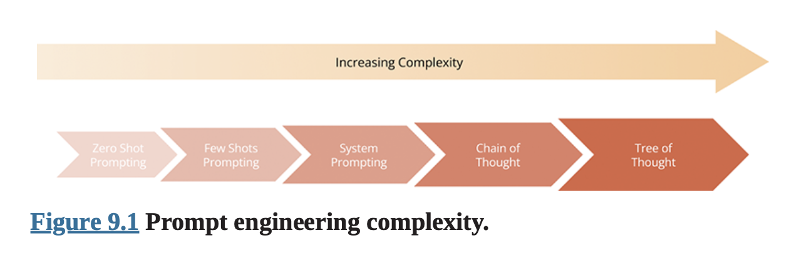
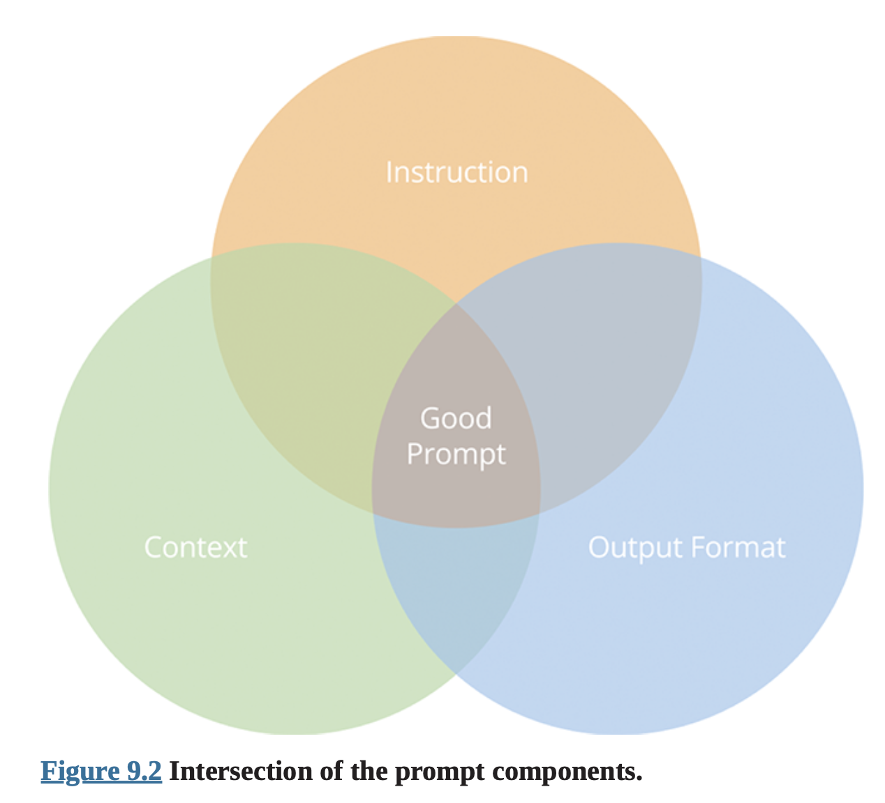
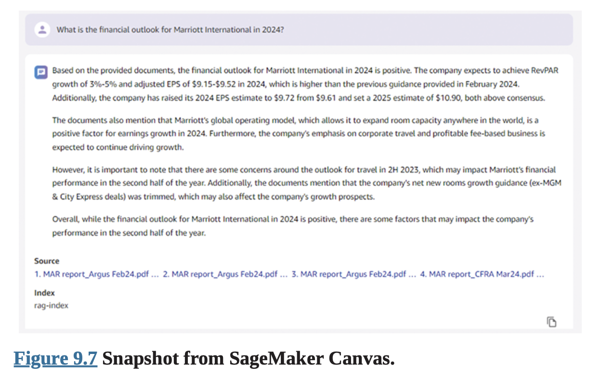

# 9장: 트레이딩에서 대규모 언어 모델과 생성형 AI의 활용

## 알파 창출에서 생성형 AI의 역할

주식 리서치를 수행하는 데 있어 가장 귀중한 자원은 시간입니다. 주식 애널리스트들은 방대한 양의 데이터 소스에서 실행 가능한 투자 인사이트를 선별해야 합니다: 주식 리서치 보고서, 투자자 프레젠테이션, 실적 보고서, 산업 리서치, 경쟁사 보고서 등. 따라서 더 많은 정보를 다루고 더 깊은 인사이트를 효율적으로 발견하기 위해서는 시간을 더욱 효율적으로 활용할 필요가 있습니다. 대규모 언어 모델(LLM)로 구동되는 생성형 인공지능(AI) 애플리케이션은 요약, 질의응답, 분류, 텍스트 생성 등 많은 텍스트 기반 생성 작업을 수행하는 데 필요한 노력을 줄여 인간의 효율성을 높이는 새로운 패러다임을 도입했습니다. 이 장에서는 독자들이 경쟁 우위를 창출할 수 있도록 투자 분석 분야에서 생성형 AI의 개념과 몇 가지 실제 응용 사례를 살펴보겠습니다. 이러한 애플리케이션을 통해 연간 수 주간의 투자 리서치 노력을 절약하고, 산업과 기업 전반에 걸쳐 커버리지의 범위와 깊이를 확장하며, 텍스트 정보에서 더 깊은 인사이트를 얻고, 올바른 정보를 찾는 것보다 정보를 분석하는 데 더 많은 시간을 할애할 수 있습니다.

## 생성형 AI 애플리케이션 구축을 위한 LLM 선택

모든 작업, 사용 사례, 데이터 유형에 이상적으로 적합한 만능 모델은 없습니다. 이는 모든 모델의 학습 데이터가 동일하지 않아 특정 도메인이나 주제에서 모델의 성능이 다르게 나타나기 때문입니다. 또한, 서로 다른 모델의 내부 가중치나 매개변수는 다르게 설계되어 있어 모델이 데이터를 해석하여 관계를 발견하고 예측하는 방식에 영향을 미칩니다.

일반적으로 모델 계열(예: GPT [ChatGPT], Gemini, Claude, Llama, Mistral) 내에서는 더 큰 크기의 모델이 더 높은 성능을 보이며, 따라서 더 작은 모델보다 사용 비용도 더 높습니다. 마찬가지로, 같은 크기의 경우 Llama 3 대 Llama 2와 같이 더 새로운 버전의 모델 계열이 더 높은 성능을 보입니다. 특히 이러한 규칙은 비교 대상 모델의 파인튜닝이 없는 기본 버전에만 적용됩니다. 즉, Llama3 70B의 사전 학습 또는 기본 버전은 일반적으로 사전 학습된 Llama3 8B보다 더 나은 성능을 보입니다. 이는 더 높은 매개변수 크기가 대규모 모델이 데이터 내의 더 복잡한 관계와 개념을 이해하고 새롭고 보지 못한 데이터를 사용하여 더 미묘한 예측과 일반화를 할 수 있게 해주기 때문입니다. 그러나 독점 데이터를 사용한 파인튜닝을 통해 더 작은 모델도 독점 데이터로 파인튜닝되지 않은 더 큰 사전 학습 또는 기본 버전의 모델과 동등하거나 더 나은 성능을 보일 수 있습니다. 하지만 이것이 더 작은 파인튜닝된 모델을 사용하는 것이 더 큰 기본 버전의 모델을 사용하는 것보다 비용 효율적이라는 의미는 아닙니다. 모델 파인튜닝은 일반적으로 매우 비싸기 때문입니다. 대신, 사용자는 먼저 효과적인 프롬프트 엔지니어링 기법(이 장의 뒷부분에서 논의)을 적용하여 모델 성능을 개선하고, 검색 증강 생성 기법(QnA 및 고객 챗봇 사용 사례)을 사용한 다음, 생물학, 의학, 법률 도메인과 같이 개념과 용어에 대한 전문 지식이 필요한 고유한 도메인에 속하는 데이터의 경우에만 예외적으로 모델 파인튜닝을 사용해야 합니다.

또한, 질의응답 및 채팅 애플리케이션(오늘날 생성형 AI 애플리케이션의 가장 일반적인 사용)의 경우, Anthropic, Meta, Mistral과 같은 대부분의 LLM 제공업체는 사전 학습 또는 기본 모델의 "Instruct" 버전도 출시합니다. 이러한 "Instruct" 버전은 모델 제공업체에서 지시 따르기 능력을 개선하도록 학습시킨 것으로, 이전 컨텍스트를 유지하고 대화 전반에 걸쳐 지시를 따를 수 있도록 하여 다중 턴 대화의 성능을 향상시킵니다. 따라서 채팅이나 질의응답 사용 사례의 경우 이러한 "Instruct" 모델이 좋은 선택입니다. 비교 가능한 모델이 많으면 모델 선택이 주관적인 작업이 될 수 있으므로, 모델 선택을 돕기 위해 어느 정도 체계를 갖추도록 해보겠습니다.

1단계: 인기 있는 LLM 리더보드를 사용하여 시작점으로 몇 가지 최고 성능 모델을 선택합니다. 리더보드는 서로 다른 기준에 따라 모델을 평가하고 순위를 매기는 고유한 틈새가 있으므로 다양한 사용 사례에 적용 가능합니다. 표 9.1은 오늘날 더 인기 있는 리더보드 중 일부와 해당 틈새를 제공합니다.

## 표 9.1: 사용 사례별 인기 LLM 리더보드

| 사용 사례 | 리더보드 |
| :-- | :-- |
| 챗봇/QnA/다중 턴 대화 | Chatbot Arena (gnt.co/book-chat-lmsys) |
|  | HELM Instruct (gnt.co/book-helm-instruct) |
| 범용/다목적 | MMLU (gnt.co/book-mmlu) |
|  | HELM Lite (gnt.co/book-helm-lite) |
|  | HuggingFace Open LLM (gnt.co/book-open-llm) |
|  | AlpacaEval (gnt.co/book-alpaca-eval) |
| 임베딩 | Massive Text Embedding Benchmark (gnt.co/book-mteb) |
| 감성 지능 | EQ Bench (gnt.co/book-egbench) |

2단계: 다양한 프롬프트 엔지니어링 기법과 독점 데이터셋을 사용하여 테스트하여 사용 사례에 더 적합한 모델을 평가하여 상위 모델 옵션을 선별합니다.

3단계: 선택한 모델의 성능 대 비용 트레이드오프를 평가하여 애플리케이션 구축을 위한 최종 모델을 선택합니다. 참고로 Amazon Bedrock의 인기 있는 모델 중 일부의 가격 정보는 표 9.2에 나와 있습니다.

## 표 9.2: AWS Bedrock 온디맨드 가격 (2024년 6월 기준)

| 모델 | 1,000 입력 토큰당 가격 | 1,000 출력 토큰당 가격 |
| :-- | :--: | :--: |
| **Anthropic 모델** |  |  |
| Claude 3.5 Sonnet | $0.0030 | $0.0150 |
| Claude 3 Opus | $0.0150 | $0.0750 |
| Claude 3 Haiku | $0.0003 | $0.0013 |
| Claude 3 Sonnet | $0.0030 | $0.0150 |
| Claude 2.1 | $0.0080 | $0.0240 |
| Claude 2.0 | $0.0080 | $0.0240 |
| Claude Instant | $0.0008 | $0.0024 |
| **Meta 모델** |  |  |
| Llama 3 Instruct (8B) | $0.0003 | $0.0006 |
| Llama 3 Instruct (70B) | $0.0027 | $0.0035 |
| Llama 2 Chat (13B) | $0.0008 | $0.0010 |
| Llama 2 Chat (70B) | $0.0020 | $0.0026 |
| **Mistral 모델** |  |  |
| Mistral 7B | $0.0002 | $0.0002 |
| Mixtral 8-7B | $0.0005 | $0.0007 |
| Mistral Small | $0.0010 | $0.0030 |
| Mistral Large | $0.0040 | $0.0120 |
| **Cohere 모델** |  |  |
| Command | $0.0015 | $0.0020 |
| Command-Light | $0.0003 | $0.0006 |
| Command R+ | $0.0030 | $0.0150 |
| Command R | $0.0005 | $0.0015 |
| Embed - English | $0.0001 | N/A |
| Embed - Multilingual | $0.0001 | N/A |

*토큰 크기는 모델마다 다르지만, 대략적인 변환으로 1 토큰 ≈ 0.75 단어 크기이며, 한 페이지 텍스트는 약 1,000 토큰입니다.

## 프롬프트 엔지니어링

생성형 AI 애플리케이션 또는 LLM과 관련하여 프롬프트는 원하는 응답이나 출력을 생성하려는 의도로 모델에 제공되는 특정 입력을 말합니다. 이는 모델이 작업, 형식 및 입력의 의도를 이해하는 데 도움이 되는 질문, 지시, 안내 또는 힌트나 예제일 수 있습니다. 모델이 원하는 출력을 생성하도록 안내하는 데 사용할 수 있는 다양한 복잡성 수준의 프롬프팅 기법이 있습니다. 이는 간단한 질문에서 예제, 형식 및 구조를 포함한 정교한 시나리오에 이르기까지 텍스트 프롬프트를 설계, 조정 및 반복하여 모델이 당면한 작업을 생각하고 실행하는 방법을 가르치는 것입니다.

프롬프트는 대규모 언어 모델(LLM)의 잠재력을 최대한 활용하는 데 중요한 역할을 합니다. 입력을 보낼 때 사용자는 LLM을 어린 아이처럼 생각해야 합니다. 어린 아이는 답을 알고 있어도 질문에 올바르게 답하려면 지시나 예제로 안내를 받아야 합니다. 이러한 상세한 지시가 없으면 어린 아이와 마찬가지로 답변이 너무 짧거나 너무 길고 장황하며 관련이 없고 종종 사실에 근거하지 않은 환상이나 거친 상상의 요소를 포함할 수 있습니다. 사실이 아닌 정보를 추가하는 이러한 요소를 "환각"이라고 하며 LLM의 빈번한 문제입니다(이에 대해서는 곧 자세히 설명). 따라서 응답을 이끌어내려고 할 때 LLM을 어린 아이처럼 생각하면 최상의 결과를 얻는 데 도움이 됩니다.

어린 아이와 마찬가지로 따라야 할 두 가지 주요 프롬프팅 원칙은 명확하고 상세한 지시를 제공하고 모델이 당면한 정보와 작업을 생각하고 처리할 시간을 갖도록 허용하거나 심지어 권장함으로써 인내심을 갖는 것입니다. 앞서 언급한 내용을 고려하여 인기 있는 몇 가지 프롬프팅 기법에 대해 논의해 보겠습니다. 가장 일반적인 접근 방식은 N-shot 프롬프팅(제로샷 프롬프팅 및 퓨샷 프롬프팅)입니다. 여기서 N은 모델이 작업과 출력 형식을 이해하는 데 도움이 되도록 제공된 예제의 수를 나타냅니다. 예를 들어, 제로샷 프롬프팅은 프롬프트에 명시적인 예제 없이 모델이 출력을 생성하는 시나리오를 말하는 반면, 퓨샷 프롬프팅은 일반적으로 2~8개의 예제 세트를 사용하여 모델을 작업에 안내합니다. 제로샷 프롬프팅은 분류(예: 감정 분석)와 같은 비교적 간단한 작업에 적합한 반면, 퓨샷 프롬프팅은 출력이 컨텍스트나 원하는 형식을 준수해야 하는 더 복잡한 작업에 사용해야 합니다. 고급 수준의 프롬프팅 기법에는 더 나은 응답을 생성하기 위해 지시를 일시 중지하고 생각하고 처리할 시간을 갖도록 모델을 코칭하는 것이 포함됩니다. 여기서 세 가지 중요한 기법은 시스템 프롬프팅(Llama 계열 모델에 매우 적합), 사고 사슬(CoT) 프롬프팅 및 사고 트리 프롬프팅입니다(그림 9.1). 시스템 프롬프팅은 프레임워크 역할을 하여 컨텍스트, 스타일 또는 톤을 설정하여 모델의 응답을 안내하고 작업을 수행하는 동안 특정 페르소나(예: 교사, 판사, 재무 분석가, 스포츠 애호가 또는 보조자)를 유지하려고 시도하여 사고 과정을 조정합니다. CoT 프롬프팅은 모델에게 작업을 중간 단계로 나누고 최종 출력에 도달하기 전에 다단계 프로세스로 순차적으로 처리하도록 요청합니다. 예를 들어, 실적 보고서를 요약하는 작업이 주어지면 모델은 이를 매출(수익), 비용(총비용, 운영비, 일회성), 수익(이익률, 현금 흐름, 자본 지출, 운전 자본) 및 대차대조표를 요약하는 5개의 순차적 단계로 나누고 이러한 요약을 일관성 있게 결합하여 최종 요약을 생성합니다. 사고 트리 프롬프팅은 LLM이 다양한 아이디어를 탐색하고 필요할 때 재평가하여 최적의 솔루션을 제공하도록 안내합니다.

*그림 9.1: 프롬프트 엔지니어링 복잡성*

## 실제 프롬프트 엔지니어링

프롬프트 프레임워크의 세 가지 주요 구성 요소는 지시, 컨텍스트 및 원하는 출력 형식입니다:

1. 지시는 요약 또는 질의응답(QnA)과 같이 수행할 작업과 작업을 수행하기 위해 가정해야 할 특정 캐릭터 프로필(시스템 프롬프팅)을 나타냅니다. 지시 다음에는 모델이 작업을 수행하는 데 필요한 정보(예: 요약할 구절 또는 제시된 질문에 대한 답을 찾을 텍스트)가 제공되는 컨텍스트가 따라와야 합니다.

2. 컨텍스트에는 필요한 정보의 스타일, 톤 및 세부 사항과 복잡한 작업을 따라야 할 단계별 안내가 포함된 더 작은 단계로 나누는 것이 포함됩니다. 여기서 모델은 CoT 기법을 사용하여 자체 단계를 생각해내도록 권장될 수도 있습니다. 이러한 단계를 통해 모델은 시간을 갖고 생각하고 논리적인 추론 라인을 따라 더 나은 응답을 생성할 수 있습니다.

3. 출력 형식은 응답 형식(목록, 문장 또는 기타 구조)과 사용 가능한 경우 좋은 출력 예제(N-shot 프롬프팅)를 나타내야 합니다.

프롬프트 엔지니어링은 모델 출력을 지속적으로 개선하는 반복적인 프로세스입니다(그림 9.2). 초기 프롬프트에 대한 모델의 응답을 평가하여 프롬프트의 효과와 지시를 이해하고 따르는 능력을 측정해야 합니다. 사용자는 지시와 출력 예제를 사용하여 프롬프트를 반복하고 개선하여 출력 품질을 허용 가능한 수준으로 계속 개선해야 합니다.

*그림 9.2: 프롬프트 구성 요소의 교집합*

## 모델 "환각" 해결

LLM 환각은 사실적으로 부정확하거나 일관성이 없거나 입력 컨텍스트와 연결되지 않은 모델 응답을 말합니다. 허구적 창의성은 시나 이야기 쓰기와 같은 특정 작업에는 유용할 수 있지만, 모델 응답이 정확하고 사실적인 정보에 기반하지 않으면 재무 분석 및 의사 결정에 심각한 결과를 초래할 수 있습니다.

사용자가 모델 환각을 줄이기 위해 사용할 수 있는 두 가지 방법이 있습니다. 첫 번째는 LLM 설정을 사용하여 응답의 무작위성이나 창의성을 제한하는 것입니다. 이는 SageMaker 또는 Bedrock API 또는 SDK의 모델 배포 구성에서 "temperature" 및 "Top_p" 매개변수 값을 낮춤으로써 수행할 수 있습니다. 이러한 매개변수의 낮은 값은 응답을 더 결정적이고 사실 기반으로 만듭니다. 두 번째 방법 세트에는 작업에 사용할 실제 진실(즉, 신뢰할 수 있는) 및 사실 정보를 제공하고, 입력에 제공된 컨텍스트를 고수하도록 명확한 지시를 추가하고, 컨텍스트에 제공된 텍스트에서 추론할 수 있는 것과 추론할 수 없는 것 모두에 대한 예제를 제공하는 것이 포함됩니다. RAG 애플리케이션의 경우처럼 모델에 문서의 S3 위치를 가리켜 정보를 제공할 수도 있습니다. 응답을 생성하기에 충분한 정보가 부족함을 인정하도록 모델에 지시하는 것도 환각을 줄이는 데 도움이 될 수 있습니다. 마지막으로, 표준 관행으로서 지속적인 응답 모니터링 및 평가는 사실적 정확성을 보장하는 핵심입니다.

이제 검색 증강 생성(RAG) 애플리케이션을 사용하여 독점 데이터베이스에서 특정 정보를 쿼리하고 텍스트 구절을 요약하여 주요 시사점을 강조하는 것과 같은 생성형 AI의 몇 가지 실제 응용 프로그램을 살펴보겠습니다. 이러한 애플리케이션은 올바른 정보를 찾고 올바른 인사이트를 얻는 데 소요되는 시간을 줄여 분석가가 데이터를 분석하는 데 더 많은 시간을 할애할 수 있게 하여 연간 수 주의 노력을 절약할 수 있습니다.

## SageMaker Canvas에서 검색 증강 애플리케이션을 사용한 질의응답

생성형 AI의 매우 중요하고 확실히 가장 인기 있는 용도는 대규모 데이터베이스 내에서 올바른 정보를 검색하는 것입니다(예: 질의응답 애플리케이션 또는 고객 서비스 챗봇 사용 사례). 이러한 애플리케이션은 방대한 양의 데이터를 빠르게 훑어보고 올바른 정보를 찾을 수 있습니다. 대규모 독점 데이터베이스 내에서 손끝에서 모든 정보를 찾을 수 있는 힘을 상상해 보십시오. 분석가는 오래된 실적 발표 대본, 애널리스트 보고서 및 산업 연구 논문에서 정보를 빠르게 검색하고 인사이트를 얻을 수 있어 매번 몇 시간에서 며칠의 노력을 절약할 수 있습니다.

쿼리와 그 안에 답이 있는 텍스트가 함께 제시되면 LLM은 텍스트 내에서 올바른 정보를 검색하여 사용자에게 다시 제공할 수 있습니다. 이 컨텍스트 기반 접근 방식의 과제는 LLM이 일반적으로 제한된 컨텍스트 크기를 갖는다는 것입니다(즉, 한 번에 입력으로 제공할 수 있는 정보[단어]의 양에 상한선이 있음). 이는 해당 모델에 허용된 컨텍스트 크기를 초과할 수 있으므로 모든 관련 문서를 컨텍스트로 포함하는 능력을 제한합니다. 또한 더 큰 컨텍스트 창을 허용하는 모델은 일반적으로 비용도 더 많이 듭니다.

이 문제를 극복하기 위해 LLM과 함께 RAG 솔루션을 사용할 수 있습니다. RAG 솔루션은 전체 데이터베이스 내에서 관련 컨텍스트를 검색하고 원래 프롬프트 쿼리와 함께 관련 부분만 LLM으로 보냅니다. 이를 통해 솔루션은 프롬프트와 컨텍스트를 모델에 허용된 컨텍스트 창 내에 맞출 수 있으며, 모델은 컨텍스트를 쉽게 참조하여 답변을 생성할 수 있습니다. 예를 들어, 실적 발표 대본이 주어졌을 때 LLM에 유기적 수익 성장률과 환율 변동이 수익에 미치는 영향을 찾도록 요청하면 RAG 솔루션은 이 정보를 참조하는 관련 단락만 찾아 LLM으로 보내 답변을 생성합니다. 따라서 데이터베이스에서 관련 정보를 동적으로 검색함으로써 RAG 솔루션은 AI 모델이 더 정확한 결과를 생성할 수 있도록 합니다.

기본 원리에 대한 실무 지식을 갖는 것이 주식 리서치의 핵심 원칙이므로 RAG 솔루션의 구성 요소와 아키텍처를 간략하게 살펴보겠습니다. RAG 솔루션은 문서 데이터베이스, 임베딩 모델, 벡터 데이터베이스 및 LLM으로 구성됩니다. 임베딩 모델은 문서 텍스트를 텍스트의 수치 표현인 벡터 임베딩으로 변환합니다. 이러한 벡터는 유사한 벡터가 근접하게 저장되는 방식으로 벡터 저장소에 저장되고 유지 관리됩니다. 즉, 유사한 의미를 가진 단어가 서로 가까이 저장되어 유사한 의미를 가진 단어를 더 쉽게 검색할 수 있습니다. 사용자가 RAG 솔루션에 질문 프롬프트를 제시하면 프롬프트가 임베딩으로 변환되고 벡터 저장소에 저장된 문서 임베딩과 빠르게 일치하여 질문에 답하기 위한 가장 관련성 높은 정보를 찾습니다. 그런 다음 일치된 정보는 벡터 저장소에서 검색되어 원래 프롬프트와 함께 LLM으로 전송되어 프롬프트와 데이터베이스의 문서에서 검색된 관련 컨텍스트를 사용하여 답변을 생성합니다.

AWS에서 RAG 솔루션을 구축하여 이를 실제로 적용해 보겠습니다(그림 9.3). RAG 애플리케이션의 다양한 구성 요소에 AWS 서비스를 사용하고 SageMaker Canvas의 LLM을 사용하여 데이터베이스에 있는 정보를 기반으로 쿼리에 대한 답변을 생성합니다.

*그림 9.3: LLM을 위한 Amazon AWS 아키텍처*

이 예제를 위해 2024년 3월의 Marriott(티커: MAR)과 Hyatt(티커: H)에 대한 몇 가지 애널리스트 보고서를 업로드했습니다. 보고서에는 요약, 투자 논문, 최근 개발, 수익 및 성장 분석, 재무 강점 및 위험에 대한 일반적인 섹션이 있습니다. 보고서에는 텍스트 형식의 구절 외에도 인포그래픽과 표도 포함되어 있습니다. 이제 RAG 애플리케이션을 설정하는 단계를 살펴보고 보고서의 정보를 기반으로 애플리케이션에 특정 질문을 하고 결과의 정확성을 평가합니다.

1단계: 첫 번째 단계는 쿼리하려는 데이터를 저장하는 것입니다. 스토리지에 Amazon S3를 사용합니다(그림 9.4). 여기서 애널리스트 보고서를 pdf 형식으로 S3 버킷에 업로드합니다.

*그림 9.4: Amazon S3 대시보드*

2단계: 임베딩을 생성하고 저장하기 위해 AWS의 머신러닝(ML) 기반 엔터프라이즈 검색 서비스인 Amazon Kendra를 사용합니다. Kendra는 문서의 텍스트에 대한 임베딩을 생성하여 "rag-index"라는 이름의 벡터 인덱스에 저장합니다(그림 9.5).

*그림 9.5: Amazon Kendra 마법사*

3단계: SageMaker 콘솔의 Canvas 설정에서 도메인에 대해 "Amazon Kendra를 사용한 문서 쿼리 활성화"로 SageMaker Canvas를 Kendra와 연결합니다(그림 9.6).

### Canvas 즉시 사용 가능한 모델 구성

Canvas 즉시 사용 가능한 모델 활성화
Canvas에서 사전 구축된 모델로 예측을 생성할 수 있도록 Canvas 즉시 사용 가능한 모델을 활성화합니다.
AmazonSageMakerCanvasAIServicesAccess 정책이 일반 설정에서 지정한 기본 Sagemaker 실행 역할에 첨부됩니다.

Amazon Kendra를 사용한 문서 쿼리 활성화
이 도메인에서 사용할 수 있도록 하려는 인덱스를 선택하여 최종 사용자가 엔터프라이즈 데이터를 쿼리할 수 있도록 합니다.

하나 이상의 인덱스 선택: rag-index

1. SageMaker 실행 역할은 SageMaker 콘솔 UI 외부에서 업데이트할 수 있습니다. 예를 들어, SageMaker 콘솔 외부에서 이 역할을 업데이트하거나 다른 사용자 프로필에서 사용할 수 있습니다. 따라서 선택한 것 외에도 다른 Kendra 인덱스에 대한 권한을 가질 수도 있습니다.
2. 다른 사용자도 동일한 SageMaker 실행 역할을 사용하는 경우 여기에서 변경한 사항의 영향을 받습니다. 다른 사용자가 별도의 Kendra 액세스 권한을 갖도록 하려면 다른 실행 역할을 사용하십시오.
3. SageMaker 실행 역할에 첨부된 기존 정책에 따라 사용자는 다른 Kendra 인덱스에 액세스할 수 있습니다.

Amazon Bedrock 역할:
Amazon Bedrock은 Canvas에서 대규모 언어 모델을 파인튜닝할 때 이 역할을 사용하여 사용자를 대신하여 작업을 수행합니다.
- 새 실행 역할 생성 및 사용
- 기존 실행 역할 사용

실행 역할 이름:
이 역할에는 AmazonSageMakerCanvasBedrockAccess 정책이 첨부되어 있어야 하며 Amazon Bedrock 서비스 주체가 이 역할을 수임할 수 있도록 허용해야 합니다.

*그림 9.6: Amazon SageMaker 마법사*

## RAG 애플리케이션 비용 및 최적화 기법

이 솔루션은 앞에서 설명한 서비스를 사용하는 데 표 9.3에 표시된 비용이 발생합니다. 이러한 비용은 애플리케이션이 한 달 전체 동안 계속 실행되는 경우에만 적용됩니다. 모범 사례로서 유휴 리소스 실행으로 인한 비용을 절약하기 위해 적극적으로 사용하지 않는 리소스는 꺼야 합니다.

## 표 9.3: RAG 애플리케이션 월별 비용

| 서비스 | 서비스 계층 | 리소스 | 월별 가격 |
| :-- | :-- | :-- | :--: |
| S3 | Standard | GB당 스토리지 | $0.02 |
| Kendra | Developer Edition | 인덱스 | $810 |
| SageMaker Canvas | Standard | 작업 공간 인스턴스 | $1,368 |
| SageMaker Inference | Standard | ml.G5.12xl | $5,105 |

비용을 절약하기 위한 일반적인 모범 사례로서 사용하지 않을 때는 애플리케이션 개발의 일부로 배포된 리소스를 삭제하는 것이 중요합니다.

1. Canvas: Amazon SageMaker Canvas 애플리케이션에서 로그아웃하여 SageMaker Canvas 작업 공간 인스턴스 시간 소비를 중지합니다. 이렇게 하면 작업 공간 인스턴스에서 사용하는 모든 리소스가 해제됩니다.
2. Kendra: 더 이상 필요하지 않으면 인덱스를 삭제합니다. 나중에 인덱스를 사용하려는 경우 자동 동기화를 끄고 새 문서를 자체적으로 크롤링하고 인덱싱하지 않도록 하십시오. 언제든지 수동 동기화를 실행하여 인덱스에 문서를 추가할 수 있습니다.
3. SageMaker 인스턴스: Canvas를 통해 배포된 모델을 호스팅하는 실행 중인 인스턴스를 끕니다. 이렇게 하면 유휴 인스턴스 실행으로 인한 사용 요금이 발생하지 않습니다.

## 인프라 테스트

이제 이전 섹션의 프롬프트 엔지니어링 교훈을 적용하여 문서를 효과적으로 쿼리하고 프롬프트를 반복하여 모델이 원하는 결과를 생성하도록 안내하면서 출력이 어떻게 달라지는지 살펴보겠습니다. 모델 선택을 위해 이 장의 앞부분에서 설명한 것과 동일한 프로세스를 따랐습니다. 이 책은 AWS 서비스 및 플랫폼을 사용한 예제를 설명하므로 AWS에서 가장 인기 있는 LLM을 Claude, Mistral 및 Llama 모델 계열로 좁혔습니다. 그러나 내 워크로드가 너무 복잡하지 않고 Claude 모델의 높은 비용을 감안할 때 추가 평가를 위해 Llama 2와 Mistral 7B 모델을 선별했습니다. Llama 2와 Mistral 간의 성능은 비슷했지만 큰 컨텍스트 창(더 큰 입출력 텍스트 길이 허용)과 지시를 더 잘 따르게 만드는 "instruct" 기능(다중 턴 대화에 적합) 때문에 최종적으로 Llama-2-7b-instruct 모델을 선택했습니다.

## 예제 1: Marriot International 주식 분석

S3의 문서 저장소에 업로드한 주식 리서치 보고서를 사용하여 Marriott International 주식(티커: MAR)에 대한 주식 분석을 수행하도록 애플리케이션에 요청합니다. 간단한 질의응답 프롬프트에서 모델이 투자 요소를 평가하고 주식에 대한 투자 조언을 제공하기 위해 자체 단계를 생각해내도록 요청하는 것까지 프롬프트 복잡성을 반복적으로 높입니다(앞에서 설명한 프롬프트 엔지니어링 개념 사용).

**프롬프트 1:** 2024년 Marriott International의 재무 전망은 어떻습니까?

**모델 응답 (그림 9.7):**

제공된 문서를 기반으로 2024년 Marriott International의 재무 전망은 긍정적입니다. 회사는 2024년에 3%-5%의 RevPAR 성장과 $9.15-$9.52의 조정 EPS를 달성할 것으로 예상하며, 이는 2024년 2월에 제공된 이전 가이던스보다 높습니다. 또한 회사는 2024년 EPS 추정치를 $9.61에서 $9.72로 인상하고 2025년 추정치를 $10.90으로 설정했으며, 둘 다 컨센서스를 상회합니다.

문서에는 또한 Marriott의 글로벌 운영 모델이 전 세계 어디에서나 객실 용량을 확장할 수 있게 해주어 2024년 수익 성장에 긍정적인 요소라고 언급되어 있습니다. 또한 회사의 기업 여행 및 수익성 있는 수수료 기반 비즈니스에 대한 강조는 계속해서 성장을 이끌 것으로 예상됩니다.

그러나 2023년 하반기 여행 전망에 대한 우려가 있어 올해 하반기에 Marriott의 재무 성과에 영향을 미칠 수 있다는 점에 유의하는 것이 중요합니다. 또한 문서에는 회사의 순 신규 객실 성장 가이던스(MGM 및 City Express 거래 제외)가 축소되었다고 언급되어 있어 회사의 성장 전망에도 영향을 미칠 수 있습니다.

전반적으로 2024년 Marriott International의 재무 전망은 긍정적이지만 올해 하반기에 회사의 성과에 영향을 미칠 수 있는 몇 가지 요인이 있습니다.

*그림 9.7: SageMaker Canvas의 스냅샷*

여기서 우리는 간단한 한 줄 프롬프트로 모델이 문서에서 사실 정보만 제공하는 것을 볼 수 있는데, 이는 주식의 투자 잠재력을 평가하는 데 그다지 유용하지 않습니다.

이제 프롬프트 복잡성을 높여 모델 응답의 유용성을 높여 보겠습니다. 모델에게 재무 분석가의 캐릭터 프로필을 가정하도록 요청하고 의견을 형성할 때 고려해야 할 요소에 대한 구체적인 지시를 제공하여 주식에 대한 투자 조언을 요청할 것입니다.

**프롬프트 2:** 당신은 숙박 회사인 Marriott International에 대한 주식 리서치 보고서를 분석하는 재무 분석가입니다. 문서를 기반으로 2024년 회사의 재무 전망을 설명하고 EBITDA 및 RevPAR 성장을 강조하십시오. 또한 최근 개발, 성장 전망 및 위험을 고려하여 주식에 대한 전문적인 투자 조언을 제공하십시오.

**모델 응답:**

제공된 주식 리서치 보고서를 기반으로 2024년 Marriott International의 재무 전망은 다음과 같습니다:

EBITDA 성장: Marriott International은 2024년에 4%-5%의 RevPAR 성장을 예상하며, 이는 8%-10%의 EBITDA 성장으로 이어집니다.

RevPAR 성장: 회사는 객실 용량 확장, 회사 로열티 프로그램의 성장 및 숙박 산업의 회복에 힘입어 2024년에 4%-5%의 RevPAR 성장을 예상합니다.

주식 조언: 최근 개발, 성장 전망 및 위험을 고려한 후 $270의 목표 가격으로 Marriott International 주식을 매수할 것을 투자자들에게 권합니다. 이 권장 사항의 이유는 다음과 같습니다:

1. 강력한 성장 전망: Marriott International은 강력한 수익 성장을 제공한 입증된 실적을 보유하고 있으며, 수수료 기반 비즈니스 확장, 로열티 프로그램 성장 및 객실 용량 증가에 대한 회사의 집중은 2024년에도 계속해서 성장을 이끌 것입니다.
2. 신중한 가이던스: Marriott International의 2024년 가이던스가 신중해 보일 수 있지만 회사의 4%-5% RevPAR 성장 기대치는 여전히 동종 업계 평균을 상회하여 회사가 숙박 산업에 대해 긍정적인 전망을 가지고 있음을 나타냅니다.
3. 밸류에이션: Marriott International의 주가는 2024년 수정 EPS 추정치의 24.0배로 거래되고 있으며, 이는 동종 업계 평균인 31배보다 낮습니다.

이전 예에서 우리는 모델에게 재무 분석가처럼 생각하도록 요청함으로써(시스템 프롬프팅) 사고 과정을 조정하는 프레임워크를 제공한 것을 볼 수 있습니다. 이는 모델이 문서에서 관련 정보를 식별하여 주식에 대한 투자 논문을 작성하고 성장 요인, 위험 및 밸류에이션을 포함한 권장 사항의 근거와 함께 투자 권장 사항을 제공하는 데 도움이 되었습니다. 그러나 모델은 여전히 대차대조표, 경쟁 포지셔닝, 산업 동향, 시장 심리와 같은 몇 가지 정량적 및 정성적 요인을 다루지 않으며 응답이 합성적으로 보입니다.

이제 모델이 먼저 투자 의견을 형성하기 위한 단계나 요인을 생각해내도록 요청하여 투자 요인을 결정하기 위해 자체 추론을 사용하도록 장려하여 모델 응답 품질을 개선해 보겠습니다. 그런 다음 모델에게 단계와 문서의 정보를 사용하여 그 뒤에 있는 근거나 추론과 함께 투자 조언을 제공하도록 요청합니다.

**프롬프트 3, 파트 1:** 당신은 Marriott에 대한 주식 리서치 보고서를 분석하는 재무 분석가입니다. 주식에 대한 투자 의견을 형성하기 위한 단계를 설명하십시오.

**모델 응답:**

Marriott International, Inc. (MAR)에 대한 투자 의견을 형성하기 위해 다음 단계를 따를 것입니다:

1. 수익 성장, 수익성 및 현금 흐름을 포함한 재무 건전성을 평가하기 위해 회사의 재무제표를 분석합니다.
2. 주가수익비율(P/E) 및 주가순자산비율(P/B)과 같은 회사의 밸류에이션 배수를 검토하여 주식이 과대평가되었는지 저평가되었는지 판단합니다.
3. 과거 성장률, 산업 동향 및 경쟁 위치를 분석하여 회사의 성장 전망을 평가합니다.
4. 경제 사이클, 규제 위험 및 지정학적 위험에 대한 노출과 같은 요인을 분석하여 회사의 위험 프로필을 평가합니다.
5. 회사와 해당 산업에 대한 전반적인 시장 심리와 투자자 기대를 고려합니다.

**프롬프트 3, 파트 2:** 당신은 Marriott에 대한 주식 리서치 보고서를 분석하는 재무 분석가입니다. 다음 단계와 문서의 정보를 사용하여 조언을 형성하는 데 사용된 재무 및 성장 지표를 강조하면서 주식에 대한 전문적인 투자 조언을 제공하십시오.

1. 수익 성장, 수익성 및 현금 흐름을 포함한 재무 건전성을 평가하기 위해 회사의 재무제표를 분석합니다.
2. 주가수익비율(P/E) 및 주가순자산비율(P/B)과 같은 회사의 밸류에이션 배수를 검토하여 주식이 과대평가되었는지 저평가되었는지 판단합니다.
3. 과거 성장률, 산업 동향 및 경쟁 위치를 분석하여 회사의 성장 전망을 평가합니다.
4. 경제 사이클, 규제 위험 및 지정학적 위험에 대한 노출과 같은 요인을 분석하여 회사의 위험 프로필을 평가합니다.
5. 회사와 해당 산업에 대한 전반적인 시장 심리와 투자자 기대를 고려합니다.

**모델 응답:**

주식 리서치 보고서에 제공된 정보를 기반으로 Marriott International(MAR)의 재무 및 성장 지표를 분석하여 전문적인 투자 조언을 제공했습니다.

재무 건전성: Marriott의 재무제표는 꾸준한 수익 성장, 높은 수익성 및 적절한 현금 흐름으로 강력한 재무 상태를 나타냅니다. 2024년에 회사는 4%-5%의 RevPAR 성장과 $9.15-$9.52의 조정 EPS를 예상하며, 이는 현재의 경제적 불확실성을 감안할 때 신중하게 낙관적입니다. Marriott의 조정 EBITDA 마진은 4Q22의 18.4%에서 4Q23의 19.6%로 상승하여 수익성이 개선되었음을 나타냅니다. 회사의 총 부채는 119억 달러였고 현금 및 현금성 자산은 3억 달러로 부채와 현금 사이에 합리적인 균형을 제공합니다.

밸류에이션 배수: Marriott의 주가수익비율(P/E) 및 주가순자산비율(P/B)과 같은 밸류에이션 배수는 동종 업계 및 더 넓은 시장과 비교하여 합리적입니다. 2024년 3월 16일 현재 Marriott의 P/E 비율은 24.6배로 업계 평균인 26.1배보다 약간 낮습니다. P/B 비율은 4.3배로 업계 평균인 4.2배와 일치합니다. 이러한 밸류에이션 배수는 Marriott의 주식이 동종 업계 및 더 넓은 시장과 비교하여 약간 저평가되어 있음을 시사합니다.

여기서 우리는 CoT 프롬프팅이 모델이 먼저 주식에 대한 투자 논문을 형성할 때 고려해야 할 작업이나 요인의 순차적 순서에 대해 생각한 다음 해당 단계를 사용하여 의사 결정을 안내하도록 함으로써 응답 품질을 개선하는 데 어떻게 도움이 되는지 볼 수 있습니다. 이는 동종 업계와의 비교 및 대차대조표 지표를 포함하여 주식 분석의 정성적 및 정량적 측면을 모두 다루는 권장 사항에 대한 더 강력한 근거와 함께 더 응집력 있고 유기적인 응답을 만듭니다.

## 예제 2: 기업 간 확장된 경쟁 분석

모델에게 Marriott(MAR) 대 Hyatt(H)에 대한 경쟁 분석을 수행하고 두 주식 사이에서 투자 선택을 하는 데 도움을 주도록 요청합니다. 이를 위해 S3에 업로드된 주식 리서치 보고서를 사용하여 Hyatt와 Marriott에 대한 별도의 투자 논문을 형성한 다음 논문과 기타 관련 요인을 사용하여 두 주식을 비교하고 그에 대한 근거와 함께 더 나은 투자를 제안하도록 애플리케이션에 요청합니다.

**프롬프트 1:** 당신은 경험이 풍부한 헤지펀드 매니저입니다. Hyatt 주식에 대한 투자 논문은 무엇입니까? 의견의 근거를 제공하십시오.

**모델 응답:**

제공된 문서에서 사용 가능한 정보를 기반으로 Hyatt는 견고한 대차대조표, 강력한 브랜드 포트폴리오 및 자산 경량 비즈니스 모델로 전환하기 위한 명확한 전략을 가진 회사로 보입니다. 이러한 전환은 회사가 자산 중심 노출과 관련된 무거운 부채 부담에 더 이상 부담을 지지 않게 되므로 부채 수준을 줄이고 수익성을 개선하는 데 도움이 될 것입니다.

또한 자체 자본을 더 많이 투입하고, 수익성 없는 자산을 정리하고, 디지털 플랫폼에 투자하고, 새로운 브랜드를 출시하고, 팬데믹 기간 동안 추출한 최근 비용 절감을 유지하는 것과 같은 Hyatt의 투자 노력은 지속적인 경제적 이익을 지원할 것으로 예상됩니다. 회사의 주주 배분도 적절한 것으로 간주되며, 순이익 대비 배당금 비율은 자산 경량 비즈니스 모델로 계속 전환함에 따라 과거 수준에서 확대될 것으로 예상됩니다.

**프롬프트 2:** 당신은 경험이 풍부한 헤지펀드 매니저입니다. Marriott 주식에 대한 투자 논문은 무엇입니까? 의견의 근거를 제공하십시오.

**모델 응답:**

제공된 문서, 내 분석 및 정보 해석을 기반으로 Marriott 주식에 대한 투자 논문은 다음과 같습니다:

1. 수익성 있는 수수료 기반 비즈니스: Marriott의 수수료 기반 비즈니스 모델은 꾸준한 수입을 창출하고 경제 침체에 대한 헤지를 제공하므로 중요한 긍정적 요인입니다. 회사의 로열티 프로그램과 강력한 브랜드 존재감도 업계에서 경쟁 우위에 기여합니다.
2. 강력한 유동성: Marriott는 낮은 부채 수준으로 견고한 대차대조표를 보유하고 있어 회사가 비즈니스에 투자하고, 전략적 기회를 추구하고, 배당금과 자사주 매입을 통해 주주에게 자본을 반환할 수 있는 유연성을 제공합니다.
3. 기업 여행에 대한 강조: 수익의 상당 부분을 차지하는 기업 여행에 대한 Marriott의 집중은 2024년 이후 수익 성장을 위해 회사를 잘 포지셔닝합니다. 회사의 글로벌 운영 모델은 전 세계 어디에서나 객실 용량을 확장할 수 있게 하여 경쟁 우위를 더욱 강화합니다.
4. 비용 및 차입 비용 증가: Marriott의 비용과 차입 비용이 증가할 것으로 예상되지만 회사의 강력한 현금 흐름 생성 및 유동성 위치는 이러한 증가를 탐색하는 데 도움이 될 것입니다. 경영진은 2024년에 3%-5%의 조정 EPS 성장을 가이드했으며, 이는 신중하며 초과될 수 있습니다.
5. 주주 배분: Marriott는 부채를 보수적인 수준으로 유지하고 배당금과 자사주 매입을 통해 주주에게 자본을 배분하여 견고한 대차대조표를 지원한 역사를 가지고 있습니다. 회사의 주주 배분 전략은 적절하며 장기 성장 전략과 일치합니다.

방금 제공된 두 가지 예에서 우리는 모델에게 헤지펀드의 역할을 맡도록 요청함으로써(시스템 프롬프팅) 사고를 위한 프레임워크를 정의하는 데 도움을 준 것을 볼 수 있습니다. 이를 통해 모델은 문서의 정보를 단순히 사실적으로 역류시키는 것이 아니라 정보에 의존하여 자체 의견을 형성하는 잘 추론된 답변을 생성할 수 있습니다.

이제 사고 사슬 프롬프팅을 활용하여 모델에게 이전 답변의 컨텍스트를 유지하고 새로운 정보와 결합하여 두 주식 간의 투자 권장 사항을 제공하도록 요청해 보겠습니다.

**프롬프트 3:** Hyatt의 객실 성장은 향후 10년 동안 Marriott와 어떻게 비교됩니까?

**모델 응답:**

제공된 문서에 따르면 Hyatt는 향후 10년 동안 Marriott보다 높은 객실 성장률을 보일 것으로 예상됩니다.

"H report_MS May24.pdf"라는 제목의 문서에는 Hyatt의 객실 성장이 향후 10년 동안 연평균 4%-5%로 예상되며, 이는 같은 기간 동안 미국 산업의 1%-2% 공급 증가 추정치를 상회한다고 명시되어 있습니다.

대조적으로 "MAR report_MS May24.pdf"라는 제목의 문서는 Marriott의 연간 객실 성장이 4%로 예상되며, 이는 미국 산업 예측인 1%-2% 성장보다 편안하게 높다고 언급합니다.

**프롬프트 4:** 객실 성장 추정치를 고려하고 위에서 제공한 Hyatt와 Marriott에 대한 투자 논문을 기반으로 어느 것이 더 나은 주식입니까?

**모델 응답:**

문서에 제공된 정보를 기반으로 Hyatt와 Marriott 모두 강력한 성장 잠재력을 가지고 있지만 Marriott가 객실 성장 추정치 측면에서 약간의 우위를 가지고 있는 것으로 보입니다. Marriott는 2023년에 12%~14% 범위의 상단에서 객실당 수익(revPAR) 성장을 달성할 것으로 예상하며, 2024-2025년에는 평균 3%~6% 상승할 것으로 예상합니다. 이는 Marriott가 Hyatt에 비해 단기적으로 더 높은 성장을 경험할 것으로 예상됨을 시사합니다.

또한 전 세계 어디에서나 객실 용량을 확장할 수 있게 해주는 Marriott의 글로벌 운영 모델은 회사의 성장 전망에 중요한 긍정적 요인입니다. 이는 업계 최고의 7% 글로벌 객실 점유율 및 럭셔리 호텔 리더십과 결합되어 Marriott를 2024년 수익 성장에 유리하게 포지셔닝합니다.

그러나 문서에 따르면 Hyatt도 강력한 로열티 프로그램을 보유하고 있으며 향후 10년 동안 업계 최고의 객실 성장을 기록할 수 있는 좋은 위치에 있다는 점에 유의하는 것이 중요합니다. Hyatt의 객실 파이프라인은 기존 기반의 38%를 나타내며, 포트폴리오는 미국 시장당 평균 4개의 객실로 Marriott의 시장당 14개 객실보다 낮습니다. 이는 Hyatt가 특히 미국 시장에서 상당한 성장 기회를 가지고 있음을 시사합니다.

여기서 우리는 모델이 유지된 컨텍스트를 사용하고 추가 요인을 통합하여 두 주식 사이의 선택과 그 뒤에 있는 근거에 대한 명확한 답변을 제공한 것을 볼 수 있습니다. 중요한 것은 모델이 업계 동향(거시) 및 회사별(미시) 요인을 모두 평가하여 의견을 공식화하고 지표 기반 근거를 제공했다는 것입니다. 이러한 종류의 분석은 주식 분석에 대한 근본적인 접근 방식을 가진 투자 분석가의 스크리닝 단계에서 정말 도움이 될 것입니다.

## 요약

오늘날 주식 애널리스트는 방대한 양의 정보와 데이터에 액세스할 수 있으며, 제한된 시간으로 모든 것을 다루고 시간을 최대한 활용하며 알파를 창출하기 위한 올바른 인사이트를 찾는 것이 과제가 됩니다.

또 다른 중요한 생성형 AI 사용 사례는 독자가 문서의 핵심 사항에 집중하고 비정형 텍스트를 표준화된 형식으로 변환하여 중요한 속성을 강조하는 데 도움이 되는 문서 요약입니다.

이제 이를 실제로 적용하여 생성형 AI를 사용하여 구절을 요약하여 더 적은 시간에 더 많은 정보를 다루어 효율성을 높이는 방법을 살펴보겠습니다. 다음 예제에서는 이전 질의응답 예제에서 사용한 애널리스트 보고서 중 하나의 텍스트를 사용하고 SageMaker Canvas의 LLM(Llama2-7b-chat)을 활용하여 보고서를 요약했습니다. 또한 프롬프트 엔지니어링이 모델이 원하는 응답을 생성하도록 안내하는 데 어떻게 중요한 역할을 하는지 살펴보겠습니다.

## 예제: 인사이트를 위한 애널리스트 보고서 요약

이 예에서는 투자 분석에 더 관련성이 있고 중요한 인사이트를 얻으면서 애널리스트 보고서를 요약합니다.

**프롬프트 1:** 성장 분석과 위험을 강조하면서 Marriott 주식에 대한 다음 보고서를 요약하십시오:
"투자 논문 우리는 Marriott International Inc.(NYSE: MAR)에 대한 BUY 등급을 유지하고 목표 가격을 $261에서 $270으로 인상합니다. 우리는 Marriott의 수익성 있는 수수료 기반 비즈니스, 강력한 유동성 및 기업 여행에 대한 강조가 2024년 수익 성장에 유리하게 포지셔닝한다고 믿습니다. 회사의 글로벌 운영 모델, ------------------------------------------------Marriott의 조정 EBITDA 마진은 4Q22의 18.4%에서 4Q23의 19.6%로 상승했습니다. 회사는 분기별 현금 배당금을 지급합니다. 2023년 5월, Marriott는 분기별 배당금을 주당 $0.40에서 $0.52로 인상했습니다. 우리의 배당금 추정치는 2024년 $2.50, 2025년 $2.64입니다. 위험 회사는 비즈니스 및 레저 여행 모두에 해를 끼칠 수 있는 약한 경제 상황, 운영 비용 증가 및 테러 위협으로 인한 위험에 처해 있습니다."

**모델 응답:**

Marriott International Inc.(NYSE: MAR)에 대한 보고서를 공유해 주셔서 감사합니다. 제공된 정보를 기반으로 고려해야 할 몇 가지 핵심 사항과 잠재적 위험은 다음과 같습니다:

핵심 사항:

1. 강력한 재무 성과: Marriott International은 4Q23에 $3.57의 조정 EPS를 보고했으며, 이는 4Q22의 $1.96에서 증가한 것으로 인센티브 관리 수수료의 강력한 성장과 더 높은 프랜차이즈 수수료에 힘입은 것입니다. 수익은 기본 관리 수수료의 낮은 10대 성장과 7% 높은 프랜차이즈 수수료에 힘입어 3% 증가한 61억 달러를 기록했습니다.
2. 강력한 성장 전망: 회사는 4%-5%의 RevPAR 성장에 대한 1분기 가이던스를 발표하여 환대 산업의 지속적인 회복을 나타냅니다. Marriott는 신용카드 수수료 증가와 더 높은 기본 관리 및 인센티브 관리 수수료에 힘입어 1Q24에 $11.2억~$11.5억의 조정 EBITDA를 예상합니다.
3. 주주 친화적 정책: Marriott는 2023년에 자사주 매입과 배당금 지급을 통해 주주에게 45억 달러를 반환했으며, 회사는 분기별 현금 배당금을 지급한 역사가 있습니다.
4. 국제 성장 잠재력: 회사의 글로벌 운영 모델은 전 세계 어디에서나 객실 용량을 확장할 수 있게 하여 국제 시장에서 성장 기회로 이어질 수 있습니다.

잠재적 위험:
5. 경제적 불확실성: 회사는 비즈니스 및 레저 여행 모두에 영향을 미칠 수 있는 약한 경제 상황으로 인한 위험에 처해 있습니다. 수요 감소는 점유율과 수익 성장률 하락으로 이어질 수 있습니다.
6. 운영 비용 증가: Marriott의 운영 비용이 증가하고 있으며, 이는 부정적일 수 있습니다(컨텍스트 길이에 도달하여 답변이 잘림)

이제 캐릭터 프로필, 컨텍스트 시나리오 및 작업에 대한 구체적인 지시를 추가해 보겠습니다.

**프롬프트 2:** 당신은 경험이 풍부한 헤지펀드 매니저입니다. 다음 애널리스트 보고서를 사용하여 고객에게 Marriott 주식에 대한 투자 논문을 설명하십시오. 회사의 우수한 재무 성과, 시장 강점 및 성장 전망을 강조해야 합니다:
"투자 논문 우리는 Marriott International Inc.(NYSE: MAR)에 대한 BUY 등급을 유지하고 목표 가격을 $261에서 $270으로 인상합니다. 우리는 Marriott의 수익성 있는 수수료 기반 비즈니스, 강력한 유동성 및 기업 여행에 대한 강조가 2024년 수익 성장에 유리하게 포지셔닝한다고 믿습니다. 회사의 글로벌 운영 모델, ------------------------------------------------Marriott의 조정 EBITDA 마진은 4Q22의 18.4%에서 4Q23의 19.6%로 상승했습니다. 회사는 분기별 현금 배당금을 지급합니다. 2023년 5월, Marriott는 분기별 배당금을 주당 $0.40에서 $0.52로 인상했습니다. 우리의 배당금 추정치는 2024년 $2.50, 2025년 $2.64입니다. 위험 회사는 비즈니스 및 레저 여행 모두에 해를 끼칠 수 있는 약한 경제 상황, 운영 비용 증가 및 테러 위협으로 인한 위험에 처해 있습니다."

**모델 응답:**

Marriott International Inc.(MAR)에 대한 애널리스트 보고서를 제공해 주셔서 감사합니다. 제공된 정보를 기반으로 경험이 풍부한 헤지펀드 매니저로서 강조할 수 있는 몇 가지 핵심 사항은 다음과 같습니다:

1. 강력한 재무 성과: Marriott International은 최근 몇 년간 강력한 재무 성과를 보여주었으며, 2023년 조정 EPS는 $9.99로 전년 대비 36% 증가했습니다. 회사의 조정 EBITDA 마진도 4Q22의 18.4%에서 4Q23의 19.6%로 개선되었습니다.
2. 시장 강점: Marriott의 글로벌 운영 모델과 강력한 로열티 프로그램은 2024년 수익 성장을 위해 회사를 잘 포지셔닝했습니다. 회사의 국제 RevPAR은 중동/아프리카 및 유럽 시장을 포함한 모든 지역의 회복에 힘입어 전년 대비 17% 상승했습니다.
3. 성장 전망: Marriott는 신용카드 수수료 증가와 더 높은 기본 관리 및 인센티브 관리 수수료에 힘입어 1Q24에 4%-5%의 RevPAR 성장을 예상합니다. 회사의 장기 수익 성장률 예측은 12%로 컨센서스 추정치를 상회합니다.
4. 재무 강점: Marriott의 재무 강점 등급은 중간이며, Standard & Poor's는 회사의 부채를 BBB 등급의 투자 등급으로 평가합니다. 회사의 총 부채는 4Q23 말에 119억 달러였고 현금 및 현금성 자산은 3억 달러였습니다.

이 예에서 우리는 시스템 프롬프팅이 모델에게 행동을 안내하는 프레임워크를 제공함으로써 효율적인 텍스트 요약에도 어떻게 도움이 되는지 볼 수 있습니다. 헤지펀드 매니저의 역할을 가정하고 프롬프트에 제공된 추가 컨텍스트를 따름으로써 모델은 대상 청중에게 강조되어야 할 관련 정보를 염두에 두고 해당 사실을 사용하여 더 맥락적인 요약을 공식화하는 사실을 단순히 진술하는 것을 넘어서는 응답을 생성했습니다.

## 유용한 AI 플랫폼 및 서비스

마지막으로 확장 가능한 생성형 AI 애플리케이션을 시작하고 구축하는 데 도움이 되는 올바른 제품을 제공하는 데 도움이 되는 몇 가지 GenAI 서비스 및 플랫폼을 살펴보겠습니다.

### ChatGPT

ChatGPT는 개발자에게 사용하기 쉬운 UI(챗봇)와 개발자가 AI 도구를 자체 애플리케이션, 제품 또는 서비스에 통합할 수 있는 API 옵션 GPT-3.5 Turbo API로 혁신적인 텍스트 기능을 제공합니다. AI 연구 회사인 OpenAI에서 개발했으며 2022년 11월에 출시되었습니다. ChatGPT, GPT 3.5 및 GPT4를 구동하는 LLM은 오늘날 사용 가능한 가장 성능이 뛰어난 모델 중 일부입니다.

### Gemini

Google Gemini는 Google DeepMind에서 개발한 AI 모델 제품군으로 Gmail, Docs, Sheets 및 검색 엔진을 포함한 많은 Google 제품을 구동합니다. API를 통해서도 사용할 수 있는 Gemini 모델은 ultra, pro, nano의 세 가지 크기로 제공됩니다. Gemini는 다중 모달이므로 텍스트, 이미지, 오디오, 비디오 및 코드를 이해하고 생성할 수 있습니다. AI 도구로서 Gemini는 쓰기, 계획 및 학습에 도움이 될 수 있습니다.

### Bedrock

Amazon Bedrock은 보안, 개인 정보 보호 및 책임감 있는 AI로 생성형 AI 애플리케이션을 구축하기 위한 광범위한 기능 세트와 함께 단일 API를 통해 AI21 Labs, Anthropic, Cohere, Meta, Mistral AI, Stability AI 및 Amazon과 같은 선도적인 AI 회사의 고성능 기반 모델을 선택할 수 있는 완전 관리형 서비스입니다. Amazon Bedrock은 서버리스이므로 사용자는 인프라를 관리할 필요가 없으며 다른 AWS 서비스를 사용하여 애플리케이션에 생성형 AI 기능을 안전하게 통합하고 배포할 수 있습니다.

### SageMaker

Amazon SageMaker를 사용하면 사용자는 완전 관리형 인프라, 도구 및 워크플로를 사용하여 모든 사용 사례에 대한 머신러닝 모델을 구축, 교육 및 배포할 수 있습니다. SageMaker JumpStart는 SageMaker의 머신러닝(ML) 허브로, 생성형 AI 사용 사례를 위한 최첨단 기반 모델을 제공하며, 사용자는 GUI Amazon SageMaker Studio 또는 JumpStart API용 SageMaker Python SDK를 사용하여 모델을 발견, 탐색, 실험, 파인튜닝 및 배포할 수 있습니다. SageMaker Canvas는 사용자에게 머신러닝 경험이나 코드 한 줄 작성 없이도 매우 정확한 머신러닝 모델을 생성할 수 있는 노코드 인터페이스를 제공합니다. Canvas는 또한 Amazon Bedrock 또는 Amazon SageMaker JumpStart의 기반 모델을 포함하여 즉시 사용 가능한 모델에 대한 액세스를 제공합니다.

### Q Business

Amazon Q Business는 사용자가 엔터프라이즈 데이터를 기반으로 질문에 답하고, 요약을 제공하고, 콘텐츠를 생성하고, 작업을 완료하도록 구성할 수 있는 완전 관리형 생성형 AI 기반 어시스턴트입니다. 최종 사용자는 인용과 함께 엔터프라이즈 데이터 소스에서 즉각적이고 권한을 인식하는 응답을 받을 수 있습니다. Amazon Q는 코드를 생성하고, 테스트하고, 디버그하며, 개발자 요청에서 생성된 새 코드를 변환하고 구현할 수 있는 다단계 계획 및 추론 기능을 갖추고 있습니다.