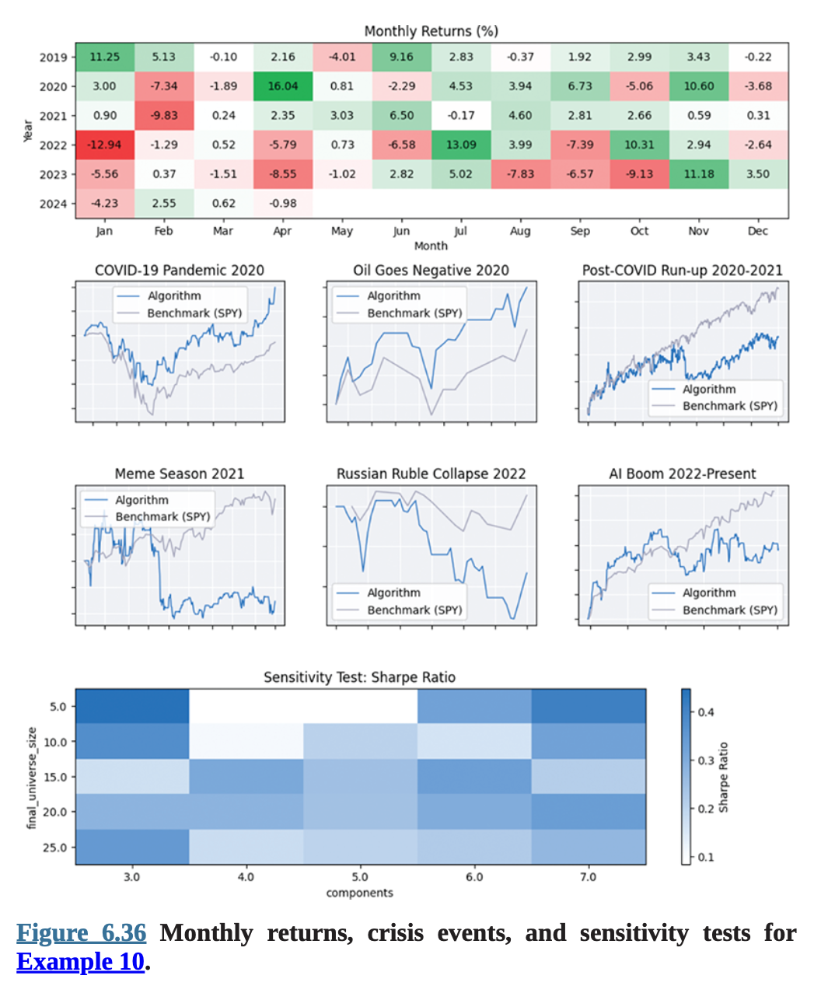
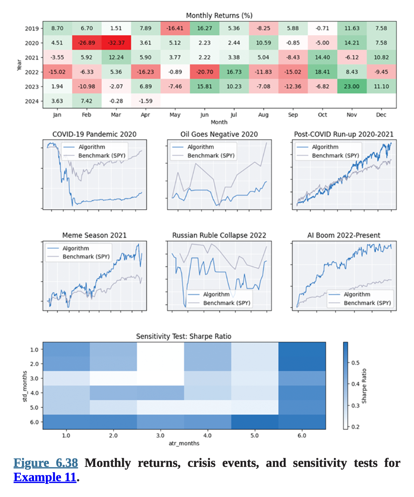

# Chapter 6 Applied Machine Learning

## Example 10—Stock Selection through Clustering Fundamental Data

### Summary

- 각 주식의 Fundamental 지표를 Raw 데이터로 사용
- Fundamental 지표 데이터를 PCA를 이용해서 축소
- 축소한 Feature를 이용해서 보유했을 때의 미래 수익률을 예측
- 예측 수익율이 높은 주식을 보유

### Flow 설명

- 매월 초 개장 1분 후, 투자할 10개의 주식을 선택
    - 우선 거래량 순위로 100개의 주식을 선택
    - 1달 뒤 예측 수익율로 10개의 주식을 선택
        - 예측 모델: LGBMRanker
        - 입력 Raw 데이터
            - 100개의 주식에 대해서 100개의 Fundamental 지표들의 과거 365+2일 데이터를 가져온다.
            - NaN이 아닌 지표가 20개 미만은 주식은 제외
            - 남은 주식이 모두 가지고 있는 Fundamental 지표만 선택
            - 선택된 Fundamental 데이터를 Raw 데이터를 사용.
        - 실제 입력 데이터 준비
            - Raw 데이터를 PCA를 이용해서 5개의 Feature로 축소
        - 예측 데이터 (Label 데이터) 준비
            - Fundamental 데이터를 준비한 종목들의 과거 365+1일 주가 데이터를 가져온다.
            - 22일(1달) 후 수익율을 계산
            - 계산된 수익율로 각 날짜마다의 Ranking을 계산
        - 준비한 데이터로 LGBMRanker를 훈련한다.
        - 현재 날짜(Backtesting)의 축소된 Feature 데이터를 이용해서 미래 수익율 순위를 예측
        - 예측 순위 상위 10개의 주식을 선택
- 선택한 주식을 균등 비율로 매수한다.

### 백테스트 결과

**백테스트 설정**:

* liquid\_universe\_size: 100
* final\_universe\_size: 10
* lookback\_period: 365
* components: 5

[Report](Chapter6%20Example10%20Stock%20Selection%20through%20Clustering%20Fundamental%20Data%20-%20Report.pdf)

### 파라메터 최적화 결과

* `final_universe_size` 및 `components` 파라미터가 가장 작은 값일 때 샤프 비율이 가장 높게 나타남.
* 모든 샤프 비율은 0 이상.
* `components` 파라미터의 작은 변화에도 성과가 민감함. 예: 유니버스 크기가 5일 때 `components`를 3에서 4로 바꾸면 샤프 비율이 0.45 → 0.09로 감소.
* 자세한 내용은 Figure 6.35 및 6.36 참조.

**Parameter final\_universe\_size**:

* 최소값: 5 (너무 작으면 소수 자산에 집중됨)
* 최대값: 25 (상위 25% 자산 선택하는 일반적 방법)
* 증가 단위: 5 (트레이더들이 선호할 만한 라운드 숫자)

**Parameter components**:

* 최소값: 3 (상위 3개 주성분이 전체 분산의 80% 이상 설명)
* 최대값: 7 (추가 성분은 설명력 감소)
* 증가 단위: 1 (가장 작은 단위)



Figure 6.36 Example 10의 월간 수익률, 위기 시기, 민감도 분석

### 구현 내용 설명

Class 정의
```python

# region imports
from AlgorithmImports import *

from sklearn.decomposition import PCA
from sklearn.preprocessing import StandardScaler
from lightgbm import LGBMRanker
# endregion


class StockSelectionThroughClusteringFundamentalDataAlgorithm(QCAlgorithm):
    """
    This strategy demonstrates how to use learning to rank algorithms 
    to select a subset of stocks that are expected to outperform in 
    terms of raw returns. Specifically, this strategy uses 100 
    fundamental factors, principal component analysis, and a LGBMRanker 
    model.
    """
```
초기화 함수
```python
    def initialize(self):
        self.set_start_date(2018, 12, 31)
        self.set_end_date(2024, 4, 1)
        self.set_cash(100_000)
        self.settings.daily_precise_end_time = False

        self._liquid_universe_size = self.get_parameter(
            'liquid_universe_size', 100
        )
        self._final_universe_size = self.get_parameter(
            'final_universe_size', 10
        )
        self._lookback_period = timedelta(
            self.get_parameter('lookback_period', 365)
        )
        self._components = self.get_parameter('components', 5)
        # The `_prediction_period` is based in trading days. Don't 
        # change this value unless you change the rebalance frequency.
        self._prediction_period = 22 
        self._factors = [
           "market_cap",
```
100개의 Fundamental Factor들
```python
           "company_profile.enterprise_value"
        ]

```
리벨런싱 스케줄 설정
```python
        schedule_symbol = Symbol.create("SPY", SecurityType.EQUITY, Market.USA)
        date_rule = self.date_rules.month_start(schedule_symbol)
        self.schedule.on(
            date_rule, 
            self.time_rules.after_market_open(schedule_symbol, 1), 
            self._trade
        )

        self._scaler = StandardScaler()
        self._pca = PCA(n_components=self._components, random_state=0)
        self.universe_settings.schedule.on(date_rule)
        self._universe = self.add_universe(self._select_assets)

```
10개의 주식을 선택하는 함수
```python
    def _select_assets(self, fundamental):
```
거래량 상위 100개 주식을 선택
```python
        # Select the most liquid assets in the market.
        selected = sorted(
            [f for f in fundamental if f.has_fundamental_data], 
            key=lambda f: f.dollar_volume
        )[-self._liquid_universe_size:]
        liquid_symbols = [f.symbol for f in selected]

        # Get the factors.
        factors_by_symbol = {
            symbol: pd.DataFrame(columns=self._factors) 
            for symbol in liquid_symbols
        }
```
과거 365+2일의 Fundamental 데이터를 가져온다.
```python
        history = self.history[Fundamental](
            liquid_symbols, self._lookback_period + timedelta(2)
        )
        for fundamental_dict in history:
            for symbol, asset_fundamentals in fundamental_dict.items():                
                factor_values = []
                for factor in self._factors:
                    factor_values.append(eval(f"asset_fundamentals.{factor}"))
                t = asset_fundamentals.end_time
                factors_by_symbol[symbol].loc[t] = factor_values
        
        # Determine which factors to use for PCA. We can't have any NaN 
        # values. We need to use the same factors for all assets, but 
        # some assets have missing factor values. In some cases we'll 
        # need to drop a factor, in other cases we'll need to drop a 
        # security.
        all_non_nan_factors = []
        tradable_symbols = []
        min_accepted_non_nan_factors = len(self._factors)
```
NaN인 데이터가 20개 미만인 주식은 제외
```python
        for symbol, factor_df in factors_by_symbol.items():
            non_nan_factors = set(factor_df.dropna(axis=1).columns)
            if len(non_nan_factors) < 20: 
                # Let's say an asset needs at least 20 factors (otherwise
                # the `intersection` operation will remove almost all 
                # factors).
                continue
            min_accepted_non_nan_factors = min(
                min_accepted_non_nan_factors, len(non_nan_factors)
            )
            tradable_symbols.append(symbol)
            all_non_nan_factors.append(non_nan_factors)
        if not all_non_nan_factors:
            return []
        factors_to_use = all_non_nan_factors[0]
        for x in all_non_nan_factors[1:]:
            factors_to_use = factors_to_use.intersection(x)
        factors_to_use = sorted(list(factors_to_use))
        self.plot("Factors", "Count", len(factors_to_use))
        self.plot("Factors", "Min", min_accepted_non_nan_factors)

```
레이블용 주가 데이터를 가져온다.
```python
        # Get the training labels of the universe constituents.
        history = self.history(
            tradable_symbols, 
            self._lookback_period + timedelta(1), 
            Resolution.DAILY
        )
        label_by_symbol = {}
        for symbol in tradable_symbols[:]:
            # Remove the asset if there is not data for it.
            if symbol not in history.index:
                tradable_symbols.remove(symbol)
                continue 
            open_prices = history.loc[symbol]['open'].shift(-1)
            # `shift(-1)` so that the open price here represents the 
            # fill of a MOO order immediately after this universe 
            # selection.

            # Calculate the future return of holding for 22 full 
            # trading days (1 month).
```
미래 22일(1달) 수익률 계산
```python
            label_by_symbol[symbol] = open_prices.pct_change(
                self._prediction_period
            ).shift(-self._prediction_period).dropna() 

```
PCA용 데이터 준비
```python
        # Build the factor matrix and label vector for training.
        X_train = pd.DataFrame()
        y_train = pd.DataFrame()
        for symbol in tradable_symbols:
            labels = label_by_symbol[symbol]
            factors = factors_by_symbol[symbol][factors_to_use].reindex(
                labels.index).ffill()
            X_train = pd.concat([X_train, factors])
            y_train[symbol] = labels
        X_train = X_train.sort_index()

```
PCA로 5개의 Feature로 축소
```python
        # Apply PCA.
        X_train_pca = self._pca.fit_transform(
            self._scaler.fit_transform(X_train)
        )

```
주식들의 수익율 순위를 계산
```python
        # A higher value in y_train after this line means greater 
        # expected return. `- 1` to start ranking at 0 instead of 1.
        y_train = y_train.rank(axis=1, method='first').values.flatten() - 1 
        # There can be NaN values in `y_train` if at least one of the 
        # symbols is missing at least 1 label (insufficient history).
        y_train = y_train[~np.isnan(y_train)] 

```
LGBMRanker 모델을 생성하고 준비한 데이터로 훈련
```python
        # Train the model. We need to set label_gain to avoid error. See 
        # https://github.com/microsoft/LightGBM/issues/1090 and 
        # https://github.com/microsoft/LightGBM/issues/5297.
        model = LGBMRanker(
            objective="lambdarank", 
            label_gain=list(range(len(tradable_symbols)))
        ) 
        # The `group` is a mapping from rebalance time to the number of
        # assets at that time.
        group = X_train.reset_index().groupby("time")["time"].count()
        model.fit(X_train_pca, y_train, group=group) 

```
예측용 데이터 선택
```python
        # Predict the ranking of assets over the upcoming month.
        X = pd.DataFrame()
        for symbol in tradable_symbols:
            X = pd.concat(
                [X, factors_by_symbol[symbol][factors_to_use].iloc[-1:]]
            )
```
순위 예측
```python
        prediction_by_symbol = {
            tradable_symbols[i]: prediction 
            for i, prediction in enumerate(
                model.predict(self._pca.transform(self._scaler.transform(X)))
            )
        }

```
상위 10개의 주식을 Universe로 선택
```python
        # Select the assets that are predicted to rank the highest.
        sorted_predictions = sorted(
            prediction_by_symbol.items(), key=lambda x: x[1]
        )
        return [x[0] for x in sorted_predictions[-self._final_universe_size:]]

```
선택된 주식으로 거래하는 함수
```python
    def _trade(self):
        # Rebalance to form an equal-weighted portfolio.
```
균등 분할을 사용한다.
```python
        weight = 1 / len(self._universe.selected)
```
선택된 주식을 균등 분할로 매수하는 포트폴리오로 변경한다.
```python
        self.set_holdings(
            [
                PortfolioTarget(symbol, weight) 
                for symbol in self._universe.selected
            ],
            True
        )
```


## Example 11—Inverse Volatility Rank and Allocate to Future Contracts

### Summary

- 각 선물 계약의 3가지 지표를 입력 데이터로 사용
    - 수익률 표준편차
    - ATR
    - 미결제약정 수
- 미래 변동성을 예측
- 미래 변동성의 역수의 크기에 따라서 보유

### Flow 설명

- 선물 Universe의 Filter를 Front Month로 설정
    - Front Month: 근원물, 만기일이 얼마 안 남음
- 새로운 선물이 추가될 때
    - 표준편차와 ATR을 Indicator로 추가
    - Consolidate 주기를 1일로 설정
        - 1일 마다 정보를 통합해서 Bar를 만드는데 사용 가능
- Consolidate 주기마다
    - Indicator 정보를 갱신하고 저장
    - 미래 6일 동안의 시가의 표준편차를 저장
- 매주 시작일마다
    - 미래 변동성을 추정
        - 예측 모델: Ridge 회귀
        - 입력 데이터 준비
            - 과거 365일 동안의 다음 데이터
            - 종가 표준편차
            - ATR
            - 미결제약정 수
        - 예측 데이터 (Label 데이터) 준비
            - 미래 6일동안의 시가 표준편차
        - 준비한 데이터로 Ridge 모델을 훈련한다.
        - 현재 날짜 입력데이터로 미래 표준편차를 추정
    - 투자 포트폴리오 변경
        - 포트폴리오 비중을 다음과 같이 변경
        - **weight = 3 / σ / sum(σ) / Futures Contract Multiplier**
        

### 부가 설명

**weight = 3 / σ / sum(σ) / Futures Contract Multiplier**

이 수식은 변동성이 낮은 자산에 더 큰 비중을 부여하도록 설계됨.

* 분자 3은 포지션 크기 조절용 스케일링 계수
* 값이 1이면 최소 주문 마진 비율 때문에 일부 자산만 거래됨
* 값이 너무 크면 마진 콜 위험 발생
* **3**은 대부분의 선물을 거래하면서도 최소 주문 마진 설정을 0으로 만들지 않는 적정값으로 선택됨

**ATR (Average True Range)**:

  * True range는 다음 중 최대값:

    * 당일 고가 - 저가
    * 당일 저가 - 전일 종가의 절댓값
    * 당일 고가 - 전일 종가의 절댓값
  * ATR은 위 true range의 지수이동평균(EMA)

**미결제약정(Open Interest)**: 현재까지 청산되지 않은 파생계약 수. 포지션 시작부터 종료까지 "열려 있음"으로 간주

다음 선물의 근월물(front-month contracts)로 제한된 유니버스를 사용

* 지수:
    * VIX
    * S\&P 500 E-Mini
    * Nasdaq 100 E-Mini
    * DOW 30 E-Mini
* 에너지:
    * Brent crude
    * Gasoline
    * Heating oil
    * Natural gas
* 곡물:
    * Corn
    * Oats
    * Soybeans
    * Wheat


### 백테스트 결과

**백테스트 설정**:

* `std_months`: 3
* `atr_months`: 3
* `training_set_duration`: 365

[Report](Chapter6%20Example11%20Inverse%20Volatility%20Rank%20and%20Allocate%20to%20Future%20Contracts%20-%20Report.pdf)

### 파라메터 최적화 결과

결과는 다음을 보여줍니다:

* **샤프 비율은 보통 하나 이상의 지표가 6개월 회고 기간을 사용할 때 가장 높음**
* **샤프 비율은 지표 중 하나라도 3개월 회고 기간이면 가장 낮은 경향**
* **모든 파라미터 조합은 수익성이 있음**

**Figure 6.37**, **Figure 6.38** 참조

**파라미터 std\_months** (표준편차 계산용 기간):

* 최소값: 1 (가장 작은 정수)
* 최대값: 6 (6개월)
* 스텝: 1

**파라미터 atr\_months** (ATR 계산용 기간):

* 최소값: 1
* 최대값: 6
* 스텝: 1



Figure 6.38 Example 11의 월간 수익률, 위기 이벤트, 민감도 테스트

### 구현 내용 설명

```python
# region imports
from AlgorithmImports import *

from sklearn.linear_model import Ridge
# endregion

class InverseVolatilityRankAlgorithm(QCAlgorithm):
    """
    This algorithm demonstrates a way to use machine learning to form a 
    portfolio of Futures contracts where the weight of each contract is 
    the inverse of its expected future volatility. To forecast the
    future volatility, this strategy uses a ridge regression model and 
    the following factors: 
        - Volatility: Standard deviation of daily returns over the last 
          60 trading days
        - ATR: Average True Range over the last 60 trading days
        - Open interest
    """

```
초기화 함수
```python
    def initialize(self):
        self.set_start_date(2018, 12, 31)
        self.set_end_date(2025, 7, 1)
        self.set_cash(100_000_000)

        self._std_period = self.get_parameter('std_months', 3) * 26
        self._atr_period = self.get_parameter('atr_months', 3) * 26
        self._training_set_duration = timedelta(
            self.get_parameter('training_set_duration', 365)
        )
        self._future_std_period = 6

        self._contracts = []
        tickers = [
            Futures.Indices.VIX, 
            Futures.Indices.SP_500_E_MINI,
            Futures.Indices.NASDAQ_100_E_MINI,
            Futures.Indices.DOW_30_E_MINI,
            Futures.Energy.BRENT_CRUDE,
            Futures.Energy.GASOLINE,
            Futures.Energy.HEATING_OIL,
            Futures.Energy.NATURAL_GAS,
            Futures.Grains.CORN,
            Futures.Grains.OATS,
            Futures.Grains.SOYBEANS,
            Futures.Grains.WHEAT
        ]
```
Universe를 Front Month로 설정
```python
        for ticker in tickers:
            future = self.add_future(ticker, extended_market_hours=True)
            future.set_filter(lambda universe: universe.front_month())
        
```
리벨런싱 스케줄 설정
```python
        schedule_symbol = Symbol.create("SPY", SecurityType.EQUITY, Market.USA)
        self.schedule.on(
            self.date_rules.week_start(schedule_symbol),
            self.time_rules.after_market_open(schedule_symbol, 1), 
            self._trade
        )

```
거래 처리 함수
```python
    def _trade(self):
        # Get the open interest factors.
```
미결제약정 정보 가져오기
```python
        open_interest = self.history(
            OpenInterest, [c.symbol for c in self._contracts], 
            self._training_set_duration, fill_forward=False
        )
        open_interest.index = open_interest.index.droplevel(0)

        # Predict volatility over the next week for each security.
        expected_volatility_by_security = {}
        for security in self._contracts:
            symbol = security.symbol
            if symbol not in open_interest.index:
                continue
```
Open Interest 정보를 가져와서 훈련 입력 데이터에 추가
```python
            # Get the factors.
            factors = pd.concat(
                [security.indicator_history, open_interest.loc[symbol]], 
                axis=1
            ).ffill().loc[security.indicator_history.index].dropna()
            if factors.empty:
                # The df can be empty if there is no open interest data 
                # for the asset (example: 
                # https://www.quantconnect.com/datasets/issue/16604).
                continue 
            # Get the labels.
```
훈련 Label 데이터 가져오기
```python
            label = security.label_history

            # Align the factors and labels.
            idx = sorted(
                list(set(factors.index).intersection(set(label.index)))
            )
            # Ensure there are enough training samples.
            if len(idx) < 20:
                continue

```
Ridge 모델 훈련
```python
            # Train the model.
            model = Ridge()
```
실행할 때 다음 에러가 발생해서 코드 추가

- Runtime Error: Feature names are only supported if all input features have string names, but your input has ['PandasColumn', 'str'] as feature name / column name types. If you want feature names to be stored and validated, you must convert them all to strings, by using X.columns = X.columns.astype(str) for example. Otherwise you can remove feature / column names from your input data, or convert them all to a non-string data type. 
```python
            factors_idx = factors.loc[idx]
            factors_idx.columns = list(map(str, factors_idx.columns))

            model.fit(factors_idx, label.loc[idx])

```
1주 뒤 변동성을 예측
```python
            # Predict the volatility over the next week.
            prediction = model.predict([factors.iloc[-1]])[0] 
            if prediction > 0:
                expected_volatility_by_security[security] = prediction
            self.plot("Predictions", security.symbol.canonical.value, prediction)

        # Calculate the portfolio weights and rebalance.
        portfolio_targets = []
        std_sum = sum(
            [
                1 / expected_vol 
                for expected_vol in expected_volatility_by_security.values()
            ]
        )
        for security, expected_vol in expected_volatility_by_security.items():
```
예측된 변동성을 이용해서 각 계약의 비중을 계산
```python
            weight = (
                3 
                / expected_vol 
                / std_sum 
                / security.symbol_properties.contract_multiplier
            )
            # The numerator `3` above scales the position size.
            # If it's set to 1, the algorithm only trades a few of 
            # the Futures in the universe because of the
            # minimum_order_margin_portfolio_percentage setting. 
            # If it's set too high, we run into margin calls. 
            # 3 is the middle-ground where the algorithm trades 
            # most of the Futures without having to set 
            # minimum_order_margin_portfolio_percentage to zero.
```
비중에 맞춰서 포트폴리오 조정
```python
            portfolio_targets.append(PortfolioTarget(security.symbol, weight))
        self.set_holdings(portfolio_targets, True)

```
새로운 선물이 추가되는 경우 처리
```python
    def on_securities_changed(self, changes):
        for security in changes.added_securities:
            if security.symbol.is_canonical(): 
                continue  # Skip over continuous contracts.
            # Create the indicators.
            # We're using manual indicators here for demonstration
            # purposes. You can reduce the amount of code by using
            # the automatic indicators, but the following code
            # is an example of doing everything manually so you 
            # can have maximum control over the outcome.
```
새로운 선물의 Indicator 설정
```python
            security.close_roc = RateOfChange(1)
            security.std_of_close_returns = IndicatorExtensions.of(
                StandardDeviation(self._std_period), 
                security.close_roc
            )
            security.atr = AverageTrueRange(self._atr_period)
            security.open_roc = RateOfChange(1)
            security.std_of_open_returns = IndicatorExtensions.of(
                StandardDeviation(self._future_std_period), security.open_roc
            )

            # Create some pandas objects to store the historical 
            # indicator values we'll use to train the ML.
            security.indicator_history = pd.DataFrame()
            security.label_history = pd.Series()

```
새로운 선물의 Consolidate 설정
```python
            # Create a consolidator to aggregate minute data into daily 
            # data for the indicators.
            security.consolidator = self.consolidate(
                security.symbol, Resolution.DAILY, self._consolidation_handler
            )
            
            # Warm up the indicators with historical data.
            warm_up_length = (
                max(self._std_period + 1, self._atr_period) 
                + self._training_set_duration.days
            )
            bars = self.history[TradeBar](
                security.symbol, warm_up_length, Resolution.DAILY
            )
            for bar in bars:
                security.consolidator.update(bar)

            self._contracts.append(security)

```
제거된 선물 관련 데이터 정리
```python
        for security in changes.removed_securities:
            # Remove the consolidator.
            self.subscription_manager.remove_consolidator(
                security.symbol, security.consolidator
            )
            # Reset the indicators.
            security.close_roc.reset()
            security.std_of_close_returns.reset()
            security.atr.reset()
            security.open_roc.reset()
            security.std_of_open_returns.reset()
            if security in self._contracts:
                self._contracts.remove(security)

```
Consolidate 주기마다 처리
```python
    def _consolidation_handler(self, consolidated_bar):
        # Get the security object.
        security = self.securities[consolidated_bar.symbol]

        # Update the indicators and save their values.
        t = consolidated_bar.end_time
        if security.atr.update(consolidated_bar):
            security.indicator_history.loc[t, 'atr'] = \
                security.atr.current.value
        security.close_roc.update(t, consolidated_bar.close)
        if security.std_of_close_returns.is_ready:
            security.indicator_history.loc[t, 'std_of_close_returns'] = \
                security.std_of_close_returns.current.value
        security.open_roc.update(t, consolidated_bar.open)

```
Label 데이터 기록
```python
        # Update the label history.
        if (security.std_of_open_returns.is_ready and 
            len(security.indicator_history.index) > self._future_std_period):
            security.label_history.loc[
                security.indicator_history.index[-self._future_std_period - 1]
            ] = security.std_of_open_returns.current.value
        
        # Trim the factor and label history.
        security.indicator_history = security.indicator_history[
            (security.indicator_history.index >= 
            self.time - self._training_set_duration)
        ]
        security.label_history = security.label_history[
            (security.label_history.index >= 
            self.time - self._training_set_duration)
        ]

```

## Example 12—Trading Costs Optimization

### Summary

- 매달 거래 비용을 추정하는 모델을 훈련
- 매일 비트코인을 사고 파는 두개의 알고리즘을 비교
    - 단순히 일정한 시간에 파는 알고리즘
    - 훈련된 모델을 사용해서 거래 비용을 아껴보려는 알고리즘
- 두 알고리즘의 거래 데이터를 CSV로 저장해서 별도 분석


### Flow 설명

- 매달 첫 날에 예측 모델을 갱신
    - 예측 모델: DecisionTreeRegressor
    - 입력 데이터
        - 절대 주문 수량
        - 평균 진폭 범위(ATR)
        - 일 평균 거래량
        - 스프레드 비율 ((ask - bid)/bid)
        - 주문 상위 호가 규모 (달러 기준)
    - 예측 데이터 (Label 데이터)
        - 실제 주문 때 기록한 거래 비용
- 매일 0시에 비트코인 10개 매수
- 단순한 알고리즘은 매일 1시에 모두 매도
- ML 알고리즘은 새로운 정보가 올 때마다
    - 모델 입력 데이터 계산
    - 모델을 이용해서 거래 비용을 추정
    - 거래 비용이 과거 10거래일 거래비용보다 작으면 매도
    - 23:59까지 매도를 못하면 바로 매도
- Backtesting이 모두 끝나면 주문 내역을 CSV로 저장


**백테스트 설정**:

* cost\_sma\_period: 10
* atr\_period: 14
* sma\_period: 10
* lookback\_window: 100

[Report](Chapter6%20Example12%20Trading%20Costs%20Optimization%20-%20Report.pdf)


### 구현 내용 설명

Class 정의
```python
#region imports
from AlgorithmImports import *

from sklearn.tree import DecisionTreeRegressor
#endregion


class TradeCostEstimationAlgorithm(QCAlgorithm):
    """
    This algorithm demonstrates how we can using machine learning to 
    reduce trading costs. If you run this algorithm with 
    `self._benchmark` enabled, the algorithm buys BTCUSDC at 12 AM and 
    then sells it at 1 AM everyday. If you run it with `self._benchmark` 
    disabled, the algorithm buys BTCUSDC at 12 AM and then but liquidates
    it at some point between 1 AM and 11:59 PM, when it predicts that 
    the liquidation costs are lower than usual. To predict the trading 
    costs, this algorithm uses a DecisionTreeRegressor model with the 
    following factors:
        - Absolute order quantity
        - Average true range
        - Average daily volume
        - Spread percent ((ask - bid) / bid)
        - Top of book size (in dollars)
    """

```
초기화 함수
```python
    def initialize(self):
        self.set_start_date(2023, 1, 1)
        self.set_end_date(2024, 1, 1)
        self.set_cash('USDC', 10_000_000)

        self.settings.minimum_order_margin_portfolio_percentage = 0

        self._benchmark = True #True
        self._scan_for_exit = False

        # Add the asset.
        self._security = self.add_crypto("BTCUSDC", market=Market.BYBIT)
        self._security.set_slippage_model(SpreadSlippageModel())
        self._symbol = self._security.symbol

        # Schedule some events to trade.
        date_rule = self.date_rules.every_day()
```
매일 0시에 작업 스케줄 설정
```python
        self.schedule.on(date_rule, self.time_rules.at(0, 0), self._entry)
```
매일 1시에 작업 스케줄 설정
```python
        self.schedule.on(date_rule, self.time_rules.at(1, 0), self._exit)

        self._total_costs = 0
        self._quantity = 10
        self._costs = pd.Series(dtype=float)
        self._cost_sma = SimpleMovingAverage(
            self.get_parameter('cost_sma_period', 10)
        )
        self._order_fills = pd.DataFrame(
            columns=['fill_price', 'quantity', 'cost', 'tag']
        )

        if not self._benchmark:
            self._model = None 
            self.enable_automatic_indicator_warm_up = True
            self._atr = self.atr(
                self._symbol, self.get_parameter('atr_period', 14), 
                resolution=Resolution.DAILY
            )
            self._sma = self.sma(
                self._symbol, self.get_parameter('sma_period', 10), 
                Resolution.DAILY, Field.VOLUME
            )
```
매달 첫 날에 모델 훈련 스케줄 설정
```python
            self.train(
                self.date_rules.month_start(), 
                self.time_rules.at(0, 0), 
                self._train
            )
            self._lookback_window = self.get_parameter('lookback_window', 100)
            self._factors = pd.DataFrame(
                columns=[
                    'abs_order_quantity', 'atr', 'avg_daily_volume', 
                    'spread_pct', 'top_of_book_size'
                ]
            )

```
매일 0시에 매수 주문
```python
    def _entry(self):
        self.market_order(self._symbol, self._quantity)

```
매일 1시에 단순 알고리즘 매도 주문
```python
    def _exit(self):
        if self._benchmark:
            bid = self._security.bid_price
            ask = self._security.ask_price
            self.liquidate(tag=f"Bid: {bid}; Ask: {ask}")
            return
        self._scan_for_exit = True

```
준비된 데이터로 DecisionTreeRegressor 모델 훈련
```python
    def _train(self):
        if self._factors.shape[0] < self._lookback_window:
            return
        if self._model is None:
            self._model = DecisionTreeRegressor(max_depth=10, random_state=0)
        self._model.fit(self._factors, self._costs)

    def _trim_samples(self):
        # Trim factors and labels that have fallen out of the lookback 
        # window.
        self._factors = self._factors.iloc[-self._lookback_window:]
        self._costs = self._costs.iloc[-self._lookback_window:]

```
새로운 데이터가 올 때마다 처리
```python
    def on_data(self, data):
        if not self._scan_for_exit:
            return

        bid = self._security.bid_price
        ask = self._security.ask_price
        current_factors = [
            abs(self._quantity),           # Absolute order quantity
            self._atr.current.value,       # ATR
            self._sma.current.value,       # Average daily volume
            (ask - bid) / bid,     # Spread percent
            self._security.ask_size * ask  # Top of book size (in $)
        ]

        tag = "Hit time limit" 
        if self._model is None:
            tag = "ML model is not ready"
        # Check if we hit the time limit.
        elif data.time.time() < time(23, 59):  
```
거래 비용 예측
```python
            # Predict the trade cost.
            predicted_costs = self._model.predict([current_factors])[0]
            dollar_volume = self._quantity * bid
            predicted_costs_per_dollar = predicted_costs / dollar_volume

            # Don't trade until predicted costs are lower than the 
            # average costs we've seen.
```
예측된 비용이 과거 10일 평균보다 높으면 계속 보유한다.
```python
            if predicted_costs_per_dollar >= self._cost_sma.current.value:
                return
            tag = (
                f'Predicted: {predicted_costs_per_dollar}; ' 
                + f'SMA: {self._cost_sma.Current.Value}'
            )

            # Plot the predicted costs.
            self.plot("Costs", "Predicted", predicted_costs)
            self.plot(
                "Costs Per Dollar", "Predicted", predicted_costs_per_dollar
            )
        
        self.plot("Model Readiness", "IsReady", int(self._model is not None))

```
23:59가 지났거나 예측된 비용이 과거 10일 평균보다 낮으면 매도 한다.
```python
        # Place the trade.
        self.market_order(self._symbol, -self._quantity, tag=tag)
        self._factors.loc[self.time] = current_factors
        self._scan_for_exit = False
        self._trim_samples()

```
매매가 있을 때마다 기록
```python
    def on_order_event(self, order_event):
        if order_event.status == OrderStatus.FILLED:
            if order_event.quantity > 0:
                return
            t = self.time
            fill_price = order_event.fill_price
            dollar_volume = self._quantity * fill_price
            # Only use bid price because we are only training on the 
            # exit orders (sells, where they are filled at the bid).
            slippage_per_share = self._security.bid_price - fill_price
            cost = (
                order_event.order_fee.value.amount 
                + slippage_per_share * self._quantity 
            )
            self._total_costs += cost
            self._cost_sma.update(t, cost / dollar_volume)
            self._costs.loc[t] = cost
            self.plot("Costs", "Actual", cost)
            self.plot("Cumulative Costs", "Actual", self._total_costs)
            self.plot("Samples", "Count", len(self._costs))
            self.plot("Costs Per Dollar", "Actual", cost / dollar_volume)
            if self._cost_sma.is_ready:
                self.plot(
                    "Costs Per Dollar", "SMA(Actual)", 
                    self._cost_sma.current.value
                )
            self._order_fills.loc[t] = (
                fill_price, order_event.quantity, cost, order_event.ticket.tag
            )

```
기록된 매매 정보를 CSV로 저장
```python
    def on_end_of_algorithm(self):
        key = ("benchmark" if self._benchmark else "candidate") + "_order_fills"
        self._order_fills.to_csv(self.object_store.get_file_path(key))


class SpreadSlippageModel:
    def get_slippage_approximation(self, asset, order):
        # We are using the spread as a proxy for a high cost environment
        # for market orders.
        return asset.ask_price - asset.bid_price

```

Research 용 Jupyter Notebook

[Research](Chapter6%20Example12%20Trading%20Costs%20Optimization%20-%20research.html)

