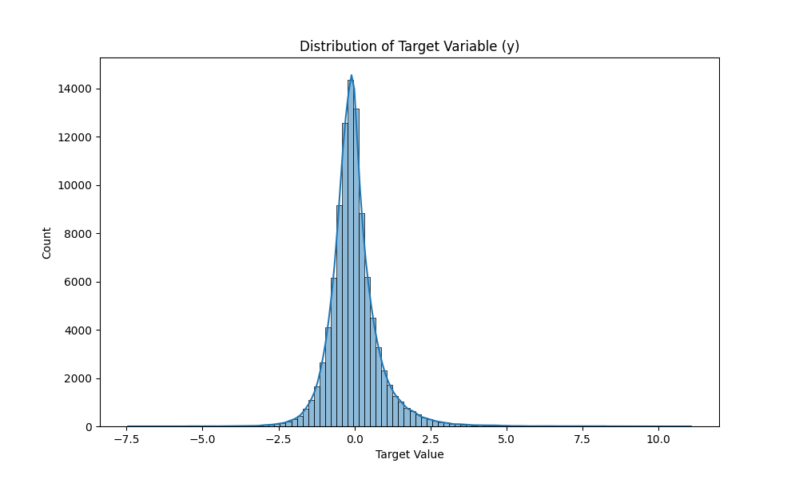
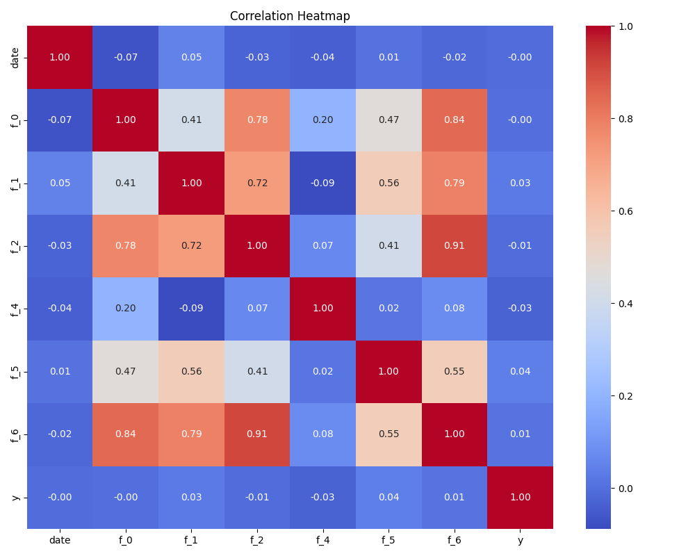

# Stocks Return Prediction V2 - EDA 리포트

**생성일시:** 2026-01-05 08:18:38

**대회 정보:** [Stocks Return Prediction V2](https://www.kaggle.com/competitions/stocks-return-prediction-v-2)

---

## 1. 데이터 로딩 (Data Loading)

✓ 데이터 파일 로딩 성공:

- `train_data.pkl`: 4,670,279 행
- `test_data.pkl`: 4,879,631 행
- `sample_submission.csv`: 4,879,631 행

## 2. 데이터 구조 (Data Structure)

### 2.1 학습 데이터 (Train Data)

- **크기 (Shape):** 4,670,279 행 × 10 열
- **메모리 사용량:** 754.48 MB
- **컬럼 목록:** `code`, `date`, `f_0`, `f_1`, `f_2`, `f_3`, `f_4`, `f_5`, `f_6`, `y`

**샘플 데이터 (상위 5행):**

|    | code   |   date |     f_0 |      f_1 |      f_2 |   f_3 |         f_4 |     f_5 |      f_6 |         y |
|---:|:-------|-------:|--------:|---------:|---------:|------:|------------:|--------:|---------:|----------:|
|  0 | s_4394 |      0 | 1.02683 | 0.993753 | 0.998119 |    11 | 7.17568e+08 | 1.01872 | 1.00916  | -0.92542  |
|  1 | s_4451 |      0 | 1.0568  | 1.0045   | 1.01183  |    22 | 3.76978e+08 | 1.02367 | 1.0275   | -0.568435 |
|  2 | s_5091 |      0 | 1.01764 | 0.991797 | 1.00943  |     6 | 9.42977e+07 | 1.00451 | 1.00541  | -1.29663  |
|  3 | s_4524 |      0 | 1.01371 | 0.97667  | 0.983971 |    28 | 2.02927e+08 | 1.01051 | 0.988123 | -1.06069  |
|  4 | s_594  |      0 | 1.02899 | 0.990168 | 0.990672 |    10 | 2.45701e+08 | 1.00983 | 1.01211  | -0.747414 |

**데이터 타입:**

| 컬럼명   | 데이터타입   |
|:------|:--------|
| code  | object  |
| date  | int64   |
| f_0   | float64 |
| f_1   | float64 |
| f_2   | float64 |
| f_3   | object  |
| f_4   | float64 |
| f_5   | float64 |
| f_6   | float64 |
| y     | float64 |

### 2.2 테스트 데이터 (Test Data)

- **크기 (Shape):** 4,879,631 행 × 9 열
- **컬럼 목록:** `code`, `date`, `f_0`, `f_1`, `f_2`, `f_3`, `f_4`, `f_5`, `f_6`

|    | code   |   date |     f_0 |      f_1 |     f_2 |   f_3 |         f_4 |     f_5 |     f_6 |
|---:|:-------|-------:|--------:|---------:|--------:|------:|------------:|--------:|--------:|
|  0 | s_0    |   1702 | 1.02966 | 1.00461  | 1.01138 |    22 | 9.48893e+07 | 1.01138 | 1.0156  |
|  1 | s_3079 |   1702 | 1.00946 | 0.992317 | 1.00709 |    20 | 7.41507e+07 | 1.00355 | 1.00123 |
|  2 | s_4533 |   1702 | 1.01867 | 1.00162  | 1.01542 |    14 | 4.11469e+07 | 1.00629 | 1.01279 |
|  3 | s_484  |   1702 | 1.02168 | 1.00578  | 1.01879 |    15 | 2.82922e+08 | 1.00867 | 1.01512 |
|  4 | s_2840 |   1702 | 1.02737 | 1.00217  | 1.02085 |    27 | 6.67055e+07 | 1.00217 | 1.01349 |

## 3. 기본 통계량 (Statistical Summary)

### 3.1 타겟 변수 (Target Variable, y)

**통계량:**

- 왜도 (Skewness): 1.6473 (오른쪽으로 치우침 (양의 왜도))
- 첨도 (Kurtosis): 11.5582 (뾰족한 분포 (두꺼운 꼬리, 이상치 가능성 높음))

| 0         | 1                     | 2                 | 3                  | 4                   | 5                   | 6                  | 7                  |
|:----------|:----------------------|:------------------|:-------------------|:--------------------|:--------------------|:-------------------|:-------------------|
| count     | mean                  | std               | min                | 25%                 | 50%                 | 75%                | max                |
| 4670279.0 | -0.014437940680145823 | 0.858314587945153 | -9.480861817376493 | -0.4516706033726396 | -0.0928386308276812 | 0.3002018007810765 | 15.424043420236671 |

*타겟 변수 분포 (Distribution of Target Variable)*

### 3.2 수치형 특성 (Numeric Features)

| 특성 (Feature)   |    평균 (Mean) |    표준편차 (Std) |    최소 (Min) |       최대 (Max) |   결측치 (Missing) |
|:---------------|-------------:|--------------:|------------:|---------------:|----------------:|
| date           | 930.799      | 495.473       |    0        | 1701           |               0 |
| f_0            |   1.01981    |   0.02588     |    0.83354  |   10.8585      |               0 |
| f_1            |   0.980411   |   0.023734    |    0.710559 |    8.22669     |               0 |
| f_2            |   1.00068    |   0.031621    |    0.710559 |   10.8585      |               0 |
| f_4            |   1.7509e+08 |   4.25031e+08 | 7075        |    6.79413e+10 |               0 |
| f_5            |   0.998765   |   0.015833    |    0.763775 |    8.99839     |               0 |
| f_6            |   1.00048    |   0.023878    |    0.777659 |    9.92584     |               0 |

### 3.3 범주형 특성 (Categorical Feature: code)

- **Train 데이터 타입:** `object`
- **Test 데이터 타입:** `object`
**상위 10개 최빈값:**

| 값 (Value)   |   빈도 (Count) | 비율 (Percentage)   |
|:------------|-------------:|:------------------|
| s_1993      |         1702 | 0.04%             |
| s_1976      |         1702 | 0.04%             |
| s_496       |         1702 | 0.04%             |
| s_4481      |         1702 | 0.04%             |
| s_2128      |         1702 | 0.04%             |
| s_172       |         1702 | 0.04%             |
| s_2875      |         1702 | 0.04%             |
| s_1440      |         1702 | 0.04%             |
| s_346       |         1702 | 0.04%             |
| s_925       |         1702 | 0.04%             |

### 3.3 범주형 특성 (Categorical Feature: f_3)

- **Train 데이터 타입:** `object`
- **Test 데이터 타입:** `int64` ⚠️ **타입 불일치!**
**상위 10개 최빈값:**

|   값 (Value) |   빈도 (Count) | 비율 (Percentage)   |
|------------:|-------------:|:------------------|
|          15 |       438647 | 9.39%             |
|           8 |       375084 | 8.03%             |
|          20 |       364384 | 7.8%              |
|           3 |       281452 | 6.03%             |
|           1 |       239436 | 5.13%             |
|          24 |       223815 | 4.79%             |
|          18 |       223765 | 4.79%             |
|           5 |       216882 | 4.64%             |
|          14 |       202954 | 4.35%             |
|           2 |       156140 | 3.34%             |

### 3.4 종목별 레코드 수 (Records per Stock)

- **고유 종목 수:** 3,761 개
- **종목별 평균 레코드 수:** 1241.77
- **종목별 최소 레코드 수:** 22
- **종목별 최대 레코드 수:** 1702

⚠️ **종목별 레코드 수가 다릅니다. (Imbalanced per stock)**

**상위 5개 종목 (많은 레코드):**

| 종목코드   |   레코드 수 |
|:-------|--------:|
| s_1993 |    1702 |
| s_1976 |    1702 |
| s_496  |    1702 |
| s_4481 |    1702 |
| s_2128 |    1702 |

**하위 5개 종목 (적은 레코드):**

| 종목코드   |   레코드 수 |
|:-------|--------:|
| s_3256 |      22 |
| s_4841 |      22 |
| s_3780 |      22 |
| s_2129 |      22 |
| s_3540 |      22 |

### 3.5 시계열 데이터 확인 (Time Series)

**날짜 컬럼 발견: `date`**
- **시작일:** 0
- **종료일:** 1701

## 4. 데이터 품질 (Data Quality)

### 4.1 결측치 (Missing Values)

✓ **학습 데이터에 결측치가 없습니다.**

### 4.2 중복 데이터 (Duplicates)

- **학습 데이터 중복 수:** 0
- **테스트 데이터 중복 수:** 0

✓ **무한대 값이 없습니다.**

### 4.3 이상치 탐지 (Outliers - IQR Method)

**IQR 방식으로 탐지된 이상치 요약 (상위 10개):**

| 컬럼명   |   이상치 수 | 비율 (%)   |
|:------|--------:|:---------|
| f_5   |  511379 | 10.95%   |
| f_4   |  471138 | 10.09%   |
| f_2   |  372973 | 7.99%    |
| f_0   |  363971 | 7.79%    |
| f_1   |  343331 | 7.35%    |
| f_6   |  338889 | 7.26%    |

## 5. 특성 관계 (Feature Relationships)

### 5.1 타겟과의 상관관계 (Correlation with Target)

- **최대 절대 상관계수:** 0.0417 (매우 약함/없음)

| 특성 (Feature)   |   상관계수 (Correlation) |
|:---------------|---------------------:|
| f_5            |             0.041686 |
| f_1            |             0.02767  |
| f_6            |             0.012849 |
| f_0            |            -0.000213 |
| date           |            -0.002911 |
| f_2            |            -0.002975 |
| f_4            |            -0.031061 |

*특성 상관관계 히트맵 (Feature Correlation Heatmap)*

## 6. 학습-테스트 데이터 분석 (Train-Test Analysis)

### 6.1 종목 중복 여부 (Stock Overlap)

⚠️ **Cold Start 문제:** 테스트 셋에만 존재하는 종목이 1,526개 있습니다.

| 구분                        | 수 (Count)   |
|:--------------------------|:------------|
| Train에만 있는 종목             | 73          |
| Test에만 있는 종목 (Cold Start) | 1,526       |
| 양쪽에 모두 있는 종목              | 3,688       |
| 중복 비율                     | 70.73%      |
