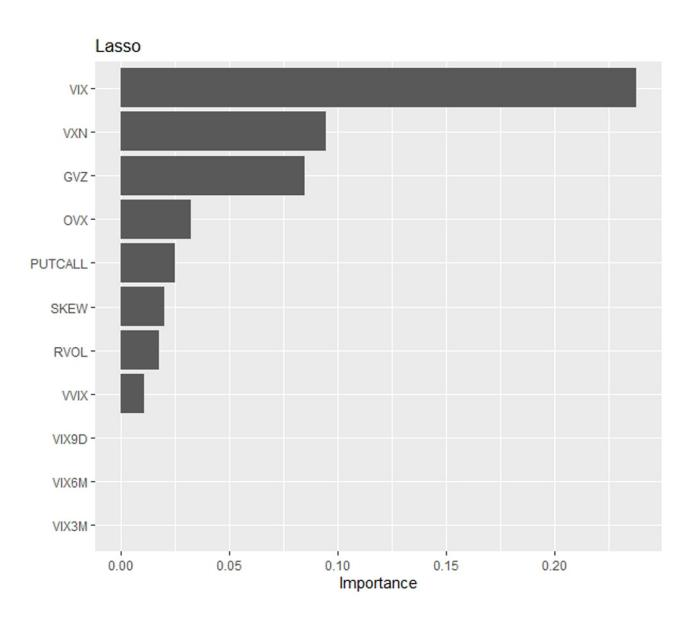

Contents lists available at [ScienceDirect](https://www.elsevier.com/locate/ijforecast)

## International Journal of Forecasting

journal homepage: [www.elsevier.com/locate/ijforecast](http://www.elsevier.com/locate/ijforecast)

# A comparison of machine learning methods for predicting the direction of the US stock market on the basis of volatility indices

Giovanni Campisi [a](#page-0-0),[∗](#page-0-1) , Silvia Muzzioli [a](#page-0-0) , Bernard De Baets [b](#page-0-2)

- a *Marco Biagi Department of Economics, University of Modena and Reggio Emilia, Modena, Italy*
- b *Department of Data Analysis and Mathematical Modelling, Ghent University, Belgium*

## a r t i c l e i n f o

#### *Keywords:* Machine learning Volatility indices Forecasting Market risk US market

## a b s t r a c t

This paper investigates the information content of volatility indices for the purpose of predicting the future direction of the stock market. To this end, different machine learning methods are applied. The dataset used consists of stock index returns and volatility indices of the US stock market from January 2011 until July 2022. The predictive performance of the resulting models is evaluated on the basis of three evaluation metrics: accuracy, the area under the ROC curve, and the F-measure. The results indicate that machine learning models outperform the classical least squares linear regression model in predicting the direction of S&P 500 returns. Among the models examined, random forests and bagging attain the highest predictive performance based on all the evaluation metrics adopted.

© 2023 The Author(s). Published by Elsevier B.V. on behalf of International Institute of Forecasters. This is an open access article under the CC BY-NC-ND license [\(http://creativecommons.org/licenses/by-nc-nd/4.0/\)](http://creativecommons.org/licenses/by-nc-nd/4.0/).

## **1. Introduction**

Stock market prediction has always been an important issue in the financial literature ([Elyasiani et al.,](#page-10-0) [2017](#page-10-0); [Giot](#page-10-1), [2005;](#page-10-1) [Gonzalez-Perez,](#page-10-2) [2015](#page-10-2); [Lubnau & Todorova](#page-10-3), [2015](#page-10-3); [Rubbaniy et al.](#page-11-0), [2014\)](#page-11-0). In recent decades, the quantity and quality of the information available to researchers have increased dramatically. In particular, implied volatility indices are essential for asset pricing and risk management. They contain information embedded in option prices that reflect investor opinion about future underlying asset trends. Moreover, new and efficient decisionmaking algorithms, including machine learning methods, have become increasingly common in the literature and the markets.

*E-mail addresses:* [giovanni.campisi@unimore.it](mailto:giovanni.campisi@unimore.it) (G. Campisi), [silvia.muzzioli@unimore.it](mailto:silvia.muzzioli@unimore.it) (S. Muzzioli), [bernard.deBaets@ugent.be](mailto:bernard.deBaets@ugent.be) (B. De Baets).

This paper contributes to the literature on the prediction of stock returns by using multiple forward-looking volatility indicators, which may carry conflicting information on future returns. For this purpose, we rely on several machine learning methods that are able to analyze largescale models and select the relevant variables. It has been shown that the flexible nature of these data-driven methods allows them to deal with various aspects of prediction problems ([Gu et al.](#page-10-4), [2020](#page-10-4)). Moreover, machine learning methods focus on making predictions as accurately as possible [\(Athey & Imbens,](#page-10-5) [2019\)](#page-10-5).

There is strong evidence that volatility indices provide useful information about current and future stock returns. In this context, [Giot](#page-10-1) ([2005\)](#page-10-1) argues that high implied volatility levels indicate oversold markets and could be viewed as short- to medium-term buy signals. [Zhu](#page-11-1) [\(2013](#page-11-1)) investigates the US stock and bond returns using a distribution-based framework, finding evidence that the VIX helps to forecast the distribution of US stock returns. [Gonzalez-Perez](#page-10-2) ([2015](#page-10-2)) provides a comprehensive literature review on forecasting volatility models. Other

∗ Corresponding author.

studies highlighting the importance of volatility indices as indicators of future stock returns include [Elyasiani](#page-10-0) [et al.](#page-10-0) [\(2017](#page-10-0)), [Lubnau and Todorova](#page-10-3) ([2015](#page-10-3)), [Rubbaniy et al.](#page-11-0) [\(2014\)](#page-11-0), among others. There is a substantial amount of research dealing with the investigation of the forecasting power of volatility indices. For this purpose, [Muzzioli et al.](#page-10-6) [\(2018\)](#page-10-6) test the forecasting power of volatility indices obtained through fuzzy regression on future realized volatility. The authors find that the improvements in volatility forecasting achieved by fuzzy regression methods with respect to standard methods are robust to different test procedures.

Most papers dealing with the use of volatility indices for predicting stock returns make use of linear regression (see, e.g., [Elyasiani et al.,](#page-10-0) [2017](#page-10-0); [Rubbaniy et al.,](#page-11-0) [2014](#page-11-0)) or quantile regression [\(Ma & Pohlman,](#page-10-7) [2008](#page-10-7)). Furthermore, while the role of implied volatility indices has been widely examined using traditional methods, only a limited number of reports combine volatility indices and machine learning methods. To the best of our knowledge, only [Rosillo et al.](#page-11-2) ([2014\)](#page-11-2) have analyzed the impact of the Chicago Board Options Exchange (CBOE) Volatility Index (VIX) on the weekly directional movement of the S&P 500 using machine learning methods. However, these authors consider only support vector machines and include only the VIX and some technical indicators in their study. In this paper, by contrast, we rely on various applicable risk indices and we apply a plethora of different machine learning methods.

As in [Gu et al.](#page-10-4) [\(2020](#page-10-4)), our goal is to describe the excess return on an asset as an additive prediction error model. For this purpose, we consider two types of methods: classification and regression methods. In the first case, the prediction focuses directly on the direction of the S&P 500 stock market movements over the next 30 days (i.e., rise or fall), and the target variable is binary. Hence, this is a standard two-class classification problem, and we analyze it with linear discriminant analysis (LDA) and logistic regression. In the second case, the response variable is continuous, and the focus is on forecasting the S&P 500 returns over the next 30 days. We explore this problem with shrinkage methods: ridge regression and lasso regression. Additionally, we employ ensemble methods for both classification and regression. In particular, we consider bagging, random forests (RF), and gradient boosting (GB). Finally, in order to compare classification methods with regression methods, we transform the results of the continuous output variable into a binary variable (i.e., rise or fall) to identify the model that achieves the best predictive performance in terms of accuracy (or its complement, the test error rate), the area under the curve (AUC), and the F-measure.

The remainder of the paper is organized as follows. In Section [2](#page-1-0), we describe the dataset used. In Section [3](#page-3-0), we outline the empirical setting: in Section [3.1,](#page-3-1) we describe the general approach applied to investigate the forecasting power of the different models proposed; and in Sections Section [3.2](#page-4-0), [3.3,](#page-5-0) and [3.4,](#page-5-1) we give a detailed review of the methods applied. In Section [4,](#page-5-2) we list the performance measures used to compare the models. In Section [5,](#page-6-0) we discuss the feature selection process. Finally, in Section [6](#page-6-1) we discuss the results, and we draw conclusions in the last section.

## **2. Data**

The dataset used in this paper is extracted from the Bloomberg database, covering the period from January 2011 until July 2022 (3040 daily observations).

We use the expected volatility on different time horizons. *VIX* is the CBOE volatility index computed based on the bid and ask prices of a cross-section of S&P 500 options[1](#page-1-1) estimating the expected 30-day volatility of S&P 500 stock returns, *VIX9D* is the CBOE S&P 500 9-Day Volatility Index and estimates the expected nine-day volatility of S&P 500 stock returns. *VIX3M* is the CBOE 3-Month Volatility Index, which was designed to be a constant measure of three-month implied volatility of the S&P 500 Index options.[2](#page-1-2) *VIX6M* represents the CBOE S&P 500 6-Month Volatility Index and is an estimate of the expected six-month volatility of the S&P 500 Index. It is calculated using the well-known VIX methodology applied to SPX options expiring six to nine months in the future.

Moreover, we use the CBOE *VVIX* Index, representing the volatility of volatility in the sense that it measures the expected volatility of the 30-day forward price of VIX. This forward price is the price of a hypothetical VIX futures contract that expires in the next 30 days. The CBOE *SKEW* Index estimates the skewness of S&P 500 returns at a 30 day horizon. Similar to the VIX, the S&P 500 skewness is calculated from the prices of S&P 500 out-of-the-money options. SKEW typically ranges from 100 to 150. Values above the threshold of 100 tend to point to negative risk-neutral skewness and a distribution skewed to the left (i.e., negative returns are expected more often than positive returns). Values below 100 indicate a positive risk-neutral skewness and a distribution skewed to the right (i.e., positive returns are expected more often than negative returns).

*RVOL* refers to realized volatility in the past 30 days and is computed as the standard deviation of daily S&P 500 log returns using a rolling window of 30 calendar days (see [Muzzioli et al.](#page-10-6), [2018\)](#page-10-6). The CBOE NASDAQ-100 Volatility Index *VXN* is a crucial measure of market expectations of near-term volatility conveyed by NASDAQ-100 Index (NDX) option prices. It measures market expectations of 30-day volatility implicit in the prices of near-term NASDAQ-100 options. The NASDAQ-100 lists companies at the forefront of innovation such as Alphabet, Amgen, Apple, Facebook, Intel, Microsoft, Starbucks, and Tesla.

We also use two indices based on commodities. The CBOE Gold ETF Volatility Index *GVZ* (Gold VIX) measures market expectations of 30-day volatility of gold prices by applying the VIX methodology to options on SPDR Gold Shares (Ticker – GLD). The CBOE Crude Oil ETF Volatility Index *OVX* (Oil VIX) measures market expectations of 30-day volatility of crude oil prices by applying the VIX methodology to the United States Oil Fund. *PUTCALL* is the ratio of all put options and call options on the S&P 500 index purchased on any given day.

1 More details can be found at [www.cboe.com](http://www.cboe.com).

2 On September 18, 2017, the ticker symbol for the CBOE 3-Month Volatility Index was changed from VXV to VIX3M.

**Table 1** Summary statistics.

| Statistic | N     | Mean    | St. Dev. | Skewness | Kurtosis | $\rho_1$ | $ ho_2$  | $ ho_3$  | ADF        | JB statistic |
|-----------|-------|---------|----------|----------|----------|----------|----------|----------|------------|--------------|
| VIX       | 3,040 | 18.147  | 7.301    | 2.501    | 11.230   | 0.967*** | 0.946*** | 0.922*** | -5.437***  | 19173        |
| VIX9D     | 3,040 | 17.518  | 8.717    | 3.273    | 19.476   | 0.940*** | 0.909*** | 0.873*** | -6.499***  | 53550        |
| VIX3M     | 3,040 | 20.055  | 6.536    | 1.945    | 6.847    | 0.982*** | 0.969*** | 0.952*** | -4.586***  | 7867         |
| VIX6M     | 3,040 | 21.477  | 5.858    | 1.364    | 2.496    | 0.987*** | 0.978*** | 0.966*** | -3.710***  | 1735         |
| VVIX      | 3,040 | 96.649  | 16.817   | 1.144    | 2.814    | 0.948*** | 0.901*** | 0.860*** | -6.584***  | 1669         |
| SKEW      | 3,040 | 128.946 | 9.660    | 0.765    | 0.288    | 0.932*** | 0.896*** | 0.869*** | -5.348***  | 308          |
| VXN       | 3,040 | 20.886  | 7.478    | 1.798    | 5.577    | 0.973*** | 0.954*** | 0.934*** | -4.862***  | 5587         |
| GVZ       | 3,040 | 17.111  | 4.921    | 1.281    | 3.123    | 0.978*** | 0.956*** | 0.936*** | -4.378***  | 2075         |
| OVX       | 3,040 | 37.367  | 18.799   | 5.023    | 44.177   | 0.967*** | 0.932*** | 0.910*** | -5.140***  | 260369       |
| PUTCALL   | 3,040 | 12.063  | 0.273    | 0.264    | 0.077    | 0.523*** | 0.449*** | 0.429*** | -7.795***  | 35           |
| RVOL      | 3,040 | 14.324  | 9.818    | 3.939    | 24.526   | 0.993*** | 0.985*** | 0.972*** | -7.459***  | 84181        |
| Returns30 | 3,040 | 0.008   | 0.045    | -1.969   | 12.207   | 0.939*** | 0.893*** | 0.833*** | -10.816*** | 20871        |

Fig. 1. Time series of S&P 500 30-day log returns.

Regarding the choice of variables, we rely on market risk indicators that are extensively used in the financial literature, proving that they have a significant role in predicting stock market returns. There is strong evidence that volatility indices provide useful information about current and future stock returns. In this respect, Giot (2005). Rubbaniy et al. (2014) examine the predictive power of the VIX and the CBOE NASDAQ-100 volatility index (VXN) on the underlying index returns. Mora-Valencia et al. (2021) find that the Skew Index (SKEW) reveals salient information for expected financial downturns. Regarding the role of the CBOE Crude Oil Volatility Index (OVX), Kang et al. (2015) find that oil price shocks drive the contemporaneous stock market return and volatility relationship in the US market, Moreover, Dutta et al. (2021) underline the crucial role of the OVX in asset pricing and risk analysis and its capability in forecasting crude oil returns. Gokmenoglu and Fazlollahi (2015) use the GVZ and OVX to find evidence that volatility in one market can affect the price index of another market. Finally, Simon and Wiggins III (2001) investigate the predictive power of the VIX and PUTCALL on the S&P 500 futures contracts obtaining statistically and economically significant forecasting power. Unlike previous studies, we consider all the above-mentioned indices along with implied volatility at different forecast horizons and the volatility of the VIX index and realized volatility in a machine learning framework.

The response variable of all models developed in our analysis is the S&P 500 return in the next 30 days. It is computed at time t, referring to a window of t+30 days (*Returns30*). Fig. 1 shows the time series of the Returns30 variable. It may be seen that the returns fluctuate around the zero mean value and display volatility clustering (i.e., consecutive significant volatility periods alternating with several successive periods of limited volatility).

The summary statistics of the variables are reported in Table 1. Based on the Jarque-Bera test (JB statistic), we can reject the null hypothesis that returns and the 11 predictive variables are normal. A test for skewness and kurtosis reveals that Returns30 is skewed to the left (or negatively skewed), meaning that the left tail of the probability density function is longer than the right tail, and the majority of the values are situated to the right of the mean. All other indices are positively skewed. Moreover, VIX, VIX9D, VIX3M, VXN, GVZ, OVX, RVOL, and Returns30 are leptokurtic (i.e., their distribution is characterized by fat tails compared to the normal distribution). At the same time, all other variables are platykurtic (i.e., they have fatter middles or fewer extreme values). The reported autocorrelations of order 1 ( $\rho_1$ ), of order 2 ( $\rho_2$ ), and of order 3 ( $\rho_3$ ) show that all variables are highly persistent. We also investigate the stationarity of all the time series by employing the augmented Dickey-Fuller (ADF) unitroot test. We conclude that all the series are stationary,

**Table 2** Correlation matrix.

|           | VIX    | VVIX  | SKEW   | GVZ    | OVX    | PUTCALL | VIX9D  | VIX3M  | VIX6M  | VXN    | RVOL   | Returns30 |
|-----------|--------|-------|--------|--------|--------|---------|--------|--------|--------|--------|--------|-----------|
| VIX       | 1      | 0.708 | -0.130 | 0.658  | 0.706  | 0.389   | 0.972  | 0.972  | 0.923  | 0.958  | 0.833  | 0.227     |
| VVIX      | 0.708  | 1     | 0.274  | 0.291  | 0.539  | 0.406   | 0.685  | 0.713  | 0.681  | 0.728  | 0.497  | 0.140     |
| SKEW      | -0.130 | 0.274 | 1      | -0.236 | -0.064 | 0.178   | -0.188 | -0.059 | -0.024 | -0.065 | -0.237 | -0.083    |
| GVZ       | 0.658  | 0.291 | -0.236 | 1      | 0.463  | 0.233   | 0.619  | 0.675  | 0.674  | 0.549  | 0.561  | 0.206     |
| OVX       | 0.706  | 0.539 | -0.064 | 0.463  | 1      | 0.270   | 0.664  | 0.711  | 0.668  | 0.672  | 0.740  | 0.175     |
| PUTCALL   | 0.389  | 0.406 | 0.178  | 0.233  | 0.270  | 1       | 0.323  | 0.441  | 0.467  | 0.412  | 0.235  | 0.039     |
| VIX9D     | 0.972  | 0.685 | -0.188 | 0.619  | 0.664  | 0.323   | 1      | 0.906  | 0.834  | 0.912  | 0.802  | 0.218     |
| VIX3M     | 0.972  | 0.713 | -0.059 | 0.675  | 0.711  | 0.441   | 0.906  | 1      | 0.984  | 0.954  | 0.798  | 0.221     |
| VIX6M     | 0.923  | 0.681 | -0.024 | 0.674  | 0.668  | 0.467   | 0.834  | 0.984  | 1      | 0.916  | 0.734  | 0.204     |
| VXN       | 0.958  | 0.728 | -0.065 | 0.549  | 0.672  | 0.412   | 0.912  | 0.954  | 0.916  | 1      | 0.780  | 0.184     |
| RVOL      | 0.833  | 0.497 | -0.237 | 0.561  | 0.740  | 0.235   | 0.802  | 0.798  | 0.734  | 0.780  | 1      | 0.178     |
| Returns30 | 0.227  | 0.140 | -0.083 | 0.206  | 0.175  | 0.039   | 0.218  | 0.221  | 0.204  | 0.184  | 0.178  | 1         |

since we can reject the presence of a unit root at the 1% level.

Before applying machine learning methods, standardization is needed (see James et al., 2013). This is necessary because we are using methods involving distances in the loss function (in particular, lasso and ridge regression), resulting in estimates that are dependent on the scale of the predictive variables. After standardization, all variables have a mean of 0 and standard deviation of 1, whereas all the other statistics reported in Table 1 remain the same.

Table 2 shows the correlations between all predictive variables and the response variable. It may be seen that the majority of variables are moderately correlated with the response variable. However, as expected, the correlation between volatility indices at different time horizons (VIX, VIX9D, VIX3M, VIX6M, and VXN) is high.

### 3. Empirical setting

This section explores the usefulness of machine learning methods to analyze the potential of different risk indices to forecast market returns. In our analysis, we consider forecasting the stock index returns by using various risk indices in two settings: classification and regression. We use logistic regression, linear discriminant analysis, random forests, bagging, and gradient boosting for the classification problem, whereas we rely on lasso regression, ridge regression, random forests, bagging, and gradient boosting for the regression problem.

To keep our approach as general as possible, we first describe the method in its general form (Section 3.1), and then we describe the characteristics of classification methods (Section 3.2), regression methods (Section 3.3), and ensemble methods (Section 3.4).

## 3.1. General approach

Following Gu et al. (2020), we aim to describe the excess return of an asset as an additive prediction error model:

$$r_t = \mathbb{E}_{t-1}(r_t) + \epsilon_t \,, \tag{1}$$

where

$$\mathbb{E}_{t-1}(r_t) = g^*(\mathbf{z}_{t-1}). \tag{2}$$

Here,  $r_t$  is the S&P 500 stock return at time t, defined as

$$r_t = \ln(x_{t+30}/x_t), \tag{3}$$

where  $x_t$  (resp.  $x_{t+30}$ ) is the S&P 500 stock price at time t (resp. t+30). Our objective is to apply a machine learning method in order to find a function  $g^*(\boldsymbol{z}_{t-1})$  expressed in terms of the predictive variables  $\boldsymbol{z}_{t-1}$ , maximizing the out-of-sample explanatory power for the realized return  $r_t$  at time t. The function  $g^*(\boldsymbol{z}_{t-1})$  represents the conditional expectation of  $r_t$  and is a flexible function of the predictors  $\boldsymbol{z}_{t-1}$ .

Two cases are considered. In the first case, we frame the problem as a classification problem, and our goal is to predict whether the market is bearish (i.e., returns are negative) or bullish (i.e., returns are positive) in the next 30 days. As a result, our response variable is binary. In the second case, we frame the problem as a regression problem and our goal is to predict the value of the S&P 500 returns at a 30-day maturity. Then, in order to compare the results of the classification and regression methods, we transform the results of the continuous variable into a binary variable (i.e., the returns are either positive or negative).

To avoid overfitting, we rely on a set of hyperparameters (also known as tuning parameters) to maximize model performance. Following the most common approach in the literature (see, for example, Bergmeir & Benítez, 2012; Tashman, 2000), we set the tuning parameters based on walk-forward validation using a rolling window (Swanson & White, 1997). In this case, point forecasts (Returns30), which refer to the estimated return in the next 30 days, are performed by sequentially moving ahead a fixed window of 2128 observations for the training set (representing 70% of the entire dataset). This means that at each iteration, we drop the oldest observation and include the latest one, rebuild the model, and obtain a new point forecast for Returns30 in the next 30 days. Note that we avoid the problem of forward looking (i.e., any overlapping between the training set and the testing set) by considering for any t in the test set, as last training data point the point  $x_{t-30}$ . Following this procedure, we obtain 883 forecasts and test errors. (In order to compute the last return we need at least 30 days, so the last 29 days of the sample are dropped.) The walkforward validation test error is computed by averaging the test errors.

**Table 3** Machine learning methods implemented in our work with the set of hyperparameters used for tuning.

| Models              | R-packages   | Tuning parameters                 | Values of the tuning parameters |
|---------------------|--------------|-----------------------------------|---------------------------------|
| Classification      |              |                                   |                                 |
| Logistic regression | MASS         | No tuning parameters              | –                               |
| LDA                 | MASS         | No tuning parameters              | –                               |
| Regression          |              |                                   |                                 |
| Lasso regression    | glmnet       | λ (α = 1)                         | λ ∈ [10−4 , 102 ]         |
| Ridge regression    | glmnet       | λ (α = 0)                         | λ ∈ [10−4 ] , 102         |
| Ensemble methods    |              |                                   | √                               |
| Random Forest       | randomForest | mtry, ntree                       | mtry = 6, ntree = 500        |
| Bagging             | randomForest | mtry, ntree                       | mtry = 6, ntree = 500           |
|                     |              |                                   | ntree ∈ [50, 150]               |
|                     | caret        | ntree, shrinkage,                 | shrinkage ∈ [0.01, 0.1]         |
| Gradient Boosting   |              | interaction.depth, n.minobsinnode | interaction.depth ∈ {1, 2, 3}   |
|                     |              |                                   | n.minobsinnode ∈ [5, 10]        |

Note: This table reports the R functions used for model estimation and the details for the tuning parameter values used. In particular, for logistic regression and LDA, we use the *MASS* R package, and there are no parameters to tune. Lasso regression and ridge regression are performed using the *glmnet* R package with the α argument indicating what type of model is fit. In particular, if α = 1, then lasso regression is used; if α = 0, then ridge regression is used. The λ argument corresponds to the grid of tuning parameters. Regarding random forests and bagging, we use the *randomForest* R package. The tuning parameters are the number of predictors considered at each split of the tree (*mtry*) and the number of trees (*ntree*). Finally, gradient boosting is applied using the *caret* R package with the *gbm* (stochastic gradient boosting) method. It has four tuning parameters: the number of trees (*ntree*), the shrinkage parameter (*shrinkage*) controlling the rate at which gradient boosting learns, the interaction depth (*interaction.depth*) controlling the interaction order, and the number of splits in each tree (*n.minobsinnode*) controlling the complexity of the boosted ensemble.

The open-source software package R is used to run our machine learning methods. [Table](#page-4-1) [3](#page-4-1) provides the R functions used for model estimation and the details concerning the tuning parameter values used. In the following, we provide an overview of the two problems.

#### *3.2. Classification methods*

We aim to learn a binary probabilistic classifier on the basis of a training dataset of couples (*xt*, *yt*), *t* = 1, . . . , *T* , where *xt* is a feature vector with label *yt* ∈ {0, 1} representing a negative (0) or positive (1) S&P 500 stock return. Then Pr(*y* = 1|*x*) represents the probability that the market will be bullish given *x*, while Pr(*y* = 0|*x*) represents the probability that it will be bearish given *x*.

We apply two methods: logistic regression and linear discriminant analysis. Logistic regression models the probability *p*(*x*) = Pr(*y* = 1|*x*) using the logistic function:

$$p(\mathbf{x}) = \frac{e^{\mathbf{x}\beta}}{1 + e^{\mathbf{x}\beta}} \,, \tag{4}$$

where β is a vector of model parameters. Simple algebraic manipulations lead to

$$\frac{p(\mathbf{x})}{1 - p(\mathbf{x})} = e^{\mathbf{x}\boldsymbol{\beta}},\tag{5}$$

called the odds, taking values in [0,∞[. Taking the natural logarithm of both sides of ([5](#page-4-2)), we find the log-odds or logit given by

$$\ln\left(\frac{p(\mathbf{x})}{1 - p(\mathbf{x})}\right) = \mathbf{x}\boldsymbol{\beta} \,.$$
(6)

Hence, the relationship between the predictive variables and the log-odds is linear. The model parameters β are obtained using maximum likelihood estimation, i.e., by maximizing the log-likelihood function:

$$\ell(\boldsymbol{\beta}) = \sum_{t=1}^{T} y_t \ln p(\boldsymbol{x}_t) + (1 - y_t) \ln(1 - p(\boldsymbol{x}_t)). \tag{7}$$

A new feature vector *x* is assigned the class label with the highest probability.

Linear discriminant analysis (LDA) is based on the assumption that the feature vectors of class *k* are drawn from a multivariate normal distribution *N*(µ*k* , Σ), with mean µ*k* and covariance matrix Σ, which is assumed to the same for all classes. In LDA, the class probabilities are given by

$$\Pr(y = k | \mathbf{x}) = \frac{\gamma_k f_k(\mathbf{x})}{\sum_{t=1}^2 \gamma_t f_t(\mathbf{x})},$$
(8)

where *fk* is the density function of the normal distribution, and γ*k* is the prior probability that a randomly chosen observation belongs to the *k*th class. In order to apply LDA, we need to estimate the parameters γ*k*, µ*k* and Σ on the basis of the training set:

γˆ*k* = *Nk*/*N*, where *Nk* is the number of

observations in class 
$$k$$
 (9)

$$\hat{\boldsymbol{\mu}}_k = \frac{1}{N_k} \sum_{y_t = k} \boldsymbol{x}_t \tag{10}$$

$$\hat{\Sigma} = \sum_{k=1}^{2} \sum_{y_t = k} (\mathbf{x}_t - \hat{\boldsymbol{\mu}}_k) (\mathbf{x}_t - \hat{\boldsymbol{\mu}}_k)^T / (N - 2)$$
 (11)

A new observation *x* is assigned the class label with the highest probability, which is determined by the linear discriminant function taking the highest value:

$$\delta_k(\mathbf{x}_t) = \mathbf{x}_t^T \mathbf{\Sigma}^{-1} \boldsymbol{\mu}_k - \frac{1}{2} \boldsymbol{\mu}_k^T \mathbf{\Sigma}^{-1} \boldsymbol{\mu}_k + \ln \gamma_k.$$
 (12)

#### 3.3. Regression methods

The first two regression methods considered, i.e., ridge regression and lasso regression, fall into the category of shrinkage methods. Both methods allow us to fit a model involving all of the predictive variables, while ensuring that the estimated coefficients are constrained or reduced towards zero. These methods add a penalty term to the loss function to perform regularization, and are therefore also called penalized methods. The penalty functions of ridge regression and lasso regression have the advantage of reducing the variance. In the case of lasso regression, some of the coefficients may be estimated to be precisely zero.

In order to provide a description of ridge regression and lasso regression, we start from the baseline model of linear regression. We approximate the conditional expectation with a linear form:

$$g(\mathbf{z}_{t-1}; \boldsymbol{\theta}) = \mathbf{z}_t - 1'\boldsymbol{\theta}. \tag{13}$$

The traditional method for estimating the parameters is ordinary least squares (OLS), resulting in the following objective function:

$$\mathcal{L}(\boldsymbol{\theta}) = \frac{1}{T} \sum_{t=1}^{T} (r_t - g(\boldsymbol{z}_{t-1}; \boldsymbol{\theta}))^2.$$
 (14)

Minimizing  $\mathcal{L}(\theta)$  yields the OLS estimator.

Instead of directly optimizing (14), a penalty term is added to the objective function to penalize the complexity of the model:

$$\mathcal{L}(\boldsymbol{\theta}; \, \rho) = \mathcal{L}(\boldsymbol{\theta}) + \phi(\boldsymbol{\theta}; \, \rho) \,. \tag{15}$$

We consider the following functional form of  $\phi(\theta; \rho)$ :

$$\phi(\boldsymbol{\theta}; \rho) = \rho \|\boldsymbol{\theta}\|_{p}, \tag{16}$$

where  $\|\boldsymbol{\theta}\|_p = \sum_{t=1}^T |\theta_t|^p$  denotes the  $l_p$  -norm of a vector; lasso regression corresponds to p=1, and ridge regression to p=2. The positive tuning parameter  $\rho$  is used to control the relative impact of the penalty term. If  $\rho=0$ , then the penalty term (16) has no impact and the OLS estimates are recovered. If  $\rho\to\infty$ , then the coefficient estimates approach zero.

There is an important difference between these two methods: while lasso regression leads to solutions with a number of regression coefficients that are exactly equal to zero, in ridge regression all regression coefficients generally differ from zero. In this respect, we argue that lasso regression yields sparse models, referring to models that involve only a subset of the variables, while ridge regression is a shrinkage method that prevents coefficients from becoming excessively large in magnitude.

## 3.4. Ensemble methods

Ensemble methods aim to combine multiple weak classifiers to produce a robust model. They belong to the class of decision tree methods because the predictor space is segmented into several simple regions that can be summarized in a tree. These methods can be applied both to classification and regression problems. In our work,

we consider three types of ensemble methods: bagging, random forests, and gradient boosting.

Bagging (Breiman, 1996) aggregates the predictions produced by models trained on different training sets. Given that only one training set is available, we bootstrap samples to generate different models, resulting in a number of predictions that are subsequently combined by majority vote (in classification) or by averaging the predictions (in regression). The test error is obtained from the bootstrapping procedure, considering the observations that are not considered in the fitting of the model, i.e., the out-of-bag (OOB) observations.

Random forests (Breiman, 2001) is a variant of bagging, relying on the same bootstrapping procedure to generate samples from the original dataset. However, at each splitting step, we only use a random subsample M of all features of size P (usually  $M = \sqrt{P}$ ). If M = P, then bagging is recovered. The final output is obtained by averaging the outputs of all B trees:

$$\hat{g}(\mathbf{z}_{t-1}; d, B) = \frac{1}{B} \sum_{b=1}^{B} \hat{g}_b(\mathbf{z}_{t-1}; \hat{\boldsymbol{\theta}_b}, d), \qquad (17)$$

where *d* is the number of splits in each tree, controlling the complexity of the model.

Gradient boosting (Freund, 1995; Schapire, 1990) is a variant of both bagging and random forests. Unlike these methods, gradient boosting does not involve bootstrapping. Instead, it allows each tree to grow by using information from previously grown trees. In this respect, the trees grow sequentially; indeed, boosting is a method that learns slowly (James et al., 2013). It consists of fitting a decision tree using the residuals as response variable. This new decision tree is then added into the fitted function to update the residuals. The residual forecast is added to the total with a shrinkage weight of  $\lambda$ . This parameter controls the rate at which gradient boosting learns. This procedure is iterated B times, corresponding to the number of trees. At each new step b, the tree is fitted to the residuals from the model with b-1 trees and then used to update the model  $(\hat{g}_h)$ . The final model output is given

$$\hat{g}_{B}(\mathbf{z}_{t-1}; B, \lambda, d) = \sum_{b=1}^{B} \lambda \hat{f}_{b}(\mathbf{z}_{t-1}),$$
(18)

with tuning parameters B (the number of trees),  $\lambda$  (the shrinkage parameter), and d (the number of splits in each tree, controlling the complexity).

## 4. Performance measures

To assess the predictive performance of our models, we rely on three metrics: accuracy (ACC), the area under the receiver operating characteristic curve (AUC), and the F-measure. The prediction accuracy is based on the confusion matrix shown in Table 4 and is calculated from its diagonal elements:

$$Accuracy = \frac{TP + TN}{TP + FP + TN + FN}.$$
 (19)

**Table 4** Confusion matrix.

|        |                      | Predicted                                 |                                           |
|--------|----------------------|-------------------------------------------|-------------------------------------------|
|        |                      | Positive                                  | Negative                                  |
| Actual | Positive Negative | True positive (TP) False positive F(P) | False negative (FN) True negative (TN) |

From the accuracy, we can obtain the classification error rate:

Classification error = 
$$1 - Accuracy = \frac{FP + FN}{TP + FP + TN + FN}$$
. (20)

The second measure we use is the AUC, a rankingbased measure of classification performance. Its value can be interpreted as the probability that a classifier can distinguish a randomly chosen positive example from a randomly chosen negative example. In contrast to many alternative performance measures, AUC is invariant to relative class distributions and class-specific error costs (see [Airola et al.,](#page-10-17) [2011;](#page-10-17) [Berge & Jordà,](#page-10-18) [2011\)](#page-10-18). AUC values range from 0.5, for a classifier with no predictive value, to 1, for a perfect classifier.

In line with [Airola et al.](#page-10-17) ([2011](#page-10-17)), we define the AUC using the following formula:

$$AUC = A(S, f_Z) = \frac{1}{|S_+||S_-|} \sum_{\mathbf{x}_i \in S_+} \sum_{\mathbf{x}_j \in S_-} H(f_Z(\mathbf{x}_i) - f_Z(\mathbf{x}_j)),$$
(21)

where *H* is the Heaviside step function (*H*(*a*) = 1 if *a* > 0, *H*(*a*) = 1/2 if *a* = 0, and *H*(*a*) = 0 if *a* < 0), *fZ* is a prediction function returned by a learning algorithm based on a fixed training set *Z*, and *S* is a set of examples, with *S*+ and *S*− denoting the positive and negative examples in *S*, respectively.

Finally, the F-measure (also called *F*1-score or *F* -score) is given by

$$F = \frac{2 * TP}{2 * TP + FP + FN}. \tag{22}$$

This performance measure combines two other wellknown measures: precision and recall. Precision (also known as the true positive rate) represents the ratio of correctly classified positive returns over the total of classified positive returns:

$$Precision = \frac{TP}{TP + FP}.$$
 (23)

Recall (also known as sensitivity or the true negative rate) is the ratio of positive returns classified as positive to the actual number of positive returns:

$$Recall = \frac{TP}{TP + FN}.$$
 (24)

The F-measure is defined as the harmonic mean of precision and recall, and attains values between 0 (zero precision and recall) and 1 (indicating perfect precision and recall).

## **5. Feature selection**

Although correlation does not imply causation, we need to avoid the problem of multicollinearity in our analysis. To overcome multicollinearity and select representative features for prediction, we use lasso regression. Lasso regression performs both parameter shrinkage and variable selection, generating more stable and interpretable predictions for models with a large number of variables [\(Rapach et al.,](#page-11-7) [2013](#page-11-7)).

To explore the input variables that explain most of the variability in the dataset and improve model interpretability, we use the variable importance plot, which displays the importance score for each of the explanatory variables. For lasso regression, the importance score is the absolute value of the estimated coefficient, ranked from highest to lowest. The higher the importance score, the greater the importance of the variable. [Fig.](#page-7-0) [2](#page-7-0) shows the importance scores of all variables for the lasso regression model. The variables with a zero importance score are VIX9D, VIX3M, and VIX6M. In order to highlight the differences with the traditional methods, and given that we use the linear regression method as a benchmark for comparison, we computed the variance inflation factors (VIFs)[3](#page-6-3) for each variable, considering two linear regression models: LR1 and LR2 (see [Tables](#page-7-1) [5](#page-7-1) and [6](#page-8-0)). LR1 is the linear regression model including all the input variables, while LR2 is the linear regression model excluding the variables with a zero importance score. [Table](#page-7-1) [5](#page-7-1) shows that after feature selection, except for VIX and VXN, all the variables exhibit a VIF lower than 10. From the estimates shown in [Table](#page-8-0) [6,](#page-8-0) in both models, VIX, SKEW, VXN, PUT-CALL, and RVOL are statistically significant in explaining the returns in the next 30 days. As a result, taking into account the above considerations, we conclude that the best set of input variables excludes the three variables VIX3M, VIX9D, and VIX6M.

## **6. Discussion of the results**

In this section, we assess the forecasting performance of the various machine learning models developed in this study (Section [6.1](#page-6-4)) and test the statistical significance of the differences in performance (Section [6.2](#page-9-0)).

## *6.1. Forecasting performance*

This section is devoted to the comparison of the performance of the various machine learning models developed in this study. The metrics used for comparison are accuracy, the area under the ROC curve, and the F-measure. Given that these metrics concern classification models, we need to discretize the response variable of the regression models. For this purpose, we transform the continuous output variable into a binary variable (i.e., the returns are

3 The variance inflation factor for variable *j* is defined as 1 1−*R* , where *R* 2 is the coefficient of multiple correlation between variable *j* and the other variables. As stated in the literature, a value greater than 10 indicates the presence of multicollinearity (see [Cottrell & Lucchetti](#page-10-19), [2021](#page-10-19); [Neter et al.](#page-10-20), [1990\)](#page-10-20).

**Fig. 2.** Variable importance of the lasso regression model.

**Table 5** Multicollinearity. Variance inflation factors for the two models considered (LR1 and LR2).

|     | VIX     | VVIX  | SKEW  | GVZ   | OVX   | PUTCALL | VXN    | RVOL  | VIX9D  | VIX6M   | VIX3M   |
|-----|---------|-------|-------|-------|-------|---------|--------|-------|--------|---------|---------|
| LR1 | 149.966 | 3.126 | 1.61  | 2.675 | 2.609 | 1.394   | 17.495 | 4.863 | 40.845 | 104.862 | 289.587 |
| LR2 | 22.613  | 3.106 | 1.483 | 2.267 | 2.397 | 1.312   | 14.459 | 4.256 |        |         |         |

Note: This table reports the VIFs of the regression models LR1 and LR2. In particular, LR1 is the linear regression model without feature selection, while LR2 is the linear regression model excluding features with a zero lasso importance score.

either positive or negative). Moreover, in order to highlight the advantage of feature selection in our analysis, we show the performance results of each machine learning model before and after feature selection, i.e., either considering all 11 variables (see [Tables](#page-9-1) [7](#page-9-1) and [8\)](#page-9-2), or excluding VIX9D, VIX3M, and VIX6M (see [Tables](#page-9-3) [9](#page-9-3) and [10\)](#page-9-4).

We highlight that we have checked the value of adding several extra lagged variables of the VIX indicators. In particular, we performed the analysis including the lagged values of the VIX*t* , VIX9D*t* , VIX3M*t* , and VIX6M*t* indices, i.e., VIX*t*−1, VIX9D*t*−1, VIX3M*t*−1, and VIX6M*t*−1. Finally, we checked the contribution of adding finite differences of the same variables, e.g., ∆VIX*t* = VIX*t*−VIX*t*−1. However, the analysis involving these extra variables did not result in further improvements.

Apart from linear regression, in our work, we compare seven methods in total: logistic regression, linear discriminant analysis (LDA), ridge regression, lasso regression, random forests, bagging, and gradient boosting. The ensemble methods were employed in both the classification and regression settings.

[Tables](#page-9-1) [7](#page-9-1)[–10](#page-9-4) present the comparison of the machine learning models in terms of their accuracy (ACC), area under the curve (AUC), and F-measure (F) before and after feature selection. In order to benchmark the machine learning models with traditional ones, in [Tables](#page-9-2) [8](#page-9-2) and [10,](#page-9-4) we also report the performance of classical linear regression, which remains the most widely used approach in the financial literature to analyze the potential of risk indices for predicting future market returns (see [Elyasiani et al.,](#page-10-0) [2017](#page-10-0); [Giot,](#page-10-1) [2005;](#page-10-1) [Gonzalez-Perez,](#page-10-2) [2015](#page-10-2), among others). In addition, it should be noted that for the majority of months the S&P 500 index went up. For this reason, we also checked for the accuracy of a naive model that simply forecasts the index to always go up. This model obtained an accuracy of 0.3816, demonstrating that all our models outperform a simple naive forecast of this type.

Our results confirm that machine learning models outperform a classical linear regression model at predicting future stock returns. Before feature selection (see [Table](#page-9-2) [8\)](#page-9-2) all the machine learning models outperform the linear regression model in terms of accuracy and the F-measure. After feature selection (see [Table](#page-9-4) [10\)](#page-9-4) only the ridge and lasso regression models perform worse than the linear regression model.

Table 6
Linear regression models without and with feature selection.

|                                                                                     | Dependent variable:                                                       |                                                                         |
|-------------------------------------------------------------------------------------|---------------------------------------------------------------------------|-------------------------------------------------------------------------|
|                                                                                     | Returns30 LR1 (1)                                                   | LR2 (2)                                                              |
| VIX                                                                                 | 0.753*** (0.246)                                                       | 0.605*** (0.095)                                                     |
| VIX9D                                                                               | -0.489*** (0.129)                                                      |                                                                         |
| VIX3M                                                                               | 1.703*** (0.339)                                                       |                                                                         |
| VIX6M                                                                               | -1.141*** (0.203)                                                      |                                                                         |
| VVIX                                                                                | 0.015 (0.036)                                                          | -0.009 (0.035)                                                       |
| SKEW                                                                                | -0.062** (0.025)                                                       | -0.040* (0.024)                                                      |
| VXN                                                                                 | -0.571*** (0.083)                                                      | -0.307*** (0.075)                                                    |
| GVZ                                                                                 | 0.016 (0.032)                                                          | 0.027 (0.030)                                                        |
| OVX                                                                                 | 0.021 (0.032)                                                          | 0.045 (0.031)                                                        |
| PUTCALL                                                                             | -0.046* (0.023)                                                        | -0.045** (0.023)                                                     |
| RVOL                                                                                | -0.173*** (0.045)                                                      | -0.116*** (0.042)                                                    |
| Constant                                                                            | 0.012 (0.020)                                                          | 0.018 (0.020)                                                        |
| Observations R 2 Adjusted R 2 Residual Std. Error F Statistic | 2,128 0.091 0.087 0.914 (df = 2116) 19.372*** (df = 11; 2116) | 2,128 0.084 0.081 0.914 (df = 2119) 24.315*** (df = 8; 2119 |

Note: This table reports the estimated coefficients of the regression models LR1 and LR2. In particular, LR1 is the linear regression model without feature selection, while LR2 is the linear regression model excluding features with a zero lasso importance score, i.e., VIX9D, VIX3M, and VIX6M. Significance at the 1% level is denoted by \*\*\*, at the 5% level by \*\*, and at the 10% level by \*. Standard errors are shown in parentheses.

Considering accuracy as a performance measure, all the models obtain a better performance after feature selection. After feature selection, bagging significantly outperforms all the other machine learning methods in the classification setting (Table 9), while random forests does the same in the regression setting (Table 10). Ridge regression performs the worst in the regression setting, whereas logistic regression and LDA attain the lowest accuracy in the classification setting. According to the AUC measure, all the models perform better after feature selection. After feature selection, in both the classification and regression settings, random forests achieves the highest AUC. Finally, considering the F-measure, after feature selection, bagging reaches the highest value (0.8845) in

the classification setting, while random forests reaches the highest value (0.8592) in the regression setting.

Predicting the direction of stock market returns is of interest for investors, and for this purpose, many studies have addressed this problem. Looking at the results of Tables 9 and 10, ensemble methods in the classification setting outperform those in the regression setting. Also, the best classification models have proven to be bagging and random forests. Finally, we are also able to provide further useful comments supporting our results. First, looking at forecasting performance, according to our results one should opt for classification models and thus focus on the directional predictability of stock returns. In addition, this preference is also supported by empirical evidence. Indeed, a number of more empirical studies

**Table 7**Accuracy, area under the curve, and F-measure before feature selection for classification models.

| ML method                        | ACC    | AUC    | F      |
|----------------------------------|--------|--------|--------|
| Logistic regression              | 0.6049 | 0.5766 | 0.7244 |
| LDA                              | 0.6178 | 0.5782 | 0.7310 |
| Random forest classification     | 0.8063 | 0.8424 | 0.8732 |
| Bagging classification           | 0.8181 | 0.8484 | 0.8798 |
| Gradient boosting classification | 0.7066 | 0.6933 | 0.8180 |

ACC = accuracy, AUC = area under the curve, F = F-measure.

**Table 8**Accuracy, area under the curve, and F-measure before feature selection for regression models.

| ML method                    | ACC    | AUC    | F      |
|------------------------------|--------|--------|--------|
| Linear regression            | 0.5775 | 0.5678 | 0.6809 |
| Random forest regression     | 0.7336 | 0.8083 | 0.7912 |
| Bagging regression           | 0.7300 | 0.8007 | 0.7874 |
| Gradient boosting regression | 0.6491 | 0.6891 | 0.7239 |
| Ridge regression             | 0.5850 | 0.5580 | 0.6948 |
| Lasso regression             | 0.5881 | 0.5633 | 0.7012 |

ACC = accuracy, AUC = area under the curve, F = F-measure.

**Table 9**Accuracy, area under the curve, and F-measure after feature selection for classification models.

| ML method                        | ACC    | AUC    | F      |
|----------------------------------|--------|--------|--------|
| Logistic regression              | 0.6776 | 0.6365 | 0.8076 |
| LDA                              | 0.6776 | 0.6365 | 0.8076 |
| Random forest classification     | 0.8239 | 0.8495 | 0.8828 |
| Bagging classification           | 0.8275 | 0.8493 | 0.8845 |
| Gradient boosting classification | 0.7113 | 0.7187 | 0.8215 |

ACC = accuracy, AUC = area under the curve, F = F-measure.

**Table 10**Accuracy, area under the curve, and F-measure after feature selection for regression models.

| ML method                    | ACC    | AUC    | F      |
|------------------------------|--------|--------|--------|
| Linear regression            | 0.6373 | 0.6042 | 0.7614 |
| Random forest regression     | 0.8003 | 0.8412 | 0.8592 |
| Bagging regression           | 0.7958 | 0.8370 | 0.8500 |
| Gradient boosting regression | 0.6854 | 0.6999 | 0.7694 |
| Ridge regression             | 0.6080 | 0.5595 | 0.7212 |
| Lasso regression             | 0.6178 | 0.5800 | 0.7465 |
|                              |        |        |        |

ACC = accuracy, AUC = area under the curve, F = measure F.

stress that the directional predictability of stock returns is useful in market timing decisions (Nyberg & Pönkä, 2016; Pesaran & Timmermann, 2002). Moreover, other studies show the superiority of classification models over regression models at forecasting the sign of the returns (see, for example, Nyberg, 2011).

6.2. Statistical significance of the differences in forecasting performance of the proposed models

To assess whether the differences in forecasting performance are significant from a statistical point of view, we compare the predictive accuracy of the forecasts after feature selection by computing the Diebold and Mariano

**Table 11**Diebold and Mariano tests for classification models: pairwise comparisons (MSE).

|              | Logistic reg | LDA   | RF      | Bag     | GB       |
|--------------|--------------|-------|---------|---------|----------|
| Logistic reg |              | 0.755 | 5.25*** | 5.33*** | 2.42*    |
| LDA          |              |       | 5.22*** | 5.33*** | 2.35**   |
| RF class     |              |       |         | 0.58    | -5.99*** |
| Bag class    |              |       |         |         | -5.63*** |

test statistic (DM) using the mean squared error (MSE):

$$MSE = \frac{1}{T} \sum_{t=1}^{T} (\hat{y}_t - y_t)^2, \qquad (25)$$

where  $y_t = \{0, 1\}$  represents a negative (0) or positive (1) S&P 500 stock return, and  $\hat{y}_t = \Pr(y_t = 1 | \mathbf{x}_t)$  is the probability that the market will be bullish given  $\mathbf{x}_t$ . The DM statistic is as follows (for more information, see Diebold & Mariano, 1995):

$$DM = \frac{\bar{d}_{12}}{\sqrt{\frac{2\pi \hat{f}_d(0)}{T}}} \sim N(0, 1), \qquad (26)$$

where  $\bar{d}_{12} = \frac{1}{T} \sum_{t=1}^{T} d_{12t}$ , with  $d_{12t}$  representing the timet loss differential between forecasts 1 and 2, i.e.,  $d_{12t} = L(e_{1t}) - L(e_{2t})$ , and  $e_{1t}$ ,  $e_{2t}$  the associated forecast errors.  $\hat{f}_d(0)$  is a consistent estimate of the spectral density of the loss differential at frequency 0, given by

$$\hat{f}_d(0) = \frac{1}{2\pi} \left( \hat{\gamma}_d(0) + 2 \sum_{k=1}^{h-1} \hat{\gamma}_d(k) \right)$$
 (27)

where  $\hat{\gamma}_d(0)$  is the variance and  $\hat{\gamma}_d(k)$  is the autocovariance of the loss differential at lag k. Note that formula (26) accounts for serial correlation for h-step-ahead forecasts. Then, the DM test statistic under the null hypothesis of equal predictive accuracy is a standard normal distribution.

The pairwise comparisons are reported in Tables 11 and 12 for classification and regression models after feature selection, respectively. Note that a positive (resp. negative) t-statistic indicates that the row model produced a larger (resp. smaller) average loss than the column model. Comparing the performance of the classification models (reported in Table 11), we can see that random forests (RF) and bagging are the best (indistinguishable) classification models. Logistic regression is not distinguishable from LDA. Among the regression models shown in Table 12, random forests and bagging are again the best and indistinguishable. Linear regression is better than lasso regression and ridge regression, which perform equally well. Linear regression performs worse than random forests, bagging, and gradient boosting. Overall, the DM test confirms the superiority of random forests and bagging over all other considered models.

## 7. Conclusions

The goal of this study was to explore the predictability of the direction of stock index returns in the next 30

**Table 12**Diebold and Mariano tests for regression models: pairwise comparisons (MSE).

|            | Linear reg | RF      | Bag     | GB reg   | Ridge reg | Lasso reg |
|------------|------------|---------|---------|----------|-----------|-----------|
| Linear reg |            | 2.97*** | 3.01*** | 1.94*    | -1.69*    | -2.12**   |
| RF reg     |            |         | 3.20    | -9.40*** | -3.38***  | -3.40***  |
| Bag reg    |            |         |         | -8.91*** | -3.40***  | -3.41***  |
| GB reg     |            |         |         |          | -2.38**   | -2.44**   |
| Ridge reg  |            |         |         |          |           | -0.492    |

days on the basis of implied volatility indices. To this end, we contrasted standard statistical methods with machine learning methods. In general, we distinguished between two types of methods: regression methods and classification methods. In the case of regression, the response variable is continuous and we forecasted the S&P 500 returns in the next 30 days, while in the case of classification, the response variable is binary and we predicted whether the market is likely to be bearish (i.e., the returns are negative) or bullish (i.e., the returns are positive). In order to compare in both regression and classification settings, we also transformed the continuous regression outcomes into binary ones. We set the tuning parameters based on walk-forward validation using a rolling window of 2128 observations, thus generating 883 forecasts. We evaluated our results on the basis of three well-known measures: accuracy, the area under the curve, and the Fmeasure. We underlined the role of each method in our work, describing its characteristics. Moreover, we justified the use of our predictive variables on the basis of their extensive use in the relevant empirical finance analyses (see, e.g., Giot, 2005).

To overcome possible multicollinearity, we carried out feature selection using lasso regression. As a result, we eliminated three input variables from our analysis: VIX3M, VIX9D, and VIX6M. Overall, the results show that random forests and bagging achieve the best performance. Moreover, random forests and bagging perform the best when applying feature selection and classification models are used. The differences in forecasting performance after feature selection are significant from a statistical point of view. At the same time, we found that the performances of logistic regression and LDA (in the classification setting), and ridge regression and lasso regression (in the regression setting), are not statistically different.

## **Declaration of competing interest**

The authors declare that they have no known competing financial interests or personal relationships that could have appeared to influence the work reported in this paper.

#### Acknowledgments

This work was supported by the University of Modena and Reggio Emilia for the FAR2017 and FAR2019 projects; and the Flemish Government under the "Onderzoeksprogramma Artificiële Intelligentie (AI) Vlaanderen" programme. We also wish to extend our thanks

to William Bromwich for his painstaking attention to the copy-editing of this paper. We are grateful to the editor and an anonymous reviewer for their helpful suggestions.

#### References

Airola, A., Pahikkala, T., Waegeman, W., De Baets, B., & Salakoski, T. (2011). An experimental comparison of cross-validation techniques for estimating the area under the ROC curve. *Computational Statistics & Data Analysis*, 55(4), 1828–1844.

Athey, S., & Imbens, G. W. (2019). Machine learning methods that economists should know about. *Annual Review of Economics*, 11, 685-775

Berge, T. J., & Jordà, Ö. (2011). Evaluating the classification of economic activity into recessions and expansions. *American Economic Journal: Macroeconomics*, 3(2), 246–277.

Bergmeir, C., & Benítez, J. M. (2012). On the use of cross-validation for time series predictor evaluation. *Information Sciences*, 191, 192–213.
Breiman, L. (1996). Bagging predictors. *Machine Learning*, 24(2), 123–140.

Breiman, L. (2001). Random forests. Machine Learning, 45(1), 5-32.

Cottrell, A., & Lucchetti, R. (2021). Gretl user manual. http://ricardo.ecn. wfu.edu/pub/gretl/gretl-guide.pdf (Online; Accessed 03 May 2021). Diebold, F. X., & Mariano, R. S. (1995). Comparing predictive accuracy. *Journal of Business & Economic Statistics*, *13*(3), 253–263.

Dutta, A., Bouri, E., & Roubaud, D. (2021). Modelling the volatility of crude oil returns: Jumps and volatility forecasts. *International Journal of Finance & Economics*, 26, 889–897.

Elyasiani, E., Gambarelli, L., & Muzzioli, S. (2017). The information content of corridor volatility measures during calm and turmoil periods. *Quantitative Finance and Economics*, 4(1), 454–473.

Freund, Y. (1995). Boosting a weak learning algorithm by majority. *Information and Computation*, 121(2), 256–285.

Giot, P. (2005). Relationships between implied volatility indexes and stock index returns. *The Journal of Portfolio Management*, 31(3), 92–100.

Gokmenoglu, K. K., & Fazlollahi, N. (2015). The interactions among gold, oil, and stock market: Evidence from S&P500. Procedia Economics and Finance, 25, 478–488.

Gonzalez-Perez, M. T. (2015). Model-free volatility indexes in the financial literature: A review. *International Review of Economics & Finance*, 40, 141–159.

Gu, S., Kelly, B., & Xiu, D. (2020). Empirical asset pricing via machine learning. The Review of Financial Studies, 33(5), 2223–2273. http: //dx.doi.org/10.1093/rfs/hhaa009.

James, G., Witten, D., Hastie, T., & Tibshirani, R. (2013). An introduction to statistical learning, Vol. 112. Springer.

Kang, W., Ratti, R. A., & Yoon, K. H. (2015). The impact of oil price shocks on the stock market return and volatility relationship. Journal of International Financial Markets, Institutions and Money, 34, 41–54.

Lubnau, T. M., & Todorova, N. (2015). The calm after the storm: Implied volatility and future stock index returns. *The European Journal of Finance*, *21*(15), 1282–1296.

Ma, L., & Pohlman, L. (2008). Return forecasts and optimal portfolio construction: A quantile regression approach. *The European Journal* of Finance, 14(5), 409–425.

Mora-Valencia, A., Rodríguez-Raga, S., & Vanegas, E. (2021). Skew index: Descriptive analysis, predictive power, and short-term forecast. North American Journal of Economics and Finance, Article 101356

Muzzioli, S., Gambarelli, L., & De Baets, B. (2018). Indices for financial market volatility obtained through fuzzy regression. *International Journal of Information Technology and Decision Making*, 17(06), 1659–1691.

Neter, J., Wasserman, W., & Kutner, M. H. (1990). Applied linear models, regression, analysis of variance and experimental designs. Boston, USA: RD Irwin.

Nyberg, H. (2011). Forecasting the direction of the US stock market with dynamic binary probit models. *International Journal of Forecasting*, *27*(2), 561–578.

Nyberg, H., & Pönkä, H. (2016). International sign predictability of stock returns: The role of the United States. *Economic Modelling*, 58, 323–338.

- [Pesaran, M. H., & Timmermann, A. \(2002\). Market timing and return](http://refhub.elsevier.com/S0169-2070(23)00072-9/sb25) [prediction under model instability.](http://refhub.elsevier.com/S0169-2070(23)00072-9/sb25) *Journal of Empirical Finance*, *9*(5), [495–510.](http://refhub.elsevier.com/S0169-2070(23)00072-9/sb25)
- [Rapach, D. E., Strauss, J. K., & Zhou, G. \(2013\). International stock return](http://refhub.elsevier.com/S0169-2070(23)00072-9/sb26) [predictability: What is the role of the United States?](http://refhub.elsevier.com/S0169-2070(23)00072-9/sb26) *The Journal of Finance*, *68*[\(4\), 1633–1662.](http://refhub.elsevier.com/S0169-2070(23)00072-9/sb26)
- [Rosillo, R., Giner, J., & de la Fuente, D. \(2014\). The effectiveness of](http://refhub.elsevier.com/S0169-2070(23)00072-9/sb27) [the combined use of VIX and support vector machines on the](http://refhub.elsevier.com/S0169-2070(23)00072-9/sb27) prediction of S&P 500. *[Neural Computing and Applications](http://refhub.elsevier.com/S0169-2070(23)00072-9/sb27)*, *25*(2), [321–332.](http://refhub.elsevier.com/S0169-2070(23)00072-9/sb27)
- [Rubbaniy, G., Asmerom, R., Rizvi, S. K. A., & Naqvi, B. \(2014\). Do](http://refhub.elsevier.com/S0169-2070(23)00072-9/sb28) [fear indices help predict stock returns?](http://refhub.elsevier.com/S0169-2070(23)00072-9/sb28) *Quantitative Finance*, *14*(5), [831–847.](http://refhub.elsevier.com/S0169-2070(23)00072-9/sb28)
- [Schapire, R. E. \(1990\). The strength of weak learnability.](http://refhub.elsevier.com/S0169-2070(23)00072-9/sb29) *Machine Learning*, *5*[\(2\), 197–227.](http://refhub.elsevier.com/S0169-2070(23)00072-9/sb29)

- [Simon, D. P., & Wiggins III, R. A. \(2001\). S&P futures returns and](http://refhub.elsevier.com/S0169-2070(23)00072-9/sb30) contrary sentiment indicators. *[Journal of Futures Markets: Futures,](http://refhub.elsevier.com/S0169-2070(23)00072-9/sb30) [Options, and Other Derivative Products](http://refhub.elsevier.com/S0169-2070(23)00072-9/sb30)*, *21*(5), 447–462.
- [Swanson, N. R., & White, H. \(1997\). Forecasting economic time series](http://refhub.elsevier.com/S0169-2070(23)00072-9/sb31) [using flexible versus fixed specification and linear versus nonlin](http://refhub.elsevier.com/S0169-2070(23)00072-9/sb31)ear econometric models. *[International journal of Forecasting](http://refhub.elsevier.com/S0169-2070(23)00072-9/sb31)*, *13*(4), [439–461.](http://refhub.elsevier.com/S0169-2070(23)00072-9/sb31)
- [Tashman, L. J. \(2000\). Out-of-sample tests of forecasting accuracy:](http://refhub.elsevier.com/S0169-2070(23)00072-9/sb32) An analysis and review. *[International Journal of Forecasting](http://refhub.elsevier.com/S0169-2070(23)00072-9/sb32)*, *16*(4), [437–450.](http://refhub.elsevier.com/S0169-2070(23)00072-9/sb32)
- [Zhu, M. \(2013\). Return distribution predictability and its implications](http://refhub.elsevier.com/S0169-2070(23)00072-9/sb33) for portfolio selection. *[International Review of Economics & Finance](http://refhub.elsevier.com/S0169-2070(23)00072-9/sb33)*, *27*[, 209–223.](http://refhub.elsevier.com/S0169-2070(23)00072-9/sb33)